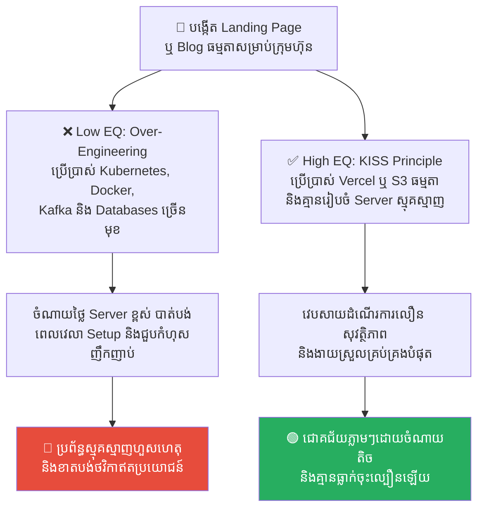
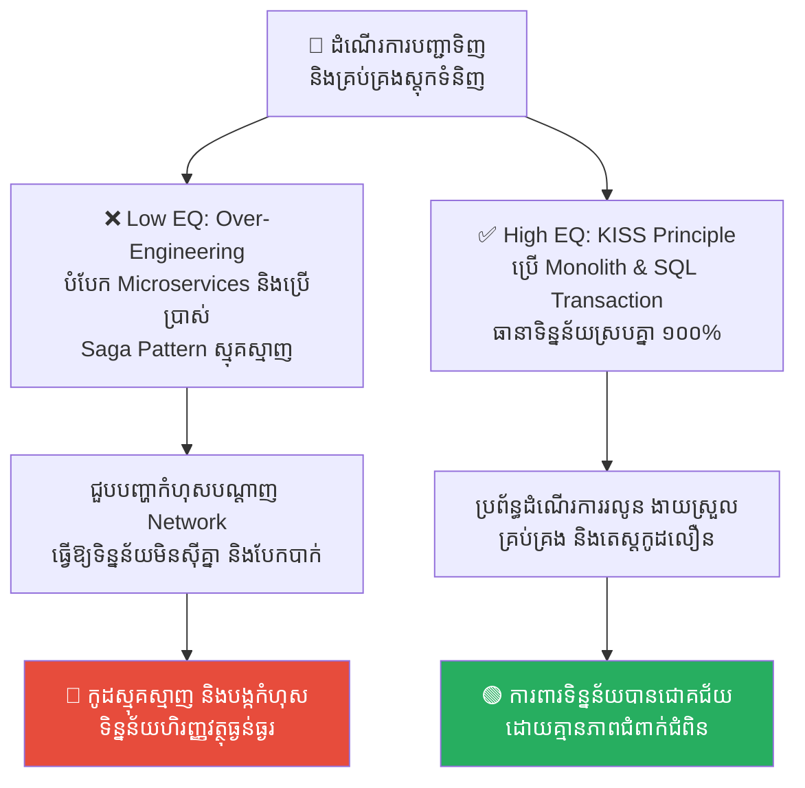
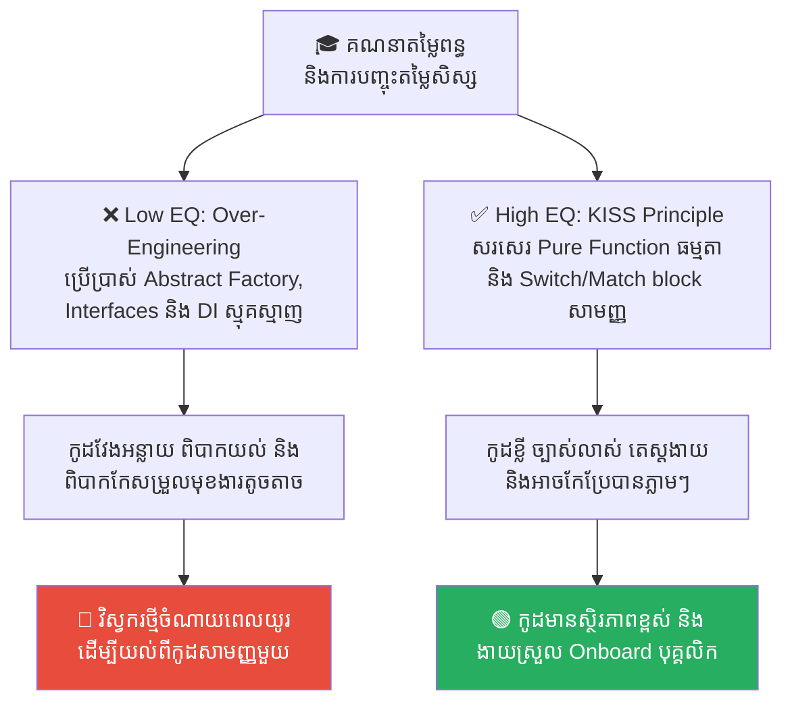
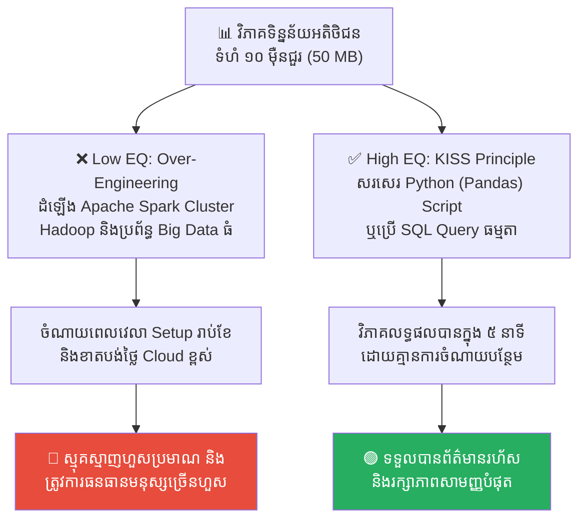
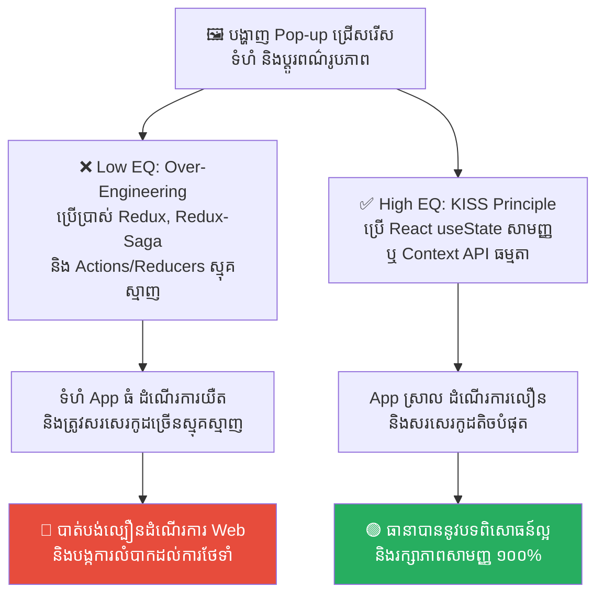

# The Gordian Knot: Over-Engineering and the KISS Principle (ចំណងហ្គ័រដៀន៖ ការរចនាប្រព័ន្ធស្មុគស្មាញជ្រុល និងគោលការណ៍ភាពសាមញ្ញ)

**Author:** ichamrong  
**Date:** 2026-05-17  
**Tags:** #over-engineering #kiss-principle #refactoring #alexander-the-great #software-architecture  
**Category:** Concepts  
**Read Time:** ~15 min  

---

## 📌 មាតិកា (Table of Contents)
- [លំនាំបញ្ហា (The Pattern)](#លំនាំបញ្ហា-the-pattern)
- [១. បញ្ហា៖ ចំណងហ្គ័រដៀនក្នុងបច្ចេកវិទ្យា (The Issue: Over-Engineering and Artificial Complexity)](#១-បញ្ហា-ចំណងហ្គ័រដៀនក្នុងបច្ចេកវិទ្យា-the-issue-over-engineering-and-artificial-complexity)
- [២. ឧទាហរណ៍ជាក់ស្តែងក្នុងពិភពពិត (Real World Examples)](#២-ឧទាហរណ៍ជាក់ស្តែងក្នុងពិភពពិត)
  - [ឧទាហរណ៍ទី ១ — ការដំឡើងប្រព័ន្ធស្មុគស្មាញសម្រាប់ Blog ធម្មតា (Kubernetes for a Simple Blog vs. Static Web Hosting)](#ឧទាហរណ៍ទី-១-ការដំឡើងប្រព័ន្ធស្មុគស្មាញសម្រាប់-blog-ធម្មតា-kubernetes-for-a-simple-blog-vs-static-web-hosting)
  - [ឧទាហរណ៍ទី ២ — ការប្រើប្រាស់ Distributed Transactions សម្រាប់ CRUD សាមញ្ញ (Distributed Saga Pattern vs. Database Transaction)](#ឧទាហរណ៍ទី-២-ការប្រើប្រាស់-distributed-transactions-សម្រាប់-crud-សាមញ្ញ-distributed-saga-pattern-vs-database-transaction)
  - [ឧទាហរណ៍ទី ៣ — ការរចនាកូដស្មុគស្មាញជ្រុលសម្រាប់មុខងារសាមញ្ញ (Abstract Factory Overkill vs. Pure Functions)](#ឧទាហរណ៍ទី-៣-ការរចនាកូដស្មុគស្មាញជ្រុលសម្រាប់មុខងារសាមញ្ញ-abstract-factory-overkill-vs-pure-functions)
  - [ឧទាហរណ៍ទី ៤ — ការប្រើប្រាស់ប្រព័ន្ធ Big Data សម្រាប់ទិន្នន័យតូចតាច (Hadoop/Spark vs. Simple SQL/Python Scripts)](#ឧទាហរណ៍ទី-៤-ការប្រើប្រាស់ប្រព័ន្ធ-big-data-សម្រាប់ទិន្នន័យតូចតាច-hadoopspark-vs-simple-sqlpython-scripts)
  - [ឧទាហរណ៍ទី ៥ — ការគ្រប់គ្រង State ស្មុគស្មាញលើ Web ធម្មតា (Redux-Saga vs. Component State/Context API)](#ឧទាហរណ៍ទី-៥-ការគ្រប់គ្រង-state-ស្មុគស្មាញលើ-web-ធម្មតា-redux-saga-vs-component-statecontext-api)
- [៣. កត្តាជម្រុញ៖ ការគិតមុនហួសហេតុ និងចង់បង្ហាញសមត្ថភាព (The Aggravator: Premature Optimization & Showcasing Ego)](#៣-កត្តាជម្រុញ-ការគិតមុនហួសហេតុ-និងចង់បង្ហាញសមត្ថភាព-the-aggravator-premature-optimization-showcasing-ego)
- [៤. ដំណោះស្រាយទូទៅ៖ របៀបកាត់ចំណង និងរក្សាភាពសាមញ្ញ (The General Solution: Cutting the Knot and Embracing Simplicity)](#៤-ដំណោះស្រាយទូទៅ-របៀបកាត់ចំណង-និងរក្សាភាពសាមញ្ញ-the-general-solution-cutting-the-knot-and-embracing-simplicity)
- [សេចក្តីសន្និដ្ឋាន (Conclusion)](#សេចក្តីសន្និដ្ឋាន-conclusion)
- [Related Posts](#related-posts)

---

## លំនាំបញ្ហា (The Pattern)

នៅក្នុងប្រវត្តិសាស្ត្រក្រិកបុរាណ មានរឿងព្រេងមួយនិយាយអំពី **ចំណងហ្គ័រដៀន (The Gordian Knot)** ដែលជាចំណងខ្សែពួរដ៏ស្មុគស្មាញ និងរញ៉េរញ៉ៃបំផុត ដែលត្រូវបានចងដោយស្តេចហ្គ័រដៀស។ ទេវកថាបានទាយថា៖ **«អ្នកណាដែលអាចស្រាយចំណងនេះបាន នឹងក្លាយជាស្តេចគ្រប់គ្រងទ្វីបអាស៊ីទាំងមូល»**។ មហាក្សត្រ មេទ័ព និងអ្នកប្រាជ្ញរាប់ពាន់នាក់ បានព្យាយាមស្រាយវាដោយប្រើការអត់ធ្មត់ និងវិធីសាស្ត្រធម្មតា ប៉ុន្តែទាំងអស់គ្នាត្រូវទទួលបរាជ័យ ព្រោះខ្សែពួរនោះមានសភាពជំពាក់ជំពិនគ្នាខ្លាំងពេក រហូតដល់រកចុងមិនឃើញឡើយ។

នៅឆ្នាំ ៣៣៣ មុនគស ព្រះចៅអធិរាជ **អាឡិចសាន់ឌឺ មហារាជ (Alexander the Great)** បានយាងមកដល់ប្រាសាទ និងសម្លឹងមើលចំណងនោះ។ ព្រះអង្គមិនបានចំណាយពេលច្រើន ដើម្បីអង្គុយរាវរកចុងខ្សែឡើយ។ ព្រះអង្គបានដកដាវដ៏មុតស្រួចចេញពីស្រោម រួចកាប់ចំណងនោះជាពីរត្រឹមមួយដាវភ្លាមៗ! ចំណងដ៏ស្មុគស្មាញរាប់រយឆ្នាំ ត្រូវបានដោះស្រាយភ្លាមៗត្រឹមមួយវិនាទី ដោយការសម្រេចចិត្តដ៏សាមញ្ញ និងក្លាហានបំផុត។

នៅក្នុងការអភិវឌ្ឍន៍កម្មវិធី (Software Engineering) យើងតែងតែបង្កើត «ចំណងហ្គ័រដៀន» ផ្ទាល់ខ្លួនរបស់យើងជានិច្ច៖
*   កូដដែលសរសេរឡើងវែងអន្លាយ ស្មុគស្មាញ និងជំពាក់ជំពិនគ្នាដូចសំណាញ់ពីងពាង (Spaghetti Code)។
*   ស្ថាបត្យកម្មប្រព័ន្ធ (System Architecture) ដែលប្រើប្រាស់បច្ចេកវិទ្យាច្រើនហួសហេតុ សម្រាប់តែដោះស្រាយបញ្ហាសាមញ្ញមួយ។

បាតុភូតនេះត្រូវបានគេហៅថា **Over-Engineering (ការរចនាស្មុគស្មាញជ្រុល)**។ ចំណងទាំងនេះ ជារឿយៗមិនត្រូវការការអង្គុយស្រាយយូរខែឡើយ ប៉ុន្តែវាត្រូវការការប្រើប្រាស់ «ដាវរបស់អាឡិចសាន់ឌឺ» ដើម្បីកាត់ចោល និងរក្សាភាពសាមញ្ញ។

---

## ១. បញ្ហា៖ ចំណងហ្គ័រដៀនក្នុងបច្ចេកវិទ្យា (The Issue: Over-Engineering and Artificial Complexity)

វិស្វករដ៏ឆ្នើម មិនមែនជាអ្នកដែលបង្កើតប្រព័ន្ធដ៏ស្មុគស្មាញរហូតដល់គ្មាននរណាម្នាក់អានយល់ ឬមានតែខ្លួនឯងម្នាក់គត់ដែលយល់នោះទេ។ ផ្ទុយទៅវិញ វិស្វករដ៏ពូកែ គឺជាអ្នកដែលយកបញ្ហាដ៏ស្មុគស្មាញបំផុត មកដោះស្រាយដោយវិធីសាស្ត្រដ៏សាមញ្ញបំផុត។

ទោះជាយ៉ាងណាក៏ដោយ នៅក្នុងវិស័យបច្ចេកវិទ្យា យើងតែងតែឃើញមាន **Over-Engineering** កើតឡើងជានិច្ច ព្រោះ៖
*   **ការសន្មតអនាគតហួសហេតុ (Premature Optimization)៖** ការគិតបារម្ភពីបញ្ហាដែលមិនទាន់កើតមាន (ដូចជា ខ្លាចមាន User រាប់លាននាក់ ទាំងដែលសព្វថ្ងៃមានតែ ១០០ នាក់)។
*   **ចំណង់ចង់សាកល្បងបច្ចេកវិទ្យាថ្មី (Tech-Stack Ego)៖** វិស្វករចង់ដាក់ឧបករណ៍ថ្មីៗ ដូចជា Kubernetes, Kafka, Microservices ចូលទៅក្នុងប្រវត្តិរូបសង្ខេបរបស់ខ្លួន (Resume-Driven Development) ដោយមិនខ្វល់ពីតម្រូវការជាក់ស្តែងរបស់អាជីវកម្ម។

លទ្ធផលគឺ ប្រព័ន្ធកម្មវិធីក្លាយជាចំណងហ្គ័រដៀន ដែលពិបាកថែទាំ ពិបាករកកំហុស (Debug) ចំណាយថវិការខ្ពស់លើ Server និងធ្វើឱ្យល្បឿននៃការបញ្ចេញផលិតផល (Time to Market) ធ្លាក់ចុះយ៉ាងខ្លាំង។

---

## ២. ឧទាហរណ៍ជាក់ស្តែងក្នុងពិភពពិត

សូមពិនិត្យមើល **ឧទាហរណ៍ជាក់ស្តែងចំនួន ៥** បង្ហាញពីគ្រោះថ្នាក់នៃ Over-Engineering និងរបៀបដោះស្រាយតាមគោលការណ៍ភាពសាមញ្ញ៖

---

### ឧទាហរណ៍ទី ១ — ការដំឡើងប្រព័ន្ធស្មុគស្មាញសម្រាប់ Blog ធម្មតា (Kubernetes for a Simple Blog vs. Static Web Hosting)

**ស្ថានភាព៖** ក្រុមហ៊ុនចង់បង្កើតវេបសាយ Landing Page ឬ Blog ធម្មតាមួយសម្រាប់បង្ហាញព័ត៌មានក្រុមហ៊ុន និងការផ្សព្វផ្សាយផលិតផល ដែលមានអ្នកចូលមើលប្រហែល ១០០ នាក់ក្នុងមួយថ្ងៃ។

*   **សកម្មភាពអសកម្ម / Low EQ / កំហុសឆ្គង (ចងចំណងហ្គ័រដៀន)៖** វិស្វករបានរចនាប្រព័ន្ធដោយប្រើប្រាស់ Kubernetes Cluster, Docker Containers ចំនួន ៥, ប្រើប្រាស់ Kafka សម្រាប់ផ្ញើសារប្រព័ន្ធ និង databases ពីរផ្សេងគ្នា ព្រោះ៖ *«យើងត្រូវរៀបចំប្រព័ន្ធឱ្យមានស្ថិរភាពខ្ពស់ និងអាច Scale បានកម្រិតសកលនាពេលអនាគត!»*។
*   **សកម្មភាពស្ថាបនា / High EQ / ដំណោះស្រាយ (កាត់ចំណងដោយភាពសាមញ្ញ)៖** អនុវត្ត **Static Web Hosting & Headless CMS (ដូចជា Vercel, Netlify, ឬ AWS S3)**។ ប្រើប្រាស់ HTML/CSS/JS ធម្មតា និងទាញយកទិន្នន័យពី Headless CMS សាមញ្ញមួយ ដើម្បីបង្ហាញព័ត៌មាន។
*   **លទ្ធផល៖** ប្រព័ន្ធ Kubernetes បង្កជាកំហុសស្មុគស្មាញ ចំណាយថ្លៃ Server រាប់រយដុល្លារ និងត្រូវការពេលវេលាច្រើនដើម្បី Setup ហេដ្ឋារចនាសម្ព័ន្ធ។ ដំណោះស្រាយសាមញ្ញ ជួយឱ្យវេបសាយដំណើរការលឿន សុវត្ថិភាពខ្ពស់បំផុត និងស្ទើរតែគ្មានការចំណាយប្រចាំខែឡើយ។

---

### ឧទាហរណ៍ទី ២ — ការប្រើប្រាស់ Distributed Transactions សម្រាប់ CRUD សាមញ្ញ (Distributed Saga Pattern vs. Database Transaction)

**ស្ថានភាព៖** កម្មវិធីលក់ទំនិញថ្មីមួយ ត្រូវការដំណើរការបញ្ជាទិញ (Order) និងកាត់ស្តុកទំនិញ (Inventory) ធម្មតា។

*   **សកម្មភាពអសកម្ម / Low EQ / កំហុសឆ្គង (ចងចំណងហ្គ័រដៀន)៖** វិស្វករបំបែកប្រព័ន្ធទៅជា Microservices ពីរផ្សេងគ្នា គឺ Order Service និង Inventory Service ដោយប្រើប្រាស់ **Distributed Transactions (ដូចជា Saga Pattern ឬ Two-Phase Commit)** ព្រោះយល់ថានេះជាស្តង់ដារទំនើប។ ពេលដំណើរការ ជួបបញ្ហា Network Failure ធ្វើឱ្យទិន្នន័យស្តុក និងការកុម្ម៉ង់លុយមិនស៊ីគ្នា បង្កជា Bug ស្មុគស្មាញបំផុត។
*   **សកម្មភាពស្ថាបនា / High EQ / ដំណោះស្រាយ (កាត់ចំណងដោយភាពសាមញ្ញ)៖** អនុវត្ត **Monolith with ACID Database Transactions**។ រក្សាទុកមុខងារទាំងពីរនៅក្នុងកម្មវិធី Monolith រួមមួយ និងប្រើប្រាស់ Database Transaction សាមញ្ញ (ដូចជា PostgreSQL `BEGIN; COMMIT;`) ដើម្បីធានាភាពស៊ីគ្នានៃទិន្នន័យ ១០០%។
*   **លទ្ធផល៖** ការប្រើ Saga Pattern នាំឱ្យកូដវែងអន្លាយ ពិបាកតេស្ត និងបង្កឱ្យមានបញ្ហាទិន្នន័យមិនស៊ីគ្នា។ ស្ថាបត្យកម្ម Monolith ជួយឱ្យទិន្នន័យមានស្ថិរភាពខ្ពស់ ងាយស្រួលយល់ និងដោះស្រាយបញ្ហាបានលឿនជាងមុន ១០ ដង។

---

### ឧទាហរណ៍ទី ៣ — ការរចនាកូដស្មុគស្មាញជ្រុលសម្រាប់មុខងារសាមញ្ញ (Abstract Factory Overkill vs. Pure Functions)

**ស្ថានភាព៖** កម្មវិធីគ្រប់គ្រងសាលារៀន ត្រូវការគណនាតម្លៃពន្ធ និងការបញ្ចុះតម្លៃសិក្សាទៅតាមប្រភេទសិស្សផ្សេងគ្នា (សិស្សពូកែ, សិស្សក្រីក្រ, សិស្សធម្មតា)។

*   **សកម្មភាពអសកម្ម / Low EQ / កំហុសឆ្គង (ចងចំណងហ្គ័រដៀន)៖** វិស្វករបានសរសេរ Class និង Interfaces រាប់សិប ដូចជា `AbstractDiscountFactory`, `DiscountStrategyInterface`, `DiscountContext`, និងដំឡើងប្រព័ន្ធ Dependency Injection ដ៏ធំ ដើម្បីគ្រាន់តែគណនាភាគរយបញ្ចុះតម្លៃ ៣ ប្រភេទ។ គាត់គិតថា៖ *«ដើម្បីឱ្យកូដមានភាពបត់បែន និងអាចពង្រីកបាននៅថ្ងៃក្រោយ!»*។
*   **សកម្មភាពស្ថាបនា / High EQ / ដំណោះស្រាយ (កាត់ចំណងដោយភាពសាមញ្ញ)៖** អនុវត្ត **Simple Pure Functions & Match Statements**។ សរសេរមុខងារជាលក្ខណៈ Pure Function សាមញ្ញមួយ ដែលទទួលយកប្រភេទសិស្ស រួចប្រើ Switch/Match block ឬ Dictionary Map ធម្មតា ដើម្បីគណនាតម្លៃត្រឡប់មកវិញ។
*   **លទ្ធផល៖** ការប្រើ Abstract Factory ធ្វើឱ្យវិស្វករថ្មីពិបាកយល់កូដ និងចំណាយពេលយូរដើម្បីកែសម្រួល។ មុខងារ Pure Function សាមញ្ញ ជួយឱ្យកូដខ្លី ច្បាស់លាស់ ងាយស្រួលតេស្ត (Unit Test) និងអាចកែសម្រួលបានភ្លាមៗក្នុងរយៈពេល ១ នាទី។

---

### ឧទាហរណ៍ទី ៤ — ការប្រើប្រាស់ប្រព័ន្ធ Big Data សម្រាប់ទិន្នន័យតូចតាច (Hadoop/Spark vs. Simple SQL/Python Scripts)

**ស្ថានភាព៖** ក្រុមហ៊ុន Startup មួយ ចង់ធ្វើការវិភាគទិន្នន័យចុះឈ្មោះប្រចាំខែរបស់អតិថិជន ដែលមានទំហំប្រហែល ១០ ម៉ឺនជួរ (ទំហំប្រហែល 50 MB)។

*   **សកម្មភាពអសកម្ម / Low EQ / កំហុសឆ្គង (ចងចំណងហ្គ័រដៀន)៖** ក្រុមការងារបានសម្រេចចិត្តដំឡើងប្រព័ន្ធ Apache Hadoop, Apache Spark Cluster, និង Data Lake ដ៏ធំនៅលើ Cloud ព្រោះយល់ថា៖ *«យើងត្រូវតែរៀបចំប្រព័ន្ធវិភាគ Big Data ឱ្យស្របតាមស្តង់ដារបច្ចេកវិទ្យាទំនើប!»*។
*   **សកម្មភាពស្ថាបនា / High EQ / ដំណោះស្រាយ (កាត់ចំណងដោយភាពសាមញ្ញ)៖** អនុវត្ត **Simple Python Script (Pandas) or SQL Queries**។ ប្រើប្រាស់ Script ភាសា Python ធម្មតា ឬសរសេរ SQL Query សាមញ្ញនៅលើ Database PostgreSQL ដែលមានស្រាប់ ដើម្បីទាញយកព័ត៌មានវិភាគ។
*   **លទ្ធផល៖** ការដំឡើង Spark/Hadoop នាំឱ្យខាតបង់ពេលវេលា Setup រាប់ខែ ចំណាយលុយរាប់ពាន់ដុល្លារលើ Cloud និងត្រូវការបុគ្គលិកជំនាញពិសេសដើម្បីគ្រប់គ្រង។ ដំណោះស្រាយសាមញ្ញ អាចរត់ដោះស្រាយបញ្ហាបានភ្លាមៗក្នុងរយៈពេលប៉ុន្មាននាទី ដោយគ្មានការចំណាយបន្ថែមឡើយ។

---

### ឧទាហរណ៍ទី ៥ — ការគ្រប់គ្រង State ស្មុគស្មាញលើ Web ធម្មតា (Redux-Saga vs. Component State/Context API)

**ស្ថានភាព៖** គេហទំព័រផ្សព្វផ្សាយផលិតផល ត្រូវការបង្ហាញផ្ទាំង Pop-up ជ្រើសរើសទំហំ និងប្តូរពណ៌រូបភាពផលិតផលបន្តិចបន្តួច។

*   **សកម្មភាពអសកម្ម / Low EQ / កំហុសឆ្គង (ចងចំណងហ្គ័រដៀន)៖** វិស្វករបានដំឡើង Redux, Redux-Saga, Actions, Reducers, Selectors និង Middleware ដ៏ស្មុគស្មាញ ដើម្បីគ្រាន់តែបើកបិទ Pop-up ពីរ ឬបី និងប្តូរពណ៌រូបភាព។ គាត់គិតថា៖ *«ដើម្បីកុំឱ្យមានបញ្ហា State-drilling និងមានរចនាសម្ព័ន្ធល្អ!»*។
*   **សកម្មភាពស្ថាបនា / High EQ / ដំណោះស្រាយ (កាត់ចំណងដោយភាពសាមញ្ញ)៖** អនុវត្ត **React Component State or Context API**។ ប្រើប្រាស់ React Hook សាមញ្ញ (`useState`) ឬ `useContext` ដើម្បីបញ្ជូន State រវាង Components ដែលនៅជិតគ្នា។
*   **លទ្ធផល៖** ការប្រើ Redux-Saga ធ្វើឱ្យទំហំ Web App ធំ (Bundle Size) ដើរយឺត និងសរសេរកូដច្រើនស្មុគស្មាញហួសហេតុ។ ការប្រើប្រាស់ Component State ធម្មតា ជួយឱ្យ App ស្រាល ដំណើរការលឿនបំផុត និងងាយស្រួលថែទាំ។

---

## ៣. កត្តាជម្រុញ៖ ការគិតមុនហួសហេតុ និងចង់បង្ហាញសមត្ថភាព (The Aggravator: Premature Optimization & Showcasing Ego)

ហេតុអ្វីបានជាយើងងាយនឹងបង្កើត «ចំណងហ្គ័រដៀន» នៅក្នុងប្រព័ន្ធកូដខ្លាំងម្ល៉េះ? កត្តាជម្រុញរួមមាន៖

1.  **ការរចនាដើម្បីទម្រង់ប្រវត្តិរូប (Resume-Driven Development)៖** វិស្វករតែងតែចង់ប្រើប្រាស់បច្ចេកវិទ្យាថ្មីៗ និងពេញនិយមបំផុត (Trend) ទោះបីជាវាមិនសមស្របនឹងគម្រោងក៏ដោយ ដើម្បីយកទៅដាក់ក្នុងប្រវត្តិរូបការងាររបស់ខ្លួន (Resume) សម្រាប់ស្វែងរកការងារថ្មី។
2.  **ការគិតខ្វល់ពីអនាគតហួសហេតុ (Premature Scaling & Optimization)៖** ការភ័យខ្លាចថាប្រព័ន្ធនឹងត្រូវរលំនៅពេលមានអតិថិជនរាប់លាននាក់ ធ្វើឱ្យពួកគេរៀបចំប្រព័ន្ធការពារហួសកម្រិត តាំងពីថ្ងៃដំបូងដែល App មិនទាន់មាន User ម្នាក់ចុះឈ្មោះនៅឡើយ។
3.  **ភាពស្មុគស្មាញត្រូវបានយល់ច្រឡំថាជាភាពឆ្លាតវៃ (Complexity Bias)៖** មនុស្សយើងតែងតែយល់ថា អ្វីដែលស្មុគស្មាញ គឺឆ្លាតវៃ និងអស្ចារ្យ។ ផ្ទុយទៅវិញ ពួកគេយល់ថា អ្វីដែលសាមញ្ញ គឺទន់ខ្សោយ និងមិនសូវមានតម្លៃ។ នេះជាការគិតខុសឆ្គងទាំងស្រុង នៅក្នុងវិស័យវិស្វកម្ម។

---

## ៤. ដំណោះស្រាយទូទៅ៖ របៀបកាត់ចំណង និងរក្សាភាពសាមញ្ញ (The General Solution: Cutting the Knot and Embracing Simplicity)

ដើម្បីការពារ និងដោះស្រាយបញ្ហា Over-Engineering ចូរអនុវត្តគោលការណ៍ខាងក្រោម៖

1.  **ប្រកាន់ខ្ជាប់គោលការណ៍ KISS (Keep It Simple, Stupid)៖** រាល់ពេលដែលអ្នកចង់បន្ថែមបច្ចេកវិទ្យាថ្មី ឬ Class ថ្មី ចូរសួរខ្លួនឯងថា៖ *«តើមានវិធីណាដែលសាមញ្ញជាងនេះ ដើម្បីដោះស្រាយបញ្ហានេះដែរឬទេ?»* ប្រសិនបើមាន ចូរជ្រើសរើសវិធីសាមញ្ញនោះជានិច្ច។
2.  **យុទ្ធសាស្ត្រអាឡិចសាន់ឌឺ (The Alexander Solution - Rewrite Module ថ្មី)៖** ប្រសិនបើអ្នកជួបប្រទះប្រព័ន្ធកូដចាស់ (Legacy Code) ដែលស្មុគស្មាញរញ៉េរញ៉ៃខ្លាំង រហូតដល់មិនអាច Refactor បាន ចូរឈប់ព្យាយាមអង្គុយស្រាយវា។ ផ្ទុយទៅវិញ ចូរប្រើដាវកាត់វាចោល៖ បង្កើត Module ថ្មីសាមញ្ញមួយនៅក្បែរនោះ (ដោយប្រើ Strangler Fig Pattern) រួចផ្ទេរការងារទៅរបស់ថ្មី និងលុបចោលកូដចាស់ដ៏ស្មុគស្មាញនោះចោលទាំងស្រុង។
3.  **គោលការណ៍ YAGNI (You Aren't Gonna Need It)៖** កុំសរសេរកូដ ឬដំឡើងប្រព័ន្ធសម្រាប់មុខងារដែលអ្នក «ស្មាន» ថាអនាគតអាចនឹងត្រូវការ។ ចូរសរសេរតែកូដដែលត្រូវការសម្រាប់ថ្ងៃនេះប៉ុណ្ណោះ។
4.  **ការរត់តេស្តច្បាស់លាស់ (Robust Unit Testing)៖** នៅពេលប្រព័ន្ធរបស់អ្នកសាមញ្ញ វានឹងងាយស្រួលសរសេរ Unit Test។ ការមានតេស្តគ្រប់គ្រាន់ នឹងជួយឱ្យអ្នកមានទំនុកចិត្តក្នុងការលុបកូដដែលមិនចាំបាច់ចោល ជៀសវាងការគរទុកកូដឥតប្រយោជន៍។

---

## សេចក្តីសន្និដ្ឋាន (Conclusion)

**ចំណងហ្គ័រដៀន និងការរចនាស្មុគស្មាញជ្រុល (Over-Engineering)** បង្រៀនយើងថា ភាពអស្ចារ្យពិតប្រាកដនៅក្នុងវិស័យបច្ចេកវិទ្យា មិនមែនកើតឡើងពីការសាងសង់មហាប្រាសាទដ៏ស្មុគស្មាញរញ៉េរញ៉ៃនោះទេ ប៉ុន្តែគឺកើតឡើងចេញពី **«សមត្ថភាពក្នុងការរក្សាភាពសាមញ្ញ ទោះបីជាស្ថិតក្នុងស្ថានភាពស្មុគស្មាញបំផុតក៏ដោយ»**។

ចងចាំថា៖ **«ដាវដែលមុតស្រួចបំផុតក្នុងការដោះស្រាយបញ្ហាបច្ចេកវិទ្យា គឺភាពសាមញ្ញ។ ចូរប្រើវាដើម្បីកាត់រាល់ចំណងដែលមិនចាំបាច់ចោល មុនពេលវាចងរឹតកម្មវិធីរបស់អ្នកឱ្យស្លាប់។»**

---

## Related Posts

*   **[26 The Labyrinth and Spaghetti Code](./26-the-labyrinth-and-spaghetti-code.md)** — ភាពរញ៉េរញ៉ៃនៃកូដ និងសារៈសំខាន់នៃការកែសម្រួលឱ្យមានសណ្តាប់ធ្នាប់ឡើងវិញ។
*   **[10 Technical Debt and Refactoring](./10-technical-debt-and-refactoring.md)** — របៀបគ្រប់គ្រងបំណុលបច្ចេកទេស និងការសម្អាតប្រព័ន្ធការងារឱ្យមានភាពសាមញ្ញជានិច្ច។

---

*Last updated: 2026-05-26*
