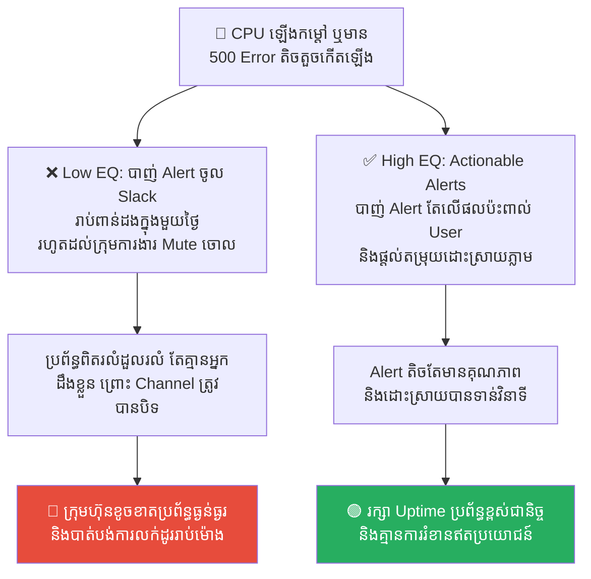
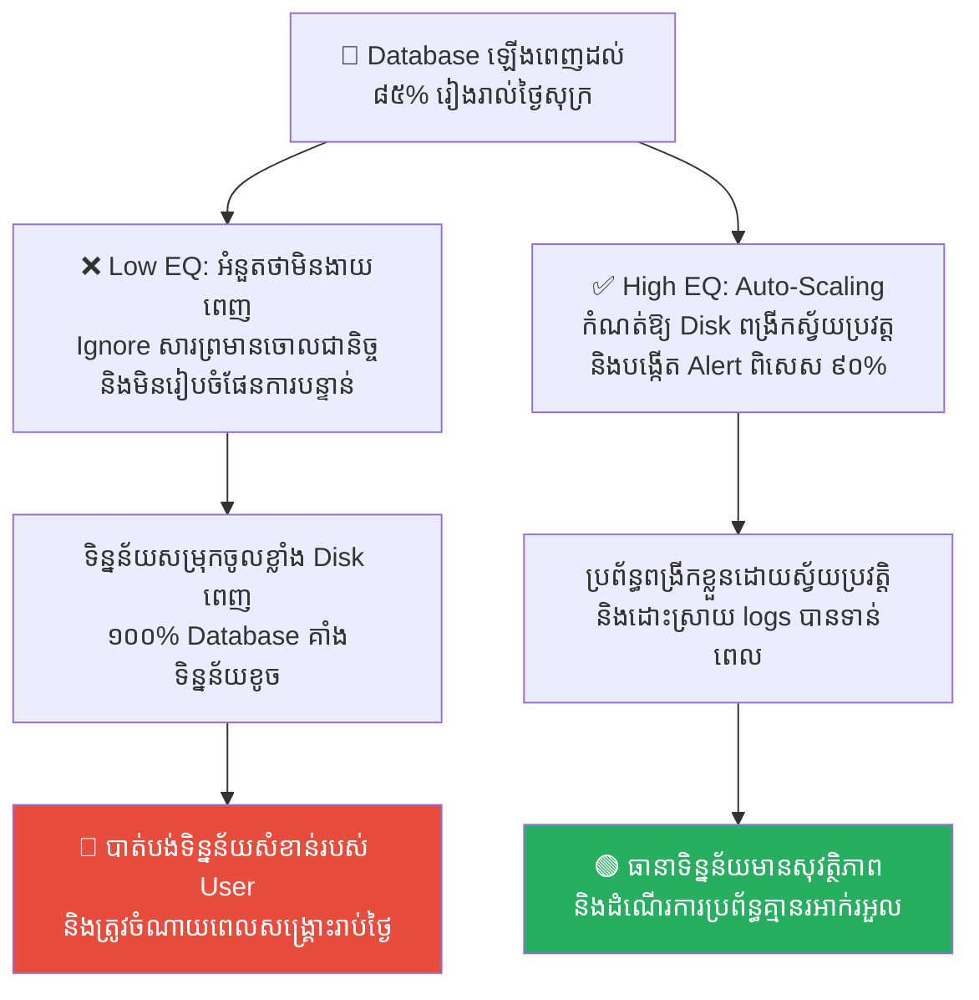
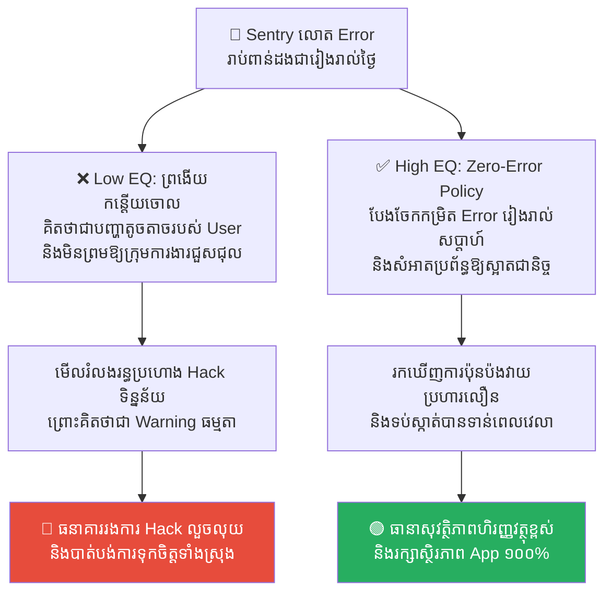
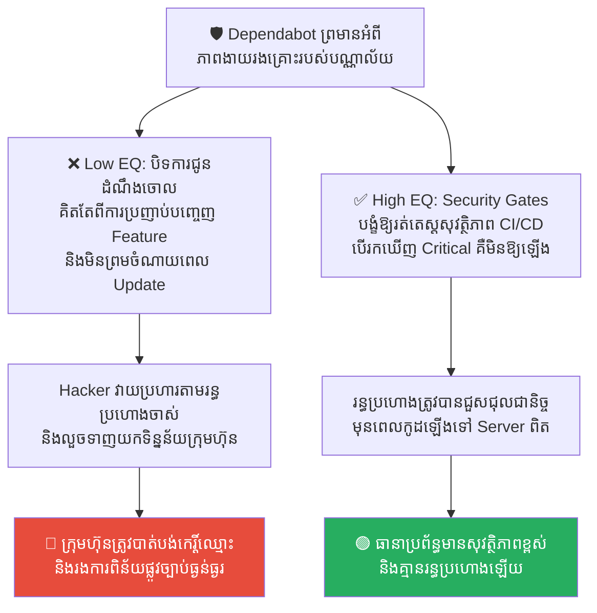
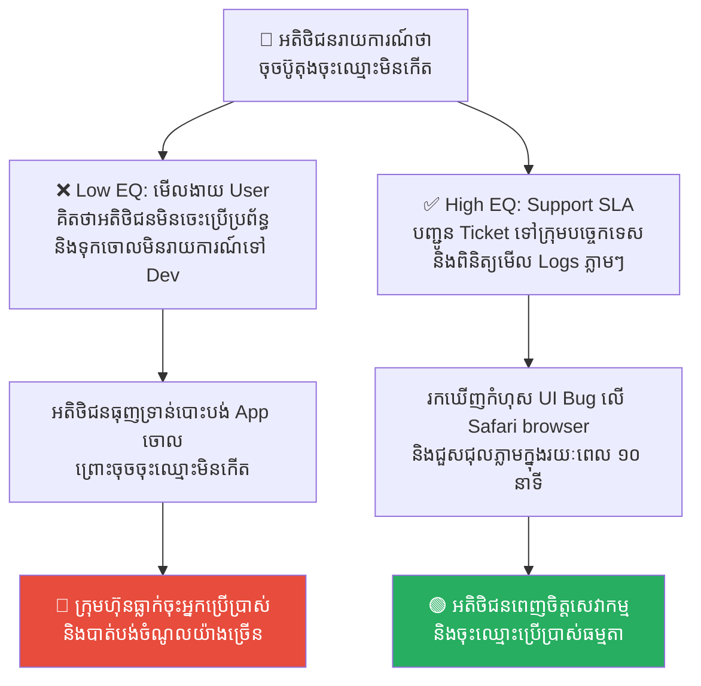

# The Titanic: Alert Fatigue and the Hubris of Unsinkable Systems (កប៉ាល់ទីតានិក៖ ការនឿយហត់នឹងសំឡេងរោទិ៍ និងអំនួតនៃប្រព័ន្ធដែលមិនចេះលិច)

**Author:** ichamrong  
**Date:** 2026-05-17  
**Tags:** #titanic #alert-fatigue #observability #system-failure #hubris #sre  
**Category:** Concepts  
**Read Time:** ~15 min  

---

## 📌 មាតិកា (Table of Contents)
- [លំនាំបញ្ហា (The Pattern)](#លំនាំបញ្ហា-the-pattern)
- [១. បញ្ហា៖ ជំងឺនឿយហត់នឹងសំឡេងរោទិ៍ និងអំនួតប្រព័ន្ធ (The Issue: Alert Fatigue and Hubris of the Unsinkable)](#១-បញ្ហា-ជំងឺនឿយហត់នឹងសំឡេងរោទិ៍-និងអំនួតប្រព័ន្ធ-the-issue-alert-fatigue-and-hubris-of-the-unsinkable)
- [២. ឧទាហរណ៍ជាក់ស្តែងក្នុងពិភពពិត (Real World Examples)](#២-ឧទាហរណ៍ជាក់ស្តែងក្នុងពិភពពិត)
  - [ឧទាហរណ៍ទី ១ — សារព្រមានរាប់ពាន់ក្នុង Slack (Slack Alert Flooding vs. Actionable Alerting)](#ឧទាហរណ៍ទី-១-សារព្រមានរាប់ពាន់ក្នុង-slack-slack-alert-flooding-vs-actionable-alerting)
  - [ឧទាហរណ៍ទី ២ — ការមិនអើពើនឹងការព្រមានទំហំផ្ទុក Database (Ignoring Disk Space Warning vs. Elastic Storage & Quota Alerts)](#ឧទាហរណ៍ទី-២-ការមិនអើពើនឹងការព្រមានទំហំផ្ទុក-database-ignoring-disk-space-warning-vs-elastic-storage-quota-alerts)
  - [ឧទាហរណ៍ទី ៣ — គំនរកំហុសក្នុង Sentry ដែលគ្មានអ្នកជួសជុល (Sentry Backlog vs. Zero-Error Policy)](#ឧទាហរណ៍ទី-៣-គំនរកំហុសក្នុង-sentry-ដែលគ្មានអ្នកជួសជុល-sentry-backlog-vs-zero-error-policy)
  - [ឧទាហរណ៍ទី ៤ — ការមិនអើពើនឹងរន្ធប្រហោងសុវត្ថិភាព (Ignoring Dependabot Alerts vs. Mandatory Security Gates)](#ឧទាហរណ៍ទី-៤-ការមិនអើពើនឹងរន្ធប្រហោងសុវត្ថិភាព-ignoring-dependabot-alerts-vs-mandatory-security-gates)
  - [ឧទាហរណ៍ទី ៥ — ការមើលរំលងការរាយការណ៍ Bug ពីអតិថិជន (Ignoring Support Tickets vs. Bug Replication SLA)](#ឧទាហរណ៍ទី-៥-ការមើលរំលងការរាយការណ៍-bug-ពីអតិថិជន-ignoring-support-tickets-vs-bug-replication-sla)
- [៣. កត្តាជម្រុញ៖ សារឥតប្រយោជន៍ច្រើនពេក និងអាទិភាពលំអៀង (The Aggravator: Noise Flooding & Wrong Priorities)](#៣-កត្តាជម្រុញ-សារឥតប្រយោជន៍ច្រើនពេក-និងអាទិភាពលំអៀង-the-aggravator-noise-flooding-wrong-priorities)
- [៤. ដំណោះស្រាយទូទៅ៖ របៀបបំពាក់ទូកសង្គ្រោះ និងរៀបចំប្រព័ន្ធព្រមាន (The General Solution: Implementing Actionable Observability)](#៤-ដំណោះស្រាយទូទៅ-របៀបបំពាក់ទូកសង្គ្រោះ-និងរៀបចំប្រព័ន្ធព្រមាន-the-general-solution-implementing-actionable-observability)
- [សេចក្តីសន្និដ្ឋាន (Conclusion)](#សេចក្តីសន្និដ្ឋាន-conclusion)
- [Related Posts](#related-posts)

---

## លំនាំបញ្ហា (The Pattern)

នៅយប់ថ្ងៃទី ១៤ ខែមេសា ឆ្នាំ ១៩១២ កប៉ាល់ទេសចរណ៍ដ៏ធំបំផុត និងទំនើបបំផុតក្នុងពិភពលោកគឺ **កប៉ាល់ទីតានិក (The Titanic)** បានបុកទង្គិចជាមួយផ្ទាំងទឹកកកយក្សមួយនៅមហាសមុទ្រអាត្លង់ទិកខាងជើង រួចលិចបាត់ទៅក្នុងបាតសមុទ្រត្រឹមតែរយៈពេល ២ ម៉ោង និង ៤០ នាទី បណ្តាលឱ្យមនុស្សជាង ១,៥០០ នាក់ត្រូវបាត់បង់ជីវិត។

សោកនាដកម្មនេះ មិនមែនកើតឡើងដោយសារតែសំណាងអាក្រក់ ឬគ្មានការព្រមាននោះទេ។ តាមពិតទៅ នៅយប់កើតហេតុនោះ បន្ទប់វិទ្យុទាក់ទងរបស់កប៉ាល់ទីតានិក **បានទទួលសារព្រមានអំពីផ្ទាំងទឹកកកជាច្រើនដង (រហូតដល់ ៦ ដង)** ពីកប៉ាល់ផ្សេងៗដែលធ្វើដំណើរនៅក្បែរនោះ។ ប៉ុន្តែសារព្រមានទាំងនោះត្រូវបានមើលរំលង និងព្រងើយកន្តើយជាបន្តបន្ទាប់។

ហេតុអ្វីបានជាកើតមានរឿងបែបនេះ?
1.  **អំនួតហួសហេតុ (Hubris)៖** វិស្វករ និងម្ចាស់កប៉ាល់មានមោទនភាពខ្លាំងចំពោះបច្ចេកវិទ្យាការពារទឹករបស់កប៉ាល់ រហូតដល់ប្រកាសក្តែងៗថា៖ *«សូម្បីតែព្រះជាម្ចាស់ ក៏មិនអាចធ្វើឱ្យកប៉ាល់នេះលិចបានដែរ»*។ ដោយសារតែអំនួតនេះ ពួកគេបានបំពាក់ទូកសង្គ្រោះ (Lifeboats) ត្រឹមតែពាក់កណ្តាលនៃចំនួនមនុស្សសរុប ព្រោះយល់ថាវាខ្ជះខ្ជាយ និងមិនចាំបាច់ឡើយ។
2.  **ការនឿយហត់នឹងសារព្រមាន (Alert Fatigue)៖** នៅយប់នោះ អ្នកបញ្ជូនសារវិទ្យុរបស់ទីតានិកមានភាពនឿយហត់ និងរវល់ខ្លាំងក្នុងការបញ្ជូនទូរលេខផ្ទាល់ខ្លួន (Telegram messages) របស់ភ្ញៀវលំដាប់ VIP នៅលើកប៉ាល់។ នៅពេលកប៉ាល់ *Californian* ដែលស្ថិតនៅក្បែរនោះ បានបញ្ជូនសារព្រមានចុងក្រោយអំពីផ្ទាំងទឹកកកដ៏គ្រោះថ្នាក់ អ្នកបញ្ជូនសារទីតានិកបានតបវិញទាំងខឹងសម្បារថា៖ *«បិទមាត់ទៅ! កុំរំខានខ្ញុំ ខ្ញុំកំពុងរវល់ការងារផ្ញើសារឱ្យភ្ញៀវ VIP!»*។ 

នៅក្នុងវិស័យវិស្វកម្មប្រព័ន្ធបច្ចេកវិទ្យា (Software and System Engineering) គំរូនៃសោកនាដកម្មទីតានិកនេះ កើតមានឡើងជារៀងរាល់ថ្ងៃ៖
*   ការជឿជាក់ហួសហេតុថាប្រព័ន្ធរបស់យើងរឹងមាំខ្លាំង មិនអាចគាំងបាន (Unsinkable System Hubris) នាំឱ្យគ្មានការរៀបចំផែនការសង្គ្រោះបន្ទាន់ (Disaster Recovery Plan)។
*   ការបង្កើតប្រព័ន្ធ Monitor ដែលលោតសារព្រមាន (Error Alerts) រាប់ពាន់ដងក្នុងមួយថ្ងៃ ធ្វើឱ្យវិស្វករជួបជំងឺ **Alert Fatigue** រហូតដល់ព្រងើយកន្តើយនឹងសញ្ញាព្រមានពិតប្រាកដ ដែលជា «ផ្ទាំងទឹកកក» ត្រៀមនឹងបុកទម្លាយប្រព័ន្ធកម្មវិធីឱ្យលិចលង់។

---

## ១. បញ្ហា៖ ជំងឺនឿយហត់នឹងសំឡេងរោទិ៍ និងអំនួតប្រព័ន្ធ (The Issue: Alert Fatigue and Hubris of the Unsinkable)

នៅក្នុងការគ្រប់គ្រងប្រព័ន្ធ Servers (System Monitoring & Observability) ជំងឺ **Alert Fatigue** គឺជាសត្រូវលាក់មុខដ៏គ្រោះថ្នាក់បំផុត។ វាកើតឡើងនៅពេលដែលប្រព័ន្ធ Monitor (ដូចជា Datadog, Prometheus, Sentry) ត្រូវបានកំណត់ឱ្យលោតសារ Alert ញឹកញាប់ពេក ចំពោះរាល់បញ្ហាតូចតាចដែលគ្មានឥទ្ធិពលដល់អាជីវកម្ម (ដូចជា CPU ឡើងដល់ ៧០% ត្រឹមរយៈពេល ១ វិនាទី ឬកំហុស Validation Error ធម្មតា)។

នៅពេលដែលទូរស័ព្ទ ឬ Slack របស់វិស្វកររោទិ៍រាប់រយដងក្នុងមួយថ្ងៃ ចិត្តសាស្ត្ររបស់មនុស្សនឹងចាប់ផ្តើម **«ស៊ាំនឹងសំឡេងនោះ រួចឈប់យកចិត្តទុកដាក់»**។ ពួកគេនឹងបង្កើត Rule ឱ្យសារ Alert ទាំងនោះទៅនៅក្នុង Folder ស្ងាត់ ឬឈប់មើលវាទាំងស្រុង។ 

នៅពេលដែលគ្រោះថ្នាក់ពិតប្រាកដលោតឡើង (ផ្ទាំងទឹកកកពិតប្រាកដ ដូចជា Database ជិតពេញ ឬទិន្នន័យអតិថិជនកំពុងត្រូវលុបចោល) វិស្វករនឹងអូសរំលងវាចោលភ្លាមៗ ព្រោះគិតថា៖ *«អូ! សារ Alert នេះលោតរាល់ថ្ងៃដដែលៗហ្នឹង តាំងពីខែមុនម្ល៉េះ កុំខ្វល់អី គ្មានរឿងអ្វីកើតឡើងទេ!»*។ ទីបំផុត មហន្តរាយដ៏ធំនឹងវាយប្រហារប្រព័ន្ធការងារទាំងស្រុង ដោយគ្មានអ្នកជួយសង្គ្រោះទាន់ពេលឡើយ។

---

## ២. ឧទាហរណ៍ជាក់ស្តែងក្នុងពិភពពិត

សូមពិនិត្យមើល **ឧទាហរណ៍ជាក់ស្តែងចំនួន ៥** បង្ហាញពីគ្រោះថ្នាក់នៃ Alert Fatigue និងរបៀបរៀបចំប្រព័ន្ធការពារ៖

---

### ឧទាហរណ៍ទី ១ — សារព្រមានរាប់ពាន់ក្នុង Slack (Slack Alert Flooding vs. Actionable Alerting)

**ស្ថានភាព៖** ក្រុមហ៊ុន Startup បង្កើតប្រព័ន្ធ monitor ដែលលោតសារ Slack ជូនដំណឹងជារៀងរាល់នាទី នៅពេលទំហំ CPU ឡើងលើស ៧០% ឬមាន 500 API Error តិចតួច។

*   **សកម្មភាពអសកម្ម / Low EQ / កំហុសឆ្គង (ការបំភាយសំឡេងរំខាន)៖** វិស្វករទទួលបានសារព្រមានជាង ១,០០០ ដងក្នុងមួយថ្ងៃ ធ្វើឱ្យពួកគេមានអារម្មណ៍ធុញទ្រាន់ និងធ្លាក់ចុះផលិតភាពការងារ។ ដើម្បីកុំឱ្យរំខាន ក្រុមការងារសម្រេចចិត្តចុច Mute (បិទសំឡេង) លើ Channel Slack នោះទាំងស្រុង។
*   **សកម្មភាពស្ថាបនា / High EQ / ដំណោះស្រាយ (ការបែងចែកអាទិភាពសកម្ម)៖** អនុវត្ត **Actionable Alerting & Severity Levels (ដូចជា PagerDuty)**។ កំណត់សាររោទិ៍ (High Alert) តែលើគម្រោងណាដែលមានផលប៉ះពាល់ផ្ទាល់ដល់ User ប៉ុណ្ណោះ (ដូចជា ទំព័រទូទាត់ប្រាក់គាំង ឬ Response time យឺតលើសពី ៥ វិនាទី រយៈពេល ៥ នាទីជាប់គ្នា)។ រាល់សារ Alert ទាំងអស់ត្រូវតែមានចំណុចដោះស្រាយច្បាស់លាស់ (Runbook Link)។ ចំពោះបញ្ហាតូចតាច ត្រូវរក្សាទុកក្នុង Logs សម្រាប់តែការវិភាគប្រចាំសប្តាហ៍ប៉ុណ្ណោះ។
*   **លទ្ធផល៖** ការបិទសំឡេង Slack ធ្វើឱ្យវិស្វករមើលរំលងពេល Database គាំងទាំងស្រុង ធ្វើឱ្យប្រព័ន្ធចុះខ្សោយ។ ការប្រើ Actionable Alerting ជួយឱ្យក្រុមការងារផ្តោតអារម្មណ៍ដោះស្រាយបញ្ហាធំបានលឿន និងគ្មានការរំខានឥតប្រយោជន៍។

---

### ឧទាហរណ៍ទី ២ — ការមិនអើពើនឹងការព្រមានទំហំផ្ទុក Database (Ignoring Disk Space Warning vs. Elastic Storage & Quota Alerts)

**ស្ថានភាព៖** Database Production របស់ក្រុមហ៊ុនលោតសារព្រមាន «Disk space is at 85%» ជារៀងរាល់ថ្ងៃសុក្រ ព្រោះប្រព័ន្ធ Backup ដំណើរការទាញយកទិន្នន័យបណ្តោះអាសន្ន។

*   **សកម្មភាពអសកម្ម / Low EQ / កំហុសឆ្គង (អំនួតប្រព័ន្ធ Unsinkable)៖** ថ្នាក់ដឹកនាំផ្នែកបច្ចេកវិទ្យានិយាយថា៖ *«កុំបារម្ភអី! ប្រព័ន្ធនេះរឹងមាំណាស់ គ្មានថ្ងៃពេញ Database ឡើយ ហើយម្យ៉ាងទៀត ថ្ងៃចន្ទវានឹងស្រកចុះវិញហើយ មិនបាច់ចំណាយពេលធ្វើអ្វីទេ ទុកវាចោលទៅ!»*។ ពួកគេប្រាប់ក្រុមការងារឱ្យ Ignore សារព្រមាននោះចោល។
*   **សកម្មភាពស្ថាបនា / High EQ / ដំណោះស្រាយ (ការការពារស្វ័យប្រវត្ត)៖** អនុវត្ត **Auto-Scaling Storage & Hard Quota Alerts**។ រៀបចំហេដ្ឋារចនាសម្ព័ន្ធ Cloud ឱ្យពង្រីកទំហំ Disk ដោយស្វ័យប្រវត្តិ (Elastic Volumes)។ ព្រមទាំងបង្កើត Alert ពិសេសដែលមានសិទ្ធិខ្ពស់ បើទំហំ Disk ឡើងដល់ ៩០% ត្រូវបាញ់សារទៅកាន់វិស្វករ SRE ដែលកំពុង On-Call ឱ្យចុះសម្អាត Logs ចាស់ៗចោលភ្លាមៗ។
*   **លទ្ធផល៖** ការព្រងើយកន្តើយបណ្តាលឱ្យថ្ងៃមួយ ទិន្នន័យថ្មីសម្រុកចូលមកខ្លាំង ធ្វើឱ្យ Disk ពេញ ១០០% Database គាំងទាំងស្រុង និងធ្វើឱ្យទិន្នន័យខូចខាត (Data Corruption)។ ដំណោះស្រាយស្វ័យប្រវត្តជួយការពារស្ថិរភាព និងធានាថាប្រព័ន្ធមិនងាយរលំ។

---

### ឧទាហរណ៍ទី ៣ — គំនរកំហុសក្នុង Sentry ដែលគ្មានអ្នកជួសជុល (Sentry Backlog vs. Zero-Error Policy)

**ស្ថានភាព៖** កម្មវិធីទូរស័ព្ទ (Mobile App) របស់ធនាគារមួយ លោតសារកំហុស (Uncaught Exceptions) រាប់ពាន់នៅលើ Sentry ជារៀងរាល់ថ្ងៃ។

*   **សកម្មភាពអសកម្ម / Low EQ / កំហុសឆ្គង (អំនួតប្រព័ន្ធ Unsinkable)៖** Team Lead និយាយទាំងព្រងើយកន្តើយថា៖ *«កុំបារម្ភអី! App យើងនៅតែដំណើរការធម្មតាតើ! Exceptions ទាំងនេះកើតឡើងលើតែទូរស័ព្ទចាស់ៗ ឬមកពីប្រព័ន្ធបណ្តាញរបស់ User ខ្សោយប៉ុណ្ណោះ មិនបាច់ចំណាយពេលជួសជុលទេ ទុកវាចោលទៅ!»*។
*   **សកម្មភាពស្ថាបនា / High EQ / ដំណោះស្រាយ (គោលការណ៍គ្មានកំហុស)៖** អនុវត្ត **Zero-Error Policy and Weekly Sentry Triaging**។ រាល់ Exceptions ដែលលោតឡើងលើ Sentry ត្រូវឆ្លងកាត់ការពិនិត្យ និងចាត់តាំង (Assign) ឱ្យវិស្វករជួសជុល ឬបិទចោលឱ្យអស់ជាប្រចាំសប្តាហ៍។ ប្រសិនបើវាជាកំហុសដែលគ្មានហានិភ័យ ត្រូវកែកូដឱ្យ Catch Exception និង Log វាទុកជា Info metrics ដើម្បីកុំឱ្យលោតរំខាននៅក្នុងប្រព័ន្ធ Alert Sentry ទៀត។
*   **លទ្ធផល៖** ការព្រងើយកន្តើយធ្វើឱ្យមើលរំលងកំហុស «Invalid Signature» ដែលជាការប៉ុនប៉ង Hack គណនីធនាគារលួចលុយ។ ការគ្រប់គ្រង error ច្បាស់លាស់ជួយការពារប្រព័ន្ធពីការលួចបន្លំ និងធានាសុវត្ថិភាព។

---

### ឧទាហរណ៍ទី ៤ — ការមិនអើពើនឹងរន្ធប្រហោងសុវត្ថិភាព (Ignoring Dependabot Alerts vs. Mandatory Security Gates)

**ស្ថានភាព៖** គម្រោងកម្មវិធីរបស់ក្រុមហ៊ុន មានប្រព័ន្ធ GitHub Dependabot លោតសារព្រមានអំពីភាពងាយរងគ្រោះរបស់បណ្ណាល័យចាស់ៗ (Security Vulnerabilities) ចំនួន ៥០ នៅក្នុងកូដ។

*   **សកម្មភាពអសកម្ម / Low EQ / កំហុសឆ្គង (អំនួតប្រព័ន្ធ Unsinkable)៖** Lead Developer បិទការជូនដំណឹង (Disable Dependabot alerts) ព្រោះ៖ *«យើងគ្មានពេលមក Update របស់ឥតប្រយោជន៍ទាំងនេះទេ ពួកយើងត្រូវប្រញាប់បញ្ចេញ Feature ថ្មីជូនអតិថិជនVIP ឱ្យទាន់ពេល!»*។
*   **សកម្មភាពស្ថាបនា / High EQ / ដំណោះស្រាយ (ការត្រួតពិនិត្យបង្ខំ)៖** អនុវត្ត **Mandatory Security Gates in CI/CD (OWASP Dependency-Check)**។ រាល់កូដដែលត្រូវ Merge ចូល Branch មេ ត្រូវតែឆ្លងកាត់ការពិនិត្យសុវត្ថិភាពស្វ័យប្រវត្តិ។ ប្រសិនបើប្រព័ន្ធរកឃើញភាពងាយរងគ្រោះកម្រិត High ឬ Critical នោះ Pipeline នឹងកាត់ផ្តាច់ (Fail Build) មិនអនុញ្ញាតឱ្យបញ្ចេញកូដនោះឡើយ រហូតដល់វិស្វករ Update បណ្ណាល័យនោះរួចរាល់។
*   **លទ្ធផល៖** ការមិនអើពើបណ្តាលឱ្យ Hacker វាយប្រហារចូលប្រព័ន្ធតាមរយៈរន្ធប្រហោងចាស់ ធ្វើឱ្យបាត់បង់ទិន្នន័យអតិថិជន និងរងការពិន័យផ្លូវច្បាប់។ ការបិទរន្ធប្រហោងស្វ័យប្រវត្ត ធានាបាននូវការការពារមាំមួនបំផុត។

---

### ឧទាហរណ៍ទី ៥ — ការមើលរំលងការរាយការណ៍ Bug ពីអតិថិជន (Ignoring Support Tickets vs. Bug Replication SLA)

**ស្ថានភាព៖** អតិថិជនមួយចំនួន បានរាយការណ៍ទៅកាន់ផ្នែកសេវាកម្មគាំទ្រ (Customer Support) ថាពួកគេមិនអាចចុចប៊ូតុង «យល់ព្រម» លើទំព័រលក្ខខណ្ឌថ្មីបានឡើយ។

*   **សកម្មភាពអសកម្ម / Low EQ / កំហុសឆ្គង (អំនួតប្រព័ន្ធ Unsinkable)៖** Support Manager មិនរាយការណ៍ទៅផ្នែកបច្ចេកទេសឡើយ ព្រោះយល់ថា៖ *«អតិថិជនទាំងនេះមិនសូវយល់ដឹងពីរបៀបប្រើ App ទើបចុចមិនកើត ព្រោះ App របស់យើងធ្វើតេស្តស្អាតហើយ មិនអាចខូចបែបនេះទេ!»*។
*   **សកម្មភាពស្ថាបនា / High EQ / ដំណោះស្រាយ (យន្តការឆ្លើយតបជាប្រព័ន្ធ)៖** រៀបចំប្រព័ន្ធ **Systematic Support Escalation with Bug Replication SLA**។ រាល់ការរាយការណ៍ពីអ្នកប្រើប្រាស់ ត្រូវឆ្លងកាត់ការផ្ទៀងផ្ទាត់ និងមានកិច្ចសន្យាកម្រិតសេវាកម្ម (SLA) សម្រាប់ក្រុមការងារបច្ចេកទេសចុះពិនិត្យ Logs ផ្ទាល់ខ្លួន ដើម្បីបញ្ជាក់ពីសភាពពិតនៃបញ្ហា និងដោះស្រាយឱ្យបានទាន់ពេល។
*   **លទ្ធផល៖** ការព្រងើយកន្តើយធ្វើឱ្យបាត់បង់អតិថិជនរាប់ពាន់នាក់ដែលមិនអាចចុះឈ្មោះប្រើប្រព័ន្ធបាន។ ដំណោះស្រាយប្រព័ន្ធ escalation ជួយស្វែងរកកំហុស UX/UI ទាន់ពេល និងជួយសម្រួលដល់ការលូតលាស់របស់ក្រុមហ៊ុន។

---

## ៣. កត្តាជម្រុញ៖ សារឥតប្រយោជន៍ច្រើនពេក និងអាទិភាពលំអៀង (The Aggravator: Noise Flooding & Wrong Priorities)

ហេតុអ្វីបានជាយើងងាយនឹងធ្លាក់ចូលទៅក្នុងជំងឺ Alert Fatigue និងបង្កើតប្រព័ន្ធមានអំនួតខ្លាំងម្ល៉េះ? កត្តាជម្រុញរួមមាន៖

1.  **ការរៀបចំប្រព័ន្ធព្រមានដោយខ្វះការគិត (Lazy Alert Configuration)៖** វិស្វករតែងតែប្រើប្រាស់ការរៀបចំលំនាំដើម (Default Settings) របស់កម្មវិធី Monitor ដោយបាញ់រាល់គ្រប់កំហុស ឬ Warning ទាំងអស់ចូលទៅកាន់ទូរស័ព្ទ ឬ Slack ព្រោះពួកគេខ្ជិលក្នុងការសម្រិតសម្រាំង និងបែងចែកកម្រិតកំហុស។
2.  ** សម្ពាធការងារ និងការផ្តោតលើតែ Feature ថ្មី (Feature Over Security Hubris)៖** ថ្នាក់ដឹកនាំតែងតែផ្តល់តម្លៃខ្ពស់ទៅលើការបញ្ចេញមុខងារថ្មីៗដើម្បីយកចិត្តអតិថិជនលំដាប់ VIP (ដូចជា សារទូរលេខរបស់ VIP លើទីតានិក) ដោយមើលរំលងការជួសជុលប្រព័ន្ធសុវត្ថិភាព បំណុលបច្ចេកទេស និងស្ថិរភាពការងារស្នូល។
3.  ** អំនួតគ្មានផែនការការពារ (Optimism Bias & lack of DR drill)៖** ការជឿជាក់ថា «ប្រព័ន្ធរបស់យើងធ្លាប់ដំណើរការល្អរាប់ឆ្នាំមកហើយ គ្មានថ្ងៃគាំងឡើយ» ធ្វើឱ្យយើងធ្វេសប្រហែស មិនព្រមហាត់សមសង្គ្រោះបន្ទាន់ (Disaster Recovery Drills) និងមិនព្រមវិនិយោគលើប្រព័ន្ធបម្រុង។

---

## ៤. ដំណោះស្រាយទូទៅ៖ របៀបបំពាក់ទូកសង្គ្រោះ និងរៀបចំប្រព័ន្ធព្រមាន (The General Solution: Implementing Actionable Observability)

ដើម្បីការពារប្រព័ន្ធរបស់អ្នកកុំឱ្យជួបវាសនាដូចកប៉ាល់ទីតានិក ចូរអនុវត្តគោលការណ៍ **Actionable Observability** ដូចខាងក្រោម៖

1.  ** អនុវត្តគោលការណ៍ «បើគ្មានចំណុចដោះស្រាយ ហាមរោទិ៍» (No Action, No Alert)៖** រាល់សារ Alert ទាំងអស់ដែលត្រូវបាញ់ទៅកាន់ទូរស័ព្ទ ឬ Slack របស់វិស្វករ ត្រូវតែជាបញ្ហាដែលទាមទារសកម្មភាពជួសជុលជាបន្ទាន់ (Actionable)។ ប្រសិនបើវាគ្រាន់តែជាសារព័ត៌មាន (Information) ឬបញ្ហាដែលអាចរង់ចាំបាន ចូររក្សាទុកវាក្នុង Dashboard ឬផ្ញើជា Email ប្រចាំសប្តាហ៍។
2.  ** រៀបចំឯកសារណែនាំដោះស្រាយ (Runbook/Playbook)៖** រាល់សារ Alert ទាំងអស់ត្រូវតែភ្ជាប់មកជាមួយ Link ទៅកាន់ឯកសារណែនាំពីរបៀបដោះស្រាយបញ្ហានោះជាជំហានៗ ដើម្បីជួយឱ្យវិស្វករដែលកំពុង On-Call អាចដោះស្រាយបានភ្លាមៗ ទោះបីជាពួកគេមិនមែនជាអ្នកសរសេរកូដនោះក៏ដោយ។
3.  ** បំពាក់ទូកសង្គ្រោះឱ្យបានគ្រប់គ្រាន់ (Disaster Recovery Plan & Backups)៖** ត្រូវតែមានប្រព័ន្ធ Backup និង Server បម្រុង (Standby Server) ឱ្យបានគ្រប់គ្រាន់ជានិច្ច។ ត្រូវធ្វើការហាត់សមសង្គ្រោះបន្ទាន់ (Disaster Drills) ជារៀងរាល់ ៦ ខែម្តង ដើម្បីធានាថា «ទូកសង្គ្រោះ» របស់អ្នកពិតជាអាចដំណើរការបានល្អនៅពេលមានអាសន្ន។
4.  ** កំណត់ Error Budget ឱ្យបានច្បាស់លាស់៖** អនុញ្ញាតឱ្យមានកម្រិតកំហុសសមស្របមួយ (ដូចជា Uptime ៩៩.៩%)។ ប្រសិនបើប្រព័ន្ធប្រើប្រាស់ Error Budget អស់ហើយ ក្រុមការងារត្រូវតែផ្អាកការបញ្ចេញ Feature ថ្មីទាំងអស់ ហើយបង្វែរមកផ្តោតលើការដោះស្រាយស្ថិរភាព និងជួសជុលប្រព័ន្ធសុវត្ថិភាពវិញជាដាច់ខាត។

---

## សេចក្តីសន្និដ្ឋាន (Conclusion)

**កប៉ាល់ទីតានិក និងជំងឺនឿយហត់នឹងសំឡេងរោទិ៍ (Alert Fatigue)** បង្រៀនយើងថា នៅក្នុងវិស័យបច្ចេកវិទ្យា គ្មានប្រព័ន្ធណាមួយដែល «មិនចេះលិច» ឡើយ។ ស្ថិរភាពប្រព័ន្ធពិតប្រាកដមិនមែនកើតឡើងពីការបិទភ្នែកមិនមើលសញ្ញាព្រមាន និងការជឿជាក់លើភាពល្អឥតខ្ចោះនោះទេ ប៉ុន្តែវាគឺកើតឡើងចេញពី **«ការបន្ទាបខ្លួន ការត្រៀមខ្លួនជានិច្ចចំពោះគ្រោះអាសន្ន និងការរៀបចំប្រព័ន្ធព្រមានដ៏មានប្រសិទ្ធភាព ដែលជួយឱ្យយើងមើលឃើញរាល់ផ្ទាំងទឹកកកទាន់ពេលវេលា មុនពេលវាបុកទម្លាយប្រព័ន្ធការងាររបស់យើងឱ្យលិចលង់ទៅក្នុងបាតសមុទ្រ»**។

ចងចាំថា៖ **«ចូរបំពាក់ទូកសង្គ្រោះឱ្យបានគ្រប់គ្រាន់ និងស្តាប់រាល់សារព្រមានដោយយកចិត្តទុកដាក់បំផុត មុនពេលវាសយប់ជ្រៅពេក។»**

---

## Related Posts

*   **[25 The Sword of Damocles: The Hidden Burden of Leadership](./25-the-sword-of-damocles-and-risk-management.md)** — ការគ្រប់គ្រងហានិភ័យប្រព័ន្ធការងារ និងបន្ទុកដ៏ធ្ងន់ធ្ងររបស់ថ្នាក់ដឹកនាំ។
*   **[19 The Domino Effect and Systemic Failures](./19-the-domino-effect-and-systemic-failures.md)** — របៀបដែលការធ្វេសប្រហែសចំណុចតូចតាច អាចបង្កជាការដួលរលំប្រព័ន្ធការងារទាំងស្រុងជាសង្វាក់។

---

*Last updated: 2026-05-26*
