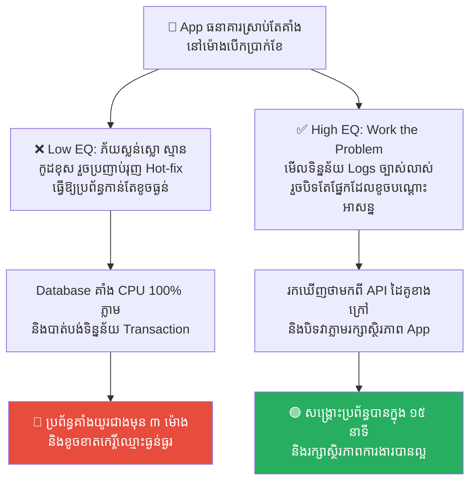
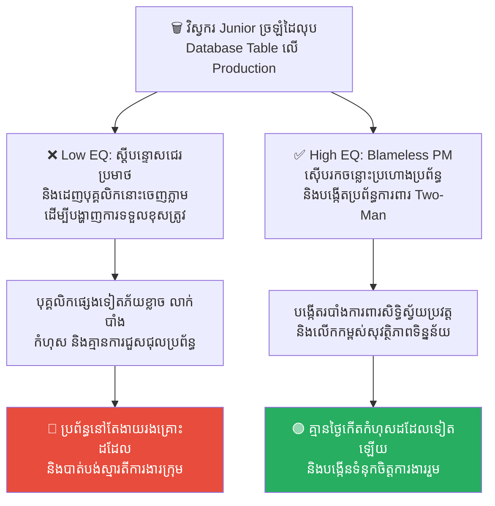
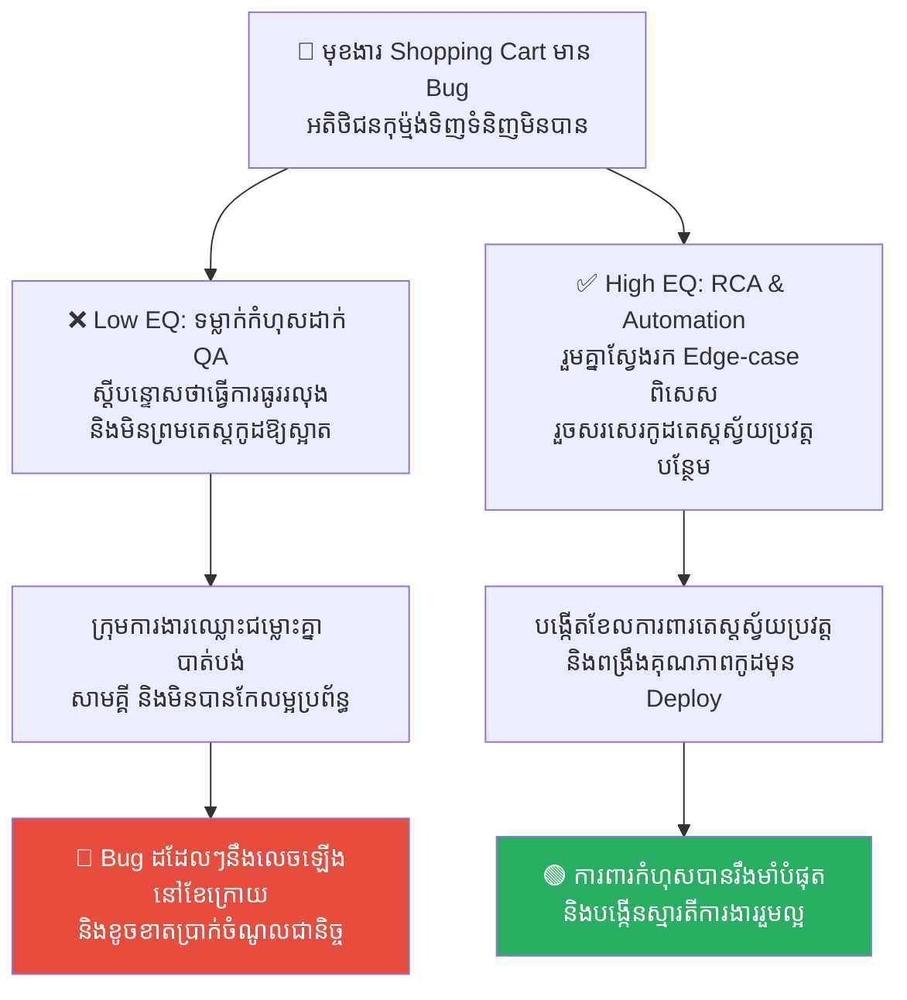
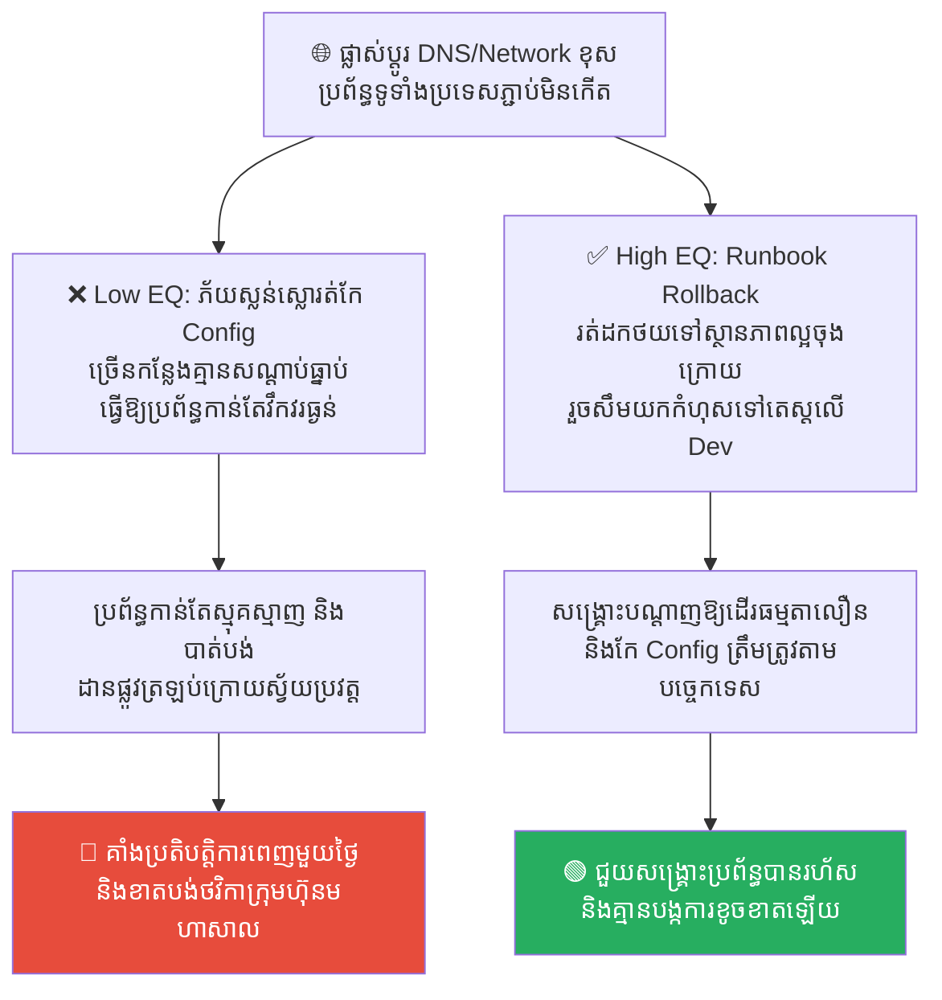
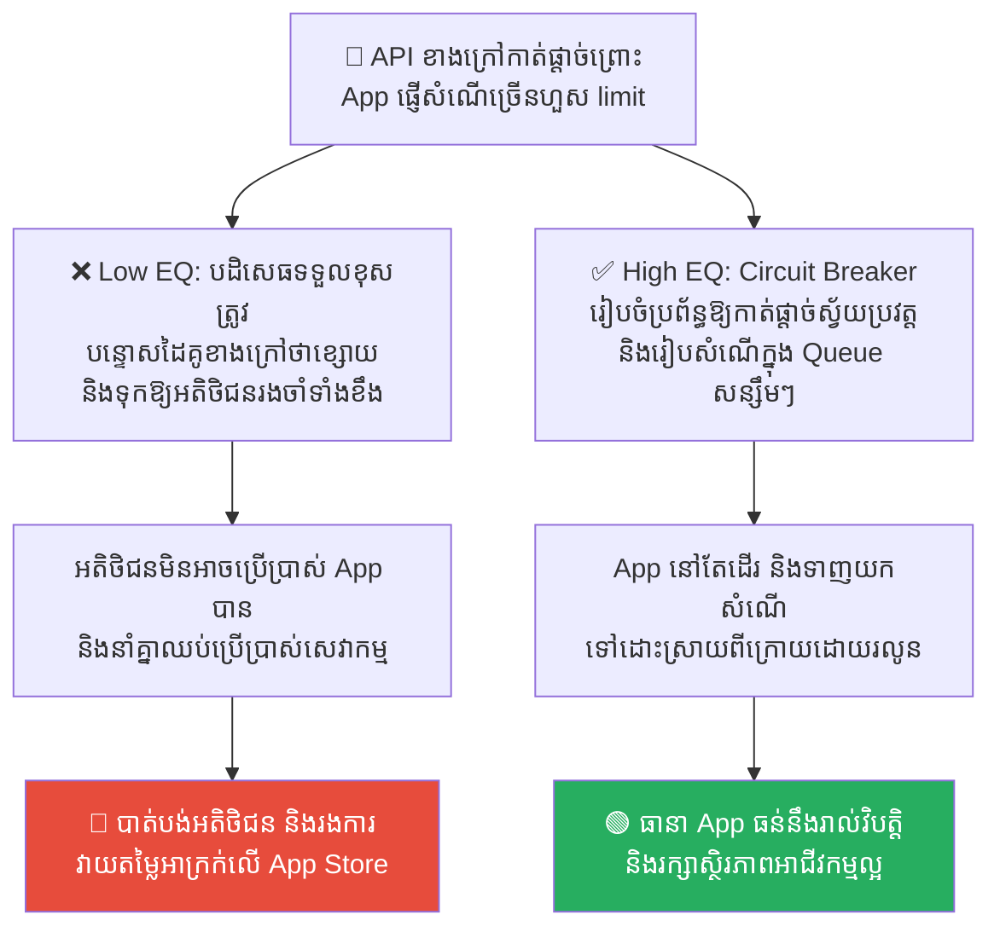

# Apollo 13: Incident Response and Blameless Post-Mortems (អាប៉ូឡូ ១៣៖ ការដោះស្រាយវិបត្តិ និងការវិភាគកំហុសដោយគ្មានការស្តីបន្ទោស)

**Author:** ichamrong  
**Date:** 2026-05-17  
**Tags:** #incident-response #apollo-13 #post-mortem #blameless-culture #sre  
**Category:** Concepts  
**Read Time:** ~15 min  

---

## 📌 មាតិកា (Table of Contents)
- [លំនាំបញ្ហា (The Pattern)](#លំនាំបញ្ហា-the-pattern)
- [១. បញ្ហា៖ ភាពស្លន់ស្លោ និងការទម្លាក់កំហុសពេលមានវិបត្តិ (The Issue: Panic and Scapegoating in Severity 1 Outages)](#១-បញ្ហា-ភាពស្លន់ស្លោ-និងការទម្លាក់កំហុសពេលមានវិបត្តិ-the-issue-panic-and-scapegoating-in-severity-1-outages)
- [២. ឧទាហរណ៍ជាក់ស្តែងក្នុងពិភពពិត (Real World Examples)](#២-ឧទាហរណ៍ជាក់ស្តែងក្នុងពិភពពិត)
  - [ឧទាហរណ៍ទី ១ — ការសរសេរ Hot-fix បង្ខំពេលប្រព័ន្ធគាំង (Guessing Hot-fixes vs. Data-Driven Debugging & Rollbacks)](#ឧទាហរណ៍ទី-១-ការសរសេរ-hot-fix-បង្ខំពេលប្រព័ន្ធគាំង-guessing-hot-fixes-vs-data-driven-debugging-rollbacks)
  - [ឧទាហរណ៍ទី ២ — ការច្រឡំដៃលុប Database លើ Production (Accidental Database Drop vs. Blameless Post-Mortem & System Guardrails)](#ឧទាហរណ៍ទី-២-ការច្រឡំដៃលុប-database-លើ-production-accidental-database-drop-vs-blameless-post-mortem-system-guardrails)
  - [ឧទាហរណ៍ទី ៣ — ការលេចធ្លាយ Bug ធំដល់ដៃអតិថិជន (Scapegoating QA vs. Automated Regression Test Suite & RCA)](#ឧទាហរណ៍ទី-៣-ការលេចធ្លាយ-bug-ធំដល់ដៃអតិថិជន-scapegoating-qa-vs-automated-regression-test-suite-rca)
  - [ឧទាហរណ៍ទី ៤ — ការកំណត់បណ្តាញខុសបណ្តាលឱ្យប្រព័ន្ធគាំង (Network Config Error vs. Incident Runbook & Structured Rollback)](#ឧទាហរណ៍ទី-៤-ការកំណត់បណ្តាញខុសបណ្តាលឱ្យប្រព័ន្ធគាំង-network-config-error-vs-incident-runbook-structured-rollback)
  - [ឧទាហរណ៍ទី ៥ — សេវាកម្មខាងក្រៅគាំងធ្វើឱ្យប៉ះពាល់ប្រព័ន្ធ (API Rate Limiting Outage vs. Circuit Breaker Pattern & Backoff Queue)](#ឧទាហរណ៍ទី-៥-សេវាកម្មខាងក្រៅគាំងធ្វើឱ្យប៉ះពាល់ប្រព័ន្ធ-api-rate-limiting-outage-vs-circuit-breaker-pattern-backoff-queue)
- [៣. កត្តាជម្រុញ៖ ភាពស្លន់ស្លោ និងការស្វែងរកពពែធួន (The Aggravator: Panic Response & Scapegoating Culture)](#៣-កត្តាជម្រុញ-ភាពស្លន់ស្លោ-និងការស្វែងរកពពែធួន-the-aggravator-panic-response-scapegoating-culture)
- [៤. ដំណោះស្រាយទូទៅ៖ របៀបបង្កើតវប្បធម៌គ្មានការបន្ទោស និងការដោះស្រាយបញ្ហា (The General Solution: Establishing Blameless Post-Mortems & Incident Response)](#៤-ដំណោះស្រាយទូទៅ-របៀបបង្កើតវប្បធម៌គ្មានការបន្ទោស-និងការដោះស្រាយបញ្ហា-the-general-solution-establishing-blameless-post-mortems-incident-response)
- [សេចក្តីសន្និដ្ឋាន (Conclusion)](#សេចក្តីសន្និដ្ឋាន-conclusion)
- [Related Posts](#related-posts)

---

## លំនាំបញ្ហា (The Pattern)

នៅថ្ងៃទី ១៣ ខែមេសា ឆ្នាំ ១៩៧០ ក្នុងចម្ងាយជាង ៣២ ម៉ឺនគីឡូម៉ែត្រពីផែនដី ធុងអុកស៊ីសែនទីពីរនៅលើ **យានអវកាសអាប៉ូឡូ ១៣ (Apollo 13)** បានផ្ទុះឡើងយ៉ាងសន្ធោសន្ធៅ បង្កជាការខូចខាតប្រព័ន្ធអគ្គិភ័យ ថាមពល និងការផ្គត់ផ្គង់អុកស៊ីសែនស្នូលរបស់យានអវកាស។ អវកាសយានិក Jack Swigert បានផ្ញើសារមកកាន់ផែនដីនូវពាក្យស្លោកដ៏ល្បីល្បាញថា៖ **«Houston, we've had a problem here»** (Houston, ពួកយើងមានបញ្ហានៅទីនេះហើយ)។

ស្ថិតក្នុងស្ថានភាពអាសន្នដែលអាចបាត់បង់ជីវិតបានគ្រប់វិនាទី នាយកគ្រប់គ្រងជើងហោះហើររបស់អង្គការ NASA លោក **Gene Kranz** បានកោះប្រជុំក្រុមការងារភ្លាមៗ និងបានចេញបទបញ្ជាដ៏តឹងរ៉ឹងមួយថា៖
> 💡 **«តោះ ដោះស្រាយបញ្ហានេះ។ កុំធ្វើឱ្យស្ថានការណ៍កាន់តែអាក្រក់ទៅៗដោយការទាយឱ្យសោះ។ ចូររក្សាភាពស្ងប់ស្ងាត់ និងសម្លឹងមើលតែការពិត និងទិន្នន័យជាក់ស្តែងនៅលើកញ្ចក់ឡើយ!» (Work the problem, people. Let's not make things worse by guessing. Let's look at the facts.)**

 NASA មិនបានចំណាយពេលស្តីបន្ទោសវិស្វករដែលរចនាធុងអុកស៊ីសែននោះ ឬរកអ្នកទទួលខុសត្រូវខណៈពេលដែលយានកំពុងគាំងនោះឡើយ។ ផ្ទុយទៅវិញ ពួកគេបានរួមគ្នាជាធ្លុងមួយ ដោះស្រាយបញ្ហាផ្អែកលើទិន្នន័យច្បាស់លាស់ និងប្រើប្រាស់ឧបករណ៍ដែលមានស្រាប់នៅលើប្រព័ន្ធ ដើម្បីនាំអវកាសយានិកទាំង ៣ រូប ត្រឡប់មកកាន់ផែនដីវិញដោយសុវត្ថិភាព។

នៅក្នុងការគ្រប់គ្រង និងអភិវឌ្ឍន៍ប្រព័ន្ធបច្ចេកវិទ្យា (SRE - Site Reliability Engineering) ពេលដែលប្រព័ន្ធ Servers ធ្លាក់ចុះធ្ងន់ធ្ងរ (Severity 1 Outage) ក្រុមហ៊ុនតែងតែជួបប្រទះស្ថានភាពស្រដៀងគ្នានេះ៖
*   កំហឹង និងភាពភ័យស្លន់ស្លោរត់ចូលមកពេញការដ្ឋាន។
*   ការប្រញាប់ប្រញាល់ទាយ និងសរសេរកូដ Hot-fix បញ្ចូលទៅទាំងងងឹតងងុល ធ្វើឱ្យប្រព័ន្ធកាន់តែខូចខាតខ្លាំង។
*   ការស្វែងរក «ពពែធួន» (Scapegoat) ដើម្បីស្តីបន្ទោស និងដេញចេញ ជំនួសឱ្យការស្វែងរកឫសគល់នៃបញ្ហា។

បេសកកម្មអាប៉ូឡូ ១៣ គឺជាមេរៀនកំពូលស្តីពី **Incident Response (ការឆ្លើយតបនឹងវិបត្តិ)** និង **Blameless Post-Mortems (ការវិភាគកំហុសដោយគ្មានការស្តីបន្ទោស)** ដែលវិស្វករគ្រប់រូបត្រូវតែរៀនសូត្រតាម។

---

## ១. បញ្ហា៖ ភាពស្លន់ស្លោ និងការទម្លាក់កំហុសពេលមានវិបត្តិ (The Issue: Panic and Scapegoating in Severity 1 Outages)

នៅពេលដែលប្រព័ន្ធ Servers ធំរបស់ក្រុមហ៊ុនត្រូវគាំងទាំងស្រុង (Outage) បណ្តាលឱ្យក្រុមហ៊ុនបាត់បង់ប្រាក់ចំណូលរាប់ពាន់ដុល្លារក្នុងមួយនាទី ភាពស្លន់ស្លោតែងតែកើតមានឡើងដោយស្វ័យប្រវត្ត។

កំហុសឆ្គងដ៏ធំបំផុតពីរដែលកើតមានឡើងក្នុងស្ថានភាពនេះគឺ៖

1.  **ការដោះស្រាយបញ្ហាដោយការ «ស្មាន» (Guesswork Debugging)៖** វិស្វករភ័យខ្លាចការស្តីបន្ទោស ក៏ប្រញាប់សរសេរកូដកែសម្រួល Hot-fix រុញទៅកាន់ Server ភ្លាមៗទាំងគ្មានទិន្នន័យLogs ច្បាស់លាស់។ នេះប្រៀបដូចជាការបន្ថែមសាំងទៅលើភ្លើង ដែលធ្វើឱ្យប្រព័ន្ធកាន់តែរញ៉េរញ៉ៃ និងពិបាកសង្គ្រោះ។
2.  ** វប្បធម៌ស្តីបន្ទោស និងទម្លាក់កំហុស (Blame Culture)៖** ថ្នាក់ដឹកនាំព្យាយាមស្រែកគំហកសួររកមុខអ្នកធ្វើឱ្យប្រព័ន្ធខូច ដើម្បីពិន័យ ឬដេញចេញ។ វប្បធម៌បែបនេះធ្វើឱ្យវិស្វករភ័យខ្លាច លាក់បាំងកំហុស មិនហ៊ានរាយការណ៍បញ្ហាទាន់ពេល និងមិនហ៊ានបង្កើតអ្វីថ្មីឡើយ។

ប្រព័ន្ធដែលមិនមានវប្បធម៌ Blameless គឺជារនាំងការពារកំហុសដ៏ទន់ខ្សោយបំផុត ព្រោះវាមិនដែលបានជួសជុល «ប្រព័ន្ធការងារ» នោះទេ គឺវាជួសជុលតែ «បុគ្គលិក» ប៉ុណ្ណោះ។

---

## ២. ឧទាហរណ៍ជាក់ស្តែងក្នុងពិភពពិត

សូមពិនិត្យមើល **ឧទាហរណ៍ជាក់ស្តែងចំនួន ៥** បង្ហាញពីរបៀបដែលវប្បធម៌ Blameless និងការឆ្លើយតបវិបត្តិជួយការពារប្រព័ន្ធ៖

---

### ឧទាហរណ៍ទី ១ — ការសរសេរ Hot-fix បង្ខំពេលប្រព័ន្ធគាំង (Guessing Hot-fixes vs. Data-Driven Debugging & Rollbacks)

**ស្ថានភាព៖** កម្មវិធី Mobile Banking Application របស់ធនាគារ ស្រាប់តែគាំងមិនដំណើរការ (Severity 1 Outage) នៅម៉ោងដែលបុគ្គលិករដ្ឋកំពុងបើកប្រាក់ខែ។

*   **សកម្មភាពអសកម្ម / Low EQ / កំហុសឆ្គង (ការស្មានទាំងភ័យស្លន់ស្លោ)៖** វិស្វករភ័យខ្លាចខ្លាំង ហើយសន្និដ្ឋានថា៖ *«ប្រហែលមកពីកូដ Database connection ថ្មីដែលទើបតែ Deploy យប់មិញហើយ!»*។ គាត់ប្រញាប់សរសេរកូដ Hot-fix កែសម្រួលចំនួន Connection Direct ទៅ Production DB ភ្លាមៗ ធ្វើឱ្យ Database ឡើងកម្តៅខ្លាំង (CPU 100%) និងគាំងរឹតតែធ្ងន់ធ្ងរ។
*   **សកម្មភាពស្ថាបនា / High EQ / ដំណោះស្រាយ (ដោះស្រាយតាមទិន្នន័យ)៖** អនុវត្ត **«Work the Problem» - Incident Command System & Telemetry Review**។ 
    1. ឈប់ស្មាន! ចាត់តាំង Incident Commander ធ្វើជាអ្នកសម្របសម្រួល និងបង្វែរ Traffic ទៅទំព័រ Maintenance សិន ដើម្បីកាត់បន្ថយសម្ពាធ។
    2. ពិនិត្យទិន្នន័យ Logs & Metrics (Telemetry) ឱ្យបានច្បាស់លាស់ ទើបដឹងថាមកពី API របស់ដៃគូទូទាត់ប្រាក់ខាងក្រៅ (Third-party Gateway) ត្រូវរលំ មិនមែនមកពី Database ឡើយ។
    3. បិទមុខងារទូទាត់លុយរបស់ដៃគូនោះជាបណ្តោះអាសន្ន (Graceful Degradation) ដើម្បីឱ្យមុខងារផ្សេងទៀតដំណើរការធម្មតា។
*   **លទ្ធផល៖** ការសរសេរ Hot-fix ស្មានៗនាំឱ្យប្រព័ន្ធកាន់តែខូច និងពន្យារពេល Downtime។ ការពិនិត្យ Telemetry ជួយឱ្យរកឃើញមូលហេតុពិតប្រាកដ និងសង្គ្រោះប្រព័ន្ធបានក្នុងរយៈពេលខ្លីបំផុត។

---

### ឧទាហរណ៍ទី ២ — ការច្រឡំដៃលុប Database លើ Production (Accidental Database Drop vs. Blameless Post-Mortem & System Guardrails)

**ស្ថានភាព៖** វិស្វករ Junior ម្នាក់ បានសរសេរពាក្យបញ្ជាលុប Database (Drop Table) ច្រឡំនៅលើម៉ាស៊ីន Production ធ្វើឱ្យបាត់បង់ទិន្នន័យអតិថិជនរាប់ម៉ឺននាក់។

*   **សកម្មភាពអសកម្ម / Low EQ / កំហុសឆ្គង (វប្បធម៌ស្តីបន្ទោស)៖** នាយកក្រុមហ៊ុនខឹងសម្បារយ៉ាងខ្លាំង និងបានហៅវិស្វករនោះមកស្តីបន្ទោសយ៉ាងចាស់ដៃនៅចំពោះមុខបុគ្គលិកដទៃទៀត រួចបណ្តេញគាត់ចេញពីការងារភ្លាមៗ ដើម្បីគំរាមអ្នកផ្សេងទៀតកុំឱ្យធ្វេសប្រហែស។
*   **សកម្មភាពស្ថាបនា / High EQ / ដំណោះស្រាយ (វប្បធម៌គ្មានការបន្ទោស)៖** អនុវត្ត **Blameless Post-Mortem & Automated Guardrails**។ 
    1. ក្រុមការងាររួមគ្នាទាញយកឯកសារ Backup មកសង្គ្រោះទិន្នន័យឡើងវិញជាបន្ទាន់ ដោយគ្មានការជេរប្រមាថ។
    2. រៀបចំកិច្ចប្រជុំវិភាគកំហុសដោយមិនបន្ទោសបុគ្គល (Blameless Post-Mortem) ដោយចោទសួរថា៖ *«ហេតុអ្វីបានជាប្រព័ន្ធរបស់យើងអនុញ្ញាតឱ្យ Junior developer អាចចូលទៅវាយពាក្យបញ្ជាលុប Database ផ្ទាល់នៅលើ Production យ៉ាងងាយស្រួលបែបនេះ? ហេតុអ្វីគ្មានប្រព័ន្ធផ្ទៀងផ្ទាត់សិទ្ធិ (Access Control)?»*
    3. ដោះស្រាយដោយការដកហូតសិទ្ធិ Write ផ្ទាល់លើ Production និងបង្កើតប្រព័ន្ធទាមទារការយល់ព្រមពីមនុស្សពីរនាក់ (Two-Man Rule Guardrails) មុនរត់ពាក្យបញ្ជាធំៗ។
*   **លទ្ធផល៖** ការដេញបុគ្គលិកចេញ ធ្វើឱ្យអ្នកផ្សេងទៀតភ័យខ្លាច លាក់បាំងកំហុស និងមិនហ៊ានធ្វើការងារច្នៃប្រឌិត ខណៈប្រព័ន្ធនៅតែមានប្រហោងដដែល។ វប្បធម៌គ្មានការបន្ទោស ជួយកសាងប្រព័ន្ធការពារដ៏មាំមួន និងទប់ស្កាត់កំហុសដដែលៗបាន ១០០%។

---

### ឧទាហរណ៍ទី ៣ — ការលេចធ្លាយ Bug ធំដល់ដៃអតិថិជន (Scapegoating QA vs. Automated Regression Test Suite & RCA)

**ស្ថានភាព៖** មុខងាររទេះទិញទំនិញ (Shopping Cart) របស់វេបសាយ e-commerce មាន Bug ធំ ដែលធ្វើឱ្យអតិថិជនមិនអាចទិញទំនិញបាន ក្រោយពេលទើបតែ Release កូដថ្មី។

*   **សកម្មភាពអសកម្ម / Low EQ / កំហុសឆ្គង (ការស្វែងរកពពែធួន)៖** Lead Developer ចោទប្រកាន់ និងបន្ទោសទៅលើក្រុម QA (Quality Assurance) ថាធ្វើការធ្វេសប្រហែស មិនព្រមតេស្តកូដឱ្យបានល្អ ទើបបណ្តាលឱ្យធ្លាក់ Bug ដល់ដៃ User ធ្វើឱ្យខូចខាតប្រាក់ចំណូលក្រុមហ៊ុន។
*   **សកម្មភាពស្ថាបនា / High EQ / ដំណោះស្រាយ (ការកែលម្អប្រព័ន្ធតេស្ត)៖** អនុវត្ត **Root Cause Analysis (RCA) and Automated Regression Tests**។ 
    1. ជួសជុល Bug ភ្លាមៗ រួចរួមគ្នាធ្វើការវិភាគរកមូលហេតុពិត។
    2. រកឃើញថាកំហុសនេះកើតឡើងតែលើករណីពិសេស (Edge-case) ដែលទាក់ទងនឹងការបញ្ចុះតម្លៃគូប៉ុង គួបផ្សំនឹងប្រភេទកាត Visa ជាក់លាក់ ដែលជាករណីស្មុគស្មាញ QA មិនអាចធ្វើតេស្តដោយដៃទាន់ឡើយ។
    3. បង្កើតប្រព័ន្ធតេស្តស្វ័យប្រវត្ត (Automated Regression Test Suite) សម្រាប់ករណីនេះ និងបញ្ចូលវាទៅក្នុង CI Pipeline ដើម្បីធានាថាកំហុសនេះនឹងត្រូវប្រព័ន្ធចាប់បានដោយស្វ័យប្រវត្តិនាពេលអនាគត។
*   **លទ្ធផល៖** ការទម្លាក់កំហុសដាក់គ្នា បំផ្លាញស្មារតីសាមគ្គីភាព និងមិនបានដោះស្រាយឫសគល់នៃបញ្ហា។ ការបង្កើនប្រព័ន្ធតេស្តស្វ័យប្រវត្ត ជួយការពារប្រព័ន្ធមិនឱ្យកើតកំហុសដដែលៗ និងលើកកម្ពស់គុណភាពការងាររួម។

---

### ឧទាហរណ៍ទី ៤ — ការកំណត់បណ្តាញខុសបណ្តាលឱ្យប្រព័ន្ធគាំង (Network Config Error vs. Incident Runbook & Structured Rollback)

**ស្ថានភាព៖** វិស្វករផ្លាស់ប្តូរការកំណត់បណ្តាញ (DNS/Network Config) ខុស បណ្តាលឱ្យប្រព័ន្ធការងាររបស់ក្រុមហ៊ុនទូទាំងប្រទេសមិនអាចភ្ជាប់ទៅកាន់ប្រព័ន្ធទិន្នន័យកណ្តាលបាន។

*   **សកម្មភាពអសកម្ម / Low EQ / កំហុសឆ្គង (ការកែប្រែស្មានៗទាំងភ័យស្លន់ស្លោ)៖** ក្រុមការងារ Network ភ័យស្លន់ស្លោខ្លាំង ហើយចាប់ផ្តើមរត់ទៅកែ Config បណ្តោះអាសន្នជាច្រើនកន្លែងលើ Router និង Switch ផ្សេងៗគ្នា ដើម្បីព្យាបាលបញ្ហាភ្លាមៗ បណ្តាលឱ្យប្រព័ន្ធកាន់តែរញ៉េរញ៉ៃ និងពិបាករកចំណុចដើមដែលខូចខាត។
*   **សកម្មភាពស្ថាបនា / High EQ / ដំណោះស្រាយ (ការដើរតាម Runbook)៖** អនុវត្ត **Structured Incident Runbook & Rollback Plan**។ 
    1. ក្រុមការងាររក្សាភាពស្ងប់ស្ងាត់ និងអនុវត្តតាមជំហានដែលបានកំណត់ក្នុង Runbook។
    2. ធ្វើការ Revert (ដកថយ) រាល់ការផ្លាស់ប្តូរដែលបានធ្វើចុងក្រោយបង្អស់ភ្លាមៗ ដើម្បីឱ្យប្រព័ន្ធត្រឡប់ទៅស្ថានភាពល្អចុងក្រោយបង្អស់ (Last Known Good State)។
    3. នៅពេលប្រព័ន្ធដំណើរការធម្មតាវិញ ទើបនាំគ្នាវិភាគរកកំហុស Config នៅលើបរិយាកាសតេស្ត (Staging Environment) និងដំឡើងការកំណត់សុវត្ថិភាពបន្ថែម។
*   **លទ្ធផល៖** ការកែប្រែគ្មានសណ្តាប់ធ្នាប់ នាំឱ្យប្រព័ន្ធខូចខាតកាន់តែយូរ និងបាត់បង់ទិន្នន័យច្រើន។ ការអនុវត្តតាម Runbook ជួយសង្គ្រោះប្រព័ន្ធបានយ៉ាងរហ័ស និងបង្កើតបាននូវផែនការការពារដ៏ល្អប្រសើរ។

---

### ឧទាហរណ៍ទី ៥ — សេវាកម្មខាងក្រៅគាំងធ្វើឱ្យប៉ះពាល់ប្រព័ន្ធ (API Rate Limiting Outage vs. Circuit Breaker Pattern & Backoff Queue)

**ស្ថានភាព៖** កម្មវិធីរបស់ក្រុមហ៊ុន គាំងដំណើរការដោយសារតែប្រព័ន្ធ API របស់ដៃគូខាងក្រៅ បានកាត់ផ្តាច់សេវាកម្មព្រោះ App របស់យើងផ្ញើសំណើ (Requests) ទៅច្រើនហួសកំណត់ (Rate Limit Exceeded)។

*   **សកម្មភាពអសកម្ម / Low EQ / កំហុសឆ្គង (ការបន្ទោសដៃគូខាងក្រៅ)៖** វិស្វករម្នាក់ៗបន្ទោសទៅលើ API ដៃគូថាមានលក្ខខណ្ឌតឹងរ៉ឹងពេក និងបដិសេធមិនទទួលខុសត្រូវ ព្រោះ៖ *«នេះជាកំហុសខាងភាគីដៃគូ មិនមែនកូដយើងទេ ឱ្យពួកគេដោះស្រាយទៅ!»* ដោយទុកឱ្យអតិថិជនរង់ចាំទាំងខឹងសម្បារ។
*   **សកម្មភាពស្ថាបនា / High EQ / ដំណោះស្រាយ (ការរចនាប្រព័ន្ធធន់)៖** អនុវត្ត **Circuit Breaker Pattern & Rate Limiting Post-Mortem**។
    1. ក្រុមការងារទទួលស្គាល់ថាប្រព័ន្ធខ្លួនគ្មានលំនឹង និងភាពធន់។
    2. រចនាកូដឡើងវិញដោយប្រើប្រាស់ **Circuit Breaker Pattern**៖ នៅពេលសេវាកម្មខាងក្រៅចាប់ផ្តើមយឺត ឬបដិសេធសំណើ ប្រព័ន្ធនឹងកាត់ផ្តាច់ការផ្ញើស្វ័យប្រវត្តិ (Open Circuit) រួចបង្ហាញសារសមស្របទៅកាន់ User។
    3. បញ្ជូនសំណើទៅកាន់ Queue (ប្រអប់រង់ចាំ) និងប្រើប្រាស់វិធីសាស្ត្ររង់ចាំស្វ័យប្រវត្ត (Exponential Backoff and Jitter) ដើម្បីផ្ញើសំណើឡើងវិញបណ្តើរៗរហូតដល់សេវាកម្មដើរល្អឡើងវិញ។
*   **លទ្ធផល៖** ការបន្ទោសដៃគូមិនជួយដោះស្រាយបញ្ហាឱ្យអតិថិជនបានឡើយ។ ការប្រើប្រាស់ Circuit Breaker និង Queue ជួយឱ្យកម្មវិធីមានភាពធន់ខ្ពស់ និងដំណើរការបានទោះបីជាសេវាកម្មខាងក្រៅជួបបញ្ហាក៏ដោយ។

---

## ៣. កត្តាជម្រុញ៖ ភាពស្លន់ស្លោ និងការស្វែងរកពពែធួន (The Aggravator: Panic Response & Scapegoating Culture)

ហេតុអ្វីបានជាយើងងាយនឹងធ្លាក់ចូលទៅក្នុងភាពភ័យស្លន់ស្លោ និងការទម្លាក់កំហុសដាក់គ្នានៅពេលប្រព័ន្ធមានវិបត្តិ? កត្តាជម្រុញរួមមាន៖

1.  **វប្បធម៌ផ្តោតលើការស្តីបន្ទោស (Blame-Centric Culture)៖** នៅពេលដែលក្រុមហ៊ុនមានថ្នាក់ដឹកនាំដែលចូលចិត្តស្តីបន្ទោស និងរកអ្នកខុសដើម្បីពិន័យ វិស្វករនឹងរស់នៅក្នុង «របៀបរស់រានមានជីវិត (Survival Mode)»។ ពួកគេនឹងផ្តោតលើការការពារខ្លួនជាជាងការជួយសង្គ្រោះប្រព័ន្ធ។
2.  ** កង្វះផែនការ និង Runbooks (Lack of Preparedness)៖** ក្រុមហ៊ុនគ្មានការរៀបចំផែនការឆ្លើយតបនឹងវិបត្តិ (Incident Response Plan) និងគ្មានឯកសារណែនាំដោះស្រាយ (Runbook) ច្បាស់លាស់។ ពេលប្រព័ន្ធគាំង វិស្វករមិនដឹងត្រូវធ្វើអ្វីមុន ធ្វើអ្វីក្រោយ នាំឱ្យកើតមានភាពវឹកវរ និងស្លន់ស្លោ។
3.  **កំហឹងពីផលប៉ះពាល់ហិរញ្ញវត្ថុភ្លាមៗ (Financial Pressure Panic)៖** សម្ពាធពីការបាត់បង់ថវិការាប់ម៉ឺនដុល្លារក្នុងមួយម៉ោង ធ្វើឱ្យថ្នាក់ដឹកនាំបាត់បង់ការអត់ធ្មត់ និងជម្រុញឱ្យវិស្វករធ្វើ Hot-fix បង្ខំទាំងប្រថុយប្រថានបំផុត។

---

## ៤. ដំណោះស្រាយទូទៅ៖ របៀបបង្កើតវប្បធម៌គ្មានការបន្ទោស និងការដោះស្រាយបញ្ហា (The General Solution: Establishing Blameless Post-Mortems & Incident Response)

ដើម្បីកសាងប្រព័ន្ធការងារដែលមានភាពធន់ និងឆ្លើយតបនឹងវិបត្តិប្រកបដោយប្រសិទ្ធភាពខ្ពស់ ចូរអនុវត្តយុទ្ធសាស្ត្រខាងក្រោម៖

1.  ** អនុវត្តវប្បធម៌ «គ្មានការស្តីបន្ទោស» (Blameless Culture) ជាដាច់ខាត៖** ចងចាំគោលការណ៍គ្រឹះ៖ **«ឧប្បត្តិហេតុកើតឡើងដោយសារចន្លោះប្រហោងនៃប្រព័ន្ធ មិនមែនដោយសារតែកំហុសរបស់បុគ្គលឡើយ។»** ប្រសិនបើមនុស្សម្នាក់សរសេរកូដខុស នោះមកពីប្រព័ន្ធតេស្ត និងប្រព័ន្ធ Validate របស់យើងមិនទាន់ល្អគ្រប់គ្រាន់ដើម្បីចាប់កំហុសនោះ។ ចូរផ្តោតលើការកសាងប្រព័ន្ធការពារ (Guardrails) មិនមែនការបណ្តេញមនុស្សចេញឡើយ។
2.  ** បង្កើតយន្តការគ្រប់គ្រងវិបត្តិ (Incident Command System)៖** នៅពេលមាន Outage ធំ ត្រូវតែតែងតាំង៖
    *   *Incident Commander (IC):* អ្នកគ្រប់គ្រង និងបែងចែកការងារ (មិនមែនជាអ្នកសរសេរកូដទេ)។
    *   *Communications Lead (CL):* អ្នករាយការណ៍ព័ត៌មានទៅកាន់ភ្ញៀវ និងថ្នាក់ដឹកនាំក្រុមហ៊ុន ដើម្បីកុំឱ្យរំខានដល់វិស្វករកំពុងដោះស្រាយបញ្ហា។
    *   *Scribe:* អ្នកកត់ត្រារាល់សកម្មភាព និងម៉ោងដែលបានកែប្រែ ដើម្បីយកទៅធ្វើ Post-mortem។
3.  ** សរសេរ និងហាត់សមរត់តាម Runbooks៖** រាល់កំហុស ឬសេវាកម្មសំខាន់ៗ ត្រូវតែមានឯកសារ Runbook ដែលចែងពីជំហាន Revert/Rollback ឱ្យបានច្បាស់លាស់។ ត្រូវធ្វើការហាត់សម «កាត់ភ្លើង» ឬ «សាកល្បងគាំងប្រព័ន្ធ» (Chaos Engineering) ជារៀងរាល់ឆ្នាំ ដើម្បីពង្រឹងស្មារតី និងស្ថិរភាពការងារក្រុម។
4.  ** ធ្វើសន្និសីទវិភាគកំហុស (Post-Mortem Meetings)៖** បន្ទាប់ពីសង្គ្រោះប្រព័ន្ធរួចរាល់ ត្រូវតែរៀបចំកិច្ចប្រជុំធ្វើការកត់ត្រា៖ *តើមានអ្វីកើតឡើង? ហេតុអ្វីបានជាវាកើតឡើង? តើយើងជួសជុលវាដោយរបៀបណា? និងតើយើងត្រូវរៀបចំខែលការពារអ្វីខ្លះ ដើម្បីធានាថាវានឹងលែងកើតឡើងជារៀងរហូត?*

---

## សេចក្តីសន្និដ្ឋាន (Conclusion)

**យានអាប៉ូឡូ ១៣ និងការឆ្លើយតបនឹងវិបត្តិ (Incident Response)** បង្រៀនយើងថា វិបត្តិ និងការគាំងប្រព័ន្ធ គឺជាអ្វីដែលមិនអាចជៀសផុតបានឡើយនៅក្នុងពិភពវិស្វកម្ម។ ភាពខុសគ្នារវាងក្រុមហ៊ុនដែលជោគជ័យ និងក្រុមហ៊ុនដែលរលាយសាបសូន្យ គឺស្ថិតនៅលើ **«សមត្ថភាពក្នុងការរក្សាភាពស្ងប់ស្ងាត់ ការដោះស្រាយបញ្ហាផ្អែកលើទិន្នន័យជាក់ស្តែង និងការកសាងវប្បធម៌ Blameless ដែលជួយឱ្យក្រុមការងារហ៊ានរៀនសូត្រពីកំហុស និងពង្រឹងប្រព័ន្ធឱ្យកាន់តែរឹងមាំរាល់ពេលដែលជួបការដួលរលំ»**។

ចងចាំពាក្យស្លោករបស់ NASA ជានិច្ច៖ **«Failure is not an option»** (បរាជ័យមិនមែនជាជម្រើសឡើយ) — មិនមែនមានន័យថាហាមខុសនោះទេ ប៉ុន្តែមានន័យថា ទោះជាប្រព័ន្ធខូចខាតកម្រិតណាក៏ដោយ យើងត្រូវតែរួមគ្នាដោះស្រាយ និងនាំយកប្រព័ន្ធត្រឡប់មកវិញដោយជោគជ័យបំផុត។

---

## Related Posts

*   **[32 Solomon's Ring: Emotional Resilience in Incident Management](./32-solomons-ring-and-incident-management.md)** — ការរក្សាស្ថិរភាពផ្លូវចិត្ត (This too shall pass) នៅក្នុងការដោះស្រាយវិបត្តិប្រព័ន្ធ។
*   **[19 The Domino Effect and Systemic Failures](./19-the-domino-effect-and-systemic-failures.md)** — របៀបដែលការធ្វេសប្រហែសមួយចំណុចតូច អាចបង្កជាការដួលរលំប្រព័ន្ធការងារទាំងស្រុងជាសង្វាក់។

---

*Last updated: 2026-05-26*
