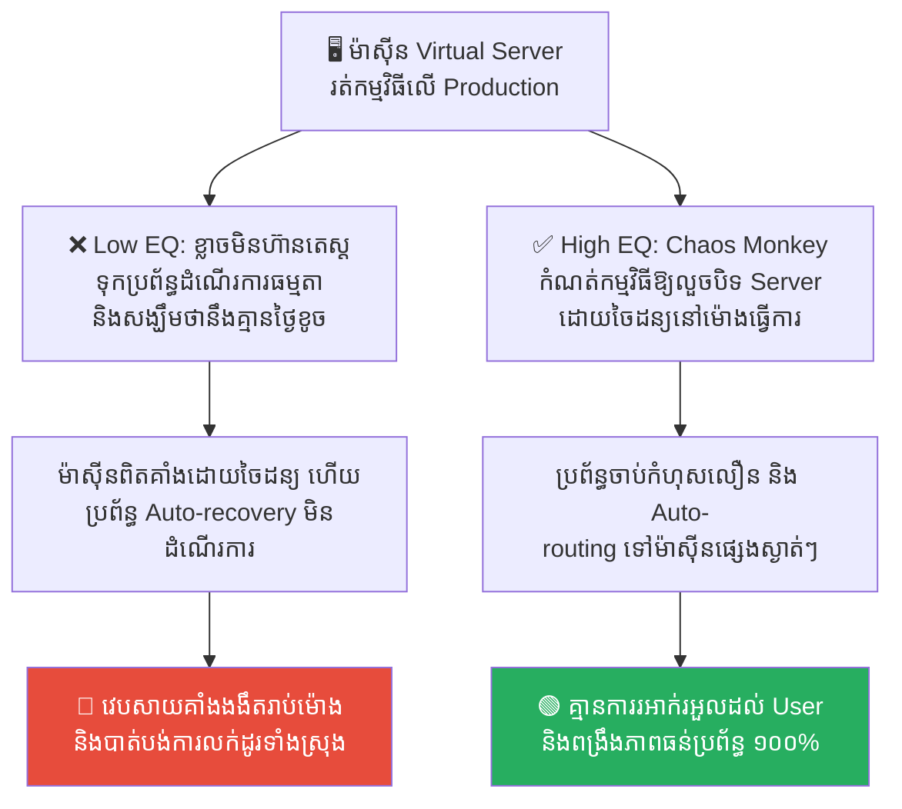
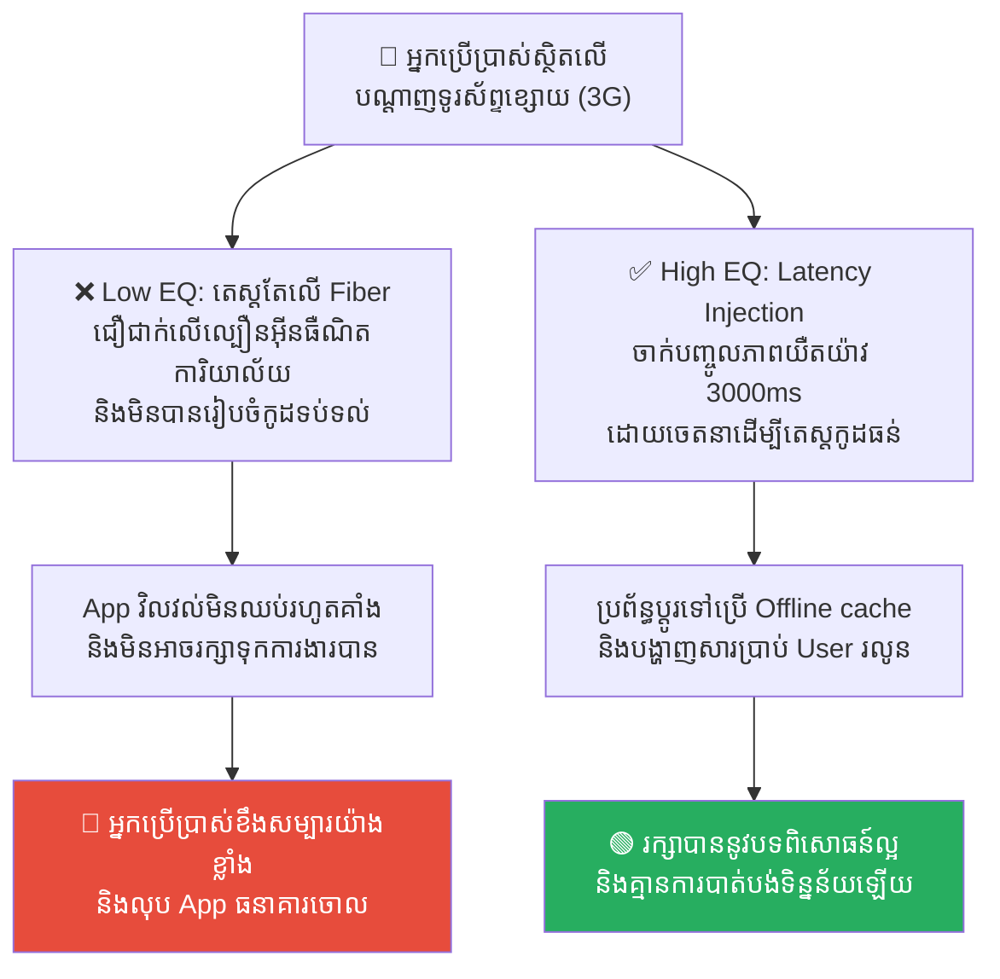
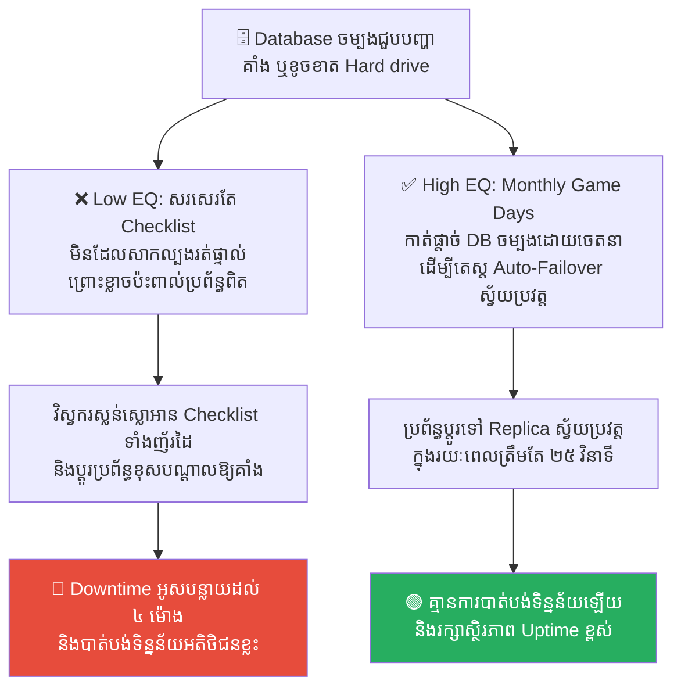
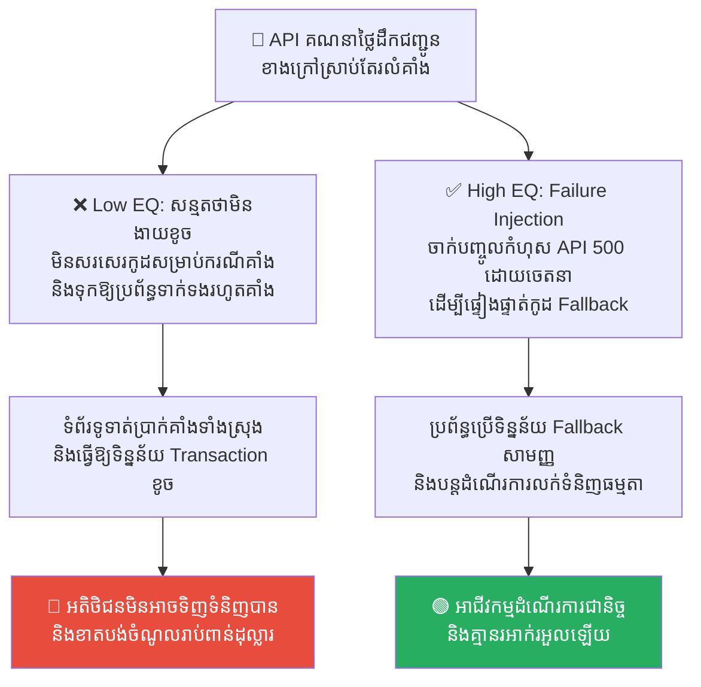
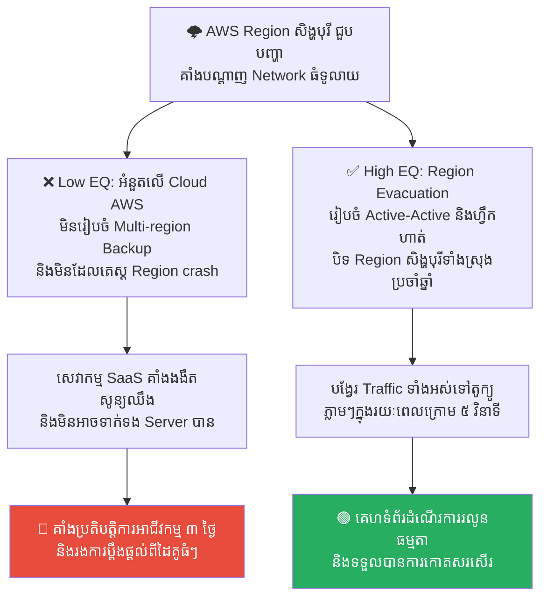

# Miyamoto Musashi: Chaos Engineering and Production Drills (មីយ៉ាម៉ូតូ មូសាស៊ី៖ វិស្វកម្មភាពចលាចល និងការហ្វឹកហាត់ក្នុងទីលានជាក់ស្តែង)

**Author:** ichamrong  
**Date:** 2026-05-17  
**Tags:** #chaos-engineering #miyamoto-musashi #sre #production-drills #testing  
**Category:** Concepts  
**Read Time:** ~15 min  

---

## 📌 មាតិកា (Table of Contents)
- [លំនាំបញ្ហា (The Pattern)](#លំនាំបញ្ហា-the-pattern)
- [១. បញ្ហា៖ សាលាហ្វឹកហាត់ដ៏ស្ងប់ស្ងាត់ និងសមរភូមិដ៏ចលាចល (The Issue: The Quiet Dojo vs. The Chaotic Battlefield)](#១-បញ្ហា-សាលាហ្វឹកហាត់ដ៏ស្ងប់ស្ងាត់-និងសមរភូមិដ៏ចលាចល-the-issue-the-quiet-dojo-vs-the-chaotic-battlefield)
- [២. ឧទាហរណ៍ជាក់ស្តែងក្នុងពិភពពិត (Real World Examples)](#២-ឧទាហរណ៍ជាក់ស្តែងក្នុងពិភពពិត)
  - [ឧទាហរណ៍ទី ១ — ការបិទដំណើរការ Server ដោយចៃដន្យ (Manual Maintenance vs. Chaos Monkey Automated Shutdowns)](#ឧទាហរណ៍ទី-១-ការបិទដំណើរការ-server-ដោយចៃដន្យ-manual-maintenance-vs-chaos-monkey-automated-shutdowns)
  - [ឧទាហរណ៍ទី ២ — ការតេស្តកម្មវិធីលើបណ្តាញអុបទិកល្បឿនលឿន (Testing on Office Fiber vs. Network Latency Injection)](#ឧទាហរណ៍ទី-២-ការតេស្តកម្មវិធីលើបណ្តាញអុបទិកល្បឿនលឿន-testing-on-office-fiber-vs-network-latency-injection)
  - [ឧទាហរណ៍ទី ៣ — ការផ្លាស់ប្តូរទៅកាន់ Database បម្រុង (Manual Failover Checklist vs. Monthly Game Days & DB Crash Simulations)](#ឧទាហរណ៍ទី-៣-ការផ្លាស់ប្តូរទៅកាន់-database-បម្រុង-manual-failover-checklist-vs-monthly-game-days-db-crash-simulations)
  - [ឧទាហរណ៍ទី ៤ — ការពឹងផ្អែកលើ API ខាងក្រៅដោយគ្មានការការពារ (Trusting External API vs. Dependency Failure Injection)](#ឧទាហរណ៍ទី-៤-ការពឹងផ្អែកលើ-api-ខាងក្រៅដោយគ្មានការការពារ-trusting-external-api-vs-dependency-failure-injection)
  - [ឧទាហរណ៍ទី ៥ — គ្រោះមហន្តរាយបណ្តាញ Cloud ក្នុងតំបន់ (Assuming Cloud Region is Safe vs. Active-Active Evacuation Drills)](#ឧទាហរណ៍ទី-៥-គ្រោះមហន្តរាយបណ្តាញ-cloud-ក្នុងតំបន់-assuming-cloud-region-is-safe-vs-active-active-evacuation-drills)
- [៣. កត្តាជម្រុញ៖ ការតេស្តតែក្នុងតំបន់សុវត្ថិភាព និងការខ្លាចហានិភ័យ (The Aggravator: Safe Zone Testing & Risk Aversion)](#៣-កត្តាជម្រុញ-ការតេស្តតែក្នុងតំបន់សុវត្ថិភាព-និងការខ្លាចហានិភ័យ-the-aggravator-safe-zone-testing-risk-aversion)
- [៤. ដំណោះស្រាយទូទៅ៖ ការធ្វើឱ្យការហ្វឹកហាត់មានភាពលំបាក ដើម្បីឱ្យសមរភូមិក្លាយជា امرងាយស្រួល (The General Solution: Embracing Chaos & Implementing Game Days)](#៤-ដំណោះស្រាយទូទៅ-ការធ្វើឱ្យការហ្វឹកហាត់មានភាពលំបាក-ដើម្បីឱ្យសមរភូមិក្លាយជា-امرងាយស្រួល-the-general-solution-embracing-chaos-implementing-game-days)
- [សេចក្តីសន្និដ្ឋាន (Conclusion)](#សេចក្តីសន្និដ្ឋាន-conclusion)
- [Related Posts](#related-posts)

---

## លំនាំបញ្ហា (The Pattern)

នៅក្នុងប្រវត្តិសាស្ត្រជប៉ុននាសតវត្សរ៍ទី ១៧ **មីយ៉ាម៉ូតូ មូសាស៊ី (Miyamoto Musashi)** គឺជាកំពូលអ្នកដាវសាមូរ៉ៃដ៏ល្បីល្បាញបំផុត ដែលបានឆ្លងកាត់ការប្រយុទ្ធស្លាប់រស់ជាង ៦០ ដង ដោយមិនដែលស្គាល់ពាក្យថាបរាជ័យឡើយ។ នៅក្នុងសៀវភៅយុទ្ធសាស្ត្រដ៏ល្បីល្បាញរបស់ទ្រង់គឺ **«គម្ពីររង្វង់ប្រាំ» (The Book of Five Rings)** មូសាស៊ីបានសរសេរគោលការណ៍គ្រឹះមួយថា៖
> 💡 **«អ្នកអាចប្រយុទ្ធបាន តែតាមរបៀបដែលអ្នកបានហ្វឹកហាត់ប៉ុណ្ណោះ។ ចូរធ្វើឱ្យការហ្វឹកហាត់ប្រចាំថ្ងៃរបស់អ្នក ក្លាយជាសមរភូមិពិតប្រាកដ និងធ្វើឱ្យសមរភូមិពិតប្រាកដ ក្លាយជាការហ្វឹកហាត់ធម្មតា។»**

មូសាស៊ីមិនដែលហ្វឹកហាត់វាយដាវតែនៅក្នុងបន្ទប់ «ដូជូ» (Dojo) ដ៏ស្អាត និងស្ងប់ស្ងាត់ឡើយ។ ទ្រង់តែងតែហ្វឹកហាត់ប្រយុទ្ធនៅក្នុងភក់ ក្រោមភ្លៀងផ្គរ ក្នុងព្រៃក្រាស់ និងនៅលើច្រាំងថ្មចោទ ដើម្បីឱ្យរាងកាយ និងស្មារតីរបស់ទ្រង់ស៊ាំទៅនឹងរាល់ស្ថានភាព «ចលាចល» ដែលអាចកើតមាននៅក្នុងការប្រយុទ្ធស្លាប់រស់ពិតប្រាកដ។

នៅក្នុងការអភិវឌ្ឍន៍កម្មវិធី (Software Engineering) វិស្វករជារឿយៗតែងតែនិយាយពាក្យកំប្លែងមួយថា៖ **«កូដនេះរត់បានយ៉ាងល្អនៅលើកុំព្យូទ័ររបស់ខ្ញុំ (It works on my machine)»**។ 

ប៉ុន្តែនៅពេលដែលកូដនោះត្រូវបានរុញទៅកាន់ម៉ាស៊ីនពិតប្រាកដ (**Production Environment**) វាបែរជាគាំង និងរលំទាំងស្រុងភ្លាមៗ។
*   **កុំព្យូទ័ររបស់អ្នក = ដូជូ (Dojo) ដ៏ស្ងប់ស្ងាត់៖** គ្មានអ្នករំខាន Network ដើរលឿន និងទិន្នន័យស្អាតល្អ។
*   **Production = សមរភូមិដ៏ចលាចល៖** មាន Traffic សម្រុកចូលរាប់លាន បណ្តាញមានភាពរអាក់រអួល ម៉ាស៊ីន Server អាចរលត់ និងមានការវាយប្រហារពី Hacker គ្រប់ទិសទី។

ដើម្បីឱ្យប្រព័ន្ធកម្មវិធីអាចរស់រានមានជីវិតបាននៅក្នុងសមរភូមិ Production យើងត្រូវតែប្រើប្រាស់ទស្សនវិជ្ជារបស់មូសាស៊ី តាមរយៈវិធីសាស្ត្រ **Chaos Engineering (វិស្វកម្មភាពចលាចល)** — ពោលគឺ បង្កើតភាពចលាចល និងកាត់ផ្តាច់ប្រព័ន្ធខ្លួនឯងដោយចេតនា ដើម្បីហ្វឹកហាត់ប្រព័ន្ធឱ្យមានភាពធន់ជានិច្ច។

---

## ១. បញ្ហា៖ សាលាហ្វឹកហាត់ដ៏ស្ងប់ស្ងាត់ និងសមរភូមិដ៏ចលាចល (The Issue: The Quiet Dojo vs. The Chaotic Battlefield)

គ្រោះថ្នាក់ដ៏ធំបំផុតនៅក្នុងការរចនាប្រព័ន្ធបច្ចេកវិទ្យា គឺនៅពេលដែលក្រុមការងារ **«តេស្តតែកាលណាប្រព័ន្ធមានសភាពល្អល្អះ»** (Happy Path Testing)។ ពួកគេសន្មតថា៖
*   បណ្តាញ Network នឹងមានល្បឿនលឿនជានិច្ច។
*   ម៉ាស៊ីន Cloud Servers នឹងមិនដែលគាំង ឬដាច់ភ្លើងឡើយ។
*   API របស់ដៃគូខាងក្រៅ នឹងឆ្លើយតបលឿន និងត្រឹមត្រូវ ១០០%។

ដោយសារតែការគិតបែបនេះ នៅពេលដែលគ្រោះថ្នាក់ពិតប្រាកដកើតឡើង (ដូចជា Server ដាច់ចរន្តអគ្គិសនី ឬបណ្តាញ Network យឺតខ្លាំង) ប្រព័ន្ធកម្មវិធីនឹងដួលរលំភ្លាមៗ ហើយក្រុមវិស្វករនឹងរត់ស្លន់ស្លោរញ៉េរញ៉ៃ ព្រោះពួកគេមិនដែលធ្លាប់បាន «ហ្វឹកហាត់ដោះស្រាយបញ្ហានៅក្នុងស្ថានភាពចលាចល» ពីមុនមកឡើយ។

ដើម្បីដោះស្រាយបញ្ហានេះ យើងត្រូវតែនាំយក «ភាពចលាចល» មកដាក់ចូលទៅក្នុងសមរភូមិ Production ដោយចេតនា ដើម្បីធានាថា ប្រព័ន្ធកម្មវិធីអាចរៀនសូត្រ ជួសជុលខ្លួនឯង និងធន់ទ្រាំនឹងរាល់ឧបសគ្គទាំងអស់។

---

## ២. ឧទាហរណ៍ជាក់ស្តែងក្នុងពិភពពិត

សូមពិនិត្យមើល **ឧទាហរណ៍ជាក់ស្តែងចំនួន ៥** បង្ហាញពីរបៀបដែលវិស្វកម្មភាពចលាចលជួយការពារប្រព័ន្ធ និងការហ្វឹកហាត់បែបសាមូរ៉ៃ៖

---

### ឧទាហរណ៍ទី ១ — ការបិទដំណើរការ Server ដោយចៃដន្យ (Manual Maintenance vs. Chaos Monkey Automated Shutdowns)

**ស្ថានភាព៖** ក្រុមហ៊ុនចង់ផ្ទៀងផ្ទាត់ថាតើប្រព័ន្ធរបស់ពួកគេអាចរក្សា Uptime បានដែរឬទេ ប្រសិនបើមាន Server ណាមួយរលត់ដោយចៃដន្យនៅពាក់កណ្តាលយប់។

*   **សកម្មភាពអសកម្ម / Low EQ / កំហុសឆ្គង (ការហ្វឹកហាត់ក្នុងដូជូស្ងប់ស្ងាត់)៖** វិស្វករសាកល្បងតេស្តតែលើបរិយាកាស Local/Staging និងសង្ឃឹមថាប្រព័ន្ធ Auto-scaler របស់ Cloud នឹងដំណើរការល្អ ដោយមិនដែលសាកល្បងបិទ Server ធំៗឡើយ ព្រោះ៖ *«ខ្លាចគាំងប្រព័ន្ធពិត នាំឱ្យខាតលុយ!»*។
*   **សកម្មភាពស្ថាបនា / High EQ / ដំណោះស្រាយ (ការហ្វឹកហាត់ក្នុងសមរភូមិភក់)៖** អនុវត្ត **Chaos Monkey Automated Shutdowns (ដូចជា Netflix Chaos Monkey)**។ ដំណើរការកម្មវិធីស្វ័យប្រវត្តដែលធ្វើការបិទ Virtual Machine (VM) ណាមួយចោលដោយចៃដន្យនៅលើ Production នៅម៉ោងធ្វើការ ដើម្បីតេស្តថាប្រព័ន្ធ Auto-routing និង Load Balancer អាចបង្វែរ Traffic ទៅម៉ាស៊ីនល្អផ្សេងទៀតបានដោយគ្មាន Downtime និងគ្មានការលូកដៃពីមនុស្ស។
*   **លទ្ធផល៖** ការមិនហ៊ានតេស្ត ធ្វើឱ្យថ្ងៃមួយពេល Server ពិតដួលរលំ នាំឱ្យប្រព័ន្ធគាំងរាប់ម៉ោង ព្រោះប្រព័ន្ធ Auto-recovery មិនបានរៀបចំបានត្រឹមត្រូវ។ ការប្រើ Chaos Monkey ជួយឱ្យប្រព័ន្ធរៀនជួសជុលខ្លួនឯង (Auto-healing) និងមានស្ថិរភាពខ្ពស់។

---

### ឧទាហរណ៍ទី ២ — ការតេស្តកម្មវិធីលើបណ្តាញអុបទិកល្បឿនលឿន (Testing on Office Fiber vs. Network Latency Injection)

**ស្ថានភាព៖** ក្រុមហ៊ុនចង់ឱ្យកម្មវិធីរបស់ខ្លួន ដំណើរការបានរលូន និងមិនគាំង ទោះបីជាអ្នកប្រើប្រាស់ស្ថិតនៅលើបណ្តាញទូរស័ព្ទខ្សោយ (3G/4G) នៅក្នុងជណ្តើរយន្តក៏ដោយ។

*   **សកម្មភាពអសកម្ម / Low EQ / កំហុសឆ្គង (ការហ្វឹកហាត់ក្នុងដូជូស្ងប់ស្ងាត់)៖** វិស្វករធ្វើតេស្តកម្មវិធីតែនៅលើបណ្តាញអុបទិកល្បឿនលឿនក្នុងបន្ទប់ធ្វើការ (High-speed Office Fiber) និងនិយាយទាំងមោទនភាពថា៖ *«App របស់យើងដើរលឿន និងគ្មានបញ្ហាឡើយ មិនបាច់បារម្ភទេ!»*។
*   **សកម្មភាពស្ថាបនា / High EQ / ដំណោះស្រាយ (ការហ្វឹកហាត់ក្នុងសមរភូមិភក់)៖** អនុវត្ត **Network Latency Injection (ដូចជា Chaos Mesh ឬ Toxiproxy)**។ ប្រើប្រាស់ឧបករណ៍បច្ចេកវិទ្យាដើម្បីចាក់បញ្ចូលភាពយឺតយ៉ាវ (Latency 3000ms) ឬការបាត់បង់កញ្ចប់ទិន្នន័យ (5% Packet Loss) ដោយចេតនាទៅលើ API Connection ក្នុងកំឡុងពេលតេស្ត ដើម្បីធានាថា App មិនគាំង និងមានប្រព័ន្ធ Offline-first រក្សាទុកទិន្នន័យបណ្តោះអាសន្ន។
*   **លទ្ធផល៖** ការព្រងើយកន្តើយនាំឱ្យ App គាំង និងវិលវល់មិនឈប់ (Infinite Loader Loop) នៅពេលអ្នកប្រើប្រាស់ជិះកាត់ជណ្តើរយន្ត ឬតំបន់គ្មានសេវា បង្កជាបទពិសោធន៍អាក្រក់។ ការប្រើ Latency Injection ជួយឱ្យប្រព័ន្ធមានភាពធន់ និងបង្ហាញសារដំណឹងរលូនដល់ User។

---

### ឧទាហរណ៍ទី ៣ — ការផ្លាស់ប្តូរទៅកាន់ Database បម្រុង (Manual Failover Checklist vs. Monthly Game Days & DB Crash Simulations)

**ស្ថានភាព៖** ក្រុមហ៊ុនចង់ធានាថា ប្រសិនបើម៉ាស៊ីន Database ចម្បង (Primary DB) ជួបបញ្ហាឆេះ ឬខូចខាត ប្រព័ន្ធនឹងប្តូរទៅកាន់ Database បម្រុង (Replica) ភ្លាមៗ។

*   **សកម្មភាពអសកម្ម / Low EQ / កំហុសឆ្គង (ការហ្វឹកហាត់ក្នុងដូជូស្ងប់ស្ងាត់)៖** ក្រុមការងារសរសេរតែឯកសារ Checklist ដោយដៃ ទុកចោលក្នុង Confluence ពីរបៀបប្តូរទៅ Database បម្រុង ប៉ុន្តែមិនដែលយកមកសាកល្បងអនុវត្តផ្ទាល់ឡើយ ព្រោះ៖ *«ការតេស្តនេះមានហានិភ័យខ្ពស់ពេក ទុកវាចោលទៅ!»*។
*   **សកម្មភាពស្ថាបនា / High EQ / ដំណោះស្រាយ (ការហ្វឹកហាត់ក្នុងសមរភូមិភក់)៖** រៀបចំ **Monthly Game Days with Database Crash Simulations**។ រៀងរាល់ខែ ក្រុម SRE ធ្វើការសាកល្បង «វាយប្រហារប្រព័ន្ធ» ដោយកាត់ផ្តាច់ Database ចម្បងដោយចេតនា ដើម្បីតេស្តថាប្រព័ន្ធ Auto-Failover អាចប្តូរទៅកាន់ Replica បានក្នុងរយៈពេលក្រោម ៣០ វិនាទី និងឱ្យក្រុមការងារបច្ចេកទេសស៊ាំនឹងការដោះស្រាយ។
*   **លទ្ធផល៖** ពេល Database ពិតរលំ វិស្វករស្លន់ស្លោ និងអានសៀវភៅណែនាំទាំងញ័រដៃ ធ្វើឱ្យ Downtime អូសបន្លាយដល់ ៤ ម៉ោង និងបាត់បង់ទិន្នន័យខ្លះ។ ការហ្វឹកហាត់ Game Days ជួយឱ្យការប្តូរប្រព័ន្ធប្រព្រឹត្តទៅដោយស្ងប់ស្ងាត់ ស្វ័យប្រវត្ត និងគ្មានការខូចខាត។

---

### ឧទាហរណ៍ទី ៤ — ការពឹងផ្អែកលើ API ខាងក្រៅដោយគ្មានការការពារ (Trusting External API vs. Dependency Failure Injection)

**ស្ថានភាព៖** កម្មវិធីលក់ទំនិញអនឡាញ ពឹងផ្អែកលើ API ខាងក្រៅ (Third-party API) សម្រាប់សេវាកម្មគណនាថ្លៃដឹកជញ្ជូន និងពន្ធនាំចូល។

*   **សកម្មភាពអសកម្ម / Low EQ / កំហុសឆ្គង (ការហ្វឹកហាត់ក្នុងដូជូស្ងប់ស្ងាត់)៖** វិស្វកររចនាកូដដោយសន្មតថា API ខាងក្រៅនឹងដំណើរការល្អជានិច្ច និងមិនបានសរសេរកូដសម្រាប់ករណី API នោះគាំងឡើយ ព្រោះយល់ថា៖ *«API របស់ក្រុមហ៊ុនលំដាប់អន្តរជាតិ មិនងាយខូចទេ!»*។
*   **សកម្មភាពស្ថាបនា / High EQ / ដំណោះស្រាយ (ការហ្វឹកហាត់ក្នុងសមរភូមិភក់)៖** អនុវត្ត **Dependency Failure Injection using Mocking/Chaos tools**។ ចាក់បញ្ចូលកំហុស API ខាងក្រៅដោយចេតនា (ដូចជា ត្រឡប់កូដ 504 Gateway Timeout ឬ 500 Server Error) ដើម្បីផ្ទៀងផ្ទាត់ថាកម្មវិធីរបស់យើងនៅតែដើរ និងបង្ហាញសារ «សូមព្យាយាមម្តងទៀត» ឬប្រើប្រាស់ទិន្នន័យគណនាលំនាំដើម (Fallback Data)។
*   **លទ្ធផល៖** នៅពេល API ខាងក្រៅគាំង ធ្វើឱ្យ App ទាំងមូលគាំងទំព័រទូទាត់លុយ និងគាំងម៉ាស៊ីន Production ទាំងស្រុង។ ការចាក់បញ្ចូលកំហុសតេស្ត ជួយឱ្យប្រព័ន្ធមានភាពធន់ មិនរំខានដល់ប្រតិបត្តិការស្នូលរបស់ក្រុមហ៊ុនឡើយ។

---

### ឧទាហរណ៍ទី ៥ — គ្រោះមហន្តរាយបណ្តាញ Cloud ក្នុងតំបន់ (Assuming Cloud Region is Safe vs. Active-Active Evacuation Drills)

**ស្ថានភាព៖** ក្រុមហ៊ុនគ្រប់គ្រងសេវាកម្ម SaaS ធំមួយ ដំណើរការហេដ្ឋារចនាសម្ព័ន្ធទាំងអស់នៅលើ Cloud AWS ក្នុងតំបន់សិង្ហបុរី (ap-southeast-1)។

*   **សកម្មភាពអសកម្ម / Low EQ / កំហុសឆ្គង (ការហ្វឹកហាត់ក្នុងដូជូស្ងប់ស្ងាត់)៖** ថ្នាក់ដឹកនាំមានមោទនភាពលើ Cloud AWS និងនិយាយថា៖ *«AWS រឹងមាំណាស់ គ្មានថ្ងៃរលំ region ទាំងមូលឡើយ!»* រួចមិនព្រមរៀបចំ Multi-region configuration និងមិនដែលសាកល្បងតេស្តករណី Region downtime ឡើយ។
*   **សកម្មភាពស្ថាបនា / High EQ / ដំណោះស្រាយ (ការហ្វឹកហាត់ក្នុងសមរភូមិភក់)៖** អនុវត្ត **Active-Active Multi-Region Configuration & Region Evacuation Drills**។ រៀបចំប្រព័ន្ធឱ្យរត់ទន្ទឹមគ្នានៅសិង្ហបុរី និងតូក្យូ រួចធ្វើការហ្វឹកហាត់ប្រចាំឆ្នាំដោយធ្វើការ «បិទ Region សិង្ហបុរីទាំងស្រុង» (Region Evacuation) ដើម្បីធានាថា DNS អាចបង្វែរចរាចរណ៍ទិន្នន័យទៅតូក្យូបាន ១០០% ដោយគ្មាន Downtime និងគ្មានការបាត់បង់ទិន្នន័យ។
*   **លទ្ធផល៖** ពេល AWS សិង្ហបុរីគាំងពិតប្រាកដ ក្រុមហ៊ុនដែលមិនបានរៀបចំត្រូវគាំងងងឹតសូន្យឈឹងរាប់ថ្ងៃ និងបាត់បង់ចំណូលមហាសាល។ ក្រុមហ៊ុនដែលធ្លាប់ហ្វឹកហាត់ region drill រួចរាល់ អាចបន្តប្រតិបត្តិការបានយ៉ាងរលូនដូចគ្មានអ្វីកើតឡើង។

---

## ៣. កត្តាជម្រុញ៖ ការតេស្តតែក្នុងតំបន់សុវត្ថិភាព និងការខ្លាចហានិភ័យ (The Aggravator: Safe Zone Testing & Risk Aversion)

ហេតុអ្វីបានជាយើងងាយនឹងព្រងើយកន្តើយ និងមិនព្រមហ្វឹកហាត់ក្នុងស្ថានភាពចលាចល? កត្តាជម្រុញរួមមាន៖

1.  **ការខ្លាចហានិភ័យលើ Production (Fear of Breaking Production)៖** ការយល់ឃើញថា «កុំប៉ះពាល់វា បើវាកំពុងដំណើរការល្អ (If it ain't broke, don't fix it)»។ ផ្នត់គំនិតនេះធ្វើឱ្យវិស្វករខ្លាចមិនហ៊ានតេស្ត ឬដកពិសោធន៍លើប្រព័ន្ធពិត ដែលជាការលាក់ទុកបញ្ហាកាន់តែធំ។
2.  ** កង្វះឧបករណ៍ និងចំណេះដឹង (Lack of Chaos Tools & Skills)៖** ក្រុមការងារមិនទាន់ស្គាល់ពីឧបករណ៍ Chaos Engineering (ដូចជា LitmusChaos, Chaos Mesh) ឬមិនទាន់យល់ដឹងពីរបៀបកំណត់បរិមាណចលាចលសមស្រប (Blast Radius Control)។
3.  **មោទនភាពលើការធ្វើតេស្តសិប្បនិម្មិត (The Illusion of Local Testing)៖** ការជឿជាក់ហួសហេតុថា ការរត់ Unit Tests ឬ Integration Tests ទទួលបានលទ្ធផល ១០០% លើម៉ាស៊ីន Dev គឺគ្រប់គ្រាន់សម្រាប់ធានាសុវត្ថិភាពនៅលើ Production ហើយ។

---

## ៤. ដំណោះស្រាយទូទៅ៖ ការធ្វើឱ្យការហ្វឹកហាត់មានភាពលំបាក ដើម្បីឱ្យសមរភូមិក្លាយជា امرងាយស្រួល (The General Solution: Embracing Chaos & Implementing Game Days)

ដើម្បីកសាងប្រព័ន្ធការងារដែលមានស្ថិរភាព និងធន់ទ្រាំខ្ពស់បំផុត ស្របតាមទស្សនវិជ្ជារបស់មូសាស៊ី ចូរអនុវត្តជំហានដូចខាងក្រោម៖

1.  ** ចាប់ផ្តើមដោយការសន្មតសម្មតិកម្ម (Define the Steady State)៖** មុននឹងចាក់បញ្ចូលកំហុស ចូរវាស់ស្ទង់ស្ថិរភាពធម្មតារបស់ប្រព័ន្ធ (ដូចជា Latency ធម្មតាគឺ 100ms, Error rate គឺក្រោម 0.1%)។
2.  ** គ្រប់គ្រងដែនប៉ះពាល់ឱ្យតូចបំផុត (Control the Blast Radius)៖** នៅពេលចាប់ផ្តើម Chaos Engineering ចូរធ្វើការតេស្តលើទំហំតូចបំផុតជាមុនសិន (ដូចជា ចាក់ Latency លើ User តែ ១% ឬបិទ Server តែ ១ ក្នុងចំណោម ១០) ដើម្បីកុំឱ្យប៉ះពាល់ដល់អតិថិជនរួម។
3.  ** រៀបចំកម្មវិធី Game Days ឱ្យបានទៀងទាត់៖** កោះប្រជុំក្រុមការងារ SRE និង Dev រៀងរាល់ ២ ឬ ៣ ខែម្តង ដើម្បីរួមគ្នា «លេងល្បែងសង្គ្រាម»។ ចាក់បញ្ចូលកំហុសចលាចលទៅក្នុងប្រព័ន្ធ Staging ឬ Production (បើប្រព័ន្ធរឹងមាំហើយ) រួចតេស្តមើលសមត្ថភាពដោះស្រាយរបស់ក្រុមការងារ និងស្ថិរភាពប្រព័ន្ធ។
4.  ** អនុវត្តគោលការណ៍ «សរសេរកូដសម្រាប់ភាពបរាជ័យ» (Design for Failure)៖** កែកូដកម្មវិធីឱ្យចេះប្រើប្រាស់៖
    *   *Timeout:* កុំរង់ចាំ API ខាងក្រៅរហូតគាំង។
    *   *Retry with Backoff:* ផ្ញើសំណើឡើងវិញបណ្តើរៗរៀងរាល់វិនាទី។
    *   *Circuit Breaker:* កាត់ផ្តាច់សេវាកម្មដែលខូចខាតភ្លាមៗ ដើម្បីរក្សាស្ថិរភាពប្រព័ន្ធរួម។

---

## សេចក្តីសន្និដ្ឋាន (Conclusion)

**មីយ៉ាម៉ូតូ មូសាស៊ី និងវិស្វកម្មភាពចលាចល (Chaos Engineering)** បង្រៀនយើងថា ស្ថិរភាពប្រព័ន្ធពិតប្រាកដមិនមែនកើតឡើងពីការបួងសួងសុំឱ្យគ្មានរឿងកើតឡើង ឬការស្នាក់នៅក្នុងតំបន់សុវត្ថិភាពនោះឡើយ។ វាគឺកើតឡើងចេញពី **«ភាពក្លាហានក្នុងការប្រឈមមុខនឹងភាពចលាចល ការបំបែកប្រព័ន្ធខ្លួនឯងដោយចេតនាដើម្បីស្វែងរកចំណុចខ្សោយ និងការហ្វឹកហាត់ប្រចាំថ្ងៃឱ្យដូចជាសមរភូមិពិតប្រាកដ ដើម្បីធានាថាប្រព័ន្ធរបស់យើងមានភាពស្វិតស្វាញ និងអាចរស់រានមានជីវិតបានជានិច្ច ទោះបីជាស្ថិតក្នុងស្ថានភាពសឹកសង្គ្រាមដ៏កាចសាហាវកម្រិតណាក៏ដោយ»**។

ចងចាំពាក្យស្លោករបស់សាមូរ៉ៃជានិច្ច៖ **«ចូរធ្វើឱ្យការហ្វឹកហាត់របស់អ្នកពោរពេញដោយការលំបាក ដើម្បីឱ្យការប្រយុទ្ធពិតប្រាកដក្លាយជារឿងងាយស្រួល។»**

---

## Related Posts

*   **[38 Apollo 13: Incident Response and Blameless Post-Mortems](./38-apollo-13-and-incident-response.md)** — របៀបដោះស្រាយវិបត្តិប្រព័ន្ធដោយគ្មានការភ័យស្លន់ស្លោ និងការស្វែងរក root cause ច្បាស់លាស់។
*   **[19 The Domino Effect and Systemic Failures](./19-the-domino-effect-and-systemic-failures.md)** — របៀបដែលការធ្វេសប្រហែសចំណុចតូច អាចបង្កជាការដួលរលំប្រព័ន្ធការងារទាំងស្រុងជាសង្វាក់។

---

*Last updated: 2026-05-26*
