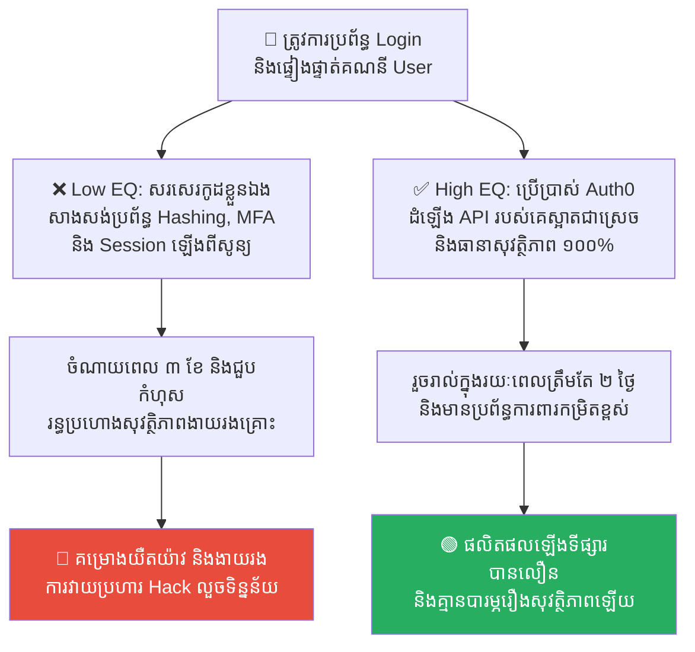
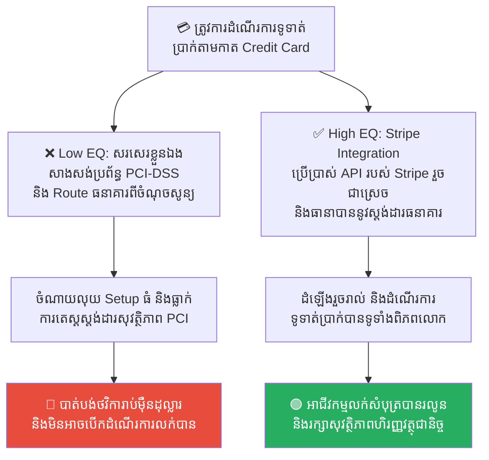
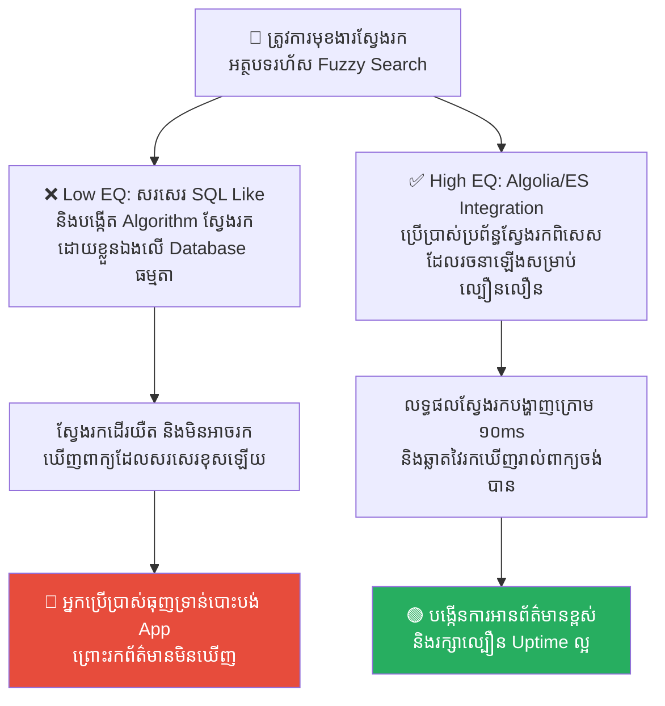
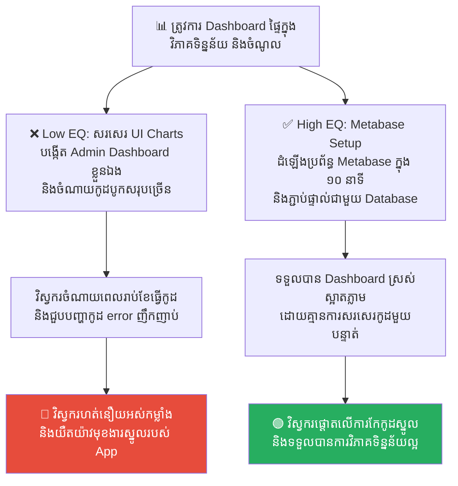
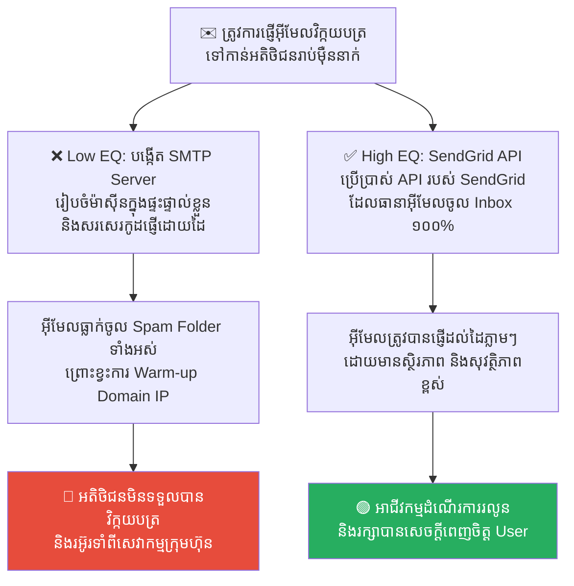

# Sun Tzu: The Art of Build vs. Buy and Choosing Your Battles (ស៊ុនអ៊ូ៖ សិល្បៈនៃការសម្រេចចិត្តសាងសង់ខ្លួនឯងឬទិញគេ និងការជ្រើសរើសសមរភូមិ)

**Author:** ichamrong  
**Date:** 2026-05-17  
**Tags:** #sun-tzu #art-of-war #build-vs-buy #tech-debt #strategy  
**Category:** Concepts  
**Read Time:** ~15 min  

---

## 📌 មាតិកា (Table of Contents)
- [លំនាំបញ្ហា (The Pattern)](#លំនាំបញ្ហា-the-pattern)
- [១. បញ្ហា៖ ការរើសសមរភូមិខុស និងអំនួតចង់សរសេរកូដគ្រប់យ៉ាង (The Issue: Reinventing the Wheel & Resource Exhaustion)](#១-បញ្ហា-ការរើសសមរភូមិខុស-និងអំនួតចង់សរសេរកូដគ្រប់យ៉ាង-the-issue-reinventing-the-wheel-resource-exhaustion)
- [២. ឧទាហរណ៍ជាក់ស្តែងក្នុងពិភពពិត (Real World Examples)](#២-ឧទាហរណ៍ជាក់ស្តែងក្នុងពិភពពិត-real-world-examples)
  - [ឧទាហរណ៍ទី ១ — ប្រព័ន្ធចុះឈ្មោះ និងផ្ទៀងផ្ទាត់គណនី (Custom Auth System vs. Buying Auth0/Firebase Auth)](#ឧទាហរណ៍ទី-១-ប្រព័ន្ធចុះឈ្មោះ-និងផ្ទៀងផ្ទាត់គណនី-custom-auth-system-vs-buying-auth0firebase-auth)
  - [ឧទាហរណ៍ទី ២ — ប្រព័ន្ធទូទាត់ប្រាក់ និងសុវត្ថិភាពធនាគារ (Custom Payment Routing vs. Integrating Stripe API)](#ឧទាហរណ៍ទី-២-ប្រព័ន្ធទូទាត់ប្រាក់-និងសុវត្ថិភាពធនាគារ-custom-payment-routing-vs-integrating-stripe-api)
  - [ឧទាហរណ៍ទី ៣ — ប្រព័ន្ធស្វែងរកទិន្នន័យរហ័ស (SQL Like Operators vs. Elasticsearch/Algolia API)](#ឧទាហរណ៍ទី-៣-ប្រព័ន្ធស្វែងរកទិន្នន័យរហ័ស-sql-like-operators-vs-elasticsearchalgolia-api)
  - [ឧទាហរណ៍ទី ៤ — ផ្ទាំងគ្រប់គ្រងទិន្នន័យផ្ទៃក្នុង (Custom Charting Admin Dashboard vs. Metabase/Mixpanel)](#ឧទាហរណ៍ទី-៤-ផ្ទាំងគ្រប់គ្រងទិន្នន័យផ្ទៃក្នុង-custom-charting-admin-dashboard-vs-metabasemixpanel)
  - [ឧទាហរណ៍ទី ៥ — ប្រព័ន្ធផ្ញើអ៊ីមែលវិក្កយបត្រ (Custom SMTP Server vs. Buying SendGrid/AWS SES)](#ឧទាហរណ៍ទី-៥-ប្រព័ន្ធផ្ញើអ៊ីមែលវិក្កយបត្រ-custom-smtp-server-vs-buying-sendgridaws-ses)
- [៣. កត្តាជម្រុញ៖ អំនួតវិស្វករ និងការមិនយល់ពីតម្លៃកម្លាំងពលកម្ម (The Aggravator: Engineering Ego & Misunderstanding Opportunity Cost)](#៣-កត្តាជម្រុញ-អំនួតវិស្វករ-និងការមិនយល់ពីតម្លៃកម្លាំងពលកម្ម-the-aggravator-engineering-ego-misunderstanding-opportunity-cost)
- [៤. ដំណោះស្រាយទូទៅ៖ ការសន្សំកម្លាំងទ័ព និងការសម្រេចចិត្តដោយវៃឆ្លាត (The General Solution: Minimizing Tech Debt & Choosing Key Battles)](#៤-ដំណោះស្រាយទូទៅ-ការសន្សំកម្លាំងទ័ព-និងការសម្រេចចិត្តដោយវៃឆ្លាត-the-general-solution-minimizing-tech-debt-choosing-key-battles)
- [សេចក្តីសន្និដ្ឋាន (Conclusion)](#សេចក្តីសន្និដ្ឋាន-conclusion)
- [Related Posts](#related-posts)

---

## លំនាំបញ្ហា (The Pattern)

នៅក្នុងសៀវភៅយុទ្ធសាស្ត្រយោធាដ៏ល្បីល្បាញបំផុតលើលោក **«សិល្បៈសង្គ្រាម» (The Art of War)** កំពូលសេនាប្រមុខចិនបុរាណ **ស៊ុនអ៊ូ (Sun Tzu)** បានចែងគោលការណ៍យុទ្ធសាស្ត្រដ៏សំខាន់មួយថា៖
> 💡 **«អ្នកដែលដឹងថាពេលណាគួរប្រយុទ្ធ និងពេលណាមិនគួរប្រយុទ្ធ គឺជាអ្នកឈ្នះ។ កំពូលសេនាប្រមុខដ៏វៃឆ្លាត មិនមែនជាអ្នកដែលវាយលុកគ្រប់ទីក្រុង និងប្រយុទ្ធគ្រប់សមរភូមិនោះទេ ប៉ុន្តែជាអ្នកដែលចេះសន្សំកម្លាំងទ័ព និងស្បៀងអាហារ ទុកសម្រាប់តែវាយប្រហារសមរភូមិណាដែលជាយុទ្ធសាស្ត្រស្នូល ដើម្បីទទួលបានជ័យជម្នះធំប៉ុណ្ណោះ។»**

ស៊ុនអ៊ូបានសង្កត់ធ្ងន់ថា ធនធានកងទ័ព កម្លាំងកាយ និងស្បៀងអាហារ គឺជាធនធានដែលមានដែនកំណត់។ ប្រសិនបើយើងបញ្ជូនទាហានទៅប្រយុទ្ធក្នុងគ្រប់សមរភូមិតូចតាចដែលគ្មានតម្លៃយុទ្ធសាស្ត្រ នោះទាហាននឹងត្រូវនឿយហត់អស់កម្លាំង (Burnout) ស្បៀងអាហារនឹងត្រូវរលាយអស់ ហើយនៅពេលសមរភូមិធំពិតប្រាកដមកដល់ យើងនឹងត្រូវបរាជ័យទាំងស្រុង។

នៅក្នុងការគ្រប់គ្រង និងអភិវឌ្ឍន៍ប្រព័ន្ធបច្ចេកវិទ្យា (Software Engineering) យើងតែងតែប្រឈមមុខនឹង «សិល្បៈសង្គ្រាម» របស់ស៊ុនអ៊ូជានិច្ច តាមរយៈការសម្រេចចិត្តដ៏សំខាន់បំផុតមួយគឺ៖ **Build vs. Buy (សាងសង់កូដខ្លួនឯង ឬទិញប្រព័ន្ធគេយកមកប្រើ)?**
*   **ការប្រយុទ្ធគ្រប់សមរភូមិ (Build Everything)៖** វិស្វករព្យាយាមសរសេរកូដគ្រប់មុខងារឡើងខ្លួនឯងពីសូន្យ (Reinventing the wheel) ដូចជា ប្រព័ន្ធ Login, Payment Gateway, System Monitoring ជាដើម។
*   **ការសន្សំកម្លាំងទ័ព (Buy/Integrate)៖** ការប្រើប្រាស់ API ឬសេវាកម្ម (SaaS) ដែលមានស្រាប់ ដើម្បីដោះស្រាយមុខងារបន្ទាប់បន្សំ និងរក្សាធនធានវិស្វករឱ្យផ្តោតតែលើ **Core Business Logic (គុណតម្លៃស្នូល)** របស់ក្រុមហ៊ុនតែមួយគត់។

---

## ១. បញ្ហា៖ ការរើសសមរភូមិខុស និងអំនួតចង់សរសេរកូដគ្រប់យ៉ាង (The Issue: Reinventing the Wheel & Resource Exhaustion)

គ្រោះថ្នាក់ដ៏ធំបំផុតនៅក្នុងវិស័យវិស្វកម្ម គឺ **Engineering Ego (អំនួតវិស្វករ)**។ វិស្វករជាច្រើនតែងតែមានមោទនភាព និងចង់សរសេរកូដគ្រប់យ៉ាងដោយផ្ទាល់ដៃ ពីចំណុចសូន្យ ព្រោះគិតថា៖ *«យើងជាវិស្វករពូកែ យើងមិនបាច់ចំណាយលុយទិញសេវាកម្មគេឡើយ យើងអាចសរសេរវាដើរល្អជាងគេទៅទៀត!»*។

ការគិតបែបនេះ នាំទៅរក៖
1.  **ការបាត់បង់ឱកាសអាជីវកម្ម (Loss of Velocity)៖** ក្រុមការងារចំណាយពេល ៦ ខែ ដើម្បីគ្រាន់តែសរសេរប្រព័ន្ធ Login ឬ Payment ដែលមិនមែនជាមុខងាររកលុយស្នូលរបស់ក្រុមហ៊ុន ធ្វើឱ្យគម្រោងពន្យារពេល release ឡើងទីផ្សារ។
2.  ** បំណុលបច្ចេកទេស និងកំហុស (Tech Debt & Bugs)៖** រាល់កូដដែលយើងសរសេរឡើង គឺជាបន្ទុកដែលត្រូវការការថែទាំ ជួសជុល និងតេស្តសុវត្ថិភាពជារៀងរហូត។
3.  **ការហត់នឿយអស់កម្លាំង (Burnout)៖** វិស្វករចំណាយកម្លាំងកាយចិត្តលើរឿងមិនសំខាន់ រហូតដល់គ្មានពេលផ្តោតលើការដោះស្រាយបញ្ហាពិតប្រាកដរបស់អតិថិជន។

ស៊ុនអ៊ូបាននិយាយថា៖ **«ជ័យជម្នះដ៏ឧត្តុង្គឧត្តមបំផុត គឺការយកឈ្នះសត្រូវដោយមិនចាំបាច់បញ្ចេញអាវុធប្រយុទ្ធ។»** នៅក្នុងវិស័យបច្ចេកវិទ្យា កូដដែលល្អបំផុត គឺកូដដែលអ្នក **មិនចាំបាច់សរសេរ**។

---

## ២. ឧទាហរណ៍ជាក់ស្តែងក្នុងពិភពពិត (Real World Examples)

សូមពិនិត្យមើល **ឧទាហរណ៍ជាក់ស្តែងចំនួន ៥** បង្ហាញពីភាពខុសគ្នារវាងការជ្រើសរើសសមរភូមិខុស និងការសម្រេចចិត្ត Build vs. Buy ដ៏វៃឆ្លាត៖

---

### ឧទាហរណ៍ទី ១ — ប្រព័ន្ធចុះឈ្មោះ និងផ្ទៀងផ្ទាត់គណនី (Custom Auth System vs. Buying Auth0/Firebase Auth)

**ស្ថានភាព៖** ក្រុមហ៊ុន Startup បង្កើតវេបសាយលក់ទំនិញថ្មី និងត្រូវការប្រព័ន្ធចុះឈ្មោះ ផ្ទៀងផ្ទាត់គណនី ព្រមទាំងមុខងារសុវត្ថិភាព (Sign-in with Google, MFA, Session management)។

*   **សកម្មភាពអសកម្ម / Low EQ / កំហុសឆ្គង (សរសេរខ្លួនឯងគ្រប់យ៉ាង)៖** វិស្វករមិនចង់ចំណាយលុយទិញ Cloud service ក៏សម្រេចចិត្តសរសេរកូដប្រព័ន្ធ Login, Hashing password, multi-factor authentication (MFA) ឡើងខ្លួនឯងពីចំណុចសូន្យ។
*   **សកម្មភាពស្ថាបនា / High EQ / ដំណោះស្រាយ (ទិញ/ប្រើសេវាកម្មដែលមានស្រាប់)៖** អនុវត្ត **Buy/Integrate Auth0 or Firebase Auth**។ ប្រើប្រាស់សេវាកម្ម Authentication កម្រិតស្តង់ដារពិភពលោក ដែលមានស្រាប់ រួចទុកពេលវិស្វករឱ្យផ្តោតលើ Algorithm ណែនាំផលិតផលដល់អតិថិជន (Recommendation Engine)។
*   **លទ្ធផល៖** ការសរសេរខ្លួនឯង នាំឱ្យខាតពេល ៣ ខែ សរសេរកូដរាប់ពាន់បន្ទាត់ និងបង្កឱ្យមានរន្ធប្រហោងសុវត្ថិភាពធ្ងន់ធ្ងរ (Security Vulnerability)។ ការប្រើប្រាស់ Auth0 ជួយឱ្យប្រព័ន្ធមានសុវត្ថិភាពខ្ពស់ ដំណើរការរលូន និងកាត់បន្ថយពេលវេលាផលិតផលឡើងទីផ្សារយ៉ាងលឿនបំផុត។

---

### ឧទាហរណ៍ទី ២ — ប្រព័ន្ធទូទាត់ប្រាក់ និងសុវត្ថិភាពធនាគារ (Custom Payment Routing vs. Integrating Stripe API)

**ស្ថានភាព៖** កម្មវិធីលក់សំបុត្រយន្តហោះ ត្រូវការដំណើរការទូទាត់ប្រាក់តាមកាត Credit Card និង QR Code ពីអតិថិជនជុំវិញពិភពលោក។

*   **សកម្មភាពអសកម្ម / Low EQ / កំហុសឆ្គង (សរសេរខ្លួនឯងគ្រប់យ៉ាង)៖** ក្រុមការងារព្យាយាមសាងសង់ប្រព័ន្ធ Routing គណនីធនាគារផ្ទាល់ខ្លួន និងប្រព័ន្ធសុវត្ថិភាពស្តង់ដារ PCI-DSS ពីចំណុចសូន្យ ព្រោះចង់សន្សំពន្ធកម្រៃជើងសារទូទាត់ប្រាក់ (Transaction Fees)។
*   **សកម្មភាពស្ថាបនា / High EQ / ដំណោះស្រាយ (ទិញ/ប្រើសេវាកម្មដែលមានស្រាប់)៖** អនុវត្ត **Buy - Stripe/PayPal API Integration**។ ប្រើប្រាស់ API របស់ Stripe ដែលមានស្តង់ដារ PCI-DSS រួចជាស្រេច ដើម្បីគ្រប់គ្រងការទូទាត់ប្រាក់ដោយសុវត្ថិភាពខ្ពស់បំផុត និងកាត់បន្ថយសម្ពាធការងារបច្ចេកទេស។
*   **លទ្ធផល៖** ក្រុមហ៊ុនត្រូវចំណាយពេលវេលា និងថវិកាមហាសាលក្នុងការសាងសង់ និងមិនអាចឆ្លងកាត់ការពិនិត្យស្តង់ដារសុវត្ថិភាពធនាគារឡើយ។ ការប្រើប្រាស់ Stripe ជួយសម្រេចការងារបានលឿនក្នុងរយៈពេលប៉ុន្មានថ្ងៃ និងធានាបាននូវភាពជឿជាក់ ១០០%។

---

### ឧទាហរណ៍ទី ៣ — ប្រព័ន្ធស្វែងរកទិន្នន័យរហ័ស (SQL Like Operators vs. Elasticsearch/Algolia API)

**ស្ថានភាព៖** គេហទំព័រព័ត៌មានត្រូវការមុខងារស្វែងរកអត្ថបទ (Search Engine) ដែលមានសមត្ថភាពស្វែងរកពាក្យក្បែរគ្នា (Fuzzy Search) និងបង្ហាញលទ្ធផលលឿនរហ័ស។

*   **សកម្មភាពអសកម្ម / Low EQ / កំហុសឆ្គង (សរសេរខ្លួនឯងគ្រប់យ៉ាង)៖** វិស្វករព្យាយាមសរសេរ Algorithm ស្វែងរកផ្ទាល់ខ្លួននៅលើ SQL database ដោយប្រើប្រាស់ Like Operators ស្មុគស្មាញ និង String Matching Logic ឡើងខ្លួនឯង។
*   **សកម្មភាពស្ថាបនា / High EQ / ដំណោះស្រាយ (ទិញ/ប្រើសេវាកម្មដែលមានស្រាប់)៖** អនុវត្ត **Buy/Leverage Elasticsearch or Algolia API**។ ប្រើប្រាស់សេវាកម្មស្វែងរកដែលមានសមត្ថភាពស្រាប់ ដូចជា Algolia ឬ Elasticsearch ដែលរៀបចំឡើងយ៉ាងល្អឥតខ្ចោះសម្រាប់ការស្វែងរកទិន្នន័យធំៗ។
*   **លទ្ធផល៖** ការសរសេរខ្លួនឯងធ្វើឱ្យការស្វែងរកដើរយឺតខ្លាំងនៅពេលទិន្នន័យកើនឡើង និងមិនអាចស្វែងរកពាក្យខុសអក្ខរាវិរុទ្ធបានត្រឹមត្រូវឡើយ។ ការប្រើប្រាស់ Algolia ផ្ដល់នូវលទ្ធផលស្វែងរកដ៏អស្ចារ្យ និងលឿនបំផុតក្រោម 10ms។

---

### ឧទាហរណ៍ទី ៤ — ផ្ទាំងគ្រប់គ្រងទិន្នន័យផ្ទៃក្នុង (Custom Charting Admin Dashboard vs. Metabase/Mixpanel)

**ស្ថានភាព៖** ក្រុមហ៊ុនចង់បង្កើត Dashboard ផ្ទៃក្នុង ដើម្បីតាមដានសកម្មភាពអតិថិជន និងចំណូលប្រចាំខែ។

*   **សកម្មភាពអសកម្ម / Low EQ / កំហុសឆ្គង (សរសេរខ្លួនឯងគ្រប់យ៉ាង)៖** ក្រុមវិស្វករចំណាយពេលសរសេរ UI Charts ឡើងដោយខ្លួនឯង បង្កើតទំព័រ Admin Panel និងរៀបចំ Database Queries ស្មុគស្មាញដើម្បីបូកសរុបទិន្នន័យ។
*   **សកម្មភាពស្ថាបនា / High EQ / ដំណោះស្រាយ (ទិញ/ប្រើសេវាកម្មដែលមានស្រាប់)៖** អនុវត្ត **Buy - Metabase/Mixpanel Integration**។ ដំឡើងសេវាកម្ម Metabase ដែលជាឧបករណ៍ Open-source ឥតគិតថ្លៃ និងភ្ជាប់ទៅកាន់ database របស់ក្រុមហ៊ុនក្នុងរយៈពេល ១0 នាទីដើម្បីទទួលបាន Dashboard វិភាគដ៏សម្បូរបែប។
*   **លទ្ធផល៖** វិស្វករចំណាយពេលរាប់ខែធ្វើការងារដែលគ្មានប្រយោជន៍ដល់ core product រហូតដល់ហត់នឿយ (Burnout)។ ការប្រើ Metabase ជួយឱ្យក្រុមហ៊ុនទទួលបាន Dashboard ភ្លាមៗ និងមានស្ថិរភាពខ្ពស់។

---

### ឧទាហរណ៍ទី ៥ — ប្រព័ន្ធផ្ញើអ៊ីមែលវិក្កយបត្រ (Custom SMTP Server vs. Buying SendGrid/AWS SES)

**ស្ថានភាព៖** កម្មវិធីលក់សម្លៀកបំពាក់ត្រូវការផ្ញើអ៊ីមែលវិក្កយបត្រ (Invoice Emails) ទៅកាន់អតិថិជនរាប់ម៉ឺននាក់រៀងរាល់ខែ។

*   **សកម្មភាពអសកម្ម / Low EQ / កំហុសឆ្គង (សរសេរខ្លួនឯងគ្រប់យ៉ាង)៖** វិស្វករសម្រេចចិត្តបង្កើត និងរៀបចំ Server SMTP ផ្ទាល់ខ្លួននៅក្នុងការិយាល័យ និងសរសេរកូដគ្រប់គ្រងការផ្ញើអ៊ីមែល ដើម្បីសន្សំថ្លៃ Cloud។
*   **សកម្មភាពស្ថាបនា / High EQ / ដំណោះស្រាយ (ទិញ/ប្រើសេវាកម្មដែលមានស្រាប់)៖** អនុវត្ត **Buy - SendGrid/AWS SES Integration**។ ប្រើប្រាស់សេវាកម្មផ្ញើអ៊ីមែលរបស់ SendGrid ដែលមានប្រព័ន្ធធានាថាអ៊ីមែលមិនធ្លាក់ចូល Spam folder និងមានល្បឿនលឿនខ្ពស់។
*   **លទ្ធផល៖** អ៊ីមែលដែលផ្ញើចេញពី Server ផ្ទាល់ខ្លួនត្រូវបាន Gmail និង Yahoo Block ទាំងស្រុង (Spam) ធ្វើឱ្យអតិថិជនមិនទទួលបានវិក្កយបត្រ បង្កជាបញ្ហាច្របូកច្របល់។ ការប្រើប្រាស់ SendGrid ជួយឱ្យអ៊ីមែលផ្ញើដល់ដៃអតិថិជនបានជោគជ័យ ១00%។

---

## ៣. កត្តាជម្រុញ៖ អំនួតវិស្វករ និងការមិនយល់ពីតម្លៃកម្លាំងពលកម្ម (The Aggravator: Engineering Ego & Misunderstanding Opportunity Cost)

ហេតុអ្វីបានជាយើងងាយនឹងសម្រេចចិត្តខុស និងព្យាយាមសាងសង់គ្រប់យ៉ាងដោយខ្លួនឯង? កត្តាជម្រុញរួមមាន៖

1.  **អំនួតចង់បង្ហាញសមត្ថភាព (Not Invented Here Syndrome)៖** ផ្នត់គំនិតដែលមិនទុកចិត្តបច្ចេកវិទ្យារបស់អ្នកដទៃ និងយល់ថា៖ *«អ្វីដែលមិនត្រូវបានបង្កើតឡើងនៅក្នុងក្រុមហ៊ុនយើង គឺគ្មានគុណភាព ឬមិនមានសុវត្ថិភាពគ្រប់គ្រាន់ឡើយ!»*។
2.  ** ការមើលរំលងតម្លៃឱកាស (Miscalculating Opportunity Cost)៖** ថ្នាក់ដឹកនាំគិតតែពីការចំណាយលុយទិញសេវាកម្មប្រចាំខែ (ឧទាហរណ៍៖ Stripe គិតកម្រៃ ២.៩%) ដោយមើលរំលងថា ការប្រើវិស្វករ ៣ នាក់សរសេរប្រព័ន្ធទូទាត់ប្រាក់ ត្រូវចំណាយប្រាក់ខែ និងពេលវេលាច្រើនជាងថ្លៃសេវាកម្ម Stripe រាប់រយដង។
3.  **ចង់បានប្រព័ន្ធបត់បែនគ្មានដែនកំណត់ (The Flexibility Illusion)៖** ការយល់ច្រឡំថា ការសរសេរខ្លួនឯងនឹងជួយឱ្យយើងអាចកែប្រែ ឬបន្ថែមមុខងារអ្វីក៏បានតាមចិត្តចង់ ទាំងដែលការពិតយើងសរសេរមិនទាន់ទាំងដើរស្រួលផង។

---

## ៤. ដំណោះស្រាយទូទៅ៖ ការសន្សំកម្លាំងទ័ព និងការសម្រេចចិត្តដោយវៃឆ្លាត (The General Solution: Minimizing Tech Debt & Choosing Key Battles)

ដើម្បីអនុវត្តយុទ្ធសាស្ត្រ «សិល្បៈសង្គ្រាម» របស់ស៊ុនអ៊ូ នៅក្នុងធុរកិច្ចបច្ចេកវិទ្យា ចូរប្រើប្រាស់ក្របខ័ណ្ឌសម្រេចចិត្ត (Decision Framework) ខាងក្រោម៖

1.  ** វិភាគភាពខុសគ្នារវាង Core Business Logic និង Commodity៖**
    *   **Core Business Logic (គុណតម្លៃស្នូល - BUILD):** មុខងារដែលជាម៉ាស៊ីនរកលុយស្នូលរបស់ក្រុមហ៊ុន និងជាអ្វីដែលធ្វើឱ្យយើងប្លែកពីគូប្រជែង (Competitive Advantage)។ ឧទាហរណ៍៖ Algorithm គណនាផ្លូវដឹងជញ្ជូនរបស់ក្រុមហ៊ុនដឹកជញ្ជូន, ឬ Algorithm ផ្គូផ្គងអ្នកបើកបររបស់ Uber។ ចំពោះរឿងនេះ **ត្រូវតែសរសេរខ្លួនឯងជាដាច់ខាត**។
    *   **Commodity (មុខងារបន្ទាប់បន្សំ - BUY):** មុខងារដែលក្រុមហ៊ុនណាៗក៏មានដូចគ្នា និងគ្មាននរណាម្នាក់ទិញផលិតផលយើងដោយសារវាឡើយ។ ឧទាហរណ៍៖ ប្រព័ន្ធ Login, ផ្ញើ Email, ផ្ញើ SMS, Payment Gateway, Charts Dashboard។ ចំពោះរឿងទាំងនេះ **ត្រូវតែទិញ ឬប្រើប្រាស់ Open-source ជានិច្ច**។
2.  ** គណនាតម្លៃពលកម្មសរុប (Calculate Total Cost of Ownership - TCO)៖** មុននឹងសម្រេចចិត្ត Build ចូរសួរខ្លួនឯងថា៖ *តើយើងត្រូវប្រើវិស្វករប៉ុន្មាននាក់? រយៈពេលប៉ុន្មានខែ? តើប្រាក់ខែសរុបប៉ុន្មាន? និងតើត្រូវចំណាយពេលថែទាំវារៀងរាល់ខែអស់ប៉ុន្មាន?* រួចយកទៅប្រៀបធៀបជាមួយតម្លៃទិញសេវាកម្មគេ។
3.  ** ប្រើប្រាស់ Open-Source គួបផ្សំនឹង API៖** ប្រសិនបើចង់សន្សំសំចៃ ចូរប្រើប្រាស់បណ្ណាល័យ Open-source ល្បីៗដែលមានការគាំទ្រច្រើន (Community Support) ជំនួសឱ្យការសរសេរឡើងខ្លួនឯងពីសូន្យ។

---

## សេចក្តីសន្និដ្ឋាន (Conclusion)

**ស៊ុនអ៊ូ និងយុទ្ធសាស្ត្រសម្រេចចិត្តសាងសង់ខ្លួនឯងឬទិញគេ (Build vs. Buy)** បង្រៀនយើងថា វិស្វករ និងថ្នាក់ដឹកនាំបច្ចេកវិទ្យាដ៏ឆ្នើម មិនមែនជាអ្នកដែលសរសេរកូដច្រើនបំផុត ឬស្មុគស្មាញបំផុតនោះទេ ប៉ុន្តែជាអ្នកដែលចេះ **«គ្រប់គ្រងធនធានពេលវេលា និងកម្លាំងពលកម្មរបស់ក្រុមការងារយ៉ាងមានប្រសិទ្ធភាពបំផុត»**។

ចងចាំថា៖ **«ចូរសន្សំកម្លាំងទ័ពរបស់អ្នកសម្រាប់តែសមរភូមិណាដែលនាំមកនូវជ័យជម្នះស្នូលរបស់ក្រុមហ៊ុន។ កុំខ្ជះខ្ជាយពេលវេលាទៅបង្កើតកង់ម្តងទៀតឡើយ។»**

---

## Related Posts

*   **[36 The Gordian Knot: Over-Engineering and the KISS Principle](./36-the-gordian-knot-and-overengineering.md)** — របៀបដោះស្រាយបញ្ហាដោយរក្សាភាពសាមញ្ញ និងជៀសវាងការបង្កើតប្រព័ន្ធស្មុគស្មាញហួសហេតុ។
*   **[10 Technical Debt and Refactoring](./10-technical-debt-and-refactoring.md)** — របៀបគ្រប់គ្រងបំណុលបច្ចេកទេស និងការសម្អាតប្រព័ន្ធការងារឱ្យមានលំនឹងជានិច្ច។

---

*Last updated: 2026-05-26*
