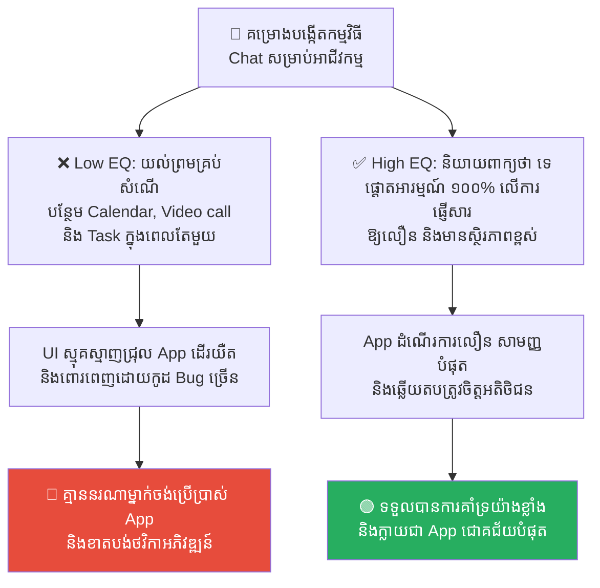
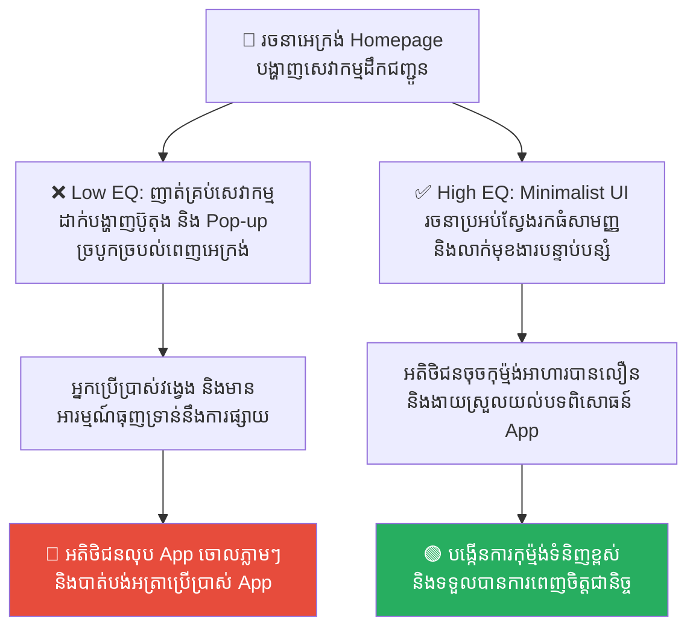
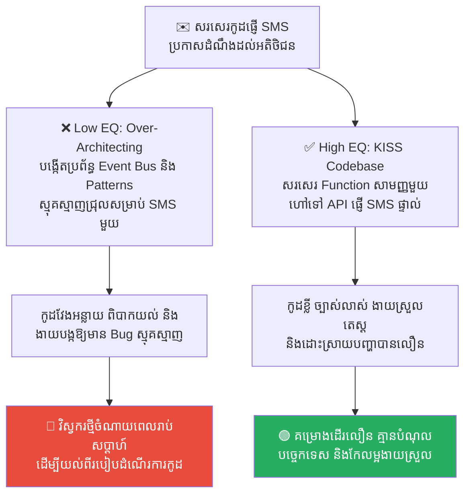
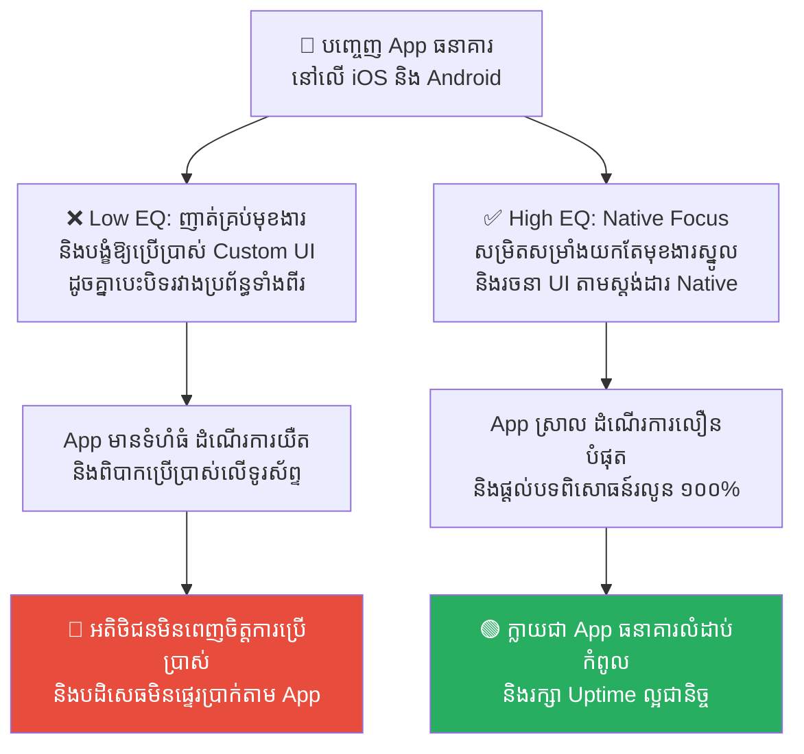
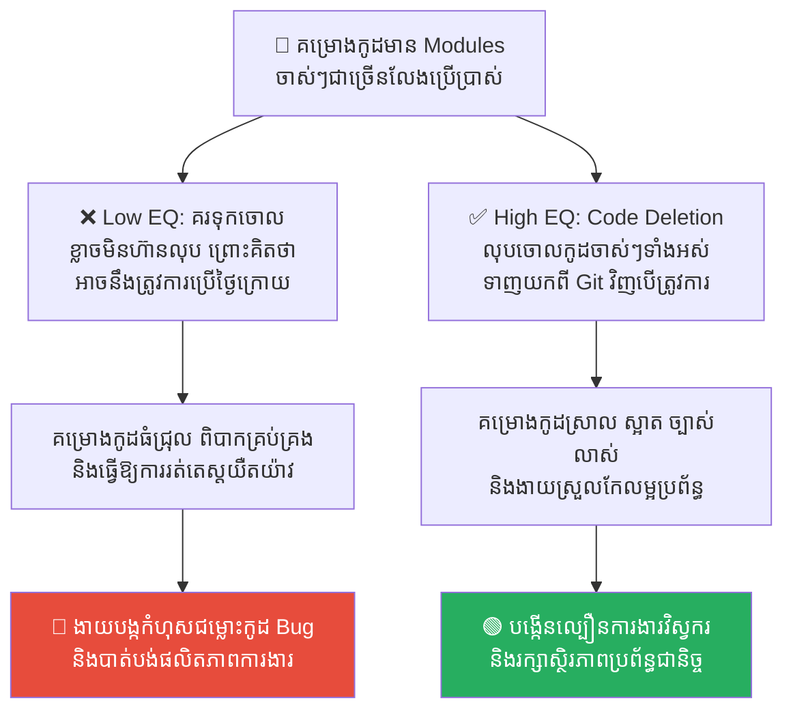

# Steve Jobs: Feature Bloat and the Power of Saying No (ស្ទីវ ចប្ស៍៖ ភាពហើមប៉ោងនៃមុខងារកម្មវិធី និងអំណាចនៃការបដិសេធ)

**Author:** ichamrong  
**Date:** 2026-05-17  
**Tags:** #steve-jobs #feature-bloat #scope-creep #product-management #focus  
**Category:** Concepts  
**Read Time:** ~15 min  

---

## 📌 មាតិកា (Table of Contents)
- [លំនាំបញ្ហា (The Pattern)](#លំនាំបញ្ហា-the-pattern)
- [១. បញ្ហា៖ ជំងឺហើមប៉ោងមុខងារ និងការបាត់បង់ការផ្តោតអារម្មណ៍ (The Issue: Feature Bloat & The Death of Focus)](#១-បញ្ហា-ជំងឺហើមប៉ោងមុខងារ-និងការបាត់បង់ការផ្តោតអារម្មណ៍-the-issue-feature-bloat-the-death-of-focus)
- [២. ឧទាហរណ៍ជាក់ស្តែងក្នុងពិភពពិត (Real World Examples)](#២-ឧទាហរណ៍ជាក់ស្តែងក្នុងពិភពពិត)
  - [ឧទាហរណ៍ទី ១ — ការយល់ព្រមតាមរាល់សំណើរបស់អតិថិជន (Saying Yes to All Requests vs. Saying No to Focus Core Product)](#ឧទាហរណ៍ទី-១-ការយល់ព្រមតាមរាល់សំណើរបស់អតិថិជន-saying-yes-to-all-requests-vs-saying-no-to-focus-core-product)
  - [ឧទាហរណ៍ទី ២ — ការរចនាផ្ទាំងអេក្រង់ដើមរបស់កម្មវិធី (Cluttered UI Services vs. Minimalist Search-Driven Interface)](#ឧទាហរណ៍ទី-២-ការរចនាផ្ទាំងអេក្រង់ដើមរបស់កម្មវិធី-cluttered-ui-services-vs-minimalist-search-driven-interface)
  - [ឧទាហរណ៍ទី ៣ — ការសរសេរកូដស្មុគស្មាញសម្រាប់ប្រព័ន្ធផ្ញើសារ (Over-Architected Event Bus vs. Simple Direct SMS Service)](#ឧទាហរណ៍ទី-៣-ការសរសេរកូដស្មុគស្មាញសម្រាប់ប្រព័ន្ធផ្ញើសារ-over-architected-event-bus-vs-simple-direct-sms-service)
  - [ឧទាហរណ៍ទី ៤ — ការបញ្ចេញមុខងារកម្មវិធីលើគ្រប់ប្រព័ន្ធ (Cross-Platform Feature Parity vs. Native Simplification Focus)](#ឧទាហរណ៍ទី-៤-ការបញ្ចេញមុខងារកម្មវិធីលើគ្រប់ប្រព័ន្ធ-cross-platform-feature-parity-vs-native-simplification-focus)
  - [ឧទាហរណ៍ទី ៥ — ការគរទុកកូដចាស់ៗដែលលែងប្រើប្រាស់ (Keeping Legacy Dead Code vs. Aggressive Code Deletion & Pruning)](#ឧទាហរណ៍ទី-៥-ការគរទុកកូដចាស់ៗដែលលែងប្រើប្រាស់-keeping-legacy-dead-code-vs-aggressive-code-deletion-pruning)
- [៣. កត្តាជម្រុញ៖ ការចង់ផ្គាប់ចិត្តគ្រប់គ្នា និងការខ្លាចបដិសេធ (The Aggravator: People-Pleasing & Fear of Saying No)](#៣-កត្តាជម្រុញ-ការចង់ផ្គាប់ចិត្តគ្រប់គ្នា-និងការខ្លាចបដិសេធ-the-aggravator-people-pleasing-fear-of-saying-no)
- [៤. ដំណោះស្រាយទូទៅ៖ អំណាចនៃការបដិសេធ និងការស្វែងរកភាពសាមញ្ញ (The General Solution: The Power of Saying No & Ultimate Simplicity)](#៤-ដំណោះស្រាយទូទៅ-អំណាចនៃការបដិសេធ-និងការស្វែងរកភាពសាមញ្ញ-the-general-solution-the-power-of-saying-no-ultimate-simplicity)
- [សេចក្តីសន្និដ្ឋាន (Conclusion)](#សេចក្តីសន្និដ្ឋាន-conclusion)
- [Related Posts](#related-posts)

---

## លំនាំបញ្ហា (The Pattern)

នៅឆ្នាំ ១៩៩៧ ពេលដែល **ស្ទីវ ចប្ស៍ (Steve Jobs)** ត្រឡប់មកដឹកនាំក្រុមហ៊ុន Apple វិញ ក្នុងនាមជា CEO បន្ទាប់ពីត្រូវបានបណ្តេញចេញអស់រយៈពេល ១២ ឆ្នាំ ទ្រង់បានរកឃើញថាក្រុមហ៊ុនកំពុងស្ថិតក្នុងស្ថានភាពជិតក្ស័យធនធ្ងន់ធ្ងរ។ យីហោ Apple កំពុងតែចុះខ្សោយខ្លាំង ព្រោះតែពួកគេបានផលិតកុំព្យូទ័រ និងឧបករណ៍អេឡិចត្រូនិកជាច្រើនម៉ូដែល (រាប់សិបប្រភេទ) ដែលមើលទៅច្របូកច្របល់ និងគ្មានទិសដៅច្បាស់លាស់។

ចប្ស៍បានកោះប្រជុំថ្នាក់ដឹកនាំផលិតផលទាំងអស់ រួចសួរពួកគេសាមញ្ញថា៖ **«តើម៉ូដែលមួយណាដែលខ្ញុំគួរណែនាំទៅមិត្តភក្តិរបស់ខ្ញុំឱ្យទិញ?»**។ គ្មានថ្នាក់ដឹកនាំណាម្នាក់ អាចឆ្លើយសំណួរនេះបានច្បាស់លាស់ឡើយ ព្រោះផលិតផលនីមួយៗមានលក្ខណៈស្រដៀងៗគ្នា និងគ្មានលក្ខណៈសម្បត្តិលេចធ្លោ។

ចប្ស៍បានដើរទៅកាន់ក្តារខៀន រួចគូររូបការ៉េបួន (Four Quadrants) យ៉ាងសាមញ្ញ៖
*   **ជួរដេក៖** សម្រាប់អ្នកប្រើប្រាស់ទូទៅ (Consumer) និង អ្នកជំនាញ (Pro)។
*   **ជួរឈរ៖** សម្រាប់កុំព្យូទ័រយួរដៃ (Portable) និង កុំព្យូទ័រលើតុ (Desktop)។

ទ្រង់បានបញ្ជាឱ្យក្រុមការងារលុបចោលផលិតផល ៧០% របស់ Apple ភ្លាមៗ និងផ្តោតលើកុំព្យូទ័រតែ ៤ ម៉ូដែលគត់។ ទ្រង់បានបន្លឺឃ្លាដ៏ល្បីល្បាញមួយថា៖
> 💡 **«មនុស្សតែងតែយល់ថា "ការផ្តោតអារម្មណ៍" (Focus) មានន័យថា ការនិយាយពាក្យថា "យល់ព្រម" ទៅកាន់រឿងដែលអ្នកត្រូវធ្វើ។ តែវាមិនមែនទេ។ វាមានន័យថា ការនិយាយពាក្យថា "ទេ" (No) ទៅកាន់គំនិតល្អៗចំនួន ១០០ ផ្សេងទៀតដែលកំពុងហោះហើរនៅជុំវិញខ្លួន។ អ្នកត្រូវតែចេះរើសដោយប្រុងប្រយ័ត្នបំផុត។»**

នៅក្នុងការអភិវឌ្ឍកម្មវិធី (Software Development) យើងតែងតែជួបប្រទះស្ថានភាពនេះជានិច្ច ដែលត្រូវបានគេហៅថា **Feature Bloat** ឬ **Scope Creep** (ភាពហើមប៉ោងនៃមុខងារកម្មវិធី)។ 
*   ការយល់ព្រមបន្ថែមមុខងារគ្រប់យ៉ាងដើម្បីផ្គាប់ចិត្តអតិថិជន ធ្វើឱ្យកម្មវិធីស្មុគស្មាញ និងប្រើការមិនកើត។
*   អំណាចពិតប្រាកដរបស់ Product Manager និង Tech Lead គឺស្ថិតនៅលើសមត្ថភាពក្នុងការនិយាយពាក្យថា **«ទេ»** ដើម្បីរក្សាភាពសាមញ្ញ និងគុណភាពស្នូលរបស់ប្រព័ន្ធ។

---

## ១. បញ្ហា៖ ជំងឺហើមប៉ោងមុខងារ និងការបាត់បង់ការផ្តោតអារម្មណ៍ (The Issue: Feature Bloat & The Death of Focus)

ជំងឺ **Feature Bloat** (ឬ Featuritis) គឺជាសត្រូវលាក់មុខដែលបំផ្លាញគុណភាពកម្មវិធី។ វាកើតឡើងនៅពេលដែល៖
*   ផ្នែកលក់ (Sales) ចង់បានមុខងារ A ដើម្បីបិទ deal ជាមួយភ្ញៀវ។
*   ផ្នែកទីផ្សារ (Marketing) ចង់បានមុខងារ B ដើម្បីផ្សព្វផ្សាយពាណិជ្ជកម្ម។
*   អតិថិជនស្នើសុំមុខងារ C, D, E បន្ថែមឥតឈប់ឈរ។

នៅពេលដែលក្រុមហ៊ុនមិនហ៊ានបដិសេធ ហើយសម្រេចចិត្តបញ្ចូលមុខងារទាំងអស់នោះទៅក្នុង App តែមួយ វានឹងបង្កើត៖
1.  **UI/UX វឹកវរ (Cluttered Interface)៖** អេក្រង់កម្មវិធីពោរពេញដោយប៊ូតុង ផ្ទាំង Pop-up និង menu ស្មុគស្មាញ ធ្វើឱ្យអ្នកប្រើប្រាស់វង្វេងវង្វាន់ មិនដឹងត្រូវចុចត្រង់ណា។
2.  ** កូដរញ៉េរញ៉ៃ និងងាយខូច (Legacy Spaghetti Code)៖** វិស្វករត្រូវសរសេរកូដគរលើគ្នា បង្កើតឱ្យមាន Bug ស្មុគស្មាញ និងធ្វើឱ្យប្រព័ន្ធដំណើរការយឺតខ្លាំង (Performance Drop)។
3.  **ការបាត់បង់អត្តសញ្ញាណផលិតផល៖** កម្មវិធីដែលព្យាយាមធ្វើអ្វីៗគ្រប់យ៉ាងសម្រាប់មនុស្សគ្រប់គ្នា ចុងក្រោយនឹងក្លាយជាកម្មវិធីដែលគ្មាននរណាម្នាក់ចង់ប្រើប្រាស់ឡើយ។

---

## ២. ឧទាហរណ៍ជាក់ស្តែងក្នុងពិភពពិត

សូមពិនិត្យមើល **ឧទាហរណ៍ជាក់ស្តែងចំនួន ៥** បង្ហាញពីគ្រោះថ្នាក់នៃ Feature Bloat និងអំណាចនៃការនិយាយពាក្យថា «ទេ»៖

---

### ឧទាហរណ៍ទី ១ — ការយល់ព្រមតាមរាល់សំណើរបស់អតិថិជន (Saying Yes to All Requests vs. Saying No to Focus Core Product)

**ស្ថានភាព៖** ក្រុមហ៊ុនចង់បង្កើតកម្មវិធីទំនាក់ទំនងទូរស័ព្ទ (Business Chat App) សម្រាប់អាជីវកម្មខ្នាតតូច។

*   **សកម្មភាពអសកម្ម / Low EQ / កំហុសឆ្គង (ជំងឺហើមប៉ោងមុខងារ)៖** Product Manager យល់ព្រមតាមរាល់សំណើរបស់ផ្នែកលក់ និងអតិថិជន ដោយសន្យាបន្ថែមមុខងារ Task Management, Calendar Integration, File Hosting, and Video Calling ព្រមគ្នាក្នុងពេលតែមួយ។
*   **សកម្មភាពស្ថាបនា / High EQ / ដំណោះស្រាយ (ការបដិសេធដើម្បីផ្តោតអារម្មណ៍)៖** អនុវត្ត **Steve Jobs' Focus Strategy**។ បដិសេធរាល់មុខងារបន្ថែមទាំងអស់ រក្សាការផ្តោតអារម្មណ៍ ១០០% លើការធ្វើឱ្យមុខងារផ្ញើសារ (Messaging) មានល្បឿនលឿន សុវត្ថិភាព និងមានស្ថិរភាពខ្ពស់បំផុត។
*   **លទ្ធផល៖** កម្មវិធីដែលយល់ព្រមគ្រប់យ៉ាង ក្លាយជាគំនរសំរាមបច្ចេកទេស ដើរយឺតខ្លាំង UI ញ៉ីញ៉ៃ និងគ្មាននរណាម្នាក់ប្រើប្រាស់។ កម្មវិធីដែលផ្តោតលើស្នូល ដំណើរការលឿន ងាយស្រួលប្រើ និងទទួលបានការពេញចិត្តយ៉ាងខ្លាំងពីអ្នកប្រើប្រាស់។

---

### ឧទាហរណ៍ទី ២ — ការរចនាផ្ទាំងអេក្រង់ដើមរបស់កម្មវិធី (Cluttered UI Services vs. Minimalist Search-Driven Interface)

**ស្ថានភាព៖** កម្មវិធីទូរស័ព្ទសម្រាប់សេវាកម្មដឹកជញ្ជូន (Delivery App) ត្រូវការបង្ហាញសេវាកម្មដល់អតិថិជននៅលើទំព័រដើម (Homepage)។

*   **សកម្មភាពអសកម្ម / Low EQ / កំហុសឆ្គង (ជំងឺហើមប៉ោងមុខងារ)៖** អ្នករចនាដាក់បង្ហាញសេវាកម្មគ្រប់ប្រភេទ (កុម្ម៉ង់អាហារ, ផ្ញើអីវ៉ាន់, ទិញថ្នាំ, ជួលឡាន, កក់សណ្ឋាគារ) ព្រមទាំងប៊ូតុងផ្សព្វផ្សាយពាណិជ្ជកម្ម និង Pop-up ចំនួន ៣ ព្រមគ្នានៅលើអេក្រង់តែមួយ។
*   **សកម្មភាពស្ថាបនា / High EQ / ដំណោះស្រាយ (ភាពសាមញ្ញជាទីបំផុត)៖** អនុវត្ត **Minimalist Interface - Search-Driven UI (ដូចជា Google ឬ Gojek/Grab)**។ រចនាទំព័រដើមឱ្យមានភាពស្អាត និងធំទូលាយ ដោយមានតែប្រអប់ស្វែងរកធំមួយ `[តើអ្នកចង់ញ៉ាំអ្វីនៅថ្ងៃនេះ?]` និងលាក់សេវាកម្មផ្សេងៗទៀតនៅក្នុង Menu ខាងក្នុង។
*   **លទ្ធផល៖** អេក្រង់ដើមដែលញ៉េរញ៉ៃធ្វើឱ្យអតិថិជនស្លន់ស្លោ និងចាកចេញពី App ព្រោះមិនដឹងត្រូវចុចត្រង់ណា។ អេក្រង់បែប Minimalist ជួយជម្រុញការទិញទំនិញបានលឿន និងបង្កើនប្រាក់ចំណូលក្រុមហ៊ុនយ៉ាងខ្លាំង។

---

### ឧទាហរណ៍ទី ៣ — ការសរសេរកូដស្មុគស្មាញសម្រាប់ប្រព័ន្ធផ្ញើសារ (Over-Architected Event Bus vs. Simple Direct SMS Service)

**ស្ថានភាព៖** កូដរបស់កម្មវិធី ត្រូវការគ្រប់គ្រងការផ្ញើ Notification (SMS/Email) ទៅកាន់អតិថិជននៅពេលចុះឈ្មោះរួច។

*   **សកម្មភាពអសកម្ម / Low EQ / កំហុសឆ្គង (ជំងឺហើមប៉ោងមុខងារ)៖** វិស្វករព្យាយាមសរសេរកូដគិតមុនហួសហេតុ ដោយបង្កើតប្រព័ន្ធ Event Bus ស្មុគស្មាញ, ប្រើប្រាស់ Multiple design patterns (Abstract Factory, Observer, Adapter) សម្រាប់តែផ្ញើ SMS មួយប្រភេទ។
*   **សកម្មភាពស្ថាបនា / High EQ / ដំណោះស្រាយ (ភាពសាមញ្ញជាទីបំផុត)៖** អនុវត្ត **KISS Codebase & YAGNI Principle**។ សរសេរមុខងារជាលក្ខណៈ Function សាមញ្ញមួយ ដែលហៅទៅកាន់ API ផ្ញើ SMS ផ្ទាល់ (Direct Service) ងាយៗ ដោយគ្មានរចនាសម្ព័ន្ធស្មុគស្មាញ។
*   **លទ្ធផល៖** កូដស្មុគស្មាញបង្កឱ្យមាន Bug ច្រើន ពិបាកយល់ និងពិបាក Onboard បុគ្គលិកថ្មី។ កូដសាមញ្ញ ងាយស្រួលអាន ងាយតេស្ត និងងាយស្រួលពង្រីកនៅពេលតម្រូវការជាក់ស្តែងមកដល់។

---

### ឧទាហរណ៍ទី ៤ — ការបញ្ចេញមុខងារកម្មវិធីលើគ្រប់ប្រព័ន្ធ (Cross-Platform Feature Parity vs. Native Simplification Focus)

**ស្ថានភាព៖** ក្រុមហ៊ុនចង់បញ្ចេញ App ធនាគារនៅលើប្រព័ន្ធប្រតិបត្តិការ iOS និង Android ក្នុងពេលព្រមគ្នា។

*   **សកម្មភាពអសកម្ម / Low EQ / កំហុសឆ្គង (ជំងឺហើមប៉ោងមុខងារ)៖** ក្រុមការងារព្យាយាមសរសេរមុខងារស្មុគស្មាញគ្រប់ប្រភេទឱ្យដូចគ្នាបេះបិទរវាង App ទាំងពីរ ដោយមិនខ្វល់ពីលក្ខណៈបច្ចេកទេសរបស់ឧបករណ៍នីមួយៗ និងបង្ខំឱ្យប្រើប្រាស់ Custom UI ដូចគ្នា។
*   **សកម្មភាពស្ថាបនា / High EQ / ដំណោះស្រាយ (ការបដិសេធដើម្បីផ្តោតអារម្មណ៍)៖** សម្រិតសម្រាំងយកតែមុខងារស្នូលរបស់ធនាគារ (ផ្ទេរប្រាក់, ពិនិត្យសមតុល្យ) និងរចនា UI ឱ្យស្របតាមស្តង់ដារ Native (Material Design សម្រាប់ Android និង Human Interface Guidelines សម្រាប់ iOS) ដើម្បីផ្តល់បទពិសោធន៍ល្បឿនលឿនបំផុត។
*   **លទ្ធផល៖** App មានទំហំធំ ដំណើរការមិនរលូន និងពិបាកប្រើប្រាស់លើឧបករណ៍ទូរស័ព្ទ។ Native App ស្រាល ដំណើរការលឿន និងផ្ដល់នូវបទពិសោធន៍ដ៏ល្អឥតខ្ចោះដល់អ្នកប្រើប្រាស់។

---

### ឧទាហរណ៍ទី ៥ — ការគរទុកកូដចាស់ៗដែលលែងប្រើប្រាស់ (Keeping Legacy Dead Code vs. Aggressive Code Deletion & Pruning)

**ស្ថានភាព៖** នៅក្នុងគម្រោងកូដ មាន Modules ចាស់ៗជាច្រើនដែលលែងមានអ្នកប្រើប្រាស់ (Dead Code)។

*   **សកម្មភាពអសកម្ម / Low EQ / កំហុសឆ្គង (ជំងឺហើមប៉ោងមុខងារ)៖** ក្រុមការងាររក្សាទុកកូដចាស់ៗទាំងនោះចោលក្នុងគម្រោង ព្រោះ៖ *«ក្រែងលោថ្ងៃណាមួយយើងត្រូវការវាឡើងវិញ!»* ធ្វើឱ្យទំហំកូដកាន់តែរីកធំ និងច្របូកច្របល់។
*   **សកម្មភាពស្ថាបនា / High EQ / ដំណោះស្រាយ (ការបដិសេធដើម្បីផ្តោតអារម្មណ៍)៖** អនុវត្ត **Aggressive Code Pruning**។ លុបរាល់កូដ និង modules ចាស់ៗដែលលែងប្រើប្រាស់ចោលទាំងស្រុងពី Project។ ប្រសិនបើថ្ងៃក្រោយត្រូវការឡើងវិញ យើងអាចទាញយកវាពី Git History បានគ្រប់ពេល។
*   **លទ្ធផល៖** គម្រោងកូដធំជ្រុល ធ្វើឱ្យល្បឿនរត់តេស្តយឺតយ៉ាវ និងងាយបង្កឱ្យមាន Bug ជម្លោះកូដ។ ការសម្អាតកូដចោល ជួយឱ្យគម្រោងស្រាល ស្អាត ដំណើរការលឿន និងងាយស្រួលគ្រប់គ្រងបំផុត។

---

## ៣. កត្តាជម្រុញ៖ ការចង់ផ្គាប់ចិត្តគ្រប់គ្នា និងការខ្លាចបដិសេធ (The Aggravator: People-Pleasing & Fear of Saying No)

ហេតុអ្វីបានជាយើងងាយនឹងធ្លាក់ចូលទៅក្នុងជំងឺ Feature Bloat ខ្លាំងម្ល៉េះ? កត្តាជម្រុញរួមមាន៖

1.  **វប្បធម៌យល់ព្រមគ្រប់យ៉ាង (People-Pleasing Culture)៖** Product Manager និងវិស្វករខ្លាចការបដិសេធ និងខ្លាចធ្វើឱ្យផ្នែកលក់ ឬអតិថិជនខកចិត្ត។ ពួកគេចង់ឱ្យគ្រប់គ្នាស្រឡាញ់ ទើបនិយាយពាក្យថា «យល់ព្រម» ទៅកាន់រាល់សំណើទាំងអស់។
2.  ** ការយល់ច្រឡំថា «មុខងារកាន់តែច្រើន ផលិតផលកាន់តែល្អ» (The More is Better Fallacy)៖** ថ្នាក់ដឹកនាំជឿជាក់ថា ដើម្បីប្រកួតប្រជែងជាមួយគូប្រជែង យើងត្រូវមានមុខងារច្រើនជាងគេ ដោយមើលរំលងគុណភាព និងភាពងាយស្រួលប្រើប្រាស់។
3.  **កង្វះចក្ខុវិស័យ និងទិសដៅច្បាស់លាស់ (Lack of Product Vision)៖** នៅពេលដែលក្រុមហ៊ុនមិនមានទិសដៅច្បាស់លាស់ ពួកគេនឹងហោះហើរទៅតាមខ្យល់បក់ គឺកែប្រែផលិតផលទៅតាមចិត្តរបស់អតិថិជនម្នាក់ៗ ដែលនាំទៅរកការបែកបាក់អត្តសញ្ញាណផលិតផល។

---

## ៤. ដំណោះស្រាយទូទៅ៖ អំណាចនៃការបដិសេធ និងការស្វែងរកភាពសាមញ្ញ (The General Solution: The Power of Saying No & Ultimate Simplicity)

ដើម្បីរក្សាភាពសាមញ្ញ និងគុណភាពខ្ពស់នៃកម្មវិធី ស្របតាមទស្សនវិជ្ជារបស់ស្ទីវ ចប្ស៍ ចូរអនុវត្តគោលការណ៍ដូចខាងក្រោម៖

1.  ** បង្កើតយុទ្ធសាស្ត្របដិសេធដោយវិជ្ជមាន (The Positive No)៖** នៅពេលបដិសេធការស្នើសុំមុខងារថ្មី ចូរពន្យល់ពីមូលហេតុបច្ចេកទេស និងផលប៉ះពាល់ដល់ស្ថិរភាពកម្មវិធី។ ផ្ដោតលើការប្រាប់ថា៖ *«យើងបដិសេធមុខងារនេះ ដើម្បីធ្វើឱ្យមុខងារចម្បងដែលអ្នកកំពុងប្រើប្រាស់ មានល្បឿនលឿន និងល្អឥតខ្ចោះបំផុត។»*
2.  ** អនុវត្តគោលការណ៍ «ដកចេញ មិនមែនបន្ថែម» (Perfection through Subtraction)៖** ជារៀងរាល់ខែ ចូរពិនិត្យមើលមុខងារណាដែលអតិថិជនមិនសូវប្រើប្រាស់ រួចធ្វើការលុបវាចោល (Deprecate/Delete) ដើម្បីកាត់បន្ថយភាពស្មុគស្មាញ និងទំហំកម្មវិធី។
3.  ** រក្សាចក្ខុវិស័យស្នូលឱ្យរឹងមាំ (Define the Core Value)៖** កំណត់ឱ្យបានច្បាស់លាស់៖ *តើអ្វីជាបញ្ហាចម្បងដែលកម្មវិធីយើងកំពុងដោះស្រាយឱ្យអតិថិជន?* រាល់មុខងារដែលមិនបានជួយដោះស្រាយបញ្ហាស្នូលនេះ ត្រូវតែច្រានចោលជាដាច់ខាត។
4.  ** សរសេរកូដសាមញ្ញតាមគោលការណ៍ YAGNI (You Aren't Gonna Need It)៖** កុំសរសេរកូដសម្រាប់ករណីដែលអ្នក «ស្មាន» ថាអនាគតនឹងត្រូវការ។ ចូរសរសេរតែកូដដែលដោះស្រាយបញ្ហាសម្រាប់ថ្ងៃនេះប៉ុណ្ណោះ។

---

## សេចក្តីសន្និដ្ឋាន (Conclusion)

**ស្ទីវ ចប្ស៍ និងអំណាចនៃការបដិសេធ (Feature Bloat)** បង្រៀនយើងថា ភាពអស្ចារ្យពិតប្រាកដនៅក្នុងវិស័យបច្ចេកវិទ្យា មិនមែនកើតឡើងពីការសាងសង់អ្វីៗគ្រប់យ៉ាងឱ្យធំស្មុគស្មាញនោះទេ ប៉ុន្តែវាគឺកើតឡើងចេញពី **«សមត្ថភាពក្នុងការរក្សាភាពសាមញ្ញ ការបោះបង់ចោលនូវអ្វីដែលមិនចាំបាច់ និងការផ្តោតអារម្មណ៍ទៅលើគុណតម្លៃស្នូល ដើម្បីផ្តល់ជូននូវផលិតផលដែលមានគុណភាពខ្ពស់បំផុត និងងាយស្រួលប្រើប្រាស់បំផុតដល់អ្នកប្រើប្រាស់»**។

ចងចាំជានិច្ចថា៖ **«ភាពល្អឥតខ្ចោះ មិនមែនកើតឡើងនៅពេលដែលគ្មានអ្វីត្រូវបន្ថែមទៀតនោះទេ ប៉ុន្តែវាកើតឡើងនៅពេលដែលគ្មានអ្វីត្រូវដកចេញទៀតនោះឡើយ។»**

---

## Related Posts

*   **[36 The Gordian Knot: Over-Engineering and the KISS Principle](./36-the-gordian-knot-and-overengineering.md)** — របៀបដោះស្រាយបញ្ហាដោយរក្សាភាពសាមញ្ញ និងជៀសវាងការបង្កើតប្រព័ន្ធស្មុគស្មាញហួសហេតុ។
*   **[10 Technical Debt and Refactoring](./10-technical-debt-and-refactoring.md)** — របៀបគ្រប់គ្រងស្ថិរភាព និងការសម្អាតប្រព័ន្ធការងារឱ្យមានលំនឹងជានិច្ច។

---

*Last updated: 2026-05-26*
