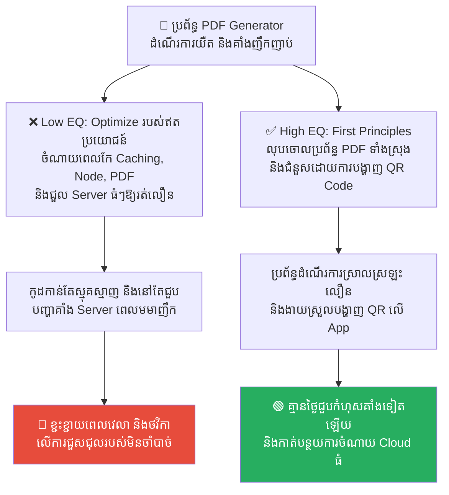
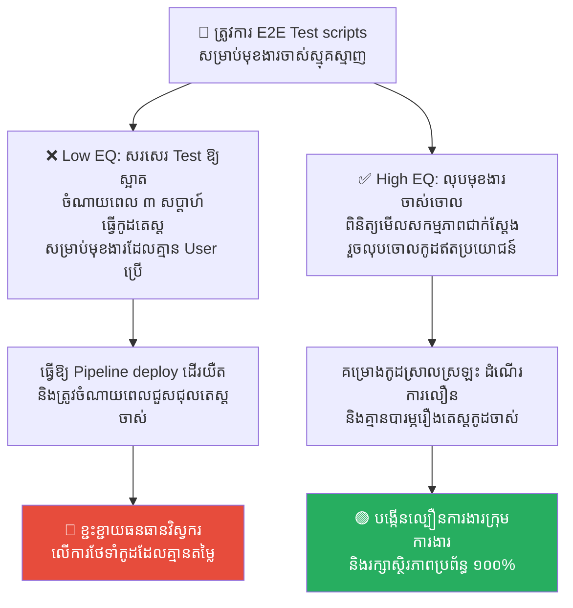
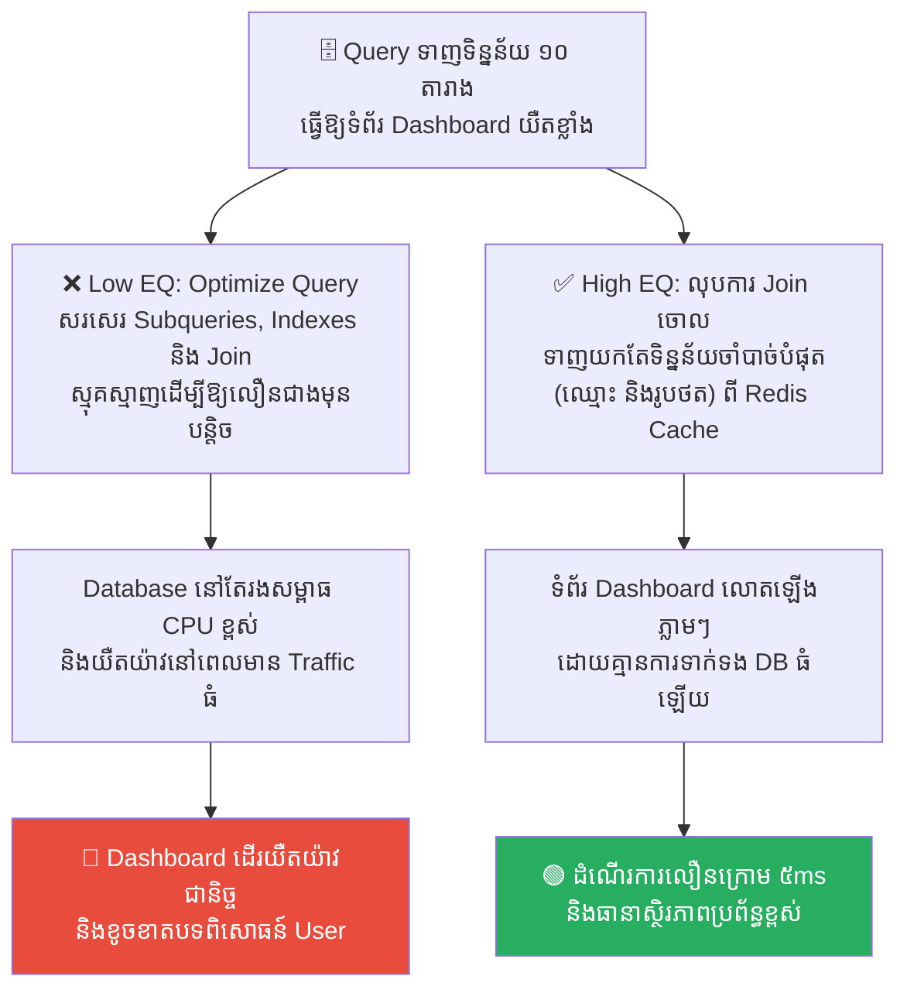
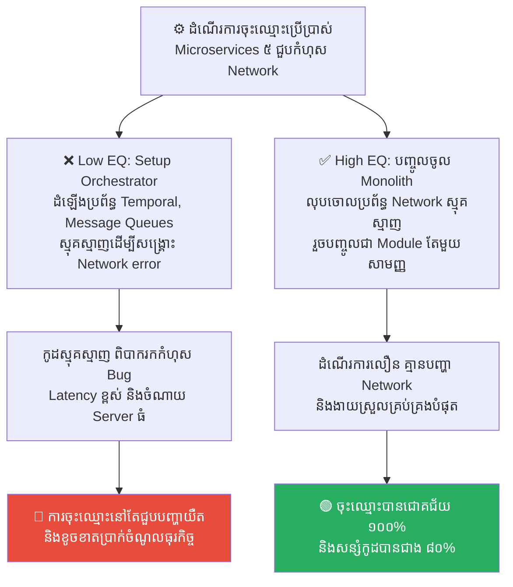
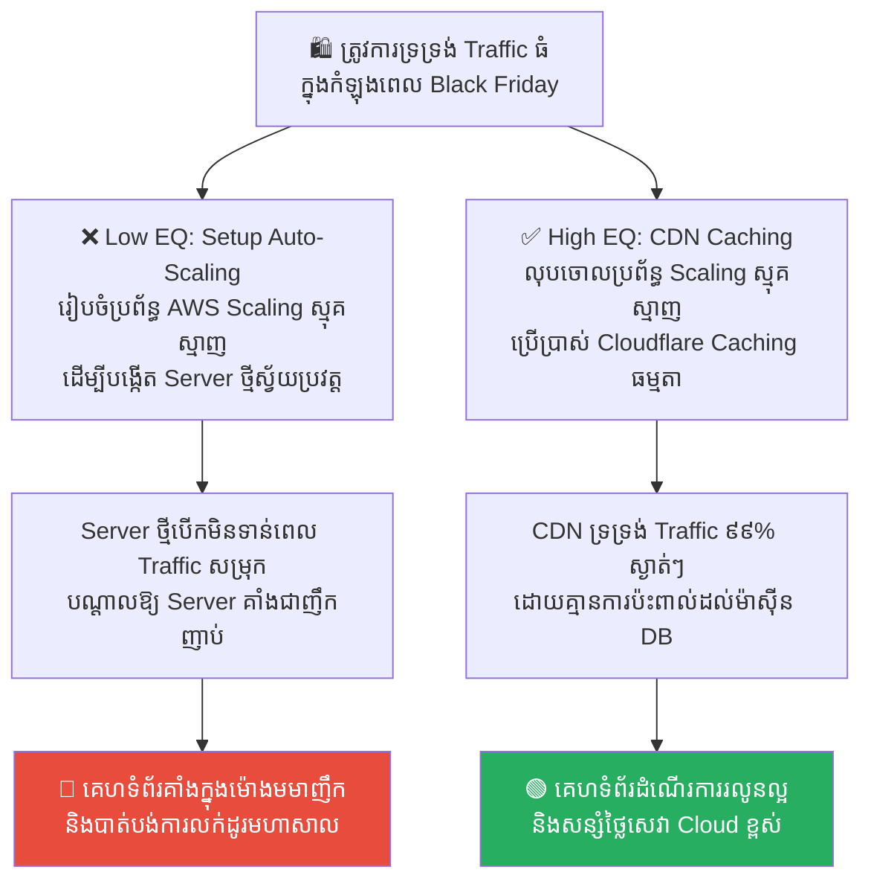

# Elon Musk: First Principles Thinking and Deleting Requirements (អ៊ីលុន ម៉ាសក៍៖ ការគិតពីឫសគល់ និងការលុបចោលតម្រូវការ)

**Author:** ichamrong  
**Date:** 2026-05-17  
**Tags:** #elon-musk #first-principles #engineering-mindset #refactoring #spacex  
**Category:** Concepts  
**Read Time:** ~15 min  

---

## 📌 មាតិកា (Table of Contents)
- [លំនាំបញ្ហា (The Pattern)](#លំនាំបញ្ហា-the-pattern)
- [១. បញ្ហា៖ ការសន្មតតាមទម្លាប់ និងការខិតខំធ្វើឱ្យរបស់ឥតប្រយោជន៍ល្អឥតខ្ចោះ (The Issue: Thinking by Analogy & Optimizing the Unnecessary)](#១-បញ្ហា-ការសន្មតតាមទម្លាប់-និងការខិតខំធ្វើឱ្យរបស់ឥតប្រយោជន៍ល្អឥតខ្ចោះ-the-issue-thinking-by-analogy-optimizing-the-unnecessary)
- [២. ឧទាហរណ៍ជាក់ស្តែងក្នុងពិភពពិត (Real World Examples)](#២-ឧទាហរណ៍ជាក់ស្តែងក្នុងពិភពពិត)
  - [ឧទាហរណ៍ទី ១ — ការជួសជុលប្រព័ន្ធបង្កើតឯកសារ PDF យឺត (Optimizing PDF Generator vs. Deleting PDF Service for QR Codes)](#ឧទាហរណ៍ទី-១-ការជួសជុលប្រព័ន្ធបង្កើតឯកសារ-pdf-យឺត-optimizing-pdf-generator-vs-deleting-pdf-service-for-qr-codes)
  - [ឧទាហរណ៍ទី ២ — ការសរសេរប្រព័ន្ធតេស្ត E2E សម្រាប់មុខងារចាស់ៗ (Complex UI Automated Test vs. Deleting Unused Feature)](#ឧទាហរណ៍ទី-២-ការសរសេរប្រព័ន្ធតេស្ត-e2e-សម្រាប់មុខងារចាស់ៗ-complex-ui-automated-test-vs-deleting-unused-feature)
  - [ឧទាហរណ៍ទី ៣ — ការបង្កើនល្បឿន Query ស្មុគស្មាញ ១០ តារាង (Optimizing 10-Table Join vs. Deleting Join & direct Redis Cache)](#ឧទាហរណ៍ទី-៣-ការបង្កើនល្បឿន-query-ស្មុគស្មាញ-១០-តារាង-optimizing-10-table-join-vs-deleting-join-direct-redis-cache)
  - [ឧទាហរណ៍ទី ៤ — ការសម្របសម្រួលប្រព័ន្ធ Microservices ច្រើន (Complex Microservices Orchestration vs. Merging into Monolith Module)](#ឧទាហរណ៍ទី-៤-ការសម្របសម្រួលប្រព័ន្ធ-microservices-ច្រើន-complex-microservices-orchestration-vs-merging-into-monolith-module)
  - [ឧទាហរណ៍ទី ៥ — ការដំឡើងប្រព័ន្ធពង្រីកទំហំ Server ស្មុគស្មាញ (Complex Auto-Scaling Group vs. Fixed Instance with CDN Caching)](#ឧទាហរណ៍ទី-៥-ការដំឡើងប្រព័ន្ធពង្រីកទំហំ-server-ស្មុគស្មាញ-complex-auto-scaling-group-vs-fixed-instance-with-cdn-caching)
- [៣. កត្តាជម្រុញ៖ ការសរសេរកូដតាមគ្នា និងការមិនហ៊ានលុបចោល (The Aggravator: Copy-Paste Coding & Fear of Deletion)](#៣-កត្តាជម្រុញ-ការសរសេរកូដតាមគ្នា-និងការមិនហ៊ានលុបចោល-the-aggravator-copy-paste-coding-fear-of-deletion)
- [៤. ដំណោះស្រាយទូទៅ៖ ក្បួនវិស្វកម្ម ៥ ជំហានរបស់ អ៊ីលុន ម៉ាសក៍ (The General Solution: Elon Musk's 5-Step Engineering Process)](#៤-ដំណោះស្រាយទូទៅ-ក្បួនវិស្វកម្ម-៥-ជំហានរបស់-អ៊ីលុន-ម៉ាសក៍-the-general-solution-elon-musks-5-step-engineering-process)
- [សេចក្តីសន្និដ្ឋាន (Conclusion)](#សេចក្តីសន្និដ្ឋាន-conclusion)
- [Related Posts](#related-posts)

---

## លំនាំបញ្ហា (The Pattern)

នៅក្នុងដំណើរការសាងសង់រ៉ុក្កែតដ៏ល្បីល្បាញរបស់ក្រុមហ៊ុន SpaceX និងការផលិតរថយន្តអគ្គិសនី Tesla ស្ថាបនិក និងជានាយកវិស្វករលោក **អ៊ីលុន ម៉ាសក៍ (Elon Musk)** បានជួបប្រទះនឹងបញ្ហាយឺតយ៉ាវ និងការចំណាយខ្ពស់ជាច្រើនលើសលប់។ ដើម្បីដោះស្រាយបញ្ហាទាំងនេះ Musk បានបង្កើត និងអនុវត្តក្បួនវិស្វកម្មដ៏តឹងរ៉ឹងមួយ ដែលមានគោលគំនិតស្នូលផ្អែកលើ **First Principles Thinking (ការគិតពីឫសគល់)**។

រឿងរ៉ាវដ៏ល្បីល្បាញមួយ បានកើតឡើងក្នុងកំឡុងពេលផលិតរថយន្ត Tesla Model 3។ ក្រុមវិស្វករបានចំណាយពេលរាប់ខែ និងថវិការាប់លានដុល្លារ ដើម្បីរចនា និងតំឡើងប្រព័ន្ធមនុស្សយន្ត (Robots) ដ៏ស្មុគស្មាញបំផុត ដើម្បីធ្វើការបិទស្កុតការពារសំឡេង (Soundproofing Mats) ទៅលើអាគុយឡាន។ ប្រព័ន្ធនោះតែងតែជួបបញ្ហាគាំង និងធ្វើឱ្យខ្សែសង្វាក់ផលិតកម្មទាំងមូលត្រូវផ្អាកជានិច្ច។

នៅពេល Musk ចុះមកពិនិត្យដោយផ្ទាល់ ទ្រង់មិនបានសួរថា៖ *«តើយើងត្រូវកែកូដ ឬជួសជុលមនុស្សយន្តនេះឱ្យដើរលឿនដោយរបៀបណា?»* ឡើយ។ ផ្ទុយទៅវិញ ទ្រង់បានសួរចោទសួរពីឫសគល់ថា៖ 
> 💡 **«តើស្កុតការពារសំឡេងនេះ ពិតជាចាំបាច់ត្រូវមានមែនទេ? តើវាពិតជាជួយកាត់បន្ថយសំឡេងកកិតពិតប្រាកដមែនឬ?»**

ក្រុមការងារបច្ចេកទេសបានឆ្លើយថា ផ្នែកសុវត្ថិភាពសូរស័ព្ទជាអ្នកស្នើសុំ។ Musk បានបញ្ជាឱ្យធ្វើតេស្តសូរស័ព្ទផ្ទាល់នៅក្នុងឡានដែលគ្មានស្កុតនោះ។ លទ្ធផលគឺ៖ **គ្មានភាពខុសគ្នានៃសំឡេងឡើយ!** ស្កុតនោះមិនបានជួយអ្វីសោះ។ Musk បានបញ្ជាឱ្យលុបចោលបំណែកស្កុតនោះ និងលុបចោលខ្សែសង្វាក់មនុស្សយន្តដ៏ស្មុគស្មាញនោះចោលភ្លាមៗ។

នៅក្នុងការរចនាប្រព័ន្ធបច្ចេកវិទ្យា (Software Architecture) យើងតែងតែជួបប្រទះបញ្ហានេះជានិច្ច៖
*   វិស្វករខិតខំប្រឹងប្រែងយ៉ាងខ្លាំង ដើម្បីសរសេរកូដ និងរចនាប្រព័ន្ធ (Optimize) ឱ្យមានភាពល្អឥតខ្ចោះ។
*   ប៉ុន្តែ ពួកគេមើលរំលងការចោទសួរថា៖ **«តើមុខងារ ឬបំណែកកូដនេះ ពិតជាចាំបាច់ត្រូវមានវត្តមានតាំងពីដំបូងម្ល៉េះ?»**

---

## ១. បញ្ហា៖ ការសន្មតតាមទម្លាប់ និងការខិតខំធ្វើឱ្យរបស់ឥតប្រយោជន៍ល្អឥតខ្ចោះ (The Issue: Thinking by Analogy & Optimizing the Unnecessary)

កំហុសឆ្គងដ៏ធំបំផុត និងសាមញ្ញបំផុតរបស់វិស្វករដ៏ឆ្លាតវៃ គឺ **«ការខិតខំធ្វើឱ្យរបស់មួយមានដំណើរការល្អឥតខ្ចោះ ទាំងដែលរបស់នោះមិនគួរមានវត្តមានតាំងពីដំបូងឡើយ»**។

បាតុភូតនេះកើតឡើងដោយសារ៖
1.  **ការគិតតាមទម្លាប់ (Thinking by Analogy)៖** វិស្វករគិតថា៖ *«ដោយសារក្រុមហ៊ុន Facebook/Google គេធ្វើប្រព័ន្ធស្មុគស្មាញបែបនេះ ដូច្នេះយើងក៏ត្រូវសរសេរកូដរៀបចំប្រព័ន្ធស្មុគស្មាញបែបហ្នឹងដែរ»* ដោយមិនបានគិតពីការពិតជាមូលដ្ឋាន (First Principles) នៃតម្រូវការផ្ទាល់ខ្លួន។
2.  ** ការជឿជាក់លើតម្រូវការល្ងង់ខ្លៅ (Dumb Requirements Acceptance)៖** ពេលដែលផ្នែកគ្រប់គ្រងគម្រោង (Project Managers) បញ្ជូនឯកសារតម្រូវការ (Requirements) មកឱ្យ វិស្វករចាប់ផ្តើមសរសេរកូដភ្លាមៗទាំងងងឹតងងុល ដោយមិនហ៊ានចោទសួរដេញដោល ឬសុំលុបចោលមុខងារដែលគ្មានប្រយោជន៍ឡើយ។

កូដដែលល្អបំផុត គឺកូដដែលគ្មានសោះ (**The best code is no code**) ព្រោះវាមិនមាន Bug មិនបាច់ចំណាយពេលសរសេរ និងមិនបាច់ថែទាំជារៀងរហូត។

---

## ២. ឧទាហរណ៍ជាក់ស្តែងក្នុងពិភពពិត

សូមពិនិត្យមើល **ឧទាហរណ៍ជាក់ស្តែងចំនួន ៥** បង្ហាញពីការគិតពីឫសគល់ និងការលុបចោលតម្រូវការឥតប្រយោជន៍៖

---

### ឧទាហរណ៍ទី ១ — ការជួសជុលប្រព័ន្ធបង្កើតឯកសារ PDF យឺត (Optimizing PDF Generator vs. Deleting PDF Service for QR Codes)

**ស្ថានភាព៖** ក្រុមហ៊ុន Startup បង្កើត App ដឹកជញ្ជូន និងជួបប្រទះបញ្ហាប្រព័ន្ធបង្កើតឯកសារវិក្កយបត្រជា PDF (PDF Generator) ដំណើរការយឺតខ្លាំង និងគាំងជាញឹកញាប់នៅម៉ោងមមាញឹក។

*   **សកម្មភាពអសកម្ម / Low EQ / កំហុសឆ្គង (ការ Optimize របស់ឥតប្រយោជន៍)៖** វិស្វករចំណាយពេល ៣ សប្តាហ៍ដើម្បីសរសេរកូដ Optimize PDF generator ឱ្យលឿនជាងមុន បន្ថែម Caching ស្មុគស្មាញ និងជួល Server ធំៗដើម្បីដំណើរការវា។
*   **សកម្មភាពស្ថាបនា / High EQ / ដំណោះស្រាយ (ការលុបចោលតម្រូវការ)៖** អនុវត្ត **First Principles Thinking**។ ចោទសួរថា៖ *«ហេតុអ្វីបានជាអតិថិជនត្រូវការ File PDF? តាមពិត ពួកគេត្រូវការតែលេខកូដវិក្កយបត្រដើម្បីបង្ហាញទៅកាន់អ្នកគិតលុយប៉ុណ្ណោះ។»* ក្រុមការងារលុបប្រព័ន្ធ PDF generator ចោលទាំងស្រុង និងជំនួសដោយការបង្ហាញលេខកូដ និង QR Code សាមញ្ញនៅលើអេក្រង់ទូរស័ព្ទ។
*   **លទ្ធផល៖** វិស្វករចំណាយពេលរៀបចំប្រព័ន្ធ PDF generator ដែលមានកូដរាប់ពាន់បន្ទាត់ និងងាយកើតមាន Bug។ ការលុបប្រព័ន្ធនោះចោល និងជំនួសដោយ QR code ជួយសន្សំពេលវេលា សន្សំថ្លៃ Server ដំណើរការបានលឿនជាងមុន ១០x និងគ្មាន Bug។

---

### ឧទាហរណ៍ទី ២ — ការសរសេរប្រព័ន្ធតេស្ត E2E សម្រាប់មុខងារចាស់ៗ (Complex UI Automated Test vs. Deleting Unused Feature)

**ស្ថានភាព៖** ក្រុមហ៊ុនចង់បង្កើតប្រព័ន្ធតេស្តស្វ័យប្រវត្ត (E2E Automated Tests) សម្រាប់មុខងារផ្ទេរប្រាក់ទៅគណនីក្រៅប្រទេស ដែលស្មុគស្មាញខ្លាំង និងប្រើប្រាស់កម្រិតទាប (ក្រោម ១% នៃ User)។

*   **សកម្មភាពអសកម្ម / Low EQ / កំហុសឆ្គង (ការ Optimize របស់ឥតប្រយោជន៍)៖** វិស្វករចំណាយពេល ៣ សប្តាហ៍ដើម្បីសរសេរ Test scripts ស្មុគស្មាញរាប់ពាន់បន្ទាត់សម្រាប់មុខងារនេះ ដើម្បីធានាថា coverage តេស្តបានស្អាតល្អ។
*   **សកម្មភាពស្ថាបនា / High EQ / ដំណោះស្រាយ (ការលុបចោលតម្រូវការ)៖** អនុវត្ត **First Principles Thinking**។ ចោទសួរថា៖ *«តើមុខងារចាស់នេះនៅតែចាំបាច់ចំពោះធុរកិច្ចសព្វថ្ងៃដែរឬទេ? តាមពិត គម្រោងនេះលែងមាននរណាម្នាក់ត្រូវការវាទៀតហើយ ព្រោះក្រុមហ៊ុនបានប្តូរទៅកាន់ប្រព័ន្ធផ្ទេរប្រាក់ថ្មី។»* ក្រុមការងារលុបទាំងមុខងារចាស់ និង test script ចោលទាំងស្រុងពីប្រព័ន្ធ។
*   **លទ្ធផល៖** វិស្វករចំណាយពេលសរសេរតេស្តដែលគ្មាននរណាត្រូវការ និងធ្វើឱ្យ Pipeline ដើរយឺត។ ការលុបចោលជួយឱ្យប្រព័ន្ធស្រាល ស្អាត និងលឿន។

---

### ឧទាហរណ៍ទី ៣ — ការបង្កើនល្បឿន Query ស្មុគស្មាញ ១០ តារាង (Optimizing 10-Table Join vs. Deleting Join & direct Redis Cache)

**ស្ថានភាព៖** ទំព័រដើម (Dashboard) របស់ App បង្ហាញព័ត៌មាន Profile និងប្រវត្តិសង្ខេបរបស់អតិថិជន ដែលត្រូវទាញយកទិន្នន័យពីតារាង (Tables) ចំនួន ១០ ផ្សេងគ្នា ធ្វើឱ្យ Page load យឺតខ្លាំង។

*   **សកម្មភាពអសកម្ម / Low EQ / កំហុសឆ្គង (ការ Optimize របស់ឥតប្រយោជន៍)៖** វិស្វករព្យាយាម Optimize SQL query ដ៏ស្មុគស្មាញនោះ បង្កើត Subqueries និង Indexes ជាច្រើននៅលើ Database ដើម្បីឱ្យវាដំណើរការលឿនជាងមុន។
*   **សកម្មភាពស្ថាបនា / High EQ / ដំណោះស្រាយ (ការលុបចោលតម្រូវការ)៖** អនុវត្ត **First Principles Thinking**។ ចោទសួរថា៖ *«តើយើងត្រូវការទិន្នន័យទាំង ១០ តារាងនេះព្រមគ្នានៅលើទំព័រដើមមែនទេ? តាមពិត User ត្រូវការតែឈ្មោះ និងរូបថត Profile ប៉ុណ្ណោះ។»* ក្រុមការងារលុបការ Join ស្មុគស្មាញចោល លុបតារាងដែលមិនចាំបាច់ចេញពី Query និងទាញយកតែឈ្មោះ និងរូបថត profile ពី Redis Cache ដោយផ្ទាល់។
*   **លទ្ធផល៖** Query ស្មុគស្មាញធ្វើឱ្យ Database រងសម្ពាធខ្លាំង និងយឺតយ៉ាវជានិច្ច។ ការលុបចោលមុខងារទាញយកទិន្នន័យឥតប្រយោជន៍ ជួយឱ្យទំព័រដើមលោតឡើងភ្លាមៗក្រោម ៥ms។

---

### ឧទាហរណ៍ទី ៤ — ការសម្របសម្រួលប្រព័ន្ធ Microservices ច្រើន (Complex Microservices Orchestration vs. Merging into Monolith Module)

**ស្ថានភាព៖** ដំណើរការចុះឈ្មោះរបស់ User ត្រូវឆ្លងកាត់ការផ្ទៀងផ្ទាត់ និងដំណើរការដោយ Microservices ចំនួន ៥ ផ្សេងគ្នា ដែលជួបបញ្ហាកំហុសបណ្តាញញឹកញាប់។

*   **សកម្មភាពអសកម្ម / Low EQ / កំហុសឆ្គង (ការ Optimize របស់ឥតប្រយោជន៍)៖** វិស្វករព្យាយាមដំឡើងប្រព័ន្ធ Orchestrator ស្មុគស្មាញ (ដូចជា Temporal, Camunda) និងប្រើប្រាស់ Message Queues ធំៗដើម្បីសម្របសម្រួលសេវាកម្មទាំង ៥។
*   **សកម្មភាពស្ថាបនា / High EQ / ដំណោះស្រាយ (ការលុបចោលតម្រូវការ)៖** អនុវត្ត **First Principles Thinking**។ ចោទសួរថា៖ *«ហេតុអ្វីបានជាយើងត្រូវការសេវាកម្ម ៥ ដាច់ដោយឡែកពីគ្នា សម្រាប់តែមុខងារចុះឈ្មោះសាមញ្ញមួយ? តាមពិតវាគ្មានហេតុផលបច្ចេកទេសណាមួយឡើយ គឺគ្រាន់តែជាការបំបែកខុសកាលកំណត់។»* ក្រុមការងារលុប Microservices ទាំង ៥ ចោល និងបញ្ចូលវាទៅជា Module តែមួយនៅក្នុង Monolith សាមញ្ញ។
*   **លទ្ធផល៖** ប្រព័ន្ធ Orchestrator ស្មុគស្មាញ នាំឱ្យកើតមានបញ្ហាច្របូកច្របល់ និងពិបាករកកំហុស។ ការរួមបញ្ចូលគ្នា និងលុបចោលប្រព័ន្ធ Network ឥតប្រយោជន៍ ជួយឱ្យការចុះឈ្មោះមានស្ថិរភាពខ្ពស់ និងសរសេរកូដតិចជាងមុន ៨០%។

---

### ឧទាហរណ៍ទី ៥ — ការដំឡើងប្រព័ន្ធពង្រីកទំហំ Server ស្មុគស្មាញ (Complex Auto-Scaling Group vs. Fixed Instance with CDN Caching)

**ស្ថានភាព៖** គេហទំព័រលក់ទំនិញ ត្រូវការទ្រទ្រង់ការសម្រុកចូល (Traffic Spike) របស់អតិថិជនរាប់សែននាក់ ក្នុងកំឡុងពេលផ្សព្វផ្សាយពាណិជ្ជកម្ម Black Friday។

*   **សកម្មភាពអសកម្ម / Low EQ / កំហុសឆ្គង (ការ Optimize របស់ឥតប្រយោជន៍)៖** វិស្វកររៀបចំប្រព័ន្ធ Auto-scaling ដ៏ស្មុគស្មាញនៅលើ AWS ដែលត្រូវបង្កើត និងលុប Server ស្វ័យប្រវត្តទៅតាម CPU usage ដែលត្រូវចំណាយពេល Setup រាប់សប្តាហ៍។
*   **សកម្មភាពស្ថាបនា / High EQ / ដំណោះស្រាយ (ការលុបចោលតម្រូវការ)៖** អនុវត្ត **First Principles Thinking**។ ចោទសួរថា៖ *«តើទិន្នន័យដែល User សម្រុកចូលមកមើលជាទិន្នន័យអ្វី? តាមពិត ៩៩% ជាការអានព័ត៌មានផលិតផល (Static Data)។»* ក្រុមការងារលុបប្រព័ន្ធ Auto-scaling ស្មុគស្មាញចោល ហើយរៀបចំ Cloudflare CDN Caching សម្រាប់រាល់ទំព័រផលិតផល និងរក្សាទំហំ Server ថេរធម្មតា។
*   **លទ្ធផល៖** ប្រព័ន្ធ Auto-scaling ជួបបញ្ហា Delay (យឺតយ៉ាវក្នុងការបើក Server ថ្មីទាន់ពេល) ធ្វើឱ្យប្រព័ន្ធគាំងដដែលនៅពេល Traffic សម្រុកចូលភ្លាមៗ។ ការប្រើប្រាស់ CDN Caching ជួយទ្រទ្រង់ Traffic រាប់លាននាក់បានយ៉ាងរលូន ដោយគ្មានការផ្លាស់ប្តូរទំហំ Server ឡើយ។

---

## ៣. កត្តាជម្រុញ៖ ការសរសេរកូដតាមគ្នា និងការមិនហ៊ានលុបចោល (The Aggravator: Copy-Paste Coding & Fear of Deletion)

ហេតុអ្វីបានជាវិស្វករងាយនឹងធ្លាក់ចូលទៅក្នុងការកែកូដឥតប្រយោជន៍ និងមិនហ៊ានលុបចោល? កត្តាជម្រុញរួមមាន៖

1.  **ការខ្លាចការលុបកូដ (Fear of Deleting Code)៖** វិស្វករខ្លាចថា៖ *«បើលុបកូដនេះចោល ខ្លាចប៉ះពាល់មុខងារផ្សេងទៀតដែលយើងមិនដឹង!»* ផ្នត់គំនិតនេះធ្វើឱ្យពួកគេសុខចិត្តសរសេរកូដថ្មីបន្ថែមសង្កត់ពីលើ (Accumulating Bloat) ជំនួសឱ្យការលុប និងសំអាត។
2.  ** សម្ពាធការងារ និងការមិនចោទសួរ (Unquestioning Acceptance)៖** វប្បធម៌ការងារដែលបង្ខំឱ្យវិស្វករត្រូវធ្វើតាមបញ្ហា Checklist របស់ PM ១០០% ដោយគ្មានសិទ្ធិចោទសួររកហេតុផល និងគ្មានការយល់ដឹងពី First Principles។
3.  **មោទនភាពលើការជួសជុលកូដស្មុគស្មាញ (Complexity Pride)៖** វិស្វករយល់ច្រឡំថា ការដោះស្រាយ ឬការ Optimize កូដដែលស្មុគស្មាញ គឺជាសញ្ញានៃភាពឆ្លាតវៃ ដោយមើលរំលងការគិតថា ដំណោះស្រាយសាមញ្ញបំផុតគឺការលុបវាចោលទាំងស្រុង។

---

## ៤. ដំណោះស្រាយទូទៅ៖ ក្បួនវិស្វកម្ម ៥ ជំហានរបស់ អ៊ីលុន ម៉ាសក៍ (The General Solution: Elon Musk's 5-Step Engineering Process)

ដើម្បីលុបបំបាត់ភាពស្មុគស្មាញ និងសាងសង់ប្រព័ន្ធការងារដែលមានប្រសិទ្ធភាពខ្ពស់បំផុត ចូរអនុវត្តក្បួនវិស្វកម្ម ៥ ជំហានរបស់លោក អ៊ីលុន ម៉ាសក៍ ដូចខាងក្រោម៖

1.  ** ធ្វើឱ្យតម្រូវការឈប់ល្ងង់ (Make the Requirements Less Dumb)៖** មិនត្រូវជឿជាក់លើរាល់តម្រូវការ (Requirements) របស់ PM ឬនាយកដ្ឋានផ្សេងៗភ្លាមៗឡើយ។ តម្រូវការទាំងអស់សុទ្ធតែមានចន្លោះប្រហោង។ ចូរចោទសួរដេញដោល និងកាត់បន្ថយភាពល្ងង់ខ្លៅរបស់វាជាមុនសិន មុននឹងសរសេរកូដ។
2.  ** ខិតខំប្រឹងប្រែងឱ្យអស់ពីសមត្ថភាពដើម្បីលុបវាចោល (Delete the Part or Process)៖** ព្យាយាមលុបបំណែកកូដ មុខងារ ឬប្រព័ន្ធការងារណាដែលមិនចាំបាច់ចោល។ Musk និយាយថា៖ *«ប្រសិនបើអ្នកលុបមុខងារចោល ហើយអ្នកមិនចាំបាច់បន្ថែមវាចូលវិញយ៉ាងហោចណាស់ ១០% នៃពេលវេលាទេ នោះមានន័យថាអ្នកមិនទាន់បានលុបវាចេញច្រើនគ្រប់គ្រាន់នៅឡើយទេ។»*
3.  ** ធ្វើឱ្យវាសាមញ្ញ និងល្អប្រសើរ (Simplify or Optimize)៖** ធ្វើជំហាននេះ **បន្ទាប់ពី** ជំហានទី ២ ប៉ុណ្ណោះ។ កំហុសឆ្គងធំបំផុតគឺការចំណាយពេល Optimize របស់ដែលត្រូវលុបចោល។ ចូរធ្វើឱ្យរបស់ដែលនៅសល់មានភាពសាមញ្ញ និងដំណើរការលឿន។
4.  ** បង្កើនល្បឿនដំណើរការ (Accelerate Cycle Time)៖** ធ្វើឱ្យការងារដើរលឿន (បញ្ចេញផលិតផលលឿន) ប៉ុន្តែហាមដាច់ខាតបង្កើនល្បឿនមុនពេលអ្នកបានឆ្លងកាត់ ៣ ជំហានខាងលើរួចរាល់។
5.  ** ធ្វើជាស្វ័យប្រវត្ត (Automate)៖** ធ្វើជំហាននេះជាជំហានចុងក្រោយបង្អស់។ កុំប្រញាប់ធ្វើស្វ័យប្រវត្តកម្ម (Automation) ទៅលើរបស់ដែលមិនទាន់មានស្ថិរភាព ឬរបស់ដែលត្រូវលុបចោល។

---

## សេចក្តីសន្និដ្ឋាន (Conclusion)

**អ៊ីលុន ម៉ាសក៍ និងការគិតពីឫសគល់ (First Principles Thinking)** បង្រៀនយើងថា វិស្វករដ៏ឆ្នើមមិនមែនជាអ្នកដែលពូកែសរសេរកូដ Optimize ឱ្យរបស់ស្មុគស្មាញរត់លឿននោះទេ ប៉ុន្តែជាអ្នកដែលចេះ **«ចោទសួររកការពិតជាមូលដ្ឋាន ហ៊ានដេញដោលតម្រូវការ និងមានភាពម៉ឺងម៉ាត់ក្នុងការលុបរាល់បំណែកកូដ ឬមុខងារដែលមិនចាំបាច់ចោលទាំងស្រុង ដើម្បីរក្សាប្រព័ន្ធការងារឱ្យមានភាពសាមញ្ញ ស្រាលស្រឡះ និងមានប្រសិទ្ធភាពខ្ពស់បំផុត»**។

ចងចាំជានិច្ចថា៖ **«បំណែកកូដដែលល្អបំផុត គឺបំណែកកូដដែលគ្មានសោះ។ ព្រោះវាគ្មានថ្ងៃបង្កើត Bug ឡើយ។»**

---

## Related Posts

*   **[43 Steve Jobs: Feature Bloat and the Power of Saying No](./43-steve-jobs-and-feature-bloat.md)** — អំណាចនៃការបដិសេធ និងការរក្សាភាពសាមញ្ញនៃផលិតផល។
*   **[36 The Gordian Knot: Over-Engineering and the KISS Principle](./36-the-gordian-knot-and-overengineering.md)** — ភាពចាំបាច់នៃការរក្សាភាពសាមញ្ញ និងការដោះស្រាយបញ្ហាដោយគ្មាន Over-engineering។

---

*Last updated: 2026-05-26*
