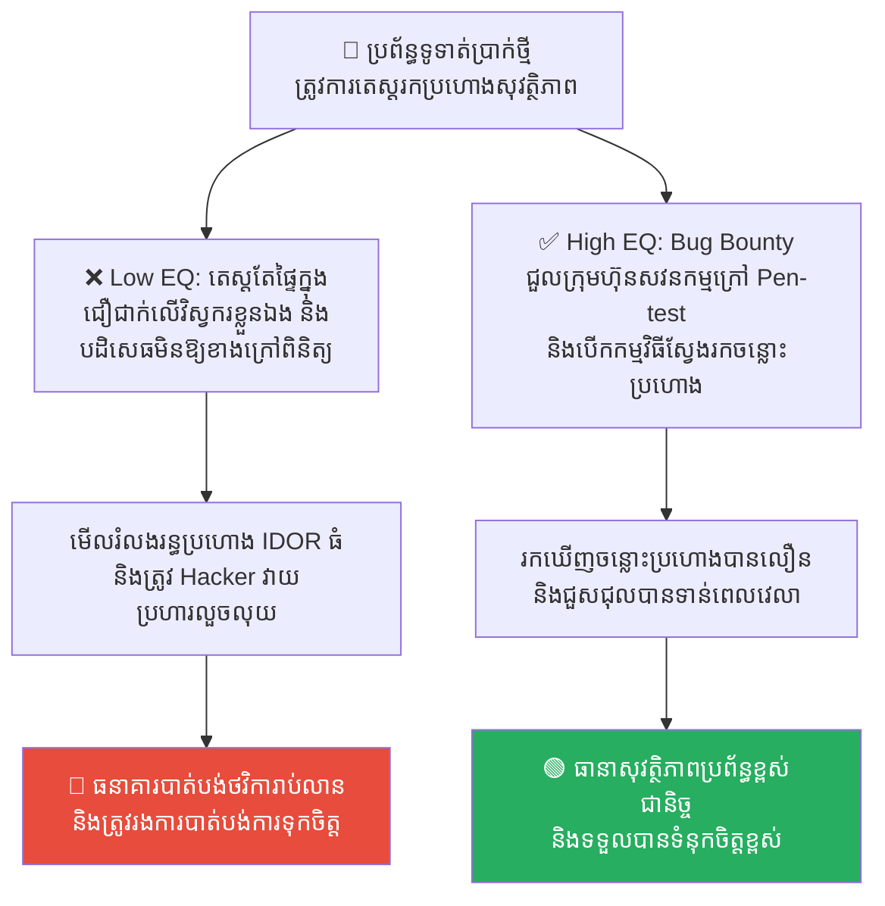
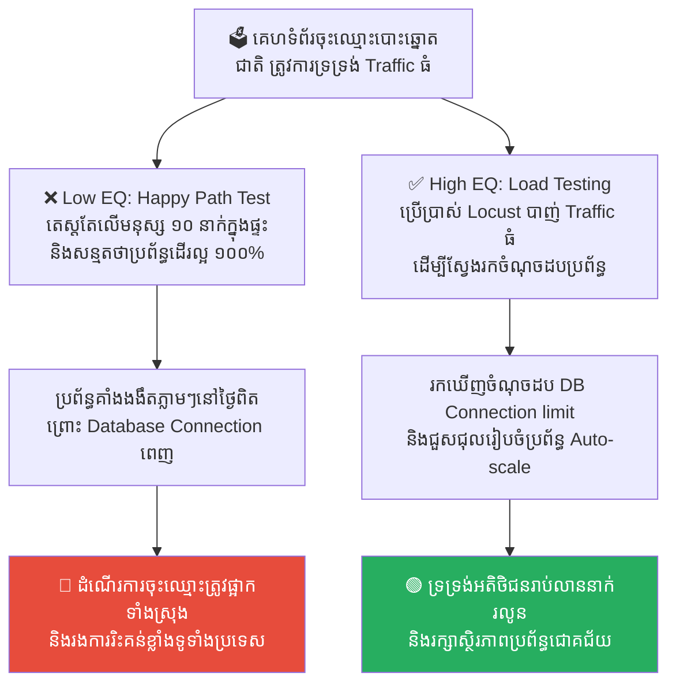
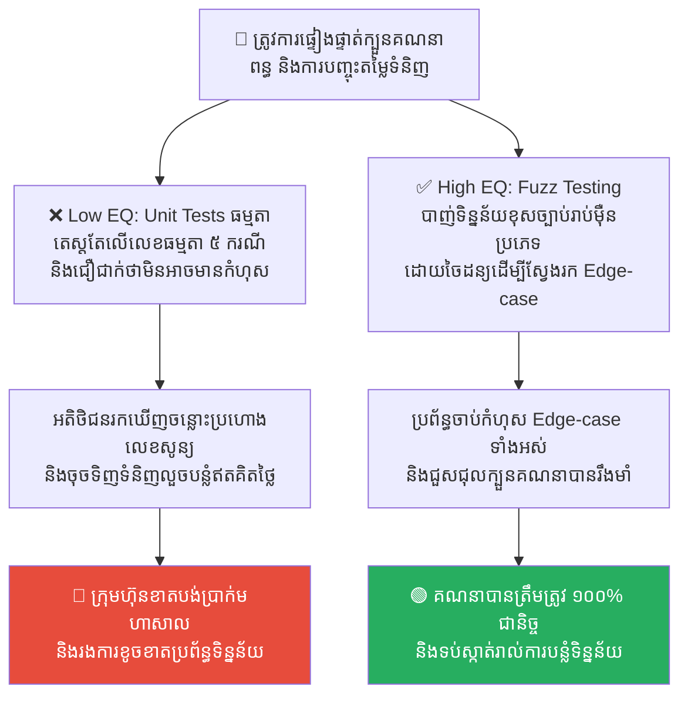
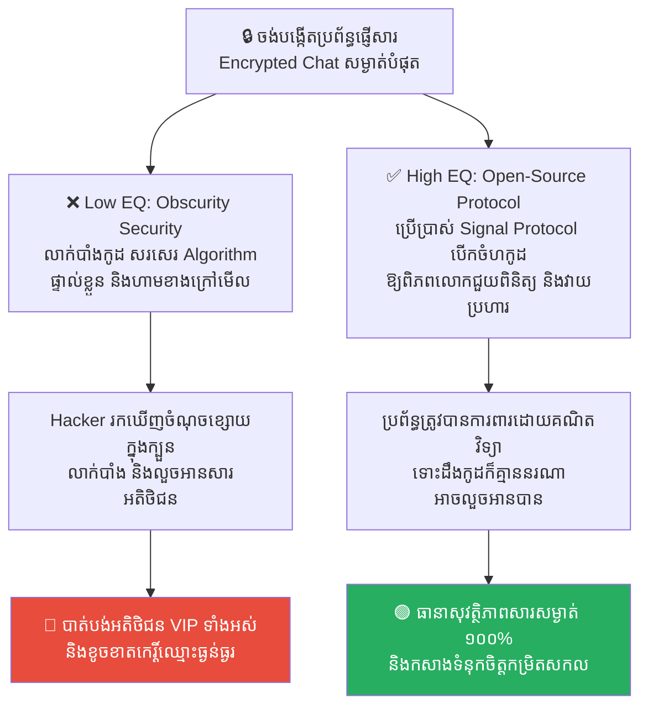
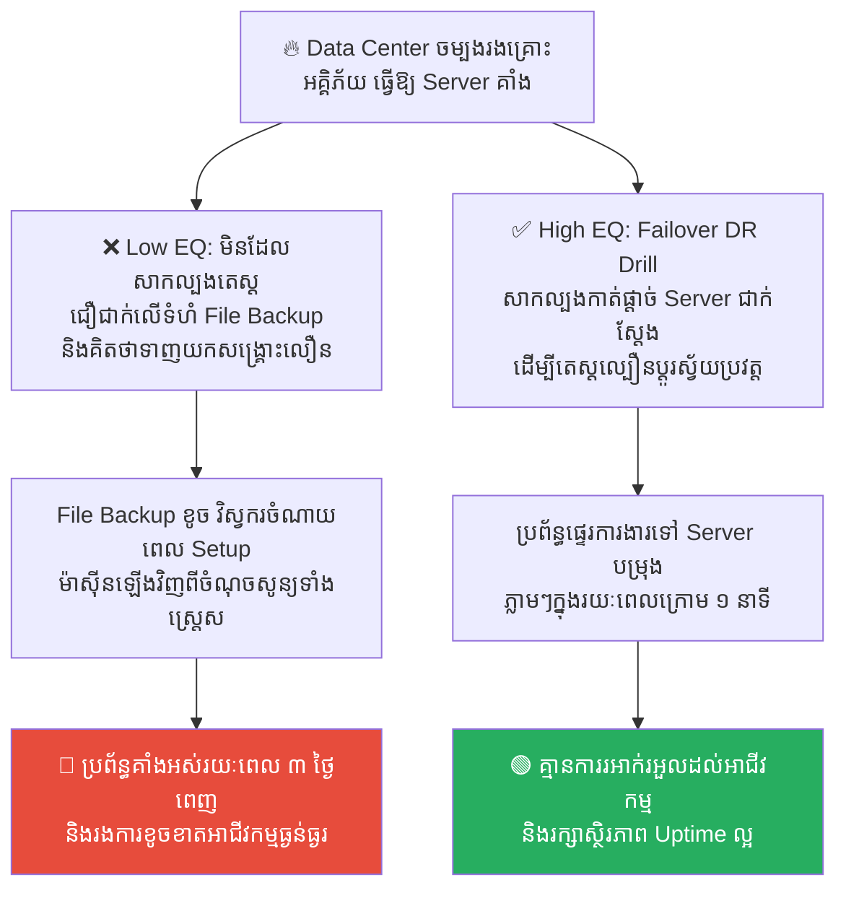

# Solomon and the Queen of Sheba: Stress Testing and Security Audits (សាឡូម៉ូន និងមហាក្សត្រីសេបា៖ ការធ្វើតេស្តសង្កត់ប្រព័ន្ធ និងសវនកម្មសុវត្ថិភាព)

**Author:** ichamrong  
**Date:** 2026-05-17  
**Tags:** #solomon #stress-testing #penetration-testing #security-audit #red-team  
**Category:** Concepts  
**Read Time:** ~15 min  

---

## 📌 មាតិកា (Table of Contents)
- [លំនាំបញ្ហា (The Pattern)](#លំនាំបញ្ហា-the-pattern)
- [១. បញ្ហា៖ ភាពលម្អៀងផ្ទៃក្នុង និងអំនួតនៃប្រព័ន្ធដែលគិតថា «មិនអាច Hack បាន» (The Issue: Internal Bias and the Illusion of Unbreakable Systems)](#១-បញ្ហា-ភាពលម្អៀងផ្ទៃក្នុង-និងអំនួតនៃប្រព័ន្ធដែលគិតថា-មិនអាច-hack-បាន-the-issue-internal-bias-and-the-illusion-of-unbreakable-systems)
- [២. ឧទាហរណ៍ជាក់ស្តែងក្នុងពិភពពិត (Real World Examples)](#២-ឧទាហរណ៍ជាក់ស្តែងក្នុងពិភពពិត)
  - [ឧទាហរណ៍ទី ១ — ការតេស្តប្រព័ន្ធទូទាត់ប្រាក់ថ្មី (Internal Testing Checklist vs. Third-Party Pen-Testing & Bug Bounty)](#ឧទាហរណ៍ទី-១-ការតេស្តប្រព័ន្ធទូទាត់ប្រាក់ថ្មី-internal-testing-checklist-vs-third-party-pen-testing-bug-bounty)
  - [ឧទាហរណ៍ទី ២ — ការទ្រទ្រង់ទិន្នន័យសម្រាប់គេហទំព័រជាតិ (Happy Path Testing vs. Rigorous Distributed Load Testing)](#ឧទាហរណ៍ទី-២-ការទ្រទ្រង់ទិន្នន័យសម្រាប់គេហទំព័រជាតិ-happy-path-testing-vs-rigorous-distributed-load-testing)
  - [ឧទាហរណ៍ទី ៣ — ការផ្ទៀងផ្ទាត់ភាពត្រឹមត្រូវនៃក្បួនគណនា (Basic Unit Testing vs. Automated Fuzz Testing & Chaos Inputs)](#ឧទាហរណ៍ទី-៣-ការផ្ទៀងផ្ទាត់ភាពត្រឹមត្រូវនៃក្បួនគណនា-basic-unit-testing-vs-automated-fuzz-testing-chaos-inputs)
  - [ឧទាហរណ៍ទី ៤ — យុទ្ធសាស្ត្ររៀបចំប្រព័ន្ធរក្សាការសម្ងាត់ (Security through Obscurity vs. Open-Source Protocol & Zero-Trust)](#ឧទាហរណ៍ទី-៤-យុទ្ធសាស្ត្ររៀបចំប្រព័ន្ធរក្សាការសម្ងាត់-security-through-obscurity-vs-open-source-protocol-zero-trust)
  - [ឧទាហរណ៍ទី ៥ — ល្បឿនសង្គ្រោះបន្ទាន់ពីគ្រោះមហន្តរាយ (Manual Backup Restore vs. Scheduled Active-Active DR Drills)](#ឧទាហរណ៍ទី-៥-ល្បឿនសង្គ្រោះបន្ទាន់ពីគ្រោះមហន្តរាយ-manual-backup-restore-vs-scheduled-active-active-dr-drills)
- [៣. កត្តាជម្រុញ៖ ភាពស្ងប់ចិត្តមិនពិត និងការខ្លាចរកឃើញកំហុស (The Aggravator: Blind Confidence & Fear of Finding Flaws)](#៣-កត្តាជម្រុញ-ភាពស្ងប់ចិត្តមិនពិត-និងការខ្លាចរកឃើញកំហុស-the-aggravator-blind-confidence-fear-of-finding-flaws)
- [៤. ដំណោះស្រាយទូទៅ៖ ការស្វាគមន៍ប្រស្នាដ៏ពិបាក និងការរៀបចំសវនកម្មឯករាជ្យ (The General Solution: Embracing Red Teaming & External Audits)](#៤-ដំណោះស្រាយទូទៅ-ការស្វាគមន៍ប្រស្នាដ៏ពិបាក-និងការរៀបចំសវនកម្មឯករាជ្យ-the-general-solution-embracing-red-teaming-external-audits)
- [សេចក្តីសន្និដ្ឋាន (Conclusion)](#សេចក្តីសន្និដ្ឋាន-conclusion)
- [Related Posts](#related-posts)

---

## លំនាំបញ្ហា (The Pattern)

នៅក្នុងប្រវត្តិសាស្ត្រ និងរឿងព្រេងបុរាណ **ស្តេចសាឡូម៉ូន (King Solomon)** ត្រូវបានគេស្គាល់ថាជាមហាក្សត្រដែលមានប្រាជ្ញាញាណខ្ពង់ខ្ពស់បំផុត និងបានកសាងចក្រភពមួយដ៏រឹងមាំ និងមានស្ថិរភាពអស្ចារ្យ។ កេរ្តិ៍ឈ្មោះនៃប្រាជ្ញារបស់ទ្រង់ បានល្បីល្បាញទៅដល់ដែនដីឆ្ងាយៗ។

ដើម្បីផ្ទៀងផ្ទាត់ និងសាកល្បងការពិតនៃកេរ្តិ៍ឈ្មោះនេះ **មហាក្សត្រីសេបា (The Queen of Sheba)** បានធ្វើដំណើរយ៉ាងវែងឆ្ងាយមកកាន់ទីក្រុងយេរូសាឡឹម គួបផ្សំនឹងក្បួនដង្ហែដ៏ធំធេង និងបាននាំយកមកនូវ **«ប្រស្នា និងល្បែងសួរដេញដោលដ៏លំបាកបំផុត»** ដើម្បីធ្វើការសាកល្បងប្រាជ្ញារបស់សាឡូម៉ូនផ្ទាល់។ មហាក្សត្រីសេបាមិនបានមកដើម្បីសរសើរ ឬស្តាប់ពាក្យអួតនោះទេ គឺទ្រង់មកដើម្បីធ្វើការសាកល្បងសង្កត់ និងវាយប្រហាររកចំណុចខ្សោយ (Stress Test)។

ស្តេចសាឡូម៉ូនមិនបានបិទទ្វារវាំង ហាមឃាត់ការសាកល្បងនោះឡើយ។ ទ្រង់បានបើកទ្វារវាំងស្វាគមន៍មហាក្សត្រីសេបាយ៉ាងក្លាហាន និងបានឆ្លើយរាល់ប្រស្នា និងការសាកល្បងទាំងអស់ដោយគ្មានការលាក់លៀម។ ព្រះនាងបានប្រើប្រាស់ល្បិចផ្សេងៗ ដូចជាការនាំយកមកនូវកូនភ្លោះប្រុសស្រីដែលស្លៀកពាក់ដូចគ្នា និងការប្រើផ្កាជ័រនិងផ្កាពិតដើម្បីសាកល្បង។ សាឡូម៉ូនបានដោះស្រាយបានទាំងអស់ រហូតដល់ព្រះនាងកោតសរសើរ និងទទួលស្គាល់ថា ប្រាជ្ញា និងប្រព័ន្ធគ្រប់គ្រងរបស់សាឡូម៉ូនពិតជារឹងមាំ និងឆ្លាតវៃពិតប្រាកដមែន។

នៅក្នុងវិស័យវិស្វកម្ម និងសុវត្ថិភាពប្រព័ន្ធបច្ចេកវិទ្យា (Software Security and SRE) គំរូនៃដំណើររឿងនេះត្រូវបានគេយកមកអនុវត្តជានិច្ច៖
*   ការជឿជាក់ និងការអួតអាងផ្ទៃក្នុងថាប្រព័ន្ធរបស់យើងមានសុវត្ថិភាពខ្ពស់ និង Scale បានល្អ គឺគ្មានតម្លៃអ្វីឡើយ បើគ្មានការសាកល្បងពិតប្រាកដ។
*   **មហាក្សត្រីសេបា = Security Auditors, Pen-Testers, and Red Teams** ដែលជាភាគីទីបីមកពីខាងក្រៅ មិនលំអៀង និងមានតួនាទីសួរសំណួរដេញដោល ព្រមទាំងប្រើប្រាស់រាល់ល្បិច (Ethical Hacks) ដើម្បីសាកល្បងសង្កត់ និងស្វែងរកចន្លោះប្រហោងក្នុងប្រព័ន្ធ មុនពេល Hacker អាក្រក់វាយប្រហាររកឃើញ។

---

## ១. បញ្ហា៖ ភាពលម្អៀងផ្ទៃក្នុង និងអំនួតនៃប្រព័ន្ធដែលគិតថា «មិនអាច Hack បាន» (The Issue: Internal Bias and the Illusion of Unbreakable Systems)

នៅក្នុងការកសាងកម្មវិធី វិស្វករដែលជាអ្នកសរសេរកូដ តែងតែមាន **Blind Spots (ចំណុចមើលមិនឃើញ)** ចំពោះកំហុសរបស់ខ្លួនឯង។ 

កំហុសឆ្គងដ៏ធំបំផុតនៅក្នុងការគ្រប់គ្រងប្រព័ន្ធបច្ចេកវិទ្យាគឺ៖
1.  **ការធ្វើតេស្តដោយខ្លួនឯង (Self-Validation Bias)៖** វិស្វករសរសេរកូដ ហើយធ្វើការតេស្តដោយខ្លួនឯង។ ពួកគេតែងតែតេស្តតែលើករណីធម្មតា (Happy Path Testing) ដែលធ្វើឱ្យពួកគេសន្និដ្ឋានខុសថាប្រព័ន្ធគ្មានរន្ធប្រហោង។
2.  ** យុទ្ធសាស្ត្រលាក់បាំងសុវត្ថិភាព (Security through Obscurity)៖** ក្រុមហ៊ុនព្យាយាមលាក់កូដ លាក់ហេដ្ឋារចនាសម្ព័ន្ធ និងបដិសេធការធ្វើសវនកម្មពីខាងក្រៅ ដោយគិតថាបើគ្មាននរណាម្នាក់មើលឃើញកូដ នោះក៏គ្មាននរណាម្នាក់អាច Hack បានដែរ។ នេះជាការយល់ខុសដ៏គ្រោះថ្នាក់បំផុត។

ប្រព័ន្ធដែលមានសុវត្ថិភាព និងលំនឹងពិតប្រាកដ មិនមែនកើតឡើងពីការបិទទ្វារលាក់ខ្លួននោះទេ ប៉ុន្តែវាគឺកើតឡើងចេញពីការបើកទ្វារឱ្យអ្នកជំនាញខាងក្រៅមកធ្វើការវាយប្រហារ និងសាកល្បងសង្កត់ (Stress Testing & Security Audits) ដោយតម្លាភាពបំផុត។

---

## ២. ឧទាហរណ៍ជាក់ស្តែងក្នុងពិភពពិត

សូមពិនិត្យមើល **ឧទាហរណ៍ជាក់ស្តែងចំនួន ៥** បង្ហាញពីសារៈសំខាន់នៃ Stress Testing និង Security Audits តាមបែបសាឡូម៉ូន៖

---

### ឧទាហរណ៍ទី ១ — ការតេស្តប្រព័ន្ធទូទាត់ប្រាក់ថ្មី (Internal Testing Checklist vs. Third-Party Pen-Testing & Bug Bounty)

**ស្ថានភាព៖** ធនាគារឌីជីថលថ្មីមួយ ចង់ធានាថាប្រព័ន្ធផ្ទេរប្រាក់ និងទូទាត់ប្រាក់របស់ពួកគេ គ្មានរន្ធប្រហោងសម្រាប់ការលួចចូលទៅកែសម្រួលសមតុល្យលុយឡើយ។

*   **សកម្មភាពអសកម្ម / Low EQ / កំហុសឆ្គង (ការតេស្តផ្ទៃក្នុងលម្អៀង)៖** ក្រុមវិស្វករផ្ទៃក្នុងធ្វើការត្រួតពិនិត្យ និងតេស្តកូដដោយខ្លួនឯង តាម checklist សាមញ្ញ និងនិយាយដោយទំនុកចិត្តទៅកាន់ថ្នាក់ដឹកនាំថា៖ *«ប្រព័ន្ធយើងមានសុវត្ថិភាពខ្ពស់ណាស់ គ្មានថ្ងៃដែលនរណាម្នាក់អាច Hack បានឡើយ!»*។
*   **សកម្មភាពស្ថាបនា / High EQ / ដំណោះស្រាយ (ការអញ្ជើញមហាក្សត្រីសេបា)៖** អនុវត្ត **Third-Party Pen-Testing & Bug Bounty Program**។ ជួលក្រុមហ៊ុនសវនកម្មសុវត្ថិភាពឯករាជ្យពីខាងក្រៅ ដើម្បីសាកល្បងវាយប្រហារ (Ethical Hacking) និងបង្កើតកម្មវិធី Bug Bounty ឱ្យ Hacker ល្អៗជុំវិញពិភពលោកជួយស្វែងរកចន្លោះប្រហោង និងផ្តល់រង្វាន់ទឹកប្រាក់លើរាល់កំហុសដែលរកឃើញ។
*   **លទ្ធផល៖** ការតេស្តផ្ទៃក្នុងមើលរំលងរន្ធប្រហោង IDOR (Insecure Direct Object Reference) ធំមួយ ធ្វើឱ្យ Hacker ងាយស្រួលលួចលុយ។ ការជួលភាគីទី៣ និង Bug Bounty ជួយឱ្យរកឃើញរន្ធប្រហោងភ្លាមៗ និងកែសម្រួលបានទាន់ពេលមុនមានការបាត់បង់ថវិកាពិតប្រាកដ។

---

### ឧទាហរណ៍ទី ២ — ការទ្រទ្រង់ទិន្នន័យសម្រាប់គេហទំព័រជាតិ (Happy Path Testing vs. Rigorous Distributed Load Testing)

**ស្ថានភាព៖** គេហទំព័រចុះឈ្មោះបោះឆ្នោតជាតិ ត្រូវការទ្រទ្រង់ការសម្រុកចូលរបស់ប្រជាជនរាប់លាននាក់ក្នុងកំឡុងពេល ២ ម៉ោងដំបូង។

*   **សកម្មភាពអសកម្ម / Low EQ / កំហុសឆ្គង (ការតេស្តផ្ទៃក្នុងលម្អៀង)៖** ក្រុមការងារសន្និដ្ឋានថាប្រព័ន្ធ scale បានល្អ ព្រោះដំណើរការបានល្អឥតខ្ចោះក្នុងការសាកល្បងចុះឈ្មោះតេស្តរបស់បុគ្គលិក ១០ នាក់នៅក្នុងការិយាល័យ។
*   **សកម្មភាពស្ថាបនា / High EQ / ដំណោះស្រាយ (ការអញ្ជើញមហាក្សត្រីសេបា)៖** អនុវត្ត **Rigorous Distributed Load Testing (ដូចជា Locust ឬ JMeter)**។ ប្រើប្រាស់ឧបករណ៍ដើម្បីចាក់បញ្ចូលចរាចរណ៍សិប្បនិម្មិត (Simulate 100,000 requests/second) ទៅកាន់ប្រព័ន្ធ ដើម្បីសង្កេតមើលថាតើ CPU, Memory, និង Database គាំងត្រង់ចំណុចណា រួចធ្វើការដោះស្រាយចំណុចដប (Bottlenecks)។
*   **លទ្ធផល៖** ការមិនបានធ្វើ Load test ធ្វើឱ្យប្រព័ន្ធចុះឈ្មោះបោះឆ្នោតគាំងងងឹតសូន្យឈឹងភ្លាមៗនៅវិនាទីដំបូងនៃការបើកដំណើរការ បង្កជាកំហឹងទូទាំងប្រទេស។ ការធ្វើតេស្តសង្កត់ (Load test) ជួយឱ្យរកឃើញចំណុចដប Database Connection limit និងកែប្រែប្រព័ន្ធឱ្យដំណើរការបានរលូន ១០០%។

---

### ឧទាហរណ៍ទី ៣ — ការផ្ទៀងផ្ទាត់ភាពត្រឹមត្រូវនៃក្បួនគណនា (Basic Unit Testing vs. Automated Fuzz Testing & Chaos Inputs)

**ស្ថានភាព៖** ប្រព័ន្ធគណនាការបញ្ចុះតម្លៃ និងពន្ធនាំចូលដ៏ស្មុគស្មាញរបស់ក្រុមហ៊ុនលក់ទំនិញត្រូវការការគណនាឱ្យបានត្រឹមត្រូវ ១០០% ចំពោះរាល់ការបញ្ជាទិញ។

*   **សកម្មភាពអសកម្ម / Low EQ / កំហុសឆ្គង (ការតេស្តផ្ទៃក្នុងលម្អៀង)៖** វិស្វករសរសេរតែ Unit Tests ចំនួន ៥ សម្រាប់ករណីធម្មតា (Happy Path) និងសន្មតថាការគណនាមិនដែលខុសឡើយ។
*   **សកម្មភាពស្ថាបនា / High EQ / ដំណោះស្រាយ (ការអញ្ជើញមហាក្សត្រីសេបា)៖** អនុវត្ត **Automated Fuzz Testing & Chaos Inputs**។ ប្រើប្រាស់ប្រព័ន្ធស្វ័យប្រវត្តដែលបង្កើតទិន្នន័យខុសៗគ្នា រាប់ពាន់ប្រភេទដោយចៃដន្យ (Random inputs, negative values, extreme floats, invalid formats) ដើម្បីតេស្តរកមើលថាតើ API គាំង ឬគណនាខុសត្រង់ចំណុចណា។
*   **លទ្ធផល៖** កំហុស Edge-case ទាក់ទងនឹងលេខអវិជ្ជមាន ឬចំនួនសូន្យ ធ្វើឱ្យប្រព័ន្ធគណនាខុស និងខាតបង់ប្រាក់រាប់ម៉ឺនដុល្លារដោយសារអតិថិជនលួចបន្លំ។ ការប្រើ Fuzz Testing ជួយឱ្យរកឃើញចន្លោះប្រហោងលេខសូន្យ និងជួសជុលបានស្អាតមុនពេលចេញដំណើរការ។

---

### ឧទាហរណ៍ទី ៤ — យុទ្ធសាស្ត្ររៀបចំប្រព័ន្ធរក្សាការសម្ងាត់ (Security through Obscurity vs. Open-Source Protocol & Zero-Trust)

**ស្ថានភាព៖** ក្រុមហ៊ុនបច្ចេកវិទ្យាចង់អភិវឌ្ឍន៍កម្មវិធីផ្ញើសាររក្សាការសម្ងាត់ខ្ពស់ (Encrypted Chat App) សម្រាប់អតិថិជន VIP។

*   **សកម្មភាពអសកម្ម / Low EQ / កំហុសឆ្គង (ការតេស្តផ្ទៃក្នុងលម្អៀង)៖** រក្សាកូដជាសម្ងាត់បំផុត (Proprietary Algorithm) និងលាក់បាំងប្រព័ន្ធបច្ចេកវិទ្យា ដោយជឿជាក់ថា៖ *«បើគេមើលមិនឃើញកូដ គេគ្មានថ្ងៃរកវិធីវាយប្រហារបានឡើយ!»* (Security through Obscurity)។
*   **សកម្មភាពស្ថាបនា / High EQ / ដំណោះស្រាយ (ការអញ្ជើញមហាក្សត្រីសេបា)៖** អនុវត្ត **Open-Source Protocol Standards (ដូចជា Signal Protocol) & Zero-Trust Architecture**។ បើកចំហកូដក្បួន Encryption (Open source) ឱ្យវិស្វករ និងអ្នកជំនាញជុំវិញពិភពលោកជួយពិនិត្យ និងវាយប្រហារ ព្រោះប្រព័ន្ធដែលមានសុវត្ថិភាពពិតប្រាកដ ទោះបីជាប្រាប់កូដ និងវិធីដើរ ក៏ Hacker នៅតែមិនអាចលួចទិន្នន័យបានឡើយ។
*   **លទ្ធផល៖** គូប្រជែងងាយស្រួលរកឃើញចំណុចខ្សោយក្នុងក្បួន Encryption ចាស់របស់ក្រុមហ៊ុន និងលួចអានសាររបស់អតិថិជនបានទាំងអស់។ ការប្រើប្រាស់ស្តង់ដារ Signal Protocol ធានាសុវត្ថិភាពអចិន្ត្រៃយ៍ និងកសាងទំនុកចិត្តខ្ពស់បំផុត។

---

### ឧទាហរណ៍ទី ៥ — ល្បឿនសង្គ្រោះបន្ទាន់ពីគ្រោះមហន្តរាយ (Manual Backup Restore vs. Scheduled Active-Active DR Drills)

**ស្ថានភាព៖** ក្រុមហ៊ុនចង់ការពារស្ថិរភាពការងារ ប្រសិនបើ Data Center ចម្បងរបស់ពួកគេរងគ្រោះអគ្គិភ័យ ឬគាំងទាំងស្រុង។

*   **សកម្មភាពអសកម្ម / Low EQ / កំហុសឆ្គង (ការតេស្តផ្ទៃក្នុងលម្អៀង)៖** ថ្នាក់ដឹកនាំជឿជាក់ថា៖ *«យើងមាន Backup រួចរាល់ហើយ ទោះមានរឿងអ្វីក៏យើងអាចទាញយកសង្គ្រោះបានលឿនដែរ!»* ដោយមិនដែលសាកល្បងហាត់សមសង្គ្រោះពិតប្រាកដឡើយ។
*   **សកម្មភាពស្ថាបនា / High EQ / ដំណោះស្រាយ (ការអញ្ជើញមហាក្សត្រីសេបា)៖** អនុវត្ត **Scheduled Active-Active DR Drills**។ រៀងរាល់ ៦ ខែម្តង ធ្វើការសាកល្បងកាត់ផ្តាច់ Server របស់ Data center មួយទាំងស្រុងដោយគ្មានការជូនដំណឹងជាមុន ដើម្បីតេស្តថាប្រព័ន្ធអាចផ្ទេរការងារ (Failover) ទៅ Data center មួយទៀតបានដោយស្វ័យប្រវត្តក្នុងរយៈពេលក្រោម ១ នាទី និងដោយមិនបាត់បង់ទិន្នន័យ។
*   **លទ្ធផល៖** នៅពេល Data Center ពិតប្រាកដរងគ្រោះ ក្រុមការងារត្រូវចំណាយពេល Setup ម៉ាស៊ីនឡើងវិញ និងទាញ Backup យឺតយ៉ាវ ធ្វើឱ្យគាំង Uptime រហូតដល់ ៣ ថ្ងៃពេញ និងខូចខាតអាជីវកម្មធ្ងន់ធ្ងរ។ ការធ្វើ DR drill ទៀងទាត់ជួយឱ្យការសង្គ្រោះប្រព្រឹត្តទៅបានភ្លាមៗ និងគ្មានការរអាក់រអួលឡើយ។

---

## ៣. កត្តាជម្រុញ៖ ភាពស្ងប់ចិត្តមិនពិត និងការខ្លាចរកឃើញកំហុស (The Aggravator: Blind Confidence & Fear of Finding Flaws)

ហេតុអ្វីបានជាយើងងាយនឹងបដិសេធ និងមិនព្រមអញ្ជើញ «មហាក្សត្រីសេបា» មកសាកល្បងប្រព័ន្ធរបស់យើង? កត្តាជម្រុញរួមមាន៖

1.  **ភាពស្ងប់ចិត្តមិនពិត (Optimism Bias)៖** ជំនឿខុសឆ្គងដែលជឿជាក់លើសមត្ថភាពខ្លួនឯងហួសហេតុ និងសន្មតថា៖ *«ប្រព័ន្ធយើងធ្លាប់ដំណើរការល្អណាស់មកហើយ គ្មានថ្ងៃគាំង ឬត្រូវបាន Hack ឡើយ!»*។
2.  ** ការខ្លាចរកឃើញចំណុចខ្សោយ (Fear of Finding Flaws)៖** ថ្នាក់ដឹកនាំ និងវិស្វករខ្លាចការធ្វើតេស្តសង្កត់ ព្រោះបារម្ភថាបើរកឃើញកំហុស ឬប្រព័ន្ធរលំ វានឹងប៉ះពាល់ដល់ប្រវត្តិការងារ ឬកេរ្តិ៍ឈ្មោះរបស់ពួកគេ។
3.  **សម្ពាធថវិកា និងពេលវេលា (Budget & Time Constraints)៖** ការចំណាយថ្លៃសេវាលើក្រុមហ៊ុនសវនកម្មក្រៅ ឬការរៀបចំប្រព័ន្ធ Load testing ធំៗ ត្រូវការថវិកា និងពេលវេលាច្រើន ដែលធ្វើឱ្យក្រុមហ៊ុនសម្រេចចិត្តរំលងចោល។

---

## ៤. ដំណោះស្រាយទូទៅ៖ ការស្វាគមន៍ប្រស្នាដ៏ពិបាក និងការរៀបចំសវនកម្មឯករាជ្យ (The General Solution: Embracing Red Teaming & External Audits)

ដើម្បីកសាងប្រព័ន្ធការងារដែលមានលំនឹង សុវត្ថិភាពខ្ពស់ និងរឹងមាំបំផុត ស្របតាមទស្សនវិជ្ជារបស់សាឡូម៉ូន ចូរអនុវត្តជំហានដូចខាងក្រោម៖

1.  ** អញ្ជើញភាគីទីបី (Auditors & Red Teams) ជានិច្ច៖** ហាមដាច់ខាតធ្វើតេស្ត និងវាយតម្លៃប្រព័ន្ធដោយខ្លួនឯងជារៀងរហូត។ ត្រូវជួលក្រុមហ៊ុនសវនកម្មឯករាជ្យ (Independent Auditors) ឬបង្កើតក្រុម **Red Team** (ក្រុមវាយប្រហារបច្ចេកទេស) ដើម្បីសាកល្បងរកចំណុចខ្សោយក្នុងប្រព័ន្ធ។
2.  ** អនុវត្តការធ្វើតេស្តសង្កត់ជាប្រចាំ (Regular Stress & Load Testing)៖** មុននឹងបញ្ចេញមុខងារធំៗ ត្រូវតែរៀបចំប្រព័ន្ធតេស្តសង្កត់ (Load Test) ឱ្យបានម៉ឺងម៉ាត់បំផុត ដើម្បីវាស់ស្ទង់សមត្ថភាពប្រព័ន្ធពិតប្រាកដ។
3.  ** លើកកម្ពស់តម្លាភាព (Security through Transparency)៖** ជៀសវាងការប្រើប្រាស់វិធីសាស្ត្រលាក់បាំង (Obscurity)។ ចូរប្រើប្រាស់ស្តង់ដារបច្ចេកវិទ្យា និង Encryption Algorithms ដែលត្រូវបានទទួលស្គាល់ជាសកល និងបើកចំហកូដឱ្យអ្នកដទៃជួយពិនិត្យ បើអាចធ្វើទៅបាន។
4.  ** បង្កើតវប្បធម៌ស្វាគមន៍ប្រស្នា (Embrace Challenging Questions)៖** លើកទឹកចិត្តឱ្យវិស្វករ និងក្រុម QA សួរសំណួរពិបាកៗ សាកល្បងសម្មតិកម្ម និងចោទសួរដេញដោលរាល់រចនាសម្ព័ន្ធប្រព័ន្ធការងារជានិច្ច។

---

## សេចក្តីសន្និដ្ឋាន (Conclusion)

**ស្តេចសាឡូម៉ូន មហាក្សត្រីសេបា និងការធ្វើតេស្តសង្កត់ (Stress Testing & Security Audits)** បង្រៀនយើងថា ស្ថិរភាព និងសុវត្ថិភាពប្រព័ន្ធពិតប្រាកដមិនមែនកើតឡើងពីការអួតអាង និងការស្នាក់នៅក្នុងតំបន់សុវត្ថិភាពផ្ទៃក្នុងនោះឡើយ។ វាគឺកើតឡើងចេញពី **«ភាពក្លាហានក្នុងការស្វាគមន៍ការធ្វើតេស្តសង្កត់ ហ៊ានឱ្យគេសួរប្រស្នាដ៏ពិបាកៗ និងហ៊ានឱ្យគេវាយប្រហារប្រព័ន្ធការងាររបស់យើង ដើម្បីស្វែងរក និងជួសជុលរាល់ចំណុចខ្សោយជានិច្ច មុនពេលគ្រោះមហន្តរាយពិតប្រាកដមកដល់»**។

ចងចាំជានិច្ចថា៖ **«ចូរស្វាគមន៍ប្រស្នា និងការវាយប្រហាររបស់មហាក្សត្រីសេបា ដើម្បីបញ្ជាក់ពីប្រាជ្ញា និងស្ថិរភាពពិតប្រាកដនៃចក្រភពរបស់អ្នក។»**

---

## Related Posts

*   **[38 Solomon's Paradox: The King Who Could Not Save Himself](../parables/38-solomons-paradox.md)** — មូលហេតុដែលយើងតែងតែមើលមិនឃើញកំហុសរបស់ខ្លួនឯង និងត្រូវការអ្នកដទៃជួយមើល។
*   **[38 Apollo 13: Incident Response and Blameless Post-Mortems](./38-apollo-13-and-incident-response.md)** — របៀបដោះស្រាយកំហុសប្រព័ន្ធ និងការកសាងវប្បធម៌មិនបន្ទោសគ្នាដើម្បីពង្រឹងប្រព័ន្ធ។

---

*Last updated: 2026-05-26*
