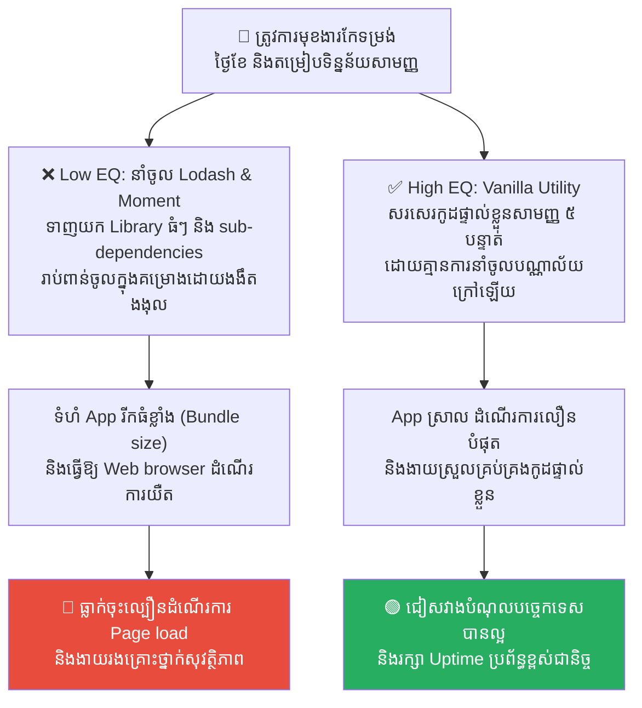
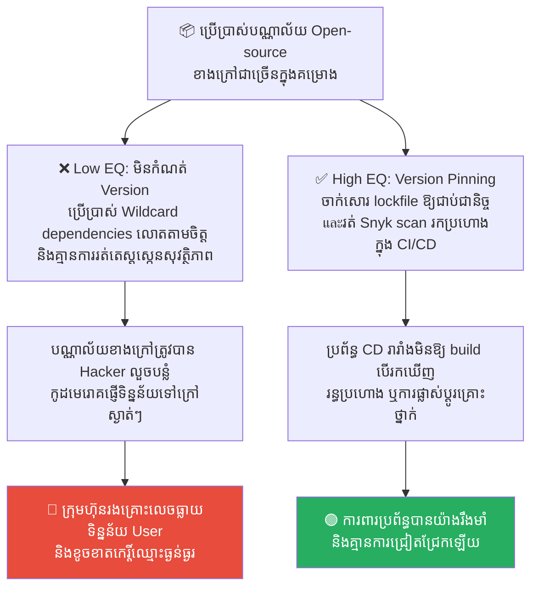
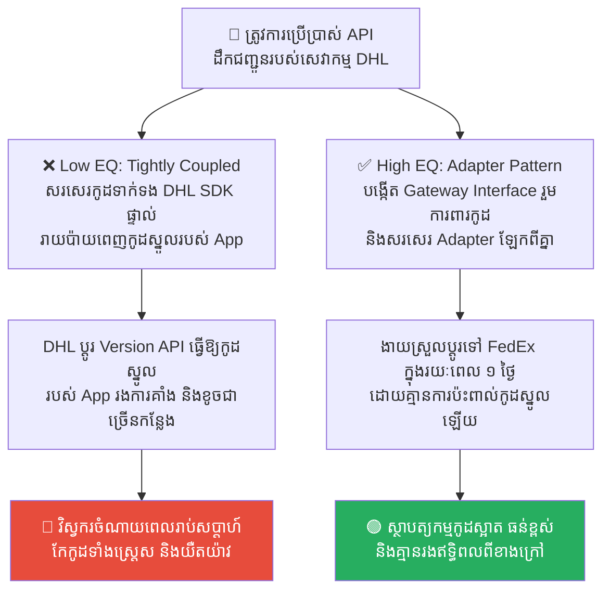
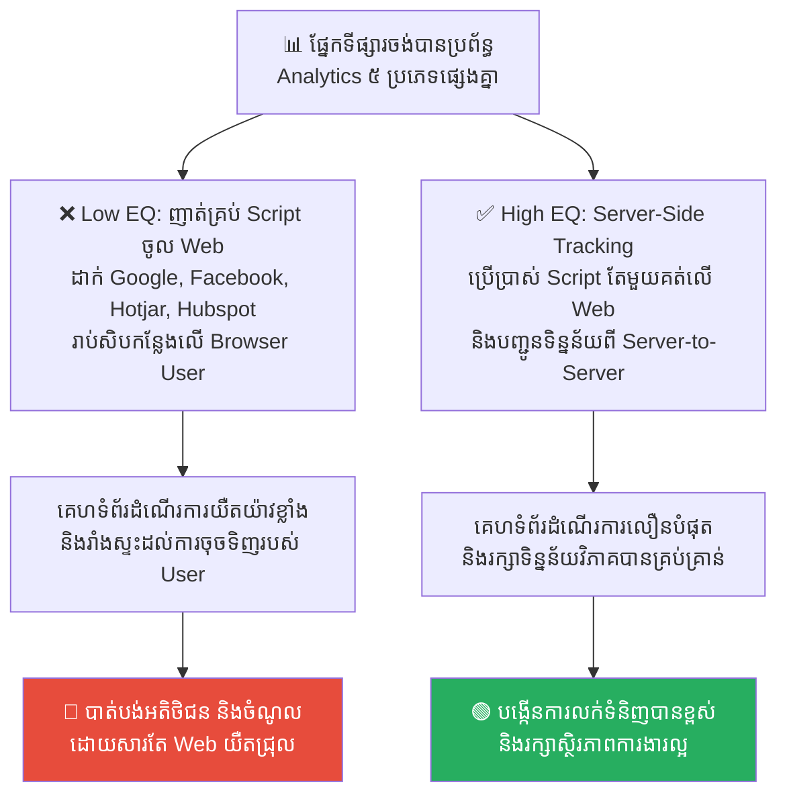
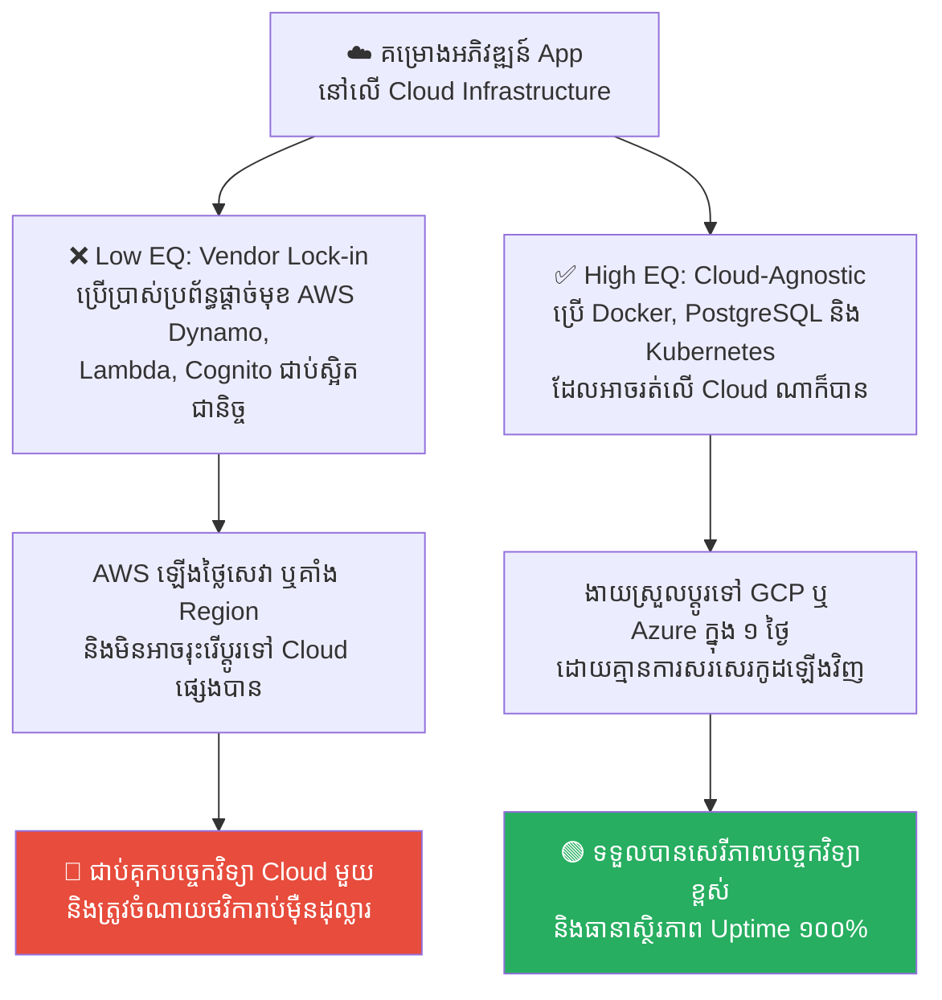

# The Fall of Solomon: Dependency Hell and Third-Party Risks (ការដួលរលំនៃសាឡូម៉ូន៖ ឋាននរកនៃកូដអ្នកដទៃ និងហានិភ័យនៃភាគីទីបី)

**Author:** ichamrong  
**Date:** 2026-05-17  
**Tags:** #solomon #dependency-hell #third-party-risk #npm #architecture  
**Category:** Concepts  
**Read Time:** ~15 min  

---

## 📌 មាតិកា (Table of Contents)
- [លំនាំបញ្ហា (The Pattern)](#លំនាំបញ្ហា-the-pattern)
- [១. បញ្ហា៖ ឋាននរកនៃកូដពឹងផ្អែក និងការបំផ្លាញប្រព័ន្ធពីខាងក្នុង (The Issue: Dependency Hell and Supply Chain Risks)](#១-បញ្ហា-ឋាននរកនៃកូដពឹងផ្អែក-និងការបំផ្លាញប្រព័ន្ធពីខាងក្នុង-the-issue-dependency-hell-and-supply-chain-risks)
- [២. ឧទាហរណ៍ជាក់ស្តែងក្នុងពិភពពិត (Real World Examples)](#២-ឧទាហរណ៍ជាក់ស្តែងក្នុងពិភពពិត)
  - [ឧទាហរណ៍ទី ១ — ការនាំចូលកញ្ចប់កូដខាងក្រៅដោយគ្មានការប្រុងប្រយ័ត្ន (Bloated Package Import vs. Vanilla JavaScript Utility Functions)](#ឧទាហរណ៍ទី-១-ការនាំចូលកញ្ចប់កូដខាងក្រៅដោយគ្មានការប្រុងប្រយ័ត្ន-bloated-package-import-vs-vanilla-javascript-utility-functions)
  - [ឧទាហរណ៍ទី ២ — ការមិនកំណត់កំណែកញ្ចប់កូដឱ្យច្បាស់លាស់ (Wildcard Dependency Versions vs. Version Pinning & Security Scan CI/CD)](#ឧទាហរណ៍ទី-២-ការមិនកំណត់កំណែកញ្ចប់កូដឱ្យច្បាស់លាស់-wildcard-dependency-versions-vs-version-pinning-security-scan-cicd)
  - [ឧទាហរណ៍ទី ៣ — ការចងភ្ជាប់កូដស្នូលជាមួយ API ខាងក្រៅ (Tightly Coupled SDK vs. Gateway Adapter Design Pattern)](#ឧទាហរណ៍ទី-៣-ការចងភ្ជាប់កូដស្នូលជាមួយ-api-ខាងក្រៅ-tightly-coupled-sdk-vs-gateway-adapter-design-pattern)
  - [ឧទាហរណ៍ទី ៤ — ការបញ្ចូល Script តាមដានទិន្នន័យច្រើនជ្រុលលើ Web (Javascript Tracking Scripts Flooding vs. Server-Side Data Analytics Gateway)](#ឧទាហរណ៍ទី-៤-ការបញ្ចូល-script-តាមដានទិន្នន័យច្រើនជ្រុលលើ-web-javascript-tracking-scripts-flooding-vs-server-side-data-analytics-gateway)
  - [ឧទាហរណ៍ទី ៥ — ការពឹងផ្អែកលើសេវាកម្ម Cloud ផ្តាច់មុខ (Proprietary Cloud Services vs. Cloud-Agnostic Containerized Architecture)](#ឧទាហរណ៍ទី-៥-ការពឹងផ្អែកលើសេវាកម្ម-cloud-ផ្តាច់មុខ-proprietary-cloud-services-vs-cloud-agnostic-containerized-architecture)
- [៣. កត្តាជម្រុញ៖ ភាពខ្ជិលសរសេរកូដ និងការចង់បានផ្លូវកាត់ (The Aggravator: Laziness to Write Code & Short-Cut Mindset)](#៣-កត្តាជម្រុញ-ភាពខ្ជិលសរសេរកូដ-និងការចង់បានផ្លូវកាត់-the-aggravator-laziness-to-write-code-short-cut-mindset)
- [៤. ដំណោះស្រាយទូទៅ៖ ការរៀបចំច្បាប់សម្ព័ន្ធមិត្ត និងការគ្រប់គ្រងហ្មត់ចត់ (The General Solution: Establishing Dependency Governance & Minimalist Architecture)](#៤-ដំណោះស្រាយទូទៅ-ការរៀបចំច្បាប់សម្ព័ន្ធមិត្ត-និងការគ្រប់គ្រងហ្មត់ចត់-the-general-solution-establishing-dependency-governance-minimalist-architecture)
- [សេចក្តីសន្និដ្ឋាន (Conclusion)](#សេចក្តីសន្និដ្ឋាន-conclusion)
- [Related Posts](#related-posts)

---

## លំនាំបញ្ហា (The Pattern)

នៅក្នុងប្រវត្តិសាស្ត្របុរាណ បន្ទាប់ពីការកសាងមហាប្រាសាទដ៏អស្ចារ្យមក **ស្តេចសាឡូម៉ូន (King Solomon)** បានចាប់ផ្តើមពង្រឹងអំណាច និងស្ថិរភាពចក្រភពរបស់ទ្រង់ តាមរយៈយុទ្ធសាស្ត្រ **«ចងសម្ព័ន្ធមិត្តជាមួយនគរជុំវិញខ្លួន»**។ ដើម្បីធានាសន្តិភាព ទ្រង់បានរៀបការជាមួយបុត្រីរបស់ស្តេចនគរជិតខាង និងមហេសីបរទេសរាប់រយនាក់ (រហូតដល់ ៧០០ នាក់) ព្រមទាំងនាំមកនូវស្រីស្នំរាប់រយនាក់ទៀតចូលមកក្នុងរាជវាំង។

ដំបូងឡើយ យុទ្ធសាស្ត្រនេះហាក់បីដូចជាឆ្លាតវៃណាស់ ព្រោះវាជួយការពារសង្គ្រាមពីខាងក្រៅ។ ប៉ុន្តែ យូរៗទៅ គ្រោះមហន្តរាយដ៏ធំបំផុតបានកើតឡើង៖
*   មហេសីបរទេសម្នាក់ៗ មិនបានអញ្ជើញមកតែខ្លួនទទេនោះទេ ពួកគេបាននាំមកនូវ វប្បធម៌ ទម្លាប់ ព្រមទាំង **«ព្រះក្លែងក្លាយ (Idols)»** របស់ពួកគេចូលមកបំពុលរាជវាំងសូវៀត។
*   ពួកគេបានបញ្ចុះបញ្ចូលសាឡូម៉ូនឱ្យសាងសង់អាសនៈថ្វាយព្រះបរទេសនៅក្នុងទឹកដីអ៊ីស្រាអែល បង្កជាវិបត្តិសាសនា ជម្លោះផ្ទៃក្នុង និងការបែកបាក់សាមគ្គីភាពជាតិ ដែលទីបំផុតនាំទៅរក **«ការដួលរលំ និងការបែកបាក់ចក្រភពដ៏ធំរបស់សាឡូម៉ូនជាពីរ»** ភ្លាមៗបន្ទាប់ពីទ្រង់សោយទិវង្គត។

នៅក្នុងការអភិវឌ្ឍកម្មវិធីទំនើប (Modern Software Development) គ្មានវិស្វករណាម្នាក់សរសេរកូដរាប់លានបន្ទាត់ដោយផ្ទាល់ដៃពីចំណុចសូន្យឡើយ។ យើងតែងតែប្រើប្រាស់យុទ្ធសាស្ត្រចងសម្ព័ន្ធមិត្ត គឺការនាំចូលកញ្ចប់កូដរបស់អ្នកដទៃ (**Third-Party Libraries, NPM Packages, or Modules**) ដើម្បីសន្សំពេលវេលា។

ប៉ុន្តែ ការនាំចូលកូដអ្នកដទៃច្រើនពេកដោយខ្វះការត្រួតពិនិត្យ គឺប្រៀបដូចជាការនាំចូលមហេសីបរទេសរបស់សាឡូម៉ូនដូច្នោះដែរ៖
*   វាបង្កើតឱ្យមាន **Dependency Hell (ឋាននរកនៃកូដពឹងផ្អែក)** ដែលធ្វើឱ្យប្រព័ន្ធកម្មវិធីធំ ដើរយឺត និងច្របូកច្របល់។
*   វានាំចូលរន្ធប្រហោងសុវត្ថិភាព និងមេរោគខាងក្រៅ (**Supply Chain Security Risks**) ដែលបំផ្លាញស្ថាបត្យកម្មប្រព័ន្ធការងារពីខាងក្នុងដោយស្ងាត់ស្ងៀម។

---

## ១. បញ្ហា៖ ឋាននរកនៃកូដពឹងផ្អែក និងការបំផ្លាញប្រព័ន្ធពីខាងក្នុង (The Issue: Dependency Hell and Supply Chain Risks)

នៅក្នុងពិភពវិស្វកម្ម ជំងឺ **Dependency Hell** គឺជាវិបត្តិដ៏រ៉ាំរ៉ៃ។ វាកើតឡើងនៅពេលដែលកម្មវិធីរបស់អ្នក (App) ពឹងផ្អែកលើបណ្ណាល័យ A។ ប៉ុន្តែបណ្ណាល័យ A បែរជាត្រូវការបណ្ណាល័យ X, Y, Z ដើម្បីដំណើរការ។ ហើយបណ្ណាល័យ X ត្រូវការបណ្ណាល័យ M, N ផ្សេងទៀត។ 

ទីបំផុត៖
*   កូដរបស់អ្នកមានទំហំធំមហិមា (Bundle Size Inflation) ធ្វើឱ្យ App ដំណើរការយឺត និងស៊ី Memory ខ្ពស់។
*   រាល់បណ្ណាល័យពីខាងក្រៅ គឺជា **«ចន្លោះប្រហោងសុវត្ថិភាពលាក់មុខ»**។ ប្រសិនបើបណ្ណាល័យតូចមួយដែលសរសេរដោយអ្នកណាម្នាក់នៅលើអ៊ីនធឺណិតមាន Bug ឬត្រូវបាន Hack នោះប្រព័ន្ធការងារស្នូលរបស់អ្នកទាំងមូលក៏ត្រូវរងគ្រោះថ្នាក់ភ្លាមៗដែរ (ដូចក្នុងករណីគ្រោះមហន្តរាយរបស់បណ្ណាល័យ Log4j នាពេលថ្មីៗនេះ)។

អ្នកមិនត្រឹមតែនាំចូល «មុខងារ» របស់ពួកគេឡើយ តែអ្នកក៏កំពុងនាំចូល «មេរោគ និងបំណុលបច្ចេកទេស» របស់ពួកគេមកបំពុលស្ថាបត្យកម្មដ៏បរិសុទ្ធរបស់អ្នកផងដែរ។

---

## ២. ឧទាហរណ៍ជាក់ស្តែងក្នុងពិភពពិត

សូមពិនិត្យមើល **ឧទាហរណ៍ជាក់ស្តែងចំនួន ៥** បង្ហាញពីគ្រោះថ្នាក់នៃ Dependency Hell និងវិធីសាស្ត្រដោះស្រាយដ៏វៃឆ្លាត៖

---

### ឧទាហរណ៍ទី ១ — ការនាំចូលកញ្ចប់កូដខាងក្រៅដោយគ្មានការប្រុងប្រយ័ត្ន (Bloated Package Import vs. Vanilla JavaScript Utility Functions)

**ស្ថានភាព៖** ក្រុមហ៊ុនចង់បានមុខងារសាមញ្ញមួយ ដូចជាការតម្រៀបទិន្នន័យអារេ (Array sorting) ឬកែទម្រង់ថ្ងៃខែ (Date formatting) នៅក្នុង App។

*   **សកម្មភាពអសកម្ម / Low EQ / កំហុសឆ្គង (ឋាននរកនៃកូដអ្នកដទៃ)៖** វិស្វករខ្ជិលសរសេរកូដខ្លួនឯង ក៏ទាញយក Library ធំៗដូចជា Lodash, Moment.js ព្រមទាំង sub-dependencies រាប់ពាន់ដែលមិនស្គាល់ប្រភព មកប្រើប្រាស់ក្នុងគម្រោង។
*   **សកម្មភាពស្ថាបនា / High EQ / ដំណោះស្រាយ (ការគ្រប់គ្រងដោយភាពសាមញ្ញ)៖** អនុវត្ត **Dependency Minimalism & Vanilla Code Utility**។ សរសេរមុខងារតម្រៀបទិន្នន័យ ឬកែទម្រង់ថ្ងៃខែដោយប្រើ Vanilla JS / TypeScript ធម្មតា រក្សាទុកក្នុង Folder Utility ផ្ទាល់ខ្លួន ដោយគ្មានការនាំចូលបណ្ណាល័យខាងក្រៅឡើយ។
*   **លទ្ធផល៖** ការនាំចូលរបស់ធំធ្វើឱ្យ Web app ដំណើរការយឺតខ្លាំង (Low LCP performance) និងជួបបញ្ហារន្ធប្រហោងសុវត្ថិភាពពី sub-dependencies (NPM vulnerabilities)។ ដំណោះស្រាយសរសេរផ្ទាល់ខ្លួន ជួយឱ្យ App មានទំហំស្រាល ដំណើរការលឿន និងមានសុវត្ថិភាពខ្ពស់ ១០០%។

---

### ឧទាហរណ៍ទី ២ — ការមិនកំណត់កំណែកញ្ចប់កូដឱ្យច្បាស់លាស់ (Wildcard Dependency Versions vs. Version Pinning & Security Scan CI/CD)

**ស្ថានភាព៖** គម្រោងកម្មវិធី ប្រើប្រាស់បណ្ណាល័យ Open-source ខាងក្រៅជាច្រើនសម្រាប់តម្រូវការបច្ចេកទេសផ្សេងៗ។

*   **សកម្មភាពអសកម្ម / Low EQ / កំហុសឆ្គង (ឋាននរកនៃកូដអ្នកដទៃ)៖** វិស្វករកំណត់កំណែបណ្ណាល័យជាលក្ខណៈសេរី (wildcard dependencies like `^1.2.0` ឬ `*`) ធ្វើឱ្យប្រព័ន្ធទាញយក Version ថ្មីបំផុតដោយស្វ័យប្រវត្តរាល់ពេល build ដោយគ្មានការត្រួតពិនិត្យសុវត្ថិភាព។
*   **សកម្មភាពស្ថាបនា / High EQ / ដំណោះស្រាយ (ការគ្រប់គ្រងដោយភាពសាមញ្ញ)៖** អនុវត្ត **Version Pinning and Security Audit Pipelines**។ កំណត់កំណែបណ្ណាល័យឱ្យច្បាស់លាស់ (Pin versions using lock files `package-lock.json` or `yarn.lock`) និងតំឡើងប្រព័ន្ធស្វ័យប្រវត្តដើម្បី scan ស្វែងរករន្ធប្រហោងសុវត្ថិភាព (Dependabot / Snyk Integration) ក្នុង CI/CD pipeline មុនរាល់ការ build។
*   **លទ្ធផល៖** Hacker លួចបន្លំកូដបញ្ចូលក្នុង Package ខាងក្រៅដែលត្រូវបាន Update (Supply Chain Attack) ធ្វើឱ្យប្រព័ន្ធរបស់ក្រុមហ៊ុនត្រូវលេចធ្លាយទិន្នន័យអតិថិជន។ ការ Pin version និង scan ជួយទប់ស្កាត់ការ Update គ្រោះថ្នាក់ និងធានាសុវត្ថិភាពប្រព័ន្ធជានិច្ច។

---

### ឧទាហរណ៍ទី ៣ — ការចងភ្ជាប់កូដស្នូលជាមួយ API ខាងក្រៅ (Tightly Coupled SDK vs. Gateway Adapter Design Pattern)

**ស្ថានភាព៖** កម្មវិធីលក់ទំនិញ ត្រូវការប្រើប្រាស់ API របស់សេវាកម្មដឹកជញ្ជូនខាងក្រៅ (ដូចជា DHL API) ដើម្បីគណនាថ្លៃដឹកជញ្ជូន។

*   **សកម្មភាពអសកម្ម / Low EQ / កំហុសឆ្គង (ឋាននរកនៃកូដអ្នកដទៃ)៖** វិស្វករសរសេរកូដទាក់ទង DHL SDK និង API ផ្ទាល់ដោតភ្ជាប់រាយប៉ាយពេញកូដស្នូល (Tightly Coupled Code) ព្រោះគិតថាងាយស្រួល និងលឿន។
*   **សកម្មភាពស្ថាបនា / High EQ / ដំណោះស្រាយ (ការគ្រប់គ្រងដោយភាពសាមញ្ញ)៖** អនុវត្ត **Adapter Design Pattern (Anti-Corruption Layer)**។ បង្កើត Interface រួមមួយសម្រាប់សេវាកម្មដឹកជញ្ជូន (ឧទាហរណ៍ `ShippingGateway`) និងសរសេរ Adapter សម្រាប់ DHL ពីក្រោយ។ ប្រសិនបើថ្ងៃក្រោយចង់ដូរទៅ FedEx យើងគ្រាន់តែសរសេរ Adapter ថ្មី ដោយមិនប៉ះពាល់ដល់កូដស្នូលឡើយ។
*   **លទ្ធផល៖** នៅពេល DHL ប្តូរ Version API ធ្វើឱ្យកូដរបស់ក្រុមហ៊ុនគាំងរាយប៉ាយរាប់សិបកន្លែង និងចំណាយពេលរាប់សប្តាហ៍ដើម្បីកែសម្រួល។ ការប្រើប្រាស់ Adapter ជួយសម្រាលការផ្លាស់ប្តូរ និងធានាថាកូដស្នូលមានភាពស្អាតជានិច្ច។

---

### ឧទាហរណ៍ទី ៤ — ការបញ្ចូល Script តាមដានទិន្នន័យច្រើនជ្រុលលើ Web (Javascript Tracking Scripts Flooding vs. Server-Side Data Analytics Gateway)

**ស្ថានភាព៖** ផ្នែកទីផ្សារ (Marketing) ចង់បានប្រព័ន្ធតាមដានសកម្មភាព User (Analytics) ដូចជា Google Analytics, Hotjar, Facebook Pixel, Mixpanel, Hubspot។

*   **សកម្មភាពអសកម្ម / Low EQ / កំហុសឆ្គង (ឋាននរកនៃកូដអ្នកដទៃ)៖** វិស្វករយល់ព្រមបញ្ចូលរាល់ Javascript Tracking Scripts ទាំងអស់ទៅក្នុងគេហទំព័រ (Header scripts) ដែលធ្វើឱ្យ Browser របស់អតិថិជនត្រូវទាញយកកូដរាប់សិបមេហ្គាបៃ និងប៉ះពាល់ផ្ទាល់ដល់ល្បឿនដំណើរការ។
*   **សកម្មភាពស្ថាបនា / High EQ / ដំណោះស្រាយ (ការគ្រប់គ្រងដោយភាពសាមញ្ញ)៖** អនុវត្ត **Server-Side Tracking / Single Tag Management**។ ប្រើប្រាស់ Script តាមដានតែមួយគត់ (ដូចជា Segment or Google Tag Manager) រួចបញ្ជូនទិន្នន័យពី Server-to-Server ទៅកាន់ Mixpanel/Facebook ពីក្រោយ (Server-side tracking) ដើម្បីកាត់បន្ថយបន្ទុកលើ Browser របស់ User។
*   **លទ្ធផល៖** គេហទំព័រដើរយឺតខ្លាំង (Low LCP performance) ធ្វើឱ្យអតិថិជនជាច្រើនធុញទ្រាន់ និងចាកចេញ។ ដំណោះស្រាយ Server-side ជួយឱ្យគេហទំព័រដើរលឿនបំផុត និងរក្សាការវិភាគទិន្នន័យបានពេញលេញ។

---

### ឧទាហរណ៍ទី ៥ — ការពឹងផ្អែកលើសេវាកម្ម Cloud ផ្តាច់មុខ (Proprietary Cloud Services vs. Cloud-Agnostic Containerized Architecture)

**ស្ថានភាព៖** ក្រុមហ៊ុនចង់សាងសង់កម្មវិធីនៅលើ Cloud AWS និងចង់ធានាភាពបត់បែនខ្ពស់នាពេលអនាគត។

*   **សកម្មភាពអសកម្ម / Low EQ / កំហុសឆ្គង (ឋាននរកនៃកូដអ្នកដទៃ)៖** វិស្វករប្រើប្រាស់សេវាកម្មផ្តាច់មុខរបស់ AWS គ្រប់កន្លែង ដូចជា DynamoDB, AWS Lambda, Cognitos ធ្វើឱ្យកូដរបស់កម្មវិធីជាប់ជំពាក់នឹង AWS ទាំងស្រុង (Vendor Lock-in)។
*   **សកម្មភាពស្ថាបនា / High EQ / ដំណោះស្រាយ (ការគ្រប់គ្រងដោយភាពសាមញ្ញ)៖** អនុវត្ត **Cloud-Agnostic and Containerized Architecture (Docker & Kubernetes)**។ ប្រើប្រាស់ស្តង់ដារបច្គេវិទ្យាដែលអាចដំណើរការលើ Cloud ណាក៏បាន ដូចជា PostgreSQL, Docker containers, Node.js ធម្មតា ដើម្បីងាយស្រួលប្តូរទីតាំង Server ទៅ GCP կամ Azure បើត្រូវការ។
*   **លទ្ធផល៖** នៅពេល AWS ឡើងថ្លៃសេវា ឬជួបបញ្ហាគាំងតំបន់ ក្រុមហ៊ុនមិនអាចផ្លាស់ប្តូរទៅ GCP ឬ Azure បានឡើយ ព្រោះត្រូវសរសេរកូដឡើងវិញពីចំណុចសូន្យ។ ដំណោះស្រាយ Cloud-agnostic ជួយឱ្យក្រុមហ៊ុនមានអំណាចចរចា និងបត់បែនខ្ពស់បំផុត។

---

## ៣. កត្តាជម្រុញ៖ ភាពខ្ជិលសរសេរកូដ និងការចង់បានផ្លូវកាត់ (The Aggravator: Laziness to Write Code & Short-Cut Mindset)

ហេតុអ្វីបានជាយើងងាយនឹងធ្លាក់ចូលទៅក្នុងឋាននរកនៃកូដអ្នកដទៃខ្លាំងម្ល៉េះ? កត្តាជម្រុញរួមមាន៖

1.  **ភាពខ្ជិលច្រអូស និងការចង់បានល្បឿនរយៈពេលខ្លី (Speed Over Quality)៖** ការយល់ឃើញថា៖ *«ហេតុអ្វីបានជាត្រូវចំណាយពេលសរសេរកូដ ២ ម៉ោង បើមានបណ្ណាល័យនៅលើ NPM ស្រាប់ ចំណាយពេលតែ ២ វិនាទីដើម្បីទាញយក?»* ដោយមើលរំលងហានិភ័យរយៈពេលវែង។
2.  ** កង្វះការយល់ដឹងពី Supply Chain Risk (Ignorance of Security)៖** វិស្វករគិតតែពីការបំពេញការងារឱ្យរួចរាល់ តែមិនបានដឹងពីហានិភ័យសុវត្ថិភាព ឬការលួចបង្កប់មេរោគនៅក្នុងបណ្ណាល័យ Open-source ឡើយ។
3.  **សម្ពាធពីថ្នាក់ដឹកនាំចង់បានការ Release លឿន (Release Pressure)៖** សម្ពាធបិទ Deadline បង្ខំឱ្យវិស្វករត្រូវប្រើប្រាស់ផ្លូវកាត់ដ៏ងាយស្រួលបំផុត គឺការទាញយកកូដស្រាប់ៗមកដោតបញ្ចូលគ្នា។

---

## ៤. ដំណោះស្រាយទូទៅ៖ ការរៀបចំច្បាប់សម្ព័ន្ធមិត្ត និងការគ្រប់គ្រងហ្មត់ចត់ (The General Solution: Establishing Dependency Governance & Minimalist Architecture)

ដើម្បីការពារប្រព័ន្ធរបស់អ្នកកុំឱ្យជួបវាសនាដូចចក្រភពរបស់សាឡូម៉ូន ចូរអនុវត្តយុទ្ធសាស្ត្រគ្រប់គ្រងបណ្ណាល័យដូចខាងក្រោម៖

1.  ** អនុវត្តគោលការណ៍ «កុំទុកចិត្តងងឹតងងុល» (Zero Trust Dependencies)៖** មុននឹងសម្រេចចិត្តនាំចូលបណ្ណាល័យណាមួយ ចូរធ្វើសវនកម្ម (Audit)៖ *តើវាមានការថែទាំជាប្រចាំទេ? តើមានសហគមន៍គាំទ្រច្រើនទេ? តើវាមានរន្ធប្រហោងសុវត្ថិភាពទេ?*
2.  ** កំណត់ច្បាប់ចាក់សោរកំណែកូដ (Lock dependency versions)៖** ត្រូវតែប្រើប្រាស់ Lock files (`package-lock.json` or `yarn.lock`) ជានិច្ច និងជៀសវាងការប្រើប្រាស់ Wildcard dependencies ដើម្បីការពារកុំឱ្យប្រព័ន្ធ auto-update របស់ខូចខាត។
3.  ** អនុវត្តប្រព័ន្ធស្កេនសុវត្ថិភាពស្វ័យប្រវត្ត (Automated Security Scanning)៖** បញ្ចូលឧបករណ៍ Snyk, Dependabot ឬ OWASP Dependency-Check ទៅក្នុង CI/CD Pipeline ដើម្បីឱ្យប្រព័ន្ធធ្វើការស្កេន និងបដិសេធ (Block Fail Build) ភ្លាមៗបើមានរន្ធប្រហោងកម្រិត Critical។
4.  ** អនុវត្តយុទ្ធសាស្ត្រ Adapter/Anti-Corruption Layer ជានិច្ច៖** ហាមដាច់ខាតសរសេរកូដដោតភ្ជាប់ SDK ខាងក្រៅផ្ទាល់ជាមួយកូដស្នូលរបស់ App។ ត្រូវតែមាន Interface រួមមួយជាខែលការពារជានិច្ច ដើម្បីឱ្យងាយស្រួលដោះដូរ និងគ្រប់គ្រង។

---

## សេចក្តីសន្និដ្ឋាន (Conclusion)

**ការដួលរលំនៃសាឡូម៉ូន និងឋាននរកនៃកូដអ្នកដទៃ (Dependency Hell)** បង្រៀនយើងថា វិស្វករដ៏ឆ្នើមមិនមែនជាអ្នកដែលពូកែទាញយកកូដអ្នកដទៃមកដោតភ្ជាប់គ្នាឱ្យបានច្រើននោះទេ ប៉ុន្តែជាអ្នកដែលចេះ **«ចងសម្ព័ន្ធមិត្តដោយប្រុងប្រយ័ត្ន រក្សាស្ថាបត្យកម្មកូដឱ្យមានភាពបរិសុទ្ធ ស្រាលស្រឡះ និងគ្រប់គ្រងរាល់បណ្ណាល័យពីខាងក្រៅយ៉ាងម៉ឺងម៉ាត់បំផុត ដើម្បីធានាស្ថិរភាព និងសុវត្ថិភាពអចិន្ត្រៃយ៍នៃប្រព័ន្ធការងារ»**។

ចងចាំជានិច្ចថា៖ **«ចូរគ្រប់គ្រងរាល់សម្ព័ន្ធមិត្តរបស់អ្នកឱ្យបានហ្មត់ចត់បំផុត មុនពេលពួកគេនាំយកព្រះក្លែងក្លាយមកបំផ្លាញទឹកដីរបស់អ្នក។»**

---

## Related Posts

*   **[24 The Trojan Horse and Insider Threats](./24-the-trojan-horse-and-insider-threats.md)** — ហានិភ័យនៃការអនុញ្ញាតឱ្យកូដខាងក្រៅចូលមកក្នុងបន្ទាយការពារប្រព័ន្ធរបស់យើង។
*   **[19 The Domino Effect and Systemic Failures](./19-the-domino-effect-and-systemic-failures.md)** — របៀបដែលការធ្វេសប្រហែសមួយចំណុច អាចបង្កជាការដួលរលំប្រព័ន្ធការងារទាំងស្រុងជាសង្វាក់។

---

*Last updated: 2026-05-26*
