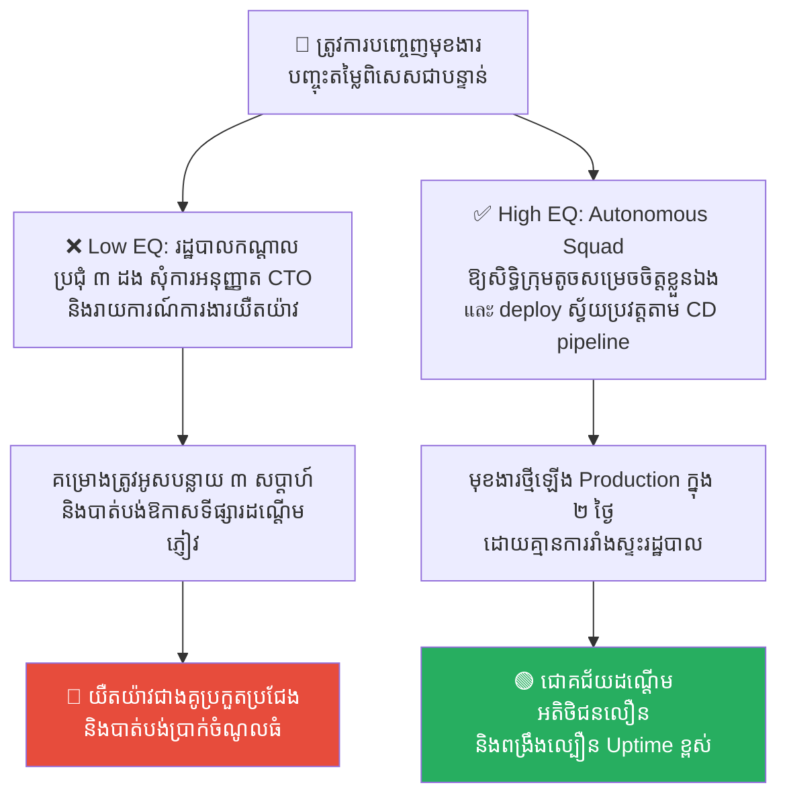
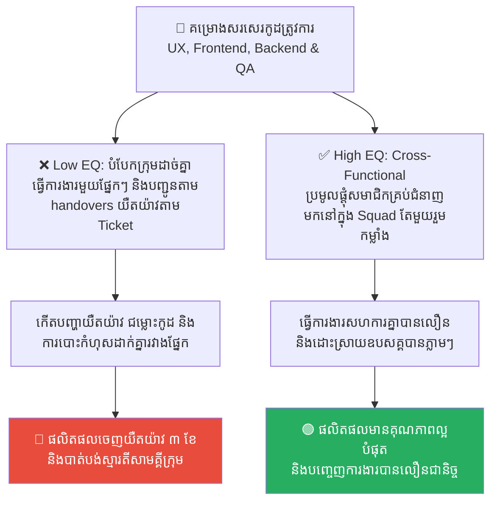
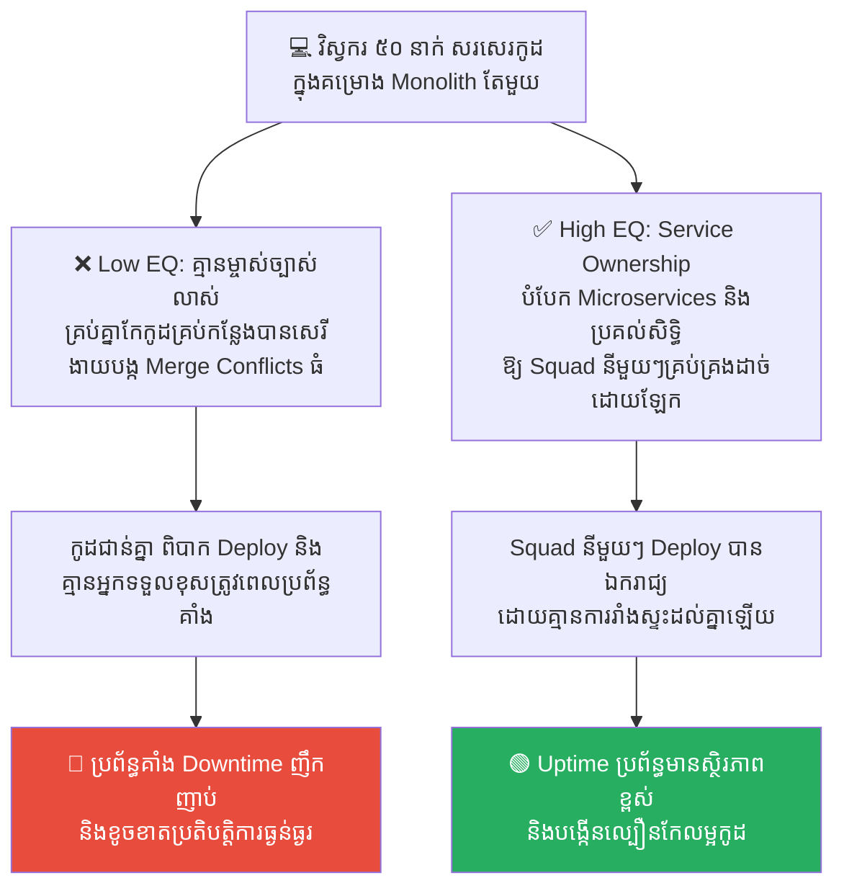
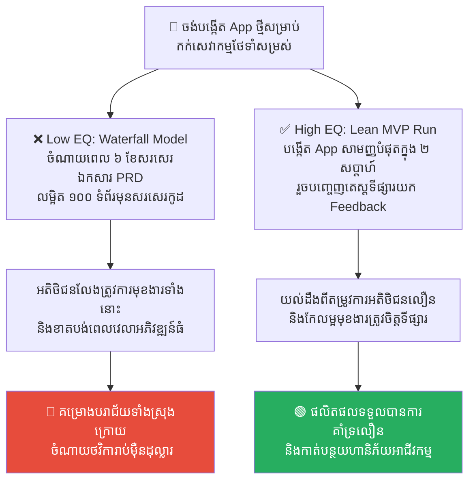
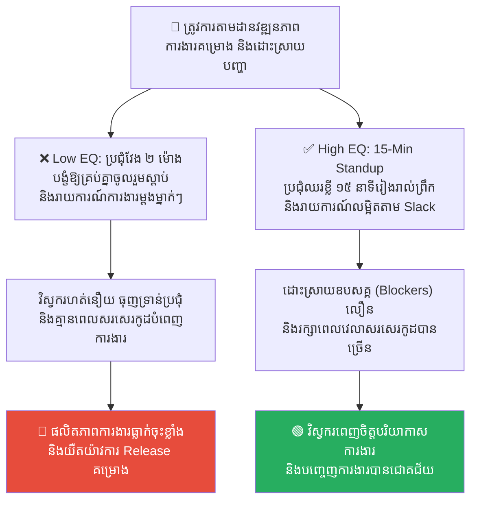

# Genghis Khan: Agile Methodology and Autonomous Squads (ហ្ស៊ីងហ្គីសខាន់៖ វិធីសាស្ត្រ Agile និងក្រុមការងារស្វ័យភាព)

**Author:** ichamrong  
**Date:** 2026-05-17  
**Tags:** #genghis-khan #agile #squads #autonomous-teams #management  
**Category:** Concepts  
**Read Time:** ~15 min  

---

## 📌 មាតិកា (Table of Contents)
- [លំនាំបញ្ហា (The Pattern)](#លំនាំបញ្ហា-the-pattern)
- [១. បញ្ហា៖ ភាពយឺតយ៉ាវនៃប្រព័ន្ធរដ្ឋបាលកណ្តាល និងរចនាសម្ព័ន្ធធ្ងន់ (The Issue: Heavy Bureaucracy & Loss of Speed)](#១-បញ្ហា-ភាពយឺតយ៉ាវនៃប្រព័ន្ធរដ្ឋបាលកណ្តាល-និងរចនាសម្ព័ន្ធធ្ងន់-the-issue-heavy-bureaucracy-loss-of-speed)
- [២. ឧទាហរណ៍ជាក់ស្តែងក្នុងពិភពពិត (Real World Examples)](#២-ឧទាហរណ៍ជាក់ស្តែងក្នុងពិភពពិត)
  - [ឧទាហរណ៍ទី ១ — ការសុំការអនុញ្ញាតដើម្បីដំឡើងកូដ (Centralized Heavy Approvals vs. Autonomous Squads & Automated CD Pipeline)](#ឧទាហរណ៍ទី-១-ការសុំការអនុញ្ញាតដើម្បីដំឡើងកូដ-centralized-heavy-approvals-vs-autonomous-squads-automated-cd-pipeline)
  - [ឧទាហរណ៍ទី ២ — រចនាសម្ព័ន្ធបែកចែកការងាររបស់បុគ្គលិក (Siloed Functional Departments vs. Cross-Functional Autonomous Squads)](#ឧទាហរណ៍ទី-២-រចនាសម្ព័ន្ធបែកចែកការងាររបស់បុគ្គលិក-siloed-functional-departments-vs-cross-functional-autonomous-squads)
  - [ឧទាហរណ៍ទី ៣ — កម្មសិទ្ធិគ្រប់គ្រងប្រព័ន្ធកូដរួម (One Shared Monolith vs. Microservices with Explicit Squad Ownership)](#ឧទាហរណ៍ទី-៣-កម្មសិទ្ធិគ្រប់គ្រងប្រព័ន្ធកូដរួម-one-shared-monolith-vs-microservices-with-explicit-squad-ownership)
  - [ឧទាហរណ៍ទី ៤ — យុទ្ធសាស្ត្របង្កើតផលិតផលឡើងទីផ្សារ (100-Page PRD Specification Document vs. Lean MVP Rapid Iterations)](#ឧទាហរណ៍ទី-៤-យុទ្ធសាស្ត្របង្កើតផលិតផលឡើងទីផ្សារ-100-page-prd-specification-document-vs-lean-mvp-rapid-iterations)
  - [ឧទាហរណ៍ទី ៥ — វប្បធម៌ប្រជុំ និងការទំនាក់ទំនងផ្ទៃក្នុង (Long Status Update Meetings vs. 15-Min Daily Standup & Async Slack Updates)](#ឧទាហរណ៍ទី-៥-វប្បធម៌ប្រជុំ-និងការទំនាក់ទំនងផ្ទៃក្នុង-long-status-update-meetings-vs-15-min-daily-standup-async-slack-updates)
- [៣. កត្តាជម្រុញ៖ ការខ្លាចបាត់បង់ការគ្រប់គ្រង និងការិយាធិបតេយ្យ (The Aggravator: Control Freak Managers & Enterprise Inertia)](#៣-កត្តាជម្រុញ-ការខ្លាចបាត់បង់ការគ្រប់គ្រង-និងការិយាធិបតេយ្យ-the-aggravator-control-freak-managers-enterprise-inertia)
- [៤. ដំណោះស្រាយទូទៅ៖ ការផ្តល់សិទ្ធិសម្រេចចិត្ត និងការកាត់បន្ថយស្បៀងធ្ងន់ (The General Solution: Delegating Decisions & Empowering Small Teams)](#៤-ដំណោះស្រាយទូទៅ-ការផ្តល់សិទ្ធិសម្រេចចិត្ត-និងការកាត់បន្ថយស្បៀងធ្ងន់-the-general-solution-delegating-decisions-empowering-small-teams)
- [សេចក្តីសន្និដ្ឋាន (Conclusion)](#សេចក្តីសន្និដ្ឋាន-conclusion)
- [Related Posts](#related-posts)

---

## លំនាំបញ្ហា (The Pattern)

នៅក្នុងប្រវត្តិសាស្ត្រយោធាសកលលោក ចក្រភពម៉ុងហ្គោលក្រោមការដឹកនាំរបស់កំពូលមេទ័ព **ហ្ស៊ីងហ្គីសខាន់ (Genghis Khan)** គឺជាចក្រភពដែលមានដែនដីជាប់គ្នាធំបំផុតក្នុងប្រវត្តិសាស្ត្រមនុស្សជាតិ។ ម៉ុងហ្គោលបានយកឈ្នះកងទ័ពដ៏ធំ និងរឹងមាំរបស់អាណាចក្រចិន ស៊ុង និងកងទ័ពអាវក្រោះដែកដ៏មានឥទ្ធិពលរបស់អឺរ៉ុប ទោះបីជាពួកគេមានចំនួនទ័ពតិចជាងគូប្រជែងឆ្ងាយណាស់ក៏ដោយ។

តើអ្វីជាអាថ៌កំបាំងយុទ្ធសាស្ត្ររបស់ហ្ស៊ីងហ្គីសខាន់?
1.  **ការលុបបំបាត់រទេះស្បៀងដ៏ធ្ងន់ (No Baggage Train)៖** កងទ័ពអឺរ៉ុបធ្វើដំណើរយឺតខ្លាំង ព្រោះត្រូវអូសរទេះដឹកស្បៀង អាវុធ និងរទេះរបស់មេទ័ពដ៏ធ្ងន់ៗរញ៉េរញ៉ៃ។ កងទ័ពម៉ុងហ្គោលគ្មានរទេះស្បៀងឡើយ។ ទាហានម្នាក់ៗជិះសេះស្រាល ស្ពាយស្បៀងស្ងួត និងផ្លាស់ប្តូរសេះជិះជារៀងរាល់ថ្ងៃ ដែលជួយឱ្យពួកគេធ្វើដំណើរលឿនជាងសត្រូវដល់ទៅ ៥ ដង។ ពេលសត្រូវកំពុងរៀបចំប្រជុំផែនការ ម៉ុងហ្គោលបានវាយទម្លុះទ្វារក្រុងបាត់ទៅហើយ។
2.  ** ក្រុមការងារស្វ័យភាពខ្ពស់ (Autonomous Squad Model)៖** កងទ័ពអឺរ៉ុបរៀបចំរចនាសម្ព័ន្ធបែបប្រមូលផ្តុំកណ្តាល (Centralized Command) ដែលទាហានមិនហ៊ានធ្វើអ្វីទាំងអស់ បើគ្មានការបញ្ជាផ្ទាល់ពីស្តេច។ ផ្ទុយទៅវិញ ហ្ស៊ីងហ្គីសខាន់បានបែងចែកកងទ័ពជាក្រុមតូចៗ (Tumen, Mingghan, Arban)។ ទ្រង់គ្រាន់តែប្រាប់គោលដៅចុងក្រោយ (Objective) ថា៖ *«ចូរទៅវាយយកទីក្រុងនោះ»*។ ចំណែកឯសំណួរថា តើត្រូវវាយរបៀបណា ប្រើកលល្បិចអ្វី និងបត់បែនតាមស្ថានភាពយ៉ាងណា គឺមេទ័ពតូចៗនៅសមរភូមិជាអ្នកសម្រេចចិត្តភ្លាមៗដោយខ្លួនឯង ដោយមិនបាច់រង់ចាំការផ្ញើសារសុំការអនុញ្ញាតពីខាន់ឡើយ។

នៅក្នុងការគ្រប់គ្រងប្រព័ន្ធបច្ចេកវិទ្យា និងការរៀបចំរចនាសម្ព័ន្ធក្រុមការងារ (Agile Software Development) គំរូយុទ្ធសាស្ត្ររបស់ម៉ុងហ្គោល គឺជាបេះដូងរបស់ **Agile Methodology** និង **Autonomous Squads (ក្រុមការងារស្វ័យភាព)**៖
*   រចនាសម្ព័ន្ធការងារដែលមានរទេះស្បៀងធ្ងន់ (ការិយាធិបតេយ្យ និងការប្រជុំច្រើនហួសហេតុ) ធ្វើឱ្យក្រុមហ៊ុនដើរយឺតយ៉ាវ និងចាញ់ប្រៀបគូប្រជែង។
*   អាថ៌កំបាំងនៃល្បឿន និងផលិតភាពខ្ពស់ គឺស្ថិតនៅលើការបែងចែកក្រុមការងារតូចៗ ដែលមានសមត្ថភាពគ្រប់គ្រាន់ (Cross-Functional) និងមានសិទ្ធិសម្រេចចិត្តដោយឯករាជ្យ ដើម្បីដោះស្រាយបញ្ហាបានទាន់ពេលវេលា។

---

## ១. បញ្ហា៖ ភាពយឺតយ៉ាវនៃប្រព័ន្ធរដ្ឋបាលកណ្តាល និងរចនាសម្ព័ន្ធធ្ងន់ (The Issue: Heavy Bureaucracy & Loss of Speed)

នៅក្នុងក្រុមហ៊ុនបច្ចេកវិទ្យាខ្នាតធំ (Enterprise) ឧបសគ្គដ៏ធំបំផុតដែលបំផ្លាញនវានុវត្តន៍ មិនមែនមកពីសមត្ថភាពបច្ចេកទេសរបស់វិស្វករនោះទេ ប៉ុន្តែវាគឺកើតឡើងចេញពី **Heavy Bureaucracy (ការិយាធិបតេយ្យធ្ងន់ធ្ងរ)**។

នៅពេលរចនាសម្ព័ន្ធការងារមានភាពប្រមូលផ្តុំកណ្តាល៖
*   វិស្វករគ្មានសិទ្ធិសម្រេចចិត្តលើការជ្រើសរើសបច្ចេកវិទ្យា ឬការកែកូដឡើយ។
*   រាល់ការផ្លាស់ប្តូរតូចតាច ត្រូវសរសេរសំណើ និងឆ្លងកាត់ការអនុម័ត (Approval Gates) ពីប្រធាននាយកដ្ឋាន ៥ នាក់ និងប្រជុំដេញដោលជាច្រើនម៉ោង។
*   ក្រុមការងារបែកបាក់ដាច់ដោយឡែកពីគ្នា (Siloed Teams) ដូចជា ក្រុម Dev មិននិយាយរកក្រុម QA, ហើយក្រុម QA មិនត្រូវគ្នាជាមួយក្រុម UX ឡើយ។

លទ្ធផលគឺ ល្បឿននៃការបញ្ចេញផលិតផល (Velocity) ធ្លាក់ចុះយ៉ាងខ្លាំង ធ្វើឱ្យក្រុមហ៊ុនចាញ់ប្រៀបដៃគូប្រកួតប្រជែងតូចៗដែលមានភាពបត់បែន និងល្បឿនលឿនជាង។ នៅក្នុងវិស័យ Tech **«ល្បឿន គឺជាមុខងារគន្លឹះ»** (Speed is a feature)។

---

## ២. ឧទាហរណ៍ជាក់ស្តែងក្នុងពិភពពិត

សូមពិនិត្យមើល **ឧទាហរណ៍ជាក់ស្តែងចំនួន ៥** បង្ហាញពីការរៀបចំក្រុមការងារតាមបែប Agile Squads របស់ហ្ស៊ីងហ្គីសខាន់៖

---

### ឧទាហរណ៍ទី ១ — ការសុំការអនុញ្ញាតដើម្បីដំឡើងកូដ (Centralized Heavy Approvals vs. Autonomous Squads & Automated CD Pipeline)

**ស្ថានភាព៖** ក្រុមហ៊ុនចង់បញ្ចេញមុខងារ «បញ្ចុះតម្លៃពិសេស» ឱ្យបានលឿនបំផុតដើម្បីឆ្លើយតបនឹងយុទ្ធនាការគូប្រជែង។

*   **សកម្មភាពអសកម្ម / Low EQ / កំហុសឆ្គង (ការិយាធិបតេយ្យកណ្តាល)៖** វិស្វករត្រូវរង់ចាំសរសេរបញ្ជីសំណើ ឆ្លងកាត់ការពិនិត្យពី Project Manager, Tech Lead, Product Director, and CTO រួចឆ្លងកាត់ការប្រជុំយល់ព្រម ៣ ដង ទើបអាចរុញកូដទៅ Production បាន។
*   **សកម្មភាពស្ថាបនា / High EQ / ដំណោះស្រាយ (ក្រុមការងារស្វ័យភាពម៉ុងហ្គោល)៖** អនុវត្ត **Autonomous Squad Model with CD Pipeline** (ដូចជា Spotify model)។ បង្កើតក្រុមការងារតូចមួយ (Cross-functional squad) ដែលមាន Dev, QA, UX Designer និង Product Owner រួមគ្នា។ ក្រុមនេះមានស្វ័យភាពសម្រេចចិត្ត និងអាច Deploy កូដទៅ Production ដោយស្វ័យប្រវត្តតាមរយៈ CI/CD Pipeline ភ្លាមៗនៅពេលពួកគេធ្វើតេស្តរួចរាល់។
*   **លទ្ធផល៖** ប្រព័ន្ធរដ្ឋបាលកណ្តាលពន្យារពេល Release រហូតដល់ ៣ សប្តាហ៍ ធ្វើឱ្យហួសឱកាសទីផ្សារ។ ក្រុមស្វ័យភាពបញ្ចេញមុខងារបានក្នុងរយៈពេលត្រឹមតែ ២ ថ្ងៃ ជួយដណ្តើមអតិថិជនបានជោគជ័យ។

---

### ឧទាហរណ៍ទី ២ — រចនាសម្ព័ន្ធបែកចែកការងាររបស់បុគ្គលិក (Siloed Functional Departments vs. Cross-Functional Autonomous Squads)

**ស្ថានភាព៖** ក្រុមហ៊ុនមានគម្រោងអភិវឌ្ឍន៍មុខងារស្នូលរបស់កម្មវិធី ដែលត្រូវការជំនាញផ្នែកច្នៃប្រឌិត UI, Frontend, Backend, និងការធ្វើតេស្ត QA។

*   **សកម្មភាពអសកម្ម / Low EQ / កំហុសឆ្គង (ការិយាធិបតេយ្យកណ្តាល)៖** ក្រុមហ៊ុនរៀបចំជាផ្នែកដាច់ដោយឡែកពីគ្នា (Silos) គឺ ផ្នែក UX, ផ្នែក Backend, ផ្នែក Frontend, និងផ្នែក QA។ រាល់ការងារត្រូវបញ្ជូនតាមបំពង់ (Handover) ពីផ្នែកមួយទៅផ្នែកមួយទៀត គួបផ្សំនឹងការរង់ចាំ Ticket ក្នុង Jira។
*   **សកម្មភាពស្ថាបនា / High EQ / ដំណោះស្រាយ (ក្រុមការងារស្វ័យភាពម៉ុងហ្គោល)៖** អនុវត្ត **Cross-Functional Squad (កងទ័ពជិះសេះស្រាល)**។ ប្រមូលផ្តុំសមាជិកពីគ្រប់ផ្នែក (Dev, QA, Designer) ឱ្យមកនៅក្នុងក្រុមតែមួយ ផ្តោតលើគោលដៅរួមតែមួយ និងធ្វើការពិភាក្សាដោះស្រាយបញ្ហាទល់មុខគ្នាជារៀងរាល់ថ្ងៃ (Daily Standup)។
*   **លទ្ធផល៖** ការងារដាច់ផ្នែកនាំឱ្យកើតមានបញ្ហាយឺតយ៉ាវ ជម្លោះកូដ និងការបោះចោលកំហុសដាក់គ្នា (Friction & Finger-pointing)។ ក្រុមការងាររួមគ្នាជួយឱ្យការងារប្រព្រឹត្តទៅបានលឿន បញ្ចេញការងារបានរលូន និងគ្មានឧបសគ្គទំនាក់ទំនង។

---

### ឧទាហរណ៍ទី ៣ — កម្មសិទ្ធិគ្រប់គ្រងប្រព័ន្ធកូដរួម (One Shared Monolith vs. Microservices with Explicit Squad Ownership)

**ស្ថានភាព៖** ក្រុមហ៊ុនមានវិស្វករ ៥០ នាក់ធ្វើការងាររួមគ្នាក្នុងគម្រោង Monolith តែមួយ។

*   **សកម្មភាពអសកម្ម / Low EQ / កំហុសឆ្គង (ការិយាធិបតេយ្យកណ្តាល)៖** វិស្វករគ្រប់រូបមានសិទ្ធិកែកូដគ្រប់ទីកន្លែង ដោយគ្មានការបែងចែកកម្មសិទ្ធិច្បាស់លាស់ ធ្វើឱ្យកើតមានជម្លោះកូដ (Merge Conflicts) ញឹកញាប់ និងគ្មាននរណាម្នាក់ទទួលខុសត្រូវពេលប្រព័ន្ធគាំង។
*   **សកម្មភាពស្ថាបនា / High EQ / ដំណោះស្រាយ (ក្រុមការងារស្វ័យភាពម៉ុងហ្គោល)៖** អនុវត្ត **Microservices/Modules with Explicit Squad Ownership**។ បំបែកកូដធំទៅជាសេវាកម្មតូចៗ (Microservices) និងប្រគល់សិទ្ធិគ្រប់គ្រងសេវាកម្មនីមួយៗឱ្យដាច់ដោយឡែកទៅកាន់ Squad នីមួយៗច្បាស់លាស់ (ដូចជា Squad A គ្រប់គ្រង Payment, Squad B គ្រប់គ្រង Search)។
*   **លទ្ធផល៖** ជម្លោះកូដធ្វើឱ្យការ Release ត្រូវអូសបន្លាយ និងគ្មានស្ថិរភាព។ ការបែងចែកកម្មសិទ្ធិច្បាស់លាស់ ជួយឱ្យ Squad នីមួយៗអាចកែកូដ និង Deploy សេវាកម្មរបស់ខ្លួនបានដោយឯករាជ្យ និងគ្មានការរំខានដល់អ្នកដទៃឡើយ។

---

### ឧទាហរណ៍ទី ៤ — យុទ្ធសាស្ត្របង្កើតផលិតផលឡើងទីផ្សារ (100-Page PRD Specification Document vs. Lean MVP Rapid Iterations)

**ស្ថានភាព៖** ក្រុមហ៊ុនចង់បង្កើតកម្មវិធីថ្មីមួយសម្រាប់ជួយអតិថិជនកក់សេវាកម្មថែទាំសម្រស់។

*   **សកម្មភាពអសកម្ម / Low EQ / កំហុសឆ្គង (ការិយាធិបតេយ្យកណ្តាល)៖** ចំណាយពេល ៦ ខែសរសេរឯកសារតម្រូវការលម្អិត ១០០ ទំព័រ (PRD Document) និងរចនា UI គ្រប់ទំព័រឱ្យល្អឥតខ្ចោះ មុននឹងឱ្យវិស្វករចាប់ផ្តើមសរសេរកូដមួយបន្ទាត់ (Waterfall Model/Heavy Baggage)។
*   **សកម្មភាពស្ថាបនា / High EQ / ដំណោះស្រាយ (ក្រុមការងារស្វ័យភាពម៉ុងហ្គោល)៖** អនុវត្ត **Lean MVP (Minimum Viable Product) & Rapid Feedback Iterations**។ បង្កើត App សាមញ្ញបំផុតមួយក្នុងរយៈពេល ២ សប្តាហ៍ ដែលមានតែប៊ូតុងកក់សាមញ្ញ រួចបញ្ចេញទៅឱ្យអតិថិជនសាកល្បងប្រើ ដើម្បីទាញយកមតិយោបល់ (Feedback) មកកែលម្អជាជំហានៗ។
*   **លទ្ធផល៖** វិធីសាស្ត្រ Waterfall ធ្វើឱ្យគម្រោងចេញយឺតយ៉ាវ និងមិនត្រូវតាមចំណង់អតិថិជនពិតប្រាកដ បង្កជាការខាតបង់ថវិការាប់ម៉ឺនដុល្លារ។ វិធីសាស្ត្រ Lean MVP ជួយឱ្យយល់ដឹងពីទីផ្សារលឿន និងកសាងផលិតផលត្រូវគោលដៅជោគជ័យ។

---

### ឧទាហរណ៍ទី ៥ — វប្បធម៌ប្រជុំ និងការទំនាក់ទំនងផ្ទៃក្នុង (Long Status Update Meetings vs. 15-Min Daily Standup & Async Slack Updates)

**ស្ថានភាព៖** ក្រុមហ៊ុនចង់ឱ្យក្រុមការងារបច្ចេកទេសទាំងអស់ យល់ដឹងពីវឌ្ឍនភាពការងារគម្រោងរួមគ្នា និងជួយគ្នាដោះស្រាយបញ្ហា។

*   **សកម្មភាពអសកម្ម / Low EQ / កំហុសឆ្គង (ការិយាធិបតេយ្យកណ្តាល)៖** រៀបចំការប្រជុំរាយការណ៍ការងារប្រចាំថ្ងៃរយៈពេល ២ ម៉ោងពេញ ដោយបង្ខំឱ្យវិស្វករគ្រប់រូបត្រូវចូលរួម និងនិយាយរាយការណ៍ម្តងម្នាក់ៗ ធ្វើឱ្យខាតបង់ពេលវេលាសរសេរកូដ។
*   **សកម្មភាពស្ថាបនា / High EQ / ដំណោះស្រាយ (ក្រុមការងារស្វ័យភាពម៉ុងហ្គោល)៖** អនុវត្ត **15-Min Daily Standup & Asynchronous Status Updates**។ រៀបចំប្រជុំខ្លីត្រឹមតែ ១៥ នាទីជារៀងរាល់ព្រឹក (ឈរប្រជុំ) ផ្តោតលើតែរឿង ៣៖ *តើម្សិលមិញធ្វើអ្វី? ថ្ងៃនេះធ្វើអ្វី? និងតើមានឧបសគ្គអ្វីខ្លះ?* រីឯរបាយការណ៍លម្អិត ត្រូវធ្វើឡើងតាមរយៈ Slack/Jira (Asynchronous)។
*   **លទ្ធផល៖** ការប្រជុំវែងអន្លាយបំផ្លាញទឹកចិត្ត និងពេលវេលាធ្វើការរបស់វិស្វករ។ Standup ខ្លីជួយជំរុញថាមពលការងារ ដោះស្រាយឧបសគ្គបានលឿន និងរក្សាផលិតភាពការងារខ្ពស់បំផុត។

---

## ៣. កត្តាជម្រុញ៖ ការខ្លាចបាត់បង់ការគ្រប់គ្រង និងការិយាធិបតេយ្យ (The Aggravator: Control Freak Managers & Enterprise Inertia)

ហេតុអ្វីបានជាក្រុមហ៊ុនជាច្រើនងាយនឹងធ្លាក់ចូលទៅក្នុងរចនាសម្ព័ន្ធធ្ងន់ និងភាពយឺតយ៉ាវ? កត្តាជម្រុញរួមមាន៖

1.  **ការខ្លាចបាត់បង់អំណាចគ្រប់គ្រង (Fear of Losing Control)៖** ថ្នាក់ដឹកនាំ ឬ Managers ខ្លះយល់ថា ប្រសិនបើពួកគេមិនបានត្រួតពិនិត្យ និងយល់ព្រមលើរាល់សកម្មភាពរបស់វិស្វករទេ នោះប្រព័ន្ធនឹងមានភាពច្របូកច្របល់ (Lack of Trust)។ ពួកគេចង់ឱ្យគ្រប់យ៉ាងឆ្លងកាត់ដៃពួកគេ (Control Freak)។
2.  ** ទម្លាប់រស់នៅក្នុងតំបន់សុវត្ថិភាព (Enterprise Inertia)៖** ក្រុមហ៊ុនធំៗមានទម្លាប់ធ្វើការងារតាមរបៀបចាស់ រាប់សិបឆ្នាំមកហើយ។ ការផ្លាស់ប្តូរទៅជា Agile Squads ត្រូវការការកែប្រែវប្បធម៌ការងារ ដែលធ្វើឱ្យពួកគេមានភាពខ្ជិលច្រអូសក្នុងការកែទម្រង់។
3.  **ការយល់ច្រឡំថា «ការប្រជុំច្រើន ស្មើនឹងការធ្វើការងារច្រើន» (Meeting Fallacy)៖** វប្បធម៌ការងារដែលផ្តល់តម្លៃទៅលើការប្រជុំ និងការសរសេររបាយការណ៍អន្លាយៗ ជំនួសឱ្យការវាស់ស្ទង់ផលិតផលជាក់ស្តែងដែលបញ្ចេញឡើង Production។

---

## ៤. ដំណោះស្រាយទូទៅ៖ ការផ្តល់សិទ្ធិសម្រេចចិត្ត និងការកាត់បន្ថយស្បៀងធ្ងន់ (The General Solution: Delegating Decisions & Empowering Small Teams)

ដើម្បីកសាងប្រព័ន្ធការងារដែលមានល្បឿនលឿន ធន់ និងមានប្រសិទ្ធភាពខ្ពស់ ស្របតាមទស្សនវិជ្ជារបស់ហ្ស៊ីងហ្គីសខាន់ ចូរអនុវត្តយុទ្ធសាស្ត្រដូចខាងក្រោម៖

1.  ** អនុវត្តគំរូក្រុម Cross-Functional Squads ស្វ័យភាព៖** បំបែកក្រុមហ៊ុនជាក្រុមតូចៗ (សមាជិក ៥ ទៅ ៩ នាក់) ដែលមានជំនាញគ្រប់គ្រាន់ដើម្បីដោះស្រាយបញ្ហាមួយដាច់ដោយឡែក (Dev, QA, Designer, PO)។ ផ្តល់សិទ្ធិសម្រេចចិត្ត (Autonomy) ដល់ពួកគេ ១០០% លើការសរសេរកូដ និងការជ្រើសរើសបច្ចេកវិទ្យា។
2.  ** ប្រាប់តែគោលដៅ ហាមលូកដៃរបៀបធ្វើ (Align on Outcome, Delegate Output)៖** ថ្នាក់ដឹកនាំត្រូវធ្វើខ្លួនដូចជា ហ្ស៊ីងហ្គីសខាន់៖ ប្រាប់តែគោលដៅអាជីវកម្មច្បាស់លាស់ (Objective / OKRs ដូចជា *«បង្កើនការចុះឈ្មោះ User ២០%»*) ប៉ុន្តែត្រូវទុកសិទ្ធិឱ្យ Squad នីមួយៗរចនា និងស្វែងរកវិធីដោះស្រាយដោយខ្លួនឯង។
3.  ** កាត់បន្ថយការិយាធិបតេយ្យ និងការប្រជុំដែលមិនចាំបាច់ (Eliminate Baggage)៖** លុបចោលការប្រជុំរាយការណ៍ការងារវែងអន្លាយ។ ជំនួសមកវិញដោយ Daily Standup ១៥ នាទី និងប្រើប្រាស់ការទាក់ទងគ្នាពីចម្ងាយ (Asynchronous Communication via Slack/Jira)។
4.  ** អនុវត្តការ Release បែបសន្សឹមៗ (Iterative Releases)៖** កុំរង់ចាំធ្វើផលិតផលឱ្យល្អឥតខ្ចោះទើបបញ្ចេញ។ ចូរប្រើប្រាស់វិធីសាស្ត្រ Lean/MVP បញ្ចេញផលិតផលតូច រលូន លឿន រួចកែលម្អជាជំហានៗតាម Feedback ពិតប្រាកដរបស់អតិថិជន។

---

## សេចក្តីសន្និដ្ឋាន (Conclusion)

**ហ្ស៊ីងហ្គីសខាន់ និងវិធីសាស្ត្រ Agile (Autonomous Squads)** បង្រៀនយើងថា នៅក្នុងយុគសម័យបច្ចេកវិទ្យាដែលប្រែប្រួលលឿនបំផុត ភាពរឹងមាំពិតប្រាកដមិនមែនកើតឡើងពីការមានរចនាសម្ព័ន្ធធំ ធ្ងន់ និងការិយាធិបតេយ្យប្រមូលផ្តុំកណ្តាលនោះឡើយ។ ជ័យជម្នះពិតប្រាកដ កើតឡើងចេញពី **«ល្បឿន និងភាពបត់បែនខ្ពស់ ដែលត្រូវបានជំរុញដោយការបែងចែកក្រុមការងារតូចៗ មានស្វ័យភាពសម្រេចចិត្ត និងផ្តោតលើគោលដៅរួមតែមួយ ដើម្បីទម្លាយរាល់ឧបសគ្គ និងបញ្ចេញផលិតផលបានលឿនជាងគូប្រជែងជានិច្ច»**។

ចងចាំជានិច្ចថា៖ **«ចូរកាត់បន្ថយរទេះស្បៀងដ៏ធ្ងន់របស់អ្នកចោល និងផ្តល់ដាវសិទ្ធិសម្រេចចិត្តដល់ក្រុមការងារតូចៗរបស់អ្នក ដើម្បីយកឈ្នះរាល់សមរភូមិបច្ចេកវិទ្យា។»**

---

## Related Posts

*   **[12 Multiplier Leadership: Empowering Teams](./12-multiplier-leadership.md)** — របៀបដែលអ្នកដឹកនាំឆ្លាតវៃធ្វើជាឧបករណ៍ពង្រីកសមត្ថភាពក្រុមការងារ (Multiplier) ជំនួសឱ្យការលូកដៃគ្រប់គ្រងតឹងរ៉ឹង (Diminisher)។
*   **[11 DoR and DoD: Scrum Contracts](./11-dor-and-dod-scrum-contracts.md)** — កិច្ចសន្យាការងារច្បាស់លាស់ដើម្បីជំរុញល្បឿន និងស្ថិរភាពការងារក្រុមនៅក្នុងប្រព័ន្ធ Scrum។

---

*Last updated: 2026-05-26*
