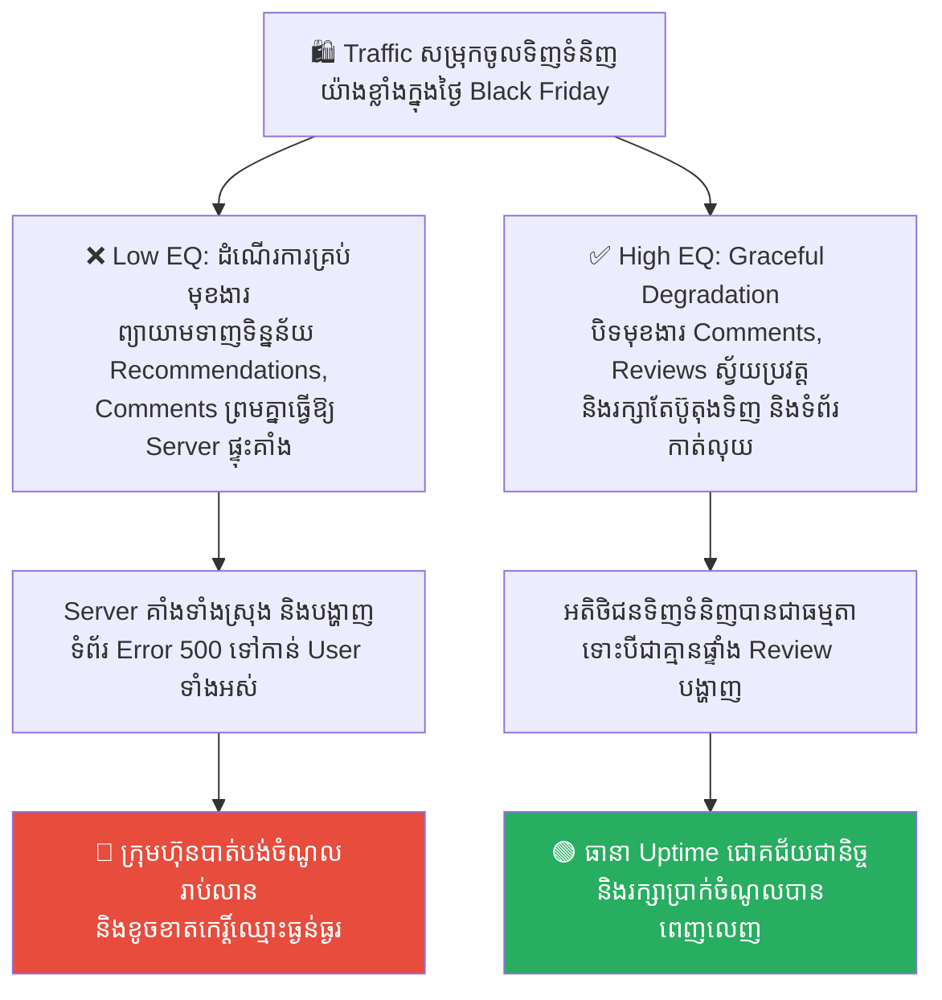
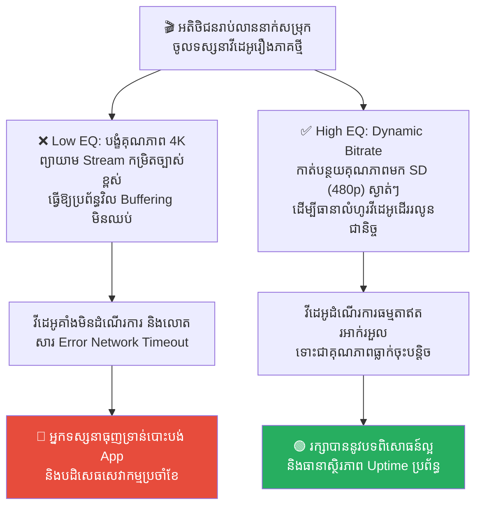
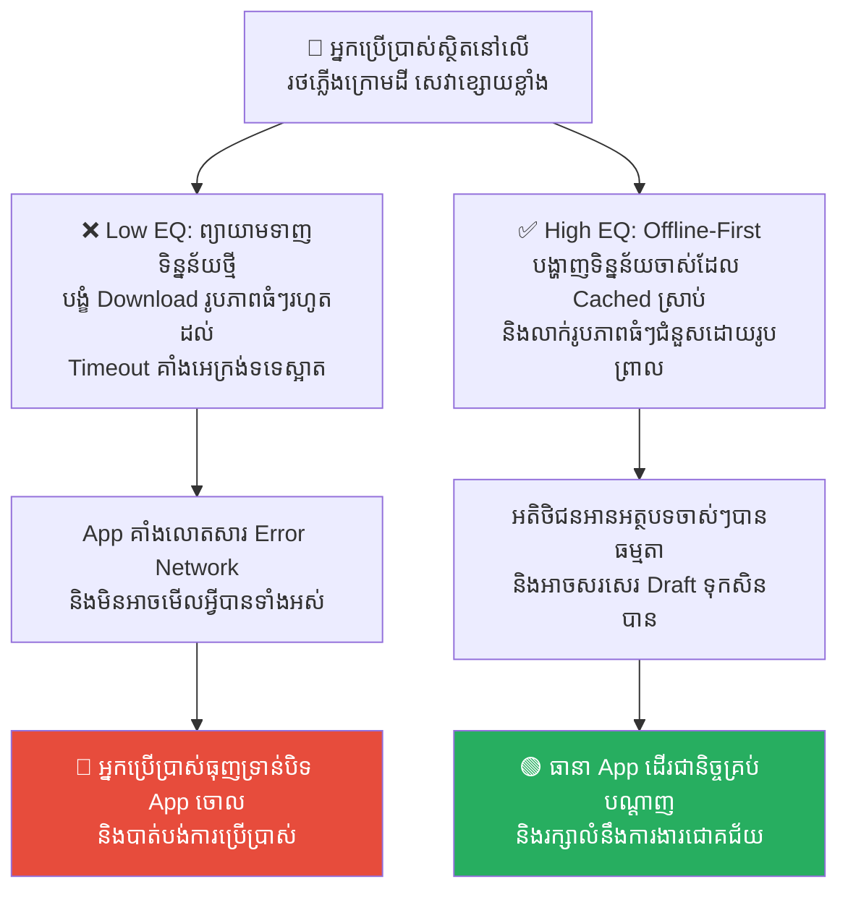
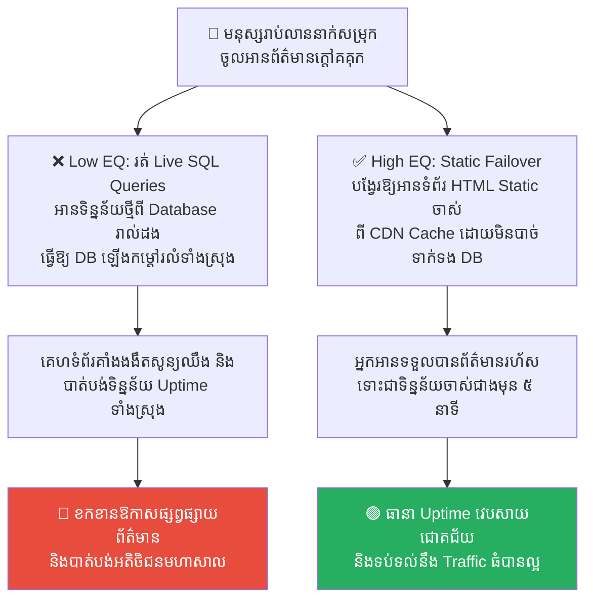
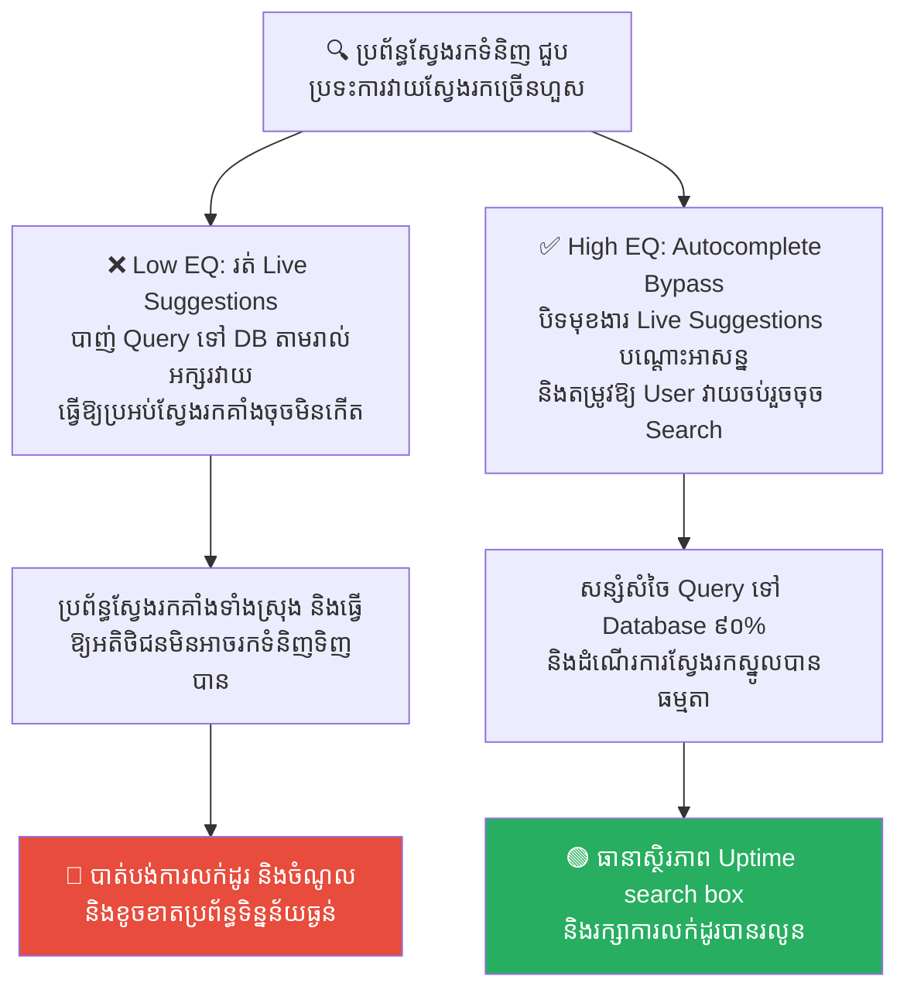

# Apollo 11: Graceful Degradation and System Overload (អាប៉ូឡូ ១១៖ ការបន្ធូរបន្ថយប្រព័ន្ធដោយសុវត្ថិភាព និងការផ្ទុកលើសទម្ងន់)

**Author:** ichamrong  
**Date:** 2026-05-17  
**Tags:** #apollo11 #graceful-degradation #error-handling #system-architecture #resilience  
**Category:** Concepts  
**Read Time:** ~15 min  

---

## 📌 មាតិកា (Table of Contents)
- [លំនាំបញ្ហា (The Pattern)](#លំនាំបញ្ហា-the-pattern)
- [១. បញ្ហា៖ ដែនកំណត់ Uptime ស្ថានភាពពីរ និងការដួលរលំទាំងស្រុង (The Issue: Binary Outage Logic vs. System Resilience)](#១-បញ្ហា-ដែនកំណត់-uptime-ស្ថានភាពពីរ-និងការដួលរលំទាំងស្រុង-the-issue-binary-outage-logic-vs-system-resilience)
- [២. ឧទាហរណ៍ជាក់ស្តែងក្នុងពិភពពិត (Real World Examples)](#២-ឧទាហរណ៍ជាក់ស្តែងក្នុងពិភពពិត)
  - [ឧទាហរណ៍ទី ១ — ការរស់រានក្នុងថ្ងៃមមាញឹកលក់ទំនិញ (High Traffic Spike vs. Automated Feature Degradation)](#ឧទាហរណ៍ទី-១-ការរស់រានក្នុងថ្ងៃមមាញឹកលក់ទំនិញ-high-traffic-spike-vs-automated-feature-degradation)
  - [ឧទាហរណ៍ទី ២ — ប្រព័ន្ធបញ្ជូនវីដេអូទស្សនាអនឡាញ (Maintaining 4K Buffering vs. Dynamic Bitrate Resolution Degradation)](#ឧទាហរណ៍ទី-២-ប្រព័ន្ធបញ្ជូនវីដេអូទស្សនាអនឡាញ-maintaining-4k-buffering-vs-dynamic-bitrate-resolution-degradation)
  - [ឧទាហរណ៍ទី ៣ — ដំណើរការ App លើបណ្តាញអ៊ីនធឺណិតខ្សោយ (Failing Download Timeout vs. Offline-First Cache Fallback)](#ឧទាហរណ៍ទី-៣-ដំណើរការ-app-លើបណ្តាញអ៊ីនធឺណិតខ្សោយ-failing-download-timeout-vs-offline-first-cache-fallback)
  - [ឧទាហរណ៍ទី ៤ — គេហទំព័រព័ត៌មានពេលមានព្រឹត្តិការណ៍ក្តៅគគុក (Live SQL Database Queries vs. Static HTML Page Failover)](#ឧទាហរណ៍ទី-៤-គេហទំព័រព័ត៌មានពេលមានព្រឹត្តិការណ៍ក្តៅគគុក-live-sql-database-queries-vs-static-html-page-failover)
  - [ឧទាហរណ៍ទី ៥ — មុខងារណែនាំពាក្យស្វែងរកស្វ័យប្រវត្ត (Live Autocomplete Search Suggestions vs. Autocomplete Bypass Gateway)](#ឧទាហរណ៍ទី-៥-មុខងារណែនាំពាក្យស្វែងរកស្វ័យប្រវត្ត-live-autocomplete-search-suggestions-vs-autocomplete-bypass-gateway)
- [៣. កត្តាជម្រុញ៖ ការរចនាបែបស្ថានភាពពីរ និងកង្វះការកំណត់អាទិភាព (The Aggravator: Binary System Logic & Lack of Prioritization)](#៣-កត្តាជម្រុញ-ការរចនាបែបស្ថានភាពពីរ-និងកង្វះការកំណត់អាទិភាព-the-aggravator-binary-system-logic-lack-of-prioritization)
- [៤. ដំណោះស្រាយទូទៅ៖ ការកំណត់អាទិភាពការងារ និងការរៀបចំយន្តការបន្ធូរបន្ថយ (The General Solution: Implementing Circuit Breakers & Graceful Degradation)](#៤-ដំណោះស្រាយទូទៅ-ការកំណត់អាទិភាពការងារ-និងការរៀបចំយន្តការបន្ធូរបន្ថយ-the-general-solution-implementing-circuit-breakers-graceful-degradation)
- [សេចក្តីសន្និដ្ឋាន (Conclusion)](#សេចក្តីសន្និដ្ឋាន-conclusion)
- [Related Posts](#related-posts)

---

## លំនាំបញ្ហា (The Pattern)

នៅថ្ងៃទី ២០ ខែកក្កដា ឆ្នាំ ១៩៦៩ ក្នុងកំឡុងពេល ៣ នាទីចុងក្រោយមុនពេលយានអវកាស **អាប៉ូឡូ ១១ (Apollo 11)** ចុះចតលើផ្ទៃព្រះច័ន្ទ កុំព្យូទ័រណែនាំជើងហោះហើរ (Apollo Guidance Computer - AGC) ស្រាប់តែបន្លឺសំឡេងរោទិ៍ក្រហមព្រមានជាបន្តបន្ទាប់នូវកូដកំហុស៖ **«1201»** និង **«1202»**។ 

កូដកំហុសនេះមានន័យថា៖ **«កុំព្យូទ័រដំណើរការលើសទម្ងន់ (System Overload) ១០០% នៃសមត្ថភាពរបស់វា»** ដោយសារតែប្រព័ន្ធរ៉ាដាចុះចតបានបញ្ជូនទិន្នន័យឥតប្រយោជន៍មកច្រើនហួសកំណត់។ ស្ថិតក្រោមស្ថានភាពអាសន្នដែលយានអាចនឹងបុកទង្គិចផ្ទៃព្រះច័ន្ទ ឬត្រូវលុបចោលបេសកកម្មភ្លាមៗ វិស្វករអវកាស NASA បានរក្សាភាពស្ងប់ស្ងាត់ ព្រោះពួកគេដឹងថាប្រព័ន្ធរបស់ពួកគេត្រូវបានរចនាឡើងយ៉ាងឆ្លាតវៃបំផុត។

អ្នកស្រី **Margaret Hamilton** (នាយិកាផ្នែកវិស្វកម្មកម្មវិធីរបស់គម្រោង Apollo) មិនបានរចនាកុំព្យូទ័រឱ្យមានស្ថានភាពតែពីរ គឺ «ដំណើរការ» ឬ «គាំងរលំ» (Crash) នោះឡើយ។ អ្នកស្រីបានសរសេរកូដប្រព័ន្ធប្រតិបត្តិការឱ្យមានសមត្ថភាព **«កំណត់អាទិភាពការងារស្វ័យប្រវត្ត (Asynchronous Executive & Priority Scheduling)»**៖
> 💡 **«នៅពេលប្រព័ន្ធដំណើរការលើសទម្ងន់ កុំព្យូទ័រនឹងធ្វើការបោះបង់ការងារដែលមានអាទិភាពទាបចោលភ្លាមៗ (ដូចជាការបង្ហាញទិន្នន័យរ៉ាដាបន្ទាប់បន្សំនៅលើអេក្រង់) ដើម្បីរក្សាទុកធនធាន CPU ១០០% ទៅដំណើរការតែការងារដែលមានអាទិភាពខ្ពស់បំផុត និងស្លាប់រស់ គឺ៖ ការគ្រប់គ្រងម៉ាស៊ីនរុញច្រាន និងការណែនាំគន្លងចុះចតរបស់អវកាសយានិក។»**

កុំព្យូទ័ររបស់ Apollo 11 មិនបានគាំង ឬបង្ហាញ Blue Screen ឡើយ។ វាបានដំណើរការបេសកកម្មចុះចតបានយ៉ាងរលូន និងមានសុវត្ថិភាពបំផុត ទោះបីជាស្ថិតក្រោមស្ថានភាពលើសទម្ងន់ធ្ងន់ធ្ងរក៏ដោយ។

នៅក្នុងការរចនាប្រព័ន្ធបច្ចេកវិទ្យា (System Architecture) គោលការណ៍នេះត្រូវបានគេស្គាល់ថាជា **Graceful Degradation (ការបន្ធូរបន្ថយប្រព័ន្ធដោយសុវត្ថិភាព)**៖
*   ជំនួសឱ្យការឱ្យប្រព័ន្ធទាំងមូលគាំងទាំងស្រុង (Outage) នៅពេលមាន Traffic សម្រុកចូលមកខ្លាំង។
*   ប្រព័ន្ធត្រូវចេះបិទមុខងារបន្ទាប់បន្សំចោលជាបណ្តោះអាសន្ន ដើម្បីរក្សាការពារមុខងារស្នូល (Core features) ឱ្យដំណើរការធម្មតា។

---

## ១. បញ្ហា៖ ដែនកំណត់ Uptime ស្ថានភាពពីរ និងការដួលរលំទាំងស្រុង (The Issue: Binary Outage Logic vs. System Resilience)

នៅក្នុងវិស័យវិស្វកម្ម វិស្វករភាគច្រើនរចនាប្រព័ន្ធការងារដោយផ្អែកលើការគិតបែបស្ថានភាពពីរ (Binary Logic) គឺ៖ **«ដំណើរការ ១០០% (UP)»** ឬ **«គាំងទាំងស្រុង (DOWN)»**។

នៅពេលដែលក្រុមហ៊ុនជួបប្រទះ៖
*   ការសម្រុកចូលទស្សនាភ្លាមៗ (Traffic Spikes ក្នុងថ្ងៃផ្សព្វផ្សាយពាណិជ្ជកម្ម)។
*   Database ចាប់ផ្តើមដំណើរការយឺត ឬបណ្តាញ Network ជួបបញ្ហារាំងស្ទះ។

ប្រព័ន្ធដែលខ្វះសមត្ថភាព **Graceful Degradation** នឹងព្យាយាមដំណើរការរាល់មុខងារទាំងអស់ (រាប់ទាំងការងារតូចតាចដូចជា comments, reviews, recommended items) រហូតដល់ម៉ាស៊ីន Servers ផ្ទុកលើសទម្ងន់ គាំងទាំងស្រុង និងបង្ហាញទំព័រ **Error 500 (Internal Server Error)** ទៅកាន់អតិថិជនទាំងអស់។ នេះគឺជារូបមន្តបំផ្លាញប្រាក់ចំណូល និងកេរ្តិ៍ឈ្មោះអាជីវកម្មមហាសាល។

---

## ២. ឧទាហរណ៍ជាក់ស្តែងក្នុងពិភពពិត

សូមពិនិត្យមើល **ឧទាហរណ៍ជាក់ស្តែងចំនួន ៥** បង្ហាញពីការរៀបចំប្រព័ន្ធឱ្យមានភាពធន់តាមគោលការណ៍ Graceful Degradation៖

---

### ឧទាហរណ៍ទី ១ — ការរស់រានក្នុងថ្ងៃមមាញឹកលក់ទំនិញ (High Traffic Spike vs. Automated Feature Degradation)

**ស្ថានភាព៖** គេហទំព័រ E-commerce ជួបប្រទះការសម្រុកចូល (Traffic Spike) ខ្លាំងក្នុងថ្ងៃ Black Friday ធ្វើឱ្យ CPU ម៉ាស៊ីនឡើងដល់ ៩៥%។

*   **សកម្មភាពអសកម្ម / Low EQ / កំហុសឆ្គង (ការគាំងរលំទាំងស្រុង)៖** ប្រព័ន្ធព្យាយាមដំណើរការរាល់មុខងារទាំងអស់ ( recommendations, comments, profile images, and checkout) ធ្វើឱ្យ Server ផ្ទុកលើសទម្ងន់ គាំងទាំងស្រុង និងបង្ហាញទំព័រ Error 500 ទៅកាន់អតិថិជនទាំងអស់។
*   **សកម្មភាពស្ថាបនា / High EQ / ដំណោះស្រាយ (ការបន្ធូរបន្ថយប្រព័ន្ធដោយសុវត្ថិភាព)៖** អនុវត្ត **Automated Feature Degradation (Circuit Breaker activation)**។ នៅពេល CPU ឡើងហួស ៩០% ប្រព័ន្ធធ្វើការបិទមុខងារ Recommend ផលិតផល, លាក់ផ្ទាំង Review, និងលាក់រូបភាព Profile របស់អ្នកប្រើប្រាស់ជាបណ្តោះអាសន្ន ដើម្បីយកធនធាន CPU/DB ទៅទ្រទ្រង់មុខងាររទេះទិញទំនិញ និងទំព័រទូទាត់លុយ (Checkout) ឱ្យដំណើរការធម្មតា។
*   **លទ្ធផល៖** ការមិនបិទមុខងារនាំឱ្យប្រព័ន្ធរលំទាំងស្រុង និងបាត់បង់ការលក់ដូរ។ ការប្រើ Graceful Degradation ជួយឱ្យក្រុមហ៊ុននៅតែអាចរកចំណូលបានរាប់លានដុល្លារ ទោះជាប្រព័ន្ធមមាញឹកខ្លាំងក៏ដោយ។

---

### ឧទាហរណ៍ទី ២ — ប្រព័ន្ធបញ្ជូនវីដេអូទស្សនាអនឡាញ (Maintaining 4K Buffering vs. Dynamic Bitrate Resolution Degradation)

**ស្ថានភាព៖** អតិថិជនរាប់លាននាក់សម្រុកចូលមើលរឿងភាគដែលទើបតែចេញថ្មី ធ្វើឱ្យប្រព័ន្ធចែកចាយវីដេអូ (CDN/Server) ជួបបញ្ហាកំហុសបណ្តាញ និងថាមពលខ្សោយ។

*   **សកម្មភាពអសកម្ម / Low EQ / កំហុសឆ្គង (ការគាំងរលំទាំងស្រុង)៖** កម្មវិធីព្យាយាមរក្សាគុណភាពវីដេអូកម្រិត 4K Ultra HD ឱ្យខាងតែបាន ធ្វើឱ្យវីដេអូត្រូវវិល (Buffering) មិនឈប់ ឬគាំងបង្ហាញសារ Error មិនអាចមើលបាន។
*   **សកម្មភាពស្ថាបនា / High EQ / ដំណោះស្រាយ (ការបន្ធូរបន្ថយប្រព័ន្ធដោយសុវត្ថិភាព)៖** អនុវត្ត **Dynamic Bitrate Adaptive Streaming (ដូចជា Netflix/YouTube)**។ កាត់បន្ថយគុណភាពវីដេអូស្វ័យប្រវត្តមកកម្រិត SD (480p) ដើម្បីកាត់បន្ថយទំហំបញ្ជូនទិន្នន័យ (Bandwidth) ធានាថាអ្នកទស្សនានៅតែអាចមើលវីដេអូបានបន្តដោយគ្មានការរអាក់រអួល។
*   **លទ្ធផល៖** ការគាំងវីដេអូធ្វើឱ្យអ្នកមើលខឹងសម្បារ និងបោះបង់ចោលកម្មវិធី។ ការកាត់បន្ថយគុណភាពស្វ័យប្រវត្ត ជួយឱ្យការទស្សនាប្រព្រឹត្តទៅបានធម្មតា ទោះជាគុណភាពធ្លាក់ចុះបន្តិចបន្តួចក៏ដោយ។

---

### ឧទាហរណ៍ទី ៣ — ដំណើរការ App លើបណ្តាញអ៊ីនធឺណិតខ្សោយ (Failing Download Timeout vs. Offline-First Cache Fallback)

**ស្ថានភាព៖** អ្នកប្រើប្រាស់ស្ថិតនៅលើរថភ្លើងក្រោមដីដែលមានសេវាអ៊ីនធឺណិតខ្សោយខ្លាំង (Edge/3G)។

*   **សកម្មភាពអសកម្ម / Low EQ / កំហុសឆ្គង (ការគាំងរលំទាំងស្រុង)៖** App ព្យាយាមទាញយកព័ត៌មានថ្មី រូបភាពកម្រិតច្បាស់ និងវីដេអូទាំងអស់មកបង្ហាញ ធ្វើឱ្យប្រព័ន្ធ Timeout និងបង្ហាញទំព័រទទេស្អាត (Blank screen with Network Error)។
*   **សកម្មភាពស្ថាបនា / High EQ / ដំណោះស្រាយ (ការបន្ធូរបន្ថយប្រព័ន្ធដោយសុវត្ថិភាព)៖** អនុវត្ត **Offline-First & Local Cache Fallback**។ បង្ហាញព័ត៌មាន និងអត្ថបទដែលបានរក្សាទុកកាលពីមុន (Cached Posts) ឱ្យ User អានជាបណ្តោះអាសន្ន និងលាក់រាល់រូបភាពធំៗ ឬវីដេអូ ឬជំនួសដោយរូបភាពព្រាលៗ (Blurred Placeholders)។
*   **លទ្ធផល៖** App គាំងធ្វើឱ្យ User ធុញទ្រាន់ និងបិទ App ចោល។ ការបង្ហាញ cached posts ជួយឱ្យ User នៅតែមានសកម្មភាពអាន និងកាត់បន្ថយអារម្មណ៍ធុញទ្រាន់។

---

### ឧទាហរណ៍ទី ៤ — គេហទំព័រព័ត៌មានពេលមានព្រឹត្តិការណ៍ក្តៅគគុក (Live SQL Database Queries vs. Static HTML Page Failover)

**ស្ថានភាព៖** មានព្រឹត្តិការណ៍ក្តៅគគុកកើតឡើង ធ្វើឱ្យមនុស្សរាប់លាននាក់សម្រុកចូលមកអានព័ត៌មានលើគេហទំព័រក្នុងពេលព្រមគ្នា។

*   **សកម្មភាពអសកម្ម / Low EQ / កំហុសឆ្គង (ការគាំងរលំទាំងស្រុង)៖** ប្រព័ន្ធព្យាយាមរត់ SQL queries ទៅកាន់ Database រាល់ពេលមាន User ថ្មីម្នាក់ចុចចូលអាន ដើម្បីបង្ហាញព័ត៌មានថ្មីបំផុត និងព័ត៌មានពាក់ព័ន្ធ ធ្វើឱ្យ Database ផ្ទុះគាំងទាំងស្រុង។
*   **សកម្មភាពស្ថាបនា / High EQ / ដំណោះស្រាយ (ការបន្ធូរបន្ថយប្រព័ន្ធដោយសុវត្ថិភាព)៖** អនុវត្ត **Static Page Failover (Stale-While-Revalidate)**។ នៅពេល Database ចាប់ផ្តើមមមាញឹកខ្លាំង គំរូប្រព័ន្ធនឹងប្តូរទៅបង្ហាញទំព័រ HTML ឋិតិវន្ត (Static Pages) ដែលបានរក្សាទុកក្នុង CDN cache ជាបណ្តោះអាសន្ន ទោះជាទិន្នន័យចាស់ជាងមុន ៥ នាទីក៏ដោយ ដោយមិនចាំបាច់ទាក់ទងទៅ Database ឡើយ។
*   **លទ្ធផល៖** ការរលំ Database ធ្វើឱ្យគេហទំព័រងងឹតសូន្យឈឹង និងបាត់បង់ឱកាសព័ត៌មាន។ ការបង្ហាញ static page ធានាការអានព័ត៌មានរបស់មហាជនដំណើរការជាធម្មតា។

---

### ឧទាហរណ៍ទី ៥ — មុខងារណែនាំពាក្យស្វែងរកស្វ័យប្រវត្ត (Live Autocomplete Search Suggestions vs. Autocomplete Bypass Gateway)

**ស្ថានភាព៖** ប្រព័ន្ធស្វែងរកទំនិញ (Search Box) ជួបប្រទះការស្វែងរកច្រើនលើសលប់នៅម៉ោងផ្សព្វផ្សាយពាណិជ្ជកម្ម។

*   **សកម្មភាពអសកម្ម / Low EQ / កំហុសឆ្គង (ការគាំងរលំទាំងស្រុង)៖** App ព្យាយាមរត់មុខងារណែនាំពាក្យស្វែងរកស្វ័យប្រវត្ត (Live Autocomplete suggestions) ទៅកាន់ Server រាល់ពេល User វាយអក្សរមួយតួៗ ធ្វើឱ្យ Server ស្វែងរកគាំងទាំងស្រុង និងធ្វើឱ្យប្រអប់ស្វែងរកចម្បងចុចមិនកើត។
*   **សកម្មភាពស្ថាបនា / High EQ / ដំណោះស្រាយ (ការបន្ធូរបន្ថយប្រព័ន្ធដោយសុវត្ថិភាព)៖** អនុវត្ត **Graceful Bypass of Autocomplete**។ បើរកឃើញ Server មមាញឹកខ្លាំង (Latency ខ្ពស់) មុខងារ Autocomplete suggestions នឹងត្រូវបិទចោលស្វ័យប្រវត្តិ (Disabled)។ អ្នកប្រើប្រាស់ត្រូវសរសេរពាក្យស្វែងរកឱ្យចប់ រួចចុចប៊ូតុង `[ស្វែងរក]` ទើបផ្ញើសំណើទៅ Server តែម្តងគត់។
*   **លទ្ធផល៖** ការគាំងប្រព័ន្ធស្វែងរកធ្វើឱ្យអតិថិជនមិនអាចរកទំនិញទិញបានសោះ។ ការបិទ autocomplete បណ្តោះអាសន្នជួយសន្សំសំចៃសំណើទៅ Server រាប់លានដង និងរក្សាស្ថិរភាពការស្វែងរកស្នូលបានជោគជ័យ។

---

## ៣. កត្តាជម្រុញ៖ ការរចនាបែបស្ថានភាពពីរ និងកង្វះការកំណត់អាទិភាព (The Aggravator: Binary System Logic & Lack of Prioritization)

ហេតុអ្វីបានជាវិស្វករងាយនឹងមើលរំលង និងមិនព្រមរចនាប្រព័ន្ធបែប Graceful Degradation? កត្តាជម្រុញរួមមាន៖

1.  **ការគិតបែបស្ថានភាពពីរ (Binary Thinking Bias)៖** ផ្នត់គំនិតដែលយល់ថា៖ *«ប្រព័ន្ធត្រូវតែដំណើរការល្អឥតខ្ចោះគ្រប់មុខងារ ឬត្រូវតែបិទចោលទាំងស្រុង»* ដោយមិនធ្លាប់គិតពីស្ថានភាពកម្រិតមធ្យម (Partial Uptime)។
2.  ** កង្វះការកំណត់អាទិភាពមុខងារ (Lack of Feature Prioritization)៖** ក្រុមការងារមិនបានបែងចែកឱ្យច្បាស់លាស់រវាង «មុខងារស្លាប់រស់ (Critical)» និង «មុខងារបន្ទាប់បន្សំ (Non-Critical)» ឡើយ។ ពួកគេចាត់ទុកគ្រប់មុខងារទាំងអស់ស្មើៗគ្នា។
3.  **ភាពស្មុគស្មាញនៃការរចនាកូដ (Implementation Complexity)៖** ការសរសេរកូដឱ្យចេះបត់បែន និងបិទមុខងារខ្លះដោយស្វ័យប្រវត្តិ (Circuit Breakers, Fallbacks) ត្រូវការការរចនាស្ថាបត្យកម្មកូដដ៏ហ្មត់ចត់ និងការចំណាយពេលវេលាច្រើនហួសហេតុ។

---

## ៤. ដំណោះស្រាយទូទៅ៖ ការកំណត់អាទិភាពការងារ និងការរៀបចំយន្តការបន្ធូរបន្ថយ (The General Solution: Implementing Circuit Breakers & Graceful Degradation)

ដើម្បីកសាងប្រព័ន្ធការងារដែលមានភាពធន់ និងរស់រានមានជីវិតបាន ទោះស្ថិតក្រោមស្ថានភាពមមាញឹកខ្លាំង ស្របតាមកុំព្យូទ័ររបស់យានអាប៉ូឡូ ១១ ចូរអនុវត្តជំហានដូចខាងក្រោម៖

1.  ** ធ្វើសវនកម្មបែងចែកអាទិភាពមុខងារ (Feature Triage)៖**
    *   *Tier 1 (Critical - ហាមរលំ):* មុខងារស្នូលដែលបង្កើតប្រាក់ចំណូល ឬជាបេះដូងរបស់ App (ដូចជា Payment, Checkout, Core Search)។
    *   *Tier 2 (Important - អាចរំលងបានខ្លះ):* មុខងារមានតម្លៃ តែអាចអាក់ខានបានបណ្តោះអាសន្ន (ដូចជា Comments, Reviews, User Profiles)។
    *   *Tier 3 (Non-Critical - បិទភ្លាមបើមមាញឹក):* មុខងារបន្ទាប់បន្សំដែលស៊ីធនធានច្រើន (ដូចជា Auto-suggestions, Product recommendations, Real-time trackers)។
2.  ** ប្រើប្រាស់ឧបករណ៍ Circuit Breakers ស្វ័យប្រវត្ត (ដូចជា Resilience4j/Hystrix)៖** រៀបចំឱ្យប្រព័ន្ធចេះកាត់ផ្តាច់ (Open Circuit) មុខងារ Tier 3 ស្វ័យប្រវត្តិ នៅពេលរកឃើញ Latency ឬ CPU usage ឡើងខ្ពស់ហួសកំណត់ និងប្តូរទៅប្រើប្រាស់ Fallback data (ទិន្នន័យចាស់ ឬទិន្នន័យលំនាំដើម) ជំនួសវិញ។
3.  ** អនុវត្តយុទ្ធសាស្ត្រ Caching ឱ្យបានត្រឹមត្រូវ (Stale-While-Revalidate)៖** ធានាថាប្រព័ន្ធមាន cached data សម្រាប់រាល់មុខងារអានព័ត៌មាន ដើម្បីឱ្យយើងអាចបង្ហាញទិន្នន័យចាស់ (Stale) ទៅកាន់ User ជាជាងការបង្ហាញទំព័រ Error ពេល Database គាំង។
4.  ** ធ្វើការតេស្តសង្កត់ និងហាត់សមបិទមុខងារ (Degradation Drills)៖** ធ្វើការតេស្តសាកល្បងសង្កត់ (Load Test) និងបិទមុខងារ Tier 2/3 ដោយចេតនា ដើម្បីធានាថាកូដរបស់កម្មវិធីដំណើរការ Fallback បានរលូន និងមិនរអាក់រអួលដល់មុខងារស្នូលឡើយ។

---

## សេចក្តីសន្និដ្ឋាន (Conclusion)

**យានអាប៉ូឡូ ១១ និងការបន្ធូរបន្ថយប្រព័ន្ធដោយសុវត្ថិភាព (Graceful Degradation)** បង្រៀនយើងថា ស្ថិរភាពប្រព័ន្ធពិតប្រាកដមិនមែនជាការសន្យាថាប្រព័ន្ធនឹងដំណើរការល្អឥតខ្ចោះ ១០០% គ្រប់មុខងារជានិច្ចនោះឡើយ។ ភាពធន់ពិតប្រាកដ គឺកើតឡើងចេញពី **«សមត្ថភាពរបស់ប្រព័ន្ធក្នុងការកំណត់អាទិភាពការងារច្បាស់លាស់ ចេះបន្ទាបខ្លួន និងបោះបង់ចោលនូវអ្វីដែលមិនចាំបាច់ជាបណ្តោះអាសន្ន ដើម្បីរក្សាការពារ និងសង្គ្រោះមុខងារស្នូលដែលស្លាប់រស់ឱ្យដំណើរការបានជោគជ័យ ទោះបីជាស្ថិតក្រោមសម្ពាធ និងការផ្ទុកលើសទម្ងន់ធ្ងន់ធ្ងរកម្រិតណាក៏ដោយ»** LCD។

ចងចាំជានិច្ចថា៖ **«ចូរបោះបង់ការងារអាទិភាពទាបចោលភ្លាម ដើម្បីរក្សាស្ថិរភាពការចុះចតរបស់យានអវកាសរបស់អ្នក។»**

---

## Related Posts

*   **[38 Apollo 13: Incident Response and Blameless Post-Mortems](./38-apollo-13-and-incident-response.md)** — របៀបដោះស្រាយវិបត្តិប្រព័ន្ធដោយគ្មានការភ័យស្លន់ស្លោ និងការគ្រប់គ្រងការងារក្រុមច្បាស់លាស់។
*   **[19 The Domino Effect and Systemic Failures](./19-the-domino-effect-and-systemic-failures.md)** — របៀបដែលការធ្វេសប្រហែសមួយចំណុច អាចបង្កជាការដួលរលំប្រព័ន្ធការងារទាំងស្រុងជាសង្វាក់។

---

*Last updated: 2026-05-26*
