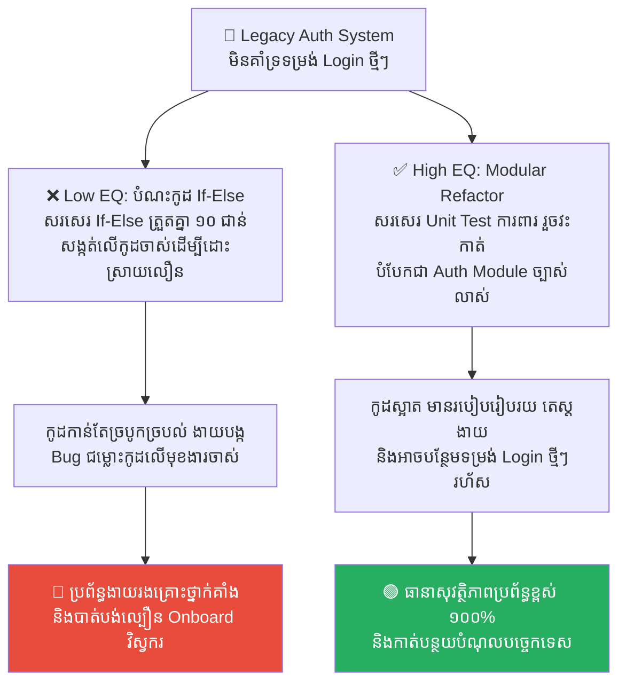
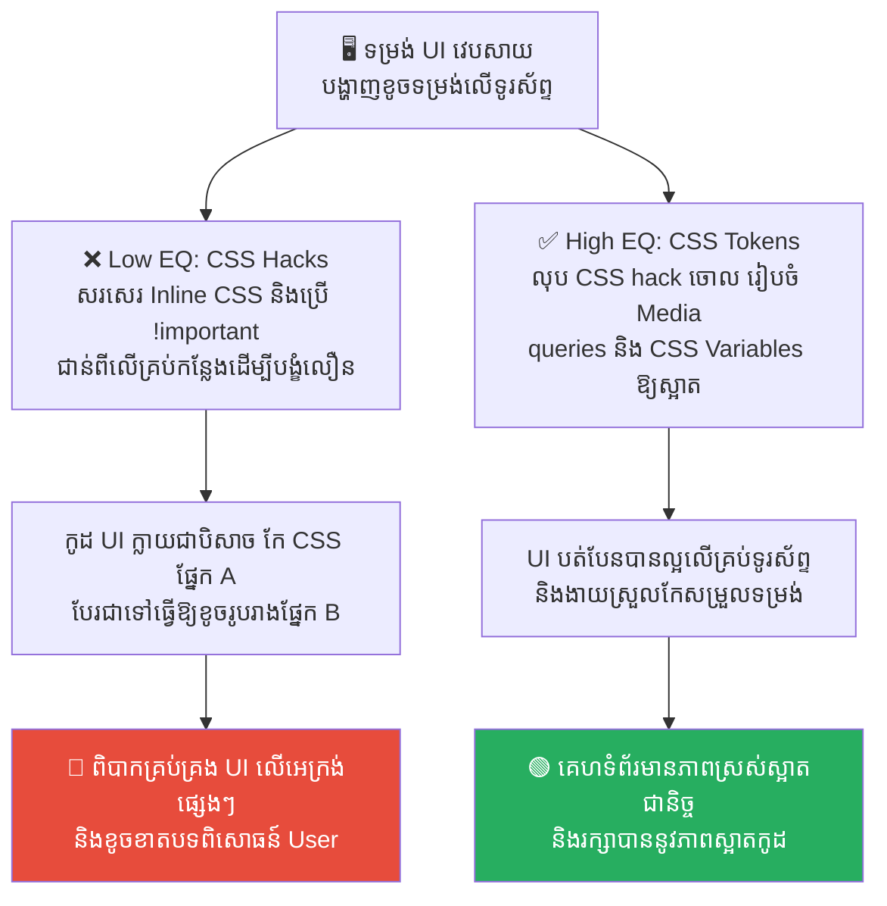
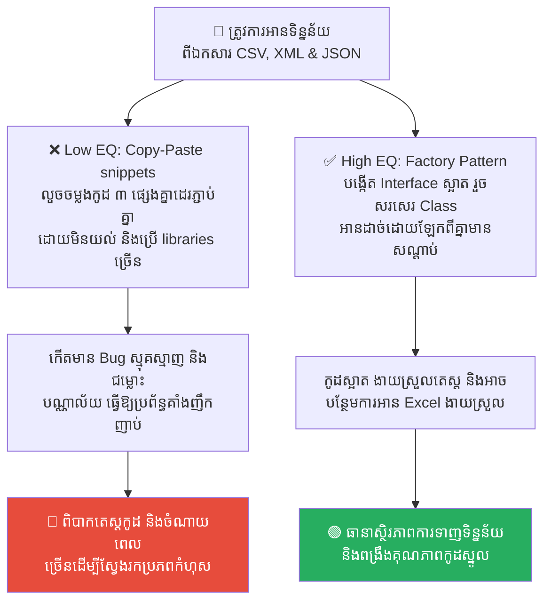
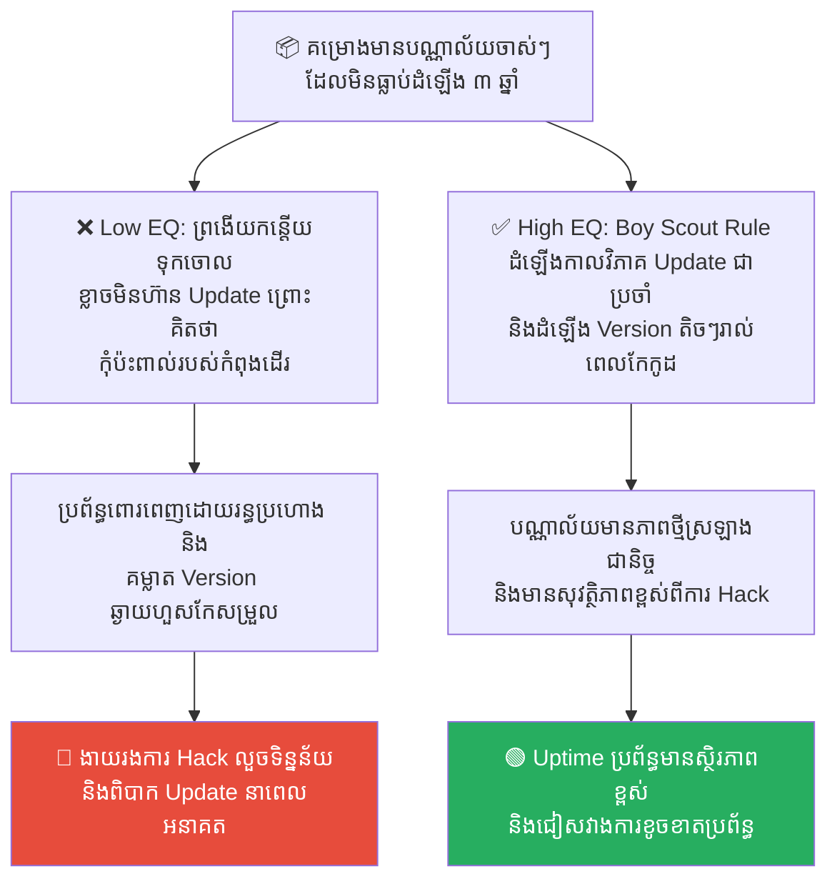
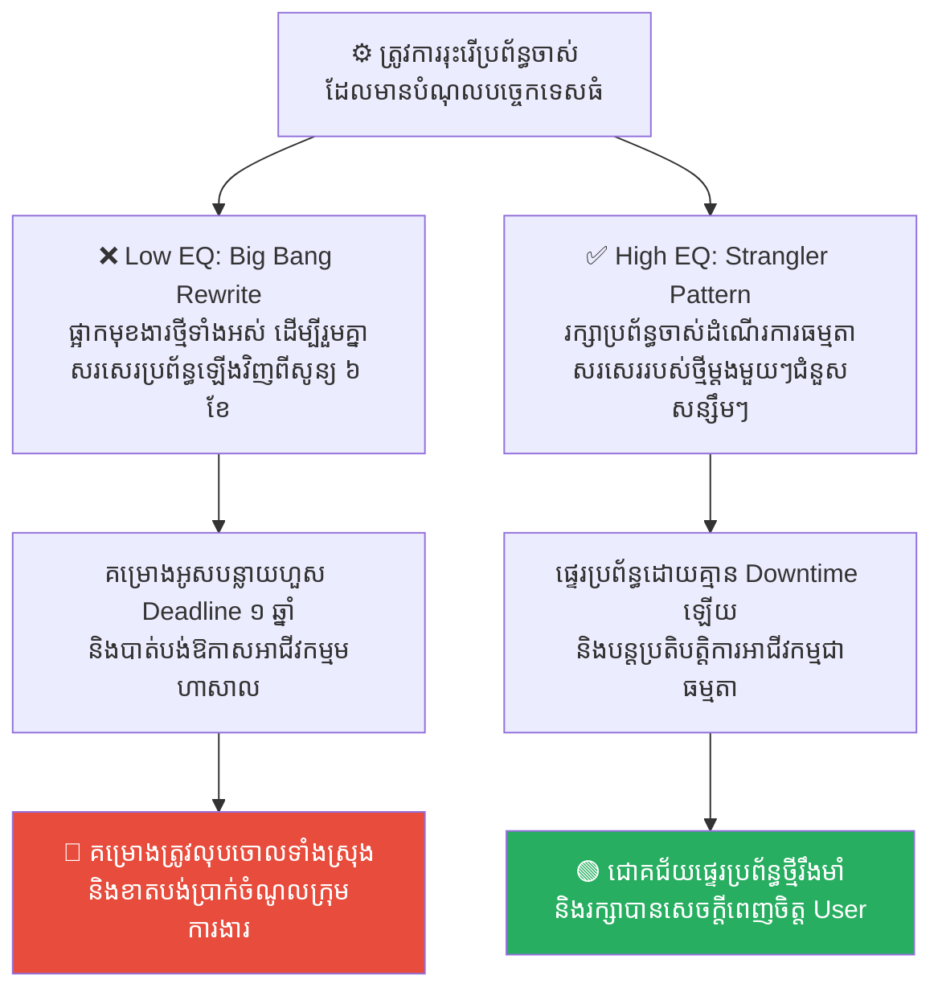

# Frankenstein: Legacy Code and the Monster of Tech Debt (បិសាចហ្វ្រែងខេនស្តែន៖ កូដចាស់ៗ និងបិសាចនៃបំណុលបច្គេកទេស)

**Author:** ichamrong  
**Date:** 2026-05-17  
**Tags:** #frankenstein #legacy-code #tech-debt #spaghetti-code #refactoring  
**Category:** Concepts  
**Read Time:** ~15 min  

---

## 📌 មាតិកា (Table of Contents)
- [លំនាំបញ្ហា (The Pattern)](#លំនាំបញ្ហា-the-pattern)
- [១. បញ្ហា៖ ការដេរភ្ជាប់កូដស្លាប់ និងការបង្កើតបិសាចបំណុលបច្ចេកទេស (The Issue: Stitching Dead Code & The Birth of Tech Debt Monsters)](#១-បញ្ហា-ការដេរភ្ជាប់កូដស្លាប់-និងការបង្កើតបិសាចបំណុលបច្ចេកទេស-the-issue-stitching-dead-code-the-birth-of-tech-debt-monsters)
- [២. ឧទាហរណ៍ជាក់ស្តែងក្នុងពិភពពិត (Real World Examples)](#២-ឧទាហរណ៍ជាក់ស្តែងក្នុងពិភពពិត)
  - [ឧទាហរណ៍ទី ១ — ការកែសម្រួលប្រព័ន្ធចុះឈ្មោះចាស់ (Quick If-Else Patches vs. Modular Refactoring with Test Coverage)](#ឧទាហរណ៍ទី-១-ការកែសម្រួលប្រព័ន្ធចុះឈ្មោះចាស់-quick-if-else-patches-vs-modular-refactoring-with-test-coverage)
  - [ឧទាហរណ៍ទី ២ — ការជួសជុលទម្រង់ UI លើទូរស័ព្ទ (Ad-Hoc CSS & !important Hacks vs. Component Token System)](#ឧទាហរណ៍ទី-២-ការជួសជុលទម្រង់-ui-លើទូរស័ព្ទ-ad-hoc-css-important-hacks-vs-component-token-system)
  - [ឧទាហរណ៍ទី ៣ — ការអានឯកសារទិន្នន័យច្រើនប្រភេទ (Copy-Pasting StackOverflow Snippets vs. Factory Pattern & Unified Abstraction)](#ឧទាហរណ៍ទី-៣-ការអានឯកសារទិន្នន័យច្រើនប្រភេទ-copy-pasting-stackoverflow-snippets-vs-factory-pattern-unified-abstraction)
  - [ឧទាហរណ៍ទី ៤ — ការថែទាំបណ្ណាល័យចាស់ៗក្នុងគម្រោង (Neglecting Dependencies for Years vs. Boy Scout Rule & Regular Upgrades)](#ឧទាហរណ៍ទី-៤-ការថែទាំបណ្ណាល័យចាស់ៗក្នុងគម្រោង-neglecting-dependencies-for-years-vs-boy-scout-rule-regular-upgrades)
  - [ឧទាហរណ៍ទី ៥ — ការរុះរើប្រព័ន្ធចាស់ Monolith ទាំងមូល (Big Bang Software Rewrite vs. Strangler Fig Pattern Migration)](#ឧទាហរណ៍ទី-៥-ការរុះរើប្រព័ន្ធចាស់-monolith-ទាំងមូល-big-bang-software-rewrite-vs-strangler-fig-pattern-migration)
- [៣. កត្តាជម្រុញ៖ ការចង់បានតែលឿន និងការរត់គេចពីការវះកាត់កូដ (The Aggravator: Quick-Fix Pressure & Refactoring Phobia)](#៣-កត្តាជម្រុញ-ការចង់បានតែលឿន-និងការរត់គេចពីការវះកាត់កូដ-the-aggravator-quick-fix-pressure-refactoring-phobia)
- [៤. ដំណោះស្រាយទូទៅ៖ របៀបគ្រប់គ្រង និងកាត់បន្ថយបំណុលបច្ចេកទេស (The General Solution: Managing Technical Debt & Systematic Refactoring)](#៤-ដំណោះស្រាយទូទៅ-របៀបគ្រប់គ្រង-និងកាត់បន្ថយបំណុលបច្ចេកទេស-the-general-solution-managing-technical-debt-systematic-refactoring)
- [សេចក្តីសន្និដ្ឋាន (Conclusion)](#សេចក្តីសន្និដ្ឋាន-conclusion)
- [Related Posts](#related-posts)

---

## លំនាំបញ្ហា (The Pattern)

នៅក្នុងប្រលោមលោកបែបវិទ្យាសាស្ត្រដ៏ល្បីល្បាញរបស់ Mary Shelley វេជ្ជបណ្ឌិតវ័យក្មេងម្នាក់ឈ្មោះ **Victor Frankenstein** មានមហិច្ឆតាចង់យកឈ្នះលើសេចក្តីស្លាប់ និងបង្កើតជីវិតថ្មីមួយឡើង។ ដើម្បីសម្រេចការងារនេះ គាត់បានធ្វើសកម្មភាពដ៏គួរឱ្យរន្ធត់មួយគឺ៖ **«ដើរប្រមូលបំណែកសាកសព (កោសិកាងាប់) ពីទីបញ្ចុះសពផ្សេងៗ យកមកដេរភ្ជាប់គ្នា រួចចម្លងចរន្តអគ្គិសនីដើម្បីបង្កើតជាសត្វចម្លែកមួយមានជីវិត»**។

ដំបូងឡើយ ហ្វ្រែងខេនស្តែនមានមោទនភាពខ្លាំងណាស់ ព្រោះសត្វចម្លែកនោះអាចធ្វើចលនា និងដើរបាន។ ប៉ុន្តែ មិនយូរប៉ុន្មាន គាត់បានដឹងខ្លួនថា របស់ដែលគាត់បានបង្កើតឡើង គឺជា **«បិសាចដ៏គួរឱ្យខ្លាចខ្លាំងបំផុត (Frankenstein's Monster)»** ដែលមិនអាចគ្រប់គ្រងបានឡើយ។ បិសាចនោះមានចិត្តកាចសាហាវ និងបានត្រឡប់មកបំផ្លាញជីវិត មិត្តភក្តិ ព្រមទាំងសម្លាប់វេជ្ជបណ្ឌិត Victor Frankenstein ដែលជាអ្នកបង្កើតវាផ្ទាល់ជានិរន្តរ៍។

នៅក្នុងពិភពវិស្វកម្មប្រព័ន្ធបច្ចេកវិទ្យា (Software Engineering) ពាក្យដែលគួរឱ្យខ្លាចបំផុតសម្រាប់វិស្វករ មិនមែនជាពាក្យ «Hacker» ឬ «Server Down» នោះឡើយ ប៉ុន្តែវាគឺជាពាក្យ **«Legacy Code (កូដចាស់ៗដែលបន្សល់ទុក)»** ដែលត្រូវបានគេហៅផងដែរថា **Frankenstein Code** ឬ **Spaghetti Code**៖
*   កូដដែលត្រូវបានសាងសង់ឡើងដោយការ **«ដេរភ្ជាប់»** គ្នានៃបំណែកកូដជាច្រើនដែលចម្លងពី Stack Overflow, Plugins ចាស់ៗ និងការសរសេរកូដកែប៉ះបណ្តោះអាសន្ន (Bypasses)។
*   បិសាចដែលបង្កើតឡើងដោយដៃរបស់អ្នកផ្ទាល់ ហើយនៅថ្ងៃណាមួយ វានឹងត្រឡប់មកចងរឹត និងបំផ្លាញល្បឿន ផលិតភាព ព្រមទាំងអាជីវកម្មរបស់ក្រុមហ៊ុនអ្នកទាំងស្រុង។

---

## ១. បញ្ហា៖ ការដេរភ្ជាប់កូដស្លាប់ និងការបង្កើតបិសាចបំណុលបច្ចេកទេស (The Issue: Stitching Dead Code & The Birth of Tech Debt Monsters)

បាតុភូត **Frankenstein Code** កើតឡើងនៅពេលដែលវិស្វករ និងថ្នាក់ដឹកនាំចង់បានតែល្បឿនលឿនរយៈពេលខ្លី (Quick Fixes)។ ជំនួសឱ្យការចំណាយពេលរៀបចំរចនាសម្ព័ន្ធត្រឹមត្រូវ (Refactoring) ពួកគេបានជ្រើសរើសផ្លូវកាត់៖
*   ចម្លងកូដគំរូ (Copy-Paste) ពីអ៊ីនធឺណិតមកប្រើដោយខ្វះការយល់ដឹង។
*   សរសេរកូដ «If-Else» ត្រួតគ្នា ១០ ជាន់ ដើម្បីដោះស្រាយកំហុស (Bugs) មួយពេលៗ។
*   ដេរភ្ជាប់បណ្ណាល័យចាស់ៗជាច្រើនចូលគ្នា ដោយគ្មានរបៀបរៀបរយ។

នៅពេលប្រព័ន្ធការងារនេះដំណើរការបាន ៣ ទៅ ៥ ឆ្នាំ វានឹងប្រែក្លាយទៅជា **បំណុលបច្ចេកទេស (Technical Debt)** ដ៏ធំសម្បើម៖
1.  **លែងអាចគ្រប់គ្រងបាន (Spaghetti Dependencies)៖** កូដរាយប៉ាយជំពាក់ជំពិនគ្នាដូចសំបុកពីងពាង។ នៅពេលវិស្វករព្យាយាមកែមុខងារតូចមួយ (ដូចជា ដូរប៊ូតុងពណ៌ក្រហម) វាបែរជាទៅធ្វើឱ្យមុខងារទូទាត់ប្រាក់ (Payment Gateway) គាំងទៅវិញ។
2.  ** ភាពភ័យខ្លាចការផ្លាស់ប្តូរ (Refactoring Phobia)៖** វិស្វករថ្មីៗមានអារម្មណ៍ភ័យខ្លាចខ្លាំង មិនហ៊ានប៉ះពាល់កូដចាស់ៗឡើយ ព្រោះខ្លាចវាគាំងរលំ។ ចុងក្រោយ ក្រុមហ៊ុនត្រូវបង្ខំចិត្តចំណាយលុយរាប់លានដុល្លារដើម្បីសរសេរប្រព័ន្ធឡើងវិញពីចំណុចសូន្យ (Rewrite) ឬក៏វិស្វករទាំងអស់លាឈប់ដោយសារស្ត្រេស (Burnout)។

---

## ២. ឧទាហរណ៍ជាក់ស្តែងក្នុងពិភពពិត

សូមពិនិត្យមើល **ឧទាហរណ៍ជាក់ស្តែងចំនួន ៥** បង្ហាញពីគ្រោះថ្នាក់នៃ Frankenstein Code និងយុទ្ធសាស្ត្រវះកាត់ Refactor ស្អាតស្អំ៖

---

### ឧទាហរណ៍ទី ១ — ការកែសម្រួលប្រព័ន្ធចុះឈ្មោះចាស់ (Quick If-Else Patches vs. Modular Refactoring with Test Coverage)

**ស្ថានភាព៖** ប្រព័ន្ធចុះឈ្មោះ និងផ្ទៀងផ្ទាត់គណនី (Legacy Auth System) ចាស់របស់ក្រុមហ៊ុន មានបញ្ហាមិនគាំទ្រទម្រង់អ៊ីមែលថ្មី និងការចូលគណនីតាមរយៈទូរស័ព្ទ។

*   **សកម្មភាពអសកម្ម / Low EQ / កំហុសឆ្គង (ការដេរភ្ជាប់កូដបិសាច)៖** វិស្វករប្រញាប់សរសេរកូដ «If-Else» និង String manipulation helper ជាច្រើនសង្កត់បន្ថែមពីលើកូដចាស់ដែលរញ៉េរញ៉ៃ ដើម្បីដោះស្រាយបញ្ហាភ្លាមៗ ដោយគ្មានការសំអាតកូដចាស់ឡើយ។
*   **សកម្មភាពស្ថាបនា / High EQ / ដំណោះស្រាយ (ការវះកាត់ Refactor ស្អាត)៖** អនុវត្ត **Modular Refactoring with Test Coverage**។ បង្កើតកញ្ចប់តេស្ត (Unit Tests Suite) សម្រាប់មុខងារចាស់ជាមុនសិន រួចធ្វើការវះកាត់កូដ (Refactoring) បំបែកមុខងារ Auth ទៅជា Module ស្អាតមួយដាច់ដោយឡែក ដែលមានក្បួន Regex ច្បាស់លាស់ និងងាយស្រួលពង្រីក។
*   **លទ្ធផល៖** ការដេរភ្ជាប់កូដខ្វះសណ្តាប់ធ្នាប់ ធ្វើឱ្យកូដក្លាយជា Spaghetti Code ដែលងាយបង្កជា Bug ជម្លោះកូដរវាង features។ ដំណោះស្រាយ Refactor ជួយឱ្យកូដស្អាត ដំណើរការលឿន សុវត្ថិភាព និងងាយស្រួលថែទាំបំផុត។

---

### ឧទាហរណ៍ទី ២ — ការជួសជុលទម្រង់ UI លើទូរស័ព្ទ (Ad-Hoc CSS & !important Hacks vs. Component Token System)

**ស្ថានភាព៖** គេហទំព័ររបស់ក្រុមហ៊ុនមានការបង្ហាញលទ្ធផល UI មិនរលូនលើទូរស័ព្ទដៃ (Mobile view layout shift)។

*   **សកម្មភាពអសកម្ម / Low EQ / កំហុសឆ្គង (ការដេរភ្ជាប់កូដបិសាច)៖** វិស្វករសរសេរ Inline CSS និងបន្ថែមពាក្យ `!important` ជាន់ពីលើរាយប៉ាយពេញកូដ ដើម្បីបង្ខំឱ្យ UI បង្ហាញត្រូវចិត្តជាបន្ទាន់។
*   **សកម្មភាពស្ថាបនា / High EQ / ដំណោះស្រាយ (ការវះកាត់ Refactor ស្អាត)៖** អនុវត្ត **CSS Tokens & Component-based UI system**។ លុបរាល់ CSS inline និង `!important` ចោល និងរៀបចំ CSS Class និង Media queries ឱ្យមានរបៀបរៀបរយជា component ឡើងវិញ។
*   **លទ្ធផល៖** ការប្រើ CSS Hacks ធ្វើឱ្យកូដ UI ក្លាយជាបិសាចហ្វ្រែងខេនស្តែន ដែលនៅពេលកែកន្លែងមួយ ធ្វើឱ្យខូចទ្រង់ទ្រាយ CSS នៅកន្លែងផ្សេងទៀត។ ដំណោះស្រាយ Component token ជួយឱ្យ UI បត់បែន និងមានស្ថិរភាពខ្ពស់លើគ្រប់ទំហំអេក្រង់។

---

### ឧទាហរណ៍ទី ៣ — ការអានឯកសារទិន្នន័យច្រើនប្រភេទ (Copy-Pasting StackOverflow Snippets vs. Factory Pattern & Unified Abstraction)

**ស្ថានភាព៖** ប្រព័ន្ធកម្មវិធី ត្រូវការទាញយក និងអានទិន្នន័យពីឯកសារប្រភេទផ្សេងៗគ្នា (CSV, XML, JSON)។

*   **សកម្មភាពអសកម្ម / Low EQ / កំហុសឆ្គង (ការដេរភ្ជាប់កូដបិសាច)៖** វិស្វករស្វែងរក និងលួចចម្លងកូដគំរូ (Copy-Paste StackOverflow snippets) ចំនួន ៣ ផ្សេងគ្នា ដែលប្រើបច្ចេកវិទ្យា និង libraries ផ្សេងគ្នា មកដេរភ្ជាប់គ្នាក្នុងឯកសារតែមួយ ដោយមិនយល់ពីរបៀបដំណើរការរបស់វា។
*   **សកម្មភាពស្ថាបនា / High EQ / ដំណោះស្រាយ (ការវះកាត់ Refactor ស្អាត)៖** អនុវត្ត **Factory Pattern & Unified File Reader Abstraction**។ បង្កើត Interface រួមមួយសម្រាប់អានឯកសារ (`FileReader`) និងសរសេរ Class អានសម្រាប់ប្រភេទឯកសារនីមួយៗឱ្យដាច់ដោយឡែកពីគ្នា ដោយមានប្រព័ន្ធគ្រប់គ្រងកំហុសត្រឹមត្រូវ (Error Handling)។
*   **លទ្ធផល៖** ការលួចចម្លងកូដរញ៉េរញ៉ៃ នាំឱ្យកើតមាន Bug ស្មុគស្មាញ និងជម្លោះ libraries (Library Conflicts) ពិបាកដោះស្រាយ។ ដំណោះស្រាយ Factory pattern ជួយឱ្យកូដមានភាពច្បាស់លាស់ ងាយស្រួលតេស្ត និងងាយពង្រីក។

---

### ឧទាហរណ៍ទី ៤ — ការថែទាំបណ្ណាល័យចាស់ៗក្នុងគម្រោង (Neglecting Dependencies for Years vs. Boy Scout Rule & Regular Upgrades)

**ស្ថានភាព៖** គម្រោងកម្មវិធី ដំណើរការបណ្ណាល័យចាស់ៗជាច្រើន (Dependencies) ដែលមិនធ្លាប់ត្រូវបាន Update រយៈពេល ៣ ឆ្នាំ។

*   **សកម្មភាពអសកម្ម / Low EQ / កំហុសឆ្គង (ការដេរភ្ជាប់កូដបិសាច)៖** ក្រុមការងារព្រងើយកន្តើយមិនព្រម Update ព្រោះ៖ *«កុំប៉ះពាល់វា បើវានៅតែរត់កើត!»* ធ្វើឱ្យគម្លាត Version កាន់តែឆ្ងាយ និងពោរពេញដោយរន្ធប្រហោងសុវត្ថិភាព។
*   **សកម្មភាពស្ថាបនា / High EQ / ដំណោះស្រាយ (ការវះកាត់ Refactor ស្អាត)៖** អនុវត្ត **Boy Scout Rule & Periodic Dependency Upgrades**។ រាល់ពេលវិស្វករចូលទៅកែកូដ ត្រូវតែធ្វើការ Update បណ្ណាល័យដែលពាក់ព័ន្ធបន្តិចម្តងៗ និងរៀបចំកាលវិភាគ Update dependencies ជាប្រចាំត្រីមាស។
*   **លទ្ធផល៖** ការទុកចោលធ្វើឱ្យគម្រោងរងការវាយប្រហារ Hack និងធ្វើឱ្យការ Update នាពេលអនាគតក្លាយជាការសម្រេចចិត្តដ៏លំបាកបំផុត (Point of no return)។ ការ Update ទៀងទាត់ជួយឱ្យប្រព័ន្ធមានសុវត្ថិភាព និងស្រាលស្រឡះជានិច្ច។

---

### ឧទាហរណ៍ទី ៥ — ការរុះរើប្រព័ន្ធចាស់ Monolith ទាំងមូល (Big Bang Software Rewrite vs. Strangler Fig Pattern Migration)

**ស្ថានភាព៖** កម្មវិធីចាស់របស់ក្រុមហ៊ុន (Legacy Monolith) មានបំណុលបច្ចេកទេសធំមហិមា និងចង់ផ្លាស់ប្តូរទៅកាន់ប្រព័ន្ធថ្មី។

*   **សកម្មភាពអសកម្ម / Low EQ / កំហុសឆ្គង (ការដេរភ្ជាប់កូដបិសាច)៖** ក្រុមការងារសម្រេចចិត្តផ្អាករាល់ការបញ្ចេញ Feature ថ្មីទាំងអស់រយៈពេល ៦ ខែ ដើម្បីរួមគ្នាសរសេរកម្មវិធីទាំងមូលឡើងវិញពីចំណុចសូន្យ (Big Bang Rewrite)។
*   **សកម្មភាពស្ថាបនា / High EQ / ដំណោះស្រាយ (ការវះកាត់ Refactor ស្អាត)៖** អនុវត្ត **Strangler Fig Pattern (Incremental Migration)**។ រក្សាទុកប្រព័ន្ធចាស់ឱ្យដំណើរការធម្មតា រួចសរសេរមុខងារថ្មី ឬបំណែកកូដថ្មីជាបណ្តើរៗនៅលើប្រព័ន្ធថ្មី រួចបង្វែរ Traffic មករបស់ថ្មីបន្តិចម្តងៗ រហូតដល់របស់ថ្មីជំនួសរបស់ចាស់ទាំងស្រុង។
*   **លទ្ធផល៖** ការសរសេរឡើងវិញភ្លាមៗ (Big Bang) តែងតែជួបការយឺតយ៉ាវហួស Deadline (រហូតដល់ ១ ឆ្នាំ) និងខាតបង់ឱកាសអាជីវកម្មធ្ងន់ធ្ងរ រហូតដល់គម្រោងត្រូវលុបចោល។ ដំណោះស្រាយ Strangler Pattern ជួយឱ្យការផ្ទេរប្រព័ន្ធមានសុវត្ថិភាព គ្មាន Downtime និងរក្សាលំនឹងអាជីវកម្មល្អ។

---

## ៣. កត្តាជម្រុញ៖ ការចង់បានតែលឿន និងការរត់គេចពីការវះកាត់កូដ (The Aggravator: Quick-Fix Pressure & Refactoring Phobia)

ហេតុអ្វីបានជាយើងងាយនឹងបន្តបង្កើត «បិសាចហ្វ្រែងខេនស្តែន» នៅក្នុងប្រព័ន្ធកូដរបស់យើងខ្លាំងម្ល៉េះ? កត្តាជម្រុញរួមមាន៖

1.  **សម្ពាធពីថ្នាក់ដឹកនាំចង់បានល្បឿន (Short-Sighted Delivery Pressure)៖** ថ្នាក់ដឹកនាំតែងតែបង្ខំឱ្យវិស្វករបញ្ចេញមុខងារលឿនៗ (Deadline) ដែលបង្ខំឱ្យពួកគេត្រូវរត់ទៅរកផ្លូវកាត់ដ៏ងាយស្រួលបំផុត (Quick Patches) ជំនួសឱ្យការ Refactor។
2.  ** ការភ័យខ្លាចការកែប្រែកូដចាស់ (Refactoring Phobia)៖** កូដចាស់ខ្វះប្រព័ន្ធតេស្តស្វ័យប្រវត្ត (Unit Tests) ធ្វើឱ្យវិស្វករភ័យខ្លាចថា ប្រសិនបើពួកគេប៉ះពាល់ ឬកែកូដនោះ វានឹងធ្វើឱ្យប្រព័ន្ធរលំទាំងស្រុង។ ពួកគេក៏ជ្រើសរើសសរសេរកូដថ្មីថែមពីលើដើម្បីសុវត្ថិភាពខ្លួនឯង។
3.  **កង្វះវប្បធម៌ Boy Scout Rule (Lack of Code Stewardship)៖** ក្រុមហ៊ុនមិនបានបណ្តុះបណ្តាល ឬផ្តល់តម្លៃទៅលើការសំអាតកូដចាស់ឡើយ។ ពួកគេវាស់ស្ទង់ផលិតភាពការងារតែលើចំនួន Feature ថ្មីដែលបញ្ចេញ មិនមែនលើគុណភាពកូដដែលបានសំអាតនោះទេ។

---

## ៤. ដំណោះស្រាយទូទៅ៖ របៀបគ្រប់គ្រង និងកាត់បន្ថយបំណុលបច្ចេកទេស (The General Solution: Managing Technical Debt & Systematic Refactoring)

ដើម្បីគ្រប់គ្រង និងទប់ស្កាត់កុំឱ្យកូដរបស់អ្នកក្លាយជាបិសាចហ្វ្រែងខេនស្តែន ចូរអនុវត្តជំហានដូចខាងក្រោម៖

1.  ** អនុវត្តគោលការណ៍ Boy Scout Rule ជានិច្ច៖** រាល់ពេលដែលអ្នកបើកឯកសារកូដចាស់មកកែសម្រួល ចូរធ្វើឱ្យវាស្អាតជាងមុនបន្តិច មុនពេលអ្នកបិទវាវិញ (Leave the campground cleaner than you found it)។ លុបកូដដែលលែងប្រើប្រាស់ និងរៀបចំប៊ូតុង CSS ឱ្យមានសណ្តាប់ធ្នាប់។
2.  ** កសាងប្រព័ន្ធតេស្តការពារ (Automated Test Suite)៖** មុននឹងចាប់ផ្តើមវះកាត់ Refactor កូដចាស់ ចូររៀបចំសរសេរ Unit Tests ឬ Integration Tests ឱ្យបានគ្រប់គ្រាន់ដើម្បីធានាថា ការកែប្រែកូដរបស់អ្នកមិនធ្វើឱ្យប៉ះពាល់ដល់មុខងារស្នូលរបស់កម្មវិធីឡើយ។
3.  ** ផ្ដល់ពេលវេលាសម្រាប់ដោះស្រាយបំណុលបច្ចេកទេស (Tech Debt Budget)៖** ថ្នាក់ដឹកនាំត្រូវអនុញ្ញាតឱ្យមានពេលវេលា ២០% នៅក្នុងរាល់ Sprint ដើម្បីឱ្យវិស្វករធ្វើការកែសម្រួល សំអាតកូដចាស់ និង Update បណ្ណាល័យដែលងាយរងគ្រោះ។
4.  ** អនុវត្តយុទ្ធសាស្ត្រ Strangler Fig Pattern សម្រាប់ការផ្ទេរប្រព័ន្ធធំ៖** ជៀសវាងការធ្វើ Big Bang Rewrite ជានិច្ច។ ចូរបំបែក និងផ្ទេរប្រព័ន្ធចាស់ជាជំហានតូចៗ ដើម្បីកាត់បន្ថយហានិភ័យ និងរក្សា Uptime ប្រព័ន្ធការងារឱ្យមានលំនឹងជានិច្ច។

---

## សេចក្តីសន្និដ្ឋាន (Conclusion)

**បិសាចហ្វ្រែងខេនស្តែន និងបំណុលបច្ចេកទេស (Legacy Code)** បង្រៀនយើងថា នៅក្នុងវិស័យបច្ចេកវិទ្យា របស់ដែលងាយស្រួលសាងសង់បំផុត និងលឿនបំផុតរយៈពេលខ្លី ជារឿយៗតែងតែជាសត្រូវដ៏កាចសាហាវបំផុតដែលត្រឡប់មកបំផ្លាញយើងវិញរយៈពេលវែង។ ស្ថិរភាពប្រព័ន្ធការងារពិតប្រាកដ កើតឡើងចេញពី **«ការបន្ទាបខ្លួន ការមានសណ្តាប់ធ្នាប់ក្នុងការសរសេរកូដ និងការបដិសេធមិនព្រមប្រើប្រាស់ផ្លូវកាត់ដ៏ច្របូកច្របល់ ដើម្បីធានាថាកូដរបស់យើងមានភាពស្អាត ងាយស្រួលថែទាំ និងមិនមានថ្ងៃក្លាយជាបិសាចដែលត្រឡប់មកបំផ្លាញទឹកដីរបស់យើងឡើយ»**។

ចងចាំជានិច្ចថា៖ **«ចូរសំអាតកូដរបស់អ្នកជារៀងរាល់ថ្ងៃ មុនពេលវាប្រែក្លាយទៅជាបិសាចដែលមិនអាចគ្រប់គ្រងបាន។»**

---

## Related Posts

*   **[36 The Gordian Knot: Over-Engineering and the KISS Principle](./36-the-gordian-knot-and-overengineering.md)** — ភាពចាំបាច់នៃការរក្សាភាពសាមញ្ញ និងការដោះស្រាយបញ្ហាដោយគ្មាន Over-engineering។
*   **[10 Technical Debt and Refactoring](./10-technical-debt-and-refactoring.md)** — របៀបគ្រប់គ្រងស្ថិរភាព និងការសម្អាតប្រព័ន្ធការងារឱ្យមានលំនឹងជានិច្ច។

---

*Last updated: 2026-05-26*
