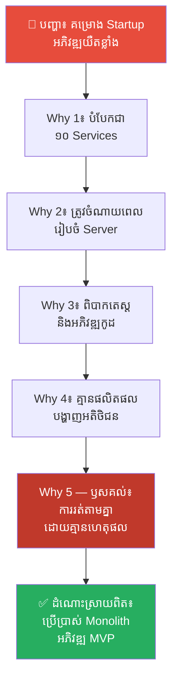
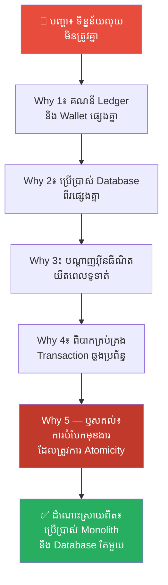
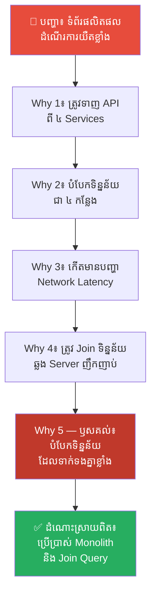
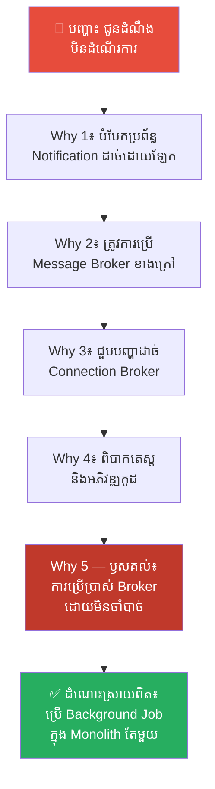
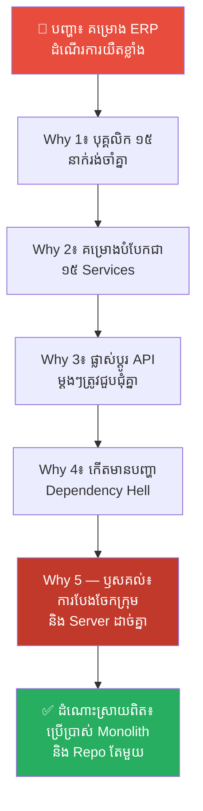
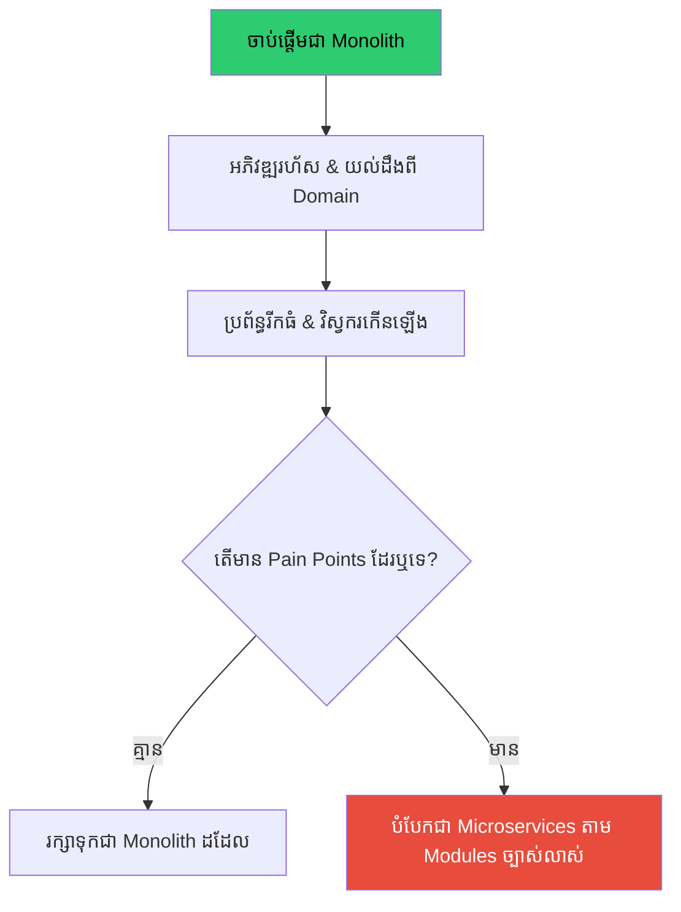

# Abraham Lincoln and Monolithic Architecture (អាប្រាហាម លីនខុន និងស្ថាបត្យកម្មប្រព័ន្ធកណ្តាល)៖ ការរក្សាឯកភាពនៃប្រព័ន្ធ និងគ្រោះថ្នាក់នៃការបែកបាក់មុនអាយុកាល

**Author:** ichamrong  
**Date:** 2026-05-17  
**Tags:** #lincoln #monolith #microservices #architecture #system-design  
**Category:** Concepts  
**Read Time:** ~15 min  

---

## 📌 មាតិកា (Table of Contents)
- [លំនាំបញ្ហា (The Pattern)](#លំនាំបញ្ហា-the-pattern)
- [១. បញ្ហា៖ ផ្ទះដែលបែកបាក់ និងការវង្វេងនឹង Microservices (The Issue: A House Divided and The Microservices Hype)](#១-បញ្ហា-ផ្ទះដែលបែកបាក់-និងការវង្វេងនឹង-microservices-the-issue-a-house-divided-and-the-microservices-hype)
- [២. ឧទាហរណ៍ជាក់ស្តែងក្នុងពិភពពិត (Real World Examples)](#២-ឧទាហរណ៍ជាក់ស្តែងក្នុងពិភពពិត)
  - [ឧទាហរណ៍ទី ១ — កម្រិតស្រាល៖ គម្រោង Startup ថ្មីថ្មោង (New Startup Project)](#ឧទាហរណ៍ទី-១-កម្រិតស្រាល-គម្រោង-startup-ថ្មីថ្មោង-new-startup-project)
  - [ឧទាហរណ៍ទី ២ — កម្រិតមធ្យម (បច្ចេកទេស)៖ ប្រព័ន្ធទូទាត់ប្រាក់ (Payment System)](#ឧទាហរណ៍ទី-២-កម្រិតមធ្យម-បច្ចេកទេស-ប្រព័ន្ធទូទាត់ប្រាក់-payment-system)
  - [ឧទាហរណ៍ទី ៣ — កម្រិតមធ្យម (បច្ចេកទេស)៖ ប្រព័ន្ធគ្រប់គ្រងទិន្នន័យផលិតផល (Product Catalog)](#ឧទាហរណ៍ទី-៣-កម្រិតមធ្យម-បច្ចេកទេស-ប្រព័ន្ធគ្រប់គ្រងទិន្នន័យផលិតផល-product-catalog)
  - [ឧទាហរណ៍ទី ៤ — កម្រិតមធ្យម (បច្ចេកទេស)៖ មុខងារផ្ញើសារជូនដំណឹង (Notification Service)](#ឧទាហរណ៍ទី-៤-កម្រិតមធ្យម-បច្ចេកទេស-មុខងារផ្ញើសារជូនដំណឹង-notification-service)
  - [ឧទាហរណ៍ទី ៥ — កម្រិតធ្ងន់៖ ការធ្វើការងារជាក្រុម និងការទាក់ទងគ្នា (Team Collaboration and Communication Overhead)](#ឧទាហរណ៍ទី-៥-កម្រិតធ្ងន់-ការធ្វើការងារជាក្រុម-និងការទាក់ទងគ្នា-team-collaboration-and-communication-overhead)
- [៣. កត្តាជម្រុញ៖ ភាពពេញនិយមតាមគ្នា និងការភ័យខ្លាចបច្ចេកវិទ្យាចាស់ (The Aggravator: Hype-Driven Development and Fear of Missing Out)](#៣-កត្តាជម្រុញ-ភាពពេញនិយមតាមគ្នា-និងការភ័យខ្លាចបច្ចេកវិទ្យាចាស់-the-aggravator-hype-driven-development-and-fear-of-missing-out)
- [៤. ដំណោះស្រាយទូទៅ៖ យុទ្ធសាស្ត្រ Monolith-First និងការបំបែកដោយប្រុងប្រយ័ត្ន (The General Solution: The Monolith-First Strategy and Careful Decomposition)](#៤-ដំណោះស្រាយទូទៅ-យុទ្ធសាស្ត្រ-monolith-first-និងការបំបែកដោយប្រុងប្រយ័ត្ន-the-general-solution-the-monolith-first-strategy-and-careful-decomposition)
- [សេចក្តីសន្និដ្ឋាន (Conclusion)](#សេចក្តីសន្និដ្ឋាន-conclusion)
- [ឯកសារយោង (References)](#ឯកសារយោង-references)
- [Related Posts](#related-posts)

---

## លំនាំបញ្ហា (The Pattern)

តើអ្នកធ្លាប់ចាប់ផ្តើមគម្រោងថ្មីមួយ ហើយគិតថា៖ *«ដើម្បីឱ្យប្រព័ន្ធនេះខ្លាំង និងអាចរីកចម្រើនទៅថ្ងៃអនាគត យើងត្រូវបំបែកវាជា Microservices តាំងពីថ្ងៃដំបូង!»* ដែរឬទេ?

វិស្វករនិងអ្នកគ្រប់គ្រងគម្រោងជាច្រើន តែងតែជ្រើសរើសស្ថាបត្យកម្មប្រព័ន្ធដែលស្មុគស្មាញតាំងពីពេលចាប់ផ្តើម ដោយសារតែការភ័យខ្លាចការកកស្ទះ និងការជឿជាក់លើនិន្នាការបច្ចេកវិទ្យាថ្មីៗ។ ប៉ុន្តែ ជាញឹកញាប់ លទ្ធផលដែលទទួលបានគឺ៖
* ក្រុមការងារត្រូវចំណាយពេលរៀបចំ Server ជំនួសឱ្យការសរសេរកូដសម្រាប់មុខងារអាជីវកម្ម។
* ការដោះស្រាយបញ្ហាកាន់តែពិបាក ព្រោះទិន្នន័យត្រូវបានបំបែកជាបំណែកៗនៅច្រើនកន្លែង។
* ការអភិវឌ្ឍគម្រោងមានភាពយឺតយ៉ាវ និងបាត់បង់តុល្យភាពរហូតដល់គម្រោងត្រូវដួលរលំ។

នេះជាអ្វីដែលលោក **អាប្រាហាម លីនខុន (Abraham Lincoln)** ប្រធានាធិបតីទី ១៦ នៃសហរដ្ឋអាមេរិក ធ្លាប់បានព្រមាននៅក្នុងទស្សនវិជ្ជានយោបាយរបស់លោកអំពី **«ផ្ទះដែលបែកបាក់ (A House Divided)»**។ ប្រសិនបើប្រព័ន្ធទាំងមូលត្រូវបានបំបែកជាផ្នែកតូចៗមុនអាយុកាល និងខ្វះទំនាក់ទំនងយ៉ាងរឹងមាំ វានឹងដួលរលំដោយខ្លួនឯង។

ផែនទីបង្ហាញផ្លូវសម្រាប់អត្ថបទនេះ៖
1. **បញ្ហា (The Issue)** — ស្វែងយល់ពីផលវិបាកនៃការបំបែកប្រព័ន្ធលឿនពេក និងទស្សនវិជ្ជារបស់លោក លីនខុន។
2. **ឧទាហរណ៍ជាក់ស្តែង (Real World Examples)** — ឧទាហរណ៍ចំនួន ៥ បង្ហាញពីការវិភាគបែប 5 Whys ចំពោះការជ្រើសរើសស្ថាបត្យកម្មខុស។
3. **កត្តាជម្រុញ (The Aggravator)** — ហេតុអ្វីបានជាយើងតែងតែធ្លាក់ក្នុងអន្ទាក់ Hype-Driven Development?
4. **ដំណោះស្រាយទូទៅ (The General Solution)** — យុទ្ធសាស្ត្រ Monolith-First និងការបំបែកដោយប្រុងប្រយ័ត្ន។

---

## ១. បញ្ហា៖ ផ្ទះដែលបែកបាក់ និងការវង្វេងនឹង Microservices (The Issue: A House Divided and The Microservices Hype)

នៅក្នុងពិភពនៃការរចនាប្រព័ន្ធ (System Design) ការឈ្លោះប្រកែកគ្នាដ៏ធំបំផុតមួយគឺរវាង **Monolith (ប្រព័ន្ធកណ្តាលតែមួយ)** និង **Microservices (ប្រព័ន្ធបំបែកជាចំណែកតូចៗ)**។

**Monolith** គឺដូចជារដ្ឋកណ្តាលតែមួយ (Union) ដែលកូដ និងទិន្នន័យទាំងអស់រត់នៅក្នុង Project តែមួយ ប្រើប្រាស់ Database រួមគ្នា និងដាក់ឱ្យដំណើរការ (Deploy) ជាមួយគ្នា។ វាងាយស្រួលអភិវឌ្ឍ ងាយស្រួលតេស្ត និងងាយស្រួលយល់។

ផ្ទុយទៅវិញ **Microservices** គឺការបំបែកកម្មវិធីធំមួយទៅជាកម្មវិធីតូចៗរាប់សិប ដែលរត់នៅលើ Server ផ្សេងៗគ្នា (ដូចជា User Service, Payment Service, Inventory Service)។ វាអនុញ្ញាតឱ្យក្រុមវិស្វករធំៗអាចធ្វើការងារដោយឯករាជ្យពីគ្នា។

ប៉ុន្តែ អ្វីដែលសៀវភៅបច្ចេកទេសភាគច្រើនមិនបានប្រាប់អ្នក គឺតម្លៃលាក់កំបាំងដ៏មហាសាលនៃ Microservices៖
* **ភាពស្មុគស្មាញផ្នែកប្រតិបត្តិការ (Operational Complexity)៖** ត្រូវការ Kubernetes, CI/CD pipelines ស្មុគស្មាញ និងការគ្រប់គ្រង Server ច្រើន។
* **ភាពយឺតយ៉ាវនៃបណ្តាញ (Network Latency)៖** រាល់ការហៅ API ឆ្លង Server បង្កើតភាពយឺតយ៉ាវ និងងាយនឹងដាច់ឆ្ងាយពីគ្នា។
* **បញ្ហាឯកភាពទិន្នន័យ (Data Consistency)៖** ពិបាកក្នុងការធ្វើឱ្យទិន្នន័យត្រូវគ្នានៅគ្រប់ Database ទាំងអស់។

លោក **អាប្រាហាម លីនខុន** ធ្លាប់បានថ្លែងសុន្ទរកថាដ៏ល្បីល្បាញមួយនៅឆ្នាំ ១៨៥៨ ថា៖
> 💡 **«ផ្ទះដែលបែកបាក់ទាស់ទែងគ្នា មិនអាចឈររឹងមាំបានឡើយ (A house divided against itself cannot stand)។ ខ្ញុំជឿជាក់ថារដ្ឋាភិបាលនេះ មិនអាចទ្រាំទ្ររស់នៅជាពាក់កណ្តាលទាសភាព និងពាក់កណ្តាលសេរីភាពជារៀងរហូតបានឡើយ។»**

នៅក្នុងបរិបទវិស្វកម្មកម្មវិធី ប្រសិនបើគម្រោងរបស់អ្នកនៅតូច ក្រុមការងារនៅមានគ្នា لឺច តែអ្នកបែរជាចង់បំបែកប្រព័ន្ធជាផ្នែកតូចៗរាប់សិបនោះ អ្នកកំពុងតែសាងសង់ «ផ្ទះដែលបែកបាក់»។ ការបំបែកប្រព័ន្ធលឿនពេក (Premature Decomposition) នឹងនាំមកនូវជម្លោះទិន្នន័យ ភាពវឹកវរក្នុងការគ្រប់គ្រង និងការដួលរលំនៃគម្រោងទាំងមូល។

---

## ២. ឧទាហរណ៍ជាក់ស្តែងក្នុងពិភពពិត

នេះជា **ឧទាហរណ៍ជាក់ស្តែងចំនួន ៥** បង្ហាញពីរបៀបដែលការបែកបាក់ប្រព័ន្ធមុនអាយុកាល បង្កជាបញ្ហាធ្ងន់ធ្ងរ និងរបៀបប្រើប្រាស់បច្ចេកទេស 5 Whys ដើម្បីស្វែងរកឫសគល់៖

---

### ឧទាហរណ៍ទី ១ — កម្រិតស្រាល៖ គម្រោង Startup ថ្មីថ្មោង (New Startup Project)

**ស្ថានភាព (Situation)៖** ក្រុមហ៊ុន Startup ថ្មីមួយមានវិស្វករតែ ៣ នាក់ ចង់អភិវឌ្ឍកម្មវិធីគំរូដំបូង (MVP) សម្រាប់សេវាកម្មដឹកជញ្ជូនអាហារ ដើម្បីស្ទង់មើលទីផ្សារ។

**សកម្មភាពខុសឆ្គង (Wrong Action)៖** ពួកគេបានសម្រេចចិត្តបំបែកប្រព័ន្ធតាំងពីថ្ងៃដំបូងទៅជា ១០ Microservices (User, Restaurant, Order, Payment, Delivery, Notification, Review, Support, Recommendation, Search) ដោយរត់នៅលើ Kubernetes ដើម្បីធានាភាព Scalable ទៅថ្ងៃអនាគត។ ជាលទ្ធផល ៣ ខែក្រោយមក ពួកគេនៅតែមិនទាន់អាចបញ្ចេញកម្មវិធីសាកល្បងបានឡើយ។

**ការវិភាគបែប 5 Whys៖**

| # | សំណួរ (Why?) | ចម្លើយ (Answer) |
|---|---|---|
| 1 | ហេតុអ្វីបានជាការបញ្ចេញកម្មវិធីសាកល្បង (MVP) យឺតយ៉ាវខ្លាំង? | ពីព្រោះក្រុមការងារត្រូវចំណាយពេលច្រើនហួសហេតុលើការតភ្ជាប់ និងតេស្តរាល់ API Requests ឆ្លងកាត់ Services ទាំង ១០។ |
| 2 | ហេតុអ្វីបានជាការតភ្ជាប់ និងតេស្តមានភាពស្មុគស្មាញខ្លាំង? | ពីព្រោះ Services នីមួយៗរត់លើ Server ផ្សេងគ្នា មានបណ្ណាល័យ (Libraries) ផ្សេងគ្នា និងត្រូវការ Deploy ដាច់ដោយឡែក។ |
| 3 | ហេតុអ្វីបានជាត្រូវរៀបចំឱ្យពួកវារត់នៅលើ Server និង Deploy ដាច់ពីគ្នា? | ពីព្រោះប្រព័ន្ធត្រូវបានរចនាឡើងជា Microservices តាំងពីដំបូងបំផុត។ |
| 4 | ហេតុអ្វីបានជាជ្រើសរើសយក Microservices សម្រាប់កម្មវិធីទើបតែចាប់ផ្តើម? | ពីព្រោះវិស្វករជឿជាក់ថា នេះជាស្ថាបត្យកម្មទំនើបដែលក្រុមហ៊ុនយក្សដូចជា Netflix ប្រើ និងជួយការពារកុំឱ្យមានការកែប្រែប្រព័ន្ធឡើងវិញនៅពេលអនាគត។ |
| 5 | ហេតុអ្វីបានជាសម្រេចចិត្តដោយផ្អែកលើការស្មាននាពេលអនាគតជាជាងតម្រូវការជាក់ស្តែង? | **ពីព្រោះខ្វះការយល់ដឹងអំពីយុទ្ធសាស្ត្រ «Monolith-First» និងការវង្វេងនឹងភាពពេញនិយមនៃបច្ចេកវិទ្យា (Microservices Hype) ដោយមិនបានវាយតម្លៃសមត្ថភាពក្រុមការងារ និងល្បឿនដែលទីផ្សារត្រូវការ។** |

**ដំណោះស្រាយពិតប្រាកដ៖** បោះបង់ចោលការរៀបចំ Microservices ស្មុគស្មាញ ហើយរួមបញ្ចូលកូដទាំងអស់ទៅជា Single Monolithic Application (ប្រព័ន្ធតែមួយ)។ នេះនឹងអនុញ្ញាតឱ្យវិស្វករទាំង ៣ នាក់ ផ្តោតលើការសរសេរមុខងារស្នូលរបស់កម្មវិធី និងបញ្ចេញ MVP ទៅកាន់ទីផ្សារក្នុងរយៈពេលតែប៉ុន្មានសប្តាហ៍។

---

### ឧទាហរណ៍ទី ២ — កម្រិតមធ្យម (បច្ចេកទេស)៖ ប្រព័ន្ធទូទាត់ប្រាក់ (Payment System)

**ស្ថានភាព (Situation)៖** ធនាគារឌីជីថលមួយត្រូវការអភិវឌ្ឍមុខងារផ្ទេរប្រាក់ និងទូទាត់ប្រាក់ដែលទាមទារភាពត្រឹមត្រូវខ្ពស់បំផុតនៃទិន្នន័យ (ACID properties)។

**សកម្មភាពខុសឆ្គង (Wrong Action)៖** ពួកគេបានបំបែកគម្រោងជាពីរ Services គឺ Ledger Service (កត់ត្រាបញ្ជីគណនី) និង Wallet Service (គ្រប់គ្រងកាបូបលុយ) ដោយប្រើប្រាស់ Database ពីរផ្សេងគ្នា។ នៅពេលបណ្តាញអ៊ីនធឺណិតយឺត ឬដាច់ (Network Issue) វាក៏កើតមានបញ្ហា «ប្រាក់ក្នុង Wallet កាត់រួច តែបញ្ជី Ledger មិនកត់ត្រាចូល» ដែលធ្វើឱ្យសមតុល្យលុយមិនត្រូវគ្នា។

**ការវិភាគបែប 5 Whys៖**

| # | សំណួរ (Why?) | ចម្លើយ (Answer) |
|---|---|---|
| 1 | ហេតុអ្វីបានជាសមតុល្យលុយរបស់អតិថិជនមិនត្រូវគ្នា? | ពីព្រោះ Wallet Service កាត់ប្រាក់ជោគជ័យ ប៉ុន្តែ Ledger Service មិនបានកត់ត្រាទិន្នន័យចូល។ |
| 2 | ហេតុអ្វីបានជា Ledger Service មិនបានកត់ត្រាទិន្នន័យចូល? | ពីព្រោះការហៅ API ពី Wallet ទៅ Ledger ជួបបញ្ហាដាច់បណ្តាញ (Network Timeout) ក្នុងពេលកំពុងដំណើរការ។ |
| 3 | ហេតុអ្វីបានជាការដាច់បណ្តាញ អាចបណ្តាលឱ្យទិន្នន័យបាត់បង់តុល្យភាព? | ពីព្រោះប្រព័ន្ធទាំងពីរប្រើប្រាស់ Database ផ្សេងគ្នា ធ្វើឱ្យមិនអាចប្រើប្រាស់ Local Database Transactions ដើម្បីធានាភាពស៊ីសង្វាក់គ្នាបាន។ |
| 4 | ហេតុអ្វីបានជាប្រើប្រាស់ Database ផ្សេងគ្នាសម្រាប់មុខងារដែលត្រូវការទំនាក់ទំនងគ្នាជិតស្និទ្ធ? | ពីព្រោះគោលការណ៍ Microservices តម្រូវឱ្យ Service នីមួយៗត្រូវតែមាន Database ដាច់ដោយឡែកពីគ្នា (Database-per-service pattern)។ |
| 5 | ហេតុអ្វីបានជាអនុវត្តលំនាំរចនា (Pattern) យ៉ាងតឹងរ៉ឹងដោយមិនបានពិចារណាលើលក្ខណៈអាជីវកម្ម? | **ពីព្រោះការរចនាស្ថាបត្យកម្មខ្វះភាពបត់បែន និងការយល់ច្រឡំថាគ្រប់មុខងារទាំងអស់ត្រូវតែបំបែក ដោយមិនបានយល់ថាការទូទាត់ហិរញ្ញវត្ថុត្រូវការឯកភាពទិន្នន័យជាចម្បង (Strong Consistency over Partition Tolerance)។** |

**ដំណោះស្រាយពិតប្រាកដ៖** រួមបញ្ចូល Ledger និង Wallet ទៅក្នុងប្រព័ន្ធតែមួយ (Monolith) និងប្រើប្រាស់ Database រួមគ្នា។ ការធ្វើបែបនេះ អនុញ្ញាតឱ្យប្រើប្រាស់ Local Database Transactions ធម្មតា (BEGIN TRANSACTION ... COMMIT) ដែលធានាថា ប្រសិនបើការកត់ត្រា Ledger បរាជ័យ Wallet ក៏មិនត្រូវបានកាត់លុយដែរ (Atomicity)។

---

### ឧទាហរណ៍ទី ៣ — កម្រិតមធ្យម (បច្ចេកទេស)៖ ប្រព័ន្ធគ្រប់គ្រងទិន្នន័យផលិតផល (Product Catalog)

**ស្ថានភាព (Situation)៖** វេបសាយលក់ទំនិញអនឡាញ (E-commerce) ត្រូវការបង្ហាញព័ត៌មានលម្អិតរបស់ផលិតផល រួមជាមួយតម្លៃ ការបញ្ចុះតម្លៃ និងព័ត៌មានស្តុកទំនិញនៅលើទំព័រដើម។

**សកម្មភាពខុសឆ្គង (Wrong Action)៖** ក្រុមការងារបានបង្កើត Microservices ចំនួន ៤ គឺ Product Info, Pricing, Inventory, និង Review Services។ នៅពេលបង្ហាញទំព័រផលិតផលមួយ កម្មវិធីត្រូវបាញ់ API Requests ទៅកាន់ Services ទាំង ៤ នេះ ដែលបង្កើតភាពយឺតយ៉ាវយ៉ាងខ្លាំងលើទំព័រដើម (Network Latency and N+1 query problems) រហូតដល់អតិថិជនធុញទ្រាន់និងចាកចេញ។

**ការវិភាគបែប 5 Whys៖**

| # | សំណួរ (Why?) | ចម្លើយ (Answer) |
|---|---|---|
| 1 | ហេតុអ្វីបានជាទំព័រផលិតផលផ្ទុកព័ត៌មានយឺតខ្លាំង (យឺតជាង ៣ វិនាទី)? | ពីព្រោះត្រូវរង់ចាំការទាញយកទិន្នន័យពី API របស់ Services ចំនួន ៤ ផ្សេងគ្នា។ |
| 2 | ហេតុអ្វីបានជាត្រូវរង់ចាំទិន្នន័យពី Services ច្រើនយ៉ាងនេះ? | ពីព្រោះទិន្នន័យផលិតផល តម្លៃ ស្តុក និងការវាយតម្លៃ ត្រូវបានរក្សាទុកដាច់ដោយឡែកពីគ្នានៅលើ Server ផ្សេងៗគ្នា។ |
| 3 | ហេតុអ្វីបានជាទិន្នន័យដែលបង្ហាញជាមួយគ្នាជានិច្ច ត្រូវរក្សាទុកដាច់ពីគ្នា? | ពីព្រោះក្រុមការងារចង់ឱ្យក្រុមការងារនីមួយៗអាចកែប្រែ និងគ្រប់គ្រងទិន្នន័យរបស់ខ្លួនបានដោយឯករាជ្យ។ |
| 4 | ហេតុអ្វីបានជាចង់បានភាពឯករាជ្យរបស់ក្រុមការងារ នៅពេលដែលក្រុមការងារមានទំហំតូច? | ពីព្រោះពួកគេគិតថា ការរក្សាទុកទិន្នន័យរួមគ្នានឹងធ្វើឱ្យកូដជាន់គ្នា និងពិបាកអភិវឌ្ឍ។ |
| 5 | ហេតុអ្វីបានជាបារម្ភពីកូដជាន់គ្នាខ្លាំងជាងបទពិសោធន៍អ្នកប្រើប្រាស់? | **ពីព្រោះខ្វះការយល់ដឹងអំពីផលប៉ះពាល់នៃ Network Latency និងការរចនាព្រំដែនទិន្នន័យមិនបានល្អ (Poor Bounded Context Design) ដោយបំបែកទិន្នន័យដែលទាក់ទងគ្នាខ្លាំងទៅកន្លែងផ្សេងគ្នា។** |

**ដំណោះស្រាយពិតប្រាកដ៖** រួមបញ្ចូលទិន្នន័យផលិតផលទាំងនេះមកក្នុង Database តែមួយ និងប្រើប្រាស់ស្ថាបត្យកម្ម Monolith។ វានឹងអនុញ្ញាតឱ្យប្រព័ន្ធទាញយកទិន្នន័យទាំងអស់ដោយប្រើប្រាស់ SQL Join តែមួយដង ដែលលឿនជាង និងប្រើប្រាស់ថាមពល Server តិចជាងមុនរាប់សិបដង។

---

### ឧទាហរណ៍ទី ៤ — កម្រិតមធ្យម (បច្ចេកទេស)៖ មុខងារផ្ញើសារជូនដំណឹង (Notification Service)

**ស្ថានភាព (Situation)៖** កម្មវិធីគ្រប់គ្រងសាលារៀនមួយត្រូវការផ្ញើសារជូនដំណឹង (SMS/Email Notification) ទៅកាន់អាណាព្យាបាលរាល់ពេលដែលសិស្សអវត្តមាន។

**សកម្មភាពខុសឆ្គង (Wrong Action)៖** ក្រុមការងារបានសម្រេចចិត្តបង្កើត Notification Service ជា Microservice ខាងក្រៅតាំងពីថ្ងៃដំបូង ដែលទាមទារការតភ្ជាប់ប្រព័ន្ធ Message Broker (ដូចជា RabbitMQ ឬ Kafka) ដើម្បីបញ្ជូនសារ។ ដំណើរការនេះជួបបញ្ហាដាច់ការតភ្ជាប់ជាញឹកញាប់ ធ្វើឱ្យសារជូនដំណឹងមិនបានទៅដល់ដៃអាណាព្យាបាលទាន់ពេល។

**ការវិភាគបែប 5 Whys៖**

| # | សំណួរ (Why?) | ចម្លើយ (Answer) |
|---|---|---|
| 1 | ហេតុអ្វីបានជាសារជូនដំណឹងមិនទៅដល់ដៃអាណាព្យាបាល? | ពីព្រោះប្រព័ន្ធស្នូលមិនអាចបញ្ជូនសារទៅកាន់ Notification Service បាន។ |
| 2 | ហេតុអ្វីបានជាមិនអាចបញ្ជូនសារទៅកាន់ Notification Service បាន? | ពីព្រោះការតភ្ជាប់រវាងប្រព័ន្ធស្នូល និង Message Broker (RabbitMQ) ត្រូវបានដាច់។ |
| 3 | ហេតុអ្វីបានជាការតភ្ជាប់ដាច់ជាញឹកញាប់ និងមិនព្រម Reconnect? | ពីព្រោះការរៀបចំ និងគ្រប់គ្រងគុណភាពបណ្តាញរបស់ Message Broker ស្មុគស្មាញពេកសម្រាប់ក្រុមការងារដែលគ្មានអ្នកជំនាញ DevOps។ |
| 4 | ហេតុអ្វីបានជាត្រូវការប្រើប្រាស់ Message Broker ស្មុគស្មាញសម្រាប់គម្រោងតូចបែបនេះ? | ពីព្រោះពួកគេជឿថា ការផ្ញើសារជូនដំណឹងត្រូវតែធ្វើឡើងដោយមិនប៉ះពាល់ដល់ល្បឿននៃប្រព័ន្ធស្នូល (Asynchronous Execution)។ |
| 5 | ហេតុអ្វីបានជាយល់ច្រឡំថាការធ្វើ Asynchronous ត្រូវការតែ Message Broker ខាងក្រៅ? | **ពីព្រោះខ្វះការយល់ដឹងអំពីសមត្ថភាពរបស់ Background Jobs នៅក្នុងស្ថាបត្យកម្ម Monolith (ដូចជា Sidekiq, Celery ឬ BullMQ) ដែលអាចដំណើរការការងារ Asynchronous បានយ៉ាងងាយស្រួល និងរឹងមាំដោយមិនបាច់ប្រើប្រាស់ Infrastructure ខាងក្រៅ។** |

**ដំណោះស្រាយពិតប្រាកដ៖** រួមបញ្ចូលមុខងារផ្ញើសារជូនដំណឹងជា Module មួយនៅក្នុង Monolith និងប្រើប្រាស់ Background Job processing engine ធម្មតា (ដូចជា Sidekiq ឬ Celery)។ វានឹងកាត់បន្ថយតម្រូវការប្រើប្រាស់ Message Broker ខាងក្រៅ និងធានាបាននូវការបញ្ជូនសាររឹងមាំ និងគ្មានការបាត់បង់ឡើយ។

---

### ឧទាហរណ៍ទី ៥ — កម្រិតធ្ងន់៖ ការធ្វើការងារជាក្រុម និងការទាក់ទងគ្នា (Team Collaboration and Communication Overhead)

**ស្ថានភាព (Situation)៖** ក្រុមហ៊ុនមានក្រុមវិស្វករ ១៥ នាក់ ធ្វើការលើគម្រោងអភិវឌ្ឍន៍ប្រព័ន្ធគ្រប់គ្រងធនធានសហគ្រាស (ERP) សម្រាប់ក្រុមហ៊ុនលក់រាយ។

**សកម្មភាពខុសឆ្គង (Wrong Action)៖** ដើម្បីបង្កើនភាពរហ័សរហួន (Agility) ពួកគេបានបំបែកគម្រោងជា ១៥ Microservices ដោយម្នាក់ៗគ្រប់គ្រង Service មួយដាច់ដោយឡែក។ ប៉ុន្តែ នៅពេលត្រូវការផ្លាស់ប្តូរមុខងាររួមណាមួយ ក្រុមការងារត្រូវបើកប្រជុំជាច្រើនម៉ោងដើម្បីចរចាអំពី API Contracts និងរង់ចាំការ Deploy របស់គ្នាទៅវិញទៅមក (Dependency Hell)។

**ការវិភាគបែប 5 Whys៖**

| # | សំណួរ (Why?) | ចម្លើយ (Answer) |
|---|---|---|
| 1 | ហេតុអ្វីបានជាល្បឿនអភិវឌ្ឍន៍របស់ក្រុមការងារធ្លាក់ចុះយ៉ាងខ្លាំង? | ពីព្រោះវិស្វករម្នាក់ៗត្រូវរង់ចាំវិស្វករផ្សេងទៀតកែប្រែ និង Deploy API របស់ពួកគេជាមុនសិន។ |
| 2 | ហេតុអ្វីបានជាការកែប្រែកូដរបស់ម្នាក់ៗ ត្រូវការរង់ចាំ និងពឹងផ្អែកលើគ្នាខ្លាំងម្ល៉េះ? | ពីព្រោះមុខងារនានានៅក្នុងប្រព័ន្ធ ERP មានទំនាក់ទំនងគ្នាយ៉ាងស្អិតរមួត ធ្វើឱ្យការផ្លាស់ប្តូរផ្នែកមួយ ប៉ះពាល់ដល់ផ្នែកដទៃទៀត។ |
| 3 | ហេតុអ្វីបានជាមុខងារដែលមានទំនាក់ទំនងគ្នាស្អិតរមួត ត្រូវបានបំបែកជា Services ច្រើនយ៉ាងនេះ? | ពីព្រោះក្រុមហ៊ុនជឿជាក់ថា ការបែងចែកវិស្វករម្នាក់ឱ្យគ្រប់គ្រង Server មួយ នឹងជួយកាត់បន្ថយជម្លោះកូដ (Git Conflicts)។ |
| 4 | ហេតុអ្វីបានជាបារម្ភពី Git Conflicts ខ្លាំងជាងភាពរឹងមាំ និងល្បឿនប្រគល់ការងាររបស់ប្រព័ន្ធ? | ពីព្រោះពួកគេមិនដឹងពីរបៀបរៀបចំកូដឱ្យមានរបៀបរៀបរយនៅក្នុង Repository តែមួយ (Modular Monolith)។ |
| 5 | ហេតុអ្វីបានជាខ្វះចំណេះដឹងលើការរៀបចំកូដនៅក្នុង Monolith ឱ្យមានរបៀបរៀបរយ? | **ពីព្រោះការគ្រប់គ្រងបច្ចេកវិទ្យាខ្វះការណែនាំ និងការយល់ច្រឡំថា Microservices គឺជាមធ្យោបាយតែមួយគត់ដើម្បីរៀបចំកូដ និងបែងចែកក្រុមការងារ ដោយមិនបានដឹងថាការបំបែក Server បង្កើតរបាំងទំនាក់ទំនង និងការកកស្ទះការងារ (Communication Overhead) ធ្ងន់ធ្ងរជាង Git Conflicts។** |

**ដំណោះស្រាយពិតប្រាកដ៖** រួមបញ្ចូលគម្រោង ERP ទាំង ១៥ ទៅជា Single Modular Monolith Repository តែមួយ។ វិស្វករទាំង ១៥ នាក់ អាចសរសេរកូដនៅក្នុង Repository តែមួយ ដោយប្រើប្រាស់ Module Boundary ច្បាស់លាស់។ វានឹងកម្ចាត់ចោលការប្រជុំ API Contracts ឥតប្រយោជន៍ និងបង្កើនល្បឿនអភិវឌ្ឍន៍លឿនជាងមុនរាប់ដង។

---

## ៣. កត្តាជម្រុញ៖ ភាពពេញនិយមតាមគ្នា និងការភ័យខ្លាចបច្ចេកវិទ្យាចាស់ (The Aggravator: Hype-Driven Development and Fear of Missing Out)

ប្រសិនបើ Monolith ផ្តល់ភាពសាមញ្ញ និងភាពរឹងមាំខ្លាំងម្ល៉េះ ហេតុអ្វីបានជាវិស្វករ និងស្ថាប័នជាច្រើននៅតែប្រញាប់ប្រញាល់បំបែកប្រព័ន្ធទៅជា Microservices ទាំងដែលមិនទាន់ចាំបាច់?

**ការអភិវឌ្ឍន៍ផ្អែកលើភាពល្បីល្បាញ (Hype-Driven Development)៖**  
នៅក្នុងបណ្តាញសង្គមបច្ចេកវិទ្យា (Medium, Twitter, YouTube) តែងតែមានការសរសើរពីអត្ថប្រយោជន៍នៃ Microservices, Kubernetes និង Serverless។ វានាំឱ្យកើតមានការគិតថា «បើក្រុមហ៊ុនធំៗប្រើវា វាមុខជាល្អសម្រាប់យើងដែរហើយ»។ ពួកគេភ្លេចថា Netflix ឬ Uber មានវិស្វកររាប់ពាន់នាក់ និងមានបញ្ហា Scalability កម្រិតពិភពលោក ដែលខុសស្រឡាំងកាំងពី Startup ដែលមានវិស្វករតែ ៥ នាក់។

**ការសរសេរប្រវត្តិរូបការងារ (Resume-Driven Development)៖**  
ជារឿយៗ វិស្វករចង់រៀន និងប្រើប្រាស់បច្ចេកវិទ្យាថ្មីៗ និងស្មុគស្មាញ (ដូចជា Kafka, Istio, Kubernetes) ដើម្បីដាក់ចូលក្នុងប្រវត្តិរូបសង្ខេប (Resume) របស់ពួកគេ ដើម្បីងាយស្រួលរកការងារថ្មីនាពេលអនាគត។ ការសម្រេចចិត្តជ្រើសរើសស្ថាបត្យកម្មបែបនេះ មិនមែនធ្វើឡើងដើម្បីផលប្រយោជន៍អាជីវកម្មរបស់ក្រុមហ៊ុនឡើយ ប៉ុន្តែដើម្បីផលប្រយោជន៍ផ្ទាល់ខ្លួនរបស់ពួកគេ។

**ការភ័យខ្លាចបច្ចេកវិទ្យាចាស់ (Fear of Missing Out - FOMO)៖**  
អ្នកគ្រប់គ្រង និងស្ថាបនិកជាច្រើនបារម្ភថា ការប្រើប្រាស់ Monolith ធ្វើឱ្យក្រុមហ៊ុនរបស់ពួកគេមើលទៅហាក់ដូចជា «បុរាណ» ឬ «ប្រើប្រាស់បច្ចេកវិទ្យាចាស់គំរឹល»។ ពួកគេខ្លាចមិនអាចទាក់ទាញវិស្វករពូកែៗឱ្យមកធ្វើការជាមួយបាន បើមិនប្រើប្រាស់ Microservices។

---

## ៤. ដំណោះស្រាយទូទៅ៖ យុទ្ធសាស្ត្រ Monolith-First និងការបំបែកដោយប្រុងប្រយ័ត្ន (The General Solution: The Monolith-First Strategy and Careful Decomposition)

ដើម្បីសាងសង់ប្រព័ន្ធដែលមានភាពរឹងមាំ និងងាយស្រួលគ្រប់គ្រង សូមអនុវត្តតាមគោលការណ៍ណែនាំទាំងនេះ៖

### ចាប់ផ្តើមជាមួយ Monolith ជានិច្ច (Monolith-First Strategy)

អ្នកជំនាញរចនាប្រព័ន្ធដ៏ល្បីល្បាញលោក Martin Fowler តែងតែផ្តល់អនុសាសន៍ថា៖
> 💡 **«ស្ទើរតែគ្រប់គម្រោងទាំងអស់ គប្បីចាប់ផ្តើមជាមួយ Monolithic Application ជានិច្ច។ អ្នកត្រូវរក្សាវាឱ្យនៅជាធ្លុងមួយ រហូតដល់អ្នកដឹងច្បាស់ពីព្រំដែនអាជីវកម្ម និងនៅពេលដែល Monolith នោះលែងអាចទ្រទ្រង់បាន។»**

វាងាយស្រួលជាង ១០ ដងក្នុងការបំបែកប្រព័ន្ធ Monolith ដែលមានរបៀបរៀបរយទៅជា Microservices ជាជាងការរួមបញ្ចូល Microservices ដែលខូច និងរាយប៉ាយឱ្យមកជា Monolith វិញ (ដែលគេហៅថា Distributed Monolith)។

### ការពារភាពបែកបាក់ដោយប្រើ «Modular Monolith»

មុននឹងគិតពីការបំបែក Server អ្នកគប្បីរៀបចំកូដនៅក្នុង Monolith ឱ្យមានព្រំដែនច្បាស់លាស់ (Bounded Context)។ សរសេរកូដជា modules ឬ packages ឯករាជ្យ ដែលទាក់ទងគ្នាទៅវិញទៅមកតាមរយៈ Interface ច្បាស់លាស់។ ដំណើរការនេះជួយរក្សាឯកភាពទិន្នន័យផង និងត្រៀមលក្ខណៈងាយស្រួលបំបែកទៅថ្ងៃអនាគតផង។

### គោលការណ៍សម្រេចចិត្តបំបែកប្រព័ន្ធ (Decomposition Triggers)

អ្នកគួរតែសម្រេចចិត្តបំបែក Module ណាមួយទៅជា Microservice លុះត្រាតែជួបលក្ខខណ្ឌចាំបាច់ទាំងនេះ៖
1. **ការធ្វើមាត្រដ្ឋានខុសគ្នា (Resource Scaling)៖** Module មួយត្រូវការប្រើប្រាស់ CPU ឬ RAM ខ្ពស់ខ្លាំងខុសពី Module ដទៃទៀត (ឧទាហរណ៍៖ ប្រព័ន្ធ Processing វីដេអូ)។
2. **ឯករាជ្យភាពនៃការដាក់ឱ្យប្រើប្រាស់ (Independent Deployment)៖** Module នោះត្រូវការកែប្រែ និង Deploy រាប់សិបដងក្នុងមួយថ្ងៃ ដោយមិនចង់ឱ្យប៉ះពាល់ដល់ប្រព័ន្ធស្នូលដទៃទៀត។
3. **ទំហំក្រុមការងារ (Team Size Pain)៖** ក្រុមហ៊ុនមានវិស្វករកើនឡើងរាប់រយនាក់ ដែលធ្វើឱ្យការសរសេរកូដក្នុង Repository តែមួយបង្កើតការកកស្ទះក្នុងការ Deploy។

---

## សេចក្តីសន្និដ្ឋាន (Conclusion)

ដូចដែលលោក **អាប្រាហាម លីនខុន** បានប្រយុទ្ធដើម្បីរក្សាសហភាពអាមេរិក (The Union) ឱ្យនៅជាធ្លុងមួយ និងមិនអនុញ្ញាតឱ្យមានការបែកបាក់ទៅជាបំណែកៗ វិស្វករកម្មវិធីក៏ត្រូវតែដើរតួជាអ្នកការពារឯកភាពនៃប្រព័ន្ធ (The Union of Code) របស់ខ្លួនផងដែរ។

កុំបណ្តោយឱ្យភាពពេញនិយមតាមគ្នា ឬការស្មាននាពេលអនាគត មកសម្លាប់គម្រោងរបស់អ្នកនៅថ្ងៃនេះឡើយ។ ចូរចាប់ផ្តើមដោយភាពសាមញ្ញ ងាយស្រួលយល់ និងរឹងមាំជាមួយស្ថាបត្យកម្ម Monolith។ នៅពេលដែលប្រព័ន្ធរបស់អ្នករីកធំធាត់រហូតដល់ត្រូវការបំបែកពិតប្រាកដ នោះអ្នកនឹងដឹងច្បាស់ពីរបៀបបំបែកវាដោយសុវត្ថិភាព និងប្រុងប្រយ័ត្នបំផុត។

---

## ឯកសារយោង (References)

1. **Fowler, M. (2015).** *MonolithFirst.* martinfowler.com.
2. **Newman, S. (2019).** *Monolith to Microservices: Evolutionary Patterns to Transform Your Monolith.* O'Reilly Media.
3. **Lincoln, A. (1858).** *House Divided Speech.* Springfield, Illinois.
4. **Kerr, J. (2020).** *The Distributed Monolith: The Worst of Both Worlds.* Medium.

---

## Related Posts

* **[31 Solomon's Temple and CI/CD](./31-solomons-temple-and-ci-cd.md)** — របៀបសាងសង់ប្រព័ន្ធអភិវឌ្ឍន៍រឹងមាំ មិនឱ្យមានសំឡេងរំខាន ដូចការសាងសង់ព្រះវិហារសូឡូម៉ុន។
* **[39 Icarus and Premature Scaling](./39-icarus-and-premature-scaling.md)** — គ្រោះថ្នាក់នៃការហោះហើរកៀកព្រះអាទិត្យពេក និងការធ្វើមាត្រដ្ឋានប្រព័ន្ធលឿនហួសកម្រិត។
* **[46 The Fall of Solomon and Dependency Hell](./46-the-fall-of-solomon-and-dependency-hell.md)** — ការគ្រប់គ្រងការពឹងផ្អែក (Dependencies) ដើម្បីកុំឱ្យប្រព័ន្ធដួលរលំ។

---

*Last updated: 2026-05-26*
