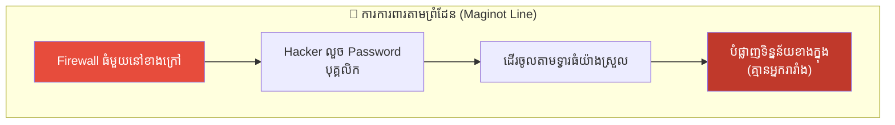
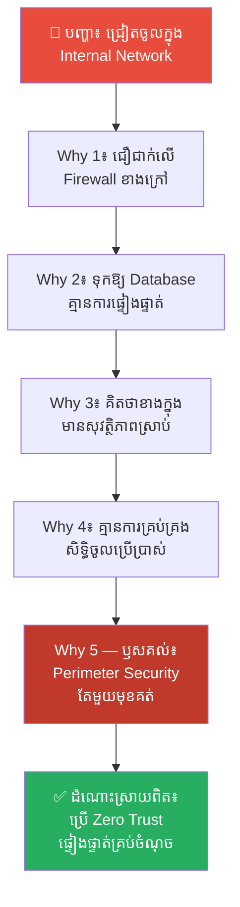
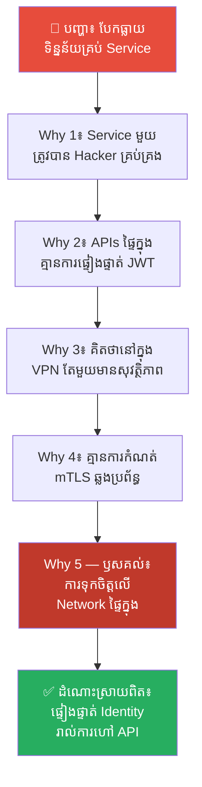
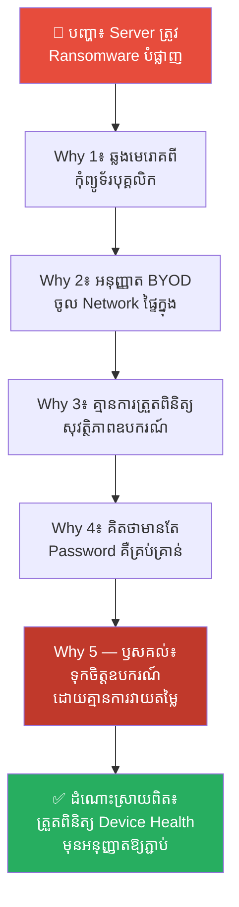
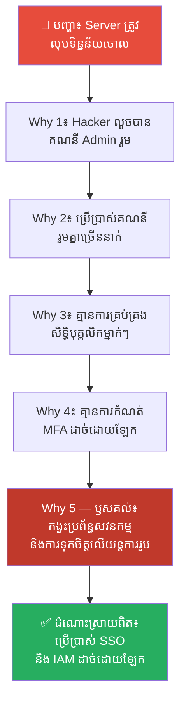
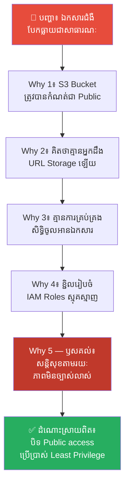
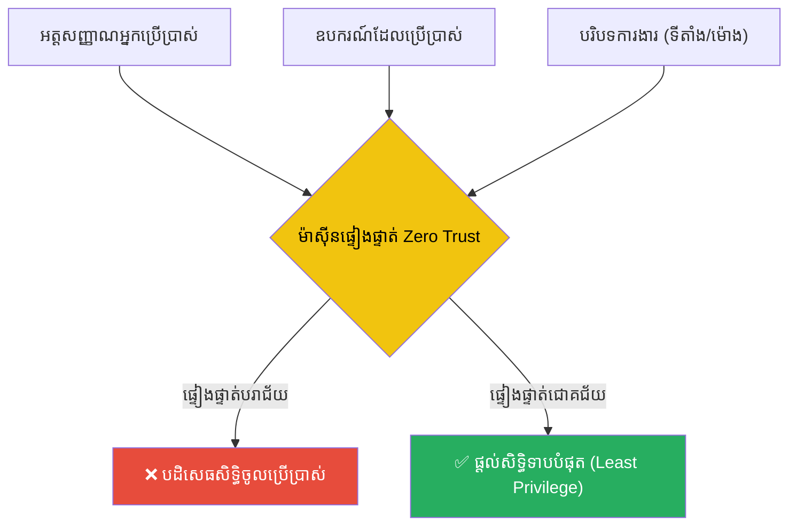

# The Maginot Line and Zero Trust Architecture (ខ្សែការពារម៉ាហ្ស៊ីណូត និងស្ថាបត្យកម្មមិនទុកចិត្តនរណាម្នាក់)៖ ឈប់ជឿជាក់លើព្រំដែន ចាប់ផ្តើមផ្ទៀងផ្ទាត់គ្រប់វិនាទី

**Author:** ichamrong  
**Date:** 2026-05-17  
**Tags:** #cybersecurity #zero-trust #maginot-line #firewall #network-security  
**Category:** Concepts  
**Read Time:** ~15 min  

---

## 📌 មាតិកា (Table of Contents)
- [លំនាំបញ្ហា (The Pattern)](#លំនាំបញ្ហា-the-pattern)
- [១. បញ្ហា៖ ការបំភាន់នៃជញ្ជាំងសុវត្ថិភាព និងខ្សែការពារម៉ាហ្ស៊ីណូត (The Issue: The Firewall Illusion and The Maginot Line)](#១-បញ្ហា-ការបំភាន់នៃជញ្ជាំងសុវត្ថិភាព-និងខ្សែការពារម៉ាហ្ស៊ីណូត-the-issue-the-firewall-illusion-and-the-maginot-line)
- [២. ឧទាហរណ៍ជាក់ស្តែងក្នុងពិភពពិត (Real World Examples)](#២-ឧទាហរណ៍ជាក់ស្តែងក្នុងពិភពពិត)
  - [ឧទាហរណ៍ទី ១ — កម្រិតស្រាល៖ ការការពារប្រព័ន្ធដោយជញ្ជាំងភ្លើងតែមួយមុខ (Firewall-Only Security)](#ឧទាហរណ៍ទី-១-កម្រិតស្រាល-ការការពារប្រព័ន្ធដោយជញ្ជាំងភ្លើងតែមួយមុខ-firewall-only-security)
  - [ឧទាហរណ៍ទី ២ — កម្រិតមធ្យម (បច្ចេកទេស)៖ ការអនុញ្ញាតសិទ្ធិចូលប្រើប្រាស់ APIs ផ្ទៃក្នុងដោយសេរី (Open Internal APIs)](#ឧទាហរណ៍ទី-២-កម្រិតមធ្យម-បច្ចេកទេស-ការអនុញ្ញាតសិទ្ធិចូលប្រើប្រាស់-apis-ផ្ទៃក្នុងដោយសេរី-open-internal-apis)
  - [ឧទាហរណ៍ទី ៣ — កម្រិតមធ្យម (បច្ចេកទេស)៖ ការចូលប្រើប្រព័ន្ធពីឧបករណ៍ផ្ទាល់ខ្លួន (BYOD without Device Health Checks)](#ឧទាហរណ៍ទី-៣-កម្រិតមធ្យម-បច្ចេកទេស-ការចូលប្រើប្រព័ន្ធពីឧបករណ៍ផ្ទាល់ខ្លួន-byod-without-device-health-checks)
  - [ឧទាហរណ៍ទី ៤ — កម្រិតមធ្យម (បច្ចេកទេស)៖ ការប្រើប្រាស់គណនីគ្រប់គ្រងរួមគ្នា (Shared Admin Credentials)](#ឧទាហរណ៍ទី-៤-កម្រិតមធ្យម-បច្ចេកទេស-ការប្រើប្រាស់គណនីគ្រប់គ្រងរួមគ្នា-shared-admin-credentials)
  - [ឧទាហរណ៍ទី ៥ — កម្រិតធ្ងន់៖ ការទុកទិន្នន័យនៅលើ Cloud Storage ដោយគ្មានការការពារ (Unrestricted Cloud Storage Access)](#ឧទាហរណ៍ទី-៥-កម្រិតធ្ងន់-ការទុកទិន្នន័យនៅលើ-cloud-storage-ដោយគ្មានការការពារ-unrestricted-cloud-storage-access)
- [៣. កត្តាជម្រុញ៖ ភាពស្ងប់ចិត្តមិនពិត និងការគិតយកតែភាពងាយស្រួល (The Aggravator: False Safety Sense and Convenience Bias)](#៣-កត្តាជម្រុញ-ភាពស្ងប់ចិត្តមិនពិត-និងការគិតយកតែភាពងាយស្រួល-the-aggravator-false-safety-sense-and-convenience-bias)
- [៤. ដំណោះស្រាយទូទៅ៖ របៀបរៀបចំស្ថាបត្យកម្ម Zero Trust (The General Solution: Establishing Zero Trust Architecture)](#៤-ដំណោះស្រាយទូទៅ-របៀបរៀបចំស្ថាបត្យកម្ម-zero-trust-the-general-solution-establishing-zero-trust-architecture)
- [សេចក្តីសន្និដ្ឋាន (Conclusion)](#សេចក្តីសន្និដ្ឋាន-conclusion)
- [ឯកសារយោង (References)](#ឯកសារយោង-references)
- [Related Posts](#related-posts)

---

## លំនាំបញ្ហា (The Pattern)

តើអ្នកធ្លាប់ការពារគម្រោងរបស់អ្នក ដោយគ្រាន់តែសាងសង់របាំងការពារដ៏ធំមួយនៅខាងក្រៅ ហើយជឿជាក់ថា៖ *«នៅពេលនរណាម្នាក់ភ្ជាប់ VPN ចូលមកខាងក្នុងប្រព័ន្ធរបស់យើងបាន ពួកគេគឺជាមនុស្សល្អ និងមានសុវត្ថិភាព ១០០%»* ដែរឬទេ?

នៅក្នុងពិភពសន្តិសុខបច្ចេកវិទ្យា (Cybersecurity) ការគិតបែបនេះត្រូវបានគេហៅថា **Perimeter Security (ការការពារតាមព្រំដែន)**។ វាកំពុងតែបង្កគ្រោះថ្នាក់យ៉ាងខ្លាំង ពីព្រោះ៖
* ជញ្ជាំងភ្លើង (Firewall) អាចការពារតែការវាយប្រហារផ្ទាល់ពីខាងក្រៅ ប៉ុន្តែមិនអាចការពារការលួចអត្តសញ្ញាណ (Credential Theft) ឡើយ។
* នៅពេល Hacker អាចជ្រៀតចូលមកខាងក្នុងបាន ពួកគេអាចធ្វើដំណើរ និងបំផ្លាញទិន្នន័យដោយសេរី (Lateral Movement)។
* គ្មានយន្តការផ្ទៀងផ្ទាត់ និងត្រួតពិនិត្យបន្ថែម ដែលធ្វើឱ្យប្រព័ន្ធទាំងមូលដួលរលំភ្លាមៗ។

នេះគឺជាមេរៀនប្រវត្តិសាស្ត្រដ៏ជូរចត់នៃ **ខ្សែការពារម៉ាហ្ស៊ីណូត (The Maginot Line)** របស់ប្រទេសបារាំងក្នុងសង្គ្រាមលោកលើកទី២។ ពួកគេបានសាងសង់ជញ្ជាំងការពារដ៏រឹងមាំបំផុត ប៉ុន្តែត្រូវសត្រូវដើរវាង និងជ្រៀតចូលមកបំផ្លាញពីខាងក្នុងយ៉ាងងាយស្រួល។ ដើម្បីការពារប្រព័ន្ធទំនើប យើងត្រូវប្តូរមកប្រើប្រាស់ **Zero Trust Architecture (ស្ថាបត្យកម្មមិនទុកចិត្តនរណាម្នាក់)**។

---

## ១. បញ្ហា៖ ការបំភាន់នៃជញ្ជាំងសុវត្ថិភាព និងខ្សែការពារម៉ាហ្ស៊ីណូត (The Issue: The Firewall Illusion and The Maginot Line)

មុនសង្គ្រាមលោកលើកទី២ ប្រទេសបារាំងបានចំណាយថវិការាប់ពាន់លានដើម្បីសាងសង់ **ខ្សែការពារម៉ាហ្ស៊ីណូត (The Maginot Line)** ដែលជាខ្សែការពារបេតុង និងអាវុធទំនើបបំផុតតាមព្រំដែនបារាំង-អាល្លឺម៉ង់។ ពួកគេជឿថា សត្រូវមិនអាចឆ្លងកាត់របាំងនេះបានឡើយ។

ប៉ុន្តែ កងទ័ពអាល្លឺម៉ង់មិនបានវាយប្រហារទម្លុះជញ្ជាំងនោះចំៗឡើយ។ ពួកគេបានដើរវាង (Bypass) តាមរយៈព្រៃភ្នំដែលគ្មានការការពារ និងវាយប្រហារបារាំងពីខាងក្រោយជញ្ជាំងវិញ ដែលធ្វើឱ្យខ្សែការពារម៉ាហ្ស៊ីណូតដ៏មហិមា ក្លាយជាវត្ថុគ្មានប្រយោជន៍ និងនាំឱ្យប្រទេសបារាំងត្រូវចុះចាញ់ក្នុងរយៈពេលដ៏ខ្លី។

នៅក្នុងពិភពបច្ចេកវិទ្យា វិស្វករជាច្រើនកំពុងសាងសង់ «ខ្សែការពារម៉ាហ្ស៊ីណូត» ផ្ទាល់ខ្លួន ដោយការប្រើប្រាស់ **ជញ្ជាំងភ្លើង (Firewall) ឬ VPN** ដើម្បីការពារប្រព័ន្ធ។

នៅពេល Hacker ប្រើប្រាស់វិធីបោកបញ្ឆោត (Phishing) ឬលួចយក Password របស់បុគ្គលិកអ្នក ពួកគេនឹងដើរចូលមកក្នុង Network ផ្ទៃក្នុងយ៉ាងស្រួល។ នៅពេលពួកគេមកដល់ខាងក្នុង ប្រព័ន្ធដែលធ្លាប់តែទុកចិត្តមិត្តភក្តិ ១០០% នឹងអនុញ្ញាតឱ្យពួកគេលួច ឬបំផ្លាញ Database ទាំងអស់ដោយគ្មានការរារាំងឡើយ។

ដើម្បីដោះស្រាយគ្រោះថ្នាក់នេះ **ស្ថាបត្យកម្ម Zero Trust (កុំទុកចិត្តនរណាម្នាក់ឱ្យសោះ)** ត្រូវបានបង្កើតឡើងដោយផ្អែកលើគោលការណ៍៖

> 💡 **«Never trust, always verify (មិនត្រូវទុកចិត្តឡើយ ត្រូវតែផ្ទៀងផ្ទាត់ជានិច្ច)»**

ទោះបីជាអ្នកភ្ជាប់ VPN ចូលមកខាងក្នុងប្រព័ន្ធ ឬជា CEO របស់ក្រុមហ៊ុនក៏ដោយ ក៏ប្រព័ន្ធនៅតែចាត់ទុកអ្នកថាជា «ជនសង្ស័យ» ដដែល។ រាល់សកម្មភាពចូលអាន ឬកែប្រែទិន្នន័យ ត្រូវតែត្រូវបានត្រួតពិនិត្យ ផ្ទៀងផ្ទាត់អត្តសញ្ញាណ និងផ្តល់សិទ្ធិទាបបំផុត (Least Privilege) គ្រប់វិនាទី។

---

## ២. ឧទាហរណ៍ជាក់ស្តែងក្នុងពិភពពិត

នេះជា **ឧទាហរណ៍ជាក់ស្តែងចំនួន ៥** បង្ហាញពីការដួលរលំនៃការការពារតាមព្រំដែន និងរបៀបអនុវត្ត Zero Trust ៖

---

### ឧទាហរណ៍ទី ១ — កម្រិតស្រាល៖ ការការពារប្រព័ន្ធដោយជញ្ជាំងភ្លើងតែមួយមុខ (Firewall-Only Security)

**ស្ថានភាព (Situation)៖** ក្រុមហ៊ុនអភិវឌ្ឍន៍កម្មវិធីកក់សំបុត្ររថយន្តចង់ការពារទិន្នន័យអតិថិជនពីការលួចចូល (Hacking)។

**សកម្មភាពខុសឆ្គង (Wrong Action)៖** ពួកគេពឹងផ្អែកតែលើជញ្ជាំងភ្លើង (Firewall) ដ៏រឹងមាំនៅខាងក្រៅ ហើយទុកឱ្យប្រព័ន្ធទិន្នន័យ (Internal Database) និង Ports ទាំងអស់នៅខាងក្នុង Network គ្មានការការពារ និងគ្មានការបញ្ជាក់អត្តសញ្ញាណ ព្រោះជឿជាក់ថាសត្រូវមិនអាចរំលង Firewall បានឡើយ។

**ការវិភាគបែប 5 Whys៖**

| # | សំណួរ (Why?) | ចម្លើយ (Answer) |
|---|---|---|
| 1 | ហេតុអ្វីបានជាទិន្នន័យអតិថិជនត្រូវគេលួចបានយ៉ាងងាយ? | ពីព្រោះ Hacker បានចូលទៅបញ្ជា និងទាញយកទិន្នន័យផ្ទាល់ពី Database Server ខាងក្នុង។ |
| 2 | ហេតុអ្វីបានជាពួកគេអាចបញ្ជា Database ខាងក្នុងបានដោយគ្មានការរារាំង? | ពីព្រោះ Database Server គ្មានការទាមទារ Password ឬ Token ផ្ទៀងផ្ទាត់សម្រាប់ IP Addresses ដែលនៅខាងក្នុងឡើយ។ |
| 3 | ហេតុអ្វីបានជាទុកឱ្យ IP Addresses ខាងក្នុងមានសិទ្ធិពេញលេញដោយគ្មានការផ្ទៀងផ្ទាត់? | ពីព្រោះពួកគេគិតថា IP Addresses ដែលនៅក្នុង Network ផ្ទៃក្នុង គឺជាឧបករណ៍របស់បុគ្គលិកដែលមានសុវត្ថិភាពរួចជាស្រេច។ |
| 4 | ហេតុអ្វីបានជាជឿជាក់ថាឧបករណ៍ខាងក្នុងមានសុវត្ថិភាព ទាំងដែលឧបករណ៍ទាំងនោះអាចរងការវាយប្រហារ? | ពីព្រោះពួកគេជឿជាក់ទាំងស្រុងលើជញ្ជាំងភ្លើង (Firewall) ខាងក្រៅថាអាចការពាររារាំងសត្រូវមិនឱ្យចូលបាន ១០០%។ |
| 5 | ហេតុអ្វីបានជាពឹងផ្អែកលើតែជញ្ជាំងការពារខាងក្រៅតែមួយមុខគត់? | **ពីព្រោះខ្វះការយល់ដឹងអំពីគោលការណ៍ Zero Trust និងការវង្វេងនឹងទម្លាប់ចាស់នៃការការពារតាមព្រំដែន (Perimeter-only Security Hype) ដោយគិតថារបងរឹងមាំគឺគ្រប់គ្រាន់។** |

**ដំណោះស្រាយពិតប្រាកដ៖** អនុវត្តគោលការណ៍ Zero Trust ដោយបិទសិទ្ធិចូលប្រើប្រាស់ Database ពី IP ផ្ទៃក្នុងដោយស្វ័យប្រវត្តិ។ ឧបករណ៍ ឬសេវាកម្មទាំងអស់ ទោះបីជានៅក្នុង Network តែមួយ ក៏ត្រូវតែផ្តល់ Password និង Token ត្រឹមត្រូវ និងកំណត់សិទ្ធិចូលប្រើប្រាស់កម្រិតទាបបំផុត (Least Privilege Access) ជានិច្ច។

---

### ឧទាហរណ៍ទី ២ — កម្រិតមធ្យម (បច្ចេកទេស)៖ ការអនុញ្ញាតសិទ្ធិចូលប្រើប្រាស់ APIs ផ្ទៃក្នុងដោយសេរី (Open Internal APIs)

**ស្ថានភាព (Situation)៖** ធនាគារឌីជីថលមួយមានប្រព័ន្ធ Microservices ច្រើនដូចជា User, Transaction, និង Analytics Services។

**សកម្មភាពខុសឆ្គង (Wrong Action)៖** ពួកគេអនុញ្ញាតឱ្យ Services ផ្ទៃក្នុងទាំងអស់អាចទាក់ទងគ្នា និងទាញយកទិន្នន័យតាម API គ្នាទៅវិញទៅមកដោយសេរី ដោយគ្មានការបញ្ជាក់ Identity (ដូចជា JWT Token ឬ SSL Certificate) ព្រោះយល់ថានៅក្នុង Network ផ្ទៃក្នុង (K8s Namespace) មានសុវត្ថិភាពស្រាប់។

**ការវិភាគបែប 5 Whys៖**

| # | សំណួរ (Why?) | ចម្លើយ (Answer) |
|---|---|---|
| 1 | ហេតុអ្វីបានជា Hacker អាចលួចទិន្នន័យប្រតិបត្តិការហិរញ្ញវត្ថុទាំងអស់បាន? | ពីព្រោះពួកគេបានបាញ់ API Request ទៅកាន់ Transaction Service ហើយទាញយកទិន្នន័យចេញ។ |
| 2 | ហេតុអ្វីបានជា Transaction Service ព្រមបញ្ចេញទិន្នន័យឱ្យពួកគេយ៉ាងងាយស្រួល? | ពីព្រោះការ Request នោះត្រូវបានផ្ញើចេញពី Analytics Service ដែលត្រូវបាន Hacker វាយប្រហារគ្រប់គ្រងបានពីមុន។ |
| 3 | ហេតុអ្វីបានជា Analytics Service មានសិទ្ធិទាញទិន្នន័យហិរញ្ញវត្ថុដោយគ្មានការបញ្ជាក់ Token? | ពីព្រោះរាល់ការហៅ API ឆ្លងកាត់ Services ផ្ទៃក្នុង មិនត្រូវបានត្រួតពិនិត្យ និងផ្ទៀងផ្ទាត់សិទ្ធិ (Authorization) ឡើយ។ |
| 4 | ហេតុអ្វីបានជាគ្មានការផ្ទៀងផ្ទាត់សិទ្ធិរវាង Services ផ្ទៃក្នុង? | ពីព្រោះពួកគេគិតថា Network ផ្ទៃក្នុងត្រូវបានបិទជិតពីខាងក្រៅរួចហើយ គ្មានសត្រូវណាអាចចូលមកបាញ់ API បានឡើយ។ |
| 5 | ហេតុអ្វីបានជាទុកចិត្តលើសុវត្ថិភាពនៃបណ្តាញបិទជិតទាំងស្រុង? | **ពីព្រោះការរចនាស្ថាបត្យកម្មខ្វះ Micro-segmentation និងការយល់ច្រឡំថាការការពារ Network គឺគ្រប់គ្រាន់ ដោយមិនបានគិតថា សត្រូវអាចប្រើប្រាស់ Service មួយដើម្បីវាយប្រហារឆ្លងទៅ Service មួយទៀត (Lateral Movement)។** |

**ដំណោះស្រាយពិតប្រាកដ៖** អនុវត្តបច្ចេកវិទ្យា Service Mesh (ដូចជា Istio) ដើម្បីកំណត់ mTLS (mutual TLS) សម្រាប់រាល់ការទាក់ទងគ្នាឆ្លង microservices និងតម្រូវឱ្យមានការផ្ទៀងផ្ទាត់ Identity និង Token (JWT) គ្រប់ API Call ទាំងអស់ ទោះបីជាចេញពី Service ផ្ទៃក្នុងក៏ដោយ។

---

### ឧទាហរណ៍ទី ៣ — កម្រិតមធ្យម (បច្ចេកទេស)៖ ការចូលប្រើប្រព័ន្ធពីឧបករណ៍ផ្ទាល់ខ្លួន (BYOD without Device Health Checks)

**ស្ថានភាព (Situation)៖** ក្រុមហ៊ុនចង់ឱ្យបុគ្គលិកអាចធ្វើការងារពីផ្ទះបាន (Remote Work) ដោយអនុញ្ញាតឱ្យប្រើប្រាស់កុំព្យូទ័រផ្ទាល់ខ្លួន (Bring Your Own Device - BYOD)។

**សកម្មភាពខុសឆ្គង (Wrong Action)៖** ពួកគេអនុញ្ញាតឱ្យបុគ្គលិកភ្ជាប់ VPN ពីកុំព្យូទ័រណាក៏បានដើម្បីចូលទៅកាន់ Server របស់ក្រុមហ៊ុន ដោយគ្រាន់តែដឹង Password និង username របស់ពួកគេ ដោយគ្មានការពិនិត្យស្ថានភាពសុវត្ថិភាពឧបករណ៍ (Device Health) ឡើយ។

**ការវិភាគបែប 5 Whys៖**

| # | សំណួរ (Why?) | ចម្លើយ (Answer) |
|---|---|---|
| 1 | ហេតុអ្វីបានជា Server ក្រុមហ៊ុនត្រូវរងការបំផ្លាញដោយសារមេរោគ Ransomware? | ពីព្រោះមេរោគបានចម្លងចូលទៅក្នុង Server តាមរយៈគណនី VPN របស់បុគ្គលិកម្នាក់។ |
| 2 | ហេតុអ្វីបានជាមេរោគអាចធ្វើដំណើរឆ្លងកាត់ VPN បាន? | ពីព្រោះកុំព្យូទ័រផ្ទាល់ខ្លួនរបស់បុគ្គលិកនោះមានផ្ទុកមេរោគ Ransomware រួចជាស្រេចនៅពេលពួកគេភ្ជាប់ VPN។ |
| 3 | ហេតុអ្វីបានជាអនុញ្ញាតឱ្យកុំព្យូទ័រដែលមានមេរោគភ្ជាប់ចូលក្នុង Network ក្រុមហ៊ុន? | ពីព្រោះប្រព័ន្ធ VPN ផ្ទៀងផ្ទាត់តែ Username និង Password ប៉ុណ្ណោះ ដោយមិនបានពិនិត្យមើលស្ថានភាពសុវត្ថិភាពឧបករណ៍ឡើយ។ |
| 4 | ហេតុអ្វីបានជាមិនត្រួតពិនិត្យស្ថានភាពសុវត្ថិភាពឧបករណ៍មុនអនុញ្ញាតឱ្យភ្ជាប់? | ពីព្រោះពួកគេគិតថា ការមានគណនីត្រឹមត្រូវ និង MFA គឺគ្រប់គ្រាន់ដើម្បីធានាសុវត្ថិភាពហើយ។ |
| 5 | ហេតុអ្វីបានជាទុកចិត្តលើឧបករណ៍របស់បុគ្គលិកដោយគ្មានការសង្ស័យ? | **ពីព្រោះកង្វះយន្តការត្រួតពិនិត្យចុងក្រោយ (Endpoint Health Verification) និងការមិនបានដឹងថារាល់ឧបករណ៍ដែលគ្មានការគ្រប់គ្រង (Unmanaged Devices) គឺជាច្រកទ្វារនាំសត្រូវចូលមកបំផ្លាញប្រព័ន្ធពីខាងក្នុង។** |

**ដំណោះស្រាយពិតប្រាកដ៖** អនុវត្តដំណោះស្រាយ Zero Trust Network Access (ZTNA) ជំនួសឱ្យ VPN បែបបុរាណ។ រាល់ពេលឧបករណ៍ភ្ជាប់ចូលមក ប្រព័ន្ធត្រូវតែត្រួតពិនិត្យសុខភាពឧបករណ៍ (Device Health Check) ដូចជា៖ ត្រូវតែមាន Antivirus សកម្ម ប្រព័ន្ធប្រតិបត្តិការបាន Update និងគ្មានការ Jailbreak ទើបអនុញ្ញាតឱ្យចូលប្រើប្រាស់។

---

### ឧទាហរណ៍ទី ៤ — កម្រិតមធ្យម (បច្ចេកទេស)៖ ការប្រើប្រាស់គណនីគ្រប់គ្រងរួមគ្នា (Shared Admin Credentials)

**ស្ថានភាព (Situation)៖** ក្រុម DevOps ចំនួន ៥ នាក់ ត្រូវការចូលទៅកាន់ AWS Cloud Infrastructure របស់ក្រុមហ៊ុនដើម្បីគ្រប់គ្រង Server។

**សកម្មភាពខុសឆ្គង (Wrong Action)៖** ពួកគេបានសម្រេចចិត្តប្រើប្រាស់គណនី Admin រួមគ្នា (`admin@company.com`) និងប្រើ key តែមួយដើម្បីងាយស្រួល និងមិនបាច់បង្កើតគណនីច្រើននាំតែស្មុគស្មាញ។

**ការវិភាគបែប 5 Whys៖**

| # | សំណួរ (Why?) | ចម្លើយ (Answer) |
|---|---|---|
| 1 | ហេតុអ្វីបានជា Server ទាំងអស់នៅលើ Cloud ត្រូវបានលុបចោលទាំងស្រុងដោយគ្មានការអនុញ្ញាត? | ពីព្រោះមាននរណាម្នាក់បានប្រើប្រាស់គណនី Admin រួមដើម្បីលុបវាចោល។ |
| 2 | ហេតុអ្វីបានជាមិនដឹងថានរណាជាអ្នកលុបពិតប្រាកដ? | ពីព្រោះនៅក្នុង Log System បង្ហាញតែឈ្មោះគណនីរួម `admin@company.com` ដោយគ្មានព័ត៌មានលម្អិតពីបុគ្គលឡើយ។ |
| 3 | ហេតុអ្វីបានជា DevOps ទាំង ៥ នាក់ប្រើប្រាស់គណនីរួមគ្នាតែមួយ? | ពីព្រោះពួកគេចង់ចៀសវាងភាពស្មុគស្មាញនៃការសុំសិទ្ធិ និងការបង្កើតគណនីដាច់ពីគ្នាសម្រាប់បុគ្គលម្នាក់ៗ។ |
| 4 | ហេតុអ្វីបានជាថ្នាក់ដឹកនាំអនុញ្ញាតឱ្យមានការចែករំលែកគណនីកម្រិតខ្ពស់បែបនេះ? | ពីព្រោះពួកគេទុកចិត្តលើ DevOps ទាំង ៥ នាក់នោះថាជាមនុស្សស្មោះត្រង់ និងមិនដែលគិតថាព័ត៌មានសម្ងាត់នោះអាចបែកធ្លាយឡើយ។ |
| 5 | ហេតុអ្វីបានជាពឹងផ្អែកលើការទុកចិត្តបុគ្គលជាជាងប្រព័ន្ធការពារ? | **ពីព្រោះខ្វះការគ្រប់គ្រងអត្តសញ្ញាណ និងសិទ្ធិចូលប្រើប្រាស់ (Identity and Access Management - IAM) និងការខកខានក្នុងការអនុវត្តគោលការណ៍ «សវនកម្មនិងគណនេយ្យភាព (Auditing and Accountability)» ដែលជាសសរស្ដម្ភនៃ Zero Trust។** |

**ដំណោះស្រាយពិតប្រាកដ៖** លុបចោលគណនីរួមគ្នាទាំងអស់ និងបង្កើតគណនីផ្ទាល់ខ្លួនសម្រាប់ DevOps ម្នាក់ៗតាមរយៈ AWS Single Sign-On (SSO)។ ត្រូវកំណត់ឱ្យមាន MFA ជានិច្ច និងប្រើប្រាស់គោលការណ៍ Identity-based Auditing ដើម្បីកត់ត្រារាល់សកម្មភាពរបស់បុគ្គលិកម្នាក់ៗយ៉ាងច្បាស់លាស់។

---

### ឧទាហរណ៍ទី ៥ — កម្រិតធ្ងន់៖ ការទុកទិន្នន័យនៅលើ Cloud Storage ដោយគ្មានការការពារ (Unrestricted Cloud Storage Access)

**ស្ថានភាព (Situation)៖** ក្រុមហ៊ុនសេវាកម្មសុខាភិបាលឌីជីថលមួយ រក្សាទុកឯកសារប្រវត្តិជំងឺ និងព័ត៌មានផ្ទាល់ខ្លួនរបស់អតិថិជននៅលើ AWS S3 Bucket។

**សកម្មភាពខុសឆ្គង (Wrong Action)៖** ពួកគេបានបើកសិទ្ធិចូលអាន (Access Policy) លើ S3 Bucket នោះជា «Public» ឬអនុញ្ញាតឱ្យគ្រប់ Services ទាំងអស់នៅក្នុង AWS អាចចូលអានបានដោយសេរី ព្រោះគិតថាគ្មាននរណាម្នាក់ដឹង URL ឬឈ្មោះ Bucket ឡើយ (Security through obscurity)។

**ការវិភាគបែប 5 Whys៖**

| # | សំណួរ (Why?) | ចម្លើយ (Answer) |
|---|---|---|
| 1 | ហេតុអ្វីបានជាឯកសារប្រវត្តិជំងឺរបស់អតិថិជនរាប់សែននាក់ ត្រូវបានបែកធ្លាយជាសាធារណៈ? | ពីព្រោះ S3 Bucket ត្រូវបានកំណត់ជា Public ដែលអនុញ្ញាតឱ្យអ្នកណាក៏អាចចូលមើលបាន។ |
| 2 | ហេតុអ្វីបានជាកំណត់ S3 Bucket ជា Public? | ពីព្រោះពួកគេត្រូវការឱ្យ Web App ផ្ទៃក្នុងរបស់ពួកគេទាញយកព័ត៌មានជំងឺបង្ហាញទៅកាន់គ្រូពេទ្យ។ |
| 3 | ហេតុអ្វីបានជាមិនប្រើប្រាស់គណនី ឬ Role ជាក់លាក់ដើម្បីឱ្យ Web App ចូលទាញទិន្នន័យ? | ពីព្រោះការបង្កើត និងគ្រប់គ្រង AWS IAM Roles និង Bucket Policies ស្មុគស្មាញ និងទាមទារពេលវេលាច្រើនពេក។ |
| 4 | ហេតុអ្វីបានជាជ្រើសរើសផ្លូវកាត់ដែលមិនមានសុវត្ថិភាពជំនួសឱ្យការការពារត្រឹមត្រូវ? | ពីព្រោះពួកគេយល់ថា ដរាបណាឈ្មោះ Bucket វែង និងស្មុគស្មាញ នោះគ្មាន Hacker ណាអាចស្វែងរកឃើញឡើយ។ |
| 5 | ហេតុអ្វីបានជាពឹងផ្អែកលើការលាក់បាំងជាជាងការផ្ទៀងផ្ទាត់សិទ្ធិ? | **ពីព្រោះកង្វះការអនុវត្តគោលការណ៍ «Least Privilege (ការផ្តល់សិទ្ធិទាបបំផុត)» និងការយល់ច្រឡំថាការលាក់បាំងគឺជាសន្តិសុខ (Security through Obscurity) ធ្វើឱ្យប្រព័ន្ធទាំងមូលគ្មានការការពារពិតប្រាកដ។** |

**ដំណោះស្រាយពិតប្រាកដ៖** បិទរាល់ Public Access លើ S3 Bucket ទាំងស្រុង។ បង្កើត IAM Role ជាក់លាក់មួយសម្រាប់តែ Web Application Server នោះគត់ និងកំណត់សិទ្ធិឱ្យអានបានតែឯកសារដែលចាំបាច់ (Least Privilege) ដោយប្រើប្រាស់ Signed URLs ដែលមានកំណត់ម៉ោងផុតកំណត់សម្រាប់បង្ហាញជូនគ្រូពេទ្យ។

---

## ៣. កត្តាជម្រុញ៖ ភាពស្ងប់ចិត្តមិនពិត និងការគិតយកតែភាពងាយស្រួល (The Aggravator: False Safety Sense and Convenience Bias)

ហេតុអ្វីបានជាការអភិវឌ្ឍប្រព័ន្ធជាច្រើននៅតែ default ជ្រើសរើសការការពារតាមព្រំដែន (Perimeter Security) ដែលធូររលុង ជំនួសឱ្យការប្រើប្រាស់ Zero Trust?

**ភាពស្ងប់ចិត្តមិនពិត (The Illusion of Safety)៖**  
នៅពេលក្រុមហ៊ុនមាន Firewall ថ្លៃៗ ឬប្រព័ន្ធ VPN ដ៏ទំនើប ថ្នាក់ដឹកនាំតែងតែមានអារម្មណ៍ថា «យើងមានសុវត្ថិភាពល្អណាស់»។ ភាពស្ងប់ចិត្តមិនពិតនេះ ធ្វើឱ្យពួកគេមើលរំលងការត្រួតពិនិត្យផ្ទៃក្នុង និងបណ្តែតបណ្តោយឱ្យកូដ ឬប្រព័ន្ធទិន្នន័យនៅខាងក្នុង គ្មានការបញ្ជាក់អត្តសញ្ញាណត្រឹមត្រូវឡើយ។

**ការលំអៀងទៅលើភាពងាយស្រួល (Convenience Bias)៖**  
ការអនុវត្ត Zero Trust ទាមទារឱ្យមានការផ្ទៀងផ្ទាត់ និងសួររក Token គ្រប់ពេល ដែលបង្កើតការលំបាកខ្លះៗសម្រាប់វិស្វករក្នុងពេលសរសេរកូដ និងតេស្ត។ វិស្វករភាគច្រើនតែងតែចង់បាន «ភាពងាយស្រួល និងរហ័ស» ដូច្នេះពួកគេជ្រើសរើសបើកចំហរ APIs និង Databases ផ្ទៃក្នុងទាំងអស់ ដើម្បីកុំឱ្យពិបាកសរសេរកូដផ្ទៀងផ្ទាត់។

---

## ៤. ដំណោះស្រាយទូទៅ៖ របៀបរៀបចំស្ថាបត្យកម្ម Zero Trust (The General Solution: Establishing Zero Trust Architecture)

ដើម្បីផ្លាស់ប្តូរប្រព័ន្ធរបស់អ្នកពីការការពារតាមព្រំដែន (Maginot Line) ទៅជាស្ថាបត្យកម្ម Zero Trust ដ៏រឹងមាំ សូមអនុវត្តតាមគោលការណ៍ស្នូលទាំងនេះ៖

### ១. ឈប់ទុកចិត្តបណ្តាញផ្ទៃក្នុង (De-emphasize the Network Perimeter)
ចាត់ទុកថារាល់បណ្តាញបច្ចេកវិទ្យា (ទោះបីជា VPN ឬ Local Network) គឺសុទ្ធតែជាបណ្តាញសាធារណៈដែលមិនមានសុវត្ថិភាពជានិច្ច។ ឧបករណ៍ ឬសេវាកម្មទាំងអស់ត្រូវតែឆ្លងកាត់ការបញ្ជាក់អត្តសញ្ញាណ (Authentication) និងសិទ្ធិ (Authorization) រាល់ពេលដែលចង់ទាញយកទិន្នន័យ។

### ២. ផ្តល់សិទ្ធិទាបបំផុត (Principle of Least Privilege)
កុំផ្តល់សិទ្ធិទូលំទូលាយឱ្យសោះ។ គណនី ឬសេវាកម្មនីមួយៗ ត្រូវតែទទួលបានត្រឹមតែសិទ្ធិកម្រិតទាបបំផុតដែលចាំបាច់ដើម្បីបំពេញការងាររបស់ខ្លួនប៉ុណ្ណោះ។ ប្រសិនបើពួកគេត្រូវការសិទ្ធិបន្ថែម ត្រូវតែស្នើសុំ និងផ្ទៀងផ្ទាត់ជាករណីពិសេស និងមានកំណត់ពេលវេលា (Just-in-Time access)។

### ៣. បំបែកជញ្ជាំងផ្ទៃក្នុង (Micro-segmentation)
បំបែក Network ផ្ទៃក្នុងទៅជាចំណែកតូចៗដាច់ដោយឡែកពីគ្នា។ ការធ្វើបែបនេះធានាថា ប្រសិនបើសត្រូវអាចវាយប្រហារចូលមកកាន់ផ្នែកណាមួយបាន (ឧទាហរណ៍៖ Web App) ពួកគេនឹងត្រូវបានបិទផ្លូវភ្លាមៗដោយជញ្ជាំងផ្ទៃក្នុង និងមិនអាចឆ្លងទៅកាន់ផ្នែកសំខាន់ៗផ្សេងទៀតបានឡើយ (ដូចជា Database Server)។

---

## សេចក្តីសន្និដ្ឋាន (Conclusion)

ការសាងសង់របាំងការពារតែខាងក្រៅ ដូចជាខ្សែការពារម៉ាហ្ស៊ីណូត (The Maginot Line) គឺលែងអាចការពារប្រព័ន្ធបច្ចេកវិទ្យាទំនើបបានទៀតហើយ។ Hacker នឹងមិនវាយបំបែកទ្វារធំរបស់អ្នកឡើយ ប៉ុន្តែពួកគេនឹងលួចអត្តសញ្ញាណដើម្បីដើរចូលយ៉ាងស្ងាត់ស្ងៀម។

ចូរកម្ចាត់ចោល «ការទុកចិត្តដោយស្វ័យប្រវត្តិ» នៅក្នុងប្រព័ន្ធរបស់អ្នក។ ផ្លាស់ប្តូរមកប្រើប្រាស់ស្ថាបត្យកម្ម **Zero Trust** ដែលត្រួតពិនិត្យ ផ្ទៀងផ្ទាត់ និងផ្តល់សិទ្ធិទាបបំផុតគ្រប់វិនាទី។ នេះគឺជាមធ្យោបាយតែមួយគត់ដើម្បីសាងសង់ប្រព័ន្ធដែលមានសុវត្ថិភាពខ្ពស់ និងអាចទប់ទល់នឹងរាល់ការវាយប្រហារសម័យថ្មីបានយ៉ាងរឹងមាំ។

---

## ឯកសារយោង (References)

1. **Rose, S., Borchert, O., Mitchell, S., & Connelly, S. (2020).** *Zero Trust Architecture (NIST Special Publication 800-207).* National Institute of Standards and Technology.
2. **Google Cloud.** *BeyondCorp: A New Approach to Enterprise Security.* cloud.google.com/beyondcorp.
3. **Kaufman, C., Perlman, R., & Speciner, M. (2002).** *Network Security: Private Communication in a Public World.* Prentice Hall.
4. **Alperovitch, D. (2021).** *The Maginot Line of Cybersecurity.* Lawfare Blog.

---

## Related Posts

* **[27 The Maginot Line and Security Theater](./27-the-maginot-line-and-security-theater.md)** — ការយល់ច្រឡំរវាងការធ្វើសកម្មភាពដើម្បីមើលទៅមានសុវត្ថិភាព និងការការពារពិតប្រាកដ។
* **[24 The Trojan Horse and Insider Threats](./24-the-trojan-horse-and-insider-threats.md)** — គ្រោះថ្នាក់នៃការលួចចូលប្រព័ន្ធតាមរយៈការបន្លំខ្លួនពីខាងក្នុង។
* **[57 Single Points of Failure (SPOF)](./57-single-points-spof-spoc-spok-spod.md)** — របៀបលុបបំបាត់ចំណុចខ្សោយតែមួយគត់ដែលអាចធ្វើឱ្យប្រព័ន្ធទាំងមូលដួលរលំ។

---

*Last updated: 2026-05-26*
