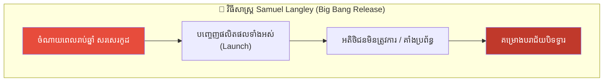
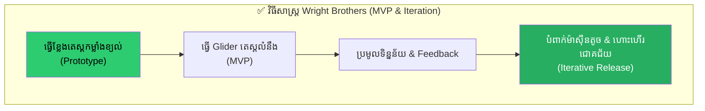
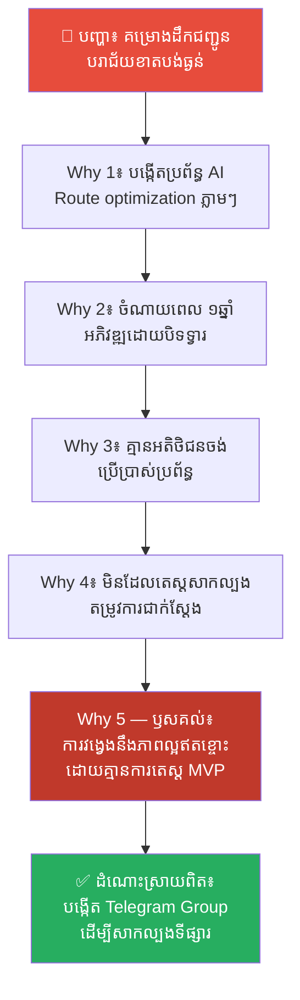
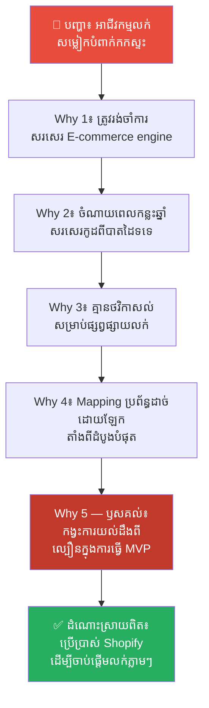
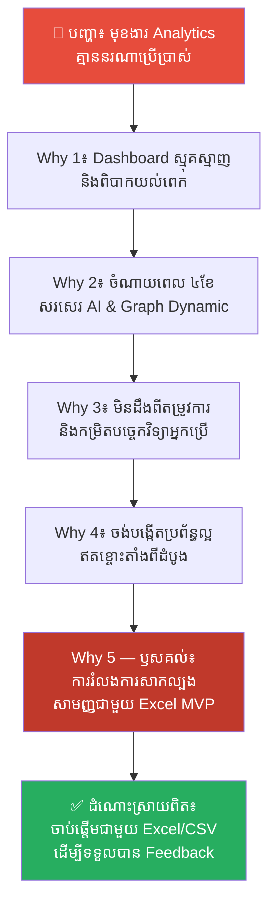
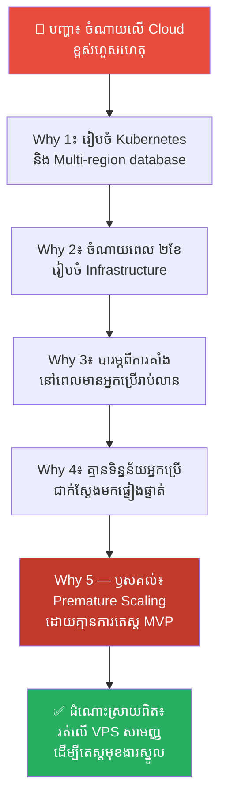
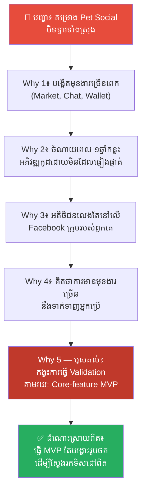
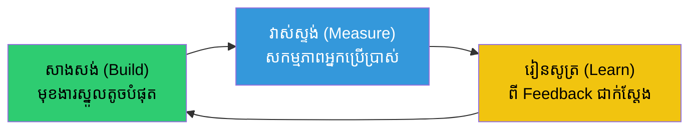

# The Wright Brothers and Minimum Viable Product (បងប្អូនត្រកូលរ៉ាយ និងផលិតផលសាកល្បងដំបូងបំផុត)៖ បរាជ័យឱ្យលឿន រៀនឱ្យរហ័ស ឈានទៅសម្រេចការហោះហើរពិតប្រាកដ

**Author:** ichamrong  
**Date:** 2026-05-17  
**Tags:** #mvp #agile #iteration #fail-fast #wright-brothers #startup  
**Category:** Concepts  
**Read Time:** ~15 min  

---

## 📌 មាតិកា (Table of Contents)
- [លំនាំបញ្ហា (The Pattern)](#លំនាំបញ្ហា-the-pattern)
- [១. បញ្ហា៖ គ្រោះថ្នាក់នៃការបញ្ចេញតែម្តង និងការវង្វេងនឹងភាពល្អឥតខ្ចោះ (The Issue: The Big Bang Release and Perfectionism)](#១-បញ្ហា-គ្រោះថ្នាក់នៃការបញ្ចេញតែម្តង-និងការវង្វេងនឹងភាពល្អឥតខ្ចោះ-the-issue-the-big-bang-release-and-perfectionism)
- [២. ឧទាហរណ៍ជាក់ស្តែងក្នុងពិភពពិត (Real World Examples)](#២-ឧទាហរណ៍ជាក់ស្តែងក្នុងពិភពពិត)
  - [ឧទាហរណ៍ទី ១ — កម្រិតស្រាល៖ ការបង្កើតកម្មវិធីដឹកជញ្ជូនទំនិញ (E-commerce Delivery Platform)](#ឧទាហរណ៍ទី-១-កម្រិតស្រាល-ការបង្កើតកម្មវិធីដឹកជញ្ជូនទំនិញ-e-commerce-delivery-platform)
  - [ឧទាហរណ៍ទី ២ — កម្រិតមធ្យម (បច្ចេកទេស)៖ ការបង្កើតប្រព័ន្ធលក់ទំនិញអនឡាញ (Custom E-commerce Engine vs. Shopify)](#ឧទាហរណ៍ទី-២-កម្រិតមធ្យម-បច្ចេកទេស-ការបង្កើតប្រព័ន្ធលក់ទំនិញអនឡាញ-custom-e-commerce-engine-vs-shopify)
  - [ឧទាហរណ៍ទី ៣ — កម្រិតមធ្យម (បច្ចេកទេស)៖ ការបង្កើតប្រព័ន្ធគណនានិងវិភាគទិន្នន័យ (Complex Analytics Dashboard before Data Entry)](#ឧទាហរណ៍ទី-៣-កម្រិតមធ្យម-បច្ចេកទេស-ការបង្កើតប្រព័ន្ធគណនានិងវិភាគទិន្នន័យ-complex-analytics-dashboard-before-data-entry)
  - [ឧទាហរណ៍ទី ៤ — កម្រិតមធ្យម (បច្ចេកទេស)៖ ការរៀបចំប្រព័ន្ធម៉ាស៊ីនបម្រើកម្រិតយក្សសម្រាប់គម្រោងគំរូ (Enterprise Scale for MVP)](#ឧទាហរណ៍ទី-៤-កម្រិតមធ្យម-បច្ចេកទេស-ការរៀបចំប្រព័ន្ធម៉ាស៊ីនបម្រើកម្រិតយក្សសម្រាប់គម្រោងគំរូ-enterprise-scale-for-mvp)
  - [ឧទាហរណ៍ទី ៥ — កម្រិតធ្ងន់៖ ការអភិវឌ្ឍផលិតផលផ្អែកលើការស្មានរបស់ស្ថាបនិក (Build Everything Before Validation)](#ឧទាហរណ៍ទី-៥-កម្រិតធ្ងន់-ការអភិវឌ្ឍផលិតផលផ្អែកលើការស្មានរបស់ស្ថាបនិក-build-everything-before-validation)
- [៣. កត្តាជម្រុញ៖ ការភ័យខ្លាចការបរាជ័យជាសាធារណៈ និងការលំអៀងទៅរកការប៉ាន់ស្មាន (The Aggravator: Fear of Public Failure and Estimation Bias)](#៣-កត្តាជម្រុញ-ការភ័យខ្លាចការបរាជ័យជាសាធារណៈ-និងការលំអៀងទៅរកការប៉ាន់ស្មាន-the-aggravator-fear-of-public-failure-and-estimation-bias)
- [៤. ដំណោះស្រាយទូទៅ៖ របៀបរៀនសូត្រពីបងប្អូនត្រកូលរ៉ាយ (The General Solution: How to Build and Iterate Like the Wright Brothers)](#៤-ដំណោះស្រាយទូទៅ-របៀបរៀនសូត្រពីបងប្អូនត្រកូលរ៉ាយ-the-general-solution-how-to-build-and-iterate-like-the-wright-brothers)
- [សេចក្តីសន្និដ្ឋាន (Conclusion)](#សេចក្តីសន្និដ្ឋាន-conclusion)
- [ឯកសារយោង (References)](#ឯកសារយោង-references)
- [Related Posts](#related-posts)

---

## លំនាំបញ្ហា (The Pattern)

តើអ្នកធ្លាប់ចំណាយពេលរាប់ខែ ឬរាប់ឆ្នាំ ដើម្បីអភិវឌ្ឍមុខងារកម្មវិធីដ៏ល្អឥតខ្ចោះមួយនៅក្នុងបន្ទប់បិទទ្វារ ដោយគិតថា៖ *«នៅពេលយើងបញ្ចេញកម្មវិធីដែលមានមុខងារគ្រប់គ្រាន់ និងស្រស់ស្អាតបំផុតនេះ នោះនឹងមានអតិថិជនរាប់លាននាក់សម្រុកមកប្រើប្រាស់ជាក់ជាមិនខាន»* ដែរឬទេ?

នេះគឺជាកំហុសដ៏ធ្ងន់ធ្ងរ និងឧស្សាហ៍កើតមានបំផុត ទាំងនៅក្នុងក្រុមហ៊ុន Startup និងសហគ្រាសបច្ចេកវិទ្យាធំៗ។ ផលវិបាកដែលទទួលបានគឺ៖
* ចំណាយពេលវេលា និងថវិការាប់ម៉ឺនដុល្លារលើមុខងារដែលគ្មាននរណាម្នាក់ចង់បាន។
* គ្មានឱកាសទទួលបាន Feedback ពីអ្នកប្រើប្រាស់ពិតប្រាកដ ដើម្បីកែប្រែប្រព័ន្ធទាន់ពេល។
* គម្រោងទាំងមូលត្រូវបរាជ័យ និងបាក់បែកបោកផ្ទប់នឹងដីនៅថ្ងៃដំបូងនៃការបញ្ចេញផលិតផល (Launch Day)។

ដើម្បីចៀសវាងបញ្ហានេះ វិស្វករគួរតែរៀនសូត្រពីរបៀបដែល **បងប្អូនត្រកូលរ៉ាយ (The Wright Brothers)** យកឈ្នះលើគូប្រជែងដែលមានលុយ និងធនធានច្រើនជាងពួកគេរាប់ពាន់ដង។ ពួកគេមិនបានសាងសង់យន្តហោះដ៏ធំដែលមានម៉ាស៊ីនតាំងពីថ្ងៃដំបូងឡើយ ប៉ុន្តែពួកគេបានចាប់ផ្តើមជាមួយ **MVP (Minimum Viable Product)** និងធ្វើការកែលម្អបន្តបន្ទាប់ (Iterative Testing) យ៉ាងរហ័ស។

---

## ១. បញ្ហា៖ គ្រោះថ្នាក់នៃការបញ្ចេញតែម្តង និងការវង្វេងនឹងភាពល្អឥតខ្ចោះ (The Issue: The Big Bang Release and Perfectionism)

នៅចុងសតវត្សរ៍ទី ១៩ រដ្ឋាភិបាលអាមេរិកបានផ្តល់ថវិការាប់ម៉ឺនដុល្លារដល់លោក **Samuel Langley** ដែលជាអ្នកវិទ្យាសាស្ត្រដ៏ល្បីល្បាញ ដើម្បីសាងសង់ម៉ាស៊ីនហោះហើរដំបូងបង្អស់។ វិធីសាស្ត្ររបស់ Langley គឺការសាងសង់យន្តហោះដែលមានម៉ាស៊ីនពេញលេញ និងល្អឥតខ្ចោះនៅក្នុងបន្ទប់ពិសោធន៍សម្ងាត់ ដោយមិនធ្លាប់យកវាទៅធ្វើការសាកល្បងហោះហើរខ្នាតតូចសោះឡើយ។ 

នៅថ្ងៃដែលគាត់បញ្ចេញយន្តហោះជាសាធារណៈ យន្តហោះនោះបានធ្លាក់ចូលទៅក្នុងទន្លេ Potomac ភ្លាមៗ និងបរាជ័យទាំងស្រុង ព្រោះគាត់មិនបានយល់ដឹងពីរបៀបគ្រប់គ្រងយន្តហោះ និងតុល្យភាពខ្យល់ឡើយ។

ផ្ទុយទៅវិញ **បងប្អូនត្រកូលរ៉ាយ (The Wright Brothers)** ដែលគ្រាន់តែជាជាងជួសជុលកង់សាមញ្ញ និងគ្មានថវិការដ្ឋឡើយ តែពួកគេយល់ច្បាស់ពីយុទ្ធសាស្ត្រ **Fail Fast, Learn Fast (បរាជ័យឱ្យលឿន រៀនឱ្យរហ័ស)**៖

បងប្អូនត្រកូលរ៉ាយបានបំបែកយន្តហោះទៅជាផ្នែកតូចៗ៖
1. **ខ្លែង (Kite)**៖ ដើម្បីតេស្តកម្លាំងខ្យល់ និងការបត់បែន (Prototype)។
2. **យន្តហោះរអិល (Glider) គ្មានម៉ាស៊ីន**៖ ដើម្បីរៀនគ្រប់គ្រងតុល្យភាពលំនឹងនៅលើអាកាស (Minimum Viable Product)។
3. **យន្តហោះមានម៉ាស៊ីន (The Wright Flyer)**៖ ពួកគេគ្រាន់តែបំពាក់ម៉ាស៊ីនតូចមួយទៅលើ Glider ដែលមានលំនឹងល្អរួចជាស្រេច ដើម្បីសម្រេចការហោះហើរដំបូងក្នុងប្រវត្តិសាស្ត្រ។

នៅក្នុងការអភិវឌ្ឍន៍កម្មវិធីកុំព្យូទ័រ **MVP (Minimum Viable Product)** គឺជាកំណែទម្រង់ផលិតផលតូចបំផុត ដែលមានមុខងារចាំបាច់បំផុត (Core Features) ដើម្បីដោះស្រាយបញ្ហាជាក់ស្តែងជូនអតិថិជន។ វាជួយការពារអ្នកពីការចំណាយពេលរាប់ឆ្នាំដើម្បីសរសេរកូដដែលគ្មាននរណាម្នាក់ចង់បាន។

---

## ២. ឧទាហរណ៍ជាក់ស្តែងក្នុងពិភពពិត

នេះជា **ឧទាហរណ៍ជាក់ស្តែងចំនួន ៥** បង្ហាញពីរបៀបដែលការបង្កើត MVP និងការកែលម្អបន្តបន្ទាប់ជួយសង្គ្រោះគម្រោងពីការបរាជ័យ៖

---

### ឧទាហរណ៍ទី ១ — កម្រិតស្រាល៖ ការបង្កើតកម្មវិធីដឹកជញ្ជូនទំនិញ (E-commerce Delivery Platform)

**ស្ថានភាព (Situation)៖** ស្ថាបនិកចង់បង្កើតកម្មវិធីទូរស័ព្ទដឹកជញ្ជូនទំនិញ (Delivery Platform) ដ៏ធំទូលាយទូទាំងប្រទេស។

**សកម្មភាពខុសឆ្គង (Wrong Action)៖** ពួកគេចំណាយពេល ១ ឆ្នាំ និងថវិកា ៥ ម៉ឺនដុល្លារ ដើម្បីសរសេរកូដរៀបចំ AI Route Optimization, Live Tracking, និង Automated Billing System តាំងពីថ្ងៃដំបូង ដោយមិនទាន់មានអតិថិជនប្រើប្រាស់សាកល្បងសូម្បីតែម្នាក់។ នៅថ្ងៃ Launch គ្មានអ្នកណាម្នាក់ដំឡើងកម្មវិធីប្រើឡើយ។

**ការវិភាគបែប 5 Whys៖**

| # | សំណួរ (Why?) | ចម្លើយ (Answer) |
|---|---|---|
| 1 | ហេតុអ្វីបានជាគម្រោងដឹកជញ្ជូនត្រូវបរាជ័យខាតបង់ថវិកាធ្ងន់ធ្ងរ? | ពីព្រោះគ្មានអតិថិជនណាម្នាក់ដំឡើង ឬប្រើប្រាស់កម្មវិធីទូរស័ព្ទនោះឡើយ។ |
| 2 | ហេតុអ្វីបានជាគ្មាននរណាចាប់អារម្មណ៍ចង់ដំឡើងកម្មវិធីប្រើប្រាស់? | ពីព្រោះពួកគេធ្លាប់ប្រើប្រាស់ការផ្ញើសារតាម Telegram និង Facebook ដើម្បីហៅដឹកជញ្ជូនដែលងាយស្រួល និងទម្លាប់ជាង។ |
| 3 | ហេតុអ្វីបានជាមិនដឹងថាអតិថិជនចូលចិត្តប្រើប្រាស់ Telegram ជាងការដំឡើង App ថ្មី? | ពីព្រោះក្រុមការងារអភិវឌ្ឍន៍មិនដែលបានបញ្ចេញកម្មវិធីសាកល្បង ឬសួរមតិអ្នកប្រើប្រាស់សូម្បីតែម្តង ក្នុងអំឡុងពេលសរសេរកូដ ១ ឆ្នាំនោះ។ |
| 4 | ហេតុអ្វីបានជាមិនបានសាកល្បងទីផ្សារជាមុនសិន មុនពេលចំណាយពេលសរសេរកូដដ៏ស្មុគស្មាញ? | ពីព្រោះពួកគេជឿជាក់ថា ដើម្បីប្រកួតប្រជែងបាន ពួកគេត្រូវតែមានមុខងារ AI ទំនើប និងកម្មវិធីស្អាតឥតខ្ចោះតាំងពីថ្ងៃដំបូង។ |
| 5 | ហេតុអ្វីបានជាវង្វេងនឹងភាពល្អឥតខ្ចោះជាជាងការបញ្ជាក់តម្រូវការជាក់ស្តែង? | **ពីព្រោះខ្វះការយល់ដឹងអំពីគោលការណ៍ Minimum Viable Product (MVP) និងការរំលងការធ្វើ Validation ទីផ្សារខ្នាតតូច ដោយសម្រេចចិត្តផ្អែកលើការស្មានរបស់ខ្លួនឯងជានិច្ច។** |

**ដំណោះស្រាយពិតប្រាកដ៖** បង្កើត MVP សាមញ្ញបំផុតដោយប្រើត្រឹមតែ Telegram Group ឬ Google Form មួយ ដែលអតិថិជនអាចបំពេញព័ត៌មានកក់ការដឹកជញ្ជូន ហើយស្ថាបនិកខ្លួនឯងជាអ្នកបើកម៉ូតូដឹកផ្ទាល់ខ្លួន ដើម្បីតេស្តទីផ្សារ។ បន្ទាប់ពីមានអតិថិជនប្រើប្រាស់រាប់រយនាក់ពិតប្រាកដ ទើបចាប់ផ្តើមសរសេរកូដបង្កើត App ជាក្រោយ។

---

### ឧទាហរណ៍ទី ២ — កម្រិតមធ្យម (បច្ចេកទេស)៖ ការបង្កើតប្រព័ន្ធលក់ទំនិញអនឡាញ (Custom E-commerce Engine vs. Shopify)

**ស្ថានភាព (Situation)៖** អាជីវកម្មលក់សម្លៀកបំពាក់កីឡាមួយចង់សាកល្បងពង្រីកទីផ្សារលក់ទំនិញតាមអនឡាញទូទាំងប្រទេស។

**សកម្មភាពខុសឆ្គង (Wrong Action)៖** ពួកគេបានជួលក្រុម Developer ឱ្យសរសេរកូដបង្កើត E-commerce Engine ផ្ទាល់ខ្លួនពីបាតដៃទទេ (សរសេរប្រព័ន្ធកន្ត្រកទំនិញ custom, database architecture, និង custom admin dashboard) ដែលចំណាយពេលអស់ ៦ ខែ និងថវិការាប់ម៉ឺនដុល្លារ ប៉ុន្តែនៅតែជួបប្រទះ Bugs ច្រើននិងមិនទាន់អាចលក់ទំនិញបានឡើយ។

**ការវិភាគបែប 5 Whys៖**

| # | សំណួរ (Why?) | ចម្លើយ (Answer) |
|---|---|---|
| 1 | ហេតុអ្វីបានជាអាជីវកម្មលក់សម្លៀកបំពាក់អនឡាញកកស្ទះ និងមិនទាន់បានលក់ទំនិញដំបូង? | ពីព្រោះវេបសាយលក់ទំនិញផ្ទាល់ខ្លួនមិនទាន់សរសេរកូដរួចរាល់ និងនៅមាន Bug ច្រើន។ |
| 2 | ហេតុអ្វីបានជាការសរសេរកូដវេបសាយមានភាពយឺតយ៉ាវ និងស្មុគស្មាញយ៉ាងនេះ? | ពីព្រោះក្រុមការងារត្រូវសរសេរកូដរាល់មុខងារទាំងអស់ (Payment, Inventory, UI) ពីបាតដៃទទេដោយគ្មានជំនួយ។ |
| 3 | ហេតុអ្វីបានជាត្រូវសរសេរកូដរាល់មុខងារលក់ទំនិញពីបាតដៃទទេ ទាំងដែលមានកម្មវិធីស្រាប់? | ពីព្រោះពួកគេគិតថា ការប្រើប្រាស់វេបសាយស្រាប់ (ដូចជា Shopify) មិនអាចកែប្រែតាមចិត្តបាន និងមើលទៅគ្មានលក្ខណៈអាជីព។ |
| 4 | ហេតុអ្វីបានជាបារម្ភពីរឿងកែប្រែ App និងភាពស្អាតឥតខ្ចោះ ទាំងដែលមិនទាន់មានអតិថិជនសូម្បីតែម្នាក់មកទិញទំនិញ? | ពីព្រោះពួកគេមិនធ្លាប់តេស្តទីផ្សារ ឬល្បឿននៃការលក់សម្លៀកបំពាក់តាមអនឡាញថាមានប្រសិទ្ធភាពដែរឬទេ។ |
| 5 | ហេតុអ្វីបានជាចំណាយពេលសរសេរកូដជាជាងការផ្តោតលើល្បឿនទីផ្សារ? | **ពីព្រោះខ្វះការយល់ដឹងពីយុទ្ធសាស្ត្រ No-Code/Low-Code MVP ដែលអនុញ្ញាតឱ្យប្រើប្រាស់ Platform ស្រាប់ដើម្បីធ្វើតេស្តសម្មតិកម្មទីផ្សារ មុនពេលវិនិយោគលើការសរសេរកូដពីបាតដៃទទេ (Inventing the Wheel)។** |

**ដំណោះស្រាយពិតប្រាកដ៖** ប្រើប្រាស់ Shopify ឬ WooCommerce ដើម្បីបង្កើតវេបសាយលក់ទំនិញក្នុងរយៈពេលតែ ២ ថ្ងៃ ដោយចំណាយថវិកាតិចតួចបំផុត ដើម្បីសាកល្បងលក់ទំនិញ និងទាក់ទាញអតិថិជនដំបូង។ នៅពេលដែលអាជីវកម្មរីកចម្រើនខ្លាំង និងមានតម្រូវការពិសេស ទើបចាប់ផ្តើមសរសេរកូដបង្កើតប្រព័ន្ធផ្ទាល់ខ្លួនតាមក្រោយ។

---

### ឧទាហរណ៍ទី ៣ — កម្រិតមធ្យម (បច្ចេកទេស)៖ ការបង្កើតប្រព័ន្ធគណនានិងវិភាគទិន្នន័យ (Complex Analytics Dashboard before Data Entry)

**ស្ថានភាព (Situation)៖** ក្រុមហ៊ុនអភិវឌ្ឍន៍ប្រព័ន្ធគ្រប់គ្រងសាលារៀន (School Management System) ចង់បង្កើតមុខងារវិភាគទិន្នន័យសិក្សារបស់សិស្ស (Student Performance Analytics) សម្រាប់នាយកសាលា។

**សកម្មភាពខុសឆ្គង (Wrong Action)៖** ពួកគេចំណាយពេល ៤ ខែរចនា Dashboard ដ៏ស្មុគស្មាញ មានក្រាហ្វិក 3D, AI Prediction, និង Dynamic Filters ជាច្រើន ដោយមិនទាន់មានសាលារៀនណាបញ្ចូលទិន្នន័យសិស្សគ្រប់គ្រាន់ ឬនាយកសាលាចេះប្រើប្រាស់ក្រាហ្វិកទាំងនោះឡើយ។ ជាលទ្ធផល គ្មាននាយកសាលាណាប្រើប្រាស់មុខងារនេះឡើយ។

**ការវិភាគបែប 5 Whys៖**

| # | សំណួរ (Why?) | ចម្លើយ (Answer) |
|---|---|---|
| 1 | ហេតុអ្វីបានជាមុខងារវិភាគទិន្នន័យដ៏ទំនើប គ្មានសាលារៀនណាប្រើប្រាស់ទាល់តែសោះ? | ពីព្រោះនាយកសាលាយល់ថាវាស្មុគស្មាញ ពិបាកយល់ និងមិនចង់ប្រើប្រាស់វាឡើយ។ |
| 2 | ហេតុអ្វីបានជានាយកសាលាយល់ថាវាស្មុគស្មាញ និងមិនចង់ប្រើប្រាស់? | ពីព្រោះក្រាហ្វិក 3D និង AI metrics មិនបង្ហាញពីព័ត៌មានសាមញ្ញដែលពួកគេត្រូវការប្រចាំថ្ងៃ (ដូចជា ចំនួនសិស្សអវត្តមាន ឬពិន្ទុធ្លាក់) ឡើយ។ |
| 3 | ហេតុអ្វីបានជាក្រុមការងារបង្កើតក្រាហ្វិកស្មុគស្មាញ ជំនួសឱ្យការបង្ហាញទិន្នន័យសាមញ្ញ? | ពីព្រោះក្រុមការងារ Developer ស្មានថា ការមានក្រាហ្វិកស្មុគស្មាញ និងប្រើប្រាស់ AI នឹងធ្វើឱ្យប្រព័ន្ធមើលទៅទំនើប និងមានតម្លៃខ្ពស់។ |
| 4 | ហេតុអ្វីបានជាសម្រេចចិត្តអភិវឌ្ឍមុខងារផ្អែកលើការស្មានរបស់ Developer? | ពីព្រោះពួកគេមិនធ្លាប់បង្កើតឧបករណ៍សាមញ្ញបំផុត ដើម្បីតេស្តមើលតម្រូវការ និងកម្រិតបច្ចេកវិទ្យារបស់នាយកសាលាមុនពេលសរសេរកូដឡើយ។ |
| 5 | ហេតុអ្វីបានជារំលងការធ្វើតេស្តសាមញ្ញជាមួយអ្នកប្រើប្រាស់ពិត? | **ពីព្រោះការវង្វេងនឹងការបង្កើតមុខងារស្មុគស្មាញ (Feature-rich Trap) និងការខកខានក្នុងការបង្កើត MVP កម្រិតសាមញ្ញបំផុត (ដូចជាការនាំចេញទិន្នន័យជា Excel) ដើម្បីប្រមូល Feedback ពីអ្នកប្រើប្រាស់ជាក់ស្តែង។** |

**ដំណោះស្រាយពិតប្រាកដ៖** បង្កើត MVP កម្រិតសាមញ្ញបំផុត ដោយគ្រាន់តែបង្កើតប៊ូតុង «ទាញយកទិន្នន័យជា Excel» មួយ។ សង្កេតមើលថាតើនាយកសាលាឧស្សាហ៍ចុចទាញយកទិន្នន័យអ្វីខ្លះទៅវិភាគ។ បន្ទាប់មក ទើបយកទិន្នន័យ Excel ទាំងនោះមកកែច្នៃជាក្រាហ្វិកសាមញ្ញ និងចំគោលដៅពិតប្រាកដនៅលើ Dashboard។

---

### ឧទាហរណ៍ទី ៤ — កម្រិតមធ្យម (បច្ចេកទេស)៖ ការរៀបចំប្រព័ន្ធម៉ាស៊ីនបម្រើកម្រិតយក្សសម្រាប់គម្រោងគំរូ (Enterprise Scale for MVP)

**ស្ថានភាព (Situation)៖** ក្រុមការងារត្រូវការដាក់ឱ្យដំណើរការគម្រោងសាកល្បង MVP នៃកម្មវិធីគ្រប់គ្រងភារកិច្ចការងារក្នុងក្រុមហ៊ុន (Task Management App) សម្រាប់បុគ្គលិក ២០ នាក់សាកល្បងប្រើប្រាស់។

**សកម្មភាពខុសឆ្គង (Wrong Action)៖** ពួកគេបានចំណាយពេល ២ ខែ ដើម្បីរៀបចំប្រព័ន្ធ Kubernetes, Multi-region database, CDNs, និងប្រព័ន្ធ Cloud Monitoring ថ្លៃៗ ព្រោះបារម្ភថានឹងមានការគាំងប្រព័ន្ធនៅពេលមានអ្នកប្រើប្រាស់រាប់លាននាក់នាពេលអនាគត។

**ការវិភាគបែប 5 Whys៖**

| # | សំណួរ (Why?) | ចម្លើយ (Answer) |
|---|---|---|
| 1 | ហេតុអ្វីបានជាការបញ្ចេញ App ឱ្យបុគ្គលិកសាកល្បងប្រើត្រូវពន្យារពេលដល់ទៅ ២ ខែ? | ពីព្រោះក្រុមការងារបច្ចេកទេសត្រូវចំណាយពេលទាំងស្រុងទៅលើការរៀបចំ និងតេស្តប្រព័ន្ធ Cloud Infrastructure ដ៏ស្មុគស្មាញ។ |
| 2 | ហេតុអ្វីបានជាត្រូវរៀបចំប្រព័ន្ធ Cloud ស្មុគស្មាញសម្រាប់តែអ្នកប្រើប្រាស់ ២០ នាក់? | ពីព្រោះពួកគេចង់ធានាថា ប្រព័ន្ធអាចធ្វើការ Scale ឡើងបានភ្លាមៗ និងមិនមានបញ្ហា Downtime នៅពេលអនាគត។ |
| 3 | ហេតុអ្វីបានជាបារម្ភពីការ Scale ទៅអនាគត ទាំងដែលបច្ចុប្បន្ននៅមិនទាន់ដឹងថា App នេះមានប្រយោជន៍ឬអត់? | ពីព្រោះពួកគេគិតថា ការរៀបចំប្រព័ន្ធតូចតាចពីដំបូង នឹងធ្វើឱ្យពិបាកផ្លាស់ប្តូរទៅជាប្រព័ន្ធធំនៅពេលក្រោយ។ |
| 4 | ហេតុអ្វីបានជាយល់ច្រឡំថាការរៀបចំ Infrastructure ធំពីដំបូងជាការល្អ ទាំងដែលវាខ្ជះខ្ជាយធនធាន? | ពីព្រោះពួកគេមិនធ្លាប់កំណត់ព្រំដែន និងលក្ខខណ្ឌជាក់ស្តែងសម្រាប់ដំណាក់កាល MVP ឡើយ។ |
| 5 | ហេតុអ្វីបានជាមិនបែងចែកដំណាក់កាល MVP និងការធ្វើ Scale ឱ្យដាច់ពីគ្នា? | **ពីព្រោះការធ្លាក់ចូលទៅក្នុងអន្ទាក់ «Premature Scaling (ការធ្វើមាត្រដ្ឋានមុនអាយុកាល)» និងការខកខានក្នុងការដឹងថា គោលដៅរបស់ MVP គឺដើម្បីតេស្តមុខងារស្នូល (Functional Validation) មិនមែនតេស្តល្បឿនប្រព័ន្ធកម្រិតពិភពលោកឡើយ។** |

**ដំណោះស្រាយពិតប្រាកដ៖** ដាក់ឱ្យដំណើរការ App នៅលើ Server ធម្មតាមួយ (VPS តែមួយ Instance) ដែលចំណាយពេលរៀបចំតែ ១ ថ្ងៃ និងចំណាយថវិការ ៥ ដុល្លារក្នុងមួយខែ។ ផ្តោតពេលវេលាទាំងស្រុងលើការអភិវឌ្ឍ និងកែលម្អមុខងារកម្មវិធីតាមតម្រូវការបុគ្គលិក ២០ នាក់នោះ។ នៅពេលមានការប្រើប្រាស់កាន់តែច្រើនពិតប្រាកដ ទើបចាប់ផ្តើមធ្វើការ Scale Infrastructure តាមក្រោយ។

---

### ឧទាហរណ៍ទី ៥ — កម្រិតធ្ងន់៖ ការអភិវឌ្ឍផលិតផលផ្អែកលើការស្មានរបស់ស្ថាបនិក (Build Everything Before Validation)

**ស្ថានភាព (Situation)៖** ក្រុមហ៊ុន Startup មួយចង់បង្កើតបណ្តាញសង្គមថ្មីសម្រាប់អ្នកចូលចិត្តចិញ្ចឹមសត្វ (Pet Lovers Social Network)។

**សកម្មភាពខុសឆ្គង (Wrong Action)៖** ពួកគេបានប្រមូលក្រុមវិស្វករអភិវឌ្ឍន៍មុខងារពេញលេញតាំងពីដំបូង រួមមាន៖ Feed, Video Streaming, Pet Market, Chat Room, Wallet, និង Pet Insurance System មុនពេលសាកល្បងថាតើមានអ្នកប្រើប្រាស់ពិតជាត្រូវការបណ្តាញសង្គមដាច់ដោយឡែកពី Facebook ដែរឬទេ។ ជាលទ្ធផល គម្រោងត្រូវបិទទ្វារទាំងស្រុងបន្ទាប់ពីបញ្ចេញបាន ២ ខែ ព្រោះគ្មានអ្នកប្រើប្រាស់ទាល់តែសោះ។

**ការវិភាគបែប 5 Whys៖**

| # | សំណួរ (Why?) | ចម្លើយ (Answer) |
|---|---|---|
| 1 | ហេតុអ្វីបានជាគម្រោងបណ្តាញសង្គមសត្វចិញ្ចឹម ត្រូវបិទទ្វារទាំងស្រុងយ៉ាងរហ័ស? | ពីព្រោះគ្មានអ្នកប្រើប្រាស់ចុះឈ្មោះលេង ឬប្រើប្រាស់មុខងារនានានៅលើ App ឡើយ។ |
| 2 | ហេតុអ្វីបានជាគ្មានអ្នកចុះឈ្មោះលេង ទាំងដែលមានមុខងារច្រើននិងស្រស់ស្អាត? | ពីព្រោះពួកគេចូលចិត្តលេង និងពិភាក្សាគ្នានៅលើ Facebook Group ដែលមានស្រាប់ និងមានមិត្តភក្តិច្រើនជាស្រេចទៅហើយ។ |
| 3 | ហេតុអ្វីបានជាមិនដឹងថាអ្នកចិញ្ចឹមសត្វចង់បានតែសហគមន៍ទិញលក់ឧបករណ៍ ជាជាងបណ្តាញសង្គមថ្មី? | ពីព្រោះក្រុមការងារអភិវឌ្ឍន៍មិនដែលបានបញ្ចេញមុខងារសាមញ្ញណាមួយដើម្បីសាកល្បងចំណាប់អារម្មណ៍របស់ពួកគេជាមុនឡើយ។ |
| 4 | ហេតុអ្វីបានជាខំប្រឹងបង្កើតមុខងារច្រើនយ៉ាងនេះ ទាំងដែលមិនធ្លាប់បានធ្វើតេស្តសាកល្បង? | ពីព្រោះស្ថាបនិកជឿជាក់ថា App ត្រូវតែមានមុខងារគ្រប់ជ្រុងជ្រោយ (All-in-one platform) ទើបអាចទាក់ទាញអ្នកប្រើប្រាស់ឱ្យចាកចេញពី Facebook មកបាន។ |
| 5 | ហេតុអ្វីបានជាពឹងផ្អែកលើជំនឿចិត្តរបស់ខ្លួនឯង ជាជាងការផ្ទៀងផ្ទាត់សម្មតិកម្មជាក់ស្តែង? | **ពីព្រោះខ្វះការធ្វើ Validation ទីផ្សារតាមរយៈ Core-feature MVP ដែលមានគោលដៅតេស្តសម្មតិកម្មដែលមានហានិភ័យខ្ពស់បំផុត (Riskeast Assumptions) មុនពេលចំណាយថវិកាសាងសង់ប្រព័ន្ធទាំងមូល។** |

**ដំណោះស្រាយពិតប្រាកដ៖** បង្កើត MVP ដែលមានតែមុខងារសាមញ្ញមួយគត់ គឺការបង្ហោះរូបថតសត្វចិញ្ចឹម និងការខមិនសាមញ្ញ ដើម្បីសាកល្បងសកម្មភាពសហគមន៍។ នៅពេលដែលឃើញអ្នកប្រើប្រាស់ចាប់ផ្តើមជជែកគ្នាច្រើនពីការទិញចំណី និងឧបករណ៍សត្វចិញ្ចឹម ពួកគេនឹងយល់ដឹងពីទិសដៅពិតប្រាកដ ហើយកែប្រែប្រព័ន្ធ (Pivot) មកផ្តោតលើការបង្កើត Pet Market វិញ ដែលជួយឱ្យគម្រោងទទួលបានជោគជ័យ។

---

## ៣. កត្តាជម្រុញ៖ ការភ័យខ្លាចការបរាជ័យជាសាធារណៈ និងការលំអៀងទៅរកការប៉ាន់ស្មាន (The Aggravator: Fear of Public Failure and Estimation Bias)

ហេតុអ្វីបានជាស្ថាបនិក និងវិស្វករជាច្រើននៅតែបន្តបង្កើតគម្រោងយក្សមុនការផ្ទៀងផ្ទាត់ ទោះបីជាដឹងពីហានិភ័យក៏ដោយ?

**ការភ័យខ្លាចការបរាជ័យជាសាធារណៈ (Fear of Public Failure)៖**  
យើងតែងតែចង់ឱ្យផលិតផលរបស់យើងបង្ហាញខ្លួនជាលើកដំបូងដោយភាពស្រស់ស្អាត គ្មានចន្លោះប្រហោង និងមានមុខងារគ្រប់គ្រាន់ ដើម្បីទទួលបានការសរសើរពីសហគមន៍។ ការភ័យខ្លាចការបញ្ចេញកម្មវិធីដែលមានមុខងារតិចតួច ឬមានកូដធូររលុង ធ្វើឱ្យយើងពន្យារពេលបញ្ចេញ MVP និងបន្តសរសេរកូដនៅក្នុងបន្ទប់បិទទ្វារកាន់តែយូរឡើងៗ ដែលបង្កើនហានិភ័យនៃការបរាជ័យកាន់តែធំ។

**ការលំអៀងទៅរកការប៉ាន់ស្មាន (Estimation Bias)៖**  
យើងតែងតែលំអៀង និងជឿជាក់ហួសហេតុលើ «សមត្ថភាពប៉ាន់ស្មាន និងការយល់ដឹងពីទីផ្សាររបស់ខ្លួនឯង»។ ស្ថាបនិកភាគច្រើនតែងតែគិតថា «ខ្ញុំដឹងច្បាស់ថាអតិថិជនចង់បានអ្វី» ដូច្នេះពួកគេរំលងដំណាក់កាលតេស្ត MVP និងបោះជំហានទៅបង្កើតគម្រោងយក្សតែម្តង។

---

## ៤. ដំណោះស្រាយទូទៅ៖ របៀបរៀនសូត្រពីបងប្អូនត្រកូលរ៉ាយ (The General Solution: How to Build and Iterate Like the Wright Brothers)

ដើម្បីបង្កើតប្រព័ន្ធបច្ចេកវិទ្យា និងអាជីវកម្មដែលមានប្រសិទ្ធភាពខ្ពស់ និងគ្មានការខាតបង់ធនធាន សូមអនុវត្តតាមគោលការណ៍ទាំងនេះ៖

### ១. កំណត់មុខងារស្នូលតែមួយគត់ (Define the Core Value Proposition)
សួរខ្លួនឯងថា៖ *«តើមុខងារអ្វីតែមួយគត់ដែលប្រសិនបើគ្មានវា កម្មវិធីនេះនឹងលែងមានន័យ?»* (ដូចជា តុល្យភាពលំនឹងសម្រាប់យន្តហោះ)។ បង្កើតតែមុខងារនោះមុនគេ និងកាត់ចោលរាល់មុខងារបន្ទាប់បន្សំផ្សេងទៀត (ដូចជា ម៉ាស៊ីន ឬបន្ទប់អ្នកដំណើរ)។

### ២. បង្កើតរង្វង់ Feedback លឿនបំផុត (Accelerate the Feedback Loop)
បញ្ចេញ MVP ទៅកាន់ទីផ្សារឱ្យលឿនបំផុត ដើម្បីទទួលបានទិន្នន័យជាក់ស្តែងពីអ្នកប្រើប្រាស់។ ប្រើប្រាស់ Feedback ទាំងនោះដើម្បីកំណត់ទិសដៅអភិវឌ្ឍន៍មុខងារបន្ទាប់។ ចងចាំថា៖ *«មតិកែលម្អពីអតិថិជន ១០ នាក់ មានតម្លៃជាងការប្រជុំប៉ាន់ស្មានរបស់ក្រុមការងារ ១០ ម៉ោង»*។

### ៣. អនុវត្តយុទ្ធសាស្ត្រ Build-Measure-Learn
កុំសាងសង់យន្តហោះ Boeing 747 ពីដំបូងឡើយ។ ចាប់ផ្តើមសាងសង់ខ្លែង (Prototype) រួចអភិវឌ្ឍទៅជាយន្តហោះរអិល Glider (MVP) និងធ្វើការកែលម្អបន្តបន្ទាប់ (Iterate) រហូតដល់សម្រេចបានយន្តហោះពិតប្រាកដ។

---

## សេចក្តីសន្និដ្ឋាន (Conclusion)

ការសាងសង់គម្រោងយក្ស និងរំពឹងភាពល្អឥតខ្ចោះតាំងពីថ្ងៃដំបូងដោយគ្មានការផ្ទៀងផ្ទាត់ ដូចជាវិធីសាស្ត្ររបស់ Samuel Langley គឺជាការសម្លាប់គម្រោងរបស់ខ្លួនឯងយ៉ាងស្ងៀមស្ងាត់។ 

ចូរធ្វើខ្លួនជាវិស្វករ និងស្ថាបនិកដ៏ឆ្លាតវៃ ដោយដើរតាមគន្លងរបស់ **បងប្អូនត្រកូលរ៉ាយ**។ ចាប់ផ្តើមដោយភាពសាមញ្ញ ផ្តោតលើមុខងារស្នូលតូចបំផុត បញ្ចេញ MVP ទៅកាន់ទីផ្សារឱ្យបានរហ័ស ហ៊ានទទួលការបរាជ័យខ្នាតតូចដើម្បីរៀនសូត្រ និងធ្វើការអភិវឌ្ឍបន្តបន្ទាប់យ៉ាងសកម្ម។ នេះគឺជាមធ្យោបាយតែមួយគត់ដើម្បីសាងសង់ផលិតផលដែលមានប្រយោជន៍ពិតប្រាកដ និងទទួលបានជោគជ័យដ៏រឹងមាំយូរអង្វែង។

---

## ឯកសារយោង (References)

1. **Ries, E. (2011).** *The Lean Startup: How Today's Entrepreneurs Use Continuous Innovation to Create Radically Successful Businesses.* Crown Business.
2. **McCullough, D. (2015).** *The Wright Brothers.* Simon & Schuster.
3. **Blank, S. (2013).** *Why the Lean Start-Up Changes Everything.* Harvard Business Review.
4. **Maurya, A. (2012).** *Running Lean: Iterate from Plan A to a Plan That Works.* O'Reilly Media.

---

## Related Posts

* **[43 Steve Jobs and Feature Bloat](./43-steve-jobs-and-feature-bloat.md)** — ការបដិសេធមុខងារបន្ទាប់បន្សំដើម្បីរក្សាភាពសាមញ្ញនៃផលិតផល។
* **[39 Icarus and Premature Scaling](./39-icarus-and-premature-scaling.md)** — គ្រោះថ្នាក់នៃការហោះហើរកៀកព្រះអាទិត្យពេក និងការធ្វើមាត្រដ្ឋានលឿនហួសកម្រិត។
* **[10 Technical Debt and Refactoring](./10-technical-debt-and-refactoring.md)** — របៀបគ្រប់គ្រងកូដឱ្យមានតុល្យភាព ដើម្បីកុំឱ្យស្ទះល្បឿន MVP។

---

*Last updated: 2026-05-26*
