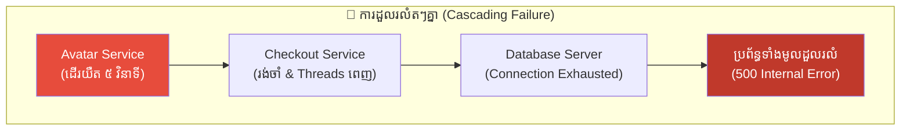
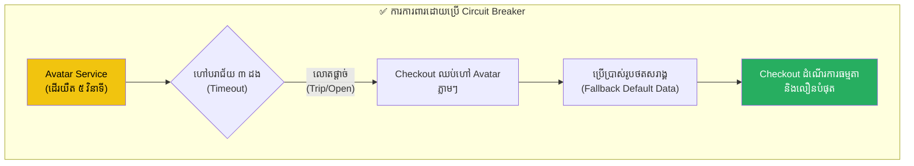
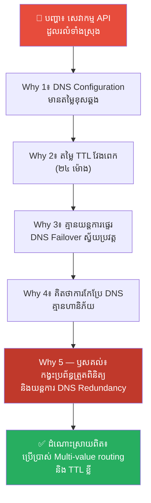
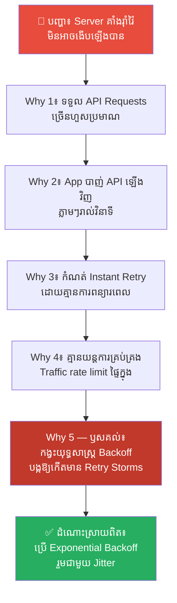
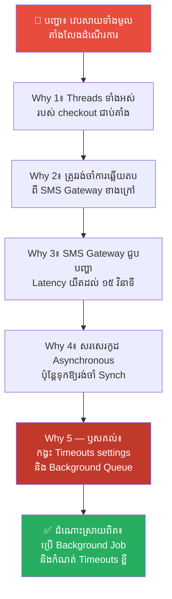
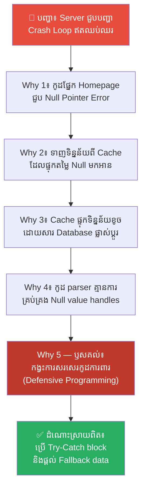
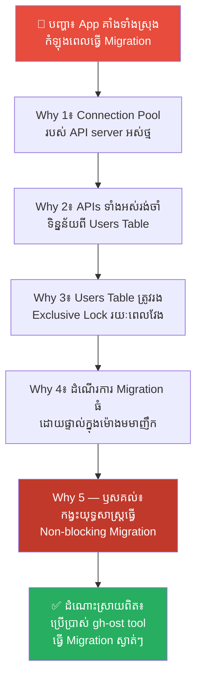
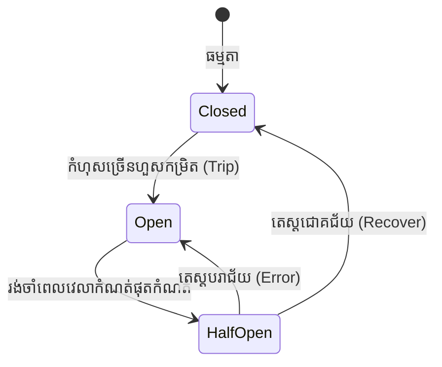

# The Butterfly Effect and Cascading Failures (ឥទ្ធិពលមេអំបៅ និងការដួលរលំតៗគ្នា)៖ របៀបការពារកំហុសតូចតាច មិនឱ្យបំផ្លាញប្រព័ន្ធទាំងមូល

**Author:** ichamrong  
**Date:** 2026-05-17  
**Tags:** #butterfly-effect #cascading-failures #circuit-breaker #microservices #system-design  
**Category:** Concepts  
**Read Time:** ~16 min  

---

## 📌 មាតិកា (Table of Contents)
- [លំនាំបញ្ហា (The Pattern)](#លំនាំបញ្ហា-the-pattern)
- [១. បញ្ហា៖ ឥទ្ធិពលមេអំបៅ និងការដួលរលំតៗគ្នានៅក្នុង Software (The Issue: The Butterfly Effect and Cascading Failures)](#១-បញ្ហា-ឥទ្ធិពលមេអំបៅ-និងការដួលរលំតៗគ្នានៅក្នុង-software-the-issue-the-butterfly-effect-and-cascading-failures)
- [២. ឧទាហរណ៍ជាក់ស្តែងក្នុងពិភពពិត (Real World Examples)](#២-ឧទាហរណ៍ជាក់ស្តែងក្នុងពិភពពិត)
  - [ឧទាហរណ៍ទី ១ — កម្រិតស្រាល៖ បញ្ហាការដាច់ប្រព័ន្ធផ្ញើសារជូនដំណឹង (DNS Config Error taking down API Gateway)](#ឧទាហរណ៍ទី-១-កម្រិតស្រាល-បញ្ហាការដាច់ប្រព័ន្ធផ្ញើសារជូនដំណឹង-dns-config-error-taking-down-api-gateway)
  - [ឧទាហរណ៍ទី ២ — កម្រិតមធ្យម (បច្ចេកទេស)៖ ព្យុះនៃការបាញ់សំណើឡើងវិញ (Retry Storms on Failed Servers)](#ឧទាហរណ៍ទី-២-កម្រិតមធ្យម-បច្ចេកទេស-ព្យុះនៃការបាញ់សំណើឡើងវិញ-retry-storms-on-failed-servers)
  - [ឧទាហរណ៍ទី ៣ — កម្រិតមធ្យម (បច្ចេកទេស)៖ ភាពយឺតយ៉ាវនៃសេវាកម្មខាងក្រៅ (Third-Party Latency Spikes Locking Connection Pools)](#ឧទាហរណ៍ទី-៣-កម្រិតមធ្យម-បច្ចេកទេស-ភាពយឺតយ៉ាវនៃសេវាកម្មខាងក្រៅ-third-party-latency-spikes-locking-connection-pools)
  - [ឧទាហរណ៍ទី ៤ — កម្រិតមធ្យម (បច្ចេកទេស)៖ ការដួលរលំ Cache ដោយសារទិន្នន័យខូច (Corrupted Cache Entry Crash Loop)](#ឧទាហរណ៍ទី-៤-កម្រិតមធ្យម-បច្ចេកទេស-ការដួលរលំ-cache-ដោយសារទិន្នន័យខូច-corrupted-cache-entry-crash-loop)
  - [ឧទាហរណ៍ទី ៥ — កម្រិតធ្ងន់៖ ការចាក់សោរទិន្នន័យក្នុងពេលធ្វើចំណាកស្រុក (Database Migration Locks backing up API requests)](#ឧទាហរណ៍ទី-៥-កម្រិតធ្ងន់-ការចាក់សោរទិន្នន័យក្នុងពេលធ្វើចំណាកស្រុក-database-migration-locks-backing-up-api-requests)
- [៣. កត្តាជម្រុញ៖ ការសន្មត់ថាបណ្តាញមានសុវត្ថិភាព និងការខ្វះយន្តការ Timeouts (The Aggravator: Network Fallacies and Lack of Timeouts)](#៣-កត្តាជម្រុញ-ការសន្មត់ថាបណ្តាញមានសុវត្ថិភាព-និងការខ្វះយន្តការ-timeouts-the-aggravator-network-fallacies-and-lack-of-timeouts)
- [៤. ដំណោះស្រាយទូទៅ៖ របៀបរៀបចំឧបករណ៍ផ្តាច់ចរន្ត និងយន្តការទប់ស្កាត់ (The General Solution: Implementing Circuit Breakers and Isolation Patterns)](#៤-ដំណោះស្រាយទូទៅ-របៀបរៀបចំឧបករណ៍ផ្តាច់ចរន្ត-និងយន្តការទប់ស្កាត់-the-general-solution-implementing-circuit-breakers-and-isolation-patterns)
- [សេចក្តីសន្និដ្ឋាន (Conclusion)](#សេចក្តីសន្និដ្ឋាន-conclusion)
- [ឯកសារយោង (References)](#ឯកសារយោង-references)
- [Related Posts](#related-posts)

---

## លំនាំបញ្ហា (The Pattern)

តើអ្នកធ្លាប់ជួបប្រទះបញ្ហាដែល «មុខងារតូចតាចមួយដែលមិនសូវសំខាន់ ស្រាប់តែដើរយឺត ឬគាំង បែរជាទាញទម្លាក់កម្មវិធីទាំងមូលឱ្យគាំង និងប្រើប្រាស់លែងកើតទាល់តែសោះ» ដែរឬទេ?

នៅក្នុងប្រព័ន្ធបច្ចេកវិទ្យាធំៗ ជាពិសេសស្ថាបត្យកម្ម Microservices ឬប្រព័ន្ធដែលមានទំនាក់ទំនងគ្នាស្មុគស្មាញ បញ្ហានេះត្រូវបានគេហៅថា **Cascading Failures (ការដួលរលំតៗគ្នាដូចដូមីណូ)**។ វាមានគ្រោះថ្នាក់ខ្លាំងណាស់ ពីព្រោះ៖
* កំហុសតូចតាចមួយនៅកន្លែងណាមួយ អាចរីករាលដាលទៅបំផ្លាញប្រព័ន្ធស្នូលបានយ៉ាងលឿន។
* ការកកស្ទះ Connection Thread ធ្វើឱ្យ Server ទាំងអស់អស់ Memory និងគាំងទម្រាំដឹងខ្លួន។
* គ្មានប្រព័ន្ធទប់ស្កាត់ ឬផ្តាច់ការទាក់ទងគ្នា ដើម្បីការពារផ្នែកដែលនៅល្អឡើយ។

នេះគឺជាលក្ខណៈវិទ្យាសាស្ត្រដែលគេហៅថា **ឥទ្ធិពលមេអំបៅ (The Butterfly Effect)**៖ *«មេអំបៅមួយក្បាលបក់ស្លាបនៅប្រទេសប្រេស៊ីល អាចបង្កជាខ្យល់ព្យុះកំបុតត្បូងដ៏ធំសម្បើមនៅរដ្ឋតិចសាស់»*។ នៅក្នុងអត្ថបទនេះ យើងនឹងស្វែងយល់ពីរបៀបដែលការប្រែប្រួលតូចតាចបំផុត បង្កើតជាគ្រោះមហន្តរាយ និងរបៀបប្រើប្រាស់ **Circuit Breaker (ឧបករណ៍ផ្តាច់ចរន្ត)** ដើម្បីការពារប្រព័ន្ធ។

---

## ១. បញ្ហា៖ ឥទ្ធិពលមេអំបៅ និងការដួលរលំតៗគ្នានៅក្នុង Software (The Issue: The Butterfly Effect and Cascading Failures)

នៅក្នុងទ្រឹស្តី Chaos (Chaos Theory) **ឥទ្ធិពលមេអំបៅ (The Butterfly Effect)** បង្ហាញថា នៅក្នុងប្រព័ន្ធស្មុគស្មាញ និងមានទំនាក់ទំនងគ្នាយ៉ាងជិតស្និទ្ធ រាល់ការប្រែប្រួលតូចតាចនៃស្ថានភាពដើម អាចបង្កើតជាការប្រែប្រួលយ៉ាងធំធេងដែលនឹកស្មានមិនដល់នៅពេលក្រោយ។

នៅក្នុងវិស្វកម្ម Software ឥទ្ធិពលមេអំបៅនេះកើតឡើងរៀងរាល់ថ្ងៃតាមរយៈ **Cascading Failure**៖

ឧបមាថាអ្នកមានប្រព័ន្ធលក់ទំនិញអនឡាញដ៏ធំមួយ។ សេវាកម្មទាញយករូបថត Profile (Avatar Service) ស្រាប់តែដើរយឺត (Delay ៥ វិនាទី) ដោយសារបញ្ហា Network តិចតួច។ វាមើលទៅដូចជារឿងមិនសូវសំខាន់ ព្រោះវាគ្រាន់តែជាសេវាកម្មបង្ហាញរូបភាពប៉ុណ្ណោះ។

ប៉ុន្តែ មុខងារទូទាត់ប្រាក់ (Checkout Service) ត្រូវការទាញយករូបថត Avatar របស់អតិថិជនមកបង្ហាញជាមុនសិន ទើបអនុញ្ញាតឱ្យចុចទូទាត់ប្រាក់បាន។ ដោយសារតែ Avatar Service ដើរយឺត ធ្វើឱ្យ Checkout Service ត្រូវរង់ចាំ (Synchronous Block)។ 

នៅពេលអតិថិជនរាប់ម៉ឺននាក់ចុច Checkout ព្រមគ្នា Connection Threads ទាំងអស់នៅលើ Server របស់ Checkout ត្រូវកកស្ទះពេញទំហំ (Thread Pool Exhaustion)។ Server ក៏ចាប់ផ្តើមគាំង (Crash)។ បន្ទាប់មក API Gateway គាំងតាម។ ទីបំផុត គ្មាននរណាម្នាក់អាចទិញទំនិញបានឡើយ។ សេវាកម្មរូបថតតូចមួយ បានទាញទម្លាក់ប្រព័ន្ធរកចំណូលស្នូលរបស់ក្រុមហ៊ុនទាំងមូលឱ្យដួលរលំ។

ដើម្បីដោះស្រាយបញ្ហានេះ វិស្វករបានខ្ចីដំណោះស្រាយពីប្រព័ន្ធអគ្គិសនីក្នុងផ្ទះ គឺ **Circuit Breaker (ឧបករណ៍ផ្តាច់ចរន្ត / ឌីសង់ទ័រ)**៖

នៅពេលមានចរន្តអគ្គិសនីឆ្លង (Short Circuit) ឌីសង់ទ័រនឹងលោតផ្តាច់ចរន្តអគ្គិសនីភ្លាមៗ ដើម្បីកុំឱ្យឆេះផ្ទះទាំងមូល។ នៅក្នុង Software នៅពេល Checkout ហៅទៅកាន់ Avatar Service ហើយបរាជ័យ ៣ ដងផ្ទួនៗ Circuit Breaker នឹងលោតផ្តាច់ (Trip)។ វានឹងឈប់បាញ់ API ទៅកាន់ Avatar ទៀតហើយ ហើយនឹងប្រើរូបភាព Default ជំនួសវិញភ្លាមៗ ដែលជួយការពារកុំឱ្យ Checkout ត្រូវគាំង និងធានាល្បឿនលឿនធម្មតាសម្រាប់អតិថិជន។

---

## ២. ឧទាហរណ៍ជាក់ស្តែងក្នុងពិភពពិត

នេះជា **ឧទាហរណ៍ជាក់ស្តែងចំនួន ៥** បង្ហាញពីឥទ្ធិពលមេអំបៅដែលបង្កឱ្យកើតមាន Cascading Failure និងរបៀបទប់ស្កាត់៖

---

### ឧទាហរណ៍ទី ១ — កម្រិតស្រាល៖ បញ្ហាការដាច់ប្រព័ន្ធផ្ញើសារជូនដំណឹង (DNS Config Error taking down API Gateway)

**ស្ថានភាព (Situation)៖** ក្រុមហ៊ុនចង់កែប្រែអាសយដ្ឋាន Domain Server របស់ប្រព័ន្ធផ្ញើសារជូនដំណឹង (Notification System)។

**សកម្មភាពខុសឆ្គង (Wrong Action)៖** ពួកគេបានដំណើរការផ្លាស់ប្តូរ DNS records ដោយវាយបញ្ចូលតម្លៃ TTL (Time-To-Live) វែងពេក (២៤ ម៉ោង) និងគ្មានការរៀបចំ DNS Backup record ឡើយ។ នៅពេលមានបញ្ហាខុសបច្ចេកទេសបន្តិចបន្តួច DNS records ទាំងមូលរបស់ API Gateway ត្រូវដាច់ និងមិនអាចដោះស្រាយបានពីចម្ងាយ ធ្វើឱ្យសេវាកម្មទាំងអស់ដែលពឹងផ្អែកលើ API Gateway ត្រូវគាំង និងប្រើប្រាស់មិនកើតទាំងស្រុង។

**ការវិភាគបែប 5 Whys៖**

| # | សំណួរ (Why?) | ចម្លើយ (Answer) |
|---|---|---|
| 1 | ហេតុអ្វីបានជាសេវាកម្មទាំងអស់នៅលើ App ត្រូវគាំងប្រើប្រាស់មិនកើតទាំងស្រុង? | ពីព្រោះ App មិនអាចទំនាក់ទំនង និងបាញ់ API requests ទៅកាន់ API Gateway បានឡើយ។ |
| 2 | ហេតុអ្វីបានជាមិនអាចបាញ់ API requests ទៅកាន់ API Gateway បាន? | ពីព្រោះ DNS server មិនអាចដោះស្រាយ (Resolve) អាសយដ្ឋាន Domain របស់ API Gateway ទៅជា IP Address បាន។ |
| 3 | ហេតុអ្វីបានជា DNS មិនអាចដោះស្រាយអាសយដ្ឋាន Domain បាន? | ពីព្រោះមានការវាយបញ្ចូលអាសយដ្ឋានខុសកំឡុងពេលផ្លាស់ប្តូរ DNS records របស់ Notification System។ |
| 4 | ហេតុអ្វីបានជាកំហុសលើប្រព័ន្ធផ្ញើសារ ប៉ះពាល់ដល់ DNS របស់ API Gateway ទាំងមូល? | ពីព្រោះពួកគេរក្សាទុក និងគ្រប់គ្រងរាល់ DNS Records ទាំងអស់នៅក្នុងកញ្ចប់តែមួយ ដោយគ្មានប្រព័ន្ធបម្រុង និងកំណត់ TTL វែងពេក (២៤ ម៉ោង) ធ្វើឱ្យមិនអាចកែប្រែទាន់ពេល។ |
| 5 | ហេតុអ្វីបានជាគ្មានប្រព័ន្ធ DNS បម្រុង និងកំណត់ TTL វែងពេក? | **ពីព្រោះខ្វះការគ្រប់គ្រងហានិភ័យនៃហេដ្ឋារចនាសម្ព័ន្ធ (Infrastructure Risk Management) និងការគិតថាកំហុសតូចតាចលើ DNS នឹងមិនអាចរីករាលដាលដល់ប្រព័ន្ធស្នូលដទៃទៀតឡើយ។** |

**ដំណោះស្រាយពិតប្រាកដ៖** កំណត់តម្លៃ TTL ឱ្យខ្លីជានិច្ច (ឧទាហរណ៍ ៥ នាទី) ក្នុងអំឡុងពេលធ្វើការផ្លាស់ប្តូរ និងប្រើប្រាស់សេវាកម្ម DNS ទំនើបដែលមានមុខងារ Failover ស្វ័យប្រវត្ត (ដូចជា AWS Route 53 Multi-value routing)។ បំបែក DNS Zones របស់ Services សំខាន់ៗឱ្យនៅដាច់ពីគ្នា។

---

### ឧទាហរណ៍ទី ២ — កម្រិតមធ្យម (បច្ចេកទេស)៖ ព្យុះនៃការបាញ់សំណើឡើងវិញ (Retry Storms on Failed Servers)

**ស្ថានភាព (Situation)៖** ក្រុមហ៊ុនមានប្រព័ន្ធទូទាត់ប្រាក់ (Payment Service) ដែលជួបបញ្ហាគាំង Server រយៈពេល ៥ នាទី ដោយសារការកើនឡើងនៃចំនួនអ្នកប្រើប្រាស់ (Traffic Spike)។

**សកម្មភាពខុសឆ្គង (Wrong Action)៖** កូដរបស់កម្មវិធីនៅលើទូរស័ព្ទដៃរបស់អតិថិជនរាប់ម៉ឺននាក់ ត្រូវបានសរសេរឱ្យបាញ់ requests ឡើងវិញភ្លាមៗជារៀងរាល់វិនាទី (Instant loops of retries) នៅពេលដែលការទូទាត់ជួបបញ្ហាបរាជ័យ។ ការធ្វើបែបនេះ បានបង្កើតជា «ព្យុះនៃការបាញ់ឡើងវិញ (Retry Storms)» ដែលធ្វើឱ្យ Server កំពុងតែព្យាយាមងើបឡើងវិញ ត្រូវគាំង និងរលត់កាន់តែខ្លាំងរហូតដល់មិនអាចដំណើរការបានទាំងស្រុង។

**ការវិភាគបែប 5 Whys៖**

| # | សំណួរ (Why?) | ចម្លើយ (Answer) |
|---|---|---|
| 1 | ហេតុអ្វីបានជា Server ផ្ទេរប្រាក់មិនអាចងើបឡើងវិញបាន ទោះបីជាបិទប្រព័ន្ធ ២ ម៉ោងហើយក៏ដោយ? | ពីព្រោះនៅពេល Server បើកដំណើរការភ្លាម វាក៏ត្រូវរងការគាំង និងបិទទៅវិញភ្លាមៗដោយសារលើសបន្ទុក (Overload)។ |
| 2 | ហេតុអ្វីបានជាលើសបន្ទុកភ្លាមៗនៅពេលទើបតែបើកដំណើរការ? | ពីព្រោះមាន API requests រាប់លានបាញ់ចូលមកក្នុងពេលតែមួយពីទូរស័ព្ទរបស់អតិថិជន។ |
| 3 | ហេតុអ្វីបានជាមាន requests ច្រើនយ៉ាងនេះ ទាំងដែលអតិថិជនមិនបានចុចទិញទំនិញថ្មី? | ពីព្រោះ App របស់អតិថិជនម្នាក់ៗ បាញ់ requests ឡើងវិញដោយស្វ័យប្រវត្តរៀងរាល់វិនាទី ដើម្បីព្យាយាមបញ្ចប់ប្រតិបត្តិការចាស់ដែលបានបរាជ័យ។ |
| 4 | ហេតុអ្វីបានជា App បាញ់ requests ឡើងវិញភ្លាមៗ និងញឹកញាប់យ៉ាងនេះ? | ពីព្រោះកូដរបស់ App ត្រូវបានកំណត់ឱ្យធ្វើការ «បាញ់ឡើងវិញជាបន្ទាន់ (Instant Retry)» ដោយគ្មានការពន្យារពេល ឬរង់ចាំឡើយ។ |
| 5 | ហេតុអ្វីបានជាសរសេរកូដបាញ់ឡើងវិញដោយគ្មានការពន្យារពេល? | **ពីព្រោះកង្វះការរចនាយន្តការបត់បែនរបស់អតិថិជន (Client Resilience Strategy) និងការមិនបានដឹងថា ការបាញ់ requests ឡើងវិញដោយគ្មានយុទ្ធសាស្ត្រ ពន្យារពេល នឹងបង្កើតជា Retry Storms បំផ្លាញ Server របស់ខ្លួនឯង។** |

**ដំណោះស្រាយពិតប្រាកដ៖** សរសេរកូដនៅលើ App ដោយអនុវត្តគោលការណ៍ **Exponential Backoff រួមជាមួយ Jitter** (រង់ចាំការបាញ់ឡើងវិញដោយពន្យារពេលកាន់តែយូរឡើងៗ ដូចជា 1s, 2s, 4s, 8s និងបន្ថែមភាពចៃដន្យ/Randomness បន្តិចបន្តួច ដើម្បីកុំឱ្យរាល់ទូរស័ព្ទទាំងអស់បាញ់ requests ព្រមគ្នាចំវិនាទីតែមួយ)។

---

### ឧទាហរណ៍ទី ៣ — កម្រិតមធ្យម (បច្ចេកទេស)៖ ភាពយឺតយ៉ាវនៃសេវាកម្មខាងក្រៅ (Third-Party Latency Spikes Locking Connection Pools)

**ស្ថានភាព (Situation)៖** កម្មវិធីលក់ទំនិញត្រូវការផ្ញើសារ SMS ជូនដំណឹងទៅកាន់ទូរស័ព្ទដៃរបស់អតិថិជនរាល់ពេលទិញទំនិញរួចរាល់ ដោយប្រើប្រាស់សេវាកម្ម Third-party SMS Gateway ខាងក្រៅ។

**សកម្មភាពខុសឆ្គង (Wrong Action)៖** សេវាកម្ម SMS Gateway ខាងក្រៅស្រាប់តែជួបប្រទះបញ្ហាដើរយឺតខ្លាំង (Latency Spike កើនពី 0.5 វិនាទី ទៅ ១៥ វិនាទី)។ ដោយសារតែកូដ Checkout របស់ក្រុមហ៊ុនសរសេរជា synchronous (រង់ចាំឱ្យ SMS ផ្ញើចេញជោគជ័យសិន ទើបបញ្ចប់ការទិញទំនិញ) ធ្វើឱ្យរាល់ Connection Threads របស់ Checkout Server ត្រូវកកស្ទះ និងគាំង App ទាំងមូល។

**ការវិភាគបែប 5 Whys៖**

| # | សំណួរ (Why?) | ចម្លើយ (Answer) |
|---|---|---|
| 1 | ហេតុអ្វីបានជាអតិថិជនមិនអាចទិញទំនិញបាន និងជួបប្រទះ error 500? | ពីព្រោះ Checkout Service ទាំងមូលបានគាំង និងលែងឆ្លើយតបនឹង API calls។ |
| 2 | ហេតុអ្វីបានជា Checkout Service គាំង និងលែងឆ្លើយតប? | ពីព្រោះរាល់ HTTP Request Threads ទាំងអស់របស់វា ត្រូវបានប្រើប្រាស់អស់ និងជាប់គាំង (Blocked)។ |
| 3 | ហេតុអ្វីបានជា Threads ទាំងអស់ត្រូវជាប់គាំងរយៈពេលយូរយ៉ាងនេះ? | ពីព្រោះ Thread នីមួយៗត្រូវរង់ចាំការឆ្លើយតប (Response) ពី SMS Gateway ខាងក្រៅដែលយឺតរហូតដល់ ១៥ វិនាទី។ |
| 4 | ហេតុអ្វីបានជាទុកឱ្យ Checkout Thread ត្រូវរង់ចាំសេវាកម្មផ្ញើសារដដែលគ្មានសារៈសំខាន់ខ្លាំងរហូតដល់ ១៥ វិនាទី? | ពីព្រោះកូដត្រូវបានសរសេរជា Synchronous (រង់ចាំគ្នាទៅវិញទៅមក) និងគ្មានការកំណត់ម៉ោងផុតកំណត់ (Timeout settings) ឡើយ។ |
| 5 | ហេតុអ្វីបានជាសរសេរកូដ Asynchronous ផ្ញើសារជា Synchronous និងគ្មាន Timeouts? | **ពីព្រោះកង្វះការយល់ដឹងអំពីឥទ្ធិពលបំផ្លាញនៃសេវាកម្មខាងក្រៅ (Third-party Dependency Fallacy) និងការខកខានក្នុងការបំបែកមុខងារមិនសំខាន់ឱ្យរត់នៅលើ Background Job Processing។** |

**ដំណោះស្រាយពិតប្រាកដ៖** កំណត់ Timeout ឱ្យខ្លីបំផុតជានិច្ច (ឧទាហរណ៍ ២ វិនាទី) សម្រាប់រាល់ការហៅសេវាកម្មខាងក្រៅ។ លើសពីនេះ ត្រូវប្តូរមុខងារផ្ញើសារ ឬមុខងារមិនសំខាន់ដទៃទៀតឱ្យទៅដំណើរការនៅលើ Background Job Queue (Asynchronous processing ដូចជា Celery ឬ BullMQ) ដើម្បីកុំឱ្យប៉ះពាល់ដល់ Thread របស់ប្រព័ន្ធស្នូល។

---

### ឧទាហរណ៍ទី ៤ — កម្រិតមធ្យម (បច្ចេកទេស)៖ ការដួលរលំ Cache ដោយសារទិន្នន័យខូច (Corrupted Cache Entry Crash Loop)

**ស្ថានភាព (Situation)៖** ក្រុមហ៊ុនប្រើប្រាស់ Redis Cache ដើម្បីរក្សាទុកព័ត៌មានទំព័រដើម (Homepage Data) ដើម្បីកាត់បន្ថយការបាញ់ SQL Queries ទៅកាន់ Database ធំ។

**សកម្មភាពខុសឆ្គង (Wrong Action)៖** វិស្វករម្នាក់បានធ្វើការលុប dynamic field មួយនៅក្នុង Database ប៉ុន្តែ Cache មិនទាន់ត្រូវបានលុប (Clear) ធ្វើឱ្យសរសេរ cache ទិន្នន័យជា Null។ កូដផ្នែក Homepage parser មិនទាន់មាន try-catch ឬ error handling ត្រឹមត្រូវ ធ្វើឱ្យរាល់ពេល Server ទាញទិន្នន័យពី Cache មកអាន វាក៏គាំង និងរលត់ Server ភ្លាមៗ (Crash Loop)។

**ការវិភាគបែប 5 Whys៖**

| # | សំណួរ (Why?) | ចម្លើយ (Answer) |
|---|---|---|
| 1 | ហេតុអ្វីបានជា Server ទាំងអស់ដួលរលំម្តងមួយៗ (Crash Loop) បន្ទាប់ពីបើកដំណើរការ? | ពីព្រោះ Server ជួបប្រទះកំហុស «Null Pointer Exception» ភ្លាមៗនៅពេលផ្ទុកទំព័រដើម។ |
| 2 | ហេតុអ្វីបានជាកើតមាន Null Pointer Exception នៅលើទំព័រដើម? | ពីព្រោះកូដបានព្យាយាមអានទិន្នន័យ field ដែលត្រូវបានលុបចេញពី Database ប៉ុន្តែនៅសល់ក្នុង Cache ជាតម្លៃ Null។ |
| 3 | ហេតុអ្វីបានជាទិន្នន័យខូចនៅក្នុង Cache អាចធ្វើឱ្យ Server ទាំងមូលរលត់ទាំងស្រុង? | ពីព្រោះកូដអានទិន្នន័យទំព័រដើម គ្មានការគ្រប់គ្រងកំហុស (Try-Catch block) ឬការសួរបញ្ជាក់តម្លៃ Null ឡើយ។ |
| 4 | ហេតុអ្វីបានជាគ្មានការសរសេរកូដការពារកំហុសសម្រាប់ទិន្នន័យដែលទាញចេញពី Cache? | ពីព្រោះពួកគេសន្មត់ថា ទិន្នន័យនៅក្នុង Cache គឺតែងតែមានភាពត្រឹមត្រូវ និងស្អាតល្អ ១00% ជានិច្ច។ |
| 5 | ហេតុអ្វីបានជាសន្មត់លើភាពល្អឥតខ្ចោះនៃទិន្នន័យ Cache? | **ពីព្រោះកង្វះការសរសេរកូដការពារ (Defensive Programming) និងការខកខានក្នុងការបង្កើតយន្តការស្ដារឡើងវិញ (Fallback Mechanism) នៅពេលទិន្នន័យខូច ឬបាត់បង់តុល្យភាព។** |

**ដំណោះស្រាយពិតប្រាកដ៖** អនុវត្តការសរសេរកូដការពារ (Defensive Programming) ដោយប្រើប្រាស់ Try-Catch Blocks រាល់ពេលទាញអានទិន្នន័យពី Cache ឬប្រព័ន្ធខាងក្រៅ។ ប្រសិនបើមានកំហុស ឬទិន្នន័យស្មើ Null ត្រូវកំណត់ឱ្យទាញយកទិន្នន័យលំនាំដើម (Fallback/Default Layout) ភ្លាមៗ ដើម្បីកុំឱ្យ Server ត្រូវគាំង។

---

### ឧទាហរណ៍ទី ៥ — កម្រិតធ្ងន់៖ ការចាក់សោរទិន្នន័យក្នុងពេលធ្វើចំណាកស្រុក (Database Migration Locks backing up API requests)

**ស្ថានភាព (Situation)៖** ក្រុមហ៊ុនសេវាកម្មហិរញ្ញវត្ថុ ត្រូវការដំណើរការ Database Migration ដើម្បីបន្ថែម Column ថ្មីមួយទៅលើ Table «Users» ដែលមានទិន្នន័យរាប់លានជួរ។

**សកម្មភាពខុសឆ្គង (Wrong Action)៖** ពួកគេបានដំណើរការ Migration ដោយផ្ទាល់នៅលើ Production Database ក្នុងអំឡុងពេលម៉ោងធ្វើការមមាញឹក។ ការកែប្រែរចនាសម្ព័ន្ធ Table ធំនេះ បានចាក់សោរទិន្នន័យទាំងស្រុង (Exclusive Table Lock) ធ្វើឱ្យរាល់ API requests របស់អតិថិជនដទៃទៀតត្រូវជាប់គាំង និងគាំងប្រព័ន្ធទាំងមូល។

**ការវិភាគបែប 5 Whys៖**

| # | សំណួរ (Why?) | ចម្លើយ (Answer) |
|---|---|---|
| 1 | ហេតុអ្វីបានជាកម្មវិធីរបស់អតិថិជនទាំងអស់គាំង និងលែងដើរភ្លាមៗកំឡុងពេលធ្វើ Migration? | ពីព្រោះ API Servers ទាំងអស់បានប្រើប្រាស់អស់ Connection Pool ទៅកាន់ Database និងគាំងលែងដំណើរការ។ |
| 2 | ហេតុអ្វីបានជា API Servers អស់ Connection Pool ទៅកាន់ Database? | ពីព្រោះរាល់ SQL queries ដែលបាញ់ទៅកាន់ Table «Users» ត្រូវរង់ចាំ (Queued) រយៈពេលយូរហួសកំណត់។ |
| 3 | ហេតុអ្វីបានជា SQL queries ទៅកាន់ Table «Users» ត្រូវរង់ចាំយូរយ៉ាងនេះ? | ពីព្រោះ Table «Users» ត្រូវបានចាក់សោរ (Exclusive Lock) ដោយសារដំណើរការ Migration បន្ថែម Column ថ្មី។ |
| 4 | ហេតុអ្វីបានជាដំណើរការ Migration ចាក់សោរ Table Users ក្នុងម៉ោងដែលមានការប្រើប្រាស់ខ្លាំង? | ពីព្រោះពួកគេគិតថា ការបន្ថែម Column ថ្មីមួយសាមញ្ញ នឹងមិនបង្កផលប៉ះពាល់ធំដុំ ឬចាក់សោរ Table យូរឡើយ។ |
| 5 | ហេតុអ្វីបានជាប៉ាន់ស្មានខុសពីល្បឿន និងផលប៉ះពាល់នៃការចាក់សោរទិន្នន័យ? | **ពីព្រោះកង្វះការយល់ដឹងពីយន្តការចាក់សោរទិន្នន័យ (Database Locking Mechanism) និងការខកខានក្នុងការប្រើប្រាស់ឧបករណ៍អនឡាញ (Online Schema Change tools) ដើម្បីធ្វើ Migration ដោយគ្មានការចាក់សោរ (Non-blocking)។** |

**ដំណោះស្រាយពិតប្រាកដ៖** ប្រើប្រាស់ឧបករណ៍បច្ចេកវិទ្យាទំនើបដូចជា `gh-ost` ឬ `pt-online-schema-change` ដែលបង្កើត Table ស្របគ្នា បម្លែងទិន្នន័យបណ្តើរៗ និងផ្ទេរទិន្នន័យដោយគ្មានការចាក់សោរ Table Users ឡើយ (Non-blocking Online Migration) និងកំណត់កាលវិភាគធ្វើការងារនៅម៉ោងដែលមានអ្នកប្រើប្រាស់តិចបំផុត។

---

## ៣. កត្តាជម្រុញ៖ ការសន្មត់ថាបណ្តាញមានសុវត្ថិភាព និងការខ្វះយន្តការ Timeouts (The Aggravator: Network Fallacies and Lack of Timeouts)

ហេតុអ្វីបានជាឥទ្ធិពលមេអំបៅ និងការដួលរលំតៗគ្នា (Cascading Failures) ងាយនឹងកើតឡើងខ្លាំងម្ល៉េះ នៅក្នុងប្រព័ន្ធបច្ចេកវិទ្យា?

**ការសន្មត់ខុសឆ្គងទាំង ៨ នៃបណ្តាញ (Fallacies of Distributed Computing)៖**  
វិស្វករជាច្រើនតែងតែសន្មត់ថា៖ *«បណ្តាញអ៊ីនធឺណិតមានល្បឿនលឿនជានិច្ច គ្មានភាពយឺតយ៉ាវ (Latency is zero) និងមានសុវត្ថិភាពល្អឥតខ្ចោះ»*។ ជំនឿចិត្តខុសឆ្គងនេះ ធ្វើឱ្យពួកគេមិនបានរៀបចំកូដដោះស្រាយកំហុសនៅពេល Network ដើរយឺត ឬដាច់ឡើយ ដែលជាកត្តាជម្រុញឱ្យកំហុសតូចតាចក្លាយជាមហន្តរាយ។

**កង្វះការកំណត់ Timeouts និង Limiters៖**  
នៅពេលហៅសេវាកម្មខាងក្រៅ ប្រសិនបើកូដរបស់អ្នកគ្មានការកំណត់ `timeout` ច្បាស់លាស់ទេ នោះ Server នឹងរង់ចាំការឆ្លើយតបរហូតដល់អស់ថាមពល។ ការខកខានមិនបានកំណត់ Timeouts គឺជាការបើកទ្វារស្វាគមន៍ការកកស្ទះ Connection Thread ដែលទាញទម្លាក់ Server ទាំងមូលយ៉ាងលឿន។

---

## ៤. ដំណោះស្រាយទូទៅ៖ របៀបរៀបចំឧបករណ៍ផ្តាច់ចរន្ត និងយន្តការទប់ស្កាត់ (The General Solution: Implementing Circuit Breakers and Isolation Patterns)

ដើម្បីការពារប្រព័ន្ធរបស់អ្នកមិនឱ្យកើតមានការដួលរលំតៗគ្នា (Cascading Failures) សូមអនុវត្តតាមគោលការណ៍ណែនាំទាំងនេះ៖

### ១. អនុវត្ត Circuit Breaker Pattern (យន្តការផ្តាច់ចរន្ត)
រាល់ពេលដែលប្រព័ន្ធរបស់អ្នកត្រូវទំនាក់ទំនងឆ្លង Server ផ្សេងទៀត ត្រូវដំឡើង **Circuit Breaker** (ដូចជាបណ្ណាល័យ Hystrix ឬ Resilience4j)។ Circuit Breaker មាន ៣ ស្ថានភាព៖
* **Closed (បិទជិត/ធម្មតា)៖** អនុញ្ញាតឱ្យ API calls ឆ្លងកាត់ធម្មតា។
* **Open (បើកចំហរ/ផ្តាច់ចរន្ត)៖** នៅពេលមានកំហុសច្រើនហួសកំណត់ វានឹងលោតផ្តាច់ភ្លាមៗ និងឈប់បាញ់ API ទៅកាន់ Server នោះទៀតហើយ ដោយផ្តល់ត្រឡប់មកវិញនូវទិន្នន័យលំនាំដើម (Fallback)។
* **Half-Open (កម្រិតសាកល្បង)៖** បន្ទាប់ពីរយៈពេលកំណត់មួយ វានឹងអនុញ្ញាតឱ្យ API calls មួយចំនួនតូចឆ្លងកាត់ដើម្បីសាកល្បងមើលថាតើ Server នោះងើបឡើងវិញហើយឬនៅ។

### ២. ប្រើប្រាស់ Bulkhead Pattern (ការដាក់គុក / បែងចែកបន្ទប់)
ខ្ចីគំនិតពីការសាងសង់នាវាដឹកទំនិញ ដែលបែងចែកបាតនាវាជាបន្ទប់ៗដាច់ដោយឡែកពីគ្នា (Bulkheads)។ ប្រសិនបើមានទឹកធ្លាយចូលបន្ទប់មួយ ទឹកនោះនឹងមិនអាចហូរទៅកាន់បន្ទប់ផ្សេងទៀតបានឡើយ ហើយនាវានៅតែអាចអណ្តែតទឹកបានធម្មតា។
នៅក្នុង Software ត្រូវបែងចែក Connection Pools ឬ Resources របស់ Services នីមួយៗឱ្យដាច់ពីគ្នា ដើម្បីកុំឱ្យការគាំង Service មួយ ទាញទម្លាក់ Resources របស់ Services ទាំងអស់។

### ៣. ផ្តល់ទិន្នន័យជំនួសជានិច្ច (Fallback Mechanisms)
រាល់ការហៅ API ឬ Query ត្រូវតែមាន Fallback data ជានិច្ច។ ប្រសិនបើប្រព័ន្ធ recommendations គាំង ត្រូវបង្ហាញទំនិញលក់ដាច់បំផុតលំនាំដើម (Default best sellers) ជំនួសវិញ។ បទពិសោធន៍អ្នកប្រើប្រាស់ដែលចុះថយបន្តិចបន្តួច (Graceful Degradation) គឺល្អជាងការបង្ហាញទំព័រពណ៌ស ឬ Error 500 ទាំងស្រុង។

---

## សេចក្តីសន្និដ្ឋាន (Conclusion)

នៅក្នុងប្រព័ន្ធស្មុគស្មាញ សកម្មភាពបក់ស្លាបរបស់មេអំបៅតូចមួយ ពិតជាអាចបង្កជាខ្យល់ព្យុះបំផ្លាញអ្វីៗគ្រប់យ៉ាងបានយ៉ាងងាយស្រួល។ ការដួលរលំតៗគ្នា (Cascading Failures) គឺជាសត្រូវលាក់ខ្លួនយ៉ាងស្ងៀមស្ងាត់ដែលរង់ចាំបំផ្លាញប្រព័ន្ធរបស់អ្នករាល់ពេលមានកំហុសតូចមួយ។

ចូរឈប់សន្មត់ថាបណ្តាញមានសុវត្ថិភាព និងដើរលឿន ១០០% ទៀតទៅ។ ចាប់ផ្តើមការពារប្រព័ន្ធដោយការកំណត់ Timeouts ឱ្យតឹងរ៉ឹង អនុវត្តយន្តការផ្តាច់ចរន្ត **Circuit Breaker** និងបែងចែកបន្ទប់ការពារ **Bulkheads** ឱ្យបានខ្ជាប់ខ្ជួន។ ការធ្វើបែបនេះ នឹងធានាថា ទោះបីជាមានមេអំបៅបក់ស្លាប ឬមានផ្នែកខ្លះត្រូវដួលរលំ ក៏ប្រព័ន្ធស្នូលរបស់អ្នកនៅតែអាចឈររឹងមាំ និងដំណើរការបានយ៉ាងរឹងមាំគ្រប់ពេលវេលា។

---

## ឯកសារយោង (References)

1. **Nygard, M. T. (2018).** *Release It!: Design and Deploy Production-Ready Software.* Pragmatic Bookshelf.
2. **Newman, S. (2015).** *Building Microservices.* O'Reilly Media.
3. **Microsoft Azure Architecture Center.** *Circuit Breaker Pattern.* learn.microsoft.com.
4. **Netflix Tech Blog.** *Introducing Hystrix for Resilience.* netflixtechblog.com.

---

## Related Posts

* **[48 Apollo 11 and Graceful Degradation](./48-apollo-11-and-graceful-degradation.md)** — របៀបបោះបង់មុខងាររងដើម្បីសង្គ្រោះបេសកកម្មស្នូល។
* **[19 The Domino Effect and Systemic Failures](./19-the-domino-effect-and-systemic-failures.md)** — ការវិភាគលើខ្សែសង្វាក់នៃការដួលរលំនៅក្នុងប្រព័ន្ធសង្គម និងបច្ចេកវិទ្យា។
* **[25 The Sword of Damocles and Risk Management](./25-the-sword-of-damocles-and-risk-management.md)** — របៀបគ្រប់គ្រង និងកាត់បន្ថយហានិភ័យមុនពេលវាធ្លាក់មកលើក្បាល។

---

*Last updated: 2026-05-26*
