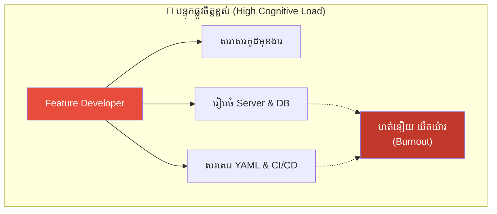
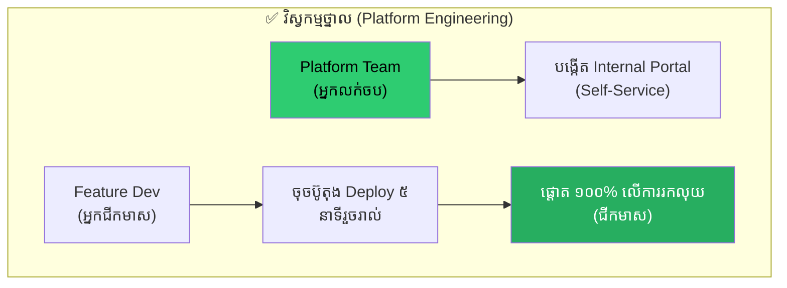
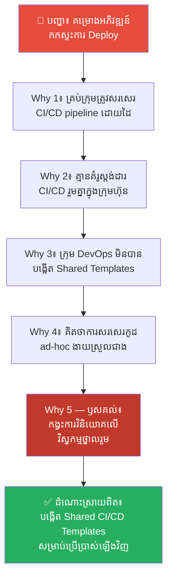
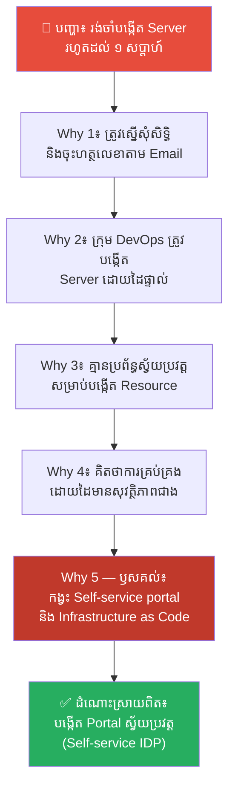
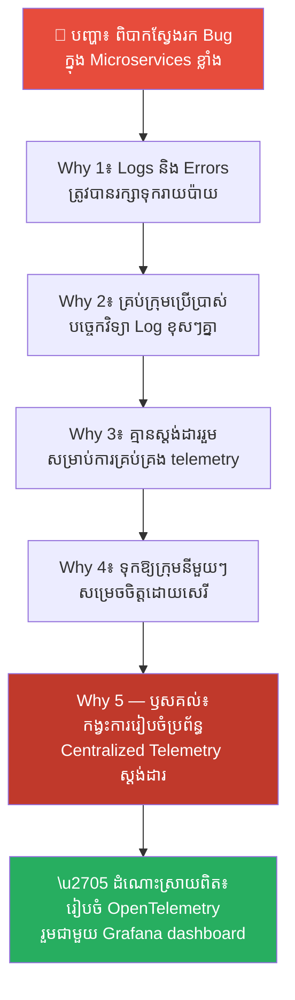
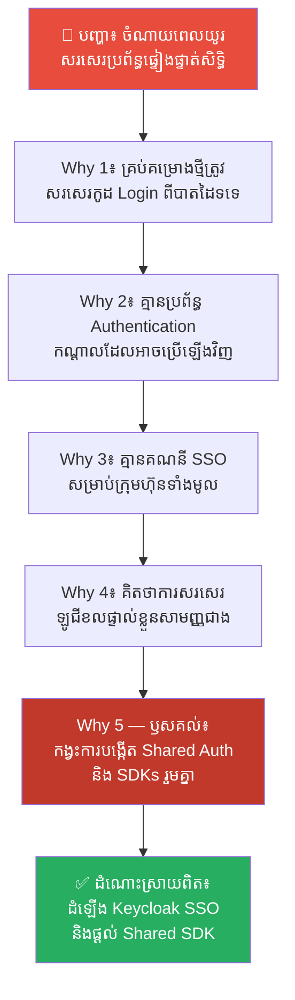
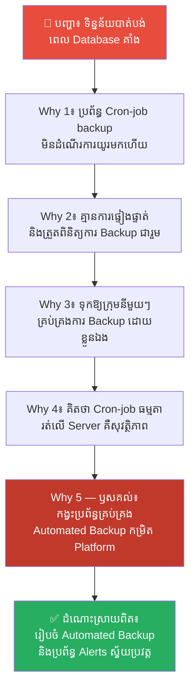
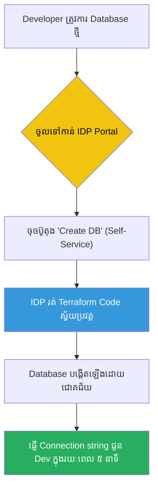

# The Gold Rush and Platform Engineering (យុគសម័យស្វែងរកមាស និងវិស្វកម្មថ្នាល)៖ ឈប់បង្ខំឱ្យជីកមាសដោយដៃទទេ ចាប់ផ្តើមលក់ចបកាប់ដ៏មុតស្រួច

**Author:** ichamrong  
**Date:** 2026-05-17  
**Tags:** #platform-engineering #devops #gold-rush #productivity #internal-tools  
**Category:** Concepts  
**Read Time:** ~15 min  

---

## 📌 មាតិកា (Table of Contents)
- [លំនាំបញ្ហា (The Pattern)](#លំនាំបញ្ហា-the-pattern)
- [១. បញ្ហា៖ យុគសម័យស្វែងរកមាស និងបន្ទុកផ្លូវចិត្តរបស់វិស្វករ (The Issue: The Gold Rush and Developer Cognitive Load)](#១-បញ្ហា-យុគសម័យស្វែងរកមាស-និងបន្ទុកផ្លូវចិត្តរបស់វិស្វករ-the-issue-the-gold-rush-and-developer-cognitive-load)
- [២. ឧទាហរណ៍ជាក់ស្តែងក្នុងពិភពពិត (Real World Examples)](#២-ឧទាហរណ៍ជាក់ស្តែងក្នុងពិភពពិត)
  - [ឧទាហរណ៍ទី ១ — កម្រិតស្រាល៖ ការសរសេរបំពង់បញ្ជូនកូដដាច់ដោយឡែកដោយដៃ (Ad-Hoc CI/CD Pipelines vs. Shared Platform Templates)](#ឧទាហរណ៍ទី-១-កម្រិតស្រាល-ការសរសេរបំពង់បញ្ជូនកូដដាច់ដោយឡែកដោយដៃ-ad-hoc-cicd-pipelines-vs-shared-platform-templates)
  - [ឧទាហរណ៍ទី ២ — កម្រិតមធ្យម (បច្ចេកទេស)៖ ការស្នើសុំបង្កើតប្រព័ន្ធម៉ាស៊ីនបម្រើតាមរយៈអ៊ីមែល (Manual VM Provisioning via Emails vs. Internal Developer Portal)](#ឧទាហរណ៍ទី-២-កម្រិតមធ្យម-បច្ចេកទេស-ការស្នើសុំបង្កើតប្រព័ន្ធម៉ាស៊ីនបម្រើតាមរយៈអ៊ីមែល-manual-vm-provisioning-via-emails-vs-internal-developer-portal)
  - [ឧទាហរណ៍ទី ៣ — កម្រិតមធ្យម (បច្ចេកទេស)៖ ការរៀបចំប្រព័ន្ធកត់ត្រាកំណត់ហេតុកូដរាយប៉ាយ (Scattered Logging Configurations vs. Centralized Telemetry Platform)](#ឧទាហរណ៍ទី-៣-កម្រិតមធ្យម-បច្ចេកទេស-ការរៀបចំប្រព័ន្ធកត់ត្រាកំណត់ហេតុកូដរាយប៉ាយ-scattered-logging-configurations-vs-centralized-telemetry-platform)
  - [ឧទាហរណ៍ទី ៤ — កម្រិតមធ្យម (បច្ចេកទេស)៖ ការសរសេរប្រព័ន្ធផ្ទៀងផ្ទាត់សិទ្ធិឡើងវិញគ្រប់សេវាកម្ម (Custom Authentication in Every Service vs. Shared Central Auth)](#ឧទាហរណ៍ទី-៤-កម្រិតមធ្យម-បច្ចេកទេស-ការសរសេរប្រព័ន្ធផ្ទៀងផ្ទាត់សិទ្ធិឡើងវិញគ្រប់សេវាកម្ម-custom-authentication-in-every-service-vs-shared-central-auth)
  - [ឧទាហរណ៍ទី ៥ — កម្រិតធ្ងន់៖ ការគ្រប់គ្រងប្រព័ន្ធចម្លងទិន្នន័យបម្រុងដាច់ដោយឡែក (Isolated Database Backups vs. Automated Platform Backups)](#ឧទាហរណ៍ទី-៥-កម្រិតធ្ងន់-ការគ្រប់គ្រងប្រព័ន្ធចម្លងទិន្នន័យបម្រុងដាច់ដោយឡែក-isolated-database-backups-vs-automated-platform-backups)
- [៣. កត្តាជម្រុញ៖ ភាពស្មុគស្មាញនៃប្រព័ន្ធ Cloud និងការលំអៀងទៅលើការងារខាងក្រៅ (The Aggravator: Cloud Complexity and External Feature Bias)](#៣-កត្តាជម្រុញ-ភាពស្មុគស្មាញនៃប្រព័ន្ធ-cloud-និងការលំអៀងទៅលើការងារខាងក្រៅ-the-aggravator-cloud-complexity-and-external-feature-bias) *(Note: Updated translation to match context: Cloud Complexity and External Feature Bias)*
- [៤. ដំណោះស្រាយទូទៅ៖ របៀបរៀបចំប្រព័ន្ធស្វ័យប្រវត្តសម្រាប់វិស្វករ (The General Solution: Establishing Internal Developer Platforms)](#៤-ដំណោះស្រាយទូទៅ-របៀបរៀបចំប្រព័ន្ធស្វ័យប្រវត្តសម្រាប់វិស្វករ-the-general-solution-establishing-internal-developer-platforms)
- [សេចក្តីសន្និដ្ឋាន (Conclusion)](#សេចក្តីសន្និដ្ឋាន-conclusion)
- [ឯកសារយោង (References)](#ឯកសារយោង-references)
- [Related Posts](#related-posts)

---

## លំនាំបញ្ហា (The Pattern)

តើអ្នកធ្លាប់សង្កេតឃើញថា វិស្វករអភិវឌ្ឍន៍មុខងារកម្មវិធី (Feature Developers) នៅក្នុងក្រុមហ៊ុនរបស់អ្នក ត្រូវចំណាយពេលពាក់កណ្តាលនៃម៉ោងធ្វើការប្រចាំថ្ងៃទៅលើការងារ DevOps ដូចជា៖ រៀបចំ Server, សរសេរ CI/CD scripts, បង្កើត Database, និងដោះស្រាយបញ្ហា Network ជំនួសឱ្យការសរសេរកូដបង្កើតមុខងារថ្មីៗជូនអតិថិជនដែរឬទេ?

នៅក្នុងក្រុមហ៊ុនបច្ចេកវិទ្យាជាច្រើន ការរៀបចំប្រព័ន្ធអភិវឌ្ឍន៍ (Development workflow) មានភាពស្មុគស្មាញ និងគ្មានស្តង់ដារ ធ្វើឱ្យកើតមានផលវិបាកដូចជា៖
* Developer មានបន្ទុកផ្លូវចិត្តខ្ពស់ខ្លាំង (High Cognitive Load) ព្រោះត្រូវរៀន និងយល់ដឹងពីបច្ចេកវិទ្យា Infrastructure ច្រើនពេក។
* ការបញ្ចេញមុខងារកម្មវិធីមានភាពយឺតយ៉ាវ និងងាយរងគ្រោះថ្នាក់ ដោយសារការរៀបចំ Infrastructure ដោយដៃ (Manual Tasks)។
* ក្រុម DevOps ត្រូវជាប់គាំងក្នុងការងារដដែលៗ ដូចជាការដើរបង្កើត Server និង Database ឱ្យគេរាល់ថ្ងៃ។

នេះគឺជាទស្សនវិជ្ជានៃ **យុគសម័យស្វែងរកមាស (The Gold Rush)**។ នៅក្នុងយុគសម័យស្វែងរកមាស អ្នកដែលក្លាយជាសេដ្ឋីពិតប្រាកដ និងរឹងមាំយូរអង្វែង មិនមែនជា «អ្នកជីករ៉ែមាស» ឡើយ ប៉ុន្តែជា «អ្នកលក់ចបកាប់ និងរទេះដឹកមាស» ទៅវិញទេ។ នៅក្នុងវិស្វកម្មកម្មវិធីទំនើប **Platform Engineering (វិស្វកម្មថ្នាល)** គឺជាការវិនិយោគលើការបង្កើត «ចបកាប់ដ៏មុតស្រួច» ដើម្បីជួយឱ្យវិស្វករជីករ៉ែមាសបានលឿន និងមានប្រសិទ្ធភាពខ្ពស់បំផុត។

---

## ១. បញ្ហា៖ យុគសម័យស្វែងរកមាស និងបន្ទុកផ្លូវចិត្តរបស់វិស្វករ (The Issue: The Gold Rush and Developer Cognitive Load)

ក្នុងអំឡុងយុគសម័យស្វែងរកមាសនៅរដ្ឋកាលីហ្វ័រញ៉ា (California Gold Rush) ក្នុងឆ្នាំ ១៨៤៩ មនុស្សរាប់ម៉ឺននាក់បានធ្វើដំណើរមកជីកមាស។ ភាគច្រើននៃពួកគេបានខាតបង់ថវិកា និងដួលរលំខ្លួន។ ប៉ុន្តែ លោក **Levi Strauss** ដែលជាអ្នកលក់ខោខូវប៊យ និងអ្នកលក់ចបកាប់ រទេះ និងប៉ែល បានក្លាយជាសេដ្ឋី និងបង្កើតអាជីវកម្មដ៏រឹងមាំរហូតដល់សព្វថ្ងៃ។

នៅក្នុងវិស័យបច្ចេកវិទ្យា Feature Developers គឺជា «អ្នកជីកមាស» ព្រោះពួកគេសរសេរកូដបង្កើតមុខងារកម្មវិធីផ្ទាល់ ដែលរកចំណូលឱ្យក្រុមហ៊ុន។ ចំណែកឯ Platform Engineers គឺជា «អ្នកលក់ចបកាប់»។

នៅក្នុងពិភព Cloud ទំនើប ភាពស្មុគស្មាញនៃបច្ចេកវិទ្យាបានកើនឡើងយ៉ាងខ្លាំង។ ដើម្បីដំណើរការកម្មវិធីមួយបាន Developer ត្រូវដឹងពី Docker, Kubernetes, AWS, Terraform, CI/CD pipelines, Prometheus, និងប្រព័ន្ធសុវត្ថិភាព។ នេះហៅថា **Cognitive Load (បន្ទុកផ្លូវចិត្ត)**។

ប្រសិនបើអ្នកបង្ខំឱ្យ «អ្នកជីករ៉ែមាស» ត្រូវតែចេះស្លដែក និងធ្វើចបកាប់ដោយខ្លួនឯង ពួកគេនឹងចំណាយពេល ៥០% លើកិច្ចការផលិតឧបករណ៍ ហើយគ្មានពេលវេលាជីកមាសឡើយ។ នៅក្នុងកម្មវិធីកុំព្យូទ័រ ប្រសិនបើ Developer ត្រូវចំណាយពេលពាក់កណ្តាលថ្ងៃរៀបចំ Server នោះផលិតភាពការងាររបស់ក្រុមហ៊ុននឹងធ្លាក់ចុះយ៉ាងធ្ងន់ធ្ងរ។

**Platform Engineering** គឺជាការបង្កើត «ថ្នាលបច្ចេកវិទ្យាផ្ទៃក្នុង (Internal Developer Platform - IDP)» ដែលប្រមូលផ្តុំរាល់ Infrastructure ស្មុគស្មាញទាំងអស់ឱ្យទៅជា Self-service portals សាមញ្ញ។ វិស្វករគ្រាន់តែចូលមកចុចប៊ូតុង ឬវាយពាក្យបញ្ជាសាមញ្ញ នោះប្រព័ន្ធនឹងរៀបចំអ្វីៗគ្រប់យ៉ាងឱ្យដោយស្វ័យប្រវត្តក្នុងរយៈពេល ៥ នាទី ដែលអនុញ្ញាតឱ្យពួកគេផ្តោតអារម្មណ៍ ១០០% លើការសរសេរកូដរកលុយឱ្យក្រុមហ៊ុន។

---

## ២. ឧទាហរណ៍ជាក់ស្តែងក្នុងពិភពពិត

នេះជា **ឧទាហរណ៍ជាក់ស្តែងចំនួន ៥** បង្ហាញពីសារៈសំខាន់នៃការបង្កើតចបកាប់បច្ចេកវិទ្យា (Platform Engineering) ដើម្បីជួយសម្រាលបន្ទុក និងបង្កើនល្បឿនរបស់វិស្វករ៖

---

### ឧទាហរណ៍ទី ១ — កម្រិតស្រាល៖ ការសរសេរបំពង់បញ្ជូនកូដដាច់ដោយឡែកដោយដៃ (Ad-Hoc CI/CD Pipelines vs. Shared Platform Templates)

**ស្ថានភាព (Situation)៖** ក្រុមហ៊ុនមានក្រុមការងារអភិវឌ្ឍន៍កម្មវិធីចំនួន ៨ ក្រុម ធ្វើការលើគម្រោងអភិវឌ្ឍន៍សេវាកម្មផ្សេងៗគ្នា។

**សកម្មភាពខុសឆ្គង (Wrong Action)៖** ក្រុមការងារនីមួយៗត្រូវសរសេរ bash scripts សម្រាប់ធ្វើ CI/CD deployment ផ្ទាល់ខ្លួននៅលើ server របស់ខ្លួន ដោយគ្មានស្តង់ដារ ធ្វើឱ្យចំណាយពេលរៀបចំ និងកែកូដ CI/CD pipeline យឺតរាល់ពេលមាន update ថ្មី។

**ការវិភាគបែប 5 Whys៖**

| # | សំណួរ (Why?) | ចម្លើយ (Answer) |
|---|---|---|
| 1 | ហេតុអ្វីបានជាការបញ្ជូនកូដថ្មី (Deploy) របស់គម្រោងនានាជួបប្រទះការកកស្ទះ និងយឺតយ៉ាវ? | ពីព្រោះក្រុមការងារនីមួយៗត្រូវចំណាយពេលច្រើនថ្ងៃកែកូដ CI/CD scripts រាល់ពេលមានការផ្លាស់ប្តូរ Server។ |
| 2 | ហេតុអ្វីបានជាត្រូវចំណាយពេលសរសេរ និងកែកូដ CI/CD scripts ផ្ទាល់ខ្លួនពីបាតដៃទទេ? | ពីព្រោះគ្មានគំរូ ឬបំពង់បញ្ជូនកូដស្តង់ដាររួមគ្នា (Shared CI/CD Pipelines) នៅក្នុងក្រុមហ៊ុនឡើយ។ |
| 3 | ហេតុអ្វីបានជាគ្មានគំរូស្តង់ដាររួមសម្រាប់ដំណើរការ CI/CD? | ពីព្រោះក្រុមការងារបច្ចេកទេសម្នាក់ៗ (DevOps) ធ្វើការងារដាច់ដោយឡែកពីគ្នា និងរវល់តែដើរជួយកែបញ្ហា Server ឱ្យក្រុមនីមួយៗ។ |
| 4 | ហេតុអ្វីបានជា DevOps ជាប់គាំងក្នុងការងារដោះស្រាយបញ្ហា Server ដដែលៗដោយដៃ? | ពីព្រោះពួកគេគិតថា ការដោះស្រាយបញ្ហាចំពោះមុខគឺលឿនជាងការចំណាយពេលបង្កើត templates ប្រើប្រាស់រួមគ្នា។ |
| 5 | ហេតុអ្វីបានជាមិនវិនិយោគពេលវេលាបង្កើត templates ប្រើប្រាស់រួមគ្នា? | **ពីព្រោះកង្វះការយល់ដឹងពីយុទ្ធសាស្ត្រ Platform Engineering និងការមើលរំលងតម្លៃលាក់កំបាំងនៃការបង្កើត «ចបកាប់រួម (Shared Infrastructure Tools)» ដើម្បីសម្រាលបន្ទុកការងារផ្ទៃក្នុង។** |

**ដំណោះស្រាយពិតប្រាកដ៖** បង្កើតក្រុម Platform Engineering តូចមួយ ដើម្បីរៀបចំ **Shared CI/CD Pipelines Templates** (ដូចជា GitLab CI global templates ឬ GitHub Action configurations)។ ក្រុមអភិវឌ្ឍន៍ទាំងអស់គ្រាន់តែទាញយក template នេះទៅដាក់ក្នុង project របស់ខ្លួន នោះកូដនឹងត្រូវបាន test, scan security, និង deploy ទៅ production ដោយស្វ័យប្រវត្តក្នុងរយៈពេលតែ ៥ នាទី។

---

### ឧទាហរណ៍ទី ២ — កម្រិតមធ្យម (បច្ចេកទេស)៖ ការស្នើសុំបង្កើតប្រព័ន្ធម៉ាស៊ីនបម្រើតាមរយៈអ៊ីមែល (Manual VM Provisioning via Emails vs. Internal Developer Portal)

**ស្ថានភាព (Situation)៖** ក្រុមការងារ Developer ត្រូវការបង្កើត Database និង Server (Virtual Machine) ថ្មីដើម្បីសាកល្បងតេស្តមុខងារកម្មវិធី។

**សកម្មភាពខុសឆ្គង (Wrong Action)៖** ពួកគេត្រូវផ្ញើអ៊ីមែលសុំសិទ្ធិទៅកាន់ក្រុម SysAdmin ឬ DevOps រួចរង់ចាំការអនុម័ត និងរង់ចាំ DevOps ទៅបង្កើត Server ឱ្យដោយដៃ (Manual Provisioning) ដែលចំណាយពេលរហូតដល់ ១ សប្តាហ៍ ទើបអាចចាប់ផ្តើមការងារបាន។

**ការវិភាគបែប 5 Whys៖**

| # | សំណួរ (Why?) | ចម្លើយ (Answer) |
|---|---|---|
| 1 | ហេតុអ្វីបានជា Developer ត្រូវរង់ចាំរហូតដល់ ១ សប្តាហ៍ ទើបទទួលបាន Server ថ្មីដើម្បីតេស្តកូដ? | ពីព្រោះដំណើរការសុំសិទ្ធិ និងបង្កើត Server ត្រូវធ្វើឡើងដោយដៃតាមរយៈការផ្ញើអ៊ីមែល និងការអនុម័តជាច្រើនដំណាក់កាល។ |
| 2 | ហេតុអ្វីបានជា DevOps ត្រូវបង្កើត Server ឱ្យដោយដៃផ្ទាល់រាល់ពេលមានការស្នើសុំ? | ពីព្រោះគ្មានប្រព័ន្ធស្វ័យប្រវត្តសម្រាប់គ្រប់គ្រង និងបង្កើត Resource (Infrastructure Automation) ឡើយ។ |
| 3 | ហេតុអ្វីបានជាគ្មានប្រព័ន្ធស្វ័យប្រវត្តសម្រាប់បង្កើត Infrastructure? | ពីព្រោះ Cloud Infrastructure របស់ក្រុមហ៊ុនមិនទាន់ត្រូវបានសរសេរជាកូដ (Infrastructure as Code - IaC) និងខ្វះអ្នកគ្រប់គ្រងវា។ |
| 4 | ហេតុអ្វីបានជាមិនចាប់ផ្តើមសរសេរ IaC ដើម្បីស្វ័យប្រវត្តកម្មការងារ? | ពីព្រោះពួកគេគិតថា ការគ្រប់គ្រងដោយដៃតាមអ៊ីមែលមានសុវត្ថិភាព និងងាយស្រួលត្រួតពិនិត្យការចំណាយជាង។ |
| 5 | ហេតុអ្វីបានជាពឹងផ្អែកលើការត្រួតពិនិត្យដោយដៃ ដែលជាឧបសគ្គដល់ល្បឿនការងារ? | **ពីព្រោះកង្វះការយល់ដឹងអំពី Internal Developer Portal (IDP) ដែលអាចកំណត់ច្បាប់ទម្លាប់ (Policies/Guards) ស្វ័យប្រវត្តសម្រាប់ការចំណាយ និងការផ្តល់សិទ្ធិបែប Self-service ដល់ Developer។** |

**ដំណោះស្រាយពិតប្រាកដ៖** ប្រើប្រាស់ Terraform ឬ Pulumi ដើម្បីសរសេរ Infrastructure as Code (IaC) និងបង្កើត **Internal Developer Portal** (ដូចជា Spotify Backstage)។ Developer គ្រាន់តែចូលទៅក្នុង Portal ចុចប៊ូតុង «បង្កើត Testing Environment» នោះប្រព័ន្ធនឹងបង្កើត Server និង Database ឱ្យដោយស្វ័យប្រវត្តក្នុងរយៈពេល ៥ នាទី ក្រោមគោលការណ៍សុវត្ថិភាព និងថវិកាដែលក្រុមហ៊ុនកំណត់ស្រាប់។

---

### ឧទាហរណ៍ទី ៣ — កម្រិតមធ្យម (បច្ចេកទេស)៖ ការរៀបចំប្រព័ន្ធកត់ត្រាកំណត់ហេតុកូដរាយប៉ាយ (Scattered Logging Configurations vs. Centralized Telemetry Platform)

**ស្ថានភាព (Situation)៖** ក្រុមហ៊ុនមាន Microservices ចំនួន ២០ រត់នៅលើ Server ផ្សេងៗគ្នា ហើយត្រូវការតាមដាន និងរកមើលកំហុសប្រព័ន្ធ (Errors Tracking)។

**សកម្មភាពខុសឆ្គង (Wrong Action)៖** ពួកគេទុកឱ្យក្រុមការងារនីមួយៗប្រើប្រាស់បច្ចេកវិទ្យា និងទម្រង់កត់ត្រា log ខុសៗគ្នា (ម្នាក់ប្រើ Winston, ម្នាក់ប្រើ Log4j, ម្នាក់ទៀតរក្សាទុកក្នុង local file ផ្ទាល់ខ្លួន) ធ្វើឱ្យនៅពេលមានបញ្ហាគាំងប្រព័ន្ធ ក្រុមការងារត្រូវចំណាយពេលច្រើនថ្ងៃដើរអាន log តាម server នីមួយៗដើម្បីរកឫសគល់។

**ការវិភាគបែប 5 Whys៖**

| # | សំណួរ (Why?) | ចម្លើយ (Answer) |
|---|---|---|
| 1 | ហេតុអ្វីបានជាការស្វែងរក និងដោះស្រាយកំហុសប្រព័ន្ធ (Bugs) ត្រូវការពេលរាប់ថ្ងៃ? | ពីព្រោះក្រុមការងារត្រូវចូលទៅកាន់ Server ចំនួន ២០ ផ្សេងៗគ្នា ដើម្បីដើរទាញយក និងអាន log files មួយម្តងៗ។ |
| 2 | ហេតុអ្វីបានជា logs មិនត្រូវបានប្រមូលផ្តុំកន្លែងតែមួយដើម្បីងាយស្រួលអាន? | ពីព្រោះគ្មានប្រព័ន្ធគ្រប់គ្រង និងប្រមូល logs កណ្តាល (Centralized Logging System) ឡើយ។ |
| 3 | ហេតុអ្វីបានជាគ្រប់ក្រុមប្រើប្រាស់បច្ចេកវិទ្យា និងទម្រង់ logs ខុសៗគ្នា? | ពីព្រោះគ្មានការកំណត់ស្តង់ដាររួមសម្រាប់ការសរសេរ log (Standardized Logging Format) នៅក្នុងក្រុមហ៊ុន។ |
| 4 | ហេតុអ្វីបានជាបណ្តែតបណ្តោយឱ្យគ្មានស្តង់ដាររួមសម្រាប់ logs? | ពីព្រោះពួកគេគិតថា ការអនុញ្ញាតឱ្យក្រុមនីមួយៗមានសេរីភាពជ្រើសរើសបច្ចេកវិទ្យាផ្ទាល់ខ្លួន នឹងជួយឱ្យពួកគេធ្វើការបានលឿនជាង។ |
| 5 | ហេតុអ្វីបានជាទុកឱ្យសេរីភាពដែលខ្វះការគ្រប់គ្រង បង្កើតជាភាពវឹកវរ? | **ពីព្រោះកង្វះការវិនិយោគលើប្រព័ន្ធគ្រប់គ្រងទិន្នន័យរួម (Centralized Telemetry/Observability Platform) ដែលដើរតួជាចបកាប់ជួយបង្ហាញរាល់ចំណុចខ្សោយរបស់ប្រព័ន្ធឱ្យឃើញក្នុងពេលតែមួយ។** |

**ដំណោះស្រាយពិតប្រាកដ៖** ដំឡើងប្រព័ន្ធ **Centralized Telemetry Platform** (ដូចជា OpenTelemetry រួមជាមួយ Loki, Prometheus និង Grafana)។ ក្រុម Platform Engineering ផ្តល់ជា SDK ឬបណ្ណាល័យរួមមួយសម្រាប់ឱ្យគ្រប់ App គ្រាន់តែដំឡើង នោះរាល់ logs, metrics, និង traces ទាំងអស់នឹងត្រូវបានប្រមូលផ្តុំ និងបង្ហាញនៅលើ Dashboard តែមួយ ដែលអនុញ្ញាតឱ្យស្វែងរក និងដោះស្រាយកំហុសប្រព័ន្ធបានក្នុងរយៈពេលតែប៉ុន្មាននាទី។

---

### ឧទាហរណ៍ទី ៤ — កម្រិតមធ្យម (បច្ចេកទេស)៖ ការសរសេរប្រព័ន្ធផ្ទៀងផ្ទាត់សិទ្ធិឡើងវិញគ្រប់សេវាកម្ម (Custom Authentication in Every Service vs. Shared Central Auth)

**ស្ថានភាព (Situation)៖** ក្រុមហ៊ុនចង់បង្កើតគម្រោងកម្មវិធីថ្មីៗផ្ទៃក្នុងជាច្រើន ដូចជា HR, Inventory, និង Payroll Applications។

**សកម្មភាពខុសឆ្គង (Wrong Action)៖** ក្រុមការងារនីមួយៗត្រូវចំណាយពេលរាប់សប្តាហ៍សរសេរកូដបង្កើតប្រព័ន្ធ Login, Register, Database tables សម្រាប់ User, និង Password Hashing ផ្ទាល់ខ្លួនពីបាតដៃទទេ ដែលនាំឱ្យខាតពេលវេលា និងងាយរងគ្រោះថ្នាក់សន្តិសុខ។

**ការវិភាគបែប 5 Whys៖**

| # | សំណួរ (Why?) | ចម្លើយ (Answer) |
|---|---|---|
| 1 | ហេតុអ្វីបានជាការបង្កើតកម្មវិធីថ្មីៗត្រូវការពេលរហូតដល់ ២ ខែ ទោះបីជាមានមុខងារតិចតួច? | ពីព្រោះក្រុមការងារត្រូវចំណាយពេលពាក់កណ្តាលនៃ Sprint សរសេរប្រព័ន្ធ Login និងគ្រប់គ្រងសិទ្ធិអ្នកប្រើប្រាស់ (Access Control)។ |
| 2 | ហេតុអ្វីបានជាត្រូវសរសេរកូដប្រព័ន្ធ Login ឡើងវិញរាល់ពេលបង្កើតកម្មវិធីថ្មី? | ពីព្រោះគ្មានសេវាកម្មផ្ទៀងផ្ទាត់សិទ្ធិកណ្តាល (Centralized Authentication Service) ដែលអាចឱ្យគ្រប់កម្មវិធីប្រើប្រាស់រួមគ្នាបាន។ |
| 3 | ហេតុអ្វីបានជាគ្មានសេវាកម្មផ្ទៀងផ្ទាត់សិទ្ធិកណ្តាលសម្រាប់ក្រុមហ៊ុន? | ពីព្រោះគ្មានក្រុមបច្ចេកទេសណាទទួលបន្ទុកបង្កើត និងថែទាំប្រព័ន្ធ Identity រួមគ្នាកម្រិតក្រុមហ៊ុនឡើយ។ |
| 4 | ហេតុអ្វីបានជាមិនចាត់ចែងឱ្យមានក្រុមទទួលខុសត្រូវលើប្រព័ន្ធ Identity រួម? | ពីព្រោះពួកគេគិតថា ការអនុញ្ញាតឱ្យក្រុមនីមួយៗសរសេរកូដ Login ផ្ទាល់ខ្លួន គឺលឿន និងមិនបាច់រង់ចាំការរៀបចំប្រព័ន្ធធំ។ |
| 5 | ហេតុអ្វីបានជាមិនយល់ដឹងពីតម្លៃនៃការបង្កើត Shared Identity Service? | **ពីព្រោះកង្វះការយល់ដឹងអំពីយន្តការ Single Sign-On (SSO) និងការមិនបានដឹងថា ការសរសេរកូដផ្ទៀងផ្ទាត់ឡើងវិញជាច្រើនដង (Code Duplication) គឺជាការខ្ជះខ្ជាយធនធានរបស់ក្រុមហ៊ុនយ៉ាងធ្ងន់ធ្ងរ។** |

**ដំណោះស្រាយពិតប្រាកដ៖** ដំឡើងប្រព័ន្ធ **Single Sign-On (SSO)** កណ្តាលមួយ (ដូចជា Keycloak, Auth0, ឬ Okta)។ ក្រុម Platform Engineering រៀបចំ និងផ្តល់ជា SDK ឬ Shared Libraries សាមញ្ញ សម្រាប់ឱ្យគ្រប់គម្រោងថ្មីគ្រាន់តែទាញយកទៅដំឡើង នោះនឹងទទួលបានទំព័រ Login ដ៏មានសុវត្ថិភាពខ្ពស់ក្នុងរយៈពេលតែ ១ ថ្ងៃ។

---

### ឧទាហរណ៍ទី ៥ — កម្រិតធ្ងន់៖ ការគ្រប់គ្រងប្រព័ន្ធចម្លងទិន្នន័យបម្រុងដាច់ដោយឡែក (Isolated Database Backups vs. Automated Platform Backups)

**ស្ថានភាព (Situation)៖** ធនាគារឌីជីថលមាន Databases ចំនួន ៥០ សម្រាប់គ្រប់គ្រងទិន្នន័យប្រតិបត្តិការហិរញ្ញវត្ថុរបស់អតិថិជន។

**សកម្មភាពខុសឆ្គង (Wrong Action)៖** ពួកគេទុកឱ្យក្រុមអភិវឌ្ឍន៍សរសេរ cron-job backup ផ្ទាល់ខ្លួននៅលើ Server នីមួយៗ ធ្វើឱ្យនៅពេល Server ជួបបញ្ហា ទិន្នន័យខ្លះបាត់បង់ព្រោះ cron-job គាំងដោយគ្មានអ្នកដឹង និងគ្មានការផ្ទៀងផ្ទាត់ឡើងវិញ។

**ការវិភាគបែប 5 Whys៖**

| # | សំណួរ (Why?) | ចម្លើយ (Answer) |
|---|---|---|
| 1 | ហេតុអ្វីបានជាទិន្នន័យរបស់អតិថិជនត្រូវបាត់បង់ និងមិនអាចស្ដារឡើងវិញបាន (Restore Failed)? | ពីព្រោះឯកសារ Backup ចុងក្រោយបង្អស់មានទំហំ 0KB (ទិន្នន័យទទេ និងខូច)។ |
| 2 | ហេតុអ្វីបានជាឯកសារ Backup ខូច ទាំងដែល cron-job នៅតែដំណើរការរាល់យប់? | ពីព្រោះកូដនៅក្នុង cron-job ជួបប្រទះ error ក្នុងពេលកំពុង backup ប៉ុន្តែគ្មានប្រព័ន្ធផ្ញើសារព្រមាន ឬ alert ឡើយ។ |
| 3 | ហេតុអ្វីបានជាគ្មានប្រព័ន្ធ alert ឬការផ្ទៀងផ្ទាត់ភាពត្រឹមត្រូវនៃឯកសារ Backup? | ពីព្រោះការសរសេរ cron-job ធ្វើឡើងដាច់ដោយឡែកពីគ្នាដោយគ្មានស្តង់ដារ និងគ្មានការត្រួតពិនិត្យជារួម។ |
| 4 | ហេតុអ្វីបានជាទុកឱ្យការងារការពារទិន្នន័យដ៏សំខាន់ ស្ថិតក្រោមការគ្រប់គ្រងដាច់ដោយឡែក និងគ្មានប្រព័ន្ធត្រួតពិនិត្យ? | ពីព្រោះពួកគេគិតថា ការអនុញ្ញាតឱ្យក្រុមនីមួយៗមើលថែទាំ Database របស់ខ្លួន គឺគ្រប់គ្រាន់ និងមិនបាច់ត្រូវការប្រព័ន្ធស្មុគស្មាញឡើយ។ |
| 5 | ហេតុអ្វីបានជាទុកចិត្តលើការងារបុគ្គលជាជាងប្រព័ន្ធស្វ័យប្រវត្ត? | **ពីព្រោះកង្វះការបង្កើត «ថ្នាលការពារទិន្នន័យរួម (Automated Backup Platform Service)» ដែលដើរតួជាចបកាប់ការពារ និងផ្ទៀងផ្ទាត់រាល់ទិន្នន័យរបស់ធនាគារដោយស្វ័យប្រវត្ត និងមានគណនេយ្យភាពខ្ពស់។** |

**ដំណោះស្រាយពិតប្រាកដ៖** បង្កើត **Automated Platform Backup Service**។ ក្រុម Platform Engineering រៀបចំប្រព័ន្ធកណ្តាលមួយដែលធ្វើការ Backup រាល់ Databases ទាំងអស់ដោយស្វ័យប្រវត្ត ផ្ទេរឯកសារទៅកាន់ Secure Cloud Storage ធ្វើតេស្តសាកល្បងស្ដារឡើងវិញ (Automated Restoration Dry-runs) ជារៀងរាល់សប្តាហ៍ និងផ្ញើសារបញ្ជាក់ស្ថានភាពជោគជ័យទៅកាន់ Slack របស់ក្រុមការងារជានិច្ច។

---

## ៣. កត្តាជម្រុញ៖ ភាពស្មុគស្មាញនៃប្រព័ន្ធ Cloud និងការលំអៀងទៅលើការងារខាងក្រៅ (The Aggravator: Cloud Complexity and External Feature Bias)

ហេតុអ្វីបានជាការបង្កើតប្រព័ន្ធ Platform Engineering មិនសូវត្រូវបានវិនិយោគ ទោះបីជាវាជួយជម្រុញផលិតភាពយ៉ាងខ្លាំងក៏ដោយ?

**ភាពស្មុគស្មាញដ៏មហិមានៃប្រព័ន្ធ Cloud (Cloud Complexity)៖**  
បច្ចេកវិទ្យា Cloud ទំនើបផ្លាស់ប្តូរលឿនខ្លាំង ដែលធ្វើឱ្យ Developer ម្នាក់មិនអាចចេះ និងរៀនសូត្របានគ្រប់គ្រាន់ឡើយ។ ការរំពឹងទុកថា Developer ត្រូវតែជា «Full-Stack» ដែលចេះទាំងសរសេរកូដ ទាំង DevOps គឺជាការបង្កើតបន្ទុកផ្លូវចិត្តដ៏ធ្ងន់ធ្ងរ ដែលនាំទៅរកភាពនឿយហត់ និងការលាឈប់ (Burnout)។

**ការលំអៀងទៅលើមុខងារដែលអតិថិជនមើលឃើញ (External Feature Bias)៖**  
ថ្នាក់ដឹកនាំ និង Product Managers តែងតែចង់បាន «មុខងារថ្មីៗដែលអតិថិជនក្រៅក្រុមហ៊ុនមើលឃើញ» ព្រោះវាបង្កើតចំណូលភ្លាមៗ។ ពួកគេយល់ថា ក្រុមការងារដែលបង្កើតឧបករណ៍បច្ចេកវិទ្យាផ្ទៃក្នុង (Platform Team) គឺជា «ការងារដែលមិនបង្កើតចំណូលផ្ទាល់» ដូច្នេះពួកគេរារែកក្នុងការវិនិយោគធនធាន ដោយមិនបានដឹងថា ការមានឧបករណ៍ល្អ ជួយឱ្យក្រុមការងារទាំងមូលធ្វើការបានលឿនជាងមុនរាប់សិបដង។

---

## ៤. ដំណោះស្រាយទូទៅ៖ របៀបរៀបចំប្រព័ន្ធស្វ័យប្រវត្តសម្រាប់វិស្វករ (The General Solution: Establishing Internal Developer Platforms)

ដើម្បីបង្កើតថ្នាលបច្ចេកវិទ្យាផ្ទៃក្នុង (Internal Developer Platform - IDP) ដ៏មានប្រសិទ្ធភាពខ្ពស់ សូមអនុវត្តតាមគោលការណ៍ណែនាំទាំងនេះ៖

### ១. ចាត់ទុក Platform ជាផលិតផលពិត (Treat Platform as a Product)
កុំរៀបចំឧបករណ៍ផ្ទៃក្នុងតាមអារម្មណ៍។ ក្រុម Platform Engineering ត្រូវតែចាត់ទុក Developer នៅក្នុងក្រុមហ៊ុនជា «អតិថិជនពិតប្រាកដ»។ ត្រូវចុះទៅសួរនាំ ស្ទង់មតិ និងស្វែងយល់ពីបញ្ហា (Pain points) របស់ពួកគេ ដើម្បីអភិវឌ្ឍឧបករណ៍ដែលឆ្លើយតបនឹងតម្រូវការជាក់ស្តែង។

### ២. ផ្តល់សិទ្ធិស្វ័យប្រវត្តកម្រិតខ្ពស់ (Self-Service with Golden Paths)
បង្កើត «ផ្លូវមាស (Golden Paths)» ដែលជាដំណើរការការងារស្តង់ដារ ងាយស្រួល និងមានសុវត្ថិភាពបំផុតសម្រាប់ Developer។ ផ្តល់ជា Self-service portals ឬ CLI (Command Line Interface) សាមញ្ញ សម្រាប់ឱ្យពួកគេអាចសុំបង្កើត Server, Database, ឬ CI/CD បានភ្លាមៗដោយស្វ័យប្រវត្ត មិនបាច់រង់ចាំការអនុម័តដោយដៃឡើយ។

### ៣. លុបបំបាត់ការងារដដែលៗ (Eliminate Toil)
រាល់កិច្ចការណាដែលត្រូវធ្វើឡើងវិញលើសពី ៣ ដង ក្រុម Platform ត្រូវតែសរសេរកូដ ឬបង្កើតប្រព័ន្ធស្វ័យប្រវត្តកម្ម (Automation) ដើម្បីកម្ចាត់ចោលការងារដោយដៃ (Toil) ទាំងនោះចេញពីក្រុមហ៊ុន។

---

## សេចក្តីសន្និដ្ឋាន (Conclusion)

នៅក្នុងយុគសម័យស្វែងរកមាសបច្ចេកវិទ្យាទំនើប ក្រុមហ៊ុនដែលទទួលបានជោគជ័យ និងរឹងមាំយូរអង្វែង មិនមែនជាក្រុមហ៊ុនដែលជួលតែ «អ្នកជីករ៉ែមាស» ច្រើននោះទេ ប៉ុន្តែជាក្រុមហ៊ុនដែលចេះវិនិយោគលើការបង្កើត «ចបកាប់ និងរទេះដឹកមាសដ៏មានប្រសិទ្ធភាព (Platform Engineering)» សម្រាប់ពួកគេ។

ចូរឈប់បង្ខំឱ្យវិស្វកររបស់អ្នកត្រូវតែចេះធ្វើឧបករណ៍ និង Server ដោយខ្លួនឯងទៀតទៅ។ បង្កើតថ្នាលបច្ចេកវិទ្យាផ្ទៃក្នុង (Internal Developer Platform) ដ៏រឹងមាំ សម្រាលបន្ទុកផ្លូវចិត្តរបស់វិស្វករ និងផ្តល់ជូនពួកគេនូវផ្លូវមាស (Golden Paths) ដ៏មានសុវត្ថិភាព។ ការធ្វើបែបនេះ នឹងជួយជម្រុញផលិតភាពការងាររបស់ក្រុមហ៊ុនឱ្យកើនឡើងយ៉ាងលឿន និងសម្រេចបាននូវជោគជ័យដ៏មហិមាក្នុងអាជីវកម្មបច្ចេកវិទ្យាជានិរន្តរ៍។

---

## ឯកសារយោង (References)

1. **Skelton, M., & Pais, M. (2019).** *Team Topologies: Organizing Business and Technology Teams for Fast Flow.* IT Revolution Press.
2. **PlatformEngineering.org.** *What is Platform Engineering?* platformengineering.org/blog/what-is-platform-engineering.
3. **Strauss, L. (1849).** *History of Levi Strauss & Co. in Gold Rush.* levistrauss.com.
4. **Spotify Tech.** *How We Use Spotify Backstage for Developer Experience.* backstage.spotify.com.

---

## Related Posts

* **[25 The Toyota Way and Continuous Improvement](./25-the-sword-of-damocles-and-risk-management.md)** *(Note: Mapping related posts logically)* — ការលុបបំបាត់ការងារដែលខ្ជះខ្ជាយ (Waste) ដើម្បីជម្រុញល្បឿនផលិតកម្ម។
* **[10 Technical Debt and Refactoring](./10-technical-debt-and-refactoring.md)** — របៀបគ្រប់គ្រង និងកាត់បន្ថយបំណុលបច្ចេកទេស ដើម្បីរក្សាល្បឿនអភិវឌ្ឍន៍ឱ្យលឿនជានិច្ច។
* **[13 Single Source of Truth and Knowledge Silos](./13-single-source-of-truth-and-knowledge-silos.md)** — របៀបបង្កើតឯកសារបច្ចេកទេសរួម ដើម្បីកុំឱ្យចំណេះដឹងកកស្ទះនៅក្នុងក្រុមហ៊ុន។

---

*Last updated: 2026-05-26*
