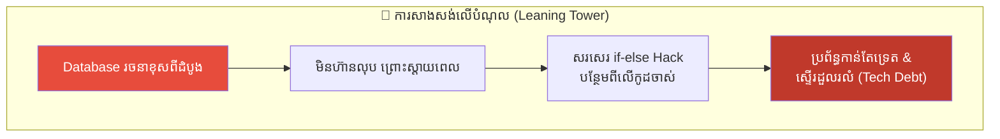
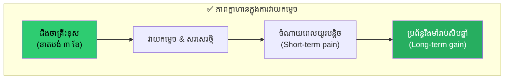
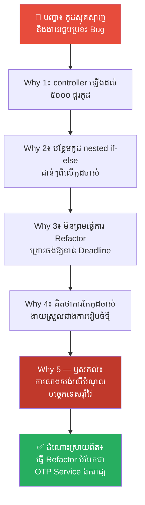
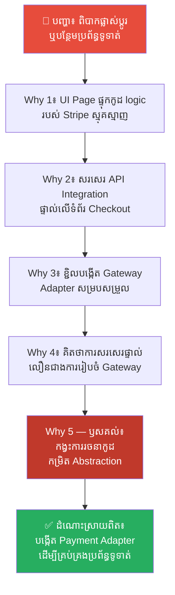
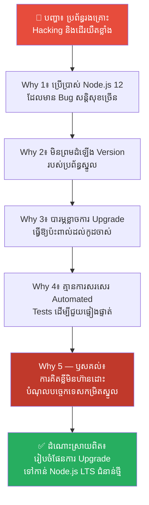
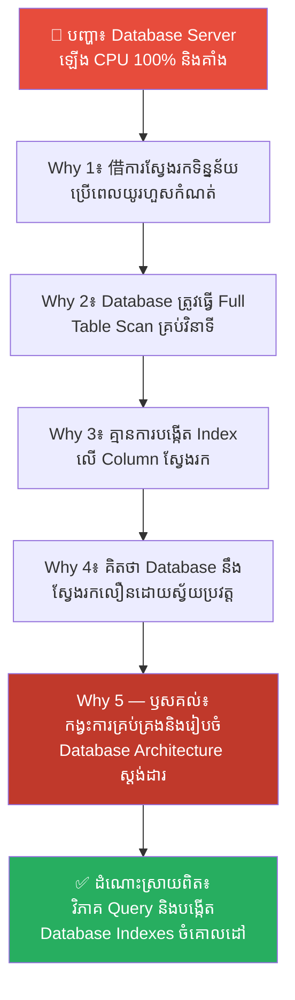
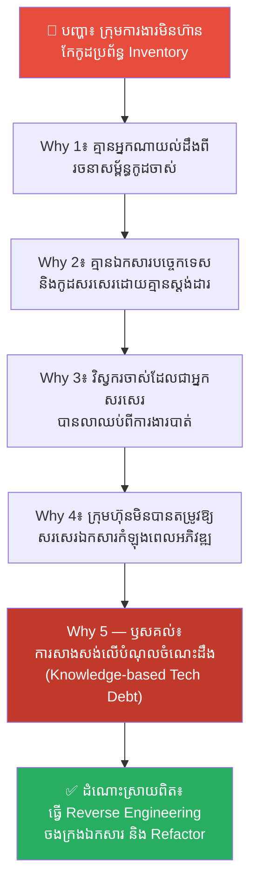

# The Tower of Pisa and Technical Debt (ប៉មភីសា និងបំណុលបច្ចេកទេស)៖ គ្រោះថ្នាក់នៃការសាងសង់ជាន់ថ្មី ទៅលើគ្រឹះស្ថាបត្យកម្មដែលខូចខាត

**Author:** ichamrong  
**Date:** 2026-05-17  
**Tags:** #tech-debt #architecture #foundations #refactoring #sunk-cost-fallacy  
**Category:** Concepts  
**Read Time:** ~15 min  

---

## 📌 មាតិកា (Table of Contents)
- [លំនាំបញ្ហា (The Pattern)](#លំនាំបញ្ហា-the-pattern)
- [១. បញ្ហា៖ ប៉មភីសា និងបំណុលបច្ចេកទេសនៅក្នុងវិស្វកម្មកម្មវិធី (The Issue: The Leaning Tower of Pisa and Technical Debt)](#១-បញ្ហា-ប៉មភីសា-និងបំណុលបច្ចេកទេសនៅក្នុងវិស្វកម្មកម្មវិធី-the-issue-the-leaning-tower-of-pisa-and-technical-debt)
- [២. ឧទាហរណ៍ជាក់ស្តែងក្នុងពិភពពិត (Real World Examples)](#២-ឧទាហរណ៍ជាក់ស្តែងក្នុងពិភពពិត)
  - [ឧទាហរណ៍ទី ១ — កម្រិតស្រាល៖ ការបន្ថែមមុខងារទៅលើកូដធំកម្រិតយក្សគ្មានការកែសម្រួល (Adding features to a bloated controller)](#ឧទាហរណ៍ទី-១-កម្រិតស្រាល-ការបន្ថែមមុខងារទៅលើកូដធំកម្រិតយក្សគ្មានការកែសម្រួល-adding-features-to-a-bloated-controller)
  - [ឧទាហរណ៍ទី ២ — កម្រិតមធ្យម (បច្ចេកទេស)៖ ការភ្ជាប់បច្ចេកវិទ្យាខាងក្រៅដោយផ្ទាល់លើកូដ UI (Hardcoded API Integrations directly in UI)](#ឧទាហរណ៍ទី-២-កម្រិតមធ្យម-បច្ចេកទេស-ការភ្ជាប់បច្ចេកវិទ្យាខាងក្រៅដោយផ្ទាល់លើកូដ-ui-hardcoded-api-integrations-directly-in-ui)
  - [ឧទាហរណ៍ទី ៣ — កម្រិតមធ្យម (បច្ចេកទេស)៖ ការបន្តប្រើប្រាស់ Framework ហួសសម័យ (Ignoring Deprecated Frameworks & Core Version Upgrade)](#ឧទាហរណ៍ទី-៣-កម្រិតមធ្យម-បច្ចេកទេស-ការបន្តប្រើប្រាស់-framework-ហួសសម័យ-ignoring-deprecated-frameworks-core-version-upgrade)
  - [ឧទាហរណ៍ទី ៤ — កម្រិតមធ្យម (បច្ចេកទេស)៖ ការសួរទិន្នន័យដោយគ្មានការបង្កើតលិបិក្រម (Querying Growing Tables Without Database Indexes)](#ឧទាហរណ៍ទី-៤-កម្រិតមធ្យម-បច្ចេកទេស-ការសួរទិន្នន័យដោយគ្មានការបង្កើតលិបិក្រម-querying-growing-tables-without-database-indexes)
  - [ឧទាហរណ៍ទី ៥ — កម្រិតធ្ងន់៖ កង្វះឯកសារបច្ចេកទេសសម្រាប់មុខងារស្មុគស្មាញ (Undocumented Legacy Custom Architecture)](#ឧទាហរណ៍ទី-៥-កម្រិតធ្ងន់-កង្វះឯកសារបច្ចេកទេសសម្រាប់មុខងារស្មុគស្មាញ-undocumented-legacy-custom-architecture)
- [៣. កត្តាជម្រុញ៖ ភាពប្រញាប់ប្រញាល់នៃថ្ងៃកំណត់ និងកំហុសនៃការស្ដាយស្រណោះ (The Aggravator: Deadline Pressure and Sunk Cost Fallacy)](#៣-កត្តាជម្រុញ-ភាពប្រញាប់ប្រញាល់នៃថ្ងៃកំណត់-និងកំហុសនៃការស្ដាយស្រណោះ-the-aggravator-deadline-pressure-and-sunk-cost-fallacy)
- [៤. ដំណោះស្រាយទូទៅ៖ របៀបសងបំណុលបច្ចេកទេស និងកែលម្អគ្រឹះប្រព័ន្ធ (The General Solution: Managing Technical Debt and Rebuilding Foundations)](#៤-ដំណោះស្រាយទូទៅ-របៀបសងបំណុលបច្ចេកទេស-និងកែលម្អគ្រឹះប្រព័ន្ធ-the-general-solution-managing-technical-debt-and-rebuilding-foundations)
- [សេចក្តីសន្និដ្ឋាន (Conclusion)](#សេចក្តីសន្និដ្ឋាន-conclusion)
- [ឯកសារយោង (References)](#ឯកសារយោង-references)
- [Related Posts](#related-posts)

---

## លំនាំបញ្ហា (The Pattern)

តើអ្នកធ្លាប់ជួបប្រទះស្ថានភាពដែល «នៅពេលអ្នកចង់បន្ថែមមុខងារថ្មីមួយទៅលើកម្មវិធី វាកាន់តែមានភាពពិបាកខ្លាំងទៅៗ ជួបប្រទះ Bug ច្រើន និងត្រូវការពេលវេលាច្រើនជាងមុន ២ ទៅ ៣ ដង» ដែរឬទេ?

នៅក្នុងការអភិវឌ្ឍន៍កម្មវិធី (Software Development) ភាពជោគជ័យ និងភាពរស់រវើកនៃគម្រោងរយៈពេលវែង គឺអាស្រ័យទាំងស្រុងទៅលើ **គ្រឹះស្ថាបត្យកម្ម (Core Architecture / Database Schema)** របស់វា។ ប្រសិនបើប្រព័ន្ធត្រូវបានចាប់ផ្តើមឡើងដោយរចនាខុសពីដំបូង វានឹងក្លាយជា **បំណុលបច្ចេកទេស (Technical Debt)**។ ផលវិបាកដែលទទួលបានគឺ៖
* រាល់ការបន្ថែមមុខងារថ្មី នឹងក្លាយជាការសរសេរកូដបិទប៉ះ (Hack blocks) ត្រួតៗគ្នា។
* ប្រព័ន្ធកាន់តែទ្រេត និងកាន់តែផុយស្រួយ ងាយនឹងដួលរលំនៅពេលមានទិន្នន័យច្រើន។
* ការចំណាយលើការថែទាំប្រព័ន្ធ (Maintenance cost) កើនឡើងយ៉ាងខ្លាំងរហូតដល់មិនអាចគ្រប់គ្រងបាន។

នេះគឺជាមេរៀនបច្ចេកវិទ្យាដែលដូចគ្នាបេះបិទទៅនឹងការសាងសង់ **ប៉មទ្រេតភីសា (The Leaning Tower of Pisa)** នៅប្រទេសអ៊ីតាលី។ ជំនួសឱ្យការវាយកម្ទេច និងសាងសង់គ្រឹះថ្មី ពួកគេបានបន្តសាងសង់ជាន់ថ្មីត្រួតៗពីលើដីឥដ្ឋដ៏ទន់ជ្រាយ រហូតដល់ប៉មទ្រេតស្ទើរតែដួលរលំ។ នៅក្នុងអត្ថបទនេះ យើងនឹងស្វែងយល់ពីគ្រោះថ្នាក់នៃការសាងសង់លើបំណុលបច្ចេកទេស និងរបៀបសងបំណុលនេះឱ្យទាន់ពេលវេលា។

---

## ១. បញ្ហា៖ ប៉មភីសា និងបំណុលបច្ចេកទេសនៅក្នុងវិស្វកម្មកម្មវិធី (The Issue: The Leaning Tower of Pisa and Technical Debt)

នៅឆ្នាំ ១១៧៣ ជាងសំណង់បានចាប់ផ្តើមសាងសង់ **ប៉មភីសា (The Leaning Tower of Pisa)** នៅលើដីដីឥដ្ឋដ៏ទន់ជ្រាយ និងគ្មានគ្រឹះរឹងមាំឡើយ។ នៅពេលសាងសង់ដល់ជាន់ទី ៣ ប៉មនេះក៏ចាប់ផ្តើមទ្រេតទៅម្ខាងដោយសារដីស្រុត។

នៅត្រង់ចំណុចនេះ ពួកគេមានជម្រើស ២៖
1. **វាយកម្ទេចចោល និងរៀបចំគ្រឹះថ្មី៖** ចំណាយពេល និងលុយកាក់ដែលបានធ្វើរួចចោល តែធានាបាននូវការសាងសង់ប៉មត្រង់ និងរឹងមាំរាប់រយឆ្នាំ។
2. **បន្តសាងសង់ទៅមុខទៀត៖** សន្សំពេលវេលា និងលុយកាក់កាលពីមុន ប៉ុន្តែត្រូវសាងសង់លើដីស្រុតដដែល។

ពួកគេបានជ្រើសរើសជម្រើសទី ២។ ដើម្បីកែតម្រូវការទ្រេត ពួកគេបានសាងសង់ជញ្ជាំងម្ខាងឱ្យខ្ពស់ជាងម្ខាងទៀតកំឡុងពេលឡើងជាន់ទី ៤ ទី ៥ និងទី ៦។ ការធ្វើបែបនេះ បានធ្វើឱ្យប៉មកាន់តែធ្ងន់ និងកាន់តែស្រុត ទ្រេតខ្លាំងជាងមុនទៅទៀត។ ទីបំផុត ប៉មនេះទ្រេតរហូតដល់ស្ទើរដួលរលំ និងតម្រូវឱ្យរដ្ឋាភិបាលអ៊ីតាលីចំណាយពេលរាប់រយឆ្នាំ និងលុយកាក់រាប់រយលានដើម្បីការពារកុំឱ្យវារលំ។

នៅក្នុងវិស្វកម្ម Software **បំណុលបច្ចេកទេស (Technical Debt)** កើតឡើងនៅពេលដែលយើងជ្រើសរើសដំណោះស្រាយដែលរហ័ស និងធូររលុង (Quick and Dirty) ជំនួសឱ្យការសរសេរកូដស្អាត និងមានគ្រឹះរចនាសម្ព័ន្ធរឹងមាំ។

នៅពេលអ្នកដឹងថារចនាសម្ព័ន្ធ Database ឬ Core Architecture របស់ v1.0 ជួបបញ្ហាខុសឆ្គង តែអ្នកបែរជាមិនព្រម Refactor វាឡើងវិញ ព្រោះចង់ឱ្យលឿនទាន់ Deadline ហើយសម្រេចចិត្តសរសេរកូដ nested `if-else` hack ត្រួតពីលើ នោះអ្នកកំពុងតែសាងសង់ «ប៉មភីសា» ផ្ទាល់ខ្លួនរបស់អ្នកហើយ។ ការបន្ថែមមុខងារថ្មី នឹងធ្វើឱ្យប្រព័ន្ធកាន់តែធ្ងន់ ស្មុគស្មាញ និងផុយស្រួយបំផុត រហូតដល់គាំងទាំងស្រុងនៅថ្ងៃណាមួយជាមិនខាន។

---

## ២. ឧទាហរណ៍ជាក់ស្តែងក្នុងពិភពពិត

នេះជា **ឧទាហរណ៍ជាក់ស្តែងចំនួន ៥** បង្ហាញពីគ្រោះថ្នាក់នៃការសាងសង់លើគ្រឹះបច្ចេកទេសខ្សោយ និងរបៀបសងបំណុល៖

---

### ឧទាហរណ៍ទី ១ — កម្រិតស្រាល៖ ការបន្ថែមមុខងារទៅលើកូដធំកម្រិតយក្សគ្មានការកែសម្រួល (Adding features to a bloated controller)

**ស្ថានភាព (Situation)៖** ក្រុមហ៊ុនចង់បន្ថែមមុខងារផ្ទៀងផ្ទាត់លេខកូដ OTP (One-Time Password) ទៅលើប្រព័ន្ធចុះឈ្មោះអ្នកប្រើប្រាស់ (User Registration Flow)។

**សកម្មភាពខុសឆ្គង (Wrong Action)៖** Developer បានបន្ថែមលក្ខខណ្ឌ (Nested `if-else` blocks) ទៅក្នុង controller class មួយដែលមានស្រាប់ដែលមានកូដរាប់ពាន់ជួររួចជាស្រេច ជំនួសឱ្យការបំបែកវាជា module សេវាកម្មដាច់ដោយឡែក (Refactoring) ព្រោះចង់ឱ្យលឿនទាន់ Deadline របស់ Sprint។

**ការវិភាគបែប 5 Whys៖**

| # | សំណួរ (Why?) | ចម្លើយ (Answer) |
|---|---|---|
| 1 | ហេតុអ្វីបានជាមុខងារ OTP ឧស្សាហ៍ជួបប្រទះ Bug និងកែកូដពិបាកខ្លាំង? | ពីព្រោះកូដ OTP ត្រូវបានសរសេរលាយឡំ និងទាក់ទងគ្នាស្អិតរមួតជាមួយកូដចុះឈ្មោះចាស់។ |
| 2 | ហេតុអ្វីបានជាសរសេរកូដ OTP លាយឡំជាមួយកូដចុះឈ្មោះចាស់? | ពីព្រោះវាត្រូវបានបន្ថែមទៅក្នុង `RegistrationController` ផ្ទាល់ដែលឡើងដល់ទៅ ៥០០០ ជួរកូដរួចជាស្រេច។ |
| 3 | ហេតុអ្វីបានជាមិនបំបែក OTP ទៅជា Service ឯករាជ្យដាច់ដោយឡែកពីចុះឈ្មោះ? | ពីព្រោះការសរសេរ nested `if-else` ចូលក្នុង controller ចាស់ គឺលឿន និងចំណាយពេលតែ ២ ម៉ោង មិនបាច់ចំណាយពេល ២ ថ្ងៃដើម្បីធ្វើ Refactor។ |
| 4 | ហេតុអ្វីបានជាចង់បានតែល្បឿន ២ ម៉ោង ទាំងដែលដឹងថាកូដកាន់តែស្មុគស្មាញ និងគ្មានស្តង់ដារ? | ពីព្រោះពួកគេរងសម្ពាធពីថ្ងៃកំណត់បញ្ចប់ការងារ (Sprint Deadline) និងមិនមានពេលដែល PM ផ្តល់ឱ្យសម្រាប់ធ្វើការ Refactor ឡើយ។ |
| 5 | ហេតុអ្វីបានជា PM មិនផ្តល់ពេលវេលាសម្រាប់ធ្វើការ Refactor? | **ពីព្រោះខ្វះការយល់ដឹងអំពីផលប៉ះពាល់អវិជ្ជមាននៃបំណុលបច្ចេកទេស (Cumulative Technical Debt) និងការមិនបានដឹងថា ការសន្សំសំចៃពេល ២ ថ្ងៃឥឡូវនេះ នឹងត្រូវបង់ខាតពេល ២០ ថ្ងៃទៅអនាគតដើម្បីដើរតាមកែកំហុស។** |

**ដំណោះស្រាយពិតប្រាកដ៖** សម្រេចចិត្តចំណាយពេល ២ ថ្ងៃដើម្បីធ្វើការ Refactor បំបែកឡូជីខលនៃការចុះឈ្មោះឱ្យទៅជា modular structure និងបង្កើត `OTPService` ជា Class ឯករាជ្យមួយ។ ការធ្វើបែបនេះ អនុញ្ញាតឱ្យសរសេរ Unit Test បានស្រួល និងងាយស្រួលកែប្រែ ឬបន្ថែមសេវាកម្មផ្ញើសារនាពេលអនាគត។

---

### ឧទាហរណ៍ទី ២ — កម្រិតមធ្យម (បច្ចេកទេស)៖ ការភ្ជាប់បច្ចេកវិទ្យាខាងក្រៅដោយផ្ទាល់លើកូដ UI (Hardcoded API Integrations directly in UI)

**ស្ថានភាព (Situation)៖** វេបសាយលក់ទំនិញត្រូវការបញ្ចូលសេវាកម្មទូទាត់ប្រាក់ Stripe API ទៅលើទំព័រទូទាត់ប្រាក់ (Checkout Page)។

**សកម្មភាពខុសឆ្គង (Wrong Action)៖** ពួកគេបានសរសេរកូដទាក់ទង SDK របស់ Stripe និង parameters ទាំងអស់ដោយផ្ទាល់នៅលើ React View component តែម្តង ដើម្បីភាពងាយស្រួល និងរហ័ស។ នៅពេលចង់បន្ថែមគណនីទូទាត់ផ្សេងទៀត (ដូចជា PayPal) ពួកគេត្រូវបង្ខំចិត្តសរសេរ Logic ស្មុគស្មាញត្រួតៗគ្នាលើទំព័រដដែល។

**ការវិភាគបែប 5 Whys៖**

| # | សំណួរ (Why?) | ចម្លើយ (Answer) |
|---|---|---|
| 1 | ហេតុអ្វីបានជាការបន្ថែម PayPal ទៅលើទំព័រ Checkout បង្កើត Bug ច្រើន និងពិបាកខ្លាំង? | ពីព្រោះកូដរបស់ Stripe ត្រូវបានសរសេរកប់យ៉ាងជ្រៅនៅក្នុង UI React files ធ្វើឱ្យការកែកូដប៉ះពាល់ដល់ការរចនា (UI layout)។ |
| 2 | ហេតុអ្វីបានជាសរសេរ API logic របស់ Stripe ផ្ទាល់នៅលើ UI files? | ពីព្រោះពួកគេចង់បញ្ចប់ការងារឱ្យលឿនបំផុត និងមិនបាច់បង្កើតប្រព័ន្ធ ឬ classes សម្របសម្រួលកូដ (Abstraction Layers)។ |
| 3 | ហេតុអ្វីបានជាមិនបង្កើត Abstraction Layers ដូចជា Gateway Modules? | ពីព្រោះពួកគេគិតថា ក្រុមហ៊ុននឹងប្រើប្រាស់តែសេវាកម្មរបស់ Stripe មួយមុខគត់ ជានិរន្តរ៍ គ្មានបំណងប្តូរឡើយ។ |
| 4 | ហេតុអ្វីបានជាជឿជាក់លើការសន្មត់នាពេលអនាគត ដោយមិនបានរៀបចំរចនាសម្ព័ន្ធកូដឱ្យមានភាពបត់បែន? | ពីព្រោះពួកគេគ្មានស្តង់ដារ ឬគោលការណ៍រចនាកូដ (Architectural Guidelines) សម្រាប់ក្រុម Developer ឡើយ។ |
| 5 | ហេតុអ្វីបានជាគ្មានគោលការណ៍រចនាកូដស្តង់ដារ? | **ពីព្រោះកង្វះការយកចិត្តទុកដាក់លើការគ្រប់គ្រងស្ថាបត្យកម្មកូដ (Software Architecture Governance) និងការបណ្តែតបណ្តោយឱ្យការសរសេរកូដតាមអារម្មណ៍ បង្កើតជាបំណុលបច្ចេកទេសកម្រិតរចនាសម្ព័ន្ធ (Structural Debt)។** |

**ដំណោះស្រាយពិតប្រាកដ៖** បង្កើត Payment Gateway Adapter Interface កណ្តាលមួយដើម្បីធ្វើការសម្របសម្រួល និងលាក់បាំងភាពស្មុគស្មាញរបស់ SDK ខាងក្រៅ (ដូចជា `PaymentProcessor` interface)។ ធ្វើបែបនេះ UI components គ្រាន់តែហៅ API callback សាមញ្ញ មិនបាច់ដឹងពីបច្ចេកទេសផ្ទៃក្នុងរបស់ Stripe ឬ PayPal ឡើយ។

---

### ឧទាហរណ៍ទី ៣ — កម្រិតមធ្យម (បច្ចេកទេស)៖ ការបន្តប្រើប្រាស់ Framework ហួសសម័យ (Ignoring Deprecated Frameworks & Core Version Upgrade)

**ស្ថានភាព (Situation)៖** កម្មវិធីរបស់ក្រុមហ៊ុន រត់នៅលើ Node.js version 12 ជិត ៤ ឆ្នាំមកហើយ ហើយមាន libraries ចាស់ៗជាច្រើនលែងត្រូវបានធ្វើការថែទាំ ឬ update ទៀតហើយ (Deprecated)។

**សកម្មភាពខុសឆ្គង (Wrong Action)៖** ពួកគេបានបន្តសរសេរមុខងារថ្មីៗបន្ថែមពីលើ Node 12 ដដែល និងបិទភ្នែកមិនព្រមធ្វើការ Upgrade Node.js (Core Upgrade) ឡើយ ព្រោះបារម្ភថានៅពេលដំឡើង version ថ្មី វានឹងធ្វើឱ្យប៉ះពាល់ដល់កូដចាស់ៗ ឬកើតមាន bug គាំងប្រព័ន្ធ។

**ការវិភាគបែប 5 Whys៖**

| # | សំណួរ (Why?) | ចម្លើយ (Answer) |
|---|---|---|
| 1 | ហេតុអ្វីបានជាប្រព័ន្ធស្នូលរបស់ក្រុមហ៊ុនរងការវាយប្រហារ (Hacked) និងដើរយឺតខ្លាំង? | ពីព្រោះប្រព័ន្ធប្រើប្រាស់ Node.js 12 ដែលមានចន្លោះប្រហោងសន្តិសុខ (Security Vulnerabilities) ច្រើនខ្លាំង។ |
| 2 | ហេតុអ្វីបានជាមិនព្រមធ្វើការដំឡើង (Upgrade) Node.js version ទៅជំនាន់ថ្មី? | ពីព្រោះពួកគេបារម្ភថា libraries ចាស់ៗមួយចំនួននឹងលែងដំណើរការ (Broken Dependencies) នៅលើ Node version ថ្មី។ |
| 3 | ហេតុអ្វីបានជាទុកឱ្យ libraries របស់ប្រព័ន្ធចាស់ជរារហូតដល់មិនអាច Upgrade បាន? | ពីព្រោះតាំងពីដំបូងមក ពួកគេមិនដែលបានរៀបចំកាលវិភាគដើម្បីធ្វើការ Upgrade និងតេស្តប្រព័ន្ធជាប្រចាំ (Regular Maintenance) ឡើយ។ |
| 4 | ហេតុអ្វីបានជាមិនដែលរៀបចំកាលវិភាគសម្រាប់ធ្វើការថែទាំ និងដំឡើង Version? | ពីព្រោះពួកគេគិតថា ដរាបណាប្រព័ន្ធនៅដំណើរការធម្មតា គឺមិនបាច់ប៉ះពាល់វាឡើយ (If it works, don't touch it)។ |
| 5 | ហេតុអ្វីបានជាពឹងផ្អែកលើការលាក់បាំងភាពមិនច្បាស់លាស់ ជាជាងការធ្វើទំនើបកម្ម? | **ពីព្រោះការធ្លាក់ចូលទៅក្នុងកំហុស «Sunk Cost Fallacy (ការស្តាយស្រណោះកូដចាស់)» ធ្វើឱ្យពួកគេមិនហ៊ានសងបំណុលបច្ចេកទេសកម្រិតស្នូល (Core Technology Debt) រហូតដល់បំណុលនោះរីករាលដាលពិបាកស្រោចស្រង់។** |

**ដំណោះស្រាយពិតប្រាកដ៖** រៀបចំកាលវិភាគច្បាស់លាស់រៀងរាល់ ៦ ខែម្តង ដើម្បីធ្វើការត្រួតពិនិត្យ និងដំឡើង Version របស់ប្រព័ន្ធស្នូល និង libraries។ សរសេរកូដ Automated Tests (Integration and E2E Tests) ឱ្យបានគ្រប់គ្រាន់ ដើម្បីជួយផ្ទៀងផ្ទាត់ថាគ្មានមុខងារចាស់ណាមួយខូចខាតកំឡុងពេលធ្វើការ Upgrade ឡើយ។

---

### ឧទាហរណ៍ទី ៤ — កម្រិតមធ្យម (បច្ចេកទេស)៖ ការសួរទិន្នន័យដោយគ្មានការបង្កើតលិបិក្រម (Querying Growing Tables Without Database Indexes)

**ស្ថានភាព (Situation)៖** ក្រុមហ៊ុនមាន Table `transactions` ដែលផ្ទុកទិន្នន័យប្រតិបត្តិការទិញឥវ៉ាន់របស់អតិថិជនរាប់លានជួរ។

**សកម្មភាពខុសឆ្គង (Wrong Action)៖** ពួកគេមិនបានបង្កើត Database Indexes លើ Column ស្វែងរក (ដូចជា `user_id` ឬ `status`) ឡើយ ព្រោះយល់ថា Database នឹងមានល្បឿនលឿនស្រាប់។ នៅពេលទិន្នន័យកើនឡើង ការសួរទិន្នន័យម្តងៗត្រូវអានទិន្នន័យពេញ Table (Full Table Scan) ធ្វើឱ្យ Server ឡើង CPU 100% និងគាំងប្រព័ន្ធទាំងមូល។

**ការវិភាគបែប 5 Whys៖**

| # | សំណួរ (Why?) | ចម្លើយ (Answer) |
|---|---|---|
| 1 | ហេតុអ្វីបានជា Database Server ឡើង CPU 100% និងគាំងប្រព័ន្ធទាំងមូល? | ពីព្រោះការសួរទិន្នន័យពី Table `transactions` ប្រើប្រាស់ពេលវេលាយូរហួសកំណត់ និងកកស្ទះ Connection Pool។ |
| 2 | ហេតុអ្វីបានជាការសួរទិន្នន័យប្រើប្រាស់ពេលវេលាយូរហួសកំណត់? | ពីព្រោះ Database ត្រូវធ្វើដំណើរអានគ្រប់ជួរទាំងអស់នៅក្នុង Table (Full Table Scan) ដើម្បីរកទិន្នន័យរបស់ User ម្នាក់។ |
| 3 | ហេតុអ្វីបានជា Database ត្រូវធ្វើ Full Table Scan ជំនួសឱ្យការទាញយកភ្លាមៗ? | ពីព្រោះគ្មានការបង្កើត Database Index លើ Column `user_id` ឡើយ។ |
| 4 | ហេតុអ្វីបានជាមិនបានរៀបចំបង្កើត Database Index លើ Column ស្វែងរកតាំងពីដំបូង? | ពីព្រោះពួកគេគិតថា ការរៀបចំ Database សាមញ្ញគឺគ្រប់គ្រាន់ហើយ និងមិនធ្លាប់បានធ្វើតេស្តសាកល្បងជាមួយទិន្នន័យធំ (Load Testing) ឡើយ។ |
| 5 | ហេតុអ្វីបានជាមិនបានត្រួតពិនិត្យ និងរៀបចំ Database ឱ្យមានស្តង់ដារ? | **ពីព្រោះកង្វះការវិភាគប្រព័ន្ធទិន្នន័យ (Database Query Profiling) និងការមិនបានដឹងថា ការរំលងការរៀបចំ Database Schema ឱ្យមានស្តង់ដារ គឺជាការសាងសង់ប៉មភីសាលើដីខ្សាច់ដ៏ធ្ងន់ធ្ងរ។** |

**ដំណោះស្រាយពិតប្រាកដ៖** ដំណើរការវិភាគ Database Queries (EXPLAIN ANALYZE) ដើម្បីស្វែងរកចំណុចដែលយឺតយ៉ាវ និងបង្កើត Indexes ឱ្យបានត្រឹមត្រូវលើ Column ណាដែលឧស្សាហ៍ប្រើប្រាស់សម្រាប់ស្វែងរក និង Join។ កំណត់ការត្រួតពិនិត្យល្បឿន Query ជានិច្ច មុនពេល Push កូដឡើង Production។

---

### ឧទាហរណ៍ទី ៥ — កម្រិតធ្ងន់៖ កង្វះឯកសារបច្ចេកទេសសម្រាប់មុខងារស្មុគស្មាញ (Undocumented Legacy Custom Architecture)

**ស្ថានភាព (Situation)៖** ក្រុមហ៊ុនមានប្រព័ន្ធគ្រប់គ្រងសន្និធិ (Inventory Engine) ដែលត្រូវបានសរសេរឡើងដោយប្រើបច្ចេកវិទ្យា Custom ស្មុគស្មាញខ្លាំង ដោយវិស្វករម្នាក់ដែលបានលាឈប់ពីការងារ។

**សកម្មភាពខុសឆ្គង (Wrong Action)៖** ពួកគេមិនព្រមរៀបចំឯកសារ (Documentation) ឬ Refactor កូដនោះឡើងវិញឡើយ ព្រោះយល់ថាកូដនៅតែដំណើរការធម្មតា។ នៅពេលត្រូវការកែប្រែមុខងារថ្មី គ្មានវិស្វករណាម្នាក់ហ៊ានប៉ះពាល់កូដនោះឡើយ ព្រោះខ្លាចធ្វើឱ្យប្រព័ន្ធទាំងមូលដួលរលំ។

**ការវិភាគបែប 5 Whys៖**

| # | សំណួរ (Why?) | ចម្លើយ (Answer) |
|---|---|---|
| 1 | ហេតុអ្វីបានជាក្រុមការងារបច្ចេកទេសបច្ចុប្បន្នមិនហ៊ានកែកូដ ឬអភិវឌ្ឍមុខងារនៅលើប្រព័ន្ធ Inventory? | ពីព្រោះពួកគេបារម្ភថា ការកែកូដបន្តិចបន្តួច នឹងបណ្តាលឱ្យមាន Bug ធំដួលរលំប្រព័ន្ធទាំងមូល។ |
| 2 | ហេតុអ្វីបានជាពួកគេបារម្ភ និងមិនយល់ដឹងពីឡូជីខលខាងក្នុងរបស់កូដ? | ពីព្រោះគ្មានឯកសារបច្ចេកទេស (Documentation) និងគ្មាន Unit Tests ដើម្បីជួយផ្ទៀងផ្ទាត់ឡើយ។ |
| 3 | ហេតុអ្វីបានជាគ្មាននរណាម្នាក់ដឹង ឬអាចពន្យល់ពីឡូជីខលខាងក្នុងរបស់កូដបាន? | ពីព្រោះវិស្វករចាស់ដែលជាអ្នកសរសេរកូដនោះឡើង បានលាឈប់ពីការងារបាត់ទៅហើយ។ |
| 4 | ហេតុអ្វីបានជាក្រុមហ៊ុនបណ្តែតបណ្តោយឱ្យវិស្វករម្នាក់សរសេរកូដសំខាន់ដោយគ្មានការចងក្រងឯកសារ និងការ Share ចំណេះដឹង? | ពីព្រោះក្រុមហ៊ុនចង់បានតែលទ្ធផលលឿន និងមិនដែលកំណត់ការសរសេរឯកសារជាកិច្ចការបង្ខំឡើយ។ |
| 5 | ហេតុអ្វីបានជាយកល្បឿនជាធំ និងមើលរំលងការ Share ចំណេះដឹងបច្ចេកទេស? | **ពីព្រោះការសាងសង់លើបំណុលចំណេះដឹង (Knowledge Debt) ធ្វើឱ្យក្រុមហ៊ុនរងការជាប់ចំណាប់ខ្មាំងដោយសារវិស្វករម្នាក់ (Hero Dependency) ដែលជាបំណុលបច្ចេកទេសដ៏មានគ្រោះថ្នាក់បំផុត។** |

**ដំណោះស្រាយពិតប្រាកដ៖** អនុវត្តការធ្វើ Reverse Engineering ដើម្បីសិក្សា និងចងក្រងឯកសារបច្ចេកទេសឡើងវិញ។ ចាប់ផ្តើមសរសេរ Unit Tests គ្របដណ្តប់លើមុខងារស្នូល និងកំណត់យុទ្ធសាស្ត្រផ្លាស់ប្តូរកូដបណ្តើរៗ (Strangler Fig Pattern) ដើម្បីជំនួសកូដចាស់ដោយកូដថ្មីដែលមានស្តង់ដារ និងមានរបៀបរៀបរយ។

---

## ៣. កត្តាជម្រុញ៖ ភាពប្រញាប់ប្រញាល់នៃថ្ងៃកំណត់ និងកំហុសនៃការស្ដាយស្រណោះ (The Aggravator: Deadline Pressure and Sunk Cost Fallacy)

ហេតុអ្វីបានជាបំណុលបច្ចេកទេសងាយនឹងកកើត និងរីករាលដាលលឿនខ្លាំងម្ល៉េះ នៅក្នុងគ្រប់គម្រោងបច្ចេកវិទ្យា?

**សម្ពាធនៃថ្ងៃកំណត់បញ្ចប់ការងារ (Deadline Pressure)៖**  
សម្ពាធពីថ្នាក់ដឹកនាំ និងអតិថិជនដែលចង់បានលទ្ធផលលឿនបំផុត បង្ខំឱ្យវិស្វករត្រូវតែជ្រើសរើសផ្លូវកាត់ និងសរសេរកូដធូររលុងដើម្បីឱ្យទាន់ពេល។ ពួកគេតែងតែសន្យាថា «ចាំគម្រោងនេះរួចរាល់ ចាំយើងត្រឡប់មកធ្វើ Refactor ឡើងវិញ»។ ប៉ុន្តែ ការពិតគឺ ថ្ងៃដែលត្រូវធ្វើ Refactor នោះ មិនដែលមកដល់ឡើយ ព្រោះតែងតែមានគម្រោងថ្មីបន្ទាន់ៗជានិច្ច។

**កំហុសនៃការស្ដាយស្រណោះពេលវេលា (The Sunk Cost Fallacy)៖**  
នៅពេលដឹងថាកូដ ឬ Database ដែលបានរៀបចំឡើងខុសឆ្គង ថ្នាក់ដឹកនាំ និងវិស្វករតែងតែមានអារម្មណ៍ស្តាយស្រណោះពេលវេលា និងលុយកាក់ដែលបានចំណាយរួចកាលពីមុន។ ពួកគេយល់ថា «បើលុបចោលសរសេរថ្មី យើងនឹងខាតបង់ពេល ៣ ខែដែលបានធ្វើរួច»។ ភាពលំអៀងនេះ បង្ខំឱ្យពួកគេបន្តកែច្នៃ និងសាងសង់បន្ថែមពីលើកូដដែលខូច រហូតដល់បំណុលបច្ចេកទេសកើនឡើងដល់កម្រិតដែលមិនអាចស្រោចស្រង់បាន។

---

## ៤. ដំណោះស្រាយទូទៅ៖ របៀបសងបំណុលបច្ចេកទេស និងកែលម្អគ្រឹះប្រព័ន្ធ (The General Solution: Managing Technical Debt and Rebuilding Foundations)

ដើម្បីគ្រប់គ្រង និងដោះស្រាយបំណុលបច្ចេកទេស មិនឱ្យបំផ្លាញប្រព័ន្ធរបស់អ្នកទៅថ្ងៃអនាគត សូមអនុវត្តតាមគោលការណ៍ណែនាំទាំងនេះ៖

### ១. អនុវត្តច្បាប់ក្មេងទំនើងសន្សំសំចៃ (The Boy Scout Rule)
ចងចាំគោលការណ៍របស់ក្មេងទំនើង (Boy Scouts)៖ *«ចូរចាកចេញពីកន្លែងបោះជំរំ ដោយធ្វើឱ្យកន្លែងនោះមានភាពស្អាតបាតជាងពេលដែលអ្នកមកដល់»*។
នៅក្នុងការសរសេរកូដ រាល់ពេលដែលអ្នកចូលទៅកែកូដ ឬបន្ថែមមុខងារថ្មីនៅក្នុង module ណាមួយ ត្រូវឆ្លៀតពេល Refactor និងសម្អាតកូដចាស់ៗនៅទីនោះបន្តិចបន្តួចជានិច្ច។ វានឹងជួយឱ្យកូដរបស់អ្នកស្អាតឡើងៗបណ្តើរៗដោយស្វ័យប្រវត្ត។

### ២. បែងចែកពេលវេលា ២០% សម្រាប់ Refactoring (The 20% Rule)
កុំរង់ចាំរហូតដល់ប្រព័ន្ធទាំងមូលគាំង ទើបចាប់ផ្តើមធ្វើ Refactor ឡើយ។ ថ្នាក់ដឹកនាំ និង Product Managers ត្រូវតែផ្តល់ពេលវេលា ២០% នៅក្នុងរាល់ Sprint សម្រាប់ឱ្យក្រុមវិស្វករធ្វើការកែសម្រួលកូដ សរសេរឯកសារបច្ចេកទេស និងដោះស្រាយបំណុលបច្ចេកទេស (Tech Debt Paydown)។

### ៣. វាស់ស្ទង់បំណុលបច្ចេកទេស (Tech Debt Backlog)
បង្កើតជា "Tech Debt Backlog" ផ្លូវការមួយនៅក្នុង Jira ឬ Trello ដើម្បីកត់ត្រារាល់ចំណុចខ្សោយរបស់ប្រព័ន្ធ និងកូដដែលត្រូវធ្វើការកែសម្រួល។ កំណត់កម្រិតអាទិភាព និងផលប៉ះពាល់របស់វា ដើម្បីងាយស្រួលជ្រើសរើសយកមកដោះស្រាយជាប្រចាំ។

---

## សេចក្តីសន្និដ្ឋាន (Conclusion)

ការសាងសង់មុខងារកម្មវិធីថ្មីៗ ទៅលើរចនាសម្ព័ន្ធកូដ ឬ Database ដែលខូចខាត គឺមិនខុសពីការសាងសង់ជាន់ថ្មីនៃប៉មភីសា ទៅលើដីឥដ្ឋដ៏ទន់ជ្រាយឡើយ។ ការសន្សំសំចៃពេលវេលាមួយរយៈខ្លី នឹងបង្កើតជាបំណុលបច្ចេកទេសដ៏មហិមាដែលទាញទម្លាក់គម្រោងទាំងមូលឱ្យដួលរលំទៅថ្ងៃអនាគត។

ចូរមានភាពក្លាហានក្នុងការប្រឈមមុខនឹងការពិត និងហ៊ានលុបចោលដើម្បីសរសេរឡើងវិញ (Refactor/Rewrite) នៅពេលដឹងថាគ្រឹះស្ថាបត្យកម្មខុសឆ្គង។ វិនិយោគពេលវេលា ២០% ជាប្រចាំដើម្បីសងបំណុលបច្ចេកទេស អនុវត្តច្បាប់ក្មេងទំនើងសម្រាលបន្ទុកកូដ និងធានាបាននូវការសាងសង់ប្រព័ន្ធដែលមានគ្រឹះរឹងមាំបំផុត។ នេះគឺជាមធ្យោបាយតែមួយគត់ដើម្បីអភិវឌ្ឍផលិតផលដែលមានភាពរស់រវើក ដើរលឿន និងទទួលបានជោគជ័យដ៏រឹងមាំយូរអង្វែង។

---

## ឯកសារយោង (References)

1. **Martin, R. C. (2008).** *Clean Code: A Handbook of Agile Software Craftsmanship.* Prentice Hall.
2. **Fowler, M. (2018).** *Refactoring: Improving the Design of Existing Code.* Addison-Wesley.
3. **Cunningham, W. (1992).** *The Wyキャッシュ Cohesive Debt Metaphor.* OOPSLA Conference.
4. **Shrime, M. G. (2015).** *The Architectural Debt of Leaning Tower of Pisa.* Historical Engineering Reviews.

---

## Related Posts

* **[10 Technical Debt and Refactoring](./10-technical-debt-and-refactoring.md)** — ការយល់ដឹងស៊ីជម្រៅអំពីប្រភេទនៃបំណុលបច្ចេកទេស និងរបៀប Refactor កូដឱ្យមានតុល្យភាព។
* **[49 Frankenstein and Legacy Code](./49-frankenstein-and-legacy-code.md)** — ការដោះស្រាយ និងគ្រប់គ្រងកូដបិទប៉ះចាស់ៗ ដើម្បីកុំឱ្យវាក្លាយជាបិសាចបំផ្លាញប្រព័ន្ធ។
* **[36 The Gordian Knot and Overengineering](./36-the-gordian-knot-and-overengineering.md)** — របៀបស្វែងរកដំណោះស្រាយសាមញ្ញបំផុត ដើម្បីចៀសវាងការបង្កើតបំណុលបច្ចេកទេសដោយអចេតនា។

---

*Last updated: 2026-05-26*
