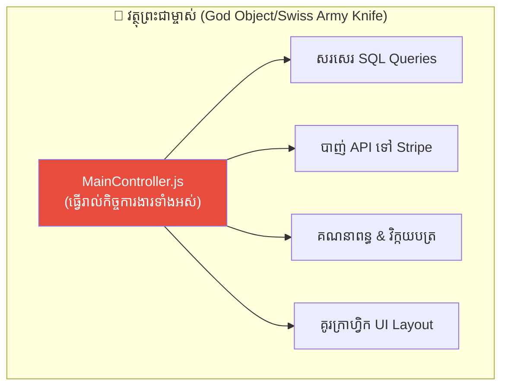
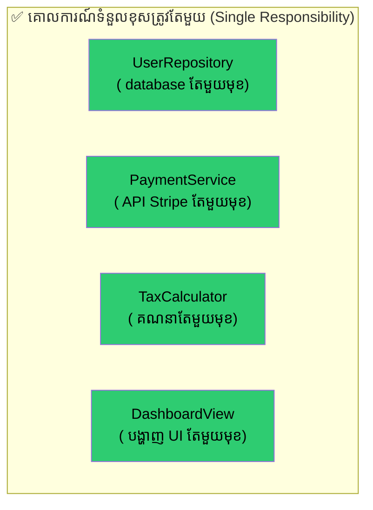
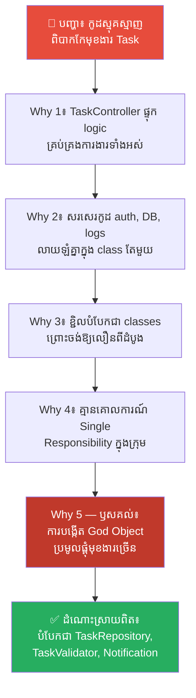
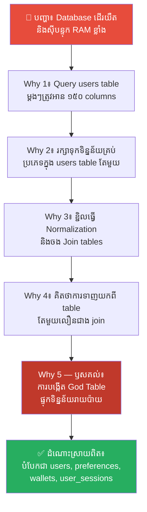
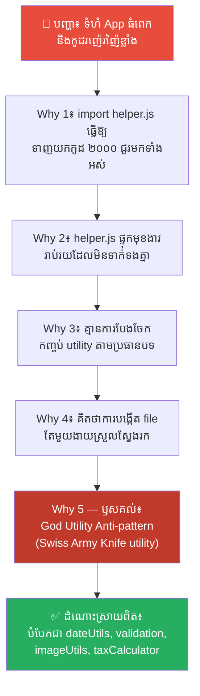
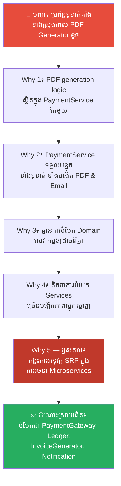
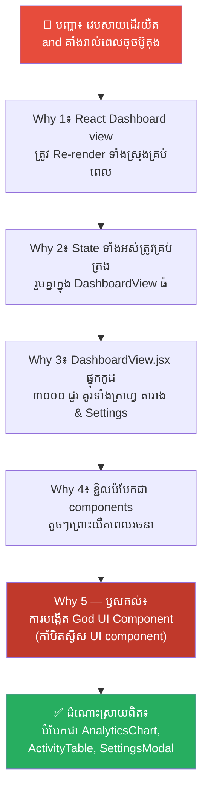
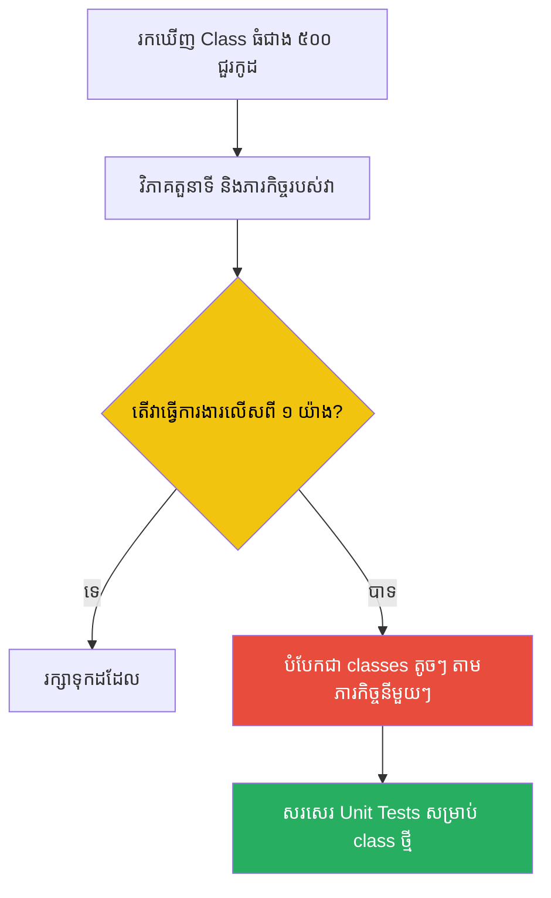

# The Swiss Army Knife and the God Object (កាំបិតស្វីស និងវត្ថុព្រះជាម្ចាស់)៖ ឈប់បង្កើតឧបករណ៍ដឹងគ្រប់រឿង ចាប់ផ្តើមអនុវត្តគោលការណ៍ទំនួលខុសត្រូវតែមួយ

**Author:** ichamrong  
**Date:** 2026-05-17  
**Tags:** #oop #god-object #single-responsibility #solid-principles #anti-pattern  
**Category:** Concepts  
**Read Time:** ~15 min  

---

## 📌 មាតិកា (Table of Contents)
- [លំនាំបញ្ហា (The Pattern)](#លំនាំបញ្ហា-the-pattern)
- [១. បញ្ហា៖ វត្ថុព្រះជាម្ចាស់ និងអន្ទាក់កាំបិតស្វីស (The Issue: The God Object and The Swiss Army Knife Trap)](#១-បញ្ហា-វត្ថុព្រះជាម្ចាស់-និងអន្ទាក់កាំបិតស្វីស-the-issue-the-god-object-and-the-swiss-army-knife-trap)
- [២. ឧទាហរណ៍ជាក់ស្តែងក្នុងពិភពពិត (Real World Examples)](#២-ឧទាហរណ៍ជាក់ស្តែងក្នុងពិភពពិត)
  - [ឧទាហរណ៍ទី ១ — កម្រិតស្រាល៖ Class គ្រប់គ្រងមុខងារកម្មវិធីទាំងមូល (The God Controller in small apps)](#ឧទាហរណ៍ទី-១-កម្រិតស្រាល-class-គ្រប់គ្រងមុខងារកម្មវិធីទាំងមូល-the-god-controller-in-small-apps)
  - [ឧទាហរណ៍ទី ២ — កម្រិតមធ្យម (បច្ចេកទេស)៖ តារាងទិន្នន័យព្រះជាម្ចាស់ (The Omniscient Database Table)](#ឧទាហរណ៍ទី-២-កម្រិតមធ្យម-បច្ចេកទេស-តារាងទិន្នន័យព្រះជាម្ចាស់-the-omniscient-database-table)
  - [ឧទាហរណ៍ទី ៣ — កម្រិតមធ្យម (បច្ចេកទេស)៖ ឯកសារជំនួយដែលដឹងគ្រប់រឿង (The Giant Utility File - helper.js)](#ឧទាហរណ៍ទី-៣-កម្រិតមធ្យម-បច្ចេកទេស-ឯកសារជំនួយដែលដឹងគ្រប់រឿង-the-giant-utility-file-helperjs)
  - [ឧទាហរណ៍ទី ៤ — កម្រិតមធ្យម (បច្ចេកទេស)៖ សេវាកម្មទូទាត់ប្រាក់ដែលដឹងគ្រប់រឿង (The Monolithic Payment Service)](#ឧទាហរណ៍ទី-៤-កម្រិតមធ្យម-បច្ចេកទេស-សេវាកម្មទូទាត់ប្រាក់ដែលដឹងគ្រប់រឿង-the-monolithic-payment-service)
  - [ឧទាហរណ៍ទី ៥ — កម្រិតធ្ងន់៖ សមាសភាគបង្ហាញ UI ព្រះជាម្ចាស់ (The All-in-One UI Dashboard component)](#ឧទាហរណ៍ទី-៥-កម្រិតធ្ងន់-សមាសភាគបង្ហាញ-ui-ព្រះជាម្ចាស់-the-all-in-one-ui-dashboard-component)
- [៣. កត្តាជម្រុញ៖ ភាពប្រញាប់ប្រញាល់សរសេរកូដ និងការភ័យខ្លាចការបង្កើត Files ច្រើន (The Aggravator: Laziness and Folder Proliferation Fear)](#៣-កត្តាជម្រុញ-ភាពប្រញាប់ប្រញាល់សរសេរកូដ-និងការភ័យខ្លាចការបង្កើត-files-ច្រើន-the-aggravator-laziness-and-folder-proliferation-fear)
- [៤. ដំណោះស្រាយទូទៅ៖ របៀបបំបែកកាំបិតស្វីសឱ្យទៅជាប្រអប់ឧបករណ៍របស់ជាង (The General Solution: Applying the Single Responsibility Principle)](#៤-ដំណោះស្រាយទូទៅ-របៀបបំបែកកាំបិតស្វីសឱ្យទៅជាប្រអប់ឧបករណ៍របស់ជាង-the-general-solution-applying-the-single-responsibility-principle)
- [សេចក្តីសន្និដ្ឋាន (Conclusion)](#សេចក្តីសន្និដ្ឋាន-conclusion)
- [ឯកសារយោង (References)](#ឯកសារយោង-references)
- [Related Posts](#related-posts)

---

## លំនាំបញ្ហា (The Pattern)

តើអ្នកធ្លាប់បើកមើលកូដនៅក្នុងគម្រោងរបស់អ្នក ហើយជួបប្រទះឯកសារ (File) ឬ Class មួយដែលមានឈ្មោះដូចជា `ApplicationManager`, `GlobalUtils`, ឬ `MainController` ដែលមានកូដរាប់ពាន់ជួរ និងផ្ទុកទៅដោយមុខងារគ្រប់សព្វបែបយ៉ាង ដែរឬទេ?

នៅក្នុងការរចនាប្រព័ន្ធ និងការសរសេរកូដបែប OOP កំហុសដ៏ពេញនិយមបំផុតមួយគឺការបង្កើត **God Object (វត្ថុព្រះជាម្ចាស់)**។ ផលវិបាកដែលទទួលបានគឺ៖
* កូដមានភាពស្មុគស្មាញខ្លាំង ដូចគុយទាវស្រឡាញ់គ្នា (Spaghetti Code) ដែលគ្មាននរណាម្នាក់ហ៊ានកែប្រែ។
* មិនអាចសរសេរកូដតេស្តបាន (Untestable) ព្រោះមុខងារទាំងអស់ជាប់ពាក់ព័ន្ធគ្នាជិតស្និទ្ធ។
* មិនអាចយកកូដទៅប្រើប្រាស់ឡើងវិញបាន (Unreusable) ដោយសារតែការចងភ្ជាប់គ្នាស្អិតរមួត (Tight Coupling)។

វាប្រៀបដូចជាការដែលអ្នកព្យាយាមប្រើ **កាំបិតស្វីស (Swiss Army Knife)** ដើម្បីសាងសង់ផ្ទះមួយខ្នងអញ្ចឹង។ ទោះបីជាកាំបិតនោះមានមុខងារច្រើន (មានកន្ត្រៃ ដបស្រា ដែកកោស ស្លាបព្រា) ក៏វាមិនអាចធ្វើការងារបានល្អដូចញញួរ រណារ ឬទួណាវីសពិតប្រាកដឡើយ។ ដើម្បីសាងសង់ប្រព័ន្ធរឹងមាំ យើងត្រូវអនុវត្តគោលការណ៍ **Single Responsibility Principle (គោលការណ៍ទំនួលខុសត្រូវតែមួយ)**។

---

## ១. បញ្ហា៖ វត្ថុព្រះជាម្ចាស់ និងអន្ទាក់កាំបិតស្វីស (The Issue: The God Object and The Swiss Army Knife Trap)

នៅក្នុងវិស្វកម្មកម្មវិធី **God Object** គឺជា Class, ឯកសារ, ឬសេវាកម្មមួយដែល «ដឹងច្រើនពេក» និង «ធ្វើការងារច្រើនពេក» ផ្ទុយស្រឡាំងកាំងពីគោលការណ៍រចនាកូដល្អ។

នៅពេលដែល Class មួយផ្ទុកទៅដោយ logic នៃ database, logic នៃ network, logic នៃ business calculation, និង UI rendering វានឹងបង្កើតជា **Tight Coupling (ការចងភ្ជាប់គ្នាស្អិត)**។ ប្រសិនបើអ្នកចង់ផ្លាស់ប្តូររូបរាង UI layout វានឹងទៅប៉ះពាល់ និងធ្វើឱ្យខូច logic របស់ database ដោយអចេតនា។

លោក **Robert C. Martin (Uncle Bob)** បានពោលជាគោលការណ៍ស្នូលច្បាស់លាស់ថា៖

> 💡 **«A class should have one, and only one, reason to change (Class មួយ គប្បីមានហេតុផលតែមួយគត់ ដើម្បីធ្វើការផ្លាស់ប្តូរវា)»**

នេះគឺជាគោលការណ៍ **Single Responsibility Principle (SRP)** ដែលជាអក្សរ «S» នៅក្នុង **SOLID Principles**។ Class នីមួយៗត្រូវតែមានទំនួលខុសត្រូវច្បាស់លាស់ និងផ្តោតលើភារកិច្ចតែមួយគត់ ដូចជាញញួរនៅក្នុងប្រអប់ឧបករណ៍របស់ជាង ដែលមានតួនាទីតែមួយគត់គឺវាយដែកគោល ដោយមិនព្យាយាមដើរតួជាកន្ត្រៃ ឬដែកកោសឡើយ។

---

## ២. ឧទាហរណ៍ជាក់ស្តែងក្នុងពិភពពិត

នេះជា **ឧទាហរណ៍ជាក់ស្តែងចំនួន ៥** បង្ហាញពីគ្រោះថ្នាក់នៃកាំបិតស្វីសបច្ចេកវិទ្យា (God Object) និងរបៀបបំបែកវា ៖

---

### ឧទាហរណ៍ទី ១ — កម្រិតស្រាល៖ Class គ្រប់គ្រងមុខងារកម្មវិធីទាំងមូល (The God Controller in small apps)

**ស្ថានភាព (Situation)៖** ក្រុមហ៊ុនអភិវឌ្ឍន៍ប្រព័ន្ធគ្រប់គ្រងការងារសាមញ្ញ (Task Management App)។

**សកម្មភាពខុសឆ្គង (Wrong Action)៖** ពួកគេបានសរសេរកូដគ្រប់គ្រងដំណើរការការងារទាំងអស់ ដូចជា ផ្ទៀងផ្ទាត់សិទ្ធិអ្នកប្រើប្រាស់ គណនាថ្ងៃផុតកំណត់ កត់ត្រា Logs និងសរសេរ SQL to database នៅក្នុង Class តែមួយឈ្មោះ `TaskController` ព្រោះចង់ឱ្យងាយស្រួលកែប្រែក្នុង file តែមួយ។

**ការវិភាគបែប 5 Whys៖**

| # | សំណួរ (Why?) | ចម្លើយ (Answer) |
|---|---|---|
| 1 | ហេតុអ្វីបានជាការបន្ថែមមុខងារកែប្រែ Task ជួបប្រទះ Bug ច្រើន និងពិបាកខ្លាំង? | ពីព្រោះកូដរបស់ `TaskController` មានភាពស្មុគស្មាញ និងឡើងដល់ទៅរាប់ពាន់ជួរកូដ។ |
| 2 | ហេតុអ្វីបានជាកូដឡើងដល់ទៅរាប់ពាន់ជួរ និងរញ៉េរញ៉ៃខ្លាំងម្ល៉េះ? | ពីព្រោះវាផ្ទុកទៅដោយ logic ផ្ទៀងផ្ទាត់សិទ្ធិ (Auth), SQL query, និងការផ្ញើ Email ជូនដំណឹងជាមួយគ្នា។ |
| 3 | ហេតុអ្វីបានជាសរសេរ logic ទាំងនោះលាយឡំគ្នាក្នុង file តែមួយ? | ពីព្រោះពួកគេគិតថា ការបង្កើត file តែមួយងាយស្រួលសរសេរ និងមិនបាច់ដើររក files ច្រើនក្នុង Folders។ |
| 4 | ហេតុអ្វីបានជាបារម្ភពីរឿង files ច្រើន ទាំងដែលវាជួយរៀបចំកូដឱ្យមានរបៀបរៀបរយ? | ពីព្រោះពួកគេគ្មានការបណ្តុះបណ្តាល ឬយល់ដឹងពីរបៀបរៀបចំរចនាសម្ព័ន្ធកូដ (Software Design Patterns) ឡើយ។ |
| 5 | ហេតុអ្វីបានជាខ្វះការរៀបចំរចនាសម្ព័ន្ធកូដស្តង់ដារ? | **ពីព្រោះការបង្កើត God Object (វត្ថុព្រះជាម្ចាស់) ដោយសារតែការចង់បានលទ្ធផលរហ័ស និងការរំលងគោលការណ៍ Single Responsibility Principle (SRP) តាំងពីថ្ងៃដំបូង។** |

**ដំណោះស្រាយពិតប្រាកដ៖** អនុវត្ត SRP ដោយបំបែក `TaskController` ជា Classes តូចៗ និងមានតួនាទីច្បាស់លាស់៖ `TaskRepository` (សម្រាប់តែរឿង database), `TaskValidator` (សម្រាប់សួរបញ្ជាក់ទិន្នន័យ), និង `NotificationService` (សម្រាប់ផ្ញើសារជូនដំណឹង)។

---

### ឧទាហរណ៍ទី ២ — កម្រិតមធ្យម (បច្ចេកទេស)៖ តារាងទិន្នន័យព្រះជាម្ចាស់ (The Omniscient Database Table)

**ស្ថានភាព (Situation)៖** ក្រុមហ៊ុនចង់រចនាប្រព័ន្ធរក្សាទុកទិន្នន័យព័ត៌មាន និងសកម្មភាពរបស់អ្នកប្រើប្រាស់ (Users) នៅក្នុង Database។

**សកម្មភាពខុសឆ្គង (Wrong Action)៖** ពួកគេបានបង្កើត Table `users` តែមួយគត់ដែលមាន ១៥០ Columns ដើម្បីរក្សាទុករាល់ព័ត៌មានទាំងអស់ រួមមាន ព័ត៌មានផ្ទាល់ខ្លួន, Session IDs, wallet balances, medical records, logs, និង account preferences ព្រោះគិតថាងាយស្រួល Query មិនបាច់ Join Tables ស្មុគស្មាញ។

**ការវិភាគបែប 5 Whys៖**

| # | សំណួរ (Why?) | ចម្លើយ (Answer) |
|---|---|---|
| 1 | ហេតុអ្វីបានជា Database Server ដើរយឺត និងប្រើប្រាស់ RAM ខ្ពស់ខ្លាំងជារៀងរាល់ថ្ងៃ? | ពីព្រោះរាល់ការ Query ទិន្នន័យ User ម្នាក់ ប្រព័ន្ធត្រូវអានទិន្នន័យធំដែលមាន ១៥០ columns ចេញពី memory។ |
| 2 | ហេតុអ្វីបានជា Table `users` មានរហូតដល់ទៅ ១៥០ columns? | ពីព្រោះទិន្នន័យគ្រប់ប្រភេទ (Wallet, Medical, Logs) ត្រូវបានរក្សាទុកបញ្ចូលគ្នាក្នុង Table តែមួយ។ |
| 3 | ហេតុអ្វីបានជាមិនបែងចែក Database ទៅជា Tables តូចៗតាមប្រភេទរបស់វា? | ពីព្រោះពួកគេយល់ថា ការប្រើប្រាស់ Table តែមួយ គឺងាយស្រួលសរសេរកូដ SQL និងលឿនជាងការសរសេរ SQL Join ស្មុគស្មាញ។ |
| 4 | ហេតុអ្វីបានជាយល់ច្រឡំថា Table ធំលឿនជាង Join ទាំងដែលវាកាត់បន្ថយ Performance របស់ Server? | ពីព្រោះពួកគេមិនធ្លាប់មាន Database Administrator (DBA) ឬការធ្វើសវនកម្មលើការរចនា Database Schema ឡើយ។ |
| 5 | ហេតុអ្វីបានជាខ្វះការត្រួតពិនិត្យលើការរចនា Database? | **ពីព្រោះការបង្កើត «God Table (តារាងទិន្នន័យព្រះជាម្ចាស់)» ដែលជាបំណុលបច្ចេកទេសកម្រិតទិន្នន័យ ដោយសារតែការចង់បានភាពងាយស្រួលបណ្តោះអាសន្ន។** |

**ដំណោះស្រាយពិតប្រាកដ៖** ធ្វើ Normalization លើ Database ដោយបំបែក Table `users` ទៅជា Tables តូចៗដាច់ដោយឡែកពីគ្នា ដូចជា៖ `users` (ព័ត៌មានស្នូល), `user_preferences` (ការកំណត់), `user_wallets` (សមតុល្យលុយ), និង `user_sessions` (គណនី active) ដែលជួយឱ្យ Database ដើរលឿនជាងមុនរាប់ដង។

---

### ឧទាហរណ៍ទី ៣ — កម្រិតមធ្យម (បច្ចេកទេស)៖ ឯកសារជំនួយដែលដឹងគ្រប់រឿង (The Giant Utility File - helper.js)

**ស្ថានភាព (Situation)៖** ក្រុមហ៊ុនមានគម្រោង Javascript មួយដែលត្រូវការមុខងារជំនួយ (Helper Functions) សម្រាប់ប្រើប្រាស់ឡើងវិញនៅកន្លែងផ្សេងៗគ្នា។

**សកម្មភាពខុសឆ្គង (Wrong Action)៖** ពួកគេបានបង្កើតឯកសារ `helper.js` ឬ `utils.js` តែមួយដែលមានកូដជាង ២,០០០ ជួរ ផ្ទុកទៅដោយមុខងារមិនទាក់ទងគ្នា ដូចជា គណនាថ្ងៃខែ ផ្ទៀងផ្ទាត់ email, បម្លែងទំហំរូបភាព, គណនាតម្លៃពន្ធ, និងបាញ់ API ខាងក្រៅ ដោយ import ប្រើប្រាស់គ្រប់ទីកន្លែង។

**ការវិភាគបែប 5 Whys៖**

| # | សំណួរ (Why?) | ចម្លើយ (Answer) |
|---|---|---|
| 1 | ហេតុអ្វីបានជាទំហំកម្មវិធី (Bundle Size) ធំខ្លាំងហួសហេតុ និងដំណើរការយឺតលើទូរស័ព្ទដៃ? | ពីព្រោះរាល់ពេលដែល App ត្រូវការបម្លែងថ្ងៃខែសាមញ្ញ វាក៏ត្រូវទាញយកកូដជាង ២,០០០ ជួររបស់ `helper.js` មកទាំងអស់។ |
| 2 | ហេតុអ្វីបានជា `helper.js` មានទំហំធំ និងផ្ទុកមុខងារចម្រុះគ្នាយ៉ាងនេះ? | ពីព្រោះរាល់ពេលដែល Developer ត្រូវការសរសេរមុខងាររួមណាមួយ ពួកគេតែងតែសរសេរវាបញ្ចូលទៅក្នុង `helper.js` ជានិច្ច។ |
| 3 | ហេតុអ្វីបានជាសរសេររាល់មុខងាររួមទាំងអស់ក្នុងឯកសារតែមួយ? | ពីព្រោះវាមានភាពងាយស្រួល មិនបាច់សរសេរ logic បែងចែក និងមិនបាច់បង្កើតឯកសារថ្មីៗច្រើននាំតែស្មុគស្មាញ។ |
| 4 | ហេតុអ្វីបានជាបារម្ភពីការបង្កើតឯកសារច្រើន ទាំងដែលវាជួយរៀបចំកូដឱ្យស្អាត? | ពីព្រោះពួកគេមិនធ្លាប់ដឹងពីរបៀបដែល Webpack ឬ bundlers ដំណើរការទាញយកកូដ (Tree Shaking) ឡើយ។ |
| 5 | ហេតុអ្វីបានជាខ្វះការយល់ដឹងពីរបៀបដំណើរការរបស់ Bundlers? | **ពីព្រោះការបង្កើត «God Utility (ឯកសារជំនួយព្រះជាម្ចាស់)» ដែលជាការលំអៀងទៅលើភាពងាយស្រួលបណ្តោះអាសន្ន និងការមើលរំលងគោលការណ៍ Single Responsibility Principle (SRP)។** |

**ដំណោះស្រាយពិតប្រាកដ៖** បំបែក `helper.js` ទៅជា Utilities modules តូចៗ និងផ្តោតលើប្រធានបទជាក់លាក់ ដូចជា៖ `dateUtils.js`, `validationUtils.js`, `imageUtils.js`, និង `taxCalculator.js` ដែលងាយស្រួលអាន និងជួយឱ្យ Bundlers អាចធ្វើ Tree Shaking ទាញយកតែកូដដែលប្រើប្រាស់ពិតប្រាកដ។

---

### ឧទាហរណ៍ទី ៤ — កម្រិតមធ្យម (បច្ចេកទេស)៖ សេវាកម្មទូទាត់ប្រាក់ដែលដឹងគ្រប់រឿង (The Monolithic Payment Service)

**ស្ថានភាព (Situation)៖** ក្រុមហ៊ុនចង់បង្កើត Microservice សម្រាប់គ្រប់គ្រងប្រព័ន្ធទូទាត់ប្រាក់ (Payment Service)។

**សកម្មភាពខុសឆ្គង (Wrong Action)៖** ពួកគេបានបង្កើត `PaymentService` តែមួយគត់ដែលទទួលខុសត្រូវលើ៖ ការភ្ជាប់ gateway ខាងក្រៅ, ការកត់ត្រាទិន្នន័យ Ledger ក្នុង Database, ការបង្កើតវិក្កយបត្រ Invoice PDF, និងការផ្ញើ Email ជូនដំណឹងអតិថិជន។

**ការវិភាគបែប 5 Whys៖**

| # | សំណួរ (Why?) | ចម្លើយ (Answer) |
|---|---|---|
| 1 | ហេតុអ្វីបានជាអតិថិជនមិនអាចចុចទូទាត់ប្រាក់បាន កំឡុងពេលប្រព័ន្ធជួបបញ្ហា? | ពីព្រោះ `PaymentService` ទាំងមូលបានគាំង និងលែងដំណើរការ (Crashed)។ |
| 2 | ហេតុអ្វីបានជា `PaymentService` គាំង លែងដំណើរការទាំងស្រុង? | ពីព្រោះមុខងារបង្កើត Invoice PDF ជួបប្រទះបញ្ហាអស់ memory (Out of Memory) និងធ្វើឱ្យសេវាកម្មទាំងមូលរលត់។ |
| 3 | ហេតុអ្វីបានជាមុខងារបង្កើត PDF អាចទាញទម្លាក់សេវាកម្មទូទាត់លុយទាំងមូលឱ្យគាំងតាម? | ពីព្រោះ logic នៃការបង្កើត PDF និង logic នៃការទូទាត់លុយ ត្រូវបានសរសេររួមគ្នាក្នុង Service តែមួយ។ |
| 4 | ហេតុអ្វីបានជាសរសេរមុខងារផ្សេងគ្នាយ៉ាងនេះបញ្ចូលគ្នាក្នុង Service តែមួយ? | ពីព្រោះពួកគេគិតថា ការបង្កើត និងថែទាំ Microservice តែមួយ គឺងាយស្រួលជាងការគ្រប់គ្រង Services តូចៗច្រើនដាច់ពីគ្នា។ |
| 5 | ហេតុអ្វីបានជាបារម្ភពីរឿងគ្រប់គ្រង Services ច្រើន ទាំងដែលវាជួយ Isolate បញ្ហា? | **ពីព្រោះកង្វះការយល់ដឹងពីស្ថាបត្យកម្មកូដ និងការខកខានក្នុងការបែងចែក Domain boundaries ឱ្យដាច់ពីគ្នា ដែលជាលទ្ធផលនៃការរំលងគោលការណ៍ Single Responsibility (SRP) ក្នុងកម្រិត Microservices។** |

**ដំណោះស្រាយពិតប្រាកដ៖** បំបែក `PaymentService` ទៅជា Services ឯករាជ្យតូចៗ៖ `PaymentGateway` (សម្រាប់ទាក់ទង Stripe/PayPal), `LedgerService` (សម្រាប់កត់ត្រាទិន្នន័យ), `InvoiceGenerator` (សម្រាប់បង្កើត PDF), និង `NotificationService` (សម្រាប់ផ្ញើ Email) ដើម្បីធានាថា ប្រសិនបើសេវាកម្មបង្កើត PDF គាំង ក៏មិនប៉ះពាល់ដល់ការបាញ់លុយរបស់អតិថិជនដែរ។

---

### ឧទាហរណ៍ទី ៥ — កម្រិតធ្ងន់៖ សមាសភាគបង្ហាញ UI ព្រះជាម្ចាស់ (The All-in-One UI Dashboard component)

**ស្ថានភាព (Situation)៖** ក្រុមហ៊ុនចង់អភិវឌ្ឍទំព័រដើម UI Dashboard សម្រាប់បង្ហាញរបាយការណ៍ហិរញ្ញវត្ថុ និងសកម្មភាពអ្នកប្រើប្រាស់សម្រាប់ Admin។

**សកម្មភាពខុសឆ្គង (Wrong Action)៖** ពួកគេបានសរសេរកូដ React component តែមួយឈ្មោះ `DashboardView.jsx` (កូដជាង ៣,០០០ ជួរ) ដែលទាញយកទិន្នន័យផ្ទាល់ពី APIs, គ្រប់គ្រង State ទាំងអស់រួមគ្នា, គូរក្រាហ្វ, បង្ហាញតារាងបញ្ជី, និងបង្ហាញ modal settings ព្រោះគិតថាស្រួលកែប្រែក្នុង file តែមួយ។

**ការវិភាគបែប 5 Whys៖**

| # | សំណួរ (Why?) | ចម្លើយ (Answer) |
|---|---|---|
| 1 | ហេតុអ្វីបានជាទំព័រ Dashboard ដើរយឺតខ្លាំង និងគាំងរាល់ពេលអ្នកប្រើប្រាស់ចុចប៊ូតុងសាមញ្ញ? | ពីព្រោះ React component ត្រូវធ្វើការ Re-render ទាំងស្រុងរាល់ពេលមានការផ្លាស់ប្តូរ State បន្តិចបន្តួច។ |
| 2 | ហេតុអ្វីបានជាការ Re-render ប៉ះពាល់ដល់ប្រព័ន្ធទាំងមូលយ៉ាងនេះ? | ពីព្រោះរាល់ក្រាហ្វិក 3D តារាងទិន្នន័យ និង settings configurations ទាំងអស់ ត្រូវបានចងភ្ជាប់ទៅនឹង State រួមគ្នាតែមួយ។ |
| 3 | ហេតុអ្វីបានជាចងភ្ជាប់រាល់មុខងារទាំងអស់ទៅនឹង State រួមគ្នាតែមួយ? | ពីព្រោះកូដទាំងអស់ត្រូវបានសរសេរនៅក្នុង Component ធំតែមួយឈ្មោះ `DashboardView.jsx`។ |
| 4 | ហេតុអ្វីបានជាសរសេរកូដ UI ដ៏ធំ និងស្មុគស្មាញក្នុង Component តែមួយ? | ពីព្រោះពួកគេគិតថា ការបំបែកជា components តូចៗ គឺយឺតពេលរចនា និងពិបាកបញ្ជូនទិន្នន័យឆ្លងកាត់គ្នា (Props Drilling)។ |
| 5 | ហេតុអ្វីបានជាខ្លាចការបញ្ជូនទិន្នន័យ និងមិនព្រមបំបែក Components? | **ពីព្រោះកង្វះការយល់ដឹងពីរបៀបរចនាកូដ UI ឱ្យមានលក្ខណៈម៉ូឌុល (Modular UI Design) និងការខកខានក្នុងការប្រើប្រាស់យន្តការគ្រប់គ្រង State កណ្តាល (ដូចជា Redux ឬ Context API)។** |

**ដំណោះស្រាយពិតប្រាកដ៖** បំបែក `DashboardView.jsx` ទៅជា Components តូចៗ និងឯករាជ្យពីគ្នា៖ `DashboardContainer` (សម្រាប់ទាញយកទិន្នន័យ), `AnalyticsChart` (សម្រាប់គូរក្រាហ្វ), `ActivityTable` (សម្រាប់បង្ហាញតារាង), និង `SettingsModal` (សម្រាប់បង្ហាញការកំណត់) ដែលជួយឱ្យការ Re-render កើតឡើងតែនៅលើ component ណាដែលចាំបាច់ និងជួយឱ្យប្រព័ន្ធដើរលឿនបំផុត។

---

## ៣. កត្តាជម្រុញ៖ ភាពប្រញាប់ប្រញាល់សរសេរកូដ និងការភ័យខ្លាចការបង្កើត Files ច្រើន (The Aggravator: Laziness and Folder Proliferation Fear)

ហេតុអ្វីបានជាវិស្វករជាច្រើននៅតែបន្តបង្កើត God Objects ទោះបីជាដឹងពីគ្រោះថ្នាក់របស់វាក៏ដោយ?

**ភាពខ្ជិលច្រអូសផ្នែកស្មារតី (Convenience Bias)៖**  
រាល់ពេលដែលយើងត្រូវការបន្ថែមមុខងារតូចមួយ វាតែងតែងាយស្រួលជាងក្នុងការ «សរសេរ ២ ទៅ ៣ ជួរកូដបន្ថែមទៅក្នុង Class ចាស់ដែលមានស្រាប់» ជាជាងការចំណាយពេលបង្កើត Class ថ្មី បង្កើត File ថ្មី និងរៀបចំ dependency injection។ ភាពខ្ជិលច្រអូសផ្នែកស្មារតីនេះ ធ្វើឱ្យកូដចាស់រីកធំធាត់បន្តិចម្តងៗរហូតដល់ក្លាយជាបិសាច (God Object)។

**ការភ័យខ្លាចការកើនឡើងនៃចំនួនឯកសារ (Folder Proliferation Fear)៖**  
វិស្វករជាច្រើនមានអារម្មណ៍បារម្ភ ឬធុញទ្រាន់នៅពេលឃើញ Folders របស់ពួកគេមានផ្ទុកឯកសារ (Files) ច្រើនពេក។ ពួកគេយល់ច្រឡំថា «ការមានឯកសារតិច គឺមានន័យថាកូដសាមញ្ញ»។ ពួកគេភ្លេចគិតថា ឯកសារតិចតែមានទំហំធំ (God Objects) គឺស្មុគស្មាញ និងពិបាកថែទាំជាងឯកសារច្រើនតែមានទំហំតូច និងមានទំនួលខុសត្រូវច្បាស់លាស់រាប់សិបដង។

---

## ៤. ដំណោះស្រាយទូទៅ៖ របៀបបំបែកកាំបិតស្វីសឱ្យទៅជាប្រអប់ឧបករណ៍របស់ជាង (The General Solution: Applying the Single Responsibility Principle)

ដើម្បីសម្អាត និងទប់ស្កាត់ការកកើតឡើងនៃ God Objects នៅក្នុងប្រព័ន្ធរបស់អ្នក សូមអនុវត្តតាមគោលការណ៍ណែនាំទាំងនេះ៖

### ១. អនុវត្តគោលការណ៍ Single Responsibility Principle (SRP)
រាល់ពេលសរសេរ ឬកែប្រែកូដ ត្រូវប្រាកដថា Class ឬ ឯកសាររបស់អ្នកមានទំនួលខុសត្រូវតែមួយគត់ និងច្បាស់លាស់បំផុត។ ប្រសិនបើអ្នកចង់ពន្យល់ពីតួនាទីរបស់ Class នោះ ហើយត្រូវប្រើពាក្យថា «និង (AND)» (ឧទាហរណ៍៖ Class នេះមានតួនាទីរក្សាទុកទិន្នន័យ **និង** ផ្ញើសារជូនដំណឹង) នោះមានន័យថា Class របស់អ្នកមានសញ្ញាណជា God Object ហើយ ត្រូវតែបំបែកវាជាបន្ទាន់។

### ២. ប្រើប្រាស់សេវាកម្មសម្របសម្រួល (Service Layer Pattern)
ដើម្បីចៀសវាងការសរសេរ logic ផ្ទៀងផ្ទាត់ និង logs លាយឡំគ្នា ត្រូវរៀបចំកូដជាស្រទាប់ៗ (Architecture Layers) ដូចជា៖
* **Controller Layer៖** ទទួលយកសំណើ (Requests) និងបញ្ជូនទៅកាន់សេវាកម្ម។
* **Service Layer៖** គណនា business logic ជាក់លាក់។
* **Repository Layer៖** ទទួលបន្ទុកតែការងារទាញ ឬរក្សាទុកទិន្នន័យក្នុង Database។

### ៣. រៀបចំកូដឡើងវិញជាប្រចាំ (Regular Refactoring Sprints)
កុំរង់ចាំរហូតដល់កូដឡើងដល់ ៥,០០០ ជួរទើបកែប្រែ។ ត្រូវធ្វើការ Refactor និងបំបែក classes ឱ្យបានលឿន និងជាប្រចាំរៀងរាល់សប្តាហ៍។

---

## សេចក្តីសន្និដ្ឋាន (Conclusion)

ការសរសេរកូដដោយប្រមូលផ្តុំរាល់មុខងារទាំងអស់នៅក្នុង Class តែមួយ ដូចជាកាំបិតស្វីស គឺលែងជាដំណោះស្រាយល្អទៀតហើយ។ វានឹងបង្កើតជាបំណុលបច្ចេកទេសដ៏ឈឺក្បាល និងទាញទម្លាក់គម្រោងទាំងមូលឱ្យដួលរលំទៅថ្ងៃអនាគត។

ចូរមានជំនឿចិត្តលើភាពម៉ូឌុល (Modular Design) និងគោរពគោលការណ៍ **Single Responsibility Principle** ឱ្យបានខ្ជាប់ខ្ជួន។ បំបែកកូដរបស់អ្នកទៅជា Classes, ឯកសារ, ឬសេវាកម្មតូចៗដែលមានទំនួលខុសត្រូវច្បាស់លាស់ ងាយស្រួលអាន ងាយស្រួលតេស្ត និងងាយស្រួលយកទៅប្រើប្រាស់ឡើងវិញ។ នេះគឺជាមធ្យោបាយតែមួយគត់ដើម្បីសាងសង់ប្រព័ន្ធដែលមានគុណភាពខ្ពស់ និងទទួលបានជោគជ័យដ៏យូរអង្វែង។

---

## ឯកសារយោង (References)

1. **Martin, R. C. (2018).** *Clean Architecture: A Craftsman's Guide to Software Structure and Design.* Prentice Hall.
2. **Feathers, M. (2004).** *Working Effectively with Legacy Code.* Prentice Hall.
3. **Fowler, M. (1999).** *Refactoring: Improving the Design of Existing Code.* Addison-Wesley.
4. **Gamma, E., Helm, R., Johnson, R., & Vlissides, J. (1994).** *Design Patterns: Elements of Reusable Object-Oriented Software.* Addison-Wesley.

---

## Related Posts

* **[36 The Gordian Knot and Overengineering](./36-the-gordian-knot-and-overengineering.md)** — របៀបស្វែងរកដំណោះស្រាយសាមញ្ញបំផុត ដើម្បីចៀសវាងការបង្កើតបំណុលបច្ចេកទេស។
* **[10 Technical Debt and Refactoring](./10-technical-debt-and-refactoring.md)** — របៀបគ្រប់គ្រង និងកាត់បន្ថយបំណុលបច្ចេកទេស ដើម្បីរក្សាល្បឿនអភិវឌ្ឍន៍ឱ្យលឿនជានិច្ច។
* **[49 Frankenstein and Legacy Code](./49-frankenstein-and-legacy-code.md)** — ការគ្រប់គ្រង និងកែលម្អកូដចាស់ៗ ដើម្បីកុំឱ្យវាក្លាយជាបិសាចបំផ្លាញប្រព័ន្ធ។

---

*Last updated: 2026-05-26*
