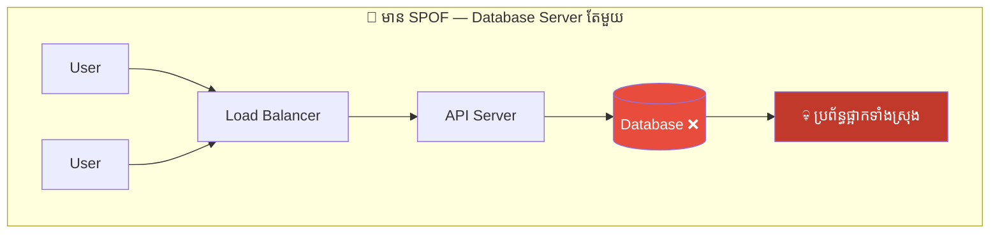
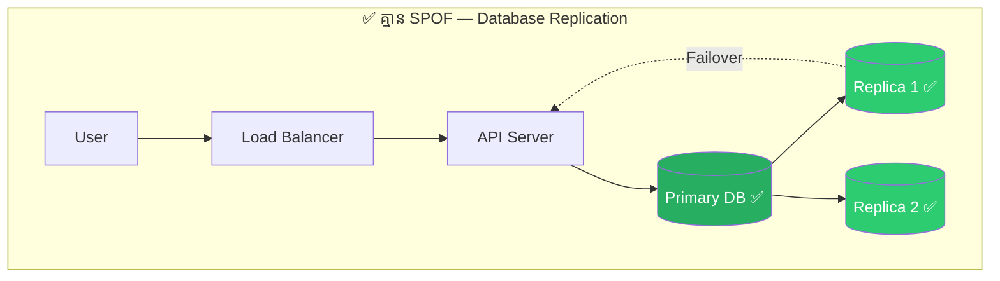
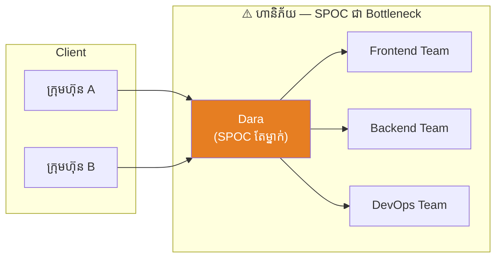
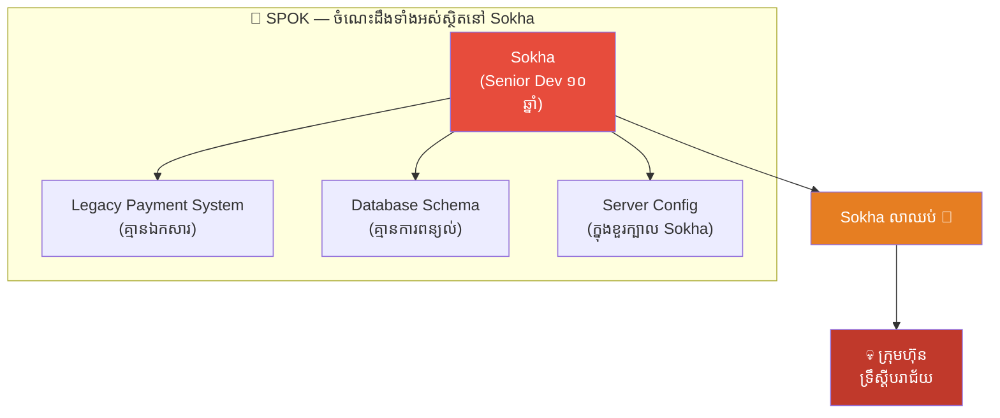
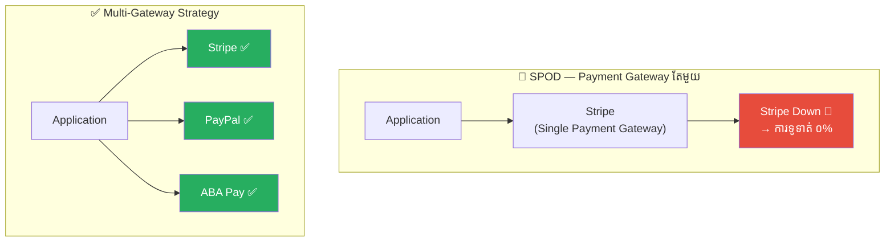
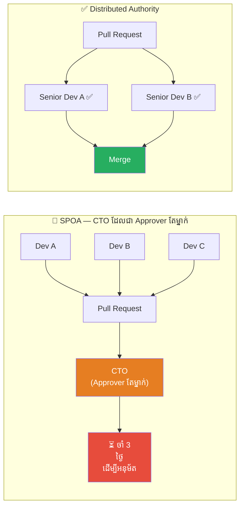
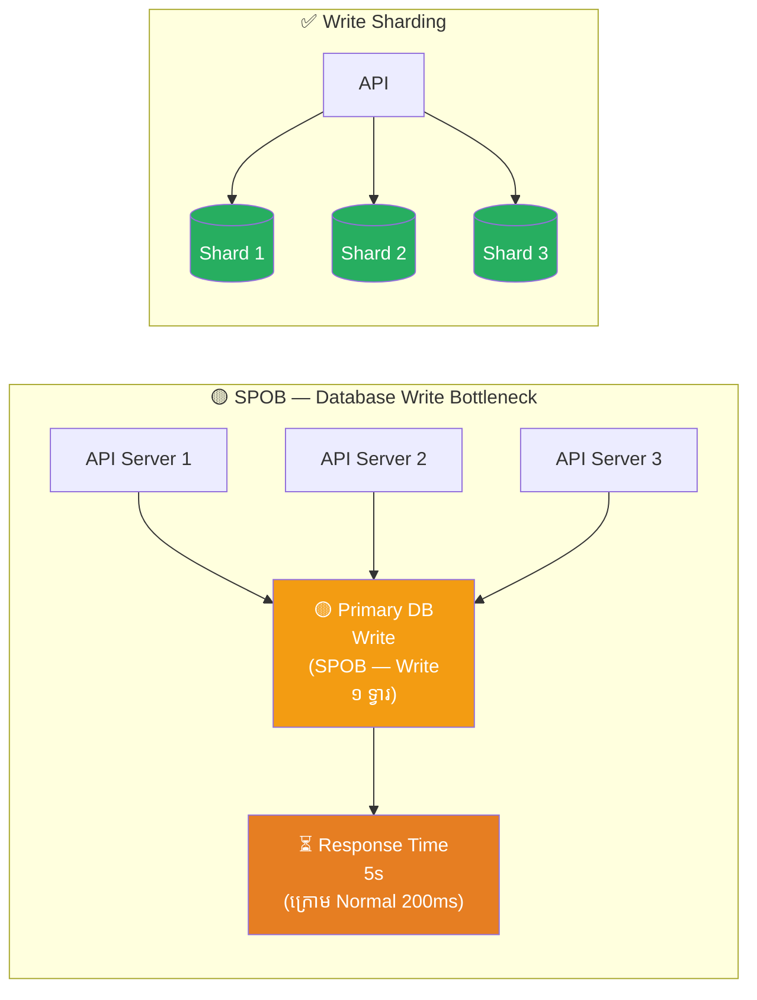
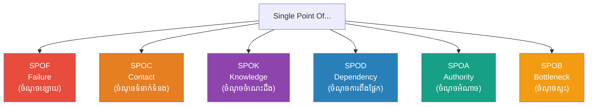

# Single Points: SPOF, SPOC, SPOK, SPOD, SPOA, SPOB (ចំណុចតែមួយ៖ ចំណុចខ្សោយ ចំណុចទំនាក់ទំនង ចំណុចចំណេះដឹង ចំណុចប្រតិបត្តិការ ចំណុចការងារ ចំណុចការទូទាត់)

**Author:** ichamrong  
**Date:** 2026-05-25  
**Tags:** #spof #spoc #spok #spod #spoa #spob #system-design #resilience #architecture #risk-management  
**Category:** Concepts  
**Read Time:** ~12 min  

---

## 📌 មាតិកា (Table of Contents)
- [សេចក្តីផ្តើម (Introduction)](#សេចក្តីផ្តើម-introduction)
- [១. SPOF — Single Point of Failure (ចំណុចខ្សោយតែមួយ)](#១-spof-single-point-of-failure-ចំណុចខ្សោយតែមួយ)
- [២. SPOC — Single Point of Contact (ចំណុចទំនាក់ទំនងតែមួយ)](#២-spoc-single-point-of-contact-ចំណុចទំនាក់ទំនងតែមួយ)
- [៣. SPOK — Single Point of Knowledge (ចំណុចចំណេះដឹងតែមួយ)](#៣-spok-single-point-of-knowledge-ចំណុចចំណេះដឹងតែមួយ)
- [៤. SPOD — Single Point of Dependency (ចំណុចការពឹងផ្អែកតែមួយ)](#៤-spod-single-point-of-dependency-ចំណុចការពឹងផ្អែកតែមួយ)
- [៥. SPOA — Single Point of Authority (ចំណុចអំណាចតែមួយ)](#៥-spoa-single-point-of-authority-ចំណុចអំណាចតែមួយ)
- [៦. SPOB — Single Point of Bottleneck (ចំណុចស្ទះតែមួយ)](#៦-spob-single-point-of-bottleneck-ចំណុចស្ទះតែមួយ)
- [ការប្រៀបធៀបគ្រប់ SPO* (Summary Comparison)](#ការប្រៀបធៀបគ្រប់-spo-summary-comparison)
- [Related Posts](#related-posts)

---

## សេចក្តីផ្តើម (Introduction)

នៅក្នុងការរចនាប្រព័ន្ធ (System Design) និងការគ្រប់គ្រងអង្គភាព (Organizational Management) មានគំនិតមួយដ៏ចំបាច់ ដែលវិស្វករ ថ្នាក់ដឹកនាំ និងអ្នកគ្រប់គ្រងគួរយល់ដឹង — នោះគឺ **"Single Point of ___"** ។

**"Single Point"** មានន័យថា **"ចំណុចតែមួយ"** — ប្រសិនបើចំណុចនោះបរាជ័យ ឬបាត់ ឬស្ទះ ប្រព័ន្ធ ឬអង្គភាពទាំងមូលនឹងប្រឈមមុខនឹងបញ្ហា។

ដូចជាខ្សែចង្វាក់ (Chain) ដែលប្រើដឹកជញ្ជូនទំនុក — ភាពរឹងមាំរបស់ខ្សែចង្វាក់ទាំងមូល ស្មើនឹងភាពរឹងមាំនៃអំពូលដែលខ្សោយបំផុត។

---

## ១. SPOF — Single Point of Failure (ចំណុចខ្សោយតែមួយ)

**SPOF** គឺជា SPO* ដែលគេស្គាល់ច្រើនបំផុត។ វាសំដៅទៅលើ **ធាតុផ្សំណាមួយក្នុងប្រព័ន្ធ ដែលប្រសិនបើវាបរាជ័យ ប្រព័ន្ធទាំងមូលនឹងបញ្ឈប់ដំណើរការ**។

### ឧទាហរណ៍ជាក់ស្តែង

| ស្ថានភាព | SPOF | ផលវិបាក |
|:---|:---|:---|
| Server តែមួយ | Host/VM | Server ដួល → Website ផ្អាក |
| Database គ្មាន Replica | Primary DB | DB ដួល → Data បាត់ |
| Network Switch តែមួយ | Switch | Switch ខូច → LAN ទាំងមូលផ្អាក |
| Certificate Manager តែម្នាក់ | SSL Cert Admin | គាត់ចាកចេញ → SSL Expire |

### របៀបការពារ (Mitigation)
- **Redundancy**: ដំណើរ Component ចំនួន ≥ 2 ជានិច្ច
- **Failover**: ការផ្លាស់ប្តូររហ័ស (Automatic Failover) នៅពេល Component ដើមបរាជ័យ
- **Health Checks**: Monitoring ជាបន្ត ដើម្បីរកឃើញ SPOF ច្រើនជាស្រាប់

---

## ២. SPOC — Single Point of Contact (ចំណុចទំនាក់ទំនងតែមួយ)

**SPOC** សំដៅទៅលើ **មនុស្ស ឬប្រព័ន្ធតែមួយ ដែលជាទ្វារទំនាក់ទំនងចម្បងសម្រាប់ Client ឬ Team ផ្សេង**។

SPOC មិនតែងតែអាក្រក់នោះទេ — ជាញឹកញាប់ SPOC ត្រូវបានបង្កើតតាម​ចេតនា ដើម្បីកាត់បន្ថយការច្របូកច្របល់ (Reduce Confusion)។

### ឧទាហរណ៍ជាក់ស្តែង

| ស្ថានភាព | SPOC | ហានិភ័យ |
|:---|:---|:---|
| Project Manager ១នាក់ | PM | PM ឈឺ → Communication ផ្អាក |
| Support Email ១ Account | support@company.com | Account ជាប់ Lock → Client ទំនាក់មិនបាន |
| API Gateway ១ | Gateway Service | Gateway Down → Client ហៅ API មិនបាន |

### របៀបការពារ (Mitigation)
- **Backup Contact**: កំណត់ Secondary SPOC ជានិច្ច
- **Shared Inbox**: ប្រើ Email Group ជំនួស Personal Email
- **Runbook**: ឯកសារ Standard Operation Procedures (SOP) ដើម្បីអ្នកផ្សេងអាចដំណើរការបានក្នុងករណីដែល SPOC មិននៅ

---

## ៣. SPOK — Single Point of Knowledge (ចំណុចចំណេះដឹងតែមួយ)

**SPOK** គឺជា **ស្ថានភាពដែលចំណេះដឹងជ្រាលជ្រៅអំពីប្រព័ន្ធ ឬដំណើរការ មានតែនៅក្នុងខួរក្បាលមនុស្សតែម្នាក់**។ នេះជា SPO* ដ៏គ្រោះថ្នាក់ ព្រោះវាមើលមិនឃើញ (Invisible)។

### ឧទាហរណ៍ជាក់ស្តែង

| ស្ថានភាព | SPOK | ហានិភ័យ |
|:---|:---|:---|
| Dev ចាស់ម្នាក់ដឹងតែម្នាក់ | Legacy Codebase Expert | Dev លាឈប់ → Code ចាប់ Admin មិនបាន |
| DBA ១ ដឹង DB Schema | Senior DBA | DBA ឈឺ → Production Bug ជួសជុលមិនបាន |
| Founder ដឹង Client Relationship | Founder | Founder ចាកចេញ → Client ទំនាក់ Primary គ្មាន |

### របៀបការពារ (Mitigation)
- **Documentation First**: ចម្លងចំណេះដឹងទៅ Confluence, Wiki, Notion
- **Pair Programming / Knowledge Transfer**: ធ្វើ Code Review ជាមួយ Junior ជានិច្ច
- **Bus Factor**: វាស់ "Bus Factor" របស់ Team (ប្រសិនបើ N នាក់ ត្រូវ "ជិះឡានក្ដារ" → ប្រព័ន្ធបរាជ័យ, N ត្រូវ > 1)

> 💡 **"ប្រសិនបើ Dev ១ នាក់ ប្រព្រឹត្តដូច្នោះ ហើយ Laptop របស់គាត់ ជ្រៀបទឹក នៅព្រឹករសៀលថ្ងៃប្រឹក្សា ប្រព័ន្ធអ្នកអាចនៅស្ងៀមមែនទេ?"**

---

## ៤. SPOD — Single Point of Dependency (ចំណុចការពឹងផ្អែកតែមួយ)

**SPOD** គឺ **ការពឹងផ្អែកលើ Third-Party Service ឬ Library ឬ Vendor តែមួយ** ក្នុងបែបដែលប្រសិនបើ Service នោះអត់ ប្រព័ន្ធរបស់អ្នកនឹងបរាជ័យ។

### ឧទាហរណ៍ជាក់ស្តែង

| ស្ថានភាព | SPOD | ហានិភ័យ |
|:---|:---|:---|
| npm Package ១ | `lodash` v3 ចាស់ | Package Deprecated → Build ខូច |
| Cloud Provider ១ | AWS Only | AWS Outage → Website ផ្អាក |
| SMS Provider ១ | Twilio Only | Twilio Down → OTP ផ្ញើរមិនបាន |
| CDN ១ | Cloudflare Only | Cloudflare Incident → Assets Load មិនបាន |

### របៀបការពារ (Mitigation)
- **Multi-Vendor Strategy**: ជ្រើសរើស Provider ≥ 2 សម្រាប់ Service ដ៏ចំបាច់
- **Abstraction Layer**: ប្រើ Interface/Adapter Pattern ដើម្បីប្ដូរ Provider ងាយ
- **Fallback**: បង្កើត Fallback Logic ដោយស្វ័យប្រវត្តិ នៅពេល Primary Provider ដួល

---

## ៥. SPOA — Single Point of Authority (ចំណុចអំណាចតែមួយ)

**SPOA** គឺ **ការដែលការសម្រេចចិត្តទាំងអស់ ត្រូវឆ្លងកាត់មនុស្ស ឬ Process តែមួយ** ដែលបង្កើតឱ្យ Bottleneck ដ៏ខ្លាំងក្លា ជាពិសេសនៅក្នុង Deployment Pipeline ឬការអនុម័ត (Approval)។

### ឧទាហរណ៍ជាក់ស្តែង

| ស្ថានភាព | SPOA | ហានិភ័យ |
|:---|:---|:---|
| CEO ចុះហត្ថលេខាគ្រប់Contract | CEO | CEO នៅក្រៅប្រទេស → Contract ចាំ 2 សប្ដាហ៍ |
| CTO Approve Deploy ទាំងអស់ | CTO | CTO ចំណាយ 80% ពេលលើ Approvals |
| Admin Account ១ | Root Account | Account ត្រូវ Lock → គ្មាននរណាម្នាក់ Deploy បាន |

### របៀបការពារ (Mitigation)
- **Delegation**: ចែករំលែកអំណាចជាមួយ Team Lead
- **Policy as Code**: ប្រើ Automated Gates (CI/CD checks) ជំនួស Manual Approval
- **Break Glass Procedure**: មាន Emergency Protocol ក្នុងករណីដែល Authority គ្មាននៅ

---

## ៦. SPOB — Single Point of Bottleneck (ចំណុចស្ទះតែមួយ)

**SPOB** ខុសពី SPOF ព្រោះ SPOB **មិនបរាជ័យ** — ប៉ុន្តែ **វាបន្ថយល្បឿនរបស់ប្រព័ន្ធទាំងមូល**។ ជាញឹកញាប់ SPOB ក្លាយជា SPOF ជាចុងក្រោយ ក្រោមការផ្ទុកសម្ពាធខ្ពស់ (High Load)។

### ឧទាហរណ៍ជាក់ស្តែង

| ស្ថានភាព | SPOB | ផលប៉ះពាល់ |
|:---|:---|:---|
| Database Write ១ Instance | Primary Write DB | Response យឺត → User ចាកចេញ |
| Message Queue ១ Partition | Kafka Single Partition | Throughput ជិតដល់ Limit |
| Synchronous Auth Check | Auth Service (Sync) | Auth ណែន → Request ទាំងអស់ ចាំ |
| Build Server ១ | CI Runner ១ | PR ១០ → Build Queue ចាំ 1 ម៉ោង |

### របៀបការពារ (Mitigation)
- **Horizontal Scaling**: Scale Out ជំនួស Scale Up
- **Async Processing**: ប្ដូរ Synchronous Calls ទៅ Async Queue
- **Caching**: ដាក់ Cache Layer ដើម្បីកាត់បន្ថយ Load ទៅ Bottleneck

---

## ការប្រៀបធៀបគ្រប់ SPO* (Summary Comparison)

| ទម្រង់ | ពេញ | ខ្មែរ | ហានិភ័យ | ចំបាច់ការពារ |
|:---|:---|:---|:---|:---|
| **SPOF** | Single Point of Failure | ចំណុចខ្សោយតែមួយ | ប្រព័ន្ធបញ្ឈប់ | Redundancy + Failover |
| **SPOC** | Single Point of Contact | ចំណុចទំនាក់ទំនងតែមួយ | Communication ផ្អាក | Backup Contact + SOP |
| **SPOK** | Single Point of Knowledge | ចំណុចចំណេះដឹងតែមួយ | ចំណេះដឹងបាត់បង់ | Documentation + Bus Factor |
| **SPOD** | Single Point of Dependency | ចំណុចការពឹងផ្អែកតែមួយ | Vendor Lock-in | Multi-Vendor + Abstraction |
| **SPOA** | Single Point of Authority | ចំណុចអំណាចតែមួយ | ដំណើរការយឺត | Delegation + Policy as Code |
| **SPOB** | Single Point of Bottleneck | ចំណុចស្ទះតែមួយ | ប្រព័ន្ធធ្លាក់ល្បឿន | Horizontal Scaling + Async |

> 💡 **គ្រប់ SPO* ទាំងអស់ Share ខ្លឹមសារតែមួយ: "ការប្រមូលផ្តុំហានិភ័យទៅចំណុចតែមួយ (Concentration of Risk) គឺជាការប្រឆាំងនឹងច្បាប់ Resilience ។"**

---

## Related Posts

*   **[34 The Library of Alexandria: Data Redundancy and Disaster Recovery](./34-the-library-of-alexandria-and-data-redundancy.md)** — ឧទាហរណ៍ប្រវត្តិសាស្ត្រដ៏ល្បីបំផុតនៃ SPOF — បណ្ណាល័យដ៏ធំបំផុតក្នុងលោក ដែលត្រូវបំផ្លិចបំផ្លាញក្នុងមួយថ្ងៃ ព្រោះគ្មានការចម្លង។
*   **[13 Single Source of Truth vs. Knowledge Silos](./13-single-source-of-truth-and-knowledge-silos.md)** — SSOT ជួយ Eliminate SPOK ដោយការធ្វើឱ្យចំណេះដឹង Accessible សម្រាប់ Team ទាំងអស់។
*   **[53 The Butterfly Effect and Cascading Failures](./53-the-butterfly-effect-and-cascading-failures.md)** — SPOF មួយ តែងតែនាំឱ្យ Cascading Failures ទៅ Downstream Components ទាំងអស់។
*   **[19 The Domino Effect and Systemic Failures](./19-the-domino-effect-and-systemic-failures.md)** — ភាពខ្សោយរបស់ SPOB ក្រោម Load ខ្ពស់ អាចបង្ករ Domino Effect បំផ្លិចប្រព័ន្ធ។

---

*Last updated: 2026-05-25*
