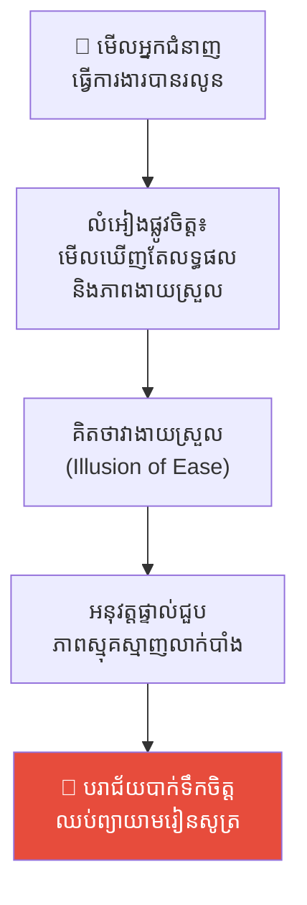
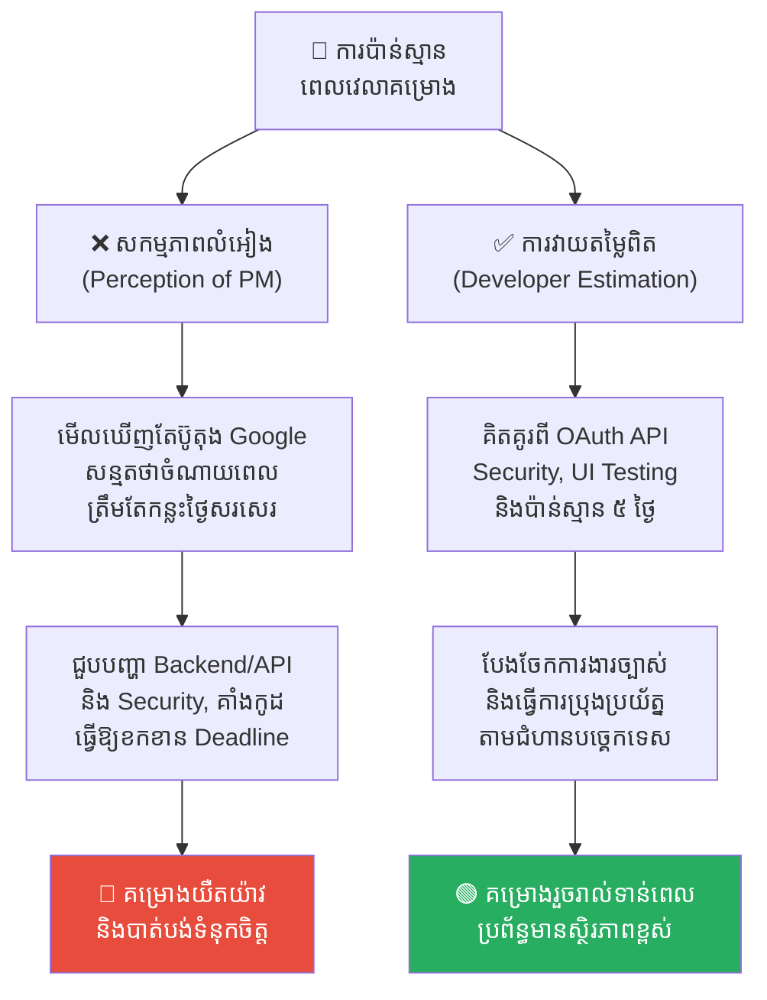
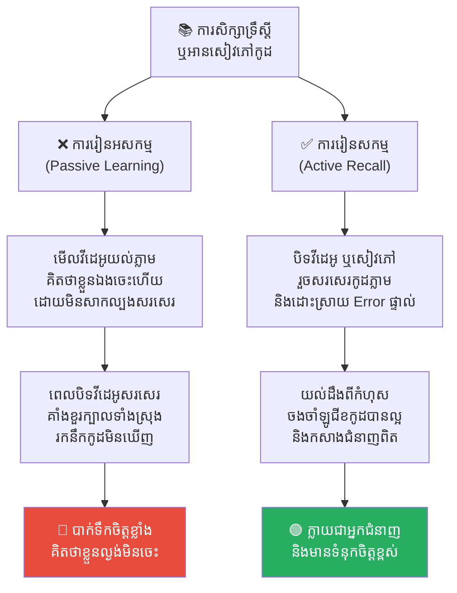
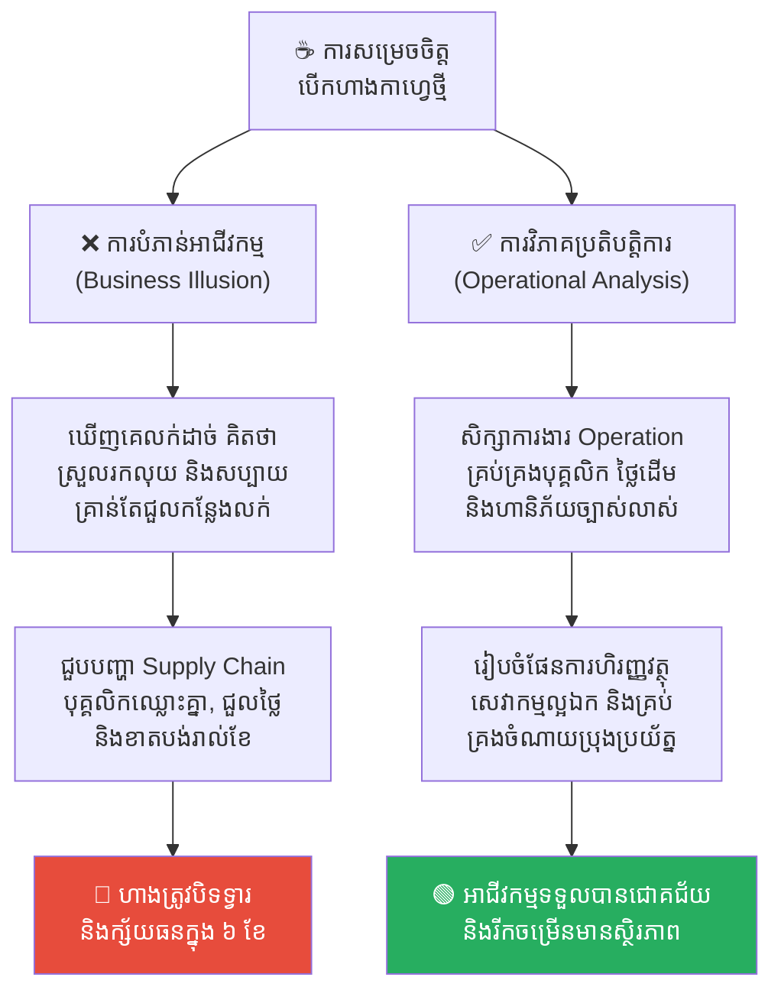
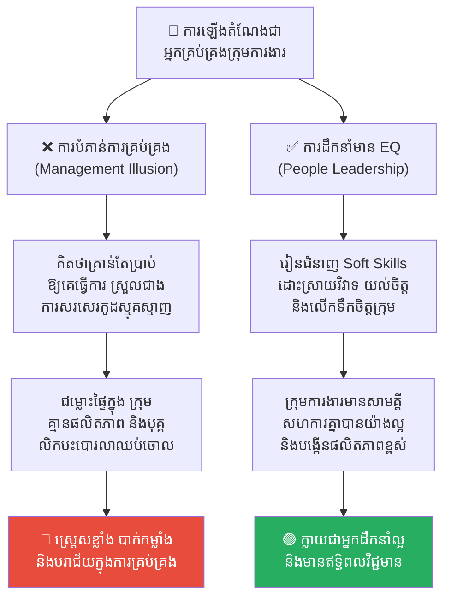
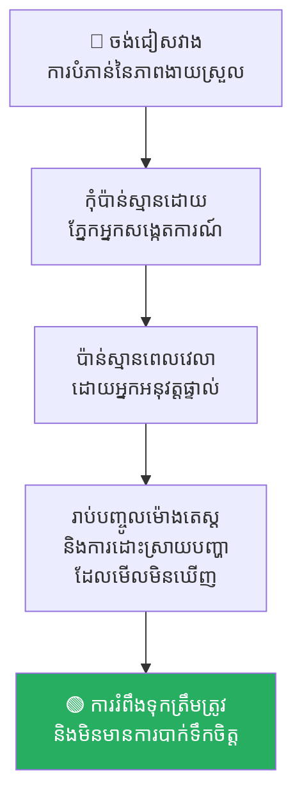

# The Illusion of Ease (ការបំភាន់នៃភាពងាយស្រួល)៖ ហេតុអ្វីការងារពិបាកមើលទៅងាយស្រួលពីសំបកក្រៅ?

**Author:** ichamrong  
**Date:** 2026-05-17  
**Tags:** #psychology #cognitive-bias #learned-helplessness #dunning-kruger #software-engineering  
**Category:** Concepts  
**Read Time:** ~18 min  

---

## 📌 មាតិកា (Table of Contents)
- [អន្ទាក់ផ្លូវចិត្ត (The Trap)](#អន្ទាក់ផ្លូវចិត្ត-the-trap)
- [១. បញ្ហា៖ គម្លាតរវាងការមើលឃើញ និងការអនុវត្តជាក់ស្តែង (The Issue: The Perception Gap)](#១-បញ្ហា-គម្លាតរវាងការមើលឃើញ-និងការអនុវត្តជាក់ស្តែង-the-issue-the-perception-gap)
- [២. ឧទាហរណ៍ជាក់ស្តែងក្នុងពិភពពិត (Real World Examples)](#២-ឧទាហរណ៍ជាក់ស្តែងក្នុងពិភពពិត)
  - [ឧទាហរណ៍ទី ១ — ការបំភាន់ផ្នែកជំនាញ (The Skill Illusion)](#ឧទាហរណ៍ទី-១-ការបំភាន់ផ្នែកជំនាញ-the-skill-illusion)
  - [ឧទាហរណ៍ទី ២ — ការបំភាន់ពេលវេលា (The Time Illusion)](#ឧទាហរណ៍ទី-២-ការបំភាន់ពេលវេលា-the-time-illusion)
  - [ឧទាហរណ៍ទី ៣ — ការបំភាន់ការសិក្សា (The Learning Illusion)](#ឧទាហរណ៍ទី-៣-ការបំភាន់ការសិក្សា-the-learning-illusion)
  - [ឧទាហរណ៍ទី ៤ — ការបំភាន់ផ្នែកអាជីវកម្ម ឬការបង្កើតគម្រោង (The Business Creation Illusion)](#ឧទាហរណ៍ទី-៤-ការបំភាន់ផ្នែកអាជីវកម្ម-ឬការបង្កើតគម្រោង-the-business-creation-illusion)
  - [ឧទាហរណ៍ទី ៥ — ការបំភាន់ក្នុងការគ្រប់គ្រង និងការចាត់ចែងការងារ (The Management Illusion)](#ឧទាហរណ៍ទី-៥-ការបំភាន់ក្នុងការគ្រប់គ្រង-និងការចាត់ចែងការងារ-the-management-illusion)
- [៣. កត្តាជម្រុញ៖ ការលាក់បាំងចំណាយនៃការប្រឹងប្រែង (The Aggravator: Concealed Effort)](#៣-កត្តាជម្រុញ-ការលាក់បាំងចំណាយនៃការប្រឹងប្រែង-the-aggravator-concealed-effort)
- [៤. ដំណោះស្រាយទូទៅ (The General Solution)](#៤-ដំណោះស្រាយទូទៅ-the-general-solution)
- [សេចក្តីសន្និដ្ឋាន (Conclusion)](#សេចក្តីសន្និដ្ឋាន-conclusion)
- [Related Posts](#related-posts)

---

## អន្ទាក់ផ្លូវចិត្ត (The Trap)

តើអ្នកធ្លាប់អង្គុយមើលអ្នកជំនាញម្នាក់ (ឧទាហរណ៍៖ Senior Engineer ឬអ្នកលេងព្យាណូ) ធ្វើការងាររបស់ពួកគេដោយរលូន ហើយអ្នកគិតក្នុងចិត្តថា៖ *«មើលទៅស្រួលតើ! ខ្ញុំប្រាកដជាអាចធ្វើវាបានដោយចំណាយពេលតែបន្តិចបន្តួចប៉ុណ្ណោះ។»* ដែរឬទេ?

ប៉ុន្តែនៅពេលអ្នកចាប់ផ្តើមសាកល្បងធ្វើវាដោយខ្លួនឯង អ្នកស្រាប់តែជួបប្រទះនឹងបញ្ហារាប់រយមុខ រហូតដល់អ្នកបោះបង់ចោល ហើយគិតថាខ្លួនឯងពិតជាល្ងង់ណាស់។

> អ្នកជំនាញធ្វើឱ្យការងារមើលទៅងាយស្រួល។ អ្នកសង្កេតការណ៍សន្មត់ថាវាងាយស្រួលមែន។ អ្នកសង្កេតការណ៍សាកល្បង — រួចក៏បរាជ័យ។ គម្លាតរវាង «ការយល់ឃើញពីភាពលំបាក» និង «ភាពលំបាកពិតប្រាកដ» នេះហើយ គឺជាបាតុភូតផ្លូវចិត្តដែលហៅថា **The Illusion of Ease (ការបំភាន់នៃភាពងាយស្រួល)**។

---

## ១. បញ្ហា៖ គម្លាតរវាងការមើលឃើញ និងការអនុវត្តជាក់ស្តែង (The Issue: The Perception Gap)

**The Illusion of Ease** គឺជាលំអៀងនៃការយល់ដឹង (Cognitive Bias) ដែលយើងប៉ាន់ស្មានទាបជាប្រព័ន្ធទៅលើភាពលំបាកនៃការងារមួយ គ្រាន់តែដោយសារតែយើងឃើញអ្នកជំនាញម្នាក់ធ្វើវាបានយ៉ាងរលូន។ 

បញ្ហានេះកើតឡើងដោយសារតែ **«ភាពស្ទាត់ជំនាញ តែងតែលាក់បាំងនូវការប្រឹងប្រែង» (Expertise conceals effort)**។ 
* នៅពេល Junior Engineer មើល Senior ស្វែងរកកំហុស (Debug) ប្រព័ន្ធក្នុងរយៈពេល ២០ នាទី ពួកគេមើលឃើញតែពេលវេលា ២០ នាទីនោះទេ។ 
* ពួកគេមើលមិនឃើញពី **បទពិសោធន៍ ១០ ឆ្នាំនៃការស្គាល់ទម្រង់កូដ (Pattern Recognition)** ការខាតបង់ពេលរាប់រយម៉ោងពីអតីតកាល និងការយល់ដឹងស៊ីជម្រៅពីប្រព័ន្ធ (Mental Model) ដែលជួយឱ្យ Senior អាចធ្វើវាបានក្នុងរយៈពេល ២០ នាទីនោះឡើយ។

---

## ២. ឧទាហរណ៍ជាក់ស្តែងក្នុងពិភពពិត

សូមពិនិត្យមើល **ឧទាហរណ៍ជាក់ស្តែងចំនួន ៥** បង្ហាញពីរបៀបដែលលំអៀងផ្លូវចិត្តនេះកើតឡើង និងរបៀបដោះស្រាយ៖

---

### ឧទាហរណ៍ទី ១ — ការបំភាន់ផ្នែកជំនាញ (The Skill Illusion)

**ស្ថានភាព៖** អ្នកមើលវីដេអូនៅលើ YouTube ដែលអ្នកសរសេរកូដម្នាក់បង្កើត App ថ្មីមួយក្នុងរយៈពេល ១០ នាទី។

* **ការបំភាន់៖** វីដេអូនោះបានកាត់តចោលរាល់ពេលដែលគេវាយកូដខុស ពេលកូដចេញ Error និងពេលដែលគេត្រូវអង្គុយរកដំណោះស្រាយ។ កូដមើលទៅស្អាត និងស្រួលសរសេរ។
* **ការអនុវត្តពិត៖** ពេលអ្នកសាកល្បងធ្វើតាម អ្នកជួប Error តាំងពីជំហាន Setup ដំបូង ហើយត្រូវចំណាយពេល ៥ ម៉ោងគ្រាន់តែដើម្បីឱ្យកូដនោះអាច Run ដើរ។ អ្នកចាប់ផ្តើមបាក់ទឹកចិត្ត។

---

### ឧទាហរណ៍ទី ២ — ការបំភាន់ពេលវេលា (The Time Illusion)

**ស្ថានភាព៖** នៅក្នុងការប្រជុំកំណត់ផែនការ (Sprint Planning) របស់ក្រុមហ៊ុនអភិវឌ្ឍន៍ Mobile App។

* **ការបំភាន់៖** Product Manager ដែលមិនយល់ដឹងពីបច្ចេកវិទ្យា មើលឃើញមុខងារ (Feature) ថ្មីមួយគឺ «ប៊ូតុងចុះឈ្មោះចូលដោយប្រើ Google (Google Sign-In Button)» ថាគ្រាន់តែជាប៊ូតុងតូចមួយនៅលើអេក្រង់ ហើយសន្មត់ថា៖ *«រឿងតូចតាចសោះ គួរតែសរសេរកូដត្រឹមតែមួយថ្ងៃ ឬកន្លះថ្ងៃគឺរួចរាល់ហើយ!»*
* **ការអនុវត្តពិត៖** Developer ដឹងថានៅពីក្រោយប៊ូតុងតូចនោះ ពួកគេត្រូវបង្កើត Google Cloud Console Project, Setup OAuth Credentials, សរសេរ API សម្រាប់ផ្ទៀងផ្ទាត់ JWT Token នៅលើ Backend Database, ដោះស្រាយបញ្ហាសុវត្ថិភាព (Security/Session Tokens), និងត្រូវចំណាយពេលធ្វើការតេស្តនៅលើទូរស័ព្ទប្រព័ន្ធ Android និង iOS ជាច្រើនប្រភេទ ដែលត្រូវចំណាយពេលសរុបយ៉ាងតិច ៤ ទៅ ៥ ថ្ងៃ។

---

### ឧទាហរណ៍ទី ៣ — ការបំភាន់ការសិក្សា (The Learning Illusion)

**ស្ថានភាព៖** សិស្ស ឬ Junior Developer អានសៀវភៅ ឬមើលវីដេអូបង្រៀនសរសេរកូដ (Tutorial) លើអ៊ីនធឺណិត។

* **ការបំភាន់៖** ពេលពួកគេមើលគ្រូសរសេរកូដ និងពន្យល់ទ្រឹស្តី ពួកគេយល់ភ្លាមៗ និងគិតថា៖ *«អូ! វាសាមញ្ញណាស់ ខ្ញុំយល់ហើយ ខ្ញុំចេះវាហើយ!»* (ពួកគេសន្មត់ថាការ «យល់» = ការ «ចេះធ្វើ»)។
* **ការអនុវត្តពិត៖** គម្លាតរវាងការ «យល់ទ្រឹស្តី» និង «សមត្ថភាពអនុវត្តផ្ទាល់» គឺធំធេងណាស់។ នៅពេលពួកគេបិទសៀវភៅ ឬវីដេអូ រួចត្រូវសរសេរកូដនោះចេញពីចំណុចសូន្យ (Blank Screen) ពួកគេស្រាប់តែគាំងខួរក្បាល រកនឹក Syntaxes និង Logic អ្វីមិនឃើញទាល់តែសោះ ហើយចាប់ផ្តើមបាក់ទឹកចិត្តយ៉ាងខ្លាំង។

---

### ឧទាហរណ៍ទី ៤ — ការបំភាន់ផ្នែកអាជីវកម្ម ឬការបង្កើតគម្រោង (The Business Creation Illusion)

**ស្ថានភាព៖** បុគ្គលម្នាក់ចង់បង្កើតអាជីវកម្មផ្ទាល់ខ្លួន និងសម្រេចចិត្តបោះទុនបើកហាងកាហ្វេតូចមួយ។

* **ការបំភាន់៖** ពួកគេមើលឃើញហាងកាហ្វេដទៃជោគជ័យ មានមនុស្សចូលពេញៗ ម្ចាស់ហាងគ្រាន់តែមកអង្គុយមើល និងប្រមូលលុយយ៉ាងសប្បាយ។ ពួកគេគិតថា៖ *«ការបើកហាងកាហ្វេគឺងាយស្រួលណាស់! គ្រាន់តែជួលទីតាំង ដេគ័រឱ្យស្អាត ជួលបារីស្តាម្នាក់ រួចឆុងកាហ្វេលក់គឺចប់ហើយ!»*
* **ការអនុវត្តពិត៖** ពួកគេជួបបញ្ហាស្មុគស្មាញជាច្រើននៅពីក្រោយសំបកក្រៅ៖ ការចរចាជួលទីតាំង, ការគ្រប់គ្រងខ្សែច្រវាក់ផ្គត់ផ្គង់ (Supply Chain) និងរក្សាគុណភាពគ្រាប់កាហ្វេ, បញ្ហាអនាម័យ, ជម្លោះបុគ្គលិក, វិបត្តិសេវាកម្មអតិថិជន និងការចំណាយថេរ (Fixed Costs) ខ្ពស់ រហូតដល់ខាតបង់ថវិកា និងត្រូវបិទទ្វារហាងក្នុងរយៈពេល ៦ ខែ។

---

### ឧទាហរណ៍ទី ៥ — ការបំភាន់ក្នុងការគ្រប់គ្រង និងការចាត់ចែងការងារ (The Management Illusion)

**ស្ថានភាព៖** Senior Developer ដ៏ពូកែម្នាក់ត្រូវបានក្រុមហ៊ុនដំឡើងតំណែងឱ្យទៅធ្វើជាអ្នកគ្រប់គ្រងក្រុមការងារ (Team Manager)។

* **ការបំភាន់៖** ពួកគេធ្លាប់មើលឃើញ Manager ចាស់របស់ខ្លួនគ្រាន់តែប្រជុំ ចែកការងារ និងចាត់ចែងរបស់របរ ហើយគិតថា៖ *«ការគ្រប់គ្រងមនុស្សគ្មានអីពិបាកសោះ! គ្រាន់តែប្រាប់ឱ្យពួកគេធ្វើកូដតាម Deadline គឺរួចរាល់ហើយ ស្រួលជាងការសរសេរកូដស្មុគស្មាញឆ្ងាយណាស់!»*
* **ការអនុវត្តពិត៖** ការគ្រប់គ្រងមនុស្សពោរពេញដោយភាពមិនច្បាស់លាស់ និងបញ្ហាផ្លូវចិត្ត៖ ជម្លោះផ្ទៃក្នុងរវាងសមាជិក, ការលើកទឹកចិត្តបុគ្គលិកដែលធ្លាក់ទឹកចិត្ត, ការចរចាជាមួយ PM, ការវាស់ស្ទង់សមត្ថភាព និងការដោះស្រាយបុគ្គលិកដែលមានអាកប្បកិរិយាពុល។ ពួកគេស្ត្រេសខ្លាំង រហូតដល់ចង់បោះបង់តំណែង Manager ត្រឡប់ទៅសរសេរកូដម្នាក់ឯងវិញ។

---

## ៣. កត្តាជម្រុញ៖ ការលាក់បាំងចំណាយនៃការប្រឹងប្រែង (The Aggravator: Concealed Effort)

បាតុភូតនេះកើតឡើងកាន់តែខ្លាំងដោយសារតែកត្តា 2 យ៉ាង៖
1. **Dunning-Kruger Effect៖** មនុស្សដែលទើបតែចាប់ផ្តើមរៀនសូត្រ ជារឿយៗមិនមានសមត្ថភាពគ្រប់គ្រាន់ក្នុងការមើលឃើញ ឬដឹងពីភាពស្មុគស្មាញ (Unknown Unknowns) នៃការងារនោះឡើយ ទើបពួកគេប៉ាន់ស្មានទាប។
2. **ការលាក់បាំងការតស៊ូ៖** សង្គម និងបណ្តាញសង្គម តែងតែលើកតម្កើងតែលទ្ធផលជោគជ័យ និងលាក់បាំងរាល់ការឈឺចាប់ ការបរាជ័យ និងភាពស្មុគស្មាញនៅពីក្រោយខ្នង។

---

## ៤. ដំណោះស្រាយទូទៅ (The General Solution)

ដើម្បីចៀសវាងអន្ទាក់ផ្លូវចិត្តនៃការប៉ាន់ស្មានខុស យើងត្រូវអនុវត្តវិធានការខាងក្រោម៖

### ប៉ាន់ស្មានដោយអ្នកធ្វើផ្ទាល់ (Estimate from the Doer)
ការប៉ាន់ស្មានពេលវេលា និងភាពលំបាក ត្រូវតែធ្វើឡើងដោយអ្នកដែលទទួលបន្ទុកផ្ទាល់ក្នុងការអនុវត្តការងារនោះ មិនមែនប៉ាន់ស្មានដោយអ្នកសង្កេតការណ៍ (PM ឬថៅកែ) នោះឡើយ។

### សួររកអ្វីដែលអាចខុសឆ្គង (Ask "What could go wrong?")
មុននឹងប្តេជ្ញាចិត្តទទួលយកពេលវេលាកំណត់ (Deadline) ត្រូវសួរខ្លួនឯង និងក្រុមការងារជានិច្ចថា៖ *«តើមានភាពស្មុគស្មាញអ្វីខ្លះដែលយើងមិនទាន់មើលឃើញនៅឡើយ?»*

### បង្ហាញពីការតស៊ូ និងកំហុស (Show the Work)
សម្រាប់អ្នកដឹកនាំ (Seniors) ត្រូវចែករំលែកមិនត្រឹមតែកូដដែលជោគជ័យនោះទេ ប៉ុន្តែត្រូវចែករំលែកពីកំហុសឆ្គង របៀបដែលអ្នកវង្វេងផ្លូវ និងពេលវេលាដែលអ្នកចំណាយក្នុងការស្វែងរក Bug ដើម្បីឱ្យអ្នកជំនាន់ក្រោយយល់ពីតម្លៃនៃការប្រឹងប្រែងពិតប្រាកដ។

---

## សេចក្តីសន្និដ្ឋាន (Conclusion)

The Illusion of Ease រំលឹកយើងឱ្យមានភាពកក់ក្តៅ និងមានការអត់ធ្មត់ចំពោះខ្លួនឯង ព្រមទាំងអ្នកដទៃ។ ប្រសិនបើអ្នកសាកល្បងរៀនជំនាញថ្មីមួយ ហើយជួបការលំបាកខ្លាំងជាងអ្វីដែលអ្នករំពឹងទុក សូមកុំទាន់គិតថាខ្លួនឯងអន់។ ត្រូវចងចាំថា រាល់ភាពងាយស្រួលនិងរលូនដែលអ្នកឃើញពីអ្នកដទៃ គឺត្រូវបានទិញមកដោយការខាតបង់ពេលវេលា កំហុសឆ្គង និងការតស៊ូរាប់ឆ្នាំដែលពួកគេមិនបានបង្ហាញឱ្យអ្នកឃើញតែប៉ុណ្ណោះ។

---

## Related Posts

* **[08-learned-helplessness.md](./08-learned-helplessness.md)** — របៀបដែលភាពបរាជ័យញឹកញាប់ដោយសារការវាយតម្លៃការងារខុស ធ្វើឱ្យមនុស្សបាត់បង់ទំនុកចិត្តទាំងស្រុង។
* **[02-five-whys-technique.md](./02-five-whys-technique.md)** — របៀបស្វែងរកឫសគល់នៃបញ្ហានៅក្នុងដំណើរការការងារ មិនមែនលើបុគ្គល។

---

*Last updated: 2026-05-26*
