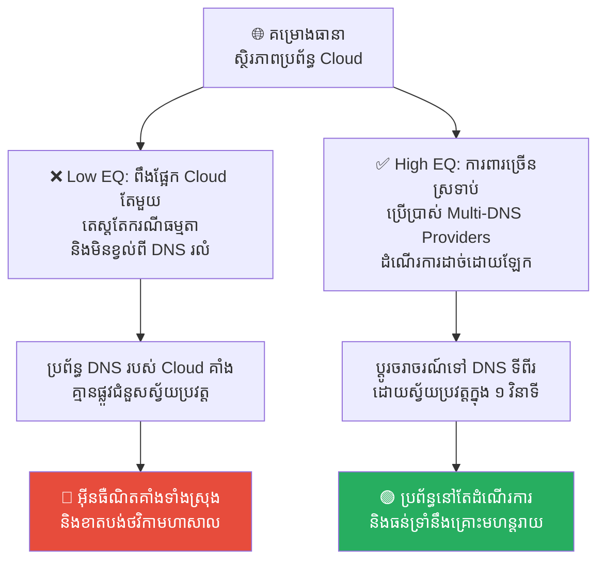
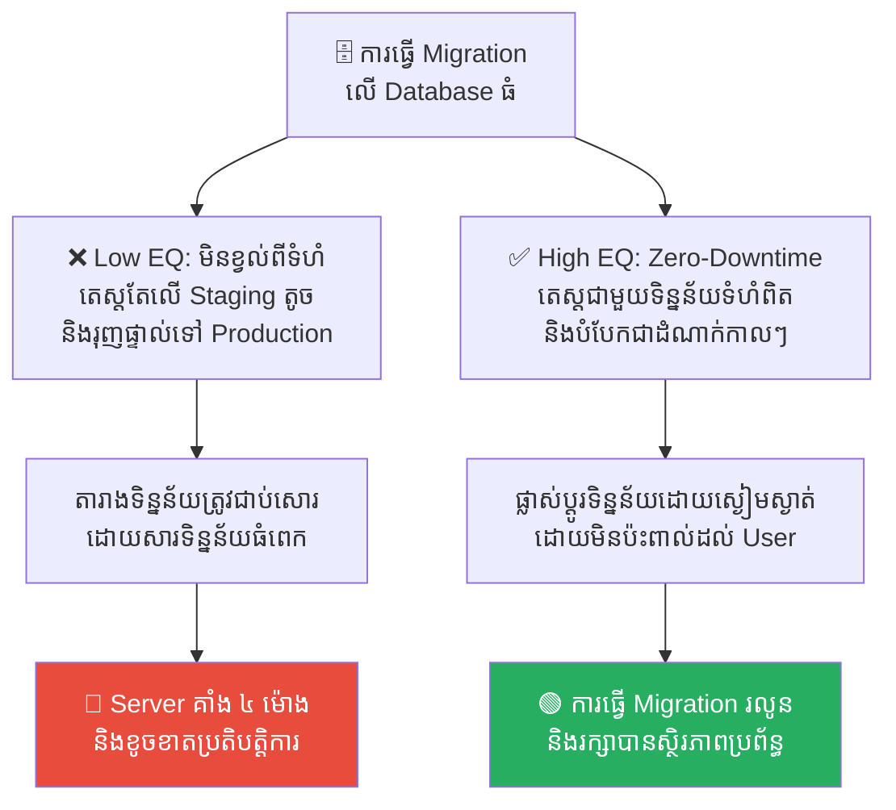
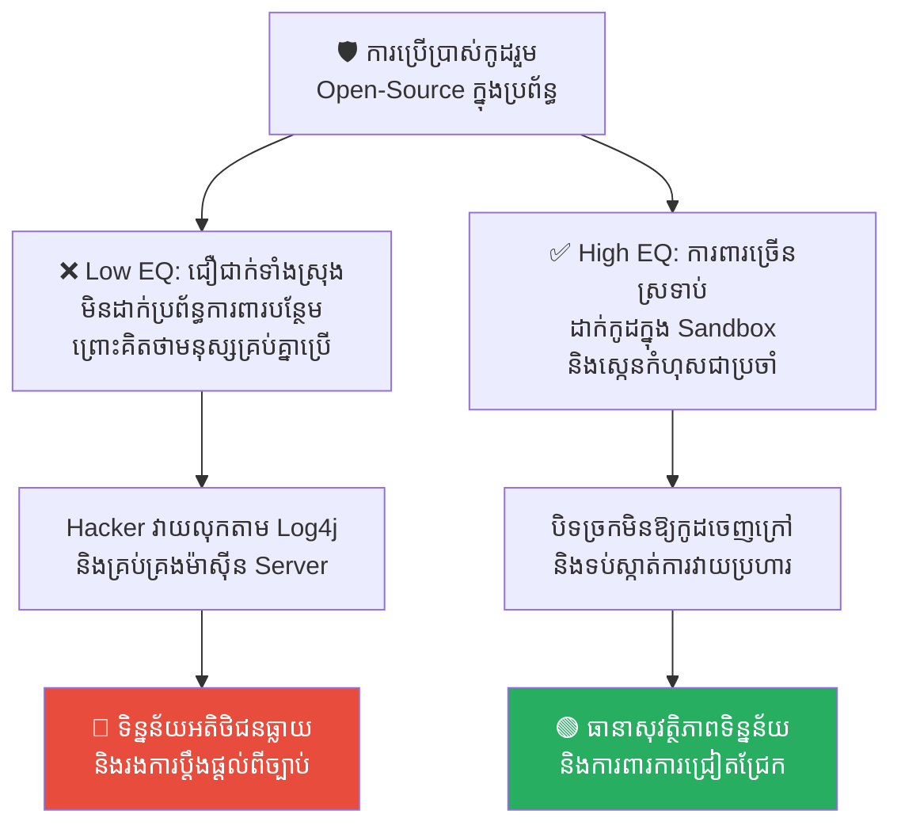
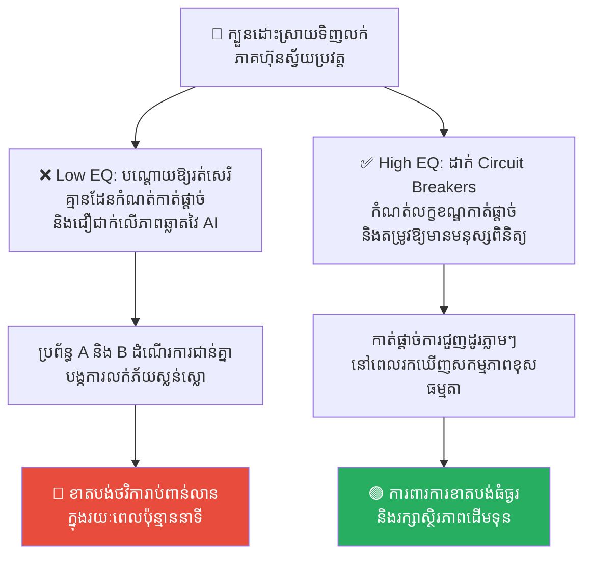
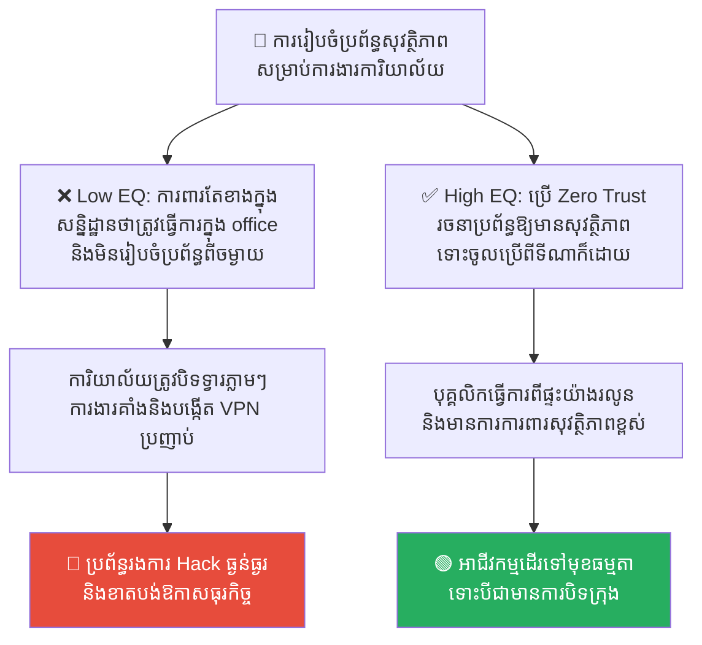

# The Black Swan (ព្រឹត្តិការណ៍ហង្សខ្មៅ)៖ Unknown Unknowns និងការកើតឡើងជាមហន្តរាយដែលមិននឹកស្មានដល់

**Author:** ichamrong  
**Date:** 2026-05-17  
**Tags:** #risk-management #systems-thinking #incident-response #resilience  
**Category:** Concepts  
**Read Time:** ~15 min  

---

## 📌 មាតិកា (Table of Contents)
- [លំនាំបញ្ហា (The Pattern)](#លំនាំបញ្ហា-the-pattern)
- [១. បញ្ហា៖ តើអ្វីទៅជាព្រឹត្តិការណ៍ហង្សខ្មៅ? (The Issue: What is a Black Swan?)](#១-បញ្ហា-តើអ្វីទៅជាព្រឹត្តិការណ៍ហង្សខ្មៅ-the-issue-what-is-a-black-swan)
- [២. ឧទាហរណ៍ជាក់ស្តែងក្នុងពិភពពិត (Real World Examples)](#២-ឧទាហរណ៍ជាក់ស្តែងក្នុងពិភពពិត)
  - [ឧទាហរណ៍ទី ១ — ការគាំងប្រព័ន្ធ DNS ទូទាំងពិភពលោក (DNS Control Plane Outage)](#ឧទាហរណ៍ទី-១-ការគាំងប្រព័ន្ធ-dns-ទូទាំងពិភពលោក-dns-control-plane-outage)
  - [ឧទាហរណ៍ទី ២ — ការគាំង Database ដោយសារការផ្លាស់ប្តូរទំហំធំ (Production Database Migration Lockup)](#ឧទាហរណ៍ទី-២-ការគាំង-database-ដោយសារការផ្លាស់ប្តូរទំហំធំ-production-database-migration-lockup)
  - [ឧទាហរណ៍ទី ៣ — រន្ធប្រហោងសុវត្ថិភាពក្នុងកូដរួម (Unexpected Utility Vulnerability - Heartbleed/Log4j)](#ឧទាហរណ៍ទី-៣-រន្ធប្រហោងសុវត្ថិភាពក្នុងកូដរួម-unexpected-utility-vulnerability-heartbleedlog4j)
  - [ឧទាហរណ៍ទី ៤ — ការដួលរលំដោយសារការប្រស្រ័យទាក់ទងគ្នានៃក្បួនដោះស្រាយ (Algorithmic Interaction Flash Crash)](#ឧទាហរណ៍ទី-៤-ការដួលរលំដោយសារការប្រស្រ័យទាក់ទងគ្នានៃក្បួនដោះស្រាយ-algorithmic-interaction-flash-crash)
  - [ឧទាហរណ៍ទី ៥ — ការផ្លាស់ប្តូរការងារពីចម្ងាយជាសកលភ្លាមៗ (Sudden Global Remote Shift)](#ឧទាហរណ៍ទី-៥-ការផ្លាស់ប្តូរការងារពីចម្ងាយជាសកលភ្លាមៗ-sudden-global-remote-shift)
- [៣. កត្តាជម្រុញ៖ គំរូគិតដែលត្បៀតត្បល់ និងការធ្វេសប្រហែស (The Aggravator: Overfitting & Normalization of Deviance)](#៣-កត្តាជម្រុញ-គំរូគិតដែលត្បៀតត្បល់-និងការធ្វេសប្រហែស-the-aggravator-overfitting-normalization-of-deviance)
- [៤. ដំណោះស្រាយទូទៅ៖ បង្កើតប្រព័ន្ធដែលធន់ទ្រាំនឹងហង្សខ្មៅ (The General Solution: Designing for Resilience)](#៤-ដំណោះស្រាយទូទៅ-បង្កើតប្រព័ន្ធដែលធន់ទ្រាំនឹងហង្សខ្មៅ-the-general-solution-designing-for-resilience)
- [សេចក្តីសន្និដ្ឋាន (Conclusion)](#សេចក្តីសន្និដ្ឋាន-conclusion)
- [Related Posts](#related-posts)

---

## លំនាំបញ្ហា (The Pattern)

មុនពេលដែលជនជាតិអឺរ៉ុបបានធ្វើដំណើរទៅដល់ប្រទេសអូស្ត្រាលី មនុស្សគ្រប់គ្នានៅលើសកលលោកបានសន្និដ្ឋានយ៉ាងមុតមាំថា៖ **«ហង្សទាំងអស់នៅលើលោកគឺមានតែពណ៌សតែមួយគត់»**។ ការសន្និដ្ឋាននេះត្រូវបានផ្អែកលើការសង្កេត និងភស្តុតាងជាក់ស្តែងរាប់ពាន់ឆ្នាំ។

ប៉ុន្តែ នៅពេលដែលពួកគេបានរកឃើញ **«ហង្សខ្មៅ (Black Swan)»** ដំបូងបង្អស់នៅក្នុងប្រទេសអូស្ត្រាលី ការសង្កេត និងជំនឿរាប់ពាន់ឆ្នាំរបស់មនុស្សជាតិត្រូវបានវាយកម្ទេចចោលភ្លាមៗត្រឹមមួយវិនាទី។ ភស្តុតាងផ្ទុយតែមួយគត់ គឺគ្រប់គ្រាន់ដើម្បីបំផ្លាញការសន្និដ្ឋានទូទៅទាំងអស់។

នៅក្នុងប្រព័ន្ធបច្ចេកវិទ្យា និងការគ្រប់គ្រងហានិភ័យ យើងតែងតែគិតថា អ្វីៗដែលមានសុវត្ថិភាពពីមុនមក នឹងបន្តមានសុវត្ថិភាពជារៀងរហូត។ យើងរៀបចំផែនការការពារតែបញ្ហាណាដែលយើងធ្លាប់ជួប ឬអាចស្រមៃឃើញប៉ុណ្ណោះ។ 

គ្រោះថ្នាក់ពិតប្រាកដមិនមែនជាបញ្ហាដែលយើងដឹងថាយើងមិនដឹងនោះទេ (**Known Unknowns**) ប៉ុន្តែវាគឺការកើតឡើងនៃរឿងរ៉ាវដែលយើងមិនធ្លាប់ដឹងសោះថាយើងមិនដឹង (**Unknown Unknowns**) ដែលនេះត្រូវបានគេស្គាល់ថាជា **ព្រឹត្តិការណ៍ហង្សខ្មៅ (The Black Swan Event)**។

---

## ១. បញ្ហា៖ តើអ្វីទៅជាព្រឹត្តិការណ៍ហង្សខ្មៅ? (The Issue: What is a Black Swan?)

គំនិតនៃ **Black Swan** ត្រូវបានបង្កើតឡើង និងផ្សព្វផ្សាយដោយទស្សនវិទូ និងជាអ្នកវិភាគហានិភ័យដ៏ល្បីល្បាញ **Nassim Nicholas Taleb**។ ទ្រង់បានកំណត់ថា ព្រឹត្តិការណ៍ហង្សខ្មៅមានលក្ខណៈសម្បត្តិពិសេស ៣ យ៉ាង៖

1.  **ភាពកម្របំផុត (Extreme Rarity)៖** វាស្ថិតនៅក្រៅរង្វង់នៃការរំពឹងទុកធម្មតារបស់មនុស្ស ព្រោះគ្មានភស្តុតាងណាមួយពីអតីតកាលបង្ហាញថាវានឹងកើតឡើងឡើយ។
2.  **ផលប៉ះពាល់ជាមហន្តរាយ (Severe Impact)៖** នៅពេលវាកើតឡើង វានាំមកនូវផលវិបាកដ៏ធំធេង និងផ្លាស់ប្តូរប្រព័ន្ធទាំងមូលទាំងស្រុង។
3.  **ការពន្យល់ក្រោយការកើតឡើង (Retrospective Predictability)៖** ក្រោយពេលដែលវាកើតឡើងរួចរាល់ មនុស្សនឹងចាប់ផ្តើមបង្កើតទ្រឹស្តី ឬការពន្យល់ផ្សេងៗដើម្បីឱ្យវាមើលទៅដូចជា «រឿងដែលអាចទស្សន៍ទាយទុកជាមុនបាន» ដើម្បីសម្រាលភាពភ័យខ្លាចផ្ទាល់ខ្លួន។

```
🔍 សង្កេតតែហង្សស ──► 🛡️ គិតថាមានសុវត្ថិភាព ១០០% ──► 💥 ហង្សខ្មៅលេចឡើង (Unknown Unknown) ──► 🔴 ប្រព័ន្ធរលំទាំងស្រុង
```

គ្រោះថ្នាក់ដ៏ធំបំផុតនៅក្នុងការសរសេរកូដ និងការគ្រប់គ្រងប្រព័ន្ធបច្ចេកវិទ្យា គឺការមាន «ជំនឿចិត្តខុសឆ្គង» ព្រោះតែប្រព័ន្ធដំណើរការបានយ៉ាងរលូនក្នុងរយៈពេលកន្លងមក។ ការដែលប្រព័ន្ធមិនទាន់ធ្លាប់ជួបគ្រោះមហន្តរាយ មិនមែនមានន័យថាប្រព័ន្ធនោះគ្មានហានិភ័យនោះឡើយ។

---

## ២. ឧទាហរណ៍ជាក់ស្តែងក្នុងពិភពពិត

សូមពិនិត្យមើល **ឧទាហរណ៍ជាក់ស្តែងចំនួន ៥** បង្ហាញពីរបៀបដែលព្រឹត្តិការណ៍ហង្សខ្មៅវាយប្រហារប្រព័ន្ធ និងវិធីសាស្ត្របង្កើតប្រព័ន្ធឱ្យធន់ទ្រាំនឹងវា៖

---

### ឧទាហរណ៍ទី ១ — ការគាំងប្រព័ន្ធ DNS ទូទាំងពិភពលោក (DNS Control Plane Outage)

**ស្ថានភាព៖** ក្រុមហ៊ុនបច្ចេកវិទ្យាដ៏ធំមួយបានរចនាប្រព័ន្ធដែលមាន Cloud Redundancy យ៉ាងល្អឥតខ្ចោះ។ ពួកគេបានសាកល្បងការដួលរលំ Server, ការខូចខាត Data Center និងការបាត់បង់បណ្តាញអ៊ីនធឺណិតនៅក្នុងប្រទេសនីមួយៗ។

*   **សកម្មភាពអសកម្ម / Low EQ / កំហុសឆ្គង៖** ក្រុមការងារសន្និដ្ឋានថាប្រព័ន្ធរបស់ពួកគេមិនអាចដួលរលំបានឡើយ។ ប៉ុន្តែពួកគេមិនដែលបានធ្វើតេស្តសាកល្បង ឬរៀបចំផែនការសម្រាប់ករណីដែលប្រព័ន្ធគ្រប់គ្រងឈ្មោះដែន (DNS Control Plane) របស់ក្រុមហ៊ុនផ្តល់សេវាកម្ម Cloud ធំជាងគេក្នុងលោកស្រាប់តែមានបញ្ហាគាំងផ្នែក Software ព្រមគ្នាទូទាំងសកលលោកឡើយ។ នៅពេលរឿងនោះកើតឡើង ប្រព័ន្ធទាំងមូលត្រូវបានផ្តាច់ចេញពីអ៊ីនធឺណិតទាំងស្រុងភ្លាមៗ។
*   **សកម្មភាពស្ថាបនា / High EQ / ដំណោះស្រាយ៖** អនុវត្ត **Multi-Provider Architecture**។ មិនត្រូវពឹងផ្អែកលើប្រព័ន្ធគ្រប់គ្រង DNS តែមួយឡើយ។ ត្រូវរៀបចំឱ្យមានប្រព័ន្ធ DNS ទីពីរពីក្រុមហ៊ុនផ្សេងគ្នា (Active-Active Multi-CDN/DNS) ដែលដំណើរការដោយឡែកពីគ្នាទាំងស្រុង ដើម្បីធានាថាទោះបីជា DNS មួយដួលរលំទាំងស្រុង ក៏ចរាចរណ៍អ៊ីនធឺណិតនៅតែអាចដើរតាមផ្លូវផ្សេងបាន។
*   **លទ្ធផល៖** ការសន្និដ្ឋានថាប្រព័ន្ធ Cloud តែមួយមិនអាចរលំនាំឱ្យក្រុមហ៊ុនគាំងការងាររាប់ម៉ោង និងខាតបង់ថវិការាប់លានដុល្លារ។ ការការពារបែប Multi-Provider ជួយឱ្យប្រព័ន្ធនៅតែដំណើរការធម្មតា ទោះបីជាដៃគូសេវាកម្ម Cloud ធំគាំងទាំងស្រុងក៏ដោយ។



---

### ឧទាហរណ៍ទី ២ — ការគាំង Database ដោយសារការផ្លាស់ប្តូរទំហំធំ (Production Database Migration Lockup)

**ស្ថានភាព៖** ក្រុមវិស្វករបានសរសេរកូដដើម្បីធ្វើការផ្លាស់ប្តូររចនាសម្ព័ន្ធទិន្នន័យ (Database Migration)។ ពួកគេបានធ្វើតេស្តសាកល្បងនៅក្នុងបរិយាកាស Staging យ៉ាងជោគជ័យ និងគ្មានបញ្ហាអ្វីទាំងអស់។

*   **សកម្មភាពអសកម្ម / Low EQ / កំហុសឆ្គង៖** ក្រុមការងារសម្រេចចិត្តរុញការផ្លាស់ប្តូរនេះទៅផលិតកម្មពិត (Production Server) នៅថ្ងៃអាទិត្យ។ ប៉ុន្តែពួកគេមិនបានរំពឹងទុកថា ចំនួនជួរទិន្នន័យ (Rows) នៅក្នុង Production គឺមានទំហំធំជាង Staging ដល់ទៅ ៥០ ដង ហើយមានសំណើទិន្នន័យសកម្មរាប់លានក្នុងពេលតែមួយ។ ការរៀបចំ Migration នោះបានចាក់សោរតារាងទិន្នន័យ (Table Lock) ទាំងស្រុង បណ្តាលឱ្យ Server ធ្លាក់ចុះ និងគាំងរយៈពេល ៤ ម៉ោង។
*   **សកម្មភាពស្ថាបនា / High EQ / ដំណោះស្រាយ៖** អនុវត្ត **Zero-Downtime Migration Patterns**។ ត្រូវរៀបចំការផ្លាស់ប្តូរទិន្នន័យជាបីដំណាក់កាល (Add, Write-both, Remove-old) ដោយមិនប៉ះពាល់ដល់ការចាក់សោរតារាង និងធ្វើការតេស្តសាកល្បង Migration ជាមួយទិន្នន័យដែលមានទំហំស្មើនឹង Production ទាំងស្រុងនៅក្នុងបរិយាកាសដាច់ដោយឡែកជាមុនសិន។
*   **លទ្ធផល៖** ការធ្វេសប្រហែសនឹងទំហំទិន្នន័យពិតនាំឱ្យប្រព័ន្ធទូទាត់ប្រាក់គាំង និងប៉ះពាល់ដល់ការជឿទុកចិត្តរបស់អតិថិជន។ ការប្រើប្រាស់បច្ចេកទេស Zero-Downtime ជួយឱ្យការផ្លាស់ប្តូរប្រព័ន្ធទទួលបានជោគជ័យដោយគ្មានការរំខានសូម្បីតែមួយវិនាទី។



---

### ឧទាហរណ៍ទី ៣ — រន្ធប្រហោងសុវត្ថិភាពក្នុងកូដរួម (Unexpected Utility Vulnerability - Heartbleed/Log4j)

**ស្ថានភាព៖** ក្រុមហ៊ុនសរសេរកម្មវិធីរាប់ពាន់ជុំវិញពិភពលោកបានប្រើប្រាស់បណ្ណាល័យរួម (Utility Libraries ដូចជា OpenSSL ឬ Log4j) ព្រោះវាជាកូដ Open-Source ដែលត្រូវបានគេទទួលស្គាល់ និងប្រើប្រាស់អស់រយៈពេលរាប់សិបឆ្នាំមកហើយ។

*   **សកម្មភាពអសកម្ម / Low EQ / កំហុសឆ្គង៖** ក្រុមវិស្វករសន្និដ្ឋានថា កូដដែលមនុស្សគ្រប់គ្នាប្រើប្រាស់ គឺច្បាស់ជាមានសុវត្ថិភាព ១០០% ហើយ។ ពួកគេមិនបានសរសេរប្រព័ន្ធការពារ ឬដាក់កម្រិតសិទ្ធិការងាររបស់បណ្ណាល័យទាំងនោះឡើយ។ នៅពេលស្រាប់តែមានការរកឃើញរន្ធប្រហោងសុវត្ថិភាពកម្រិតធ្ងន់ធ្ងរ (ដូចជា Heartbleed ឬ Log4Shell) Hacker អាចចូលបញ្ជាម៉ាស៊ីន Server របស់ក្រុមហ៊ុនបានយ៉ាងងាយស្រួលពីចម្ងាយ។
*   **សកម្មភាពស្ថាបនា / High EQ / ដំណោះស្រាយ៖** អនុវត្ត **Defense-in-Depth (ការការពារច្រើនស្រទាប់)** និងការដាក់កម្រិតការងារ (Container Sandbox)។ ទោះបីជាបណ្ណាល័យនោះមានរន្ធប្រហោង ក៏ប្រព័ន្ធ Network មិនអនុញ្ញាតឱ្យវាបញ្ជូនទិន្នន័យចេញក្រៅដោយគ្មានការត្រួតពិនិត្យឡើយ រួមទាំងការប្រើប្រាស់ឧបករណ៍ស្កេនរកកំហុសស្វ័យប្រវត្តិ (Software Bill of Materials - SBOM) ជាប្រចាំ។
*   **លទ្ធផល៖** ការជឿជាក់លើរបស់រួមដោយខ្វះការត្រិះរិះនាំឱ្យទិន្នន័យសម្ងាត់របស់អតិថិជនរាប់លាននាក់ត្រូវធ្លាយទៅដៃ Hacker។ ការការពារច្រើនស្រទាប់ជួយការពារ Server ឱ្យមានសុវត្ថិភាព ទោះបីជាមានកូដរួមខាងក្នុងមានបញ្ហាក៏ដោយ។



---

### ឧទាហរណ៍ទី ៤ — ការដួលរលំដោយសារការប្រស្រ័យទាក់ទងគ្នានៃក្បួនដោះស្រាយ (Algorithmic Interaction Flash Crash)

**ស្ថានភាព៖** ក្រុមហ៊ុនវិនិយោគហិរញ្ញវត្ថុចំនួន ៥ បានបង្កើតក្បួនដោះស្រាយស្វ័យប្រវត្ត (High-Frequency Trading Algorithms) ដើម្បីទិញលក់ភាគហ៊ុន។ ក្បួនដោះស្រាយនីមួយៗត្រូវបានធ្វើតេស្ត និងធានាថាមានសុវត្ថិភាពខ្ពស់នៅពេលដំណើរការម្នាក់ឯង។

*   **សកម្មភាពអសកម្ម / Low EQ / កំហុសឆ្គង៖** ក្រុមហ៊ុននីមួយៗសន្និដ្ឋានថាប្រព័ន្ធរបស់ពួកគេឆ្លាតវៃណាស់។ ប៉ុន្តែនៅថ្ងៃមួយ មានការប្រែប្រួលតម្លៃភាគហ៊ុនបន្តិចបន្តួច បណ្តាលឱ្យក្បួនដោះស្រាយទាំង ៥ ដំណើរការប្រស្រ័យទាក់ទងគ្នា (Interacted) ក្នុងទម្រង់ដែលគ្មាននរណាធ្លាប់រំពឹងទុក។ ប្រព័ន្ធ A លក់ ធ្វើឱ្យប្រព័ន្ធ B លក់កាន់តែខ្លាំង ធ្វើឱ្យប្រព័ន្ធ C លក់ថែម បង្កជា **Flash Crash** បំផ្លាញលុយរាប់ពាន់លានដុល្លារក្នុងរយៈពេលប៉ុន្មាននាទី។
*   **សកម្មភាពស្ថាបនា / High EQ / ដំណោះស្រាយ៖** ដាក់បញ្ចូល **Circuit Breakers (ឧបករណ៍កាត់ផ្តាច់ស្វ័យប្រវត្ត)** នៅក្នុងកម្រិតប្រព័ន្ធ។ នៅពេលមានការលក់ចេញខុសធម្មតា ឬតម្លៃប្រែប្រួលហួសពីកម្រិតកំណត់ ប្រព័ន្ធត្រូវតែស្កាត់ និងកាត់ផ្តាច់ការធ្វើការងារស្វ័យប្រវត្តភ្លាមៗ ដើម្បីរង់ចាំការពិនិត្យ និងសម្រេចចិត្តពីមនុស្សពិត (Human-in-the-loop)។
*   **លទ្ធផល៖** ការបណ្តោយឱ្យក្បួនដោះស្រាយរត់ដោយគ្មានដែនកំណត់នាំឱ្យខាតបង់ទ្រព្យសម្បត្តិក្រុមហ៊ុនទាំងស្រុងក្នុងរយៈពេលខ្លី។ ការដាក់ឧបករណ៍ Circuit Breaker ជួយបញ្ឈប់ការខូចខាតទាន់ពេលវេលានិងរក្សាស្ថិរភាពហិរញ្ញវត្ថុ។



---

### ឧទាហរណ៍ទី ៥ — ការផ្លាស់ប្តូរការងារពីចម្ងាយជាសកលភ្លាមៗ (Sudden Global Remote Shift)

**ស្ថានភាព៖** ក្រុមហ៊ុនមួយមានប្រព័ន្ធបច្ចេកវិទ្យាដ៏រឹងមាំ ដែលតម្រូវឱ្យបុគ្គលិកទាំងអស់ធ្វើការងារនៅក្នុងការិយាល័យ ដើម្បីធានាសុវត្ថិភាពព័ត៌មានវិទ្យា។

*   **សកម្មភាពអសកម្ម / Low EQ / កំហុសឆ្គង៖** ថ្នាក់ដឹកនាំជឿជាក់ថា គ្មានរឿងអ្វីដែលអាចបង្ខំឱ្យពួកគេប្តូររបៀបធ្វើការងារឡើយ។ នៅពេលស្រាប់តែមានការកើតឡើងនៃជំងឺរាតត្បាតជាសកល (ដូចជា COVID-19) ដែលតម្រូវឱ្យបិទទីក្រុងភ្លាមៗ ក្រុមហ៊ុនគ្មានការត្រៀមខ្លួនឡើយ។ បុគ្គលិកមិនអាចចូលប្រើប្រព័ន្ធបាន ការងារត្រូវគាំងទាំងស្រុងរយៈពេល ២ សប្តាហ៍ ហើយក្រុមហ៊ុនត្រូវប្រញាប់ប្រញាល់បង្កើត VPN ដែលគ្មានសុវត្ថិភាព ធ្វើឱ្យប្រព័ន្ធរងការវាយប្រហារយ៉ាងធ្ងន់ធ្ងរ។
*   **សកម្មភាពស្ថាបនា / High EQ / ដំណោះស្រាយ៖** អនុវត្តគោលការណ៍ **Zero Trust Architecture (គ្មានការជឿជាក់ទុកជាមុន)**។ មិនថាបុគ្គលិកនៅការិយាល័យ ឬនៅផ្ទះឡើយ ប្រព័ន្ធត្រូវតែរចនាឡើងឱ្យអាចចូលប្រើប្រាស់បានពីចម្ងាយប្រកបដោយសុវត្ថិភាពខ្ពស់ តាមរយៈ Identity Verification និង Multi-Factor Authentication (MFA) តាំងពីដំបូង។
*   **លទ្ធផល៖** ការប្រកាន់ខ្ជាប់នឹងការិយាល័យរូបវន្តនាំឱ្យអាជីវកម្មគាំងទាំងស្រុង និងងាយរងគ្រោះថ្នាក់សន្តិសុខព័ត៌មាន។ ការរៀបចំប្រព័ន្ធបែប Zero Trust ជួយឱ្យអាជីវកម្មអាចផ្លាស់ប្តូរទីតាំងការងារបានភ្លាមៗដោយគ្មានភាពរអាក់រអួល និងមានសុវត្ថិភាពខ្ពស់បំផុត។



---

## ៣. កត្តាជម្រុញ៖ គំរូគិតដែលត្បៀតត្បល់ និងការធ្វេសប្រហែស (The Aggravator: Overfitting & Normalization of Deviance)

ហេតុអ្វីបានជាយើងតែងតែងងឹតងងល់នឹងព្រឹត្តិការណ៍ហង្សខ្មៅខ្លាំងម្ល៉េះ? កត្តាជម្រុញរួមមាន៖

1.  **គំរូប៉ាន់ស្មានផ្អែកលើអតីតកាល (Model Overfitting)៖** យើងសាងសង់ប្រព័ន្ធការពារដោយផ្អែកលើ «បញ្ហាដែលបានកើតឡើងកាលពីម្សិលមិញ» តែប៉ុណ្ណោះ។ យើងHardening ប្រព័ន្ធប្រឆាំងនឹង Bug ចាស់ៗ តែភ្លេចត្រៀមខ្លួនសម្រាប់ Bug ប្រភេទថ្មីទាំងស្រុងដែលមិនធ្លាប់មាន។
2.  **ការយល់ស្របនឹងកំហុសតូចតាច (Normalization of Deviance)៖** នៅពេលប្រព័ន្ធមានសញ្ញាព្រមានតូចៗលោតឡើង ប៉ុន្តែគ្មានគ្រោះថ្នាក់អ្វីកើតឡើងភ្លាមៗ មនុស្សយើងចាប់ផ្តើមស៊ាំនឹងវា ហើយសន្និដ្ឋានថា «មិនអីទេ» រហូតដល់កំហុសតូចៗទាំងនោះជួបគ្នា បង្កជាមហន្តរាយដ៏ធំ។
3.  **ការមើលរំលងហានិភ័យតូចតាចដែលមានផលប៉ះពាល់ធំ (Ignoring Tail Risk)៖** នៅក្នុងគំរូហិរញ្ញវត្ថុ ឬថ្លៃដើម ក្រុមហ៊ុនច្រើនតែកាត់ចោលនូវការចំណាយលើការការពារបញ្ហាណាដែលមានឱកាសកើតឡើងត្រឹម ០.១% ដើម្បីសន្សំសំចៃថវិកា ដោយភ្លេចគិតថា ឱកាស ០.១% នោះ បើកើតឡើងម្តង គឺអាចបំផ្លាញក្រុមហ៊ុនទាំងស្រុងបាន។

---

## ៤. ដំណោះស្រាយទូទៅ៖ បង្កើតប្រព័ន្ធដែលធន់ទ្រាំនឹងហង្សខ្មៅ (The General Solution: Designing for Resilience)

យើងមិនអាចទស្សន៍ទាយ ឬបង្ការព្រឹត្តិការណ៍ហង្សខ្មៅបានឡើយ ព្រោះវាកើតឡើងដោយភាពចៃដន្យ និងគ្មានគំរូ។ ប៉ុន្តែ យើងអាចបង្កើត **«ប្រព័ន្ធដែលធន់ទ្រាំ និងអាចរស់រានមានជីវិតក្រោយពេលជួបវា»** បាន៖

1.  **វិស្វកម្មភាពចលាចល (Chaos Engineering)៖** កុំរង់ចាំឱ្យហង្សខ្មៅលេចឡើងដោយចៃដន្យ។ ចូរដំឡើងឧបករណ៍ (ដូចជា Chaos Monkey) ដើម្បីលួចសម្លាប់ Server របស់ខ្លួនឯងដោយចេតនានៅក្នុង Production ដើម្បីសង្កេតមើលថាតើប្រព័ន្ធរបស់អ្នកអាចស្តារឡើងវិញដោយស្វ័យប្រវត្តបានល្អកម្រិតណា។
2.  **ការការពារច្រើនស្រទាប់ (Defense in Depth)៖** មិនត្រូវពឹងផ្អែកលើកំពែងការពារតែមួយជាន់ឡើយ។ ប្រសិនបើជាន់ទីមួយបាក់ ត្រូវមានជាន់ទីពីរ និងទីបីរង់ចាំទប់ស្កាត់ភ្លាមៗ ដើម្បីធានាថាការបរាជ័យមួយចំណុច មិននាំឱ្យរលំទាំងស្រុង (No Single Points of Failure)។
3.  **ការវាយតម្លៃបញ្ហាដោយមិនមានការស្តីបន្ទោស (Blameless Post-Mortems)៖** នៅពេលមានបញ្ហាកើតឡើង កុំស្វែងរកនរណាម្នាក់ដើម្បីធ្វើជាពពែទទួលបាប។ ចូរផ្តោតលើការស៊ើបអង្កេតប្រព័ន្ធ៖ *«តើប្រព័ន្ធការងាររបស់ពួកយើងមានចន្លោះប្រហោងត្រង់ណាខ្លះ ដែលបណ្តាលឱ្យមានរឿងនេះកើតឡើង?»* ដើម្បីរៀនសូត្រ និងពង្រឹងកំពែងការពារឱ្យកាន់តែរឹងមាំ។

---

## សេចក្តីសន្និដ្ឋាន (Conclusion)

**ព្រឹត្តិការណ៍ហង្សខ្មៅ (The Black Swan)** បង្រៀនយើងឱ្យលះបង់ចោលនូវ «ភាពក្រអឺតក្រទមផ្នែកបញ្ញា» និងទទួលស្គាល់ថា យើងមិនអាចដឹងគ្រប់យ៉ាងនោះឡើយ។ នៅក្នុងវិស័យបច្ចេកវិទ្យា ស្ថិរភាពពិតប្រាកដមិនមែនជាការសាងសង់ប្រព័ន្ធដែលមិនធ្លាប់ខូចនោះទេ ប៉ុន្តែវាគឺការសាងសង់ **«ប្រព័ន្ធដែលទោះបីជាខូចខាតយ៉ាងណាក៏ដោយ ក៏អាចត្រលប់មកដំណើរការធម្មតាវិញបានយ៉ាងលឿន និងមានការខូចខាតតិចតួចបំផុត»**។

ចូរចងចាំថា៖ **«អ្នកមិនអាច predict ព្យុះសង្ឃរាបានឡើយ តែអ្នកអាចសាងសង់ផ្ទះដែលធន់នឹងព្យុះបាន។»**

---

## Related Posts

*   **[19 The Domino Effect and Systemic Failures](./19-the-domino-effect-and-systemic-failures.md)** — របៀបដែលការខូចខាតតូចៗអាចភ្ជាប់គ្នាជាសង្វាក់ បង្កជាការដួលរលំប្រព័ន្ធដ៏ធំធេង។
*   **[41 Stanislav Petrov and Human-in-the-Loop](./41-stanislav-petrov-and-human-in-the-loop.md)** — រឿងពិតរបស់វីរបុរសដែលបានជួយសង្គ្រោះពិភពលោកពីសង្គ្រាមនុយក្លេអ៊ែរ ដោយសារការមិនជឿជាក់លើប្រព័ន្ធដែលខូចខាត។
*   **[38 Apollo 13 and Incident Response](./38-apollo-13-and-incident-response.md)** — ការរស់រានមានជីវិតពីគ្រោះមហន្តរាយអវកាសដែលមិននឹកស្មានដល់ ដោយសារតែការសម្រេចចិត្តប្រកបដោយភាពចាស់ទុំ។

---

*Last updated: 2026-05-26*
