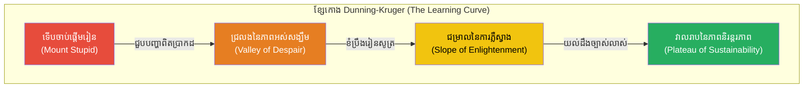
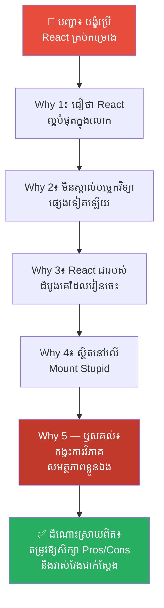
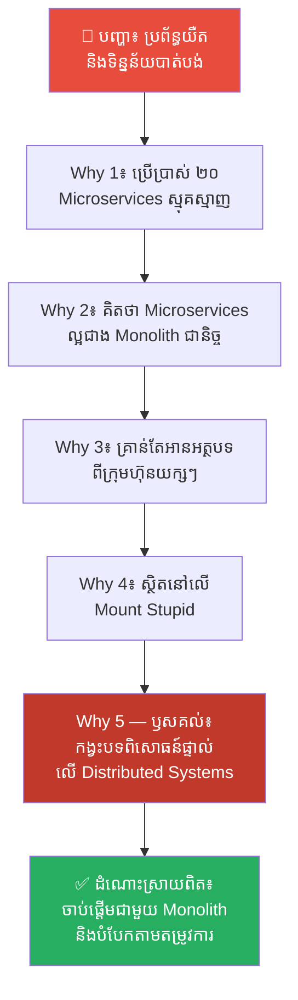
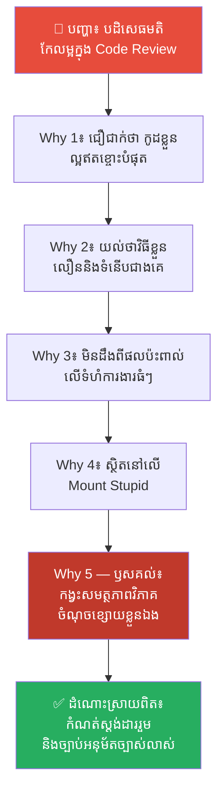
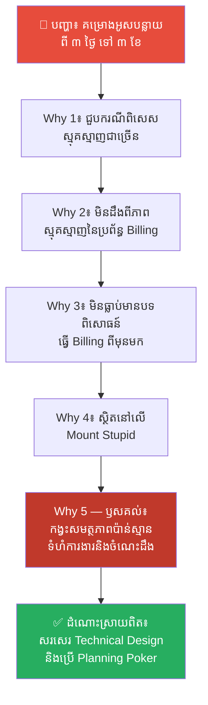
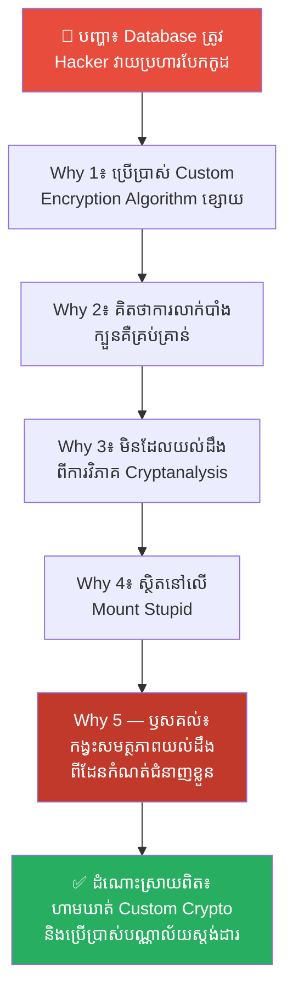

# The Dunning-Kruger Effect: Why Incompetent People Think They're Great (ហេតុអ្វីអ្នកមិនចេះសោះ គិតថាខ្លួនឯងចេះខ្លាំង?)

**Author:** ichamrong  
**Date:** 2026-05-18  
**Tags:** #dunning-kruger-effect #psychology #cognitive-bias #learning-curve #mental-models  
**Category:** Concepts  
**Read Time:** ~15 min  

---

> **ELI5 / ពន្យល់ដូចកុមារ៖** 
> ស្រមៃថាក្មេងម្នាក់ទើបតែរៀនលេងអុក។ គាត់លេងឈ្នះប្អូនប្រុសរបស់គាត់ ហើយគាត់ក៏គិតថាគាត់គឺជាកំពូលអ្នកលេងអុកក្នុងលោក។ គាត់មិនដឹងពីក្បួនបើក ក្បួនបិទ ឬយុទ្ធសាស្ត្រទេ — ហើយគាត់ "មិនដឹងថាខ្លួនឯងមិនដឹង" នោះទេ។ ចំណែកឯអ្នកជំនាញលេងអុកពិតប្រាកដ បែរជាមានអារម្មណ៍មិនជឿជាក់លើខ្លួនឯង ព្រោះនាងដឹងថានៅមានក្បួនរាប់ពាន់ទៀតដែលនាងមិនទាន់ចេះ។ អ្នកចាប់ផ្តើមថ្មី មានទំនុកចិត្តខ្ពស់ ព្រោះគាត់មើលមិនឃើញពីភាពល្ងង់របស់ខ្លួន។ អ្នកជំនាញ មានទំនុកចិត្តទាប ព្រោះគាត់មើលឃើញពីទំហំនៃចំណេះដឹងដែលខ្លួនមិនទាន់មាន។
> 
> **សុភាសិតខ្មែរ៖** "ស្រូវទុំទាបក្បាល ស្រូវស្កកងើបក្បាលឡើង" (អ្នកដែលមិនចេះអ្វីសោះ ច្រើនតែអួតអាងជាងអ្នកដែលចេះពិតប្រាកដ)។

---

## 📌 មាតិកា (Table of Contents)
- [លំនាំបញ្ហា (The Pattern)](#លំនាំបញ្ហា-the-pattern)
- [១. បញ្ហា៖ ភ្នំនៃភាពល្ងង់ និងភាពងងឹតងងល់នៃចំណេះដឹង (The Issue: Mount Stupid and Metacognitive Blindness)](#១-បញ្ហា-ភ្នំនៃភាពល្ងង់-និងភាពងងឹតងងល់នៃចំណេះដឹង-the-issue-mount-stupid-and-metacognitive-blindness)
- [២. ឧទាហរណ៍ជាក់ស្តែងក្នុងពិភពពិត (Real World Examples)](#២-ឧទាហរណ៍ជាក់ស្តែងក្នុងពិភពពិត)
  - [ឧទាហរណ៍ទី ១ — កម្រិតស្រាល៖ វិស្វករកម្មវិធីថ្មីថ្មោងដែលគាំទ្រតែ Framework មួយមុខ (The Junior Framework Advocate)](#ឧទាហរណ៍ទី-១-កម្រិតស្រាល-វិស្វករកម្មវិធីថ្មីថ្មោងដែលគាំទ្រតែ-framework-មួយមុខ-the-junior-framework-advocate)
  - [ឧទាហរណ៍ទី ២ — កម្រិតមធ្យម (បច្ចេកទេស)៖ ការរចនាប្រព័ន្ធស្មុគស្មាញជ្រុលហួសហេតុ (The Overconfident System Designer)](#ឧទាហរណ៍ទី-២-កម្រិតមធ្យម-បច្ចេកទេស-ការរចនាប្រព័ន្ធស្មុគស្មាញជ្រុលហួសហេតុ-the-overconfident-system-designer)
  - [ឧទាហរណ៍ទី ៣ — កម្រិតមធ្យម (បច្ចេកទេស)៖ ការបដិសេធមតិស្ថាបនាក្នុងការកែលម្អកូដ (The Code Review Rejector)](#ឧទាហរណ៍ទី-៣-កម្រិតមធ្យម-បច្ចេកទេស-ការបដិសេធមតិស្ថាបនាក្នុងការកែលម្អកូដ-the-code-review-rejector)
  - [ឧទាហរណ៍ទី ៤ — កម្រិតមធ្យម (បច្ចេកទេស)៖ ការប៉ាន់ស្មានពេលវេលាគម្រោងខ្លីជ្រុល (Underestimating Project Timelines)](#ឧទាហរណ៍ទី-៤-កម្រិតមធ្យម-បច្ចេកទេស-ការប៉ាន់ស្មានពេលវេលាគម្រោងខ្លីជ្រុល-underestimating-project-timelines)
  - [ឧទាហរណ៍ទី ៥ — កម្រិតធ្ងន់៖ ការសរសេរក្បួនការពារសន្តិសុខផ្ទាល់ខ្លួន (The Security Ignorer)](#ឧទាហរណ៍ទី-៥-កម្រិតធ្ងន់-ការសរសេរក្បួនការពារសន្តិសុខផ្ទាល់ខ្លួន-the-security-ignorer)
- [៣. កត្តាជម្រុញ៖ វប្បធម៌អួតអាង និងការភ័យខ្លាចការបង្ហាញចំណុចខ្សោយ (The Aggravator: Culture of Bluster and Fear of Showing Vulnerability)](#៣-កត្តាជម្រុញ-វប្បធម៌អួតអាង-និងការភ័យខ្លាចការបង្ហាញចំណុចខ្សោយ-the-aggravator-culture-of-bluster-and-fear-of-showing-vulnerability)
- [៤. ដំណោះស្រាយទូទៅ៖ របៀបកសាងវប្បធម៌យល់ដឹង និងបន្ទាបខ្លួន (The General Solution: Cultivating Metacognition and Humility)](#៤-ដំណោះស្រាយទូទៅ-របៀបកសាងវប្បធម៌យល់ដឹង-និងបន្ទាបខ្លួន-the-general-solution-cultivating-metacognition-and-humility)
- [សេចក្តីសន្និដ្ឋាន (Conclusion)](#សេចក្តីសន្និដ្ឋាន-conclusion)
- [ឯកសារយោង (References)](#ឯកសារយោង-references)
- [Related Posts](#related-posts)

---

## លំនាំបញ្ហា (The Pattern)

តើអ្នកធ្លាប់ជួបនរណាម្នាក់ដែលទើបតែរៀនជំនាញថ្មីមួយបានពីរបីសប្តាហ៍ ប៉ុន្តែនិយាយអួតអាងហាក់បីដូចជាខ្លួនយល់ច្បាស់គ្រប់រឿង និងចេះជាងអ្នកដែលធ្វើការងារនោះរាប់ឆ្នាំដែរឬទេ? ឬមួយក៏ខ្លួនអ្នកផ្ទាល់ ធ្លាប់មានអារម្មណ៍ថា «ការងារនេះងាយស្រួលណាស់ គ្មានអ្វីពិបាកសោះ» តែដល់ពេលចាប់ផ្តើមធ្វើពិតប្រាកដ បែរជាជួបឧបសគ្គរាប់មិនអស់ និងដឹងខ្លួនថាខ្លួនមិនទាន់ចេះអ្វីសោះទៅវិញ?

នៅក្នុងចិត្តសាស្ត្រ ឥរិយាបថបែបនេះត្រូវបានគេហៅថា **Dunning-Kruger Effect (អគតិនៃការវាយតម្លៃខ្លួនឯងខ្ពស់ជ្រុល)**។ វាគឺជាគ្រោះថ្នាក់ដ៏ធំមួយនៅក្នុងការអភិវឌ្ឍខ្លួន និងការអភិវឌ្ឍកម្មវិធី ពីព្រោះ៖
* អ្នកដែលមិនចេះសោះ តែងតែមានទំនុកចិត្តខ្ពស់ជ្រុល និងធ្វើការសម្រេចចិត្តប្រកបដោយហានិភ័យខ្ពស់។
* ពួកគេ «មិនដឹងថាខ្លួនឯងមិនដឹងអ្វីខ្លះឡើយ» (Ignorant of their own ignorance)។
* ពួកគេបដិសេធមិនព្រមរៀនសូត្របន្ថែម ឬទទួលយកមតិរិះគន់ដើម្បីស្ថាបនាឡើយ ព្រោះគិតថាខ្លួនចេះអស់ទៅហើយ។

ដើម្បីកសាងប្រព័ន្ធបច្ចេកវិទ្យា និងក្រុមការងារដ៏រឹងមាំ យើងត្រូវយល់ដឹងពីអន្ទាក់ផ្លូវចិត្តនេះ និងរៀនពីរបៀបចុះពី «ភ្នំនៃភាពល្ងង់» ទៅកាន់ «វាលរាបនៃភាពជាអ្នកជំនាញពិតប្រាកដ»។

---

## ១. បញ្ហា៖ ភ្នំនៃភាពល្ងង់ និងភាពងងឹតងងល់នៃចំណេះដឹង (The Issue: Mount Stupid and Metacognitive Blindness)

នៅឆ្នាំ ១៩៩៩ អ្នកចិត្តវិទ្យា **David Dunning** និង **Justin Kruger** នៅសាកលវិទ្យាល័យ Cornell បានសិក្សាឃើញថា មនុស្សដែលខ្វះសមត្ថភាព ឬចំណេះដឹងនៅក្នុងវិស័យណាមួយ តែងតែរងគ្រោះដោយសារបញ្ហាពីរជាន់៖
1. ពួកគេធ្វើការសន្និដ្ឋានខុស និងធ្វើការសម្រេចចិត្តមិនល្អ ដោយសារតែកង្វះចំណេះដឹង។
2. កង្វះចំណេះដឹងនោះឯង បានបំបាត់សមត្ថភាពរបស់ពួកគេក្នុងការមើលឃើញ និងយល់ដឹងថា ការសម្រេចចិត្តរបស់ពួកគេគឺខុសឆ្គង។

នេះត្រូវបានគេហៅថា **Metacognitive Deficit (កង្វះការយល់ដឹងពីការគិតរបស់ខ្លួន)**។ ជំនាញដែលត្រូវការដើម្បីធ្វើការងារមួយឱ្យបានល្អឥតខ្ចោះ គឺជាជំនាញតែមួយដែលត្រូវការដើម្បីវាយតម្លៃថា តើការងារនោះល្អឬអត់។ ប្រសិនបើអ្នកមិនចេះសរសេរកូដប្រកបដោយសុវត្ថិភាពទេ អ្នកក៏គ្មានសមត្ថភាពអាចដឹងថា កូដដែលអ្នកកំពុងសរសេរមានចន្លោះប្រហោងសុវត្ថិភាពធ្ងន់ធ្ងរដែរ។

ខ្សែកោង Dunning-Kruger ត្រូវបានបែងចែកជា ៤ ដំណាក់កាល៖

1. **ភ្នំនៃភាពល្ងង់ (Mount Stupid)៖** ចំណុចចាប់ផ្តើមដំបូងបង្អស់។ អ្នកដឹងតិចតួចបំផុត ប៉ុន្តែមានទំនុកចិត្តកប់ពពក ព្រោះអ្នកមើលមិនឃើញពីទំហំដ៏ធំធេងនៃវិស័យនោះឡើយ។
2. **ជ្រលងនៃភាពអស់សង្ឃឹម (Valley of Despair)៖** នៅពេលអ្នកចាប់ផ្តើមជួបការងារពិតប្រាកដ ឬបរាជ័យជាលើកដំបូង។ អ្នកស្រាប់តែភ្ញាក់ខ្លួន និងដឹងថាខ្លួនឯងល្ងង់ខ្លាំង និងខ្វះខាតជំនាញជាច្រើន។ ទីនេះជាកន្លែងដែលមនុស្សជាច្រើនបោះបង់ចោល។
3. **ជម្រាលនៃការភ្លឺស្វាង (Slope of Enlightenment)៖** អ្នកចាប់ផ្តើមយល់ដឹងកាន់តែច្រើនឡើងៗ។ ទំនុកចិត្តរបស់អ្នកកើនឡើងឡើងវិញជាលំដាប់ ប៉ុន្តែជាទំនុកចិត្តដែលផ្អែកលើការយល់ដឹង និងសមត្ថភាពពិតប្រាកដ។
4. **វាលរាបនៃភាពនិរន្តរភាព (Plateau of Sustainability)៖** ភាពជាអ្នកជំនាញពិតប្រាកដ។ អ្នកដឹងពីអ្វីដែលអ្នកចេះ អ្នកដឹងពីអ្វីដែលអ្នកមិនចេះ និងយល់ថាការរៀនសូត្រគ្មានដែនកំណត់ឡើយ។

---

## ២. ឧទាហរណ៍ជាក់ស្តែងក្នុងពិភពពិត

នេះជា **ឧទាហរណ៍ជាក់ស្តែងចំនួន ៥** បង្ហាញពីគ្រោះថ្នាក់នៃ Dunning-Kruger Effect នៅក្នុងការងារ និងបច្ចេកវិទ្យា៖

---

### ឧទាហរណ៍ទី ១ — កម្រិតស្រាល៖ វិស្វករកម្មវិធីថ្មីថ្មោងដែលគាំទ្រតែ Framework មួយមុខ (The Junior Framework Advocate)

**ស្ថានភាព (Situation)៖** វិស្វករកម្មវិធីទើបតែរៀនចប់ថ្មីៗម្នាក់ (Junior Developer) ដែលទើបតែរៀនប្រើប្រាស់ React បានរយៈពេលមួយខែយ៉ាងស្ទាត់ជំនាញ។

**សកម្មភាពខុសឆ្គង (Wrong Action)៖** គាត់បានអះអាង និងព្យាយាមបង្ខំឱ្យក្រុមការងារប្តូររាល់គម្រោងទាំងអស់នៅក្នុងក្រុមហ៊ុន (សូម្បីតែ Web App ធម្មតា ឬ Landing Page សាមញ្ញ) មកប្រើប្រាស់ React និង Single Page Application (SPA) ទាំងអស់ ដោយជឿជាក់ថា React គឺជាបច្ចេកវិទ្យាតែមួយគត់ដែលអាចដោះស្រាយរាល់បញ្ហាក្នុងលោកបានយ៉ាងល្អបំផុត។

**ការវិភាគបែប 5 Whys៖**

| # | សំណួរ (Why?) | ចម្លើយ (Answer) |
|---|---|---|
| 1 | ហេតុអ្វីបានជាគាត់ទទូចថា React អាចដោះស្រាយគ្រប់បញ្ហាបានល្អបំផុត? | ពីព្រោះគាត់យល់ថា React គឺជាបច្ចេកវិទ្យាទំនើប និងអស្ចារ្យជាងគេក្នុងលោក។ |
| 2 | ហេតុអ្វីបានជាគាត់យល់ថាវាអស្ចារ្យជាងគេ និងគ្មានបច្ចេកវិទ្យាផ្សេងជំនួសបាន? | ពីព្រោះគាត់មិនធ្លាប់ស្វែងយល់ ឬមានបទពិសោធន៍ប្រើប្រាស់បច្ចេកវិទ្យាផ្សេងៗដូចជា SSR (Server-Side Rendering), HTML/CSS សាមញ្ញ ឬ Framework ផ្សេងទៀតឡើយ។ |
| 3 | ហេតុអ្វីបានជាគាត់មិនធ្លាប់ស្វែងយល់ ឬសាកល្បងបច្ចេកវិទ្យាផ្សេង? | ពីព្រោះគាត់ទើបតែចាប់ផ្តើមរៀនសរសេរកូដ ហើយ React គឺជាកម្មវិធីដំបូងដែលគាត់រៀនចេះ។ |
| 4 | ហេតុអ្វីបានជាការរៀនចេះបច្ចេកវិទ្យាមួយដំបូង ធ្វើឱ្យគាត់មានទំនុកចិត្តខ្លាំងរហូតដល់មើលរំលងជម្រើសផ្សេងទៀត? | ពីព្រោះគាត់កំពុងស្ថិតនៅលើកំពូលភ្នំ «Mount Stupid» នៃខ្សែកោង Dunning-Kruger ដែលជាចំណុចមានចំណេះដឹងតិចតួចបំផុត ប៉ុន្តែមានទំនុកចិត្តខ្ពស់បំផុត។ |
| 5 | ហេតុអ្វីបានជាធ្លាក់ចូលទៅក្នុងអន្ទាក់នៃកំពូលភ្នំ Mount Stupid? | **ពីព្រោះកង្វះសមត្ថភាពវិភាគលើចំណេះដឹងខ្លួនឯង (Metacognitive Deficit) ដែលធ្វើឱ្យគាត់មិនដឹងថាខ្លួនឯងខ្វះខាតចំណេះដឹងផ្នែកស្ថាបត្យកម្មវិបសាយដ៏ទូលំទូលាយ។** |

**ដំណោះស្រាយពិតប្រាកដ៖** ផ្តល់ឱកាសឱ្យគាត់ចូលរួមស្វែងយល់ពីគម្រោងផ្សេងៗដែលប្រើប្រាស់បច្ចេកវិទ្យាផ្សេងគ្នា និងណែនាំគាត់ឱ្យធ្វើការប្រៀបធៀបគុណសម្បត្តិ និងគុណវិបត្តិ (Pros and Cons) នៃជម្រើសនីមួយៗតាមរយៈការវាស់វែងជាក់ស្តែង (Performance, SEO, Development Speed) ដើម្បីឱ្យគាត់អាចចុះមកកាន់ «ជ្រលងនៃភាពអស់សង្ឃឹម» និងចាប់ផ្តើមរៀនសូត្រជាអ្នកជំនាញពិតប្រាកដ។

---

### ឧទាហរណ៍ទី ២ — កម្រិតមធ្យម (បច្ចេកទេស)៖ ការរចនាប្រព័ន្ធស្មុគស្មាញជ្រុលហួសហេតុ (The Overconfident System Designer)

**ស្ថានភាព (Situation)៖** វិស្វករប្រព័ន្ធកម្រិតមធ្យមម្នាក់ (Mid-level Engineer) ត្រូវបានចាត់តាំងឱ្យរៀបចំរចនាសម្ព័ន្ធប្រព័ន្ធសម្រាប់ App លក់ដូរថ្មីមួយរបស់ក្រុមហ៊ុន។

**សកម្មភាពខុសឆ្គង (Wrong Action)៖** គាត់បានរៀបចំស្ថាបត្យកម្មជា Distributed Microservices ស្មុគស្មាញដែលមាន Services រហូតដល់ទៅ ២០ ឆ្លងកាត់បណ្តាញផ្សេងៗគ្នា ដោយជឿជាក់ថាវាជាប្រព័ន្ធទំនើបបំផុត និងងាយស្រួលយល់ ទោះបីជាគាត់មិនទាន់យល់ច្បាស់ពីបញ្ហា Network Latency, Distributed Transactions, ឬ Service Discovery ឡើយ។

**ការវិភាគបែប 5 Whys៖**

| # | សំណួរ (Why?) | ចម្លើយ (Answer) |
|---|---|---|
| 1 | ហេតុអ្វីបានជាប្រព័ន្ធជួបបញ្ហាយឺត និងទិន្នន័យមិនស៊ីសង្វាក់គ្នាយ៉ាងខ្លាំង? | ពីព្រោះរាល់ Transactions ត្រូវឆ្លងកាត់ Services ជាច្រើនតាមរយៈបណ្តាញ Network ដែលគ្មានការគ្រប់គ្រងត្រឹមត្រូវ។ |
| 2 | ហេតុអ្វីបានជាជ្រើសរើសការបំបែក Microservices ច្រើនពេកទាំងដែលប្រព័ន្ធទើបតែចាប់ផ្តើម? | ពីព្រោះគាត់គិតថា Microservices គឺតែងតែល្អជាង Monolith គ្រប់ករណីទាំងអស់ និងចង់បង្កើតប្រព័ន្ធដែលមើលទៅទំនើប។ |
| 3 | ហេតុអ្វីបានជាគាត់ជឿជាក់ថា Microservices គឺល្អជាង Monolith គ្រប់ករណីដោយមិនគិតពីផលវិបាក? | ពីព្រោះគាត់គ្រាន់តែបានអានអត្ថបទ ឬមើលវីដេអូសរសើរពី Microservices របស់ក្រុមហ៊ុនធំៗដូចជា Netflix ឬ Amazon។ |
| 4 | ហេតុអ្វីបានជាគិតថាខ្លួនអាចរៀបចំប្រព័ន្ធស្មុគស្មាញដូចក្រុមហ៊ុនធំៗបានយ៉ាងងាយស្រួល? | ពីព្រោះគាត់មានទំនុកចិត្តជ្រុលហួសហេតុ ដោយសារតែទើបតែបានដឹងពីគោលគំនិត Microservices ជាលើកដំបូង (ស្ថិតនៅលើភ្នំ Mount Stupid)។ |
| 5 | ហេតុអ្វីបានជាមានទំនុកចិត្តជ្រុល និងមើលរំលងហានិភ័យនៃប្រព័ន្ធបណ្តាញ? | **ពីព្រោះកង្វះបទពិសោធន៍ផ្ទាល់ក្នុងការដោះស្រាយបញ្ហានៃ Distributed Systems (Fallacies of Distributed Computing) ដែលធ្វើឱ្យគាត់មិនដឹងពីភាពលំបាក និងទំហំពិតប្រាកដនៃការគ្រប់គ្រងប្រព័ន្ធនោះ។** |

**ដំណោះស្រាយពិតប្រាកដ៖** ចាប់ផ្តើមជាមួយស្ថាបត្យកម្ម Monolith ដ៏សាមញ្ញ និងស្អាតជាមុនសិន (Modular Monolith)។ បណ្តុះបណ្តាលក្រុមការងារអំពីផលវិបាក និងការចំណាយខ្ពស់នៃ Distributed Systems និងអនុញ្ញាតឱ្យបំបែកជា Microservices លុះត្រាតែមានតម្រូវការជាក់ស្តែង និងបានត្រៀមខ្លួនរួចរាល់ជាមួយយន្តការត្រួតពិនិត្យ និងសុវត្ថិភាពខ្ពស់។

---

### ឧទាហរណ៍ទី ៣ — កម្រិតមធ្យម (បច្ចេកទេស)៖ ការបដិសេធមតិស្ថាបនាក្នុងការកែលម្អកូដ (The Code Review Rejector)

**ស្ថានភាព (Situation)៖** វិស្វករកម្មវិធីម្នាក់ដែលមានទំនុកចិត្តខ្ពស់ ផ្ញើកូដរបស់ខ្លួនចូលទៅក្នុងប្រព័ន្ធដើម្បីឱ្យក្រុមការងារត្រួតពិនិត្យ (Code Review)។

**សកម្មភាពខុសឆ្គង (Wrong Action)៖** នៅពេលដែលសមាជិកក្រុមផ្សេងទៀត ជាពិសេសអ្នកជំនាញចាស់វស្សា ផ្តល់មតិយោបល់ដើម្បីកែលម្អកូដឱ្យមានសុវត្ថិភាព និងល្បឿនលឿនជាងមុន គាត់បានប្រកែកយ៉ាងខ្លាំង និងខឹងសម្បារ ដោយចោទប្រកាន់ថាក្រុមការងារកំពុងតែរករឿងគាត់ ឬមិនយល់ពីកូដដ៏ល្អឥតខ្ចោះរបស់គាត់។

**ការវិភាគបែប 5 Whys៖**

| # | សំណួរ (Why?) | ចម្លើយ (Answer) |
|---|---|---|
| 1 | ហេតុអ្វីបានជាគាត់ប្រឆាំង និងមិនព្រមទទួលយកមតិស្ថាបនាក្នុងការកែលម្អកូដ? | ពីព្រោះគាត់ជឿជាក់ថា កូដដែលគាត់សរសេរគឺត្រឹមត្រូវ ល្អបំផុត និងគ្មានចន្លោះប្រហោងឡើយ។ |
| 2 | ហេតុអ្វីបានជាគាត់ជឿជាក់ថាគ្មានចន្លោះប្រហោង ទោះបីជាគេចង្អុលបង្ហាញពី Memory Leak ជាក់ស្តែងក៏ដោយ? | ពីព្រោះគាត់យល់ថាវិធីសរសេរកូដរបស់គាត់គឺទំនើប និងលឿនជាងវិធីចាស់ៗរបស់សមាជិកផ្សេងទៀត។ |
| 3 | ហេតុអ្វីបានជាគាត់ជឿជាក់លើវិធីសរសេររបស់ខ្លួនទាំងស្រុងដោយគ្មានការស្រាវជ្រាវបន្ថែម? | ពីព្រោះគាត់មិនធ្លាប់ដឹងពីផលប៉ះពាល់នៃការសរសេរកូដបែបនោះលើទំហំការងារធំៗ ឬក្នុងរយៈពេលវែងឡើយ។ |
| 4 | ហេតុអ្វីបានជាការមិនដឹងពីផលប៉ះពាល់ បែរជានាំឱ្យគាត់មានអំនួតនឹងកូដរបស់ខ្លួនទៅវិញ? | ពីព្រោះគាត់កំពុងស្ថិតនៅលើភ្នំ Mount Stupid ដែលភាពមិនដឹងពីចំណុចខ្វះខាត បង្កើតជាទំនុកចិត្តជ្រុល និងភាពពិការភ្នែកចំពោះកំហុសរបស់ខ្លួន។ |
| 5 | ហេតុអ្វីបានជាមិនដឹងពីចំណុចខ្វះខាតរបស់ខ្លួនឯង? | **ពីព្រោះកង្វះ Metacognition (ការត្រួតពិនិត្យការគិតរបស់ខ្លួន) ដែលជាចំណុចស្នូលនៃ Dunning-Kruger Effect ដែលធ្វើឱ្យអ្នកមិនសូវចេះ គ្មានសមត្ថភាពអាចមើលឃើញពីភាពខ្វះខាតរបស់ខ្លួនឯងបានឡើយ។** |

**ដំណោះស្រាយពិតប្រាកដ៖** បង្កើតវប្បធម៌ការងារដែលវាយតម្លៃកូដផ្អែកលើស្តង់ដាររួម (Linter, Automated Tests, Security Scanning) និងអនុវត្តច្បាប់ដែលតម្រូវឱ្យមានការអនុម័ត (Approval) ពីសមាជិកក្រុមយ៉ាងហោចណាស់ ២ នាក់ ទើបអាចបញ្ចូលកូដបាន។ ជួយគាត់ឱ្យយល់ថាការបញ្ចេញមតិគឺដើម្បីកែលម្អការងារ មិនមែនវាយប្រហារបុគ្គលឡើយ។

---

### ឧទាហរណ៍ទី ៤ — កម្រិតមធ្យម (បច្ចេកទេស)៖ ការប៉ាន់ស្មានពេលវេលាគម្រោងខ្លីជ្រុល (Underestimating Project Timelines)

**ស្ថានភាព (Situation)៖** ក្រុមហ៊ុនចង់បង្កើតមុខងារថ្មីមួយដែលមានឈ្មោះថា "Multi-tenant Subscription Billing System" ដែលជាប្រព័ន្ធកាត់លុយប្រចាំខែដ៏ស្មុគស្មាញ។

**សកម្មភាពខុសឆ្គង (Wrong Action)៖** វិស្វករកម្មវិធីម្នាក់ដែលមិនទាន់យល់ដឹងច្បាស់ពីច្បាប់គណនេយ្យ ករណីបង់លុយបរាជ័យ (Failed Payments), Stripe API Webhooks, ឬការគណនាពន្ធ ហ៊ានធានាអះអាងយ៉ាងមុតមាំទៅកាន់ថ្នាក់ដឹកនាំថា គាត់អាចសរសេរមុខងារនេះចប់រួចរាល់ និងដាក់ឱ្យប្រើប្រាស់បានក្នុងរយៈពេលត្រឹមតែ «៣ ថ្ងៃ» ប៉ុណ្ណោះ។

**ការវិភាគបែប 5 Whys៖**

| # | សំណួរ (Why?) | ចម្លើយ (Answer) |
|---|---|---|
| 1 | ហេតុអ្វីបានជាគម្រោងត្រូវពន្យារពេលរហូតដល់ទៅ ៣ ខែ ទាំងដែលធ្លាប់ធានាថាត្រឹមតែ ៣ ថ្ងៃ? | ពីព្រោះជួបប្រទះបញ្ហាស្មុគស្មាញជាច្រើនទាក់ទងនឹងការគណនាប្រភាគលុយ ការប្តូរគម្រោងកណ្តាលខែ (Proration) និងការដោះស្រាយវិវាទបង់លុយដែលមិនធ្លាប់គិតដល់។ |
| 2 | ហេតុអ្វីបានជាមិនគិតដល់បញ្ហាទាំងនោះតាំងពីដំបូង? | ពីព្រោះគាត់មិនដឹងថាប្រព័ន្ធបង់ប្រាក់ប្រចាំខែ (Billing System) មានករណីពិសេស (Edge Cases) ច្រើនរាប់មិនអស់បែបនេះឡើយ។ |
| 3 | ហេតុអ្វីបានជាមិនដឹងពីអត្ថិភាពនៃករណីពិសេសទាំងនោះ? | ពីព្រោះគាត់មិនធ្លាប់សរសេរ ឬគ្រប់គ្រងប្រព័ន្ធ Billing ពីមុនមកឡើយ។ |
| 4 | ហេតុអ្វីបានជាគ្មានបទពិសោធន៍ទាល់តែសោះ ប៉ុន្តែហ៊ានសន្យារយៈពេលខ្លីបំផុតបែបនេះ? | ពីព្រោះគាត់កំពុងស្ថិតនៅលើភ្នំ Mount Stupid ដែលការដឹងត្រឹមតែទ្រឹស្តីសាមញ្ញ ធ្វើឱ្យគាត់មានអារម្មណ៍ថា "រឿងនេះងាយស្រួលណាស់"។ |
| 5 | ហេតុអ្វីបានជាការដឹងតិចតួច បង្កើតជាការវាយតម្លៃខុសយ៉ាងធ្ងន់ធ្ងរ? | **ពីព្រោះកង្វះសមត្ថភាពប៉ាន់ស្មានទំហំការងារ ដោយសារតែមិនដឹងពីទំហំដ៏មហិមានៃព័ត៌មានដែលខ្លួនមិនទាន់ដឹង (Ignorance of Ignorance)។** |

**ដំណោះស្រាយពិតប្រាកដ៖** អនុវត្តការវាយតម្លៃទំហំការងារដោយប្រើប្រាស់បច្ចេកទេស Planning Poker ឬតម្រូវឱ្យមានការសរសេរផែនការបច្ចេកទេសលម្អិត (Technical Design Document) និងឆ្លងកាត់ការត្រួតពិនិត្យពីវិស្វករចាស់វស្សា មុននឹងប្រកាសកាលបរិច្ឆេទទៅកាន់អតិថិជន ឬថ្នាក់ដឹកនាំ។

---

### ឧទាហរណ៍ទី ៥ — កម្រិតធ្ងន់៖ ការសរសេរក្បួនការពារសន្តិសុខផ្ទាល់ខ្លួន (The Security Ignorer)

**ស្ថានភាព (Situation)៖** ក្រុមហ៊ុនសេវាកម្មសុខាភិបាលឌីជីថលមួយ ចង់ការពារទិន្នន័យសម្ងាត់របស់អ្នកជំងឺដែលផ្ទុកនៅក្នុង Database។

**សកម្មភាពខុសឆ្គង (Wrong Action)៖** វិស្វករកម្មវិធីម្នាក់បានសម្រេចចិត្តសរសេរក្បួនគ្រីបតូក្រាហ្វិក (Custom Encryption Algorithm) ផ្ទាល់ខ្លួនដើម្បីបំលែងទិន្នន័យ ដោយអះអាងថា វាងាយស្រួល សរសេរកូដតែពីរបីជួរគឺរួចរាល់ និងមានសុវត្ថិភាពខ្ពស់ជាងស្តង់ដារអន្តរជាតិ (ដូចជា AES-256) ព្រោះគ្មាន Hacker ណាស្គាល់ក្បួនរបស់គាត់ឡើយ។

**ការវិភាគបែប 5 Whys៖**

| # | សំណួរ (Why?) | ចម្លើយ (Answer) |
|---|---|---|
| 1 | ហេតុអ្វីបានជាទិន្នន័យអ្នកជំងឺទាំងអស់ត្រូវបាន Hacker វាយប្រហារបំបែកកូដ និងលួចយកបានយ៉ាងងាយ? | ពីព្រោះក្បួនបំលែងទិន្នន័យរបស់គាត់មានភាពងាយស្រួលពេក និងខ្វះយន្តការការពារដូចជា Entropy ឬ IV (Initialization Vector) សមស្រប។ |
| 2 | ហេតុអ្វីបានជាសរសេរក្បួនខ្សោយបែបនេះ ទាំងដែលស្តង់ដារ AES-256 មានស្រាប់? | ពីព្រោះគាត់គិតថាស្តង់ដារ AES-256 ស្មុគស្មាញពេក ហើយការលាក់បាំងវិធីសរសេររបស់ខ្លួន (Security through obscurity) គឺគ្រប់គ្រាន់ដើម្បីការពារហើយ។ |
| 3 | ហេតុអ្វីបានជាជឿជាក់ថាក្បួនលាក់បាំងរបស់ខ្លួនខ្លាំងជាងស្តង់ដារពិភពលោក? | ពីព្រោះគាត់មិនធ្លាប់សិក្សា ឬយល់ដឹងពីវិធីដែល Cryptanalysts ឬ Hackers ប្រើប្រាស់ដើម្បីវិភាគ និងបំបែកលេខកូដឡើយ។ |
| 4 | ហេតុអ្វីបានជាគ្មានចំណេះដឹងផ្នែក Cryptography សោះ ប៉ុន្តែមានទំនុកចិត្តខ្ពស់ក្នុងការបង្កើតក្បួនផ្ទាល់ខ្លួន? | ពីព្រោះគាត់កំពុងស្ថិតនៅលើភ្នំ Mount Stupid ដែលការដឹងត្រឹមតែវិធីបំលែងអក្សរងាយៗ (ដូចជា ROT13 ឬ XOR) ធ្វើឱ្យគាត់មានអារម្មណ៍ថាខ្លួនគឺជាអ្នកជំនាញសន្តិសុខ។ |
| 5 | ហេតុអ្វីបានជាការដឹងស្ទើរៗ បង្កជាគ្រោះថ្នាក់ដ៏ធំដល់ប្រព័ន្ធ? | **ពីព្រោះកង្វះសមត្ថភាពយល់ដឹងពីដែនកំណត់នៃជំនាញរបស់ខ្លួន ដែលនាំឱ្យមានទំនុកចិត្តខុសកន្លែង និងបង្កជាការបំផ្លិចបំផ្លាញដល់ប្រព័ន្ធទាំងមូល។** |

**ដំណោះស្រាយពិតប្រាកដ៖** ហាមឃាត់ការសរសេរ Custom Cryptography ជាដាច់ខាតនៅក្នុងប្រព័ន្ធរបស់ក្រុមហ៊ុន។ ត្រូវកំណត់ឱ្យប្រើប្រាស់តែបណ្ណាល័យស្តង់ដារដែលត្រូវបានទទួលស្គាល់ទូទាំងពិភពលោក (ដូចជា OpenSSL, WebCrypto) និងឆ្លងកាត់ការពិនិត្យកូដ និងការធ្វើតេស្តសន្តិសុខ (Security Audit / Penetration Testing) ជាប្រចាំ។

---

## ៣. កត្តាជម្រុញ៖ វប្បធម៌អួតអាង និងការភ័យខ្លាចការបង្ហាញចំណុចខ្សោយ (The Aggravator: Culture of Bluster and Fear of Showing Vulnerability)

ហេតុអ្វីបានជាមនុស្សជាច្រើននៅតែធ្លាក់ចូលទៅក្នុងអន្ទាក់នៃកំពូលភ្នំ Mount Stupid ហើយមិនព្រមចុះមកវិញ?

**វប្បធម៌ការងារដែលឱ្យតម្លៃលើការអួតអាង (Culture of Bluster)៖**  
នៅក្នុងកិច្ចប្រជុំ ឬការសម្ភាសន៍ការងារ មនុស្សជាច្រើនយល់ឃើញថា អ្នកដែលនិយាយខ្លាំងៗ មានទំនុកចិត្តកប់ពពក និងហ៊ានធានាគ្រប់រឿង គឺជាមនុស្សពូកែ និងទទួលបានការកោតសរសើរ។ ផ្ទុយទៅវិញ អ្នកជំនាញពិតប្រាកដដែលនិយាយដោយបន្ទាបខ្លួន និងមានការប្រុងប្រយ័ត្ន បែរជាត្រូវបានគេគិតថា «ខ្វះសមត្ថភាព»។ ការលំអៀងរបស់សង្គមបែបនេះ បង្ខំឱ្យមនុស្សបង្កើតទំនុកចិត្តក្លែងក្លាយ និងព្យាយាមស្នាក់នៅលើកំពូលភ្នំ Mount Stupid។

**ការភ័យខ្លាចការបង្ហាញចំណុចខ្សោយ (Fear of Vulnerability)៖**  
វិស្វករកម្មវិធីជាច្រើនខ្លាចការនិយាយពាក្យថា «ខ្ញុំមិនដឹង» ឬ «ខ្ញុំមិនយល់រឿងនេះទេ» ព្រោះបារម្ភថាអាចបាត់បង់ការងារ ឬបាត់បង់ការគោរពពីមិត្តរួមការងារ។ ភាពភ័យខ្លាចនេះ ធ្វើឱ្យពួកគេព្យាយាមបិទបាំងភាពមិនចេះរបស់ខ្លួនឯង និងបដិសេធមិនទទួលយកការកែលម្អកំហុសពីអ្នកដទៃ។

---

## ៤. ដំណោះស្រាយទូទៅ៖ របៀបកសាងវប្បធម៌យល់ដឹង និងបន្ទាបខ្លួន (The General Solution: Cultivating Metacognition and Humility)

ដើម្បីទប់ស្កាត់គ្រោះថ្នាក់នៃ Dunning-Kruger Effect នៅក្នុងក្រុមការងារ និងគម្រោងបច្ចេកវិទ្យា សូមអនុវត្តតាមវិធីសាស្ត្រទាំងនេះ៖

### ១. បណ្តុះបណ្តាលឱ្យមាន «ចិត្តសាស្ត្រសុវត្ថិភាព» (Psychological Safety)
បង្កើតបរិយាកាសការងារដែលអនុញ្ញាតឱ្យបុគ្គលិកអាចសួរ សាកសួរ ឬនិយាយថា «ខ្ញុំមិនដឹង» ដោយគ្មានការស្តីបន្ទោស ឬបង្អាប់ឡើយ។ ការបើកចំហរពីភាពខ្វះខាត គឺជាជំហានដំបូងបំផុតដើម្បីឱ្យបុគ្គលិកចុះពី Mount Stupid មកកាន់ជ្រលងនៃការរៀនសូត្រពិតប្រាកដ។

### ២. ប្រើប្រាស់យន្តការត្រួតពិនិត្យ និង Calibration
កុំទុកចិត្តលើការប៉ាន់ស្មាន ឬការវាយតម្លៃសមត្ថភាពផ្ទាល់ខ្លួនរបស់បុគ្គល។ ត្រូវប្រើប្រាស់យន្តការ Peer Reviews, Technical Design Reviews, និងតេស្តវាយតម្លៃសមត្ថភាពជាក់ស្តែង។ គម្លាតរវាងការវាយតម្លៃខ្លួនឯង និងលទ្ធផលតេស្តជាក់ស្តែង នឹងជួយបុគ្គលិកឱ្យយល់ពីសមត្ថភាពពិតរបស់ខ្លួន។

### ៣. អនុវត្តយុទ្ធសាស្ត្រ "ស្វែងរកភាពបរាជ័យ" (Failure Seeking)
នៅពេលមានការសន្និដ្ឋានលើគំនិត ឬផែនការការងារណាមួយ ត្រូវបង្ខំឱ្យក្រុមការងារសរសេរ «មូលហេតុដែលគំនិតនេះអាចបរាជ័យ» យ៉ាងហោចណាស់ ៣ ចំណុច។ នេះជួយឱ្យអ្នកដែលនៅលើកំពូលភ្នំ Mount Stupid មើលឃើញពីទំហំហានិភ័យ និងដែនកំណត់ដែលពួកគេបានមើលរំលង។

### ៤. លើកទឹកចិត្តឱ្យមាន «អ្នករៀនសូត្រអស់មួយជីវិត» (Continuous Learning)
បង្រៀនក្រុមការងារថា ការធ្វើជាអ្នកជំនាញ មិនមែនមានន័យថា «ដឹងរាល់ចម្លើយ» នោះទេ គឺមានន័យថា «យល់ពីដែនកំណត់នៃចំណេះដឹងខ្លួនឯង និងចេះវិធីស្វែងរកចម្លើយត្រឹមត្រូវ»។

---

## សេចក្តីសន្និដ្ឋាន (Conclusion)

Dunning-Kruger Effect មិនមែនកើតឡើងតែចំពោះ «មនុស្សល្ងង់» នោះទេ វាគឺជាអគតិផ្លូវចិត្តដែលកើតឡើងលើមនុស្សគ្រប់រូប រាល់ពេលដែលយើងចាប់ផ្តើមរៀនអ្វីមួយថ្មី។ 

ចូរចាំថា ទំនុកចិត្តដ៏អស្ចារ្យដំបូងដែលអ្នកមានចំពោះគំនិត ឬបច្ចេកវិទ្យាថ្មី គឺគ្រាន់តែជាការបំភាន់នៃកំពូលភ្នំ Mount Stupid ប៉ុណ្ណោះ។ ចូររៀនសូត្រដោយបន្ទាបខ្លួន ស្វែងរកការរិះគន់ដើម្បីស្ថាបនា និងប្រើប្រាស់ទិន្នន័យជាក់ស្តែងដើម្បីវាស់វែង។ នេះគឺជាមធ្យោបាយតែមួយគត់ដើម្បីឆ្លងកាត់ជ្រលងនៃភាពអស់សង្ឃឹម និងអភិវឌ្ឍខ្លួនឱ្យក្លាយជាអ្នកជំនាញពិតប្រាកដ ដែលកសាងប្រព័ន្ធបច្ចេកវិទ្យាដ៏រឹងមាំ និងមានស្ថិរភាពខ្ពស់។

---

## ឯកសារយោង (References)

1. **Kruger, J., & Dunning, D. (1999).** *Unskilled and Unaware of It: How Difficulties in Recognizing One's Own Incompetence Lead to Inflated Self-Assessments.* Journal of Personality and Social Psychology.
2. **Dunning, D. (2011).** *The Dunning-Kruger Effect: On Being Ignorant of One's Own Ignorance.* Advances in Experimental Social Psychology.
3. **McRaney, D. (2011).** *You Are Not So Smart: Why You Have Too Many Friends on Facebook, Why Your Memory Is Mostly Fiction, and 46 Other Ways You're Deluding Yourself.* Gotham Books.

---

## Related Posts

* **[70 The Lemon Juice Robber](../parables/70-mcarthur-wheeler-and-the-lemon-juice.md)** — អានសាច់រឿងព្រេង (Parable) ពេញលេញ អំពីចោរប្លន់ដែលលាបទឹកក្រូចឆ្មារលើមុខ។

---

*Last updated: 2026-05-18*
