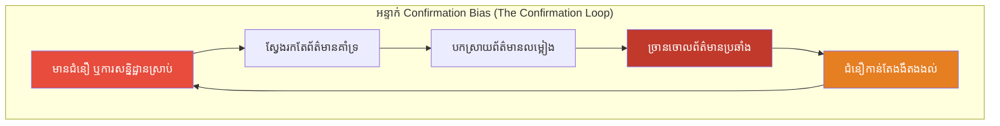
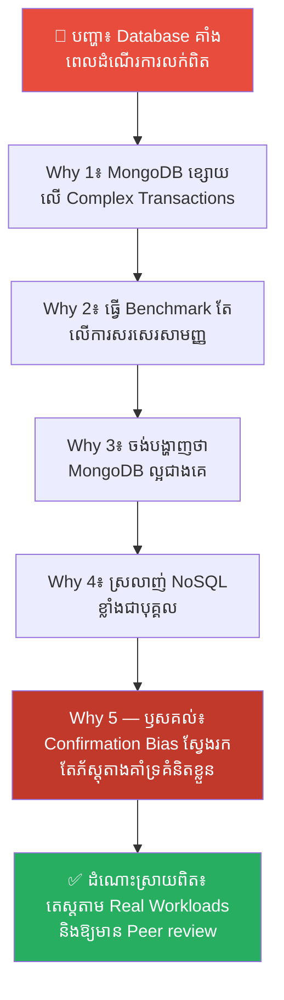
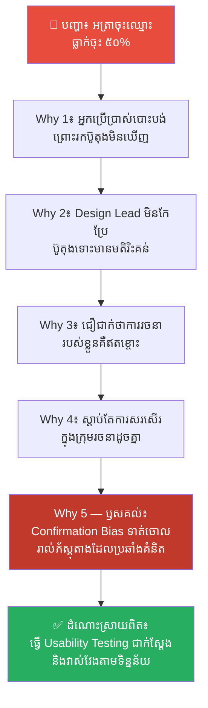
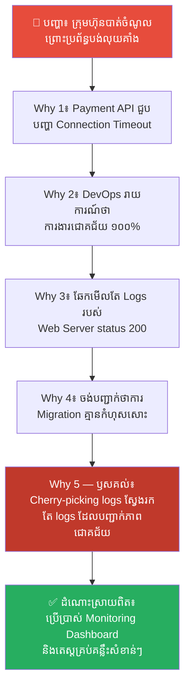
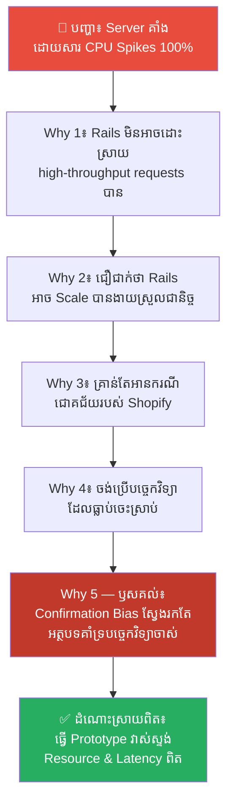
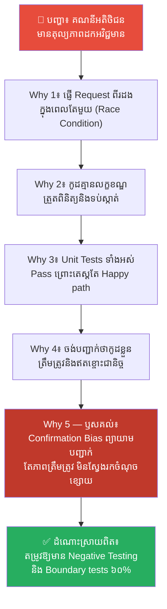

# Confirmation Bias: Why You Only See What You Already Believe (ហេតុអ្វីមនុស្សមើលឃើញតែអ្វីដែលខ្លួនចង់ជឿ?)

**Author:** ichamrong  
**Date:** 2026-05-18  
**Tags:** #confirmation-bias #psychology #cognitive-bias #mental-models #decision-making  
**Category:** Concepts  
**Read Time:** ~15 min  

---

> **ELI5 / ពន្យល់ដូចកុមារ៖** 
> ស្រមៃថាអ្នកគិតថាឆ្កែរបស់អ្នកជិតខាងកាចណាស់។ រាល់ពេលដែលឆ្កែនោះព្រុស អ្នកនឹងនិយាយថា "ឃើញទេ! ខ្ញុំថាកាចមែន!" ប៉ុន្តែនៅពេលដែលឆ្កែនោះស្ងៀមស្ងាត់ និងរាក់ទាក់ អ្នកបែរជាមិនចាប់អារម្មណ៍ ឬគិតថា "វាគ្រាន់តែធ្វើពុតទេ"។ អ្នកប្រមូលតែភ័ស្តុតាងណាដែលបញ្ជាក់ពីអ្វីដែលអ្នកជឿរួចទៅហើយ ហើយអ្នកបោះចោលភ័ស្តុតាងណាដែលមិនស្របតាមការគិតរបស់អ្នក។ មនុស្សយើងស្វែងរកភ័ស្តុតាងបញ្ជាក់គំនិតខ្លួនឯង មិនមែនដើម្បីស្វែងរកការពិតនោះទេ។

---

## 📌 មាតិកា (Table of Contents)
- [លំនាំបញ្ហា (The Pattern)](#លំនាំបញ្ហា-the-pattern)
- [១. បញ្ហា៖ អគតិនៃការបញ្ជាក់ និងការបិទភ្នែកមើលរំលងការពិត (The Issue: Confirmation Bias and Selective Perception)](#១-បញ្ហា-អគតិនៃការបញ្ជាក់-និងការបិទភ្នែកមើលរំលងការពិត-the-issue-confirmation-bias-and-selective-perception)
- [២. ឧទាហរណ៍ជាក់ស្តែងក្នុងពិភពពិត (Real World Examples)](#២-ឧទាហរណ៍ជាក់ស្តែងក្នុងពិភពពិត)
  - [ឧទាហរណ៍ទី ១ — កម្រិតស្រាល៖ ការជ្រើសរើសការវាស់ស្ទង់សមត្ថភាពលម្អៀង (Favorable Benchmark Selection)](#ឧទាហរណ៍ទី-១-កម្រិតស្រាល-ការជ្រើសរើសការវាស់ស្ទង់សមត្ថភាពលម្អៀង-favorable-benchmark-selection)
  - [ឧទាហរណ៍ទី ២ — កម្រិតមធ្យម (បច្ចេកទេស)៖ ការមើលរំលងមតិយោបល់របស់អ្នកប្រើប្រាស់ (Ignoring User Feedback)](#ឧទាហរណ៍ទី-២-កម្រិតមធ្យម-បច្ចេកទេស-ការមើលរំលងមតិយោបល់របស់អ្នកប្រើប្រាស់-ignoring-user-feedback)
  - [ឧទាហរណ៍ទី ៣ — កម្រិតមធ្យម (បច្ចេកទេស)៖ ការជ្រើសរើសមើលតែ Logs ដែលល្អ (Cherry-Picking Log Data)](#ឧទាហរណ៍ទី-៣-កម្រិតមធ្យម-បច្ចេកទេស-ការជ្រើសរើសមើលតែ-logs-ដែលល្អ-cherry-picking-log-data)
  - [ឧទាហរណ៍ទី ៤ — កម្រិតមធ្យម (បច្ចេកទេស)៖ ការជ្រើសរើសបច្ចេកវិទ្យាលម្អៀងតាមទម្លាប់ (Biased Tech Stack Choice)](#ឧទាហរណ៍ទី-៤-កម្រិតមធ្យម-បច្ចេកទេស-ការជ្រើសរើសបច្ចេកវិទ្យាលម្អៀងតាមទម្លាប់-biased-tech-stack-choice)
  - [ឧទាហរណ៍ទី ៥ — កម្រិតធ្ងន់៖ ការសរសេរតេស្តតែលើករណីជោគជ័យ (Testing Only Happy Paths)](#ឧទាហរណ៍ទី-៥-កម្រិតធ្ងន់-ការសរសេរតេស្តតែលើករណីជោគជ័យ-testing-only-happy-paths)
- [៣. កត្តាជម្រុញ៖ ពពុះតម្រង និងការការពារការយល់ឃើញផ្ទាល់ខ្លួន (The Aggravator: Filter Bubbles and Ego Protection)](#៣-កត្តាជម្រុញ-ពពុះតម្រង-និងការការពារការយល់ឃើញផ្ទាល់ខ្លួន-the-aggravator-filter-bubbles-and-ego-protection)
- [៤. ដំណោះស្រាយទូទៅ៖ របៀបបង្កើតវិធីសាស្ត្រគិតបែបវិទ្យាសាស្ត្រ (The General Solution: Establishing Scientific Falsification Method)](#៤-ដំណោះស្រាយទូទៅ-របៀបបង្កើតវិធីសាស្ត្រគិតបែបវិទ្យាសាស្ត្រ-the-general-solution-establishing-scientific-falsification-method)
- [សេចក្តីសន្និដ្ឋាន (Conclusion)](#សេចក្តីសន្និដ្ឋាន-conclusion)
- [ឯកសារយោង (References)](#ឯកសារយោង-references)
- [Related Posts](#related-posts)

---

## លំនាំបញ្ហា (The Pattern)

តើអ្នកធ្លាប់សម្រេចចិត្តជ្រើសរើសបច្ចេកវិទ្យា ឬវិធីសាស្ត្រសរសេរកូដមួយរួចហើយ ហើយចាប់ផ្តើមស្រាវជ្រាវលើ Google ដោយស្វែងរកតែពាក្យគន្លឹះដូចជា៖ *«ហេតុអ្វីបានជាបច្ចេកវិទ្យា A ល្អជាងគេ?»* ឬ *«គុណសម្បត្តិនៃបច្ចេកវិទ្យា A»* ដែរឬទេ? តើអ្នកធ្លាប់មើលរំលងអត្ថបទដែលសរសេរពីគុណវិបត្តិ ឬបញ្ហារបស់វា ដោយគ្រាន់តែគិតថាមតិទាំងនោះហួសសម័យ ឬខុសឆ្គងដែរឬទេ?

នៅក្នុងចិត្តសាស្ត្រ ទំនោរនៃការគិតបែបនេះត្រូវបានគេហៅថា **Confirmation Bias (អគតិនៃការចង់បានការបញ្ជាក់)**។ វាគឺជាអន្ទាក់ផ្លូវចិត្តដ៏គ្រោះថ្នាក់បំផុតមួយ ពីព្រោះ៖
* យើងប្រមូលតែព័ត៌មានដែលបញ្ជាក់ពីអ្វីដែលយើងបានជឿរួចទៅហើយ។
* យើងច្រានចោល ឬបកស្រាយព័ត៌មានណាដែលផ្ទុយពីការគិតរបស់យើង ឱ្យទៅជាខុសឆ្គងវិញ។
* វាធ្វើឱ្យយើងពិការភ្នែកចំពោះចន្លោះប្រហោងជាក់ស្តែងនៅក្នុងគម្រោង ឬប្រព័ន្ធបច្ចេកវិទ្យារបស់យើង។

នៅក្នុងពិភពស្ថាបត្យកម្មកម្មវិធី ការគិតដោយលម្អៀងបែបនេះអាចនាំទៅរកការសម្រេចចិត្តរើសយកបច្ចេកវិទ្យាខុស ធ្វើឱ្យប្រព័ន្ធទាំងមូលដួលរលំ និងខាតបង់ពេលវេលា និងថវិការាប់សែនដុល្លារ។

---

## ១. បញ្ហា៖ អគតិនៃការបញ្ជាក់ និងការបិទភ្នែកមើលរំលងការពិត (The Issue: Confirmation Bias and Selective Perception)

Confirmation Bias ត្រូវបានសិក្សាជាប្រព័ន្ធដំបូងគេបង្អស់ដោយអ្នកចិត្តវិទ្យាជនជាតិអង់គ្លេសលោក **Peter Wason** នៅក្នុងឆ្នាំ ១៩៦០ តាមរយៈការសាកល្បងដ៏ល្បីល្បាញហៅថា **2-4-6 Task**។ 

គាត់បានប្រាប់អ្នកចូលរួមថា លេខតម្រៀបគ្នា «២, ៤, ៦» គឺបង្កើតឡើងតាមច្បាប់សម្ងាត់មួយ។ អ្នកចូលរួមត្រូវរកឱ្យឃើញថាច្បាប់នោះជាអ្វី ដោយការសាកល្បងបង្កើតលេខ ៣ ខ្ទង់ផ្ទាល់ខ្លួន រួចសួរអ្នកស្រាវជ្រាវថា តើវាត្រូវនឹងច្បាប់នោះឬអត់។

អ្នកចូលរួមភាគច្រើនបានសន្និដ្ឋានយ៉ាងលឿនថា ច្បាប់នោះគឺ «លេខគូកើនឡើងម្តង ២ លេខ»។ ដូច្នេះ ពួកគេបានសាកល្បងតែលេខដែលគាំទ្រសម្មតិកម្មនេះ ដូចជា៖
* ៨, ១០, ១២ → ឆ្លើយថា "ត្រូវ"
* ២០, ២២, ២៤ → ឆ្លើយថា "ត្រូវ"

ពួកគេមានទំនុកចិត្តយ៉ាងខ្លាំង និងបានប្រកាសថា ច្បាប់នោះគឺ «លេខគូកើនឡើងម្តង ២ លេខ»។ 

**ប៉ុន្តែពួកគេខុសហើយ!** ច្បាប់សម្ងាត់ពិតប្រាកដគឺសាមញ្ញបំផុត៖ **«គ្រាន់តែជាលេខ ៣ ខ្ទង់ដែលកើនឡើង (Any three ascending numbers)»**។ ដូច្នេះ លេខ «១, ២, ៣» ឬ «៥, ១៩, ៣៤៧» ក៏ត្រូវនឹងច្បាប់នេះដែរ។ 

អ្វីដែលគួរឱ្យរន្ធត់នោះគឺ ស្ទើរតែគ្មានអ្នកចូលរួមណាម្នាក់ សាកល្បងទាយលេខដែល *ផ្ទុយ (Disprove)* ពីជំនឿរបស់ពួកគេឡើយ (ឧទាហរណ៍ដូចជាសាកល្បងទាយលេខ «៥, ៣, ១» ឬ «១, ៣, ៥» ដើម្បីមើលថាតើច្បាប់នោះខុសឬអត់)។ ពួកគេសាកល្បងតែលេខដែលបញ្ជាក់ជំនឿចាស់របស់ពួកគេប៉ុណ្ណោះ។

នៅក្នុងវិស្វកម្មកម្មវិធី យើងតែងតែធ្វើការសាកល្បង «2-4-6» មកលើកូដ និងប្រព័ន្ធរបស់យើងជារៀងរាល់ថ្ងៃ។ យើងសរសេរតេស្តដែលយើងដឹងថាវាប្រាកដជាដើររលូន (Happy Paths) ដើម្បីបញ្ជាក់ថាកូដរបស់យើងដំណើរការបានល្អ តែយើងមិនព្រមតេស្តករណីដែលវាអាចនឹងខុសឆ្គង (Edge Cases) ឡើយ។

---

## ២. ឧទាហរណ៍ជាក់ស្តែងក្នុងពិភពពិត

នេះជា **ឧទាហរណ៍ជាក់ស្តែងចំនួន ៥** បង្ហាញពីការបំផ្លិចបំផ្លាញនៃ Confirmation Bias នៅក្នុងពិភពបច្ចេកវិទ្យា និងរបៀបដោះស្រាយ៖

---

### ឧទាហរណ៍ទី ១ — កម្រិតស្រាល៖ ការជ្រើសរើសការវាស់ស្ទង់សមត្ថភាពលម្អៀង (Favorable Benchmark Selection)

**ស្ថានភាព (Situation)៖** ក្រុមហ៊ុនចង់ជ្រើសរើសប្រព័ន្ធផ្ទុកទិន្នន័យ (Database Engine) ថ្មីមួយសម្រាប់គម្រោងលក់ទំនិញអនឡាញដែលមានចរាចរណ៍ខ្ពស់។

**សកម្មភាពខុសឆ្គង (Wrong Action)៖** វិស្វករម្នាក់ដែលចូលចិត្ត MongoDB ខ្លាំង បានធ្វើតេស្តវាស់ល្បឿន (Benchmark) ដោយប្រើប្រាស់តែសំណួរងាយៗដូចជាការសរសេរទិន្នន័យសាមញ្ញ (Simple Write Queries) និងមិនដាក់ Indexes ហើយចង្អុលបង្ហាញថាលទ្ធផល MongoDB លឿនជាង PostgreSQL ដល់ទៅ ៥ ដង ដោយសម្រេចចិត្តថា MongoDB គឺជាជម្រើសដ៏ល្អបំផុតសម្រាប់គម្រោងទាំងមូល។

**ការវិភាគបែប 5 Whys៖**

| # | សំណួរ (Why?) | ចម្លើយ (Answer) |
|---|---|---|
| 1 | ហេតុអ្វីបានជា Database ជួបបញ្ហាយឺត និងជាប់គាំង (Locking) ខ្លាំងនៅពេលដាក់ដំណើរការការលក់ពិតប្រាកដ? | ពីព្រោះប្រព័ន្ធត្រូវការប្រើប្រាស់សំណួរស្មុគស្មាញ (Complex Joins) និង ACID Transactions ដែល MongoDB មិនសូវមានប្រសិទ្ធភាពក្នុងការដោះស្រាយសម្រាប់ករណីនេះ។ |
| 2 | ហេតុអ្វីបានជាលទ្ធផល Benchmark ពីមុនបង្ហាញថា MongoDB លឿនខ្លាំង? | ពីព្រោះការធ្វើ Benchmark នោះ តេស្តតែទៅលើការសរសេរឯកសារសាមញ្ញ (Single Write Operations) ដោយគ្មាន Joint Tables ឡើយ។ |
| 3 | ហេតុអ្វីបានជាធ្វើតេស្តតែលើករណីសរសេរសាមញ្ញ ដោយមិនតេស្តករណី ACID Transactions ស្មុគស្មាញ? | ពីព្រោះវិស្វករចង់បង្ហាញថា MongoDB គឺជាជម្រើសដ៏ល្អ និងលឿនបំផុត។ |
| 4 | ហេតុអ្វីបានជាគាត់ចង់បង្ហាញថា MongoDB ល្អបំផុត ដោយមិនខ្វល់ពីករណីប្រើប្រាស់ពិត? | ពីព្រោះគាត់មានការពេញចិត្ត និងស្រលាញ់ NoSQL (MongoDB) រួចទៅហើយ ហើយគាត់ចង់ប្រើវាសម្រាប់គ្រប់គម្រោង។ |
| 5 | ហេតុអ្វីបានជាការពេញចិត្តផ្ទាល់ខ្លួន នាំឱ្យការធ្វើតេស្តលម្អៀងយ៉ាងធ្ងន់ធ្ងរ? | **ពីព្រោះការធ្លាក់ចូលទៅក្នុងអន្ទាក់ «Confirmation Bias» ដែលនាំឱ្យគាត់ស្វែងរក និងបង្កើតតែភ័ស្តុតាងគាំទ្រជំនឿរបស់ខ្លួន (MongoDB លឿន) ហើយមើលរំលងភ័ស្តុតាងផ្ទុយ (MongoDB ខ្សោយលើ Complex Transactions)។** |

**ដំណោះស្រាយពិតប្រាកដ៖** កំណត់ឱ្យមានការរៀបចំសេណារីយ៉ូតេស្ត Benchmark ឱ្យត្រូវនឹងករណីប្រើប្រាស់ពិតប្រាកដ (Real Production Workloads) រួមទាំង Complex Joins និង concurrent read/write ខ្ពស់។ ត្រូវឱ្យមានការចូលរួមពីវិស្វករផ្សេងទៀតដែលមានគំនិតផ្ទុយ ដើម្បីត្រួតពិនិត្យភាពសុក្រឹតនៃការធ្វើតេស្ត។

---

### ឧទាហរណ៍ទី ២ — កម្រិតមធ្យម (បច្ចេកទេស)៖ ការមើលរំលងមតិយោបល់របស់អ្នកប្រើប្រាស់ (Ignoring User Feedback)

**ស្ថានភាព (Situation)៖** ក្រុមការងារបានរចនា និងបញ្ចេញប្រព័ន្ធចុះឈ្មោះប្រើប្រាស់ថ្មីមួយសម្រាប់កម្មវិធីទូរស័ព្ទរបស់ក្រុមហ៊ុន។

**សកម្មភាពខុសឆ្គង (Wrong Action)៖** បន្ទាប់ពីដាក់ឱ្យប្រើប្រាស់ អតិថិជនជាច្រើនបានផ្ញើមតិរិះគន់ថា "កម្មវិធីប្រើប្រាស់ពិបាកយល់ និងមិនដឹងថាត្រូវចុចកន្លែងណា"។ អ្នកដឹកនាំរចនា (Design Lead) បានទាត់ចោលមតិយោបល់ទាំងនោះ ដោយនិយាយថា "នេះជាកំហុសរបស់អ្នកប្រើប្រាស់ (User Error) ពួកគេមិនចេះប្រើបច្ចេកវិទ្យាទំនើប គំនូររចនារបស់យើងគឺល្អឥតខ្ចោះ និងសាមញ្ញរួចទៅហើយ"។

**ការវិភាគបែប 5 Whys៖**

| # | សំណួរ (Why?) | ចម្លើយ (Answer) |
|---|---|---|
| 1 | ហេតុអ្វីបានជាអត្រាចុះឈ្មោះប្រើប្រាស់ (Conversion Rate) ធ្លាក់ចុះរហូតដល់ទៅ ៥០%? | ពីព្រោះអ្នកប្រើប្រាស់ជាច្រើនបានបោះបង់ចោលកណ្តាលទី អំឡុងពេលចុះឈ្មោះ។ |
| 2 | ហេតុអ្វីបានជាពួកគេបោះបង់ចោលទាំងដែលពួកគេចង់ប្រើកម្មវិធី? | ពីព្រោះប៊ូតុងចុះឈ្មោះត្រូវបានរចនាលាក់ក្នុងម៉ឺនុយ ដែលធ្វើឱ្យពួកគេស្វែងរកមិនឃើញ។ |
| 3 | ហេតុអ្វីបានជា Design Lead មិនកែប្រែប៊ូតុងនោះ ទោះបីជាមានមតិរិះគន់ជាច្រើន? | ពីព្រោះគាត់ជឿជាក់យ៉ាងមុតមាំថា ការរចនារបស់គាត់គឺស្រស់ស្អាត ទំនើប និងគ្មានកំហុស។ |
| 4 | ហេតុអ្វីបានជាគាត់ជឿជាក់បែបនោះ ទាំងដែលមានទិន្នន័យជាក់ស្តែងបង្ហាញពីបញ្ហា? | ពីព្រោះគាត់ផ្តោតតែទៅលើការសរសើរពីសមាជិកក្រុមរចនាដូចគ្នា (Echo Chamber) ហើយចាត់ទុកមតិរិះគន់ពីអតិថិជនថាជាសំឡេងរំខាន។ |
| 5 | ហេតុអ្វីបានជាការផ្តោតតែលើមតិគាំទ្រ បង្កជាមហន្តរាយដល់អាជីវកម្ម? | **ពីព្រោះការធ្លាក់ក្នុងអន្ទាក់ Confirmation Bias ដែលធ្វើឱ្យគាត់បកស្រាយព័ត៌មានតាមរបៀបដែលបញ្ជាក់ពីជំនឿរបស់ខ្លួន (ការរចនារបស់យើងល្អ) និងច្រានចោលរាល់ភ័ស្តុតាងដែលផ្ទុយពីគំនិតរបស់ខ្លួន។** |

**ដំណោះស្រាយពិតប្រាកដ៖** អនុវត្តការធ្វើតេស្តលទ្ធភាពប្រើប្រាស់ (Usability Testing) ជាក់ស្តែងជាមួយអ្នកប្រើប្រាស់ពិត និងតាមដានទិន្នន័យដោយប្រើប្រាស់ឧបករណ៍ (ដូចជា Hotjar ឬ Google Analytics)។ បង្កើតវប្បធម៌ការងារដែលឱ្យតម្លៃលើទិន្នន័យជាក់ស្តែង (Data-Driven) ជាងមតិផ្ទាល់ខ្លួនរបស់សមាជិកក្រុម។

---

### ឧទាហរណ៍ទី ៣ — កម្រិតមធ្យម (បច្ចេកទេស)៖ ការជ្រើសរើសមើលតែ Logs ដែលល្អ (Cherry-Picking Log Data)

**ស្ថានភាព (Situation)៖** ក្រុម DevOps ទើបតែបញ្ចប់ការផ្លាស់ប្តូរប្រព័ន្ធទិន្នន័យ (Database Migration) ដ៏ធំមួយទៅកាន់ Cloud Server ថ្មី។

**សកម្មភាពខុសឆ្គង (Wrong Action)៖** ដើម្បីរាយការណ៍ទៅកាន់ប្រធានក្រុមហ៊ុនថាការផ្ទេរទិន្នន័យទទួលបានជោគជ័យ ១០០% វិស្វករ DevOps ម្នាក់បានឆែកមើលតែ Logs របស់ Services ធំៗដែលដំណើរការធម្មតា និងមិនព្រមឆែកមើល Logs របស់ប្រព័ន្ធទូទាត់លុយ (Payment Service) ដែលកំពុងមានបញ្ហា error connection ឡើយ ព្រោះគាត់គិតថា "ការផ្ទេរគឺជោគជ័យហើយ បញ្ហា Payments អាចគ្រាន់តែជាការរអាក់រអួលបណ្តោះអាសន្ន"។

**ការវិភាគបែប 5 Whys៖**

| # | សំណួរ (Why?) | ចម្លើយ (Answer) |
|---|---|---|
| 1 | ហេតុអ្វីបានជាក្រុមហ៊ុនបាត់បង់ប្រាក់ចំណូលរាប់ពាន់ដុល្លារបន្ទាប់ពីការផ្លាស់ប្តូរ Server? | ពីព្រោះអតិថិជនមិនអាចទូទាត់លុយបានសោះ ដោយសារ Payment API Migration ជួបបញ្ហា Connection Timeout។ |
| 2 | ហេតុអ្វីបានជាបញ្ហានេះមិនត្រូវបានរកឃើញភ្លាមៗបន្ទាប់ពី Migration រួចរាល់? | ពីព្រោះក្រុម DevOps បានរាយការណ៍ថាការងារបានជោគជ័យ ១០០% ដោយគ្មានបញ្ហាអ្វីឡើយ។ |
| 3 | ហេតុអ្វីបានជាពួកគេរាយការណ៍ថាគ្មានបញ្ហា ទាំងដែលប្រព័ន្ធទូទាត់លុយដួលរលំ? | ពីព្រោះពួកគេបានឆែកមើលតែ Logs របស់ Web Server ដែលឆ្លើយតប status 200 (Success)។ |
| 4 | ហេតុអ្វីបានជាពួកគេឆែកមើលតែ Logs status 200 ហើយមិនឆែកមើលកន្លែងផ្សេង? | ពីព្រោះពួកគេចង់បញ្ជាក់ថា ការធ្វើចំណាកស្រុក (Migration) របស់ពួកគេគឺទទួលបានជោគជ័យ គ្មានការខុសឆ្គង។ |
| 5 | ហេតុអ្វីបានជាចង់បញ្ជាក់ពីភាពជោគជ័យ រហូតដល់មើលរំលងកំហុសជាក់ស្តែង? | **ពីព្រោះការជ្រើសរើសមើលតែភ័ស្តុតាងដែលស្របតាមអ្វីដែលខ្លួនរំពឹងទុក (Cherry-picking logs) ដើម្បីការពារខ្លួនពីការទទួលខុសត្រូវ និងអំនួតនៃភាពជោគជ័យ (Confirmation Bias)។** |

**ដំណោះស្រាយពិតប្រាកដ៖** បង្កើត Dashboard ត្រួតពិនិត្យប្រព័ន្ធស្វ័យប្រវត្តិ (Automated Monitoring & Alerting ដូចជា Prometheus/Grafana) ដែលតាមដានរាល់កំហុស (Error Rates) ឆ្លងកាត់គ្រប់ Services ទាំងអស់។ ត្រូវមានបញ្ជីផ្ទៀងផ្ទាត់ (Post-migration Checklist) ជាក់លាក់ដែលតម្រូវឱ្យតេស្តរាល់មុខងារសំខាន់ៗទាំងអស់ មុននឹងប្រកាសថាជោគជ័យ។

---

### ឧទាហរណ៍ទី ៤ — កម្រិតមធ្យម (បច្ចេកទេស)៖ ការជ្រើសរើសបច្ចេកវិទ្យាលម្អៀងតាមទម្លាប់ (Biased Tech Stack Choice)

**ស្ថានភាព (Situation)៖** ក្រុមហ៊ុនចង់បង្កើតប្រព័ន្ធវិភាគទិន្នន័យដ៏ធំធេងមួយ (Real-time Analytics System) ដើម្បីតាមដានឥរិយាបថបុគ្គលិកលើវិបសាយ។

**សកម្មភាពខុសឆ្គង (Wrong Action)៖** ក្រុមការងារបានសម្រេចចិត្តប្រើប្រាស់ Ruby on Rails ព្រោះពួកគេធ្លាប់ប្រើវាជាច្រើនឆ្នាំ និងស៊ាំជាមួយវាខ្លាំង ដោយជឿជាក់ថាវាអាចរៀបចំ និងរត់បានលឿនបំផុត ទោះបីជាមានការព្រមានពីអ្នកជំនាញថា Ruby on Rails មិនមែនជាជម្រើសល្អសម្រាប់ដោះស្រាយ High-throughput real-time data ingestion ដូចជា Go, Rust, ឬ Node.js ឡើយ។

**ការវិភាគបែប 5 Whys៖**

| # | សំណួរ (Why?) | ចម្លើយ (Answer) |
|---|---|---|
| 1 | ហេតុអ្វីបានជា Server ជួបបញ្ហាគាំង និងដួលរលំជាញឹកញាប់ដោយសារ CPU Spikes 100%? | ពីព្រោះ Rails Framework មិនអាចដោះស្រាយ requests រាប់ម៉ឺនក្នុងមួយវិនាទីដែលបាញ់ចូលមកក្នុងពេលតែមួយបានយ៉ាងលឿនឡើយ។ |
| 2 | ហេតុអ្វីបានជាជ្រើសរើស Rails តាំងពីដំបូងសម្រាប់ករណីប្រើប្រាស់នេះ? | ពីព្រោះក្រុមការងារជឿជាក់ថា Rails គឺជា Framework ល្អបំផុត និងអាចពង្រីក (Scale) បានងាយស្រួលគ្រប់កម្រិតការងារ។ |
| 3 | ហេតុអ្វីបានជាជឿថាក្រុមហ៊ុនអាច Scale Rails បានងាយស្រួល ទាំងដែលមិនធ្លាប់ធ្វើពីមុន? | ពីព្រោះពួកគេបានអានតែអត្ថបទអំពីរបៀបដែល Shopify ប្រើប្រាស់ Rails សម្រាប់លក់ទំនិញរាប់លាន។ |
| 4 | ហេតុអ្វីបានជាពួកគេផ្តោតតែលើករណីជោគជ័យរបស់ Shopify ហើយមិនខ្វល់ពីករណីបរាជ័យរបស់ក្រុមហ៊ុនផ្សេងទៀត? | ពីព្រោះពួកគេចង់ប្រើប្រាស់បច្ចេកវិទ្យាដែលពួកគេស្គាល់ស្រាប់ (ទម្លាប់ចាស់) និងព្យាយាមស្វែងរកតែព័ត៌មានគាំទ្រដើម្បីការពារការសម្រេចចិត្តរបស់ពួកគេ។ |
| 5 | ហេតុអ្វីបានជាការការពារការសម្រេចចិត្តចាស់ នាំឱ្យខាតបង់ថវិកា និងពេលវេលា? | **ពីព្រោះការធ្លាក់ក្នុងអន្ទាក់ Confirmation Bias ដែលធ្វើឱ្យក្រុមការងារបកស្រាយព័ត៌មានលម្អៀង ដើម្បីរក្សាសុវត្ថិភាពផ្លូវចិត្ត (Comfort Zone) ក្នុងការប្រើប្រាស់បច្ចេកវិទ្យាដែលខ្លួនចេះស្រាប់។** |

**ដំណោះស្រាយពិតប្រាកដ៖** រៀបចំដំណើរការវាយតម្លៃបច្ចេកវិទ្យាដាច់ដោយឡែក (Technology Evaluation Process) ដោយការបង្កើត Prototype តូចៗនៅលើបច្ចេកវិទ្យាផ្សេងគ្នា និងវាស់ស្ទង់ Resource Usage, Latency, និង Throughput ជាក់ស្តែង មុននឹងសម្រេចចិត្តរើសយកបច្ចេកវិទ្យាណាមួយ។

---

### ឧទាហរណ៍ទី ៥ — កម្រិតធ្ងន់៖ ការសរសេរតេស្តតែលើករណីជោគជ័យ (Testing Only Happy Paths)

**ស្ថានភាព (Situation)៖** វិស្វករកម្មវិធីម្នាក់ត្រូវបានតម្រូវឱ្យសរសេរ Unit Tests សម្រាប់មុខងារផ្ទេរប្រាក់រវាងគណនីធនាគារ (Fund Transfer Function)។

**សកម្មភាពខុសឆ្គង (Wrong Action)៖** គាត់បានសរសេរតេស្តចំនួន ១០ ដែលសុទ្ធតែជាករណីទទួលបានជោគជ័យ (Happy Paths) ដូចជា៖ ផ្ទេរលុយត្រឹមត្រូវ គណនីមានប្រភពលុយគ្រប់គ្រាន់ និងលេខគណនីត្រឹមត្រូវ រួចហើយគាត់បានប្រកាសថា "មុខងារនេះត្រូវបានតេស្តរួចរាល់ និងមានសុវត្ថិភាព ១០០% គ្មានកំហុសសូម្បីតែបន្តិចឡើយ"។

**ការវិភាគបែប 5 Whys៖**

| # | សំណួរ (Why?) | ចម្លើយ (Answer) |
|---|---|---|
| 1 | ហេតុអ្វីបានជាប្រព័ន្ធធនាគារជួបបញ្ហាគណនីអតិថិជនមានតុល្យភាពដក (Negative Balance) នៅពេលដាក់ឱ្យដំណើរការ? | ពីព្រោះអតិថិជនបានផ្ញើ Request ផ្ទេរលុយពីរដងក្នុងពេលតែមួយ (Race Condition) ឬបញ្ចូលចំនួនលុយជាអវិជ្ជមាន (Negative Amount)។ |
| 2 | ហេតុអ្វីបានជាមុខងារនេះអនុញ្ញាតឱ្យផ្ទេរលុយអវិជ្ជមាន ឬដកលើសតុល្យភាព? | ពីព្រោះនៅក្នុងកូដមិនមានលក្ខខណ្ឌត្រвутពិនិត្យ និងទប់ស្កាត់ករណីទាំងនេះឡើយ។ |
| 3 | ហេតុអ្វីបានជា Unit Tests ទាំងអស់ឆ្លងកាត់ (Pass) ដោយជោគជ័យ និងមិនរកឃើញកំហុសនេះ? | ពីព្រោះតេស្តទាំងអស់ដែលបានសរសេរ គឺសាកល្បងតែទៅលើការផ្ញើចំនួនលុយវិជ្ជមានត្រឹមត្រូវប៉ុណ្ណោះ។ |
| 4 | ហេតុអ្វីបានជាវិស្វករសរសេរតេស្តតែលើករណីជោគជ័យ ដោយមិនសរសេរករណីខុសឆ្គង? | ពីព្រោះគាត់ចង់បញ្ជាក់ថា កូដដែលគាត់សរសេរគឺត្រឹមត្រូវ និងដំណើរការបានល្អឥតខ្ចោះ។ |
| 5 | ហេតុអ្វីបានជាចង់បញ្ជាក់ភាពល្អឥតខ្ចោះ នាំឱ្យមើលរំលងការបែកធ្លាយប្រព័ន្ធ? | **ពីព្រោះការធ្លាក់ក្នុងអន្ទាក់ Confirmation Bias ដែលធ្វើឱ្យអ្នកសរសេរតេស្ត ព្យាយាមរកវិធីបញ្ជាក់ថាគំនិតរបស់ខ្លួនគឺ «ត្រូវ» ជាជាងការព្យាយាមស្វែងរកវិធីបដិសេធ ឬវាយបំបែកកូដ (Disprove) ដើម្បីស្វែងរកចំណុចខ្សោយ។** |

**ដំណោះស្រាយពិតប្រាកដ៖** អនុវត្តគោលការណ៍តេស្តឱ្យបានគ្រប់ជ្រុងជ្រោយ (Negative Testing & Boundary Testing) ដែលតម្រូវឱ្យសរសេរតេស្តសម្រាប់ករណីខុសឆ្គង (Error Cases, Invalid Inputs, Edge Cases) យ៉ាងហោចណាស់ ៦០% នៃចំនួនតេស្តសរុប។ លើកទឹកចិត្តឱ្យមានការធ្វើតេស្តដោយអ្នកដទៃ (QA / Peer Testing) ដើម្បីចៀសវាងការលម្អៀងរបស់អ្នកសរសេរកូដផ្ទាល់។

---

## ៣. កត្តាជម្រុញ៖ ពពុះតម្រង និងការការពារការយល់ឃើញផ្ទាល់ខ្លួន (The Aggravator: Filter Bubbles and Ego Protection)

ហេតុអ្វីបានជាមនុស្សឆ្លាតៗ និងវិស្វករពូកែៗនៅតែធ្លាក់ចូលទៅក្នុងអន្ទាក់នៃ Confirmation Bias យ៉ាងងាយស្រួល?

**ពពុះតម្រងបណ្តាញសង្គម និង Google Algorithm (Filter Bubbles)៖**  
រាល់ពេលដែលយើងស្វែងរកព័ត៌មាននៅលើ Google ឬអានព័ត៌មានលើបណ្តាញសង្គម Algorithms តែងតែចងចាំទម្លាប់ និងចំណូលចិត្តរបស់យើង។ ប្រសិនបើអ្នកឧស្សាហ៍អានអត្ថបទដែលសរសើរពី Mac និងរិះគន់ Windows នោះ Google នឹងបង្ហាញអត្ថបទសរសើរពី Mac ឱ្យអ្នកឃើញកាន់តែច្រើន។ នេះបង្កើតជា «ពពុះតម្រង» ដែលធ្វើឱ្យយើងលឺតែសំឡេងឯកភាព និងកាត់ផ្តាច់ព័ត៌មានដែលផ្ទុយពីគំនិតរបស់យើងទាំងស្រុង។

**ការការពារអំនួត និងអត្តសញ្ញាណរបស់ខ្លួន (Ego Protection)៖**  
ការទទួលស្គាល់ថា «ការសម្រេចចិត្តរបស់យើងគឺខុស» ឬ «បច្ចេកវិទ្យាដែលយើងស្រលាញ់ និងខំរៀនជាច្រើនឆ្នាំ មានបញ្ហាខ្សោយ» គឺជាការឈឺចាប់ផ្លូវចិត្តយ៉ាងខ្លាំង។ ដើម្បីចៀសវាងការឈឺចាប់ និងអារម្មណ៍មិនល្អនេះ (Cognitive Dissonance) ខួរក្បាលរបស់យើងនឹងបង្កើតយន្តការការពារខ្លួនដោយស្វ័យប្រវត្ត ដោយការបដិសេធមិនទទួលយកការពិត និងស្វែងរកតែហេតុផលមកគាំទ្រខ្លួនឯងដដែលៗ។

---

## ៤. ដំណោះស្រាយទូទៅ៖ របៀបបង្កើតវិធីសាស្ត្រគិតបែបវិទ្យាសាស្ត្រ (The General Solution: Establishing Scientific Falsification Method)

ដើម្បីប្រយុទ្ធប្រឆាំងនឹង Confirmation Bias នៅក្នុងខ្លួនឯង និងក្នុងក្រុមការងារ សូមអនុវត្តតាមគោលការណ៍ស្នូលទាំងនេះ៖

### ១. អនុវត្តវិធីសាស្ត្រ «ស្វែងរកភ័ស្តុតាងបដិសេធ» (Falsification Method)
ឈប់សួរសំណួរថា៖ *«តើព័ត៌មានអ្វីខ្លះដែលបញ្ជាក់ថាខ្ញុំត្រូវ?»* ផ្ទុយទៅវិញ ត្រូវសួរសំណួរថា៖ *«តើភ័ស្តុតាងអ្វីខ្លះដែលអាចបង្ហាញថាខ្ញុំខុស?»* ឬ *«តើធ្វើដូចម្តេចដើម្បីឱ្យកូដ ឬគម្រោងនេះបរាជ័យ?»*។ នៅក្នុងវិទ្យាសាស្ត្រ ទ្រឹស្តីមួយត្រូវបានគេចាត់ទុកថាត្រឹមត្រូវ លុះត្រាតែវាឆ្លងកាត់ការប៉ុនប៉ងបំផ្លាញ ឬបដិសេធជាច្រើនលើកតែមិនបានសម្រេច។

### ២. បង្កើតតួនាទី «អ្នកជំទាស់ស្ថាបនា» (Devil's Advocate)
នៅក្នុងកិច្ចប្រជុំសម្រេចចិត្តសំខាន់ៗ ត្រូវតែងតាំងសមាជិកក្រុមម្នាក់ឱ្យដើរតួជា Devil's Advocate ដែលមានតួនាទីពិសេសក្នុងការស្វែងរកចំណុចខ្សោយ គុណវិបត្តិ និងហានិភ័យនៃរាល់សំណើ ឬការសម្រេចចិត្តរបស់ក្រុម។ ការធ្វើបែបនេះ ជួយឱ្យក្រុមការងារមើលឃើញបញ្ហាពីចំណុចផ្ទុយ។

### ៣. ប្រើប្រាស់យុទ្ធសាស្ត្រ Steel Man (ស្ថាបនាមតិផ្ទុយឱ្យខ្លាំងជាងមុន)
មុនពេលដែលអ្នកច្រានចោលគំនិតរបស់នរណាម្នាក់ ឬបច្ចេកវិទ្យាណាដែលអ្នកមិនចូលចិត្ត ចូរព្យាយាមសរសេរហេតុផលគាំទ្រគំនិតនោះឱ្យបានល្អ និងខ្លាំងបំផុត (សូម្បីតែខ្លាំងជាងម្ចាស់គំនិតដើមទៅទៀត)។ នៅពេលដែលអ្នកយល់ដឹងពីគុណសម្បត្តិរបស់វាអស់ហើយ ទើបការបដិសេធរបស់អ្នកមានតម្លៃ និងផ្អែកលើហេតុផលពិតប្រាកដ។

### ៤. កសាងវប្បធម៌ការងារផ្អែកលើទិន្នន័យ (Data-Driven Culture)
ចៀសវាងការសម្រេចចិត្តដោយផ្អែកលើ «អារម្មណ៍» ឬ «ឋានៈការងារ»។ ត្រូវកំណត់ឱ្យមានទិន្នន័យវាស់ស្ទង់ជាក់ស្តែង និងមិនលម្អៀង (Metrics, Analytics, User Logs) ដើម្បីធ្វើជាគោលបង្អែកក្នុងការវាយតម្លៃការងារ។

---

## សេចក្តីសន្និដ្ឋាន (Conclusion)

Confirmation Bias គឺជាសត្រូវដ៏ស្ងៀមស្ងាត់ដែលបំផ្លាញភាពសុក្រឹតនៃការសម្រេចចិត្តរបស់យើងជារៀងរាល់ថ្ងៃ។ កម្លាំងនៃជំនឿរបស់អ្នក មិនគួរវាស់វែងដោយចំនួនភ័ស្តុតាងដែលអ្នកមានដើម្បីគាំទ្រវានោះទេ ប៉ុន្តែគួរវាស់វែងដោយទំហំនៃការប្រឹងប្រែងរបស់អ្នក ក្នុងការព្យាយាមស្វែងរកភ័ស្តុតាងមកទាត់ចោលវា។

ចូរកម្ចាត់ចោលអត្តនោម័ត និងភាពលម្អៀងនៅក្នុងការងារបច្ចេកវិទ្យា។ ផ្លាស់ប្តូរមកគិតបែបវិទ្យាសាស្ត្រ ដោយព្យាយាមស្វែងរកចំណុចខ្សោយផ្ទាល់ខ្លួន ស្វាគមន៍មតិរិះគន់ និងសរសេរតេស្តវាយបំបែកកូដខ្លួនឯងជានិច្ច។ នេះគឺជាវិថីតែមួយគត់ដើម្បីសាងសង់ប្រព័ន្ធបច្ចេកវិទ្យាដ៏អស្ចារ្យ ដែលមានសុវត្ថិភាពខ្ពស់ ស្ថិរភាព និងគ្មានចំណុចខ្វះខាតដែលមើលមិនឃើញឡើយ។

---

## ឯកសារយោង (References)

1. **Wason, P. C. (1960).** *On the Failure to Eliminate Hypotheses in a Conceptual Task.* Quarterly Journal of Experimental Psychology.
2. **Nickerson, R. S. (1998).** *Confirmation Bias: A Ubiquitous Phenomenon in Many Guises.* Review of General Psychology.
3. **Lord, C. G., Ross, L., & Lepper, M. R. (1979).** *Biased Assimilation and Attitude Polarization: The Effects of Prior Theories on Subsequently Considered Evidence.* Journal of Personality and Social Psychology.
4. **Pariser, E. (2011).** *The Filter Bubble: What the Internet Is Hiding from You.* Penguin Press.

---

## Related Posts

* **[71 Kodak and the Digital Blindness](../parables/71-kodak-and-the-digital-blindness.md)** — អានសាច់រឿងព្រេង (Parable) ពេញលេញ អំពីក្រុមហ៊ុនកូដាក ដែលបិទភ្នែកមើលរំលងកាមេរ៉ាឌីជីថល។

---

*Last updated: 2026-05-18*
