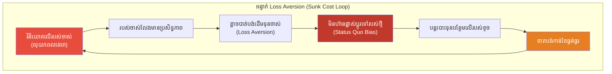
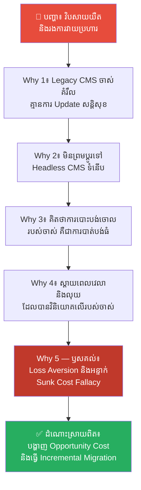
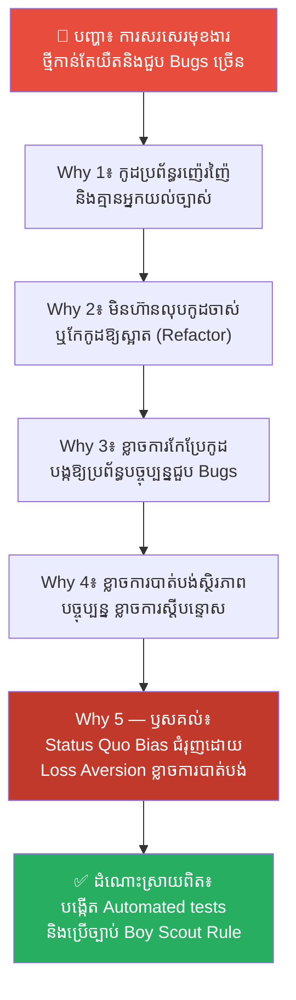
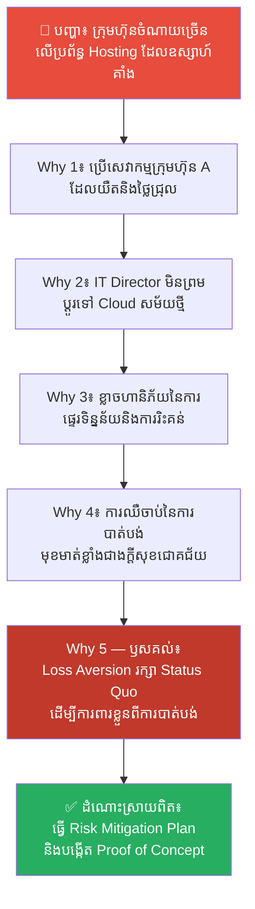
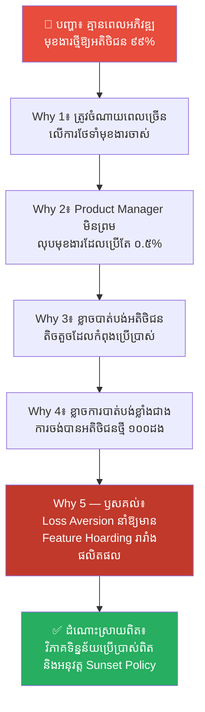
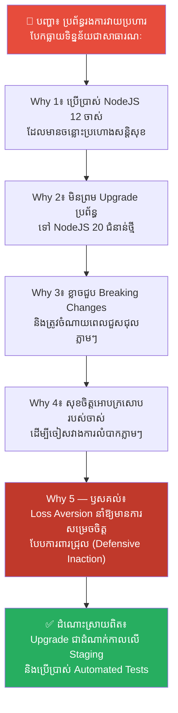

# Loss Aversion: Why Losing $100 Hurts More Than Gaining $200 (ហេតុអ្វីការបាត់បង់ ឈឺចាប់ជាងការទទួលបាន?)

**Author:** ichamrong  
**Date:** 2026-05-18  
**Tags:** #loss-aversion #psychology #cognitive-bias #behavioral-economics #decision-making  
**Category:** Concepts  
**Read Time:** ~15 min  

---

> **ELI5 / ពន្យល់ដូចកុមារ៖** 
> ស្រមៃថាអ្នករើសបានលុយ ១០ ដុល្លារនៅតាមផ្លូវ — អ្នកមានអារម្មណ៍សប្បាយចិត្ត។ ឥឡូវស្រមៃថា អ្នកមានលុយ ១០ ដុល្លារនៅក្នុងហោប៉ៅ ហើយវាជ្រុះបាត់ — អ្នកមានអារម្មណ៍ថាសោកស្តាយ និងឈឺចាប់យ៉ាងខ្លាំង។ វាជាលុយ ១០ ដុល្លារដូចគ្នា ប៉ុន្តែការបាត់បង់វា ធ្វើឱ្យអ្នកឈឺចាប់ជាងការរើសបានវាដល់ទៅ ២ ដង។ ខួរក្បាលរបស់អ្នកមានប្រព័ន្ធប្រកាសអាសន្នសម្រាប់ការបាត់បង់ ខ្លាំងជាងប្រព័ន្ធផ្តល់រង្វាន់សម្រាប់ការទទួលបាន។ ការបាត់បង់ ១០០ ឈឺចាប់ជាងការបានទទួល ២០០ — ខ្លាចចាញ់ លើសពីចង់ឈ្នះ។

---

## 📌 មាតិកា (Table of Contents)
- [លំនាំបញ្ហា (The Pattern)](#លំនាំបញ្ហា-the-pattern)
- [១. បញ្ហា៖ អគតិនៃការខ្លាចបាត់បង់ និងការជាប់គាំងក្នុងទម្លាប់ចាស់ (The Issue: Loss Aversion and Status Quo Bias)](#១-បញ្ហា-អគតិនៃការខ្លាចបាត់បង់-និងការជាប់គាំងក្នុងទម្លាប់ចាស់-the-issue-loss-aversion-and-status-quo-bias)
- [២. ឧទាហរណ៍ជាក់ស្តែងក្នុងពិភពពិត (Real World Examples)](#២-ឧទាហរណ៍ជាក់ស្តែងក្នុងពិភពពិត)
  - [ឧទាហរណ៍ទី ១ — កម្រិតស្រាល៖ ការមិនព្រមផ្លាស់ប្តូរប្រព័ន្ធគ្រប់គ្រងមាតិកាចាស់គំរឹល (Refusing to Replace Legacy CMS)](#ឧទាហរណ៍ទី-១-កម្រិតស្រាល-ការមិនព្រមផ្លាស់ប្តូរប្រព័ន្ធគ្រប់គ្រងមាតិកាចាស់គំរឹល-refusing-to-replace-legacy-cms)
  - [ឧទាហរណ៍ទី ២ — កម្រិតមធ្យម (បច្ចេកទេស)៖ ការភ័យខ្លាចការកែកូដចាស់ដែលលែងប្រើប្រាស់ (The Fear-Driven Refactoring Stance)](#ឧទាហរណ៍ទី-២-កម្រិតមធ្យម-បច្ចេកទេស-ការភ័យខ្លាចការកែកូដចាស់ដែលលែងប្រើប្រាស់-the-fear-driven-refactoring-stance)
  - [ឧទាហរណ៍ទី ៣ — កម្រិតមធ្យម (បច្ចេកទេស)៖ ការមិនហ៊ានប្តូរទៅកាន់ដៃគូសេវាកម្មដែលល្អជាង (Sticking with Low-Performing Vendors)](#ឧទាហរណ៍ទី-៣-កម្រិតមធ្យម-បច្ចេកទេស-ការមិនហ៊ានប្តូរទៅកាន់ដៃគូសេវាកម្មដែលល្អជាង-sticking-with-low-performing-vendors)
  - [ឧទាហរណ៍ទី ៤ — កម្រិតមធ្យម (បច្ចេកទេស)៖ ការរក្សាទុកមុខងារចាស់ៗដែលលែងមានអ្នកប្រើប្រាស់ (Hoarding Obsolete Features)](#ឧទាហរណ៍ទី-៤-កម្រិតមធ្យម-បច្ចេកទេស-ការរក្សាទុកមុខងារចាស់ៗដែលលែងមានអ្នកប្រើប្រាស់-hoarding-obsolete-features)
  - [ឧទាហរណ៍ទី ៥ — កម្រិតធ្ងន់៖ ការមិនហ៊ាន Upgrade ប្រព័ន្ធស្នូល (Avoiding Necessary Major Upgrades)](#ឧទាហរណ៍ទី-៥-កម្រិតធ្ងន់-ការមិនហ៊ាន-upgrade-ប្រព័ន្ធស្នូល-avoiding-necessary-major-upgrades)
- [៣. កត្តាជម្រុញ៖ ថ្លៃដើមដែលបាត់បង់ និងការស្វែងរកសុវត្ថិភាពផ្លូវចិត្ត (The Aggravator: Sunk Cost Fallacy and Psychological Safety Search)](#៣-កត្តាជម្រុញ-ថ្លៃដើមដែលបាត់បង់-និងការស្វែងរកសុវត្ថិភាពផ្លូវចិត្ត-the-aggravator-sunk-cost-fallacy-and-psychological-safety-search)
- [៤. ដំណោះស្រាយទូទៅ៖ របៀបជម្នះការភ័យខ្លាច និងធ្វើការសម្រេចចិត្តប្រកបដោយហេតុផល (The General Solution: Overcoming Loss Aversion and Making Rational Decisions)](#៤-ដំណោះស្រាយទូទៅ-របៀបជម្នះការភ័យខ្លាច-និងធ្វើការសម្រេចចិត្តប្រកបដោយហេតុផល-the-general-solution-overcoming-loss-aversion-and-making-rational-decisions)
- [សេចក្តីសន្និដ្ឋាន (Conclusion)](#សេចក្តីសន្និដ្ឋាន-conclusion)
- [ឯកសារយោង (References)](#ឯកសារយោង-references)
- [Related Posts](#related-posts)

---

## លំនាំបញ្ហា (The Pattern)

តើអ្នកធ្លាប់អោបក្រសោបគម្រោង ឬកម្មវិធីចាស់មួយដែលដឹងច្បាស់ថាកំពុងតែខាតបង់ពេលវេលា និងថវិកា ប៉ុន្តែមិនព្រមបោះបង់វាចោល ដោយសារតែស្តាយស្រណោះលុយកាក់ និងកម្លាំងចិត្តដែលបានវិនិយោគលើវាពីមុន (Sunk Cost) ដែរឬទេ? ឬមួយក៏ក្រុមការងាររបស់អ្នក មិនហ៊ាន Upgrade ប្រព័ន្ធស្នូល ឬលុបកូដចាស់ៗដែលលែងប្រើប្រាស់ ព្រោះខ្លាចជួបបញ្ហាបន្តិចបន្តួចភ្លាមៗ ទោះបីជាដឹងថាការមិនកែប្រែវានឹងនាំមកនូវមហន្តរាយសន្តិសុខនៅថ្ងៃអនាគតក៏ដោយ?

នៅក្នុងសេដ្ឋកិច្ចវិរិយា និងចិត្តសាស្ត្រ ទំនោរនៃការគិតបែបនេះត្រូវបានគេហៅថា **Loss Aversion (អគតិនៃការខ្លាចបាត់បង់)**។ វាគឺជាឧបសគ្គដ៏ធំធេងមួយនៅក្នុងការសម្រេចចិត្ត និងការអភិវឌ្ឍបច្ចេកវិទ្យា ពីព្រោះ៖
* យើងផ្តល់តម្លៃ និងខ្លាចការបាត់បង់អ្វីមួយដែលមានស្រាប់ ធំជាងគុណតម្លៃនៃការទទួលបានរបស់ថ្មីដែលល្អជាងដល់ទៅ ២ ដង។
* វាធ្វើឱ្យយើងសម្រេចចិត្តការពាររបស់ចាស់ដែលលែងមានប្រយោជន៍ ដើម្បីចៀសវាងអារម្មណ៍ខាតបង់បណ្តោះអាសន្ន។
* វាបង្ខំឱ្យយើងបន្តជាប់គាំងក្នុងស្ថានភាពចាស់ (Status Quo) និងមិនហ៊ានធ្វើការផ្លាស់ប្តូរដើម្បីការលូតលាស់ឡើយ។

នៅក្នុងពិភពស្ថាបត្យកម្មកម្មវិធី ការខ្លាចបាត់បង់នេះគឺជាមូលហេតុចម្បងដែលបង្កើតឱ្យមាន «បំណុលបច្ចេកវិទ្យា (Technical Debt)» ដ៏ធំធេង និងរារាំងក្រុមហ៊ុនមិនឱ្យដើរទាន់សម័យកាលបច្ចេកវិទ្យាទំនើប។

---

## ១. បញ្ហា៖ អគតិនៃការខ្លាចបាត់បង់ និងការជាប់គាំងក្នុងទម្លាប់ចាស់ (The Issue: Loss Aversion and Status Quo Bias)

គំនិតនៃ Loss Aversion ត្រូវបានរកឃើញ និងបោះពុម្ពផ្សាយជាលើកដំបូងដោយអ្នកចិត្តវិទ្យាដ៏ល្បីល្បាញពីររូបគឺលោក **Daniel Kahneman** (ម្ចាស់ពានរង្វាន់ណូបែលសេដ្ឋកិច្ច) និងលោក **Amos Tversky** នៅក្នុងឆ្នាំ ១៩៧៩ តាមរយៈការបង្កើត **Prospect Theory (ទ្រឹស្តីនៃការរំពឹងទុក)**។

របកគំហើញដ៏សំខាន់បំផុតរបស់ពួកគេគឺ៖ **«ការបាត់បង់ ផ្តល់ឥទ្ធិពលផ្លូវចិត្តធ្ងន់ធ្ងរជាងការទទួលបាន» (Losses loom larger than gains)**។ តាមរយៈការធ្វើពិសោធន៍ជាច្រើន ពួកគេបានរកឃើញថា ការឈឺចាប់ផ្លូវចិត្តនៅពេលបាត់បង់លុយ ១០០ ដុល្លារ គឺមានទំហំធំជាងក្តីសុខនៅពេលទទួលបានលុយ ១០០ ដុល្លារ ដល់ទៅ **២ ដង**។

តាមបែបតក្កវិជ្ជា ប្រសិនបើជម្រើសថ្មីផ្តល់ផលល្អជាងជម្រើសចាស់ យើងគួរតែផ្លាស់ប្តូរភ្លាមៗ។ ប៉ុន្តែដោយសារតែ Loss Aversion វិស្វករ និងថ្នាក់ដឹកនាំជាច្រើនតែងតែមានការស្ទាក់ស្ទើរ និងខ្លាចរាល់ការផ្លាស់ប្តូរ ពីព្រោះ៖
1. **ការផ្លាស់ប្តូរមានហានិភ័យនៃការបាត់បង់ស្ថិរភាពបច្ចុប្បន្ន (Status Quo Bias)។**
2. **ពួកគេស្តាយស្រណោះពេលវេលា និងកម្លាំងដែលបានចាយរួច (Sunk Cost Fallacy)។**
3. **ពួកគេផ្តល់តម្លៃលើអ្វីដែលខ្លួនជាម្ចាស់ ខ្ពស់ជាងតម្លៃពិតប្រាកដរបស់វា (Endowment Effect)។**

---

## ២. ឧទាហរណ៍ជាក់ស្តែងក្នុងពិភពពិត

នេះជា **ឧទាហរណ៍ជាក់ស្តែងចំនួន ៥** បង្ហាញពីការជាប់គាំងដោយសារ Loss Aversion នៅក្នុងការងារបច្ចេកវិទ្យា និងវិធីដោះស្រាយ៖

---

### ឧទាហរណ៍ទី ១ — កម្រិតស្រាល៖ ការមិនព្រមផ្លាស់ប្តូរប្រព័ន្ធគ្រប់គ្រងមាតិកាចាស់គំរឹល (Refusing to Replace Legacy CMS)

**ស្ថានភាព (Situation)៖** ក្រុមហ៊ុនព័ត៌មានឌីជីថលមួយប្រើប្រាស់ប្រព័ន្ធគ្រប់គ្រងព័ត៌មាន (Legacy CMS) ដែលមានអាយុកាល ១០ ឆ្នាំ យឺត និងឧស្សាហ៍រងការវាយប្រហារបែកធ្លាយទិន្នន័យ។

**សកម្មភាពខុសឆ្គង (Wrong Action)៖** ថ្នាក់ដឹកនាំមិនព្រមប្តូរទៅកាន់ Headless CMS ទំនើប និងលឿនជាងមុនឡើយ ដោយសារតែស្តាយពេលវេលា និងថវិកាច្រើនរាប់សែនដុល្លារដែលបានចំណាយទៅលើការកែប្រែប្រព័ន្ធចាស់នោះកាលពីមុន (Sunk Cost) ព្រមទាំងបារម្ភពីការបាត់បង់មុខងារចាស់មួយចំនួន។

**ការវិភាគបែប 5 Whys៖**

| # | សំណួរ (Why?) | ចម្លើយ (Answer) |
|---|---|---|
| 1 | ហេតុអ្វីបានជាវិបសាយរបស់ក្រុមហ៊ុនដំណើរការយឺត និងរងការវាយប្រហារជាញឹកញាប់? | ពីព្រោះប្រព័ន្ធ Legacy CMS ចាស់គ្មានការ Update សន្តិសុខ និងមានទំហំកូដធំធ្ងន់ពេក។ |
| 2 | ហេតុអ្វីបានជាមិនប្តូរទៅប្រើប្រាស់ Headless CMS ទំនើបដែលលឿន និងមានសុវត្ថិភាពខ្ពស់? | ពីព្រោះការផ្លាស់ប្តូរប្រព័ន្ធត្រូវការចំណាយពេល និងកិច្ចខិតខំប្រឹងប្រែងពីក្រុមការងារបច្ចេកវិទ្យា។ |
| 3 | ហេតុអ្វីបានជាខ្លាចការចំណាយពេល និងការផ្លាស់ប្តូរ ទាំងដែលវាផ្តល់ផលចំណេញរយៈពេលវែង? | ពីព្រោះពួកគេមានអារម្មណ៍ថា ការបោះបង់ចោលប្រព័ន្ធចាស់ គឺជាការ «បាត់បង់» រាល់ថវិកា និងកិច្ចខិតខំប្រឹងប្រែងដែលបានវិនិយោគលើវាជាច្រើនឆ្នាំកន្លងមក។ |
| 4 | ហេតុអ្វីបានជាការស្តាយស្រណោះរបស់ចាស់ ខ្លាំងជាងការចង់បានប្រព័ន្ធថ្មីដែលល្អជាង? | ពីព្រោះខួរក្បាលរបស់ពួកគេវាយតម្លៃថា ការខាតបង់ហិរញ្ញវត្ថុ និងធនធានដែលបានបាត់បង់រួចហើយ (Sunk Cost) គឺជាការឈឺចាប់ធំធេងដែលមិនចង់ទទួលយក។ |
| 5 | ហេតុអ្វីបានជាការភ័យខ្លាចការខាតបង់ នាំឱ្យក្រុមហ៊ុនជាប់គាំងមិនអាចរីកចម្រើន? | **ពីព្រោះការធ្លាក់ចូលទៅក្នុងអន្ទាក់ «Loss Aversion» និង «Sunk Cost Fallacy» ដែលធ្វើឱ្យពួកគេចង់ការពារ និងរក្សារបស់ចាស់ដែលកំពុងខូច ដើម្បីចៀសវាងអារម្មណ៍បាត់បង់ ជាជាងការសម្រេចចិត្តដោយសមហេតុផលដើម្បីទទួលបានផលចំណេញខ្ពស់នាពេលអនាគត។** |

**ដំណោះស្រាយពិតប្រាកដ៖** ជួយឱ្យថ្នាក់ដឹកនាំយល់ពី «តម្លៃឱកាសដែលបានបាត់បង់ (Opportunity Cost)» ដូចជាការបាត់បង់អតិថិជនដោយសារវិបសាយយឺត និងការចំណាយលើការជួសជុលប្រព័ន្ធរងការវាយប្រហារ។ បង្កើតគម្រោងប្តូរបន្តិចម្តងៗ (Incremental Migration) ដើម្បីកាត់បន្ថយហានិភ័យ និងកាត់ផ្តាច់អារម្មណ៍ភ័យខ្លាចការបាត់បង់ធំធេង។

---

### ឧទាហរណ៍ទី ២ — កម្រិតមធ្យម (បច្ចេកទេស)៖ ការភ័យខ្លាចការកែកូដចាស់ដែលលែងប្រើប្រាស់ (The Fear-Driven Refactoring Stance)

**ស្ថានភាព (Situation)៖** នៅក្នុងប្រព័ន្ធកម្មវិធីរបស់ក្រុមហ៊ុន មានកូដចាស់ៗដែលលែងប្រើប្រាស់ (Dead Code) និងរញ៉េរញ៉ៃ (Spaghetti Code) ជាច្រើនកន្លែង ដែលធ្វើឱ្យប្រព័ន្ធទាំងមូលដើរយឺត និងពិបាកអភិវឌ្ឍមុខងារថ្មី។

**សកម្មភាពខុសឆ្គង (Wrong Action)៖** ក្រុមវិស្វករកម្មវិធីបានសម្រេចចិត្តទុកកូដចាស់ៗនោះចោលដដែល ដោយមិនព្រមកែកូដ (Refactoring) ឱ្យស្អាតឡើយ ព្រោះខ្លាចថាការលុប ឬកែកូដនោះ នឹងធ្វើឱ្យប៉ះពាល់ និងបង្កជាកំហុស (Bugs) លើផ្នែកផ្សេងទៀតនៃប្រព័ន្ធ ទោះបីជាមានការធានាថាមាន Unit Tests ក៏ដោយ។

**ការវិភាគបែប 5 Whys៖**

| # | សំណួរ (Why?) | ចម្លើយ (Answer) |
|---|---|---|
| 1 | ហេតុអ្វីបានជាការសរសេរមុខងារថ្មីកាន់តែយឺត និងជួបបញ្ហាកំហុសកូដកាន់តែច្រើនឡើងៗ? | ពីព្រោះប្រព័ន្ធពោរពេញទៅដោយកូដចាស់ៗរញ៉េរញ៉ៃ ដែលគ្មាននរណាម្នាក់យល់ពីវាច្បាស់ឡើយ។ |
| 2 | ហេតុអ្វីបានជាទុកកូដរញ៉េរញ៉ៃចោលដោយមិនព្រមកែលម្អ ឬលុបវាចោល? | ពីព្រោះវិស្វករខ្លាចថាការកែប្រែកូដនោះ នឹងធ្វើឱ្យប្រព័ន្ធដែលកំពុងដំណើរការធម្មតា ត្រូវជួបបញ្ហាខូចខាត។ |
| 3 | ហេតុអ្វីបានជាខ្លាចការខូចខាតបណ្តោះអាសន្ន ទាំងដែលការទុកវាចោលនឹងធ្វើឱ្យប្រព័ន្ធដួលរលំនៅពេលអនាគត? | ពីព្រោះពួកគេបារម្ភពីការបាត់បង់ស្ថិរភាពការងារបច្ចុប្បន្ន និងការស្តីបន្ទោសពីថ្នាក់ដឹកនាំ។ |
| 4 | ហេតុអ្វីបានជាការបារម្ភពីកំហុសបណ្តោះអាសន្ន មានទម្ងន់ធ្ងន់ជាងគុណតម្លៃនៃកូដស្អាតដែលងាយស្រួលពង្រីក? | ពីព្រោះខួរក្បាលរបស់ពួកគេវាយតម្លៃ «ហានិភ័យនៃការបាត់បង់ស្ថិរភាព» ធំជាង «ការទទួលបានកូដល្អប្រណីត» ដល់ទៅ ២ ដង។ |
| 5 | ហេតុអ្វីបានជាការភ័យខ្លាចហានិភ័យ បង្កជាគ្រោះថ្នាក់រយៈពេលវែងដល់កូដប្រព័ន្ធ? | **ពីព្រោះការធ្លាក់ក្នុងអន្ទាក់ Status Quo Bias ដែលជំរុញដោយ Loss Aversion ធ្វើឱ្យពួកគេជ្រើសរើសមិនធ្វើអ្វីសោះ ដើម្បីរក្សាភាពសុខស្រួលបណ្តោះអាសន្ន ទោះបីជាត្រូវបង់ថ្លៃខ្ពស់ដោយសារ Technical Debt នាពេលអនាគតក៏ដោយ។** |

**ដំណោះស្រាយពិតប្រាកដ៖** បង្កើនការសរសេរតេស្តស្វ័យប្រវត្តិ (Automated Integration Tests) ឱ្យបានរឹងមាំ ដើម្បីផ្តល់ភាពជឿជាក់ដល់វិស្វករ។ លើកទឹកចិត្តឱ្យមានវប្បធម៌ «Boy Scout Rule» (ទុកឱ្យកូដដែលអ្នកជួប ស្អាតជាងមុនជានិច្ច) និងកំណត់កាលវិភាគ Refactoring ជាប្រចាំ។

---

### ឧទាហរណ៍ទី ៣ — កម្រិតមធ្យម (បច្ចេកទេស)៖ ការមិនហ៊ានប្តូរទៅកាន់ដៃគូសេវាកម្មដែលល្អជាង (Sticking with Low-Performing Vendors)

**ស្ថានភាព (Situation)៖** ក្រុមហ៊ុនរៀបចំប្រព័ន្ធ Hosting ជាមួយក្រុមហ៊ុន A ដែលមានតម្លៃថ្លៃ សេវាកម្មយឺត និងឧស្សាហ៍ដួលរលំ (Downtime)។

**សកម្មភាពខុសឆ្គង (Wrong Action)៖** ថ្នាក់ដឹកនាំផ្នែកព័ត៌មានវិទ្យា (IT Director) មិនព្រមផ្លាស់ប្តូរទៅកាន់ AWS ឬ Google Cloud ដែលមានតម្លៃធូរថ្លៃ និងលឿនជាងដល់ទៅ ១០ ដងឡើយ ព្រោះបារម្ភពីការបាត់បង់ទំនាក់ទំនងល្អជាមួយក្រុមហ៊ុន A និងខ្លាចជួបបញ្ហាបច្ចេកទេសកំឡុងពេលផ្ទេរទិន្នន័យ (Transition Costs)។

**ការវិភាគបែប 5 Whys៖**

| # | សំណួរ (Why?) | ចម្លើយ (Answer) |
|---|---|---|
| 1 | ហេតុអ្វីបានជាក្រុមហ៊ុនត្រូវចំណាយថវិការាប់ពាន់ដុល្លារបន្ថែមលើប្រព័ន្ធបច្ចេកវិទ្យាដែលឧស្សាហ៍គាំង? | ពីព្រោះប្រព័ន្ធ Hosting ចាស់ជាមួយក្រុមហ៊ុន A មានតម្លៃខ្ពស់ និងគ្មានប្រសិទ្ធភាព។ |
| 2 | ហេតុអ្វីបានជាមិនប្តូរទៅប្រើប្រាស់ AWS ឬ Google Cloud ដែលល្អជាង និងថោកជាង? | ពីព្រោះ IT Director បារម្ភពីហានិភ័យនៃការផ្ទេរទិន្នន័យ និងមិនចង់បាត់បង់សេវាកម្មគាំទ្របច្ចុប្បន្នពីក្រុមហ៊ុន A។ |
| 3 | ហេតុអ្វីបានជាការបារម្ភពីការផ្លាស់ប្តូរបណ្តោះអាសន្ន ខ្លាំងជាងផលចំណេញរាប់ម៉ឺនដុល្លារក្នុងមួយឆ្នាំ? | ពីព្រោះគាត់គិតថា ប្រសិនបើការផ្ទេរទិន្នន័យមានបញ្ហាសូម្បីតែបន្តិច នោះគាត់នឹងរងការរិះគន់យ៉ាងធ្ងន់ធ្ងរ។ |
| 4 | ហេតុអ្វីបានជាការបារម្ភពីការបាត់បង់ការងារ ឬការរិះគន់ មានទម្ងន់ធ្ងន់ជាងការអភិវឌ្ឍក្រុមហ៊ុន? | ពីព្រោះការឈឺចាប់នៃការបាត់បង់មុខមាត់ ឬសន្តិសុខការងារ គឺមានឥទ្ធិពលផ្លូវចិត្តខ្លាំងជាងក្តីសប្បាយរីករាយនៃការសម្រេចបានជោគជ័យ និងការសន្សំលុយឱ្យក្រុមហ៊ុន។ |
| 5 | ហេតុអ្វីបានជាការភ័យខ្លាចការរិះគន់ផ្ទាល់ខ្លួន នាំឱ្យការសម្រេចចិត្តអាជីវកម្មខុសឆ្គង? | **ពីព្រោះការធ្លាក់ចូលទៅក្នុងអន្ទាក់ Loss Aversion ដែលធ្វើឱ្យគាត់សម្រេចចិត្តរក្សា «Status Quo» ដែលមិនល្អ ដើម្បីការពារខ្លួនពីហានិភ័យនៃការបាត់បង់ ជាជាងការប្រឈមមុខនឹងការផ្លាស់ប្តូរដ៏មានប្រយោជន៍។** |

**ដំណោះស្រាយពិតប្រាកដ៖** រៀបចំផែនការបន្ធូរបន្ថយហានិភ័យលម្អៀង (Risk Mitigation Plan) សម្រាប់ការផ្លាស់ប្តូរ និងរៀបចំគម្រោងតេស្តសាកល្បង (Proof of Concept) នៅលើ Cloud ថ្មីជាមុនសិន ដើម្បីបង្ហាញថាលទ្ធផលដើរបានល្អឥតខ្ចោះ មុននឹងបិទប្រព័ន្ធចាស់។

---

### ឧទាហរណ៍ទី ៤ — កម្រិតមធ្យម (បច្ចេកទេស)៖ ការរក្សាទុកមុខងារចាស់ៗដែលលែងមានអ្នកប្រើប្រាស់ (Hoarding Obsolete Features)

**ស្ថានភាព (Situation)៖** នៅក្នុង SaaS Web App របស់ក្រុមហ៊ុន មានមុខងារចាស់មួយ (Legacy Feature) ដែលមានអ្នកប្រើប្រាស់តិចជាង ០.៥% ប៉ុន្តែមុខងារនោះត្រូវការការថែទាំខ្ពស់ និងបង្កជាបញ្ហាសន្តិសុខជាញឹកញាប់។

**សកម្មភាពខុសឆ្គង (Wrong Action)៖** Product Manager មិនព្រមលុបមុខងារនោះចោលឡើយ ដោយសារតែខ្លាចថា «អតិថិជន ០.៥% នោះនឹងខឹង និងឈប់ប្រើសេវាកម្មរបស់យើង» ទោះបីជាការថែទាំមុខងារនោះត្រូវចំណាយពេលរបស់វិស្វករកម្មវិធីរាប់សិបម៉ោងក្នុងមួយខែ ដែលអាចយកទៅបង្កើតមុខងារថ្មីៗសម្រាប់អតិថិជន ៩៩% ទៀតក៏ដោយ។

**ការវិភាគបែប 5 Whys៖**

| # | សំណួរ (Why?) | ចម្លើយ (Answer) |
|---|---|---|
| 1 | ហេតុអ្វីបានជាក្រុមការងារត្រូវចំណាយពេលជួសជុលប្រព័ន្ធចាស់ជាញឹកញាប់ និងគ្មានពេលអភិវឌ្ឍមុខងារថ្មី? | ពីព្រោះពួកគេត្រូវចំណាយពេលថែទាំ និងជួសជុល Bugs លើមុខងារចាស់ដែលលែងសូវមានអ្នកប្រើប្រាស់។ |
| 2 | ហេតុអ្វីបានជារក្សាមុខងារចាស់នោះចោលដដែល ដោយមិនព្រមលុបវាចោល? | ពីព្រោះ Product Manager ខ្លាចបាត់បង់អតិថិជនតិចតួចដែលកំពុងប្រើប្រាស់មុខងារនោះ។ |
| 3 | ហេតុអ្វីបានជាខ្លាចបាត់បង់អតិថិជន ០.៥% ជាងការមិនព្រមបំរើអតិថិជន ៩៩% ឱ្យបានល្អ? | ពីព្រោះការបាត់បង់អតិថិជនសូម្បីតែម្នាក់ មានអារម្មណ៍ឈឺចាប់ និងបរាជ័យខ្លាំង ជាងសេចក្តីសប្បាយរីករាយនៃការទទួលបានអតិថិជនថ្មី ១០០ នាក់។ |
| 4 | ហេតុអ្វីបានជាអារម្មណ៍ខ្លាចបាត់បង់អតិថិជនម្នាក់ មានឥទ្ធិពលខ្លាំងជាងការលូតលាស់នៃអាជីវកម្ម? | ពីព្រោះខួរក្បាលរបស់មនុស្សមានភាពរសើបនឹង «ការបាត់បង់» ខ្លាំងជាង «ការទទួលបាន» ដល់ទៅ ២ ដង។ |
| 5 | ហេតុអ្វីបានជាអតុល្យភាពផ្លូវចិត្តនេះ បង្កជាផលប៉ះពាល់ដល់ការអភិវឌ្ឍផលិតផល? | **ពីព្រោះការធ្លាក់ក្នុងអន្ទាក់ Loss Aversion ដែលធ្វើឱ្យ Product Manager ជ្រើសរើសរក្សាទុកមុខងារហួសសម័យ (Feature Hoarding) ដើម្បីចៀសវាងការត្អូញត្អែរតិចតួច ដោយមើលរំលងការចំណាយខ្ពស់លើការថែទាំ (Maintenance Overhead) និងការរារាំងការរីកចម្រើនរបស់ផលិតផលទាំងមូល។** |

**ដំណោះស្រាយពិតប្រាកដ៖** អនុវត្តការវិភាគទិន្នន័យប្រើប្រាស់ឱ្យបានច្បាស់លាស់។ ផ្ញើការជូនដំណឹងជាមុនទៅកាន់អតិថិជនដែលរងផលប៉ះពាល់ (Sunset Policy) និងផ្តល់ជម្រើសជំនួស ឬដំណោះស្រាយផ្សេងដែលល្អជាងមុន ដើម្បីសម្រាលការឈឺចាប់នៃការបាត់បង់ និងអនុញ្ញាតឱ្យលុបមុខងារចាស់បានដោយជោគជ័យ។

---

### ឧទាហរណ៍ទី ៥ — កម្រិតធ្ងន់៖ ការមិនហ៊ាន Upgrade ប្រព័ន្ធស្នូល (Avoiding Necessary Major Upgrades)

**ស្ថានភាព (Situation)៖** គម្រោងកម្មវិធីរបស់ក្រុមហ៊ុនរត់នៅលើ NodeJS Version 12 ដែលត្រូវបានប្រកាសលែងគាំទ្រ (Deprecated) ជាច្រើនឆ្នាំមកហើយ និងពោរពេញដោយចន្លោះប្រហោងសន្តិសុខធ្ងន់ធ្ងរ។

**សកម្មភាពខុសឆ្គង (Wrong Action)៖** ក្រុមវិស្វករចាស់វស្សាមិនព្រម Upgrade ទៅកាន់ NodeJS Version 20 ឡើយ ព្រោះខ្លាចជួបបញ្ហាកូដលែងដើរ (Breaking Changes) និងខ្លាចត្រូវចំណាយពេលជួសជុលកំហុសបណ្តោះអាសន្ន ព្រមទាំងជឿថា "ដរាបណាវាដើរធម្មតា មិនបាច់កែប្រែវាឡើយ"។

**ការវិភាគបែប 5 Whys៖**

| # | សំណួរ (Why?) | ចម្លើយ (Answer) |
|---|---|---|
| 1 | ហេតុអ្វីបានជាប្រព័ន្ធក្រុមហ៊ុនត្រូវរងការវាយប្រហារបែកធ្លាយទិន្នន័យ និងដួលរលំជាញឹកញាប់? | ពីព្រោះប្រព័ន្ធប្រើប្រាស់ NodeJS ជំនាន់ចាស់ ដែលមានចន្លោះប្រហោងសន្តិសុខ (CVEs) ដែលត្រូវបានគេស្គាល់ជាសាធារណៈ។ |
| 2 | ហេតុអ្វីបានជាមិនព្រម Upgrade ទៅកាន់ NodeJS ជំនាន់ថ្មីដែលមានសុវត្ថិភាពខ្ពស់? | ពីព្រោះក្រុមការងារបារម្ភថា ការ Upgrade នឹងបង្កឱ្យមាន Breaking Changes ដែលធ្វើឱ្យប្រព័ន្ធកម្មវិធីត្រូវគាំង ឬខូចខាតមួយចំនួន។ |
| 3 | ហេតុអ្វីបានជាខ្លាច Breaking Changes បណ្តោះអាសន្ន ជាងការប្រឈមនឹងការបែកធ្លាយទិន្នន័យដ៏មហន្តរាយ? | ពីព្រោះការជួសជុល Breaking Changes ភ្លាមៗ ត្រូវការកិច្ចខិតខំប្រឹងប្រែង និងពេលវេលាពិតប្រាកដ ចំណែកឯការវាយប្រហារគឺគ្រាន់តែជាការភ័យខ្លាចអនាគតដែលមិនទាន់កើតឡើង។ |
| 4 | ហេតុអ្វីបានជាសម្រេចចិត្តពន្យារពេល ដោយសុខចិត្តប្រថុយនឹងមហន្តរាយ? | ពីព្រោះខួរក្បាលរបស់ពួកគេចង់ចៀសវាងការខាតបង់ពេលវេលា និងការជួបការលំបាកភ្លាមៗ (Losses) ដោយសុខចិត្តអោបក្រសោបស្ថានភាពចាស់ដែលហាក់បីដូចជាមានសុវត្ថិភាពបណ្តោះអាសន្ន។ |
| 5 | ហេតុអ្វីបានជាការចង់ចៀសវាងការលំបាកភ្លាមៗ បង្កជាមហន្តរាយដល់ក្រុមហ៊ុន? | **ពីព្រោះការធ្លាក់ក្នុងអន្ទាក់ Loss Aversion ដែលជំរុញឱ្យមានការសម្រេចចិត្តបែបការពារជ្រុល (Defensive Inaction) ដោយមិនហ៊ានធ្វើការផ្លាស់ប្តូរចាំបាច់ ដែលនាំឱ្យប្រព័ន្ធបច្ចេកវិទ្យាក្លាយជាជនរងគ្រោះនៃការវាយប្រហារយ៉ាងងាយស្រួល។** |

**ដំណោះស្រាយពិតប្រាកដ៖** រៀបចំដំណើរការ Upgrade ជាដំណាក់កាល (Incremental Upgrade) នៅក្នុងបរិស្ថានតេស្ត (Staging Environment)។ កសាងប្រព័ន្ធតេស្តស្វ័យប្រវត្តិដើម្បីធានាថា គ្មានមុខងារណាដែលត្រូវរងផលប៉ះពាល់ និងជួយឱ្យក្រុមការងារមានទំនុកចិត្តខ្ពស់ក្នុងការសម្រេចចិត្ត Upgrade ប្រព័ន្ធស្នូលឱ្យមានសុវត្ថិភាពជានិច្ច។

---

## ៣. កត្តាជម្រុញ៖ ថ្លៃដើមដែលបាត់បង់ និងការស្វែងរកសុវត្ថិភាពផ្លូវចិត្ត (The Aggravator: Sunk Cost Fallacy and Psychological Safety Search)

ហេតុអ្វីបានជាយើងតែងតែធ្លាក់ទៅក្នុងអន្ទាក់នៃ Loss Aversion ទោះបីជាដឹងថាវាមិនសមហេតុផល?

**អន្ទាក់នៃថ្លៃដើមដែលបាត់បង់ (Sunk Cost Fallacy)៖**  
នៅពេលដែលយើងបានចំណាយលុយ ពេលវេលា ឬកម្លាំងទៅលើអ្វីមួយ ខួរក្បាលរបស់យើងនឹងបង្កើតភាពចងជំពាក់យ៉ាងខ្លាំងជាមួយវា។ ការបោះបង់វាចោល មានន័យថាយើងត្រូវ «ប្រកាសទទួលស្គាល់ការបរាជ័យ និងការខាតបង់ ១០០%»។ ដើម្បីចៀសវាងអារម្មណ៍ឈឺចាប់នេះ យើងក៏សុខចិត្តបន្តចំណាយធនធានបន្ថែមទៅលើគម្រោងដែលគ្មានសង្ឃឹមនោះ ដោយសង្ឃឹមថានឹងអាចស្រោចស្រង់វាឡើងវិញបាន។

**ការស្វែងរកសុវត្ថិភាពផ្លូវចិត្តក្នុងភាពងាយស្រួល (Comfort Zone Search)៖**  
រាល់ការផ្លាស់ប្តូរ ឬការ Upgrade តែងតែនាំមកនូវភាពមិនប្រាកដប្រជា និងការលំបាកបណ្តោះអាសន្ន។ មនុស្សយើងចូលចិត្ត «ភាពច្បាស់លាស់ និងភាពងាយស្រួល»។ ដូច្នេះ យើងសុខចិត្តអោបក្រសោបរបស់ចាស់ដែលមិនសូវល្អ ប៉ុន្តែយើងស្គាល់វាច្បាស់ (Predictable Pain) ជាងការសាកល្បងរបស់ថ្មីដែលល្អជាង តែយើងមិនទាន់ស៊ាំជាមួយវា (Unpredictable Gain)។

---

## ៤. ដំណោះស្រាយទូទៅ៖ របៀបជម្នះការភ័យខ្លាច និងធ្វើការសម្រេចចិត្តប្រកបដោយហេតុផល (The General Solution: Overcoming Loss Aversion and Making Rational Decisions)

ដើម្បីជម្នះអគតិ Loss Aversion នៅក្នុងការងារ និងការសម្រេចចិត្តបច្ចេកវិទ្យា សូមអនុវត្តតាមគោលការណ៍ទាំងនេះ៖

### ១. សួរសំណួរ «ចាប់ផ្តើមឡើងវិញ» (The Clean Slate Question)
នៅពេលដែលអ្នកស្ទាក់ស្ទើរក្នុងការបោះបង់គម្រោងចាស់ ឬប្រព័ន្ធចាស់ ចូរលុបការចងចាំពីអតីតកាលចោលមួយភ្លែត ហើយសួរសំណួរខ្លួនឯងថា៖ **«ប្រសិនបើថ្ងៃនេះ ខ្ញុំមិនទាន់បានបង្កើត ឬមិនទាន់បានចំណាយលុយលើវាសោះ តើខ្ញុំនឹងសម្រេចចិត្តជ្រើសរើស ឬទិញប្រព័ន្ធនេះមកប្រើប្រាស់ដែរឬទេ?»** ប្រសិនបើចម្លើយគឺ «ទេ» នោះមានន័យថាអ្នកគួរតែបោះបង់វាចោលភ្លាមៗ។ អ្វីដែលបានបាត់បង់ទៅហើយ (Sunk Cost) គឺវាបានបាត់បង់រួចទៅហើយ ទោះបីជាអ្នកបន្តឬបោះបង់វាក៏ដោយ។

### ២. បង្កើតច្បាប់ «បញ្ឈប់គម្រោង» ជាមុន (Pre-defined Kill Rules)
មុនពេលចាប់ផ្តើមគម្រោង ឬការវិនិយោគណាមួយ ត្រូវសរសេរច្បាប់បញ្ឈប់គម្រោងឱ្យបានច្បាស់លាស់៖ *«ប្រសិនបើគម្រោងនេះមិនទទួលបានអតិថិជន ១០០ នាក់ក្នុងរយៈពេល ៦ ខែ ឬប្រសិនបើអត្រា error កើនឡើងលើសពី ៥% យើងនឹងបញ្ឈប់វាភ្លាម»*។ ការកំណត់ច្បាប់ទុកជាមុន ជួយកាត់ផ្តាច់អារម្មណ៍ចងជំពាក់ និង Loss Aversion នៅពេលគម្រោងជួបបញ្ហាពិតប្រាកដ។

### ៣. ប្តូរការយល់ឃើញពី «ការបាត់បង់» ទៅជា «ការទទួលបាន» (Reframing)
ខួរក្បាលរបស់យើងខ្លាចការបាត់បង់ ដូច្នេះចូររៀបចំការយល់ឃើញឡើងវិញ។ ជំនួសឱ្យការនិយាយថា៖ *«យើងនឹងបាត់បង់ប្រព័ន្ធចាស់ដែលយើងធ្លាប់ស៊ាំ»* ចូរនិយាយថា៖ *«យើងនឹងទទួលបានល្បឿនលឿនជាងមុន ១០ ដង សុវត្ថិភាពខ្ពស់ និងការសន្សំសំចៃថវិការាប់ម៉ឺនដុល្លារ»*។ ការបង្វែរគំនិតទៅរកផលចំណេញ (Gains Focus) ជួយសម្រាលការភ័យខ្លាចផ្លូវចិត្តបានយ៉ាងច្រើន។

### ៤. គណនា «តម្លៃឱកាសដែលបានបាត់បង់» (Calculate Opportunity Cost)
នៅពេលរក្សាទុករបស់ចាស់ ត្រូវគណនាឱ្យបានច្បាស់លាស់ពីចំនួនលុយ និងពេលវេលាដែលត្រូវបាត់បង់ដោយសារការថែទាំវា។ នៅពេលដែលអ្នកឃើញទិន្នន័យចំណាយដ៏ធំធេងដែលត្រូវបាត់បង់ជារៀងរាល់ខែ នោះ Loss Aversion នឹងជំរុញឱ្យអ្នកចង់ «បញ្ឈប់ការបាត់បង់លុយនោះ» ដោយការប្តូរទៅប្រព័ន្ធថ្មីវិញដោយស្វ័យប្រវត្ត។

---

## សេចក្តីសន្និដ្ឋាន (Conclusion)

ខួរក្បាលរបស់អ្នកត្រូវបានរៀបចំមកឱ្យគិតថា ការបាត់បង់គឺជារឿងធំមហិមា ចំណែកឯការទទួលបានគឺជារឿងធម្មតា។ រាល់ការសម្រេចចិត្តធំៗនៅក្នុងជីវិត និងគម្រោងបច្ចេកវិទ្យារបស់អ្នក តែងតែត្រូវបំភ្លៃដោយអតុល្យភាពនេះ លុះត្រាតែអ្នកចេះប្រើប្រាស់ស្មារតី និងការគិតដោយសមហេតុផលដើម្បីគ្រប់គ្រងវា។

ចូរកុំអនុញ្ញាតឱ្យការខ្លាចបាត់បង់ ធ្វើឱ្យប្រព័ន្ធបច្ចេកវិទ្យារបស់អ្នកទ្រុឌទ្រោម និងហួសសម័យ។ ហ៊ានសម្រេចចិត្តបោះបង់របស់ដែលលែងដើរ ហ៊ានលុបកូដដែលលែងប្រើប្រាស់ និង Upgrade ប្រព័ន្ធស្នូលឱ្យមានភាពទំនើបជានិច្ច។ នេះគឺជាអាថ៌កំបាំងតែមួយគត់ដើម្បីកសាងផលិតផលបច្ចេកវិទ្យាដ៏ជោគជ័យ ដែលមានភាពរហ័សរហួន សុវត្ថិភាពខ្ពស់ និងអាចលូតលាស់ទៅមុខបានយ៉ាងរឹងមាំ និងគ្មានដែនកំណត់។

---

## ឯកសារយោង (References)

1. **Kahneman, D., & Tversky, A. (1979).** *Prospect Theory: An Analysis of Decision under Risk.* Econometrica.
2. **Thaler, R. H. (1980).** *Toward a Positive Theory of Consumer Choice.* Journal of Economic Behavior & Organization.
3. **Arkes, H. R., & Blumer, C. (1985).** *The Psychology of Sunk Cost.* Organizational Behavior and Human Decision Processes.
4. **Samuelson, W., & Zeckhauser, R. (1988).** *Status Quo Bias in Decision Making.* Journal of Risk and Uncertainty.

---

## Related Posts

* **[72 Nokia and the Fear of Loss](../parables/72-nokia-and-the-fear-of-loss.md)** — អានសាច់រឿងព្រេង (Parable) ពេញលេញ អំពីក្រុមហ៊ុន Nokia ដែលខ្លាចសម្លាប់ផលិតផលចាស់ខ្លួនឯង រហូតដល់ដួលរលំ។

---

*Last updated: 2026-05-18*
