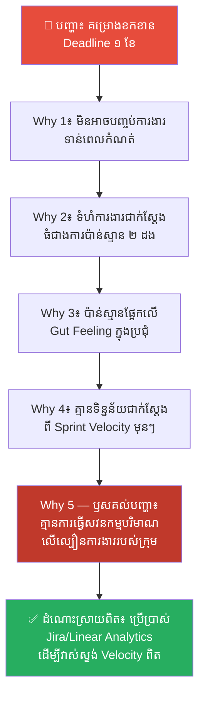
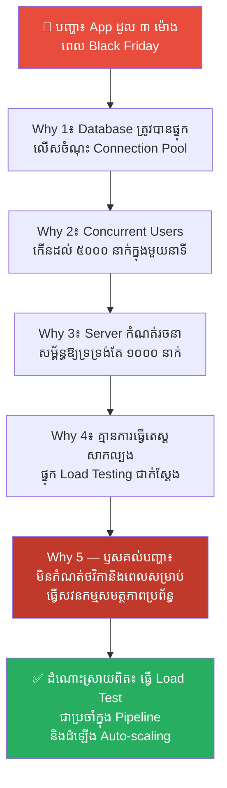
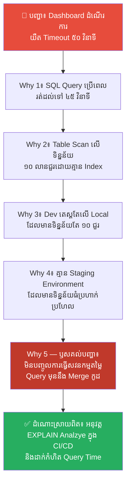
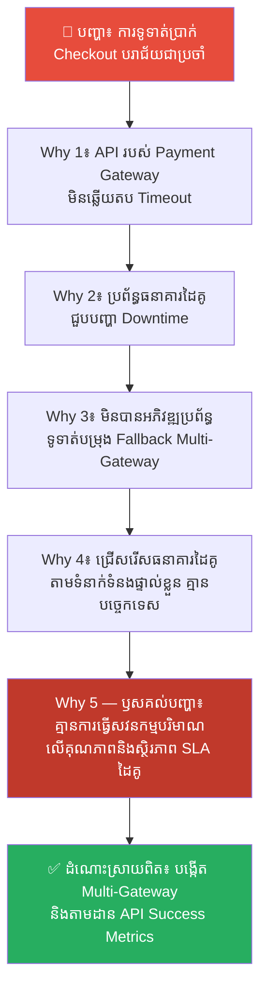
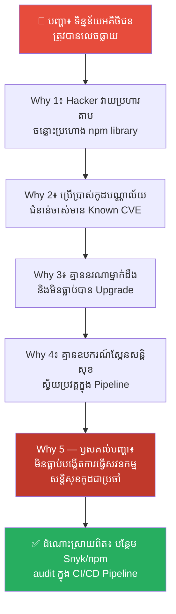
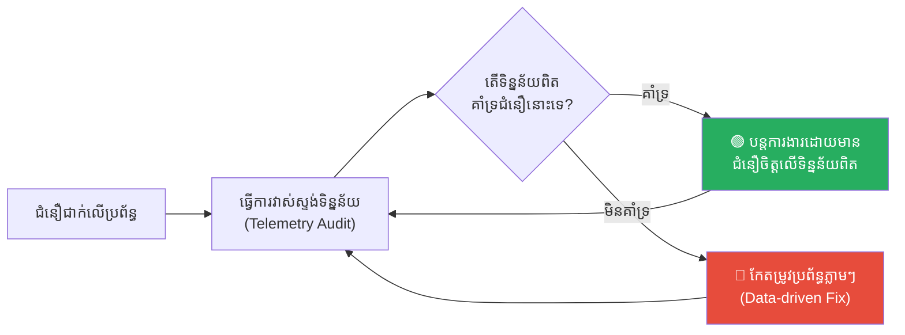

# Quantitative Auditing: The Art of Systems Calculation (ការធ្វើសវនកម្មបរិមាណ៖ សិល្បៈនៃការគណនាប្រព័ន្ធដើម្បីជៀសវាងភាពជឿជាក់ហួសហេតុ)

**Author:** ichamrong  
**Date:** 2026-05-27  
**Tags:** #quantitative-auditing #metrics #system-design #software-engineering #decision-making #overconfidence-bias #mental-models  
**Category:** Concepts  
**Read Time:** ~18 min  

---

## 📌 មាតិកា (Table of Contents)
- [លំនាំបញ្ហា (The Pattern)](#លំនាំបញ្ហា-the-pattern)
- [១. បញ្ហា៖ ភាសានៃការគណនាទិន្នន័យ (The Issue: The Language of System Calculations)](#១-បញ្ហា-ភាសានៃការគណនាទិន្នន័យ-the-issue-the-language-of-system-calculations)
- [២. ឧទាហរណ៍ជាក់ស្តែងក្នុងពិភពពិត (Real World Examples)](#២-ឧទាហរណ៍ជាក់ស្តែងក្នុងពិភពពិត)
  - [ឧទាហរណ៍ទី ១ — ការប៉ាន់ស្មានពេលវេលាគម្រោងដោយផ្អែកលើអារម្មណ៍ (Estimation Bias in Project Delivery)](#ឧទាហរណ៍ទី-១-ការប៉ាន់ស្មានពេលវេលាគម្រោងដោយផ្អែកលើអារម្មណ៍-estimation-bias-in-project-delivery)
  - [ឧទាហរណ៍ទី ២ — ការប៉ាន់ស្មានទំហំ Server ដោយស្មាន នាំឱ្យប្រព័ន្ធគាំងពេលមាន Spike (Server Capacity Scaling Failure)](#ឧទាហរណ៍ទី-២-ការប៉ាន់ស្មានទំហំ-server-ដោយស្មាន-នាំឱ្យប្រព័ន្ធគាំងពេលមាន-spike-server-capacity-scaling-failure)
  - [ឧទាហរណ៍ទី ៣ — ការចុះថយល្បឿន Query ក្នុង Database ដោយសារកើនទិន្នន័យ (Database Query Cost Auditing)](#ឧទាហរណ៍ទី-៣-ការចុះថយល្បឿន-query-ក្នុង-database-ដោយសារកើនទិន្នន័យ-database-query-cost-auditing)
  - [ឧទាហរណ៍ទី ៤ — ការពឹងផ្អែកលើ API ខាងក្រៅដោយគ្មានការវាស់ស្ទង់ SLA (Third-Party API Reliability Audit)](#ឧទាហរណ៍ទី-៤-ការពឹងផ្អែកលើ-api-ខាងក្រៅដោយគ្មានការវាស់ស្ទង់-sla-third-party-api-reliability-audit)
  - [ឧទាហរណ៍ទី ៥ — ការធ្វេសប្រហែសលើការធ្វើសវនកម្មសន្តិសុខលើកូដបណ្ណាល័យ (Dependency Security Vulnerability Audit)](#ឧទាហរណ៍ទី-៥-ការធ្វេសប្រហែសលើការធ្វើសវនកម្មសន្តិសុខលើកូដបណ្ណាល័យ-dependency-security-vulnerability-audit)
- [៣. កត្តាជម្រុញ៖ ភាពប្រញាប់ប្រញាល់ និងការពេញចិត្តលើអារម្មណ៍ស្មាន (The Aggravator: Speed and Subjective Estimates)](#៣-កត្តាជម្រុញ-ភាពប្រញាប់ប្រញាល់-និងការពេញចិត្តលើអារម្មណ៍ស្មាន-the-aggravator-speed-and-subjective-estimates)
- [៤. ដំណោះស្រាយទូទៅ៖ ការកសាងវប្បធម៌សវនកម្មបរិមាណ (The General Solution: Establishing Quantitative Auditing Culture)](#៤-ដំណោះស្រាយទូទៅ-ការកសាងវប្បធម៌សវនកម្មបរិមាណ-the-general-solution-establishing-quantitative-auditing-culture)
- [សេចក្តីសន្និដ្ឋាន (Conclusion)](#សេចក្តីសន្និដ្ឋាន-conclusion)
- [ឯកសារយោង (References)](#references)
- [Related Posts](#related-posts)

---

## លំនាំបញ្ហា (The Pattern)

សាកស្រមៃមើលពីទិដ្ឋភាពនេះ៖ ក្រុមការងារអភិវឌ្ឍកម្មវិធីមួយ កំពុងប្រជុំគ្នាដើម្បីចាប់ផ្តើមគម្រោងថ្មីមួយ។ ប្រធានគម្រោងសួរទៅកាន់ Developer ឆ្នើមម្នាក់ថា៖ *«តើគម្រោងនេះត្រូវប្រើពេលប៉ុន្មានទើបបញ្ចប់រួចរាល់?»* Developer នោះឆ្លើយភ្លាមដោយមិនស្ទាក់ស្ទើរ៖ *«ប្រហែលជា ២ សប្តាហ៍បង! វាមិនពិបាកពេកទេ ខ្ញុំធ្លាប់ធ្វើមុខងារស្រដៀងគ្នានេះកាលពីមុន។»*

៦ សប្តាហ៍ក្រោយមក... គម្រោងនេះនៅតែមិនទាន់អាចដំណើរការបាននៅឡើយ។ Bug ថ្មីៗចេះតែលេចឡើង ដំណើរការប្រព័ន្ធកាន់តែយឺតយ៉ាវ ហើយសម្ពាធការងារកាន់តែកើនឡើង។ 

តើមានអ្វីខុសឆ្គងកើតឡើង?

បញ្ហាមិនមែនមកពី Developer នោះគ្មានសមត្ថភាពសរសេរកូដឡើយ។ ប៉ុន្តែវាគឺដោយសារតែពួកគេបានប៉ាន់ស្មានការងារដោយផ្អែកលើ **«អារម្មណ៍ ឬការស្មានជាប្រធានវិស័យ (Subjective Gut Feeling)»** ជំនួសឱ្យការធ្វើ **Quantitative Auditing (ការធ្វើសវនកម្មបរិមាណ)** លើទិន្នន័យ ល្បឿនការងារជាក់ស្តែង និងដែនកំណត់របស់ប្រព័ន្ធ។ 

នេះគឺជាកំហុសឆ្គងផ្លូវចិត្តដ៏គ្រោះថ្នាក់មួយដែលហៅថា **Overconfidence Bias (លម្អៀងជឿជាក់ហួសហេតុ)**។ នៅក្នុងក្បួនសឹករបស់ស៊ុនអ៊ូ ជំពូកទី ១ បានបញ្ជាក់យ៉ាងច្បាស់ថា៖ *«រាល់ជ័យជម្នះក្នុងសមរភូមិ គឺត្រូវបានរៀបចំទុកជាមុននៅក្នុងវិហារ (រាជវាំង) តាមរយៈការគណនាយ៉ាងល្អិតល្អន់។»* 

---

## ១. បញ្ហា៖ ភាសានៃការគណនាទិន្នន័យ (The Issue: The Language of System Calculations)

នៅក្នុងក្បួនសឹកស៊ុនអ៊ូ ជំពូកទី ១ ត្រូវបានគេស្គាល់ជាភាសាចិនបុរាណថា **«计» (Jì)**។ មនុស្សភាគច្រើនយល់ថាវាមានន័យថា «កលល្បិច» ឬ «ការបោកប្រាស់» (Deception)។ ប៉ុន្តែ តាមន័យភាសាវិទ្យាចិនបុរាណពិតប្រាកដ តួអក្សរ **计 (Jì)** មានន័យត្រង់ថា **«ការគណនា ការធ្វើសវនកម្មប្រព័ន្ធ និងការវិភាគទិន្នន័យជាក់ស្តែង» (To calculate, to audit, quantitative modeling)**។

មុនពេលកងទ័ពដើរចេញទៅសមរភូមិ ស៊ុនអ៊ូបានធ្វើសវនកម្មលើកត្តាសំខាន់ៗចំនួន ៥ (Five Factors) និងការប្រៀបធៀបចំនួន ៧ (Seven Comparisons) ដើម្បីដឹងថាភាគីណាមានឱកាសឈ្នះពិតប្រាកដ។ 

នៅក្នុងវិស័យវិស្វកម្មកម្មវិធី (Software Engineering) **Quantitative Auditing** គឺជាដំណើរការនៃការប្រមូល វិភាគ និងវាស់ស្ទង់ទិន្នន័យជាក់ស្តែងរបស់ប្រព័ន្ធ និងដំណើរការការងារ ដើម្បីធ្វើជាមូលដ្ឋាននៃការសម្រេចចិត្ត៖

*   ❌ **Subjective Speculation (ការសន្មត់តាមអារម្មណ៍)៖** *«ខ្ញុំជឿថា Server នេះអាចរត់បានធម្មតា»* ឬ *«ខ្ញុំគិតថា Interface នេះគ្មានបញ្ហាទេ»*។
*   ✅ **Quantitative Auditing (ការធ្វើសវនកម្មបរិមាណ)៖** *«ផ្អែកលើ Load Test, Server នេះអាចទ្រទ្រង់បាន 500 RPS (Requests Per Second) ជាមួយ Latency ធ្លាក់ចុះក្រោម 200ms។ ប្រសិនបើ traffic កើនដល់ 800 RPS ប្រព័ន្ធនឹងគាំង ដូច្នេះយើងត្រូវដំឡើង Auto-scaling ត្រង់ចំណុចនេះ...»*

ការខកខានមិនបានធ្វើសវនកម្មបរិមាណ នឹងកេះឱ្យមាន **Overconfidence Bias** ដែលធ្វើឱ្យយើងមើលរំលងហានិភ័យ និងបង្កើតប្រព័ន្ធដែលមានភាពទន់ខ្សោយ បរាជ័យក្នុងស្ថានភាពជាក់ស្តែង។

---

## ២. ឧទាហរណ៍ជាក់ស្តែងក្នុងពិភពពិត

សូមពិនិត្យមើល **ឧទាហរណ៍ជាក់ស្តែងចំនួន ៥** បង្ហាញពីផលប៉ះពាល់នៃការខ្វះសវនកម្មបរិមាណ និងរបៀបដោះស្រាយ៖

---

### ឧទាហរណ៍ទី ១ — ការប៉ាន់ស្មានពេលវេលាគម្រោងដោយផ្អែកលើអារម្មណ៍ (Estimation Bias in Project Delivery)

**បញ្ហា៖** គម្រោងអភិវឌ្ឍកម្មវិធីថ្មីមួយខកខានថ្ងៃកំណត់បញ្ចប់ (Deadline) ដល់ទៅ ១ ខែ ទោះបីជាមានការសន្យាយ៉ាងមុតមាំពីក្រុមការងារក៏ដោយ។

**ដំណោះស្រាយលើផ្ទៃក្រៅ៖** ស្តីបន្ទោស Developer ថាធ្វើការយឺតយ៉ាវ និងបង្ខំឱ្យពួកគេស្នាក់នៅធ្វើការថែមម៉ោងរហូតដល់យប់ដើម្បីបញ្ចប់វា។  
(លទ្ធផល៖ គម្រោងបន្ទាប់នឹងនៅតែយឺតយ៉ាវដដែល ព្រោះការប៉ាន់ស្មាននៅតែមិនច្បាស់លាស់។)

**ការវិភាគបែប 5 Whys៖**

| # | សំណួរ (Why?) | ចម្លើយ (Answer) |
|---|---|---|
| 1 | ហេតុអ្វីបានជាគម្រោងខកខាន Deadline? | ពីព្រោះក្រុមការងារមិនអាចសរសេរកូដ និងតេស្តមុខងារទាន់ពេលវេលា។ |
| 2 | ហេតុអ្វីបានជាមិនទាន់ពេល? | ពីព្រោះទំហំការងារ (Scope) ជាក់ស្តែងធំជាងអ្វីដែលបានប៉ាន់ស្មានដំបូងដល់ទៅ ២ ដង។ |
| 3 | ហេតុអ្វីបានជាការប៉ាន់ស្មានដំបូងទាបពេក? | ពីព្រោះ Developer ប៉ាន់ស្មានពេលវេលាដោយផ្អែកលើ «អារម្មណ៍ធ្លាប់ធ្វើ» (Gut Feeling) ក្នុងប្រជុំ Planning។ |
| 4 | ហេតុអ្វីបានជាប៉ាន់ស្មានដោយផ្អែកលើ Gut Feeling? | ពីព្រោះក្រុមការងារគ្មានទិន្នន័យជាក់ស្តែងបង្ហាញពីល្បឿនការងារពិតប្រាកដ (Sprint Velocity) របស់ក្រុមពីមុនៗឡើយ។ |
| 5 | ហេតុអ្វីបានជាគ្មានទិន្នន័យល្បឿនការងារពិតប្រាកដ? | **ពីព្រោះក្រុមហ៊ុនមិនដែលបានធ្វើសវនកម្មបរិមាណលើល្បឿនការងាររបស់ក្រុម (Historical Velocity Auditing) ឡើយ។ ពួកគេគ្រាន់តែបញ្ចប់ការងារទៅតាម Target ចៃដន្យដែលដាក់ចុះដោយផ្នែកគ្រប់គ្រង។** |

**ដំណោះស្រាយពិតប្រាកដ៖** ប្រើប្រាស់ទិន្នន័យល្បឿនការងារពិតប្រាកដ (Sprint Velocity / Story Points Analysis) កាលពី ៣ ខែមុនដើម្បីធ្វើជាបង្គោលប៉ាន់ស្មានការងារបន្ទាប់ ជៀសវាងការប៉ាន់ស្មានតាមអារម្មណ៍។

---

### ឧទាហរណ៍ទី ២ — ការប៉ាន់ស្មានទំហំ Server ដោយស្មាន នាំឱ្យប្រព័ន្ធគាំងពេលមាន Spike (Server Capacity Scaling Failure)

**បញ្ហា៖** App លក់ទំនិញអនឡាញមួយបានដួលរលំ (Crashed) រយៈពេល ៣ ម៉ោង ក្នុងអំឡុងពេលយុទ្ធនាការលក់បញ្ចុះតម្លៃធំប្រចាំឆ្នាំ (Black Friday Sale)។

**ដំណោះស្រាយលើផ្ទៃក្រៅ៖** ជួលម៉ាស៊ីន Cloud Server ឱ្យធំជាងមុន ២ ដងជានិច្ច ដើម្បីការពារការដួលម្តងទៀត។  
(លទ្ធផល៖ ក្រុមហ៊ុនត្រូវខាតបង់ថវិការាប់ពាន់ដុល្លារលើថ្លៃ Cloud Server រាល់ខែ ទោះបីជាគ្មាន traffic ក៏ដោយ។)

**ការវិភាគបែប 5 Whys៖**

| # | សំណួរ (Why?) | ចម្លើយ (Answer) |
|---|---|---|
| 1 | ហេតុអ្វីបានជា App ដួលរលំ? | ពីព្រោះ database របស់ប្រព័ន្ធត្រូវបានផ្ទុកលើសចំណុះ (Connection Pool Exhausted)។ |
| 2 | ហេតុអ្វីបានជា database ផ្ទុកលើសចំណុះ? | ពីព្រោះចំនួនអ្នកចូលប្រើប្រាស់ (Concurrent Users) កើនឡើងដល់ ៥,០០០ នាក់ក្នុងមួយនាទី។ |
| 3 | ហេតុអ្វីបានជាប្រព័ន្ធមិនអាចទ្រទ្រង់អ្នកប្រើប្រាស់ ៥,០០0 នាក់បាន? | ពីព្រោះការកំណត់រចនាសម្ព័ន្ធ Server និង Database ត្រូវបានប៉ាន់ស្មានជាមុនថាអាចទ្រទ្រង់បានត្រឹមតែ ១,០០០ នាក់ប៉ុណ្ណោះ។ |
| 4 | ហេតុអ្វីបានជាប៉ាន់ស្មានថាអាចទ្រទ្រង់បានតែ ១,០០០ នាក់? | ពីព្រោះក្រុមការងារមិនដែលបានធ្វើតេស្តសាកល្បងផ្ទុក (Load Testing) ដើម្បីវាស់ស្ទង់ដែនកំណត់ជាក់ស្តែងរបស់ប្រព័ន្ធឡើយ។ |
| 5 | ហេតុអ្វីបានជាមិនដែលបានធ្វើតេស្ត Load Testing? | **ពីព្រោះគម្រោងមិនបានកំណត់ថវិកា និងពេលវេលាសម្រាប់ការធ្វើសវនកម្មសមត្ថភាពប្រព័ន្ធ (System Capacity Auditing) ឡើយ។ ថ្នាក់ដឹកនាំចាត់ទុកការសរសេរមុខងារថ្មីឱ្យលឿន សំខាន់ជាងការវាស់ស្ទង់ស្ថិរភាពប្រព័ន្ធ។** |

**ដំណោះស្រាយពិតប្រាកដ៖** រៀបចំដំណើរការ Load Testing ជាកាតព្វកិច្ច (ឧទាហរណ៍៖ ប្រើប្រាស់ឧបករណ៍ K6, JMeter) មុនរាល់យុទ្ធនាការធំៗ ដើម្បីវាស់ស្ទង់ និងកំណត់ប្រព័ន្ធ Auto-scaling ឱ្យបានត្រឹមត្រូវផ្អែកលើតួលេខពិត។

---

### ឧទាហរណ៍ទី ៣ — ការចុះថយល្បឿន Query ក្នុង Database ដោយសារកើនទិន្នន័យ (Database Query Cost Auditing)

**បញ្ហា៖** Dashboard របស់ក្រុមហ៊ុនដំណើរការយឺតខ្លាំងណាស់ (Timeout ៥០ វិនាទី) បន្ទាប់ពីប្រើប្រាស់បានរយៈពេល ៦ ខែ។

**ដំណោះស្រាយលើផ្ទៃក្រៅ៖** បន្ថែម RAM របស់ Database Server ដើម្បីកុំឱ្យវាគាំង។  
(លទ្ធផល៖ ល្បឿនលឿនជាងមុនបន្តិច ប៉ុន្តែបន្ទាប់ពីកើនទិន្នន័យបន្ថែម វានឹងគាំងម្តងទៀត និងចំណាយប្រាក់កាន់តែច្រើន។)

**ការវិភាគបែប 5 Whys៖**

| # | សំណួរ (Why?) | ចម្លើយ (Answer) |
|---|---|---|
| 1 | ហេតុអ្វីបានជា Dashboard ដំណើរការយឺត? | ពីព្រោះ SQL Query ដែលទាញទិន្នន័យមកបង្ហាញ ត្រូវប្រើពេលរត់ដល់ទៅ ៤៥ វិនាទី។ |
| 2 | ហេតុអ្វីបានជា SQL Query រត់យឺត? | ពីព្រោះវាត្រូវធ្វើការ Scan លើតារាង (Table Scan) ដែលមានទិន្នន័យដល់ទៅ ១០ លានជួរ ដោយគ្មានសន្ទស្សន៍ (Index) ច្បាស់លាស់។ |
| 3 | ហេតុអ្វីបានជាគ្មាន Index លើជួរឈរដែលត្រូវស្វែងរក? | ពីព្រោះនៅពេលសរសេរកូដដំបូង Developer តេស្តតែលើម៉ាស៊ីនរបស់ខ្លួន (Local Machine) ដែលមានទិន្នន័យតែ ១០ ជួរ និងដំណើរការលឿនធម្មតា។ |
| 4 | ហេតុអ្វីបានជាមិនបានតេស្តជាមួយទិន្នន័យទំហំធំមុន Deploy? | ពីព្រោះក្រុមហ៊ុនគ្មានបរិស្ថានសាកល្បង (Staging/Performance Environment) ដែលមានទំហំទិន្នន័យប្រហាក់ប្រហែលនឹង Production ឡើយ។ |
| 5 | ហេតុអ្វីបានជាគ្មានបរិស្ថានសាកល្បងទិន្នន័យធំ? | **ពីព្រោះដំណើរការដំឡើងប្រព័ន្ធ (SDLC Process) មិនបានបញ្ចូលការធ្វើសវនកម្មតម្លៃ Query (Database Query Cost Auditing/EXPLAIN Plan) ទៅជាលក្ខខណ្ឌដាច់ខាតមុននឹង Merge កូដឡើយ។** |

**ដំណោះស្រាយពិតប្រាកដ៖** បង្កើតច្បាប់ដាច់ខាតនៅក្នុងការត្រួតពិនិត្យកូដ (Code Review Policy) ដែលតម្រូវឱ្យរាល់ SQL Query ថ្មីទាំងអស់ត្រូវតែបង្ហាញ `EXPLAIN ANALYZE` Plan ដើម្បីវាស់ស្ទង់តម្លៃ Query Cost ជាមុនសិន។

---

### ឧទាហរណ៍ទី ៤ — ការពឹងផ្អែកលើ API ខាងក្រៅដោយគ្មានការវាស់ស្ទង់ SLA (Third-Party API Reliability Audit)

**បញ្ហា៖** ដំណើរការទូទាត់ប្រាក់ (Checkout Process) របស់ App លក់ទំនិញមួយបរាជ័យជាប្រចាំ (ធ្លាក់ចុះ ៤០%) បង្កការមិនពេញចិត្តយ៉ាងខ្លាំងពីអតិថិជន។

**ដំណោះស្រាយលើផ្ទៃក្រៅ៖** សរសេរកូដរុញការខុសឆ្គងទៅឱ្យប្រព័ន្ធទូទាត់ប្រាក់ខាងក្រៅ (បង្ហាញ Error: *«Third-party bank server is down»*)។  
(លទ្ធផល៖ អតិថិជននៅតែចាកចេញពី App ហើយទៅទិញទំនិញពីគូប្រជែងដដែល។)

**ការវិភាគបែប 5 Whys៖**

| # | សំណួរ (Why?) | ចម្លើយ (Answer) |
|---|---|---|
| 1 | ហេតុអ្វីបានជា Checkout បរាជ័យ? | ពីព្រោះ API របស់ធនាគារដៃគូ (Payment Gateway API) មិនឆ្លើយតប (Timeout)។ |
| 2 | ហេតុអ្វីបានជា API ធនាគារមិនឆ្លើយតប? | ពីព្រោះប្រព័ន្ធរបស់ពួកគេកំពុងជួបប្រទះបញ្ហាដាច់ចរន្តការងារ (Downtime)។ |
| 3 | ហេតុអ្វីបានជាប្រព័ន្ធរបស់យើងពឹងផ្អែកតែលើធនាគារមួយនោះទាំងស្រុង? | ពីព្រោះយើងមិនបានអភិវឌ្ឍប្រព័ន្ធទូទាត់ប្រាក់បម្រុង (Fallback/Multi-Gateway) ឡើយ។ |
| 4 | ហេតុអ្វីបានជាមិនអភិវឌ្ឍប្រព័ន្ធទូទាត់បម្រុង Fallback? | ពីព្រោះការជ្រើសរើសធនាគារដៃគូកាលពីដំបូង គឺសម្រេចចិត្តដោយផ្នែកធុរកិច្ចដោយផ្អែកលើទំនាក់ទំនងផ្ទាល់ខ្លួន មិនមែនផ្អែកលើរបាយការណ៍បច្ចេកទេស។ |
| 5 | ហេតុអ្វីបានជាសម្រេចចិត្តដោយមិនផ្អែកលើបច្ចេកទេស? | **ពីព្រោះក្រុមហ៊ុនគ្មានការធ្វើសវនកម្មបរិមាណលើគុណភាព និងស្ថិរភាព (Quantitative Third-Party SLA Auditing) របស់ដៃគូសេវាកម្មខាងក្រៅឡើយ។ ពួកគេមិនបានវាស់ស្ទង់ និងវិភាគលើអត្រាជោគជ័យ (Success Rate) និង Downtime ជាក់ស្តែងរបស់ API នោះមុននឹងចុះកិច្ចសន្យា។** |

**ដំណោះស្រាយពិតប្រាកដ៖** បង្កើតឧបករណ៍វាស់ស្ទង់ API SLA ស្វ័យប្រវត្ត ដើម្បីតាមដាន Latency និង Error Rate របស់ Third-party APIs និងរៀបចំប្រព័ន្ធ Fallback ស្វ័យប្រវត្តទៅកាន់ Gateway ផ្សេងទៀតនៅពេលអត្រាជោគជ័យធ្លាក់ចុះក្រោម ៩៩%។

---

### ឧទាហរណ៍ទី ៥ — ការធ្វេសប្រហែសលើការធ្វើសវនកម្មសន្តិសុខលើកូដបណ្ណាល័យ (Dependency Security Vulnerability Audit)

**បញ្ហា៖** ទិន្នន័យផ្ទាល់ខ្លួនរបស់អតិថិជនត្រូវបានលេចធ្លាយ ហើយប្រព័ន្ធត្រូវបាន Hacker វាយប្រហារចូលគ្រប់គ្រង។

**ដំណោះស្រាយលើផ្ទៃក្រៅ៖** ជួលក្រុមការងារសន្តិសុខខាងក្រៅឱ្យមកជួយបោសសម្អាតប្រព័ន្ធម្តងគត់ រួចប្តូរពាក្យសម្ងាត់ Server ទាំងអស់។  
(លទ្ធផល៖ ក្រោយមក Hacker នៅតែអាចរកឃើញចន្លោះប្រហោងផ្សេងទៀត ព្រោះប្រភពដើមមិនត្រូវបានដោះស្រាយ។)

**ការវិភាគបែប 5 Whys៖**

| # | សំណួរ (Why?) | ចម្លើយ (Answer) |
|---|---|---|
| 1 | ហេតុអ្វីបានជាទិន្នន័យអតិថិជនលេចធ្លាយ? | ពីព្រោះ Hacker បានប្រើប្រាស់ចន្លោះប្រហោងសន្តិសុខ (Vulnerability) របស់កូដបណ្ណាល័យ (npm library) មួយដើម្បីទាញយកទិន្នន័យ។ |
| 2 | ហេតុអ្វីបានជាកូដបណ្ណាល័យនោះមានចន្លោះប្រហោង? | ពីព្រោះវាជាកូដបណ្ណាល័យជំនាន់ចាស់ (Outdated Version) ដែលមានចន្លោះប្រហោងល្បី (Known CVE) កាលពី ២ ឆ្នាំមុន។ |
| 3 | ហេតុអ្វីបានជាប្រព័ន្ធនៅតែប្រើប្រាស់កូដបណ្ណាល័យចាស់ដែលមានចន្លោះប្រហោង? | ពីព្រោះគ្មាន Developer ណាម្នាក់ដឹងថាវាមានបញ្ហាសន្តិសុខ និងមិនធ្លាប់បានធ្វើការដំឡើងជំនាន់ (Upgrade) ឡើយ។ |
| 4 | ហេតុអ្វីបានជាគ្មាននរណាម្នាក់ដឹងពីបញ្ហាសន្តិសុខរបស់កូដបណ្ណាល័យ? | ពីព្រោះប្រព័ន្ធអភិវឌ្ឍន៍មិនមានឧបករណ៍ស្កែនសន្តិសុខស្វ័យប្រវត្តនៅក្នុង Pipeline ឡើយ។ |
| 5 | ហេតុអ្វីបានជាគ្មានឧបករណ៍ស្កែនសន្តិសុខស្វ័យប្រវត្ត? | **ពីព្រោះវប្បធម៌ការងាររបស់ក្រុមហ៊ុនមិនធ្លាប់បានបង្កើតការធ្វើសវនកម្មសន្តិសុខកូដជាប្រចាំ (Automated Dependency Security Auditing) ឡើយ។ ពួកគេផ្តោតតែលើការប្រគល់មុខងារការងារឱ្យបានលឿន និងមើលរំលងការត្រួតពិនិត្យសុវត្ថិភាពប្រព័ន្ធ។** |

**ដំណោះស្រាយពិតប្រាកដ៖** បន្ថែមឧបករណ៍ត្រួតពិនិត្យសន្តិសុខស្វ័យប្រវត្ត (ឧទាហរណ៍៖ Snyk, OWASP Dependency-Check, ឬ `npm audit`) ទៅក្នុង CI/CD Pipeline។ ប្រសិនបើស្កែនរកឃើញចន្លោះប្រហោងកម្រិតធ្ងន់ (High Severity CVE) នោះប្រព័ន្ធនឹងបដិសេធការ Deploy ដោយស្វ័យប្រវត្ត។

---

## ៣. កត្តាជម្រុញ៖ ភាពប្រញាប់ប្រញាល់ និងការពេញចិត្តលើអារម្មណ៍ស្មាន (The Aggravator: Speed and Subjective Estimates)

ទោះបីជាដឹងថាការគណនា និងវាស់ស្ទង់ទិន្នន័យមានសារៈសំខាន់ខ្លាំង ក៏វិស្វករកម្មវិធី និងក្រុមដឹកនាំគម្រោងភាគច្រើន នៅតែធ្លាក់ចូលក្នុងអន្ទាក់ **Overconfidence Bias** ដោយសារ៖

1.  **សម្ពាធនៃល្បឿន (The Need for Speed)៖** នៅក្នុងវប្បធម៌ការងារដែលដេញតាម Deadline ឆាប់រហ័ស ដំណើរការវាស់ស្ទង់ ទិន្នន័យ Load Test ឬការពិនិត្យ `EXPLAIN` Query ត្រូវបានគេមើលឃើញថាជា «ការងារដែលនាំឱ្យយឺតផ្លូវ»។ មនុស្សជ្រើសរើសការមិនវាស់ស្ទង់ ដើម្បីបង្កើតរូបភាពថាការងារដើរបានលឿន។
2.  **ការយល់ច្រឡំថា «កូដដំណើរការលើម៉ាស៊ីនខ្ញុំ = កូដគ្មានបញ្ហា» (The Local Machine Fallacy)៖** នេះជាប្រភពចម្បងនៃ Overconfidence Bias។ ការដែលប្រព័ន្ធដំណើរការបានល្អជាមួយអ្នកប្រើប្រាស់ម្នាក់ មិនមែនមានន័យថាវាដំណើរការបានល្អជាមួយអ្នកប្រើប្រាស់ ១០,០០០ នាក់នោះទេ។ 
3.  **ភាពខ្ជិលច្រអូសផ្នែកយល់ដឹង (Cognitive Laziness)៖** ការវិភាគទិន្នន័យ ត្រូវការប្រព័ន្ធគិតវិភាគយឺត (System 2) ដែលចំណាយថាមពលខួរក្បាលខ្ពស់។ មនុស្សចូលចិត្តជ្រើសរើសការស្មាន ព្រោះវាធ្វើឱ្យពួកគេមានអារម្មណ៍ធូរស្រាល និងមានជំនឿចិត្តភ្លាមៗ ទោះបីជាជំនឿចិត្តនោះគ្មានគ្រឹះទិន្នន័យក៏ដោយ។

---

## ៤. ដំណោះស្រាយទូទៅ៖ การកសាងវប្បធម៌សវនកម្មបរិមាណ (The General Solution: Establishing Quantitative Auditing Culture)

ដើម្បីកម្ទេច Overconfidence Bias និងបង្កើតប្រព័ន្ធបច្ចេកវិទ្យាដែលមានស្ថិរភាពខ្ពស់ ក្រុមការងារត្រូវតែអនុវត្តគោលការណ៍ **«កុំសន្មត់ តែត្រូវវាស់ស្ទង់ជានិច្ច» (Don't Assume, Measure Everything)**៖

### ស្ថាបនា Metric Dashboards សម្រាប់រាល់ការសម្រេចចិត្ត (Build Telemetry-Driven Culture)
រាល់ប្រព័ន្ធការងារ ត្រូវតែមានឧបករណ៍ស្ទង់ និងតាមដាន (Observability)។ 
*   **Application Monitoring:** ដំឡើងឧបករណ៍ដូចជា Prometheus, Grafana, Datadog ដើម្បីវាស់ស្ទង់ RPS, Latency, Error Rates និង CPU/Memory Usage។
*   **Project Delivery Analytics:** ប្រើប្រាស់ metrics ដូចជា Lead Time, Cycle Time, និង Sprint Velocity ដើម្បីប៉ាន់ស្មានពេលវេលាគម្រោងបន្ទាប់ ជៀសវាងការប៉ាន់ស្មានតាមអារម្មណ៍។

### កំណត់ «ដែនកំណត់សវនកម្ម» ជាលក្ខខណ្ឌដាច់ខាត (Define Automated Audit Gates)
កុំទុកឱ្យសវនកម្មបរិមាណអាស្រ័យលើការចងចាំរបស់មនុស្ស។ ចូរស្វ័យប្រវត្តកម្មវា៖
*   **CI/CD Performance Gates:** ប្រសិនបើកូដថ្មីធ្វើឱ្យល្បឿនរត់ API ធ្លាក់ចុះលើសពី ១០% នោះប្រព័ន្ធត្រូវដកវាចេញវិញដោយស្វ័យប្រវត្ត។
*   **Continuous Vulnerability Scanning:** ដំណើរការស្កែនរកចន្លោះប្រហោងសន្តិសុខរាល់ពេល Push កូដថ្មី។

### អនុវត្តគោលការណ៍ «សួរសម្មតិកម្មផ្ទុយ» (Falsification Testing)
នៅពេលនរណាម្នាក់និយាយថា៖ *«មុខងារនេះល្អឥតខ្ចោះហើយ»* ចូរចោទសួរថា៖ ***«តើយើងមានតួលេខអ្វីខ្លះដែលអាចយកមកបង្ហាញដើម្បីបដិសេធសេចក្តីថ្លែងការណ៍នេះ?»***
*   ធ្វើការធ្វើតេស្តសាកល្បងបំផ្លាញ (Chaos Engineering) ដើម្បីបដិសេធជំនឿចិត្តថាប្រព័ន្ធគ្មានថ្ងៃដួលរលំ។

---

## សេចក្តីសន្និដ្ឋាន (Conclusion)

> **«អ្នកណាដែលច្បាំងដោយគ្មានការគណនា និងសវនកម្មជាក់ស្តែង នឹងត្រូវបរាជ័យមុនពេលចាប់ផ្តើមប្រយុទ្ធទៅទៀត។» — ស៊ុន អ៊ូ**

ការជឿជាក់លើសមត្ថភាពខ្លួនឯងគឺជាចំណុចល្អ ប៉ុន្តែការជឿជាក់ដោយគ្មានទិន្នន័យគាំទ្រ គឺជាភាពល្ងង់ខ្លៅដែលបង្កហានិភ័យបំផ្លាញគម្រោងទាំងមូល។ វិស្វករកម្មវិធី និងអ្នកដឹកនាំបច្ចេកវិទ្យាដ៏ឆ្នើម មិនដែលពឹងផ្អែកលើ «ការស្មាន» ឡើយ។ ពួកគេបង្កើតប្រព័ន្ធវាស់ស្ទង់ និងធ្វើសវនកម្មបរិមាណ (Quantitative Auditing) ដើម្បីស្វែងរកការពិតជាក់ស្តែង (Ground Truth) ដែលជាគ្រឹះដាច់ខាតនៃជ័យជម្នះអមតៈ។

---

## ឯកសារយោង (References)

* **Kahneman, D.** — *Thinking, Fast and Slow* (2011)។ ការវិភាគស៊ីជម្រៅលើ Overconfidence Bias និងភាពខុសគ្នារវាងការសម្រេចចិត្តតាមអារម្មណ៍ និងការគិតដោយផ្អែកលើទិន្នន័យវិទ្យាសាស្ត្រ។
* **Sun Tzu (Lionel Giles Translation)** — *The Art of War Chapter 1: Laying Plans*។ ការពិភាក្សាលម្អិតអំពីតួអក្សរ *Ji* (计) ក្នុងនាមជាការវាស់ស្ទង់ និងគណនាប្រព័ន្ធយុទ្ធសាស្ត្រ។
* **SRE Google Team** — *Site Reliability Engineering: How Google Runs Production Systems* (2016)។ ការណែនាំស្តង់ដារសកលលើការប្រើប្រាស់ Service Level Indicators (SLIs) និង Service Level Objectives (SLOs) ដើម្បីវាស់ស្ទង់ និងធ្វើសវនកម្មសមត្ថភាពប្រព័ន្ធ។

---

## Related Posts

* [Confirmation Bias (ការលំអៀងបញ្ជាក់អំណះអំណាង)៖ អន្ទាក់ចិត្តដែលបង្ខំយើងឱ្យស្តាប់តែអ្វីដែលយើងចង់ឮ](./01-confirmation-bias.md)
* [The 5 Whys Technique៖ ឈប់ដោះស្រាយលើរោគសញ្ញា ចាប់ផ្តើមស្វែងរកឫសគល់នៃបញ្ហា](./02-five-whys-technique.md)
* [The Sword of Damocles and Risk Management៖ យុទ្ធសាស្ត្រគ្រប់គ្រងហានិភ័យ](./25-the-sword-of-damocles-and-risk-management.md)
