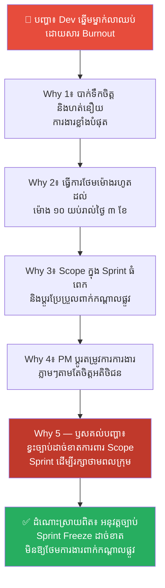
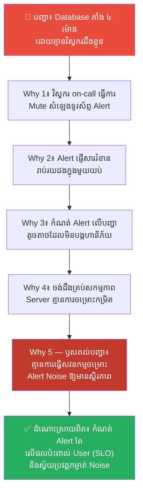
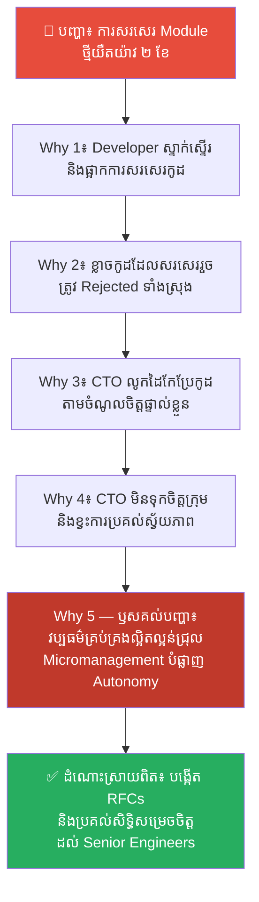
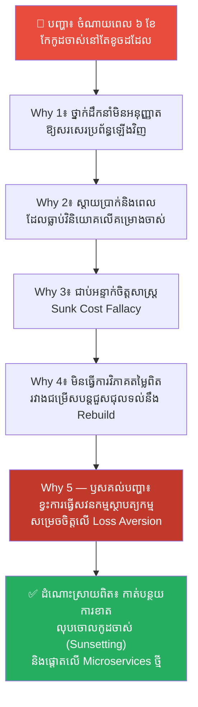
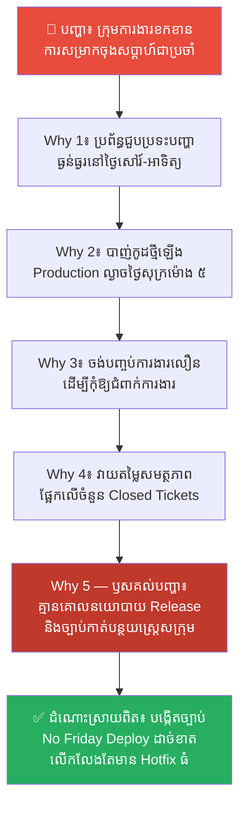
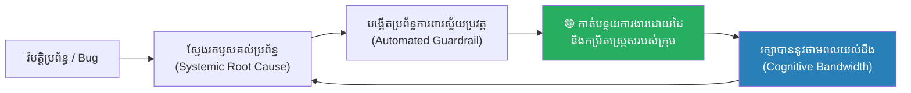

# Stress Minimization: The Preservation of Cognitive Energy (ការកាត់បន្ថយភាពតានតឹងផ្លូវចិត្ត៖ ការរក្សាថាមពលយល់ដឹង និងល្បឿនសម្របខ្លួនក្នុងក្រុមការងារ)

**Author:** ichamrong  
**Date:** 2026-05-27  
**Tags:** #stress-minimization #burnout #team-culture #agile #loss-aversion #sunk-cost-fallacy #mental-models  
**Category:** Concepts  
**Read Time:** ~18 min  

---

## 📌 មាតិកា (Table of Contents)
- [លំនាំបញ្ហា (The Pattern)](#លំនាំបញ្ហា-the-pattern)
- [១. បញ្ហា៖ ការកកកុញនៃភាពហត់នឿយ និងច្បាប់រក្សាថាមពល (The Issue: Exhaustion Accumulation & The Law of Energy Conservation)](#១-បញ្ហា-ការកកកុញនៃភាពហត់នឿយ-និងច្បាប់រក្សាថាមពល-the-issue-exhaustion-accumulation--the-law-of-energy-conservation)
- [២. ឧទាហរណ៍ជាក់ស្តែងក្នុងពិភពពិត (Real World Examples)](#២-ឧទាហរណ៍ជាក់ស្តែងក្នុងពិភពពិត)
  - [ឧទាហរណ៍ទី ១ — ការហត់នឿយខ្លាំងរបស់ Developer ដោយសារថ្ងៃកំណត់បញ្ចប់មិនប្រាកដនិយម (Developer Burnout under Unrealistic Deadlines)](#ឧទាហរណ៍ទី-១-ការហត់នឿយខ្លាំងរបស់-developer-ដោយសារថ្ងៃកំណត់បញ្ចប់មិនប្រាកដនិយម-developer-burnout-under-unrealistic-deadlines)
  - [ឧទាហរណ៍ទី ២ — ភាពស៊ាំនឹងសំឡេង Alarm នាំឱ្យខកខានដោះស្រាយបញ្ហាធំ (Alert Fatigue & Outage Escalation)](#ឧទាហរណ៍ទី-២-ភាពស៊ាំនឹងសំឡេង-alarm-នាំឱ្យខកខានដោះស្រាយបញ្ហាធំ-alert-fatigue--outage-escalation)
  - [ឧទាហរណ៍ទី ៣ — ការគ្រប់គ្រងល្អិតល្អន់ពេកក្នុងការរចនាប្លង់ប្រព័ន្ធ (Micromanagement in System Architecture Decisions)](#ឧទាហរណ៍ទី-៣-ការគ្រប់គ្រងល្អិតល្អន់ពេកក្នុងការរចនាប្លង់ប្រព័ន្ធ-micromanagement-in-system-architecture-decisions)
  - [ឧទាហរណ៍ទី ៤ — ការខំប្រឹងជួសជុលប្រព័ន្ធចាស់ដែលខូចរលួយ ជំនួសឱ្យការសរសេរឡើងវិញ (Legacy Code Refactoring Sunk-Cost Trap)](#ឧទាហរណ៍ទី-៤-ការខំប្រឹងជួសជុលប្រព័ន្ធចាស់ដែលខូចរលួយ-ជំនួសឱ្យការសរសេរឡើងវិញ-legacy-code-refactoring-sunk-cost-trap)
  - [ឧទាហរណ៍ទី ៥ — ការបង្ហោះកូដឡើង Server ពិតនៅល្ងាចថ្ងៃសុក្រ (Deploying to Production on Friday Afternoon)](#ឧទាហរណ៍ទី-៥-ការបង្ហោះកូដឡើង-server-ពិតនៅល្ងាចថ្ងៃសុក្រ-deploying-to-production-on-friday-afternoon)
- [៣. កត្តាជម្រុញ៖ វប្បធម៌ប្រញាប់ប្រញាល់ និងការភ័យខ្លាចការបរាជ័យ (The Aggravator: Burnout Culture & Fear of Failure)](#៣-កត្តាជម្រុញ-វប្បធម៌ប្រញាប់ប្រញាល់-និងការភ័យខ្លាចការបរាជ័យ-the-aggravator-burnout-culture--fear-of-failure)
- [៤. ដំណោះស្រាយទូទៅ៖ ការកសាងបរិស្ថានការងារកាត់បន្ថយស្ត្រេស (The General Solution: Designing a Stress-Minimized Working Environment)](#៤-ដំណោះស្រាយទូទៅ-ការកសាងបរិស្ថានការងារកាត់បន្ថយស្ត្រេស-the-general-solution-designing-a-stress-minimized-working-environment)
- [សេចក្តីសន្និដ្ឋាន (Conclusion)](#សេចក្តីសន្និដ្ឋាន-conclusion)
- [ឯកសារយោង (References)](#references)
- [Related Posts](#related-posts)

---

## លំនាំបញ្ហា (The Pattern)

សាកស្រមៃមើលពីទិដ្ឋភាពនេះ៖ ថ្ងៃសុក្រ វេលាម៉ោង ៤ រសៀល។ សមាជិកក្រុមការងារទាំងអស់កំពុងរៀបចំខ្លួនទៅផ្ទះដើម្បីសម្រាកចុងសប្តាហ៍ជាមួយគ្រួសារ។ ស្រាប់តែប្រព័ន្ធទូទាត់ប្រាក់នៅលើ Production Server គាំងមិនដំណើរការ (Crashed)។ ទូរស័ព្ទរបស់ Developer និង DevOps ញ័រឥតឈប់ឈរដោយសារតែការព្រមាន (Alerts) រាប់រយដង។ 

សមាជិកក្រុមត្រូវបង្ខំចិត្តត្រឡប់មកកុំព្យូទ័រវិញ ធ្វើការស្រាវជ្រាវ និងកូដ hotfix ទាំងភ្នែកស្លក់ និងស្ត្រេសខ្លាំង រហូតដល់ម៉ោង ៣ ភ្លឺថ្ងៃសៅរ៍។ ទោះបីជាប្រព័ន្ធត្រូវបានជួសជុលរួចរាល់ ក៏សមាជិកក្រុមទាំងអស់ត្រូវបាត់បង់ថាមពល និងអារម្មណ៍រីករាយចុងសប្តាហ៍ទាំងស្រុង។ 

សប្តាហ៍បន្ទាប់ ពួកគេមកធ្វើការវិញដោយភាពនឿយហត់ (Fatigue) គ្មានអារម្មណ៍ច្នៃប្រឌិត និងចាប់ផ្តើមធុញទ្រាន់នឹងការងារ។

តើយើងអាចជៀសវាងវដ្តនៃភាពតានតឹងដ៏បំផ្លិចបំផ្លាញនេះបានដោយរបៀបណា?

ចម្លើយមិនមែនស្ថិតនៅលើការបង្ខំឱ្យទាហានធ្វើការខ្លាំងជាងមុន ឬការញ៉ាំភេសជ្ជៈប៉ូវកម្លាំងឡើយ។ ប៉ុន្តែវាគឺការអនុវត្តគោលការណ៍ **Stress Minimization (ការកាត់បន្ថយភាពតានតឹងផ្លូវចិត្ត)** — គឺការរក្សា និងគ្រប់គ្រង **«ថាមពលយល់ដឹង» (Cognitive Bandwidth / Qi Preservation)** របស់ក្រុមការងារ ដើម្បីរក្សាល្បឿនការងារឱ្យមានស្ថិរភាព និងអាចបត់បែនបានគ្រប់កាលៈទេសៈ។

---

## ១. បញ្ហា៖ ការកកកុញនៃភាពហត់នឿយ និងច្បាប់រក្សាថាមពល (The Issue: Exhaustion Accumulation & The Law of Energy Conservation)

នៅក្នុងក្បួនសឹកស៊ុនអ៊ូ ជំពូកទី ២ **«作战» (作战 Zuozhan - Waging War)** គាត់បានព្រមានយ៉ាងម៉ឺងម៉ាត់បំផុតថា៖ 
> **«សង្គ្រាមដែលអូសបន្លាយពេលយូរ នឹងធ្វើឱ្យអាវុធរិល ស្មារតីរបស់ទាហានចុះខ្សោយ កម្លាំងពលកម្មរលាយបាត់ ហើយឃ្លាំងទ្រព្យសម្បត្តិរបស់រដ្ឋនឹងត្រូវអស់រលីង។ គ្មានប្រទេសណាដែលទទួលបានផលប្រយោជន៍ពីសង្គ្រាមដែលអូសបន្លាយពេលយូរនោះឡើយ។»**

នៅក្នុងវិស័យវិស្វកម្មកម្មវិធី គោលការណ៍នេះគឺត្រូវគ្នានឹងការគ្រប់គ្រង **កម្លាំងពលកម្ម និងថាមពលខួរក្បាលរបស់វិស្វករ**៖

*   ❌ **The War of Attrition (សង្គ្រាមស៊ីរំលាយកម្លាំង)៖** ការបង្ខំឱ្យក្រុមការងារធ្វើការថែមម៉ោង (Overtime) រាល់សប្តាហ៍ដើម្បីបំពេញគោលដៅ។ លទ្ធផលរយៈពេលខ្លី គឺមុខងារគម្រោងត្រូវបានបញ្ចេញលឿន។ ប៉ុន្តែលទ្ធផលរយៈពេលវែង គឺការកើនឡើងនៃ **Technical Debt (បំណុលបច្ចេកទេស)** និង **Burnout (ការបាក់កម្លាំង)** របស់បុគ្គលិក ដែលបំផ្លាញលទ្ធភាពសម្រេចការងារជាអចិន្ត្រៃយ៍។
*   ✅ **Stress Minimization (ការរក្សាថាមពល)៖** ការចាត់ទុកស្មារតី និងថាមពលខួរក្បាលរបស់វិស្វករជា «ធនធានមានដែនកំណត់»។ អ្នកដឹកនាំឆ្លាតវៃ បង្កើតដំណើរការការងារដែលកាត់បន្ថយស្ត្រេសដែលមិនចាំបាច់ ដើម្បីរក្សាថាមពលនោះទុកសម្រាប់ដោះស្រាយការងារស្មុគស្មាញ និងការច្នៃប្រឌិតថ្មីៗ។

នៅពេលក្រុមការងារស្ត្រេសខ្លាំង ខួរក្បាលរបស់ពួកគេនឹងប្តូរទៅប្រើប្រាស់ **System 1 (គិតលឿន បារម្ភ ខ្លាចបរាជ័យ)** ដែលងាយនឹងធ្លាក់ចូលក្នុងអន្ទាក់ **Loss Aversion (ការខ្លាចបាត់បង់)** និង **Sunk Cost Fallacy (ការស្តាយក្រោយ)** នាំឱ្យការសម្រេចចិត្តមានភាពខុសឆ្គង និងខ្វិនការយល់ដឹង។

---

## ២. ឧទាហរណ៍ជាក់ស្តែងក្នុងពិភពពិត

សូមពិនិត្យមើល **ឧទាហរណ៍ជាក់ស្តែងចំនួន ៥** បង្ហាញពីរបៀបដែលភាពតានតឹងបំផ្លាញផលិតភាពការងារ និងវិធីសាស្ត្រដោះស្រាយ៖

---

### ឧទាហរណ៍ទី ១ — ការហត់នឿយខ្លាំងរបស់ Developer ដោយសារថ្ងៃកំណត់បញ្ចប់មិនប្រាកដនិយម (Developer Burnout under Unrealistic Deadlines)

**បញ្ហា៖** Developer ឆ្នើមម្នាក់សម្រេចចិត្តលាឈប់ពីការងារភ្លាមៗ បន្ទាប់ពីគ្រប់គ្រងគម្រោងមួយបានរយៈពេល ៦ ខែ។

**ដំណោះស្រាយលើផ្ទៃក្រៅ៖** ផ្តល់ការដំឡើងប្រាក់ខែ ១០% និងសន្យាថានឹងជ្រើសរើសជំនួយការបន្ថែម។  
(លទ្ធផល៖ ពួកគេនៅតែលាឈប់ដដែល ព្រោះការបាក់កម្លាំងផ្លូវចិត្តមិនអាចព្យាបាលបានដោយលុយឡើយ។)

**ការវិភាគបែប 5 Whys៖**

| # | សំណួរ (Why?) | ចម្លើយ (Answer) |
|---|---|---|
| 1 | ហេតុអ្វីបានជា Developer លាឈប់? | ពីព្រោះពួកគេជួបប្រទះបញ្ហាបាក់ទឹកចិត្ត និងហត់នឿយការងារខ្លាំង (Burnout)។ |
| 2 | ហេតុអ្វីបានជា Burnout ខ្លាំងម្ល៉េះ? | ពីព្រោះពួកគេត្រូវធ្វើការថែមម៉ោងរហូតដល់ម៉ោង ១០ យប់ស្ទើរតែរាល់ថ្ងៃរយៈពេល ៣ ខែចុងក្រោយ។ |
| 3 | ហេតុអ្វីបានជាត្រូវធ្វើការថែមម៉ោងរាល់ថ្ងៃ? | ពីព្រោះទំហំការងារ (Scope) ក្នុង Sprint នីមួយៗធំពេក ហើយតែងតែមានការបន្ថែមមុខងារថ្មីៗពាក់កណ្តាលផ្លូវ។ |
| 4 | ហេតុអ្វីបានជាមានការបន្ថែមមុខងារពាក់កណ្តាលផ្លូវ? | ពីព្រោះ Product Manager (PM) ប្តូរតម្រូវការការងារភ្លាមៗតាមសំណើរបស់អតិថិជន ដោយគ្មានច្បាប់ហាមឃាត់។ |
| 5 | ហេតុអ្វីបានជាគ្មានច្បាប់ហាមឃាត់ការប្តូរ Scope? | **ពីព្រោះប្រព័ន្ធគ្រប់គ្រងការងារ (Agile Process) របស់ក្រុមហ៊ុនខ្វះច្បាប់ដាច់ខាតក្នុងការការពារ Scope Sprint (Sprint Scope Protection Rules)។ ថ្នាក់ដឹកនាំចាត់ទុកភាពបត់បែនតាមចិត្តអតិថិជន សំខាន់ជាងការការពារស្ថិរភាព និងថាមពលយល់ដឹងរបស់ក្រុមការងារ។** |

**ដំណោះស្រាយពិតប្រាកដ៖** អនុវត្តច្បាប់ដាច់ខាត **Sprint Scope Freeze**៖ នៅពេល Sprint ចាប់ផ្តើម គ្មាននរណាម្នាក់ (សូម្បីតែនាយកប្រតិបត្តិ) អាចបន្ថែមមុខងារថ្មីចូលក្នុង Sprint បានឡើយ។ ប្រសិនបើត្រូវតែបន្ថែម ត្រូវតែដកភារកិច្ចដែលមានតម្លៃស្មើគ្នាចេញវិញភ្លាមៗ។

---

### ឧទាហរណ៍ទី ២ — ភាពស៊ាំនឹងសំឡេង Alarm នាំឱ្យខកខានដោះស្រាយបញ្ហាធំ (Alert Fatigue & Outage Escalation)

**បញ្ហា៖** Database Server គាំងដំណើរការរយៈពេល ៤ ម៉ោងនៅពេលយប់ ដោយគ្មានវិស្វករ on-call ណាម្នាក់ដឹងខ្លួន និងក្រោកឡើងមកជួសជុលឡើយ។

**ដំណោះស្រាយលើផ្ទៃក្រៅ៖** ដាក់ពិន័យ ឬបណ្តេញវិស្វករ on-call ដែលគេងលក់នោះចោល និងដំឡើងសំឡេង Alarm ឱ្យខ្លាំងជាងមុន។  
(លទ្ធផល៖ វិស្វករថ្មីនឹងនៅតែគេងលក់ ឬលាឈប់ពីការងារ ព្រោះប្រភពបញ្ហានៅតែដដែល។)

**ការវិភាគបែប 5 Whys៖**

| # | សំណួរ (Why?) | ចម្លើយ (Answer) |
|---|---|---|
| 1 | ហេតុអ្វីបានជាគ្មាននរណាម្នាក់ដឹងខ្លួនពីបញ្ហា Database? | ពីព្រោះវិស្វករ on-call បានធ្វើការបិទសំឡេងទូរស័ព្ទ (Mute alerts) កាលពីយប់មិញ។ |
| 2 | ហេតុអ្វីបានជាពួកគេធ្វើការ Mute alerts? | ពីព្រោះប្រព័ន្ធបានផ្ញើសារព្រមាន (Notification Alerts) ឥតឈប់ឈររាប់រយដងក្នុងមួយយប់ ធ្វើឱ្យពួកគេមិនអាចគេងលក់។ |
| 3 | ហេតុអ្វីបានជាប្រព័ន្ធផ្ញើ Alerts ច្រើនម្ល៉េះ? | ពីព្រោះប្រព័ន្ធត្រូវបានកំណត់ឱ្យផ្ញើសាររាល់ពេលដែលមានបញ្ហាតូចតាច (ឧទាហរណ៍៖ CPU កើនឡើង ៧០% ត្រឹមតែ ១០ វិនាទី) ដែលមិនមែនជាបញ្ហាធ្ងន់ធ្ងរ។ |
| 4 | ហេតុអ្វីបានជាបញ្ហាតូចតាចទាំងនោះត្រូវបានកំណត់ឱ្យផ្ញើ Alert ទៅមនុស្ស? | ពីព្រោះក្រុមការងារចង់ដឹងពីគ្រប់ចលនាការងាររបស់ Server ដោយមិនបានចម្រោះកម្រិតហានិភ័យច្បាស់លាស់។ |
| 5 | ហេតុអ្វីបានជាគ្មានការចម្រោះកម្រិតហានិភ័យរបស់ Alert? | **ពីព្រោះក្រុមហ៊ុនគ្មានការធ្វើសវនកម្មលើប្រព័ន្ធព្រមាន (Continuous Alert Audit / Alert Noise Reduction) ឡើយ។ ពួកគេបណ្តោយឱ្យ Alert ចាស់ៗគរជើងគ្នា បង្កើតជា Alert Fatigue (ភាពស៊ាំនឹងការព្រមាន) ដែលបំផ្លាញថាមពលយល់ដឹងរបស់វិស្វករ។** |

**ដំណោះស្រាយពិតប្រាកដ៖** កំណត់ Alert តែលើបញ្ហាណាដែលជះឥទ្ធិពលផ្ទាល់ដល់អតិថិជន (User-Facing Metrics / SLOs) និងផ្លាស់ប្តូរការព្រមានបញ្ហាតូចតាចឱ្យទៅជាការផ្ញើសារអសមកាល (Slack/Email logs) ជំនួសឱ្យការតេឡេហ្វូនរោទ៍រំខាននៅពេលយប់។

---

### ឧទាហរណ៍ទី ៣ — ការគ្រប់គ្រងល្អិតល្អន់ពេកក្នុងការរចនាប្លង់ប្រព័ន្ធ (Micromanagement in System Architecture Decisions)

**安排៖** គម្រោងសរសេរ Module ថ្មីមួយត្រូវបានយឺតយ៉ាវជាងការគ្រោងទុកដល់ទៅ ២ ខែ ព្រោះ Developer មិនហ៊ានសរសេរកូដ និងសម្រេចចិត្ត។

**ដំណោះស្រាយលើផ្ទៃក្រៅ៖** ជួលជំនាញការខាងក្រៅមកជួយពន្លឿនការសរសេរកូដឱ្យបានលឿន។  
(លទ្ធផល៖ គម្រោងនៅតែយឺតដដែល ព្រោះបញ្ហាមិនមែនមកពីការខ្វះកម្លាំងពលកម្មឡើយ។)

**ការវិភាគបែប 5 Whys៖**

| # | សំណួរ (Why?) | ចម្លើយ (Answer) |
|---|---|---|
| 1 | ហេតុអ្វីបានជា Module ថ្មីយឺតយ៉ាវខ្លាំង? | ពីព្រោះ Developer ស្ទាក់ស្ទើរ និងផ្អាកដំណើរការសរសេរកូដជាប្រចាំ។ |
| 2 | ហេតុអ្វីបានជាពួកគេស្ទាក់ស្ទើរក្នុងការសរសេរកូដ? | ពីព្រោះពួកគេភ័យខ្លាចថា កូដដែលពួកគេសរសេរនឹងត្រូវបានបដិសេធ (Rejected) ឬត្រូវកែប្រែទាំងស្រុងពីថ្នាក់លើ។ |
| 3 | ហេតុអ្វីបានជាពួកគេខ្លាចកូដត្រូវបានបដិសេធ? | ពីព្រោះរាល់ Pull Request (PR) ទាំងអស់ ត្រូវឆ្លងកាត់ការពិនិត្យដិតដល់បំផុតពី CTO ដែលតែងតែបង្ខំឱ្យផ្លាស់ប្តូរទៅតាមចំណូលចិត្តផ្ទាល់ខ្លួនរបស់គាត់។ |
| 4 | ហេតុអ្វីបានជា CTO ត្រូវលូកដៃត្រួតពិនិត្យរហូតដល់ព័ត៌មានលម្អិតតូចៗ? | ពីព្រោះ CTO មិនទុកចិត្តលើសមត្ថភាពសម្រេចចិត្តរបស់សមាជិកក្រុម និងខ្វះការប្រគល់ស្វ័យភាព (Autonomy)។ |
| 5 | ហេតុអ្វីបានជាខ្វះការទុកចិត្ត និងការប្រគល់ស្វ័យភាព? | **ពីព្រោះវប្បធម៌ក្រុមហ៊ុនគាំទ្រប្រព័ន្ធគ្រប់គ្រងល្អិតល្អន់ជ្រុល (Toxic Micromanagement)។ ពួកគេមិនបានបង្កើតស៊ុមគោលការណ៍រួម (Shared Guidelines) ដើម្បីឱ្យក្រុមការងារមានសិទ្ធិសម្រេចចិត្តដោយខ្លួនឯង បង្កជាសម្ពាធផ្លូវចិត្ត និងបំផ្លាញភាពច្នៃប្រឌិតរបស់ក្រុម។** |

**ដំណោះស្រាយពិតប្រាកដ៖** CTO ត្រូវតែដកខ្លួនចេញពីការពិនិត្យកូដប្រចាំថ្ងៃ (Micro-level Review) និងបង្កើតឯកសារគោលការណ៍រចនាប្រព័ន្ធរួម (Shared Architectural Standards/RFCs) រួចប្រគល់សិទ្ធិសម្រេចចិត្តទាំងស្រុងទៅឱ្យ Senior Developers ដែលជួយកាត់បន្ថយភាពតានតឹង និងបង្កើតល្បឿនការងារលឿនជាងមុន។

---

### ឧទាហរណ៍ទី ៤ — ការខំប្រឹងជួសជុលប្រព័ន្ធចាស់ដែលខូចរលួយ ជំនួសឱ្យការសរសេរឡើងវិញ (Legacy Code Refactoring Sunk-Cost Trap)

**បញ្ហា៖** ក្រុមហ៊ុនបានចំណាយពេលដល់ទៅ ៦ ខែ និងថវិការាប់ម៉ឺនដុល្លារក្នុងការកែកូដប្រព័ន្ធចាស់ (Legacy Monolith) ប៉ុន្តែប្រព័ន្ធនៅតែមាន Bug ច្រើន និងយឺតដដែល បង្កភាពតានតឹងផ្លូវចិត្តដល់សមាជិកក្រុមទាំងអស់។

**ដំណោះស្រាយលើផ្ទៃក្រៅ៖** បន្ថែមវិស្វករថ្មីៗចូលក្នុងគម្រោងដើម្បីឱ្យជួយគ្នាកែប្រែប្រព័ន្ធចាស់នោះឱ្យបានរួចរាល់។  
(លទ្ធផល៖ កូដកាន់តែស្មុគស្មាញជាងមុន ទៅតាមច្បាប់របស់ Brooks' Law: *«Adding manpower to a late software project makes it later.»*)

**ការវិភាគបែប 5 Whys៖**

| # | សំណួរ (Why?) | ចម្លើយ (Answer) |
|---|---|---|
| 1 | ហេតុអ្វីបានជាក្រុមការងារនៅតែបន្តកែកូដប្រព័ន្ធចាស់ដែលរញ៉េរញ៉ៃ? | ពីព្រោះថ្នាក់ដឹកនាំមិនអនុញ្ញាតឱ្យសរសេរប្រព័ន្ធឡើងវិញពីកម្រិតសូន្យ (Rebuild/Rewrite) ឡើយ។ |
| 2 | ហេតុអ្វីបានជាមិនអនុញ្ញាតឱ្យសរសេរឡើងវិញ? | ពីព្រោះពួកគេមានអារម្មណ៍ស្តាយក្រោយ និងបារម្ភពីការខាតបង់ប្រាក់រាប់ម៉ឺនដុល្លារដែលធ្លាប់បានវិនិយោគលើប្រព័ន្ធនោះកាលពីមុន។ |
| 3 | ហេតុអ្វីបានជាពួកគេស្តាយប្រាក់ដែលវិនិយោគរួចហើយ ទោះបីដឹងថាប្រព័ន្ធចាស់គ្មានតម្លៃ? | ពីព្រោះខួរក្បាលរបស់ពួកគេកំពុងជាប់អន្ទាក់ **Sunk Cost Fallacy (លម្អៀងស្តាយក្រោយ)** — គិតថាការឈប់ប្រើប្រាស់វាមានន័យថាជាការទទួលស្គាល់ការបរាជ័យ។ |
| 4 | ហេតុអ្វីបានជាធ្លាក់ចូលក្នុងអន្ទាក់ Sunk Cost Fallacy? | ពីព្រោះពួកគេមិនបានធ្វើការវិភាគប្រៀបធៀបពីតម្លៃពិតរវាងការបន្តជួសជុល (Maintenance Cost) ធៀបនឹងតម្លៃនៃការសរសេរឡើងវិញ (Rebuild Cost)។ |
| 5 | ហេតុអ្វីបានជាគ្មានការវិភាគតម្លៃជាក់ស្តែងរវាងជម្រើសទាំងពីរ? | **ពីព្រោះប្រព័ន្ធសម្រេចចិត្តរបស់ក្រុមហ៊ុនខ្វះការធ្វើសវនកម្មស្ថាបត្យកម្មប្រចាំឆ្នាំ (Annual Architectural Audit)។ ពួកគេសម្រេចចិត្តបន្តគម្រោងចាស់ដោយផ្អែកលើការភ័យខ្លាចចំពោះការបាត់បង់ថវិកា (Loss Aversion) បង្កជាសម្ពាធការងារដ៏ធ្ងន់ធ្ងរដល់វិស្វករ។** |

**ដំណោះស្រាយពិតប្រាកដ៖** ត្រូវមានភាពក្លាហានក្នុងការ **កាត់បន្ថយការខាតបង់ (Cut Your Losses)**។ ធ្វើការវាយតម្លៃដោយគ្មានលម្អៀង បោះបង់ចោលប្រព័ន្ធចាស់ដែលគ្មានស្ថិរភាព (Sunsetting) និងចាប់ផ្តើមអភិវឌ្ឍប្រព័ន្ធថ្មីបែប modular/microservices ដែលមានការរចនាត្រឹមត្រូវ ដែលជួយឱ្យក្រុមការងាររួចផុតពីស្ត្រេស។

---

### ឧទាហរណ៍ទី ៥ — ការបង្ហោះកូដឡើង Server ពិតនៅល្ងាចថ្ងៃសុក្រ (Deploying to Production on Friday Afternoon)

**បញ្ហា៖** ក្រុមការងារត្រូវខកខានការសម្រាកចុងសប្តាហ៍ជាប្រចាំ ព្រោះត្រូវដោះស្រាយបញ្ហា Server គាំងបន្ទាប់ពី Deploy កូដ។

**ដំណោះស្រាយលើផ្ទៃក្រៅ៖** បង្ខំឱ្យ Developer និង DevOps ដែលធ្វើឱ្យកូដមានបញ្ហាចុះកិច្ចសន្យាធានាថានឹងគ្មាន Bug ម្តងទៀតនៅចុងសប្តាហ៍។  
(លទ្ធផល៖ ពួកគេនឹងលាក់បាំងកំហុស ឬមានអារម្មណ៍ភ័យខ្លាចរាល់ពេលសរសេរកូដ ដែលធ្វើឱ្យផលិតភាពការងារធ្លាក់ចុះ។)

**ការវិភាគបែប 5 Whys៖**

| # | សំណួរ (Why?) | ចម្លើយ (Answer) |
|---|---|---|
| 1 | ហេតុអ្វីបានជាត្រូវខកខានការសម្រាកចុងសប្តាហ៍? | ពីព្រោះប្រព័ន្ធជួបប្រទះបញ្ហាធ្ងន់ធ្ងរនៅថ្ងៃសៅរ៍ និងថ្ងៃអាទិត្យ។ |
| 2 | ហេតុអ្វីបានជាបញ្ហាកើតឡើងនៅថ្ងៃសៅរ៍-អាទិត្យ? | ពីព្រោះកូដថ្មីត្រូវបានបាញ់ឡើងទៅ Production Server (Deploy) នៅល្ងាចថ្ងៃសុក្រ វេលាម៉ោង ៥ រសៀល។ |
| 3 | ហេតុអ្វីបានជាសម្រេចចិត្ត Deploy នៅល្ងាចថ្ងៃសុក្រ? | ពីព្រោះ Developer ចង់បញ្ចប់ការងារឱ្យបានលឿនដើម្បីកុំឱ្យជំពាក់ការងារនៅសប្តាហ៍ក្រោយ។ |
| 4 | ហេតុអ្វីបានជាការបញ្ចប់ការងារលឿនជាសម្ពាធបង្ខំដាច់ខាត? | ពីព្រោះវប្បធម៌ការងាររបស់ក្រុមហ៊ុនវាយតម្លៃសមត្ថភាពបុគ្គលិកដោយផ្អែកលើ «ចំនួនភារកិច្ចដែលបានបញ្ចប់» (Number of Closed Tickets) ក្នុងម្នាក់ៗ។ |
| 5 | ហេតុអ្វីបានជាវាយតម្លៃផ្អែកលើ Closed Tickets ដោយគ្មានគិតពីហានិភ័យ? | **ពីព្រោះក្រុមហ៊ុនគ្មានការធ្វើសវនកម្មលើដំណើរការបញ្ចេញកូដ (Release Strategy Audit) និងគ្មានគោលនយោបាយកាត់បន្ថយស្ត្រេសក្រុមការងារ (Stress Minimization Policies) ឡើយ។ ពួកគេបណ្តោយឱ្យកូដត្រូវបាន Deploy គ្រប់ពេលវេលាដោយគ្មានការត្រួតពិនិត្យហានិភ័យ។** |

**ដំណោះស្រាយពិតប្រាកដ៖** បង្កើតច្បាប់ដាច់ខាត **No Friday Deploy (ហាមឃាត់ការបាញ់កូដនៅថ្ងៃសុក្រ)**។ រាល់ការ Deploy ត្រូវតែធ្វើឡើងចន្លោះពីថ្ងៃចន្ទ ដល់ថ្ងៃព្រហស្បតិ៍ មុនម៉ោង ២ រសៀល ដើម្បីធានាថាក្រុមការងារមានពេលវេលាគ្រប់គ្រាន់ក្នុងការដោះស្រាយបញ្ហាភ្លាមៗក្នុងម៉ោងការងារធម្មតា។

---

## ៣. កត្តាជម្រុញ៖ វប្បធម៌ប្រញាប់ប្រញាល់ និងការភ័យខ្លាចការបរាជ័យ (The Aggravator: Burnout Culture & Fear of Failure)

ការប្រមូលផ្តុំនៃភាពតានតឹងផ្លូវចិត្តនៅក្នុងក្រុមបច្ចេកវិទ្យា ត្រូវបានជម្រុញដោយកត្តាសង្គម និងវប្បធម៌ការងារសំខាន់ៗ៖

1.  **វប្បធម៌ «ខំប្រឹងរហូតស្លាប់ខ្លួន» (Hustle Culture)៖** ការយល់ច្រឡំថា ការធ្វើការងារថែមម៉ោង ការមិនសម្រាក និងការឆ្លើយតបសារការងារ ២៤ ម៉ោងក្នុងមួយថ្ងៃ គឺជាភស្តុតាងនៃ «ភាពស្មោះត្រង់ និងសមត្ថភាពខ្ពស់»។ វប្បធម៌នេះបង្កើតជាសម្ពាធផ្លូវចិត្តបង្កប់ ដែលជំរុញឱ្យបុគ្គលិកលាក់បាំងភាពហត់នឿយរបស់ខ្លួន។
2.  **ការខ្លាចបាត់បង់កេរ្តិ៍ឈ្មោះ (Loss Aversion / Ego Preservation)៖** នៅពេលប្រព័ន្ធ ឬគម្រោងមួយត្រូវបានគេដឹងថាមានបញ្ហារចនាសម្ព័ន្ធធ្ងន់ធ្ងរ ថ្នាក់ដឹកនាំ និងវិស្វករតែងតែបដិសេធមិនព្រមបោះបង់វាចោល (Sunk Cost Fallacy) ព្រោះខ្លាចបាត់បង់មុខមាត់ និងកេរ្តិ៍ឈ្មោះរបស់ខ្លួនដែលជាអ្នកបង្កើតវា។
3.  **វប្បធម៌ «រកអ្នកខុសដើម្បីដាក់ទោស» (Blame Culture)៖** នៅពេលដែលរាល់កំហុសបច្ចេកទេស ត្រូវបានដោះស្រាយដោយការស្តីបន្ទោស ឬការដាក់ពិន័យបុគ្គល ក្រុមការងារនឹងធ្លាក់ចូលក្នុងស្ថានភាព **«ការភ័យខ្លាចជាប្រព័ន្ធ» (Systemic Fear)**។ ពួកគេនឹងលាក់បាំងបញ្ហា មិនហ៊ានបញ្ចេញមតិយោបល់ ដែលបំផ្លាញទាំងស្រុងនូវ **Psychological Safety (សុវត្ថិភាពផ្លូវចិត្ត)** របស់ក្រុម។

---

## ៤. ដំណោះស្រាយទូទៅ៖ ការកសាងបរិស្ថានការងារកាត់បន្ថយស្ត្រេស (The General Solution: Designing a Stress-Minimized Working Environment)

ដើម្បីយកឈ្នះលើភាពហត់នឿយ និងរក្សាបាននូវផលិតភាពការងារកម្រិតខ្ពស់យូរអង្វែង ថ្នាក់ដឹកនាំ និងវិស្វករត្រូវតែអនុវត្តគោលការណ៍ **Stress Minimization** ជាប្រព័ន្ធ៖

### អនុវត្តវប្បធម៌ «គ្មានការស្តីបន្ទោស» (Blameless Post-Mortems)
នៅពេលប្រព័ន្ធជួបវិបត្តិ ឬដួលរលំ៖
*   ❌ ឈប់សួររក៖ *«នរណាជាអ្នកធ្វើឱ្យខូច?»*
*   ✅ ចូរចោទសួរថា៖ ***«តើប្រព័ន្ធខ្វះខាតការការពារត្រង់ណា ទើបបណ្តោយឱ្យមនុស្សម្នាក់អាចធ្វើឱ្យវាខូចបាន?»***
*   ផ្តោតលើការកែលម្អប្រព័ន្ធ (Systemic Countermeasure) ជៀសវាងការដាក់ទោសបុគ្គល ដើម្បីបង្កើតបរិយាកាសការងារដែលមានសុវត្ថិភាពផ្លូវចិត្តខ្ពស់។

### ដំឡើងច្បាប់ «រក្សាថាមពលយល់ដឹង» (Guardrails for Cognitive Bandwidth)
*   **No Friday Deploys:** ហាមឃាត់ការបញ្ចេញកូដថ្មីនៅថ្ងៃចុងសប្តាហ៍ដើម្បីធានាការសម្រាកពិតប្រាកដ។
*   **Alert Budgeting:** ធ្វើការសម្អាត និងកាត់បន្ថយ Noise Alerts ជាប្រចាំ។ ប្រសិនបើវិស្វករ on-call ម្នាក់ទទួលបាន alert លើសពី ៥ ដងក្នុងមួយយប់ នោះ Alert ទាំងនោះត្រូវតែបិទចោល និងរៀបចំឡើងវិញនៅថ្ងៃស្អែក។
*   **Autonomy and Trust:** ប្រគល់សិទ្ធិសម្រេចចិត្តលើការរចនាកូដ និងបច្ចេកទេសទៅឱ្យអ្នកដែលសរសេរកូដផ្ទាល់ ជៀសវាងការគ្រប់គ្រងល្អិតល្អន់ (Micromanagement)។

### ការកម្ទេចអន្ទាក់ Sunk-Cost តាមរយៈការវាយតម្លៃពិត (Overcoming Sunk-Cost Fallacy)
*   រៀបចំដំណើរការវាយតម្លៃស្ថាបត្យកម្មប្រព័ន្ធជាប្រចាំ។ ប្រសិនបើប្រព័ន្ធចាស់ទាមទារការចំណាយកម្លាំងពលកម្ម (Cognitive Energy) ខ្ពស់ពេកក្នុងការថែទាំ ត្រូវតែរៀបចំផែនការបោះបង់វាចោលភ្លាមៗ ទោះបីជាធ្លាប់ចំណាយពេលធ្វើវាច្រើនប៉ុណ្ណាក៏ដោយ។

---

## សេចក្តីសន្និដ្ឋាន (Conclusion)

> **«កងទ័ពដែលឈ្នះសង្គ្រាម គឺកងទ័ពដែលសន្សំសំចៃកម្លាំងរបស់ខ្លួន និងវាយប្រហារសត្រូវដែលកំពុងហត់នឿយខ្លាំង។» — ស៊ុន អ៊ូ**

ភាពជោគជ័យក្នុងការបង្កើតផលិតផលបច្ចេកវិទ្យា មិនមែនជាការរត់ប្រណាំងចម្ងាយខ្លី (Sprint) នោះទេ ប៉ុន្តែវាគឺជាការរត់ម៉ារ៉ាតុងចម្ងាយឆ្ងាយ (Marathon)។ ក្រុមការងារដែលធ្វើការងារក្រោមសម្ពាធ និងស្ត្រេសខ្លាំងជាប្រចាំ នឹងត្រូវដួលរលំ និងចាកចេញមុនទីបញ្ចប់។ អ្នកដឹកនាំដែលឆ្លាតវៃ យល់ដឹងពីតម្លៃអមតៈនៃការរក្សាថាមពលយល់ដឹង (Stress Minimization)។ ពួកគេការពារស្មារតីរបស់វិស្វករដូចជាការការពារកំណប់ទ្រព្យដ៏មានតម្លៃបំផុត ដើម្បីសម្រេចបាននូវជ័យជម្នះដែលមានស្ថិរភាព និងអមតៈ។

---

## ឯកសារយោង (References)

* **Kahneman, D., & Tversky, A.** — *Prospect Theory: An Analysis of Decision under Risk* (1979)។ ការស្រាវជ្រាវស្នូលស្តីពី Loss Aversion និងរបៀបដែលការខ្លាចបាត់បង់ជម្រុញឱ្យមនុស្សធ្វើការសម្រេចចិត្តខុសឆ្គង។
* **Sun Tzu (Samuel B. Griffith Translation)** — *The Art of War Chapter 2: Waging War*។ ការវិភាគស៊ីជម្រៅលើការរក្សាធនធាន និងថាមពលរដ្ឋដើម្បីជៀសវាងការបាក់បែកកងទ័ព។
* **Larson, R.** — *Developer Burnout: Causes and Solutions in Modern Software Engineering* (2020)។ សៀវភៅណែនាំជាក់ស្តែងស្តីពីវិធីសាស្ត្រកម្ចាត់ស្ត្រេស និងការគ្រប់គ្រងបន្ទុកការងារក្នុងក្រុម Agile។

---

## Related Posts

* [The Dunning-Kruger Effect៖ ភ្នំនៃភាពល្ងង់ខ្លៅ និងជ្រលងនៃការរៀនសូត្រ](./70-the-dunning-kruger-effect.md)
* [Sunk Cost Fallacy (លម្អៀងស្តាយក្រោយ)៖ អន្ទាក់នៃការបន្តវិនិយោគលើរឿងដែលបរាជ័យ](./22-sunk-cost-fallacy.md)
* [Solomon's Ring and Incident Management៖ ការគ្រប់គ្រងអារម្មណ៍ក្នុងការងារវិបត្តិ](./32-solomons-ring-and-incident-management.md)
