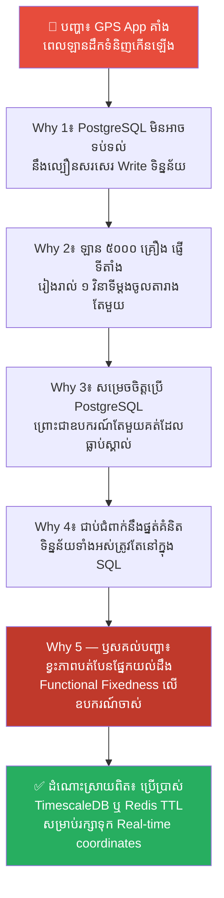
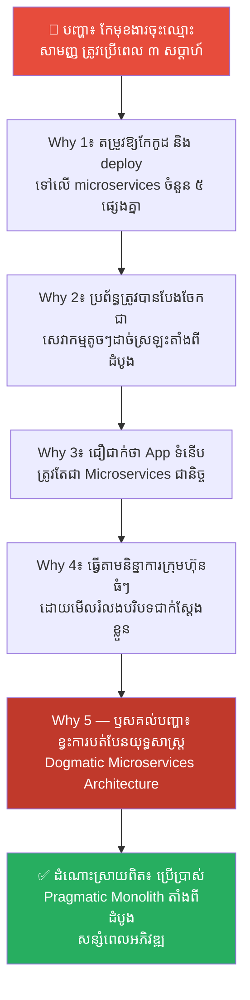
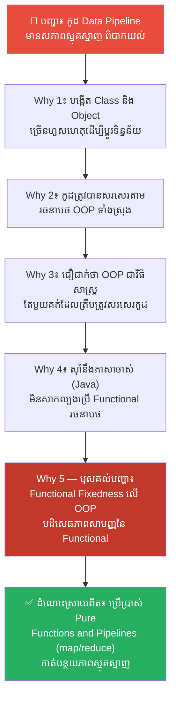
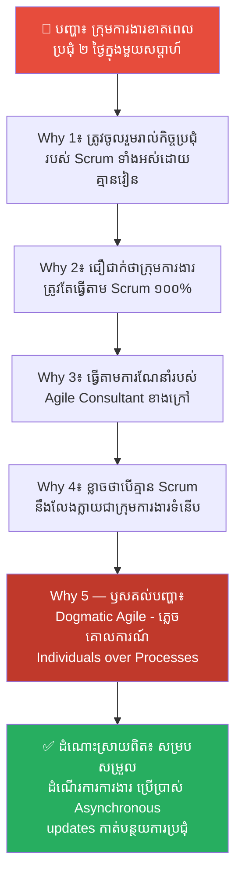
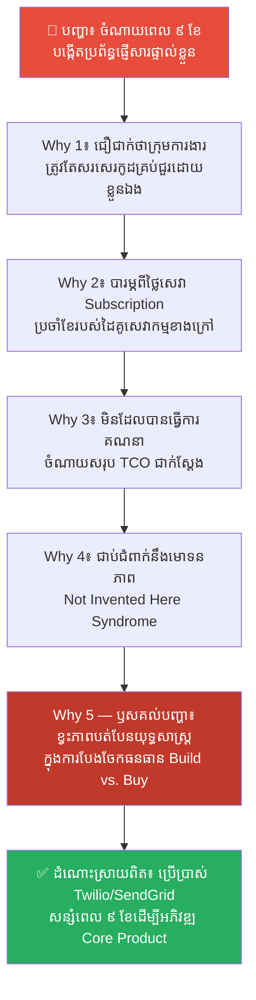
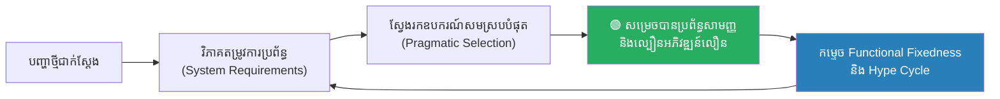

# Cognitive Flexibility: Overcoming Functional Fixedness (ភាពបត់បែនមិនប្រកាន់តឹងយុទ្ធសាស្ត្រ៖ ការយកឈ្នះលើការជាប់ជំពាក់នឹងមុខងារចាស់)

**Author:** ichamrong  
**Date:** 2026-05-27  
**Tags:** #cognitive-flexibility #functional-fixedness #software-architecture #agile #silver-bullet #decision-making #mental-models  
**Category:** Concepts  
**Read Time:** ~18 min  

---

## 📌 មាតិកា (Table of Contents)
- [លំនាំបញ្ហា (The Pattern)](#លំនាំបញ្ហា-the-pattern)
- [១. បញ្ហា៖ អាវុធរិលនិងការខ្វះការបត់បែន (The Issue: Dull Weapons & Rigidity)](#១-បញ្ហា-អាវុធរិលនិងការខ្វះការបត់បែន-the-issue-dull-weapons--rigidity)
- [២. ឧទាហរណ៍ជាក់ស្តែងក្នុងពិភពពិត (Real World Examples)](#២-ឧទាហរណ៍ជាក់ស្តែងក្នុងពិភពពិត)
  - [ឧទាហរណ៍ទី ១ — ការជ្រើសរើសប្រភេទ Database ដោយជាប់ជំពាក់នឹងចំណេះដឹងចាស់ (SQL vs. NoSQL Dogma)](#ឧទាហរណ៍ទី-១-ការជ្រើសរើសប្រភេទ-database-ដោយជាប់ជំពាក់នឹងចំណេះដឹងចាស់-sql-vs-nosql-dogma)
  - [ឧទាហរណ៍ទី ២ — ការបែងចែកប្រព័ន្ធជា Microservices ដោយគ្មានការបត់បែន (Monolith vs. Microservices Dogmatism)](#ឧទាហរណ៍ទី-២-ការបែងចែកប្រព័ន្ធជា-microservices-ដោយគ្មានការបត់បែន-monolith-vs-microservices-dogmatism)
  - [ឧទាហរណ៍ទី ៣ — ការសរសេរកូដដោយជាប់ជំពាក់នឹង OOP តែមួយគត់ (OOP vs. Functional Programming Fixedness)](#ឧទាហរណ៍ទី-៣-ការសរសេរកូដដោយជាប់ជំពាក់នឹង-oop-តែមួយគត់-oop-vs-functional-programming-fixedness)
  - [ឧទាហរណ៍ទី ៤ — ការអនុវត្ត Scrum/Agile ដូចជាសាសនាដោយគ្មានការកែសម្រួល (Agile Methodology Dogmatism)](#ឧទាហរណ៍ទី-៤-ការអនុវត្ត-scrumagile-ដូចជាសាសនាដោយគ្មានការកែសម្រួល-agile-methodology-dogmatism)
  - [ឧទាហរណ៍ទី ៥ — ការជឿជាក់ថាក្រុមការងារត្រូវតែបង្កើតរាល់មុខងារដោយខ្លួនឯង (Build vs. Buy Functional Fixedness)](#ឧទាហរណ៍ទី-៥-ការជឿជាក់ថាក្រុមការងារត្រូវតែបង្កើតរាល់មុខងារដោយខ្លួនឯង-build-vs-buy-functional-fixedness)
- [៣. កត្តាជម្រុញ៖ ភាពពេញនិយមរបស់ Framework និងការភ័យខ្លាចការផ្លាស់ប្តូរ (The Aggravator: Hype Cycles & Status Quo Bias)](#៣-កត្តាជម្រុញ-ភាពពេញនិយមរបស់-framework-និងការភ័យខ្លាចការផ្លាស់ប្តូរ-the-aggravator-hype-cycles--status-quo-bias)
- [៤. ដំណោះស្រាយទូទៅ៖ ការបណ្តុះស្មារតីបត់បែនយុទ្ធសាស្ត្រ (The General Solution: Cultivating Cognitive Flexibility)](#៤-ដំណោះស្រាយទូទៅ-ការបណ្តុះស្មារតីបត់បែនយុទ្ធសាស្ត្រ-the-general-solution-cultivating-cognitive-flexibility)
- [សេចក្តីសន្និដ្ឋាន (Conclusion)](#សេចក្តីសន្និដ្ឋាន-conclusion)
- [ឯកសារយោង (References)](#references)
- [Related Posts](#related-posts)

---

## លំនាំបញ្ហា (The Pattern)

សាកស្រមៃមើលពីទិដ្ឋភាពនេះ៖ ក្រុមហ៊ុនបច្ចេកវិទ្យាមួយ កំពុងជួបបញ្ហាប្រព័ន្ធដំណើរការយឺតយ៉ាវ និងមិនអាចទាញទិន្នន័យរបាយការណ៍ទាន់ពេលវេលា។ ក្រុមការងារសម្រេចចិត្តដោះស្រាយបញ្ហានេះដោយការសរសេរកូដបន្ថែម បង្កើត Table ថ្មីៗ និងជួល Server ធំៗ។ តែទោះបីជាខំប្រឹងកែកូដយ៉ាងណាក៏ដោយ ក៏ប្រព័ន្ធនៅតែយឺតដដែល។

នៅពេលអ្នកជំនាញខាងក្រៅម្នាក់មកពិនិត្យមើល គាត់សួរថា៖ *«ហេតុអ្វីបានជាអ្នកប្រើប្រាស់ Relational Database (SQL) សម្រាប់រក្សាទុកទិន្នន័យ logs ទំហំរាប់រយលានជួរ ដែលមិនត្រូវការទំនាក់ទំនង (Relationships) អ្វីសោះបែបនេះ?»*

សមាជិកក្រុមឆ្លើយទាំងងឿងឆ្ងល់៖ *«ព្រោះតាំងពីបង្កើតក្រុមហ៊ុនមក ពួកយើងធ្លាប់តែប្រើប្រាស់ PostgreSQL ហ្នឹងបង! ពួកយើងអត់ដែលគិតថាត្រូវប្រើប្រាស់ NoSQL ឬ Time-Series Database ផ្សេងទៀតទេ...»*

នេះគឺជាឧទាហរណ៍ច្បាស់លាស់នៃ **Functional Fixedness (ការជាប់ជំពាក់នឹងមុខងារចាស់)**។ ក្រុមការងារមានទំនោរចិត្តប្រើប្រាស់ឧបករណ៍ ឬបច្ចេកវិទ្យាតែមួយគត់ដែលខ្លួនធ្លាប់ស្គាល់ សម្រាប់ដោះស្រាយរាល់បញ្ហាទាំងអស់ ទោះបីជាឧបករណ៍នោះលែងសមស្របនឹងស្ថានភាពបច្ចុប្បន្នក៏ដោយ។

ពួកគេបានខ្វះ **Cognitive Flexibility (ភាពបត់បែនមិនប្រកាន់តឹងយុទ្ធសាស្ត្រ)** — គឺសមត្ថភាពខួរក្បាលក្នុងការបោះបង់ចោលផ្នត់គំនិតចាស់ រៀនសូត្រពីឧបករណ៍ថ្មី និងសម្របខ្លួនទៅតាមបរិបទប្រែប្រួលជាក់ស្តែង។

---

## ១. បញ្ហា៖ អាវុធរិលនិងការខ្វះការបត់បែន (The Issue: Dull Weapons & Rigidity)

នៅក្នុងក្បួនសឹកស៊ុនអ៊ូ ជំពូកទី ៨ **«九变» (九变 Jiubian - Variation in Tactics)** គាត់បានបញ្ជាក់យ៉ាងច្បាស់ថា៖
> **«មេទ័ពដែលមិនយល់ដឹងពីរបៀបបត់បែនយុទ្ធសាស្ត្រទាំង ៩ យ៉ាង ទោះបីជាដឹងពីភូមិសាស្ត្រច្បាស់លាស់ ក៏មិនអាចកេងប្រវ័ញ្ចយកអត្ថប្រយោជន៍ពីដីនោះបានឡើយ។ ការគ្រប់គ្រងកងទ័ពដោយគ្មានសិល្បៈនៃការបត់បែន គឺដូចជាការកាន់អាវុធរិលទៅច្បាំងដូច្នោះឯង។»**

នៅក្នុងវិស័យវិស្វកម្មកម្មវិធី **Cognitive Flexibility** គឺជាសមត្ថភាពរបស់វិស្វករ និងអ្នកដឹកនាំក្នុងការ៖
1.  **ចៀសវាង «យុទ្ធសាស្ត្រគ្រាប់កាំភ្លើងប្រាក់» (Silver Bullet Syndrome)៖** ការយល់ច្រឡំថានឹងមានបច្ចេកវិទ្យា ភាសា ឬ Framework ណាមួយដែលអាចដោះស្រាយបានរាល់បញ្ហាទាំងអស់ក្នុងលោក។
2.  **យកឈ្នះលើ «Functional Fixedness»៖** ការមិនជាប់ជំពាក់នឹងការប្រើប្រាស់ឧបករណ៍មួយ ទៅតាមតែវិធីសាស្ត្រចាស់ដដែលៗ។

*   ❌ **Dogmatic Rigidity (ភាពរឹងត្អឹងយុទ្ធសាស្ត្រ)៖** *«ពួកយើងជា OOP shop ដូច្នេះអ្វីៗគ្រប់យ៉ាងត្រូវតែសរសេរជា Class និងប្រើប្រាស់ Design Patterns ស្មុគស្មាញ»* ឬ *«យើងត្រូវតែប្រើ Scrum គ្រប់ជំហានដោយគ្មានការផ្លាស់ប្តូរ»*។
*   ✅ **Cognitive Flexibility (ភាពបត់បែនឆ្លាតវៃ)៖** *«ស្ថានភាពនេះត្រូវការល្បឿន និងភាពសាមញ្ញ ដូច្នេះយើងគួរប្រើប្រាស់ Functional scripting ជំនួសឱ្យ OOP ធុនធ្ងន់»* ឬ *«គម្រោងនេះតូចពេក មិនសមនឹងប្រើ Scrum ទេ យើងគួរប្រើប្រាស់ Kanban វិញ»*។

---

## ២. ឧទាហរណ៍ជាក់ស្តែងក្នុងពិភពពិត

សូមពិនិត្យមើល **ឧទាហរណ៍ជាក់ស្តែងចំនួន ៥** បង្ហាញពីផលប៉ះពាល់នៃការខ្វះភាពបត់បែន និងវិធីសាស្ត្រដោះស្រាយ៖

---

### ឧទាហរណ៍ទី ១ — ការជ្រើសរើសប្រភេទ Database ដោយជាប់ជំពាក់នឹងចំណេះដឹងចាស់ (SQL vs. NoSQL Dogma)

**បញ្ហា៖** App តាមដានទីតាំងឡានដឹកទំនិញ (Real-time GPS Tracking App) មានបញ្ហាយឺតយ៉ាវ និងគាំងជាប្រចាំ នៅពេលចំនួនឡានកើនដល់ ៥,០០០ គ្រឿង។

**ដំណោះស្រាយលើផ្ទៃក្រៅ៖** បង្កើនទំហំម៉ាស៊ីន PostgreSQL Server ឱ្យមាន RAM និង CPU ធំជាងមុន ដើម្បីទ្រទ្រង់ការសរសេរកូដលឿន។  
(លទ្ធផល៖ ថ្លៃចំណាយកើនឡើង ៤ ដង ប៉ុន្តែប្រព័ន្ធនៅតែជួបបញ្ហា Bottleneck ព្រោះទិន្នន័យកើនលឿនពេក។)

**ការវិភាគបែប 5 Whys៖**

| # | សំណួរ (Why?) | ចម្លើយ (Answer) |
|---|---|---|
| 1 | ហេតុអ្វីបានជា App យឺតយ៉ាវ និងគាំង? | ពីព្រោះ PostgreSQL database មិនអាចទប់ទល់នឹងល្បឿនសរសេរទិន្នន័យ (High Write Throughput)។ |
| 2 | ហេតុអ្វីបានជា write throughput ខ្ពស់ម្ល៉េះ? | ពីព្រោះឡានទាំង ៥,០០០ គ្រឿង ផ្ញើកូអរដោនេទីតាំងថ្មីរៀងរាល់ ១ វិនាទីម្តង ចូលទៅក្នុងតារាងតែមួយ។ |
| 3 | ហេតុអ្វីបានជាប្រើប្រាស់ PostgreSQL សម្រាប់រក្សាទុកទិន្នន័យ Real-time write ដ៏លឿនបែបនេះ? | ពីព្រោះក្រុមការងារសម្រេចចិត្តប្រើប្រាស់ PostgreSQL ព្រោះវាជា database តែមួយគត់ដែលពួកគេធ្លាប់ប្រើប្រាស់កាលពីមុន។ |
| 4 | ហេតុអ្វីបានជាមិនពិចារណាប្រើប្រាស់ Time-Series ឬ NoSQL database (ឧទាហរណ៍៖ Redis, TimescaleDB, MongoDB)? | ពីព្រោះពួកគេជាប់ជំពាក់នឹងផ្នត់គំនិតថា «រាល់ទិន្នន័យទាំងអស់ត្រូវតែរក្សាទុកក្នុង SQL ជានិច្ច» (Functional Fixedness)។ |
| 5 | ហេតុអ្វីបានជាជាប់ជំពាក់នឹង SQL ទាំងស្រុង? | **ពីព្រោះវប្បធម៌ការងាររបស់ក្រុមហ៊ុនខ្វះភាពបត់បែនផ្នែកយល់ដឹង (Cognitive Flexibility)។ ពួកគេមិនបានជំរុញឱ្យវិស្វករសិក្សា និងវាយតម្លៃឧបករណ៍ថ្មីៗ ទៅតាមតម្រូវការជាក់ស្តែងរបស់ប្រព័ន្ធឡើយ។** |

**ដំណោះស្រាយពិតប្រាកដ៖** បើកចិត្តទទួលយកបច្ចេកវិទ្យាថ្មី និងប្រើប្រាស់ TimescaleDB ឬ Redis key-value cache សម្រាប់ដំណើរការទិន្នន័យបណ្តោះអាសន្ន រួចទើបផ្ទេរទិន្នន័យសង្ខេបទៅកាន់ PostgreSQL ដើម្បីរក្សាទុកយូរអង្វែង។

---

### ឧទាហរណ៍ទី ២ — ការបែងចែកប្រព័ន្ធជា Microservices ដោយគ្មានការបត់បែន (Monolith vs. Microservices Dogmatism)

**បញ្ហា៖** ក្រុមហ៊ុនស្តាតអាត (Startup) មួយត្រូវចំណាយពេលដល់ទៅ ៣ សប្តាហ៍ គ្រាន់តែដើម្បីផ្លាស់ប្តូរមុខងារចុះឈ្មោះអ្នកប្រើប្រាស់ (User Registration Flow) ដ៏សាមញ្ញមួយ។

**ដំណោះស្រាយលើផ្ទៃក្រៅ៖** ជួល Scrum Master ឱ្យមកជួយរៀបចំប្រជុំឱ្យបានច្រើន ដើម្បីសម្របសម្រួលរវាងក្រុមការងារផ្សេងៗ។  
(លទ្ធផល៖ ពេលវេលាកាន់តែស្ទះជាងមុន ព្រោះមនុស្សត្រូវចំណាយពេលប្រជុំឥតឈប់ឈរ។)

**ការវិភាគបែប 5 Whys៖**

| # | សំណួរ (Why?) | ចម្លើយ (Answer) |
|---|---|---|
| 1 | ហេតុអ្វីបានជាការកែប្រែមុខងារសាមញ្ញ ត្រូវប្រើពេលដល់ទៅ ៣ សប្តាហ៍? | ពីព្រោះការកែប្រែនេះតម្រូវឱ្យកែកូដ និង deploy ទៅលើ microservices ចំនួន ៥ ផ្សេងគ្នា។ |
| 2 | ហេតុអ្វីបានជាត្រូវប្រើប្រាស់ microservices ដល់ទៅ ៥ សម្រាប់មុខងារចុះឈ្មោះសាមញ្ញបែបនេះ? | ពីព្រោះប្រព័ន្ធត្រូវបានបែងចែកជាសេវាកម្មតូចៗដាច់ស្រឡះតាំងពីថ្ងៃដំបូងនៃការបង្កើតក្រុមហ៊ុន។ |
| 3 | ហេតុអ្វីបានជាបែងចែកជា microservices ច្រើនម្ល៉េះតាំងពីដំបូង នៅពេលដែលគ្មាន traffic? | ពីព្រោះស្ថាបត្យករប្រព័ន្ធ (Architect) ជឿជាក់យ៉ាងមុតមាំថា «រាល់ App ទំនើបទាំងអស់ត្រូវតែជា Microservices ជានិច្ច»។ |
| 4 | ហេតុអ្វីបានជាជឿជាក់លើ Microservices ទាំងងងឹតងងុល ទោះបីជាវាបង្កើតភាពស្មុគស្មាញហួសហេតុ? | ពីព្រោះពួកគេចង់ធ្វើតាមនិន្នាការបច្ចេកវិទ្យារបស់ក្រុមហ៊ុនធំៗ (Google, Netflix) ដោយមើលរំលងបរិបទជាក់ស្តែងរបស់ខ្លួន (Hype-Driven Architecture)។ |
| 5 | ហេតុអ្វីបានជាមើលរំលងបរិបទជាក់ស្តែងរបស់ខ្លួន? | **ពីព្រោះពួកគេខ្វះការបត់បែនយុទ្ធសាស្ត្រ (Architectural Rigidity)។ ពួកគេមិនបានយល់ថា សម្រាប់ក្រុមហ៊ុនទើបចាប់ផ្តើម ស្ថាបត្យកម្ម Monolith ដ៏សាមញ្ញ ផ្តល់ល្បឿន និងភាពបត់បែនលឿនជាងមុនជាច្រើនដង។** |

**ដំណោះស្រាយពិតប្រាកដ៖** ប្រើប្រាស់ស្ថាបត្យកម្ម **Pragmatic Monolith (ម៉ូណូលីតជាក់ស្តែងនិយម)** សម្រាប់ដំណាក់កាលដំបូងនៃអាជីវកម្ម ដើម្បីរក្សាល្បឿនអភិវឌ្ឍន៍ឱ្យបានលឿនបំផុត។ នៅពេលប្រព័ន្ធកើនឡើងធំ និងមាន traffic ពិតប្រាកដ ទើបចាប់ផ្តើមបំបែកជា microservices ជាក់លាក់ទៅតាមតម្រូវការ។

---

### ឧទាហរណ៍ទី ៣ — ការសរសេរកូដដោយជាប់ជំពាក់នឹង OOP តែមួយគត់ (OOP vs. Functional Programming Fixedness)

**បញ្ហា៖** កូដសម្រាប់វិភាគទិន្នន័យ (Data Processing Pipeline) របស់ App មួយមានសភាពស្មុគស្មាញខ្លាំងណាស់ (មាន class រាប់សិប និង inheritance ជាន់ៗគ្នា) ពិបាកនឹងយល់ និងងាយបង្ក Bug។

**ដំណោះស្រាយលើផ្ទៃក្រៅ:** បន្ថែមការសរសេរឯកសារចងក្រង (Documentation) ឱ្យបានលម្អិត និងបង្ខំឱ្យវិស្វករថ្មីៗចូលរួមវគ្គបណ្តុះបណ្តាលដើម្បីយល់ពី class ទាំងនោះ។  
(លទ្ធផល៖ កូដនៅតែស្មុគស្មាញ និងពិបាកថែទាំដដែល។)

**ការវិភាគបែប 5 Whys៖**

| # | សំណួរ (Why?) | ចម្លើយ (Answer) |
|---|---|---|
| 1 | ហេតុអ្វីបានជាកូដវិភាគទិន្នន័យមានសភាពស្មុគស្មាញ និងពិបាកយល់? | ពីព្រោះវាត្រូវបង្កើត Class និង Object ច្រើនហួសហេតុ គ្រាន់តែដើម្បីផ្លាស់ប្តូរទម្រង់ទិន្នន័យសាមញ្ញ។ |
| 2 | ហេតុអ្វីបានជាត្រូវប្រើប្រាស់ Class និង Object ច្រើនម្ល៉េះ? | ពីព្រោះកូដត្រូវបានសរសេរតាមរចនាបថ Object-Oriented Programming (OOP) ទាំងស្រុង។ |
| 3 | ហេតុអ្វីបានជាត្រូវបង្ខំសរសេរជា OOP សម្រាប់ដំណើរការទិន្នន័យលំហូរ (Stream/Data Pipeline)? | ពីព្រោះ Developer ជឿជាក់ថា OOP គឺជាវិធីសាស្ត្រតែមួយគត់ដែលត្រឹមត្រូវក្នុងការសរសេរកូដប្រកបដោយវិជ្ជាជីវៈ។ |
| 4 | ហេតុអ្វីបានជាយល់ថា OOP គឺជាជម្រើសតែមួយគត់? | ពីព្រោះពួកគេរៀនសូត្រ និងស៊ាំនឹងភាសា Java/C# តាំងពីសាលា និងមិនដែលសាកល្បងប្រើប្រាស់រចនាបថ Functional Programming ឡើយ។ |
| 5 | ហេតុអ្វីបានជាបដិសេធមិនសាកល្បង Functional Programming? | **ពីព្រោះពួកគេជាប់ជំពាក់នឹង Functional Fixedness លើរចនាបថសរសេរកូដចាស់។ ពួកគេមិនដឹងថា សម្រាប់ដំណើរការវិភាគទិន្នន័យ (Data Transformation) រចនាបថ Functional Programming (សរសេរជា pure functions) ផ្តល់ភាពសាមញ្ញ គ្មានការប្រែប្រួលរដ្ឋ (Immutability) និងយល់បានលឿនជាងមុនជាច្រើនដង។** |

**ដំណោះស្រាយពិតប្រាកដ៖** បំបែកផ្នត់គំនិត និងរៀនសូត្រពី Functional Programming (ឧទាហរណ៍៖ ប្រើប្រាស់ `map`, `filter`, `reduce` pipelines នៅក្នុង JavaScript, Python, ឬ Go) ដើម្បីកាត់បន្ថយ Class ស្មុគស្មាញ និងរក្សាបាននូវភាពស្អាតស្អំនៃកូដ។

---

### ឧទាហរណ៍ទី ៤ — ការអនុវត្ត Scrum/Agile ដូចជាសាសនាដោយគ្មានការកែសម្រួល (Agile Methodology Dogmatism)

**បញ្ហា៖** ក្រុមការងារមានអារម្មណ៍ធុញទ្រាន់នឹងការប្រជុំ និងត្រូវខាតបង់ពេលវេលាអភិវឌ្ឍកូដដល់ទៅ ២ ថ្ងៃក្នុងមួយសប្តាហ៍ គ្រាន់តែដើម្បីចូលរួមប្រជុំការងារ។

**ដំណោះស្រាយលើផ្ទៃក្រៅ៖** បង្ខំឱ្យ Scrum Master ត្រួតពិនិត្យឱ្យបានម៉ត់ចត់ដើម្បីកុំឱ្យការប្រជុំអូសបន្លាយពេលហួសការកំណត់។  
(លទ្ធផល៖ សមាជិកក្រុមនៅតែមានអារម្មណ៍ធុញទ្រាន់ និងមានសម្ពាធការងារដដែល។)

**ការវិភាគបែប 5 Whys៖**

| # | សំណួរ (Why?) | ចម្លើយ (Answer) |
|---|---|---|
| 1 | ហេតុអ្វីបានជាក្រុមការងារខាតពេលប្រជុំច្រើនម្ល៉េះ? | ពីព្រោះពួកគេត្រូវចូលរួមរាល់កិច្ចប្រជុំរបស់ Scrum ដូចជា Daily Standup, Backlog Grooming, Sprint Planning, Demo, និង Retrospective។ |
| 2 | ហេតុអ្វីបានជាត្រូវចូលរួមគ្រប់កិច្ចប្រជុំដោយគ្មានការលើកលែង? | ពីព្រោះប្រធានគម្រោងជឿជាក់ថា «យើងជាក្រុមការងារ Agile ដូច្នេះយើងត្រូវតែអនុវត្តតាមសៀវភៅណែនាំ Scrum ឱ្យបាន ១០០%»។ |
| 3 | ហេតុអ្វីបានជាត្រូវធ្វើតាមសៀវភៅណែនាំ Scrum ទាំងងងឹតងងុល ទោះបីវាមិនសមស្របនឹងទំហំក្រុម? | ពីព្រោះក្រុមហ៊ុនបានជួលអ្នកប្រឹក្សាខាងក្រៅ (Agile Consultant) ដែលបានបង្កើតច្បាប់ទាំងនេះឡើង ហើយចាត់ទុកវាជាស្តង់ដារដាច់ខាត។ |
| 4 | ហេតុអ្វីបានជាចាត់ទុកវាជាស្តង់ដារដាច់ខាតដោយមិនហ៊ានផ្លាស់ប្តូរ? | ពីព្រោះពួកគេខ្លាចថា បើគ្មាន Scrum ពួកយើងនឹងលែងក្លាយជា «ក្រុមការងារទំនើប» (Status Quo Bias)។ |
| 5 | ហេតុអ្វីបានជាខ្លាចការផ្លាស់ប្តូរដំណើរការការងារ? | **ពីព្រោះពួកគេជាប់ជំពាក់នឹង Dogmatic Agile (ភាពរឹងត្អឹងនៃវិធីសាស្ត្រ)។ ពួកគេភ្លេចគោលការណ៍គ្រឹះដំបូងបំផុតនៃ Agile Manifesto ថា៖ «មនុស្ស និងការប្រកបការងារជាក់ស្តែង មានតម្លៃជាងដំណើរការ និងឧបករណ៍ការងារ» (Individuals and interactions over processes and tools)។** |

**ដំណោះស្រាយពិតប្រាកដ៖** ផ្លាស់ប្តូរការប្រជុំដែលមិនចាំបាច់ឱ្យទៅជាការសរសេររបាយការណ៍ស្ងាត់ (Asynchronous Updates លើ Slack) និងកាត់បន្ថយពេលវេលាប្រជុំ Planning ឱ្យមកនៅខ្លីបំផុត សមស្របទៅនឹងតម្រូវការជាក់ស្តែងរបស់សមាជិកក្រុម។

---

### ឧទាហរណ៍ទី ៥ — ការជឿជាក់ថាក្រុមការងារត្រូវតែបង្កើតរាល់មុខងារដោយខ្លួនឯង (Build vs. Buy Functional Fixedness)

**បញ្ហា៖** ក្រុមហ៊ុនបានចំណាយពេលដល់ទៅ ៩ ខែ និងថវិការាប់ម៉ឺនដុល្លារក្នុងការបង្កើតប្រព័ន្ធផ្ញើសារ SMS និងអ៊ីមែល (Notification Engine) ផ្ទាល់ខ្លួន ប៉ុន្តែប្រព័ន្ធនៅតែជួបបញ្ហាផ្ញើសារយឺត និងមិនមានសុវត្ថិភាព។

**ដំណោះស្រាយលើផ្ទៃក្រៅ៖** បន្ថែមវិស្វករថ្មីដើម្បីអភិវឌ្ឍ និងជួសជុលប្រព័ន្ធផ្ញើសារនោះឱ្យបានល្អឥតខ្ចោះ។  
(លទ្ធផល៖ ខាតបង់ពេលវេលា និងធនធានដែលគួរយកទៅអភិវឌ្ឍ Core Product របស់ក្រុមហ៊ុន។)

**ការវិភាគបែប 5 Whys៖**

| # | សំណួរ (Why?) | ចម្លើយ (Answer) |
|---|---|---|
| 1 | ហេតុអ្វីបានជាចំណាយពេលរាប់ខែបង្កើត Notification Engine ផ្ទាល់ខ្លួន? | ពីព្រោះក្រុមការងារជឿជាក់ថា «យើងជាក្រុមហ៊ុនបច្ចេកវិទ្យា ដូច្នេះកូដគ្រប់ជួរត្រូវតែសរសេរដោយខ្លួនឯង»។ |
| 2 | ហេតុអ្វីបានជាជឿជាក់ថាត្រូវតែសរសេរដោយខ្លួនឯង? | ពីព្រោះពួកគេបារម្ភពីថ្លៃសេវាប្រចាំខែ (Subscription Fee) របស់ដៃគូខាងក្រៅ។ |
| 3 | ហេតុអ្វីបានជាបារម្ភពីថ្លៃសេវាខាងក្រៅ ទោះបីជាថ្លៃកម្លាំងពលកម្មអភិវឌ្ឍន៍ផ្ទាល់ខ្លួនថ្លៃជាង ១០ ដង? | ពីព្រោះពួកគេមិនដែលបានធ្វើការគណនាចំណាយសរុប (Total Cost of Ownership - TCO) ជាក់ស្តែងឡើយ។ |
| 4 | ហេតុអ្វីបានជាមិនធ្វើការគណនា TCO? | ពីព្រោះពួកគេជាប់ជំពាក់នឹង «មោទនភាពអ្នកបច្ចេកវិទ្យា» (Not Invented Here Syndrome) ដែលចាត់ទុកការប្រើប្រាស់របស់គេជាការបង្ហាញពីភាពអន់ខ្សោយ។ |
| 5 | ហេតុអ្វីបានជាជាប់ជំពាក់នឹងមោទនភាព Not Invented Here? | **ពីព្រោះពួកគេខ្វះភាពបត់បែនយុទ្ធសាស្ត្រក្នុងការបែងចែកធនធាន (Strategic Build vs. Buy Flexibility)។ ពួកគេមិនបានយល់ថា សម្រាប់មុខងារបន្ទាប់បន្សំ (Non-core features) ការទិញសេវាកម្មស្តង់ដារ (ឧទាហរណ៍៖ Twilio, SendGrid) ជួយសន្សំពេលវេលា និងថាមពលយល់ដឹងដើម្បីយកទៅបង្កើតតម្លៃពិតសម្រាប់ Core Product។** |

**ដំណោះស្រាយពិតប្រាកដ៖** អនុវត្តគោលការណ៍ **«Build Core, Buy Context»** (បង្កើតតែអ្វីដែលជាបេះដូងអាជីវកម្ម, ទិញអ្វីដែលជាបរិបទបន្ទាប់បន្សំ)។ ប្រើប្រាស់សេវាកម្មកម្រិតសកលដូចជា SendGrid ឬ Twilio សម្រាប់ដំណើរការផ្ញើសារ រួចទុកពេលវេលាឱ្យវិស្វករអភិវឌ្ឍមុខងារស្នូលរបស់ក្រុមហ៊ុន។

---

## ៣. កត្តាជម្រុញ៖ ភាពពេញនិយមរបស់ Framework និងការភ័យខ្លាចការផ្លាស់ប្តូរ (The Aggravator: Hype Cycles & Status Quo Bias)

ហេតុអ្វីបានជាវិស្វករកម្មវិធីជាច្រើន ងាយនឹងធ្លាក់ចូលក្នុងអន្ទាក់ **Functional Fixedness** និងការខ្វះភាពបត់បែន?

1.  **វដ្តនៃការឃោសនាបច្ចេកវិទ្យា (The Hype Cycle)៖** ប្រព័ន្ធផ្សព្វផ្សាយ និងសហគមន៍បច្ចេកវិទ្យា តែងតែបង្កើតការឃោសនាបំផ្លើសរាល់ពេលដែលមាន Framework ថ្មីៗលេចឡើង (ឧទាហរណ៍៖ React, Kubernetes, AI APIs)។ នេះបង្កើតជា **FOMO (Fear Of Missing Out)** ដែលបង្ខំឱ្យវិស្វករយកបច្ចេកវិទ្យាទាំងនោះមកប្រើប្រាស់គ្រប់កន្លែង ដោយមិនបានវិភាគពីភាពសមស្របនឹងប្រព័ន្ធការងារខ្លួន។
2.  **ការជាប់ជំពាក់នឹងផ្នត់គំនិតចាស់ (Status Quo Bias / Emotional Attachment)៖** មនុស្សយើងមានទំនោរចិត្តស្រឡាញ់ និងការពារអ្វីដែលខ្លួនធ្លាប់រៀនសូត្រ និងស៊ាំជាមួយជាច្រើនឆ្នាំ។ Developer ម្នាក់ដែលចំណាយពេល ៥ ឆ្នាំរៀនសរសេរ Java នឹងព្យាយាមដោះស្រាយរាល់បញ្ហាទាំងអស់ក្នុងលោកដោយសរសេរជាភាសា Java ទោះបីជាបញ្ហានោះអាចដោះស្រាយបានលឿនជាងដោយប្រើប្រាស់ Python scripting សាមញ្ញក៏ដោយ។
3.  **កង្វះការរៀនសូត្រចម្រុះ (Knowledge Monoculture)៖** នៅពេលស្ថាប័ន ឬបុគ្គលម្នាក់ៗមិនធ្លាប់បានសិក្សាពីភាសា ស្ថាបត្យកម្ម ឬវិធីសាស្ត្រការងារចម្រុះ (Multi-paradigm learning) ពួកគេនឹងគ្មានជម្រើសអ្វីក្រៅតែពីការយកឧបករណ៍ចាស់មកដោះស្រាយបញ្ហាថ្មីឡើយ។

---

## ៤. ដំណោះស្រាយទូទៅ៖ ការបណ្តុះស្មារតីបត់បែនយុទ្ធសាស្ត្រ (The General Solution: Cultivating Cognitive Flexibility)

ដើម្បីយកឈ្នះលើ Functional Fixedness និងរក្សាបាននូវភាពរស់រវើកប្រកបដោយច្នៃប្រឌិតខ្ពស់ ក្រុមការងារត្រូវតែបង្កើតដំណើរការសម្រេចចិត្តប្រកបដោយវិទ្យាសាស្ត្រ៖

### អនុវត្តគោលការណ៍ «ជ្រើសរើសឧបករណ៍ឱ្យត្រូវនឹងការងារ» (Right Tool for the Right Job)
កុំសម្រេចចិត្តជ្រើសរើសបច្ចេកវិទ្យាដោយផ្អែកលើចំណូលចិត្តផ្ទាល់ខ្លួន ឬការឃោសនាក្នុងសង្គម។ ចូរបង្កើត **Technology Assessment Matrix (ម៉ាទ្រីសវាយតម្លៃបច្ចេកវិទ្យា)**៖
*   វាយតម្លៃរាល់បច្ចេកវិទ្យាថ្មី ផ្អែកលើលក្ខខណ្ឌជាក់ស្តែងចំនួន ៤៖ **ល្បឿនអភិវឌ្ឍន៍ (Velocity)**, **ស្ថិរភាពយូរអង្វែង (Maintainability)**, **ចំណាយចំណូល (Cost)**, និង **ជំនាញរបស់ក្រុមការងារ (Team Expertise)**។

### អនុវត្តគោលការណ៍ «Build Core, Buy Context»
*   **Core (បេះដូងអាជីវកម្ម)៖** បង្កើតដោយខ្លួនឯងភ្លាមៗ ព្រោះវាជាអ្វីដែលធ្វើឱ្យក្រុមហ៊ុនមានតម្លៃខុសប្លែកពីគេ (ឧទាហរណ៍៖ ក្បួនដោះស្រាយ Core Algorithm, UI/UX ផ្ទាល់ខ្លួន)។
*   **Context (បរិបទបន្ទាប់បន្សំ)៖** ទិញសេវាកម្មខាងក្រៅ (ឧទាហរណ៍៖ Authentication, Payment gateway, Notification, Analytics) ដើម្បីសន្សំពេលវេលា និងថាមពលរបស់ក្រុមការងារ។

### បណ្តុះបណ្តាលសមាជិកក្រុមឱ្យមាន «ផ្នត់គំនិតចម្រុះ» (T-Shaped Skills)
*   ជំរុញឱ្យវិស្វករកម្មវិធីរៀនសូត្រពីភាសា និងរចនាបថសរសេរកូដខុសៗគ្នា (ឧទាហរណ៍៖ អនុញ្ញាតឱ្យអ្នកសរសេរ OOP សាកល្បងរៀន Functional; ជំរុញឱ្យអ្នកប្រើប្រាស់ SQL សាកល្បងរៀន NoSQL)។ ការមានចំណេះដឹងចម្រុះ ជួយឱ្យខួរក្បាលរបស់ពួកគេមានភាពបត់បែនខ្ពស់ក្នុងការសម្រេចចិត្តរចនាប្លង់ប្រព័ន្ធ។

---

## សេចក្តីសន្និដ្ឋាន (Conclusion)

> **«ក្បួនសឹកមិនប្រកាន់តឹងរូបរាង ដូចទឹកដែលគ្មានរូបរាងដាច់ខាត។ អ្នកណាដែលអាចបត់បែនយុទ្ធសាស្ត្រទៅតាមការផ្លាស់ប្តូររបស់សត្រូវ នឹងអាចសម្រេចបានជ័យជម្នះអមតៈ។» — ស៊ុន អ៊ូ**

នៅក្នុងពិភពបច្ចេកវិទ្យាដែលប្រែប្រួលលឿនដូចបច្ចុប្បន្ន ភាពរឹងត្អឹង និងការជាប់ជំពាក់នឹងវិធីសាស្ត្រចាស់ដដែលៗ (Functional Fixedness) គឺជាផ្លូវដែលនាំទៅរកការដួលរលំ។ វិស្វករកម្មវិធី និងអ្នកដឹកនាំបច្ចេកវិទ្យាដ៏ឆ្នើម មិនដែលចាត់ទុកបច្ចេកវិទ្យាជា «សាសនា» ដែលត្រូវការពារដោយងងឹតងងុលឡើយ។ ពួកគេបណ្តុះភាពបត់បែនផ្នែកយល់ដឹង (Cognitive Flexibility) សម្របសម្រួល និងជ្រើសរើសឧបករណ៍ការងារឱ្យត្រូវនឹងតម្រូវការជាក់ស្តែង ដើម្បីរក្សាល្បឿនការងារឱ្យមានស្ថិរភាព និងសម្រេចបានជោគជ័យអមតៈ។

---

## ឯកសារយោង (References)

* **Brooks, F. P.** — *The Mythical Man-Month: Essays on Software Engineering* (1975)។ សៀវភៅបុរាណដែលបង្ហាញពីការខ្វះភាពបត់បែនក្នុងការគ្រប់គ្រងកម្លាំងពលកម្ម និង Brooks' Law។
* **Sun Tzu (Lionel Giles Translation)** — *The Art of War Chapter 8: Variation in Tactics*។ ការពិភាក្សាលម្អិតអំពីតម្រូវការបត់បែនយុទ្ធសាស្ត្រដើម្បីឈ្នះសង្គ្រាម។
* **Duncker, K.** — *Induced Motion: An Experimental Study on Cognitive Bias* (1945)។ ការស្រាវជ្រាវចិត្តសាស្ត្រដំបូងបង្អស់ដែលបានរកឃើញ និងនិយមន័យពាក្យ «Functional Fixedness»។

---

## Related Posts

* [The Wright Brothers and MVP៖ ការអភិវឌ្ឍគម្រោងបែប Agile](./52-the-wright-brothers-and-mvp.md)
* [Technical Debt and Refactoring៖ ការគ្រប់គ្រងបំណុលបច្ចេកវិទ្យា](./10-technical-debt-and-refactoring.md)
* [Scrum Contracts: DoR and DoD៖ ដំណើរការការងារមានស្ថិរភាព](./11-dor-and-dod-scrum-contracts.md)
