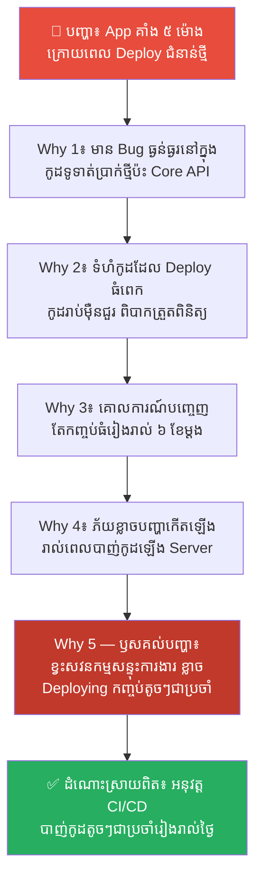
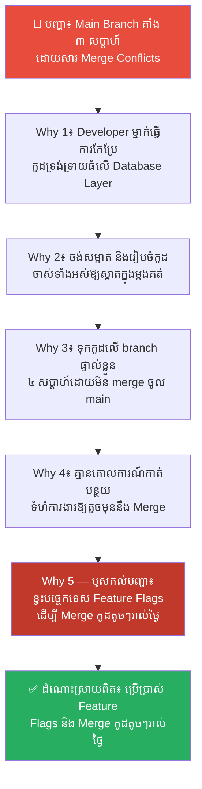
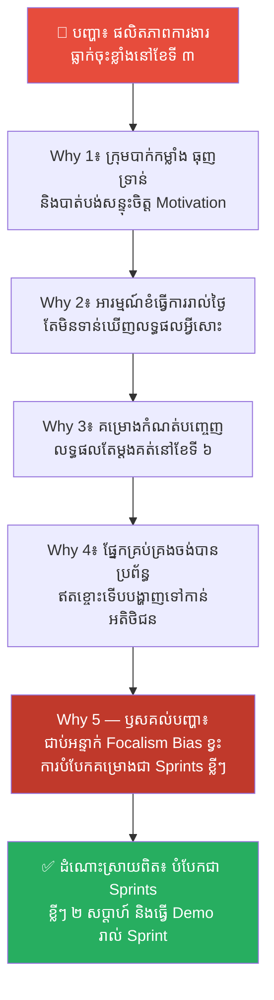
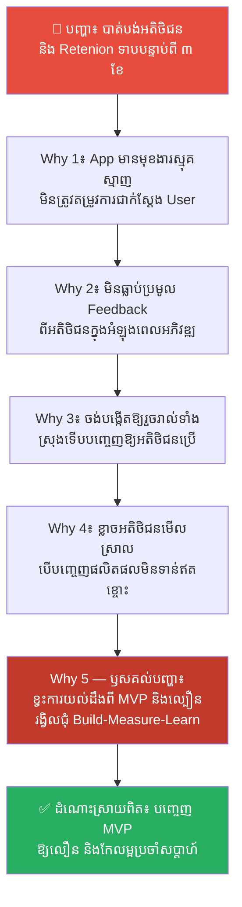
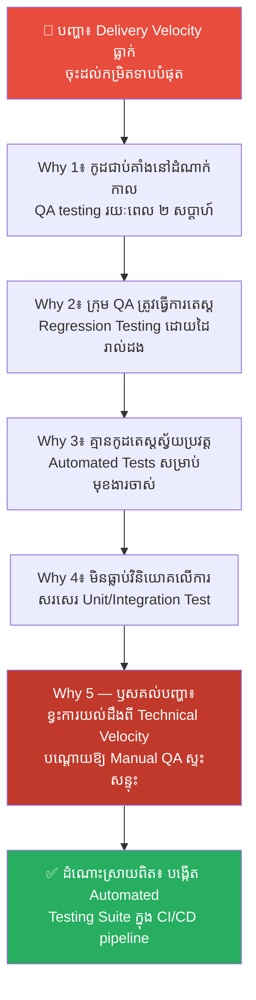
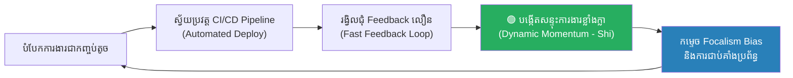

# Momentum Engineering: The Science of Strategic Momentum (ការរៀបចំសន្ទុះយុទ្ធសាស្ត្រ៖ វិទ្យាសាស្ត្រនៃការបង្កើតសន្ទុះដើម្បីយកឈ្នះភាពខ្វិននៃការយល់ដឹង)

**Author:** ichamrong  
**Date:** 2026-05-27  
**Tags:** #momentum-engineering #strategic-momentum #ci-cd #delivery-velocity #agile #focalism-bias #mental-models  
**Category:** Concepts  
**Read Time:** ~18 min  

---

## 📌 មាតិកា (Table of Contents)
- [លំនាំបញ្ហា (The Pattern)](#លំនាំបញ្ហា-the-pattern)
- [១. បញ្ហា៖ ថាមពលសន្ទុះ និងល្បឿននៃការប្រយុទ្ធ (The Issue: Momentum Energy & Combat Velocity)](#១-បញ្ហា-ថាមពលសន្ទុះ-និងល្បឿននៃការប្រយុទ្ធ-the-issue-momentum-energy--combat-velocity)
- [២. ឧទាហរណ៍ជាក់ស្តែងក្នុងពិភពពិត (Real World Examples)](#២-ឧទាហរណ៍ជាក់ស្តែងក្នុងពិភពពិត)
  - [ឧទាហរណ៍ទី ១ — ការចេញផ្សាយកម្មវិធីទ្រង់ទ្រាយធំ ធៀបនឹងការចេញផ្សាយតូចៗជាប្រចាំ (Massive Release vs. Continuous Delivery)](#ឧទាហរណ៍ទី-១-ការចេញផ្សាយកម្មវិធីទ្រង់ទ្រាយធំ-ធៀបនឹងការចេញផ្សាយតូចៗជាប្រចាំ-massive-release-vs-continuous-delivery)
  - [ឧទាហរណ៍ទី ២ — ការកែកូដទ្រង់ទ្រាយធំក្នុងពេលតែមួយ ធ្វើឱ្យស្ទះលំហូរការងារ (Massive Refactoring Block)](#ឧទាហរណ៍ទី-២-ការកែកូដទ្រង់ទ្រាយធំក្នុងពេលតែមួយ-ធ្វើឱ្យស្ទះលំហូរការងារ-massive-refactoring-block)
  - [ឧទាហរណ៍ទី ៣ — ការកំណត់គោលដៅវែងពេក នាំឱ្យក្រុមការងារបាត់បង់សន្ទុះចិត្ត (Long Goals vs. Short Sprints)](#ឧទាហរណ៍ទី-៣-ការកំណត់គោលដៅវែងពេក-នាំឱ្យក្រុមការងារបាត់បង់សន្ទុះចិត្ត-long-goals-vs-short-sprints)
  - [ឧទាហរណ៍ទី ៤ — ការស្ទះសន្ទុះអតិថិជនដោយសារល្បឿនផ្តល់ Feedback យឺត (Slow Feedback Loops)](#ឧទាហរណ៍ទី-៤-ការស្ទះសន្ទុះអតិថិជនដោយសារល្បឿនផ្តល់-feedback-យឺត-slow-feedback-loops)
  - [ឧទាហរណ៍ទី ៥ — ការស្ទះសន្ទុះការងារដោយសារដំណើរការ Test ដោយដៃយឺតយ៉ាវ (Manual QA Pipeline Bottlenecks)](#ឧទាហរណ៍ទី-៥-ការស្ទះសន្ទុះការងារដោយសារដំណើរការ-test-ដោយដៃយឺតយ៉ាវ-manual-qa-pipeline-bottlenecks)
- [៣. កត្តាជម្រុញ៖ ភាពស្មុគស្មាញ និងការប្រមូលផ្តុំការងារធំៗ (The Aggravator: Complexity & Large Batch Sizes)](#៣-កត្តាជម្រុញ-ភាពស្មុគស្មាញ-និងការប្រមូលផ្តុំការងារធំៗ-the-aggravator-complexity--large-batch-sizes)
- [៤. ដំណោះស្រាយទូទៅ៖ របៀបរៀបចំសន្ទុះការងារឱ្យមានល្បឿនលឿន (The General Solution: Practical Momentum Engineering Guidelines)](#៤-ដំណោះស្រាយទូទៅ-របៀបរៀបចំសន្ទុះការងារឱ្យមានល្បឿនលឿន-the-general-solution-practical-momentum-engineering-guidelines)
- [សេចក្តីសន្និដ្ឋាន (Conclusion)](#សេចក្តីសន្និដ្ឋាន-conclusion)
- [ឯកសារយោង (References)](#references)
- [Related Posts](#related-posts)

---

## លំនាំបញ្ហា (The Pattern)

សាកស្រមៃមើលពីទិដ្ឋភាពនេះ៖ ក្រុមការងារអភិវឌ្ឍកម្មវិធីមួយ កំពុងរៀបចំការចេញផ្សាយ (Release) ជំនាន់ថ្មីដ៏ធំមួយ ដែលពួកគេបានខិតខំអភិវឌ្ឍរយៈពេល ៦ ខែចុងក្រោយនេះ។ ពួកគេបានសរសេរកូដរាប់ម៉ឺនជួរ បង្កើតមុខងារថ្មីៗរាប់សិប និងផ្លាស់ប្តូរទម្រង់ Database ទាំងស្រុង។ 

នៅថ្ងៃបាញ់កូដឡើង Server ពិត (Deployment Day) ស្រាប់តែមានបញ្ហាធ្ងន់ធ្ងរលេចឡើង។ App ទាំងមូលគាំងមិនដំណើរការ ទិន្នន័យខ្លះត្រូវបានបាត់បង់ ហើយក្រុមការងារភ័យស្លន់ស្លោ និងមិនដឹងថា Bug កើតឡើងចេញពីកូដផ្នែកណាឡើយ ព្រោះមានការផ្លាស់ប្តូរច្រើនពេកក្នុងពេលតែមួយ។ 

គម្រោងត្រូវបានបង្ខំឱ្យដកថយវិញ (Rollback)។ ក្រុមការងារមានអារម្មណ៍បាក់ទឹកចិត្ត បាត់បង់ជំនឿជាក់ និងលែងចង់ធ្វើការចេញផ្សាយជាថ្មីម្តងទៀត។ គម្រោងទាំងមូលត្រូវជាប់គាំង និងគ្មានចលនាការងាររយៈពេលជាច្រើនសប្តាហ៍បន្ទាប់។

តើយើងអាចដោះស្រាយការស្ទះសន្ទុះការងារដ៏បំផ្លិចបំផ្លាញនេះបានដោយរបៀបណា?

ចម្លើយមិនមែននៅលើការប្រុងប្រយ័ត្នបន្ថែម ឬការចំណាយពេលតេស្តដោយដៃរាប់សប្តាហ៍នោះឡើយ។ ប៉ុន្តែវាគឺការអនុវត្តគោលការណ៍ **Momentum Engineering (ការរៀបចំសន្ទុះយុទ្ធសាស្ត្រ)** — គឺការបំបែកការងារធំៗឱ្យទៅជាបំណែកតូចៗ និងបញ្ចេញកូដជាប្រចាំ (Continuous Deployment) ដើម្បីបង្កើតសន្ទុះចលនាការងារដ៏រហ័ស ខ្លាំងក្លា និងមិនអាចទប់ទល់បាន។

---

## ១. បញ្ហា៖ ថាមពលសន្ទុះ និងល្បឿននៃការប្រយុទ្ធ (The Issue: Momentum Energy & Combat Velocity)

នៅក្នុងក្បួនសឹកស៊ុនអ៊ូ ជំពូកទី ៥ **«兵势» (Use of Energy / 势 Shi)** គាត់បានពន្យល់ពីថាមពលសន្ទុះតាមរយៈគំរូដ៏អស្ចារ្យ៖
> **«សន្ទុះនៃកងទ័ពដែលឈ្នះសង្គ្រាម គឺប្រៀបដូចជាការរមៀលផ្ទាំងថ្មមូលដ៏ធំមួយ ចុះពីលើកំពូលភ្នំខ្ពស់ ១០,០០0 ហ្វីតដូច្នោះឯង។ កម្លាំងចលករដែលកើតឡើងគឺរហ័ស ខ្លាំងក្លា និងគ្មានអ្វីអាចទប់ទល់បានឡើយ។ នេះហៅថា 势 (Shi)។»**

នៅក្នុងវិស័យវិស្វកម្មកម្មវិធី **Momentum Engineering** គឺជាវិទ្យាសាស្ត្រនៃការរក្សា «ល្បឿនបញ្ជូនការងារ» (Deployment Velocity/Continuous Delivery Pipeline) ឱ្យមានចលនាជាប្រចាំ ដើម្បីបញ្ចៀសការជាប់គាំង និងការខ្វិននៃការសម្រេចចិត្ត៖

*   ❌ **The Static Monolith Trap (អន្ទាក់ជាប់គាំង)៖** ការប្រមូលផ្តុំមុខងារការងារជាច្រើនខែ រួចរង់ចាំបញ្ចេញម្តងគត់ (Big Bang Release)។ វិធីសាស្ត្រនេះបង្កើតឱ្យមាន **Focalism Bias (លម្អៀងនៃការផ្តោតអារម្មណ៍ខុសកន្លែង)** — ដែលក្រុមការងារផ្តោតតែលើការធ្វើឱ្យមុខងារធំឥតខ្ចោះ តែមើលរំលងរាល់ចន្លោះប្រហោងតូចៗនៃប្រព័ន្ធដែលបង្កវិនាសកម្ម។
*   ✅ **Momentum Engineering (ការបង្កើតសន្ទុះ)៖** ការបាញ់កូដតូចៗឡើង Server ពិតរៀងរាល់ថ្ងៃ ឬរៀងរាល់ម៉ោង។ រាល់ការបាញ់កូដម្តងៗ គឺប្រៀបដូចជាការរុញផ្ទាំងថ្មតូចៗឱ្យរមៀលទៅមុខឥតឈប់ឈរ។ ទោះបីជាមាន Bug កើតឡើង ក៏វាមានទំហំតូច និងងាយស្រួលស្វែងរកឫសគល់ដើម្បីជួសជុលបានភ្លាមៗ។

---

## ២. ឧទាហរណ៍ជាក់ស្តែងក្នុងពិភពពិត

សូមពិនិត្យមើល **ឧទាហរណ៍ជាក់ស្តែងចំនួន ៥** បង្ហាញពីការកសាងសន្ទុះការងារ និងវិធីសាស្ត្រដោះស្រាយ៖

---

### ឧទាហរណ៍ទី ១ — ការចេញផ្សាយកម្មវិធីទ្រង់ទ្រាយធំ ធៀបនឹងការចេញផ្សាយតូចៗជាប្រចាំ (Massive Release vs. Continuous Delivery)

**បញ្ហា៖** App ធនាគារមួយជួបបញ្ហាគាំង Server ដល់ទៅ ៥ ម៉ោង ក្រោយពេលបញ្ចេញជំនាន់ថ្មី (v2.0.0) ដែលផ្ទុកមុខងារថ្មីៗរាប់រយ។

**ដំណោះស្រាយលើផ្ទៃក្រៅ៖** បង្ខំឱ្យក្រុមការងារចំណាយពេល ២ ខែទៀតធ្វើការតេស្តដោយដៃ និងហាមឃាត់ការបញ្ចេញកូដថ្មីជាបណ្តោះអាសន្ន។  
(លទ្ធផល៖ ក្រុមការងារបាត់បង់សន្ទុះចិត្ត និងល្បឿនប្រកួតប្រជែងទីផ្សារទាំងស្រុង។)

**ការវិភាគបែប 5 Whys៖**

| # | សំណួរ (Why?) | ចម្លើយ (Answer) |
|---|---|---|
| 1 | ហេតុអ្វីបានជា App គាំងដល់ទៅ ៥ ម៉ោង? | ពីព្រោះមាន Bug ធ្ងន់ធ្ងរនៅក្នុងកូដទូទាត់ប្រាក់ថ្មីដែលប៉ះពាល់ដល់ Core API។ |
| 2 | ហេតុអ្វីបានជាគ្មាននរណាម្នាក់រកឃើញ Bug នោះមុនពេល Deploy? | ពីព្រោះទំហំកូដដែលត្រូវ Deploy មានទំហំធំពេក (កូដរាប់ម៉ឺនជួរ) ធ្វើឱ្យក្រុម QA មើលមិនធ្លុះ។ |
| 3 | ហេតុអ្វីបានជាប្រមូលផ្តុំកូដរាប់ម៉ឺនជួរយកមក Deploy ក្នុងពេលតែមួយ? | ពីព្រោះក្រុមហ៊ុនមានគោលការណ៍ «បញ្ចេញតែកញ្ចប់ធំរៀងរាល់ ៦ ខែម្តង» (Big Bang Release)។ |
| 4 | ហេតុអ្វីបានជាមិនបញ្ចេញកូដតូចៗជាប្រចាំ? | ពីព្រោះក្រុមការងារភ័យខ្លាចបញ្ហាកើតឡើងរាល់ពេល Deploy (Status Quo Bias)។ |
| 5 | ហេតុអ្វីបានជាភ័យខ្លាចការ Deploy? | **ពីព្រោះប្រព័ន្ធការងារខ្វះការធ្វើសវនកម្មសន្ទុះការងារ (Quantitative Release Cadence Audit)។ ពួកគេមិនដឹងថា ការ Deploy កញ្ចប់តូចៗជាប្រចាំ (Continuous Delivery) ជួយកាត់បន្ថយហានិភ័យបានដល់ទៅ ៩០% និងបង្កើតសន្ទុះការងាររលូន។** |

**ដំណោះស្រាយពិតប្រាកដ៖** បង្កើតប្រព័ន្ធស្វ័យប្រវត្តកម្ម CI/CD និងអនុវត្តគោលការណ៍ **Continuous Delivery (CD)**។ បំបែកការចេញផ្សាយជាកញ្ចប់តូចៗប្រចាំថ្ងៃ ដើម្បីធានាថារាល់ការផ្លាស់ប្តូរមានទំហំតូច ងាយស្រួលគ្រប់គ្រង និងជួយរក្សាសន្ទុះចលនាការងារបានល្អ។

---

### ឧទាហរណ៍ទី ២ — ការកែកូដទ្រង់ទ្រាយធំក្នុងពេលតែមួយ ធ្វើឱ្យស្ទះលំហូរការងារ (Massive Refactoring Block)

**បញ្ហា៖** Branch កូដសំខាន់ (main branch) របស់ក្រុមការងារត្រូវគាំង និងមិនអាច deploy ទៅ Production បានរយៈពេល ៣ សប្តាហ៍ ព្រោះកូដរបស់ Developer ផ្សេងៗជួបបញ្ហាជម្លោះ (Merge Conflicts) រាប់រយ។

**ដំណោះស្រាយលើផ្ទៃក្រៅ៖** បង្ខំឱ្យក្រុមការងារឈប់សរសេរកូដថ្មី ហើយចូលមកជួយគ្នាដោះស្រាយ Merge Conflicts ដោយដៃជារៀងរាល់ថ្ងៃ។  
(លទ្ធផល៖ សមាជិកក្រុមមានអារម្មណ៍ធុញទ្រាន់ បាត់បង់សន្ទុះច្នៃប្រឌិត និងការងារយឺតយ៉ាវខ្លាំង។)

**ការវិភាគបែប 5 Whys៖**

| # | សំណួរ (Why?) | ចម្លើយ (Answer) |
|---|---|---|
| 1 | ហេតុអ្វីបានជាមាន Merge Conflicts ច្រើនម្ល៉េះ? | ពីព្រោះមាន Developer ម្នាក់បានធ្វើការកែប្រែកូដទ្រង់ទ្រាយធំ (Massive Refactoring) លើ Core Database Layer។ |
| 2 | ហេតុអ្វីបានជាពួកគេធ្វើការកែប្រែទ្រង់ទ្រាយធំក្នុងពេលតែមួយ? | ពីព្រោះពួកគេចង់សម្អាត និងរៀបចំកូដចាស់ទាំងអស់ឱ្យបានល្អឥតខ្ចោះក្នុងម្តងគត់។ |
| 3 | ហេតុអ្វីបានជាទុកកូដចោលនៅលើ branch ផ្ទាល់ខ្លួនរយៈពេល ៤ សប្តាហ៍ដោយមិន merge ចូល main? | ពីព្រោះកូដនោះមានទំហំធំខ្លាំងពេក ហើយពួកគេចង់ធ្វើឱ្យរួចរាល់ទាំងស្រុងទើប Merge ចូល។ |
| 4 | ហេតុអ្វីបានជាទុកការងារឱ្យធំដល់កម្រិតនោះមុននឹង Merge? | ពីព្រោះគ្មានគោលការណ៍កាត់បន្ថយទំហំការងារ (Small Batch Size Policy) នៅក្នុងការសរសេរកូដឡើយ។ |
| 5 | ហេតុអ្វីបានជាខ្វះគោលការណ៍ Small Batch Size? | **ពីព្រោះវប្បធម៌ការងាររបស់ក្រុមខ្វះការយល់ដឹងពីសន្ទុះការងារបច្ចេកទេស (Technical Momentum Engineering)។ ពួកគេមិនបានប្រើប្រាស់បច្ចេកទេស Branch Shortcuts ឬ Feature Flags ដើម្បីផ្តាច់កូដជាបំណែកតូចៗ និង Merge ចូល main branch រៀងរាល់ថ្ងៃ។** |

**ដំណោះស្រាយពិតប្រាកដ៖** អនុវត្តបច្ចេកទេស **Trunk-Based Development** និង **Feature Flags** (ឬ Feature Toggles)។ បំបែកការកែកូដជាផ្នែកតូចៗ និង Merge ចូល main branch ជារៀងរាល់ថ្ងៃ ដោយគ្រាន់តែបិទ Feature Flag នោះទុកជាមុននៅលើ Production។ វិធីសាស្ត្រនេះជួយរក្សាល្បឿន និងសន្ទុះការងារឱ្យមានស្ថិរភាពជានិច្ច។

---

### ឧទាហរណ៍ទី ៣ — ការកំណត់គោលដៅវែងពេក នាំឱ្យក្រុមការងារបាត់បង់សន្ទុះចិត្ត (Long Goals vs. Short Sprints)

**បញ្ហា៖** ក្រុមការងារមានអត្រាធ្លាក់ចុះផលិតភាពការងារ (Productivity Drop) យ៉ាងខ្លាំងនៅពាក់កណ្តាលគម្រោង (ខែទី ៣ នៃគម្រោងរយៈពេល ៦ ខែ) សមាជិកក្រុមចាប់ផ្តើមធ្វើការងារធូររលុង និងខ្វះការយកចិត្តទុកដាក់។

**ដំណោះស្រាយលើផ្ទៃក្រៅ៖** ដាក់សម្ពាធបន្ថែមពីថ្នាក់ដឹកនាំ និងធ្វើការត្រួតពិនិត្យម៉ោងការងាររបស់បុគ្គលិកឱ្យបានម៉ត់ចត់។  
(លទ្ធផល៖ បង្កការស្ត្រេស បាក់ទឹកចិត្ត និងកើនអត្រាលាឈប់ការងារ។)

**ការវិភាគបែប 5 Whys៖**

| # | សំណួរ (Why?) | ចម្លើយ (Answer) |
|---|---|---|
| 1 | ហេតុអ្វីបានជាផលិតភាពការងារធ្លាក់ចុះខ្លាំងនៅខែទី ៣? | ពីព្រោះសមាជិកក្រុមមានអារម្មណ៍បាក់កម្លាំង ធុញទ្រាន់ និងបាត់បង់សន្ទុះចិត្ត (Motivation)។ |
| 2 | ហេតុអ្វីបានជាបាត់បង់សន្ទុះចិត្ត? | ពីព្រោះពួកគេមានអារម្មណ៍ថា ពួកគេខំធ្វើការរាល់ថ្ងៃប៉ុន្តែនៅតែ «មិនទាន់ឃើញលទ្ធផលអ្វីសោះ»។ |
| 3 | ហេតុអ្វីបានជាមិនឃើញលទ្ធផលអ្វីសោះ? | ពីព្រោះគម្រោងត្រូវបានកំណត់កាលវិភាគបញ្ចេញលទ្ធផលតែម្តងគត់នៅចុងបញ្ចប់ខែទី ៦។ |
| 4 | ហេតុអ្វីបានជាកំណត់គោលដៅវែងឆ្ងាយដល់ទៅ ៦ ខែដោយគ្មានបង្គោលចរច្បាស់លាស់? | ពីព្រោះផ្នែកគ្រប់គ្រងចង់បានប្រព័ន្ធទាំងមូលល្អឥតខ្ចោះទើបព្រមបង្ហាញទៅកាន់អតិថិជន។ |
| 5 | ហេតុអ្វីបានជាចង់បានរបស់ឥតខ្ចោះក្នុងពេលតែមួយ? | **ពីព្រោះពួកគេធ្លាក់ចូលក្នុងអន្ទាក់ Focalism Bias (ការផ្តោតអារម្មណ៍តែលើចំណុចចុងក្រោយ) និងខ្វះការគ្រប់គ្រងសន្ទុះចិត្តសាស្ត្រ (Psychological Momentum Engineering)។ ពួកគេមិនដឹងថា ការបំបែកគម្រោងជា Sprints ខ្លីៗ (២ សប្តាហ៍) និងបង្ហាញលទ្ធផលជាក់ស្តែង (Demo/Short-term wins) ជួយបង្កើត dopamine និងរក្សាសន្ទុះចិត្តសាស្ត្ររបស់ក្រុមឱ្យខ្លាំងក្លាជានិច្ច។** |

**ដំណោះស្រាយពិតប្រាកដ៖** បំបែកគម្រោងរយៈពេល ៦ ខែ ឱ្យទៅជា **Sprint ខ្លីៗរយៈពេល ២ សប្តាហ៍**។ រៀងរាល់ចុង Sprint ត្រូវតែមានការបង្ហាញលទ្ធផលការងារ (Sprint Demo) ជាក់ស្តែងទៅកាន់អតិថិជន ឬថ្នាក់ដឹកនាំ ដើម្បីអបអរសាទរចំពោះ «ជ័យជម្នះតូចៗ» (Small Wins) ដែលជួយលើកទឹកចិត្ត និងរក្សាសន្ទុះក្រុមការងារ។

---

### ឧទាហរណ៍ទី ៤ — ការស្ទះសន្ទុះអតិថិជនដោយសារល្បឿនផ្តល់ Feedback យឺត (Slow Feedback Loops)

**បញ្ហា៖** App ថ្មីរបស់ក្រុមហ៊ុនស្តាតអាតមួយ មិនសូវមានសកម្មភាពប្រើប្រាស់ពីអតិថិជន (Low User Retention Rate) និងបាត់បង់ចំណូលបន្ទាប់ពីដំណើរការបាន ៣ ខែ។

**ដំណោះស្រាយលើផ្ទៃក្រៅ៖** ចំណាយថវិកាបន្ថែមលើការផ្សព្វផ្សាយពាណិជ្ជកម្ម (Marketing) ដើម្បីទាក់ទាញអ្នកប្រើប្រាស់ថ្មីៗ។  
(លទ្ធផល៖ ចំណាយប្រាក់កាន់តែច្រើន ប៉ុន្តែអតិថិជននៅតែចាកចេញដដែល ព្រោះ App មិនត្រូវតម្រូវការរបស់ពួកគេ។)

**ការវិភាគបែប 5 Whys៖**

| # | សំណួរ (Why?) | ចម្លើយ (Answer) |
|---|---|---|
| 1 | ហេតុអ្វីបានជាអតិថិជនចាកចេញពី App? | ពីព្រោះ App មានមុខងារស្មុគស្មាញពេក និងមិនត្រូវតម្រូវការជាក់ស្តែងរបស់ពួកគេ។ |
| 2 | ហេតុអ្វីបានជាយើងបង្កើតមុខងារដែលមិនត្រូវតម្រូវការរបស់ពួកគេ? | ពីព្រោះយើងមិនដែលបានសួរ ឬប្រមូល Feedback ពីពួកគេក្នុងអំឡុងពេលអភិវឌ្ឍឡើយ។ |
| 3 | ហេតុអ្វីបានជាមិនប្រមូល Feedback ពីពួកគេជាមុន? | ពីព្រោះយើងចង់បង្កើតឱ្យរួចរាល់ទាំងស្រុងទើបបញ្ចេញឱ្យពួកគេប្រើប្រាស់ និងវាយតម្លៃ។ |
| 4 | ហេតុអ្វីបានជាចង់បង្កើតរួចរាល់ទាំងស្រុង ជំនួសឱ្យការបញ្ចេញសាកល្បងតាំងពីដំបូង? | ពីព្រោះយើងខ្លាចថា អតិថិជននឹងមើលស្រាលក្រុមហ៊ុន ប្រសិនបើយើងបញ្ចេញផលិតផលមិនទាន់ល្អឥតខ្ចោះ (MVP Fear)។ |
| 5 | ហេតុអ្វីបានជាខ្លាចការបញ្ចេញ MVP? | **ពីព្រោះពួកគេខ្វះការយល់ដឹងពីសន្ទុះអតិថិជន (Feedback Momentum Engineering)។ ពួកគេមិនបានយល់ថា ជោគជ័យរបស់ Startup មិនមែនកើតឡើងពីការមានគំនិតត្រឹមត្រូវតាំងពីដំបូងឡើយ តែវាជាលទ្ធផលនៃការរត់រង្វិលជុំ Feedback (Build-Measure-Learn Loop) ឱ្យបានលឿនបំផុត ដើម្បីសម្របខ្លួនតាមតម្រូវការទីផ្សារពិត។** |

**ដំណោះស្រាយពិតប្រាកដ៖** អនុវត្តទ្រឹស្តី **Lean Startup**៖ បញ្ចេញផលិតផលអប្បបរមាដែលអាចប្រើប្រាស់បាន (MVP - Minimum Viable Product) ឱ្យបានលឿនបំផុត ទៅកាន់ក្រុមអតិថិជនគោលដៅតូចមួយ ដើម្បីប្រមូលទិន្នន័យជាក់ស្តែង រួចធ្វើការកែលម្អជាប្រចាំសប្តាហ៍។

---

### ឧទាហរណ៍ទី ៥ — ការស្ទះសន្ទុះការងារដោយសារដំណើរការ Test ដោយដៃយឺតយ៉ាវ (Manual QA Pipeline Bottlenecks)

**បញ្ហា៖** ល្បឿនបញ្ចេញមុខងារការងារថ្មីៗ (Feature Delivery Velocity) របស់ក្រុមហ៊ុនធ្លាក់ចុះដល់កម្រិតទាបបំផុត ទោះបីជាមានការសរសេរកូដរួចរាល់ជាច្រើនក៏ដោយ។

**ដំណោះស្រាយលើផ្ទៃក្រៅ៖** បង្ខំឱ្យក្រុម QA ធ្វើការថែមម៉ោង និងស្នាក់នៅឃ្លាំមើលការងារពេញចុងសប្តាហ៍ដើម្បីពន្លឿនការតេស្ត។  
(លទ្ធផល៖ ក្រុម QA បាក់កម្លាំង លាឈប់ពីការងារ ហើយកូដកាន់តែស្ទះខ្លាំងជាងមុន។)

**ការវិភាគបែប 5 Whys៖**

| # | សំណួរ (Why?) | ចល់ើយ (Answer) |
|---|---|---|
| 1 | ហេតុអ្វីបានជាល្បឿនបញ្ចេញមុខងារថ្មីធ្លាក់ចុះខ្លាំង? | ពីព្រោះកូដដែលសរសេររួច ត្រូវជាប់គាំងនៅដំណាក់កាលតេស្តគុណភាព (QA testing phase) រយៈពេលរហូតដល់ ២ សប្តាហ៍។ |
| 2 | ហេតុអ្វីបានជាជាប់គាំងនៅ QA រហូតដល់ ២ សប្តាហ៍? | ពីព្រោះក្រុម QA ត្រូវធ្វើការតេស្តឡើងវិញលើមុខងារចាស់ៗទាំងអស់ (Full Regression Testing) ដោយប្រើដៃ (Manual testing) ជារៀងរាល់ដង។ |
| 3 | ហេតុអ្វីបានជាធ្វើការ regression testing ដោយដៃគ្រប់ជំហាន? | ពីព្រោះក្រុមហ៊ុនគ្មានកូដតេស្តស្វ័យប្រវត្ត (Automated Tests) សម្រាប់មុខងារចាស់ៗឡើយ។ |
| 4 | ហេតុអ្វីបានជាគ្មាន Automated Tests? | ពីព្រោះកាលពីមុន ក្រុមហ៊ុនមិនធ្លាប់បានវិនិយោគលើការសរសេរ Unit Test ឬ Integration Test ឡើយ ដោយយល់ថាវាជាការចំណាយពេលវេលាឥតប្រយោជន៍។ |
| 5 | ហេតុអ្វីបានជាយល់ថាការសរសេរតេស្តជាការខាតពេលវេលា? | **ពីព្រោះពួកគេខ្វះការយល់ដឹងពីសន្ទុះវិស្វកម្ម (Technical Velocity Momentum)។ ពួកគេមិនបានដឹងថា ការមិនសរសេរកូដតេស្តស្វ័យប្រវត្ត (Automated Testing Pipeline) គឺប្រៀបដូចជាការបន្ថែមភក់នៅលើផ្លូវដើរ — ដែលគម្រោងកាន់តែធំ ល្បឿនការងារនឹងកាន់តែយឺត រហូតដល់គាំងដំណើរការទាំងស្រុង។** |

**ដំណោះស្រាយពិតប្រាកដ៖** បង្កើតប្រព័ន្ធតេស្តស្វ័យប្រវត្ត (Automated Test Suite) និងបញ្ចូលវាទៅក្នុង CI/CD Pipeline។ រៀងរាល់ពេលដែល Developer បាញ់កូដឡើង ប្រព័ន្ធនឹងរត់ Unit/Integration Tests ដោយស្វ័យប្រវត្តក្នុងរយៈពេលតែ ៥ នាទី ដែលជួយរំដោះពេលវេលា QA ឱ្យមកផ្តោតតែលើការតេស្តមុខងារថ្មីៗ។

---

## ៣. កត្តាជម្រុញ៖ ភាពស្មុគស្មាញ និងការប្រមូលផ្តុំការងារធំៗ (The Aggravator: Complexity & Large Batch Sizes)

កត្តាដែលបំផ្លាញសន្ទុះការងារបច្ចេកវិទ្យា និងជំរុញឱ្យប្រព័ន្ធជាប់គាំង រួមមាន៖

1.  **ការប្រមូលផ្តុំទំហំការងារធំ (Large Batch Sizes)៖** នេះជាសត្រូវចម្បងនៃសន្ទុះការងារ។ កាលណាទំហំការងារ ឬទំហំកូដដែលត្រូវ Deploy កាន់តែធំ ឱកាសនៃការជួបប្រទះបញ្ហានឹងកើនឡើងជាគុណគុណ (Exponentially) ធ្វើឱ្យក្រុមការងារបាត់បង់ជំនឿចិត្ត និងល្បឿនសម្រេចចិត្ត។
2.  **លម្អៀងនៃការផ្តោតអារម្មណ៍ខុសកន្លែង (Focalism Bias / The Perfectionism Trap)៖** ការយល់ច្រឡំថា យើងត្រូវតែរៀបចំ និងរចនាប្រព័ន្ធឱ្យបានល្អឥតខ្ចោះបំផុត (១០០%) ទើបអាចបញ្ចេញឱ្យគេប្រើប្រាស់បាន។ ភាពឥតខ្ចោះដែលគ្មានថ្ងៃមកដល់នេះ បំផ្លាញទាំងស្រុងនូវសន្ទុះការងារ និងចលនាអភិវឌ្ឍន៍។
3.  **កង្វះស្វ័យប្រវត្តកម្ម (Manual Overhead)៖** រាល់ដំណើរការការងារដែលត្រូវធ្វើដោយដៃ (Manual testing, Manual deploy, Manual configuration) សុទ្ធតែជា «កម្លាំងកកិត» (Friction) ដែលទាញផ្ទាំងថ្មយុទ្ធសាស្ត្ររបស់អ្នកឱ្យដើរយឺតចុះ និងកាត់បន្ថយល្បឿនសម្រេចការងារ។

---

## ៤. ដំណោះស្រាយទូទៅ៖ របៀបរៀបចំសន្ទុះការងារឱ្យមានល្បឿនលឿន (The General Solution: Practical Momentum Engineering Guidelines)

ដើម្បីរៀបចំ និងរក្សាសន្ទុះការងារឱ្យមានចលនាខ្លាំងក្លា ក្រុមការងារត្រូវតែអនុវត្តគោលការណ៍ **Momentum Engineering** ដូចខាងក្រោម៖

### បន្ថយទំហំការងារជាអប្បបរមា (Reduce Batch Sizes Ruthlessly)
*   បំបែកមុខងារធំៗឱ្យទៅជាបំណែកការងារតូចៗដែលអាចសរសេរកូដ, តេស្ត, និង Deploy ទៅ Production បានក្នុងរយៈពេល **មិនលើសពី ២ ថ្ងៃ**។
*   ប្រើប្រាស់ Feature Flags ដើម្បី Merge កូដដែលទើបតែសរសេររួចខ្លះៗ ចូលទៅក្នុង main branch ជារៀងរាល់ថ្ងៃ ដើម្បីចៀសវាង Merge Conflicts ធំៗ។

### ស្វ័យប្រវត្តកម្មរាល់លំហូរការងារ (Eliminate Process Friction)
*   **CI/CD Automation:** រៀបចំឱ្យដំណើរការ Build, Test, និង Deploy ត្រូវបានរត់ដោយស្វ័យប្រវត្តទាំងស្រុងនៅពេល Merge Pull Request។
*   **Automated Testing:** វិនិយោគលើការសរសេរកូដតេស្តស្វ័យប្រវត្ត (Unit/Integration Tests) ដើម្បីធានាថាកូដចាស់មិនត្រូវបានខូចខាត ពេលបញ្ចេញកូដថ្មី។

### បង្កើត «ជ័យជម្នះរយៈពេលខ្លី» (Design Short Feedback Loops)
*   បំបែកការប្រគល់លទ្ធផលការងារជាដំណាក់កាលខ្លីៗ (២ សប្តាហ៍) និងរៀបចំឱ្យមាន Sprint Demo ជាប្រចាំ។ ការមើលឃើញលទ្ធផលការងារជាក់ស្តែង ជួយរក្សាសន្ទុះចិត្តសាស្ត្រ និងលើកទឹកចិត្តក្រុមការងារឱ្យមានស្មារតីប្រយុទ្ធខ្ពស់។

---

## សេចក្តីសន្និដ្ឋាន (Conclusion)

> **«កងទ័ពដែលឈ្នះសមរភូមិ គឺកងទ័ពដែលមានសន្ទុះលឿនដូចជាទឹកជំនន់បាក់ទំនប់ ដែលអាចកម្ទេចរាល់របាំងការពាររបស់សត្រូវក្នុងមួយប៉ព្រិចភ្នែក។» — ស៊ុន អ៊ូ**

នៅក្នុងយុគសម័យឌីជីថល ល្បឿន និងសន្ទុះចលនាការងារ (Velocity and Momentum) គឺជាកត្តាដាច់ខាតដែលកំណត់ភាពរស់រានរបស់ផលិតផលបច្ចេកវិទ្យា។ ការជាប់គាំងក្នុងស្ថាបត្យកម្មស្មុគស្មាញ និងដំណើរការការងារធ្ងន់ធ្ងរ គឺជាផ្លូវដែលនាំទៅរកការបរាជ័យ។ អ្នកដឹកនាំបច្ចេកវិទ្យាដ៏ឆ្នើម យល់ដឹងពីសិល្បៈនៃការរៀបចំសន្ទុះ (Momentum Engineering)។ ពួកគេបំបែកការងារឱ្យតូច ស្វ័យប្រវត្តកម្មរាល់លំហូរការងារ ដើម្បីរុញច្រានផ្ទាំងថ្មយុទ្ធសាស្ត្រឱ្យរមៀលទៅមុខឥតឈប់ឈរ សម្រេចបានជ័យជម្នះអមតៈក្នុងទីផ្សារប្រកួតប្រជែង។

---

## ឯកសារយោង (References)

* **Ries, E.** — *The Lean Startup: How Today's Entrepreneurs Use Continuous Innovation to Create Radically Successful Businesses* (2011)។ គោលការណ៍ស្នូលលើការប្រើប្រាស់ Build-Measure-Learn Loop ដើម្បីបង្កើតសន្ទុះអតិថិជន។
* **Sun Tzu (Samuel B. Griffith Translation)** — *The Art of War Chapter 5: Use of Energy*។ ការពិភាក្សាស៊ីជម្រៅលើទស្សនៈយុទ្ធសាស្ត្រ *Shi* (势 - Momentum) និងរបៀបរៀបចំថាមពលកងទ័ព។
* **Humble, J., & Farley, D.** — *Continuous Delivery: Reliable Software Releases through Build, Test, and Deployment Automation* (2010)។ សៀវភៅណែនាំស្តង់ដារសកលលើស្ថាបត្យកម្ម CI/CD និងការកាត់បន្ថយទំហំការងារ (Batch Size)។

---

## Related Posts

* [The Maginot Line and Zero Trust Architecture៖ យុទ្ធសាស្ត្រការពារសន្តិសុខ](./51-the-maginot-line-and-zero-trust.md)
* [The Wright Brothers and MVP៖ ការអភិវឌ្ឍគម្រោងបែប Agile](./52-the-wright-brothers-and-mvp.md)
* [The Butterfly Effect and Cascading Failures៖ របៀបគ្រប់គ្រងការដួលរលំប្រព័ន្ធ](./53-the-butterfly-effect-and-cascading-failures.md)
