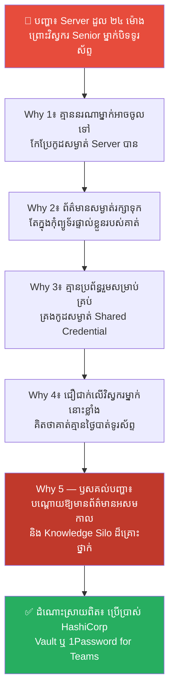
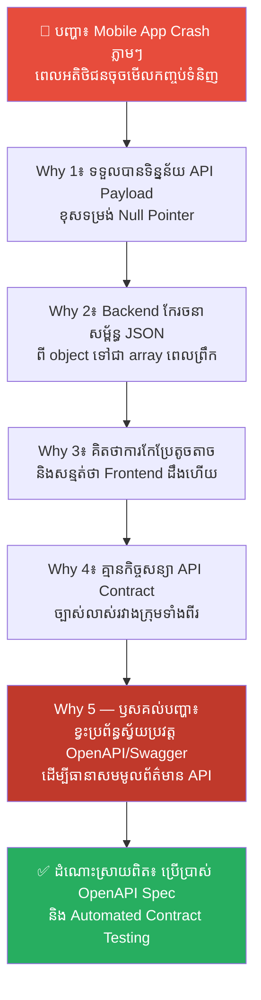
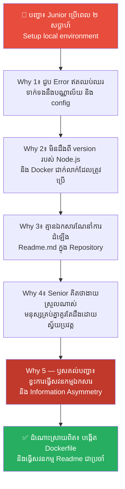
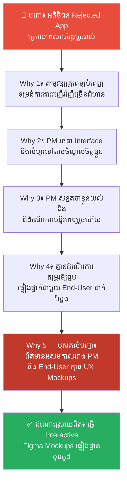
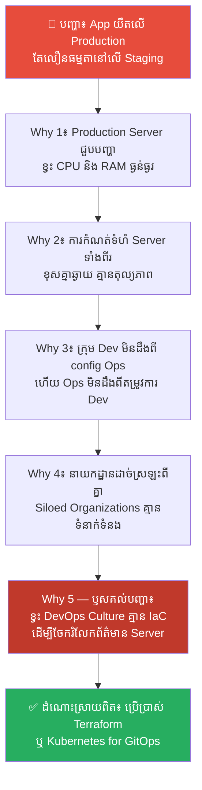
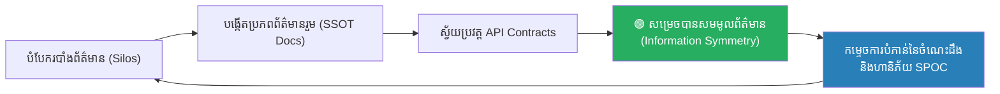

# Information Asymmetry: The Illusion of Knowledge (ការគ្រប់គ្រងព័ត៌មានអសមកាល៖ ការកម្ទេចការបំភាន់នៃចំណេះដឹងដើម្បីការពារវិបត្តិប្រព័ន្ធ)

**Author:** ichamrong  
**Date:** 2026-05-27  
**Tags:** #information-asymmetry #illusion-of-knowledge #knowledge-silos #api-contracts #documentation #team-culture #mental-models  
**Category:** Concepts  
**Read Time:** ~18 min  

---

## 📌 មាតិកា (Table of Contents)
- [លំនាំបញ្ហា (The Pattern)](#លំនាំបញ្ហា-the-pattern)
- [១. បញ្ហា៖ ការគ្រប់គ្រងព័ត៌មាននិងចារកម្មយុទ្ធសាស្ត្រ (The Issue: Information Management & Strategic Intelligence)](#១-បញ្ហា-ការគ្រប់គ្រងព័ត៌មាននិងចារកម្មយុទ្ធសាស្ត្រ-the-issue-information-management--strategic-intelligence)
- [២. ឧទាហរណ៍ជាក់ស្តែងក្នុងពិភពពិត (Real World Examples)](#២-ឧទាហរណ៍ជាក់ស្តែងក្នុងពិភពពិត)
  - [ឧទាហរណ៍ទី ១ — ការលាក់បាំងចំណេះដឹងបច្ចេកវិទ្យាក្នុងបុគ្គលម្នាក់ (Knowledge Silos & Single Point of Failure)](#ឧទាហរណ៍ទី-១-ការលាក់បាំងចំណេះដឹងបច្ចេកវិទ្យាក្នុងបុគ្គលម្នាក់-knowledge-silos--single-point-of-failure)
  - [ឧទាហរណ៍ទី ២ — ការកែប្រែ API Specs ដោយគ្មានការសម្របសម្រួលជាមួយ Frontend (Breaking API Contracts)](#ឧទាហរណ៍ទី-២-ការកែប្រែ-api-specs-ដោយគ្មានការសម្របសម្រួលជាមួយ-frontend-breaking-api-contracts)
  - [ឧទាហរណ៍ទី ៣ — កង្វះឯកសារណែនាំការដំឡើងប្រព័ន្ធ ធ្វើឱ្យយឺតការងារ (Missing Setup Documentation)](#ឧទាហរណ៍ទី-៣-កង្វះឯកសារណែនាំការដំឡើងប្រព័ន្ធ-ធ្វើឱ្យយឺតការងារ-missing-setup-documentation)
  - [ឧទាហរណ៍ទី ៤ — ការយល់ខុសរវាងអ្វីដែលអតិថិជនចង់បាន និងអ្វីដែល PM យល់ឃើញ (Requirements Asymmetry)](#ឧទាហរណ៍ទី-៤-ការយល់ខុសរវាងអ្វីដែលអតិថិជនចង់បាន-និងអ្វីដែល-pm-យល់ឃើញ-requirements-asymmetry)
  - [ឧទាហរណ៍ទី ៥ — ការបែងចែកដាច់ស្រឡះរវាងអ្នកសរសេរកូដ និងអ្នកគ្រប់គ្រង Server (Dev and Ops Boundary Isolation)](#ឧទាហរណ៍ទី-៥-ការបែងចែកដាច់ស្រឡះរវាងអ្នកសរសេរកូដ-និងអ្នកគ្រប់គ្រង-server-dev-and-ops-boundary-isolation)
- [៣. កត្តាជម្រុញ៖ ភាពឯកោ និងមោទនភាពអ្នកបច្ចេកវិទ្យា (The Aggravator: Isolation & Ego-Driven Knowledge Hoarding)](#៣-កត្តាជម្រុញ-ភាពឯកោ-និងមោទនភាពអ្នកបច្ចេកវិទ្យា-the-aggravator-isolation--ego-driven-knowledge-hoarding)
- [៤. ដំណោះស្រាយទូទៅ៖ របៀបលុបបំបាត់ព័ត៌មានអសមកាល (The General Solution: Practical Guidelines to Demolish Information Asymmetry)](#៤-ដំណោះស្រាយទូទៅ-របៀបលុបបំបាត់ព័ត៌មានអសមកាល-the-general-solution-practical-guidelines-to-demolish-information-asymmetry)
- [សេចក្តីសន្និដ្ឋាន (Conclusion)](#សេចក្តីសន្និដ្ឋាន-conclusion)
- [ឯកសារយោង (References)](#references)
- [Related Posts](#related-posts)

---

## លំនាំបញ្ហា (The Pattern)

សាកស្រមៃមើលពីទិដ្ឋភាពនេះ៖ ថ្ងៃមួយ បុគ្គលិកផ្នែក Frontend Developer ម្នាក់បានកែប្រែទម្រង់ការហៅ API របស់ទូរស័ព្ទ (Mobile App API Call) ដើម្បីដោះស្រាយទិន្នន័យបញ្ហារហ័សមួយ។ គាត់គិតថាវាជាការកែប្រែតូចតាច គ្មានហានិភ័យអ្វីឡើយ។ 

តែនៅពេលកូដនោះត្រូវបានបាញ់ឡើង Production Server... App ទាំងមូលបានដួលរលំភ្លាមៗ។ 

ក្រុមការងារ Backend ភ័យស្លន់ស្លោ និងមិនដឹងថាហេតុអ្វីបានជា Server ចាប់ផ្តើមទទួល Error code 500 រាប់ម៉ឺនដងឡើយ។ ពួកគេត្រូវចំណាយពេល ៣ ម៉ោងស្វែងរកឫសគល់ រហូតដល់រកឃើញថា Frontend បានកែប្រែឈ្មោះ Variable (Key Name) នៅក្នុង JSON Payload ពី `userID` ទៅជា `user_id` ដោយគ្មានការប្រាប់ ឬចងក្រងឯកសារណែនាំឡើយ។

នេះគឺជាបញ្ហាដ៏បុរាណដែលហៅថា **Information Asymmetry (ព័ត៌មានអសមកាល)** — គឺស្ថានភាពដែលភាគីម្ខាង (Frontend Developer) មានព័ត៌មានសំខាន់ដែលភាគីម្ខាងទៀត (Backend Team) មិនបានដឹង បង្កឱ្យមានការយល់ច្រឡំ និងការដួលរលំប្រព័ន្ធ។

វាជម្រុញឱ្យកើតមាន **Illusion of Knowledge (ការបំភាន់នៃចំណេះដឹង)** — ទំនោរចិត្តដែលវិស្វករកម្មវិធីជឿជាក់ថាខ្លួនយល់ច្បាស់ពីប្រព័ន្ធទាំងមូល តែតាមពិត ពួកគេដឹងតែផ្នែកតូចមួយរបស់ពួកគេប៉ុណ្ណោះ។

---

## ១. បញ្ហា៖ ការគ្រប់គ្រងព័ត៌មាននិងចារកម្មយុទ្ធសាស្ត្រ (The Issue: Information Management & Strategic Intelligence)

នៅក្នុងក្បួនសឹកស៊ុនអ៊ូ ជំពូកទី ១៣ **«用间» (Use of Spies / 用间 Yongjian)** គាត់បានបញ្ជាក់យ៉ាងច្បាស់ថា៖
> **«អ្វីដែលធ្វើឱ្យមេដឹកនាំ និងមេទ័ពដ៏ឆ្នើម អាចវាយប្រហារសត្រូវ និងសម្រេចបានជ័យជម្នះអមតៈ គឺការមាន គិតដឹងជាមុន (Foreknowledge)។ គំនិតដឹងជាមុននេះ មិនអាចទទួលបានពីព្រលឹងខ្មោច ឬការទស្សន៍ទាយឡើយ តែវាត្រូវតែទទួលបានពីមនុស្សដែលដឹងពីស្ថានភាពជាក់ស្តែងរបស់សត្រូវពិតប្រាកដ។»**

ស៊ុនអ៊ូបានបង្កើតប្រព័ន្ធចារកម្ម ៥ ថ្នាក់ (Five Classes of Spies) ដើម្បីកម្ចាត់ចោលទាំងស្រុងនូវ **Information Asymmetry** រវាងខ្លួន និងសត្រូវ ដើម្បីធានាថា៖ *«ដឹងពីគេ ដឹងពីយើង ចម្បាំងមួយរយដង ឈ្នះមួយរយដង។»*

នៅក្នុងវិស័យវិស្វកម្មកម្មវិធី **Information Asymmetry** គឺជាសត្រូវចម្បងដែលបំផ្លាញស្ថិរភាពប្រព័ន្ធ និងកិច្ចសហការរបស់ក្រុមការងារ៖

*   ❌ **The Information Silo (របាំងព័ត៌មាន)៖** ការលាក់បាំង ឬការខកខានមិនបានចែកចាយព័ត៌មានបច្ចេកទេស និងការសម្រេចចិត្តរវាងសមាជិកក្រុម។ វិស្វករម្នាក់ៗដឹងតែពីកូដរបស់ខ្លួនឯង (Silo) និងមាន **Illusion of Knowledge** ថាប្រព័ន្ធទាំងមូលមានសុវត្ថិភាពខ្ពស់។
*   ✅ **Information Symmetry (សមមូលព័ត៌មាន)៖** ការបង្កើតប្រភពព័ត៌មានរួមតែមួយគត់ (Single Source of Truth) និងដំណើរការទំនាក់ទំនងដែលគ្មានការកកិត ដើម្បីធានាថារាល់ការសម្រេចចិត្ត សេចក្តីប្រកាសផ្លាស់ប្តូរ និងរចនាសម្ព័ន្ធ API ត្រូវបានចែកចាយទៅដល់សមាជិកក្រុមទាំងអស់ភ្លាមៗ។

---

## ២. ឧទាហរណ៍ជាក់ស្តែងក្នុងពិភពពិត

សូមពិនិត្យមើល **ឧទាហរណ៍ជាក់ស្តែងចំនួន ៥** បង្ហាញពីហានិភ័យនៃព័ត៌មានអសមកាល និងវិធីសាស្ត្រដោះស្រាយ៖

---

### ឧទាហរណ៍ទី ១ — ការលាក់បាំងចំណេះដឹងបច្ចេកវិទ្យាក្នុងបុគ្គលម្នាក់ (Knowledge Silos & Single Point of Failure)

**បញ្ហា៖** App របស់ក្រុមហ៊ុនបានជួបបញ្ហាដួល Server រយៈពេល ២៤ ម៉ោង ព្រោះវិស្វករ Senior តែម្នាក់គត់ដែលដឹងពីកូដសម្ងាត់ (Environment Variables) របស់ Server កំពុងឈប់សម្រាកចុងសប្តាហ៍ និងបិទទូរស័ព្ទនៅតំបន់ដាច់ស្រយាល។

**ដំណោះស្រាយលើផ្ទៃក្រៅ៖** ដាក់ពិន័យ ឬសន្យាដំឡើងប្រាក់ខែឱ្យវិស្វកររូបនោះ ដើម្បីកុំឱ្យពួកគេបិទទូរស័ព្ទនៅថ្ងៃសម្រាក។  
(លទ្ធផល៖ វិស្វករនោះនឹងមានអារម្មណ៍ស្ត្រេស និងលាឈប់ពីការងារ បង្កវិនាសកម្មកាន់តែធ្ងន់ធ្ងរ។)

**ការវិភាគបែប 5 Whys៖**

| # | សំណួរ (Why?) | ចម្លើយ (Answer) |
|---|---|---|
| 1 | ហេតុអ្វីបានជា Server ដួលដល់ទៅ ២៤ ម៉ោង? | ពីព្រោះគ្មាននរណាម្នាក់អាចចូលទៅកែប្រែកូដសម្ងាត់របស់ Server បានឡើយ។ |
| 2 | ហេតុអ្វីបានជាគ្មាននរណាម្នាក់អាចចូលបាន? | ពីព្រោះព័ត៌មានសម្ងាត់ និងកូដសម្ងាត់ទាំងអស់ ត្រូវបានរក្សាទុកតែនៅក្នុងកុំព្យូទ័រផ្ទាល់ខ្លួនរបស់វិស្វករ Senior ម្នាក់នោះ។ |
| 3 | ហេតុអ្វីបានជារក្សាទុកតែក្នុងកុំព្យូទ័រផ្ទាល់ខ្លួនរបស់គាត់? | ពីព្រោះក្រុមហ៊ុនគ្មានប្រព័ន្ធរួមសម្រាប់គ្រប់គ្រងកូដសម្ងាត់ (Shared Credential Manager) ឡើយ។ |
| 4 | ហេតុអ្វីបានជាមិនដំឡើងប្រព័ន្ធគ្រប់គ្រងកូដសម្ងាត់រួម? | ពីព្រោះថ្នាក់ដឹកនាំជឿជាក់លើវិស្វករ Senior ម្នាក់នោះខ្លាំងពេក ហើយគិតថា «គាត់គ្មានថ្ងៃចាកចេញ ឬមិនឆ្លើយតបឡើយ» (Illusion of Knowledge)។ |
| 5 | ហេតុអ្វីបានជាជឿជាក់ដោយគ្មានការការពារហានិភ័យ? | **ពីព្រោះវប្បធម៌ក្រុមហ៊ុនបណ្តោយឱ្យមានព័ត៌មានអសមកាល (Information Asymmetry) និងរបាំងព័ត៌មាន (Knowledge Silo)។ ពួកគេមិនបានចាត់ទុកការចែកចាយចំណេះដឹងបច្ចេកវិទ្យាជាកាតព្វកិច្ចដើម្បីការពារ SPOC (Single Point of Contact) ឡើយ។** |

**ដំណោះស្រាយពិតប្រាកដ៖** ប្រើប្រាស់ឧបករណ៍គ្រប់គ្រងព័ត៌មានសម្ងាត់រួម (ឧទាហរណ៍៖ HashiCorp Vault, AWS Secrets Manager, 1Password for Teams) និងរៀបចំឯកសារណែនាំការងាររួម (Runbooks) ដើម្បីធានាថារាល់វិស្វករទាំងអស់មានសមមូលព័ត៌មានក្នុងការដោះស្រាយវិបត្តិ។

---

### ឧទាហរណ៍ទី ២ — ការកែប្រែ API Specs ដោយគ្មានការសម្របសម្រួលជាមួយ Frontend (Breaking API Contracts)

**បញ្ហា៖** App លើទូរស័ព្ទ (Mobile App v1.5) ជួបបញ្ហា Crash ភ្លាមៗរាល់ពេលអតិថិជនចុចមើលកញ្ចប់ទំនិញ បង្កឱ្យអត្រាលក់ធ្លាក់ចុះ ៥០% ក្នុងមួយថ្ងៃ។

**ដំណោះស្រាយលើផ្ទៃក្រៅ៖** ស្តីបន្ទោស Frontend Developer ថាធ្វើការធូររលុង មិនបានតេស្តកូដមុនពេល Push ឡើង App Store។  
(លទ្ធផល៖ ពួកគេនឹងលាក់បាំងកំហុស និងខឹងសម្បារ ព្រោះបញ្ហាមិនមែនកើតចេញពីពួកគេឡើយ។)

**ការវិភាគបែប 5 Whys៖**

| # | សំណួរ (Why?) | ចម្លើយ (Answer) |
|---|---|---|
| 1 | ហេតុអ្វីបានជា App ជួបបញ្ហា Crash លើទូរស័ព្ទ? | ពីព្រោះវាទទួលបានទិន្នន័យ API Payload ខុសទម្រង់ (Null Pointer Exception)។ |
| 2 | ហេតុអ្វីបានជាទិន្នន័យខុសទម្រង់? | ពីព្រោះក្រុម Backend បានកែប្រែរចនាសម្ព័ន្ធ JSON របស់ API ពី object ទៅជា array នៅក្នុងការ Deploy កាលពីព្រឹកមិញ។ |
| 3 | ហេតុអ្វីបានជាក្រុម Backend កែប្រែទម្រង់ API ដោយមិនប្រាប់ Frontend? | ពីព្រោះពួកគេគិតថាវាជាការកែប្រែតូចតាចសម្រាប់សន្សំសំចៃទំហំទិន្នន័យ និងសន្មត់ថា «Frontend ប្រហែលជាដឹងរួចហើយ» (Illusion of Knowledge)។ |
| 4 | ហេតុអ្វីបានជាគ្មានការសម្របសម្រួលផ្លូវការរវាងក្រុមទាំងពីរ? | ពីព្រោះក្រុមហ៊ុនគ្មានកិច្ចសន្យា API (API Contract) ច្បាស់លាស់ដែលត្រូវអនុវត្តតាមឡើយ។ |
| 5 | ហេតុអ្វីបានជាគ្មាន API Contract? | **ពីព្រោះដំណើរការដំឡើងប្រព័ន្ធ (SDLC) បណ្តោយឱ្យមានព័ត៌មានអសមកាល (Information Asymmetry) រវាងក្រុមការងារដាច់ស្រឡះ។ គ្មានប្រព័ន្ធស្វ័យប្រវត្តកម្មសម្រាប់ត្រួតពិនិត្យ និងធានាសុពលភាព API Specification (ឧទាហរណ៍៖ OpenAPI/Swagger) មុនពេល Deploy ឡើយ។** |

**ដំណោះស្រាយពិតប្រាកដ៖** អនុវត្តគោលការណ៍ **Design-First API Development** ដោយប្រើប្រាស់ OpenAPI Specification (Swagger)។ រាល់ការកែប្រែ API ត្រូវតែរត់ការតេស្តកិច្ចសន្យាស្វ័យប្រវត្ត (Contract Testing ជាមួយឧបករណ៍ដូចជា Pact) ដើម្បីធានាថានឹងគ្មានការកែប្រែណាដែលធ្វើឱ្យប្រព័ន្ធចាស់ខូចឡើយ។

---

### ឧទាហរណ៍ទី ៣ — កង្វះឯកសារណែនាំការដំឡើងប្រព័ន្ធ ធ្វើឱ្យយឺតការងារ (Missing Setup Documentation)

**បញ្ហា៖** បុគ្គលិកថ្មី (Junior Developer) ម្នាក់ត្រូវចំណាយពេលដល់ទៅ ២ សប្តាហ៍ពេញ គ្រាន់តែដើម្បីរៀបចំដំឡើងកូដ (Setup local environment) ឱ្យដំណើរការលើម៉ាស៊ីនរបស់ខ្លួន។

**ដំណោះស្រាយលើផ្ទៃក្រៅ៖** ប្រាប់ Junior ឱ្យសួរ Senior រៀងរាល់ពេលជួបបញ្ហាស្ទះការងារ។  
(លទ្ធផល៖ យឺតការងារទាំងសងខាង ព្រោះ Senior ត្រូវចំណាយពេលពន្យល់រឿងសាមញ្ញដដែលៗរាល់ថ្ងៃ។)

**ការវិភាគបែប 5 Whys៖**

| # | សំណួរ (Why?) | ចម្លើយ (Answer) |
|---|---|---|
| 1 | ហេតុអ្វីបានជា Junior ត្រូវចំណាយពេលដល់ទៅ ២ សប្តាហ៍ដើម្បី Setup កូដ? | ពីព្រោះពួកគេជួបប្រទះបញ្ហា Error ឥតឈប់ឈរទាក់ទងនឹងបណ្ណាល័យ (Dependencies) និងកម្រែសម្រួលប្រព័ន្ធ (Configuration)។ |
| 2 | ហេតុអ្វីបានជាជួប Error ទាំងនោះ? | ពីព្រោះពួកគេមិនដឹងពីកំណែទម្រង់ (Version) របស់ Node.js និង Docker ជាក់លាក់ដែលត្រូវប្រើប្រាស់។ |
| 3 | ហេតុអ្វីបានជាពួកគេមិនដឹងពីកំណែទម្រង់ដែលត្រូវប្រើប្រាស់? | ពីព្រោះគ្មានឯកសារណែនាំការដំឡើង (Readme.md) នៅក្នុង Repository ឡើយ។ |
| 4 | ហេតុអ្វីបានជាគ្មាន Readme.md ច្បាស់លាស់នៅក្នុង Repo? | ពីព្រោះ Senior Developers យល់ថា «ការដំឡើងនេះងាយស្រួលណាស់ មនុស្សគ្រប់គ្នាគួរតែដឹងដោយស្វ័យប្រវត្ត» (Illusion of Knowledge)។ |
| 5 | ហេតុអ្វីបានជាយល់ថាគ្រប់គ្នាគួរតែដឹងដោយស្វ័យប្រវត្ត? | **ពីព្រោះពួកគេមានព័ត៌មានអសមកាល (Information Asymmetry) ជាមួយអ្នកចំណូលថ្មី។ ពួកគេខ្វះការយល់ចិត្ត (Empathy) និងមិនដែលបានធ្វើសវនកម្មលើឯកសារណែនាំការងារ (Documentation Audit) ឡើយ។** |

**ដំណោះស្រាយពិតប្រាកដ៖** ប្រើប្រាស់ **Docker/Devcontainers** ដើម្បីបង្កើតបរិស្ថានសរសេរកូដស្វ័យប្រវត្ត (Infrastructure as Code) និងបង្កើតគោលការណ៍ «ធ្វើសវនកម្ម Readme ជារៀងរាល់ខែ» ដោយឱ្យសមាជិកថ្មីបំផុតជាអ្នកអាន និងកែលម្អវា។

---

### ឧទាហរណ៍ទី ៤ — ការយល់ខុសរវាងអ្វីដែលអតិថិជនចង់បាន និងអ្វីដែល PM យល់ឃើញ (Requirements Asymmetry)

**បញ្ហា៖** App គ្រប់គ្រងគ្លីនិកថ្មីមួយ ត្រូវបានអតិថិជនបដិសេធមិនព្រមទទួលយក (Rejected) ក្រោយពេលអភិវឌ្ឍរួចរាល់ ព្រោះវាមិនត្រូវនឹងលំហូរការងារពិតប្រាកដរបស់ពួកគេ។

**ដំណោះស្រាយលើផ្ទៃក្រៅ៖** ស្តីបន្ទោសក្រុមការងារថាធ្វើការគ្មានវិជ្ជាជីវៈ និងបង្ខំឱ្យពួកគេសរសេរកូដកែប្រែឡើងវិញទាំងស្រុង។  
(លទ្ធផល៖ ក្រុមការងារស្ត្រេសខ្លាំង ខាតបង់ថវិការាប់ម៉ឺនដុល្លារ និងហួស Deadline ធ្ងន់ធ្ងរ។)

**ការវិភាគបែប 5 Whys៖**

| # | សំណួរ (Why?) | ចម្លើយ (Answer) |
|---|---|---|
| 1 | ហេតុអ្វីបានជាអតិថិជន Rejected App នេះ? | ពីព្រោះ App តម្រូវឱ្យវេជ្ជបណ្ឌិតចុះឈ្មោះ និងបំពេញទម្រង់ការងាររញ៉េរញ៉ៃរាប់សិបជំហានមុននឹងពិនិត្យជំងឺ។ |
| 2 | ហេតុអ្វីបានជាយើងបង្កើតទម្រង់ការងារស្មុគស្មាញបែបនេះ? | ពីព្រោះ Product Manager (PM) បានរចនា Interface និងលំហូរការងារបែបនេះទៅតាមចំណូលចិត្តរបស់ខ្លួន។ |
| 3 | ហេតុអ្វីបានជា PM រចនាទៅតាមចំណូលចិត្តខ្លួន ជំនួសឱ្យការសួរគ្រូពេទ្យពិត? | ពីព្រោះ PM សន្មតថា «ខ្ញុំយល់ដឹងពីរបៀបដំណើរការរបស់មន្ទីរពេទ្យរួចរាល់ហើយ» (Illusion of Knowledge)។ |
| 4 | ហេតុអ្វីបានជា PM ជឿជាក់បែបនេះដោយគ្មានការផ្ទៀងផ្ទាត់? | ពីព្រោះគ្មានដំណើរការការងារណាដែលតម្រូវឱ្យមានការជួបពិភាក្សា និងផ្ទៀងផ្ទាត់ជាមួយអ្នកប្រើប្រាស់ពិតប្រាកដ (End-User Validation) តាំងពីដំណាក់កាលដំបូងឡើយ។ |
| 5 | ហេតុអ្វីបានជាគ្មានការផ្ទៀងផ្ទាត់ជាមួយ End-User? | **ពីព្រោះដំណើរការការងាររបស់គម្រោងរងគ្រោះដោយសារព័ត៌មានអសមកាល (Information Asymmetry) ធ្ងន់ធ្ងររវាងក្រុមអភិវឌ្ឍន៍ និងអតិថិជនពិតប្រាកដ។ ពួកគេមិនបានប្រើប្រាស់ឧបករណ៍ Mockups ឬសាកល្បងលំហូរការងារ (UX Prototypes) ជាមុនមុននឹងសរសេរកូដឡើយ។** |

**ដំណោះស្រាយពិតប្រាកដ៖** អនុវត្តគោលការណ៍ **User-Centric Design** និង **UX Prototyping**។ PM ត្រូវតែបង្កើតគំរូ Figma Mockups ដែលអាចចុចដំណើរការសាកល្បងបាន (Interactive Prototypes) រួចយកទៅឱ្យគ្រូពេទ្យប្រើប្រាស់សាកល្បង និងអនុម័ត (Sign-off) ជាមុនសិន ទើបអនុញ្ញាតឱ្យក្រុមវិស្វករចាប់ផ្តើមសរសេរកូដ។

---

### ឧទាហរណ៍ទី ៥ — ការបែងចែកដាច់ស្រឡះរវាងអ្នកសរសេរកូដ និងអ្នកគ្រប់គ្រង Server (Dev and Ops Boundary Isolation)

**បញ្ហា៖** App ថ្មីរបស់ក្រុមហ៊ុនដំណើរការយឺតខ្លាំងណាស់បន្ទាប់ពី Deploy ទៅ Production Server ទោះបីជាវាដំណើរការលឿនធម្មតាកាលពីនៅលើម៉ាស៊ីនតេស្ត (Staging Server)។

**ដំណោះស្រាយលើផ្ទៃក្រៅ៖** ក្រុម Developer ស្តីបន្ទោសក្រុម System Admin (Ops) ថាគ្រប់គ្រង Server មិនល្អ ចំណែក System Admin ស្តីបន្ទោស Developer វិញថាសរសេរកូដរញ៉េរញ៉ៃ។  
(លទ្ធផល៖ ឈ្លោះប្រកែកគ្នាឥតឈប់ឈរ ហើយប្រព័ន្ធនៅតែយឺតដដែល។)

**ការវិភាគបែប 5 Whys៖**

| # | សំណួរ (Why?) | ចម្លើយ (Answer) |
|---|---|---|
| 1 | ហេតុអ្វីបានជា App យឺតលើ Production តែលឿនលើ Staging? | ពីព្រោះ Production Server ជួបបញ្ហាខ្វះ CPU និង RAM (Resource Starvation)។ |
| 2 | ហេតុអ្វីបានជាខ្វះ CPU/RAM? | ពីព្រោះការកំណត់កម្រិតធនធាន (Resource Allocation) របស់ Production Server មានទំហំតូចជាង Staging Server ឆ្ងាយណាស់។ |
| 3 | ហេតុអ្វីបានជាការកំណត់ទំហំ Server ទាំងពីរខុសគ្នាឆ្ងាយម្ល៉េះ? | ពីព្រោះក្រុម Developer មិនដែលដឹងពីការកំណត់ Server របស់ក្រុម Ops ឡើយ ហើយក្រុម Ops ក៏មិនដែលដឹងពីតម្រូវការបច្ចេកទេសរបស់កូដថ្មីដែរ។ |
| 4 | ហេតុអ្វីបានជាក្រុមទាំងពីរមិនចែករំលែកព័ត៌មាន Server ជាមួយគ្នា? | ពីព្រោះពួកគេត្រូវបានបែងចែកជានាយកដ្ឋានដាច់ស្រឡះពីគ្នា (Siloed Organizations) និងគ្មានទំនាក់ទំនងការងាររួម។ |
| 5 | ហេតុអ្វីបានជាបែងចែកដាច់ស្រឡះពីគ្នា? | **ពីព្រោះក្រុមហ៊ុនខ្វះការយល់ដឹងពីស្ថាបត្យកម្មរួមព័ត៌មាន (System Information Symmetry)។ ពួកគេមិនបានអនុវត្តវិធីសាស្ត្រ DevOps និងការសរសេរ Server ជាកូដ (Infrastructure as Code - IaC) ដើម្បីឱ្យទាំង Dev និង Ops មើលឃើញ និងគ្រប់គ្រង Server ក្នុងកូដរួមតែមួយ។** |

**ដំណោះស្រាយពិតប្រាកដ៖** អនុវត្តវប្បធម៌ **DevOps** និងសរសេរ Server ឱ្យទៅជាកូដ (Infrastructure as Code - IaC ជាមួយឧបករណ៍ដូចជា Terraform, Docker, Kubernetes)។ វិធីសាស្ត្រនេះធានាថាកូដកំណត់ Server ទាំងអស់ត្រូវបានរក្សាទុកក្នុង Repository រួមដែលទាំង Dev និង Ops អាចមើលឃើញ និងគ្រប់គ្រងជាមួយគ្នា ដើម្បីលុបបំបាត់ព័ត៌មានអសមកាល។

---

## ៣. កត្តាជម្រុញ៖ ភាពឯកោ និងមោទនភាពអ្នកបច្គេកវិទ្យា (The Aggravator: Isolation & Ego-Driven Knowledge Hoarding)

កត្តាចម្បងដែលបង្កឱ្យមានការកើនឡើងនៃព័ត៌មានអសមកាល និងការបំភាន់នៃចំណេះដឹងក្នុងស្ថាប័ន រួមមាន៖

1.  **របាំងទំនាក់ទំនងនាយកដ្ឋាន (Organizational Silos)៖** ការបែងចែកដាច់ស្រឡះរវាងក្រុម Backend, Frontend, QA, PM, និង DevOps។ នៅពេលក្រុមនីមួយៗផ្តោតតែលើ KPI ផ្ទាល់ខ្លួនរបស់ពួកគេ ពួកគេនឹងឈប់ចែករំលែកព័ត៌មានជាមួយក្រុមដទៃ បង្កើតជា «ជញ្ជាំងនៃការយល់ខុស» ដ៏ធំ។
2.  **មោទនភាព និងការលាក់បាំងកូដដើម្បីរក្សាតម្លៃខ្លួន (Ego-driven Knowledge Hoarding)៖** វិស្វករមួយចំនួនយល់ច្រឡំថា៖ *«ប្រសិនបើមានតែខ្ញុំម្នាក់គត់ដែលដឹងពីរបៀបកូដនេះរត់ នោះក្រុមហ៊ុនគ្មានថ្ងៃបណ្តេញខ្ញុំចេញឡើយ។»* ផ្នត់គំនិតអាត្មានិយមនេះជំរុញឱ្យពួកគេលាក់បាំងព័ត៌មាន និងមិនចង់សរសេរឯកសារណែនាំ (Documentation)។
3.  **ការសន្មតដោយគ្មានការផ្ទៀងផ្ទាត់ (Subjective Assumptions)៖** នេះជាឫសគល់នៃ Illusion of Knowledge។ ខួរក្បាលមនុស្សតែងតែសន្មតថា «អ្នកដទៃប្រាកដជាគិតដូចខ្ញុំ» (Projection Bias)។ Developer សន្មតថា QA ដឹងពីរបៀបតេស្ត; PM សន្មតថា Dev យល់ពីតម្រូវការអាជីវកម្ម។ ការមិនផ្ទៀងផ្ទាត់ទិន្នន័យ (No Feedback Loops) ធ្វើឱ្យពួកគេសម្រេចចិត្តខុសឆ្គង។

---

## ៤. ដំណោះស្រាយទូទៅ៖ របៀបលុបបំបាត់ព័ត៌មានអសមកាល (The General Solution: Practical Guidelines to Demolish Information Asymmetry)

ដើម្បីកម្ទេចព័ត៌មានអសមកាល និងកសាងសមមូលព័ត៌មាន (Information Symmetry) នៅក្នុងក្រុមបច្ចេកវិទ្យា ចូរអនុវត្តគោលការណ៍សំខាន់ៗ ៣ យ៉ាង៖

### បង្កើត «ប្រភពព័ត៌មានរួមតែមួយគត់» (Single Source of Truth - SSOT)
រាល់ព័ត៌មានបច្ចេកទេស និងការសម្រេចចិត្ត ត្រូវតែរក្សាទុកកន្លែងរួមដែលងាយស្រួលស្វែងរក និងអាន៖
*   **Centralized Docs (Confluence, Notion, ឬ GitHub Wiki)៖** រាល់ការរចនាស្ថាបត្យកម្ម ត្រូវតែចងក្រងជា RFCs (Request for Comments) និងអនុញ្ញាតឱ្យសមាជិកទាំងអស់ចូលរួមផ្តល់មតិយោបល់។
*   **Infrastructure as Code (IaC)៖** រក្សាទុកកូដកំណត់ Server នៅក្នុង Git Repository រួម ជៀសវាងការលាក់ទុកក្នុងកុំព្យូទ័របុគ្គល។

### ស្វ័យប្រវត្តកម្មកិច្ចសន្យាការងារ (Enforce Machine-Readable Contracts)
កុំពឹងផ្អែកលើការចងចាំ ឬសន្យារបស់មនុស្ស។ ចូរឱ្យម៉ាស៊ីនជាអ្នកត្រួតពិនិត្យ៖
*   **API Specification (OpenAPI/Swagger):** បង្កើត API specs រួមមុននឹងសរសេរកូដ និងប្រើប្រាស់ឧបករណ៍ស្កែនស្វ័យប្រវត្តដើម្បីធានាថាកូដ Backend ត្រូវគ្នានឹង Spec ជានិច្ច។
*   **Architecture Decision Records (ADRs):** ចងក្រងរាល់ការសម្រេចចិត្តបច្ចេកវិទ្យាធំៗជាកូដតូចៗ (Markdown files) ទុកក្នុង Git Repository គម្រោង។

### បង្កើតវប្បធម៌ «គ្មានការលាក់បាំង និងការចែករំលែកសកម្ម» (Post-Mortem & Knowledge Share)
*   រៀបចំកម្មវិធី «ចែករំលែកចំណេះដឹង» (Lunch & Learn, Tech Talks) ជាប្រចាំ ដើម្បីឱ្យវិស្វករ Backend យល់ដឹងពីការងារ Frontend និង Ops យល់ដឹងពី Dev។
*   នៅពេលប្រព័ន្ធជួបវិបត្តិ ត្រូវធ្វើការសរសេរ **Blameless Post-Mortem** ផ្សព្វផ្សាយជាសាធារណៈក្នុងក្រុមហ៊ុន ដើម្បីឱ្យគ្រប់គ្នាបានរៀនសូត្រពីកំហុសជាមួយគ្នា។

---

## សេចក្តីសន្និដ្ឋាន (Conclusion)

> **«មេទ័ពដែលច្បាំងឈ្នះ គឺមេទ័ពដែលដឹងពីស្ថានភាពសត្រូវដូចជាដឹងពីបាតដៃខ្លួនឯង។ ព័ត៌មានច្បាស់លាស់ គឺជាកាតព្វកិច្ចដាច់ខាតដើម្បីឈ្នះសង្គ្រាម។» — ស៊ុន អ៊ូ**

នៅក្នុងពិភពវិស្វកម្មកម្មវិធីស្មុគស្មាញនាពេលបច្ចុប្បន្ន ព័ត៌មានអសមកាល (Information Asymmetry) គឺជាកំហុសរចនាសម្ព័ន្ធដ៏ធំបំផុតដែលបំផ្លាញស្ថិរភាពប្រព័ន្ធ និងកិច្ចសហការរបស់ក្រុមការងារ។ វិស្វករកម្មវិធី និងអ្នកដឹកនាំបច្ចេកវិទ្យាដ៏ឆ្នើម មិនដែលបណ្តោយឱ្យស្ថាប័នរបស់ខ្លួនរងគ្រោះដោយសារ «របាំងព័ត៌មាន» ឡើយ។ ពួកគេកសាងវប្បធម៌តម្លាភាព ស្វ័យប្រវត្តកម្មកិច្ចសន្យា (API Contracts) និងចែករំលែកចំណេះដឹងជាប្រចាំ ដើម្បីធានាថារាល់សមាជិកទាំងអស់មានសមមូលព័ត៌មានពិតប្រាកដ សម្រេចបាននូវជោគជ័យ និងស្ថិរភាពប្រព័ន្ធអមតៈ។

---

## ឯកសារយោង (References)

* **Akerlof, G. A.** — *The Market for "Lemons": Quality Uncertainty and the Market Mechanism* (1970)។ ការស្រាវជ្រាវស្នូលដែលបានពន្យល់ពីគោលគំនិត «Information Asymmetry» និងផលប៉ះពាល់លើការសម្រេចចិត្ត។
* **Sun Tzu (Lionel Giles Translation)** — *The Art of War Chapter 13: Use of Spies*។ ការពិភាក្សាលម្អិតបំផុតអំពីការគ្រប់គ្រងព័ត៌មាន និងការលុបបំបាត់ព័ត៌មានអសមកាលដើម្បីឈ្នះសង្គ្រាម។
* **Conway, M. E.** — *How Do Committees Invent? (Conway's Law)* (1968)។ ការណែនាំទ្រឹស្តីដែលបង្ហាញថា ស្ថាបត្យកម្មប្រព័ន្ធ នឹងចម្លងតាមរចនាសម្ព័ន្ធទំនាក់ទំនងរបស់ស្ថាប័ន។

---

## Related Posts

* [The Tower of Babel and API Contracts៖ យុទ្ធសាស្ត្រចរចា API](./33-the-tower-of-babel-and-api-contracts.md)
* [Single Source of Truth vs. Toxic Knowledge Silos៖ វិធីកម្ទេចរបាំងព័ត៌មាន](./13-single-source-of-truth-and-knowledge-silos.md)
* [The Empty City Strategy and Honeypots៖ យុទ្ធសាស្ត្រការពារសន្តិសុខ](./28-the-empty-city-strategy-and-honeypots.md)
