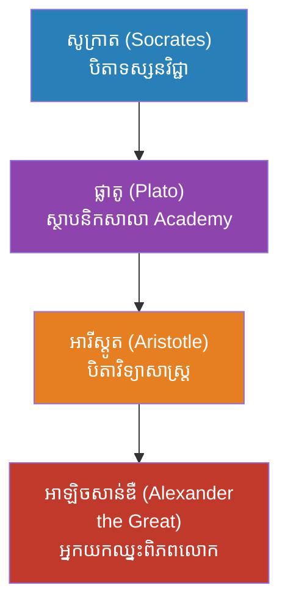
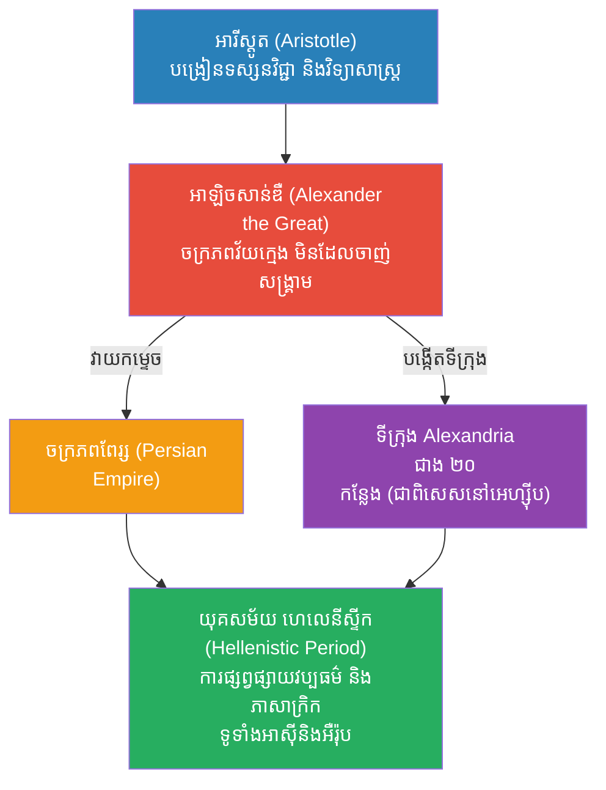

# The Biography of Alexander the Great (ជីវប្រវត្តិអាឡិចសាន់ឌឺដ៏អស្ចារ្យ)

**Author:** ichamrong  
**Date:** 2026-05-23  
**Tags:** #alexander-the-great #history #war #strategy #macedon #greece #leadership  
**Category:** Biographies  
**Read Time:** ~15 min  

---

## 📌 មាតិកា (Table of Contents)
- [សេចក្តីផ្តើម៖ កាយវិភាគវិទ្យានៃអ្នកយកឈ្នះ (The Anatomy of a Conqueror)](#intro)
- [១. កុមារភាព និងសេះប៊ូសេហ្វាឡាស (Childhood & Bucephalus)](#1)
- [២. សិស្សរបស់អារីស្តូត (The Student of Aristotle)](#2)
- [៣. ក្បួនសឹកយោធា៖ ញញួរ និងទ្រនាប់ (Military Genius: Hammer and Anvil)](#3)
- [៤. យុទ្ធនាការយកឈ្នះពិភពលោក (The Conquest of the World)](#4)
  - [ចំណងហ្គរឌាន (The Gordian Knot)](#4-1)
  - [ការឡោមព័ទ្ធទីក្រុងទីរ៉ុស (The Siege of Tyre, ៣៣២ មុនគ.ស)](#4-2)
  - [ព្រឹត្តិការណ៍ដ៏អស្ចារ្យបំផុត៖ ក្លាយជាព្រះនៅស៊ីវ៉ា (The Greatest Event: Becoming a God at Siwa, ៣៣១ មុនគ.ស)](#4-3)
  - [សមរភូមិហ្គោហ្គាមេឡា (Battle of Gaugamela, ៣៣១ មុនគ.ស)](#4-4)
- [៥. យុទ្ធនាការឥណ្ឌា៖ ព្រំដែននៃមហិច្ឆតា (The Indian Campaign & Mutiny)](#5)
- [៦. ចិត្តសាស្ត្រ និងទស្សនវិជ្ជាពីកំណើតដល់ស្លាប់ (Psychology & Philosophy from Birth to Death)](#6)
- [៧. កំហុសឆ្គងដ៏ធំបំផុតដែលមិនគួរមាន (The Fatal Mistakes)](#7)
- [៨. កេរដំណែល (Legacy)](#8)
- [៩. តើអាឡិចសាន់ឌឺបានបំផុសគំនិតអ្វីខ្លះ? (What Did Alexander Inspire?)](#9)
- [សេចក្តីសន្និដ្ឋាន (Conclusion)](#conclusion)
- [🔗 ឯកសារទាក់ទង (Related Topics)](#related-topics)
- [ឯកសារយោង (References)](#references)

---

## សេចក្តីផ្តើម៖ កាយវិភាគវិទ្យានៃអ្នកយកឈ្នះ (The Anatomy of a Conqueror)

> **«តើឈាមប្រភេទណាដែលហូរក្នុងខ្លួនយុវជនអាយុ ២០ ឆ្នាំម្នាក់ ដែលហ៊ានប្រកាសសង្គ្រាមជាមួយពិភពលោកទាំងមូល?»**

សាកស្រមៃមើលពីអារម្មណ៍នេះ (Adrenaline rush)៖ អ្នកទើបតែមានអាយុ ២០ ឆ្នាំ។ ឪពុករបស់អ្នកទើបតែត្រូវបានគេលួចធ្វើឃាត។ នគរទាំងមូលកំពុងធ្លាក់ក្នុងភាពវឹកវរ។ សត្រូវកំពុងព័ទ្ធជុំវិញគ្រប់ទិសទី។ សម្រាប់មនុស្សធម្មតា នេះគឺជាភាពភ័យខ្លាចដែលធ្វើឱ្យបេះដូងឈប់លោត។ ប៉ុន្តែសម្រាប់ **អាឡិចសាន់ឌឺ (Alexander)** វាប្រៀបដូចជាអុកស៊ីហ្សែនដែលបញ្ឆេះភ្លើងមហិច្ឆតារបស់ព្រះអង្គ។

ក្នុងចន្លោះពេលត្រឹមតែ ១២ ឆ្នាំ យុវជននេះបានដឹកនាំកងទ័ពចេញពីទីក្រុងតូចមួយ លេបត្របាក់ចក្រភពដែលធំបំផុតនៅលើផែនដី សាងសង់ទីក្រុងថ្មីៗរាប់សិប និងដើរទ័ពជាង ១៧,០០០ គីឡូម៉ែត្រ — **ដោយមិនធ្លាប់ស្គាល់ពាក្យថាចាញ់សូម្បីតែមួយសមរភូមិ**។

តើកោសិកា (DNA) របស់គាត់ត្រូវបានផ្សំឡើងពីអ្វី? តើគាត់ប្រើក្បួនចិត្តសាស្ត្រអ្វីដើម្បីបោកបញ្ឆោតគូសត្រូវ និងធ្វើឱ្យទាហានរាប់ម៉ឺននាក់សុខចិត្តរត់ចូលទៅស្លាប់ជំនួសគាត់? អត្ថបទនេះនឹងធ្វើការវះកាត់ (Dissect) លម្អិតចូលទៅក្នុងខួរក្បាលរបស់បុរសដែលពិភពលោកទាំងមូលហៅថា «ព្រះ»។

---

## ១. កុមារភាព និងសេះប៊ូសេហ្វាឡាស (Childhood & Bucephalus)

**អាឡិចសាន់ឌឺដ៏អស្ចារ្យ (Alexander the Great)** កើតនៅឆ្នាំ ៣៥៦ មុនគ្រឹស្តសករាជ ជារាជទាយាទនៃនគរម៉ាសេដ្វាន (Macedonia)។ ឪពុករបស់ព្រះអង្គ គឺស្តេចភីលីពទី២ (Philip II) ជាអ្នកកែទម្រង់យោធាដ៏អស្ចារ្យម្នាក់ ចំណែកឯម្តាយគឺព្រះនាងអូឡាំព្យាស (Olympias) ជាស្ត្រីដែលមានជំនឿយ៉ាងមុតមាំថា អាឡិចសាន់ឌឺ គឺជាកូនប្រុសពិតប្រាកដរបស់កំពូលព្រះស៊ូស (Zeus)។ ជំនឿនេះបានដាំគ្រាប់ពូជនៃ "ភាពជាព្រះ" ទៅក្នុងផ្នត់គំនិតរបស់អាឡិចសាន់ឌឺតាំងពីនៅក្មេង។

**រឿងព្រេងនៃសេះ Bucephalus:**
នៅអាយុ ១០ ឆ្នាំ មានគេនាំយកសេះដ៏ធំនិងកាចសាហាវមួយក្បាលមកលក់ឱ្យស្តេចភីលីព តែគ្មាននរណាម្នាក់អាចទប់វាបានឡើយ។ អាឡិចសាន់ឌឺសង្កេតឃើញថា សេះនោះគ្រាន់តែភ័យខ្លាចស្រមោលរបស់វាផ្ទាល់ប៉ុណ្ណោះ។ ព្រះអង្គក៏បានបង្វែរក្បាលសេះទៅរកព្រះអាទិត្យ ដើម្បីកុំឱ្យវាឃើញស្រមោល រួចក៏អាចឡើងជិះវាបានយ៉ាងងាយ។ ឃើញភាពវៃឆ្លាតនេះ ស្តេចភីលីពបានលាន់មាត់ថា៖ *«កូនប្រុសអើយ ចូររកនគរមួយផ្សេងទៀតដែលធំល្មមសម្រាប់ឯងទៅ ព្រោះម៉ាសេដ្វានតូចពេកហើយសម្រាប់ឯង។»*

> 💡 **មេរៀនពីកុមារភាពដែលដក់ជាប់ដល់ស្លាប់ (The Lifelong Lesson):** ព្រឹត្តិការណ៍នេះបានបង្រៀនអាឡិចសាន់ឌឺពេញមួយជីវិតថា **«ភាពភ័យខ្លាច ជារឿយៗគ្រាន់តែជាការស្រមើស្រមៃប៉ុណ្ណោះ (Fear is just an illusion)»**។ មេរៀននេះហើយដែលធ្វើឱ្យព្រះអង្គហ៊ានប្រឈមមុខនឹងកងទ័ពរាប់សែននាក់ដោយមិនញញើតរហូតដល់ថ្ងៃសុគត។

---

## ២. សិស្សរបស់អារីស្តូត (The Student of Aristotle)

អាឡិចសាន់ឌឺ មិនត្រឹមតែជាអ្នកចម្បាំងទេ តែព្រះអង្គក៏ជាអ្នកចេះដឹងដ៏ជ្រៅជ្រះម្នាក់ផងដែរ។ ពីអាយុ ១៣ ដល់ ១៦ ឆ្នាំ ព្រះអង្គត្រូវបានបង្រៀនផ្ទាល់ដោយទស្សនវិទូដ៏ល្បីល្បាញ **អារីស្តូត (Aristotle)**។

អារីស្តូតបានបង្រៀនអាឡិចសាន់ឌឺឱ្យស្រលាញ់អក្សរសាស្ត្រ វេជ្ជសាស្ត្រ និងវិទ្យាសាស្ត្រ។ អាឡិចសាន់ឌឺ តែងតែយកសៀវភៅវីរកថា **Iliad (រឿងសង្គ្រាមក្រុងទ្រយ)** និងដាវមួយដើម ដាក់នៅក្រោមខ្នើយដេកជានិច្ច ព្រោះព្រះអង្គចាត់ទុកវីរបុរស "អាគីលីស (Achilles)" គឺជានិមិត្តរូបរបស់ខ្លួន។ ទោះបីជាអារីស្តូតបង្រៀនឱ្យចាត់ទុកជនជាតិដទៃ (ក្រៅពីក្រិក) ថាជា "មនុស្សព្រៃផ្សៃ (Barbarians)" ក៏ដោយ ក៏នៅពេលអាឡិចសាន់ឌឺវាយឈ្នះចក្រភពពែរ្ស ព្រះអង្គមិនបានបំផ្លាញពួកគេទេ តែបែរជាបញ្ចូលវប្បធម៌ពែរ្ស និងក្រិកបញ្ចូលគ្នា ដែលផ្ទុយពីការបង្រៀនរបស់គ្រូទៅវិញ។

**ខ្សែស្រឡាយទស្សនវិជ្ជា (The Philosophical Lineage):**

> 💡 **ឥទ្ធិពលនៃការអប់រំ (The Impact of Education):** អារីស្តូតបានបង្រៀនអាឡិចសាន់ឌឺឱ្យចេះសង្កេត វិភាគ និងរកហេតុផល (Scientific thinking)។ នេះជាមូលហេតុដែលអាឡិចសាន់ឌឺមិនមែនជាមេទ័ពដែលពូកែតែខាងកាប់ចាក់នោះទេ តែជាមេទ័ពដែលចេះរៀបចំភស្តុភារ (Logistics) និងយុទ្ធសាស្ត្រយ៉ាងល្អិតល្អន់បំផុត។

---

## ៣. ក្បួនសឹកយោធា៖ ញញួរ និងទ្រនាប់ (Military Genius: Hammer and Anvil)

មូលហេតុចម្បងដែលអាឡិចសាន់ឌឺមិនដែលចាញ់សង្គ្រាម គឺដោយសារការប្រើប្រាស់យុទ្ធសាស្ត្រ **«ញញួរ និងទ្រនាប់» (Hammer and Anvil)** យ៉ាងស្ទាត់ជំនាញ។

| ផ្នែកនៃកងទ័ព (Army Division) | តួនាទីក្នុងយុទ្ធសាស្ត្រ (Strategic Role) | ការពន្យល់ (Explanation) |
|---|---|---|
| **ទម្រង់លំពែងវែង (Macedonian Phalanx)** | **ទ្រនាប់ (The Anvil)** | ទាហានថ្មើរជើងកាន់លំពែងប្រវែង ៦ ម៉ែត្រ (Sarissa) ឈរតម្រៀបគ្នាយ៉ាងក្រាស់ខាប់។ គោលដៅរបស់ពួកគេមិនមែនវាយសម្រុកទេ តែគឺទប់កងទ័ពសត្រូវកុំឱ្យរើខ្លួនរួច (Pinning the enemy down)។ |
| **ទ័ពសេះដៃគូ (Companion Cavalry)** | **ញញួរ (The Hammer)** | កងទ័ពសេះវរជន ដែលដឹកនាំដោយផ្ទាល់ពីសំណាក់អាឡិចសាន់ឌឺផ្ទាល់។ នៅពេលសត្រូវជាប់គាំងជាមួយ Phalanx ទ័ពសេះនេះនឹងវាយសម្រុកពីចំហៀង ឬពីក្រោយយ៉ាងសាហាវដើម្បីបំបែកជួរសត្រូវ។ |

---

## ៤. យុទ្ធនាការយកឈ្នះពិភពលោក (The Conquest of the World)

សត្រូវដ៏ធំបំផុតរបស់ក្រិក គឺចក្រភពពែរ្ស (Persian Empire) ដែលដឹកនាំដោយស្តេច ដារីយុសទី៣ (Darius III)។ ចក្រភពពែរ្សមានទំហំធំជាងក្រិករាប់សិបដង និងមានកងទ័ពរាប់សែននាក់។

### ចំណងហ្គរឌាន (The Gordian Knot)
នៅពេលទៅដល់ទីក្រុង Gordium មានរឿងព្រេងមួយចែងថា៖ *"អ្នកណាដែលអាចស្រាយចំណងខ្សែដ៏ស្មុគស្មាញនេះបាន អ្នកនោះនឹងក្លាយជាស្តេចនៃទ្វីបអាស៊ីទាំងមូល"*។ មនុស្សជាច្រើនបានព្យាយាមស្រាយរាប់សិបឆ្នាំមកហើយតែមិនបាន។ អាឡិចសាន់ឌឺ មិនខាតពេលស្រាយវាទេ ព្រះអង្គបានដកដាវកាប់ចំណងនោះដាច់ជាពីរតែម្តង។ នេះបង្ហាញពីការត្រិះរិះដោះស្រាយបញ្ហា **«ក្រៅប្រអប់ (Out of the box thinking)»** របស់ព្រះអង្គ។ បញ្ហាខ្លះមិនត្រូវការដំណោះស្រាយស្មុគស្មាញទេ គឺត្រូវការសកម្មភាពដាច់ខាត។

### ការឡោមព័ទ្ធទីក្រុងទីរ៉ុស (The Siege of Tyre, ៣៣២ មុនគ.ស)
ទីរ៉ុស គឺជាទីក្រុងកោះមួយដែលមានកំពែងរឹងមាំ និងមានកងទ័ពជើងទឹកខ្លាំងពូកែ។ ដោយសារគ្មានកប៉ាល់គ្រប់គ្រាន់ អាឡិចសាន់ឌឺបានបញ្ជាឱ្យទាហានរបស់ព្រះអង្គ **សាងសង់ស្ពានដី (Mole)** កាត់សមុទ្រប្រវែងជិត ១ គីឡូម៉ែត្រ តភ្ជាប់ពីដីគោកទៅកាន់កោះនោះតែម្តង។ វាគឺជាភាពអស្ចារ្យផ្នែកវិស្វកម្មយោធាដែលគ្មានអ្នកណាធ្លាប់គិតដល់ ហើយទីក្រុងទីរ៉ុសក៏ត្រូវវាយបែក។

### ព្រឹត្តិការណ៍ដ៏អស្ចារ្យបំផុត៖ ក្លាយជាព្រះនៅស៊ីវ៉ា (The Greatest Event: Becoming a God at Siwa, ៣៣១ មុនគ.ស)
បន្ទាប់ពីវាយយកអេហ្ស៊ីបបានយ៉ាងងាយស្រួល អាឡិចសាន់ឌឺបានធ្វើដំណើរដ៏គ្រោះថ្នាក់កាត់វាលខ្សាច់សាហារ៉ា ដើម្បីទៅជួបសង្ឃជាន់ខ្ពស់នៅប្រាសាទ Siwa (Oracle of Siwa)។ នៅពេលទៅដល់ សង្ឃជាន់ខ្ពស់បានស្វាគមន៍ព្រះអង្គក្នុងនាមជា **«បុត្រារបស់ព្រះអាំម៉ូន (Son of Amun/Zeus)»**។ ព្រឹត្តិការណ៍នេះត្រូវបានចាត់ទុកថាជា **វិនាទីដ៏សំខាន់បំផុតក្នុងប្រវត្តិសាស្ត្ររបស់ព្រះអង្គ**។ វាគឺជាចំណុចរបត់ផ្លូវចិត្តដែលអាឡិចសាន់ឌឺឈប់ចាត់ទុកខ្លួនឯងត្រឹមជាស្តេចមនុស្សធម្មតា តែជឿជាក់ទាំងស្រុងថាព្រះអង្គជា "ព្រះដែលមានជីវិត"។ ឋានៈជាអាទិទេពនេះបានជួយឱ្យព្រះអង្គគ្រប់គ្រងចក្រភពដ៏ធំបានយ៉ាងមានប្រសិទ្ធភាព។

### សមរភូមិហ្គោហ្គាមេឡា (Battle of Gaugamela, ៣៣១ មុនគ.ស)
នេះគឺជាការកម្ទេចចក្រភពពែរ្សចុងក្រោយបង្អស់។ ទោះបីជាមានកងទ័ពតិចជាងពែរ្សដល់ទៅ ៥ ដងក៏ដោយ អាឡិចសាន់ឌឺបានប្រើប្រាស់ទម្រង់ទ័ពបញ្ឆិត (Oblique order) និងកលល្បិចទាញកងទ័ពពែរ្សឱ្យខុសជួរ រួចបំបោលទ័ពសេះចូលវាយចំកណ្តាលបេះដូងសត្រូវតែម្តង។ ស្តេចដារីយុសទី៣ ភ័យស្លន់ស្លោរត់ចោលសមរភូមិជាលើកទី២ ធ្វើឱ្យចក្រភពពែរ្សដួលរលំទាំងស្រុង។

---

## ៥. យុទ្ធនាការឥណ្ឌា៖ ព្រំដែននៃមហិច្ឆតា (The Indian Campaign & Mutiny)

បន្ទាប់ពីគ្រប់គ្រងពែរ្ស អាឡិចសាន់ឌឺមិនព្រមឈប់នោះទេ។ មហិច្ឆតារបស់ព្រះអង្គគឺចង់ដើរទៅដល់ "ចុងបញ្ចប់នៃពិភពលោក"។ ព្រះអង្គបានដឹកនាំកងទ័ពឆ្លងកាត់ភ្នំហិម៉ាល័យ ចូលទៅដល់ប្រទេសឥណ្ឌា និងបានប្រយុទ្ធឈ្នះស្តេចឥណ្ឌា (King Porus) ដែលប្រើប្រាស់ដំរីសឹកយ៉ាងសាហាវនៅក្នុងសមរភូមិ Hydaspes។

ប៉ុន្តែនៅពេលទៅដល់ទន្លេ Hyphasis (Beas River) កងទ័ពរបស់ព្រះអង្គដែលនឿយហត់នឹងសង្គ្រាមជាង ១០ ឆ្នាំ ត្រូវភ្លៀងធ្លាក់រដូវវស្សា និងនឹកស្រុកកំណើតយ៉ាងខ្លាំង បានធ្វើការ **បះបោរ (Mutiny)** ដោយបដិសេធមិនព្រមដើរទៅមុខទៀតឡើយ។ នេះគឺជាលើកទីមួយហើយដែលអាឡិចសាន់ឌឺត្រូវចុះចាញ់ — មិនមែនចុះចាញ់សត្រូវទេ ប៉ុន្តែចុះចាញ់នឹងព្រំដែននៃភាពអត់ធ្មត់របស់មនុស្ស។

---

## ៦. ចិត្តសាស្ត្រ និងទស្សនវិជ្ជាពីកំណើតដល់ស្លាប់ (Psychology & Philosophy from Birth to Death)

ដើម្បីយល់ពីអាឡិចសាន់ឌឺ យើងត្រូវយល់ពីអាវុធដ៏មុតស្រួចបំផុតរបស់ព្រះអង្គ នោះគឺ **«ចិត្ត»**។ នេះគឺជាការវិវត្តនៃផ្នត់គំនិត និងទស្សនវិជ្ជារបស់ព្រះអង្គពេញមួយជីវិត៖

*   **ជំនឿថាខ្លួនជាព្រះ (Divine Megalomania):** តាំងពីក្មេង ម្តាយរបស់អាឡិចសាន់ឌឺបានបញ្ចុះបញ្ចូលព្រះអង្គថា ព្រះអង្គមិនមែនជាកូនមនុស្សធម្មតាទេ តែជាកូនរបស់កំពូលព្រះស៊ូស (Zeus)។ ជំនឿផ្លូវចិត្តនេះបានផ្តល់ឱ្យព្រះអង្គនូវទំនុកចិត្តដែលមិនអាចរង្គោះរង្គើបាន (Unshakable self-belief)។
*   **វីរបុរសនិយម និងរឿងអ៊ីលីយ៉ាត (The Achilles Complex):** អាឡិចសាន់ឌឺដេកឱបសៀវភៅវីរកថា *Iliad* រាល់យប់ ដោយស្រមៃចង់ក្លាយជាវីរបុរស Achilles។ ព្រះអង្គរស់នៅសម្រាប់ «ភាពរុងរឿងជារៀងរហូត» (Eternal Glory) ជាជាងជីវិតដ៏ស្ងប់ស្ងាត់។
*   **តក្កវិជ្ជា និងអនុមានកម្មអារីស្តូត (Aristotelian Empiricism):** ទោះបីជាមានជំនឿបែបទេវកថា ប៉ុន្តែក្នុងការរៀបចំសង្គ្រាម អាឡិចសាន់ឌឺប្រើប្រាស់តក្កវិជ្ជា និងការវិភាគយ៉ាងត្រជាក់ចិត្ត ដែលរៀនពីអារីស្តូត។ ព្រះអង្គគិតគូរយ៉ាងល្អិតល្អន់ពីការដឹកជញ្ជូនស្បៀង (Logistics) និងការប្រមូលព័ត៌មានពីភូមិសាស្ត្រ។
*   **ភាពក្លាហាន និងការដឹកនាំផ្ទាល់ (Leading by Example):** តាមផ្លូវចិត្ត ទាហាននឹងបូជាជីវិតឱ្យមេបញ្ជាការណាដែលហូរឈាមជាមួយពួកគេ។ អាឡិចសាន់ឌឺតែងតែប្រយុទ្ធនៅជួរមុខជានិច្ច ហើយរងរបួសធ្ងន់ធ្ងររាប់មិនអស់។
*   **ការសំយោគវប្បធម៌ (Cultural Syncretism):** ផ្ទុយពីការបង្រៀនរបស់គ្រូដែលឱ្យរើសអើងជាតិសាសន៍ដទៃ អាឡិចសាន់ឌឺជ្រើសរើសទស្សនវិជ្ជាសមាហរណកម្ម។ ព្រះអង្គគោរពអ្នកចាញ់ ស្លៀកពាក់បែបពែរ្ស និងលើកទឹកចិត្តឱ្យមានការរួមបញ្ចូលវប្បធម៌ ព្រោះវាជាមធ្យោបាយផ្លូវចិត្តដ៏ល្អបំផុតក្នុងការគ្រប់គ្រងចក្រភព។
*   **ជំងឺសង្ស័យ និងភាពឯកោ (Paranoia & Isolation):** នៅពេលអំណាចកាន់តែធំ ព្រះអង្គចាប់ផ្តើមមានជំងឺសង្ស័យ (Paranoia) ខ្លាចគេក្បត់ និងឈានដល់ការសម្លាប់មិត្តភក្តិជិតស្និទ្ធបំផុតរបស់ខ្លួន។ នេះគឺជាភាពងងឹតនៃអំណាចផ្តាច់មុខ។
*   **មហិច្ឆតាគ្មានទីបញ្ចប់ (Pothos):** នៅក្នុងភាសាក្រិកហៅថា *Pothos* មានន័យថាជាបំណងប្រាថ្នាដ៏ខ្លាំងក្លាចង់ទៅដល់កន្លែងដែលមិនធ្លាប់មានអ្នកណាទៅដល់ ដែលទីបំផុតបានរុញច្រានកងទ័ពរបស់ព្រះអង្គរហូតដល់ចំណុចបាក់ស្បាត (Breaking point) នៅក្នុងប្រទេសឥណ្ឌា។
*   **ភាតរភាពនៃមនុស្សជាតិ (Homonoia):** នៅចុងបញ្ចប់នៃជីវិត ទស្សនវិជ្ជារបស់ព្រះអង្គបានវិវត្តទៅរកគំនិតនៃការបង្កើតពិភពលោកមួយដែលមនុស្សគ្រប់ជាតិសាសន៍អាចរស់នៅស្មើភាពគ្នា ក្រោមច្បាប់តែមួយ។

---

## ៧. កំហុសឆ្គងដ៏ធំបំផុតដែលមិនគួរមាន (The Fatal Mistakes)

ទោះបីជាព្រះអង្គជាមេទ័ពដ៏អស្ចារ្យដែលមិនធ្លាប់ចាញ់សង្គ្រាម ប៉ុន្តែអាឡិចសាន់ឌឺបានធ្វើកំហុសឆ្គងយ៉ាងធ្ងន់ធ្ងរជាច្រើនដែលនាំទៅរកការដួលរលំនៃចក្រភពរបស់ព្រះអង្គភ្លាមៗបន្ទាប់ពីការសុគត៖

1.  **មិនបានរៀបចំអ្នកស្នងតំណែង (Failing to Name an Heir):** នៅពេលដែលព្រះអង្គជិតសុគត មេទ័ពបានសួរថាតើចក្រភពនេះត្រូវប្រគល់ឱ្យនរណា? អាឡិចសាន់ឌឺបានខ្សឹបឆ្លើយថា៖ *«ទុកឱ្យអ្នកដែលខ្លាំងជាងគេ (To the strongest)»*។ ពាក្យមួយឃ្លានេះបានបញ្ឆេះសង្គ្រាមស៊ីវិលរវាងមេទ័ពរបស់ព្រះអង្គអស់រយៈពេល ៤០ ឆ្នាំ ហើយចក្រភពដ៏ធំក៏ត្រូវបែកបាក់ជាបំណែកៗ។
2.  **ការដុតបំផ្លាញទីក្រុងភើសេប៉ូលីស (Burning of Persepolis):** ក្នុងពេលស្រវឹងស្រា អាឡិចសាន់ឌឺបានអនុញ្ញាតឱ្យគេដុតបំផ្លាញរាជវាំង Persepolis ដែលជាអច្ឆរិយវត្ថុមួយរបស់ពិភពលោកបុរាណ។ នេះគឺជាទង្វើបំផ្លិចបំផ្លាញដែលផ្ទុយពីគោលការណ៍រួមបញ្ចូលវប្បធម៌របស់ព្រះអង្គខ្លួនឯង។
3.  **ការសម្លាប់មនុស្សជំនិត (Executing Closest Allies):** ដោយសារជំងឺសង្ស័យ (Paranoia) ព្រះអង្គបានសម្លាប់មេទ័ពដ៏ស្មោះត្រង់បំផុត Parmenion និងកូនប្រុសរបស់គាត់។ ព្រះអង្គថែមទាំងបានយកលំពែងចាក់សម្លាប់មិត្តសម្លាញ់ឈ្មោះ Cleitus the Black ដោយផ្ទាល់ដៃក្នុងពេលមានជម្លោះផឹកស្រាស្រវឹង។
4.  **មិនដឹងពីដែនកំណត់ (Ignoring Limits):** ការដែលព្រះអង្គបង្ខំកងទ័ពឱ្យដើរទៅមុខរហូតដល់ប្រទេសឥណ្ឌា ទោះបីជាពួកគេនឿយហត់និងចង់ត្រឡប់ទៅផ្ទះវិញ ក៏ជាកំហុសដ៏ធំដែលធ្វើឱ្យកងទ័ពបាត់បង់សីលធម៌ និងបង្កជាការបះបោរ។
5.  **បញ្ហានៃការផឹកស្រា (Severe Alcoholism):** ការផឹកស្រាជប់លៀងជាប់ៗគ្នាជាច្រើនថ្ងៃយប់ ត្រូវបានអ្នកប្រវត្តិសាស្ត្រជឿថាជាកត្តាចម្បងមួយដែលធ្វើឱ្យរាងកាយព្រះអង្គចុះខ្សោយ និងងាយរងគ្រោះដោយជំងឺរហូតដល់សុគតក្នុងវ័យក្មេង។

---

## ៨. កេរដំណែល (Legacy)

អាឡិចសាន់ឌឺ បានសុគតនៅឆ្នាំ ៣២៣ មុនគ.ស ក្នុងព្រះជន្មត្រឹមតែ ៣២ វស្សា ដោយសារជំងឺក្តៅខ្លួន (ខ្លះថាជំងឺគ្រុនចាញ់ ខ្លះថាត្រូវគេបំពុល) នៅក្នុងទីក្រុងបាប៊ីឡូន (Babylon)។ 

ទោះបីព្រះអង្គមានព្រះជន្មខ្លី ប៉ុន្តែព្រះអង្គបានបង្កើត **"យុគសម័យហេលេនីស្ទីក (Hellenistic Period)"** ដែលវប្បធម៌ ទស្សនវិជ្ជា និងភាសាក្រិក បានរីកសាយភាយ និងជះឥទ្ធិពលដល់អរិយធម៌ពិភពលោក។ ព្រះអង្គបានបន្សល់ទុកនូវបណ្ណាល័យដ៏ធំបំផុតនៅអាឡិចសាន់ឌ្រី (Library of Alexandria) និងបានត្រួសត្រាយផ្លូវសម្រាប់ទំនាក់ទំនងពាណិជ្ជកម្មរវាងអឺរ៉ុប និងអាស៊ី។

---

## ៩. តើអាឡិចសាន់ឌឺបានបំផុសគំនិតអ្វីខ្លះ? (What Did Alexander Inspire?)

ទោះបីជាចក្រភពរបស់ព្រះអង្គបានដួលរលំបន្ទាប់ពីការសុគតក៏ដោយ ក៏ឥទ្ធិពលដែលអាឡិចសាន់ឌឺបានបន្សល់ទុកមានទំហំធំធេង និងជ្រៅជ្រះមហាសាល។ នេះគឺជាបញ្ជីរាយនាមរឿងរ៉ាវ និងគោលគំនិតចំនួន ៣២ ដែលព្រះអង្គបានបំផុសគំនិត៖

1.  **បណ្ណាល័យអាឡិចសាន់ឌ្រី (Library of Alexandria):** បំផុសគំនិតឱ្យសាងសង់មជ្ឈមណ្ឌលប្រមូលផ្តុំចំណេះដឹងធំបំផុតនៅក្នុងពិភពលោកបុរាណ។
2.  **ការត្រិះរិះបែបសាមញ្ញ (Thinking Simply / Gordian Knot):** បំផុសគំនិតអ្នកដឹកនាំជំនាន់ក្រោយឱ្យដោះស្រាយបញ្ហាស្មុគស្មាញដោយប្រើសកម្មភាពសាមញ្ញ និងដាច់ខាត។
3.  **យុគសម័យហេលេនីស្ទីក (The Hellenistic Age):** បង្កើតយុគសម័យមាសនៃការផ្លាស់ប្តូរវប្បធម៌ និងការច្នៃប្រឌិតរវាងអឺរ៉ុប អាហ្វ្រិក និងអាស៊ី។
4.  **ទីក្រុងអាឡិចសាន់ឌ្រីរាប់សិបកន្លែង (Dozens of Alexandrias):** បង្កើតទីក្រុងដាក់ឈ្មោះខ្លួនឯងជាង ២០ កន្លែង ដែលក្លាយជាមជ្ឈមណ្ឌលពាណិជ្ជកម្ម និងបញ្ញវន្ត។
5.  **ភាសាក្រិកជាភាសាអន្តរជាតិ (Koine Greek as Lingua Franca):** ធ្វើឱ្យភាសាក្រិកក្លាយជាភាសាទំនាក់ទំនងអន្តរជាតិ ដែលក្រោយមកជួយដល់ការសរសេរ និងផ្សព្វផ្សាយគម្ពីរសញ្ញាថ្មី (New Testament)។
6.  **ជូលៀស ស៊ីហ្សា (Julius Caesar):** ធ្លាប់យំនៅមុខរូបសំណាកអាឡិចសាន់ឌឺ ដោយតូចចិត្តដែលខ្លួនអាយុ ៣២ ឆ្នាំហើយនៅមិនទាន់សម្រេចបានស្នាដៃធំដុំដូចព្រះអង្គ។
7.  **ណាប៉ូឡេអុង បូណាប៉ាត (Napoleon Bonaparte):** ណាប៉ូឡេអុងបានសិក្សាយ៉ាងលម្អិតពីយុទ្ធសាស្ត្រយោធារបស់អាឡិចសាន់ឌឺ ដើម្បីយកមកប្រើប្រាស់ក្នុងសង្គ្រាមរបស់ខ្លួន។
8.  **ក្បួនសឹក «ញញួរ និងទ្រនាប់» (Hammer and Anvil Tactic):** យុទ្ធសាស្ត្រនេះនៅតែត្រូវបានបង្រៀននៅក្នុងសាលាយោធាជុំវិញពិភពលោករហូតមកដល់សព្វថ្ងៃ។
9.  **សិល្បៈព្រះពុទ្ធសាសនាបែបក្រិក (Greco-Buddhist Art):** ការនាំយកសិល្បៈចម្លាក់ក្រិកទៅដល់ព្រំដែនឥណ្ឌា បានបំផុសគំនិតឱ្យមានការឆ្លាក់រូបព្រះពុទ្ធជាទម្រង់មនុស្សជាលើកដំបូង។
10. **រាជវង្សតូឡេមីនៅអេហ្ស៊ីប (Ptolemaic Dynasty):** មេទ័ពរបស់ព្រះអង្គ (Ptolemy) បានបង្កើតរាជវង្សដែលដឹកនាំអេហ្ស៊ីបរហូតដល់សម័យព្រះនាងក្លេអូប៉ាត្រា (Cleopatra)។
11. **ការធ្វើសមាហរណកម្មវប្បធម៌ (Cultural Syncretism):** បំផុសគំនិតឱ្យមានការគោរពវប្បធម៌របស់អ្នកចាញ់ ជំនួសឱ្យការបំផ្លាញចោល (ឧទាហរណ៍៖ ការដែលព្រះអង្គស្លៀកពាក់បែបពែរ្ស)។
12. **ផ្លូវពាណិជ្ជកម្មអឺរ៉ុប-អាស៊ី (Euro-Asian Trade Routes):** ព្រះអង្គបានត្រួសត្រាយផ្លូវពាណិជ្ជកម្មដែលក្រោយមកបានក្លាយជាផ្នែកមួយដ៏សំខាន់នៃផ្លូវសូត្រ (Silk Road)។
13. **រូបិយប័ណ្ណរួម (Unified Currency):** បង្កើតប្រព័ន្ធលុយកាក់ស្តង់ដារតែមួយទូទាំងចក្រភពដ៏ធំ ដើម្បីសម្រួលដល់ការដោះដូរពាណិជ្ជកម្មឆ្លងទ្វីប។
14. **ការស្រាវជ្រាវវិទ្យាសាស្ត្រ (Scientific Expeditions):** ព្រះអង្គតែងតែនាំយកអ្នកវិទ្យាសាស្ត្រ និងអ្នករុក្ខសាស្ត្រទៅជាមួយគ្រប់សមរភូមិ ដើម្បីកត់ត្រាពីធម្មជាតិ និងសត្វថ្មីៗ។
15. **រឿងព្រេងមនោសញ្ចេតនា (Alexander Romances):** ក្លាយជាតួអង្គវីរបុរសនៅក្នុងរឿងព្រេង និងកំណាព្យរបស់ទ្វីបអឺរ៉ុប ពែរ្ស និងអារ៉ាប់អស់រាប់ពាន់ឆ្នាំ។
16. **គំនិតនៃ «ចក្រភពសកល» (Universal Empire):** បំផុសគំនិតរដ្ឋាភិបាលក្រោយៗឱ្យស្រមៃចង់បានពិភពលោកមួយដែលរស់នៅក្រោមច្បាប់ និងអរិយធម៌តែមួយ។
17. **ភាពជាអ្នកដឹកនាំពីជួរមុខ (Leading from the Front):** ក្លាយជានិមិត្តរូបនៃមេដឹកនាំកំពូលដែលមិនអង្គុយបញ្ជាពីក្រោយ តែហ៊ានប្រថុយស្លាប់មុនកូនចៅនៅសមរភូមិ។
18. **ការមិនចេះចុះចាញ់ (Indomitable Will):** ការដើរទ័ពឆ្លងកាត់វាលខ្សាច់ក្តៅហួតហែង និងភ្នំទឹកកក បង្ហាញពីដែនកំណត់ដ៏អស្ចារ្យដែលចិត្តមនុស្សអាចធ្វើបាន។
19. **ទម្រង់កងទ័ពលំពែងវែង (The Phalanx System):** ធ្វើឱ្យពិភពលោកឃើញពីអំណាចនៃវិន័យ ការតម្រៀបទ័ព និងការធ្វើការជាក្រុម។
20. **ការរៀបការចម្រុះជាតិសាសន៍ (Mass Intermarriage):** បំផុសគំនិតឱ្យមានពិធីរៀបការរួមរវាងទាហានក្រិកនិងស្ត្រីពែរ្ស ដើម្បីបង្រួបបង្រួមជាតិសាសន៍ទាំងពីរ។
21. **ការលើកទឹកចិត្ត (Troop Motivation):** សមត្ថភាពក្នុងការនិយាយបញ្ចុះបញ្ចូលកងទ័ពដែលនឿយហត់និងអស់សង្ឃឹម ឱ្យក្រោកឈរប្រយុទ្ធម្តងទៀត។
22. **ជំនឿលើជោគវាសនាខ្លួនឯង (Belief in Destiny):** បង្រៀនពីថាមពលនៃជំនឿចិត្តលើខ្លួនឯង (Self-belief) ថាមនុស្សអាចកសាងខ្លួនឯងឱ្យក្លាយជាព្រះតាមរយៈស្នាដៃ។
23. **ប៉មប៉េដ៏អស្ចារ្យ (Pompey the Great):** មេទ័ពរ៉ូម៉ាំងរូបនេះបានយកលំនាំតាមអាឡិចសាន់ឌឺទាំងស្រុង សូម្បីតែដាក់រហស្សនាមខ្លួនឯងថា "Magnus" (The Great) ក៏តាមលោកដែរ។
24. **អូហ្គូសស្ទូស ស៊ីហ្សា (Augustus Caesar):** អធិរាជរ៉ូម៉ាំងដំបូងគេ ដែលបានទៅគោរពផ្នូររបស់អាឡិចសាន់ឌឺនៅអេហ្ស៊ីប និងបំពាក់មកុដមាសថ្វាយ។
25. **ទស្សនាទាន «ស្តេចវីរបុរស» (The Hero-King Concept):** បង្កើតស្តង់ដារថ្មីមួយថា ស្តេចមិនមែនត្រឹមតែជាអ្នកគ្រប់គ្រងទេ តែត្រូវជាអ្នកចម្បាំងដែលខ្លាំងជាងគេក្នុងនគរ។
26. **នគរូបនីយកម្ម និងការរៀបចំក្រុង (Urban Planning):** ប្លង់ទីក្រុងអាឡិចសាន់ឌ្រី (Grid system) បានក្លាយជាគំរូស្តង់ដារសម្រាប់ទីក្រុងរ៉ូម៉ាំង និងទីក្រុងទូទាំងអឺរ៉ុបក្រោយៗទៀត។
27. **បង្គោលភ្លើងហ្វារអាឡិចសាន់ឌ្រី (The Lighthouse of Alexandria):** មួយក្នុងចំណោមអច្ឆរិយវត្ថុទាំង ៧ នៃពិភពលោកបុរាណ ត្រូវបានសាងសង់ឡើងដោយសារឥទ្ធិពលនៃការបង្កើតទីក្រុងរបស់ព្រះអង្គ។
28. **ផែនទី និងភូមិសាស្ត្រ (Cartography & Geography):** យុទ្ធនាការរបស់ព្រះអង្គបានពង្រីកផែនទីពិភពលោកដែលក្រិកធ្លាប់ស្គាល់ ផ្តល់ទិន្នន័យឱ្យអ្នកភូមិសាស្ត្រជំនាន់ក្រោយ។
29. **ការលើកតម្កើងស្តេចជាព្រះ (Monarch Deification):** ការអះអាងថាព្រះអង្គជាកូនរបស់ព្រះស៊ូស បានបំផុសគំនិតឱ្យអធិរាជរ៉ូម៉ាំងក្រោយៗតាំងខ្លួនជាព្រះ (Living Gods) ដូចគ្នា។
30. **ការពង្រីកវិទ្យាសាស្ត្រអារីស្តូត (Aristotelian Science Expansion):** ព្រះអង្គតែងតែផ្ញើសំណាករុក្ខជាតិ និងសត្វចម្លែកៗពីអាស៊ីត្រឡប់ទៅឱ្យអារីស្តូត ជំរុញឱ្យមានការចាត់ថ្នាក់ជីវសាស្ត្រដំបូងគេ។
31. **ចក្រភពសេលូស៊ីដ (The Seleucid Empire):** មេទ័ពរបស់ព្រះអង្គបានបង្កើតចក្រភពដ៏ធំមួយដែលបន្តគ្រប់គ្រងតំបន់មជ្ឈិមបូព៌ាអស់ជាច្រើនសតវត្សរ៍។
32. **មនោគមវិជ្ជាតួក្រិកតែមួយ (Pan-Hellenism):** ព្រះអង្គគឺជាអ្នកដែលសម្រេចក្តីសុបិនរបស់ក្រិក ក្នុងការបង្រួបបង្រួមរដ្ឋតូចៗរបស់ក្រិកទាំងអស់ឱ្យក្លាយជាកម្លាំងតែមួយ។

---

## សេចក្តីសន្និដ្ឋាន (Conclusion)

> **«នៅពេលដែលអាឡិចសាន់ឌឺបានដឹងថាមិនមានពិភពលោកណាផ្សេងទៀតត្រូវយកឈ្នះ ព្រះអង្គក៏បានយំ។»**  
> — Plutarch

ជីវប្រវត្តិរបស់អាឡិចសាន់ឌឺដ៏អស្ចារ្យ គឺជារឿងរ៉ាវនៃថាមពលនៃមហិច្ឆតាទំលុះដែនកំណត់។ ព្រះអង្គបានបង្ហាញឱ្យពិភពលោកឃើញថា ជាមួយនឹងភាពក្លាហាន ការច្នៃប្រឌិត (ដូចការកាប់ចំណង Gordian) និងភាពជាអ្នកដឹកនាំដែលហ៊ានប្រថុយស្លាប់នៅជួរមុខ យុវជនម្នាក់អាចផ្លាស់ប្តូរផែនទីពិភពលោកទាំងមូលជារៀងរហូត។ ប៉ុន្តែវាក៏ជាមេរៀនមួយដែលប្រាប់ថា មហិច្ឆតាដែលគ្មានដែនកំណត់ ទីបំផុតនឹងដុតបំផ្លាញម្ចាស់របស់វាវិញ។

---

## 🔗 ឯកសារទាក់ទង (Related Topics)
* [ជីវប្រវត្តិសូក្រាត (Socrates Biography)](../socrates/01-socrates-biography.md)
* [ខ្សែស្រឡាយសូក្រាត (The Socratic Lineage)](../socrates/02-socrates-lineage.md)
* [ជីវប្រវត្តិផ្លាតូ (Plato Biography)](../plato/01-plato-biography.md)
* [ជីវប្រវត្តិអារីស្តូត (Aristotle Biography)](../aristotle/01-aristotle-biography.md)

## ឯកសារយោង (References)

*   **Arrian** — *The Campaigns of Alexander*. The best surviving ancient history of Alexander's conquests, drawn from primary sources.
*   **Philip Freeman** — *Alexander the Great*. A highly readable modern biography detailing his military genius and complicated personality.
*   **Plutarch** — *Life of Alexander*. Focuses on his moral character and psychology.

---

*Last updated: 2026-05-23*
