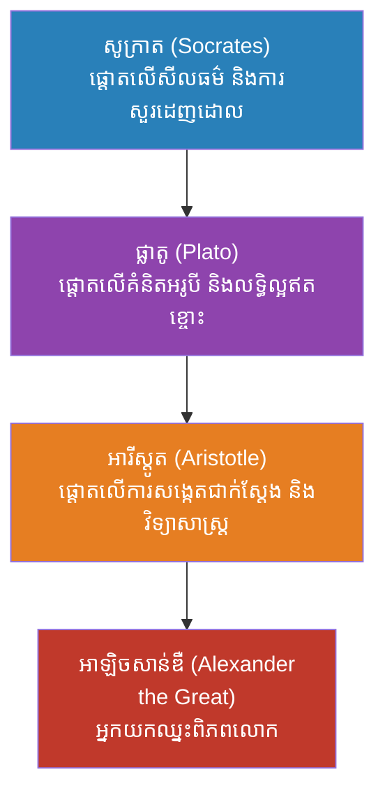
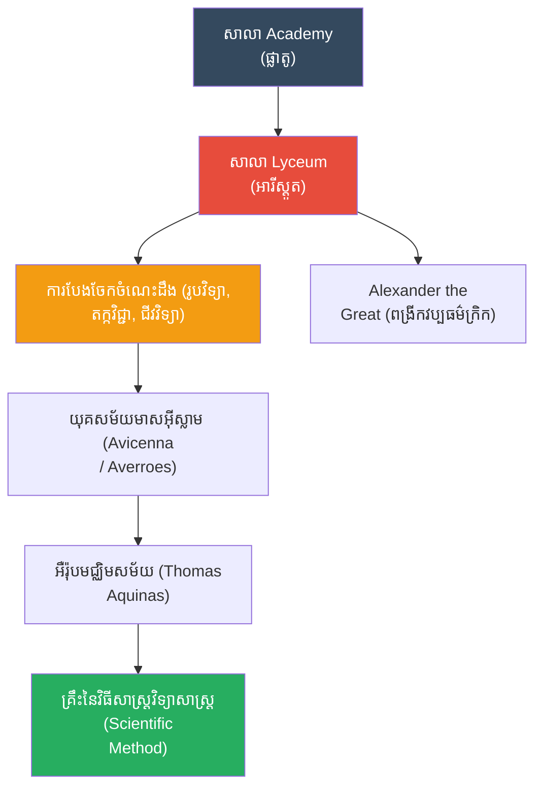

# The Biography of Aristotle (ជីវប្រវត្តិអារីស្តូត)

**Author:** ichamrong
**Date:** 2026-05-26
**Tags:** #aristotle #biography #philosophy #science #logic #greece #gold-standard
**Category:** Biographies
**Read Time:** ~15 min

---

## 📌 មាតិកា (Table of Contents)
- [សេចក្តីផ្តើម៖ កាយវិភាគវិទ្យានៃអ្នកសង្កេតការណ៍ (The Anatomy of an Observer)](#intro)
- [១. កុមារភាព និងកោសិកាពេទ្យ (Childhood & The Medical DNA)](#1)
- [២. ឥទ្ធិពលនៃការអប់រំ៖ ការបះបោរប្រឆាំងគ្រូ (Education & The Rebellion)](#2)
- [៣. អាវុធរបស់អារីស្តូត៖ តក្កវិជ្ជា និងធម្មជាតិ (The Weapons: Logic & Nature)](#3)
- [៤. ព្រឹត្តិការណ៍ដ៏អស្ចារ្យបំផុត៖ ការបង្កើតសាលា Lyceum (The Greatest Event: Founding the Lyceum)](#4)
- [៥. ការបង្ហាត់បង្រៀនអ្នកយកឈ្នះពិភពលោក (Tutoring the World Conqueror)](#5)
- [៦. ចិត្តសាស្ត្រ និងទស្សនវិជ្ជាពីកំណើតដល់ស្លាប់ (Psychology & Philosophy from Birth to Death)](#6)
- [៧. កំហុសឆ្គងដ៏ធំបំផុតដែលមិនគួរមាន (The Fatal Mistakes)](#7)
- [៨. កេរដំណែល (Legacy)](#8)
- [៩. តើអារីស្តូតបានបំផុសគំនិតអ្វីខ្លះ? (What Did Aristotle Inspire?)](#9)
- [សេចក្តីសន្និដ្ឋាន (Conclusion)](#conclusion)
- [🔗 ឯកសារទាក់ទង (Related Topics)](#related-topics)
- [ឯកសារយោង (References)](#references)

---

## សេចក្តីផ្តើម៖ កាយវិភាគវិទ្យានៃអ្នកសង្កេតការណ៍ (The Anatomy of an Observer)

> **«តើបុរសម្នាក់អាចក្លាយជា 'ខួរក្បាល' នៃមនុស្សជាតិជាង ២០០០ ឆ្នាំ ដោយរបៀបណា?»**

សូក្រាត បានប្រើសំណួរដើម្បីចាក់ទម្លុះភាពល្ងង់ខ្លៅ។ ផ្លាតូ បានរត់គេចពីភាពពិតទៅរកពិភពលោកនៃការស្រមើស្រមៃ។ ប៉ុន្តែ **អារីស្តូត (Aristotle)** មិនរត់ទៅណាទេ។ គាត់យកដៃប្រឡាក់ដី ចាប់សត្វល្អិតមកវះកាត់ (Dissect) កត់ត្រារចនាសម្ព័ន្ធរុក្ខជាតិ និងតាមដានចលនារបស់សរសៃឈាមនៅក្នុងសត្វសមុទ្រ។

ប្រសិនបើអ្នកចង់យល់ពីអត្តសញ្ញាណ (DNA) របស់វិទ្យាសាស្ត្រទំនើប អ្នកត្រូវតែស្គាល់បុរសម្នាក់នេះ។ គាត់គឺជាមនុស្សដំបូងគេបង្អស់ក្នុងប្រវត្តិសាស្ត្រ ដែលមើលមកធម្មជាតិមិនមែនជារឿងអាថ៌កំបាំងរបស់ព្រះ តែជា "ប្រព័ន្ធ" មួយដែលអាចចាត់ថ្នាក់ លេបត្របាក់ដោយបញ្ញា និងពន្យល់ដោយតក្កវិជ្ជា។ តើគាត់ប្រើក្បួនចិត្តសាស្ត្រអ្វី ដើម្បីប្រែក្លាយភាពវឹកវរនៃសកលលោក ឱ្យទៅជាក្បួនច្បាប់ដែលយើងរៀនដល់សព្វថ្ងៃ?

---

## ១. កុមារភាព និងកោសិកាពេទ្យ (Childhood & The Medical DNA)

អារីស្តូត កើតនៅឆ្នាំ ៣៨៤ មុនគ្រឹស្តសករាជ នៅក្នុងទីក្រុង Stagira ភាគខាងជើងប្រទេសក្រិក (Macedonia)។ ឪពុករបស់គាត់ឈ្មោះ Nicomachus គឺជា **គ្រូពេទ្យផ្ទាល់របស់ព្រះមហាក្សត្រម៉ាសេដ្វាន**។ 

ពីតូច អារីស្តូតធំឡើងនៅក្នុងរាជវាំង ដោយបានឃើញឪពុករបស់ខ្លួនវះកាត់អ្នកជំងឺ លាយថ្នាំ និងសង្កេតមើលរាងកាយមនុស្សជាប្រចាំ។ ជាអកុសល ឪពុកម្តាយរបស់គាត់បានស្លាប់តាំងពីគាត់នៅក្មេង ដែលធ្វើឱ្យគាត់ត្រូវរស់នៅក្រោមការមើលថែពីសាច់ញាតិ។

> 💡 **មេរៀនពីកុមារភាពដែលដក់ជាប់ដល់ស្លាប់ (The Lifelong Lesson):** កោសិកា (DNA) ពេទ្យរបស់ឪពុកគាត់ បានចាក់ឫសយ៉ាងជ្រៅក្នុងផ្នត់គំនិតគាត់។ ផ្ទុយពីទស្សនវិទូដទៃដែលចូលចិត្តអង្គុយស្រមើស្រមៃ អារីស្តូតជឿលើ **"ភស្តុតាង និងការសង្កេត (Empiricism)"**។ លោកជឿថា ចំណេះដឹងពិតប្រាកដត្រូវតែចាប់ផ្តើមពីអ្វីដែលភ្នែកមើលឃើញ និងដៃអាចស្ទាបបាន។

---

## ២. ឥទ្ធិពលនៃការអប់រំ៖ ការបះបោរប្រឆាំងគ្រូ (Education & The Rebellion)

នៅអាយុ ១៧ ឆ្នាំ អារីស្តូតបានធ្វើដំណើរទៅទីក្រុងអាថែន ដើម្បីចូលរៀននៅសាលា **The Academy** របស់ផ្លាតូ។ គាត់គឺជាសិស្សដ៏ឆ្លាតបំផុត និងបានចំណាយពេលជិត ២០ ឆ្នាំរៀននៅទីនោះ រហូតដល់ផ្លាតូស្លាប់។

ទោះបីជាលោកគោរពផ្លាតូខ្លាំងយ៉ាងណាក៏ដោយ ក៏លោកមិនបានយល់ស្របជាមួយទ្រឹស្តីទាំងអស់របស់គ្រូលោកដែរ ជាពិសេស "ទ្រឹស្តីទម្រង់ (Theory of Forms)" របស់ផ្លាតូ ដែលចាត់ទុកពិភពលោកនេះថាជាស្រមោលក្លែងក្លាយ។ អារីស្តូតបានបដិសេធទ្រឹស្តីនេះទាំងស្រុង លោកបានលាតបាតដៃទៅរកដី ហើយប្រកាសថា ការពិតគឺស្ថិតនៅលើដីនេះឯង។ អារីស្តូតបានពោលពាក្យអមតៈមួយថា៖ **"ខ្ញុំស្រលាញ់ផ្លាតូ ប៉ុន្តែខ្ញុំស្រលាញ់ការពិត (Truth) ជាង។"**

**ខ្សែស្រឡាយទស្សនវិជ្ជា (The Philosophical Lineage):**

> 💡 **ឥទ្ធិពលនៃការអប់រំ (The Impact of Education):** ការបះបោររបស់អារីស្តូតប្រឆាំងនឹងផ្លាតូ គឺជាចំណុចចាប់ផ្តើមនៃ **"វិទ្យាសាស្ត្រ (Science)"**។ វាបង្រៀនយើងថា ការគោរពគ្រូដ៏ល្អបំផុត មិនមែនជាការចម្លងតាមគ្រូទាំងស្រុងទេ តែគឺការហ៊ានបដិសេធគំនិតគ្រូដោយមានហេតុផលត្រឹមត្រូវ។

---

## ៣. អាវុធរបស់អារីស្តូត៖ តក្កវិជ្ជា និងធម្មជាតិ (The Weapons: Logic & Nature)

អារីស្តូត មិនមែនគ្រាន់តែជាទស្សនវិទូដែលអង្គុយគិតនោះទេ គាត់គឺជាអ្នកសង្កេតការណ៍រាល់អ្វីៗទាំងអស់នៅក្នុងធម្មជាតិ។ 

1. **តក្កវិជ្ជា (Syllogism):** គាត់គឺជាអ្នកបង្កើត "តក្កវិជ្ជា" ដំបូងបង្អស់។ ឧទាហរណ៍៖ "មនុស្សទាំងអស់ត្រូវតែស្លាប់ (គោលធំ)។ សូក្រាតគឺជាមនុស្ស (គោលតូច)។ ដូច្នេះ សូក្រាតត្រូវតែស្លាប់ (សេចក្តីសន្និដ្ឋាន)"។ របៀបគិតនេះក្លាយជាគ្រឹះនៃការសរសេរកូដ (Coding) និងហេតុផលវិទ្យាសាស្ត្រសព្វថ្ងៃ។
2. **ជីវវិទ្យា និងការចាត់ថ្នាក់ (Taxonomy):** គាត់បានចំណាយពេលជាច្រើនឆ្នាំនៅលើកោះ Lesbos ដើម្បីប្រមូលសត្វល្អិត សត្វស្លាប និងរុក្ខជាតិរាប់រយប្រភេទ ហើយយកមកធ្វើការបែងចែកថ្នាក់។ គាត់គឺជាមនុស្សដំបូងដែលបែងចែកសត្វជាប្រភេទ "មានឈាម" និង "គ្មានឈាម" (សត្វឆ្អឹងកង និងឥតឆ្អឹងកង)។

---

## ៤. ព្រឹត្តិការណ៍ដ៏អស្ចារ្យបំផុត៖ ការបង្កើតសាលា Lyceum (The Greatest Event: Founding the Lyceum, ៣៣៥ មុនគ.ស)

បន្ទាប់ពីចាកចេញពីអាថែនអស់មួយរយៈពេល អារីស្តូតបានត្រឡប់មកវិញក្នុងវ័យ ៥០ ឆ្នាំ ហើយបានបង្កើតសាលាផ្ទាល់ខ្លួនមួយឈ្មោះថា **"Lyceum"**។ 

មិនដូច The Academy របស់ផ្លាតូដែលផ្តោតលើគណិតវិទ្យានិងទ្រឹស្តី Lyceum គឺប្រៀបដូចជា **មន្ទីរពិសោធន៍វិទ្យាសាស្ត្រ** ដ៏ធំមួយ។ សាលានេះមានសួនសត្វ កន្លែងតាំងវត្ថុធម្មជាតិ និងបណ្ណាល័យដ៏ធំ។ អារីស្តូតចូលចិត្តដើរបង្រៀនសិស្សតាមសួនច្បារ ជាជាងអង្គុយក្នុងថ្នាក់ ដែលធ្វើឱ្យសិស្សរបស់គាត់ត្រូវបានគេហៅថា "Peripatetics" (អ្នកដែលដើរចុះដើរឡើង)។

---

## ៥. ការបង្ហាត់បង្រៀនអ្នកយកឈ្នះពិភពលោក (Tutoring the World Conqueror)

នៅឆ្នាំ ៣៤៣ មុនគ.ស ស្តេចភីលីពទី២ នៃម៉ាសេដ្វាន បានអញ្ជើញអារីស្តូតឱ្យមកធ្វើជាគ្រូបង្រៀនផ្ទាល់ដល់បុត្រារបស់ព្រះអង្គ ដែលមានព្រះជន្ម ១៣ វស្សា។ ក្មេងប្រុសនោះឈ្មោះ **អាឡិចសាន់ឌឺ (Alexander)**។

អារីស្តូតបានបង្រៀនអាឡិចសាន់ឌឺ អំពីវេជ្ជសាស្ត្រ ទស្សនវិជ្ជា សីលធម៌ និងអក្សរសាស្ត្រ។ គាត់បានបណ្តុះផ្នត់គំនិតនៃការត្រិះរិះវិភាគ ទៅក្នុងខួរក្បាលរបស់ក្មេងប្រុសដែលក្រោយមកបានក្លាយជា "អាឡិចសាន់ឌឺដ៏អស្ចារ្យ"។ ជាថ្នូរមកវិញ នៅពេលអាឡិចសាន់ឌឺទៅច្បាំងនៅទ្វីបអាស៊ី ព្រះអង្គតែងតែផ្ញើសំណាកសត្វ និងរុក្ខជាតិចម្លែកៗត្រឡប់មកឱ្យគ្រូរបស់ខ្លួនដើម្បីសិក្សាស្រាវជ្រាវជានិច្ច។

---

## ៦. ចិត្តសាស្ត្រ និងទស្សនវិជ្ជាពីកំណើតដល់ស្លាប់ (Psychology & Philosophy from Birth to Death)

បើយើងវះកាត់ផ្នត់គំនិតរបស់អារីស្តូត យើងនឹងឃើញពីវិធីដែលលោកពន្យល់សកលលោកទាំងមូល៖

*   **អ្នកសង្កេតការណ៍ដាច់ខាត (Empiricism):** លោកមានជំនឿផ្លូវចិត្តយ៉ាងមុតមាំថា "គ្មានអ្វីនៅក្នុងខួរក្បាលទេ ដែលមិនឆ្លងកាត់ញ្ញាណទាំង ៥ ជាមុននោះ"។
*   **ការឈ្លក់វង្វេងនឹងការចាត់ថ្នាក់ (Categorization Obsession):** ផ្លូវចិត្តរបស់លោកមិនអាចទ្រាំនឹង "ភាពវឹកវរ" បានទេ។ លោកត្រូវតែយកអ្វីៗគ្រប់យ៉ាង (តាំងពីសត្វល្អិត ដល់របបនយោបាយ) មកដាក់ក្នុង "ប្រអប់ (Category)" និងដាក់ឈ្មោះឱ្យវា។
*   **ទ្រឹស្តីគោលបំណង (Teleology - *Telos*):** លោកជឿថា គ្រប់យ៉ាងនៅក្នុងធម្មជាតិ សុទ្ធតែមាន "គោលដៅ (Telos)" របស់វា។ គ្រាប់ពូជមានគោលដៅក្លាយជាដើមឈើ មនុស្សមានគោលដៅក្លាយជាអ្នកមានសុភមង្គល។
*   **ផ្លូវកណ្តាល (The Golden Mean):** នៅក្នុងផ្នែកសីលធម៌ គាត់បង្រៀនថា គុណធម៌ស្ថិតនៅចន្លោះភាពជ្រុលហួសហេតុទាំងពីរ។ ឧទាហរណ៍៖ "ភាពក្លាហាន" គឺស្ថិតនៅចន្លោះ "ភាពកំសាក" និង "ភាពល្ងង់មិនចេះខ្លាច"។
*   **អ្នកចលនាទីមួយ (The Unmoved Mover):** លោកជឿថា សកលលោកត្រូវការអ្នកផ្តើមចលនាទីមួយ ដែលកម្រើកអ្វីៗគ្រប់យ៉ាង ដោយមិនកម្រើកខ្លួនឯង ដែលនេះជាគ្រឹះនៃទស្សនៈអំពី "ព្រះ" នាសម័យក្រោយ។
*   **ភាពសប្បាយរីករាយ (Eudaimonia):** គោលដៅចុងក្រោយរបស់មនុស្ស មិនមែនលុយ ឬកិត្តិយសទេ តែជាការរស់នៅប្រកបដោយគុណធម៌ និងការប្រើប្រាស់សក្តានុពលខ្លួនឯងឱ្យអស់ (Human Flourishing)។

---

## ៧. កំហុសឆ្គងដ៏ធំបំផុតដែលមិនគួរមាន (The Fatal Mistakes)

ទោះបីជាមានខួរក្បាលដ៏អស្ចារ្យ ប៉ុន្តែការពឹងផ្អែកលើតែ "ភ្នែក" របស់គាត់ បានបង្កើតកំហុសឆ្គងដ៏ធ្ងន់ធ្ងរ ដែលធ្វើឱ្យពិភពលោកដើរថយក្រោយរាប់ពាន់ឆ្នាំ៖

1.  **ផែនដីជាចំណុចកណ្តាល (Geocentrism):** អារីស្តូតជឿថា ផែនដីនៅស្ងៀម ហើយព្រះអាទិត្យនិងផ្កាយទាំងអស់វិលជុំវិញផែនដី។ កំហុសនេះត្រូវបានសាសនាចក្រយកទៅជឿដោយងងឹតងងុល ដែលរារាំងការរីកចម្រើនខាងតារាសាស្ត្រជាង ២០០០ ឆ្នាំ រហូតដល់សម័យកាល កូប៉ឺនិក (Copernicus) និង កាលីឡេអូ (Galileo)។
2.  **ការរើសអើងស្ត្រី និងទាសករ (Sexism & Slavery):** គាត់មានទស្សនៈខុសឆ្គងខាងជីវវិទ្យាដោយជឿថា ស្ត្រីគឺជា "បុរសដែលវិវត្តមិនទាន់ពេញលេញ" និងជឿថាមានមនុស្សមួយចំនួនកើតមកជា "ទាសករពីធម្មជាតិ (Natural slaves)"។ ទ្រឹស្តីនេះត្រូវបានគេយកទៅធ្វើជាអាវុធដើម្បីរំលោភសិទ្ធិមនុស្សអស់ជាច្រើនសតវត្សរ៍។
3.  **ទ្រឹស្តីកើតឡើងដោយឯកឯង (Spontaneous Generation):** គាត់ជឿថា សត្វរុយអាចកើតចេញពីភក់ ឬសាច់ស្អុយដោយឯកឯង ដែលជាកំហុសផ្នែកជីវវិទ្យាដ៏ធំ។

---

## ៨. កេរដំណែល (Legacy)

សៀវភៅរបស់អារីស្តូតបានគ្របដណ្តប់លើចំណេះដឹងរបស់មនុស្សជាតិអស់រយៈពេលជាង ២០០០ ឆ្នាំ។ នៅក្នុងយុគសម័យកណ្តាល (Middle Ages) អ្នកប្រាជ្ញអារ៉ាប់ និងអ្នកប្រាជ្ញគ្រឹស្តសាសនា គោរពគាត់យ៉ាងខ្លាំងរហូតដល់ហៅគាត់យ៉ាងខ្លីថា "The Philosopher (លោកទស្សនវិទូ)" ដោយមិនបាច់ហៅឈ្មោះផង។

---

## ៩. តើអារីស្តូតបានបំផុសគំនិតអ្វីខ្លះ? (What Did Aristotle Inspire?)

នេះគឺជាបញ្ជីរាយនាមរឿងរ៉ាវ និងគោលគំនិតចំនួន ២៥ ដែលអារីស្តូតបានបំផុសគំនិត និងបន្សល់ទុកជាមរតកសម្រាប់មនុស្សជាតិ៖

1.  **តក្កវិជ្ជា (Syllogistic Logic):** របៀបនៃការទាញសេចក្តីសន្និដ្ឋាន ដែលជាគ្រឹះនៃវិទ្យាសាស្ត្រកុំព្យូទ័រ និងការសរសេរកូដសព្វថ្ងៃ។
2.  **ការចាត់ថ្នាក់ជីវសាស្ត្រ (Taxonomy/Biology):** អ្នកដំបូងដែលចាត់ថ្នាក់សត្វតាមពូជ ដែលក្រោយមក Linnaeus យកទៅអភិវឌ្ឍជាប្រព័ន្ធចាត់ថ្នាក់សម័យទំនើប។
3.  **សាលា Lyceum (Peripatetic School):** ស្ថាប័នសិក្សាដែលប្រៀបដូចជាមន្ទីរពិសោធន៍ដំបូងគេ។
4.  **អរូបីវិជ្ជា (Metaphysics):** លោកគឺជាអ្នកបង្កើតពាក្យនេះផ្ទាល់ ដើម្បីពិពណ៌នាពីអ្វីដែលនៅហួសពីរូបវិទ្យា។
5.  **សីលធម៌ផ្លូវកណ្តាល (The Golden Mean):** គំនិតនៃការស្វែងរកតុល្យភាពក្នុងជីវិត ជៀសវាងភាពជ្រុលហួសហេតុ។
6.  **"មនុស្សគឺជាសត្វនយោបាយ" (Political Animal):** ទ្រឹស្តីដែលថា មនុស្សត្រូវតែរស់នៅក្នុងសង្គម ដើម្បីសម្រេចសក្តានុពលពេញលេញ។
7.  **វោហាសាស្ត្រ (Rhetoric - Ethos, Pathos, Logos):** គ្រឹះនៃការនិយាយជាសាធារណៈ និងការបញ្ចុះបញ្ចូល ដែលសូម្បីតែទីភ្នាក់ងារទីផ្សារ (Marketing) សព្វថ្ងៃក៏ប្រើប្រាស់វា។
8.  **សិល្បៈនៃការតែងនិពន្ធ (Poetics):** លោកបានបង្កើតច្បាប់ទម្លាប់នៃការសរសេររឿងល្ខោន កំណាព្យ សោកនាដកម្ម និងកំប្លែង។
9.  **ការរំសាយអារម្មណ៍ (Catharsis):** គំនិតដែលថា ការមើលរឿងកំសត់ជួយជម្រះអារម្មណ៍អវិជ្ជមាននៅក្នុងខ្លួនមនុស្ស។
10. **ទ្រឹស្តីហេតុផល ៤ យ៉ាង (The Four Causes):** ការពន្យល់ពីដើមកំណើតនៃវត្ថុមួយ តាមរយៈ វត្ថុធាតុ (Material), ទម្រង់ (Formal), អ្នកបង្កើត (Efficient), និងគោលដៅ (Final)។
11. **ទ្រឹស្តីនៃគោលបំណង (Teleology):** គំនិតដែលជឿថាអ្វីៗគ្រប់យ៉ាងសុទ្ធតែមានគោលដៅ និងអត្ថន័យ។
12. **ឧតុនិយម (Meteorology):** លោកបានសរសេរសៀវភៅដំបូងគេបង្អស់ដែលសិក្សាពីអាកាសធាតុ ភ្លៀង និងខ្យល់។
13. **ការសង្កេតវិទ្យាសាស្ត្រ (Empiricism):** គ្រឹះនៃវិធីសាស្ត្រវិទ្យាសាស្ត្រ (Scientific Method) ដែលទាមទារឱ្យមានភស្តុតាងជាក់ស្តែង។
14. **អ្នកចលនាទីមួយ (The Unmoved Mover):** ទ្រឹស្តីដែលក្រោយមកសាសនាគ្រឹស្តយកទៅបកស្រាយថាជា "ព្រះ (God)"។
15. **ការលាយបញ្ចូលរូបធាតុនិងទម្រង់ (Hylomorphism):** ការបដិសេធទ្រឹស្តីផ្លាតូ ដោយអះអាងថារូបធាតុ និងទម្រង់មិនអាចបំបែកពីគ្នាបានទេ។
16. **ការចាត់ថ្នាក់ទម្រង់រដ្ឋាភិបាល (Forms of Government):** ការបែងចែករដ្ឋាភិបាលជាប្រភេទ (Monarchy, Aristocracy, Polity និងទម្រង់អាក្រក់របស់វា)។
17. **យុគសម័យមាសអ៊ីស្លាម (Islamic Golden Age):** ស្នាដៃរបស់លោកត្រូវបានបកប្រែជាភាសាអារ៉ាប់ និងបានជួយឱ្យអរិយធម៌អ៊ីស្លាមរីកចម្រើនខ្លាំង។
18. **Scholasticism (ទស្សនវិជ្ជាសាសនាចក្រ):** Thomas Aquinas បានយកទ្រឹស្តីអារីស្តូតទៅច្របាច់បញ្ចូលគ្នាជាមួយនឹងសាសនាគ្រឹស្ត ក្លាយជាគ្រឹះនៃការអប់រំនៅអឺរ៉ុប។
19. **ច្បាប់នៃការមិនផ្ទុយគ្នា (Law of Non-Contradiction):** គោលការណ៍តក្កវិជ្ជាដែលថា របស់មួយមិនអាចជា "ក" ផង និង "មិនមែន ក" ផង ក្នុងពេលតែមួយបានទេ។
20. **ការយល់ពី "ពេលវេលា" (Concept of Time):** លោកបានកំណត់ន័យពេលវេលាថាជា "រង្វាស់នៃចលនា (Measure of Motion)"។
21. **សត្វវិទ្យា (Zoology):** ការសិក្សាយ៉ាងល្អិតល្អន់ពីកាយវិភាគវិទ្យានៃសត្វសមុទ្ររាប់រយប្រភេទនៅលើកោះ Lesbos។
22. **ភស្តុតាងនៃការរាងស្វ៊ែររបស់ផែនដី (Spherical Earth):** លោកបានផ្តល់ភស្តុតាងតាមរយៈការសង្កេតស្រមោលផែនដីលើព្រះច័ន្ទពេលសូរ្យគ្រាស។
23. **យុត្តិធម៌បែបចែកចាយ (Distributive Justice):** គោលការណ៍បែងចែកទ្រព្យសម្បត្តិ និងអំណាចនៅក្នុងសង្គមដោយសមធម៌។
24. **សុភមង្គលពិតប្រាកដ (Eudaimonia):** ទស្សនៈដែលអះអាងថាសុភមង្គលមិនមែនគ្រាន់តែជាអារម្មណ៍សប្បាយចិត្ត តែជាសកម្មភាពនៃការរស់នៅបានល្អ និងមានគុណធម៌។
25. **ការបណ្តុះបណ្តាលអាឡិចសាន់ឌឺ (Tutoring Alexander):** ការផ្តល់ប្រាជ្ញាដល់អ្នកយកឈ្នះ ដែលបានផ្លាស់ប្តូរផែនទីនយោបាយ និងវប្បធម៌នៃពិភពលោក។

---

## សេចក្តីសន្និដ្ឋាន (Conclusion)

> **«ខ្ញុំស្រលាញ់ផ្លាតូ ប៉ុន្តែខ្ញុំស្រលាញ់ការពិតជាង។» — អារីស្តូត**

អារីស្តូតគឺជាស្ថាបត្យករនៃ "ការគិតបែបប្រព័ន្ធ"។ មុនអារីស្តូត ពិភពលោកគឺពោរពេញទៅដោយរឿងអាថ៌កំបាំង និងរឿងព្រេងទេវកថា។ ក្រោយអារីស្តូត ពិភពលោកត្រូវបានចាត់ថ្នាក់ បែងចែក និងអាចសិក្សាបានតាមរយៈតក្កវិជ្ជា។ ទោះបីជាទ្រឹស្តីមួយចំនួនរបស់លោក (ដូចជាផែនដីជាចំណុចកណ្តាល) ត្រូវបានបង្ហាញថាខុសក៏ដោយ ក៏ "វិធីសាស្ត្រ" នៃការស្វែងរកការពិតរបស់លោក នៅតែជាកោសិកា (DNA) នៃវិទ្យាសាស្ត្រទំនើបដដែល។ លោកពិតស័ក្តិសមនឹងរហស្សនាមថា "លោកទស្សនវិទូ (The Philosopher)" ប្រាកដមែន។

---

## 🔗 ឯកសារទាក់ទង (Related Topics)
* [ជីវប្រវត្តិសូក្រាត (Socrates Biography)](../socrates/01-socrates-biography.md)
* [ខ្សែស្រឡាយសូក្រាត (The Socratic Lineage)](../socrates/02-socrates-lineage.md)
* [ជីវប្រវត្តិផ្លាតូ (Plato Biography)](../plato/01-plato-biography.md)
* [ជីវប្រវត្តិអាឡិចសាន់ឌឺ (Alexander the Great)](../alexander/01-alexander-biography.md)

## ឯកសារយោង (References)

*   **Nicomachean Ethics by Aristotle** — His primary work on ethics, describing the Golden Mean and Eudaimonia.
*   **Politics by Aristotle** — His analysis of different forms of government.
*   **Metaphysics by Aristotle** — Foundational texts on existence, reality, and the Unmoved Mover.

---

*Last updated: 2026-05-26*
