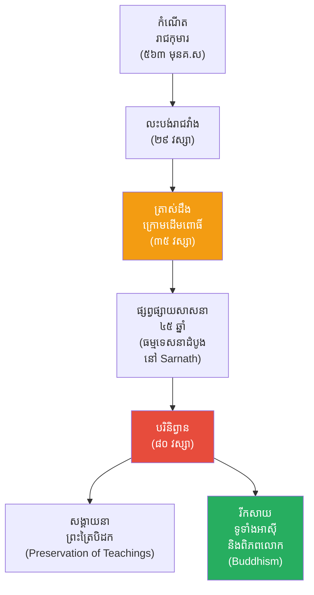

# The Biography of Gautama Buddha (ជីវប្រវត្តិព្រះពុទ្ធសាមណគោតម)

**Author:** ichamrong  
**Date:** 2026-05-26  
**Tags:** #buddha #biography #enlightenment #buddhism #history #philosophy  
**Category:** Biographies  
**Read Time:** ~15 min  

---

## 📌 មាតិកា (Table of Contents)
- [សេចក្តីផ្តើម៖ កាយវិភាគវិទ្យានៃការរំដោះខ្លួន (The Anatomy of Liberation)](#intro)
- [១. កុមារភាព និងទ្រុងមាស (Childhood & The Golden Cage)](#1)
- [២. និមិត្តសញ្ញាទាំង ៤ និងការលះបង់ដ៏អស្ចារ្យ (The Four Sights & Great Renunciation)](#2)
- [៣. ការស្វែងរក និងមជ្ឈិមបដិបទា (The Search & The Middle Way)](#3)
- [៤. ការផ្ចាញ់មារ និងការត្រាស់ដឹង (Defeating Mara & Enlightenment)](#4)
- [៥. ការបង្រៀន និងការពង្រីកសាសនា (The Ministry & Spreading the Dharma)](#5)
- [៦. ចិត្តសាស្ត្រ និងទស្សនវិជ្ជាពីកំណើតដល់ស្លាប់ (Psychology & Philosophy from Birth to Death)](#6)
- [៧. បញ្ហាប្រឈម និងសត្រូវ (Challenges and Adversaries)](#7)
- [៨. កេរដំណែល (Legacy)](#8)
- [៩. តើព្រះពុទ្ធបានបំផុសគំនិតអ្វីខ្លះ? (What Did The Buddha Inspire?)](#9)
- [សេចក្តីសន្និដ្ឋាន (Conclusion)](#conclusion)
- [🔗 ឯកសារទាក់ទង (Related Topics)](#related-topics)
- [ឯកសារយោង (References)](#references)

---

## សេចក្តីផ្តើម៖ កាយវិភាគវិទ្យានៃការរំដោះខ្លួន (The Anatomy of Liberation)

> **«តើអ្វីទៅដែលរុញច្រានឱ្យបុរសម្នាក់ ដែលមានអំណាចនិងទ្រព្យសម្បត្តិពេញដៃ សុខចិត្តដើរចេញពីគ្រប់យ៉ាង ដើម្បីក្លាយជាអ្នកសុំទាននៅតាមដងផ្លូវ?»**

សាកស្រមៃមើលពីទិដ្ឋភាពនេះ៖ អ្នកគឺជាព្រះរាជកុមារដែលនឹងត្រូវឡើងគ្រងរាជ្យជាស្តេចចក្រពត្តិដ៏មានអំណាចបំផុត។ អ្នករស់នៅក្នុងរាជវាំងដែលសាងសង់ឡើងពីមាស មានស្រីស្នំរាប់រយនាក់ មានអាហារបរិបូរណ៍ និងគ្មាននរណាម្នាក់ហ៊ាននិយាយពាក្យ "មិន" ដាក់អ្នកឡើយ។ ប៉ុន្តែនៅយប់មួយ កណ្តាលអធ្រាត្រ អ្នកបានសម្លឹងមើលមុខប្រពន្ធនិងកូនដែលកំពុងដេកលក់ ហើយសម្រេចចិត្តបោះបង់ចោលវាទាំងអស់ ដោយដើរចេញទៅក្នុងព្រៃងងឹតទាំងដៃទទេ។ 

តើអ្វីដែលធ្វើឱ្យបុរសម្នាក់នេះហ៊ានលះបង់អំណាចដែលមនុស្សពេញមួយលោកប្រាថ្នាចង់បាន? តើគាត់កំពុងស្វែងរកអ្វីដែលធំជាងរាជសម្បត្តិ? នេះគឺជារឿងរ៉ាវរបស់ **សិទ្ធត្ថ គោតម (Siddhartha Gautama)** បុរសដែលបានធ្វើបដិវត្តន៍ប្រឆាំងនឹង "សេចក្តីទុក្ខ" របស់មនុស្សជាតិ ហើយបានក្លាយជាព្រះសម្មាសម្ពុទ្ធ ដែលផ្លាស់ប្តូរផ្នត់គំនិតមនុស្សរាប់ពាន់លាននាក់រហូតដល់សព្វថ្ងៃ។

---

## ១. កុមារភាព និងទ្រុងមាស (Childhood & The Golden Cage)

ព្រះពុទ្ធសាមណគោតម មានព្រះនាមដើមថា **សិទ្ធត្ថ គោតម (Siddhartha Gautama)** កើតនៅប្រហែល ៥៦៣ ឆ្នាំមុនគ្រឹស្តសករាជ នៅឧទ្យានលុម្ពិនី (Lumbini) ដែលបច្ចុប្បន្នស្ថិតនៅក្នុងប្រទេសនេប៉ាល់។ ទ្រង់ជាបុត្ររបស់ព្រះបាទ **សុទ្ធោទនៈ (Suddhodana)** និងព្រះនាង **សិរិមហាមាយា (Maya)**។

យោងតាមប្រវត្តិសាស្ត្រ ហោរាបានទស្សន៍ទាយថា ព្រះរាជកុមារសិទ្ធត្ថ នឹងក្លាយជាស្តេចចក្រពត្តិដ៏អស្ចារ្យ (Great King) ប្រសិនបើទ្រង់នៅគ្រប់គ្រងរាជ្យ ឬនឹងក្លាយជាអ្នកប្រាជ្ញ/ព្រះពុទ្ធដ៏អស្ចារ្យ (Great Sage/Buddha) ប្រសិនបើទ្រង់ចេញសាងផ្នួស។ ដោយសារតែព្រះបិតាចង់ឱ្យទ្រង់ក្លាយជាស្តេច ទើបព្រះអង្គបានបង្កើត "ទ្រុងមាស" ដើម្បីឃុំទ្រង់។ ព្រះបិតាបានសាងសង់រាជវាំង ៣ សម្រាប់រដូវទាំង៣ ដើម្បីធានាថាព្រះរាជកុមារមិនដែលឃើញពីសេចក្តីទុក្ខ ជំងឺ ឬសេចក្តីស្លាប់ឡើយ។ 

> 💡 **មេរៀនពីកុមារភាពដែលដក់ជាប់ដល់ស្លាប់ (The Lifelong Lesson):** ការឃុំឃាំងនៅក្នុងរាជវាំង បានបង្រៀនសិទ្ធត្ថថា វត្ថុនិយម និងការគេចវេះពីការពិត មិនមែនជាដំណោះស្រាយនោះទេ។ ពេលដែលវាំងនននៃភាពសប្បាយរីករាយត្រូវបានទាញចេញ ព្រះអង្គបានយល់ថា វត្ថុធាតុទាំងអស់គ្រាន់តែជាការបោកប្រាស់ (Illusion) មួយប៉ុណ្ណោះ។

---

## ២. និមិត្តសញ្ញាទាំង ៤ និងការលះបង់ដ៏អស្ចារ្យ (The Four Sights & Great Renunciation)

ទោះបីជារស់នៅក្នុងគំនរមាសប្រាក់រហូតដល់ព្រះជន្ម ២៩ វស្សា ក៏ព្រះអង្គនៅតែមានអារម្មណ៍ថាមិនស្កប់ស្កល់។ ថ្ងៃមួយ ទ្រង់បានបញ្ជាឱ្យសារថីឈ្មោះ ឆន្ទៈ (Channa) បើករទេះចេញទៅក្រៅរាជវាំង ហើយបានជួបប្រទះនូវ **និមិត្តសញ្ញាទាំង ៤ (The Four Sights)** ដែលប្រៀបដូចជារន្ទះបាញ់ចំកណ្តាលបេះដូងរបស់ទ្រង់៖

1.  **មនុស្សចាស់ជរា (An Old Man):** បង្ហាញថាសម្រស់ និងកម្លាំងមិននៅយូរអង្វែង។
2.  **អ្នកជំងឺ (A Sick Man):** បង្ហាញថារាងកាយតែងតែជួបប្រទះនឹងការឈឺចាប់។
3.  **សាកសព (A Corpse):** បង្ហាញថាមនុស្សគ្រប់រូបមិនអាចគេចផុតពីសេចក្តីស្លាប់បាន។
4.  **សមណៈ/អ្នកបួស (An Ascetic):** បង្ហាញពីផ្លូវនៃការស្វែងរកសន្តិភាពផ្លូវចិត្ត ដើម្បីរំដោះខ្លួនចេញពីទុក្ខ។

ដោយឃើញនូវ "សេចក្តីទុក្ខ (Dukkha)" នៃវដ្តសង្សារ ទ្រង់បានសម្រេចចិត្តលះបង់រាជសម្បត្តិ ប្រពន្ធ និងកូនប្រុសព្រះនាម រាហុល (Rahula)។ នៅកណ្តាលអធ្រាត្រ ទ្រង់បានកាត់សក់ ស្លៀកពាក់ស្បែកខ្លា និងដើរចូលទៅក្នុងព្រៃ។ ព្រឹត្តិការណ៍នេះត្រូវបានគេស្គាល់ថាជា **ការលះបង់ដ៏អស្ចារ្យ (The Great Renunciation)**។

---

## ៣. ការស្វែងរក និងមជ្ឈិមបដិបទា (The Search & The Middle Way)

សិទ្ធត្ថបានចំណាយពេល **៦ ឆ្នាំ** សិក្សាជាមួយគ្រូធំៗជាច្រើន និងបានអនុវត្តនូវវិធី **ទុក្ករកិរិយា (Extreme Asceticism)** ដោយការបង្អត់អាហាររហូតដល់ស្គមសល់តែស្បែកនិងឆ្អឹង សង្កត់ដង្ហើម និងធ្វើទារុណកម្មរាងកាយដើម្បីរំដោះព្រលឹង។ 

ថ្ងៃមួយ ទ្រង់បានឮអ្នកលេងពិណម្នាក់និយាយថា៖ *"បើអ្នករឹតខ្សែពិណតឹងពេក វានឹងដាច់។ បើអ្នកបន្ធូរវាពេក វានឹងមិនចេញសំឡេង។"* ពាក្យនេះបានដាស់ស្មារតីព្រះអង្គឱ្យយល់ថា ការធ្វើទារុណកម្មខ្លួនឯងខ្លាំងពេក ក៏មិនមែនជាផ្លូវត្រូវដែរ។ 

ទ្រង់បានសម្រេចចិត្តទទួលទានអាហារវិញ (បបរទឹកដោះពីនាងសុជាតា) ហើយបានជ្រើសរើសផ្លូវកណ្តាល **(The Middle Way - មជ្ឈិមបដិបទា)** គឺមិនតឹងរ៉ឹងពេកក្នុងការធ្វើទារុណកម្មរាងកាយ ហើយក៏មិនធូររលុងពេកក្នុងការបណ្តោយតាមចំណង់។

---

## ៤. ការផ្ចាញ់មារ និងការត្រាស់ដឹង (Defeating Mara & Enlightenment)

ទ្រង់បានទៅគង់សមាធិនៅក្រោម **ដើមពោធិ៍ (Bodhi Tree)** នៅតំបន់ពុទ្ធគយា (Bodh Gaya) ដោយប្តេជ្ញាថានឹងមិនក្រោកពីទីនេះទេ រហូតទាល់តែបានត្រាស់ដឹង។ 

នៅក្នុងការសមាធិដ៏ជ្រៅ ព្រះអង្គត្រូវបានវាយប្រហារដោយ **មារ (Mara)** ដែលតំណាងឱ្យចំណង់ សេចក្តីភ័យខ្លាច និងភាពងងឹតនៅក្នុងចិត្តមនុស្ស។ មារបានបញ្ជូនកងទ័ពបិសាច និងកូនស្រីដ៏ស្រស់ស្អាតទាំង៣ ដើម្បីមកបំភិតបំភ័យ និងល្បួងព្រះអង្គ។ ប៉ុន្តែសិទ្ធត្ថគ្រាន់តែយកដៃស្តាំស្ទាបដី (Bhumisparsha Mudra) ហៅព្រះធរណីជាសាក្សី។ ទីបំផុតមារក៏ត្រូវបរាជ័យ។

នៅពេលព្រះអាទិត្យរះឡើង ព្រះអង្គបានយល់ច្បាស់ពីច្បាប់ធម្មជាតិ (ច្បាប់កម្មផល និងការកើតស្លាប់) និងបានត្រាស់ដឹងនូវសច្ចធម៌ ក្លាយជា **ព្រះសម្មាសម្ពុទ្ធ (The Awakened One)** ក្នុងព្រះជន្ម ៣៥ វស្សា។

---

## ៥. ការបង្រៀន និងការពង្រីកសាសនា (The Ministry & Spreading the Dharma)

ព្រះពុទ្ធបានចំណាយពេល **៤៥ ឆ្នាំ** បន្ទាប់ ដើរប្រោសសត្វ និងបង្រៀនធម៌នៅទូទាំងប្រទេសឥណ្ឌា។ ធម្មទេសនាលើកដំបូងរបស់ព្រះអង្គត្រូវបានសម្តែងនៅព្រៃឥសិបតនមិគទាយវ័ន (Deer Park in Sarnath) ទៅកាន់បញ្ចវគ្គីយ៍ ដែលត្រូវបានគេស្គាល់ថាជាការបង្វិលកង់ធម៌ **(Dhammacakkappavattana Sutta)**។

ទ្រង់បានបង្រៀនមនុស្សគ្រប់ស្រទាប់វណ្ណៈ មិនថាស្តេច សេដ្ឋី អ្នកក្រ ឬពេស្យាឡើយ ព្រោះទ្រង់បដិសេធប្រព័ន្ធវណ្ណៈ (Caste System) របស់ព្រាហ្មណ៍សាសនា។ ការបង្រៀនស្នូលរបស់ព្រះអង្គគឺ **អរិយសច្ចៈ ៤ (The Four Noble Truths)** និង **អរិយមគ្គប្រកបដោយអង្គ ៨ (The Noble Eightfold Path)**។ ព្រះអង្គបានបង្កើតសង្គមព្រះសង្ឃ (Sangha) ដែលបើកចំហរទាំងបុរសនិងស្ត្រី ឱ្យចូលរួមបដិបត្តិធម៌។

---

## ៦. ចិត្តសាស្ត្រ និងទស្សនវិជ្ជាពីកំណើតដល់ស្លាប់ (Psychology & Philosophy from Birth to Death)

ព្រះពុទ្ធមិនមែនត្រឹមតែជាអ្នកដឹកនាំសាសនាទេ តែទ្រង់គឺជាអ្នកចិត្តសាស្ត្រដ៏កំពូលម្នាក់។ នេះគឺជាទស្សនវិជ្ជាផ្លូវចិត្តរបស់ទ្រង់៖

*   **ការទទួលស្គាល់សេចក្តីទុក្ខ (Embracing Dukkha):** មិនមែនជាការគិតបែបអវិជ្ជមានទេ តែជាការទទួលស្គាល់ការពិតថា គ្រប់យ៉ាងគឺមិនស្ថិតស្ថេរ (អនិច្ចំ)។
*   **ច្បាប់នៃបុព្វហេតុនិងផល (Law of Karma):** ទ្រង់បង្រៀនថាមនុស្សជាអ្នកកំណត់វាសនារបស់ខ្លួនឯង តាមរយៈទង្វើរបស់ខ្លួន មិនមែនព្រះជាអ្នកកំណត់នោះទេ។
*   **ការរំលត់អត្តា (Anatta / Non-Self):** ទ្រង់បានបង្រៀនថា គ្មាន "ព្រលឹង" ណាមួយដែលស្ថិតស្ថេរជារៀងរហូតនោះទេ គ្រប់យ៉ាងគឺជារូបធាតុដែលប្រមូលផ្តុំនិងផ្លាស់ប្តូរជានិច្ច។ ការបោះបង់អត្តា (Ego) គឺជាកូនសោរទៅរកសន្តិភាព។
*   **មេត្តា និងករុណា (Loving-Kindness & Compassion):** ផ្លូវចិត្តរបស់ព្រះអង្គគឺពោរពេញដោយក្តីមេត្តាចំពោះសត្វលោកទាំងអស់ ទោះបីជាសត្រូវដែលចង់សម្លាប់ទ្រង់ក៏ដោយ។
*   **ការផ្តោតអារម្មណ៍លើបច្ចុប្បន្ន (Mindfulness/Vipassana):** ការដឹងខ្លួនក្នុងបច្ចុប្បន្នកាល គឺជាអាវុធដ៏មុតស្រួចបំផុតក្នុងការកាត់ផ្តាច់សេចក្តីទុក្ខដែលកើតពីអតីតកាលនិងអនាគត។
*   **វិភាគទានផ្អែកលើភស្តុតាង (Empirical Inquiry / Kalama Sutta):** ព្រះអង្គបង្រៀនកុំឱ្យជឿលើអ្វីមួយដោយងងឹតងងល់ សូម្បីតែពាក្យរបស់ទ្រង់ក៏ដោយ លុះត្រាតែបានសាកល្បងដោយខ្លួនឯងហើយឃើញថាវាផ្តល់លទ្ធផលល្អ។

---

## ៧. បញ្ហាប្រឈម និងសត្រូវ (Challenges and Adversaries)

ទោះបីជាព្រះពុទ្ធប្រកបដោយមេត្តា ប៉ុន្តែក្នុងដំណើរនៃការបង្រៀន ៤៥ ឆ្នាំ ទ្រង់បានជួបប្រទះនឹងការប្រឆាំងយ៉ាងខ្លាំងក្លា៖

1.  **ការប៉ុនប៉ងធ្វើឃាតពីទេវទត្ត (Devadatta's Assassination Attempts):** ទេវទត្ត ដែលជាបងប្អូនជីដូនមួយរបស់ព្រះអង្គ មានសេចក្តីច្រណែននិងចង់គ្រប់គ្រងសង្ឃ។ គាត់បានប៉ុនប៉ងធ្វើឃាតព្រះពុទ្ធជាច្រើនដង ដូចជាទម្លាក់ថ្មពីលើភ្នំ និងលែងដំរីចុះប្រេង (នាឡាគិរី) ឱ្យរត់មកជាន់ព្រះអង្គ ប៉ុន្តែមិនបានសម្រេច។
2.  **ការប្រឆាំងពីពួកព្រាហ្មណ៍ (Opposition from Brahmins):** ដោយសារព្រះអង្គបដិសេធប្រព័ន្ធវណ្ណៈ និងការសម្លាប់សត្វបូជាយញ្ញ ពួកព្រាហ្មណ៍ជាច្រើនបានខឹងសម្បារ និងព្យាយាមបង្ខូចកេរ្តិ៍ឈ្មោះព្រះអង្គតាមរយៈការចោទប្រកាន់ផ្សេងៗ។
3.  **ការចោទប្រកាន់រឿងអាស្រូវ (Scandals and False Accusations):** មានអ្នកប្រឆាំងបានជួលស្ត្រីឈ្មោះ ចិញ្ចាមាណវិកា ឱ្យយកកំណាត់ឈើចងជាប់នឹងពោះធ្វើជាមានផ្ទៃពោះ រួចចោទប្រកាន់ព្រះអង្គកណ្តាលចំណោមមនុស្ស ប៉ុន្តែការពិតត្រូវបានលាតត្រដាង។
4.  **ការបែកបាក់សង្ឃ (Schism in the Sangha):** ទេវទត្តបានបំបែកបំបាក់សង្ឃមួយចំនួនឱ្យដើរចេញពីព្រះអង្គ ដែលនេះគឺជាបញ្ហាប្រឈមដ៏ធំបំផុតនៅក្នុងស្ថាប័នសាសនាពេលនោះ។

---

## ៨. កេរដំណែល (Legacy)

នៅក្នុងព្រះជន្ម **៨០ វស្សា** ព្រះពុទ្ធបានយាងចូលបរិនិព្វាននៅទីក្រុងកុសិនារា (Kushinagar)។ បណ្តាំចុងក្រោយរបស់ព្រះអង្គគឺ៖ *"អ្វីៗដែលផ្សំឡើង តែងតែមានការវិនាសទៅវិញជាធម្មតា។ ចូរអ្នករាល់គ្នាខិតខំប្រឹងប្រែង រំដោះខ្លួនដោយសេចក្តីមិនប្រមាថចុះ!"*

ព្រះពុទ្ធមិនមែនជាព្រះអាទិទេព (God) ដែលបង្កើតលោកនោះទេ ប៉ុន្តែទ្រង់គឺជា "គ្រូបង្រៀន (Teacher)" ដ៏អស្ចារ្យ ដែលបានរកឃើញផ្លូវចេញពីសេចក្តីទុក្ខ។ សព្វថ្ងៃនេះ ព្រះពុទ្ធសាសនាមានអ្នកគោរពប្រតិបត្តិជាង ៥០០ លាននាក់ទូទាំងពិភពលោក។

---

## ៩. តើព្រះពុទ្ធបានបំផុសគំនិតអ្វីខ្លះ? (What Did The Buddha Inspire?)

នេះគឺជាបញ្ជីរាយនាមរឿងរ៉ាវ និងគោលគំនិតចំនួន ២៥ ដែលព្រះពុទ្ធបានបំផុសគំនិត និងបន្សល់ទុកជាមរតកសម្រាប់មនុស្សជាតិ៖

1.  **អរិយសច្ចៈ ៤ (The Four Noble Truths):** មូលដ្ឋានគ្រឹះនៃការយល់ដឹងពីសេចក្តីទុក្ខ និងផ្លូវរំលត់ទុក្ខ។
2.  **អរិយមគ្គប្រកបដោយអង្គ ៨ (The Noble Eightfold Path):** ផ្លូវកណ្តាលសម្រាប់ការរស់នៅប្រកបដោយសីលធម៌ និងបញ្ញា។
3.  **ការសមាធិដឹងខ្លួន (Mindfulness/Vipassana):** បានក្លាយជាមូលដ្ឋានគ្រឹះនៃការព្យាបាលផ្លូវចិត្តសម័យទំនើប (MBSR)។
4.  **ព្រះត្រៃបិដក (Pali Canon):** កម្រងអក្សរសាស្ត្រសាសនាដ៏ធំបំផុតមួយក្នុងពិភពលោក។
5.  **សិល្បៈនិងស្ថាបត្យកម្ម (Buddhist Art & Architecture):** ការកសាងវត្តអារាម ចេតិយ និងរូបចម្លាក់ព្រះពុទ្ធទូទាំងអាស៊ី។
6.  **ការលុបបំបាត់វណ្ណៈ (Rejection of Caste System):** ការតស៊ូមតិដើម្បីភាពស្មើគ្នារបស់មនុស្សទាំងអស់។
7.  **សិទ្ធិស្ត្រីក្នុងសាសនា (Women in Monasticism):** ការអនុញ្ញាតឱ្យស្ត្រីអាចបួសជាភិក្ខុនីបាន ដែលជាការផ្លាស់ប្តូរធំមួយក្នុងសង្គមឥណ្ឌាជំនាន់នោះ។
8.  **ទស្សនវិជ្ជានៃភាពសូន្យ (Emptiness/Sunyata):** គំនិតដែលជះឥទ្ធិពលដល់អ្នកប្រាជ្ញសាសនាធំៗដូចជា នាគជុន (Nagarjuna)។
9.  **សន្តិវិធីនិងអហិង្សា (Ahimsa & Non-violence):** គោលការណ៍មិនបៀតបៀនជីវិតសត្វលោក ដែលបានជះឥទ្ធិពលដល់មេដឹកនាំដូចជា គន្ធី និងម៉ាទីនលូធើឃីង។
10. **ចក្រភពអាសោក (Ashoka's Empire):** អធិរាជអាសោកបានយកពុទ្ធសាសនាធ្វើជាសាសនារដ្ឋ និងផ្សព្វផ្សាយក្រៅប្រទេសឥណ្ឌា។
11. **ព្រះពុទ្ធសាសនាមហាយាន (Mahayana Buddhism):** ការវិវត្តទៅរកទស្សនៈព្រះពោធិសត្វដែលជួយសង្គ្រោះសត្វលោក។
12. **ព្រះពុទ្ធសាសនាថេរវាទ (Theravada Buddhism):** ការរក្សានូវការបង្រៀនដើម ដែលរុងរឿងនៅអាស៊ីអាគ្នេយ៍ រួមទាំងកម្ពុជា។
13. **សាសនាហ្សេន (Zen Buddhism):** ការលាយបញ្ចូលគ្នារវាងពុទ្ធសាសនានិងតាវនិយម ដែលមានឥទ្ធិពលខ្លាំងនៅជប៉ុន និងលោកខាងលិច។
14. **ចិត្តវិទ្យាសម័យទំនើប (Modern Psychology):** ចិត្តវិទូដូចជា Carl Jung និងអ្នកវិទ្យាសាស្ត្រផ្នែកប្រសាទវិទ្យា (Neuroscience) សិក្សាពីឥទ្ធិពលនៃសមាធិលើខួរក្បាល។
15. **អក្សរសាស្ត្រអាស៊ី (Asian Literature):** រឿងជាតក (Jataka Tales) បានក្លាយជារឿងនិទានប្រកបដោយគតិបណ្ឌិតសម្រាប់អប់រំកុមារទូទាំងតំបន់។
16. **ការគ្រប់គ្រងអារម្មណ៍ (Emotional Intelligence):** ការបង្រៀនឱ្យចេះគ្រប់គ្រងកំហឹង ការលោភលន់ និងការវង្វេង។
17. **ការព្យាបាលតាមបែបអាកប្បកិរិយា (CBT Therapies):** បច្ចេកទេសផ្តាច់ខ្លួនពីអារម្មណ៍អវិជ្ជមាន ដែលស្រដៀងនឹងវិធីផ្តាច់ចំណង់របស់ព្រះពុទ្ធ។
18. **សាកលវិទ្យាល័យនាលន្ទា (Nalanda University):** សាកលវិទ្យាល័យសាសនាដំបូងគេបង្អស់ និងធំបំផុតនៅក្នុងពិភពលោកបុរាណ។
19. **ទស្សនៈកាលាមសូត្រ (Kalama Sutta/Freethinking):** ការលើកទឹកចិត្តឱ្យមានការត្រិះរិះពិចារណាដោយសេរី មិនជឿតាមការប្រាប់តៗគ្នា។
20. **អាហារបួស (Vegetarianism):** ឥទ្ធិពលនៃអហិង្សាដែលធ្វើឱ្យសហគមន៍ពុទ្ធសាសនិកជាច្រើនបោះបង់ការហូបសាច់សត្វ។
21. **ពិធីបុណ្យជាតិ (Cultural Festivals):** ពិធីបុណ្យវិសាខបូជា (Vesak) ដែលអង្គការសហប្រជាជាតិទទួលស្គាល់ជាបុណ្យអន្តរជាតិ។
22. **សីល៥ (The Five Precepts):** ក្រមសីលធម៌មូលដ្ឋានសម្រាប់គ្រហស្ថ ដែលបង្កើតនូវសង្គមមានសណ្តាប់ធ្នាប់។
23. **ច្បាប់កម្មផល (Karma as Moral Compass):** ការជឿលើអំពើល្អនិងអាក្រក់ ដែលគ្រប់គ្រងអាកប្បកិរិយាមនុស្សក្នុងសង្គមអាស៊ី។
24. **ការរស់នៅសាមញ្ញ (Minimalism):** ទស្សនៈរស់នៅដោយស្កប់ស្កល់ និងមិនរត់តាមសម្ភារៈនិយមហួសហេតុ។
25. **ការស្លាប់ដោយសន្តិភាព (Mindful Dying):** ការបង្រៀនឱ្យចេះទទួលយកសេចក្តីស្លាប់ដោយមិនមានការភ័យខ្លាច ដែលជាការអនុវត្តន៍ដ៏សំខាន់ក្នុងមន្ទីរពេទ្យថែទាំអ្នកជិតស្លាប់ (Hospice care)។

---

## សេចក្តីសន្និដ្ឋាន (Conclusion)

> **«កុំជឿលើរឿងអ្វីមួយគ្រាន់តែដោយសារតែគេនិយាយប្រាប់អ្នក។ ចូរជឿវា លុះត្រាតែអ្នកបានសាកល្បងវាដោយខ្លួនឯង ហើយឃើញថាវាមានប្រយោជន៍ដល់អ្នក និងអ្នកដទៃ។» — ព្រះពុទ្ធ**

ជីវប្រវត្តិរបស់ព្រះពុទ្ធ គឺជារឿងរ៉ាវនៃការបះបោរដ៏ធំបំផុតក្នុងប្រវត្តិសាស្ត្រមនុស្សជាតិ — មិនមែនជាការបះបោរប្រឆាំងនឹងរដ្ឋាភិបាលទេ ប៉ុន្តែជាការបះបោរប្រឆាំងនឹង "សេចក្តីទុក្ខ" របស់ខ្លួនឯង។ តាមរយៈមជ្ឈិមបដិបទា ទ្រង់បានបង្ហាញថា សន្តិភាពពិតប្រាកដមិនអាចរកបានដោយការរត់តាមវត្ថុនិយម ឬការធ្វើទារុណកម្មខ្លួនឯងនោះឡើយ។ សន្តិភាពពិតប្រាកដ រកបាននៅពេលដែលយើងចេះ "លែង (Let go)" នូវអត្តា និងការចង់បាន។ ព្រះពុទ្ធមិនត្រឹមតែជួយរំដោះខ្លួនទ្រង់នោះទេ តែទ្រង់បានបន្សល់ទុកនូវផែនទីមួយ ដើម្បីឱ្យមនុស្សជំនាន់ក្រោយអាចដើរតាម ដើម្បីរកច្រកចេញពីវដ្តសង្សារនេះដោយខ្លួនឯង។

---

## 🔗 ឯកសារទាក់ទង (Related Topics)
* [សាវ័កឯកទាំង ១០ របស់ព្រះពុទ្ធ (10 Principal Disciples)](../buddha/02-buddha-10-principal-disciples.md)
* [ជីវប្រវត្តិខុងជឺ (Confucius Biography)](../confucius/01-confucius-biography.md)
* [ជីវប្រវត្តិឡៅជឺ (Laozi Biography)](../laozi/01-laozi-biography.md)

## ឯកសារយោង (References)

*   **Tipitaka (Pali Canon)** — The traditional collection of Buddhist scriptures detailing the life and teachings of Gautama Buddha.
*   **Buddhacarita** — An epic poem in the Sanskrit mahakavya style on the life of Gautama Buddha by Aśvaghoṣa.
*   **Karen Armstrong's "Buddha"** — A historical and psychological analysis of the Buddha's life.

---

*Last updated: 2026-05-26*
