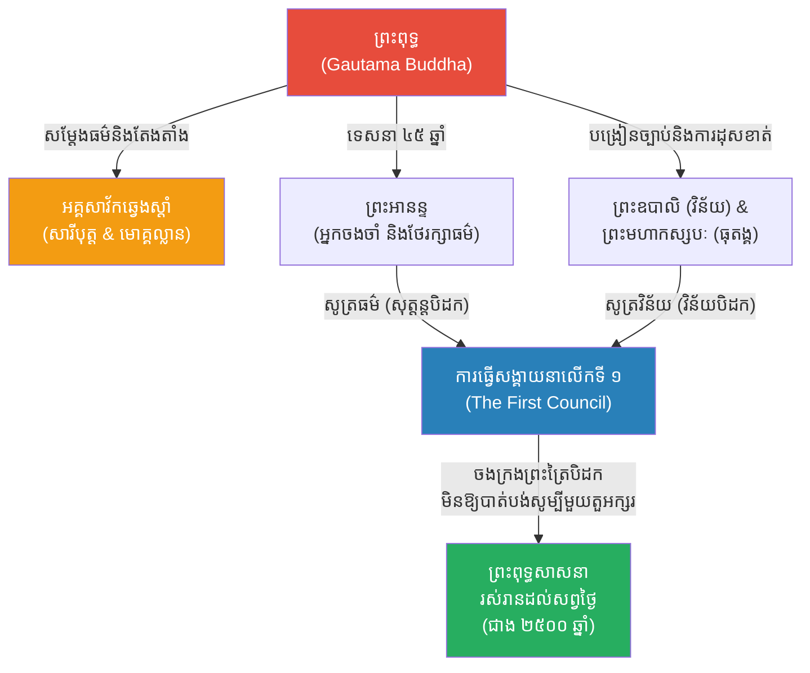

# The 10 Principal Disciples (អគ្គសាវ័កទាំង ១០ របស់ព្រះពុទ្ធ)

**Author:** ichamrong  
**Date:** 2026-05-23  
**Tags:** #buddha #disciples #buddhism #sangha #history  
**Category:** Biographies  
**Read Time:** ~10 min  

---

## 📌 មាតិកា (Table of Contents)
- [១. ការកកើតនៃសង្ឃសហគមន៍ (The Formation of the Sangha)](#1)
- [២. ព្រះសារីបុត្ត និង ព្រះមោគ្គល្លាន (The Chief Disciples)](#2)
- [៣. ព្រះអានន្ទ៖ អ្នកចងចាំគ្មានចន្លោះ (Ananda the Treasurer of the Dhamma)](#3)
- [៤. ព្រះមហាកស្សបៈ និង ព្រះឧបាលិ (The Council Conveners)](#4)
- [៥. កេរដំណែល និងឥទ្ធិពល (The Effect and Impact)](#5)
- [🔗 ឯកសារទាក់ទង (Related Topics)](#related-topics)
- [ឯកសារយោង (References)](#references)

---

## ១. ការកកើតនៃសង្ឃសហគមន៍ (The Formation of the Sangha)

បន្ទាប់ពីព្រះសម្មាសម្ពុទ្ធបានត្រាស់ដឹង ទ្រង់បានចំណាយពេល ៤៥ ឆ្នាំ ដើម្បីដើរប្រោសសត្វនិងបង្រៀនធម៌។ ក្នុងអំឡុងពេលនោះ មានមនុស្សរាប់សែននាក់បានសម្រេចចិត្តបួសដើរតាមទ្រង់ ដែលបង្កើតបានជាសហគមន៍សង្ឃ (The Sangha)។

ក្នុងចំណោមព្រះសង្ឃរាប់ម៉ឺនអង្គ មានសាវ័កឆ្នើមបំផុតចំនួន ១០ អង្គ ដែលព្រះពុទ្ធបានតែងតាំងជា **អគ្គសាវ័ក (The 10 Principal Disciples)** ដោយអង្គនីមួយៗមានជំនាញនិងឯកទេស (ឯតទគ្គៈ) ខុសៗគ្នា។ អ្នកទាំងនេះហើយដែលបានដើរតួយ៉ាងសំខាន់ក្នុងការជួយផ្សព្វផ្សាយ និងអភិរក្សព្រះពុទ្ធសាសនា។

---

## ២. ព្រះសារីបុត្ត និង ព្រះមោគ្គល្លាន (The Chief Disciples)

ព្រះពុទ្ធមានអគ្គសាវ័កឆ្វេងស្តាំ 2 អង្គ ដែលជាដៃស្តាំដ៏សំខាន់បំផុតរបស់ទ្រង់៖

1. **ព្រះសារីបុត្ត (Sariputta):** អគ្គសាវ័កស្តាំ។ ទ្រង់ត្រូវបានតែងតាំងជាអ្នកដែល **"ឆ្នើមបំផុតផ្នែកបញ្ញា (Foremost in Wisdom)"**។ ព្រះសារីបុត្តមានប្រាជ្ញាជ្រៅជ្រះ អាចពន្យល់ធម៌ដ៏ស្មុគស្មាញរបស់ព្រះពុទ្ធបានយ៉ាងច្បាស់លាស់។ លោកប្រៀបបាននឹង "ម្តាយបង្កើត" ដែលបង្កើតឱ្យមានសីលធម៌និងបញ្ញានៅក្នុងសហគមន៍សង្ឃ។
2. **ព្រះមោគ្គល្លាន (Moggallana):** អគ្គសាវ័កឆ្វេង ជាមិត្តសម្លាញ់របស់ព្រះសារីបុត្ត។ ទ្រង់ត្រូវបានតែងតាំងជាអ្នកដែល **"ឆ្នើមបំផុតផ្នែកឫទ្ធិអំណាច (Foremost in Supernatural Powers)"**។ លោកអាចប្រើប្រាស់អំណាចផ្លូវចិត្ត (Telepathy, ហោះហើរ) ដើម្បីជួយសង្គ្រោះអ្នកដទៃ និងប្រោសសត្វនរក។ គួរឱ្យសោកស្តាយ លោកត្រូវបានពួកចោរសម្លាប់នៅចុងបញ្ចប់នៃជីវិត (ជាកម្មផលពីជាតិមុន)។

---

## ៣. ព្រះអានន្ទ៖ អ្នកចងចាំគ្មានចន្លោះ (Ananda the Treasurer of the Dhamma)

3. **ព្រះអានន្ទ (Ananda):** ជាព្រះអនុជជីដូនមួយរបស់ព្រះពុទ្ធ និងជាអ្នកបម្រើផ្ទាល់ (Personal Attendant) របស់ទ្រង់រយៈពេល ២៥ ឆ្នាំ។ ទ្រង់គឺ **"អ្នកមានការចងចាំល្អបំផុត (Foremost in Memory)"**។ 

រាល់ពេលព្រះពុទ្ធសម្តែងធម៌នៅទីណា ព្រះអានន្ទស្តាប់និងចងចាំគ្រប់ពាក្យពេចន៍ទាំងអស់ដោយគ្មានចន្លោះ។ លោកក៏ជាអ្នកដែលទូលសុំព្រះពុទ្ធឱ្យអនុញ្ញាតឱ្យ "ស្ត្រី" មានសិទ្ធិបួសជាភិក្ខុនីដំបូងគេបង្អស់ផងដែរ។ 

---

## ៤. ព្រះមហាកស្សបៈ និង ព្រះឧបាលិ (The Council Conveners)

សាវ័កសំខាន់ៗផ្សេងទៀត ដែលជួយស្រោចស្រង់សាសនាក្រោយពេលព្រះពុទ្ធបរិនិព្វាន៖

4. **ព្រះមហាកស្សបៈ (Mahakassapa):** ឆ្នើមផ្នែកការប្រព្រឹត្តធុតង្គ (Ascetic practices)។ បន្ទាប់ពីព្រះពុទ្ធបរិនិព្វាន លោកគឺជាប្រធានដឹកនាំការធ្វើ **សង្គាយនាលើកទី១ (The First Buddhist Council)** ដោយប្រមូលផ្តុំព្រះអរហន្ត ៥០០ អង្គ ដើម្បីផ្ទៀងផ្ទាត់និងចងក្រងពាក្យបង្រៀនរបស់ព្រះពុទ្ធកុំឱ្យបាត់បង់។
5. **ព្រះឧបាលិ (Upali):** ដើមឡើយលោកគឺជាជាងកាត់សក់ឱ្យខ្សែរាជវង្ស។ ប៉ុន្តែព្រះពុទ្ធបានបំបួសលោកមុនព្រះរាជកុមារដទៃ ដើម្បីបំបាត់អំនួតវណ្ណៈ។ លោកបានក្លាយជាអ្នក **"ឆ្នើមបំផុតផ្នែកវិន័យ (Foremost in Vinaya/Rules)"**។ នៅក្នុងការធ្វើសង្គាយនា ព្រះឧបាលិគឺជាអ្នកសូត្របញ្ជាក់ច្បាប់វិន័យសង្ឃ (វិន័យបិដក) ខណៈដែលព្រះអានន្ទជាអ្នកសូត្របញ្ជាក់ព្រះសូត្រ (សុត្តន្តបិដក)។

ក្រៅពីនេះ នៅមានសាវ័កឆ្នើម៥អង្គទៀត ដូចជា ព្រះអនុរុទ្ធ (ឆ្នើមខាងទិព្វចក្ខុ) ព្រះកច្ចាយនៈ (ឆ្នើមខាងពន្យល់ធម៌សង្ខេបឱ្យពិស្តារ) ព្រះបុណ្ណ (ឆ្នើមខាងទេសនា) ជាដើម ដែលសុទ្ធតែបានរួមចំណែកអភិវឌ្ឍសាសនា។

---

## ៥. កេរដំណែល និងឥទ្ធិពល (The Effect and Impact)

បើគ្មានការលះបង់របស់ **អគ្គសាវ័កទាំង ១០** (ជាពិសេសការចងចាំរបស់ព្រះអានន្ទ និងការរៀបចំសង្គាយនារបស់ព្រះមហាកស្សបៈ) នោះពាក្យបង្រៀនរបស់ព្រះពុទ្ធ នឹងត្រូវភ្លេចភ្លាំង ឬកាឡៃបាត់ទៅហើយ។ អ្នកប្រាជ្ញទាំងនេះ បានរួមគ្នាបង្កើតជា "ព្រះត្រៃបិដក" ដែលជាបណ្ណាល័យប្រាជ្ញាដ៏ធំបំផុតមួយរបស់មនុស្សជាតិ រក្សាទុកបានយ៉ាងគង់វង្សរហូតដល់សព្វថ្ងៃ។

---

## 🔗 ឯកសារទាក់ទង (Related Topics)
* [ជីវប្រវត្តិព្រះពុទ្ធ (Buddha Biography)](../buddha/01-buddha-biography.md)

---

## ឯកសារយោង (References)

*   **The Tipitaka (Pali Canon)** — The traditional collection of Buddhist scriptures which frequently feature dialogues involving the principal disciples.
*   **The Theragatha** — Verses of the Elder Monks, providing autobiographical and inspirational poems by early members of the Sangha.
