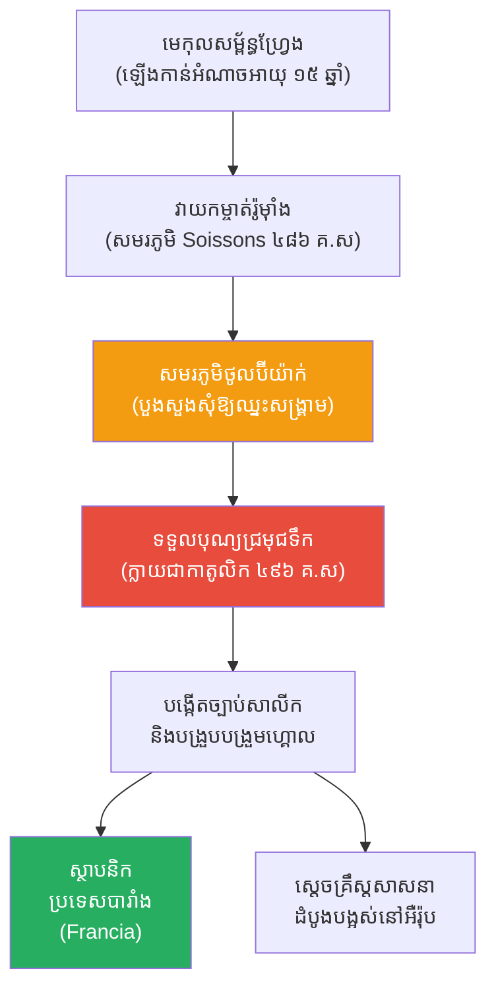

# The Biography of Clovis I (ជីវប្រវត្តិ គ្លូវីស ទី១)

**Author:** ichamrong  
**Date:** 2026-05-26  
**Tags:** #clovis #history #france #religion #christianity #merovingian  
**Category:** Biographies  
**Read Time:** ~15 min  

---

## 📌 មាតិកា (Table of Contents)
- [សេចក្តីផ្តើម៖ កាយវិភាគវិទ្យានៃស្ថាបនិក (The Anatomy of a Founder)](#intro)
- [១. កុមារភាព និងការឡើងកាន់អំណាច (Childhood & Rise to Power)](#1)
- [២. ការបង្រួបបង្រួមកុលសម្ព័ន្ធហ្វ្រែង (Uniting the Franks)](#2)
- [៣. សមរភូមិថូលប៊ីយ៉ាក់ និងការប្តូរសាសនា (Battle of Tolbiac & Conversion)](#3)
- [៤. សម្ព័ន្ធភាពជាមួយសាសនាចក្រ (Alliance with the Church)](#4)
- [៥. ការបង្កើតច្បាប់សាលីក (The Salic Law & Expansion)](#5)
- [៦. ចិត្តសាស្ត្រ និងទស្សនវិជ្ជាពីកំណើតដល់ស្លាប់ (Psychology & Philosophy from Birth to Death)](#6)
- [៧. កំហុសឆ្គងដ៏ធំបំផុតដែលមិនគួរមាន (The Fatal Mistakes)](#7)
- [៨. កេរដំណែល (Legacy)](#8)
- [៩. តើគ្លូវីសបានបំផុសគំនិតអ្វីខ្លះ? (What Did Clovis Inspire?)](#9)
- [សេចក្តីសន្និដ្ឋាន (Conclusion)](#conclusion)
- [🔗 ឯកសារទាក់ទង (Related Topics)](#related-topics)
- [ឯកសារយោង (References)](#references)

---

## សេចក្តីផ្តើម៖ កាយវិភាគវិទ្យានៃស្ថាបនិក (The Anatomy of a Founder)

> **«តើមេកុលសម្ព័ន្ធព្រៃផ្សៃម្នាក់ អាចប្រែក្លាយខ្លួនជាអ្នកបង្កើតប្រទេសដែលជះឥទ្ធិពលបំផុតនៅអឺរ៉ុបដោយរបៀបណា?»**

សាកស្រមៃមើលពីទិដ្ឋភាពនេះ៖ ចក្រភពរ៉ូមដ៏អស្ចារ្យទើបតែដួលរលំ។ អឺរ៉ុបទាំងមូលធ្លាក់ចូលទៅក្នុងភាពវឹកវរ ងងឹតស្លុប និងគ្មានច្បាប់ទម្លាប់ (Dark Ages)។ កុលសម្ព័ន្ធព្រៃផ្សៃរាប់សិប កំពុងកាប់សម្លាប់គ្នាដណ្តើមទឹកដីដែលនៅសេសសល់ពីអតីតចក្រភពរ៉ូម។ នៅក្នុងស្ថានភាពបែបនេះ បុរសវ័យ ១៥ ឆ្នាំម្នាក់បានឡើងកាន់តំណែងជាមេដឹកនាំនៃកុលសម្ព័ន្ធតូចមួយ។

ជំនួសឱ្យការត្រូវគេកម្ទេច យុវជននេះបានប្រើទាំងកម្លាំងយោធាដ៏ឃោរឃៅ និងល្បិចនយោបាយដ៏ឆ្លាតវៃបំផុត (ការផ្លាស់ប្តូរសាសនា) ដើម្បីបង្រួបបង្រួមកុលសម្ព័ន្ធទាំងអស់ បង្កើតជាអាណាចក្រដ៏ធំមួយ។ គាត់មិនត្រឹមតែជាស្តេចទីមួយនៃប្រទេសបារាំងនោះទេ ប៉ុន្តែគាត់គឺជាអ្នកដែលបានផ្លាស់ប្តូរអឺរ៉ុបឱ្យក្លាយជាទ្វីបគ្រឹស្តសាសនារហូតដល់សព្វថ្ងៃ។ នេះគឺជារឿងរ៉ាវរបស់ **គ្លូវីស ទី១ (Clovis I)** ស្ថាបនិកនៃរាជវង្ស Merovingian។

---

## ១. កុមារភាព និងការឡើងកាន់អំណាច (Childhood & Rise to Power)

គ្លូវីស ទី១ កើតនៅប្រហែលឆ្នាំ ៤៦៦ នៃគ.ស ជាបុត្រារបស់ព្រះបាទ **ស៊ីលដឺរិក ទី១ (Childeric I)** ដែលជាមេដឹកនាំនៃកុលសម្ព័ន្ធ Salian Franks (ក្រុមមនុស្សហ្វ្រែង)។ នៅពេលនោះ ក្រុមហ្វ្រែងមិនមែនជាប្រទេសទេ តែជាក្រុមជនព្រៃផ្សៃ (Barbarians) ដែលរស់នៅតាមព្រំដែននៃចក្រភពរ៉ូម។

នៅអាយុត្រឹមតែ ១៥ ឆ្នាំ (ឆ្នាំ ៤៨១ គ.ស) គ្លូវីសបានឡើងកាន់តំណែងបន្តពីឪពុក។ ក្នុងនាមជាយុវជន គាត់ត្រូវប្រឈមមុខនឹងសត្រូវជុំទិស ទាំងសំណល់កងទ័ពរ៉ូម៉ាំងនៅហ្គោល (Gaul - ប្រទេសបារាំងបច្ចុប្បន្ន) និងកុលសម្ព័ន្ធព្រៃផ្សៃដទៃទៀតដូចជា Visigoths និង Alemanni។

> 💡 **មេរៀនពីការឡើងកាន់អំណាច (The Lesson of Power):** គ្លូវីសបានរៀនតាំងពីក្មេងថា នៅក្នុងពិភពលោកដែលគ្មានច្បាប់ទម្លាប់ អំណាចគឺបានមកពីចុងដាវ ប៉ុន្តែអំណាចដែលស្ថិតស្ថេរ គឺបានមកពីការចេះប្រើប្រាស់ជំនឿរបស់ប្រជាជន។

---

## ២. ការបង្រួបបង្រួមកុលសម្ព័ន្ធហ្វ្រែង (Uniting the Franks)

គ្លូវីសមិនចង់ធ្វើត្រឹមតែជាមេកុលសម្ព័ន្ធតូចមួយនោះទេ។ នៅឆ្នាំ ៤៨៦ គ.ស គាត់បានវាយប្រហារនិងកម្ចាត់ Syagrius ដែលជាមេទ័ពរ៉ូម៉ាំងចុងក្រោយបង្អស់នៅតំបន់ហ្គោល នៅក្នុងសមរភូមិសូសុង (Battle of Soissons)។ ជ័យជម្នះនេះ បានធ្វើឱ្យគាត់គ្រប់គ្រងទឹកដីភាគខាងជើងប្រទេសបារាំងទាំងមូល។

បន្ទាប់មក គាត់បានប្រើវិធីសាស្ត្រ "កម្ចាត់ម្តងមួយៗ" ទៅលើមេកុលសម្ព័ន្ធហ្វ្រែងដទៃទៀត ជួនកាលដោយការធ្វើសង្គ្រាម ជួនកាលដោយការលួចធ្វើឃាត រហូតទាល់តែគាត់អាចបង្រួបបង្រួមជនជាតិហ្វ្រែងទាំងអស់ឱ្យស្ថិតក្រោមការដឹកនាំរបស់គាត់តែម្នាក់ឯង។ នេះជាលើកដំបូងដែលពាក្យថា **ប្រទេសរបស់ជនជាតិហ្វ្រែង (Francia ឬ France)** ចាប់ផ្តើមលេចជារូបរាង។

---

## ៣. សមរភូមិថូលប៊ីយ៉ាក់ និងការប្តូរសាសនា (Battle of Tolbiac & Conversion)

ដើមឡើយ គ្លូវីសគឺជាអ្នកកាន់សាសនាព្រៃផ្សៃ (Paganism) ដែលជឿលើព្រះច្រើនអង្គ (ដូចជាព្រះនៃសង្គ្រាម ព្រះនៃធម្មជាតិ)។ ប៉ុន្តែគាត់បានរៀបការជាមួយព្រះនាង **ក្លូទីល (Clotilde)** ដែលជាអ្នកកាន់សាសនាគ្រឹស្តកាតូលិក (Catholic Christian) យ៉ាងខ្ជាប់ខ្ជួន។ នាងតែងតែព្យាយាមបញ្ចុះបញ្ចូលគាត់ឱ្យប្តូរសាសនា តែគាត់តែងតែបដិសេធ ដោយសារគាត់គិតថាព្រះរបស់គាត់ខ្លាំងជាងព្រះរបស់គ្រឹស្ត។

រហូតដល់ឆ្នាំ ៤៩៦ នៃគ.ស នៅក្នុង **សមរភូមិថូលប៊ីយ៉ាក់ (Battle of Tolbiac)** ពេលប្រយុទ្ធជាមួយកុលសម្ព័ន្ធ Alemanni កងទ័ពរបស់គ្លូវីស កំពុងតែចាញ់សត្រូវយ៉ាងធ្ងន់ធ្ងរ។ ក្នុងពេលដែលជិតស្លាប់និងអស់សង្ឃឹម គាត់បានសម្លឹងមើលទៅមេឃ ហើយបួងសួងទៅកាន់ "ព្រះរបស់ Clotilde" ដោយសន្យាថា៖ *"ឱព្រះយេស៊ូវគ្រីស្ទ! ប្រសិនបើទ្រង់ជួយឱ្យទូលបង្គំឈ្នះសង្គ្រាមនេះ ទូលបង្គំនឹងទទួលបុណ្យជ្រមុជទឹកភ្លាម។"*

ភ្លាមៗនោះ មេដឹកនាំរបស់សត្រូវត្រូវបានគេសម្លាប់ ហើយកងទ័ព Alemanni បានចុះចាញ់។ ដូចដែលបានសន្យា គ្លូវីស និងទាហានរាប់ពាន់នាក់របស់គាត់ បានទទួលបុណ្យជ្រមុជទឹក (Baptized) នៅថ្ងៃបុណ្យណូអែល ក្លាយជាគ្រឹស្តសាសនិក។

---

## ៤. សម្ព័ន្ធភាពជាមួយសាសនាចក្រ (Alliance with the Church)

ការប្តូរសាសនារបស់គ្លូវីស មិនត្រឹមតែជារឿងជំនឿប៉ុណ្ណោះទេ តែវាជាយុទ្ធសាស្ត្រនយោបាយ (Masterstroke) ដ៏ឈ្លាសវៃបំផុតក្នុងប្រវត្តិសាស្ត្រអឺរ៉ុប។

នៅពេលនោះ កុលសម្ព័ន្ធផ្សេងៗភាគច្រើន កាន់សាសនាគ្រឹស្តនិកាយ Arianism ដែលសាសនាចក្រនៅរ៉ូមចាត់ទុកថាជាពួកខុសឆ្គង (Heretics)។ ពេលគ្លូវីសប្តូរមកកាន់ "កាតូលិក" គាត់ទទួលបានការគាំទ្រយ៉ាងពេញទំហឹងពី **សម្តេចប៉ាប (Pope)** នៅទីក្រុងរ៉ូម។ 

សម្តេចប៉ាប បានប្រកាសប្រាប់ប្រជាជនកាតូលិកទាំងអស់នៅតំបន់ហ្គោល ឱ្យគាំទ្រគ្លូវីសជាមេដឹកនាំរបស់ពួកគេ។ សម្ព័ន្ធភាពរវាង "ស្តេចបារាំង" និង "សាសនាចក្រកាតូលិក" នេះ បានធ្វើឱ្យរាជាណាចក្ររបស់គាត់មានស្ថិរភាព មានលុយ និងមានទាហានកាន់តែច្រើន។ ប្រទេសបារាំងត្រូវបានសាសនាចក្រផ្តល់កិត្តិយសដាក់រហស្សនាមឱ្យថា **"La fille aînée de l'Église" (កូនស្រីច្បងនៃសាសនាចក្រ)**។

---

## ៥. ការបង្កើតច្បាប់សាលីក (The Salic Law & Expansion)

បន្ទាប់ពីមានការគាំទ្រពីសាសនាចក្រ គ្លូវីសបានវាយកម្ចាត់កុលសម្ព័ន្ធ Visigoths នៅភាគខាងត្បូង ហើយបានបង្កើតទីក្រុង **ប៉ារីស (Paris)** ជាទីក្រុងកណ្តាលរបស់ព្រះអង្គ។

ក្រៅពីសង្គ្រាម គ្លូវីសក៏ជាអ្នកបង្កើតច្បាប់ផងដែរ។ គាត់បានចងក្រង **ច្បាប់សាលីក (Salic Law)** ដែលជាក្រមច្បាប់ដំបូងបង្អស់សម្រាប់ប្រជាជនហ្វ្រែង។ ច្បាប់នេះលាយបញ្ចូលគ្នារវាងទំនៀមទម្លាប់កុលសម្ព័ន្ធចាស់ និងច្បាប់គ្រឹស្តសាសនា។ លក្ខណៈពិសេសរបស់ច្បាប់នេះគឺ វាហាមឃាត់មិនឱ្យស្ត្រីមានសិទ្ធិស្នងរាជ្យ ឬគ្រងដីធ្លីឡើយ ដែលច្បាប់នេះត្រូវបានគេយកមកប្រើប្រាស់នៅអឺរ៉ុបរាប់រយឆ្នាំក្រោយមក។

---

## ៦. ចិត្តសាស្ត្រ និងទស្សនវិជ្ជាពីកំណើតដល់ស្លាប់ (Psychology & Philosophy from Birth to Death)

ដើម្បីយល់ពីភាពជោគជ័យរបស់គ្លូវីស យើងត្រូវស្វែងយល់ពីចិត្តសាស្ត្រនៃការដឹកនាំរបស់គាត់៖

*   **ភាពប្រាកដប្រជាខាងនយោបាយ (Political Pragmatism):** គាត់មិនខ្វល់ពីអ្វីដែលត្រូវ ឬខុសតាមបែបសីលធម៌នោះទេ គាត់ខ្វល់តែពីអ្វីដែល "មានប្រសិទ្ធភាព"។ ការប្តូរសាសនារបស់គាត់ គឺជាការថ្លឹងថ្លែងច្បាស់លាស់ដើម្បីទទួលបានអំណាចនយោបាយពីសាសនាចក្រ។
*   **ភាពឃោរឃៅជាអាវុធ (Calculated Ruthlessness):** ដើម្បីការពារអំណាច គាត់សុខចិត្តសម្លាប់សាច់ញាតិរបស់ខ្លួនឯង (មេកុលសម្ព័ន្ធផ្សេងទៀត) ដោយគ្មានក្តីអាណិត។ គាត់បានប្រើការភ័យខ្លាច ដើម្បីគ្រប់គ្រងកូនចៅ។
*   **សមត្ថភាពក្នុងការសំយោគ (Cultural Synthesis):** ជំនួសឱ្យការកម្ទេចវប្បធម៌រ៉ូម៉ាំង គាត់បានរួមបញ្ចូលវប្បធម៌កុលសម្ព័ន្ធហ្វ្រែង រដ្ឋបាលបែបបុរាណរ៉ូម៉ាំង និងសាសនាគ្រឹស្តកាតូលិក ចូលគ្នាបង្កើតជាវប្បធម៌ថ្មីមួយ។
*   **យល់ពីអំណាចនៃអត្តសញ្ញាណ (Power of Identity):** ដោយដាក់ឈ្មោះប្រទេសថា "Francia" និងរៀបចំប្រព័ន្ធច្បាប់តែមួយ គាត់បានផ្តល់ឱ្យប្រជាជនបែកបាក់គ្នានូវ "អត្តសញ្ញាណរួម" មួយដែលអាចរួបរួមគ្នាបាន។

---

## ៧. កំហុសឆ្គងដ៏ធំបំផុតដែលមិនគួរមាន (The Fatal Mistakes)

ទោះបីជាគ្លូវីសពូកែក្នុងការបង្រួបបង្រួម ប៉ុន្តែគាត់បានបន្សល់ទុកនូវកំហុសដ៏ប្រល័យមួយ៖

1.  **ប្រពៃណីនៃការបែងចែកមរតក (The Merovingian Succession Tradition):** តាមទំនៀមទម្លាប់របស់ជនជាតិហ្វ្រែង នៅពេលស្តេចសុគត អាណាចក្រមិនត្រូវបានប្រគល់ឱ្យកូនប្រុសច្បងតែមួយទេ ប៉ុន្តែត្រូវ **ចែកស្មើៗគ្នា** ទៅឱ្យកូនប្រុសទាំងអស់។ នៅពេលគ្លូវីសសុគត អាណាចក្របារាំងដ៏ធំ ត្រូវបានពុះជាបួនចំណែក ចែកឱ្យកូនប្រុសទាំងបួនរបស់គាត់។ នេះបានបញ្ឆេះសង្គ្រាមស៊ីវិលរវាងបងប្អូនឯង អស់រយៈពេលជាច្រើនសតវត្សរ៍ និងធ្វើឱ្យរាជវង្សចុះខ្សោយ។
2.  **ការសម្លាប់រង្គាលគ្រួសារ (Kinslaying):** ការដែលគាត់ទម្លាប់សម្លាប់សាច់ញាតិដើម្បីដណ្តើមអំណាច បានក្លាយជាគំរូអាក្រក់មួយ (Bad Precedent) សម្រាប់កូនចៅរបស់គាត់ ដែលតែងតែលួចសម្លាប់គ្នាឯងជាប្រចាំក្នុងរាជវាំង។

---

## ៨. កេរដំណែល (Legacy)

គ្លូវីសបានសុគតនៅឆ្នាំ ៥១១ នៃគ.ស នៅក្នុងទីក្រុងប៉ារីស។ 

គាត់គឺជាមនុស្សម្នាក់ដែលបានបិទបញ្ចប់ "យុគសម័យរ៉ូម៉ាំង" នៅតំបន់ហ្គោល និងបើកទំព័រថ្មីនៃ "យុគសម័យកណ្តាល (Middle Ages)" សម្រាប់អឺរ៉ុប។ រាជវង្ស Merovingian របស់គាត់បានបន្តគ្រប់គ្រងប្រទេសបារាំងជិត ៣០០ ឆ្នាំ។

---

## ៩. តើគ្លូវីសបានបំផុសគំនិតអ្វីខ្លះ? (What Did Clovis Inspire?)

នេះគឺជាបញ្ជីរាយនាមរឿងរ៉ាវ និងគោលគំនិតចំនួន ២០ ដែលគ្លូវីសបានបំផុសគំនិត និងបន្សល់ទុកជាមរតកសម្រាប់មនុស្សជាតិ៖

1.  **ឈ្មោះប្រទេសបារាំង (The Name 'France'):** ពាក្យ France កើតចេញពីឈ្មោះកុលសម្ព័ន្ធ Franks ដែលគ្លូវីសបានបង្រួបបង្រួម។
2.  **ទីក្រុងប៉ារីសជារាជធានី (Paris as Capital):** គាត់គឺជាអ្នកដំបូងដែលបានប្រកាសប៉ារីសជារាជធានីនៃអាណាចក្ររបស់គាត់ ដែលនៅគង់វង្សដល់សព្វថ្ងៃ។
3.  **ការរីកចម្រើននៃកាតូលិក (Catholic Dominance):** ការប្តូរសាសនារបស់គាត់ បានជួយឱ្យកាតូលិកក្លាយជាសាសនាដ៏មានឥទ្ធិពលបំផុតនៅអឺរ៉ុប។
4.  **សម្ព័ន្ធភាពរដ្ឋនិងសាសនាចក្រ (Church-State Alliance):** បង្កើតទម្រង់នយោបាយថ្មីមួយ ដែលស្តេចត្រូវការការគាំទ្រពីសម្តេចប៉ាប ដើម្បីភាពស្របច្បាប់ (Divine Right of Kings)។
5.  **ឈ្មោះស្តេចបារាំង "Louis":** ឈ្មោះ Clovis ក្រោយមកវិវត្តទៅជាឈ្មោះ "Louis" (ល្វីស) ដែលជាឈ្មោះស្តេចបារាំងច្រើនជាងគេបំផុតក្នុងប្រវត្តិសាស្ត្រ (រហូតដល់ Louis XVI)។
6.  **ច្បាប់សាលីក (Salic Law):** ក្រមច្បាប់ដែលហាមស្ត្រីមិនឱ្យឡើងគ្រងរាជ្យ ដែលក្រោយមកក្លាយជាមូលហេតុនៃ "សង្គ្រាម ១០០ ឆ្នាំ" រវាងបារាំងនិងអង់គ្លេស។
7.  **របបសក្តិភូមិ (Foundation of Feudalism):** របៀបដែលគាត់ផ្តល់ដីធ្លីដល់មេទ័ពជាការដោះដូរនឹងភាពស្មោះត្រង់ បានក្លាយជាគ្រឹះនៃរបបសក្តិភូមិនៅអឺរ៉ុប។
8.  **រាជវង្ស Merovingian:** រាជវង្សទីមួយនៃប្រវត្តិសាស្ត្របារាំង ដែលគ្រប់គ្រងរហូតដល់ត្រូវបានជំនួសដោយរាជវង្ស Carolingian របស់ Charlemagne។
9.  **កូនស្រីច្បងនៃសាសនាចក្រ (Eldest Daughter of the Church):** ចំណងជើងកិត្តិយសរបស់ប្រទេសបារាំង ដែលផ្តល់ដោយវ៉ាទីកង់។
10. **ព្រះវិហារ Saint-Denis:** ការកសាងព្រះវិហារដែលក្រោយមកក្លាយជាទីកន្លែងបញ្ចុះសពស្តេចបារាំងស្ទើរតែទាំងអស់។
11. **ការធ្វើសមាហរណកម្មអក្សរសាស្ត្រ (Latin and Frankish mix):** ការរួមបញ្ចូលគ្នារវាងភាសាឡាតាំង និងភាសាកុលសម្ព័ន្ធ ដែលក្រោយមកវិវត្តទៅជាភាសាបារាំងបុរាណ។
12. **ស្តេចជាអ្នកការពារសាសនា (Defender of the Faith):** តួនាទីរបស់ស្តេចដែលត្រូវចេញមុខការពារព្រះវិហារពីពួកខុសឆ្គង។
13. **វីរភាពនិងរឿងព្រេង (Myths and Legends):** រឿងព្រេងនៃការលេចឡើងនៃ "សត្វព្រាបនាំយកប្រេងពិសិដ្ឋ" មកចាក់លើក្បាលគ្លូវីសក្នុងពិធីជ្រមុជទឹក។
14. **និមិត្តសញ្ញាផ្កាលីលី (Fleur-de-lis):** រឿងព្រេងប្រាប់ថា គ្លូវីសបានប្តូរនិមិត្តសញ្ញាពីសត្វកង្កែប ទៅជាផ្កាលីលី (Fleur-de-lis) ក្រោយពេលប្តូរសាសនា ដែលក្លាយជានិមិត្តសញ្ញារបស់រាជានិយមបារាំងជារៀងរហូត។
15. **អត្តសញ្ញាណជាតិបារាំង (French National Identity):** គ្លូវីសត្រូវបានចាត់ទុកជា "បិតាស្ថាបនិក" នៃប្រទេសបារាំង ដូចជា George Washington របស់អាមេរិកដែរ។
16. **ការបញ្ចប់ចក្រភពរ៉ូមខាងលិច (End of Western Rome):** ជ័យជម្នះរបស់គាត់នៅ Soissons គឺជាការបិទបញ្ចប់វត្តមានចុងក្រោយរបស់រ៉ូមនៅអឺរ៉ុបខាងលិច។
17. **រចនាសម្ព័ន្ធសង្គមថ្មី (New Social Structure):** ការបញ្ចូលគ្នារវាងទាហានហ្វ្រែង និងពួកអភិជនរ៉ូម៉ាំង (Gallo-Roman aristocracy)។
18. **សន្តិភាពតាមរយៈសាសនា (Peace through Religion):** ការប្រើសាសនាដើម្បីបង្រួបបង្រួមជាតិសាសន៍ចម្រុះក្នុងអាណាចក្រតែមួយ។
19. **ការសរសេរប្រវត្តិសាស្ត្រ (Historical Documentation):** ជីវិតរបស់គាត់បានបំផុសគំនិតឱ្យ Gregory of Tours សរសេរសៀវភៅ "History of the Franks" ដែលជាឯកសារប្រវត្តិសាស្ត្រដ៏មានតម្លៃបំផុតប្រចាំយុគសម័យងងឹត។
20. **ឆន្ទៈកសាងចក្រភព (Imperial Ambition):** បំផុសគំនិតអធិរាជជំនាន់ក្រោយ ដូចជា Charlemagne និង Napoleon ឱ្យមានមហិច្ឆតាកសាងចក្រភពអឺរ៉ុបរួមមួយ។

---

## សេចក្តីសន្និដ្ឋាន (Conclusion)

> **«អំណាចមិនមែនបានមកពីការកម្ទេចអ្វីៗទាំងអស់នោះទេ ប៉ុន្តែវាបានមកពីការចេះយកអ្វីដែលនៅសេសសល់ មកសាងសង់ជាគ្រឹះថ្មីមួយ។»**

គ្លូវីស ទី១ មិនមែនជាអ្នកប្រាជ្ញដែលមានសីលធម៌ខ្ពស់នោះទេ គាត់គឺជាមេដឹកនាំដ៏ព្រៃផ្សៃ និងឃោរឃៅដែលរស់នៅក្នុងយុគសម័យដ៏ឃោរឃៅបំផុត។ ប៉ុន្តែអ្វីដែលធ្វើឱ្យគាត់អស្ចារ្យ គឺសមត្ថភាពក្នុងការអានស្ថានការណ៍នយោបាយ និងការហ៊ានធ្វើការសម្រេចចិត្តប្តូរសាសនា ដែលបានផ្លាស់ប្តូរដំណើរប្រវត្តិសាស្ត្រទាំងស្រុង។ គាត់បានយករនាំងកុលសម្ព័ន្ធចេញ ហើយសាងសង់ប្រទេសមួយដែលអាចឈរជើងបានរាប់ពាន់ឆ្នាំ។ ប្រសិនបើគ្មានការជ្រមុជទឹករបស់គ្លូវីសនៅឆ្នាំ ៤៩៦ ទេនោះ ប្រទេសបារាំង និងអឺរ៉ុបដែលយើងស្គាល់សព្វថ្ងៃនេះ ក៏ប្រហែលជាមិនមានរូបរាងឡើយ។

---

## 🔗 ឯកសារទាក់ទង (Related Topics)
* [ជីវប្រវត្តិណាប៉ូឡេអុង (Napoleon Biography)](../napoleon/01-napoleon-biography.md)
* [ប្រវត្តិរបបសក្តិភូមិ (History of Feudalism)](../napoleon/02-feudalism-history.md)

## ឯកសារយោង (References)
*   **The History of the Franks by Gregory of Tours** — The primary historical text documenting the reign and conversion of Clovis I.
*   **A History of France by John Julius Norwich** — A sweeping overview of French history, starting from the foundational days of the Frankish kingdom.

---

*Last updated: 2026-05-26*
