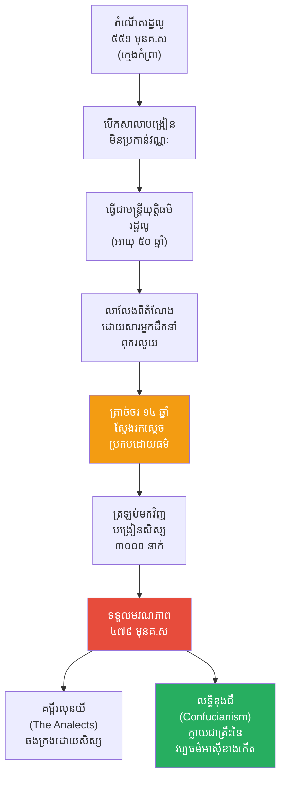

# The Biography of Confucius (ជីវប្រវត្តិខុងជឺ)

**Author:** ichamrong  
**Date:** 2026-05-26  
**Tags:** #confucius #kong-tzu #biography #philosophy #confucianism #education  
**Category:** Biographies  
**Read Time:** ~15 min  

---

## 📌 មាតិកា (Table of Contents)
- [សេចក្តីផ្តើម៖ កាយវិភាគវិទ្យានៃគ្រូបង្រៀន (The Anatomy of a Teacher)](#intro)
- [១. កំណើត និងកុមារភាពដ៏លំបាក (Birth and Early Life)](#1)
- [២. ការសិក្សា និងអាជីពដំបូង (Education and Early Career)](#2)
- [៣. ទស្សនវិជ្ជាស្នូល និងការបង្រៀន (Core Philosophy and Teachings)](#3)
- [៤. ឆ្នាំនៃការត្រាច់ចរ (The Wandering Years)](#4)
- [៥. ជីវិតចុងក្រោយ និងមរណភាព (Later Years and Death)](#5)
- [៦. ចិត្តសាស្ត្រ និងទស្សនវិជ្ជាពីកំណើតដល់ស្លាប់ (Psychology & Philosophy from Birth to Death)](#6)
- [៧. បញ្ហាប្រឈម និងភាពបរាជ័យនយោបាយ (Challenges and Political Failures)](#7)
- [៨. កេរដំណែល (Legacy)](#8)
- [៩. តើខុងជឺបានបំផុសគំនិតអ្វីខ្លះ? (What Did Confucius Inspire?)](#9)
- [សេចក្តីសន្និដ្ឋាន (Conclusion)](#conclusion)
- [🔗 ឯកសារទាក់ទង (Related Topics)](#related-topics)
- [ឯកសារយោង (References)](#references)

---

## សេចក្តីផ្តើម៖ កាយវិភាគវិទ្យានៃគ្រូបង្រៀន (The Anatomy of a Teacher)

> **«នៅក្នុងនគរដែលមានសណ្តាប់ធ្នាប់ ភាពក្រីក្រជារឿងគួរឱ្យខ្មាសអៀន។ នៅក្នុងនគរដែលគ្មានសណ្តាប់ធ្នាប់ ភាពមានបានទើបជារឿងគួរឱ្យខ្មាសអៀន។»**

សាកស្រមៃមើលពីទិដ្ឋភាពនេះ៖ ប្រទេសចិនកំពុងហែកហួរដោយសង្គ្រាមរវាងរដ្ឋនិងរដ្ឋ (សម័យនិទាឃរដូវនិងសរទរដូវ)។ មេដឹកនាំនយោបាយប្រើប្រាស់ល្បិចកល ការក្បត់ និងអំពើហិង្សាដើម្បីដណ្តើមអំណាច។ នៅក្នុងសង្គមដែលញៀននឹងសង្គ្រាមនេះ មានបុរសម្នាក់ដើរប្រឆាំងនឹងខ្សែទឹក។ គាត់មិនមានកងទ័ព គ្មានដាវ គ្មានលុយ ប៉ុន្តែគាត់ព្យាយាមបញ្ចុះបញ្ចូលស្តេចនានាឱ្យបោះបង់អាវុធ ហើយងាកមកគ្រប់គ្រងប្រទេសដោយ "សីលធម៌ និងគុណធម៌"។

ស្តេចទាំងអស់សើចចំអកឱ្យគាត់។ គាត់ត្រូវបានគេដេញចេញពីរដ្ឋមួយទៅរដ្ឋមួយ ជួបប្រទះការគំរាមកំហែង និងការអត់ឃ្លាន។ ពេលដែលគាត់ស្លាប់ គាត់គិតថាខ្លួនឯងគឺជាមនុស្សដែលបរាជ័យបំផុតក្នុងលោក។ ប៉ុន្តែអ្វីដែលគាត់មិនបានដឹងនោះគឺ ពាក្យសម្តីដែលគាត់បានបង្រៀនសិស្ស នឹងក្លាយជាប្រព័ន្ធប្រតិបត្តិការ (Operating System) ដែលដំណើរការសង្គមចិន កូរ៉េ ជប៉ុន និងវៀតណាម ជាង ២៥០០ ឆ្នាំទៅមុខទៀត។ នេះគឺជារឿងរ៉ាវរបស់ **គង់ ឈីវ (Kong Qiu)** ឬដែលពិភពលោកស្គាល់ថា **ខុងជឺ (Confucius)**។

---

## ១. កំណើត និងកុមារភាពដ៏លំបាក (Birth and Early Life)

ខុងជឺ កើតនៅឆ្នាំ ៥៥១ មុនគ្រឹស្តសករាជ នៅក្នុងរដ្ឋលូ (Lu State - បច្ចុប្បន្នជាខេត្តសានទុង ប្រទេសចិន)។ លោកកើតនៅក្នុងគ្រួសារអភិជនថ្នាក់ទាបដែលធ្លាក់ខ្លួនក្រ។ ឪពុករបស់លោកជាមេទ័ពវ័យចំណាស់ម្នាក់ ដែលបានស្លាប់នៅពេលខុងជឺមានអាយុត្រឹមតែ ៣ ឆ្នាំ។ 

ខុងជឺត្រូវបានចិញ្ចឹមបីបាច់ដោយម្តាយជាស្ត្រីមេម៉ាយ ក្នុងភាពក្រីក្រលំបាកតោកយ៉ាកបំផុត។ ដោយសារភាពក្រីក្រ គាត់ត្រូវធ្វើការងារថោកទាបជាច្រើនដូចជា អ្នកកត់ត្រាជញ្ជីង អ្នកមើលថែឃ្លាំងស្រូវ និងអ្នកគង្វាលសត្វ ដើម្បីចិញ្ចឹមម្តាយ។

> 💡 **មេរៀនពីកុមារភាពដែលដក់ជាប់ដល់ស្លាប់ (The Lifelong Lesson):** ភាពក្រីក្រមិនបានសម្លាប់ការចង់ចេះចង់ដឹងរបស់លោកទេ។ វាបែរជាបង្រៀនលោកឱ្យយល់ពីតម្លៃនៃការខិតខំប្រឹងប្រែងដោយខ្លួនឯង។ លោកធ្លាប់ពោលថា៖ *"នៅអាយុ ១៥ ឆ្នាំ ខ្ញុំបានដាក់ចិត្តយ៉ាងមុតមាំលើការសិក្សា។"* លោកជឿថាការអប់រំគឺជាមធ្យោបាយតែមួយគត់ក្នុងការកែប្រែវាសនាមនុស្សសាមញ្ញ។

---

## ២. ការសិក្សា និងអាជីពដំបូង (Education and Early Career)

នៅក្នុងអាយុ ២០ ឆ្នាំ ខុងជឺបានរៀបការ និងចាប់ផ្តើមធ្វើជាគ្រូបង្រៀន។ លោកបានបើកសាលារៀនឯកជនដំបូងគេបង្អស់នៅក្នុងប្រវត្តិសាស្ត្រចិន ដោយបង្រៀនសិស្សដោយមិនប្រកាន់វណ្ណៈ ឱ្យតែពួកគេមានចិត្តចង់រៀនសូត្រ។ លោកមានពាក្យស្លោកមួយថា "យកសាច់ក្រកស្ងួតមួយដុំមក ក៏អាចរៀនបានដែរ"។

ក្រោយមក ដោយសារតែភាពវៃឆ្លាតនិងគុណធម៌ ខុងជឺត្រូវបានរដ្ឋលូ តែងតាំងជាមន្ត្រីជាន់ខ្ពស់ ទទួលបន្ទុកផ្នែកយុត្តិធម៌និងសណ្តាប់ធ្នាប់សង្គម។ ក្រោមការដឹកនាំរបស់លោក រដ្ឋលូមានសន្តិភាព ទុច្ចរិតជនលែងហ៊ានធ្វើសកម្មភាព រហូតដល់រដ្ឋជិតខាង (រដ្ឋឈី) មានការភ័យខ្លាចចំពោះភាពរីកចម្រើននេះ។ រដ្ឋឈីបានប្រើល្បិចបញ្ជូនស្រីស្អាត ៨០ នាក់ និងសេះល្អៗ ១២០ ក្បាល មកអំណោយដល់អ្នកដឹកនាំរដ្ឋលូ ដើម្បីបំបែរអារម្មណ៍។ អ្នកដឹកនាំរដ្ឋលូ វក់នឹងស្រីញី លែងខ្វល់ពីរាជការ ធ្វើឱ្យខុងជឺខកចិត្តយ៉ាងខ្លាំង ក៏សម្រេចចិត្តលាលែងពីតំណែង។

---

## ៣. ទស្សនវិជ្ជាស្នូល និងការបង្រៀន (Core Philosophy and Teachings)

ការបង្រៀនរបស់ខុងជឺ ផ្តោតសំខាន់ទៅលើ **សីលធម៌បុគ្គល និងសីលធម៌អ្នកដឹកនាំ (Ethics and Politics)** ដោយឈរលើគោលការណ៍សំខាន់ៗ ៥ យ៉ាង (បញ្ចធម៌):

1.  **Ren (仁 - មនុស្សធម៌ / Benevolence):** ការមានក្តីមេត្តា ស្រលាញ់ និងចេះយោគយល់គ្នា។ គោលការណ៍មាសរបស់លោកគឺ *"អ្វីដែលអ្នកមិនចង់ឱ្យគេធ្វើមកលើអ្នក កុំធ្វើវាទៅលើគេ (Do not do unto others what you do not want done to yourself)."*
2.  **Li (禮 - សីលធម៌សង្គម និងពិធីការ / Proper Conduct):** ការគោរពច្បាប់ទម្លាប់ ការចេះគួរសម និងការដឹងពីតួនាទីរបស់ខ្លួនក្នុងសង្គម។
3.  **Xiao (孝 - កតញ្ញូតាធម៌ / Filial Piety):** ការគោរពដឹងគុណមាតាបិតា និងចាស់ទុំ។ នេះជាសសរស្តម្ភសំខាន់បំផុតនៃសង្គមចិន។
4.  **Yi (義 - សេចក្តីសុចរិត / Righteousness):** ការធ្វើអំពើល្អដោយមិនសង្ឃឹមផលតបស្នង និងការប្រកាន់ខ្ជាប់នូវភាពត្រឹមត្រូវ។
5.  **Zhi (智 - ប្រាជ្ញា / Wisdom):** ការចេះវែកញែកខុសនិងត្រូវ តាមរយៈការរៀនសូត្រមិនចេះចប់។

លោកបង្រៀនថា ប្រសិនបើអ្នកដឹកនាំជាមនុស្សមានសីលធម៌ (Junzi - អ្នកប្រាជ្ញ/សុភាពបុរស) នោះប្រជារាស្ត្រនឹងធ្វើតាមដោយស្វ័យប្រវត្តិ ប្រៀបដូចជាខ្យល់បក់កាត់ស្មៅ អញ្ចឹងស្មៅច្បាស់ជានោរទោរតាមខ្យល់ (Rule by Virtue, not by Force)។

---

## ៤. ឆ្នាំនៃការត្រាច់ចរ (The Wandering Years)

បន្ទាប់ពីលាលែងពីតំណែងនៅរដ្ឋលូ (អាយុប្រហែល ៥០ ឆ្នាំ) ខុងជឺ រួមជាមួយសិស្សស្មោះត្រង់មួយចំនួន បានចំណាយពេល **១៤ ឆ្នាំ ធ្វើដំណើរត្រាច់ចរ (Exile)** ពីទីក្រុងមួយទៅទីក្រុងមួយទៀត ពីរដ្ឋមួយទៅរដ្ឋមួយទៀត។

គោលបំណងរបស់លោក គឺស្វែងរកព្រះមហាក្សត្រ ឬអ្នកដឹកនាំរដ្ឋណាមួយ ដែលព្រមទទួលយកទស្សនវិជ្ជាដឹកនាំរបស់លោកយកទៅអនុវត្ត។ ប៉ុន្តែក្នុងយុគសម័យសង្គ្រាមនោះ អ្នកដឹកនាំនយោបាយភាគច្រើនចង់បានតែអំណាច អំពើហិង្សា និងការប្រើប្រាស់ល្បិចកល (ដូចស៊ុនអ៊ូ ជាដើម) ដូច្នេះពួកគេមិនចាប់អារម្មណ៍នឹងការដឹកនាំដោយ "គុណធម៌" របស់ខុងជឺឡើយ។ លោកនិងសិស្សតែងតែជួបប្រទះនឹងការអត់ឃ្លាន ការគំរាមកំហែងដល់អាយុជីវិត និងការសើចចំអកពីអ្នកនយោបាយ។

---

## ៥. ជីវិតចុងក្រោយ និងមរណភាព (Later Years and Death)

ទីបំផុត នៅក្នុងវ័យ ៦៨ ឆ្នាំ ខុងជឺបានត្រឡប់មករដ្ឋលូវិញដោយភាពខកចិត្តចំពោះនយោបាយ ប៉ុន្តែមិនបានចុះចាញ់នឹងការបង្រៀនឡើយ។

លោកបានចំណាយពេលចុងក្រោយនៃជីវិត ដើម្បីបង្រៀនសិស្ស (ដែលគេកត់ត្រាថាមានដល់ទៅ ៣០០០ នាក់ ក្នុងនោះមាន ៧២ នាក់ជាសិស្សឆ្នើម) និងចងក្រងកែសម្រួលគម្ពីរបុរាណចិនចំនួន ៥ (Five Classics)។ លោកបានទទួលមរណភាពនៅឆ្នាំ ៤៧៩ មុនគ.ស ក្នុងអាយុ ៧៣ ឆ្នាំ ដោយមានអារម្មណ៍ថាខ្លួនលោកគឺជាមនុស្ស "បរាជ័យ" ព្រោះគ្មានស្តេចណាមួយព្រមស្តាប់ការបង្រៀនរបស់លោក។

---

## ៦. ចិត្តសាស្ត្រ និងទស្សនវិជ្ជាពីកំណើតដល់ស្លាប់ (Psychology & Philosophy from Birth to Death)

ដើម្បីយល់ពីខុងជឺ យើងត្រូវយល់ពីរបៀបដែលគាត់មើលពិភពលោក៖

*   **ជំនឿលើលំដាប់លំដោយ (Obsession with Order):** ដោយសារធំដឹងក្តីក្នុងយុគសម័យសង្គ្រាម គាត់មានការស្អប់ខ្ពើមភាពវឹកវរ។ គាត់ជឿថាពិភពលោកនឹងមានសន្តិភាព លុះត្រាតែមនុស្សគ្រប់គ្នាស្គាល់ "តួនាទី (Role)" របស់ខ្លួនច្បាស់ (ស្តេចត្រូវធ្វើជាស្តេច រាស្ត្រធ្វើជារាស្ត្រ ឪពុកធ្វើជាឪពុក កូនធ្វើជាកូន)។
*   **អំណាចនៃការអប់រំ (Transformative Education):** គាត់មានទស្សនៈវិជ្ជមានចំពោះមនុស្ស ដោយជឿថាមនុស្សកើតមកមានធម្មជាតិល្អ ហើយអាចត្រូវបានកែច្នៃឱ្យល្អឥតខ្ចោះបានតាមរយៈការអប់រំ (Self-cultivation)។
*   **ការគោរពអតីតកាល (Reverence for Antiquity):** គាត់តែងតែប្រកាសថាគាត់ "មិនមែនជាអ្នកបង្កើតថ្មីទេ តែជាអ្នកបញ្ជូនបន្ត" នូវប្រាជ្ញារបស់អតីតកាល (សម័យរាជវង្សចូវ)។ គាត់ជឿថាចម្លើយសម្រាប់អនាគត គឺស្ថិតនៅក្នុងប្រវត្តិសាស្ត្រ។
*   **ភាពអត់ធ្មត់ និងសេចក្តីស្ងប់ (Stoic Calmness):** ពេលដែលត្រូវគេឡោមព័ទ្ធចង់សម្លាប់ គាត់នៅតែអាចលេងភ្លេងនិងច្រៀងរាំដោយស្ងប់ស្ងាត់ ដោយជឿថាបើឋានសួគ៌ចង់ឱ្យគាត់រស់ គ្មានអ្នកណាអាចសម្លាប់គាត់បានទេ។

---

## ៧. បញ្ហាប្រឈម និងភាពបរាជ័យនយោបាយ (Challenges and Political Failures)

ទោះជាទស្សនវិជ្ជារបស់គាត់អស្ចារ្យ តែជីវិតផ្ទាល់ខ្លួនរបស់គាត់ជួបភាពបរាជ័យជាច្រើន៖

1.  **បរាជ័យខាងនយោបាយ (Political Naivety):** ការដែលគាត់ទទូចឱ្យស្តេចប្រើប្រាស់គុណធម៌ ជំនួសឱ្យកម្លាំងយោធា ក្នុងយុគសម័យសង្គ្រាម ត្រូវបានគេចាត់ទុកថាជាគំនិត "មិនប្រាកដប្រជា (Impractical)" និង "ឆោតល្ងង់"។
2.  **សេចក្តីសោកសៅក្នុងគ្រួសារ (Family Tragedy):** កូនប្រុសទោលរបស់លោក បានស្លាប់មុនលោក ហើយសិស្សសំណព្វបំផុតរបស់លោក (Yan Hui) ក៏ស្លាប់នៅក្មេង ដែលធ្វើឱ្យលោកយំសោកសង្រេងយ៉ាងខ្លាំង។
3.  **ជម្លោះជាមួយសាលាដទៃ (Rivalry with Other Schools):** ទស្សនវិជ្ជារបស់លោកត្រូវបានវាយប្រហារយ៉ាងខ្លាំងពីសំណាក់សាលាផ្សេងៗ ដូចជាសាលាច្បាប់ (Legalism) ដែលយល់ថាមនុស្សមានធម្មជាតិអាក្រក់ ត្រូវគ្រប់គ្រងដោយច្បាប់តឹងរ៉ឹង និងសាលាតាវ (Daoism) ដែលចាត់ទុកខុងជឺថាជាមនុស្សរឹងរូសប្រឆាំងនឹងធម្មជាតិ។

---

## ៨. កេរដំណែល (Legacy)

អ្វីដែលខុងជឺមិនបានដឹងនោះគឺ ក្រោយពេលលោកស្លាប់ សិស្សរបស់លោកបានចងក្រងពាក្យសម្តីរបស់លោកទុកក្នុងសៀវភៅមួយឈ្មោះថា **គម្ពីរលុនយី (The Analects)**។ ជាច្រើនសតវត្សក្រោយមក នៅក្នុងរាជវង្សហាន លទ្ធិខុងជឺ (Confucianism) ត្រូវបានគេប្រកាសជាទស្សនវិជ្ជាផ្លូវការរបស់រដ្ឋ។

---

## ៩. តើខុងជឺបានបំផុសគំនិតអ្វីខ្លះ? (What Did Confucius Inspire?)

នេះគឺជាបញ្ជីរាយនាមរឿងរ៉ាវ និងគោលគំនិតចំនួន ២០ ដែលខុងជឺបានបំផុសគំនិត និងបន្សល់ទុកជាមរតកសម្រាប់មនុស្សជាតិ៖

1.  **លទ្ធិខុងជឺ (Confucianism):** ប្រព័ន្ធទស្សនវិជ្ជាសីលធម៌ និងសង្គមដ៏ធំបំផុតនៅអាស៊ីខាងកើត។
2.  **គម្ពីរលុនយី (The Analects):** សៀវភៅដែលកត់ត្រាសុភាសិត និងការសន្ទនារបស់លោក ដែលត្រូវបានសិក្សាជាង ២៥០០ ឆ្នាំ។
3.  **ប្រព័ន្ធប្រឡងមន្ត្រី (Imperial Examination System / Keju):** ប្រព័ន្ធជ្រើសរើសមន្ត្រីដោយផ្អែកលើចំណេះដឹង (Meritocracy) ជាជាងខ្សែស្រឡាយសាច់ញាតិ។
4.  **អក្សរសាស្ត្របុរាណទាំង ៥ (The Five Classics):** សៀវភៅអក្សរសាស្ត្រ ប្រវត្តិសាស្ត្រ និងកំណាព្យ ដែលខុងជឺបានកែសម្រួល ក្លាយជាកម្មវិធីសិក្សាគោលរបស់រាជវង្សចិន។
5.  **គោលការណ៍កតញ្ញូតាធម៌ (Filial Piety):** ការចាត់ទុកការគោរពឪពុកម្តាយជាសីលធម៌កំពូល ដែលចាក់ឫសយ៉ាងជ្រៅក្នុងវប្បធម៌អាស៊ី។
6.  **គោលការណ៍មាស (The Golden Rule):** "កុំធ្វើអ្វីដាក់គេ ដែលអ្នកមិនចង់ឱ្យគេធ្វើមកលើអ្នក" មុនព្រះយេស៊ូវ៥០០ឆ្នាំ។
7.  **គំរូនៃអ្នកប្រាជ្ញ (Junzi / The Superior Man):** គំរូនៃបុគ្គលដែលអភិវឌ្ឍខ្លួនឯងឥតឈប់ឈរ និងប្រកាន់ខ្ជាប់នូវគុណធម៌ជានិច្ច។
8.  **ការបង្រៀនមិនប្រកាន់វណ្ណៈ (Egalitarian Education):** គំនិតដែលថាការអប់រំគួរតែបើកទូលាយសម្រាប់មនុស្សគ្រប់គ្នា ទោះក្រឬមាន។
9.  **សណ្តាប់ធ្នាប់សង្គម (Social Harmony):** ការផ្តោតលើភាពសុខដុមរមនាក្នុងសង្គម ជាជាងការប្រកួតប្រជែងដណ្តើមសិទ្ធិបុគ្គល។
10. **រដ្ឋបាលដោយគុណធម៌ (Rule by Virtue):** ការទាមទារឱ្យមេដឹកនាំធ្វើជាគំរូល្អ ជាជាងប្រើតែច្បាប់តឹងរ៉ឹងនិងការដាក់ទោស។
11. **វប្បធម៌គោរពគ្រូ (Reverence for Teachers):** ខុងជឺត្រូវបានចាត់ទុកជា "គ្រូបង្រៀនកំពូល (First Teacher)" ដែលបង្កើតវប្បធម៌គោរពគ្រូបាអាចារ្យនៅអាស៊ី។
12. ** Neo-Confucianism (លទ្ធិខុងជឺថ្មី):** ការវិវត្តនៃលទ្ធិខុងជឺនៅក្នុងរាជវង្សសុង ដែលលាយបញ្ចូលជាមួយទស្សនវិជ្ជាព្រះពុទ្ធសាសនា និងតាវនិយម។
13. **ឥទ្ធិពលលើប្រទេសជប៉ុន:** ស្មារតីសាមូរ៉ៃ (Bushido) និងក្រមសីលធម៌ធ្វើការងាររបស់ជប៉ុន មានឫសគល់យ៉ាងជ្រៅពីលទ្ធិខុងជឺ។
14. **ឥទ្ធិពលលើប្រទេសកូរ៉េ:** រាជវង្ស Joseon បានយករចនាសម្ព័ន្ធរដ្ឋនិងសង្គមទាំងស្រុងតាមការបង្រៀនរបស់ខុងជឺ។
15. **ការគោរពដូនតា (Ancestor Worship):** ការរក្សានូវពិធីបុណ្យ និងការសែនព្រេនគោរពវិញ្ញាណក្ខន្ធដូនតាជាប្រចាំ។
16. **ការទូតសន្តិភាព (Peaceful Diplomacy):** ការបង្រៀនឱ្យយកឈ្នះសត្រូវដោយប្រើគុណធម៌ និងការចរចា ជាជាងការបង្ហូរឈាម។
17. **គំនិតនៃ "ចុងយុង" (Doctrine of the Mean):** ការរក្សាតុល្យភាព និងការចៀសវាងភាពជ្រុលនិយមក្នុងគ្រប់កិច្ចការ។
18. **វិទ្យាស្ថានខុងជឺ (Confucius Institutes):** ស្ថាប័នអប់រំនិងផ្សព្វផ្សាយវប្បធម៌ចិនទូទាំងពិភពលោកនាពេលបច្ចុប្បន្ន ត្រូវបានដាក់ឈ្មោះតាមលោក។
19. **ឥទ្ធិពលលើទស្សនវិទូអឺរ៉ុប:** អ្នកប្រាជ្ញនាសម័យ Enlightenment (ដូចជា Voltaire) បានកោតសរសើរខុងជឺថាជាគំរូនៃអ្នកប្រាជ្ញសីលធម៌ដោយមិនពឹងផ្អែកលើសាសនា។
20. **វប្បធម៌នៃភាពអៀនខ្មាស (Shame Culture):** ការប្រើការអៀនខ្មាសក្នុងសង្គម ដើម្បីរក្សាសីលធម៌ ជំនួសឱ្យការប្រើអារម្មណ៍ខុសឆ្គងពីបាបកម្ម (Guilt culture)។

---

## សេចក្តីសន្និដ្ឋាន (Conclusion)

> **«វាមិនសំខាន់ទេថាអ្នកដើរយឺតប៉ុណ្ណា ឱ្យតែអ្នកមិនបញ្ឈប់ការដើរនោះ។» — ខុងជឺ**

ជីវិតរបស់ខុងជឺ គឺជារឿងរ៉ាវនៃបុរសម្នាក់ដែលជឿជាក់លើថាមពលនៃ "គុណធម៌" នៅក្នុងពិភពលោកដែលពោរពេញដោយអំពើហិង្សា។ គាត់ត្រូវបានសង្គមនៅជំនាន់នោះចាត់ទុកថាជាមនុស្សបរាជ័យ ព្រោះគាត់មិនអាចបញ្ចុះបញ្ចូលស្តេចណាមួយឱ្យធ្វើតាមគាត់បានទេ។ ប៉ុន្តែទស្សនវិជ្ជារបស់គាត់បានយកឈ្នះលើពេលវេលា។ គាត់បានបង្ហាញថា អំណាចយោធាអាចបង្កើតចក្រភពបានមួយរយឆ្នាំ ប៉ុន្តែ "ការអប់រំ និងសីលធម៌" អាចកសាងអរិយធម៌ដែលគង់វង្សបានរាប់ពាន់ឆ្នាំ។

---

## 🔗 ឯកសារទាក់ទង (Related Topics)
* [សិស្សឯកទាំង ៧២ របស់ខុងជឺ (72 Disciples)](../confucius/02-confucius-72-disciples.md)
* [ជីវប្រវត្តិឡៅជឺ (Laozi Biography)](../laozi/01-laozi-biography.md)
* [ជីវប្រវត្តិស៊ុនអ៊ូ (Sun Tzu Biography)](../sun-tzu/01-sun-tzu-biography.md)

## ឯកសារយោង (References)

*   **The Analects (Lunyu)** — The foundational text of Confucianism, compiled by his disciples, containing his sayings, anecdotes, and dialogues.
*   **Sima Qian's Records of the Grand Historian (Shiji)** — The first comprehensive biographical account of Confucius's life and his wandering years.

---

*Last updated: 2026-05-26*
