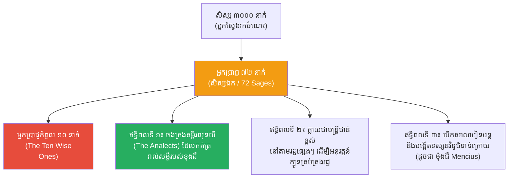

# The 72 Disciples of Confucius (សិស្សឯកទាំង ៧២ នាក់របស់ខុងជឺ)

**Author:** ichamrong  
**Date:** 2026-05-23  
**Tags:** #confucius #disciples #education #philosophy #history #leadership  
**Category:** Biographies  
**Read Time:** ~12 min  

---

## 📌 មាតិកា (Table of Contents)
- [១. តើអ្នកប្រាជ្ញទាំង ៧២ ជាអ្នកណា? (Who were the 72 Sages?)](#1)
- [២. តើពួកគេរៀនដោយរបៀបណា? (How Did They Learn?)](#2)
- [៣. កេរដំណែល និងឥទ្ធិពល (The Effect and Impact)](#3)
- [៤. សិស្សឆ្នើមទាំង ១០ របស់ខុងជឺ (The Ten Wise Ones)](#4)
- [🔗 ឯកសារទាក់ទង (Related Topics)](#related-topics)
- [ឯកសារយោង (References)](#references)

---

## ១. តើអ្នកប្រាជ្ញទាំង ៧២ ជាអ្នកណា? (Who were the 72 Sages?)

នៅក្នុងប្រវត្តិសាស្ត្រចិន លោកគ្រូខុងជឺ (Confucius) ត្រូវបានគេកត់ត្រាថាមានសិស្សរហូតដល់ទៅ **៣០០០ នាក់** ដែលមកពីគ្រប់មជ្ឈដ្ឋានទាំងអស់ មិនថាក្រ ឬមាន អភិជន ឬកសិករឡើយ (នេះគឺជាការបើកទំព័រប្រវត្តិសាស្ត្រថ្មី ដែលការអប់រំលែងកម្រិតត្រឹមតែខ្សែរាជវង្ស)។

ក្នុងចំណោមសិស្សទាំង ៣០០០ នាក់នោះ មានសិស្សចំនួន **៧២ នាក់ (ជួនកាលគេរាប់ថា ៧៧ នាក់)** ដែលបានយល់ដឹងជ្រៅជ្រះបំផុតអំពីទស្សនវិជ្ជារបស់លោក។ អ្នកទាំង ៧២ នាក់នេះ ត្រូវបានប្រវត្តិសាស្ត្រចាត់ទុកថាជា **"សិស្សឯក ឬ អ្នកប្រាជ្ញទាំង ៧២ (The 72 Sages / Qishier Xian)"**។ ពួកគេគឺជាអ្នកដែលដើរតាមខុងជឺគ្រប់ទីកន្លែង រងទុក្ខលំបាកជាមួយលោក អំឡុងពេលលោកត្រូវនិរទេសខ្លួនរយៈពេល ១៤ ឆ្នាំ។

---

## ២. តើពួកគេរៀនដោយរបៀបណា? (How Did They Learn?)

ការអប់រំរបស់ខុងជឺ មិនមែនជាការអង្គុយស្តាប់នៅក្នុងថ្នាក់រៀនដ៏ទំនើបនោះទេ។ 
- **បង់ថ្លៃសិក្សាដោយសាច់ក្រកស្ងួត៖** សិស្សក្រីក្រខ្លះ (ដូចជា យ៉ាន ហ៊ួយ) មិនមានប្រាក់បង់ថ្លៃសិក្សាទេ ដូច្នេះពួកគេគ្រាន់តែយកសាច់ក្រកស្ងួតមួយដុំ (A bundle of dried meat) មកថ្វាយបង្គំគ្រូ ដើម្បីបង្ហាញពីការគោរព។
- **វិធីសាស្ត្រសួរនិងឆ្លើយ (Socratic-like Dialogue):** ខុងជឺកម្របង្រៀនជាទ្រឹស្តីក្បួនខ្នាតណាស់។ គាត់បង្រៀនតាមរយៈការពិភាក្សា ការដើរទស្សនកិច្ច ឬពេលមានឧប្បត្តិហេតុកើតឡើង។ នៅពេលសិស្សសួរសំណួរ គាត់ឆ្លើយតបទៅតាមអត្តចរិតរបស់សិស្សនោះ។ ឧទាហរណ៍៖ សិស្សឈ្មោះ ជឺលូ ជាមនុស្សចិត្តក្តៅ ពេលសួរពីរឿងធ្វើអំពើល្អ ខុងជឺប្រាប់ថា "កុំទាន់អាលធ្វើ ត្រូវសួរឪពុកម្តាយសិន"។ ចំណែកសិស្សឈ្មោះ រ៉ាន់ ឈីវ ជាមនុស្សស្ទាក់ស្ទើរ ខុងជឺបែរជាប្រាប់ថា "ទៅធ្វើវាភ្លាមទៅ!"។
- **ការរៀនតាមរយៈការអនុវត្ត (Experiential Learning):** សិស្សរៀនសីលធម៌ សិល្បៈ កំណាព្យ បាញ់ធ្នូ បររទេះសេះ និងក្បួនគ្រប់គ្រងរដ្ឋ (The Six Arts) តាមរយៈការអនុវត្តផ្ទាល់ក្នុងសង្គម។

---

## ៣. កេរដំណែល និងឥទ្ធិពល (The Effect and Impact)

ប្រសិនបើគ្មានសិស្សឯកទាំង ៧២ នាក់នេះទេ ឈ្មោះរបស់ **ខុងជឺ** នឹងត្រូវរលាយបាត់ពីប្រវត្តិសាស្ត្រជាមិនខាន ព្រោះខុងជឺមិនដែលសរសេរសៀវភៅដោយខ្លួនឯងសូម្បីតែមួយទំព័រ។
ផលប៉ះពាល់ (Effect) ដ៏ធំបំផុតរបស់ពួកគេគឺការចងក្រង **គម្ពីរលុនយី (The Analects)** ដែលក្លាយជាគ្រឹះនៃលទ្ធិខុងជឺ។ សិស្សទាំងនេះបានធ្វើឱ្យទស្សនវិជ្ជាសីលធម៌របស់ខុងជឺ ក្លាយជាច្បាប់រដ្ឋ និងជាវប្បធម៌ដែលជះឥទ្ធិពលដល់ប្រទេសចិន កូរ៉េ ជប៉ុន និងវៀតណាម រហូតមកដល់សព្វថ្ងៃ។

---

## ៤. សិស្សឆ្នើមទាំង ១០ របស់ខុងជឺ (The Ten Wise Ones)

ទោះបីជាមានសិស្សឯក ៧២ នាក់ ប៉ុន្តែប្រវត្តិសាស្ត្របានកត់ត្រាយ៉ាងលម្អិតតែលើសិស្សឆ្នើមបំផុតចំនួន ១០ នាក់ (The Ten Wise Ones / 十哲) ប៉ុណ្ណោះ ដែលត្រូវបានបែងចែកជា ៤ ជំនាញ៖

### ជំនាញទី១៖ គុណធម៌និងសីលធម៌ (Virtue)
1. **យ៉ាន ហ៊ួយ (Yan Hui):** គឺជាសិស្សសំណព្វចិត្តបំផុតរបស់ខុងជឺ។ គាត់ក្រីក្រខ្លាំងណាស់ (រស់នៅក្នុងទីតូចចង្អៀត ហូបបាយមួយចាន ទឹកមួយផ្តិល) ប៉ុន្តែគាត់មិនដែលបាត់បង់សេចក្តីសុខក្នុងការរៀនសូត្រឡើយ។ ខុងជឺតែងតែសរសើរគាត់ថាមិនដែលខឹងខុសរឿង ឬធ្វើខុសរឿងដដែលពីរដងទេ។ ជាអកុសល យ៉ាន ហ៊ួយ បានស្លាប់នៅអាយុ ៣១ ឆ្នាំ ដែលធ្វើឱ្យខុងជឺយំសោកបោកខ្លួនយ៉ាងខ្លាំងរហូតដល់សន្លប់។
2. **មិន ស៊ុន (Min Sun):** ល្បីល្បាញបំផុតខាង "កតញ្ញូតាធម៌ (Filial Piety)"។ ទោះបីជាម្តាយចុងវាយធ្វើបាបគាត់យ៉ាងណាក៏ដោយ ក៏គាត់មិនដែលខឹង និងថែមទាំងការពារម្តាយចុងនៅពេលដែលឪពុកចង់លែងលះនាង។
3. **រ៉ាន់ ជឺយុង (Ran Yong):** កើតនៅក្នុងត្រកូលទាបថោក ប៉ុន្តែដោយសារគុណធម៌ ខុងជឺបានប្រកាសថាគាត់ស័ក្តិសមនឹងឡើងធ្វើជាស្តេចផែនដី។
4. **រ៉ាន់ ប៉ូនីវ (Ran Boniu):** ជាមនុស្សមានសីលធម៌ខ្ពស់ តែអភ័ព្វកើតជំងឺឃ្លង់ ដែលធ្វើឱ្យខុងជឺសោកស្តាយយ៉ាងខ្លាំងចំពោះវាសនារបស់គាត់។

### ជំនាញទី២៖ ការនិយាយស្តីនិងការទូត (Speech and Diplomacy)
5. **ជឺកុង (Zigong / Duanmu Ci):** គឺជាពាណិជ្ជករដ៏មានទ្រព្យសម្បត្តិមហាសាល និងជាអ្នកការទូតដ៏ឆ្លាតវៃបំផុត។ គាត់គឺជាអ្នកដែលផ្គត់ផ្គង់ហិរញ្ញវត្ថុដល់សាលារបស់ខុងជឺ និងជាអ្នកផ្សព្វផ្សាយកេរ្តិ៍ឈ្មោះខុងជឺឱ្យល្បីល្បាញដល់ស្តេចនានា។ ពេលខុងជឺស្លាប់ ជឺកុងបានសង់ខ្ទមយាមផ្នូរគ្រូរយៈពេល ៦ ឆ្នាំ។
6. **ចៃ យូ (Zai Yu):** ជាសិស្សដែលមានវោហារសព្ទមុតស្រួច ចូលចិត្តតវ៉ាជាមួយគ្រូ។ គាត់គឺជាសិស្សតែម្នាក់គត់ដែលខុងជឺស្តីបន្ទោសយ៉ាងខ្លាំងរហូតដល់ពោលពាក្យថា "ឈើពុក មិនអាចយកមកឆ្លាក់បានទេ (Rotten wood cannot be carved)" បន្ទាប់ពីចាប់បានថា ចៃ យូ ដេកនៅពេលថ្ងៃ។

### ជំនាញទី៣៖ ការគ្រប់គ្រងរដ្ឋ (Government and Administration)
7. **ជឺលូ (Zilu / Zhong You):** គឺជាទាហានដ៏ក្លាហាន ចិត្តក្តៅ និងជាអង្គរក្សផ្ទាល់របស់ខុងជឺ។ គាត់ហ៊ានរិះគន់ខុងជឺចំៗនៅពេលគាត់យល់ថាមិនសមរម្យ។ ជឺលូ បានបូជាជីវិតការពារម្ចាស់របស់ខ្លួននៅក្នុងសង្គមដោយភាពអង់អាច។
8. **រ៉ាន់ ឈីវ (Ran Qiu):** ជាមេបញ្ជាការយោធា និងជាមន្ត្រីពូកែខាងរដ្ឋបាលនិងប្រមូលពន្ធ។ គាត់ត្រូវខុងជឺស្តីបន្ទោស នៅពេលដែលគាត់ជួយមេដឹកនាំផ្តាច់ការប្រមូលពន្ធពីរាស្ត្រ ដើម្បីយកមកធ្វើសង្គ្រាម។

### ជំនាញទី៤៖ អក្សរសាស្ត្រនិងវប្បធម៌ (Literature and Culture)
9. **ជឺស៊ា (Zixia / Bu Shang):** ជាអ្នកប្រាជ្ញផ្នែកអក្សរសាស្ត្រ និងកំណាព្យ។ ក្រោយពេលគ្រូស្លាប់ គាត់បានបើកសាលារៀនផ្ទាល់ខ្លួន និងក្លាយជាទីប្រឹក្សារបស់ស្តេចនៃរដ្ឋវេយ៍ (Wei State)។ គាត់បានដើរតួនាទីយ៉ាងសំខាន់ក្នុងការបកស្រាយគម្ពីរកំណាព្យ។
10. **ជឺយូ (Ziyou / Yan Yan):** ជាមនុស្សដែលយល់ដឹងស៊ីជម្រៅបំផុតអំពី "លី (Li - ពិធីការនិងសណ្តាប់ធ្នាប់សង្គម)" ដោយជឿថាការអប់រំតន្ត្រីនិងពិធីការ គឺជាគន្លឹះក្នុងការបង្កើតសង្គមដ៏មានសន្តិភាពមួយ។

*(ចំណាំ៖ ក្រៅពីអ្នកទាំង ១០ នេះ ក៏មានសិស្សម្នាក់ទៀតឈ្មោះ **ហ្សឹងជឺ Zengzi** ដែលមិនស្ថិតក្នុងចំណោម Top 10 តែគាត់គឺជាអ្នកចងក្រងសៀវភៅ "មហាវិទ្យាល័យ / Great Learning" និងជាអ្នកដែលបានបង្រៀនបន្តទៅដល់ចៅប្រុសរបស់ខុងជឺ ដែលក្រោយមកចំណេះដឹងនេះបានបន្តទៅដល់ **ម៉ុងជឺ / Mencius** ដែលជាអ្នកប្រាជ្ញធំទី២ បន្ទាប់ពីខុងជឺ។)*

---

## 🔗 ឯកសារទាក់ទង (Related Topics)
* [ជីវប្រវត្តិខុងជឺ (Confucius Biography)](../confucius/01-confucius-biography.md)

---

## ឯកសារយោង (References)

*   **The Analects (Lunyu)** — The primary source detailing the interactions between Confucius and his disciples.
*   **Records of the Grand Historian (Shiji) by Sima Qian** — Contains the chapter "Biographies of the Disciples of Confucius" which is the primary historical source for the 72 Sages.
