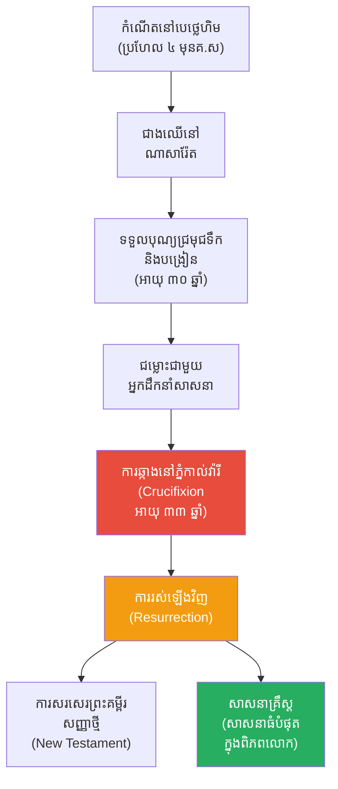

# The Biography of Jesus of Nazareth (ជីវប្រវត្តិព្រះយេស៊ូវគ្រីស្ទ)

**Author:** ichamrong  
**Date:** 2026-05-26  
**Tags:** #jesus #biography #christianity #religion #history #philosophy  
**Category:** Biographies  
**Read Time:** ~15 min  

---

## 📌 មាតិកា (Table of Contents)
- [សេចក្តីផ្តើម៖ កាយវិភាគវិទ្យានៃអ្នកសង្គ្រោះ (The Anatomy of a Savior)](#intro)
- [១. កំណើតនៅបេថ្លេហិម និងជាងឈើ (Birth & The Carpenter)](#1)
- [២. ពិធីជ្រមុជទឹក និងការល្បួងនៅវាលរហោស្ថាន (Baptism & Temptation)](#2)
- [៣. ការបង្រៀន និងអព្ភូតហេតុ (Teachings & Miracles)](#3)
- [៤. ជម្លោះជាមួយអ្នកដឹកនាំសាសនា (Conflict with Religious Authorities)](#4)
- [៥. ការឆ្កាង និងការរស់ឡើងវិញ (Crucifixion & Resurrection)](#5)
- [៦. ចិត្តសាស្ត្រ និងទស្សនវិជ្ជាពីកំណើតដល់ស្លាប់ (Psychology & Philosophy from Birth to Death)](#6)
- [៧. បញ្ហាប្រឈម និងភាពចម្រូងចម្រាស (Challenges and Controversies)](#7)
- [៨. កេរដំណែល (Legacy)](#8)
- [៩. តើព្រះយេស៊ូវបានបំផុសគំនិតអ្វីខ្លះ? (What Did Jesus Inspire?)](#9)
- [សេចក្តីសន្និដ្ឋាន (Conclusion)](#conclusion)
- [🔗 ឯកសារទាក់ទង (Related Topics)](#related-topics)
- [ឯកសារយោង (References)](#references)

---

## សេចក្តីផ្តើម៖ កាយវិភាគវិទ្យានៃអ្នកសង្គ្រោះ (The Anatomy of a Savior)

> **«កុំផ្តន្ទាទោសគេ នោះអ្នកក៏មិនត្រូវបានគេផ្តន្ទាទោសដែរ។ ចូរអភ័យទោសឱ្យគេ នោះអ្នកក៏នឹងត្រូវបានគេអភ័យទោសឱ្យដែរ។»**

សាកស្រមៃមើលពីទិដ្ឋភាពនេះ៖ ជាង ២០០០ ឆ្នាំមុន នៅចក្រភពរ៉ូមដ៏មានអំណាចបំផុតនៅលើផែនដី មានបុរសសាមញ្ញម្នាក់ដែលគ្មានកងទ័ព គ្មានលុយ គ្មានសៀវភៅសរសេរដោយផ្ទាល់ដៃ និងសូម្បីតែផ្ទះសម្បែងក៏គ្មាន។ គាត់រស់នៅក្នុងតំបន់ដាច់ស្រយាលមួយដែលគ្មានអ្នកណាខ្វល់ខ្វាយ។ ប៉ុន្តែក្នុងរយៈពេលត្រឹមតែ ៣ ឆ្នាំនៃការបង្រៀនជាសាធារណៈ សម្តីនិងសកម្មភាពរបស់គាត់បានអង្រួនចក្រភពរ៉ូមទាំងមូលឱ្យដួលរលំ ហើយបានផ្លាស់ប្តូរដំណើរប្រវត្តិសាស្ត្រនៃពិភពលោកទាំងស្រុង។

គាត់ត្រូវបានគេធ្វើទារុណកម្ម និងសម្លាប់នៅលើឈើឆ្កាង ក្នុងនាមជាឧក្រិដ្ឋជនរដ្ឋ។ សម្រាប់អ្នកនយោបាយរ៉ូម៉ាំង នោះគឺជាទីបញ្ចប់។ ប៉ុន្តែសម្រាប់ពិភពលោក វាគ្រាន់តែជាការចាប់ផ្តើមប៉ុណ្ណោះ។ តើបុរសម្នាក់ដែលត្រូវបានគេស្គាល់ថាជា "ជាងឈើពីភូមិណាសារ៉ែត" អាចក្លាយជាចំណុចកណ្តាលនៃប្រវត្តិសាស្ត្រមនុស្សជាតិ (ដែលយើងរាប់ឆ្នាំមុនគ.ស និង ក្រោយគ.ស ផ្អែកលើកំណើតរបស់គាត់) ដោយរបៀបណា? នេះគឺជារឿងរ៉ាវរបស់ **ព្រះយេស៊ូវ (Jesus of Nazareth)**។

---

## ១. កំណើតនៅបេថ្លេហិម និងជាងឈើ (Birth & The Carpenter)

ព្រះយេស៊ូវត្រូវបានគេជឿថាកើតនៅចន្លោះឆ្នាំ ៦ ដល់ ៤ មុនគ្រឹស្តសករាជ (ទោះបីជាប្រតិទិនបច្ចុប្បន្នគិតពីឆ្នាំទី១ ក៏ដោយ) នៅទីក្រុងបេថ្លេហិម (Bethlehem) នៃតំបន់យូដា (Judea)។ តាមប្រវត្តិសាស្ត្រគ្រឹស្តសាសនា ព្រះអង្គប្រសូតតាមរយៈស្ត្រីក្រមុំព្រហ្មចារីយ៍ឈ្មោះ **ម៉ារី (Mary)** និងឪពុកចិញ្ចឹមឈ្មោះ **យ៉ូសែប (Joseph)** ដែលជាជាងឈើ។ កំណើតរបស់ទ្រង់ត្រូវបានប្រារព្ធជារៀងរាល់ឆ្នាំក្នុង **ថ្ងៃបុណ្យណូអែល (Christmas)**។

ទ្រង់បានធំដឹងក្តីនៅភូមិណាសារ៉ែត (Nazareth) ជាភូមិតូចមួយនិងក្រីក្រ ក្នុងក្របខ័ណ្ឌនៃអាណាចក្ររ៉ូម ដែលកំពុងត្រួតត្រាលើជនជាតិយូដា (Jews) យ៉ាងតឹងរ៉ឹង។ ព្រះយេស៊ូវបានរៀនអាជីពជាជាងឈើតាមឪពុក និងបានសិក្សាគម្ពីរប្រពៃណីសាសនាយូដាយ៉ាងជ្រៅជ្រះ។

> 💡 **មេរៀនពីកុមារភាពដែលដក់ជាប់ដល់ស្លាប់ (The Lifelong Lesson):** ភាពសាមញ្ញ និងការរស់នៅជាមួយមនុស្សក្រីក្រ បានបង្រៀនទ្រង់ឱ្យយល់ពីការឈឺចាប់របស់រាស្ត្រសាមញ្ញដែលរងការគាបសង្កត់ទាំងពីសំណាក់រដ្ឋអំណាចរ៉ូម៉ាំង និងមេដឹកនាំសាសនាពុករលួយ។ ទ្រង់តែងតែប្រកាសថា រាជ្យរបស់ទ្រង់មិនមែនសម្រាប់អ្នកមានអំណាចទេ តែសម្រាប់អ្នកកម្សត់ទុគ៌ត។

---

## ២. ពិធីជ្រមុជទឹក និងការល្បួងនៅវាលរហោស្ថាន (Baptism & Temptation)

នៅអាយុប្រហែល ៣០ ឆ្នាំ ព្រះយេស៊ូវបានចាប់ផ្តើមបេសកកម្មរបស់ទ្រង់ ដោយទទួលបុណ្យជ្រមុជទឹក (Baptism) ពី **យ៉ូហានបាទីស្ទ (John the Baptist)** នៅក្នុងទន្លេយ័រដាន់។ នេះគឺជាចំណុចរបត់ផ្លូវការដែលទ្រង់ប្រកាសខ្លួនជាសាធារណៈ។

បន្ទាប់ពីនោះ ទ្រង់បានយាងទៅវាលរហោស្ថាន ដើម្បីតមអាហាររយៈពេល ៤០ ថ្ងៃ និង ៤០ យប់។ នៅទីនោះ ទ្រង់ត្រូវបានល្បួងដោយសាតាំង (Satan) ចំនួន ៣ ដង៖
1.  **ការល្បួងខាងរូបកាយ (Physical Hunger):** បញ្ជាឱ្យប្រែក្លាយថ្មទៅជានំប៉័ង។ ទ្រង់តបថា *"មនុស្សមិនមែនរស់ដោយសារតែនំប៉័ងប៉ុណ្ណោះទេ តែដោយសារគ្រប់ព្រះបន្ទូលរបស់ព្រះ។"*
2.  **ការល្បួងខាងអំណាច (Earthly Power):** សាតាំងសន្យាថានឹងឱ្យនគរទាំងមូលនៅលើផែនដី ប្រសិនបើទ្រង់ព្រមក្រាបថ្វាយបង្គំវា។ ទ្រង់បានបដិសេធដាច់អហង្ការ។
3.  **ការល្បួងខាងអំនួត (Testing God):** សាតាំងប្រាប់ឱ្យទ្រង់លោតពីលើដំបូលព្រះវិហារ ដើម្បីឱ្យទេវតាមកទ្រ។ ទ្រង់តបថា កុំល្បួងព្រះអម្ចាស់។

ការឈ្នះការល្បួងនេះ បង្ហាញពីការត្រៀមខ្លួនរួចជាស្រេចរបស់ទ្រង់ខាងផ្លូវចិត្ត ដើម្បីប្រឈមមុខនឹងបេសកកម្មដ៏គ្រោះថ្នាក់។

---

## ៣. ការបង្រៀន និងអព្ភូតហេតុ (Teachings & Miracles)

ព្រះយេស៊ូវបានចំណាយពេលប្រហែល ៣ ឆ្នាំ ដើរបង្រៀននៅជុំវិញតំបន់កាលីឡេ (Galilee) និងយេរូសាឡឹម។ វិធីសាស្ត្របង្រៀនរបស់ទ្រង់គឺប្រើប្រាស់ **រឿងប្រៀបប្រដូច (Parables)** ដូចជារឿង "កូនប្រុសខ្ជះខ្ជាយ (The Prodigal Son)" ឬ "សាសន៍សាម៉ារីដ៏ល្អ (The Good Samaritan)" ដែលជាភាសាសាមញ្ញងាយយល់ ប៉ុន្តែផ្ទុកអត្ថន័យទស្សនវិជ្ជាស៊ីជម្រៅ។

ការបង្រៀនដ៏ល្បីល្បាញបំផុតគឺ **ធម្មទេសនានៅលើភ្នំ (Sermon on the Mount)** ដែលទ្រង់បានប្រកាសនូវគោលការណ៍ថ្មីនៃការរស់នៅ៖
*   *"ស្រលាញ់សត្រូវរបស់អ្នក ហើយអធិស្ឋានឱ្យអ្នកដែលបៀតបៀនអ្នក"*
*   *"បើគេទះកំផ្លៀងស្តាំ ឱ្យគេទះខាងឆ្វេងទៀត"*
*   *"កុំវិនិច្ឆ័យគេ កុំឱ្យគេវិនិច្ឆ័យអ្នកវិញ"*

ក្រៅពីការបង្រៀន ទ្រង់ត្រូវបានគេកត់ត្រាថាបានធ្វើអព្ភូតហេតុជាច្រើន ដូចជា ការព្យាបាលអ្នកជំងឺ ធ្វើឱ្យមនុស្សខ្វាក់មើលឃើញ ប្រែក្លាយទឹកទៅជាស្រា និងប្រោសមនុស្សស្លាប់ឱ្យរស់ឡើងវិញ (ដូចជា ឡាសារ - Lazarus) ជាដើម។ អព្ភូតហេតុទាំងនេះមិនមែនដើម្បីអួតអំណាចទេ តែជាការបង្ហាញពីក្តីមេត្តាករុណា។

---

## ៤. ជម្លោះជាមួយអ្នកដឹកនាំសាសនា (Conflict with Religious Authorities)

ប្រជាប្រិយភាពរបស់ព្រះយេស៊ូវ បានធ្វើឱ្យក្រុមមេដឹកនាំសាសនាយូដា (ពួកផារីស៊ី - Pharisees និងពួកសាឌូស៊ី - Sadducees) មានការភ័យខ្លាចចំពោះការបាត់បង់អំណាច។

ជម្លោះកាន់តែខ្លាំងឡើងនៅពេលព្រះយេស៊ូវបានចូលទៅក្នុងព្រះវិហារបរិសុទ្ធនៅក្រុងយេរូសាឡឹម ហើយ **វាយកម្ទេចតុអ្នកប្តូរប្រាក់ និងអ្នកលក់សត្វព្រាប** ដោយទ្រង់បរិហារថាពួកគេបានបំប្លែងកន្លែងសក្ការៈឱ្យទៅជា "រូងចោរ"។ 

លើសពីនេះ ទ្រង់តែងតែបំបែកច្បាប់ប្រពៃណីចាស់ៗ ដូចជាការព្យាបាលមនុស្សនៅថ្ងៃសប្ប័ទ (Sabbath - ថ្ងៃឈប់សម្រាកដែលហាមធ្វើការ) និងការចូលរួមទទួលទានអាហារជាមួយអ្នកទារពន្ធនិងស្រីពេស្យា (ដែលសង្គមចាត់ទុកជាមនុស្សបាប)។ សម្រាប់ក្រុមអភិរក្ស ការប្រកាសថាទ្រង់ជា "ព្រះរាជបុត្រារបស់ព្រះ" គឺជាការប្រមាថយ៉ាងធ្ងន់ធ្ងរ (Blasphemy) ដែលត្រូវតែមានទោសប្រហារជីវិត។

---

## ៥. ការឆ្កាង និងការរស់ឡើងវិញ (Crucifixion & Resurrection)

បន្ទាប់ពីអាហារពេលល្ងាចចុងក្រោយ (The Last Supper) ព្រះយេស៊ូវត្រូវបានក្បត់ដោយសាវ័កម្នាក់របស់ទ្រង់ឈ្មោះ **យូដាស អ៊ីស្ការីយ៉ុត (Judas Iscariot)** ក្នុងតម្លៃប្រាក់ ៣០ សេកែល។

ទ្រង់ត្រូវបានចាប់ខ្លួន កាត់ក្តីដោយអយុត្តិធម៌ និងប្រគល់ទៅឱ្យទេសាភិបាលរ៉ូម៉ាំងឈ្មោះ **ប៉ុនទាស ពីឡាត (Pontius Pilate)**។ ដើម្បីបញ្ចៀសការបះបោរពីក្រុមបូជាចារ្យ ពីឡាតបានយល់ព្រមឱ្យបញ្ជូនទ្រង់ទៅប្រហារជីវិត។

ព្រះយេស៊ូវត្រូវបានគេវាយដំ ពាក់មកុដបន្លា និងបង្ខំឱ្យលីឈើឆ្កាងខ្លួនឯងទៅកាន់ភ្នំកាល់វ៉ារី (Golgotha)។ នៅលើឈើឆ្កាង ទោះបីជារងការឈឺចាប់បំផុត ក៏ទ្រង់នៅតែអធិស្ឋានថា៖ *"ឱព្រះបិតាអើយ សូមអភ័យទោសឱ្យពួកគេផង ព្រោះពួកគេមិនដឹងពីអ្វីដែលពួកគេកំពុងធ្វើនោះទេ។"* ព្រះអង្គបានសុគតនៅអាយុ ៣៣ ឆ្នាំ។

ប៉ុន្តែ ៣ ថ្ងៃក្រោយមក ផ្នូររបស់ទ្រង់ត្រូវបានរកឃើញថាទទេស្អាត។ សាវ័ករបស់ទ្រង់បានអះអាងថា ទ្រង់បាន **រស់ឡើងវិញ (Resurrection)** បង្ហាញខ្លួនឱ្យពួកគេឃើញ និងបានសន្យាថានឹងត្រឡប់មកវិញ មុនពេលយាងឡើងទៅឋានសួគ៌។ ព្រឹត្តិការណ៍រស់ឡើងវិញនេះ គឺជាគ្រឹះដ៏សំខាន់បំផុតនៃសាសនាគ្រឹស្ត (ដែលប្រារព្ធជាថ្ងៃបុណ្យ Easter)។

---

## ៦. ចិត្តសាស្ត្រ និងទស្សនវិជ្ជាពីកំណើតដល់ស្លាប់ (Psychology & Philosophy from Birth to Death)

ទស្សនវិជ្ជាផ្លូវចិត្តរបស់ព្រះយេស៊ូវ គឺផ្ទុយស្រឡះពីទស្សនវិជ្ជារបស់ចក្រភពរ៉ូម និងអ្នកប្រាជ្ញសម័យនោះ៖

*   **បដិវត្តន៍នៃសេចក្តីស្រលាញ់ (Revolution of Love):** ក្នុងយុគសម័យដែលកម្លាំងយោធាជាច្បាប់ ព្រះយេស៊ូវបានបង្រៀនពី **"សេចក្តីស្រលាញ់ដោយគ្មានលក្ខខណ្ឌ (Agape)"**។ ទ្រង់ទាមទារឱ្យស្រលាញ់សូម្បីតែសត្រូវ ដែលជាគំនិតចិត្តសាស្ត្រមួយដែលផ្ទុយពីសភាវគតិមនុស្សទាំងស្រុង។
*   **ភាពអស្ចារ្យតាមរយៈការបម្រើ (Servant Leadership):** ជំនួសឱ្យការប្រើអំណាចជាន់ឈ្លីអ្នកដទៃ ទ្រង់បានលាងជើងឱ្យសាវ័កខ្លួនឯង ដោយបង្រៀនថា "អ្នកណាដែលចង់ធ្វើជាធំ ត្រូវតែធ្វើជាអ្នកបម្រើគេ"។
*   **ការអភ័យទោស (Forgiveness as Liberation):** ផ្លូវចិត្តរបស់ព្រះអង្គបង្រៀនថា ការគុំគួនគឺជាថ្នាំពុល។ ការអភ័យទោសមិនមែនត្រឹមតែជួយអ្នកខុសទេ តែជួយរំដោះចិត្តអ្នករងគ្រោះឱ្យមានសេរីភាពផងដែរ។
*   **តម្លៃខាងក្នុងជាជាងសាសនកិច្ចខាងក្រៅ (Inward Purity):** ទ្រង់បានរិះគន់យ៉ាងចាស់ដៃចំពោះអ្នកដឹកនាំសាសនាដែលធ្វើបុណ្យតែសំបកក្រៅ (ពុតត្បុត) ប៉ុន្តែក្នុងចិត្តពោរពេញដោយសេចក្តីលោភលន់។
*   **សេចក្តីសង្ឃឹមក្នុងក្តីឈឺចាប់ (Redemptive Suffering):** ការសុខចិត្តស្លាប់នៅលើឈើឆ្កាង បង្ហាញពីទស្សនវិជ្ជាថា ភាពរងទុក្ខវេទនា អាចមានអត្ថន័យ និងនាំទៅរកសេចក្តីសង្គ្រោះបាន ប្រសិនបើធ្វើឡើងដោយសេចក្តីស្រលាញ់។

---

## ៧. បញ្ហាប្រឈម និងភាពចម្រូងចម្រាស (Challenges and Controversies)

ក្នុងនាមជាបុគ្គលសាធារណៈ ព្រះយេស៊ូវប្រឈមមុខនឹងការវាយប្រហារនិងភាពចម្រូងចម្រាសជាច្រើន៖

1.  **ការរិះគន់ពីគ្រួសារនិងមិត្តភក្តិ (Rejection at Home):** នៅពេលទ្រង់ត្រឡប់ទៅបង្រៀននៅស្រុកកំណើត (ណាសារ៉ែត) ប្រជាជននិងសូម្បីតែសាច់ញាតិខ្លះបានបដិសេធទ្រង់ ដោយគិតថាទ្រង់ "ឆ្កួត" ទើបមានពាក្យថា *"គ្មានហោរាណាមួយដែលទទួលបានការគោរពនៅស្រុកកំណើតខ្លួនឯងនោះទេ"*។
2.  **ការចោទប្រកាន់ជាអ្នកនយោបាយបះបោរ (Political Subversion):** រ៉ូម៉ាំងបានកាត់ទោសទ្រង់ មិនមែនដោយសារជម្លោះសាសនាទេ តែដោយសារការចោទប្រកាន់ថាទ្រង់តាំងខ្លួនជា "ស្តេចសាសន៍យូដា" ដែលស្មើនឹងការបះបោរប្រឆាំងអធិរាជសេសារ (Caesar)។
3.  **ការបោះបង់ពីអ្នកគាំទ្រ (Abandonment):** ក្នុងពេលដែលទ្រង់ត្រូវការអ្នកគាំទ្របំផុត (ពេលត្រូវគេចាប់ខ្លួន) សាវ័កដែលស្និទ្ធបំផុត (ដូចជាពេត្រុស) បានបដិសេធមិនស្គាល់ទ្រង់ ៣ ដង ដើម្បីការពារជីវិតខ្លួនឯង។ ទ្រង់ត្រូវស្លាប់យ៉ាងឯកោ។

---

## ៨. កេរដំណែល (Legacy)

ព្រះយេស៊ូវមិនបានបន្សល់ទុកទ្រព្យសម្បត្តិ មិនបានសរសេរសៀវភៅ និងមិនមានតំណែងរដ្ឋបាលអ្វីទាំងអស់។ ប៉ុន្តែបុរសសាមញ្ញម្នាក់នេះ បានបន្សល់ទុកនូវចលនាមួយដែលក្រោយមកបានកម្ទេចចក្រភពរ៉ូម និងគ្របដណ្តប់ពិភពលោក។ សព្វថ្ងៃនេះ គ្រឹស្តសាសនាគឺជាសាសនាដែលមានអ្នកជឿច្រើនជាងគេបំផុតនៅលើពិភពលោក (ជាង ២.៤ ពាន់លាននាក់)។

---

## ៩. តើព្រះយេស៊ូវបានបំផុសគំនិតអ្វីខ្លះ? (What Did Jesus Inspire?)

នេះគឺជាបញ្ជីរាយនាមរឿងរ៉ាវ និងគោលគំនិតចំនួន ២៥ ដែលព្រះយេស៊ូវគ្រីស្ទបានបំផុសគំនិត និងបន្សល់ទុកជាមរតកសម្រាប់មនុស្សជាតិ៖

1.  **គ្រឹស្តសាសនា (Christianity):** សាសនាដែលគ្របដណ្តប់មួយភាគបីនៃប្រជាជនពិភពលោក។
2.  **ការបំបែកប្រតិទិនពិភពលោក (BC/AD System):** ប្រវត្តិសាស្ត្រពិភពលោកត្រូវបានចែកជាពីរ (មុនគ្រឹស្តសករាជ និង ក្រោយគ្រឹស្តសករាជ) ដោយផ្អែកលើឆ្នាំកំណើតរបស់ទ្រង់។
3.  **ព្រះគម្ពីរសញ្ញាថ្មី (The New Testament):** សៀវភៅដែលត្រូវបានបកប្រែច្រើនជាងគេបំផុត និងមានឥទ្ធិពលបំផុតក្នុងអក្សរសាស្ត្រលោកខាងលិច។
4.  **បុណ្យណូអែល (Christmas):** ពិធីបុណ្យប្រារព្ធថ្ងៃកំណើត ដែលមានឥទ្ធិពលខាងវប្បធម៌និងសេដ្ឋកិច្ចធំបំផុតប្រចាំឆ្នាំ។
5.  **បុណ្យអ៊ីស្ទ័រ (Easter):** ពិធីបុណ្យប្រារព្ធការរស់ឡើងវិញ ដែលជាមូលដ្ឋាននៃសេចក្តីសង្ឃឹមរបស់គ្រឹស្តបរិស័ទ។
6.  **ការយកចិត្តទុកដាក់លើកុមារ (Valuing Children):** ទ្រង់បានបង្រៀនឱ្យ "ទុកឱ្យក្មេងៗមករកខ្ញុំ" ក្នុងសង្គមរ៉ូម៉ាំងដែលតែងតែរំលោភបំពានកុមារតូចៗ។
7.  **មន្ទីរពេទ្យនិងការថែទាំ (Origins of Hospitals):** ការបង្រៀនឱ្យជួយអ្នកឈឺ បានជំរុញឱ្យសាសនាចក្រកសាងមន្ទីរពេទ្យដំបូងគេបង្អស់នៅអឺរ៉ុប។
8.  **គោលការណ៍មាស (The Golden Rule):** ទោះបីខុងជឺនិយាយក្នុងទម្រង់អវិជ្ជមាន ព្រះយេស៊ូវបានបង្រៀនក្នុងទម្រង់សកម្ម៖ *"អ្វីដែលអ្នកចង់ឱ្យគេធ្វើមកលើអ្នក ចូរធ្វើវាមកលើគេជាមុនសិន"។*
9.  **គំនិតនៃសិទ្ធិមនុស្សស្មើគ្នា (Equality of Souls):** គំនិតដែលថា "នៅចំពោះព្រះជាម្ចាស់ គ្មានទាសករ គ្មានសេរីជន គ្មានប្រុស គ្មានស្រី" បានចាក់គ្រឹះនៃសិទ្ធិមនុស្សសម័យទំនើប។
10. **សេចក្តីស្រលាញ់ដោយឥតលក្ខខណ្ឌ (Agape Love):** ទស្សនវិជ្ជានៃការលះបង់ខ្លួនឯងដើម្បីអ្នកដទៃ។
11. **ការអភ័យទោស (Forgiveness):** ការបង្រៀនឱ្យអភ័យទោស "៧០ ដង ៧ ដង" បានផ្លាស់ប្តូរវិធីសាស្ត្រនៃការដោះស្រាយវិវាទ។
12. **អ្នកដឹកនាំជាអ្នកបម្រើ (Servant Leadership):** គំរូអ្នកដឹកនាំដែលលាងជើងឱ្យកូនចៅ។
13. **សិល្បៈនិងស្ថាបត្យកម្មអឺរ៉ុប (European Art & Architecture):** ការកសាងវិហារធំៗ (Cathedrals) និងផ្ទាំងគំនូរល្បីៗ (ដូចជា The Last Supper របស់ Da Vinci) ភាគច្រើនកើតចេញពីរឿងរ៉ាវរបស់ទ្រង់។
14. **ការការពារអ្នកទន់ខ្សោយ (Protecting the Marginalized):** ទ្រង់ចំណាយពេលជាមួយអ្នកក្រីក្រ ស្រីពេស្យា និងអ្នកទារពន្ធ ដែលសង្គមស្អប់ខ្ពើម។
15. **អហិង្សា និងសន្តិភាព (Non-Violence):** ការប្រកាសថា "អ្នកណាដែលកាន់ដាវ នឹងស្លាប់ដោយដាវ" បំផុសគំនិតមេដឹកនាំសន្តិវិធីដូចជា MLK និង Gandhi។
16. **សាកលវិទ្យាល័យ (Origins of Universities):** សាកលវិទ្យាល័យចំណាស់ជាងគេនៅអឺរ៉ុប (ដូចជា Oxford, Cambridge) ត្រូវបានបង្កើតឡើងដោយព្រះវិហារដើម្បីសិក្សាទ្រឹស្តីព្រះយេស៊ូវ និងវិទ្យាសាស្ត្រ។
17. **តួនាទីរបស់ស្ត្រី (Role of Women):** ទ្រង់បានផ្តល់តម្លៃដល់ស្ត្រីយ៉ាងខ្ពស់ (ម៉ារី ម៉ាក់ដាឡែន ជាអ្នកឃើញទ្រង់រស់ឡើងវិញមុនគេ) ផ្ទុយពីប្រពៃណីយូដានាសម័យនោះ។
18. **ចលនាលុបបំបាត់ទាសភាព (Abolitionist Movement):** អ្នកតស៊ូមតិលុបបំបាត់ទាសភាព (ដូចជា William Wilberforce) ប្រើការបង្រៀនរបស់ព្រះយេស៊ូវជាអាវុធ។
19. **សប្បុរសធម៌ (Charity as a Duty):** ការដាក់កាតព្វកិច្ចជួយអ្នកក្រីក្រ ថាជាការជួយព្រះជាម្ចាស់ដោយផ្ទាល់។
20. **ការបំបែករដ្ឋនិងសាសនា (Separation of Church and State):** ឃ្លាដែលថា *"របស់អ្វីដែលជារបស់សេសារ (រដ្ឋ) ត្រូវថ្វាយទៅសេសារ របស់អ្វីជារបស់ព្រះ ត្រូវថ្វាយព្រះ"* ជាមូលដ្ឋាននៃការបំបែករដ្ឋនិងសាសនា។
21. **ក្រមសីលធម៌ការងារ (Protestant Work Ethic):** ការបកស្រាយបន្តបន្ទាប់ពីការបង្រៀនរបស់ទ្រង់ បានជួយជំរុញការលូតលាស់នៃមូលធននិយមនៅអឺរ៉ុប។
22. **គំរូនៃទុក្ករបុគ្គល (Martyrdom):** ការហ៊ានស្លាប់ដើម្បីជំនឿ បានផ្តល់ភាពក្លាហានដល់អ្នកដើរតាមរាប់លាននាក់នៅក្នុងចក្រភពរ៉ូម។
23. **ការអធិស្ឋានរបស់ព្រះអម្ចាស់ (The Lord's Prayer):** បទអធិស្ឋានដែលត្រូវបានសូត្រជារៀងរាល់ថ្ងៃដោយមនុស្សរាប់ពាន់លាននាក់។
24. **តន្ត្រីលោកខាងលិច (Western Music):** តន្ត្រីកូរ៉ាល់ (Choral) និងតន្ត្រីបុរាណភាគច្រើន មានប្រភពចេញពីការថ្វាយបង្គំព្រះយេស៊ូវក្នុងវិហារ។
25. **ក្តីសង្ឃឹមសម្រាប់មនុស្សមានបាប (Redemption):** គំនិតដែលថា គ្មាននរណាម្នាក់ដែលលិចលង់ជ្រៅរហូតដល់មិនអាចសង្គ្រោះបានឡើយ ឱ្យតែចេះប្រែចិត្ត។

---

## សេចក្តីសន្និដ្ឋាន (Conclusion)

> **«ខ្ញុំជាផ្លូវ ជាសេចក្តីពិត និងជាជីវិត។» — ព្រះយេស៊ូវ**

ជីវប្រវត្តិរបស់ព្រះយេស៊ូវ គឺជារឿងរ៉ាវនៃបដិវត្តន៍ដែលមិនធ្លាប់មាននៅលើផែនដី — ជាបដិវត្តន៍ដោយគ្មានអាវុធ ជាបដិវត្តន៍នៃ "សេចក្តីស្រលាញ់ និងការអភ័យទោស"។ ទ្រង់បានបដិសេធមិនប្រើកម្លាំងបាយដើម្បីយកឈ្នះពិភពលោក ប៉ុន្តែទ្រង់បានយកឈ្នះបេះដូងមនុស្សរាប់ពាន់លាននាក់ តាមរយៈការសុខចិត្តលះបង់ជីវិតនៅលើឈើឆ្កាង។ សម្រាប់អ្នកប្រវត្តិសាស្ត្រ ព្រះយេស៊ូវគឺជាគ្រូបង្រៀនសីលធម៌ដ៏អស្ចារ្យបំផុតម្នាក់ ប៉ុន្តែសម្រាប់អ្នកជឿ ទ្រង់គឺជាព្រះរាជបុត្រារបស់ព្រះជាម្ចាស់ ដែលចុះមកដើម្បីរំដោះមនុស្សជាតិពីចំណងនៃអំពើបាប និងសេចក្តីស្លាប់។ ទោះក្នុងន័យណាក៏ដោយ វត្តមានរបស់បុរសសាមញ្ញពីស្រុកណាសារ៉ែតរូបនេះ បានបន្សល់ទុកនូវឥទ្ធិពលដែលគ្មានបុគ្គលណាមួយក្នុងប្រវត្តិសាស្ត្រអាចប្រៀបផ្ទឹមបានឡើយ។

---

## 🔗 ឯកសារទាក់ទង (Related Topics)
* [សាវ័កទាំង ១២ របស់ព្រះយេស៊ូវ (12 Apostles)](../jesus/02-jesus-12-apostles.md)
* [ជីវប្រវត្តិព្រះពុទ្ធ (Buddha Biography)](../buddha/01-buddha-biography.md)
* [ជីវប្រវត្តិម៉ូហាម៉ាត់ (Muhammad Biography)](../muhammad/01-muhammad-biography.md)

## ឯកសារយោង (References)

*   **The Four Gospels (Matthew, Mark, Luke, John)** — The primary biblical texts documenting the life, ministry, death, and resurrection of Jesus.
*   **Antiquities of the Jews by Flavius Josephus** — Provides first-century historical references to the existence of Jesus.
*   **Zealot: The Life and Times of Jesus of Nazareth by Reza Aslan** — A historical look at Jesus within the political context of first-century Palestine.

---

*Last updated: 2026-05-26*
