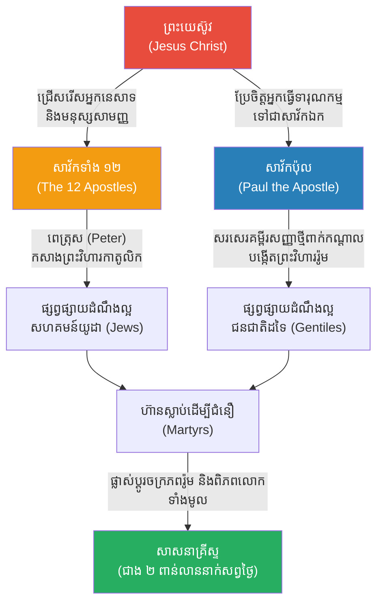

# The 12 Apostles & The Early Church (សាវ័កទាំង ១២ និងព្រះសហគមន៍ដំបូង)

**Author:** ichamrong  
**Date:** 2026-05-23  
**Tags:** #jesus #apostles #peter #paul #christianity #history  
**Category:** Biographies  
**Read Time:** ~10 min  

---

## 📌 មាតិកា (Table of Contents)
- [១. អ្នកនេសាទក្លាយជាអ្នកនេសាទមនុស្ស (Fishermen to Fishers of Men)](#1)
- [២. សាវ័កពេត្រុស៖ ថ្មដានៃព្រះវិហារ (Peter the Rock)](#2)
- [៣. ភាពភ័យខ្លាច ការក្បត់ និងសេចក្តីក្លាហាន (Fear, Betrayal, and Courage)](#3)
- [៤. សាវ័កប៉ុល៖ អ្នកផ្សព្វផ្សាយទៅកាន់ជនជាតិដទៃ (Paul the Apostle to the Gentiles)](#4)
- [៥. កេរដំណែល និងឥទ្ធិពល (The Effect and Impact)](#5)
- [🔗 ឯកសារទាក់ទង (Related Topics)](#related-topics)
- [ឯកសារយោង (References)](#references)

---

## ១. អ្នកនេសាទក្លាយជាអ្នកនេសាទមនុស្ស (Fishermen to Fishers of Men)

ដើម្បីផ្សព្វផ្សាយដំណឹងល្អ ព្រះយេស៊ូវ (Jesus) មិនបានជ្រើសរើសមេដឹកនាំសាសនា អ្នកប្រាជ្ញ ឬអ្នកមានអំណាចនោះទេ។ ផ្ទុយទៅវិញ ទ្រង់បានជ្រើសរើសបុរសសាមញ្ញចំនួន ១២ នាក់ ដែលភាគច្រើនជាអ្នកនេសាទត្រី អ្នកទារពន្ធ និងអ្នកធ្វើការរដ្ឋបាលធម្មតា មកធ្វើជាសិស្សផ្ទាល់របស់ទ្រង់។ អ្នកទាំង ១២ នាក់នេះ ត្រូវបានគេស្គាល់ថាជា **សាវ័កទាំង ១២ (The 12 Apostles)**។

ព្រះយេស៊ូវបានមានបន្ទូលទៅកាន់អ្នកនេសាទទាំងនោះថា៖ *"ចូរដើរតាមខ្ញុំ ខ្ញុំនឹងធ្វើឱ្យអ្នកក្លាយជាអ្នកនេសាទមនុស្ស (Fishers of men) វិញ។"*

---

## ២. សាវ័កពេត្រុស៖ ថ្មដានៃព្រះវិហារ (Peter the Rock)

ក្នុងចំណោមសាវ័កទាំង ១២ **ស៊ីម៉ូន ពេត្រុស (Simon Peter)** គឺជាសាវ័កដែលលេចធ្លោជាងគេ។ គាត់ជាមនុស្សចិត្តក្តៅ ក្លាហាន តែជួនកាលក៏ទន់ខ្សោយ។
នៅពេលពេត្រុសប្រកាសថា ព្រះយេស៊ូវគឺជាព្រះសង្គ្រោះ ព្រះយេស៊ូវបានប្រទានឈ្មោះថ្មីឱ្យគាត់ថា "ពេត្រុស (Peter)" ដែលប្រែថា "ថ្ម (Rock)" ហើយទ្រង់មានបន្ទូលថា៖ *"នៅលើផ្ទាំងថ្មនេះ ខ្ញុំនឹងសាងសង់ព្រះវិហាររបស់ខ្ញុំ។"*

សព្វថ្ងៃនេះ ព្រះវិហារកាតូលិកចាត់ទុកសាវ័កពេត្រុស ថាជា **សម្តេចប៉ាប (Pope)** ទីមួយនៅក្នុងប្រវត្តិសាស្ត្រ។ កន្លែងដែលគាត់ស្លាប់ ត្រូវបានសាងសង់ជាព្រះវិហារ St. Peter's Basilica ដ៏ធំសម្បើមនៅបុរីវ៉ាទីកង់សព្វថ្ងៃ។

---

## ៣. ភាពភ័យខ្លាច ការក្បត់ និងសេចក្តីក្លាហាន (Fear, Betrayal, and Courage)

នៅយប់ដែលព្រះយេស៊ូវត្រូវគេចាប់ខ្លួន សាវ័កទាំង ១២ បានបង្ហាញពីភាពភ័យខ្លាចជាមនុស្សធម្មតា៖
*   **យូដាស ឥស្ការីយ៉ុត (Judas Iscariot):** បានលក់គ្រូខ្លួនឯងក្នុងតម្លៃ ៣០ សេកែល ហើយក្រោយមកបានចងកសម្លាប់ខ្លួនដោយវិប្បដិសារី។ គាត់ត្រូវបានជំនួសដោយសាវ័កម៉ាត់ធាស (Matthias) ដើម្បីបំពេញចំនួន ១២ នាក់វិញ។
*   **ពេត្រុស (Peter):** បានបដិសេធមិនស្គាល់ព្រះយេស៊ូវចំនួន ៣ ដង មុនមាន់រងាវ ព្រោះខ្លាចគេចាប់សម្លាប់។
*   សាវ័កផ្សេងទៀត បានរត់គេចខ្លួនបាត់អស់ លើកលែងតែ **សាវ័កយ៉ូហាន (John)** ដែលនៅកំដរព្រះយេស៊ូវរហូតដល់ដង្ហើមចុងក្រោយ។

ទោះជាយ៉ាងណាក៏ដោយ បន្ទាប់ពីមានជំនឿថាព្រះយេស៊ូវបាន **រស់ឡើងវិញ (Resurrection)** នៅថ្ងៃទី ៣ អ្នកនេសាទដ៏កំសាកទាំងនេះ បានប្រែខ្លួនជាបុរសដ៏ក្លាហានដែលលែងខ្លាចសេចក្តីស្លាប់។ ពួកគេបានដើរផ្សព្វផ្សាយសាសនាទូទាំងពិភពលោក ហើយសាវ័កស្ទើរតែទាំងអស់ (លើកលែងតែយ៉ូហាន) បានសុខចិត្តស្លាប់ជាទុក្ករបុគ្គល (Martyrs) ព្រោះមិនព្រមបោះបង់ជំនឿរបស់ខ្លួន (ឧទាហរណ៍៖ ពេត្រុស សុំឱ្យគេឆ្កាងគាត់បញ្ច្រាសក្បាលចុះក្រោម ព្រោះមិនហ៊ានប្រៀបខ្លួននឹងព្រះយេស៊ូវ)។

---

## ៤. សាវ័កប៉ុល៖ អ្នកផ្សព្វផ្សាយទៅកាន់ជនជាតិដទៃ (Paul the Apostle to the Gentiles)

ទោះបីជាមិនមែនជាសាវ័កទាំង ១២ ដើម ប៉ុន្តែ **សាវ័កប៉ុល (Paul / Saul of Tarsus)** គឺជាបុគ្គលដែលសំខាន់បំផុតទី ២ បន្ទាប់ពីព្រះយេស៊ូវ ក្នុងការកសាងសាសនាគ្រីស្ទ។

ដើមឡើយ ប៉ុលគឺជាអ្នកដឹកនាំសាសនាយូដា ដែលដើរចាប់គ្រីស្ទបរិស័ទយកទៅសម្លាប់និងធ្វើទារុណកម្មយ៉ាងសាហាវ។ ប៉ុន្តែនៅពេលធ្វើដំណើរទៅទីក្រុងដាម៉ាស (Damascus) គាត់បានឃើញពន្លឺព្រះយេស៊ូវ ដែលធ្វើឱ្យគាត់ងងឹតភ្នែកនិងប្រែចិត្តជឿ។

ប៉ុលបានក្លាយជាអ្នកផ្សព្វផ្សាយសាសនាដ៏អស្ចារ្យបំផុត។ ផ្ទុយពីសាវ័កផ្សេងដែលផ្តោតលើតែជនជាតិយូដា ប៉ុលបាននាំយកសាសនាគ្រីស្ទ ទៅកាន់ "ជនជាតិដទៃ (Gentiles)" គឺចក្រភពរ៉ូម និងក្រិក។ គាត់បានសរសេរសំបុត្រយ៉ាងច្រើន (Epistles) ដែលក្លាយជាផ្នែកដ៏ធំនៃ **គម្ពីរសញ្ញាថ្មី (New Testament)** មុនពេលគាត់ត្រូវបានអធិរាជរ៉ូមកាត់ក្បាលប្រហារជីវិត។

---

## ៥. កេរដំណែល និងឥទ្ធិពល (The Effect and Impact)

បើគ្មានការលះបង់ជីវិតរបស់ **សាវ័កទាំង ១២** និងការពង្រីកឥទ្ធិពលរបស់ **សាវ័កប៉ុល** ទេ សាសនាគ្រីស្ទប្រហែលជារលាយបាត់ភ្លាមៗ បន្ទាប់ពីការឆ្កាងព្រះយេស៊ូវ ឬក៏ត្រឹមតែជានិកាយតូចមួយនៅក្នុងសាសនាយូដាប៉ុណ្ណោះ។ សេចក្តីក្លាហាននិងការតស៊ូរបស់ពួកគេ បានប្រែក្លាយក្រុមអ្នកជឿតូចតាចមួយ ឱ្យក្លាយជាសាសនាដែលមានឥទ្ធិពលបំផុតនៅលើពិភពលោករហូតមកដល់បច្ចុប្បន្ន។

---

## 🔗 ឯកសារទាក់ទង (Related Topics)
* [ជីវប្រវត្តិព្រះយេស៊ូវ (Jesus Biography)](../jesus/01-jesus-biography.md)

---

## ឯកសារយោង (References)

*   **The Acts of the Apostles** — The fifth book of the New Testament outlining the founding of the Christian church and the spread of its message.
*   **The Pauline Epistles** — The 13 New Testament books attributed to Paul the Apostle, which form the foundation of Christian theology.
