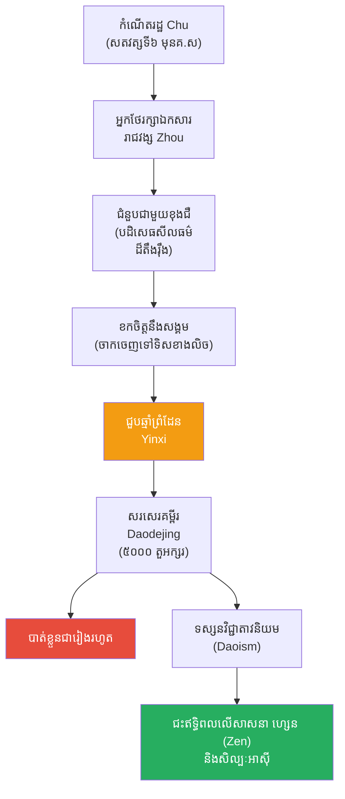

# The Biography of Laozi (ជីវប្រវត្តិឡៅជឺ)

**Author:** ichamrong  
**Date:** 2026-05-26  
**Tags:** #laozi #biography #daoism #taoism #philosophy #wu-wei  
**Category:** Biographies  
**Read Time:** ~15 min  

---

## 📌 មាតិកា (Table of Contents)
- [សេចក្តីផ្តើម៖ កាយវិភាគវិទ្យានៃអ្នកប្រាជ្ញអាថ៌កំបាំង (The Anatomy of a Mystic)](#intro)
- [១. កំណើត និងបុគ្គលិកលក្ខណៈអាថ៌កំបាំង (Birth & The Mysterious Figure)](#1)
- [២. អ្នកថែរក្សាបណ្ណាល័យអធិរាជ (The Imperial Archivist)](#2)
- [៣. ជំនួបប្រវត្តិសាស្ត្ររវាងឡៅជឺ និងខុងជឺ (The Meeting with Confucius)](#3)
- [៤. ការចាកចេញពីសង្គម និងការសរសេរគម្ពីរតាវ (Leaving Society & the Daodejing)](#4)
- [៥. គោលការណ៍ស្នូល៖ អ៊ូវ៉ី និងធម្មជាតិ (Core Philosophy: Wu-Wei and Nature)](#5)
- [៦. ចិត្តសាស្ត្រ និងទស្សនវិជ្ជាពីកំណើតដល់ស្លាប់ (Psychology & Philosophy from Birth to Death)](#6)
- [៧. បញ្ហាប្រឈម និងភាពផ្ទុយគ្នា (Challenges and Paradoxes)](#7)
- [៨. កេរដំណែល (Legacy)](#8)
- [៩. តើឡៅជឺបានបំផុសគំនិតអ្វីខ្លះ? (What Did Laozi Inspire?)](#9)
- [សេចក្តីសន្និដ្ឋាន (Conclusion)](#conclusion)
- [🔗 ឯកសារទាក់ទង (Related Topics)](#related-topics)
- [ឯកសារយោង (References)](#references)

---

## សេចក្តីផ្តើម៖ កាយវិភាគវិទ្យានៃអ្នកប្រាជ្ញអាថ៌កំបាំង (The Anatomy of a Mystic)

> **«ទឹកគឺទន់ភ្លន់បំផុតនៅលើលោក ប៉ុន្តែវាអាចកាត់ទម្លុះថ្មដែលរឹងបំផុតបាន។»**

សាកស្រមៃមើលពីទិដ្ឋភាពនេះ៖ នៅក្នុងពិភពលោកមួយដែលមនុស្សគ្រប់គ្នាកំពុងប្រជែងគ្នាដណ្តើមអំណាច (សម័យនគរចម្បាំងចិន) អ្នកប្រាជ្ញគ្រប់រូបខិតខំសរសេរក្បួនច្បាប់ ដើម្បីបង្រៀនស្តេចពីរបៀបគ្រប់គ្រងប្រទេស កសាងកងទ័ព និងរៀបចំសណ្តាប់ធ្នាប់សង្គម។ ប៉ុន្តែមានបុរសចំណាស់ម្នាក់ ជិះក្របីទឹក (Water Buffalo) ធ្វើដំណើរចេញពីទីក្រុង ឆ្ពោះទៅកាន់ព្រៃភ្នំដោយស្ងៀមស្ងាត់។ គាត់មិនខ្វល់ពីអំណាច មិនខ្វល់ពីឈ្មោះបោះសំឡេង និងមិនខ្វល់សូម្បីតែអ្នកផ្សេងគិតយ៉ាងណាចំពោះគាត់។ 

នៅពេលឆ្មាំព្រំដែនសុំឱ្យគាត់បន្សល់ទុកនូវពាក្យពេចន៍ខ្លះមុនពេលចាកចេញ គាត់បានសរសេរអក្សរប្រហែល ៥០០០ តួ រួចក៏បាត់ខ្លួនចូលទៅក្នុងអ័ព្ទជារៀងរហូត។ សៀវភៅ ៥០០០ តួអក្សរនោះ ក្រោយមកត្រូវបានគេស្គាល់ថាជា **គម្ពីរតាវ (Daodejing / Tao Te Ching)** ដែលបានក្លាយជាសៀវភៅទស្សនវិជ្ជាចិនដែលត្រូវបានគេបកប្រែច្រើនជាងគេបំផុតក្នុងប្រវត្តិសាស្ត្រ។ តើបុគ្គលអាថ៌កំបាំងរូបនេះជានរណា? ហេតុអ្វីបានជាទស្សនវិជ្ជា "មិនធ្វើអ្វីសោះ" របស់គាត់ មានអំណាចអាចយកឈ្នះលើប្រាជ្ញារបស់ខុងជឺបាន? នេះគឺជារឿងរ៉ាវរបស់ **ឡៅជឺ (Laozi)**។

---

## ១. កំណើត និងបុគ្គលិកលក្ខណៈអាថ៌កំបាំង (Birth & The Mysterious Figure)

ប្រវត្តិរបស់ ឡៅជឺ គឺពោរពេញទៅដោយភាពអាថ៌កំបាំង និងរឿងព្រេង។ ពាក្យថា "Laozi" (Lao Tzu) មិនមែនជាឈ្មោះពិតទេ តែជាងារដែលមានន័យថា **"លោកគ្រូចាស់ (Old Master)"** ឫ **"ក្មេងចាស់ (Old Boy)"**។ 

យោងតាមប្រវត្តិសាស្ត្ររបស់ Sima Qian (ស៊ីម៉ា ឈៀន) ឡៅជឺ មានឈ្មោះពិតថា **Li Er (លី អឺ)** កើតនៅក្នុងភូមិ Ku នៃរដ្ឋ Chu (បច្ចុប្បន្នជាខេត្តហឺណាន) នៅក្នុងសតវត្សទី៦ មុនគ្រឹស្តសករាជ (ស្របពេលជាមួយខុងជឺ)។ រឿងព្រេងប្រាប់ថា គាត់មានគភ៌ក្នុងពោះម្តាយ ៨១ ឆ្នាំ ទើបកើតមកមានសក់ស្កូវពណ៌ស និងមានប្រាជ្ញាចាស់ទុំពីកំណើត។ 

> 💡 **មេរៀនពីអត្តសញ្ញាណ (The Lesson of Identity):** ផ្ទុយពីអ្នកប្រាជ្ញដទៃដែលខិតខំកសាងឈ្មោះឱ្យល្បី ឡៅជឺបានជ្រើសរើសរស់នៅយ៉ាងអាថ៌កំបាំងបំផុត។ គាត់បានបង្រៀនយើងថា ប្រាជ្ញាពិតប្រាកដមិនត្រូវការ "ឈ្មោះ" ឬ "មុខមាត់ (Ego)" សម្រាប់បញ្ជាក់ពីតម្លៃរបស់វានោះទេ។

---

## ២. អ្នកថែរក្សាបណ្ណាល័យអធិរាជ (The Imperial Archivist)

ទោះបីជាគាត់មានទស្សនៈប្រឆាំងនឹងការធ្វើការងាររដ្ឋបាលក៏ដោយ ប៉ុន្តែក្នុងវ័យកណ្តាល ឡៅជឺត្រូវបានគេដឹងថាបានបម្រើការជា **អ្នកថែរក្សាបណ្ណាល័យ និងឯកសារ (Keeper of the Archives)** នៅតុលាការនៃរាជវង្សចូវ (Zhou Dynasty) ក្នុងទីក្រុង Luoyang។

ការងារនេះផ្តល់ឱ្យគាត់នូវឱកាសអានសៀវភៅ ប្រវត្តិសាស្ត្រ និងឯកសារសម្ងាត់របស់អាណាចក្រទាំងមូល។ គាត់បានសង្កេតឃើញការកើនឡើង និងការដួលរលំនៃអំណាច អ្នកដឹកនាំដែលពុករលួយ និងសង្គ្រាមដែលមិនចេះចប់មិនចេះហើយ។ ការសិក្សាពីប្រវត្តិសាស្ត្រនេះហើយ ដែលធ្វើឱ្យគាត់ស្អប់ខ្ពើមភាពស្មុគស្មាញនៃសង្គមមនុស្ស និងងាកទៅរកភាពសាមញ្ញនៃធម្មជាតិ។

---

## ៣. ជំនួបប្រវត្តិសាស្ត្ររវាងឡៅជឺ និងខុងជឺ (The Meeting with Confucius)

ព្រឹត្តិការណ៍ដ៏ល្បីល្បាញបំផុតមួយក្នុងទស្សនវិជ្ជាចិន គឺជំនួបរវាងអ្នកប្រាជ្ញវ័យក្មេង ខុងជឺ (Confucius) និងលោកគ្រូចាស់ ឡៅជឺ។ ពេលនោះ ខុងជឺបានធ្វើដំណើរទៅជួបឡៅជឺ ដើម្បីសុំយោបល់អំពី "ពិធីការ និងសីលធម៌"។

ឡៅជឺ បានស្តីបន្ទោសខុងជឺយ៉ាងចាស់ដៃថា៖ *"មនុស្សដែលអ្នកកំពុងនិយាយរៀបរាប់ទាំងនោះ ពួកគេបានប្រែក្លាយទៅជាធូលីដីបាត់អស់ទៅហើយ... ចូរបោះបង់ចោលនូវអំនួត មហិច្ឆតា និងការគិតច្រើនរបស់អ្នកទៅ របស់ទាំងអស់នេះមិនមានប្រយោជន៍សម្រាប់អ្នកទេ។"*

បន្ទាប់ពីជំនួបនោះ ខុងជឺបានត្រឡប់ទៅប្រាប់សិស្សរបស់ខ្លួនដោយភាពតក់ស្លុតថា៖ *"សត្វស្លាបខ្ញុំដឹងថាវាហោះ សត្វត្រីខ្ញុំដឹងថាវាហែល... ប៉ុន្តែសត្វនាគ ខ្ញុំមិនដឹងថាវាហោះឡើងទៅលើមេឃដោយរបៀបណាទេ។ ថ្ងៃនេះខ្ញុំបានជួបឡៅជឺ គាត់ប្រៀបដូចជាសត្វនាគអញ្ចឹង។"* ជំនួបនេះតំណាងឱ្យការប៉ះទង្គិចគ្នារវាង ទស្សនវិជ្ជា "រៀបចំសង្គម" របស់ខុងជឺ និង ទស្សនវិជ្ជា "ហូរតាមធម្មជាតិ" របស់ឡៅជឺ។

---

## ៤. ការចាកចេញពីសង្គម និងការសរសេរគម្ពីរតាវ (Leaving Society & the Daodejing)

ដោយមើលឃើញថារាជវង្សចូវ កំពុងដើរទៅរកការដួលរលំ ឡៅជឺបានលាលែងពីតំណែង ជិះក្របីទឹក សំដៅទៅទិសខាងលិច ដើម្បីចាកចេញពីសង្គមមនុស្ស។ 

នៅពេលទៅដល់ច្រកព្រំដែន ឆ្មាំព្រំដែនឈ្មោះ **Yinxi (យីនស៊ី)** ដែលស្គាល់ពីកេរ្តិ៍ឈ្មោះរបស់លោក បានអង្វរលោកសុំឱ្យបន្សល់ទុកនូវប្រាជ្ញាខ្លះ មុននឹងបាត់ខ្លួន។ ឡៅជឺក៏បានសរសេរអត្ថបទមួយមាន ៨១ ជំពូក (ប្រហែល ៥០០០ តួអក្សរ) ហៅថា **Daodejing (តាវ តឺ ជីង / គម្ពីរតាវ)** ដែលមានន័យថា "សៀវភៅនៃផ្លូវ និងគុណធម៌"។ បន្ទាប់ពីសរសេរចប់ លោកក៏បានជិះក្របីចេញទៅបាត់ ហើយគ្មាននរណាម្នាក់ដឹងថាលោកស្លាប់នៅទីណា ឬនៅពេលណានោះទេ។

---

## ៥. គោលការណ៍ស្នូល៖ អ៊ូវ៉ី និងធម្មជាតិ (Core Philosophy: Wu-Wei and Nature)

គម្ពីរតាវ គឺជាគ្រឹះនៃទស្សនវិជ្ជាតាវនិយម (Daoism)។ ការបង្រៀនរបស់លោកផ្ទុយស្រឡះពីខុងជឺ៖

1.  **តាវ (Dao / The Way):** គឺជាប្រភពដើមនៃអ្វីៗទាំងអស់នៅក្នុងសកលលោក។ វាជាធម្មជាតិ មិនអាចពន្យល់ដោយពាក្យសម្តីបាន។ លោកពោលថា *"តាវដែលអ្នកអាចនិយាយប្រាប់បាន មិនមែនជាតាវពិតប្រាកដទេ"*។
2.  **អ៊ូវ៉ី (Wu-Wei / Non-Action):** គោលការណ៍ដ៏ល្បីល្បាញបំផុត។ វាមិនមែនមានន័យថា "ខ្ជិល" ឬ "មិនធ្វើការ" ទេ ប៉ុន្តែមានន័យថា "ការធ្វើសកម្មភាពដោយមិនប្រឆាំងនឹងខ្សែទឹកធម្មជាតិ (Effortless Action)"។ ប្រៀបដូចជាទឹកដែលហូរតាមជ្រលងភ្នំ វាមានកម្លាំងខ្លាំងដោយមិនបាច់ប្រឹង។
3.  **ភាពទន់ភ្លន់យកឈ្នះភាពរឹង (Soft Overcomes Hard):** ទឹកគឺជាវត្ថុទន់បំផុត តែអាចកាត់ទម្លុះថ្ម។ ធ្មេញគឺរឹង ឯអណ្តាតគឺទន់ តែពេលចាស់ទៅ ធ្មេញនឹងជ្រុះអស់ នៅសល់តែអណ្តាត។
4.  **ការបោះបង់ចំណង់ (Simplicity):** សេចក្តីសុខពិត គឺការត្រលប់ទៅរកភាពសាមញ្ញដូចជា "ដុំឈើដែលមិនទាន់ឆ្លាក់ (Uncarved Block / Pu)" មិនរត់តាមលុយកាក់ និងអំណាច។
5.  **ការគ្រប់គ្រងប្រទេស:** អ្នកដឹកនាំដ៏ល្អបំផុត គឺអ្នកដឹកនាំដែលប្រជារាស្ត្រសឹងតែមិនដឹងថាមានវត្តមានគាត់។

---

## ៦. ចិត្តសាស្ត្រ និងទស្សនវិជ្ជាពីកំណើតដល់ស្លាប់ (Psychology & Philosophy from Birth to Death)

ទស្សនវិជ្ជាផ្លូវចិត្តរបស់ឡៅជឺ គឺជាការព្យាបាលប្រឆាំងនឹងភាពតានតឹងនៃសង្គម៖

*   **ការទទួលយកភាពផ្ទុយគ្នា (Yin and Yang):** លោកបង្រៀនថា អ្វីៗនៅលើលោកសុទ្ធតែមានគូរបស់វា (ងងឹត/ភ្លឺ ខ្ពស់/ទាប)។ ដោយគ្មានភាពអាក្រក់ យើងក៏មិនស្គាល់ភាពល្អ។ ការយល់ពីចំណុចនេះ ជួយឱ្យចិត្តយើងស្ងប់ ពេលជួបរឿងអាក្រក់។
*   **ការបោះបង់អត្តា (Ego-less living):** "ទន្លេនិងសមុទ្រអាចគ្រប់គ្រងជ្រលងភ្នំបាន ដោយសារតែវាសុខចិត្តស្ថិតនៅទាបជាងជ្រលងភ្នំ"។ ការដាក់ខ្លួនឱ្យទាប គឺជាអំណាចពិតប្រាកដ។
*   **បច្ចេកទេសផ្លូវចិត្តនៃការមិនប្រឹង (Psychology of Letting Go):** ជារឿយៗ បញ្ហាកាន់តែស្មុគស្មាញ នៅពេលដែលយើងព្យាយាមដោះស្រាយវាខ្លាំងពេក។ អ៊ូវ៉ី (Wu-Wei) បង្រៀនឱ្យយើងចេះ "លែងដៃ" ទុកឱ្យធម្មជាតិដោះស្រាយខ្លួនឯងខ្លះ។

---

## ៧. បញ្ហាប្រឈម និងភាពផ្ទុយគ្នា (Challenges and Paradoxes)

ទោះបីជាតាវនិយមអស្ចារ្យ ប៉ុន្តែវាក៏មានបញ្ហា និងភាពផ្ទុយគ្នាមួយចំនួន៖

1.  **ការលំបាកក្នុងការបកស្រាយ (Ambiguity):** គម្ពីរ Daodejing ប្រើប្រាស់ពាក្យប្រៀបធៀបយ៉ាងជ្រៅ ដែលធ្វើឱ្យអ្នកអានអាចបកស្រាយខុសគ្នាស្រឡះ។ មនុស្សខ្លះយកវាទៅប្រើជាទស្សនវិជ្ជាសន្តិភាព ឯអ្នកខ្លះយកវាទៅប្រើជាក្បួនយុទ្ធសាស្ត្រយោធា (ប្រើភាពទន់យកឈ្នះរឹង)។
2.  **ការខ្វះរចនាសម្ព័ន្ធសង្គម (Lack of Social Structure):** ខណៈពេលដែលខុងជឺផ្តល់ច្បាប់ច្បាស់លាស់ដើម្បីឱ្យសង្គមរៀបរយ ឡៅជឺប្រឆាំងនឹងច្បាប់សង្គម ដែលធ្វើឱ្យវាពិបាកក្នុងការយកទៅអនុវត្តជាប្រព័ន្ធគ្រប់គ្រងរដ្ឋធំៗ។
3.  **អាថ៌កំបាំងនៃអត្ថិភាព (Historical Doubt):** អ្នកប្រវត្តិសាស្ត្រជាច្រើនសង្ស័យថា ឡៅជឺ ប្រហែលជាមិនមានជីវិតពិតប្រាកដទេ តែជាតួអង្គប្រឌិត ឬជាបណ្តុំរបស់អ្នកនិពន្ធជាច្រើននាក់ដែលសរសេរគម្ពីរ Daodejing ឡើង។

---

## ៨. កេរដំណែល (Legacy)

ទោះបីជាឡៅជឺបានបាត់ខ្លួនដោយស្ងាត់កំបាំង ប៉ុន្តែសៀវភៅរបស់គាត់បានក្លាយជាមូលដ្ឋានគ្រឹះនៃសាសនាតាវ (Daoism) ដែលប្រជែងឥទ្ធិពលជាមួយសាសនាខុងជឺ និងព្រះពុទ្ធសាសនា នៅក្នុងប្រទេសចិនរាប់ពាន់ឆ្នាំ។

---

## ៩. តើឡៅជឺបានបំផុសគំនិតអ្វីខ្លះ? (What Did Laozi Inspire?)

នេះគឺជាបញ្ជីរាយនាមរឿងរ៉ាវ និងគោលគំនិតចំនួន ២០ ដែលឡៅជឺបានបំផុសគំនិត និងបន្សល់ទុកជាមរតកសម្រាប់មនុស្សជាតិ៖

1.  **តាវនិយម (Daoism / Taoism):** ប្រព័ន្ធទស្សនវិជ្ជា និងសាសនាដ៏ធំបំផុតមួយរបស់ប្រទេសចិន។
2.  **គម្ពីរ Daodejing:** សៀវភៅដែលត្រូវបានបកប្រែច្រើនជាងគេទីពីរនៅលើពិភពលោក (បន្ទាប់ពីព្រះគម្ពីរគ្រឹស្តសាសនា)។
3.  **គោលការណ៍ អ៊ូវ៉ី (Wu-Wei):** ទស្សនៈ "ធ្វើសកម្មភាពដោយមិនប្រឹងប្រែង" ដែលជះឥទ្ធិពលលើចិត្តវិទ្យានិងកីឡា។
4.  **គំនិត យិន-យ៉ាង (Yin and Yang):** ការពេញនិយមនិងការយល់ដឹងស៊ីជម្រៅអំពីតុល្យភាពនៃសកលលោក។
5.  **សាសនា ហ្សេន (Zen Buddhism):** ការលាយបញ្ចូលគ្នារវាងពុទ្ធសាសនាមហាយាន និងតាវនិយម បង្កើតបានជា Zen នៅជប៉ុន។
6.  **សិល្បៈនិងគំនូរចិន (Chinese Landscape Painting):** ការគូរគំនូរទឹកខ្មៅដែលផ្តោតលើភាពធំធេងនៃធម្មជាតិ និងភាពតូចតាចរបស់មនុស្ស។
7.  **វិជ្ជាគុន តៃជី (Tai Chi):** ក្បាច់គុនដែលយកគោលការណ៍ "ទន់យកឈ្នះរឹង" របស់ឡៅជឺមកអនុវត្តផ្ទាល់។
8.  **វេជ្ជសាស្ត្រចិនបុរាណ (Traditional Chinese Medicine):** ការប្រើប្រាស់ទ្រឹស្តី ឈី (Qi) និង យិនយ៉ាង ដើម្បីព្យាបាលជំងឺ។
9.  **ក្បួនហុងស៊ុយ (Feng Shui):** ការរៀបចំទីតាំងរស់នៅឱ្យស្របតាមលំហូរនៃថាមពលធម្មជាតិ។
10. **អាណាធិបតេយ្យបែបសន្តិភាព (Philosophical Anarchism):** គំនិតនយោបាយដែលថា សង្គមល្អបំផុតគឺសង្គមដែលគ្មានរដ្ឋាភិបាល ឬរដ្ឋាភិបាលមិនធ្វើអន្តរាគមន៍ច្រើន (Laissez-faire)។
11. **Star Wars (The Force):** គោលគំនិតនៃ "The Force" នៅក្នុងរឿង Star Wars គឺទាញយកផ្ទាល់ពីគោលគំនិត "Dao" របស់ឡៅជឺ។
12. **អ្នកប្រាជ្ញ ជួងជឺ (Zhuangzi):** សិស្សជំនាន់ក្រោយដែលបានអភិវឌ្ឍតាវនិយមឱ្យកាន់តែស៊ីជម្រៅតាមរយៈរឿងប្រៀបប្រដូច។
13. **ចលនាអភិរក្សបរិស្ថាន (Environmentalism):** ទស្សនវិជ្ជានៃការរស់នៅដោយគោរពនិងស្របតាមធម្មជាតិ។
14. **ចិត្តវិទ្យាវិភាគ (Analytical Psychology):** Carl Jung បានយកគំនិតខ្លះរបស់តាវ មកពន្យល់ពីភាពផ្ទុយគ្នានៅក្នុងចិត្តមនុស្ស។
15. **អក្សរសាស្ត្រលោកខាងលិច (Western Literature):** អ្នកនិពន្ធរុស្ស៊ី Leo Tolstoy គឺជាអ្នកគាំទ្រយ៉ាងខ្លាំង និងបានបកប្រែ Daodejing ទៅជាភាសារុស្ស៊ី។
16. **យុទ្ធសាស្ត្រទ័ព:** ការប្រើភាពស្ងៀមស្ងាត់ និងការសម្របខ្លួន (ដូចទឹក) ដើម្បីយកឈ្នះលើសត្រូវដែលមានកម្លាំងធំជាង (ស៊ុនអ៊ូ ក៏ទទួលឥទ្ធិពលនេះដែរ)។
17. **ចលនា Hippie ជំនាន់ ៦០:** យុវជនលោកខាងលិចបានយកគម្ពីរតាវធ្វើជាគោលការណ៍ណែនាំក្នុងការបះបោរប្រឆាំងនឹងសង្គមមូលធននិយមដ៏តឹងរ៉ឹង។
18. **សន្តិភាពខាងក្នុង (Inner Peace):** បច្ចេកទេសធ្វើសមាធិរំងាប់ចិត្តដោយផ្តោតលើដង្ហើម និងការលះបង់អត្តា។
19. **ការដឹកនាំបែបអ៊ូវ៉ី (Wu-Wei Leadership):** ទ្រឹស្តីគ្រប់គ្រងអាជីវកម្មសម័យទំនើបដែលជឿលើការ "ផ្តល់សិទ្ធិអំណាច" ដល់បុគ្គលិកដោយមិនលូកដៃគ្រប់រឿង (Micromanagement)។
20. **អាលគីមីរបស់ចិន (Chinese Alchemy):** ការស្វែងរកថ្នាំអមតៈ ដោយអ្នកកាន់សាសនាតាវជំនាន់ក្រោយ។

---

## សេចក្តីសន្និដ្ឋាន (Conclusion)

> **«រលកនៃសមុទ្រមិនដែលប្រឹងប្រែងដើម្បីហូរឡើយ។ មនុស្សដែលមានប្រាជ្ញាក៏រស់នៅតាមចង្វាក់ធម្មជាតិបែបនោះដែរ។»**

ឡៅជឺ បានបន្សល់ទុកនូវទស្សនវិជ្ជាមួយដែលចម្លែកបំផុតនៅក្នុងប្រវត្តិសាស្ត្រ នោះគឺ "ការទទួលបានជ័យជម្នះ តាមរយៈការមិនប្រកួតប្រជែង"។ នៅក្នុងសង្គមបច្ចុប្បន្ន ដែលមនុស្សគ្រប់គ្នាកំពុងរត់តាមលុយកាក់ អំណាច និងភាពល្បីល្បាញដោយភាពតានតឹង គម្ពីរ Daodejing របស់លោកប្រៀបដូចជាទឹកត្រជាក់មួយកែវ។ លោកបានរំលឹកយើងថា ពេលខ្លះ ការខិតខំប្រឹងប្រែងខ្លាំងពេកគឺជាដើមហេតុនៃការបរាជ័យ ហើយសេចក្តីសុខពិតប្រាកដគឺស្ថិតនៅលើការចេះ "លែងដៃ" និងបណ្តោយឱ្យអ្វីៗហូរទៅតាមធម្មជាតិរបស់វា (The Way)។ 

---

## 🔗 ឯកសារទាក់ទង (Related Topics)
* [ខ្សែស្រឡាយទស្សនវិជ្ជាតាវ (Daoist Lineage)](../laozi/02-daoist-lineage.md)
* [ជីវប្រវត្តិខុងជឺ (Confucius Biography)](../confucius/01-confucius-biography.md)
* [ជីវប្រវត្តិជួងជឺ (Zhuangzi Biography)](../zhuangzi/01-zhuangzi-biography.md)

## ឯកសារយោង (References)

*   **Daodejing (Tao Te Ching)** — The foundational text of Daoism, traditionally attributed to Laozi.
*   **Zhuangzi (The Book of Master Zhuang)** — An ancient Chinese text from the late Warring States period which contains stories and anecdotes that exemplify the carefree nature of the ideal Daoist sage.

---

*Last updated: 2026-05-26*
