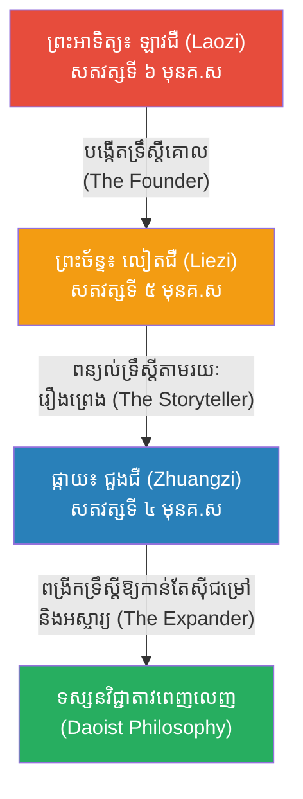

# The Three Pillars of Daoism: Laozi, Liezi, and Zhuangzi (សសរស្តម្ភទាំង ៣ នៃសាសនាតាវ)

**Author:** ichamrong  
**Date:** 2026-05-23  
**Tags:** #daoism #laozi #liezi #zhuangzi #philosophy #lineage  
**Category:** Biographies  
**Read Time:** ~8 min  

---

## 📌 មាតិកា (Table of Contents)
- [១. ខ្សែស្រឡាយនៃសាសនាតាវ (The Daoist Lineage)](#1)
- [២. ភាពខុសគ្នារវាងអ្នកទាំង ៣ (Differences Between the Three Masters)](#2)
- [៣. គម្ពីរទាំង ៣ (The Three Daoist Classics)](#3)
- [៤. ទំនាក់ទំនងជាមួយខុងជឺ (Relationship with Confucianism)](#4)
- [🔗 ឯកសារទាក់ទង (Related Topics)](#related-topics)

---

## ១. ខ្សែស្រឡាយនៃសាសនាតាវ (The Daoist Lineage)

ផ្ទុយពីសាសនាខុងជឺ ដែលមានខុងជឺជាគ្រូ ហើយមានសិស្សរាប់ពាន់នាក់ដើរតាម (៧២ នាក់ជាសិស្សឯក) **សាសនាតាវ (Daoism)** មិនមានទម្រង់ជាសាលារៀន ឬការបញ្ជូនចំណេះដឹងពីគ្រូទៅសិស្សដោយផ្ទាល់នោះទេ។

អ្នកប្រាជ្ញតាវនិយម ច្រើនតែជាអ្នករស់នៅឯកោនៅតាមព្រៃភ្នំ ដោយសង្កេតមើលធម្មជាតិ។ ទោះជាយ៉ាងណាក៏ដោយ នៅក្នុងប្រវត្តិសាស្ត្រចិន មានទស្សនវិទូ **៣ រូប** ដែលត្រូវបានគេចាត់ទុកថាជា **"សសរស្តម្ភនៃទស្សនវិជ្ជាសាសនាតាវ (The Three Pillars of Daoism)"** ដែលមានទំនាក់ទំនងគ្នាទៅតាមសម័យកាល (Time Period) និងការវិវឌ្ឍទ្រឹស្តី៖

---

## ២. ភាពខុសគ្នារវាងអ្នកទាំង ៣ (Differences Between the Three Masters)

ទោះបីជាអ្នកទាំង ៣ ជឿលើ "តាវ (Dao)" ដូចគ្នាក៏ដោយ ប៉ុន្តែរបៀបនៃការបង្រៀននិងការផ្តោតសំខាន់របស់ពួកគេ មានភាពខុសគ្នា៖

1. **ឡាវជឺ (Laozi):** សរសេរជាទម្រង់កំណាព្យខ្លីៗ (Poetry) មានលក្ខណៈអរូបី និងទូលំទូលាយ។ គាត់ផ្តោតសំខាន់ទៅលើ **ការដឹកនាំប្រទេស** ដោយប្រាប់ក្សត្រឱ្យដឹកនាំដោយការមិនប្រើអំណាច (អ៊ូវៃ - Wu Wei)។
2. **លៀតជឺ (Liezi):** សរសេរជាទម្រង់រឿងព្រេងប្រៀបប្រដៅ (Parables & Fables)។ គាត់ផ្តោតលើ **សកម្មភាពប្រចាំថ្ងៃ និងការអនុវត្តជាក់ស្តែង** ដូចជារឿង "បុរសចាស់រើភ្នំ" ឬ "អ្នកបាញ់ធ្នូ"។ ទ្រឹស្តីដ៏ល្បីរបស់គាត់គឺ "ការជិះលើខ្យល់ (Riding the Wind)" ពោលគឺបណ្តែតខ្លួនតាមព្រហ្មលិខិត។
3. **ជួងជឺ (Zhuangzi):** សរសេរជាទម្រង់រឿងកំប្លែង ការសន្ទនា និងការប្រឌិតដ៏អស្ចារ្យ។ គាត់ផ្តោតលើ **សេរីភាពផ្លូវចិត្តរបស់បុគ្គល (Spiritual Freedom)** និងមិនខ្វល់ខ្វាយពីរឿងនយោបាយសោះឡើយ។ រឿង "សុបិនមេអំបៅ" បង្ហាញពីការដោះលែងចិត្តឱ្យរួចផុតពីការប្រកាន់ "ត្រូវ-ខុស"។

---

## ៣. គម្ពីរទាំង ៣ (The Three Daoist Classics)

ស្នាដៃរបស់អ្នកទាំង ៣ បានក្លាយជាគម្ពីរផ្លូវការរបស់សាសនាតាវ៖

1. **Dao De Jing (តាវតឺជិង):** និពន្ធដោយ ឡាវជឺ។
2. **The Liezi (គម្ពីរនៃភាពទទេស្អាតដ៏ល្អឥតខ្ចោះ):** និពន្ធដោយ លៀតជឺ។
3. **The Zhuangzi (គម្ពីរជួងជឺ):** និពន្ធដោយ ជួងជឺ។

> *គម្ពីរទាំង ៣ នេះតែងតែបំពេញឱ្យគ្នាទៅវិញទៅមក។ បើអ្នកចង់យល់ពីច្បាប់ធម្មជាតិទាំងមូល អ្នកត្រូវអាន ឡាវជឺ。 បើអ្នកចង់អានរឿងនិទានសប្បាយៗមានន័យអប់រំ អ្នកត្រូវអាន លៀតជឺ。 ហើយបើអ្នកចង់រំដោះខ្លួនពីភាពតានតឹងនិងគំនាបសង្គម អ្នកត្រូវអាន ជួងជឺ។*

---

## ៤. ទំនាក់ទំនងជាមួយខុងជឺ (Relationship with Confucianism)

សំនួរដែលតែងតែសួរនោះគឺ៖ **តើ ឡាវជឺ លៀតជឺ និង ជួងជឺ មានពាក់ព័ន្ធនឹងខុងជឺ (Confucius) ដែរឬទេ?**

**ចម្លើយគឺ៖ ពួកគេមិនមែនជាខ្សែស្រឡាយខុងជឺទេ ផ្ទុយទៅវិញ ពួកគេគឺជា "គូប្រជែងទស្សនវិជ្ជា (Philosophical Rivals)" របស់ខុងជឺ។**

*   នៅក្នុងសៀវភៅរបស់ ឡាវជឺ លៀតជឺ និងជួងជឺ ពួកគេតែងតែលើកយកឈ្មោះ "ខុងជឺ" មកសរសេរ។ ប៉ុន្តែពួកគេមិនមែនយកមកសរសើរនោះទេ គឺយកមកធ្វើជាតួអង្គ "មនុស្សដែលគិតច្រើនពេក តឹងរ៉ឹងពេក និងធ្វើឱ្យខ្លួនឯងហត់នឿយអត់ប្រយោជន៍" ដើម្បីចំអកឱ្យទស្សនវិជ្ជាខុងជឺ។
*   ខុងជឺប្រៀបដូចជា **"សាលារៀន និង ការិយាល័យធ្វើការ"** ដែលមានច្បាប់វិន័យតឹងរ៉ឹង ខណៈដែល តាវនិយម (ឡាវជឺ លៀតជឺ ជួងជឺ) ប្រៀបដូចជា **"ថ្ងៃសម្រាកចុងសប្តាហ៍ និង ការដើរលេងក្នុងព្រៃ"** ដែលផ្តល់នូវសេរីភាព និងការលំហែរចិត្ត។ 

ដោយសារទស្សនវិជ្ជាទាំងពីរនេះបំពេញឱ្យគ្នា (ទោះបីជាផ្ទុយគ្នាក៏ដោយ) ទើបជនជាតិចិនតែងតែនិយាយថា៖ **"ពេលធ្វើការ ខ្ញុំគឺជាអ្នកខុងជឺ។ ប៉ុន្តែពេលចូលនិវត្តន៍ ខ្ញុំគឺជាអ្នកតាវនិយម"**។

---

## 🔗 ឯកសារទាក់ទង (Related Topics)
* [ជីវប្រវត្តិឡាវជឺ (Laozi Biography)](../laozi/01-laozi-biography.md)
* [ជីវប្រវត្តិលៀតជឺ (Liezi Biography)](../liezi/01-liezi-biography.md)
* [ជីវប្រវត្តិជួងជឺ (Zhuangzi Biography)](../zhuangzi/01-zhuangzi-biography.md)
