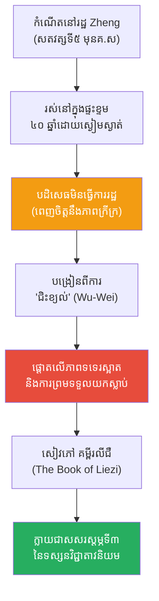

# The Biography of Liezi (ជីវប្រវត្តិ លីជឺ)

**Author:** ichamrong  
**Date:** 2026-05-26  
**Tags:** #liezi #biography #daoism #taoism #philosophy #wu-wei #fatalism  
**Category:** Biographies  
**Read Time:** ~15 min  

---

## 📌 មាតិកា (Table of Contents)
- [សេចក្តីផ្តើម៖ កាយវិភាគវិទ្យានៃអ្នកប្រាជ្ញជិះខ្យល់ (The Anatomy of the Wind Rider)](#intro)
- [១. កំណើត និងបុគ្គលិកលក្ខណៈអាថ៌កំបាំង (Birth & The Mysterious Figure)](#1)
- [២. ទស្សនវិជ្ជានៃភាពទទេរស្អាត (The Philosophy of Emptiness)](#2)
- [៣. រឿងព្រេងនៃការជិះខ្យល់ (The Legend of Riding the Wind)](#3)
- [៤. ព្រហ្មលិខិត និងការបោះបង់ការប្រឹងប្រែង (Fatalism & Letting Go)](#4)
- [៥. លីជឺ និងអ្នកប្រាជ្ញតាវផ្សេងទៀត (Liezi vs. Other Daoist Sages)](#5)
- [៦. ចិត្តសាស្ត្រ និងទស្សនវិជ្ជាពីកំណើតដល់ស្លាប់ (Psychology & Philosophy from Birth to Death)](#6)
- [៧. បញ្ហាប្រឈម និងភាពចម្រូងចម្រាស (Challenges and Controversies)](#7)
- [៨. កេរដំណែល (Legacy)](#8)
- [៩. តើលីជឺបានបំផុសគំនិតអ្វីខ្លះ? (What Did Liezi Inspire?)](#9)
- [សេចក្តីសន្និដ្ឋាន (Conclusion)](#conclusion)
- [🔗 ឯកសារទាក់ទង (Related Topics)](#related-topics)
- [ឯកសារយោង (References)](#references)

---

## សេចក្តីផ្តើម៖ កាយវិភាគវិទ្យានៃអ្នកប្រាជ្ញជិះខ្យល់ (The Anatomy of the Wind Rider)

> **«អ្នកដែលដឹងពីរបៀបឈប់ នឹងមិនជួបគ្រោះថ្នាក់។ អ្នកដែលដឹងពីរបៀបបោះបង់ នឹងមិនបាត់បង់អ្វីឡើយ។»**

សាកស្រមៃមើលពីទិដ្ឋភាពនេះ៖ នៅក្នុងយុគសម័យដែលមនុស្សគ្រប់គ្នាកំពុងខិតខំកសាងកេរ្តិ៍ឈ្មោះ ស្វែងរកទ្រព្យសម្បត្តិ និងប្រជែងគ្នាដើម្បីអំណាច (សម័យនគរចម្បាំងចិន) មានបុរសម្នាក់រស់នៅយ៉ាងស្ងៀមស្ងាត់បំផុតនៅក្នុងផ្ទះខ្ទមតូចមួយអស់រយៈពេល ៤០ ឆ្នាំ ដោយសឹងតែមិនមាននរណាម្នាក់ស្គាល់ឈ្មោះគាត់។ គាត់មិនដែលត្អូញត្អែរអំពីភាពក្រីក្រ មិនដែលស្វែងរកការគាំទ្រពីស្តេចអង្គណា ហើយក៏មិនខ្វល់ថាមានគេស្តាប់គាត់ឬអត់នោះទេ។

រឿងព្រេងបានកត់ត្រាថា គាត់អាច "ជិះខ្យល់ហោះហើរ" បាន។ នេះមិនមែនជាការហោះហើរដោយប្រើមន្តអាគមទេ ប៉ុន្តែវាជារូបភាពប្រៀបធៀបដ៏ជ្រាលជ្រៅបំផុតមួយនៃ "សេរីភាពផ្លូវចិត្ត"។ នៅពេលដែលចិត្តរបស់អ្នកមិនជាប់ជំពាក់នឹងភាពភ័យខ្លាច ការចង់បាន ឬសូម្បីតែជីវិតនិងសេចក្តីស្លាប់ អ្នកនឹងស្រាលដូចជាស្លាបនកដែលអាចហោះហើរតាមខ្យល់ធម្មជាតិ។ គាត់គឺជាសសរស្តម្ភទីពីរនៃទស្សនវិជ្ជាតាវ (Daoism) បន្ទាប់ពីឡៅជឺ ប៉ុន្តែបែរជាត្រូវគេមើលរំលងបំផុត។ នេះគឺជារឿងរ៉ាវរបស់ **លីជឺ (Liezi / Lie Yukou)**។

---

## ១. កំណើត និងបុគ្គលិកលក្ខណៈអាថ៌កំបាំង (Birth & The Mysterious Figure)

លីជឺ (Liezi) មានឈ្មោះពិតថា **លី យូខូវ (Lie Yukou)**។ គាត់ត្រូវបានគេជឿថារស់នៅក្នុងរដ្ឋ Zheng (ចឹង) ក្នុងអំឡុងសតវត្សទី ៥ មុនគ្រឹស្តសករាជ (បន្ទាប់ពីឡៅជឺ និងខុងជឺ ប៉ុន្តែមុនជួងជឺ)។

ដូចគ្នានឹងឡៅជឺដែរ ប្រវត្តិជីវិតពិតប្រាកដរបស់គាត់មានតិចតួចបំផុត។ អ្វីដែលគេដឹងគឺគាត់ជានិមិត្តរូបនៃ "ភាពស្ងប់ស្ងាត់ និងការមិនចង់បាន"។ ផ្ទុយពីអ្នកប្រាជ្ញដែលចូលចិត្តជជែកដេញដោល គាត់រស់នៅក្នុងភាពឯកោ ពេញចិត្តនឹងជីវិតសាមញ្ញ និងបដិសេធរាល់ការអញ្ជើញឱ្យចូលបម្រើការងាររដ្ឋបាល។ សៀវភៅដែលដាក់ឈ្មោះតាមគាត់ គឺ **គម្ពីរលីជឺ (The Book of Liezi)** គឺជាបណ្តុំនៃរឿងព្រេង រឿងប្រៀបប្រដូច និងទស្សនវិជ្ជា ដែលពោរពេញដោយភាពកំប្លុកកំប្លែង និងការចំអកឱ្យអំនួតរបស់មនុស្ស។

> 💡 **មេរៀនពីភាពសាមញ្ញ (The Lesson of Obscurity):** លីជឺបង្រៀនថា ការខិតខំធ្វើឱ្យខ្លួនឯងលេចធ្លោ គឺជាការបង្កើតសត្រូវនិងសេចក្តីទុក្ខ។ គាត់ជ្រើសរើសរស់នៅដូចជា "ស្រមោល" — មានវត្តមាន ប៉ុន្តែមិនបង្កើតបន្ទុកដល់នរណាម្នាក់។

---

## ២. ទស្សនវិជ្ជានៃភាពទទេរស្អាត (The Philosophy of Emptiness)

ចំណុចស្នូលនៃទស្សនវិជ្ជារបស់លីជឺ គឺ **ភាពទទេរស្អាត (Emptiness / Xu)** និង **ធម្មជាតិនិយម (Naturalism)**។

ខណៈពេលដែលឡៅជឺផ្តោតលើ "តាវ" ជាប្រភពនៃអ្វីៗទាំងអស់ លីជឺផ្តោតលើរបៀបដែលមនុស្សគួរបន្ស៊ាំខ្លួនទៅនឹងការផ្លាស់ប្តូរនៃធម្មជាតិ ដោយមិនប្រឆាំងនឹងវា។ លោកជឿថា អ្វីៗទាំងអស់កើតចេញពីភាពទទេរស្អាត ហើយនឹងត្រឡប់ទៅរកភាពទទេរស្អាតវិញ។ ដូច្នេះ ការខិតខំប្រឹងប្រែងដើម្បីរក្សាទុកអ្វីមួយ (ទ្រព្យសម្បត្តិ យុវវ័យ ឬជីវិត) គឺជារឿងអសារបង់ និងផ្ទុយពីធម្មជាតិ។ សេចក្តីសុខពិតប្រាកដ កើតឡើងនៅពេលដែលយើងព្រមទទួលយក "ភាពទទេរ" នេះ ថាជាផ្ទះពិតប្រាកដរបស់យើង។

---

## ៣. រឿងព្រេងនៃការជិះខ្យល់ (The Legend of Riding the Wind)

នៅក្នុងសៀវភៅរបស់ជួងជឺ (Zhuangzi) ជួងជឺបានសរសើរលីជឺថា៖ *"លីជឺ អាចជិះខ្យល់ហោះហើរបានយ៉ាងស្រាល និងស្រស់ស្អាតបំផុត។ គាត់ទៅបាត់រយៈពេល ១៥ ថ្ងៃ ទើបត្រឡប់មកវិញ។ គាត់មិនខ្វល់ខ្វាយពីការស្វែងរកសេចក្តីសុខនៅលើផែនដីឡើយ។"*

តើ "ការជិះខ្យល់" នេះមានន័យដូចម្តេច? វាជាការប្រៀបធៀបផ្លូវចិត្តអំពី **អ៊ូវ៉ី (Wu-Wei / Non-action)** ក្នុងកម្រិតកំពូល។ នៅពេលដែលអ្នកចុះចាញ់នឹងកម្លាំងធម្មជាតិទាំងស្រុង លែងមាន "អត្តា (Ego)" លែងមានការចង់គ្រប់គ្រងស្ថានការណ៍ អ្នកនឹងធ្វើដំណើរទៅតាមខ្សែទឹកឬកម្លាំងខ្យល់ដោយមិនចាំបាច់ប្រឹងប្រែង (Effortless state of flow)។ ការហោះហើរ មិនមែនជាការប្រឆាំងនឹងទំនាញផែនដីទេ តែជាការប្រគល់ខ្លួនឱ្យទៅបរិយាកាស (Surrendering to the Dao)។

---

## ៤. ព្រហ្មលិខិត និងការបោះបង់ការប្រឹងប្រែង (Fatalism & Letting Go)

លក្ខណៈពិសេសបំផុតរបស់លីជឺ ដែលខុសពីអ្នកប្រាជ្ញតាវដទៃ គឺការសង្កត់ធ្ងន់លើ **ព្រហ្មលិខិត ឬ ជោគវាសនា (Fatalism)**។ 

លីជឺបង្រៀនថា អាយុជីវិត ភាពក្រីក្រ ភាពមានបាន សុទ្ធតែត្រូវបានកំណត់ដោយធម្មជាតិ (Fate/Destiny) តាំងពីដំបូងមកម្ល៉េះ។ ការភ័យខ្លាចសេចក្តីស្លាប់ គឺជារឿងឆោតល្ងង់បំផុត ព្រោះសេចក្តីស្លាប់គ្រាន់តែជាការ "ត្រឡប់ទៅផ្ទះវិញ" បន្ទាប់ពីការធ្វើដំណើរដ៏នឿយហត់។ 

នៅក្នុងរឿងប្រៀបប្រដូចមួយ គាត់បានចំអកឱ្យមនុស្សដែលដើររក "ថ្នាំអមតៈ" ថា ពួកគេកំពុងព្យាយាមបង្ខំឱ្យធម្មជាតិដើរថយក្រោយ។ ការទទួលយកជោគវាសនាដោយភាពស្ងប់ស្ងាត់ (Amor Fati) គឺជាកូនសោរនៃសន្តិភាពផ្លូវចិត្តរបស់លីជឺ។

---

## ៥. លីជឺ និងអ្នកប្រាជ្ញតាវផ្សេងទៀត (Liezi vs. Other Daoist Sages)

លីជឺ ឈរនៅចន្លោះ ឡៅជឺ (Laozi) និង ជួងជឺ (Zhuangzi) បង្កើតបានជាសសរស្តម្ភទាំង ៣ នៃលទ្ធិតាវ។

*   **ឡៅជឺ (Laozi):** សរសេរក្បួនច្បាប់តាវក្នុងទម្រង់ជាកំណាព្យ ទស្សនវិជ្ជាជ្រាលជ្រៅ និងច្រើនតែទាក់ទងនឹងការដឹកនាំរដ្ឋ (The Statesman)।
*   **ជួងជឺ (Zhuangzi):** សរសេររឿងប្រៀបប្រដូចវែងៗ កំប្លែង វាយប្រហារទស្សនវិជ្ជាខុងជឺដោយចំៗ និងផ្តោតលើសេរីភាពបុគ្គល (The Free Spirit)।
*   **លីជឺ (Liezi):** ផ្តោតលើជីវិតប្រចាំថ្ងៃ ការទទួលយកសេចក្តីស្លាប់ និងការរស់នៅប្រកបដោយភាពសាមញ្ញ (The Everyday Sage)। គាត់ប្រើប្រាស់រឿងនិទានប្រជាប្រិយ ដើម្បីពន្យល់ពីតាវ។

---

## ៦. ចិត្តសាស្ត្រ និងទស្សនវិជ្ជាពីកំណើតដល់ស្លាប់ (Psychology & Philosophy from Birth to Death)

ទស្សនវិជ្ជាផ្លូវចិត្តរបស់លីជឺ គឺជាថ្នាំសណ្តំសម្រាប់អ្នកដែលរងទុក្ខដោយសារការគិតច្រើនពេក (Overthinking)៖

*   **ការបោះបង់ការប្រកួតប្រជែង (Non-Contention):** គាត់បង្រៀនថា "អ្នកដែលឈ្នះការឈ្លោះប្រកែក គឺអ្នកដែលមិនបានចូលរួមឈ្លោះប្រកែកតាំងពីដំបូង។" ការឈ្លោះដណ្តើមត្រូវខុស ជារឿងអត់ប្រយោជន៍។
*   **ការទទួលយកភាពចៃដន្យ (Embracing Randomness):** គាត់ជឿថាអ្វីៗកើតឡើងដោយសារច្បាប់ធម្មជាតិ មិនមែនដោយសារមានអាទិទេពណាមួយមកដាក់ទោស ឬឱ្យរង្វាន់ទេ។ ពេលយើងឈឺ កុំបន្ទោសថាខ្លួនឯងធ្វើបាប គឺគ្រាន់តែជារដូវកាលនៃធម្មជាតិប៉ុណ្ណោះ។
*   **ការព្យាបាលការភ័យខ្លាច (Curing Fear):** គាត់មានរឿងនិទានមួយអំពី "បុរសរដ្ឋឈី ដែលខ្លាចមេឃធ្លាក់សង្កត់"។ លីជឺចំអកឱ្យមនុស្សដែលខ្ជះខ្ជាយថាមពលផ្លូវចិត្ត ទៅព្រួយបារម្ភពីរឿងដែលខ្លួនមិនអាចគ្រប់គ្រងបាន។

---

## ៧. បញ្ហាប្រឈម និងភាពចម្រូងចម្រាស (Challenges and Controversies)

ទស្សនវិជ្ជារបស់លីជឺ ក៏ប្រឈមមុខនឹងការរិះគន់ជាច្រើនផងដែរ៖

1.  **ភាពទុទិដ្ឋិនិយម ឬការបោះបង់ (Fatalistic Apathy):** អ្នករិះគន់ (ជាពិសេសខាងលទ្ធិខុងជឺ) យល់ថា ការជឿលើ "ជោគវាសនា" ខ្លាំងពេករបស់លីជឺ ធ្វើឱ្យមនុស្សបាត់បង់ការខិតខំប្រឹងប្រែង ក្លាយជាមនុស្សអសកម្ម និងមិនមានទំនួលខុសត្រូវក្នុងសង្គម។
2.  **បញ្ហានៃភាពជាអ្នកនិពន្ធ (Authorship Dispute):** អ្នកប្រាជ្ញសម័យទំនើបភាគច្រើនជឿថា សៀវភៅ "លីជឺ (Liezi)" មិនមែនសរសេរដោយលោកផ្ទាល់នៅសតវត្សទី៥ មុនគ.ស នោះទេ ប៉ុន្តែវាត្រូវបានចងក្រងឡើងនៅសតវត្សទី៣ នៃគ.ស ក្នុងសម័យរាជវង្ស Jin ដោយប្រមូលផ្តុំរឿងព្រេងតាវផ្សេងៗបញ្ជូលគ្នា។
3.  **អត្ថិភាពរបស់គាត់ (Did he exist?):** ដូចឡៅជឺដែរ ប្រវត្តិវិទូខ្លះសង្ស័យថា លីជឺ ប្រហែលជាគ្រាន់តែជាតួអង្គប្រឌិត ដែលជួងជឺបង្កើតឡើងដើម្បីប្រើប្រាស់ក្នុងសាច់រឿងរបស់ខ្លួនប៉ុណ្ណោះ។

---

## ៨. កេរដំណែល (Legacy)

ទោះបីជាសៀវភៅ "លីជឺ" មានភាពចម្រូងចម្រាសរឿងប្រភពដើមក៏ដោយ ក៏វាត្រូវបានរាជវង្សថាង (Tang Dynasty) ប្រកាសជាគម្ពីរផ្លូវការរបស់សាសនាតាវ រួមជាមួយគម្ពីររបស់ឡៅជឺ និងជួងជឺ ក្រោមឈ្មោះថា **Chongxu Zhenjing (គម្ពីរពិតនៃភាពទទេរស្អាតកំពូល)**។

---

## ៩. តើលីជឺបានបំផុសគំនិតអ្វីខ្លះ? (What Did Liezi Inspire?)

នេះគឺជាបញ្ជីរាយនាមរឿងរ៉ាវ និងគោលគំនិតចំនួន ១៥ ដែលលីជឺបានបំផុសគំនិត និងបន្សល់ទុកជាមរតកសម្រាប់មនុស្សជាតិ៖

1.  **គម្ពីរលីជឺ (The Book of Liezi):** សៀវភៅអក្សរសាស្ត្រតាវដែលពោរពេញដោយរឿងនិទានប្រជាប្រិយចិន (Folklore) ដ៏មានតម្លៃបំផុត។
2.  **ទស្សនៈព្រហ្មលិខិតតាវនិយម (Daoist Fatalism):** ការបង្រៀនឱ្យព្រមទទួលយកជោគវាសនាដោយសន្តិភាពចិត្ត។
3.  **រឿងបុរសរដ្ឋឈីខ្លាចមេឃធ្លាក់ (The Man of Qi who Feared the Sky):** ក្លាយជាសុភាសិតចិន "Qiren Youtian" (杞人憂天) ប្រើសម្រាប់ប្រៀបធៀបមនុស្សដែលខ្វល់ខ្វាយពីរឿងមិនគួរខ្វល់។
4.  **រឿងតាចាស់យូកុងប្តូរភ្នំ (The Foolish Old Man Removes the Mountains):** រឿងនិទាននៅក្នុងសៀវភៅលីជឺ ដែលក្រោយមកលោក ម៉ៅ សេទុង បានយកមកធ្វើជាសុន្ទរកថាដ៏ល្បីល្បាញ ដើម្បីបំផុសគំនិតប្រជាជនចិនឱ្យតស៊ូជំនះឧបសគ្គ។
5.  **ការជិះខ្យល់ (Riding the Wind):** ក្លាយជារូបភាពសិល្បៈនិងអក្សរសាស្ត្រតំណាងឱ្យភាពសេរីខាងវិញ្ញាណ និងអំណាចអាគមក្នុងរឿងប្រលោមលោកក្បាច់គុនចិន។
6.  **ការបង្រៀនតាមរយៈរឿងនិទាន (Allegorical Teaching):** គាត់គឺជាអ្នកត្រួសត្រាយផ្លូវក្នុងការប្រើប្រាស់រឿងនិទានសត្វ និងមនុស្សធម្មតា ដើម្បីបង្រៀនទស្សនវិជ្ជាជ្រៅៗ។
7.  **សិល្បៈនៃការចាញ់ (The Art of Losing):** ទស្សនវិជ្ជាដែលបង្រៀនថា ការស្គាល់ពីរបៀបចាញ់ និងរបៀបឈប់ គឺជាជ័យជម្នះដ៏ធំបំផុត។
8.  **អក្សរសាស្ត្រហ្សេន (Zen Koans):** របៀបសរសេររឿងខ្លីៗបង្កប់អត្ថន័យបញ្ច្រាសរបស់គាត់ បានជះឥទ្ធិពលដល់អក្សរសាស្ត្រសាសនាហ្សេន (Zen) នៅប្រទេសជប៉ុន។
9.  **ការបដិសេធថ្នាំអមតៈ (Rejection of Immortality):** គាត់បានរិះគន់ពួកអភិជនដែលចង់រស់នៅរហូត ដោយពន្យល់ថាជីវិតអមតៈគឺជាការបំពានច្បាប់សកលលោក។
10. **គោលការណ៍នៃក្តីសុបិន និងការពិត (Dream vs Reality):** រឿងនិទានរបស់គាត់ជាច្រើនចោទសួរពីព្រំដែនរវាងការយល់សប្តិ និងជីវិតពិត ដែលស្រដៀងនឹងគំនិតរបស់ Descartes។
11. **ការអប់រំកុមារ (Children's Fables):** រឿងនិទានជាច្រើនក្នុងសៀវភៅលីជឺ ត្រូវបានគេយកមកធ្វើជាសៀវភៅអានសម្រាប់កុមារចិនរហូតដល់សព្វថ្ងៃ។
12. **ភាពស្មើគ្នានៃគ្រប់ជីវិត (Egalitarianism):** ការបង្រៀនថា ជីវិតរបស់ព្រះរាជា និងជីវិតរបស់អ្នកសុំទាន គឺមានតម្លៃស្មើគ្នានៅចំពោះមុខសេចក្តីស្លាប់ (Dao)។
13. **ការព្យាបាលចិត្តសាស្ត្រ (Psychological Detachment):** ការប្រើប្រាស់ "ភាពទទេរ" ដើម្បីផ្តាច់ខ្លួនពីការឈឺចាប់ខាងផ្លូវចិត្ត។
14. **ឥទ្ធិពលលើកវីនិពន្ធ:** កវីនាសម័យរាជវង្សថាង (ដូចជា Li Bai ជាដើម) តែងតែយកស្មារតីសេរីភាពហោះហើររបស់លីជឺ មកសរសេរក្នុងកំណាព្យរបស់ខ្លួន។
15. **ការតស៊ូដោយភាពស្ងៀមស្ងាត់ (Quiet Resistance):** ការបដិសេធមិនចូលរួមលេងល្បែងអំណាច គឺជាទម្រង់នៃការតស៊ូដ៏មានឥទ្ធិពលមួយនៅក្នុងយុគសម័យផ្តាច់ការ។

---

## សេចក្តីសន្និដ្ឋាន (Conclusion)

> **«កុំខ្វល់ខ្វាយពីអាយុជីវិត កុំខ្វល់ខ្វាយពីកិត្តិយស។ ការបោះបង់ការប្រកួតប្រជែង គឺជាការទទួលបានជ័យជម្នះដ៏ធំបំផុត។»**

នៅក្នុងប្រវត្តិសាស្ត្រទស្សនវិជ្ជា លីជឺ ប្រៀបដូចជាខ្យល់ដែលគាត់ចូលចិត្តនិយាយអំពីអញ្ចឹង — គាត់គ្មានរូបរាង គ្មានការទាមទារចំណាប់អារម្មណ៍ ប៉ុន្តែឥទ្ធិពលរបស់គាត់នៅតែបន្តបក់បោក។ ខណៈពេលដែលអ្នកប្រាជ្ញដទៃព្យាយាមផ្តល់ចម្លើយដ៏ស្មុគស្មាញដល់បញ្ហារបស់មនុស្ស លីជឺគ្រាន់តែញញឹមហើយប្រាប់យើងថា បញ្ហាភាគច្រើនរបស់យើងកើតឡើងដោយសារតែយើង "ចង់បាន" ច្រើនពេក។ តាមរយៈការព្រមទទួលយកភាពទទេរស្អាត និងការចុះចាញ់នឹងជោគវាសនា លីជឺបានបង្រៀនសិល្បៈដ៏កម្របំផុតមួយដល់មនុស្សជាតិ នោះគឺ "សិល្បៈនៃការមិនធ្វើអ្វីសោះ ហើយនៅតែមានសេចក្តីសុខ (The Art of Being Content with Nothing)"។

---

## 🔗 ឯកសារទាក់ទង (Related Topics)
* [ជីវប្រវត្តិឡៅជឺ (Laozi Biography)](../laozi/01-laozi-biography.md)
* [ជីវប្រវត្តិជួងជឺ (Zhuangzi Biography)](../zhuangzi/01-zhuangzi-biography.md)
* [ខ្សែស្រឡាយទស្សនវិជ្ជាតាវ (Daoist Lineage)](../laozi/02-daoist-lineage.md)

## ឯកសារយោង (References)

*   **The Book of Liezi (Liezi)** — A foundational Daoist text attributed to Lie Yukou, translated into English by A.C. Graham, containing fables and philosophical allegories.
*   **Zhuangzi** — The text that frequently references Liezi as a master of Daoist non-action and the literal/metaphorical "rider of the wind."

---

*Last updated: 2026-05-26*
