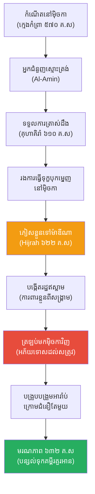

# The Biography of Prophet Muhammad (ជីវប្រវត្តិ ព្យាការី ម៉ូហាម៉ាត់)

**Author:** ichamrong  
**Date:** 2026-05-26  
**Tags:** #muhammad #biography #islam #religion #history #prophet  
**Category:** Biographies  
**Read Time:** ~15 min  

---

## 📌 មាតិកា (Table of Contents)
- [សេចក្តីផ្តើម៖ កាយវិភាគវិទ្យានៃអ្នកនាំសារ (The Anatomy of a Messenger)](#intro)
- [១. កុមារភាពកំព្រា និងបុរសស្មោះត្រង់ (The Orphan & Al-Amin)](#1)
- [២. ការត្រាស់ដឹងនៅគុហាគិរ៉ា (The First Revelation)](#2)
- [៣. ការប្រឆាំង និងការធ្វើទុក្ខបុកម្នេញនៅម៉ិចកា (Opposition in Mecca)](#3)
- [៤. ការធ្វើចំណាកស្រុកទៅម៉ាឌីណា (The Hijrah)](#4)
- [៥. ការត្រឡប់មកវិញដោយសន្តិវិធី និងមរណភាព (The Peaceful Conquest & Death)](#5)
- [៦. ចិត្តសាស្ត្រ និងទស្សនវិជ្ជាពីកំណើតដល់ស្លាប់ (Psychology & Philosophy from Birth to Death)](#6)
- [៧. បញ្ហាប្រឈម និងការលំបាកបំផុត (The Greatest Challenges)](#7)
- [៨. កេរដំណែល (Legacy)](#8)
- [៩. តើម៉ូហាម៉ាត់បានបំផុសគំនិតអ្វីខ្លះ? (What Did Muhammad Inspire?)](#9)
- [សេចក្តីសន្និដ្ឋាន (Conclusion)](#conclusion)
- [🔗 ឯកសារទាក់ទង (Related Topics)](#related-topics)
- [ឯកសារយោង (References)](#references)

---

## សេចក្តីផ្តើម៖ កាយវិភាគវិទ្យានៃអ្នកនាំសារ (The Anatomy of a Messenger)

> **«អ្នកខ្លាំងពូកែ មិនមែនជាអ្នកដែលយកឈ្នះគេដោយការវាយតប់គ្នានោះទេ ប៉ុន្តែអ្នកខ្លាំងពូកែ គឺអ្នកដែលចេះគ្រប់គ្រងខ្លួនឯងនៅពេលខឹង។»**

សាកស្រមៃមើលពីទិដ្ឋភាពនេះ៖ នៅក្នុងសតវត្សទី៧ ឧបទ្វីបអារ៉ាប់ គឺជាវាលខ្សាច់ដ៏ស្ងួតហួតហែង ដែលពោរពេញទៅដោយកុលសម្ព័ន្ធដែលតែងតែកាប់សម្លាប់គ្នាដោយសារជម្លោះបន្តិចបន្តួច។ ពួកគេមិនមានរដ្ឋាភិបាលកណ្តាល មិនមានច្បាប់រួម និងមិនចេះអក្សរ។ ពួកគេគោរពបូជារូបសំណាករាប់រយនៅក្នុងទីក្រុងម៉ិចកា។ នៅក្នុងសង្គមដ៏ព្រៃផ្សៃនេះ មានបុរសម្នាក់ដែលជាក្មេងកំព្រា មិនចេះអាន មិនចេះសរសេរ និងធ្លាប់តែជាអ្នកគង្វាលចៀម បានក្រោកឈរឡើងប្រឆាំងនឹងប្រពៃណីទាំងមូលរបស់ទីក្រុងគាត់។

គាត់ត្រូវបានគេប្រមាថ គប់ដុំថ្ម និងតាមសម្លាប់ ប៉ុន្តែគាត់មិនចុះចាញ់។ ក្នុងរយៈពេលត្រឹមតែ ២៣ ឆ្នាំ បុរសចំណាស់ម្នាក់នេះមិនត្រឹមតែបានបង្រួបបង្រួមឧបទ្វីបអារ៉ាប់ទាំងមូលឱ្យស្ថិតក្រោមជំនឿតែមួយប៉ុណ្ណោះទេ ថែមទាំងបានបង្កើតច្បាប់ រៀបចំសង្គម និងកសាងចក្រភពមួយដែលក្រោយមកបានវាយដណ្តើមយកទឹកដីពីចក្រភពរ៉ូម និងពែរ្ស។ សៀវភៅដែលគាត់បាននាំមក បានក្លាយជាធម្មនុញ្ញជីវិតសម្រាប់មនុស្សជាង ២ ពាន់លាននាក់នៅសព្វថ្ងៃនេះ។ នេះគឺជារឿងរ៉ាវរបស់ **ព្យាការី ម៉ូហាម៉ាត់ (Prophet Muhammad, Peace Be Upon Him)**។

---

## ១. កុមារភាពកំព្រា និងបុរសស្មោះត្រង់ (The Orphan & Al-Amin)

ម៉ូហាម៉ាត់ កើតនៅឆ្នាំ ៥៧០ នៃគ.ស នៅទីក្រុងម៉ិចកា (Mecca) ដែលជាមជ្ឈមណ្ឌលពាណិជ្ជកម្ម និងសាសនាដ៏សំខាន់របស់អារ៉ាប់។ ជីវិតរបស់គាត់ចាប់ផ្តើមដោយក្តីសោកសៅ៖ ឪពុកបានស្លាប់មុនពេលគាត់កើត ម្តាយបានស្លាប់ពេលគាត់អាយុ ៦ ឆ្នាំ ហើយជីតាដែលចិញ្ចឹមគាត់ក៏បានស្លាប់ពេលគាត់អាយុ ៨ ឆ្នាំ។ ទីបំផុត គាត់ត្រូវបានចិញ្ចឹមដោយពូរបស់គាត់ឈ្មោះ **អាប៊ូ តាលីប (Abu Talib)**។

ដោយសារភាពក្រីក្រ ម៉ូហាម៉ាត់ត្រូវធ្វើជាអ្នកគង្វាលចៀម និងក្រោយមកក្លាយជាអ្នកដើរជំនួញតាមផ្លូវឆ្ងាយ (Caravan merchant)។ ទោះបីជារស់នៅក្នុងសង្គមដែលពោរពេញដោយអំពើពុករលួយនិងការបោកប្រាស់ គាត់មានកេរ្តិ៍ឈ្មោះល្បីល្បាញដោយសារតែភាពស្មោះត្រង់ រហូតដល់អ្នកស្រុកម៉ិចកាដាក់រហស្សនាមឱ្យគាត់ថា **Al-Amin (អ្នកស្មោះត្រង់ / The Trustworthy)**។

នៅអាយុ ២៥ ឆ្នាំ ដោយសារតែភាពស្មោះត្រង់នេះ ស្ត្រីមេម៉ាយអ្នកជំនួញដ៏ស្តុកស្តម្ភម្នាក់ឈ្មោះ **ខាឌីចា (Khadijah)** ដែលមានអាយុ ៤០ ឆ្នាំ បានសុំគាត់រៀបការ។ នេះជាចំណុចចាប់ផ្តើមនៃជីវិតគ្រួសារដ៏មានសុភមង្គល និងមានស្ថិរភាពហិរញ្ញវត្ថុ។

> 💡 **មេរៀនពីភាពស្មោះត្រង់ (The Lesson of Integrity):** មុននឹងក្លាយជាមេដឹកនាំសាសនា ម៉ូហាម៉ាត់បានសាងគ្រឹះនៃ "ភាពគួរឱ្យទុកចិត្ត" ជាមុនសិន។ ភាពស្មោះត្រង់របស់គាត់ក្នុងមុខជំនួញ គឺជាដើមទុនដ៏សំខាន់បំផុតដែលធ្វើឱ្យមនុស្សជឿជាក់លើគាត់នៅពេលក្រោយ។

---

## ២. ការត្រាស់ដឹងនៅគុហាគិរ៉ា (The First Revelation)

ទោះបីជាមានទ្រព្យសម្បត្តិនិងគ្រួសារល្អ ម៉ូហាម៉ាត់តែងតែមានអារម្មណ៍មិនស្ងប់ចំពោះអំពើអាក្រក់ អយុត្តិធម៌ និងការគោរពរូបសំណាកនៅក្នុងសង្គមម៉ិចកា។ គាត់តែងតែចូលទៅសមាធិ និងអធិស្ឋានតែម្នាក់ឯងនៅក្នុងរូងភ្នំមួយឈ្មោះថា **គុហាគិរ៉ា (Cave of Hira)**។

នៅឆ្នាំ ៦១០ គ.ស ពេលគាត់មានអាយុ ៤០ ឆ្នាំ ហេតុការណ៍ដ៏អស្ចារ្យមួយបានកើតឡើង។ តាមជំនឿអ៊ិស្លាម ទេវតា **កាព្រីយ៉ែល (Jibril / Gabriel)** បានបង្ហាញខ្លួនប្រាប់គាត់ដោយបង្គាប់ថា៖ **"ចូរអាន! (Iqra!)"**។ ម៉ូហាម៉ាត់ដែលមិនចេះអក្សរបានឆ្លើយថា គាត់អានមិនកើតទេ។ ទេវតាបានឱបគាត់យ៉ាងខ្លាំងរហូតស្ទើរតែថប់ដង្ហើម ហើយបង្គាប់ម្តងទៀត។ នេះគឺជាខគម្ពីរទីមួយនៃ **គម្ពីរអាល់គួរអាន (Quran)**។

ម៉ូហាម៉ាត់ត្រឡប់មកផ្ទះវិញដោយការភ័យរន្ធត់ ញ័រខ្លួនចំប្រប់ ដោយគិតថាខ្លួនឯងប្រហែលជាត្រូវខ្មោចចូល។ ប៉ុន្តែប្រពន្ធរបស់គាត់ (ខាឌីចា) បានជឿជាក់លើគាត់ និងជាមនុស្សដំបូងគេបង្អស់ដែលបានទទួលយកសាសនាឥស្លាម។

---

## ៣. ការប្រឆាំង និងការធ្វើទុក្ខបុកម្នេញនៅម៉ិចកា (Opposition in Mecca)

សារសំខាន់បំផុតដែលម៉ូហាម៉ាត់ត្រូវផ្សព្វផ្សាយគឺ **"ព្រះមានតែមួយ (Tawhid)"** និងការលុបបំបាត់ការបូជារូបសំណាកព្រះរាប់រយនៅម៉ិចកា ព្រមទាំងទាមទារឱ្យមានសមភាពសង្គម ជួយអ្នកក្រ និងរំដោះទាសករ។

សារនេះបានធ្វើឱ្យពួកអភិជននៅម៉ិចកា (ជាពិសេសកុលសម្ព័ន្ធ Quraysh របស់គាត់ផ្ទាល់) ខឹងសម្បារយ៉ាងខ្លាំង ព្រោះសេដ្ឋកិច្ចម៉ិចការពឹងផ្អែកលើអ្នកធម្មយាត្រាដែលមកបូជារូបសំណាក។ ពួកគេបានចាប់ផ្តើមយុទ្ធនាការប្រឆាំង៖
*   សើចចំអក និងហៅគាត់ថាជាជនឆ្កួត ឫ គ្រូមន្តអាគម។
*   ធ្វើទារុណកម្ម សម្លាប់ និងធ្វើពហិការសេដ្ឋកិច្ចយ៉ាងសាហាវ ទៅលើអ្នកដើរតាមគាត់ (ភាគច្រើនជាទាសករ និងអ្នកក្រីក្រ)។
*   ប៉ុនប៉ងលួចធ្វើឃាតគាត់ជាច្រើនលើកច្រើនសា។

ក្នុងឆ្នាំ ៦១៩ គ.ស ម៉ូហាម៉ាត់បានជួបទុក្ខសោកយ៉ាងធ្ងន់ធ្ងរ (Year of Sorrow) ដោយសារប្រពន្ធទីស្រលាញ់ (ខាឌីចា) និងពូដែលធ្លាប់ការពារគាត់ បានទទួលមរណភាពបន្តបន្ទាប់គ្នា ធ្វើឱ្យគាត់បាត់បង់ការការពារទាំងស្រុង។

---

## ៤. ការធ្វើចំណាកស្រុកទៅម៉ាឌីណា (The Hijrah)

នៅពេលដែលការប៉ុនប៉ងធ្វើឃាតកាន់តែខិតជិតមកដល់ ក្នុងឆ្នាំ ៦២២ គ.ស ម៉ូហាម៉ាត់និងអ្នកគាំទ្រ បានសម្រេចចិត្តភៀសខ្លួនចេញពីម៉ិចកា ទៅកាន់ទីក្រុងយ៉ាទ្រិប (Yathrib) ដែលស្ថិតនៅចម្ងាយប្រហែល ៣២០ គីឡូម៉ែត្រ។ ព្រឹត្តិការណ៍ភៀសខ្លួននេះ ត្រូវបានហៅថា **ការហ៊ីጅរ៉ាស់ (Hijrah)** ដែលជាចំណុចចាប់ផ្តើមនៃប្រតិទិនអ៊ិស្លាម (ឆ្នាំទី១ នៃមូស្លីម)។

ទីក្រុងយ៉ាទ្រិប បានប្តូរឈ្មោះមកជា **ម៉ាឌីណា (Medina - ទីក្រុងរបស់ព្យាការី)**។ នៅទីនេះ ម៉ូហាម៉ាត់មិនត្រឹមតែជាអ្នកដឹកនាំសាសនាប៉ុណ្ណោះទេ ប៉ុន្តែគាត់បានក្លាយជា **អ្នកនយោបាយ មេទ័ព និងចៅក្រម (Statesman)**។ គាត់បានបង្កើត "ធម្មនុញ្ញម៉ាឌីណា (Constitution of Medina)" ដែលជាសន្ធិសញ្ញាសន្តិភាពបង្រួបបង្រួមគ្រប់កុលសម្ព័ន្ធ និងសាសនាផ្សេងៗ (រួមទាំងសាសន៍យូដា) ឱ្យរស់នៅជាមួយគ្នាដោយស្មើភាព។ នេះគឺជារដ្ឋឥស្លាមដំបូងបង្អស់។

ក្នុងរយៈពេលជិតមួយទសវត្សរ៍បន្ទាប់ រដ្ឋម៉ាឌីណា ត្រូវធ្វើសង្គ្រាមការពារខ្លួនជាច្រើនលើក (ដូចជាសមរភូមិ Badr, Uhud, និង Khandaq) ប្រឆាំងនឹងកងទ័ពម៉ិចកាដែលព្យាយាមមកកម្ទេចពួកគេ។

---

## ៥. ការត្រឡប់មកវិញដោយសន្តិវិធី និងមរណភាព (The Peaceful Conquest & Death)

នៅឆ្នាំ ៦៣០ គ.ស ម៉ូហាម៉ាត់បានដឹកនាំកងទ័ព ១ ម៉ឺននាក់ ត្រឡប់មកដណ្តើមយកទីក្រុងម៉ិចកាវិញ។ អ្វីដែលគួរឱ្យភ្ញាក់ផ្អើលបំផុតក្នុងប្រវត្តិសាស្ត្រយោធា គឺគាត់មិនបានធ្វើការសងសឹកសម្លាប់រង្គាលអ្នកដែលធ្លាប់ធ្វើទារុណកម្មគាត់នោះទេ។ 

ផ្ទុយទៅវិញ គាត់បានប្រកាស **"ការលើកលែងទោសទូទៅ (General Amnesty)"** ដល់សត្រូវទាំងអស់ ដោយគ្រាន់តែទាមទារឱ្យវាយកម្ទេចរូបសំណាកទាំងអស់ចេញពីវិហារ Kaaba តែប៉ុណ្ណោះ។ ទង្វើអភ័យទោសដ៏ធំធេងនេះ បានធ្វើឱ្យកុលសម្ព័ន្ធអារ៉ាប់ស្ទើរតែទាំងស្រុង ស្ម័គ្រចិត្តចូលសាសនាឥស្លាម។

នៅឆ្នាំ ៦៣២ គ.ស ម៉ូហាម៉ាត់បានធ្វើធម្មយាត្រាចុងក្រោយ និងបានថ្លែងសុន្ទរកថាចុងក្រោយ (The Farewell Sermon) ដោយសង្កត់ធ្ងន់លើសមភាពពូជសាសន៍ និងសិទ្ធិស្ត្រី។ មិនយូរប៉ុន្មាន លោកក៏បានទទួលមរណភាពក្នុងវ័យ ៦២ ឆ្នាំ។

---

## ៦. ចិត្តសាស្ត្រ និងទស្សនវិជ្ជាពីកំណើតដល់ស្លាប់ (Psychology & Philosophy from Birth to Death)

ទស្សនវិជ្ជាដឹកនាំរបស់ម៉ូហាម៉ាត់ រួមបញ្ចូលគ្នារវាងការចុះចាញ់ព្រះ និងប្រាជ្ញាក្នុងលោកកិយ៖

*   **ការលុបបំបាត់អំនួតពូជសាសន៍ (Eradication of Racism):** ក្នុងសង្គមដែលប្រកាន់កុលសម្ព័ន្ធ គាត់បានប្រកាសថា "មនុស្សស្បែកស មិនប្រសើរជាងមនុស្សស្បែកខ្មៅទេ លុះត្រាតែមានសេចក្តីល្អ"។ គាត់បានតែងតាំងទាសករស្បែកខ្មៅ (Bilal) ឱ្យធ្វើជាអ្នកស្រែកហៅអ្នកជឿឱ្យមកថ្វាយបង្គំ (Adhan) ដំបូងគេ។
*   **ភាពប្រាកដប្រជាខាងនយោបាយ (Pragmatism):** គាត់មិនមែនជាអ្នកសុបិនទេ តែជាអ្នកអនុវត្ត។ ពេលត្រូវចុះសន្ធិសញ្ញាសន្តិភាព (សន្ធិសញ្ញា Hudaibiyah) ទោះបីជាលក្ខខណ្ឌហាក់ដូចជាចាញ់ប្រៀបសត្រូវ ក៏គាត់ព្រមចុះហត្ថលេខា ដើម្បីយកពេលវេលាសាងកម្លាំង។
*   **ការអភ័យទោសជាយុទ្ធសាស្ត្រ (Forgiveness as a Weapon):** ការដែលគាត់មិនសងសឹកពេលដណ្តើមបានទីក្រុងម៉ិចកា គឺជាទង្វើចិត្តសាស្ត្រដ៏អស្ចារ្យ ដែលប្រែក្លាយសត្រូវសាហាវបំផុត ឱ្យក្លាយជាមិត្តស្មោះត្រង់បំផុត។
*   **តុល្យភាពនៃជីវិត (Balance):** គាត់បង្រៀនមិនឱ្យមនុស្សបោះបង់ជីវិតនៅលើផែនដីដើម្បីតែសាសនានោះទេ។ គាត់មានប្រពន្ធ មានកូន ធ្វើមុខជំនួញ និងប្រយុទ្ធក្នុងសង្គ្រាម ដែលបង្ហាញថា ភាពបរិសុទ្ធមិនមែនទាល់តែទៅរស់នៅឯកោក្នុងព្រៃនោះទេ។

---

## ៧. បញ្ហាប្រឈម និងការលំបាកបំផុត (The Greatest Challenges)

ជីវិតរបស់ម៉ូហាម៉ាត់ គឺពោរពេញទៅដោយទុក្ខសោក និងឧបសគ្គ៖

1.  **ការបាត់បង់មនុស្សជាទីស្រលាញ់:** គាត់រស់ជាក្មេងកំព្រា ហើយនៅពេលធំឡើង កូនៗរបស់គាត់ចំនួន ៦ នាក់ ក្នុងចំណោម ៧ នាក់ បានស្លាប់មុនគាត់ទាំងអស់។ ការស៊ូទ្រាំផ្លូវចិត្តរបស់គាត់គឺធំធេងណាស់។
2.  **ការធ្វើឃាតនិងការឡោមព័ទ្ធ:** ក្នុងសមរភូមិ Uhud គាត់ត្រូវគេវាយបែកធ្មេញនិងរងរបួសធ្ងន់។ ក្នុងសមរភូមិ Khandaq កងទ័ពគាត់ត្រូវសត្រូវ ១ ម៉ឺននាក់ឡោមព័ទ្ធក្នុងអាកាសធាតុត្រជាក់និងការអត់ឃ្លាន។
3.  **ការដោះស្រាយជម្លោះផ្ទៃក្នុង (Internal Division):** ការបង្រួបបង្រួមកុលសម្ព័ន្ធអារ៉ាប់ដែលធ្លាប់តែសម្លាប់គ្នាអស់រាប់រយឆ្នាំ ឱ្យមកអង្គុយហូបបាយជាមួយគ្នា គឺជាបញ្ហាប្រឈមខាងសង្គមវិទ្យាដ៏លំបាកបំផុត។

---

## ៨. កេរដំណែល (Legacy)

ប្រវត្តិវិទូលោកខាងលិច Michael H. Hart ធ្លាប់បានវាយតម្លៃចំណាត់ថ្នាក់បុគ្គលដែលមានឥទ្ធិពលបំផុតក្នុងប្រវត្តិសាស្ត្រពិភពលោក ដោយលោកបានដាក់ **ព្យាការី ម៉ូហាម៉ាត់ នៅលេខរៀងទី ១**។ មូលហេតុគឺដោយសារតែ ម៉ូហាម៉ាត់ គឺជាបុគ្គលតែម្នាក់គត់ក្នុងប្រវត្តិសាស្ត្រ ដែលជោគជ័យបំផុតទាំងក្នុងន័យ **"សាសនា"** និងក្នុងន័យ **"លោកិយ (នយោបាយ)"** ក្នុងពេលតែមួយ។

---

## ៩. តើម៉ូហាម៉ាត់បានបំផុសគំនិតអ្វីខ្លះ? (What Did Muhammad Inspire?)

នេះគឺជាបញ្ជីរាយនាមរឿងរ៉ាវ និងគោលគំនិតចំនួន ២៥ ដែលម៉ូហាម៉ាត់បានបំផុសគំនិត និងបន្សល់ទុកជាមរតកសម្រាប់មនុស្សជាតិ៖

1.  **សាសនាឥស្លាម (Islam):** សាសនាដែលមានអ្នកជឿជាង ២ ពាន់លាននាក់។
2.  **គម្ពីរអាល់គួរអាន (The Quran):** សៀវភៅដែលត្រូវគេអាននិងទន្ទេញចាំមាត់ច្រើនជាងគេបំផុតនៅលើពិភពលោក។
3.  **ការបង្រួបបង្រួមអារ៉ាប់ (Arab Unification):** បង្រួបបង្រួមកុលសម្ព័ន្ធអារ៉ាប់ដែលបែកបាក់ ឱ្យក្លាយជាប្រជាជាតិ (Ummah) តែមួយ។
4.  **ប្រតិទិនឥស្លាម (Hijri Calendar):** ប្រព័ន្ធប្រតិទិនផ្អែកលើព្រះច័ន្ទ ដែលចាប់ផ្តើមពីថ្ងៃភៀសខ្លួន (Hijrah)។
5.  **សសរស្តម្ភទាំង៥ នៃឥស្លាម (Five Pillars):** ការប្រកាសជំនឿ ការថ្វាយបង្គំ(Salat) ការបរិច្ចាគ(Zakat) ការតមអាហារ(Ramadan) និងការធ្វើធម្មយាត្រា(Hajj)។
6.  **ការលុបបំបាត់ការរើសអើងពូជសាសន៍ (Anti-Racism):** ការប្រកាសជាផ្លូវការថា "មនុស្សទាំងអស់ស្មើគ្នាដូចជាធ្មេញនៃក្រាសសិតសក់"។
7.  **សិទ្ធិស្ត្រីនាសម័យនោះ (Women's Rights):** ផ្តល់សិទ្ធិឱ្យស្ត្រីអាចស្នងមរតក សិទ្ធិលែងលះ និងហាមឃាត់ទម្លាប់កប់ទារិកាទាំងរស់។
8.  **ការបរិច្ចាគជាកាតព្វកិច្ច (Zakat):** ការយកពន្ធ ២.៥% ពីទ្រព្យសម្បត្តិអ្នកមាន ដើម្បីចែករំលែកដល់អ្នកក្រ ដែលជាប្រព័ន្ធសុខុមាលភាពសង្គមដំបូងៗ។
9.  **ចក្រភពឥស្លាម (Islamic Empire):** បានចាក់គ្រឹះសម្រាប់អ្នកស្នងតំណែង (Caliphs) ក្នុងការពង្រីកទឹកដីយ៉ាងធំធេងតាំងពីអេស្ប៉ាញ ដល់ឥណ្ឌា។
10. **ការលើកទឹកចិត្តលើការសិក្សា (Pursuit of Knowledge):** សុភាសិតរបស់លោក "ចូរស្វែងរកចំណេះវិជ្ជា ទោះបីត្រូវទៅដល់ប្រទេសចិនក៏ដោយ" បានជំរុញឱ្យមានយុគសម័យមាសនៃវិទ្យាសាស្ត្រឥស្លាម។
11. **ច្បាប់សង្គ្រាមដែលមានសីលធម៌ (Rules of Engagement):** ហាមមិនឱ្យសម្លាប់ជនស៊ីវិល ស្ត្រី កុមារ ហាមកាប់ដើមឈើ ហាមបំផ្លាញប្រភពទឹក និងទីសក្ការៈរបស់អ្នកដទៃពេលធ្វើសង្គ្រាម។
12. **ភាសាអារ៉ាប់ (Arabic Language):** គម្ពីរគួរអានបានក្លាយជាស្តង់ដារដែលរក្សា និងអភិវឌ្ឍអក្សរសាស្ត្រអារ៉ាប់ឱ្យរស់រានដល់សព្វថ្ងៃ។
13. **អនាម័យនិងសុខភាព (Hygiene):** ការបង្រៀនឱ្យលាងសម្អាតខ្លួន (Wudu) ៥ ដងក្នុងមួយថ្ងៃ មុនពេលថ្វាយបង្គំ។
14. **ការគោរពសាសនាដទៃ (Religious Tolerance):** ធម្មនុញ្ញម៉ាឌីណា ធានាសិទ្ធិសេរីភាពជំនឿដល់សាសន៍យូដា និងគ្រឹស្ត។
15. **ការហាមឃាត់ស្រា និងការលេងល្បែង (Prohibition of Intoxicants):** ការលុបបំបាត់ទម្លាប់អាក្រក់ដែលបំផ្លាញសង្គមអារ៉ាប់នាសម័យនោះ។
16. **ការហាមឃាត់ការប្រាក់ (Riba / Usury):** គ្រឹះនៃប្រព័ន្ធហិរញ្ញវត្ថុឥស្លាម (Islamic Banking) នាពេលបច្ចុប្បន្ន។
17. **សមភាពនៅមុខច្បាប់ (Rule of Law):** លោកធ្លាប់ប្រកាសថា "ទោះបីជាកូនស្រីខ្ញុំ (ហ្វាទីម៉ា) លួចគេ ក៏ខ្ញុំនឹងកាត់ដៃនាងដែរ"។
18. **ទីក្រុងបរិសុទ្ធ (Holy Cities):** ការបន្សល់ទុកម៉ិចកា និងម៉ាឌីណា ជាបេះដូងនៃសាសនា។
19. **សិល្បៈនិងស្ថាបត្យកម្ម (Islamic Art):** ការហាមឃាត់ការគូររូបមនុស្សនិងសត្វ បានជំរុញឱ្យសិល្បករឥស្លាមបង្កើតសិល្បៈអក្សរផ្ចង់ (Calligraphy) និងក្បាច់ធរណីមាត្រដ៏អស្ចារ្យ។
20. **ទំនៀមទម្លាប់ប្រចាំថ្ងៃ (Sunnah / Hadith):** រាល់ពាក្យសម្តី និងទង្វើរបស់លោក (របៀបហូបចុក ដេក ដើរ) ត្រូវបានកត់ត្រាទុក និងអនុវត្តតាមដោយមូស្លីមជុំវិញពិភពលោក។
21. **យុទ្ធសាស្ត្រទូត (Diplomacy):** ការបញ្ជូនសំបុត្រអញ្ជើញមេដឹកនាំជុំវិញពិភពលោក (ដូចជា Heraclius របស់រ៉ូម) ឱ្យចូលសាសនាឥស្លាម ដោយសន្តិវិធី។
22. **សហគមន៍សកល (Global Brotherhood):** ការបង្កើតគំនិត "Ummah" ដែលភ្ជាប់មូស្លីមទូទាំងពិភពលោកដោយមិនខ្វល់ពីព្រំដែនប្រទេស។
23. **ការអភ័យទោសជាប្រវត្តិសាស្ត្រ (The Conquest of Mecca):** ការលើកលែងទោសដល់សត្រូវចាស់ គឺជាគំរូសន្តិភាពដ៏កម្រក្នុងប្រវត្តិសាស្ត្រសង្គ្រាមបុរាណ។
24. **ការការពារសត្វ (Animal Rights):** ការបង្រៀនឱ្យមានក្តីមេត្តាចំពោះសត្វ (មានរឿងនិទានប្រាប់ថាមនុស្សចូលឋានសួគ៌ដោយសារតែឱ្យទឹកឆ្កែផឹក)។
25. **ស្មារតីស៊ូទ្រាំ (Resilience):** ជីវិតរបស់លោកគឺជាគំរូដ៏ល្អបំផុត នៃការតស៊ូឆ្លងកាត់ការបាត់បង់ ការអត់ឃ្លាន និងការតាមសម្លាប់ ដោយមិនបោះបង់គោលដៅ។

---

## សេចក្តីសន្និដ្ឋាន (Conclusion)

> **«ទឹកខ្មៅរបស់អ្នកប្រាជ្ញ មានតម្លៃបរិសុទ្ធជាងឈាមរបស់អ្នកបូជាជីវិតទៅទៀត។»**

ព្យាការី ម៉ូហាម៉ាត់ បានចាប់ផ្តើមជីវិតនៅបាតសង្គមក្នុងនាមជាក្មេងកំព្រា ប៉ុន្តែបានបញ្ចប់ជីវិតក្នុងនាមជាអ្នកគ្រប់គ្រងឧបទ្វីបអារ៉ាប់ទាំងមូល។ ទោះបីជាមានអំណាចពេញដៃនៅចុងបញ្ចប់នៃជីវិត គាត់នៅតែគេងនៅលើកន្ទេលស្លឹកត្នោត ជួសជុលស្បែកជើងដោយខ្លួនឯង និងរស់នៅយ៉ាងសាមញ្ញបំផុត។ គាត់គឺជាមនុស្សម្នាក់ដែលបានប្រើយុត្តិធម៌ដើម្បីរៀបចំសង្គម ប្រើកម្លាំងដើម្បីការពារខ្លួនពេលចាំបាច់ និងប្រើសេចក្តីស្រលាញ់ដើម្បីយកឈ្នះសត្រូវ។ ទោះអ្នកមើលមកគាត់ក្នុងជ្រុងសាសនា ឬជ្រុងប្រវត្តិសាស្ត្រក៏ដោយ ឥទ្ធិពលនៃការបង្រៀនរបស់បុរសទីក្រុងម៉ិចការូបនេះ បានផ្លាស់ប្តូរមុខមាត់ភពផែនដីជារៀងរហូត។

---

## 🔗 ឯកសារទាក់ទង (Related Topics)
* [អ្នកស្នងតំណែងទាំង ៤ (The 4 Rightly Guided Caliphs)](../muhammad/02-muhammad-4-caliphs.md)
* [ជីវប្រវត្តិព្រះយេស៊ូវ (Jesus Biography)](../jesus/01-jesus-biography.md)
* [ជីវប្រវត្តិអាឡិចសាន់ឌឺ (Alexander the Great Biography)](../alexander/01-alexander-biography.md)

## ឯកសារយោង (References)

*   **Muhammad: His Life Based on the Earliest Sources by Martin Lings** — An internationally acclaimed, comprehensive biography based on historical Arabic sources.
*   **The 100: A Ranking of the Most Influential Persons in History by Michael H. Hart** — The book that controversially but logically ranked Muhammad as the most influential person in human history.

---

*Last updated: 2026-05-26*
