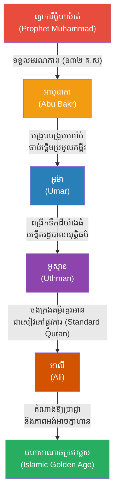

# The Sahabah & The 4 Rightly Guided Caliphs (អ្នកស្នងតំណែងទាំង ៤ របស់ព្យាការីម៉ូហាម៉ាត់)

**Author:** ichamrong  
**Date:** 2026-05-23  
**Tags:** #muhammad #caliphs #islam #sahabah #history #leadership  
**Category:** Biographies  
**Read Time:** ~10 min  

---

## 📌 មាតិកា (Table of Contents)
- [១. អ្នកដើរតាមដ៏ស្មោះត្រង់ (The Sahabah)](#1)
- [២. អាប៊ូបាកា៖ អ្នកស្នងតំណែងទី១ (Abu Bakr - The Truthful)](#2)
- [៣. អូម៉ា៖ អ្នកយាមយុត្តិធម៌ (Umar - The Just)](#3)
- [៤. អូស្មាន និង អាលី (Uthman & Ali)](#4)
- [៥. កេរដំណែល និងឥទ្ធិពល (The Effect and Impact)](#5)
- [🔗 ឯកសារទាក់ទង (Related Topics)](#related-topics)
- [ឯកសារយោង (References)](#references)

---

## ១. អ្នកដើរតាមដ៏ស្មោះត្រង់ (The Sahabah)

ព្យាការីម៉ូហាម៉ាត់មានអ្នកដើរតាមផ្ទាល់ (Companions) ដែលហៅថា **Sahabah (សាហាបា)** រាប់ម៉ឺននាក់។ ពួកគេគឺជាអ្នកដែលបានឃើញ បានលឺ និងបានតស៊ូរងទុក្ខជាមួយព្យាការី ដើម្បីការពារសាសនាឥស្លាម។ 

នៅពេលព្យាការីម៉ូហាម៉ាត់ទទួលមរណភាពនៅឆ្នាំ ៦៣២ លោកមិនបានបញ្ជាក់ឱ្យច្បាស់លាស់ថាអ្នកណានឹងត្រូវឡើងគ្រប់គ្រងរដ្ឋឥស្លាមបន្តនោះទេ។ ដូច្នេះហើយ សហគមន៍បានសម្រេចចិត្តជ្រើសរើសមេដឹកនាំ (Caliph - កាលីហ្វ) បន្តបន្ទាប់គ្នាចំនួន ៤ នាក់ ដែលប្រវត្តិសាស្ត្រឥស្លាមស៊ុននី (Sunni) ហៅថា **អ្នកស្នងតំណែងដ៏ត្រឹមត្រូវទាំង ៤ (The Rashidun Caliphs / The Rightly Guided Caliphs)** ព្រោះពួកគេជាអ្នកដែលរៀនសូត្រផ្ទាល់ពីព្យាការី និងមានក្រមសីលធម៌ខ្ពស់បំផុត។

---

## ២. អាប៊ូបាកា៖ អ្នកស្នងតំណែងទី១ (Abu Bakr - The Truthful)

**១. អាប៊ូបាកា (Abu Bakr, គ្រងរាជ្យ ៦៣២–៦៣៤):**
គាត់គឺជាមិត្តសម្លាញ់ដ៏ជិតស្និទ្ធបំផុត និងជាឪពុកក្មេករបស់ម៉ូហាម៉ាត់។ គាត់គឺជាបុរសទីមួយដែលបានជឿលើសាសនាឥស្លាម។
នៅពេលម៉ូហាម៉ាត់ស្លាប់ ប្រជាជនជាច្រើនមានភាពរន្ធត់ និងខ្លះចង់បោះបង់សាសនា។ អាប៊ូបាកា បានប្រកាសពាក្យពេចន៍ដ៏ល្បីល្បាញថា៖ *"អ្នកណាដែលគោរពបូជាម៉ូហាម៉ាត់ ចូរដឹងថាម៉ូហាម៉ាត់បានស្លាប់ហើយ។ តែអ្នកណាដែលគោរពបូជាព្រះអាឡាហ៍ ចូរដឹងថាព្រះអាឡាហ៍រស់នៅជារៀងរហូត។"* 
ទោះបីជាគាត់ដឹកនាំបានតែ ២ ឆ្នាំ មុនពេលស្លាប់ដោយជំងឺ គាត់បានជួយបង្រួបបង្រួមឧបទ្វីបអារ៉ាប់ទាំងមូលឱ្យមានស្ថិរភាពឡើងវិញ និងបានចាប់ផ្តើមប្រមូលចងក្រងខគម្ពីរគួរអាន (Quran) ដែលសរសេររាយប៉ាយ ឱ្យមកនៅកន្លែងតែមួយ។

---

## ៣. អូម៉ា៖ អ្នកយាមយុត្តិធម៌ (Umar - The Just)

**២. អូម៉ា (Umar ibn al-Khattab, គ្រងរាជ្យ ៦៣៤–៦៤៤):**
អូម៉ា គឺជាមេដឹកនាំដ៏ខ្លាំងពូកែ និងតឹងរ៉ឹងបំផុតខាងយុត្តិធម៌ (Al-Faruq)។ 
គាត់បានពង្រីកចក្រភពឥស្លាមយ៉ាងធំធេង ដោយវាយយកឈ្នះចក្រភពពែរ្ស (Persia) និងមួយផ្នែកធំនៃចក្រភពរ៉ូមប៊ីហ្សង់ទីន (Byzantine) រួមទាំងទីក្រុងយេរូសាឡឹមផងដែរ។ ទោះបីជាមានអំណាចគ្រប់គ្រងទឹកដីដ៏ធំល្វឹងល្វើយ ក៏អូម៉ានៅតែរស់នៅយ៉ាងសាមញ្ញ ពាក់អាវធ្លុះធ្លាយ និងដើរល្បាតតាមដងផ្លូវនៅពេលយប់ ដើម្បីមើលសុខទុក្ខរាស្ត្រក្រីក្រដោយផ្ទាល់។ គាត់បានបង្កើតប្រព័ន្ធតុលាការ ប្រព័ន្ធពន្ធដារ និងរដ្ឋបាលដ៏រឹងមាំ មុនពេលត្រូវគេលួចធ្វើឃាត។

---

## ៤. អូស្មាន និង អាលី (Uthman & Ali)

**៣. អូស្មាន (Uthman ibn Affan, គ្រងរាជ្យ ៦៤៤–៦៥៦):**
គាត់គឺជាអ្នកមានទ្រព្យសម្បត្តិមហាសាល ដែលតែងតែបរិច្ចាគទ្រព្យទាំងអស់ជួយសហគមន៍។ ស្នាដៃដ៏ធំបំផុតរបស់អូស្មាន គឺការសម្រេចចងក្រង **គម្ពីរគួរអាន (Quran)** ជាសៀវភៅផ្លូវការតែមួយគត់ (Standardized Version) ដើម្បីកុំឱ្យមានការអានខុសគ្នានៅតាមតំបន់ផ្សេងៗ។ គម្ពីរគួរអានដែលយើងឃើញសព្វថ្ងៃនេះ គឺកើតចេញពីការចងក្រងរបស់អូស្មាន។ គាត់ក៏ត្រូវក្រុមបះបោរលួចធ្វើឃាតផងដែរ។

**៤. អាលី (Ali ibn Abi Talib, គ្រងរាជ្យ ៦៥៦–៦៦១):**
អាលី គឺជាបងប្អូនជីដូនមួយ និងជាកូនប្រសាររបស់ម៉ូហាម៉ាត់ (រៀបការជាមួយកូនស្រីឈ្មោះ ហ្វាទីម៉ា)។ គាត់គឺជាអ្នកប្រាជ្ញដ៏ជ្រាលជ្រៅ និងជាអ្នកចម្បាំងដ៏អង់អាចបំផុតតាំងពីក្មេង។ រជ្ជកាលរបស់គាត់ពោរពេញដោយសង្គ្រាមស៊ីវិល (សង្គ្រាមរវាងអ្នកគាំទ្រអាលី និងអ្នកប្រឆាំងដែលចង់សងសឹកឱ្យអូស្មាន)។ ក្រោយមក អាលីក៏ត្រូវបានគេធ្វើឃាត។
(ចំណាំ៖ ក្រុមមូស្លីមសៀអ៊ីត/Shia ជឿថា អាលីគួរតែជាអ្នកស្នងតំណែងទី១ មិនមែនទី៤ ទេ ព្រោះគាត់ជាខ្សែស្រឡាយឈាមផ្ទាល់។ នេះជាប្រភពនៃការបែកបាក់រវាងនិកាយ Sunni និង Shia)។

---

## ៥. កេរដំណែល និងឥទ្ធិពល (The Effect and Impact)

បើគ្មានការដឹកនាំរបស់ **អ្នកស្នងតំណែងទាំង ៤ (The Rashidun)** ទេ សាសនាឥស្លាមអាចនឹងដួលរលំភ្លាមៗបន្ទាប់ពីព្យាការីម៉ូហាម៉ាត់ស្លាប់។ ពួកគេមិនត្រឹមតែការពារសាសនាឱ្យនៅគង់វង្សនោះទេ ប៉ុន្តែបានពង្រីកវាឱ្យក្លាយជាមហាអាណាចក្រមួយដ៏រឹងមាំ និងបានបន្សល់ទុកនូវ "គម្ពីរគួរអាន" ដែលមានទម្រង់ដើមទាំងស្រុង សម្រាប់អ្នកជឿរាប់ពាន់លាននាក់អានរហូតមកដល់សព្វថ្ងៃ។

---

## 🔗 ឯកសារទាក់ទង (Related Topics)
* [ជីវប្រវត្តិព្យាការីមូហាំម៉ាត់ (Muhammad Biography)](../muhammad/01-muhammad-biography.md)

---

## ឯកសារយោង (References)

*   **Tarikh al-Tabari (History of the Prophets and Kings)** — A comprehensive history by the Persian scholar al-Tabari detailing the lives and conquests of the early caliphs.
*   **Sahih al-Bukhari & Sahih Muslim** — The most authentic collections of Hadith (sayings and actions of the Prophet Muhammad) which narrate the virtues and deeds of the Sahabah.
