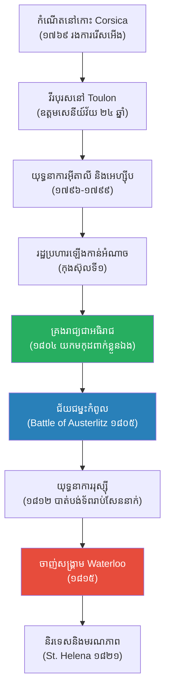

# The Biography of Napoleon Bonaparte (ជីវប្រវត្តិ ណាប៉ូឡេអុង បូណាប៉ាត)

**Author:** ichamrong  
**Date:** 2026-05-26  
**Tags:** #napoleon #biography #france #military #history #emperor  
**Category:** Biographies  
**Read Time:** ~15 min  

---

## 📌 មាតិកា (Table of Contents)
- [សេចក្តីផ្តើម៖ កាយវិភាគវិទ្យានៃអធិរាជ (The Anatomy of an Emperor)](#intro)
- [១. កុមារភាព និងការរើសអើង (Childhood & Discrimination)](#1)
- [២. ឱកាសក្នុងបដិវត្តន៍បារាំង (The French Revolution as an Opportunity)](#2)
- [៣. យុទ្ធនាការអ៊ីតាលី និងការឡើងកាន់អំណាច (Italian Campaign & Rise to Power)](#3)
- [៤. ការគ្រងរាជ្យជាអធិរាជ និងសមរភូមិអូស្ទ័រលីត (Coronation & Battle of Austerlitz)](#4)
- [៥. យុទ្ធនាការរុស្ស៊ី និងការដួលរលំ (The Russian Campaign & Downfall)](#5)
- [៦. ចិត្តសាស្ត្រ និងទស្សនវិជ្ជាពីកំណើតដល់ស្លាប់ (Psychology & Philosophy from Birth to Death)](#6)
- [៧. កំហុសឆ្គងដ៏ធំបំផុតដែលមិនគួរមាន (The Fatal Mistakes)](#7)
- [៨. កេរដំណែល (Legacy)](#8)
- [៩. តើណាប៉ូឡេអុងបានបំផុសគំនិតអ្វីខ្លះ? (What Did Napoleon Inspire?)](#9)
- [សេចក្តីសន្និដ្ឋាន (Conclusion)](#conclusion)
- [🔗 ឯកសារទាក់ទង (Related Topics)](#related-topics)
- [ឯកសារយោង (References)](#references)

---

## សេចក្តីផ្តើម៖ កាយវិភាគវិទ្យានៃអធិរាជ (The Anatomy of an Emperor)

> **«នៅក្នុងនយោបាយ ភាពល្ងង់ខ្លៅមិនមែនជាឧបសគ្គទេ។ ប៉ុន្តែនៅក្នុងសង្គ្រាម ភាពល្ងង់ខ្លៅគឺជាសេចក្តីស្លាប់។»**

សាកស្រមៃមើលពីទិដ្ឋភាពនេះ៖ ប្រទេសបារាំងកំពុងហែកហួរដោយបដិវត្តន៍ដ៏បង្ហូរឈាម ស្តេចត្រូវបានគេកាត់ក្បាល ហើយប្រទេសជិតខាងទាំងអស់កំពុងរួមដៃគ្នាដើម្បីវាយកម្ទេចបារាំង។ នៅក្នុងពេលដែលប្រទេសជិតដល់មាត់ជ្រោះ យុវជនវ័យ ២៦ ឆ្នាំម្នាក់ដែលនិយាយភាសាបារាំងមិនសូវច្បាស់ផងនោះ បានឡើងមកបញ្ជាកងទ័ព។ គាត់មិនត្រឹមតែការពារបារាំងបានទេ តែគាត់បានវាយលុកយកអឺរ៉ុបស្ទើរតែទាំងមូល ផ្តួលរំលំចក្រភពរ៉ូម៉ាំងដ៏ពិសិដ្ឋដែលមានអាយុ ១០០០ ឆ្នាំ ហើយបានយកមកុដពីសម្តេចប៉ាបមកពាក់លើក្បាលខ្លួនឯងដោយផ្ទាល់ដៃ។

គាត់ត្រូវបានគេចាត់ទុកថាជា **ព្រះនៃសង្គ្រាម (God of War)** ដែលធ្វើឱ្យអឺរ៉ុបទាំងមូលញាប់ញ័ររាល់ពេលឮឈ្មោះគាត់។ ប៉ុន្តែនៅទីបញ្ចប់ គាត់ត្រូវបានគេបញ្ជូនទៅរស់នៅឯកោលើកោះដាច់ស្រយាលមួយរហូតដល់ដង្ហើមចុងក្រោយ។ តើក្មេងប្រុសក្រីក្រពីកោះកូស៊ីកា (Corsica) ម្នាក់នេះ អាចក្លាយជាអធិរាជដែលមានអំណាចបំផុតនៅអឺរ៉ុបបានដោយរបៀបណា? នេះគឺជារឿងរ៉ាវរបស់ **ណាប៉ូឡេអុង បូណាប៉ាត (Napoleon Bonaparte)**។

---

## ១. កុមារភាព និងការរើសអើង (Childhood & Discrimination)

ណាប៉ូឡេអុង កើតនៅឆ្នាំ ១៧៦៩ លើកោះកូស៊ីកា (Corsica) ដែលជាកោះមួយទើបតែត្រូវបានបារាំងទិញពីអ៊ីតាលី។ គាត់កើតក្នុងគ្រួសារអភិជនក្រីក្រដែលនិយាយភាសាអ៊ីតាលី។ 

នៅអាយុ ៩ ឆ្នាំ គាត់ត្រូវបានបញ្ជូនទៅរៀននៅសាលាយោធាក្នុងប្រទេសបារាំង។ នៅទីនោះ គាត់ត្រូវបានមិត្តរួមថ្នាក់សើចចំអក មើលងាយ និងធ្វើបាប (Bullying) យ៉ាងខ្លាំង ដោយសារតែរូបរាងតូចល្អិត ភាពក្រីក្រ និងការនិយាយភាសាបារាំងមានសំនៀងជាអ្នកស្រុកកោះ (Corsican accent)។ ជំនួសឱ្យការចុះចាញ់ ណាប៉ូឡេអុងបានចំណាយពេលទំនេរទាំងអស់របស់គាត់អានសៀវភៅប្រវត្តិសាស្ត្រយោធា និងគណិតវិទ្យា។ គាត់ស្រមៃចង់ក្លាយជាវីរបុរសដូចអាឡិចសាន់ឌឺ និងសេសារ។ គាត់រៀនចប់សាលាយោធាដោយចំណាយពេលត្រឹមតែ ១ ឆ្នាំ (ខណៈអ្នកដទៃត្រូវរៀន ៣ ឆ្នាំ)។

> 💡 **មេរៀនពីកុមារភាព (The Fuel of Ambition):** ការរើសអើងនិងភាពឯកោ មិនបានបំផ្លាញគាត់ទេ តែវាបានប្រែក្លាយទៅជាប្រេងឥន្ធនៈដ៏ខ្លាំងក្លាដែលដុតបញ្ឆេះមហិច្ឆតារបស់គាត់។ គាត់ចង់បង្ហាញប្រាប់ពួកអភិជនបារាំងដែលធ្លាប់មើលងាយគាត់ថា គាត់អស្ចារ្យជាងពួកគេទាំងអស់គ្នា។

---

## ២. ឱកាសក្នុងបដិវត្តន៍បារាំង (The French Revolution as an Opportunity)

បដិវត្តន៍បារាំង (១៧៨៩) បានផ្លាស់ប្តូរជីវិតរបស់គាត់ជារៀងរហូត។ មុនបដិវត្តន៍ មានតែពួកអភិជនទេទើបអាចធ្វើជាមេទ័ពបាន។ ប៉ុន្តែបដិវត្តន៍បានកាត់ក្បាលអភិជនចោលស្ទើរតែអស់ ធ្វើឱ្យកងទ័ពខ្វះមេបញ្ជាការ។ នេះជាឱកាសមាសសម្រាប់យុវជនមានសមត្ថភាពដូចណាប៉ូឡេអុង។

ភាពល្បីល្បាញរបស់គាត់ចាប់ផ្តើមនៅទីក្រុង ធូឡុង (Toulon) ក្នុងឆ្នាំ ១៧៩៣ ពេលដែលកងទ័ពអង់គ្លេសបានចូលមកកាន់កាប់ទីក្រុងនេះ។ ណាប៉ូឡេអុង ក្នុងឋានៈជាមេបញ្ជាការកាំភ្លើងធំ បានប្រើប្រាស់យុទ្ធសាស្ត្របាញ់ផ្លោងយ៉ាងវៃឆ្លាត ដេញកងទ័ពអង់គ្លេសចេញដោយជោគជ័យ។ ជ័យជម្នះនេះ បានធ្វើឱ្យគាត់ឡើងឋានៈជាឧត្តមសេនីយ៍ត្រឹមវ័យ ២៤ ឆ្នាំ។

---

## ៣. យុទ្ធនាការអ៊ីតាលី និងការឡើងកាន់អំណាច (Italian Campaign & Rise to Power)

នៅឆ្នាំ ១៧៩៦ គាត់ត្រូវបានចាត់តាំងឱ្យដឹកនាំ "កងទ័ពអ៊ីតាលី (Army of Italy)"។ ពេលគាត់ទៅដល់ កងទ័ពនោះគឺកងទ័ពដែលអត់បាយ ស្លៀកពាក់រហែក និងគ្មានកម្លាំងចិត្តប្រយុទ្ធ។ ណាប៉ូឡេអុង បានធ្វើសុន្ទរកថាផ្លាស់ប្តូរពួកគេភ្លាមៗថា៖ *"ទាហាន! អ្នកអត់បាយ អ្នកគ្មានខោអាវ... ខ្ញុំនឹងដឹកនាំអ្នកទៅកាន់តំបន់ដែលសំបូរសប្បាយបំផុតលើពិភពលោក។ នៅទីនោះអ្នកនឹងទទួលបានកិត្តិយស សិរីរុងរឿង និងទ្រព្យសម្បត្តិ!"* 

គាត់បានដឹកនាំកងទ័ពដ៏កម្សត់នេះ វាយឈ្នះកងទ័ពអូទ្រីសដែលធំជាងខ្លួនជាច្រើនដង។ គាត់តែងតែប្រយុទ្ធនៅជួរមុខជាមួយទាហាន ទើបទាហានស្រលាញ់គាត់រហូតហ៊ានស្លាប់ជំនួស។ គាត់បានបញ្ជូនទ្រព្យសម្បត្តិរាប់លាន និងសិល្បៈពីអ៊ីតាលីមកប៉ារីស ធ្វើឱ្យប្រជាជនបារាំងចាត់ទុកគាត់ជាវីរបុរសជាតិ។

ដោយមានការគាំទ្រពីយោធា និងប្រជាជន នៅឆ្នាំ ១៧៩៩ គាត់បានធ្វើរដ្ឋប្រហារ (Coup of 18 Brumaire) ទម្លាក់រដ្ឋាភិបាលដែលទន់ខ្សោយ ហើយតាំងខ្លួនជា "កុងស៊ុលទីមួយ (First Consul)" ក្លាយជាមេដឹកនាំកំពូលរបស់បារាំងក្នុងវ័យ ៣០ ឆ្នាំ។

---

## ៤. ការគ្រងរាជ្យជាអធិរាជ និងសមរភូមិអូស្ទ័រលីត (Coronation & Battle of Austerlitz)

នៅឆ្នាំ ១៨០៤ ណាប៉ូឡេអុង បានប្រកាសខ្លួនជា **អធិរាជនៃបារាំង (Emperor of the French)**។ នៅក្នុងពិធីគ្រងរាជ្យនៅវិហារ Notre-Dame ជំនួសឱ្យការឱ្យសម្តេចប៉ាបបំពាក់មកុដឱ្យតាមប្រពៃណី គាត់បានយកមកុដពីដៃសម្តេចប៉ាប មកពាក់លើក្បាលខ្លួនឯងផ្ទាល់ ដើម្បីបង្ហាញថាអំណាចរបស់គាត់គឺបានមកពីសមត្ថភាពខ្លួនឯង មិនមែនបានមកពីសាសនាចក្រទេ។

យុគសម័យមាសរបស់គាត់គឺ **សមរភូមិអូស្ទ័រលីត (Battle of Austerlitz - ១៨០៥)** ឬ "សមរភូមិអធិរាជបី"។ ណាប៉ូឡេអុងបានប្រើល្បិចធ្វើជាចាញ់ ដើរថយក្រោយដើម្បីបោកបញ្ឆោតកងទ័ពរួមរុស្ស៊ីនិងអូទ្រីសឱ្យធ្លាក់ក្នុងអន្ទាក់។ ទីបំផុត កងទ័ពបារាំងបានវាយបំបែកកណ្តាលកងទ័ពសត្រូវ និងទទួលបានជ័យជម្នះដ៏ត្រចះត្រចង់បំផុតក្នុងប្រវត្តិសាស្ត្រយោធា ដែលធ្វើឱ្យចក្រភពរ៉ូម៉ាំងដ៏ពិសិដ្ឋត្រូវដួលរលំ។

---

## ៥. យុទ្ធនាការរុស្ស៊ី និងការដួលរលំ (The Russian Campaign & Downfall)

មហិច្ឆតាដែលគ្មានដែនកំណត់ បានក្លាយជាថ្នាំពុលសម្លាប់គាត់។ ដើម្បីបំផ្លាញសេដ្ឋកិច្ចអង់គ្លេស ណាប៉ូឡេអុងបានបញ្ជាឱ្យអឺរ៉ុបទាំងមូលឈប់រកស៊ីជាមួយអង់គ្លេស (Continental System)។ ពេលរុស្ស៊ីបដិសេធច្បាប់នេះ នៅឆ្នាំ ១៨១២ ណាប៉ូឡេអុងបានដឹកនាំកងទ័ពដ៏ធំបំផុតក្នុងប្រវត្តិសាស្ត្រអឺរ៉ុប (ជាង ៦ សែននាក់ - Grande Armée) ទៅវាយរុស្ស៊ី។

រុស្ស៊ីមិនព្រមប្រយុទ្ធផ្ទាល់ទេ ពួកគេចេះតែដកថយចូលជ្រៅទៅក្នុងប្រទេស ហើយដុតកម្ទេចភូមិ និងស្រែចម្ការទាំងអស់ (Scorched-earth policy) ដើម្បីកុំឱ្យកងទ័ពបារាំងមានអាហារហូប។ ពេលណាប៉ូឡេអុងទៅដល់ទីក្រុងម៉ូស្គូ ទីក្រុងនោះត្រូវបានគេដុតចោលស្ទើរទាំងស្រុង។ រដូវរងាដ៏សាហាវរបស់រុស្ស៊ីបានធ្លាក់មកដល់ កងទ័ពបារាំងត្រូវបង្ខំចិត្តដកថយដោយគ្មានអាហារ សម្លៀកបំពាក់ និងត្រូវរងការវាយឆ្មក់តាមផ្លូវ។ កងទ័ព ៦ សែននាក់ សល់ត្រឹមតែប្រហែល ១ សែននាក់ប៉ុណ្ណោះដែលបានរស់ត្រឡប់មកវិញ។

ភាពទន់ខ្សោយនេះ បានធ្វើឱ្យអឺរ៉ុបទាំងមូលរួមដៃគ្នាវាយបារាំង។ ណាប៉ូឡេអុងត្រូវបង្ខំឱ្យដាក់រាជ្យនៅឆ្នាំ ១៨១៤ ហើយត្រូវនិរទេសទៅកោះ Elba។ គាត់បានលួចរត់មកវិញគ្រប់គ្រងប្រទេសបាន ១០០ ថ្ងៃ ប៉ុន្តែត្រូវចាញ់សង្គ្រាមចុងក្រោយនៅ **វ៉ាធឺលូ (Battle of Waterloo - ១៨១៥)**។ គាត់ត្រូវបាននិរទេសម្តងទៀតទៅកាន់កោះ St. Helena ដ៏ដាច់ស្រយាលនៅកណ្តាលមហាសមុទ្រ រហូតដល់ស្លាប់នៅឆ្នាំ ១៨២១។

---

## ៦. ចិត្តសាស្ត្រ និងទស្សនវិជ្ជាពីកំណើតដល់ស្លាប់ (Psychology & Philosophy from Birth to Death)

ដើម្បីយល់ពីណាប៉ូឡេអុង យើងត្រូវយល់ពីរបៀបដែលគាត់ប្រើប្រាស់ថាមពលផ្លូវចិត្ត៖

*   **ជំនឿលើទេពកោសល្យ (Meritocracy):** គាត់ស្អប់ប្រព័ន្ធសក្តិភូមិដែលផ្តល់បុណ្យស័ក្តិតាមខ្សែស្រឡាយ។ គាត់ប្រកាសថា "គ្រប់ទាហានទាំងអស់ សុទ្ធតែមានដំបងសេនាប្រមុខនៅក្នុងកាតាបរបស់ពួកគេ" មានន័យថា អ្នកណាក៏អាចឡើងធំបានដែរឱ្យតែមានសមត្ថភាព។
*   **អំណាចនៃការផ្តោតអារម្មណ៍ (Hyper-Focus):** គាត់មានខួរក្បាលពិសេសដែលអាចផ្តោតអារម្មណ៍លើកិច្ចការច្រើនក្នុងពេលតែមួយ។ គាត់អាចសរសេរសំបុត្រឱ្យលេខា ៤ នាក់ក្នុងប្រធានបទផ្សេងគ្នា ក្នុងពេលតែមួយ ដោយគ្មានការច្របូកច្របល់។ គាត់គេងត្រឹមតែ ៤ ម៉ោងប៉ុណ្ណោះក្នុងមួយថ្ងៃ។
*   **ការប្រើប្រាស់ព័ត៌មានឃោសនា (Master of Propaganda):** គាត់គឺជាអ្នកនយោបាយដំបូងគេដែលប្រើប្រាស់កាសែត និងសិល្បៈដើម្បីសាងរូបភាពខ្លួនឯងជាវីរបុរស។ គាត់តែងតែគូរគំនូរខ្លួនឯងជិះសេះយ៉ាងអង់អាច ទោះបីការពិតគាត់ជិះលាក៏ដោយ។
*   **ល្បឿន និងភាពភ្ញាក់ផ្អើល (Speed & Surprise):** ទស្សនវិជ្ជាសង្គ្រាមរបស់គាត់គឺ "អត់ទោសឱ្យខ្ញុំប្រសិនបើខ្ញុំចាញ់ ប៉ុន្តែកុំអត់ទោសឱ្យខ្ញុំប្រសិនបើខ្ញុំយឺត"។ គាត់វាយប្រហារមុនពេលសត្រូវត្រៀមខ្លួនរួចរាល់ជានិច្ច។

---

## ៧. កំហុសឆ្គងដ៏ធំបំផុតដែលមិនគួរមាន (The Fatal Mistakes)

ភាពអស្ចារ្យរបស់ណាប៉ូឡេអុង ត្រូវបានបំផ្លាញដោយចំណុចខ្សោយរបស់គាត់៖

1.  **មហិច្ឆតាគ្មានដែនកំណត់ (Hubris):** គាត់មិនដែលស្គាល់ពាក្យថា "គ្រប់គ្រាន់"។ ការឈ្នះជានិច្ច ធ្វើឱ្យគាត់ជឿថាគាត់ជាមនុស្សដែលមិនអាចចាញ់បាន (Invincible) ដែលនាំឱ្យគាត់ហ៊ានធ្វើការសម្រេចចិត្តដ៏ឆោតល្ងង់ (វាយរុស្ស៊ី)។
2.  **ការមើលស្រាលអំណាចសមុទ្រ (Ignoring Naval Power):** គាត់ពូកែខាងសង្គ្រាមលើគោក ប៉ុន្តែខ្សោយខាងកងទ័ពជើងទឹក។ ការចាញ់សមរភូមិសមុទ្រ Trafalgar ធ្វើឱ្យគាត់មិនអាចឈ្លានពានអង់គ្លេសបាន ដែលអង់គ្លេសគឺជាអ្នកផ្តល់លុយឱ្យអឺរ៉ុបទាំងមូលវាយគាត់។
3.  **ការរៀបចំគ្រួសារជាស្តេច (Nepotism):** ទោះបីគាត់ជឿលើសមត្ថភាព តែពេលមានអំណាច គាត់បែរជាតែងតាំងបងប្អូនខ្លួនឯងឱ្យធ្វើជាស្តេចនៅអេស្ប៉ាញ ហូឡង់ អ៊ីតាលី ដែលបងប្អូនគាត់ទាំងនោះគ្មានសមត្ថភាពគ្រប់គ្រង ទើបបណ្តាលឱ្យមានការបះបោរជាបន្តបន្ទាប់។

---

## ៨. កេរដំណែល (Legacy)

ណាប៉ូឡេអុងមិនត្រឹមតែជាអ្នកចម្បាំងទេ ប៉ុន្តែគាត់ជាអ្នកធ្វើកំណែទម្រង់សង្គមដ៏ធំបំផុត។ អ្វីដែលគាត់មោទនភាពបំផុតមិនមែនជាជ័យជម្នះទាំង ៤០ សមរភូមិរបស់គាត់ទេ ប៉ុន្តែគឺ **ក្រមច្បាប់ណាប៉ូឡេអុង (Napoleonic Code)**។ គាត់ធ្លាប់និយាយថា *"អូស្ទ័រលីត នឹងត្រូវគេបំភ្លេច ប៉ុន្តែក្រមច្បាប់របស់ខ្ញុំនឹងរស់រានជារៀងរហូត"* ហើយវាជារឿងពិត។

---

## ៩. តើណាប៉ូឡេអុងបានបំផុសគំនិតអ្វីខ្លះ? (What Did Napoleon Inspire?)

នេះគឺជាបញ្ជីរាយនាមរឿងរ៉ាវ និងគោលគំនិតចំនួន ២០ ដែលណាប៉ូឡេអុងបានបំផុសគំនិត និងបន្សល់ទុកជាមរតកសម្រាប់មនុស្សជាតិ៖

1.  **ក្រមច្បាប់ណាប៉ូឡេអុង (Napoleonic Code):** ក្រមច្បាប់រដ្ឋប្បវេណី ដែលធានាសមភាពចំពោះមុខច្បាប់ សិទ្ធិកម្មសិទ្ធិ និងលុបបំបាត់ឯកសិទ្ធិអភិជន។ ប្រទេសជាង ៧០ លើលោក (រួមទាំងកម្ពុជា) យកគំរូតាម។
2.  **ប្រព័ន្ធអប់រំទំនើប (Lycées):** ការបង្កើតសាលាវិទ្យាល័យដែលផ្តល់ការអប់រំផ្អែកលើសមត្ថភាព មិនមែនវណ្ណៈ។
3.  **ការរៀបចំរដ្ឋបាល (Prefectures):** ការបែងចែកប្រទេសជាខេត្ត និងមានអភិបាលខេត្តគ្រប់គ្រងច្បាស់លាស់។
4.  **ធនាគារកណ្តាលបារាំង (Banque de France):** បង្កើតឡើងដើម្បីរក្សាស្ថិរភាពសេដ្ឋកិច្ចក្រោយបដិវត្តន៍។
5.  **សិទ្ធិសេរីភាពសាសនា (Emancipation of the Jews):** គាត់បានផ្តល់សិទ្ធិស្មើគ្នាដល់ជនជាតិយូដា ឱ្យរស់នៅដោយសេរីនៅអឺរ៉ុប ផ្ទុយពីស្តេចមុនៗដែលតែងតែបៀតបៀនពួកគេ។
6.  **ការវាស់វែងម៉ែត្រ (Metric System):** ជួយជំរុញឱ្យប្រព័ន្ធម៉ែត្រ (គីឡូ សង់ទីម៉ែត្រ) ត្រូវបានប្រើប្រាស់ពាសពេញអឺរ៉ុប ដើម្បីងាយស្រួលធ្វើពាណិជ្ជកម្ម។
7.  **យុទ្ធសាស្ត្រយោធា (Corps System):** ការបែងចែកកងទ័ពធំ ទៅជាកងទ័ពតូចៗដែលអាចចល័តបានលឿន និងចេះប្រយុទ្ធឯករាជ្យ។ យុទ្ធសាស្ត្រនេះត្រូវបានប្រើប្រាស់ដោយកងទ័ពជុំវិញពិភពលោករហូតដល់សព្វថ្ងៃ។
8.  **ការរកឃើញសិលាចារឹក Rosetta Stone:** ក្នុងយុទ្ធនាការនៅអេហ្ស៊ីប ទាហានរបស់គាត់បានរកឃើញថ្មនេះ ដែលជាកូនសោរអាចឱ្យពិភពលោកយល់ពីអក្សរអេហ្ស៊ីបបុរាណ (Hieroglyphs) ឡើងវិញ។
9.  **គំនិតជាតិនាវា (Nationalism):** តាមរយៈការតស៊ូប្រឆាំងនឹងបារាំង បានធ្វើឱ្យរដ្ឋតូចៗជាច្រើននៅអាល្លឺម៉ង់និងអ៊ីតាលី មានមនសិការជាតិ និងចង់រួបរួមគ្នាជាប្រទេសតែមួយនៅពេលក្រោយ។
10. **ការលក់រដ្ឋ Louisiana ទៅអាមេរិក:** ដោយសារត្រូវការលុយធ្វើសង្គ្រាម គាត់បានលក់ទឹកដីនៅអាមេរិកខាងជើងយ៉ាងធំ ឱ្យទៅសហរដ្ឋអាមេរិក ធ្វើឱ្យអាមេរិកកើនទំហំទ្វេដង។
11. **មេដាយកិត្តិយស (Légion d'honneur):** ការបង្កើតប្រព័ន្ធផ្តល់រង្វាន់ដល់ពលរដ្ឋដែលមានស្នាដៃ ទាំងយោធានិងស៊ីវិល ដោយមិនខ្វល់ពីវណ្ណៈ។
12. **អាហារកំប៉ុង (Canned Food):** គាត់បានផ្តល់រង្វាន់ដល់អ្នកដែលរកវិធីរក្សាទុកអាហារបានយូរសម្រាប់កងទ័ព ដែលបណ្តាលឱ្យមានការច្នៃប្រឌិតអាហារកំប៉ុងជាលើកដំបូង។
13. **ឥទ្ធិពលលើសិល្បៈនិងអក្សរសាស្ត្រ:** ជីវិតរបស់គាត់បានបំផុសគំនិតសៀវភៅល្បីៗដូចជា "សង្គ្រាមនិងសន្តិភាព (War and Peace)" របស់ Tolstoy និង "រឿងកម្សត់កម្រ (Les Misérables)" របស់ Victor Hugo។
14. **ស្ថាបត្យកម្មរ៉ូម៉ាំងថ្មី (Neoclassical Architecture):** ការកសាងវិមាន Arc de Triomphe នៅប៉ារីស ជាការអបអរជ័យជម្នះរបស់កងទ័ពបារាំង។
15. **ការបញ្ចប់ចក្រភពរ៉ូម៉ាំងដ៏ពិសិដ្ឋ:** គាត់បានលុបបំបាត់ចក្រភពដែលមានរដ្ឋតូចៗរាប់រយនៅអាល្លឺម៉ង់ ដែលជួយសម្រួលដល់ការបង្រួបបង្រួមអាល្លឺម៉ង់នៅពេលក្រោយ។
16. **ការច្នៃប្រឌិតផ្លូវច្បាប់:** គោលការណ៍ "គ្មាននរណាម្នាក់មានទោស រហូតទាល់តែតុលាការរកឃើញថាមានទោសពិតប្រាកដ" (Innocent until proven guilty)។
17. **តួអង្គស្មុគស្មាញ (Complex Hero/Villain):** គាត់ជានិមិត្តរូបនៃមហិច្ឆតាដែលគ្មានព្រំដែន (Faustian bargain) សម្រាប់អ្នកខ្លះគាត់ជាវីរបុរស សម្រាប់អ្នកខ្លះគាត់ជាជនផ្តាច់ការ។
18. **វិទ្យាសាស្ត្រនិងអេហ្ស៊ីបវិទ្យា (Egyptology):** ការនាំយកអ្នកប្រាជ្ញ ១៦០ នាក់ទៅអេហ្ស៊ីបជាមួយកងទ័ព បានបង្កើតជាមុខវិជ្ជាសិក្សាអំពីអេហ្ស៊ីបបុរាណ។
19. **ការផ្លាស់ប្តូរផែនទីអឺរ៉ុប:** សមាជទីក្រុងវីយែន (Congress of Vienna) ត្រូវរៀបចំឡើងដើម្បីគូរផែនទីអឺរ៉ុបសារជាថ្មី បន្ទាប់ពីការដួលរលំរបស់គាត់ ដែលរក្សាសន្តិភាពបានជិត ១០០ ឆ្នាំ។
20. **ឥទ្ធិពលលើមេដឹកនាំក្រោយៗ:** ទោះបីគាត់បរាជ័យ ប៉ុន្តែមេដឹកនាំផ្តាច់ការក្រោយៗ (ដូចជា ហ៊ីត្លែរ) តែងតែយកយុទ្ធសាស្ត្ររបស់គាត់ទៅសិក្សា (ទោះបីជាពួកគេក៏បរាជ័យនៅរុស្ស៊ីដូចគាត់ក៏ដោយ)។

---

## សេចក្តីសន្និដ្ឋាន (Conclusion)

> **«សិរីរុងរឿង គឺជារបស់មួយដែលឆាប់រលត់ ប៉ុន្តែភាពអនាមិក (គ្មាននរណាស្គាល់) គឺជាការស្លាប់ជារៀងរហូត។» — ណាប៉ូឡេអុង**

ណាប៉ូឡេអុង បូណាប៉ាត ប្រៀបដូចជាអាចម៍ផ្កាយ (Meteor) ដែលហោះកាត់មេឃអឺរ៉ុប។ គាត់បានឆេះយ៉ាងសន្ធោសន្ធៅ បំភ្លឺពិភពលោកមួយរយៈពេលខ្លី ហើយក៏ដួលរលំទៅវិញយ៉ាងលឿន។ មនុស្សខ្លះហៅគាត់ថាជាឧកញ៉ាផ្តាច់ការដែលសម្លាប់មនុស្សរាប់លាននាក់ដើម្បីអំនួតខ្លួនឯង ខណៈអ្នកខ្លះហៅគាត់ថាជាអ្នករំដោះដែលនាំយកពន្លឺនៃច្បាប់និងសមភាពទៅទូទាំងអឺរ៉ុប។ ទោះជាយ៉ាងណាក៏ដោយ អ្វីដែលមិនអាចប្រកែកបាននោះគឺ គាត់បានបង្ហាញពិភពលោកថា មិនថាអ្នកកើតមកតូចទាបយ៉ាងណានោះទេ ប្រសិនបើអ្នកមានសមត្ថភាព ភាពក្លាហាន និងមហិច្ឆតា អ្នកអាចកសាងចក្រភពផ្ទាល់ខ្លួនបាន។ យុគសម័យរបស់ណាប៉ូឡេអុង បានបិទបញ្ចប់ "សិទ្ធិពីកំណើតរបស់អភិជន" និងបើកទ្វារសម្រាប់ "អំណាចនៃសមត្ថភាព (Meritocracy)" ជារៀងរហូត។

---

## 🔗 ឯកសារទាក់ទង (Related Topics)
* [ក្រមច្បាប់ណាប៉ូឡេអុង (Napoleonic Code)](../napoleon/03-napoleonic-code.md)
* [ជីវប្រវត្តិអាឡិចសាន់ឌឺ (Alexander the Great Biography)](../alexander/01-alexander-biography.md)
* [ការឡើងកាន់អំណាច (Rise to Power)](../napoleon/04-rise-to-power.md)

## ឯកសារយោង (References)

*   **Napoleon: A Life by Andrew Roberts** — A comprehensive, authoritative biography drawn from Napoleon’s newly published letters.
*   **The Campaigns of Napoleon by David G. Chandler** — The definitive guide to Napoleon’s military strategies, battles, and command philosophy.

---

*Last updated: 2026-05-26*
