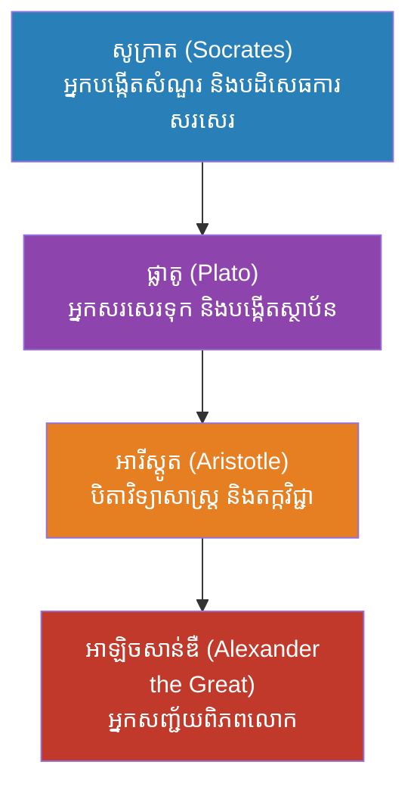
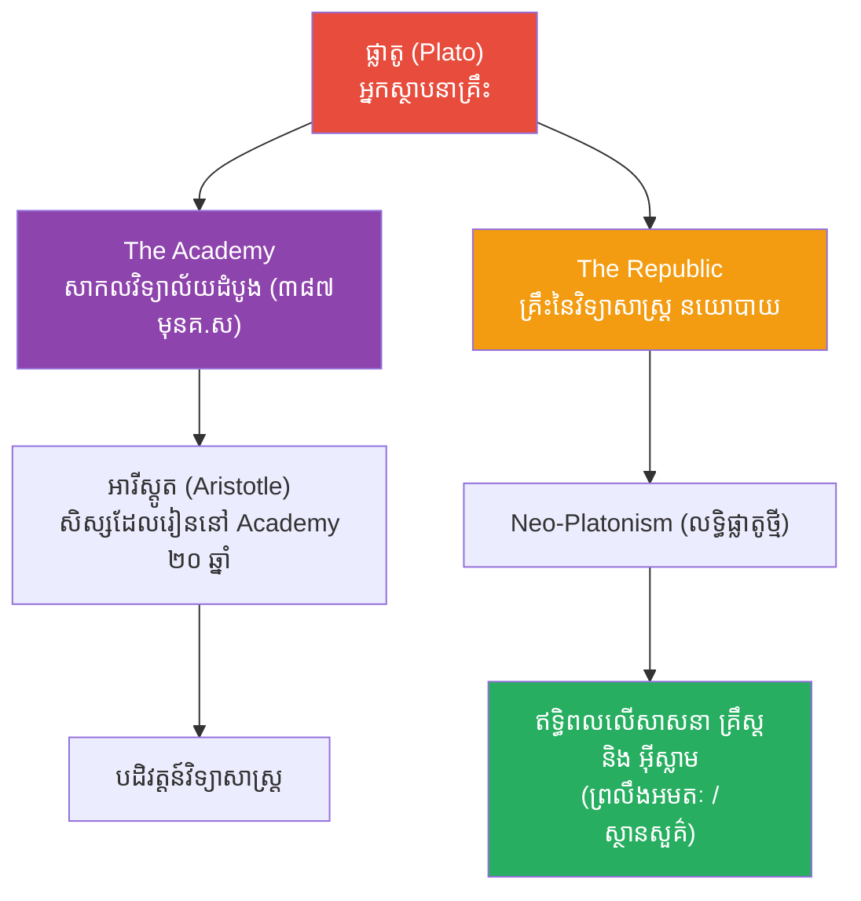

# The Biography of Plato (ជីវប្រវត្តិផ្លាតូ)

**Author:** ichamrong
**Date:** 2026-05-26
**Tags:** #plato #biography #philosophy #socrates #academy #athens #gold-standard
**Category:** Biographies
**Read Time:** ~15 min

---

## 📌 មាតិកា (Table of Contents)
- [សេចក្តីផ្តើម៖ កាយវិភាគវិទ្យានៃអ្នកស្រមើស្រមៃ (The Anatomy of an Idealist)](#intro)
- [១. កុមារភាព និងអភិជនស្មាធំ (Childhood & The Broad-Shouldered Aristocrat)](#1)
- [២. ឥទ្ធិពលនៃការអប់រំ៖ ការជួបសូក្រាត (Education & Meeting Socrates)](#2)
- [៣. ព្រឹត្តិការណ៍របត់៖ ការសម្លាប់សូក្រាត (The Turning Point: The Death of Socrates)](#3)
- [៤. ទស្សនវិជ្ជាស្នូល៖ រឿងប្រៀបប្រដៅក្នុងរូងភ្នំ (The Allegory of the Cave)](#4)
- [៥. ព្រឹត្តិការណ៍ដ៏អស្ចារ្យបំផុត៖ ការបង្កើតសាលា The Academy (The Greatest Event: Founding the Academy)](#5)
- [៦. ចិត្តសាស្ត្រ និងទស្សនវិជ្ជាពីកំណើតដល់ស្លាប់ (Psychology & Philosophy from Birth to Death)](#6)
- [៧. កំហុសឆ្គងដ៏ធំបំផុតដែលមិនគួរមាន (The Fatal Mistakes)](#7)
- [៨. កេរដំណែល (Legacy)](#8)
- [៩. តើផ្លាតូបានបំផុសគំនិតអ្វីខ្លះ? (What Did Plato Inspire?)](#9)
- [សេចក្តីសន្និដ្ឋាន (Conclusion)](#conclusion)
- [🔗 ឯកសារទាក់ទង (Related Topics)](#related-topics)
- [ឯកសារយោង (References)](#references)

---

## សេចក្តីផ្តើម៖ កាយវិភាគវិទ្យានៃអ្នកស្រមើស្រមៃ (The Anatomy of an Idealist)

> **«តើមនុស្សម្នាក់អាចផ្លាស់ប្តូរចរន្តឈាមនៃអរិយធម៌លោកខាងលិចទាំងមូល ដោយគ្រាន់តែអង្គុយសរសេរសៀវភៅដោយរបៀបណា?»**

ប្រសិនបើអ្នកកាត់សាច់ដុំរបស់បុរសម្នាក់នេះដើម្បីមើល នោះអ្នកនឹងឃើញ DNA របស់អ្នកចំបាប់ដ៏ខ្លាំងក្លាម្នាក់។ ប៉ុន្តែប្រសិនបើអ្នកវះកាត់ (Dissect) ចូលទៅក្នុងខួរក្បាលរបស់គាត់ នោះអ្នកនឹងឃើញស្ថាបត្យកម្មនៃ "ពិភពលោកមួយផ្សេងទៀត" ដែលមិនអាចមើលឃើញដោយភ្នែកទទេ។

គាត់កើតមកក្នុងត្រកូលមហាសេដ្ឋី មានរូបរាងសង្ហា និងត្រូវបានគេរំពឹងថានឹងក្លាយជានាយករដ្ឋមន្ត្រីដ៏មានអំណាចបំផុត។ ប៉ុន្តែការជួបបុរសចំណាស់ក្រីក្រម្នាក់ (សូក្រាត) បានចាក់បញ្ចូលអុកស៊ីហ្សែនថ្មីចូលទៅក្នុងខួរក្បាលរបស់គាត់ ហើយប្រែក្លាយអ្នកចំបាប់រូបនេះឱ្យក្លាយជា **ផ្លាតូ (Plato)** — បុរសដែលសាងសង់គ្រឹះសាកលវិទ្យាល័យដំបូងគេបង្អស់នៅលើពិភពលោក និងជានាយកស្ថាបត្យករនៃ "ការគិត" របស់មនុស្សជាតិ។ តើគាត់ធ្វើយ៉ាងណាទើបអាចបញ្ឆោតឱ្យមនុស្សរាប់ពាន់ឆ្នាំជឿថា ពិភពលោកដែលយើងកំពុងរស់នៅនេះ គ្រាន់តែជា "ការបំភាន់"?

---

## ១. កុមារភាព និងអភិជនស្មាធំ (Childhood & The Broad-Shouldered Aristocrat)

ផ្លាតូ កើតនៅប្រហែលឆ្នាំ ៤២៨ មុនគ្រឹស្តសករាជ នៅក្នុងទីក្រុងអាថែន។ ឈ្មោះពិតរបស់គាត់គឺ **អាតីស្តូគ្លេស (Aristocles)**។ ដោយសារតែគាត់មានរាងកាយមាំមួន និងមានស្មាធំទូលាយ គ្រូបង្វឹកកីឡាបោកចំបាប់របស់គាត់បានដាក់រហស្សនាមឱ្យគាត់ថា "ផ្លាតូ (Plato)" ដែលប្រែថា "ធំទូលាយ (Broad)"។

គាត់កើតក្នុងត្រកូលអភិជនជាន់ខ្ពស់ដែលមានខ្សែស្រឡាយជាប់នឹងស្តេចចាស់ៗរបស់អាថែន។ ពីតូច គាត់ត្រូវបានបណ្តុះបណ្តាលឱ្យក្លាយជាអ្នកដឹកនាំនយោបាយ ដោយរៀនពីកីឡា តន្ត្រី កំណាព្យ និងវោហាសាស្ត្រ។ 

> 💡 **មេរៀនពីកុមារភាពដែលដក់ជាប់ដល់ស្លាប់ (The Lifelong Lesson):** ភាពជាអភិជនរបស់គាត់ បានដាំគ្រាប់ពូជនៃការគិតមួយនៅក្នុងខួរក្បាលរបស់គាត់ថា **"មិនមែនមនុស្សគ្រប់គ្នា សុទ្ធតែមានសមត្ថភាពអាចដឹកនាំប្រទេសបាននោះទេ"**។ លោកមានការរើសអើងយ៉ាងខ្លាំងចំពោះ "ហ្វូងមនុស្ស (The Mob)" ដែលគ្មានការអប់រំ ដែលក្រោយមកបានជំរុញឱ្យលោកបង្កើតទ្រឹស្តីទាមទារឱ្យមាន "ទស្សនវិទូ-ស្តេច (Philosopher-Kings)" ជាអ្នកដឹកនាំប្រទេស។

---

## ២. ឥទ្ធិពលនៃការអប់រំ៖ ការជួបសូក្រាត (Education & Meeting Socrates)

នៅពេលផ្លាតូមានវ័យខ្ទង់ ២០ ឆ្នាំ គាត់បានជួបនឹងសូក្រាត។ សូក្រាតជាមនុស្សក្រីក្រ មុខអាក្រក់ និងចូលចិត្តដើរសួរសំណួរចាក់ដោតដែលធ្វើឱ្យអ្នកនយោបាយបាក់មុខ។ ប៉ុន្តែភាពឈ្លាសវៃ និងការស្វែងរកសេចក្តីពិតដោយមិនខ្វល់ពីរូបរាងខាងក្រៅរបស់សូក្រាត បានឆក់យកបេះដូងរបស់ផ្លាតូទាំងស្រុង។ ផ្លាតូបានបោះបង់មហិច្ឆតានយោបាយចោល ហើយងាកមកដើរតាមសូក្រាត។

**ខ្សែស្រឡាយទស្សនវិជ្ជា (The Philosophical Lineage):**

> 💡 **ឥទ្ធិពលនៃការអប់រំ (The Impact of Education):** សូក្រាតបានបង្រៀនផ្លាតូថា **"រូបរាងខាងក្រៅ អាចបញ្ឆោតភ្នែកយើងបាន"**។ មេរៀននេះបានធ្វើឱ្យផ្លាតូផ្តោតលើ "ព្រលឹង និងគំនិត" ច្រើនជាង "រូបកាយ និងសម្ភារៈ" រហូតបង្កើតបានជាប្រព័ន្ធទស្សនវិជ្ជាស្នូលរបស់លោក។

---

## ៣. ព្រឹត្តិការណ៍របត់៖ ការសម្លាប់សូក្រាត (The Turning Point: The Death of Socrates, ៣៩៩ មុនគ.ស)

នៅពេលផ្លាតូមានអាយុ ២៨ ឆ្នាំ ព្រឹត្តិការណ៍ដែលធ្វើឱ្យផ្លូវចិត្តលោកបាក់បែកបំផុតបានកើតឡើង។ ទីក្រុងអាថែនដែលអនុវត្ត "លទ្ធិប្រជាធិបតេយ្យផ្ទាល់" បានបោះឆ្នោតកាត់ទោសប្រហារជីវិតសូក្រាត (គ្រូរបស់លោក) ដោយចោទប្រកាន់ពីបទបំពុលយុវជន។ 

ការស្លាប់របស់បុរសដែលផ្លាតូចាត់ទុកថា "យុត្តិធម៌បំផុត និងឆ្លាតបំផុត" បានធ្វើឱ្យផ្លាតូ **ស្អប់ខ្ពើមលទ្ធិប្រជាធិបតេយ្យ** ដល់ឆ្អឹង។ លោកយល់ថា ប្រជាធិបតេយ្យ គឺគ្រាន់តែជា "ការគ្រប់គ្រងដោយហ្វូងមនុស្សល្ងង់ខ្លៅ (Mob Rule)"។ លោកបានភៀសខ្លួនចេញពីអាថែន ហើយធ្វើដំណើរអស់រយៈពេល ១២ ឆ្នាំ ទៅកាន់អេហ្ស៊ីប និងអ៊ីតាលី ដើម្បីស្វែងរកការពិត មុននឹងត្រឡប់មកវិញ។

---

## ៤. ទស្សនវិជ្ជាស្នូល៖ រឿងប្រៀបប្រដៅក្នុងរូងភ្នំ (The Allegory of the Cave)

ទ្រឹស្តីដ៏ល្បីល្បាញបំផុតរបស់ផ្លាតូ គឺ **"រឿងប្រៀបប្រដៅក្នុងរូងភ្នំ (The Allegory of the Cave)"** ដែលជាផ្នែកមួយនៃសៀវភៅ The Republic៖

> *ស្រមៃមើលមនុស្សមួយក្រុមដែលត្រូវគេចាប់ចងនៅក្នុងរូងភ្នំងងឹតតាំងពីកើត។ ពួកគេបែរមុខទៅរកជញ្ជាំង។ នៅពីក្រោយពួកគេមានភ្លើងមួយឆេះ ហើយមានគេកាន់រូបចម្លាក់សត្វ និងដើមឈើដើរកាត់ភ្លើងនោះ ធ្វើឱ្យជះស្រមោលទៅលើជញ្ជាំង។ សម្រាប់អ្នកទោសទាំងនោះ "ស្រមោល" គឺជាការពិតតែមួយគត់ (Reality) ដែលពួកគេស្គាល់។*
> 
> *ថ្ងៃមួយ អ្នកទោសម្នាក់បានរួចខ្លួន ហើយដើរចេញទៅក្រៅរូងភ្នំ។ គាត់ឃើញពន្លឺព្រះអាទិត្យ ឃើញដើមឈើពិតប្រាកដ។ គាត់ទើបដឹងថា ស្រមោលក្នុងរូងភ្នំគ្រាន់តែជាការបំភាន់កាឡៃប៉ុណ្ណោះ។ ពេលគាត់ត្រលប់ទៅប្រាប់អ្នកទោសផ្សេងទៀត ពួកគេមិនជឿគាត់ទេ ហើយថែមទាំងគំរាមសម្លាប់គាត់ទៀតផង (ដូចដែលពួកគេបានសម្លាប់សូក្រាត)។*

ផ្លាតូចង់ពន្យល់ពី **ទ្រឹស្តីទម្រង់ (Theory of Forms)**៖ ពិភពលោកដែលយើងមើលឃើញដោយភ្នែក ស្តាប់ឮដោយត្រចៀកនេះ គ្រាន់តែជា "ស្រមោល" ប៉ុណ្ណោះ។ ពិភពលោកពិតប្រាកដដ៏ល្អឥតខ្ចោះ (The Realm of Forms) គឺស្ថិតនៅក្នុង "គំនិត និងបញ្ញា"។

---

## ៥. ព្រឹត្តិការណ៍ដ៏អស្ចារ្យបំផុត៖ ការបង្កើតសាលា The Academy (The Greatest Event: Founding the Academy, ៣៨៧ មុនគ.ស)

បន្ទាប់ពីត្រលប់មកទីក្រុងអាថែនវិញក្នុងវ័យ ៤០ ឆ្នាំ ផ្លាតូបានធ្វើរឿងដ៏អស្ចារ្យបំផុតមួយក្នុងប្រវត្តិសាស្ត្រអប់រំ។ គាត់បានទិញដីមួយកន្លែងនៅជាយក្រុង ហើយបង្កើតសាលារៀនមួយឈ្មោះថា **"The Academy"**។ នេះត្រូវបានចាត់ទុកថាជា **គ្រឹះស្ថានឧត្តមសិក្សា (University) ដំបូងបង្អស់នៅក្នុងពិភពលោកខាងលិច** ដែលវាដំណើរការអស់រយៈពេលជិត ៩០០ ឆ្នាំឯណោះ!

នៅលើក្លោងទ្វារសាលា មានសរសេរពាក្យថា៖ *"កុំឱ្យអ្នកណាម្នាក់ដែលមិនចេះគណិតវិទ្យា (ធរណីមាត្រ) ចូលមកទីនេះឱ្យសោះ។"* ផ្លាតូជឿថា គណិតវិទ្យាគឺជាគន្លឹះដើម្បីហ្វឹកហាត់ខួរក្បាលឱ្យចេះគិតរក "ទម្រង់ពិតប្រាកដ"។ គោលបំណងចម្បងនៃសាលានេះ គឺដើម្បីផលិត "អ្នកដឹកនាំដ៏ល្អឥតខ្ចោះ"។

---

## ៦. ចិត្តសាស្ត្រ និងទស្សនវិជ្ជាពីកំណើតដល់ស្លាប់ (Psychology & Philosophy from Birth to Death)

បើយើងវះកាត់ផ្នត់គំនិតរបស់ផ្លាតូ យើងនឹងឃើញគោលការណ៍ចិត្តសាស្ត្រដ៏ជ្រៅជ្រះ៖

*   **រោគសញ្ញាស្អប់ហ្វូងមនុស្ស (Distrust of the Mob):** ភាពតក់ស្លុតពីការប្រហារជីវិតសូក្រាត បានធ្វើឱ្យលោកស្អប់ "មតិភាគច្រើន"។ លោកជឿថា អ្នកមានប្រាជ្ញាតិចតួច គួរតែគ្រប់គ្រងអ្នកល្ងង់ច្រើននាក់។
*   **ទស្សនវិទូ-ស្តេច (Philosopher-Kings):** ផ្លាតូមានជំនឿផ្លូវចិត្តថា ប្រទេសមួយនឹងមានសន្តិភាព លុះត្រាតែស្តេចក្លាយជាទស្សនវិទូ ឬទស្សនវិទូឡើងធ្វើជាស្តេច ព្រោះមានតែទស្សនវិទូទេដែលមិនស្រេកឃ្លានអំណាច។
*   **សេចក្តីស្រលាញ់បែបផ្លាតូ (Platonic Love):** លោកជឿថា ការស្រលាញ់រូបរាងកាយ (ផ្លូវភេទ) គឺជារឿងទាបថោក។ សេចក្តីស្រលាញ់ដ៏ខ្ពង់ខ្ពស់បំផុត គឺការស្រលាញ់ "ព្រលឹង និងបញ្ញា" របស់ដៃគូ ដែលជាដើមកំណើតនៃពាក្យថា Platonic Love ដល់សព្វថ្ងៃ។
*   **លទ្ធិល្អឥតខ្ចោះ (Utopian Perfectionism):** លោកតែងតែស្រមើស្រមៃចង់បាន "រដ្ឋដ៏ល្អឥតខ្ចោះ (Ideal State)" ដែលមិនអាចមានពិតនៅលើដី ដោយមានការបែងចែកវណ្ណៈមនុស្សយ៉ាងច្បាស់លាស់។
*   **ទ្រឹស្តីនៃការចងចាំ (Anamnesis):** តាមផ្លូវចិត្ត លោកជឿថា មនុស្សមិនមែន "រៀន" អ្វីថ្មីទេ ព្រលឹងរបស់យើងគ្រាន់តែ "នឹកឃើញ (Remember)" នូវចំណេះដឹងដែលយើងធ្លាប់មាន មុនពេលយើងចាប់កំណើតមកក្នុងរូបកាយនេះប៉ុណ្ណោះ។
*   **ការបែងចែកព្រលឹងជា ៣ (Tripartite Soul):** លោកបែងចែកចិត្តមនុស្សជា ៣ គឺ បញ្ញា (Reason), កម្លាំងចិត្ត (Spirit), និងចំណង់ (Appetite) ដោយប្រៀបធៀបវាទៅនឹងរទេះសេះ។

---

## ៧. កំហុសឆ្គងដ៏ធំបំផុតដែលមិនគួរមាន (The Fatal Mistakes)

ទោះជាពូកែខាងគិតយ៉ាងណា ក៏ផ្លាតូមានចន្លោះប្រហោងយ៉ាងធំនៅពេលយកទ្រឹស្តីមកអនុវត្តក្នុងជីវិតពិត៖

1.  **បរាជ័យនៅ Syracuse (The Syracuse Disaster):** ផ្លាតូធ្លាប់បានធ្វើដំណើរទៅទីក្រុង Syracuse (កោះស៊ីស៊ីលី) ដល់ទៅ ៣ ដង ដើម្បីព្យាយាមបង្វឹកស្តេចផ្តាច់ការ Dionysius II ឱ្យក្លាយជា "ទស្សនវិទូ-ស្តេច" ។ លទ្ធផលគឺ ស្តេចនោះមិនព្រមរៀន ថែមទាំងចាប់ផ្លាតូដាក់គុក ហើយស្ទើរតែលក់លោកជាទាសករទៀតផង! នេះបង្ហាញថា ទ្រឹស្តីដ៏ស្រស់ស្អាត មិនងាយទប់ទល់នឹងអំណាចនយោបាយពិតប្រាកដទេ។
2.  **និន្នាការផ្តាច់ការ (Proto-Fascism in The Republic):** នៅក្នុងសៀវភៅ The Republic ផ្លាតូបានស្នើឱ្យរដ្ឋាភិបាលមានសិទ្ធិ កុហកប្រជាជន (Noble Lie), គ្រប់គ្រងការបន្តពូជ (Eugenics), លុបបំបាត់គ្រួសារ, និងហាមឃាត់សិល្បៈនិងកំណាព្យ (Censorship)។ ទស្សនវិទូសម័យទំនើប (ដូចជា Karl Popper) បានរិះគន់ផ្លាតូយ៉ាងខ្លាំងថា លោកគឺជាបិតានៃរបបផ្តាច់ការ (Totalitarianism) ដំបូងគេ។
3.  **ការរើសអើងសិល្បៈ (Censorship of Art):** លោកស្អប់កំណាព្យ និងល្ខោន ព្រោះលោកគិតថាវាគ្រាន់តែជា "ការចម្លង" ពីការពិត ហើយវាធ្វើឱ្យមនុស្សប្រើប្រាស់អារម្មណ៍ (Emotion) ជាងបញ្ញា (Reason) ដែលនេះជារឿងដ៏គ្រោះថ្នាក់។

---

## ៨. កេរដំណែល (Legacy)

ឥទ្ធិពលរបស់ផ្លាតូមានភាពធំធេងមិនអាចគណនាបាន។ ទស្សនវិទូជនជាតិអង់គ្លេសដ៏ល្បីល្បាញម្នាក់ឈ្មោះ Alfred North Whitehead ធ្លាប់បាននិយាយប្រយោគអមតៈមួយថា៖ **"ប្រវត្តិសាស្ត្រទស្សនវិជ្ជាអឺរ៉ុបទាំងមូល គ្រាន់តែជាការពន្យល់បន្ថែម (Footnotes) លើសៀវភៅរបស់ផ្លាតូប៉ុណ្ណោះ"**។

---

## ៩. តើផ្លាតូបានបំផុសគំនិតអ្វីខ្លះ? (What Did Plato Inspire?)

នេះគឺជាបញ្ជីរាយនាមរឿងរ៉ាវ និងគោលគំនិតចំនួន ២៥ ដែលផ្លាតូបានបំផុសគំនិត និងបន្សល់ទុកជាមរតកសម្រាប់មនុស្សជាតិ៖

1.  **សាលា The Academy:** ជាគំរូដើមនៃ "សាកលវិទ្យាល័យ (University)" ដែលយើងប្រើប្រាស់នៅជុំវិញពិភពលោកសព្វថ្ងៃ។
2.  **វិទ្យាសាស្ត្រនយោបាយ (Political Science):** សៀវភៅ *The Republic* ត្រូវបានចាត់ទុកជាសៀវភៅគ្រឹះដំបូងគេបង្អស់នៃទ្រឹស្តីនយោបាយ។
3.  **ទ្រឹស្តីទម្រង់ (Theory of Forms):** គំនិតដែលថាមាន "ពិភពលោកដ៏ល្អឥតខ្ចោះ" មួយនៅពីក្រោយការមើលឃើញរបស់យើង។
4.  **រឿងប្រៀបប្រដៅរូងភ្នំ (Allegory of the Cave):** ជានិមិត្តរូបនៃការស្វែងរកការត្រាស់ដឹង (Enlightenment) ឆ្លងកាត់ភាពល្ងង់ខ្លៅ ដែលត្រូវបានថតជាកុនដូចជារឿង *The Matrix* ផងដែរ។
5.  **សេចក្តីស្រលាញ់បែបផ្លាតូ (Platonic Love):** ការស្រលាញ់គ្នាតាមរយៈផ្លូវចិត្ត និងបញ្ញា សុទ្ធសាធ (គ្មានការរួមភេទ)។
6.  **ទស្សនវិទូ-ស្តេច (Philosopher-Kings):** គំរូនៃអ្នកដឹកនាំដ៏ល្អឥតខ្ចោះ ដែលមានប្រាជ្ញា និងមិនលោភលន់អំណាច។
7.  **ទេវកថាអាត្លង់ទីស (The Lost City of Atlantis):** ផ្លាតូគឺជាអ្នកដែលបង្កើត និងសរសេរពីទីក្រុងក្រោមបាតសមុទ្រអាត្លង់ទីស (នៅក្នុងសៀវភៅ Timaeus និង Critias) ជាលើកដំបូងបង្អស់។
8.  **សាសនាគ្រឹស្តជំនាន់ដើម (Early Christianity):** លទ្ធិផ្លាតូថ្មី (Neo-Platonism) បានជះឥទ្ធិពលយ៉ាងខ្លាំងលើផ្លូវចិត្តរបស់ St. Augustine ក្នុងការបង្កើតទ្រឹស្តីគ្រឹស្តសាសនា។
9.  **សាសនាអ៊ីស្លាម (Islamic Golden Age):** អ្នកប្រាជ្ញអ៊ីស្លាមដូចជា Al-Farabi និង Avicenna បានយកគំនិតនយោបាយផ្លាតូមកកសាងទស្សនវិជ្ជាអ៊ីស្លាម។
10. **វណ្ណៈសង្គម (Social Classes):** ការបែងចែកសង្គមជា ៣៖ អ្នកផលិត (Producers), អ្នកការពារ (Warriors), និងអ្នកដឹកនាំ (Rulers)។
11. **ការភូតកុហកដ៏ថ្លៃថ្នូរ (The Noble Lie):** គំនិតដែលថារដ្ឋាភិបាលគួរតែបង្កើត "រឿងព្រេងកុហក" មួយ ដើម្បីធ្វើឱ្យប្រជាជនមានសាមគ្គីភាព និងគោរពច្បាប់ (Myth of the Metals)។
12. **សមភាពយេនឌ័រក្នុងការដឹកនាំ (Gender Equality):** ផ្លាតូគឺជាអ្នកប្រាជ្ញដំបូងគេដែលហ៊ានប្រកាសថា "ស្ត្រីក៏អាចក្លាយជាទស្សនវិទូ-ស្តេច (Philosopher Queens)" ដឹកនាំរដ្ឋបានដែរ បើទទួលបានការអប់រំដូចគ្នា។
13. **របៀបសរសេរជាការសន្ទនា (Socratic Dialogues):** បង្កើតប្រភេទអក្សរសិល្ប៍ថ្មី ដែលសរសេរជាទម្រង់សួរឆ្លើយគ្នា (Dialogues) ជាជាងការសរសេររៀបរាប់ត្រង់ៗ។
14. **ទ្រឹស្តីព្រលឹងអមតៈ (Immortality of the Soul):** ជំនឿថា ព្រលឹងមនុស្សមិនចេះស្លាប់ទេ ហើយវានឹងបន្តទៅកាន់ពិភពផ្សេងទៀត ក្រោយពេលរូបកាយស្លាប់។
15. **អរូបីវិជ្ជា (Metaphysics):** គ្រឹះនៃការសិក្សាពីអ្វីដែលនៅហួសពីរូបវិទ្យា (Beyond physics)។
16. **រូបធរណីមាត្រផ្លាតូ (Platonic Solids):** នៅក្នុងគណិតវិទ្យា លោកបានចងក្រងរូបរាង 3D ចំនួន ៥ (Tetrahedron, Cube, Octahedron, Dodecahedron, Icosahedron) ដែលត្រូវបានគេហៅឈ្មោះតាមលោក។
17. **ទស្សនាទានអ៊ុយតូពី (Utopia):** ការបង្កើតផែនការសាងសង់ "រដ្ឋដ៏ល្អឥតខ្ចោះ" ដែលគ្មានភាពក្រីក្រ និងជម្លោះ មុនពេល Thomas More បង្កើតពាក្យ Utopia ទៅទៀត។
18. **ការមិនទុកចិត្តអ្នកសិល្បៈ (Distrust of Artists):** ផ្លាតូបានបំផុសគំនិតឱ្យមានការតាមដាន និងត្រួតពិនិត្យ (Censorship) ទៅលើអ្នកសិល្បៈ និងអ្នកតែងកំណាព្យនៅក្នុងរដ្ឋ។
19. **បញ្ញត្តិកម្មរាងកាយនិងចិត្ត (Mind-Body Dualism):** គំនិតដែលញែក "ព្រលឹង" ដាច់ពី "រាងកាយ" ដែលជះឥទ្ធិពលដល់អ្នកប្រាជ្ញសម័យក្រោយដូចជា Descartes។
20. **ការចាត់ចែងការងារតាមជំនាញ (Specialization of Labor):** ទ្រឹស្តីដែលថា មនុស្សម្នាក់គួរតែធ្វើការងារតែមួយមុខ ដែលខ្លួនពូកែជាងគេ ដើម្បីឱ្យសង្គមរុងរឿង។
21. **ប្រព័ន្ធយុត្តិធម៌ (The Concept of Justice):** ការកំណត់អត្ថន័យនៃ "យុត្តិធម៌" ថាជាការធ្វើកិច្ចការរបស់ខ្លួនឯងឱ្យបានល្អបំផុតដោយមិនរំលោភលើអ្នកដទៃ។
22. **ទម្រង់នៃសេចក្តីល្អ (The Form of the Good):** ប្រៀបដូចជាព្រះអាទិត្យនៅក្នុងរូងភ្នំ ដែលជាប្រភពនៃចំណេះដឹង និងសេចក្តីពិតទាំងអស់។
23. **ការអប់រំកុមារ (Child Education):** ផ្លាតូស្នើឱ្យមានការអប់រំកុមារដោយរដ្ឋជាប្រព័ន្ធតាំងពីតូច ទាំងផ្នែកកីឡា និងតន្ត្រី (Gymnastics & Music)។
24. **តក្កវិជ្ជា និងគណិតវិទ្យា (Logic & Mathematics):** ការលើកតម្កើងគណិតវិទ្យាថាជាភាសានៃអាទិទេព ដែលនាំផ្លូវទៅកាន់ភាពច្បាស់លាស់។
25. **"យុគសម័យងងឹត (The Dark Ages)" នៃលទ្ធិប្រជាធិបតេយ្យ:** ការវិភាគរបស់លោកថាលទ្ធិប្រជាធិបតេយ្យ ដែលផ្តល់សេរីភាពហួសហេតុពេក ទីបំផុតនឹងបង្កើតឱ្យមានជនផ្តាច់ការ (Tyrant)។

---

## សេចក្តីសន្និដ្ឋាន (Conclusion)

> **«ប្រវត្តិសាស្ត្រទស្សនវិជ្ជាអឺរ៉ុបទាំងមូល គ្រាន់តែជាការពន្យល់បន្ថែម (Footnotes) លើសៀវភៅរបស់ផ្លាតូប៉ុណ្ណោះ។»**

ផ្លាតូ មិនមែនគ្រាន់តែជាអ្នកកត់ត្រាសម្តីរបស់សូក្រាតនោះទេ។ តាមរយៈការបង្កើត "The Academy" និងការសរសេរ "The Republic" គាត់បានធ្វើជាវិស្វកររៀបចំប្លង់ និងចាក់គ្រឹះនៃការគិតរបស់មនុស្សជាតិទាំងមូល។ រាល់ពេលដែលយើងនិយាយពី "សាកលវិទ្យាល័យ", "សេចក្តីស្រលាញ់បរិសុទ្ធ", "ការស្វែងរកសេចក្តីពិត", ឬសូម្បីតែរឿងព្រេង "អាត្លង់ទីស" យើងកំពុងតែដើរតាមស្រមោលនៅក្នុងរូងភ្នំ ដែលផ្លាតូបានឆ្លាក់ទុករាប់ពាន់ឆ្នាំមកហើយ។

---

## 🔗 ឯកសារទាក់ទង (Related Topics)
* [ជីវប្រវត្តិសូក្រាត (Socrates Biography)](../socrates/01-socrates-biography.md)
* [ខ្សែស្រឡាយសូក្រាត (The Socratic Lineage)](../socrates/02-socrates-lineage.md)
* [ជីវប្រវត្តិអារីស្តូត (Aristotle Biography)](../aristotle/01-aristotle-biography.md)
* [ជីវប្រវត្តិអាឡិចសាន់ឌឺ (Alexander the Great)](../alexander/01-alexander-biography.md)

## ឯកសារយោង (References)

*   **The Republic by Plato** — His masterwork describing justice, the order of a perfect city-state, and the famous Allegory of the Cave.
*   **The Symposium by Plato** — A dialogue exploring the nature of love (Platonic love) and beauty.
*   **Karl Popper - The Open Society and Its Enemies** — A modern critique on Plato's political philosophy.

---

*Last updated: 2026-05-26*
