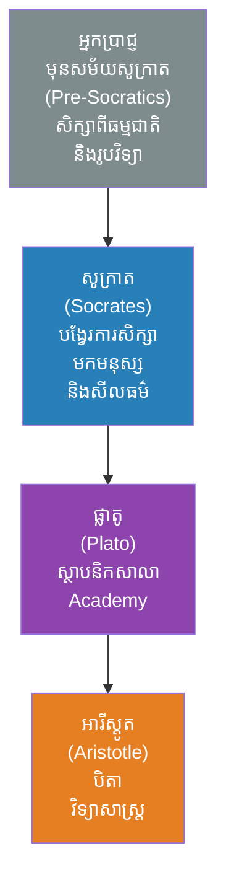
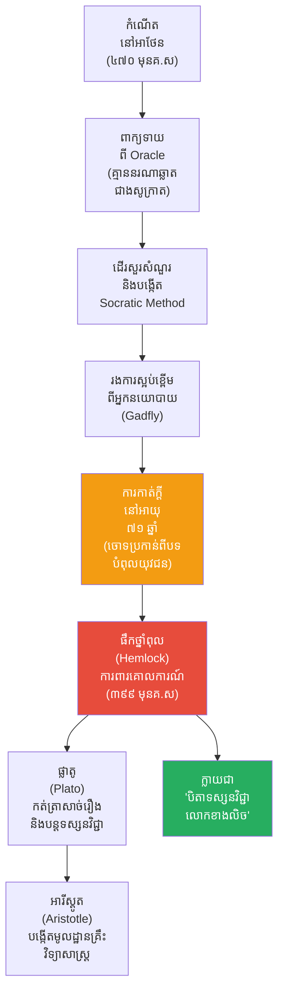

# The Biography of Socrates (ជីវប្រវត្តិសូក្រាត)

**Author:** ichamrong
**Date:** 2026-05-26
**Tags:** #socrates #biography #philosophy #socratic-method #athens #gold-standard
**Category:** Biographies
**Read Time:** ~15 min

---

## 📌 មាតិកា (Table of Contents)
- [សេចក្តីផ្តើម៖ កាយវិភាគវិទ្យានៃសត្វរុយ (The Anatomy of a Gadfly)](#intro)
- [១. កុមារភាព និងជាងកាត់ថ្ម (Childhood & The Stonemason)](#1)
- [២. ឥទ្ធិពលនៃការអប់រំ និងបេសកកម្ម (Education & The Mission)](#2)
- [៣. អាវុធរបស់សូក្រាត៖ វិធីសាស្ត្រឆ្មប (The Socratic Method)](#3)
- [៤. ព្រឹត្តិការណ៍ដ៏អស្ចារ្យបំផុត៖ ការកាត់ក្តីនៅអាថែន (The Greatest Event: The Trial of Socrates)](#4)
- [៥. ការប្រហារជីវិតដោយថ្នាំពុល (Death by Hemlock)](#5)
- [៦. ចិត្តសាស្ត្រ និងទស្សនវិជ្ជាពីកំណើតដល់ស្លាប់ (Psychology & Philosophy from Birth to Death)](#6)
- [៧. កំហុសឆ្គងដ៏ធំបំផុតដែលមិនគួរមាន (The Fatal Mistakes)](#7)
- [៨. កេរដំណែល (Legacy)](#8)
- [៩. តើលោកបានបំផុសគំនិតអ្វីខ្លះ? (What Did Socrates Inspire?)](#9)
- [សេចក្តីសន្និដ្ឋាន (Conclusion)](#conclusion)
- [🔗 ឯកសារទាក់ទង (Related Topics)](#related-topics)
- [ឯកសារយោង (References)](#references)

---

## សេចក្តីផ្តើម៖ កាយវិភាគវិទ្យានៃសត្វរុយ (The Anatomy of a Gadfly)

> **«តើអ្វីទៅដែលធ្វើឱ្យបុរសចំណាស់ក្រីក្រម្នាក់ ដែលដើរជើងទទេតាមដងផ្លូវ ក្លាយជាមនុស្សដែលរដ្ឋាភិបាលខ្លាចញញើតបំផុត រហូតដល់ត្រូវប្រហារជីវិត?»**

សាកស្រមៃមើលពីទិដ្ឋភាពនេះ៖ ទីក្រុងអាថែន ដែលជាមជ្ឈមណ្ឌលនៃអរិយធម៌ពិភពលោក កំពុងត្រូវរង្គោះរង្គើមិនមែនដោយសារកងទ័ពបរទេស តែដោយសារ **«មាត់»** របស់បុរសម្នាក់។ គាត់គ្មានលុយ គ្មានអំណាច គ្មានសូម្បីតែស្បែកជើងពាក់។ គាត់គ្រាន់តែដើរសួរ "សំណួរ"។ សម្រាប់អ្នកនយោបាយដែលមានអំណាច សំណួររបស់គាត់ប្រៀបដូចជាការចាក់ម្ជុលចូលទៅក្នុងសរសៃឈាម (Veins) ដែលបញ្ចេញនូវជាតិពុលនៃភាពល្ងង់ខ្លៅរបស់ពួកគេឱ្យពិភពលោកបានឃើញ។

តើកោសិកា (DNA) របស់បុរសម្នាក់នេះផ្សំឡើងពីអ្វី? តើគាត់ប្រើក្បួនចិត្តសាស្ត្រអ្វីដើម្បីធ្វើឱ្យអ្នកប្រាជ្ញបាក់មុខ ហើយយុវជនរាប់ម៉ឺននាក់ដើរតាមលោក? នេះមិនមែនជារឿងរបស់មេទ័ពដែលកាន់ដាវទេ តែជារឿងរបស់ **សូក្រាត (Socrates)** ដែលប្រើ "សំណួរ" ជាអាវុធដើម្បីវះកាត់ (Dissect) ផ្នត់គំនិតរបស់មនុស្សជាតិ។

---

## ១. កុមារភាព និងជាងកាត់ថ្ម (Childhood & The Stonemason)

សូក្រាត កើតនៅប្រហែលឆ្នាំ ៤៧០ មុនគ្រឹស្តសករាជ នៅក្នុងទីក្រុងអាថែន។ ឪពុករបស់គាត់ (Sophroniscus) គឺជាជាងកាត់ថ្មនិងសាងសង់ (Stonemason) ហើយម្តាយរបស់គាត់ (Phaenarete) គឺជាឆ្មប (Midwife)។ ក្នុងវ័យក្មេង សូក្រាតបានរៀនយកអាជីពតាមឪពុក ជាជាងឆ្លាក់ថ្ម។ គាត់ធ្លាប់បានចូលរួមបម្រើកងទ័ពក្នុងនាមជាទាហានថ្មើរជើង (Hoplite) យ៉ាងអង់អាចក្លាហាន នៅក្នុងសង្គ្រាម Peloponnesian War ដែលលោកបានជួយសង្គ្រោះជីវិតមេទ័ពល្បីៗជាច្រើន ដូចជា Alcibiades ជាដើម។

ក្រោយមក គាត់បានបោះបង់ការងារដើម្បីយកពេលពេញមួយជីវិតដើរស្វែងរកការពិត។ ផ្ទុយពីអ្នកប្រាជ្ញសម័យនោះ (Sophists) ដែលទារប្រាក់យ៉ាងថ្លៃសម្រាប់ការបង្រៀន សូក្រាតមិនដែលមានសាលារៀនផ្ទាល់ខ្លួនទេ គាត់រស់នៅក្នុងភាពក្រីក្រ និងបង្រៀនទស្សនវិជ្ជាដោយមិនយកប្រាក់មួយកាក់ឡើយ។

> 💡 **មេរៀនពីកុមារភាពដែលដក់ជាប់ដល់ស្លាប់ (The Lifelong Lesson):** អាជីពរបស់ឪពុកម្តាយបានចាក់ឫសយ៉ាងជ្រៅក្នុងផ្នត់គំនិតគាត់។ ដូចឪពុកជាជាងកាត់ថ្ម សូក្រាតតែងតែ "ដាប់ (Chisel away)" នូវជំនឿខុសឆ្គងរហូតដល់ឃើញការពិត។ ដូចម្តាយជាឆ្មប សូក្រាតប្រៀបខ្លួនឯងជា "ឆ្មបខាងគំនិត (Midwife of Ideas)" ដែលមិនមែនជាអ្នកផ្តល់គំនិតទេ តែជាអ្នកជួយបង្កើតគំនិតឱ្យចេញពីខួរក្បាលអ្នកដទៃ។

---

## ២. ឥទ្ធិពលនៃការអប់រំ និងបេសកកម្ម (Education & The Mission)

ចំណុចរបត់នៃជីវិតរបស់សូក្រាត កើតឡើងនៅពេលដែលមិត្តភក្តិរបស់គាត់ឈ្មោះ Chaerephon បានទៅសួរអាទិទេពនៅសក្ការៈបូជា Delphi ថា៖ *"តើមាននរណាម្នាក់ឆ្លាតជាងសូក្រាតដែរឬទេ?"* អាទិទេពបានឆ្លើយថា៖ *"គ្មាននរណាម្នាក់ឆ្លាតជាងសូក្រាតនោះទេ!"*

សូក្រាតមានការងឿងឆ្ងល់យ៉ាងខ្លាំង ព្រោះគាត់គិតថាខ្លួនឯង "មិនដឹងអ្វីទាំងអស់"។ ដើម្បីសាកល្បងការពិតនេះ គាត់បានដើរសួរសំណួរទៅកាន់អ្នកនយោបាយ អ្នកនិពន្ធ និងសិប្បករ ដែលគេគិតថាឆ្លាតបំផុតនៅក្នុងទីក្រុង។ លទ្ធផលគឺ អ្នកទាំងនោះពិតជាល្ងង់ខ្លៅ តែពួកគេមានអំនួតគិតថាខ្លួនចេះគ្រប់រឿង។ ទើបសូក្រាតយល់ថា៖ **"គាត់ឆ្លាតជាងគេ ព្រោះគាត់គឺជាមនុស្សតែម្នាក់គត់ ដែលហ៊ានទទួលស្គាល់ភាពល្ងង់ខ្លៅរបស់ខ្លួនឯង (I know that I know nothing)!"**

**ខ្សែស្រឡាយទស្សនវិជ្ជា (The Philosophical Lineage):**

> 💡 **ឥទ្ធិពលនៃការអប់រំ (The Impact of Education):** សូក្រាតបានទទួលការអប់រំតាមបែបប្រពៃណីអាថែន ប៉ុន្តែការអប់រំដែលធំបំផុតរបស់លោកគឺ "ផ្លូវសាធារណៈ (The Streets)"។ លោកជឿថា នរណាម្នាក់ក៏អាចក្លាយជាអ្នកប្រាជ្ញបានដែរ ឱ្យតែចេះសួរសំណួរត្រូវ។ លោកបានបង្វែរទស្សនវិជ្ជាក្រិក ពីការសិក្សាពី "ផ្កាយនិងធម្មជាតិ" មកសិក្សាពី "មនុស្ស និងសីលធម៌"។

---

## ៣. អាវុធរបស់សូក្រាត៖ វិធីសាស្ត្រឆ្មប (The Socratic Method)

សូក្រាតបានចំណាយពេលពេញមួយជីវិត ដើរតាមទីផ្សារសាធារណៈ (Agora) សួរសំណួរដើម្បីឱ្យគេពិចារណាពី "អ្វីទៅជាយុត្តិធម៌ និងសីលធម៌"។ 

វិធីសាស្ត្ររបស់គាត់ មិនមែនប្រាប់ចម្លើយទេ តែជាការសួរសំណួរបន្តបន្ទាប់គ្នា (Dialectic) រហូតទាល់តែអ្នកឆ្លើយរកឃើញភាពផ្ទុយគ្នានៅក្នុងគំនិតខ្លួនឯង។ នេះហៅថា **The Socratic Method (វិធីសាស្ត្រសូក្រាត)**។ ដោយសារការដើរសួរសំណួរដែលធ្វើឱ្យអ្នកនយោបាយមានអំណាចបាក់មុខ លោកបានប្រៀបធៀបខ្លួនឯងទៅនឹង **សត្វរុយ (Gadfly)** ដែលព្រះបញ្ជូនមកឱ្យទិច "សេះដ៏ធំដែលកំពុងដេកលក់" (ទីក្រុងអាថែន) ដើម្បីឱ្យវាភ្ញាក់ដឹងខ្លួន។

---

## ៤. ព្រឹត្តិការណ៍ដ៏អស្ចារ្យបំផុត៖ ការកាត់ក្តីនៅអាថែន (The Greatest Event: The Trial of Socrates, ៣៩៩ មុនគ.ស)

ព្រឹត្តិការណ៍ដែលធ្វើឱ្យសូក្រាតក្លាយជានិមិត្តរូបអមតៈ មិនមែនជាការរស់នៅរបស់លោកទេ ប៉ុន្តែជារបៀបដែលលោកជ្រើសរើស **"ការស្លាប់"**។ 

ការរំខានរបស់សូក្រាត បានធ្វើឱ្យពួកអភិជនខឹងសម្បារយ៉ាងខ្លាំង។ ពេលលោកមានអាយុ ៧១ ឆ្នាំ លោកត្រូវបានគេនាំយកទៅកាត់ក្តីនៅក្នុងតុលាការ ដែលមានចៅក្រម ៥០០ នាក់ ពីបទ "មិនជឿអាទិទេពរដ្ឋ និងបំពុលគំនិតយុវជន"។ 

នៅក្នុងតុលាការ ជំនួសឱ្យការយំអង្វរសុំជីវិត ដូចដែលចុងចោទដទៃតែងតែធ្វើ សូក្រាតបានការពារខ្លួនដោយភាពម៉ឺងម៉ាត់បំផុត។ លោកបានប្រកាសប្រយោគជាប្រវត្តិសាស្ត្រថា៖ **"ជីវិតដែលមិនបានត្រួតពិនិត្យ គឺមិនស័ក្តិសមនឹងរស់នៅនោះទេ (The unexamined life is not worth living)"**។ លោកបញ្ជាក់ថា ការឈប់សួរសំណួរ គឺស្មើនឹងការក្បត់ព្រះ ដូច្នេះលោកសុខចិត្តស្លាប់ប្រសើរជាងឈប់ធ្វើជាទស្សនវិទូ។

---

## ៥. ការប្រហារជីវិតដោយថ្នាំពុល (Death by Hemlock)

តុលាការបានសម្រេចផ្តន្ទាទោសប្រហារជីវិតលោក ដោយបញ្ជាឱ្យផឹកថ្នាំពុល (Hemlock)។

ពេលកំពុងជាប់គុក មិត្តភក្តិរបស់គាត់ (ដូចជា គ្រីតូ) បានសូកប៉ាន់ឆ្មាំគុក ដើម្បីរំដោះលោកឱ្យរត់គេចខ្លួន។ ប៉ុន្តែសូក្រាតបានបដិសេធដាច់អហង្ការ។ លោកបានពន្យល់ថា ការរត់គេចខ្លួន គឺជាការបំផ្លាញនូវក្រមសីលធម៌ (Integrity) ដែលលោកបានបង្រៀនពេញមួយជីវិត។ លោកបានជ្រើសរើសគោរពច្បាប់ ទោះបីជាច្បាប់នោះអយុត្តិធម៌សម្រាប់លោកក៏ដោយ។

នៅចំពោះមុខសិស្សដែលកំពុងយំសោក សូក្រាតបានលើកពែងថ្នាំពុលផឹកដោយក្តីស្ងប់ស្ងាត់បំផុត ហើយបានស្លាប់ដោយស្នាមញញឹម។

---

## ៦. ចិត្តសាស្ត្រ និងទស្សនវិជ្ជាពីកំណើតដល់ស្លាប់ (Psychology & Philosophy from Birth to Death)

ដើម្បីយល់ពីឥទ្ធិពលរបស់សូក្រាត យើងត្រូវស្វែងយល់ពីចិត្តសាស្ត្ររបស់លោក៖

*   **ភាពល្ងង់ខ្លៅខាងបញ្ញា (Socratic Ignorance):** លោកមានប្រព័ន្ធជំនឿយ៉ាងរឹងមាំថា "ប្រាជ្ញាពិត គឺការដឹងថាខ្លួនឯងមិនដឹងអ្វីសោះ"។ ផ្លូវចិត្តនេះជួយឱ្យលោកតែងតែបើកចិត្តទូលាយរៀនសូត្រជានិច្ច។
*   **សំឡេងខាងក្នុង (The Daimonion):** សូក្រាតអះអាងថាលោកមានសំឡេងអាទិទេពខ្សឹបប្រាប់នៅក្នុងក្បាល (Daimonion) ដែលតែងតែហាមឃាត់លោកនៅពេលដែលលោកបម្រុងនឹងធ្វើអ្វីមួយខុសឆ្គង។ នេះបង្ហាញពីការយល់ដឹងពីវិចារណញាណ (Intuition) ដ៏ជ្រៅរបស់លោក។
*   **ការយកឈ្នះលើសម្ភារៈនិយម (Asceticism):** លោកបដិសេធភាពមានបាន ដោយជឿថា "ព្រលឹង (Soul)" គឺជារបស់តែមួយគត់ដែលមានតម្លៃជាងគេ។ 
*   **ភាពក្លាហានខាងសីលធម៌ (Moral Courage):** សូក្រាតសុខចិត្តស្លាប់ជាជាងបោះបង់គោលការណ៍របស់ខ្លួន។ នេះគឺជាកម្រិតចិត្តសាស្ត្រដែលមនុស្សតិចតួចណាស់អាចធ្វើបាន (Integrity over survival)។
*   **វោហាសាស្ត្របញ្ច្រាស (Socratic Irony):** លោកចូលចិត្តធ្វើពុតជាល្ងង់ (ធ្វើជាមិនដឹង) ដើម្បីឱ្យសត្រូវនិយាយបញ្ចេញភាពល្ងង់របស់ខ្លួនមកដោយខ្លួនឯង។ វាគឺជាល្បិចចិត្តសាស្ត្រដ៏ប៉ិនប្រសប់បំផុតក្នុងការតទល់ជាមួយអ្នកមានអំនួត។

---

## ៧. កំហុសឆ្គងដ៏ធំបំផុតដែលមិនគួរមាន (The Fatal Mistakes)

ទោះបីជាសូក្រាតជាអ្នកប្រាជ្ញដ៏អស្ចារ្យ ប៉ុន្តែលោកក៏មានកំហុសឆ្គង (ឬភាពរឹងរូស) ដែលនាំឱ្យលោកត្រូវស្លាប់៖

1.  **ភាពក្រអឺតក្រទមក្នុងតុលាការ (Arrogance in Court):** នៅក្នុងការកាត់ក្តី ពេលតុលាការសួរថាតើលោកគួរទទួលទោសអ្វី ជំនួសឱ្យការសុំនិរទេសខ្លួន សូក្រាតបែរជាឆ្លើយថា លោកគួរតែត្រូវបានរដ្ឋផ្តល់អាហារហូបចុកដោយឥតគិតថ្លៃពេញមួយជីវិត ជារង្វាន់សម្រាប់គុណបំណាច់របស់លោក។ សម្តីនេះបានបញ្ឆេះកំហឹងចៅក្រមឱ្យបោះឆ្នោតប្រហារជីវិតលោកភ្លាមៗ។
2.  **ការធ្វើឱ្យមនុស្សគ្រប់គ្នាខ្មាសអៀន (Alienating Everyone):** ការដែលលោកដើរបំបាក់មុខអ្នកនយោបាយ និងអភិជនជាសាធារណៈអស់រយៈពេលជាច្រើនទសវត្សរ៍ បានសន្សំនូវសត្រូវរាប់មិនអស់។ ទោះលោកធ្វើក្នុងបំណងល្អ ប៉ុន្តែលោកមិនបានខ្វល់ពី "មុខមាត់ (Ego)" របស់មនុស្សដទៃឡើយ។
3.  **មិត្តភាពជាមួយជនក្បត់ជាតិ (Guilt by Association):** សិស្សរបស់លោកមួយចំនួន ដូចជា Alcibiades និង Critias បានក្លាយជាមេដឹកនាំផ្តាច់ការដែលសម្លាប់រង្គាលអ្នកក្រុងអាថែនរាប់ពាន់នាក់។ ទោះសូក្រាតមិនចូលរួមក៏ដោយ ក៏ប្រជាជនបានទម្លាក់កំហុសមកលើការបង្រៀនរបស់លោក។

---

## ៨. កេរដំណែល (Legacy)

សូក្រាតមិនដែលសរសេរសៀវភៅសូម្បីតែមួយទំព័រពេញមួយជីវិតរបស់គាត់។ អ្វីៗទាំងអស់ដែលយើងដឹងពីសូក្រាត គឺត្រូវបានសរសេរឡើងដោយសិស្សឆ្នើមរបស់គាត់ គឺ **ផ្លាតូ (Plato)**។ ប៉ុន្តែលោកបានបន្សល់ទុកនូវបេតិកភណ្ឌដែលមិនអាចកាត់ថ្លៃបាន នោះគឺប្រព័ន្ធនៃការគិត។

---

## ៩. តើលោកបានបំផុសគំនិតអ្វីខ្លះ? (What Did Socrates Inspire?)

នេះគឺជាបញ្ជីរាយនាមរឿងរ៉ាវ និងគោលគំនិតចំនួន ២៥ ដែលសូក្រាតបានបំផុសគំនិត និងបន្សល់ទុកជាមរតកសម្រាប់មនុស្សជាតិ៖

1.  **វិធីសាស្ត្រសូក្រាត (The Socratic Method):** វិធីសាស្ត្រសួរសំណួរដែលនៅតែត្រូវបានប្រើប្រាស់ជាស្តង់ដារក្នុងសាលាច្បាប់ (Law schools) ជុំវិញពិភពលោករហូតដល់សព្វថ្ងៃ។
2.  **ការត្រិះរិះពិចារណា (Critical Thinking):** បង្កើតគ្រឹះនៃការគិតបែបសង្ស័យ និងមិនជឿលើអ្វីមួយដោយគ្មានភស្តុតាង។
3.  **ទស្សនវិជ្ជាលោកខាងលិច (Western Philosophy):** លោកត្រូវបានចាត់ទុកថាជា "បិតា" នៃទស្សនវិជ្ជាលោកខាងលិចទាំងមូល។
4.  **ការបះបោរដោយសន្តិវិធី (Civil Disobedience):** បំផុសគំនិតដល់វីរបុរសដូចជា Martin Luther King Jr. និង Gandhi ឱ្យហ៊ានប្រឆាំងនឹងច្បាប់អយុត្តិធម៌ដោយសន្តិវិធី។
5.  **សាលា Academy របស់ផ្លាតូ (Plato's Academy):** ការបង្រៀនរបស់លោកបានជំរុញឱ្យផ្លាតូបង្កើតសាលាសាកលវិទ្យាល័យដំបូងគេបង្អស់នៅអឺរ៉ុប។
6.  **ទស្សនវិជ្ជា Stoicism (លទ្ធិស្ដូអ៊ិច):** Zeno ដែលជាស្ថាបនិក Stoicism បានយកគំរូតាមភាពអត់ធ្មត់ និងការគ្រប់គ្រងអារម្មណ៍របស់សូក្រាត។
7.  **ទស្សនវិជ្ជា Cynicism:** Diogenes បានយកគំរូនៃការរស់នៅបែបក្រីក្រ និងការបដិសេធសម្ភារៈនិយមរបស់សូក្រាត មកបង្កើតលទ្ធិអនាថា។
8.  **ក្រមសីលធម៌វិជ្ជាជីវៈ (Ethics as a Field):** លោកគឺជាមនុស្សដំបូងដែលបំប្លែងទស្សនវិជ្ជាពីការសិក្សា "ធម្មជាតិ" មកជាការសិក្សាពី "អ្វីដែលល្អ និង អ្វីដែលអាក្រក់"។
9.  **គំនិតអំពីព្រលឹង (The Concept of the Soul):** លោកបានលើកឡើងថា "ព្រលឹង (Psyche)" គឺជាទីតាំងនៃបញ្ញា និងសីលធម៌ មិនមែនជារបស់ខ្មោចបិសាចឡើយ។
10. **ភាពក្លាហានខាងបញ្ញា (Intellectual Humility):** ការទទួលស្គាល់ថា "ខ្លួនឯងមិនដឹងអ្វីសោះ" ក្លាយជាកាតាលីករនៃការស្រាវជ្រាវបែបវិទ្យាសាស្ត្រ។
11. **ការព្យាបាលតាមបែបអាកប្បកិរិយា (Cognitive Behavioral Therapy - CBT):** ចិត្តវិទូសម័យទំនើបប្រើប្រាស់សំណួរសូក្រាត ដើម្បីជួយអ្នកជំងឺឱ្យមើលឃើញពីកំហុសនៃការគិតរបស់ពួកគេ។
12. **ការសួរដេញដោលក្នុងតុលាការ (Cross-examination):** បច្ចេកទេសសួរត្រឡប់ដើម្បីរកភាពកុហកនៅក្នុងតុលាការ គឺមានប្រភពចេញពីលោក។
13. **សេរីភាពនៃការបញ្ចេញមតិ (Freedom of Speech):** ការស្លាប់របស់លោកគឺជានិមិត្តរូបនៃការតស៊ូទាមទារសិទ្ធិក្នុងការបញ្ចេញមតិ និងគំនិតផ្ទុយពីរដ្ឋ។
14. **ការរិះគន់ស្ថាបនា (Constructive Criticism):** គំនិតដែលថា "សង្គមមួយត្រូវការអ្នករិះគន់ ដើម្បីរីកចម្រើន" (ដូចសត្វរុយទិចសេះ)។
15. **ការមិនលំអៀង និងការស្វែងរកសេចក្តីពិត (Objectivity):** បង្រៀនមនុស្សឱ្យញែក "ការពិត" ឱ្យដាច់ពី "វោហាសាស្ត្រ ឬ ការបោកប្រាស់"។
16. **ការស្លាប់ដើម្បីគោលការណ៍ (Martyrdom for Free Thought):** ក្លាយជាទុក្ករបុគ្គលទីមួយ ដែលហ៊ានស្លាប់ដើម្បីការពារសិទ្ធិក្នុងការគិត។
17. **ទស្សនៈអភិបាលកិច្ច (Views on Governance):** ការសួរសំណួររបស់លោក បានបង្កើតឱ្យមានការជជែកដេញដោលអំពីទម្រង់រដ្ឋាភិបាលល្អបំផុត (លទ្ធិប្រជាធិបតេយ្យ vs សាធារណរដ្ឋ) នៅក្នុងសៀវភៅ "The Republic" របស់ផ្លាតូ។
18. **សុចរិតភាព (Integrity):** ការបដិសេធមិនព្រមរត់ចេញពីគុក ជាគំរូនៃភាពស្មោះត្រង់ចំពោះក្រឹត្យក្រមច្បាប់។
19. **ញាណវិទ្យា (Epistemology):** បង្កើតគ្រឹះនៃការសិក្សាអំពី "តើយើងដឹងអ្វីខ្លះ ហើយយើងដឹងវាដោយរបៀបណា?"
20. **ល្បិចសូក្រាត (Socratic Irony):** បច្ចេកទេសធ្វើពុតជាល្ងង់ ដើម្បីឱ្យអ្នកដទៃនិយាយចេញមក រហូតទាល់តែពួកគេបរាជ័យដោយសម្តីខ្លួនឯង។
21. **គោលការណ៍ជីវិត (The Examined Life):** ឃ្លាអមតៈ "ជីវិតដែលមិនបានត្រួតពិនិត្យ គឺមិនស័ក្តិសមនឹងរស់នៅទេ" បានដាស់ស្មារតីមនុស្សរាប់លាននាក់។
22. **គំនិតនៃអាទិទេពតែមួយ (Monotheistic hints):** តាមរយៈ Daimonion របស់លោក លោកហាក់ដូចជាជឿលើអំណាចខាងវិញ្ញាណតែមួយ ដែលផ្ទុយពីជំនឿអាទិទេពច្រើន (Polytheism) របស់រដ្ឋ។
23. **ការបដិសេធការស្មាន (Refutation / Elenchus):** ដំណើរការនៃការជម្រុះចោលនូវសម្មតិកម្មខុសឆ្គង ដែលជាមូលដ្ឋានគ្រឹះនៃវិធីសាស្ត្រវិទ្យាសាស្ត្រ (Scientific Method)។
24. **វីរភាពនៃការមិនចូលរួមអំពើអាក្រក់ (Refusal to act unjustly):** ពេលរដ្ឋបញ្ជាឱ្យលោកទៅចាប់ខ្លួន Leon of Salamis មកសម្លាប់ លោកសុខចិត្តបដិសេធ និងដើរត្រឡប់ទៅផ្ទះវិញដោយមិនខ្វល់ពីគ្រោះថ្នាក់។
25. **ទស្សនវិជ្ជានៃការស្លាប់ (Philosophy of Death):** ការចាត់ទុកការស្លាប់ថា មិនមែនជារឿងគួរឱ្យខ្លាច តែជា "ការគេងលក់ដ៏ស្ងប់ស្ងាត់" ឬ "ការធ្វើដំណើរទៅជួបអ្នកប្រាជ្ញជំនាន់មុន"។

---

## សេចក្តីសន្និដ្ឋាន (Conclusion)

> **«ជីវិតដែលមិនបានត្រួតពិនិត្យ គឺមិនស័ក្តិសមនឹងរស់នៅនោះទេ» — សូក្រាត**

សូក្រាតបានបង្ហាញឱ្យពិភពលោកឃើញថា អាវុធដែលមានអំណាចបំផុតនៅលើផែនដី មិនមែនជាដាវ ឬ លំពែង នោះទេ តែគឺ **"សំណួរ"**។ ទោះបីជាអាថែនបានប្រហារជីវិតរាងកាយរបស់គាត់ក៏ដោយ ប៉ុន្តែទីក្រុងនោះមិនអាចសម្លាប់ "គំនិត" របស់គាត់បានឡើយ។ សូក្រាតបានស្លាប់ទៅ ប៉ុន្តែលោកបានបន្សល់ទុកនូវគ្រាប់ពូជនៃការត្រិះរិះពិចារណា ដែលបានរីកដុះដាលក្លាយជាអរិយធម៌លោកខាងលិចទាំងមូល។ លោកនៅតែបន្តធ្វើជា "សត្វរុយ" ដែលតែងតែតាមទិចដាស់តឿនយើងគ្រប់គ្នា ឱ្យភ្ញាក់ពីការដេកលក់ក្នុងភាពល្ងង់ខ្លៅរហូតមកដល់សព្វថ្ងៃ។

---

## 🔗 ឯកសារទាក់ទង (Related Topics)
* [ខ្សែស្រឡាយសូក្រាត (The Socratic Lineage)](../socrates/02-socrates-lineage.md)
* [ជីវប្រវត្តិផ្លាតូ (Plato Biography)](../plato/01-plato-biography.md)
* [ជីវប្រវត្តិអារីស្តូត (Aristotle Biography)](../aristotle/01-aristotle-biography.md)
* [ជីវប្រវត្តិអាឡិចសាន់ឌឺ (Alexander the Great)](../alexander/01-alexander-biography.md)

## ឯកសារយោង (References)

*   **Plato's Dialogues (Apology, Crito, Phaedo)** — The primary texts documenting Socrates' defense at his trial, his refusal to escape prison, and his final moments.
*   **The Socratic Method** — The foundational pedagogical technique in Western education and law.

---

*Last updated: 2026-05-26*
