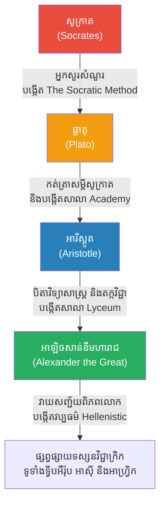

# The Golden Chain of Philosophy (ខ្សែប្រវត្តិសាស្ត្រទស្សនវិជ្ជារបស់សូក្រាត)

**Author:** ichamrong  
**Date:** 2026-05-23  
**Tags:** #socrates #plato #aristotle #alexander #philosophy #history  
**Category:** Biographies  
**Read Time:** ~10 min  

---

## 📌 មាតិកា (Table of Contents)
- [១. ខ្សែច្រវាក់មាសនៃទស្សនវិជ្ជា (The Golden Chain)](#1)
- [២. ផ្លាតូ៖ អ្នកកត់ត្រានិងអ្នកបង្កើតសាលា (Plato - The Recorder)](#2)
- [៣. អារីស្តូត៖ បិតាវិទ្យាសាស្ត្រ (Aristotle - The Scientist)](#3)
- [៤. អាឡិចសាន់ឌឺមហារាជ៖ អ្នកសញ្ជ័យពិភពលោក (Alexander the Great)](#4)
- [៥. កេរដំណែល និងឥទ្ធិពល (The Effect and Impact)](#5)
- [🔗 ឯកសារទាក់ទង (Related Topics)](#related-topics)
- [ឯកសារយោង (References)](#references)

---

## ១. ខ្សែច្រវាក់មាសនៃទស្សនវិជ្ជា (The Golden Chain)

នៅក្នុងប្រវត្តិសាស្ត្រលោកខាងលិច មិនមានខ្សែស្រឡាយគ្រូនិងសិស្សណាមួយ ដែលមានឥទ្ធិពលខ្លាំងក្លាជាងខ្សែស្រឡាយរបស់ **សូក្រាត (Socrates)** នោះទេ។ 

ដូចដែលយើងដឹងស្រាប់ហើយថា សូក្រាតមិនដែលសរសេរសៀវភៅសូម្បីតែមួយទំព័រ។ គាត់ត្រឹមតែដើរសួរសំណួរនៅតាមទីផ្សារប៉ុណ្ណោះ។ ប៉ុន្តែឥទ្ធិពលនៃការបង្រៀនរបស់គាត់ បានបង្កើតនូវ "ខ្សែច្រវាក់មាសនៃទស្សនវិជ្ជា (The Golden Chain of Philosophy)" ចំនួន ៣ ជំនាន់ ដែលបានផ្លាស់ប្តូរមុខមាត់ពិភពលោកទាំងមូល៖ **សូក្រាត បង្រៀន ផ្លាតូ, ផ្លាតូ បង្រៀន អារីស្តូត, ហើយ អារីស្តូត បង្រៀន អាឡិចសាន់ឌឺមហារាជ**។

---

## ២. ផ្លាតូ៖ អ្នកកត់ត្រានិងអ្នកបង្កើតសាលា (Plato - The Recorder)

**ផ្លាតូ (Plato, ៤២៨–៣៤៨ មុនគ.ស)** គឺជាសិស្សដ៏ឆ្នើមបំផុតរបស់សូក្រាត និងជាយុវជនមកពីត្រកូលអភិជន។ 
ពេលផ្លាតូមានអាយុ ២៨ ឆ្នាំ គាត់បានឃើញគ្រូរបស់គាត់ (សូក្រាត) ត្រូវរដ្ឋាភិបាលប្រជាធិបតេយ្យអាថែន កាត់ក្តីប្រហារជីវិតយ៉ាងអយុត្តិធម៌ដោយការផឹកថ្នាំពុល។ ព្រឹត្តិការណ៍នេះបានធ្វើឱ្យផ្លាតូស្អប់ខ្ពើមប្រព័ន្ធនយោបាយនៅអាថែនយ៉ាងខ្លាំង។

**ឥទ្ធិពលនិងស្នាដៃរបស់ផ្លាតូ៖**
*   **អ្នកកត់ត្រា៖** ដើម្បីការពារកុំឱ្យការបង្រៀនរបស់គ្រូត្រូវបាត់បង់ ផ្លាតូបានសរសេរសៀវភៅជាច្រើន ក្រោមទម្រង់ជាកិច្ចសន្ទនា (Dialogues) ដោយឱ្យសូក្រាតដើរតួជាតួឯកដើរសួរសំណួរ។ ដូច្នេះ អ្វីៗទាំងអស់ដែលពិភពលោកស្គាល់ពីសូក្រាតថ្ងៃនេះ គឺចេញពីប៊ិចរបស់ផ្លាតូទាំងស្រុង។
*   **បង្កើតសាលារៀន (The Academy):** ផ្លាតូបានបង្កើតសាលារៀនដំបូងគេបង្អស់នៅលោកខាងលិចឈ្មោះថា **Academy** នៅជាយក្រុងអាថែន ដើម្បីបង្រៀនយុវជនឱ្យចេះគិតពិចារណា។ (ពាក្យថា Academy ឬ Academics ដែលយើងប្រើសព្វថ្ងៃ គឺមានប្រភពមកពីសាលារបស់ផ្លាតូនេះឯង)។
*   **សៀវភៅ The Republic:** ផ្លាតូបានស្នើឡើងថា ប្រទេសមួយមិនគួរដឹកនាំដោយអ្នកនយោបាយពុករលួយ ឬមនុស្សសាមញ្ញដែលខ្វះការយល់ដឹងនោះទេ (ព្រោះពួកគេបានសម្លាប់សូក្រាត) តែគួរតែដឹកនាំដោយ **"ស្តេចទស្សនវិទូ (Philosopher Kings)"** ដែលមានប្រាជ្ញានិងសីលធម៌ខ្ងស់។

---

## ៣. អារីស្តូត៖ បិតាវិទ្យាសាស្ត្រ (Aristotle - The Scientist)

**អារីស្តូត (Aristotle, ៣៨៤–៣២២ មុនគ.ស)** បានចូលរៀននៅសាលា Academy របស់ផ្លាតូ នៅពេលគាត់មានអាយុ ១៧ ឆ្នាំ ហើយបានរៀននៅទីនោះរយៈពេល ២០ ឆ្នាំ។ គាត់គឺជាសិស្សដែលឆ្លាតបំផុតរបស់ផ្លាតូ ប៉ុន្តែក្រោយមក គាត់បានដើរផ្លូវផ្ទុយពីគ្រូរបស់គាត់។

ខណៈពេលដែលផ្លាតូ ផ្តោតលើពិភពនៃព្រលឹង និងគំនិតអរូបី (Idealism) អារីស្តូត គឺជាមនុស្សដែលជឿលើការពិត និងការសង្កេតជាក់ស្តែង (Realism)។ លោកធ្លាប់ពោលថា៖ *"ខ្ញុំស្រលាញ់ផ្លាតូ (គ្រូខ្ញុំ) ប៉ុន្តែខ្ញុំស្រលាញ់ការពិត (Truth) ជាង។"*

**ឥទ្ធិពលនិងស្នាដៃរបស់អារីស្តូត៖**
*   **បិតាវិទ្យាសាស្ត្រ និងតក្កវិជ្ជា (Father of Science & Logic):** គាត់បានដើរសង្កេតនិងចាត់ថ្នាក់សត្វ រុក្ខជាតិ ធាតុអាកាស និងក្បួនតារាសាស្ត្រ។ គាត់គឺជាអ្នកបង្កើតក្បួន **តក្កវិជ្ជា (Logic/Syllogism)** ដំបូងគេ ដែលជាគ្រឹះនៃការវែកញែកហេតុផលតាមបែបវិទ្យាសាស្ត្រ។
*   **Lyceum:** បន្ទាប់ពីផ្លាតូស្លាប់ អារីស្តូតមិនបានឡើងជាប្រធានសាលា Academy ទេ ប៉ុន្តែគាត់បានទៅបង្កើតសាលាផ្ទាល់ខ្លួនមួយទៀតឈ្មោះថា **Lyceum**។

---

## ៤. អាឡិចសាន់ឌឺមហារាជ៖ អ្នកសញ្ជ័យពិភពលោក (Alexander the Great)

ស្តេច ហ្វីលីពទី២ (Philip II) នៃចក្រភពម៉ាសេដូន (Macedon) បានអញ្ជើញអារីស្តូតឱ្យមកធ្វើជាគ្រូបង្រៀនផ្ទាល់ដល់កូនប្រុសរបស់ខ្លួន ដែលមានអាយុ ១៣ ឆ្នាំ។ ក្មេងប្រុសនោះមានឈ្មោះថា **អាឡិចសាន់ឌឺ (Alexander)**។

អារីស្តូតបានបង្រៀនអាឡិចសាន់ឌឺ អំពីទស្សនវិជ្ជា ពេទ្យ សីលធម៌ តក្កវិជ្ជា និងសិល្បៈនៃការដឹកនាំ។ នៅពេលអាឡិចសាន់ឌឺឡើងគ្រងរាជ្យនៅអាយុ ២០ ឆ្នាំ គាត់បានប្រើប្រាស់ប្រាជ្ញាដែលរៀនពីអារីស្តូត រួមបញ្ចូលជាមួយភាពក្លាហានក្នុងការធ្វើសង្គ្រាម ដើម្បីវាយលុកនិងគ្រប់គ្រងចក្រភពពែរ្ស (Persia) អេហ្ស៊ីប (Egypt) និងរហូតទៅដល់ប្រទេសឥណ្ឌា (India) ដោយមិនធ្លាប់ចាញ់សង្គ្រាមសូម្បីតែម្តង។

គាត់បានស្លាប់នៅអាយុត្រឹមតែ ៣២ ឆ្នាំ តែគាត់បានទទួលរហស្សនាមថា **អាឡិចសាន់ឌឺមហារាជ (Alexander the Great)**។

---

## ៥. កេរដំណែល និងឥទ្ធិពល (The Effect and Impact)

ឥទ្ធិពលនៃ "សិស្សជំនាន់ក្រោយ" របស់សូក្រាត គឺមិនអាចកាត់ថ្លៃបានឡើយ។ 
- បើគ្មាន **ផ្លាតូ** ទស្សនវិជ្ជារបស់សូក្រាតនឹងត្រូវកប់បាត់ក្នុងប្រវត្តិសាស្ត្រ។
- បើគ្មាន **អារីស្តូត** យើងប្រហែលជាគ្មានមូលដ្ឋានគ្រឹះនៃវិធីសាស្ត្រវិទ្យាសាស្ត្រ (Scientific Method) សម្រាប់ប្រើប្រាស់រហូតដល់សតវត្សទី ១៦ នោះទេ។
- បើគ្មាន **អាឡិចសាន់ឌឺ** ទស្សនវិជ្ជានិងវប្បធម៌ក្រិក នឹងមិនអាចរីកសាយភាយ និងជះឥទ្ធិពលដល់ចក្រភពរ៉ូម និងអារ៉ាប់ ដែលក្លាយជាគ្រឹះនៃអរិយធម៌លោកខាងលិចទាំងមូលនោះទេ។

---

## 🔗 ឯកសារទាក់ទង (Related Topics)
* [ជីវប្រវត្តិសូក្រាត (Socrates Biography)](../socrates/01-socrates-biography.md)
* [ជីវប្រវត្តិផ្លាតូ (Plato Biography)](../plato/01-plato-biography.md)
* [ជីវប្រវត្តិអារីស្តូត (Aristotle Biography)](../aristotle/01-aristotle-biography.md)
* [ជីវប្រវត្តិអាឡិចសាន់ឌឺ (Alexander the Great)](../alexander/01-alexander-biography.md)

---

## ឯកសារយោង (References)

*   **Plato's Dialogues** — The primary source for the life and philosophy of Socrates.
*   **The Republic by Plato** — A Socratic dialogue detailing the nature of justice and the ideal state.
*   **Plutarch's Life of Alexander** — Historical accounts detailing the relationship and tutelage of young Alexander by Aristotle.
