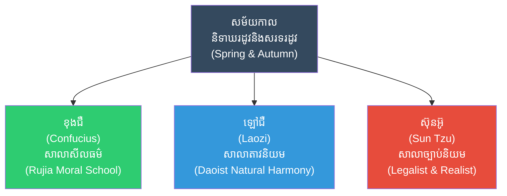
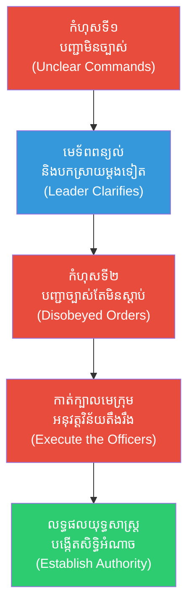
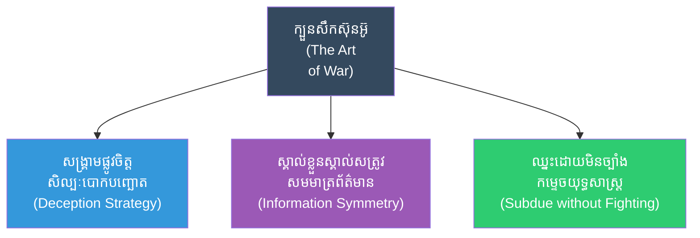
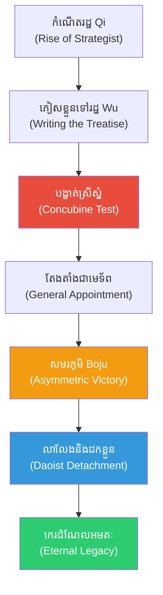

# The Biography of Sun Tzu (ជីវប្រវត្តិ ស៊ុន អ៊ូ)

**Author:** ichamrong  
**Date:** 2026-05-27  
**Tags:** #suntzu #biography #artofwar #strategy #military #philosophy #psychology #legalism  
**Category:** Biographies  
**Read Time:** ~25 min  

---

## 📌 មាតិកា (Table of Contents)
- [សេចក្តីផ្តើម៖ កាយវិភាគវិទ្យានៃអ្នកយុទ្ធសាស្ត្រ (The Anatomy of a Strategist)](#intro)
- [១. កំណើត និងបរិបទសង្គ្រាម៖ ការប៉ះទង្គិចនៃមនោគមវិជ្ជា (Birth & The Clash of Ideologies)](#1)
- [២. ការធ្វើតេស្តដ៏ឃោរឃៅ៖ ចិត្ដវិទ្យានៃការបង្កើតសិទ្ធិអំណាច (The Concubine Test & Cognitive Authority)](#2)
- [៣. ជ័យជម្នះនៃរដ្ឋអ៊ូ និងសមរភូមិ Boju (The Victories of Wu & Asymmetric Warfare)](#3)
- [៤. ក្បួនសឹកស៊ុនអ៊ូ៖ វិទ្យាសាស្ត្រការយល់ដឹង (The Art of War & Cognitive Science)](#4)
- [៥. ភាពអាថ៌កំបាំងនៃការបាត់ខ្លួន៖ ទស្សនវិជ្ជាដកខ្លួនរបស់តាវនិយម (The Escape & Daoist Detachment)](#5)
- [៦. តុល្យភាពចិត្តសាស្ត្រ និងទស្សនវិជ្ជា (The Stoic-Daoist Psychological Synthesis)](#6)
- [៧. ភាពផ្ទុយគ្នា និងការរិះគន់៖ សីលធម៌ធៀបនឹងប្រសិទ្ធភាព (Paradoxes & Moral Criticisms)](#7)
- [៨. កេរដំណែលយុទ្ធសាស្ត្រ (Legacy Flow)](#8)
- [៩. តើស៊ុនអ៊ូបានបំផុសគំនិតអ្វីខ្លះ? (What Did Sun Tzu Inspire?)](#9)
- [សេចក្តីសន្និដ្ឋាន (Conclusion)](#conclusion)
- [🔗 ឯកសារទាក់ទង (Related Topics)](#related-topics)
- [ឯកសារយោង (References)](#references)

---

## សេចក្តីផ្តើម៖ កាយវិភាគវិទ្យានៃអ្នកយុទ្ធសាស្ត្រ (The Anatomy of a Strategist)

> **«យុទ្ធសាស្ត្រកំពូល គឺការកម្ចាត់សត្រូវដោយមិនចាំបាច់ប្រយុទ្ធ។» — ស៊ុន អ៊ូ**  
> *(“The supreme art of war is to subdue the enemy without fighting.” — Sun Tzu)*

សាកស្រមៃមើលពីទិដ្ឋភាពនេះ៖ ជាង ២៥០០ ឆ្នាំមុន នៅក្នុងប្រទេសចិនដែលកំពុងហែកហួរដោយសង្គ្រាមស៊ីវិលរវាងរដ្ឋនិងរដ្ឋ (Spring and Autumn Period)។ ស្តេចគ្រប់អង្គកំពុងស្វែងរកមេទ័ពដែលពូកែកាប់សម្លាប់ ដើម្បីពង្រីកទឹកដីរបស់ខ្លួន។ ប៉ុន្តែមានបុរសម្នាក់បានដើរចូលមកក្នុងរាជវាំង ហើយប្រាប់ស្តេចថា៖ «សង្គ្រាមមិនមែនជាការកាប់សម្លាប់គ្នាទេ តែវាគឺជាសិល្បៈនៃការបោកបញ្ឆោត (Art of Deception) វាយប្រហារផ្លូវចិត្ត និងការគណនាយ៉ាងល្អិតល្អន់»។ 

គាត់បានសរសេរសៀវភៅតូចមួយមាន ១៣ ជំពូក ដែលមិនត្រឹមតែផ្លាស់ប្តូររបៀបធ្វើសង្គ្រាមនៅអាស៊ីប៉ុណ្ណោះទេ ប៉ុន្តែរាប់ពាន់ឆ្នាំក្រោយមក សៀវភៅនេះត្រូវបានអានដោយមេដឹកនាំសកលលោក តាំងពី ម៉ៅសេទុង, ណាប៉ូឡេអុង, នាយកប្រតិបត្តិក្រុមហ៊ុន (CEOs) ធំៗនៅ Wall Street និងសូម្បីតែកីឡាករបាល់ទាត់។ តើបុរសដែលដឹងពីរបៀបឈ្នះរាល់ការប្រកួតប្រជែងទាំងអស់នេះជានរណា? នេះគឺជារឿងរ៉ាវរបស់ **ស៊ុន អ៊ូ (Sun Tzu / Sun Wu)** ដែលជាបិតានៃយុទ្ធសាស្ត្រយោធា និងចិត្តវិទ្យានៃជម្លោះ។

---

## ១. កំណើត និងបរិបទសង្គ្រាម៖ ការប៉ះទង្គិចនៃមនោគមវិជ្ជា (Birth & The Clash of Ideologies)

ស៊ុន អ៊ូ (Sun Wu) ត្រូវបានគេជឿថាកើតនៅប្រហែលឆ្នាំ ៥៤4 មុនគ្រឹស្តសករាជ នៅក្នុងរដ្ឋ Qi (ឬរដ្ឋ Wu)។ គាត់រស់នៅក្នុងយុគសម័យតែមួយជាមួយ ខុងជឺ (Confucius) និង ឡៅជឺ (Laozi) ប៉ុន្តែពួកគេមានទស្សនៈខុសគ្នាស្រឡះ៖

### 🏛️ [គ្រឹះទស្សនវិជ្ជា] / [Philosophical Core] - ទស្សនវិជ្ជានៅពីក្រោយបរិបទ (The Ideological Clash)
ខណៈដែលរដ្ឋ Qi មានបរិយាកាសវប្បធម៌ដ៏សម្បូរបែប និងលើកកម្ពស់សីលធម៌បែបខុងជឺ ស៊ុនអ៊ូបានសង្កេតឃើញថា រាល់គោលការណ៍គុណធម៌ដ៏ល្អៗត្រូវបានកម្ទេចដោយមហិច្ឆតាយោធារបស់រដ្ឋធំៗ។ នេះបានជម្រុញឱ្យគាត់ចាកចេញពីរដ្ឋ Qi ទៅកាន់រដ្ឋ Wu ដែលជារដ្ឋទន់ខ្សោយផ្នែកវប្បធម៌ប៉ុន្តែស្រេកឃ្លានអំណាច។

នៅទីនោះ គាត់បានសរសេរសៀវភៅក្បួនសឹកដោយបញ្ចូលគ្នាជាមួយ៖
1. **ទស្សនវិជ្ជាប្រាកដនិយម និងច្បាប់និយម (Legalism/Fajia):** ការជឿថាប្រព័ន្ធ និងវិន័យដាច់ខាត គឺជាគន្លឹះនៃការគ្រប់គ្រងមនុស្ស មិនមែនសេចក្តីល្អរបស់បុគ្គលឡើយ។
2. **ការសង្កេតកំហុសប្រវត្តិសាស្ត្រ (Historical Empirical Analysis):** ភាពវៃឆ្លាតរបស់ស៊ុនអ៊ូ មិនមែនកើតឡើងដោយចៃដន្យទេ តែវាជាលទ្ធផលនៃការសង្កេតរាល់កំហុស និងការស្លាប់របស់កងទ័ពរាប់សែននាក់ក្នុងយុគសម័យរបស់គាត់។

---

## ២. ការធ្វើតេស្តដ៏ឃោរឃៅ៖ ចិត្ដវិទ្យានៃការបង្កើតសិទ្ធិអំណាច (The Concubine Test & Cognitive Authority)

ព្រឹត្តិការណ៍ដែលធ្វើឱ្យស៊ុនអ៊ូល្បីល្បាញបំផុត គឺការធ្វើតេស្តពីស្តេច ហូ លូ (King Helü) នៃរដ្ឋអ៊ូ។ ស្តេចចង់សាកល្បងថាតើទ្រឹស្តីសឹករបស់ស៊ុនអ៊ូអាចយកទៅប្រើប្រាស់ជាក់ស្តែងជាមួយ **ស្រីស្នំ ១៨០ នាក់** បានឬអត់។

ស៊ុនអ៊ូបានយល់ព្រម និងតែងតាំងស្រីស្នំសំណព្វចិត្ត ២ នាក់របស់ស្តេចឱ្យធ្វើជាមេក្រុម។ នៅពេលគាត់បញ្ជាឱ្យបត់ស្តាំ ស្រីស្នំទាំងអស់នាំគ្នាសើចក្អាកក្អាយ។ 

> [!IMPORTANT]
> **🧠 [យន្តការចិត្តសាស្ត្រ] / [Psychological Mechanism] - មេរៀនគ្រឹះនៃការដឹកនាំ (Foundational Leadership Lesson):**
> * «បើបញ្ជាមិនច្បាស់លាស់ វាជាកំហុសរបស់មេទ័ព» (*If commands are not clear, it is the fault of the general*).
> * «បើបញ្ជាច្បាស់លាស់ហើយ តែពលទាហានមិនធ្វើតាម វាជាកំហុសរបស់មេក្រុម» (*If commands are clear and not obeyed, it is the fault of the officers*).

ទោះបីជាស្តេចភ័យស្លន់ស្លោ និងសុំអង្វរយ៉ាងណាក៏ដោយ ក៏ស៊ុនអ៊ូបញ្ជាឱ្យ **កាត់ក្បាលស្រីស្នំសំណព្វទាំង ២ នាក់នោះចោលភ្លាមៗ** ជាការព្រមាន។ ពេលគាត់ជ្រើសរើសមេក្រុមថ្មីនិងបញ្ជាម្តងទៀត ស្រីស្នំទាំងអស់ធ្វើតាមបញ្ជាយ៉ាងត្រឹមត្រូវដោយគ្មានអ្នកណាហ៊ានសើចសូម្បីតែបន្តិច។

### 🧠 [យន្តការចិត្តសាស្ត្រ] / [Psychological Mechanism] - ការបំបាត់ភាពមិនស៊ីសង្វាក់គ្នានៃការយល់ដឹង (Cognitive Dissonance Elimination)
ស៊ុនអ៊ូមិនមែនជាមនុស្សឃោរឃៅដោយគ្មានហេតុផលនោះទេ។ តាមទស្សនៈចិត្តវិទ្យា ស្រីស្នំទាំងនោះមាន **«អំណាចក្រៅផ្លូវការ» (Informal Power)** ខ្ពស់ជាងស៊ុនអ៊ូ ព្រោះពួកគេជាស្រីសំណព្វរបស់ស្តេច។ ប្រសិនបើស៊ុនអ៊ូមិនបំផ្លាញរចនាសម្ព័ន្ធអំណាចចាស់នេះទេ គាត់នឹងមិនអាចបង្កើត **«សិទ្ធិអំណាចដាច់ខាត» (Absolute Cognitive Authority)** បានឡើយ៖
*   **Behavioral Conditioning (ការស៊ាំនឹងឥរិយាបថ):** តាមរយៈការកាត់ក្បាលស្រីស្នំ គាត់បានប្តូរអារម្មណ៍របស់ពួកគេពី «ការលេងសើច» ទៅជា «ការភ័យខ្លាចចំពោះការស្លាប់» ភ្លាមៗ។
*   **Rule of System over Persona (ច្បាប់ប្រព័ន្ធលើសពីបុគ្គល):** គាត់បានបង្ហាញថា «ប្រព័ន្ធច្បាប់» ធំជាង «មនោសញ្ចេតនារបស់ស្តេច»។ នេះជាគ្រឹះដាច់ខាតនៃយុទ្ធសាស្ត្រគ្រប់គ្រងមនុស្សទ្រង់ទ្រាយធំ។

---

## ៣. ជ័យជម្នះនៃរដ្ឋអ៊ូ និងសមរភូមិ Boju (The Victories of Wu & Asymmetric Warfare)

🚀 ក្រោមការដឹកនាំរបស់ស៊ុនអ៊ូ រដ្ឋអ៊ូដែលធ្លាប់តែទន់ខ្សោយ បានក្លាយជាមហាអំណាចយោធាដ៏គួរឱ្យខ្លាចបំផុត។ ជ័យជម្នះដ៏ធំបំផុតរបស់គាត់គឺនៅក្នុង **សមរភូមិ Boju (៥០៦ មុនគ.ស)**៖

> [!TIP]
> **🚀 [មេរៀនអនុវត្ត] / [Practical Application] - យុទ្ធសាស្ត្រអស៊ីមេទ្រី (Asymmetric Strategy)**
> *   **ស្ថានភាពកម្លាំង (Forces Duality):** កងទ័ពរដ្ឋអ៊ូមានត្រឹម **៣ ម៉ឺននាក់** ធៀបនឹងកងទ័ពរដ្ឋឈូ (Chu) ដែលមានកម្លាំងរហូតដល់ **៣០ ម៉ឺននាក់** (ច្រើនជាង ១០ ដង)។
> *   **ការអនុវត្តយុទ្ធសាស្ត្រ (Execution):** ស៊ុនអ៊ូមិនវាយលុកចំមុខឡើយ។ គាត់បានប្រើប្រាស់យុទ្ធសាស្ត្រចល័តលឿន (High Mobility) និងការបោកបញ្ឆោតឱ្យសត្រូវតាមរកមិនឃើញ បង្ខំឱ្យកងទ័ពរដ្ឋឈូដើរចុះដើរឡើងរហូតដល់ហត់នឿយ អស់ស្បៀង និងបាក់ទឹកចិត្ត ទើបវាយកម្ទេចម្តងមួយក្រុមៗ។

---

## ៤. ក្បួនសឹកស៊ុនអ៊ូ៖ វិទ្យាសាស្ត្រការយល់ដឹង (The Art of War & Cognitive Science)

កេរដំណែលដ៏អមតៈរបស់គាត់គឺសៀវភៅ **"The Art of War (សិល្បៈនៃសង្គ្រាម)"** ដែលមាន ១៣ ជំពូក ផ្តោតលើទស្សនវិជ្ជាសង្គ្រាមស៊ីជម្រៅ៖

1. **សង្គ្រាមផ្លូវចិត្ត (Psychological Warfare):** សង្គ្រាមទាំងអស់សុទ្ធតែផ្អែកលើការបោកបញ្ឆោត (All warfare is based on deception)។ "ពេលអ្នកខ្លាំង ត្រូវធ្វើពុតជាខ្សោយ ពេលអ្នកជិត ត្រូវធ្វើពុតជាឆ្ងាយ"។
2. **ការដឹងពីខ្លួនឯង និងសត្រូវ (Know Thyself, Know Thy Enemy):** "បើអ្នកស្គាល់សត្រូវ និងស្គាល់ខ្លួនឯង ទោះប្រយុទ្ធ ១០០ ដង ក៏អ្នកមិនជួបគ្រោះថ្នាក់ដែរ។"
3. **ជ័យជម្នះដោយគ្មានការប្រយុទ្ធ (Winning without Fighting):** គោលដៅខ្ពស់បំផុតមិនមែនជាការសម្លាប់ទេ តែជាការវាយកម្ទេច "យុទ្ធសាស្ត្រនិងផ្លូវចិត្ត" របស់សត្រូវ។

---

## ៥. ភាពអាថ៌កំបាំងនៃការបាត់ខ្លួន៖ ទស្សនវិជ្ជាដកខ្លួនរបស់តាវនិយម (The Escape & Daoist Detachment)

ក្រោយពីជួយរដ្ឋអ៊ូឱ្យទទួលបានជោគជ័យ ស៊ុនអ៊ូបានយល់ច្បាស់ពីចិត្តសាស្ត្រអ្នកដឹកនាំនយោបាយថា៖ *«ពេលសត្វព្រៃត្រូវបរបាញ់អស់ ធ្នូដ៏ល្អនឹងត្រូវគេយកទៅទុកចោល ឬកម្ទេចចោល»* (When the wild beasts are destroyed, the hunting hound is cooked).

គាត់ដឹងថា ស្តេចដែលធ្លាប់តែគោរពគាត់កាលពីគ្រាលំបាក នឹងចាប់ផ្តើមភ័យខ្លាចអំណាចរបស់គាត់នៅពេលសន្តិភាពមកដល់។

> [!TIP]
> **🏛️ [គ្រឹះទស្សនវិជ្ជា] / [Philosophical Core] - ការដកខ្លួនបែបតាវ (The Daoist Detachment)**
> ដើម្បីរក្សាជីវិត ស៊ុនអ៊ូបានលាលែងពីតំណែង និងចូលទៅរស់នៅក្នុងព្រៃដោយស្ងៀមស្ងាត់។ ផ្ទុយទៅវិញ មិត្តភក្តិរបស់គាត់គឺ អ៊ូ ស៊ីស៊ីវ (Wu Zixu) ដែលបានជ្រើសរើសនៅបម្រើស្តេចបន្ត ក្រោយមកត្រូវបានស្តេចថ្មីបង្ខំឱ្យធ្វើអត្តឃាតយ៉ាងអាណោចអាធ័ម។ នេះបញ្ជាក់ថាការដកខ្លួនរបស់ស៊ុនអ៊ូ គឺជាយុទ្ធសាស្ត្រដ៏ត្រឹមត្រូវបំផុតក្នុងការរក្សាជីវិត។

---

## ៦. តុល្យភាពចិត្តសាស្ត្រ និងទស្សនវិជ្ជា (The Stoic-Daoist Psychological Synthesis)

ទស្សនវិជ្ជារបស់ស៊ុនអ៊ូ មិនមែនគ្រាន់តែជាក្បួនយោធាទេ តែជា **ចិត្តវិទ្យានៃការរស់រានមានជីវិត (Psychology of Survival)**៖

### 🏛️ ទស្សនវិជ្ជាស្នូល (The Philosophical Core)
*   **Stoic Emotional Detachment (ការលះបង់អារម្មណ៍បែបស្តូអ៊ិក):** ស៊ុនអ៊ូទាមទារឱ្យមេដឹកនាំធ្វើការសម្រេចចិត្តដោយផ្អែកលើ "ការគណនា (Calculations)" សុទ្ធសាធ មិនមែនដោយសារកំហឹង ឬចង់បានសិរីរុងរឿងឡើយ។ អ្នកដឹកនាំដែលខឹងងាយ នឹងងាយធ្លាក់ក្នុងអន្ទាក់សត្រូវ។
*   **The Adaptability Duality (ភាពបត់បែនដូចទឹក):** យុទ្ធសាស្ត្រត្រូវតែប្រែប្រួលដូចទឹក ដែលហូរតាមរូបរាងនៃដី។ គ្មានក្បួនសឹកណាមួយដែលអាចប្រើបានគ្រប់ស្ថានភាពឡើយ។

### 🧠 យន្តការចិត្តសាស្ត្រ (Psychological Mechanism)
*   **លុបបំបាត់លំអៀងនៃការយល់ដឹង (Mitigating Cognitive Biases):** ស៊ុនអ៊ូប្រាប់ឱ្យមេដឹកនាំកម្ចាត់ចោលនូវ Confirmation Bias និង Overconfidence Bias ដោយប្រើប្រាស់ប្រព័ន្ធវាស់ស្ទង់ទិន្នន័យជាក់ស្តែង (Ji - 计)។
*   **ការទាញយកផលពីការខ្លាចបាត់បង់ (Leveraging Loss Aversion):** ការដាក់កងទ័ពខ្លួនឯងក្នុងស្ថានភាពបង្ខំ ធ្វើឱ្យពួកគេដាស់ថាមពលប្រយុទ្ធ ដើម្បីរស់រានមានជីវិត។

---

## ៧. ភាពផ្ទុយគ្នា និងការរិះគន់៖ សីលធម៌ធៀបនឹងប្រសិទ្ធភាព (Paradoxes & Moral Criticisms)

> [!WARNING]
> **⚠️ [ភាពផ្ទុយគ្នា និងការរិះគន់] / [Paradoxes & Criticisms]**
> ១. **កង្វះសីលធម៌ (Lack of Morality):** អ្នកប្រាជ្ញខុងជឺនិយម (Confucian scholars) តែងតែរិះគន់ក្បួនសឹករបស់ស៊ុនអ៊ូ ថាជា "ក្បួនដ៏ថោកទាប" ព្រោះវាលើកទឹកចិត្តឱ្យប្រើល្បិចកល បោកបញ្ឆោត ជំនួសឱ្យការប្រយុទ្ធដោយកិត្តិយស។
> ២. **ហានិភ័យនៃការបកស្រាយខុស (Misinterpretation):** បើយកទៅអនុវត្តក្នុងវិស័យជំនួញ ឬការទូតដោយខ្វះសីលធម៌ វាអាចបំផ្លាញទំនុកចិត្ត (Trust) ដែលជាគ្រឹះនៃទំនាក់ទំនងយូរអង្វែង។ ស៊ុនអ៊ូបង្រៀនឱ្យបោកសត្រូវ មិនមែនបោកដៃគូពាណិជ្ជកម្មឡើយ។

---

## ៨. កេរដំណែលយុទ្ធសាស្ត្រ (Legacy Flow)

---

## ៩. តើស៊ុនអ៊ូបានបំផុសគំនិតអ្វីខ្លះ? (What Did Sun Tzu Inspire?)

នេះគឺជាបញ្ជីរាយនាមរឿងរ៉ាវ និងគោលគំនិតចំនួន ២០ ដែលស៊ុនអ៊ូបានបំផុសគំនិត និងបន្សល់ទុកជាមរតកសម្រាប់មនុស្សជាតិ៖

1.  **[សៀវភៅ The Art of War](related/01-the-art-of-war.md):** សៀវភៅយុទ្ធសាស្ត្រយោធាដ៏មានឥទ្ធិពលបំផុតក្នុងប្រវត្តិសាស្ត្រមនុស្សជាតិ។
2.  **[យុទ្ធសាស្ត្ររបស់ ម៉ៅ សេទុង (Mao Zedong)](related/02-mao-zedong-guerrilla-warfare.md):** ម៉ៅបានប្រើគោលការណ៍វាយឆ្មក់ (Guerrilla Warfare) របស់ស៊ុនអ៊ូ ដើម្បីយកឈ្នះកងទ័ពជាតិនិយមចិន។
3.  **[យុទ្ធសាស្ត្រសង្គ្រាមវៀតណាម (Viet Cong Strategy)](related/03-viet-cong-strategy.md):** ឧត្តមសេនីយ វ៉ូ ង្វៀនយ៉ាប (Vo Nguyen Giap) បានអនុវត្តទ្រឹស្តីស៊ុនអ៊ូ ដើម្បីវាយកម្ចាត់ទាំងបារាំងនិងអាមេរិក។
4.  **[ការគ្រប់គ្រងអាជីវកម្ម (Business Management)](related/04-business-management.md):** សៀវភៅនេះត្រូវបានប្រើប្រាស់ជាអត្ថបទសិក្សាគោលសម្រាប់ថ្នាក់អនុបណ្ឌិតគ្រប់គ្រងពាណិជ្ជកម្ម (MBA) នៅទូទាំងពិភពលោក។
5.  **[សង្គ្រាមរបស់សាមកុក (Romance of the Three Kingdoms)](related/05-romance-of-the-three-kingdoms.md):** តួអង្គដូចជា ជូកឺ លៀង (Zhuge Liang / ខុងមិញ) និង ឆាវ ឆាវ (Cao Cao) គឺជាអ្នកអនុវត្តទ្រឹស្តីស៊ុនអ៊ូយ៉ាងស្ទាត់ជំនាញ។ ឆាវឆាវ ក៏ជាអ្នកសរសេរអត្ថាធិប្បាយពន្យល់លើសៀវភៅស៊ុនអ៊ូដំបូងគេបង្អស់ដែរ។
6.  **[ចិត្តវិទ្យាកីឡា (Sports Psychology)](related/06-sports-psychology.md):** គ្រូបង្វឹកកីឡាល្បីៗ (ដូចជា Bill Belichick នៃក្រុម Patriots) ប្រើប្រាស់ទ្រឹស្តីស៊ុនអ៊ូដើម្បីរៀបចំយុទ្ធសាស្ត្រប្រកួត។
7.  **[យុទ្ធសាស្ត្រចារកម្ម (Espionage & Intelligence)](related/07-espionage-and-intelligence.md):** ស៊ុនអ៊ូគឺជាអ្នកដំបូងគេដែលសង្កត់ធ្ងន់ពីសារៈសំខាន់នៃ "ចារកម្ម (Spies)" ក្នុងការយកព័ត៌មានសម្ងាត់ (CIA និង MI6 តែងតែសិក្សាពីគោលការណ៍នេះ)。
8.  **[សង្គ្រាមកម្រិតទាប (Cold War Strategy)](related/08-cold-war-strategy.md):** គោលការណ៍ "ឈ្នះដោយមិនបាច់ច្បាំង" គឺជាមូលដ្ឋានគ្រឹះនៃសង្គ្រាមត្រជាក់រវាងអាមេរិក និងសូវៀត។
9.  **[កីឡា eSports (Gaming Strategies)](related/09-gaming-strategies.md):** អ្នកលេងហ្គេមយុទ្ធសាស្ត្រ (ដូចជា StarCraft, Age of Empires, Dota) ប្រើប្រាស់គោលការណ៍គ្រប់គ្រងធនធាននិងការវាយឆ្មក់របស់គាត់។
10. **[យុទ្ធសាស្ត្រការទូត (Diplomacy)](related/10-diplomacy-strategy.md):** ការប្រើការចរចា ការបង្កើតសម្ព័ន្ធមិត្ត ដើម្បីបង្ខំឱ្យសត្រូវចុះចាញ់ដោយសន្តិវិធី។
11. **[ការធ្វើទីផ្សារ (Marketing Strategy)](related/11-marketing-strategy.md):** ការស្វែងរក "ទីផ្សារដែលគូប្រជែងមិនបានការពារ (Blue Ocean Strategy)" ស្របតាមក្បួនស៊ុនអ៊ូដែលថា "វាយលុកកន្លែងដែលសត្រូវមិនបានការពារ"。
12. **[សន្តិសុខអ៊ិនធឺណិត (Cybersecurity)](related/12-cybersecurity-strategy.md):** គោលការណ៍ការពារ និងការវាយប្រហារ (Red team / Blue team) ក្នុងប្រព័ន្ធកុំព្យូទ័រ សុទ្ធតែផ្អែកលើការយល់ពីចំណុចខ្សោយខ្លួនឯងនិងសត្រូវ។
13. **[ការគ្រប់គ្រងហានិភ័យ (Risk Management)](related/13-risk-management.md):** ការគណនាថ្លៃដើមនិងអត្ថប្រយោជន៍ (Cost-benefit analysis) មុនពេលចូលរួមក្នុងជម្លោះ។
14. **[ឥទ្ធិពលលើសាមូរ៉ៃជប៉ុន (Samurai Bushido)](related/14-samurai-bushido.md):** សៀវភៅនេះត្រូវបាននាំចូលទៅជប៉ុន និងក្លាយជាមគ្គុទ្ទេសក៍សម្រាប់អ្នកចម្បាំងជប៉ុនរាប់រយឆ្នាំ។
15. **[សង្គ្រាមផ្លូវចិត្ត (Info-War / Disinformation)](related/15-psychological-warfare.md):** ការប្រើប្រាស់ព័ត៌មានកុហកដើម្បីធ្វើឱ្យសត្រូវច្របូកច្របល់។
16. **[ការដឹកនាំដោយស្ងៀមស្ងាត់ (Silent Leadership)](related/16-silent-leadership.md):** អ្នកដឹកនាំដ៏អស្ចារ្យ មិនមែនជាអ្នកដែលឈរស្រែកឱ្យគេស្តាប់ទេ តែជាអ្នករៀបចំយុទ្ធសាស្ត្រដោយសម្ងាត់នៅពីក្រោយវាំងនន។
17. **[ឥទ្ធិពលលើណាប៉ូឡេអុង](related/17-napoleon-influence.md):** ទោះបីគ្មានភស្តុតាងច្បាស់លាស់ តែអ្នកប្រវត្តិសាស្ត្រជាច្រើនជឿថា ណាប៉ូឡេអុង ធ្លាប់បានអានក្បួនស៊ុនអ៊ូដែលត្រូវបានបកប្រែជាភាសាបារាំងនៅឆ្នាំ ១៧៧២។
18. **[សិល្បៈនៃការចរចា (The Art of Negotiation)](related/18-art-of-negotiation.md):** ការផ្តល់ផ្លូវរត់ឱ្យសត្រូវ ("ពេលឡោមព័ទ្ធសត្រូវ ត្រូវទុកផ្លូវឱ្យគេរត់មួយ ដើម្បីកុំឱ្យគេប្រយុទ្ធដល់ស្លាប់") ដែលជាយុទ្ធសាស្ត្រចរចាដ៏មានប្រសិទ្ធភាព។
19. **[ការចាត់តាំងការងារ (Delegation)](related/19-delegation-strategy.md):** "ពេលបញ្ជាដាច់ខាតហើយ ស្តេចមិនត្រូវលូកដៃកិច្ចការរបស់មេទ័ពទេ" (ការផ្តល់សិទ្ធិអំណាច / Autonomy)。
20. **[ការយល់ដឹងពីធនធានសេដ្ឋកិច្ច (Logistics)](related/20-logistics-and-economics.md):** គាត់បានលើកឡើងថា "សង្គ្រាមទាមទារលុយដ៏ច្រើនសន្ធឹកសន្ធាប់ សង្គ្រាមអូសបន្លាយ នឹងធ្វើឱ្យរដ្ឋវិនាស" ដែលជាមូលដ្ឋាននៃសេដ្ឋកិច្ចយោធាសម័យទំនើប។

---

## សេចក្តីសន្និដ្ឋាន (Conclusion)

🚀 អ្វីដែលធ្វើឱ្យ ស៊ុន អ៊ូ ក្លាយជាបិតានៃយុទ្ធសាស្ត្រ មិនមែនដោយសារគាត់បង្រៀនយើងពីរបៀបកាន់ដាវកាប់សម្លាប់នោះទេ ប៉ុន្តែគាត់បានបង្រៀនយើងពី "របៀបប្រើប្រាស់ខួរក្បាល និងចិត្តសាស្ត្រ"។ នៅក្នុងពិភពលោកដែលមនុស្សភាគច្រើនប្រើកម្លាំងបាយ និងអារម្មណ៍ដើម្បីដោះស្រាយបញ្ហា ស៊ុនអ៊ូបាននាំយក "ការគណនាយ៉ាងត្រឹមត្រូវ ត្រជាក់ចិត្ត និងការគិតជាប្រព័ន្ធ" មកជំនួសវិញ។ រាប់ពាន់ឆ្នាំក្រោយមក សៀវភៅរបស់គាត់នៅតែរស់រវើក ព្រោះដរាបណាមនុស្សនៅតែមានការប្រកួតប្រជែង (ទោះក្នុងសមរភូមិ ទីផ្សារភាគហ៊ុន ឬជីវិតការងារប្រចាំថ្ងៃ) ដរាបនោះ ក្បួនសឹករបស់ស៊ុនអ៊ូ នៅតែជាអាវុធដ៏មុតស្រួចបំផុតដែលមនុស្សអាចប្រើប្រាស់បាន។

---

## 🐇 ធ្លាក់ចូលក្នុងរន្ធទន្សាយយុទ្ធសាស្ត្រ (Enter the Strategic Rabbit Hole)
ដើម្បីស្វែងយល់កាន់តែស៊ីជម្រៅអំពីការអនុវត្តជាក់ស្តែង និងឥទ្ធិពលដ៏អស្ចារ្យនៃក្បួនសឹកស៊ុនអ៊ូនៅក្នុងប្រវត្តិសាស្ត្រ និងវិស័យទំនើបៗ សូមចាប់ផ្តើមដំណើររុករករបស់អ្នកដោយចុចលើតំណភ្ជាប់ខាងក្រោម៖

* 🚀 **[ចាប់ផ្តើមដំណើររុករក (Start the Journey) ➔ សៀវភៅ The Art of War](related/01-the-art-of-war.md)**

---

## 🔗 ឯកសារទាក់ទង (Related Topics)
* [សៀវភៅ The Art of War: សៀវភៅយុទ្ធសាស្ត្រយោធាដ៏មានឥទ្ធិពលបំផុតក្នុងប្រវត្តិសាស្ត្រមនុស្សជាតិ (The Art of War Book)](related/01-the-art-of-war.md)
* [ជីវប្រវត្តិណាប៉ូឡេអុង (Napoleon Biography)](../napoleon/01-napoleon-biography.md)
* [ស៊ុនអ៊ូ និងយុទ្ធសាស្ត្រ Build vs Buy (Sun Tzu and Build vs Buy)](../../articles/42-sun-tzu-and-the-art-of-build-vs-buy.md)
* [ជីវប្រវត្តិខុងជឺ (Confucius Biography)](../confucius/01-confucius-biography.md)

## ឯកសារយោង (References)

*   **The Art of War by Sun Tzu (Translated by Lionel Giles/Thomas Cleary)** — The definitive strategic treatise outlining his 13 chapters on warfare, logistics, and psychology.
*   **Records of the Grand Historian by Sima Qian** — The foundational historical text providing the primary biographical account of Sun Tzu’s life and military achievements.
*   **The Seven Military Classics of Ancient China by Ralph D. Sawyer** — Extensive historical context on ancient military theory.
*   **Sun Tzu: The Art of War by Samuel B. Griffith** — Oxford compilation with extensive notes on Daoist and Legalist integrations.
*   **The Cambridge History of Ancient China** — For historical context on the Spring and Autumn period power struggles and intellectual development.

---

*Last updated: 2026-05-27*
