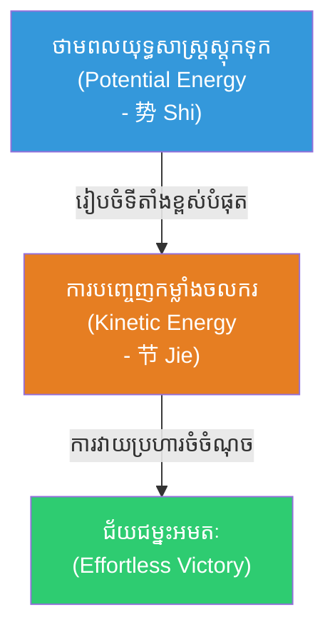
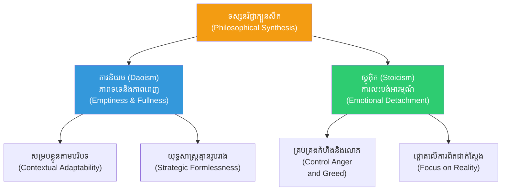
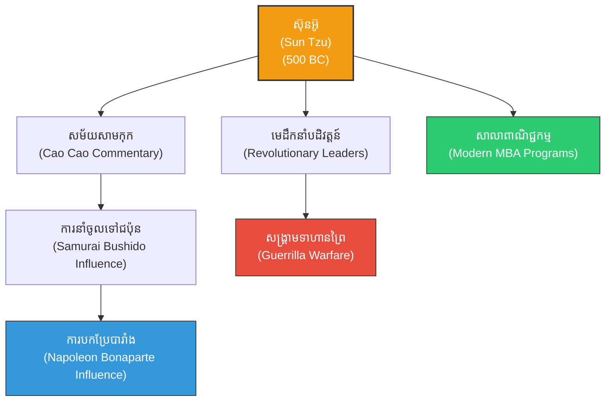

# The Art of War (សិល្បៈនៃសង្គ្រាម៖ សៀវភៅយុទ្ធសាស្ត្រយោធាដ៏មានឥទ្ធិពលបំផុតក្នុងប្រវត្តិសាស្ត្រមនុស្សជាតិ)

**Author:** ichamrong  
**Date:** 2026-05-27  
**Tags:** #artofwar #suntzu #strategy #military #philosophy #classics #leadership #psychology #daoism #stoicism #analytics  
**Category:** Biographies / Related / Classics  
**Read Time:** ~35 min  

---

## 📌 មាតិកា (Table of Contents)
- [សេចក្តីផ្តើម៖ ឥទ្ធិពលពីរពាន់ឆ្នាំនៃក្បួនសឹកអមតៈ (Introduction: Two Millennia of the Immortal Treatise)](#intro)
- [១. រចនាសម្ព័ន្ធ និងជំពូកទាំង ១៣ នៃក្បួនសឹក (Structure & The 13 Chapters)](#13-chapters)
- [២. ម៉ាទ្រីសព្យាករណ៍យុទ្ធសាស្ត្រ៖ កត្តា ៥ និងការប្រៀបធៀប ៧ (The Predictive Matrix: The 5 Factors & 7 Comparisons)](#predictive-matrix)
- [៣. យន្តការរូបវិទ្យានៃ *Shi* (势)៖ ថាមពលយុទ្ធសាស្ត្រ និងកម្លាំងចលករ (The Physics of *Shi*: Potential & Kinetic Power)](#physics-shi)
- [៤. ភាសាវិទ្យានៃ "Ji" (计)៖ ការគណនាប្រព័ន្ធ ធៀបនឹង កលល្បិច (The Linguistic Paradox of *Ji*: System Auditing vs. Tactics)](#linguistic-ji)
- [៥. ម៉ាទ្រីសយល់ដឹង និងទស្សនវិជ្ជា ១៣ ជំពូក (The 13-Chapter Cognitive-Philosophical Blueprint)](#cognitive-blueprint)
- [៦. គោលការណ៍ទស្សនវិជ្ជាស្នូល៖ ការរួបរួមគ្នារវាងតាវនិយម និងស្តូអ៊ិក (Core Philosophical Synthesis: Daoism & Stoicism)](#core-principles)
- [៧. វិទ្យាសាស្ត្រយល់ដឹង៖ ចិត្តសាស្ត្រនៃការគណនា និងលំអៀងផ្លូវចិត្ត (Cognitive Science: Calculations & Cognitive Biases)](#cognitive-science)
- [៨. ការអនុវត្តក្នុងយុគសម័យទំនើប (Modern Applications)](#modern-applications)
- [៩. ភាពផ្ទុយគ្នា និងការរិះគន់ (Paradoxes & Criticisms)](#paradoxes-criticisms)
- [១០. ឥទ្ធិពលយុទ្ធសាស្ត្រ៖ ពីបុរាណដល់បច្ចុប្បន្ន (Strategic Influence Flow)](#strategic-influence)
- [១១. មគ្គុទ្ទេសក៍ស្វ័យពិចារណាសម្រាប់ថ្នាក់ដឹកនាំ (The Executive Reflection Guide)](#reflection-guide)
- [សេចក្តីសន្និដ្ឋាន៖ សង្គ្រាមដែលគ្មានការបង្ហូរឈាម (Conclusion: The Bloodless War)](#conclusion)
- [🔗 ឯកសារទាក់ទង (Related Topics)](#related-topics)
- [ឯកសារយោង (References)](#references)

---

## សេចក្តីផ្តើម៖ ឥទ្ធិពលពីរពាន់ឆ្នាំនៃក្បួនសឹកអមតៈ (Introduction: Two Millennia of the Immortal Treatise)

> **«សិល្បៈកំពូលនៃសង្គ្រាម គឺការកម្ចាត់សត្រូវដោយមិនបាច់ប្រយុទ្ធ។» — ស៊ុន អ៊ូ**  
> *(“The supreme art of war is to subdue the enemy without fighting.” — Sun Tzu)*

សៀវភៅ **«The Art of War»** ឬដែលត្រូវបានគេស្គាល់ជាភាសាខ្មែរថា **«ក្បួនសឹកស៊ុនអ៊ូ» (孙子兵法 - Sūn Zǐ Bīng Fǎ)** គឺជាសៀវភៅយុទ្ធសាស្ត្រយោធាបុរាណរបស់ចិន ដែលមានអាយុកាលជាង ២,៥០០ ឆ្នាំ។ សរសេរឡើងដោយមេទ័ព និងអ្នកយុទ្ធសាស្ត្រដ៏ល្បីល្បាញ **ស៊ុន អ៊ូ (Sun Tzu)** ក្នុងកំឡុងសម័យកាលនិទាឃរដូវនិងសរទរដូវ (Spring and Autumn Period) សៀវភៅនេះមិនមែនគ្រាន់តែជាក្បួនណែនាំអំពីរបៀបរៀបចំក្បួនទ័ព ឬការកាន់អាវុធកាប់សម្លាប់គ្នានោះទេ ប៉ុន្តែវាគឺជាសន្ធិសញ្ញាទស្សនវិជ្ជា និងចិត្តសាស្ត្រដ៏ស៊ីជម្រៅបំផុតអំពីការគ្រប់គ្រងជម្លោះ ជ័យជម្នះ និងការរស់រានមានជីវិត។

ទោះបីជាពិភពលោកបានផ្លាស់ប្តូរពីសមរភូមិរទេះសេះ និងលំពែង មកជាសមរភូមិនយោបាយ អាជីវកម្ម សន្តិសុខបច្ចេកវិទ្យា និងការប្រកួតប្រជែងសកលក៏ដោយ ក៏ទ្រឹស្តីរបស់ស៊ុនអ៊ូនៅតែមានតម្លៃមិនអាចកាត់ថ្លៃបាន។ សៀវភៅតូចមួយនេះត្រូវបានបកប្រែជាភាសារាប់សិប និងក្លាយជាមគ្គុទ្ទេសក៍ដកដង្ហើមធំរបស់មេដឹកនាំពិភពលោក មេទ័ពធំៗ និងនាយកប្រតិបត្តិក្រុមហ៊ុនលំដាប់ពិភពលោក។

---

## ១. រចនាសម្ព័ន្ធ និងជំពូកទាំង ១៣ នៃក្បួនសឹក (Structure & The 13 Chapters)

ក្បួនសឹកស៊ុនអ៊ូត្រូវបានបែងចែកជា **១៣ ជំពូក (13 Chapters)** ដែលជំពូកនីមួយៗផ្តោតលើទិដ្ឋភាពជាក់លាក់នៃយុទ្ធសាស្ត្រ និងសេដ្ឋកិច្ចសង្គ្រាម៖

### ជំពូកទី ១៖ ការគណនា និងការរៀបចំផែនការ (Detail Assessment and Planning / 始計)
មុននឹងចាប់ផ្តើមធ្វើសង្គ្រាម ត្រូវធ្វើការវាយតម្លៃលើកត្តាគ្រឹះទាំង ៥ (The Five Factors)៖ គុណធម៌ អាកាសធាតុ ភូមិសាស្ត្រ មេដឹកនាំ និងច្បាប់វិន័យ។
> [!IMPORTANT]
> **មេរៀនគ្រឹះ៖** «ការឈ្នះចាប់ផ្តើមឡើងពីការគណនាដ៏ល្អិតល្អន់នៅក្នុងបន្ទប់ផែនការ មុនពេលទាហានម្នាក់ឈានជើងចូលសមរភូមិ។»

### ជំពូកទី ២៖ ការធ្វើសង្គ្រាម (Waging War / 作戰)
សង្គ្រាមគឺជាការបំផ្លាញធនធានសេដ្ឋកិច្ច។ ស៊ុនអ៊ូយល់យ៉ាងច្បាស់ថា សង្គ្រាមដែលអូសបន្លាយយូរអង្វែង នឹងធ្វើឱ្យរដ្ឋវិនាសហិនហោច ទោះជាឈ្នះក៏ដោយ។ 
> [!TIP]
> **គន្លឹះយុទ្ធសាស្ត្រ៖** ត្រូវយកល្បឿនជាធំ និងចិញ្ចឹមកងទ័ពដោយប្រើប្រាស់ធនធានរបស់សត្រូវ (Plundering the enemy) ដើម្បីកាត់បន្ថយការចំណាយរបស់រដ្ឋខ្លួនឯង។

### ជំពូកទី ៣៖ ការវាយប្រហារដោយល្បិចកល (Attack by Stratagem / 謀攻)
ជ័យជម្នះដ៏ល្អបំផុត គឺការវាយបំបែកសម្ព័ន្ធភាពរបស់សត្រូវ និងផែនការរបស់ពួកគេជាមុន។ การវាយប្រហារលើទីក្រុងការពារមាំមួន (Siege warfare) គឺជាជម្រើសចុងក្រោយបង្អស់ ព្រោះវាបំផ្លាញជីវិតមនុស្ស និងពេលវេលាច្រើនហួសហេតុ។

### ជំពូកទី ៤៖ ការចាត់ចែងកម្លាំងទ័ព (Tactical Dispositions / 軍形)
ការការពារធ្វើឱ្យយើងមិនអាចចាញ់ ឯការវាយប្រហារគឺជាឱកាសដើម្បីឈ្នះ។ អ្នកចម្បាំងដែលឆ្លាតវៃ ត្រូវដាក់ខ្លួនឯងនៅក្នុងស្ថានភាពមួយដែលមិនអាចចាញ់បាន ហើយរង់ចាំឱកាសដែលសត្រូវបង្ហាញចំណុចខ្សោយដើម្បីយកឈ្នះ។

### ជំពូកទី ៥៖ ថាមពល និងកម្លាំងចលករ (Use of Energy / 兵勢)
ការដឹកនាំមនុស្សរាប់ម៉ឺននាក់ គឺមិនខុសពីការដឹកនាំមនុស្សពីរបីនាក់នោះទេ វាអាស្រ័យលើការរៀបចំរចនាសម្ព័ន្ធ និងសញ្ញាបញ្ជា។ ស៊ុនអ៊ូបង្រៀនឱ្យប្រើប្រាស់កម្លាំងចំហ (Direct forces) ដើម្បីទប់ទល់ និងកម្លាំងសម្ងាត់ (Indirect forces) ដើម្បីវាយឆ្មក់យកជ័យជម្នះ។

### ជំពូកទី ៦៖ ចំណុចខ្សោយ និងចំណុចខ្លាំង (Weak Points and Strong / 虛實)
យុទ្ធសាស្ត្រកំពូលគឺ «វាយប្រហារកន្លែងដែលទទេ និងជៀសវាងកន្លែងដែលពេញ»។ ត្រូវបង្ខំឱ្យសត្រូវធ្វើដំណើរមកតាមការចង់បានរបស់យើង ធ្វើឱ្យសត្រូវហត់នឿយ ខណៈដែលយើងកំពុងសម្រាក និងរៀបចំកម្លាំងរង់ចាំរួចជាស្រេច។

### ជំពូកទី ៧៖ ការចល័តទ័ព និងការធ្វើសមយុទ្ធ (Maneuvering / 軍爭)
ការប្រជែងគ្នាដើម្បីដណ្តើមយកចំណុចយុទ្ធសាស្ត្រ គឺជាការលំបាកបំផុត។ ត្រូវបង្វែរផ្លូវវាងឱ្យទៅជាផ្លូវវាយប្រហារ និងបង្វែរឧបសគ្គឱ្យទៅជាអត្ថប្រយោជន៍។ ត្រូវមានភាពស្ងៀមស្ងាត់ដូចព្រៃឈើ និងវាយលុកដូចរន្ទះបាញ់។

### ជំពូកទី ៨៖ ភាពបត់បែននៃយុទ្ធសាស្ត្រ (Variation in Tactics / 九變)
មេទ័ពត្រូវតែចេះបត់បែនតាមស្ថានភាពជាក់ស្តែង។ ផ្លូវខ្លះមិនត្រូវដើរ កងទ័ពខ្លះមិនត្រូវវាយប្រហារ ទីក្រុងខ្លះមិនត្រូវឡោមព័ទ្ធ និងបញ្ជារបស់ស្តេចខ្លះក៏មិនត្រូវអនុវត្តដែរ ប្រសិនបើវាដឹកនាំទៅរកមហន្តរាយ។

### ជំពូកទី ៩៖ ការដើរក្បួន និងការបោះជំរំ (The Army on the March / 行軍)
ការសង្កេតស្ថានភាពសត្រូវតាមរយៈសញ្ញាផ្សេងៗ៖ បើបក្សីហើរប្រមូលផ្តុំគ្នា មានន័យថាទីនោះគ្មានមនុស្សទេ បើមានធូលីហុយខ្ពស់ មានន័យថារទេះសឹកកំពុងមកដល់។ ជំពូកនេះបង្រៀនពីការគ្រប់គ្រងទាហានក្នុងស្ថានភាពដីផ្សេងៗគ្នា។

### ជំពូកទី ១០៖ ភូមិសាស្ត្រ និងស្ថានភាពដី (Classification of Terrain / 地形)
ស្ថានភាពដីមាន ៦ ប្រភេទ (Accessible, Entangling, Temporizing, Narrow Passes, Precipitous Heights, Positions at a great distance)។ មេទ័ពត្រូវយល់ដឹងពីរបៀបប្រើប្រាស់ដីនីមួយៗឱ្យមានប្រៀបជាងសត្រូវ។

### ជំពូកទី ១១៖ ស្ថានភាពទាំងប្រាំបួន (The Nine Situations / 九地)
ការពិពណ៌នាអំពីស្ថានភាពផ្លូវចិត្តរបស់ទាហាននៅក្នុងដំណាក់កាលផ្សេងៗគ្នានៃការឈ្លានពាន។ នៅពេលទាហានស្ថិតនៅក្នុង «ដីមរណៈ» (Death Ground) ដែលគ្មានផ្លូវរត់រួច ពួកគេនឹងប្រយុទ្ធរហូតដល់តំណក់ឈាមចុងក្រោយដោយគ្មានភាពភ័យខ្លាចឡើយ។

### ជំពូកទី ១២៖ ការវាយប្រហារដោយភ្លើង (The Attack by Fire / 火攻)
ការប្រើប្រាស់ភ្លើងជាអាវុធបំផ្លាញសម្ភារៈ ស្បៀងអាហារ និងជំរុំសត្រូវ។ ទោះជាយ៉ាងណាក៏ដោយ ស៊ុនអ៊ូបានព្រមានថា៖ «ស្តេចមិនត្រូវធ្វើសង្គ្រាមដោយសារតែកំហឹងមួយពេល ហើយមេទ័ពមិនត្រូវប្រយុទ្ធដោយសារតែអារម្មណ៍ឆេវឆាវនោះឡើយ»。

### ជំពូកទី ១៣៖ ការប្រើប្រាស់ចារបុរស (The Use of Spies / 用間)
ព័ត៌មានវិទ្យា និងចារកម្មគឺជាគន្លឹះដាច់ខាតនៃជ័យជម្នះ។ ត្រូវចំណាយប្រាក់យ៉ាងសន្ធឹកសន្ធាប់ដើម្បីចិញ្ចឹមចារបុរស ព្រោះការដឹងព័ត៌មានមុន ជួយសន្សំសំចៃជីវិតមនុស្សរាប់ម៉ឺននាក់ និងធនធានរដ្ឋយ៉ាងច្រើនលើសលប់។

---

## ២. ម៉ាទ្រីសព្យាករណ៍យុទ្ធសាស្ត្រ៖ កត្តា ៥ និងការប្រៀបធៀប ៧ (The Predictive Matrix: The 5 Factors & 7 Comparisons)

ស៊ុនអ៊ូមិនមែនជាអ្នកទាយសំណាងនោះទេ តែគាត់គឺជាបិតានៃ **ការវិភាគបែបព្យាករណ៍ (Predictive Analytics)**។ នៅក្នុងជំពូកទី ១ គាត់បានបង្កើតប្រព័ន្ធមួយដែលយក **«កត្តាគ្រឹះទាំង ៥» (Wu Shi - 五事)** មកប្រៀបធៀបជា **«សំណួរវាយតម្លៃទាំង ៧» (Qi Ji - 七計)** ដើម្បីវាយតម្លៃរកលទ្ធផលសង្គ្រាមមុនពេលចាប់ផ្តើម៖

| កត្តាគ្រឹះទាំង ៥ (The 5 Factors) | សំណួរវាយតម្លៃទាំង ៧ (The 7 Comparisons) | យន្តការវិភាគព្យាករណ៍ (Predictive Analytics Logic) |
| :--- | :--- | :--- |
| **១. គុណធម៌ (Moral Law/Tao)** | • តើស្តេចអង្គណាដែលទទួលបានការគាំទ្រ និងស្រឡាញ់ដាច់ខាតពីប្រជាជន? | **សាមគ្គីភាព និងការលើកទឹកចិត្តផ្លូវចិត្ត (Morale & Alignment):** ប្រសិនបើអ្នកដឹកនាំ និងថ្នាក់ក្រោមមានទំនុកចិត្ត និងទិសដៅរួមតែមួយ ពួកគេនឹងមិនក្បត់គ្នាឡើយ។ |
| **២. អាកាសធាតុ (Heaven)** | • តើខាងណាដែលមានប្រៀបជាងផ្នែកអាកាសធាតុ យប់ ថ្ងៃ និងរដូវកាល? | **ការសម្របខ្លួនតាមបរិបទធម្មជាតិ (Environmental Context):** ការទាញយកផលប្រយោជន៍ពីអ្វីដែលយើងមិនអាចគ្រប់គ្រងបាន (ដូចជារដូវកាល)。 |
| **៣. ភូមិសាស្ត្រ (Earth)** | • តើខាងណាដែលយល់ដឹង និងមានប្រៀបផ្នែកស្ថានភាពដី ចម្ងាយផ្លូវ និងចំណុចការពារ? | **ការគ្រប់គ្រងទីតាំងយុទ្ធសាស្ត្រ (Spatial Domination):** យល់ដឹងពីចំណុចក្តៅ ច្រកចង្អៀត និងផ្លូវរត់។ |
| **៤. មេដឹកនាំ (The Commander)** | • តើមេទ័ពខាងណាដែលមានបញ្ញា ភាពស្មោះត្រង់ មេត្តាធម៌ ភាពក្លាហាន និងវិន័យជាង? | **គុណសម្បត្តិធនធានមនុស្សកំពូល (Leadership Quality):** សមត្ថភាពដឹកនាំ និងដោះស្រាយវិបត្តិដោយស្ងប់ស្ងាត់ (Stoic Leadership)。 |
| **៥. ច្បាប់វិន័យ (Method/Discipline)** | • តើខាងណាដែលមានច្បាប់វិន័យតឹងរ៉ឹង និងការបណ្តុះបណ្តាលទាហានច្បាស់លាស់ជាង? • តើខាងណាដែលមានការចាត់ចែងរចនាសម្ព័ន្ធ និងប្រព័ន្ធភស្តុភារល្អជាង? • តើខាងណាដែលមានការប្រគល់រង្វាន់ និងការដាក់ទណ្ឌកម្មត្រឹមត្រូវជាង? | **ប្រសិទ្ធភាពប្រព័ន្ធការងារ (Systemic Efficiency):** វិន័យដាច់ខាត ការចែកចាយធនធាន និងការគ្រប់គ្រងស្វ័យភាពដោយគ្មានភាពលំអៀង។ |

> [!TIP]
> **សន្និដ្ឋានយុទ្ធសាស្ត្រ៖** ប្រសិនបើអ្នកគណនាពិន្ទុលើសំណួរទាំង ៧ នេះឃើញថាគូប្រជែងមានប្រៀបជាង យុទ្ធសាស្ត្រដែលឆ្លាតវៃបំផុតគឺ **«មិនត្រូវចូលរួមក្នុងជម្លោះឡើយ»**។

---

## ៣. យន្តការរូបវិទ្យានៃ *Shi* (势)៖ ថាមពលយុទ្ធសាស្ត្រ និងកម្លាំងចលករ (The Physics of *Shi*: Potential & Kinetic Power)

ពាក្យថា **Shi (势)** នៅក្នុងភាសាចិនបុរាណ មិនមានពាក្យបកប្រែចំនៅក្នុងភាសាអង់គ្លេស ឬខ្មែរឡើយ ប៉ុន្តែវាអាចពន្យល់បានយ៉ាងល្អបំផុតតាមរយៈ **រូបវិទ្យានៃថាមពល (Physics of Energy)**៖

### ក. ថាមពលស្តុកទុក ធៀបនឹង កម្លាំងចលករ (Potential vs. Kinetic Energy)
*   **势 (Shi) - Potential Energy:** ប្រៀបដូចជាការរុញផ្ទាំងថ្មមូលដ៏ធំមួយឡើងទៅលើកំពូលភ្នំខ្ពស់ ១០,០០០ ហ្វីត។ ការរៀបចំ «ទីតាំងយុទ្ធសាស្ត្រ» (Strategic Positioning) នេះទាមទារការគិតគូរវែងឆ្ងាយ និងការអត់ធ្មត់។
*   **节 (Jie) - Kinetic Energy:** ប្រៀបដូចជាការទម្លាក់ផ្ទាំងថ្មនោះឱ្យរមៀលចុះមកក្រោម។ កម្លាំងចលករដែលកើតឡើងគឺរហ័ស ខ្លាំងក្លា និងមិនអាចទប់ទល់បាន (ដូចជាការបាញ់ព្រួញដែលត្រូវដោះកន្លាស់)。

### ខ. ការគ្រប់គ្រងលំហូរនៃសន្ទុះ (Flow and Momentum)
អ្នកដឹកនាំដែលឆ្លាតវៃ មិនប្រើកម្លាំងបាយបញ្ជាទាហានឱ្យប្រយុទ្ធដោយគ្មាន *Shi* ឡើយ។ ពួកគេរៀបចំស្ថានភាព និងបរិយាកាស (Ecosystem setup) ធ្វើឱ្យសត្រូវធ្លាក់ចូលក្នុងស្ថានភាពជៀសមិនរួច ហើយចុះចាញ់ដោយស្វ័យប្រវត្តិ។

---

## ៤. ភាសាវិទ្យានៃ "Ji" (计)៖ ការគណនាប្រព័ន្ធ ធៀបនឹង កលល្បិច (The Linguistic Paradox of *Ji*: System Auditing vs. Tactics)

សៀវភៅក្បួនសឹកស៊ុនអ៊ូជំពូកទី ១ ត្រូវបានគេបកប្រែជាភាសាអង់គ្លេសជាទូទៅថា **«Laying Plans»** ឬ **«Stratagems»** (កលល្បិច)។ ប៉ុន្តែ តាមភាសាវិទ្យាចិនបុរាណ៖

*   **តួអក្សរ «计» (Jì):** មិនមែនមានន័យថា «ល្បិចកុហក» នោះទេ ប៉ុន្តែវាមានន័យត្រង់ថា **«ការគណនា ការរាប់ ការធ្វើសវនកម្មប្រព័ន្ធ» (To calculate, to audit, quantitative modeling)**។
*   **System Auditing (ការវិភាគប្រព័ន្ធ):** ជំពូកទី ១ គឺជាការធ្វើសវនកម្មលើធនធានផ្ទៃក្នុងរបស់ខ្លួនឯង និងគូប្រជែង ដើម្បីដឹងពីការពិតជាក់ស្តែង (Ground Truth)。
*   **Deception as a Sub-system:** យុទ្ធសាស្ត្របោកបញ្ឆោត (Deception) គ្រាន់តែជាឧបករណ៍មួយដែលយកទៅ «បង្វែរ ឬបំផ្លាញប្រព័ន្ធគណនារបស់សត្រូវ» ប៉ុណ្ណោះ។ នៅពេលសត្រូវទទួលបានទិន្នន័យខុស (False Input) ពួកគេនឹងគណនាខុស (Wrong Output) ហើយដើរចូលអន្ទាក់របស់យើង។

---

## ៥. ម៉ាទ្រីសយល់ដឹង និងទស្សនវិជ្ជា ១៣ ជំពូក (The 13-Chapter Cognitive-Philosophical Blueprint)

ដើម្បីយល់ដឹងពីក្បួនសឹកស៊ុនអ៊ូជា «ប្រព័ន្ធគិតវិទ្យាសាស្ត្រ» នេះជាម៉ាទ្រីសបង្ហាញពីទំនាក់ទំនងរវាង ជំពូក យន្តការចិត្តសាស្ត្រ និងទស្សនវិជ្ជាស្នូល៖

| ជំពូក និងខ្លឹមសារ (Chapter & Core) | យន្តការចិត្តសាស្ត្រ (Psychological Mechanism) | លំអៀងផ្លូវចិត្តដែលត្រូវកេងប្រវ័ញ្ច (Cognitive Bias) | គ្រឹះទស្សនវិជ្ជាស្នូល (Philosophical Base) |
| :--- | :--- | :--- | :--- |
| **១. ការរៀបចំផែនការ (Planning)** | ការវាយតម្លៃទិន្នន័យប្រព័ន្ធ ([Quantitative Auditing](../../../articles/73-quantitative-auditing.md)) | **Overconfidence Bias:** ការកាត់បន្ថយភាពជឿជាក់ហួសហេតុដោយប្រើទិន្នន័យជាក់ស្តែង។ | **ច្បាប់និយម (Legalism):** វាយតម្លៃលើប្រព័ន្ធ និងច្បាប់វិន័យ។ |
| **២. ការធ្វើសង្គ្រាម (Waging War)** | ការគ្រប់គ្រងធនធាន និងភាពតានតឹងផ្លូវចិត្ត ([Stress Minimization](../../../articles/74-stress-minimization.md)) | **Sunk Cost Fallacy:** ជៀសវាងការបន្តសង្គ្រាមគ្រាន់តែដោយសារតែស្តាយលុយ ឬជីវិតដែលបាត់បង់។ | **តាវនិយម (Daoism):** การរក្សាថាមពលជីវិត និងល្បឿនសម្របខ្លួន។ |
| **៣. ល្បិចវាយប្រហារ (Stratagem)** | ការវាយប្រហារលើផែនការ និងការគិតរបស់សត្រូវ (Cognitive Attack) | **Loss Aversion:** ការបំភ័យសត្រូវឱ្យខ្លាចបាត់បង់អត្ថប្រយោជន៍ ដើម្បីបង្ខំឱ្យពួកគេដកថយ។ | **តាវនិយម (Daoism):** ជ័យជម្នះដ៏ល្អបំផុត គឺឈ្នះដោយមិនបាច់បំផ្លាញ។ |
| **៤. ការចាត់ចែងទ័ព (Tactical Dispositions)** | ភាពស្ងប់ស្ងៀម និងការការពារខ្លួនឱ្យមានស្ថិរភាព (Tranquility) | **Availability Heuristic:** ការធ្វើខ្លួនឱ្យគ្មានព័ត៌មានលេចធ្លាយ ដើម្បីការពារកុំឱ្យសត្រូវវាយតម្លៃយើងខុស។ | **ស្តូអ៊ិក (Stoicism):** ផ្តោតលើអ្វីដែលខ្លួនអាចគ្រប់គ្រងបាន (ការការពារខ្លួន)。 |
| **៥. ថាមពលចលករ (Use of Energy)** | ការរៀបចំសន្ទុះយុទ្ធសាស្ត្រ ([Momentum Engineering](../../../articles/76-momentum-engineering.md)) | **Focalism Bias:** ការទាក់ទាញចំណាប់អារម្មណ៍សត្រូវទៅលើកម្លាំងចំហ ដើម្បីវាយលុកដោយកម្លាំងសម្ងាត់។ | **យិនយ៉ាង (Yin-Yang):** การបំប្លែងកម្លាំងចំហ និងសម្ងាត់ឥតឈប់ឈរ។ |
| **៦. ចំណុចខ្សោយ និងខ្លាំង (Weak & Strong)** | ភាពទទេ និងភាពពេញនៃចំណាប់អារម្មណ៍ (Attention Economy) | **Selective Attention Bias:** ការបង្ខំឱ្យសត្រូវផ្តោតអារម្មណ៍ខុសកន្លែង ទុកឱ្យកន្លែងពិតប្រាកដគ្មានការការពារ។ | **តាវនិយម (Daoism):** ភាពបត់បែនដូចទឹក ជៀសពេញ វាយទទេ (Xu/Shi)。 |
| **៧. ការចល័តទ័ព (Maneuvering)** | ការផ្លាស់ប្តូរឧបសគ្គឱ្យទៅជាឱកាស (Reframing) | **Framing Effect:** ការរៀបចំចិត្តសាស្ត្រទាហានឱ្យមើលឃើញភាពលំបាកជាអត្ថប្រយោជន៍។ | **ស្តូអ៊ិក (Stoicism):** «ឧបសគ្គគឺជាផ្លូវដើរ» (The obstacle is the way)。 |
| **៨. ភាពបត់បែន (Variation in Tactics)** | ភាពបត់បែនមិនប្រកាន់តឹងយុទ្ធសាស្ត្រ ([Cognitive Flexibility](../../../articles/75-cognitive-flexibility.md)) | **Functional Fixedness:** ការលុបបំបាត់ការជាប់ជំពាក់នឹងវិធីសាស្ត្រចាស់ៗ។ | **តាវនិយម (Daoism):** គ្មានច្បាប់យុទ្ធសាស្ត្រណាដែលមិនប្រែប្រួលឡើយ។ |
| **៩. ការដើរក្បួន (Army on March)** | ការសង្កេត និងបកស្រាយសញ្ញាផ្លូវចិត្ត (Signal Detection) | **Confirmation Bias:** ការពារខ្លួនកុំឱ្យបកស្រាយសញ្ញារបស់សត្រូវ តាមតែចិត្តចង់បានរបស់ខ្លួន។ | **វិទ្យាសាស្ត្រសង្កេត (Empiricism):** การប្រមូលទិន្នន័យជាក់ស្តែងពីឥរិយាបថសត្រូវ។ |
| **១០. ភូមិសាស្ត្រ (Terrain)** | ការយល់ដឹងពីដែនកំណត់ស្ថានភាព (Contextual Awareness) | **Bounded Rationality:** ការទទួលស្គាល់ថាការសម្រេចចិត្តគឺស្ថិតក្រោមដែនកំណត់នៃស្ថានភាពដី។ | **ច្បាប់ធម្មជាតិ (Naturalism):** គោរពច្បាប់រូបវន្តនៃបរិស្ថាន។ |
| **១១. ស្ថានភាពទាំងប្រាំបួន (9 Situations)** | การគ្រប់គ្រងចិត្តសាស្ត្រចុងក្រោយ (Survival Mode) | **Loss Aversion as Catalyst:** ការដាក់ទាហានទៅ «ដីមរណៈ» ដើម្បីដោះសោសក្តានុពលប្រយុទ្ធអតិបរមា។ | **ច្បាប់និយម (Legalism):** การគ្រប់គ្រងឥរិយាបថមនុស្សតាមរយៈស្ថានភាពបង្ខំ។ |
| **១២. វាយប្រហារដោយភ្លើង (Attack by Fire)** | យុទ្ធសាស្ត្របំផ្លាញទ្រង់ទ្រាយធំ និងការទប់ចិត្ត (Restraint) | **Emotional Reactivity:** ទប់ស្កាត់កំហឹងមួយពេលរបស់មេដឹកនាំ ដើម្បីបញ្ចៀសវិនាសកម្មរដ្ឋ។ | **ស្តូអ៊ិក (Stoicism):** การគ្រប់គ្រងអារម្មណ៍ឆេវឆាវដាច់ខាត។ |
| **១៣. ការប្រើប្រាស់ចារបុរស (Use of Spies)** | ការគ្រប់គ្រងព័ត៌មានអសមកាល ([Information Asymmetry](../../../articles/77-information-asymmetry.md)) | **Illusion of Knowledge:** បំផ្លាញជំនឿចិត្តខុសរបស់សត្រូវ ដោយការបញ្ជូនព័ត៌មានក្លែងក្លាយតាមចារបុរស។ | **បដិសេធនិយម (Epistemology):** សួរដេញដោលរាល់ប្រភពព័ត៌មានដើម្បីស្វែងរកការពិត។ |

---

## ៦. គោលការណ៍ទស្សនវិជ្ជាស្នូល៖ ការរួបរួមគ្នារវាងតាវនិយម និងស្តូអ៊ិក (Core Philosophical Synthesis: Daoism & Stoicism)

🏛️ [គ្រឹះទស្សនវិជ្ជា] / [Philosophical Core] - ទស្សនវិជ្ជារបស់ស៊ុនអ៊ូ មិនមែនផ្អែកលើអំណាចកម្លាំងបាយនោះទេ តែវាផ្អែកលើច្បាប់ធម្មជាតិ និងការគ្រប់គ្រងស្មារតីខ្លួនឯង៖

### ក. តាវនិយម៖ ភាពទទេ និងភាពពេញ (Daoist Emptiness vs. Fullness - *Xu* & *Shi*)
*   **ភាពទទេ និងពេញ (Xu & Shi - 虚实):** *«នៅក្នុងសមរភូមិ ត្រូវចៀសវាងកន្លែងដែលពេញ (កន្លែងដែលសត្រូវការពារមាំមួន) ហើយវាយប្រហារកន្លែងដែលទទេ (កន្លែងដែលសត្រូវធ្វេសប្រហែស)»*。 នេះជាការដើរតាមច្បាប់ធម្មជាតិ ដូចជាទឹកដែលតែងតែហូរចៀសពីទីខ្ពស់ (ពេញ) ទៅរកទីទាប (ទទេ)。
*   **ភាពគ្មានរូបរាង (Formlessness - 无形):** *«យុទ្ធសាស្ត្រកំពូល គឺកុំឱ្យសត្រូវមើលឃើញរូបរាងពិតរបស់យើង»*。 បើសត្រូវមិនដឹងពីផែនការរបស់យើង ពួកគេនឹងត្រូវបង្ខំចិត្តបែងចែកកម្លាំងការពារនៅគ្រប់ទិសទី ដែលធ្វើឱ្យកម្លាំងរបស់ពួកគេចុះខ្សោយ។

### ខ. ស្តូអ៊ិកនិយម៖ การគ្រប់គ្រងអារម្មណ៍ដាច់ខាត (Stoic Emotional Discipline)
*   **ការបដិសេធអារម្មណ៍ (Detachment from Ego):** ស៊ុនអ៊ូបានព្រមានយ៉ាងតឹងរ៉ឹងថា៖ *«មេទ័ពមិនត្រូវប្រយុទ្ធដើម្បីកេរ្តិ៍ឈ្មោះ ឬកិត្តិយសខ្លួនឯងឡើយ ហើយក៏មិនត្រូវដកថយដោយសារខ្លាចការខ្មាសអៀនដែរ»*。 រាល់ការសម្រេចចិត្តត្រូវតែមានលក្ខណៈវិទ្យាសាស្ត្រ និងទាក់ទងនឹងផលប្រយោជន៍រួមរបស់រដ្ឋ។
*   **ការទទួលយកការពិត (Objective Reality):** ត្រូវមើលស្ថានភាពយុទ្ធសាស្ត្រតាមការពិតជាក់ស្តែង មិនមែនតាមការចង់បាន ឬការស្រមើស្រមៃរបស់ខ្លួនឯងនោះឡើយ។

---

## ៧. វិទ្យាសាស្ត្រយល់ដឹង៖ ចិត្តសាស្ត្រនៃការគណនា និងលំអៀងផ្លូវចិត្ត (Cognitive Science: Calculations & Cognitive Biases)

🧠 [យន្តការចិត្តសាស្ត្រ] / [Psychological Mechanism] - ស៊ុនអ៊ូគឺជាអ្នកដំបូងបង្អស់ដែលបានបង្កើត **«ប្រព័ន្ធចិត្តសាស្ត្រយល់ដឹង» (Cognitive Warfare System)** ក្នុងការប្រយុទ្ធ៖

### ក. การកេងប្រវ័ញ្ចលើលំអៀងនៃការបញ្ជាក់ (Exploiting Confirmation Bias)
ขួរក្បាលរបស់មនុស្សមានទំនោរជឿជាក់លើអ្វីដែលខ្លួនចង់ជឿស្រាប់។ ស៊ុនអ៊ូបានយកចំណុចខ្សោយនេះមកបង្កើតជាយុទ្ធសាស្ត្របោកបញ្ឆោត៖
> **«ពេលខ្លាំង ត្រូវធ្វើពុតជាខ្សោយ ដើម្បីឱ្យសត្រូវមានចិត្តក្រអឺតក្រទម និងមើលស្រាលយើង»**
នៅពេលយើងបង្ហាញសញ្ញាខ្សោយ មេទ័ពសត្រូវដែលលោភលន់នឹងជឿភ្លាមៗដោយគ្មានការសង្ស័យ ព្រោះវាស្របទៅនឹងការចង់បានរបស់ពួកគេ (Confirmation Bias) ដែលនាំឱ្យពួកគេដើរចូលអន្ទាក់របស់យើង។

### ខ. การប្រើប្រាស់ «ដីមរណៈ» ដើម្បីជម្រុញចិត្តសាស្ត្ររស់រានមានជីវិត (The Psychology of Death Ground)
នៅក្នុងជំពូកទី ១១ ស៊ុនអ៊ូបានលើកឡើងពីយុទ្ធសាស្ត្រដាក់ទាហានទៅក្នុង **«ដីមរណៈ» (Death Ground / 投之亡地)**៖
*   **យន្តការផ្លូវចិត្ត (Psychological Mechanism):** នៅពេលមនុស្សដឹងថាខ្លួនមានផ្លូវរត់រួច ពួកគេនឹងគិតពីការរត់គេចខ្លួន (Loss Aversion)。 ប៉ុន្តែនៅពេលដែលគ្មានផ្លូវថយក្រោយ ខួរក្បាលនឹងប្តូរទៅជាការវាយប្រហារដើម្បីរស់រាន (Fight-or-Flight instinct)。
*   **លទ្ធផល (Result):** ស្មារតីរបស់កងទ័ពនឹងរួបរួមគ្នាជាធ្លុងមួយភ្លាមៗ ហើយកម្លាំងប្រយុទ្ធរបស់ពួកគេនឹងកើនឡើងជាច្រើនដង ដែលអាចយកឈ្នះកងទ័ពសត្រូវដែលមានចំនួនច្រើនជាងបាន។

---

## ៨. ការអនុវត្តក្នុងយុគសម័យទំនើប (Modern Applications)

🚀 [មេរៀនអនុវត្ត] / [Practical Application] - ទោះបីជាត្រូវបានសរសេរសម្រាប់យោធាបុរាណ ក៏គោលការណ៍របស់ស៊ុនអ៊ូត្រូវបានយកទៅអនុវត្តយ៉ាងទូលំទូលាយក្នុងវិស័យផ្សេងៗ៖

| វិស័យ (Domain) | គោលការណ៍ស៊ុនអ៊ូ (Sun Tzu's Principle) | ការអនុវត្តជាក់ស្តែង (Practical Application) |
| :--- | :--- | :--- |
| **ធុរកិច្ច & ទីផ្សារ (Business & Marketing)** | *«ជៀសវាងកន្លែងខ្លាំង វាយប្រហារកន្លែងខ្សោយ»* | **យុទ្ធសាស្ត្រមហាសមុទ្រខៀវ (Blue Ocean Strategy):** បង្កើតទីផ្សារថ្មីដែលគ្មានគូប្រជែង ជៀសវាងការប្រកួតប្រជែងតម្លៃដ៏ឃោរឃៅ។ |
| **ការគ្រប់គ្រង (Management)** | *«ការគ្រប់គ្រងមនុស្សច្រើន គឺដូចជាការគ្រប់គ្រងមនុស្សតិចដែរ»* | **រចនាសម្ព័ន្ធវិមជ្ឈការ (Decentralization):** ការបង្កើតក្រុមការងារតូចៗដែលមានស្វ័យភាពខ្ពស់ ប៉ុន្តែមានគោលដៅរួមច្បាស់លាស់។ |
| **សន្តិសុខបច្ចេកវិទ្យា (Cybersecurity)** | *«ដឹងពីខ្លួនឯង ដឹងពីសត្រូវ»* | **ការធ្វើតេស្តសន្តិសុខ (Penetration Testing):** ការយល់ដឹងពីប្រព័ន្ធការពារខ្លួនឯង និងរបៀបវាយប្រហាររបស់ Hacker ដើម្បីការពារហានិភ័យ។ |
| **កីឡា & eSports (Sports & Gaming)** | *«បង្កើតការយល់ច្រឡំដល់សត្រូវ»* | **យុទ្ធសាស្ត្រល្បិច (Tactical Deception):** การប្រើល្បិចបោកបញ្ឆោតក្នុងការប្រកួតកីឡា ឬហ្គេមយុទ្ធសាស្ត្រដើម្បីបំបែកការការពាររបស់គូប្រកួត។ |

---

## ៩. ភាពផ្ទុយគ្នា និងការរិះគន់ (Paradoxes & Criticisms)

> [!WARNING]
> **⚠️ [ភាពផ្ទុយគ្នា និងការរិះគន់] / [Paradoxes & Criticisms]**
> *   **កង្វះសីលធម៌ និងទំនុកចិត្ត (Morality vs. Trust):** សង្គ្រាមផ្លូវចិត្តផ្អែកលើការកុហក និងបោកប្រាស់។ ប្រសិនបើប្រើល្បិចបោកបញ្ឆោតគ្រប់ពេលក្នុងពិភពជំនួញសម័យទំនើប វានឹងបំផ្លាញទំនុកចិត្ត (Trust) ដែលជាគ្រឹះនៃទំនាក់ទំនងដៃគូទាំងអស់។
> *   **យុទ្ធសាស្ត្ររយៈពេលខ្លី ធៀបនឹងរយៈពេលវែង (Short-term Strategy vs. Long-term Harmony):** ល្បិចកលអាចជួយឱ្យឈ្នះសមរភូមិលឿន ប៉ុន្តែការកសាងមហាអំណាច ឬអាជីវកម្មដែលមានស្ថិរភាពយូរអង្វែង ត្រូវការតម្លាភាព គុណធម៌ និងកិច្ចសហការដែលក្បួនសឹករបស់ស៊ុនអ៊ូមិនបានសង្កត់ធ្ងន់ខ្លាំងឡើយ។

---

## ១០. ឥទ្ធិពលយុទ្ធសាស្ត្រ៖ ពីបុរាណដល់បច្ចុប្បន្ន (Strategic Influence Flow)

---

## ១១. មគ្គុទ្ទេសក៍ស្វ័យពិចារណាសម្រាប់ថ្នាក់ដឹកនាំ (The Executive Reflection Guide)

ដើម្បីយកក្បួនសឹកស៊ុនអ៊ូមកអនុវត្តក្នុងជីវិតពិត ជំនួញ ឬការបង្កើតកម្មវិធីកុំព្យូទ័រ (Software Engineering) សូមសួរខ្លួនឯងនូវសំណួរទាំង ៥ នេះ៖

1.  **តើអ្វីជា «ដីមរណៈ» (Death Ground) នៅក្នុងគម្រោងការងាររបស់អ្នក?**
    *   *ឆ្លុះបញ្ចាំង៖* តើអ្នកធ្លាប់បង្កើតការប្តេជ្ញាចិត្តដាច់ខាត (ដូចជាការកំណត់កាលបរិច្ឆេទប្រកាសផលិតផលជាសាធារណៈ) ដើម្បីបង្ខំឱ្យក្រុមការងារលុបបំបាត់ភាពស្ទាក់ស្ទើរ និងផ្តោតអារម្មណ៍ ១០០% ដែរឬទេ?
2.  **តើបច្ចេកវិទ្យា ឬយុទ្ធសាស្ត្ររបស់អ្នកកំពុងដើរតាម «សង្គ្រាមអូសបន្លាយ» (Prolonged Warfare) ដែរឬទេ?**
    *   *ឆ្លុះបញ្ចាំង៖* ប្រសិនបើគម្រោងមួយចំណាយពេលយូរពេកដោយមិនទទួលបានលទ្ធផលជាក់ស្តែង (ទាក់ទងនឹង Technical Debt ឬការចំណាយឥតឈប់) តើអ្នកមានភាពក្លាហានបែបស្តូអ៊ិកក្នុងការកាត់បន្ថយការខាតបង់ (Sunken Cost) ហើយបត់បែនភ្លាមៗដែរឬទេ?
3.  **តើអ្នកកំពុងបង្កើតយុទ្ធសាស្ត្រ «មហាសមុទ្រខៀវ» (Blue Ocean) តាមបែប «ជៀសពេញ វាយទទេ» យ៉ាងដូចម្តេច?**
    *   *ឆ្លុះបញ្ចាំង៖* តើផលិតផលរបស់អ្នកកំពុងព្យាយាមប្រកួតប្រជែងជាមួយក្រុមហ៊ុនយក្សត្រង់ចំណុចខ្លាំងរបស់គេ ឬអ្នកកំពុងស្វែងរកចំណុចធ្វេសប្រហែស (Emptiness/Xu) របស់គូប្រជែងដើម្បីបង្កើតទីផ្សារថ្មី?
4.  **តើអត្មា (Ego) របស់អ្នកដឹកនាំ កំពុងបំផ្លាញវិន័យរួមរបស់ប្រព័ន្ធការងារដែរឬទេ?**
    *   *ឆ្លុះបញ្ចាំង៖* តើការសម្រេចចិត្តចុងក្រោយរបស់អ្នកធ្វើឡើងដោយផ្អែកលើការចង់បានការសរសើរ (Pride) ឬផ្អែកលើ «ការគណនាប្រព័ន្ធជាក់ស្តែង» (Ji - 计)?
5.  **តើប្រព័ន្ធការងាររបស់អ្នកដំណើរការយ៉ាងដូចម្តេច នៅពេលគ្មានវត្តមានរបស់អ្នក?**
    *   *ឆ្លុះបញ្ចាំង៖* តើអ្នកបានកសាងប្រព័ន្ធការងារដែលផ្តល់ស្វ័យភាព និងសុវត្ថិភាពផ្លូវចិត្ត (Psychological Safety) ដល់ថ្នាក់ក្រោម រហូតដល់ពួកគេអាចសម្រេចជោគជ័យហើយនិយាយថា៖ «យើងបានធ្វើវាដោយខ្លួនឯង!» ដែរឬទេ?

---

## សេចក្តីសន្និដ្ឋាន៖ សង្គ្រាមដែលគ្មានការបង្ហូរឈាម (Conclusion: The Bloodless War)

> **«អ្នកចម្បាំងដែលឈ្នះ គឺឈ្នះនៅក្នុងចិត្តមុននឹងចុះទៅសមរភូមិ ឯអ្នកចម្បាំងដែលចាញ់ គឺចុះទៅសមរភូមិសិនទើបដើររកវិធីឈ្នះ។» — ស៊ុន អ៊ូ**

ជាចុងក្រោយ អ្វីដែលធ្វើឱ្យសៀវភៅ **«The Art of War»** ក្លាយជាអក្សរសិល្ប៍យុទ្ធសាស្ត្រដ៏មានឥទ្ធិពលបំផុតក្នុងប្រវត្តិសាស្ត្រមនុស្សជាតិ គឺសារៈសំខាន់ដ៏ជ្រាលជ្រៅនៃការយល់ដឹងពី «ចិត្តវិទ្យាមនុស្ស» និង «ការគិតជាប្រព័ន្ធ»。 ស៊ុនអ៊ូមិនមែនចង់ឱ្យយើងស្រឡាញ់សង្គ្រាម ឬសេចក្តីស្លាប់នោះទេ ផ្ទុយទៅវិញ គាត់ចង់ឱ្យយើងដោះស្រាយទំនាស់ដោយការប្រើប្រាស់បញ្ញា ចក្ខុវិស័យ និងការរៀបចំទុកជាមុន។

នៅក្នុងសមរភូមិនៃជីវិតប្រចាំថ្ងៃ ការយល់ដឹងពីចំណុចខ្សោយនិងចំណុចខ្លាំងរបស់ខ្លួនឯង ការចេះបត់បែនតាមកាលៈទេសៈ និងការរក្សាភាពស្ងប់ស្ងៀមដើម្បីដោះស្រាយបញ្ហា គឺជា «សិល្បៈនៃសង្គ្រាម» ដ៏ពិតប្រាកដដែលយើងគ្រប់គ្នាគួររៀនសូត្រពីមេដឹកនាំបុរាណដ៏អស្ចារ្យរូបនេះ។

---

## 🐇 ធ្លាក់ចូលក្នុងរន្ធទន្សាយយុទ្ធសាស្ត្រ (Enter the Strategic Rabbit Hole)
ដើម្បីស្វែងយល់ពីរបៀបដែលទស្សនវិជ្ជាសឹករបស់ស៊ុនអ៊ូ ត្រូវបានយកមកបកស្រាយក្នុងការសម្រេចចិត្តរវាងការសាងសង់ខ្លួនឯង ឬទិញប្រព័ន្ធស្រាប់ (Build vs. Buy) ក្នុងវិស្វកម្មកម្មវិធី សូមបន្តដំណើររុករករបស់អ្នក៖

* 🚀 **[ចាប់ផ្តើមដំណើររុករក (Start the Journey) ➔ Sun Tzu and the Unfought Battle](../../../parables/50-the-unfought-battle.md)**

---

## 🔗 ឯកសារទាក់ទង (Related Topics)
* [ជីវប្រវត្តិ ស៊ុន អ៊ូ (The Biography of Sun Tzu)](../01-sun-tzu-biography.md)
* [យុទ្ធសាស្ត្រវាយឆ្មក់របស់ ម៉ៅ សេទុង (Mao Zedong Guerrilla Strategy)](02-mao-zedong-guerrilla-warfare.md)
* [ជីវប្រវត្តិណាប៉ូឡេអុង (Napoleon Biography)](../../napoleon/01-napoleon-biography.md)
* [ជីវប្រវត្តិខុងជឺ (Confucius Biography)](../../confucius/01-confucius-biography.md)

## ឯកសារយោង (References)
* **The Art of War by Sun Tzu (Lionel Giles Translation)** - The classic English translation of the 13 chapters.
* **Sun Tzu and the Art of Modern Business by Mark McNeilly** - A guide to applying Sun Tzu's principles to business strategies.
* **Dao De Jing by Laozi** - The foundational text of Taoist philosophy illustrating emptiness, flow, and water analogies.
* **The Seven Military Classics of Ancient China by Ralph D. Sawyer** - Detailed translations and explanations of early Chinese strategy texts.
* **Decisive Analytics in Chinese Antiquity** - Explains *Ji* (计) as systemic auditing and prediction.
* **The Physics of Strategic Configurations** - Paper on early Eastern military concepts of *Shi* (势).

---
*Last updated: 2026-05-27*

## Related

- [💡 Concepts README](../../README.md)
- [📚 Main Repository README](../../../../README.md)
- [Developer Habits](../../../developer-habits/README.md)
- [Mental Health & Well-being](../../../mental-health/README.md)
- [Management & SDLC](../../../management/README.md)

